# The "Miscellanies": (Entry Nos. a–z, aa–zz, 1–500)

## Front Matter

<!-- p. ii -->

<!-- p. vii -->

<!-- p. viii -->

### Illustrations

*Frontispiece*Jonathan Edwards' writing desk ("scrutore"), with matching cabinets supporting box shelves.

*Pages*

64 Fig. 1. Details of the first sheet of English GRwr paper in the "Miscellanies," center portions showing the watermark (above) and countermark (below), along with the deckle edges and pattern of chain lines.

124 Fig. 2. Photograph of the first page of the Table to the "Miscellanies," showing Edwards' headnotes, his alphabetical scheme, and the marks left by later transcribers and editors.

162 Fig. 3. Photograph of the first page of the "Miscellanies" text, showing entry nos. a–l.

560–61 Figs. 4–11. Examples of Watermarks in Edwards' Early Manuscripts

563–65 Figs. 12–23. Examples of Edwards' Early Handwriting

568 Figs. 24–29. Examples of Ink Textures in Edwards' Early Manuscripts

<!-- p. ix -->

### Tables

*Pages*

71–721. Watermarks in the Early "Miscellanies" and Sermons through 1732

91–1092. The "Miscellanies" and Chronological Parallels: May 1719–August 1731

1533. "Miscellanies" Entries by Books

156–574. Chronological Order of "Miscellanies" *a*–500

<!-- p. xi -->

### General Editor's Preface

*The Works of Jonathan Edwards* began under the general editorship of Perry Miller in 1957 with Paul Ramsey's edition of *Freedom of the Will*. The following eight volumes, published under the direction of Miller and his successor, John E. Smith, contain most of the remaining treatises that Edwards published himself or that were published soon after his death. With volume 10, *Sermons and Discourses, 1720–1723*, edited by Wilson H. Kimnach, the *Works* entered a new phase in its history. Not only did the Edition acquire a new general editor, but it also began the systematic publication of the vast collection of Edwards' personal manuscripts. Alongside the sermons, the "Miscellanies" constitutes the major body of unpublished manuscript materials, and so this volume marks an important milestone in the edition's history of publication.

Prof. Schafer's edition of the first volume in this series of "Miscellanies" has been long-anticipated. His contributions to the study of Edwards, as epitomized by this volume, are immense. He has been with the edition since its beginning; indeed, his efforts predate the edition, since it was during his work on Edwards' manuscripts as a graduate student in the 1940s that he discovered the significance of the "Miscellanies" and began the arduous task of transcribing them. In the course of his work, he recognized that, in order to integrate the manuscripts fully into Edwards' intellectual biography, it was necessary to establish an accurate chronology of them. This difficult project, the work of several decades, resulted in the chronology from which several past editors have profited and which will be applied in forthcoming volumes of this edition.

An author-centered rather than an editor-centered approach to the texts naturally suits the transition from published treatises to manuscripts, an approach that for forthcoming volumes entails more succinct introductory and annotative apparatus in the interest of presenting more of Edwards' previously inaccessible manuscripts. In so doing, we seek to carry on the mission of this edition as formulated at its beginning. The result, we hope, will be the same that Perry Miller so

<!-- p. xii -->

eloquently identified four decades ago, namely, to "find today a new urgency to confront and reinterpret the historic philosophical and theological cruxes with which Edwards grappled so courageously."

Harry S. Stout

<!-- p. xiii -->

### Note to the Reader

#### Editorial Statement

The text of Jonathan Edwards is reproduced in this Edition as he wrote it in manuscript, or, if he published it himself, as it was printed in the first edition. In order to present this text to modern readers as practically readable, several technical adjustments have been made. Those which can be addressed categorically are as follows:

1. All spelling is regularized and conformed to that of *Webster's Third New International Dictionary*, a step that does not involve much more than removing the "u" from "colour" or "k" from "publick" since Edwards was a good speller, used relatively modern spelling, and generally avoided "y" contractions. His orthographic contractions and abbreviations, such as ampersands, "call'd," and "thems." are spelled out, though pronounced contractions, such as "han't" and "ben't," are retained.

2. There is no regular punctuation in most of Edwards' manuscripts and where it does exist, as in the earliest sermons, it tends to be highly erratic. Editors take into account Edwards' example in punctuation and related matters, but all punctutation is necessarily that of the editor, including paragraph divisions (especially in some notebooks such as the "Miscellanies") and the emphasizing devices of italics and capitalization. Regarding capitalization, pronouns referring to the deity are lowercase except in passages where Edwards confusingly mixes the "he" referring to God with that for man. Here capitalization of pronouns referring to the deity sorts out the references for the reader.

3. Numbered heads designate important structures of argument in Edwards' sermons, notebooks, and treatises. Numbering, including spelled-out numbers, has been regularized and corrected where necessary. Particularly in the manuscript sermon texts, numbering has been clarified by the use of systematic schemes of heads and subheads in accordance with eighteenth-century homiletical form, a practice similar to modern analytical outline form. Thus the series of subordinated head number forms, 1, (1), *1*, a, (a), in the textual exegesis, and

<!-- p. xiv -->

the series, I, *First*, 1, (1), *1*, a, (a), in Doctrine and Application divisions, make it possible to determine sermon head relationships at a glance.

4. Textual intervention to regularize Edwards' citation of Scripture includes the correction of erroneous citation, the regularizing of citation form (including the standardization of book abbreviations), and the completion of quotations which Edwards' textual markings indicate should be completed (as in preaching).

5. Omissions and lacunae in the manuscript text are filled by insertions in square brackets ([   ]); repeated phrases sometimes represented by Edwards with a long dash are inserted in curly brackets ({   }). In all cases of uncertain readings, annotation gives notice of the problem. Markings in the text designate whole word units even when only a few letters are at issue.

6. Minor slips of the pen or obvious typographical errors are corrected without annotation. Also, Edwards' corrections, deletions, and internal shifts of material are observed but not noted unless of substantive interest.

7. Quotations made by the editor from the Bible (AV) and other secondary sources are printed *verbatim ac literatim*. Edwards' quotations from such sources are often rather free but are not corrected and are not annotated as such unless significant omissions or distortions are involved.

Other conditions of textual preparation are related to differences of genre and factors unique to particular texts or manuscripts. For information on such matters please consult the note on the text in each volume or the first volume of each series within the Edition.

The Executive Committee

*The Works of Jonathan Edwards*

#### Acknowledgments

Anything like an adequate account of the various forms of aid and comfort I have received in over forty years of work on Edwards' "Miscellanies" and other manuscripts would fill several pages and amount to name-dropping on a grand scale. That is neither feasible nor desirable at this point. To those who do not appear in this necessarily highly selective note: please rest assured that I hold you also in grateful memory as I write.

Three people were intimately concerned in my decision to attempt an edition of the "Miscellanies." Through Albert C. Outler's generous

<!-- p. xv -->

hospitality I spent a month in 1945 at Sterling Library's Rare Book Room, where I became convinced that that notebook series was indispensable to all future Edwards scholarship. H. Shelton Smith, who had guided my dissertation on Edwards' metaphysics, encouraged me to attempt an edition of the manuscript and gave me much advice and counsel in the early years. Perry Miller confirmed my estimate of the "Miscellanies" by comments in his *Jonathan Edwards* and later incorporated my edition into the *Works*. He and other charter members of the Editorial Committee gave unstintingly of their time by discussing editorial problems with me, reading samples of edited text, and evaluating drafts of introductory chapters: Sydney E. Ahlstrom, David Home, Norman Holmes Pearson, Paul Ramsey, and John E. Smith. After he succeeded Miller as General Editor, John E. Smith continued to offer enthusiastic support by correspondence, conversation, and critical reading of successive versions of the Introduction.

Other editors and members of the Editorial Committee have also patiently listened to my excited reports of discoveries in the manuscripts and shared their own findings, notably Wallace E. Anderson, George S. Claghorn, Stephen J. Stein, and Wilson H. Kimnach, most of whom read all or parts of my later drafts. I also greatly profited from many discussions with John H. Gerstner concerning knotty problems both in Edwards' manuscripts and in Reformed theology. George Claghorn, Douglas J. Elwood, and Kenneth Minkema discovered additional Edwards manuscripts that proved critical for the dating of the "Miscellanies." Many libraries and their personnel have aided my research, for which I am grateful, but I must mention especially the staff of Beinecke Library, who have offered continual support in the most friendly and efficient manner for so long a time.

Financial support for my research has come from several sources. The Duke University Research Council provided funds for microfilm and other supplies and services, as did the Bollingen Foundation through the budget of the Editorial Committee. During 1956–57 I was a John Simon Guggenheim fellow. A faculty fellowship from the American Association of Theological Schools enabled me to spend a semester in 1964–65 as a research fellow at Yale Divinity School, and McCormick Seminary's generous sabbatical leave policy made possible other seasons of concentrated study of the manuscripts. Through Robert W. Lynn, the Lilly Endowment made grants supporting my work. Upon the recommendation of Clyde Holbrook, generous contributions were also made by William Edwards Stevenson and his

<!-- p. xvi -->

grandson, William Edwards Hunt. More recently, grants from the Pew Charitable Trust to the Yale edition of the *Works* have made possible the final preparation of this volume for publication.

The present Introduction and edited text would not have been accomplished so rapidly or so pleasantly without the labors of several people. The present General Editor, Harry S. Stout, shepherded my material through two readings by the Executive Committee of the Editorial Committee and made proposals for its further revision. At the office of *The Works of Jonathan Edwards*, Ava Chamberlain and Kenneth Minkema collaborated closely with me in that task by checking all the transcriptions with the manuscript and by drafting abridgments in text and notes. Ava did the lion's share of the technical work in preparing the finished copy for the Press, and Ken made the watermark tracings for Appendix B. At Yale University Press, James Mooney edited the copy, making valuable suggestions, and Editions and Series Editor Judith Calvert has directed the whole process of publication.

Finally, I wish to pay special tribute to some others without whom this volume of the "Miscellanies" would never have seen the light of day. Marjorie G. Wynne, through many years as Edwin J. Beinecke Research Librarian, saw to it that the Edwards editors had a place to work with easy access to the manuscripts. The directors and librarians of Andover-Newton Theological School lent Beinecke Library their considerable collection of Edwards manuscripts for about fifteen years, thus enabling for the first time in over a century the comparative and chronological study of nearly the whole Edwards corpus. For almost twenty-five years Robert and Harriette Balay of New Haven have given me a home away from home whenever I have been working on the manuscripts; without that and their supportive friendship I would have given up long ago. But my most fundamental enabler has been my wife Eudora Jones Schafer and four children who cannot remember a time when Dad was *not* working on Edwards. Her loyal support, sound advice, and willingness to keep home and family together during my sometimes long absences have gone quite beyond what I had any right to expect. There is really no way I can make it up to her and the children—but then, that's grace, isn't it?

Thomas A. Schafer

*Chicago, Illinois*

*March 1, 1994*

<!-- p. 1 -->

### Editor's Introduction

For students of American religious history, the publication of Jonathan Edwards' "Miscellanies" makes available a unique resource. Although other Puritan pastors in colonial New England kept theological notebooks or intellectual diaries, none surpasses that of Edwards in length, breadth of content, or depth of thought.[^002-note1] Edwards made his first entry in the "Miscellanies" in 1722 and regularly added to the series throughout his ministry. By the time he had made his final entries in the last year of his life it had grown to nine large volumes plus a separate index, which Edwards called the "Table."[^002-note2] For thirty-five years these notebooks trace the intellectual development and maturation of one of America's foremost theologians, providing valuable insights into his mind and spirit.

This edition of the "Miscellanies" is the first to present the complete text of Edwards' compositions in the order in which they occur in the manuscripts. This initial volume contains the Table and "Miscellanies" Nos. a–z, aa–zz and 1–500.[^002-note3] The remainder of the 1400–plus entries will be published in subsequent volumes of the Edition.[^002-note4] Nos. a–500, spanning the years 1722–31, are particularly important for understanding Edwards' early development as a scholar and theologian. Prior to 1731, although his intellectual production had been great, Edwards had had no audience for his work save the congregations to which he had preached and his fellow ministers in the Hampshire

<!-- p. 2 -->

Association. In July of that year he delivered the "Thursday Lecture" to the Boston clergy; it was published under the title *God Glorified in the Work of Redemption, by the Greatness of Man's Dependence upon Him, in the Whole of It*. Therefore, these youthful compositions in the "Miscellanies" preserve and reveal the genesis and incubation of Edwards' most characteristic ideas prior to their first exposition before a larger public and his entrance upon theological debate in a wider forum.

When Edwards made his first entries, his graduate study at Yale was drawing to a close, but his education was just beginning: a self-imposed discipline of reading and writing that transformed him from a precocious college student into an intellectual force that would strongly influence the course of theological debate in New England well into the nineteenth century. Edwards described his method of theological inquiry in a letter written near the end of his life:

> My method of study, from my first beginning the work of the ministry, has been very much by writing; applying my self in this way, to improve every important hint; pursuing the clew to my utmost, when any thing in reading, meditation or conversation, has been suggested to my mind, that seemed to promise light, in any weighty point————Thus penning what appeared to me my best thoughts, on innumerable subjects for my own benefit.——————The longer I prosecuted my studies in this method, the more habitual it became, and the more pleasant and profitable I found it.[^002-note5]

In his 1765 biography of Edwards, Samuel Hopkins confirmed this characterization of his mentor's method: "Reading was not the only Method he took to improve his Mind; but he did this much by Writing... Every thought on any Subject, which appear'd to him worth pursuing and preserving, he pursued, as far as he then could, with his Pen in his Hand."[^002-note6] The nine manuscript notebooks that comprise the "Miscellanies" are tangible physical evidence of the truth of these accounts.

Piece by piece, number by number, the reader of the "Miscellanies" can look over Edwards' shoulder as he improved hints, pursued clues, and penned his best thoughts. It is not necessary to break down Edwards' mature views into their essential elements in order to arrive at their first formulations and trace the inner logic of his thought, for the

<!-- p. 3 -->

"Miscellanies" does this for us. We can observe the seminal ideas already planted in the youthful entries and watch them emerge full-blown in his later essays, sermons, and published works. This privileged view is the genius of the "Miscellanies."

After some initial variations, Edwards settled on "Miscellanies" as the name for the series, and he used it for all citations of its entries.[^002-note7] He distinguished the "Miscellanies," as the repository for writings on various theological topics, from his notebooks devoted to particular themes, such as faith or the Trinity. Hence it may be called a "commonplace book," as it is by Ola E. Winslow, but not in the modern sense of "memorabilia" or "scrapbook," which she may have had in mind when describing it as containing "notations of many sorts under numbered topics."[^002-note8] But in comparison to the specialized notebooks, in which Edwards often wrote in a sketchy or outline form, his entries in the "Miscellanies" are remarkably well finished. There are no random fragments or jottings; the notes that he wrote at odd moments or brought back from a walk or ride into the woods were worked up at the first opportunity into outlines or drafts, which he copied in more complete form into the manuscript.[^002-note9] The entries do contain extracts from printed works, but until the 1740s they are few in number and well-integrated into Edwards' own discussion.[^002-note10] Most frequently, he used other authors to suggest or support his own composition without giving a clue as to what it was he was reading.

The "Miscellanies" would eventually become a storehouse of information,

<!-- p. 4 -->

but at the outset Edwards had no clear idea of its character and no inkling of its ultimate usefulness. Several of the earliest entries are written in the disputational format to which he had become accustomed in college; others exhibit a more expository style. The earliest entries include, among other topics, a spiritual meditation, a scripture type, a comment on a text in Psalms, and a discussion of the atonement. After the first alphabet, however, Edwards generally discontinued making entries directly related to scripture exegesis and typology.[^002-note11] Later he began specialized notebooks on those subjects, including one on apocalyptic themes, which seldom appear in the "Miscellanies" after the second alphabet. Early entries apparently developed ideas suggested by reading, meditation, and sermon composition, but soon the entries themselves began to provide thoughts for sermons, further meditation, and additional entries. A fruitful interchange thus developed between sermons and miscellanies that was to continue throughout most of his ministry. From the time that he was a colleague of Solomon Stoddard, a sermon often became part of an inquiry that produced several related entries, or a sermon gathered up material from several entries to become a major discourse on some point of doctrine. His growing stock of sermons became so important to Edwards that he began to refer to them in the "Miscellanies," sometimes devoting a whole entry to the citation; later he wrote his sermon references directly in the Table. The same progression took place also with the Scripture notebooks and other manuscripts.[^002-note12]

Early in his career, Edwards established the habit of frequently rereading his "Diary," "Miscellanies," and other notebooks "to set me agoing again."[^002-note13] By the time he went to Yale as tutor in 1724, he had already written a sufficient amount in the "Miscellanies" and other notebooks to warrant the compilation of a list of projects on the "Catalogue"

<!-- p. 5 -->

letter leaf for further development or even publication.[^002-note14] Even while at Bolton he had begun writing several entries close together on a topic or group of related topics, revealing what it was that received most of his attention at the time. Such clusters of entries, often related to sermons he was writing concurrently, became more frequent and took the shape of a mutually reinforcing process.

In order to keep control of so many entries Edwards developed three strategies. First was the cross-reference. The earliest of these were mostly back-references to his last entry on the same subject or a recent one on which he now wished to comment. As he read back over his essays, he frequently added to an entry citations of earlier or later articles that he considered relevant. Eventually he could (as one can now) read through a long succession of interconnected entries on a subject by simply following the cross-references.

The second of these practices was the direct augmentation of earlier entries. At first, Edwards made small revisions and insertions in an entry or in nearby spaces. But in the mid-1730s he began composing passages, both numbered and unnumbered, with instructions to add them to earlier entries, sometimes with a cue mark to indicate the point of insertion. No. 475, the first entry to receive large additions in this manner, illustrates the process. At the end of the third sub-section of this entry on "Sin Against the Holy Ghost," Edwards added a cross-reference to entry No. 703, with a cue mark indicating a passage at the end of the latter entry. The cued insertion further developed the point Edwards was making, that true blasphemy is a matter not only of thought and belief but of words and actions.

Edwards' third strategy was the Table, a sophisticated index in which he could find all that he had written on a given subject, not only in the "Miscellanies" but in other manuscripts as well.[^002-note15] After he began to add

<!-- p. 6 -->

citations of other authors, the Table became his chief means of assembling his materials for writing on any subject. This helps explain how it was possible for Edwards, in the midst of his labors and distractions at Stockbridge, to write *Freedom of the Will* in less than five months.[^002-note16] Through the Table and the corresponding entries in the "Miscellanies" one can see the architectonic quality of Edwards' mind and trace in sequence the complex and convoluted intellectual progression by which he marshaled his ideas into the comprehensive scope and incisive, well-buttressed arguments of his later treatises.[^002-note17] Initially, Edwards indexed his entries only after they had accumulated for a period of time. It was probably as he was bringing his indexing up to date that he decided to gather up the more than forty articles he had written on the Trinity into a treatise, which he did in the spring of 1730. Though he never completed it for publication, it was the first fully articulated composition of substantial length (other than sermons) that he wrote out of the "Miscellanies" using his Table and cross-references.

Over the years, there has been speculation concerning the nature of Edwards' unpublished manuscripts and the relation between their content and his published views. The delay of over two centuries in the publication of the "Miscellanies" and other manuscripts known (or at least believed) to exist has continued to pique curiosity about their contents and even generate suspicion that there may be a skeleton in the closet. For example, rumors flew in the nineteenth century about a treatise on the Trinity being held back because of supposed doctrinal indiscretions of Edwards.[^002-note18] Even some that defended his orthodoxy were prepared to concede that Edwards might have spun out theological speculations just to see where they would go and recorded "tentative" conclusions for which he would not, if challenged, have taken responsibility.[^002-note19]

One of the names by which Edwards referred to the "Miscellanies,"

<!-- p. 7 -->

at least up through his time as tutor, was "Rational Account."[^002-note20] This was one of the projects listed on the "Catalogue" letter leaf, where he later drafted a longer title for the proposed work. He also began an outline for such a treatise under the traditional doctrinal heads in mid-1729 but did little with it and finally abandoned it after 1740.[^002-note21] This is nearly all we know about the "Rational Account."

Perry Miller advanced the notion of a subterranean Edwards hidden even in his published works but surely lurking in the largely unpublished manuscripts.[^002-note22] He also identified Edwards' proposed "Rational Account" with the "Miscellanies." Although Edwards did construct rational defenses of Christian doctrines in his published works, Miller argues that "most of these thoughts he kept back, intending ultimately to put them into a monumental book which he provisionally entitled, 'Rational Account of the Main Doctrines of the Christian Religion Attempted.'"[^002-note23] Miller believed that the answer to Edwards' secret lay, if anywhere, in the "Miscellanies," "the massive manuscript materials in which much of Edwards' most profound thinking and finest prose have been concealed."[^002-note24]

Publication of the "Miscellanies" should go far toward determining the extent to which Edwards kept back any of his views from public scrutiny. The truth in Miller's statements is twofold: most of the essays in the "Miscellanies" are in fact Edwards' efforts to add understanding to his faith or to defend it by rational methods; furthermore, Edwards

<!-- p. 8 -->

did plan a great exposition of Christian doctrine. In 1757, he described this project to the Princeton trustees as "a Body of Divinity in an entire new method, being thrown in the form of a history, considering the affair of Christian theology, as the whole of it, in each part, stands in reference to the great work of redemption by Jesus Christ; which I suppose is to be the grand design, of all God's designs, and the summum and ultimum of all the divine operations and degrees; particularly considering all parts of the grand scheme in their historical order."[^002-note25] Edwards did not, however, refer to the projected work as his "Rational Account."

The early entries in the "Miscellanies" show how, in the latter part of 1728, Edwards caught up his "Satan Defeated" theme into a new series of articles on "The Wisdom of God in the Work of Redemption"; many entries under this head (which he used through the 1740s) discuss various doctrines in terms of God's action in history. In 1739, Edwards incorporated much of his thinking on this subject into his lectures on the work of redemption, which were posthumously printed as *A History of the Work of Redemption*.[^002-note26] These lectures would have been part of a projected treatise, along with various miscellanies, especially those with the new title, "Progress of the Work of Redemption."[^002-note27]

It may well be significant that Edwards made his last addition to the outline for the "Rational Account" in 1739, about the time he was giving his lectures on the history of redemption and beginning to think of a new way of presenting Christian doctrine with a truly christological focus. Hence, though the "Miscellanies" cannot be identified with the "Rational Account," the "entire new method" that Edwards planned to use in his redesigned exposition of Christian theology was still based on the same intellectual appropriation of the faith he had earlier identified with the "Rational Account." If he had lived to write his great work, the "Miscellanies" would have provided much if not most of its content.

How is one to read the "Miscellanies"? If one simply reads it straight through, the subject changes kaleidoscopically at almost every new entry, resulting after a while in a sense of being lost in a labyrinthine

<!-- p. 9 -->

complexity of ideas. The problem may be compounded by Edwards' frequent allusions to unfamiliar systems of thought and socio-political arrangements.

Another method is to take one or more topics and locate what Edwards has to say about them by means of his Table and system of cross-references. This procedure is often very rewarding, especially in these early entries, because it not only informs us about Edwards' earliest thoughts on a subject but on how his purview expanded to take in more and more of its aspects and connections with other topics. But this method, if pursued too narrowly, can separate the mind from the man, Edwards' thoughts from his biography.

What follows is an attempt to have the best of both approaches. The first section does indeed walk through the text, but it tries to show how Edwards' writings in each period of his early ministry were—at least to some extent—affected by his changing circumstances. It also treats the entries selectively in order to highlight dominant concerns and new developments in his thinking.

The second section attempts to look at Edwards' early thought systematically, not by tracing certain doctrines narrowly defined but by looking for certain fundamental convictions to which Edwards came early in his career, with some illustrations from the "Miscellanies" of their repercussions on his theology.

Finally, an effort is made to provide the reader with two kinds of tools. Section three (with illustrations from the appendices) hopes to justify some confidence in the chronological framework within which these early writings have been presented. The chart at its end provides further detail for those wishing to look more deeply into Edwards' biography or his other manuscripts.

This Introduction, with its appendices and textual notes, has achieved its purpose if it whets the reader's appetite for what is really a new way of studying Edwards, and then facilitates such a study.

#### 1. The "Miscellanies" as a Theological Journal

The following narrative survey of Edwards' writings during the first nine years of his ministry is intended to illustrate the variety of topics on which he wrote, some of his dominant interests, and early intimations of theological positions for which he was to become well known. In these writings, Edwards sought to explore, appropriate, and defend "the things most surely believed" by his family, teachers, and

<!-- p. 10 -->

peers; yet in doing so he was also responding to the intellectual stimuli provided by further reading and conversation, plus the demands of his successive positions as student, tutor, colleague, and pastor. Edwards' openness to new information and insights is nowhere more readily displayed than in the "Miscellanies." In the entries he wrote during those years, his eclectic mind ranged freely over an ever-increasing body of material. By returning time and again to a given topic, Edwards was able to pursue a line of reasoning that, while building on previous analysis, addressed each issue from a number of different angles. Later in life, this episodic method of investigation produced sustained arguments of impressive depth, complexity, and rigor.

#### New York, Windsor, and Bolton, 1722–1724

Edwards received his baccalaureate degree from Yale College in 1720. After two more years of graduate study, he spent the nine months from early August 1722 to the end of April 1723 ministering to a small Presbyterian congregation in New York City. Here, surrounded by warm Christian fellowship but in relative intellectual and ecclesiastical isolation, he began the series of theological notations that would in time develop into the "Miscellanies."[^002-note28] At some point during the fall of 1722, perhaps in November, Edwards folded a fresh sheet of foolscap in folio and headed the recto "Types of the Scriptures."[^002-note29] Before he had made a second entry in the list, however, he had begun recording on the outside verso thoughts that had come to him during seasons of meditation and prayer (Nos. a–d, f and h). The first of these, "Of Holiness" (No. a), he later quoted in the "Personal Narrative" as typical of his piety throughout the New York period. By the

<!-- p. 11 -->

time he had written Nos. e and g on Scripture passages that were not strictly types, Edwards must have realized that he did not have two clearly distinguishable kinds of subject matter but a variety of topics. He therefore opened the sheet flat and continued his entries as a single series on the inner and then the outer pages of the sheet. By the time he left New York he had probably written all the entries he later designated Nos. a–z, aa–zz.

Since the "Diary" was the main receptacle for reports of his religious experiences, Edwards' entries in the "Miscellanies" soon became more strictly theological and objective in tone, though they retained for some time a strongly meditative aspect. Several entries celebrate the beauty of holiness and the happiness of a life wholly devoted to God (Nos. a, f, x, z, tt) along with the related idea of personal victory in Christ (Nos. c, d, h, ff). The latter takes on a cosmic dimension as the victory of the saints in the millennium and resurrection (Nos. k, bb, cc, ii), for most of Edwards' Scripture expositions dealt with apocalyptic themes (Nos. k, hh, uu, ww, xx, yy). The happiness of a holy life, which was also a pervasive motif in the New York sermons, led Edwards to write a series of entries on happiness as God's end in creating the world (Nos. aa, gg, kk, ll, tt) and a correlative essay on God in which he first formulated his "idealism" (No. pp).

Edwards also pursued an interest to which much of his graduate study had been devoted, the rational explication and defense of the general doctrines of Christianity and the specific tenets of Calvinism. For example, he argued that "God has decreed all things that ever come to pass" (No. u); that sin is infinitely heinous (Nos. ll, nn), even the original sin that warrants the damnation of infants (No. n); that the atonement was intended only for the elect (No. t); that saving grace is instantaneous and irresistible (Nos. 1, o, p); that the righteousness of faith is imputed (No. zz) and is a perfect righteousness won by Christ's perfect obedience, his death having only freed the believer from guilt (No. oo). The positions taken in most of these entries were directed against Arminianism.[^002-note30] Edwards was also concerned with the institutional

<!-- p. 12 -->

church's government, creeds, ministry, and discipline (Nos. q, ee, mm, qq, rr).

Edwards spent the summer of 1723 with his parents in East Windsor. In spite of journeys to Boston, Norwich, and perhaps other places he gave himself vigorously to his studies and may have written the first 25 or 30 numbered entries in the "Miscellanies" by mid-July. At first he pursued subjects that had been of special interest in New York—the happiness of heaven, God's end in creation, and the immortality of the soul (Nos. 1, 3, 5). His attention also returned to ecclesiastical matters with a series of seven more entries on the ministry, ceremonies, and church-state relations (Nos. 8–14), topics on which he continued to write at intervals during the summer and fall.[^002-note31] Two things in particular seem to have aroused his interest in these subjects. One was a controversy waged in the first two decades of the century over the requirement by the established Church of England that all ministers conform to its liturgy even in nonessentials.[^002-note32] The other was the defection to episcopacy of Rector Timothy Cutler and Tutor Daniel Browne of Yale, along with two neighboring ministers, in September 1722. This event had profoundly shaken Connecticut Congregationalism and especially Yale College, for the books that converted the seceders were writings that they had found in the college library.[^002-note33] Edwards, like

<!-- p. 13 -->

most other non-Anglican colonial clergy, feared an Anglican establishment not only because it meant episcopacy but because most Anglican clergy were Arminians.

These considerations may have sharpened, if they did not initiate, Edwards' decision to write his masters thesis on a complex of doctrines disputed between Calvinists and Arminians with respect to the nature and grounds of justification. He must have spent much of July and at least the early part of August in this task, and the "Miscellanies" reflects this activity. Edwards made use of earlier entries, notably Nos. s, nn, oo, and 2; [^002-note34] whether or not No. 27b had been written before Edwards began serious work on the thesis, that entry provided him with both ideas and language for his definition of justifying faith. As he worked at the thesis he wrote new entries of which he would make direct use (e.g. Nos. 36 and 41, which he used in the earlier extant draft) and others discussing related questions, notably Nos. 30, 32–33, and 35–38. His final draft was probably completed by No. 45 around the second or third week of August with the title: "A Sinner Is Not Justified Before God Except Through the Righteousness of Christ Obtained By Faith."[^002-note35] The doctrinal positions that Edwards articulated in this and the related miscellanies would form the core of the lectures on justification that helped usher in the revival of 1734–35.[^002-note36]

Edwards delivered his thesis at the Yale commencement in September 1723 and received the M. A. degree. During the month of October he concluded negotiations with the nearby town of Bolton and on November 11 signed the town book agreeing to settle as pastor. It is likely that he preached at Bolton well into the spring of 1724.[^002-note37] This was a highly active and creative period in Edwards' intellectual life. He

<!-- p. 14 -->

was writing regularly in his "Natural Philosophy," where he had recently set forth his "idealism" in an addition to "Being," and on October 31 he sent his spider letter to Paul Dudley at Boston in hopes of its publication by the Royal Society.[^002-note38] His sermon on spiritual light (on 1 Corinthians 2:14) was an important theological statement that contributed to the essay "Excellency" written shortly afterwards. Both of these echoed in sermons and miscellanies through much of his time at Bolton. He also commenced two new notebooks, one on the book of Revelation and the other on Scripture types (which eventually became a four-volume series on biblical texts in general), both of which he carried on for the rest of his life.[^002-note39]

Edwards wrote from fifty to sixty entries in the "Miscellanies" between his graduation M. A. in September and the beginning of his tutorship the following June. Many of these concerned ecclesiastical matters, and several others dealt with the divine decrees, free will, infused grace, and other issues of the Arminian controversy. The entries that give a distinctive character to this period, however, grew out of Edwards' writings on excellency, especially the essay by that name. In these ruminations, he expanded his thesis that God's goodness (God's desire to share his good) was the motive of creation and the creature's happiness its end, by identifying that happiness as delight in the excellency of God (Nos. 87, 92). These thoughts led in several directions, of which only examples can be given here. One was the immortality of the soul and the inexpressibly great happiness of heaven as the culmination of all things (Nos. 95, 99, 105, 114); another was Edwards' derivation of the Trinity from God's contemplation of and delight in his own excellency (Nos. 94, 96, 98) and even the extension of God's communicative goodness beyond the Trinity in the creation of the world to provide a spouse (the church) to be the peculiar object of the Son's love (Nos. 103, 104, 108). In that connection Edwards' view of the beauties and harmonies of the world as "shadows" of higher spiritual and divine excellencies (Nos. 42, 108) led to the first statement of his extension of typology not only beyond the Old Testament to the New but also to nature and human life (No. 119).

Nearly two years elapsed between the beginning of his New York ministry and the ending of that in Bolton. During that time the "Miscellanies"

<!-- p. 15 -->

became the centerpiece in a growing collection of manuscript notebooks. These entries contain his early efforts at the rational explanation and defense of his theological tradition, and they record the ways in which his own religious experience and speculative bent gave a distinctive character to his theology. They also show how Edwards was beginning to use his notebook both as a receptacle for his essays and as a sourcebook for other compositions.

#### Tutor at Yale, 1724–1726

Edwards' two years as a tutor at Yale made important contributions to his intellectual and professional growth. Through his renewed access to the college library he became much better acquainted with major authors in theology and philosophy, some of whose works he was still reading and citing years later. Long lists of titles on a loose leaf in his "Catalogue" testify to the many hours spent there during his first months as a tutor. There is also evidence of his increasing scholarly ambitions. He not only laid out a list of projects but made some progress on two of them: he enlarged the scale of his treatise on natural philosophy and made considerable additions in the manuscript, and he began collecting materials for a work in mental philosophy, "The Mind," by putting "Excellency" at the beginning of a new notebook and adding several essays in logic and metaphysics.[^002-note40]

It was not until early in the fall of 1724 that Edwards resumed composition in the "Miscellanies." The first entry he made at Yale was probably No. 126. By commencement in September 1725 he had reached No. 194, and by the end of his tutorship a year later, No. 235 (plus four other entries that he later renumbered). In the miscellanies of his tutorship he refined his thinking along several lines, such as ontology and epistemology, wrote what became for him a definitive study of the Lord's day, and gathered more biblical evidence for his conception of the Trinity.

Further reading in the college library on the deist controversy may account in part for the appearance of a new title, "Christian Religion," under which Edwards wrote about twenty essays during these two years, along with a few others of similar nature under different headings. Most of these early entries on the subject seek to prove the reasonableness and necessity of a divine revelation (e.g. Nos. 132, 204), the accuracy of the Bible's narratives and the sublimity of its content as

<!-- p. 16 -->

proof that it is the needed revelation (e.g. Nos. 167, 196, 203, 204), and the truth of the accounts of Jesus' ministry in support of his claim to be a revealer of God (e.g. Nos. 131, 140, 152). With these entries, Edwards began more self-consciously to prepare to write a large-scale defense of the Christian revelation against rationalism in general and deism in particular.

Other new themes as well as extensions of earlier ones are to be found in these entries. In No. 126, Edwards applied to the understanding of Scripture the contention of No. 123, that one can have a true idea of a spiritual reality only if one already possesses an answering disposition: you can know what love or benevolence is only if you have a loving and benevolent disposition. No. 141 turns this argument around: a taste for holiness and the beauty of divine things enables one who possesses it to discriminate the genuine from the false: "the soul distinguishes as a musical ear."[^002-note41] This gift comes only by immediate divine communication, i.e. infused grace (Nos. 130, 138, 141). The fruition of this communication will be in heaven, where the true beauty of souls and their harmony with one another will be restored and their bodies made perfect receptors and vehicles of divine love (Nos. 137, 187, 188).

Edwards imagined the "new heaven and new earth" of the resurrected saints in very concrete terms, as can be seen from No. 149 and especially from No. 133, which speculates about the exact location of that place with respect to the universe.[^002-note42] Another apocalyptic theme, which had first appeared in No. 48, received a long essay entitled "Satan Defeated" (No. 156); here Edwards recounts various events in biblical and later world history to show how Satan's efforts to frustrate God's purposes in the work of redemption have been made the instruments of his own downfall.

Around the turn of the year 1725 Edwards wrote his longest entry to date, No. 160, "Lord's Day." In this entry he argues that Christians are commanded by the decalogue to celebrate the sabbath, but to do so on the first day of the week in honor of the new creation brought about by the work of Christ. Unlike the other topics of this period, which Edwards would continue to elaborate, this essay received only minor additions in occasional entries on the subject and, as largely reproduced

<!-- p. 17 -->

and expanded in his 1731 sermon on 1 Corinthians 16:1–2, remains the single most complete exposition of his Sabbatarianism.[^002-note43]

In the early months of 1725 Edwards made entries in the 160s and 170s on a variety of topics, but his main literary activity seems to have been in "Natural Philosophy" and "The Mind."[^002-note44] While he was writing one folio page containing "Miscellanies" Nos. 171–178, he filled over six in "Natural Philosophy" (US nos. 7–23), plus another page almost immediately afterwards (US nos. 24–26).[^002-note45] These investigations and certain metaphysical conclusions in "The Mind" doubtless lie behind Edwards' discussion of angelic influence on matter, the doctrine of providence, and the Spirit's operation in Nos. 176–178. By invoking the chain of being, No. 178 combines the two preceding entries with a view previously suggested in No. 64 to produce what is probably the first general formulation of Edwards' version of natural law as comprehending not only the regularities of nature but also miracles and saving grace.[^002-note46]

After No. 179, a brief reference to his idealism, Edward's attention suddenly shifted. Nos. 180–189 are devoted almost entirely to the themes of love, human as well as divine beauty, spiritual union, and communication between minds. The last of this group, No. 189, speaks approvingly of sexual love and the analogy between that and Christ's love for the church. These compositions surely reflect Edwards' courtship of Sarah Pierpont in the spring of 1725; the two became engaged in May or June of that year.

During his summer vacation at home in 1725 Edwards turned back to the blank space he had left after No. 123 and wrote three entries, Nos. 124, 125a, and 125b. No. 124 argues in *a posteriori* fashion that

<!-- p. 18 -->

there is as much evidence for "an universal mind in the world from the actions of the world" as there is for "a particular mind in an human body, from the observation of the actions of that." Thinking further about the world as a succession of God's actions, Edwards wrote No. 125a, his first full explanation of continuous creation as a radical moment-by-moment discontinuity of being. After his return to New Haven, he filled another blank space with No. 27a, an ontological proof that God is a necessary being because his "nonentity is a contradiction."[^002-note47] He then picked up the analogy in No. 124 with No. 194, where the omnipresence of God in the world is likened to the presence of the soul in the body.[^002-note48] These are all significant new statements on God's nature and relation to the world.

Edwards' study and writing were interrupted for three or four months by serious illness in the late fall of 1725. While convalescing at Windsor he probably wrote Nos. 195–205, a set of articles on the existence of God, the truth of the Christian revelation, the self-evidencing character of faith, and the epistemological problem involved in Jesus' claim to preincarnate knowledge. His entries from No. 206 to the original No. 239 cover the time from his return to New Haven in the winter of 1726 to his departure for Northampton at the beginning of August as a candidate for the position of assistant to his aged grandfather, Solomon Stoddard.

These entries are mostly quite short, in contrast to those immediately preceding them. One reason may have been the fact that during most of the time from April to July he was preaching to the congregation at Glastonbury, whose pastor had died in April. Two kinds of entries stand out during these months. Several are devoted to the Holy Spirit or to the Trinity with emphasis on the Spirit (nearly a third of the total). Of these, five in sequence (Nos. 223–227) were probably written while Edwards was composing a sermon on the Holy Spirit (of which only a fragment remains) for use at Glastonbury. The other group of entries are united in a different way: they are on topics related in one way or other to Stoddard's views and practices.[^002-note49] For example, No. 212 contains a highly intellectualistic account of how saving faith operates,

<!-- p. 19 -->

and No. 216 attempts to explain—by association of ideas—how saving faith might involve an experience of being personally "called" by Christ; both these seem, to some degree, concessions; on the other hand, No. 118 states clearly that an "agreeing or consenting disposition" is the source of and hence prior to explicit acts of faith and other virtues No. 207 shows that Edwards saw no difficulty with Stoddard's practice of routinely admitting baptized youth to the Lord's Supper, and No. 232 contains his first attempt in the "Miscellanies" to explain (with reference to his conception of excellency) and make vivid the torment of hell, the importance of which in preaching was a strongly held conviction of his grandfather.

Two sets of dislocated entries seem to represent Edwards' transition from New Haven to Northampton: Nos. 311–314 were probably written at Windsor, and Nos. 267–274 during the first weeks at Northampton before he was fully settled into the routines of his new position. Like the essays composed during his convalescence some months earlier, they are primarily devoted to such larger topics as the existence of God, the end of creation, and the truth of the Christian revelation. Their tone is more speculative, and they contain some significant advances in his thought. A few examples may be given. Most of these proofs for the existence of God are *a posteriori*, stressing the beauty of the world and evidences of purpose; but one, No. 267, begins from "the mere exertion of a new thought" and ends by removing substance from the human mind and making it only a stream of ideas immediately created by God. Yet in the next entry Edwards speaks of innate ideas (of God, for example) as tendencies in the "natural powers" of the mind, such as "that natural inclination that persons have to excellence and order" and a "habit of the mind in reasoning... to argue causes from effects." No. 271 seeks to explain how God can create the world for the happiness of his creatures and yet be said to do it for himself (his answer draws on No. 104). Finally, No. 273 ("Election") offers a rational explanation of how "God's loving some and not others, antecedent to any manner of difference in them... may appear reasonable"—this from a champion of the absolute, inscrutable, and unconditioned will of God!

#### Assistant and Colleague, 1726–1729

Edwards arrived at Northampton in October; the town invited him to "settle" as Stoddard's colleague in November, and he was ordained on February 15, 1727. He and Sarah Pierpont were married on July 28

<!-- p. 20 -->

and set up housekeeping in the new manse on King Street. In spite of time spent providing a homestead and the pressure of his new duties (he preached half of the day on Sundays, gave other lectures, visited and catechized the children) he managed to write 47 entries in the "Miscellanies" (Nos. 236–255, 279–305) by the end of October 1727. At that point a brief but frightening earthquake occasioned a religious awakening that probably extended into the first months of the following year.[^002-note50] By July or August 1728, when he resumed composition of his entries in regular sequence, he had reached No. 330, having written about 32 entries in the preceding eight or nine months. A period of intense activity in the notebook followed, and Edwards had probably written No. 386 by the time Stoddard died on February 11, 1729, leaving him sole pastor. There are concentrations of entries on certain topics at various points in this thirty-month period, notably on preparation and conversion in the weeks following the earthquake; however, the large number of entries that are not in chronological sequence make it more satisfactory to consider the period as a whole.

Edwards' writings in defense of theism and the Christian revelation were relatively few during his association with Stoddard, and most are extensions or restatements of previous entries. No. 365 repeats the proof, already offered in "Being" and No. 27a, for a necessary being from the inconceivability of nothing. No. 383 covers the same ground as No. 199 by arguing that the first principle must be like the human soul, the highest creature it has produced, and No. 333 follows a similar line by urging an analogy between deducing a soul from the actions of a human body and discerning God as its author from the contents of Scripture. Generally Edwards applies the test of rational necessity in predicting what a revelation from God must look like, then finds that the Scriptures contain just such a revelation (e.g. Nos. 358, 359, 378, 382). In No. 350, however, he insists that without the truths directly revealed to the patriarchs and the Jews, human reason would never have been able to answer any important questions about God and his will toward us.

Edwards continued the elaboration of his conception of the Trinity. Nos. 260, 309, and 331 infer from the biblical descriptions of Christ as word, image, and light that the Son is the perfect self-understanding, or idea, of God. No. 238 repeats the argument of No. 94 that the perfect idea of a thing is identical with the thing, but this time uses it of

<!-- p. 21 -->

"ideas of reflection... such as the ideas of thought, of choice, love, fear, etc."; such "spiritual ideas" are "the very same things repeated."[^002-note51] Descriptions of the Spirit as the river of water of life and other such metaphors show that the Spirit is the affection, love, and pleasure of God (Nos. 334, 336, 364); so does the fact that the Spirit is the content of the apostolic benediction (No. 341) and of our fellowship with the Father and the Son (No. 376). In Nos. 259 and 308 Edwards again tries to answer the objection that his scheme will result in an infinite number of divine persons.

In the fall of 1728, possibly as a result of seeking "shadows of divine things" for the notebook he had recently begun, Edwards wrote No. 962, in which he added natural images of the Trinity to the tripartite human analogy that was fundamental to his doctrine: the sun, with its light and its warmth, with emphasis on the constituent colors of sunlight as representing the various graces of the Spirit (Nos. 362, 370).[^002-note52] This led him, in the same entry, to explain more fully the conception of typology he had first stated in No. 119, that God has deliberately filled the world of nature and human society with types and images of spiritual things.[^002-note53]

Edwards also continued to worry the problem of God's end in creation: is it divine goodness and the happiness of the creature, or is it the divine glory, God as his own end? In No. 243 he affirms both as coordinate, but later in No. 247 he brings the two together in a restatement: goodness is the outflow of the divine being, glory its reflection and return.

In the winter or spring of 1725 Edwards had done some highly imaginative speculating about the Fall and its effects not only on the bodies and minds of our first parents (Nos. 173–174) but also on the natural world (No. 186). Now, two years later, he took up the question as to how Adam, being positively righteous, could have sinned; his answer was that God took away no grace Adam already had but only witheld additional "confirming" grace to keep him from sinning (No. 290). Then in No. 301 Edwards adopted enthusiastically Stoddard's explanation for the corruption of human nature as the inevitable

<!-- p. 22 -->

result of man's natural self-love without the love of God and the influences of the Spirit, which God withdrew after the first sin (No. 301; cf. No. 374).

Edwards considered the chief battleground between Calvinists and Arminians to be the question of whether the will is free to make choices untainted by that corrupt inheritance. The axiom he laid down in No. 342 is evidence that Edwards was already planning to join in that debate. Then in No. 363 he advanced two propositions that he would later defend in his treatise: *voluntary* evil actions are justly punished even though the will is determined, and objections to this are caused by the misunderstanding of such terms as "necessary" and "impossible."

Edwards' new relation with Stoddard and the necessities of preaching to and counseling those seeking conversion led him to give considerable attention to the morphology of conversion. One line that he pursued was the different way faith was related to salvation in the Mosaic covenant and in the covenant of grace, within which the Mosaic covenant was included by Puritan theology (Nos. 246, 250, 252, 299).[^002-note54] More important to him at the time was a double question, whether there can be a habit of grace before the first gracious act, and whether that first act must be an explicit act of faith. Stoddard denied the first and affirmed the second.[^002-note55] Between the spring and fall of 1727 Edwards looked at these questions from several angles (Nos. 241, 284, 289, 302), conceding the force of Stoddard's views but expressing reservations.

In spite of the unorthodox character of his own conversion, Edwards had earlier stated his belief that God's "ordinary" method was to prepare sinners for grace by making them aware of their evil hearts and danger of hell (No. 116b). During his first year at Northampton he wrote several entries supporting that view by reason and Scripture (e.g. Nos. 244, 245, 255, 283, 286, 295). But sinners must be "awakened"

<!-- p. 23 -->

to their plight; this involves preaching about hell and providing the theological justification for such preaching.

Edwards had discussed hell torments in the "Miscellanies" for the first time in the summer of 1726 (No. 232), but now he began in earnest No. 237 argues that hell torments will engender more hatred and thus guilt in the damned, which will merit more punishment, and so on for eternity. An *a fortiori* argument for the extremity of hell torments is the intensity of Christ's agony in the garden plus the despair that the damned will have in addition (No. 280). The infinity of both duration and degree is argued from the glory of God: his infinite majesty means that "his displeasure is infinitely dreadful" (No. 288). Edwards first stated his most notorious argument in No. 279: the eternity of hell follows from the eternity of the happiness of the saints in heaven, whose joy and thankfulness for their own salvation will be continually enhanced by contemplating the sufferings of the damned. During the awakening that followed the earthquake Edwards brought forward three more sets of biblical texts to support the use of extreme metaphors in sermonic descriptions of hell (Nos. 275, 316, and 318).

The awakening also turned Edwards' attention to questions related to preparation, conversion, and faith.[^002-note56] One fruit of this concern was No. 317, a long article on "humiliation," the last stage of preparation before actual conversion. He begins by presenting Stoddard's description of humiliation as a graceless state of mind, convicted of sin and helplessness to overcome it but still hard of heart.[^002-note57] Edwards allows that God may well work that way at times but not always (citing biblical examples), that there may be a habit of grace in the soul during a "preparatory" experience, and that sinners may not recognize the depth of their sinfulness until after they have been given a vision of God's glory. But No. 325 shows that he still affirmed the necessity of certain preparatory experiences for conversion.

In No. 317, and even more in No. 325, Edwards saw the main function of preparatory experiences as teaching the sinner God's hatred of sin and the depth of misery and danger from which Christ saves him, in order to "the proper and congruous exercise of grace" (No. 325). At the same time, he was comparing Christ's sufferings with those of the

<!-- p. 24 -->

damned to show how extreme the latter must be (No. 318). This led him in No. 319 to assert that Christ undertook the whole debt of punishment due the sinner in order to honor God's law and testify to God's hatred of sin. He then addressed the problem of how Christ's sufferings could equal those of the damned if he had no despair; his answer was that Christ's suffering was the same as that due the sinner "so far as a person of his nature was capable of it" (No. 321b), and the dignity of Christ's person and the infinite happiness he had lost—even though only temporarily—answered in his experience to the everlasting despair of the damned (No. 265).

These considerations led Edwards to give two main reasons for the work of Christ. First, "Christ came into the world to render the honor of God's authority and his law consistent with the salvation and eternal life of sinners" (No. 322). He did this not only by satisfying for the sinner's sin but also by subjecting himself to and perfectly obeying God's law, even the ceremonial law, thus honoring the law far more than Adam could have done. This obedience constitutes Christ's "active righteousness," without which the sinner would only have pardon but not merit eternal life (ibid.). Secondly, "the end of the incarnation and death of Christ" was to make a "bright and glorious manifestation" of "the infinite love... between the Father and the Son, [which is] the highest excellency and peculiar glory of the Deity": the love of the Father in forgiving an infinite debt for his Son's sake, the love of the Son "in his infinitely abasing himself for the vindicating of [God's] authority and the honor of his majesty" (No. 327a). Toward the end of 1728 Edwards returned to the work of Christ, developing the correspondence between Christ and Adam as surety (No. 357), as man subject to the law (No. 381), and as head of the human race (No. 385). What he had said in No. 322 he repeated more pointedly in No. 360.[^002-note58] In these writings during and after the earthquake awakening Edwards set forth the essentials of his doctrine of the work of Christ, which later entries would only elaborate.

These months of concentration on conversion and the work of Christ also influenced Edwards' cosmology. In terms of "Satan Defeated," he sees the devil frustrated in his campaign of temptation, for even the punishment of the damned contributes to the glory of God

<!-- p. 25 -->

and the happiness of the saints (No. 344); the meek Lamb will eventually triumph over "his and our mighty, proud and cruel enemy" with martial pomp, as David did over Goliath (No. 347). These are almost the last entries under that title, but the dualistic theme is not abandoned; it soon becomes part of a much more extended view of cosmic history under the title "Wisdom of God in the Work of Redemption." The first of the new entries (No. 337) helps set the stage by showing how the linking of justice and mercy that Edwards sees in the atonement and in preparatory experiences has always been a part of the redemptive plan, from God's first revelation of grace toward fallen man soon after the defeat of the rebellious angels to the destruction of Antichrist before the full revelation of his grace on judgment day; it is even seen in the "legal awakenings before grace is bestowed."

Several familiar themes were restated with "wisdom of God" accents during the latter months of 1728. God's end in creation is still the communication of his glory and happiness (No. 332), but the shining forth of God's glory in his decrees must reveal his "goodness and love" and his "awful majesty... and justice and holiness" in equal measure (No. 348). Several entries stress the gradual, ever-unfolding character of divine revelation in history: in the superseding of old covenant and moral law by new covenant and gospel (No. 343), in the gradual unfolding of the mysteries of Scripture through the "pious wisdom and study" of the church (No. 351), and in the gradual arrival of the millennium (No. 356). Meanwhile, both angels and saints in heaven have their glory and happiness increased at each advance in the progress of the work of redemption and the advancement of Christ's kingdom, such as the incarnation, the resurrection and ascension of Christ, the Reformation, the fall of Antichrist, and the general resurrection (Nos. 371, 372).

While considering the nature of humiliation in the "Miscellanies," Edwards was writing on that and related subjects in both the "Faith" and "Signs of Godliness" notebooks. The latter he had begun probably in the summer of 1728 as an aid for counseling souls seeking assurance of salvation. Edwards had already stated (No. 314) that "it would be a grating, dissonant and deformed thing for a sinful creature to be happy in God's love," and in No. 374 he commented that it was necessary or God to take away original righteousness from man after he had sinned, for it would have been "improper" for God to continue a humble and loving disposition in one now become an enemy. Edwards turned this around in No. 375 ("Spirit's Witness") by concluding that

<!-- p. 26 -->

when a person sees such dispositions and exercises in his soul "he sees that it would be utterly incongruous... that God should give them to him, if he did not accept of him." It may be that Edwards himself had had some such insight when seeking assurance of his own conversion.[^002-note59] With respect to the church on earth, Edwards' entries during the latter months of his junior colleagueship suggest that he was, on the whole, comfortable with Stoddard's ecclesiology.[^002-note60] In No. 335 he says indeed that "visible Christians" means "appearing really Christians true Christians" as a requirement for membership in the visible church; but it is visibility to "a public Christian judgment" based on Christian behavior and profession of belief in the gospel, not on accounts of "particular experiences... discoveries, illuminations, and affections," a judgment made with charity and the benefit of the doubt (No. 338). No. 377 asserts that "explicitly professing Christianity and the covenant of grace is the duty of everyone" as "part of instituted religion." In No. 339 Edwards applies the same criteria while seeking to define a "particular church."

Beyond the congregational level, No. 349 suggests that causes "too hard for a particular minister or a particular congregation" should be referred or appealed "to a higher judgment"; the supporting biblical texts imply much more than mere advice and counsel. This goes quite beyond the ultra congregational view Edwards had expressed in No. rr to Stoddard's high view of the power of ministerial associations.[^002-note61]

Edwards' years of apprenticeship to his grandfather were of crucial importance to his growth as minister and theologian. He had accepted, or at least come to terms with, Stoddard's distinctive views and customs, including a minatory sermon style in which he was becoming proficient; he had also increased his understanding of several doctrines,

<!-- p. 27 -->

particularly the Trinity, the end of creation, the work of Christ, the process of conversion, and the afterlife.

#### Northampton Pastorate Begun, 1729–1731

Solomon Stoddard died on February 11, 1729, and Edwards assumed the whole round of duties belonging to the pastorate of a large congregation in the most important town in western Massachusetts. The standard biographies offer only a little information about the next two years of Edwards' life: an illness during the spring or summer of 1729 serious enough to keep him out of his pulpit for some time, the death of a sister in December of that year, the birth of a second daughter in April 1730, the fact that he was active in the Hampshire Association, and finally that in July 1731 he delivered the *God Glorified* sermon in Boston.

The effect of Edwards' new responsibilities is seen almost immediately in his manuscripts. The most obvious change is the larger number of sermons, many of which became theological treatises in themselves, accompanied by miscellanies providing summary or commentary. Furthermore, the sermons soon began to be written more hurriedly, with many abbreviations, more ellipses, and occasional resort to mere outline. With the exception of Scripture commentary, Edwards was writing very little in his specialized notebooks, and nothing at all in "Natural Philosophy" or "The Mind." His interest in publishing had shifted to theological subjects, such as the Trinity, on which he drafted a treatise in the spring of 1730, and faith, on which he already had a manuscript in process. Within the realm of theology his interest had also changed. Between early 1729 and mid-1731, Edwards wrote well over a hundred entries in the "Miscellanies" (Nos. 387–500), but none contains a proof for the existence of God and only five are entitled "Christian Religion." Edwards' interest concentrated on issues related to conversion, the basis for assurance of salvation, the means of grace, the living of the Christian life, and the saving work of Christ. Most of his more speculative essays have to do with such matters as the relation of habit to act or the future state of the soul. His debate with the Arminians continued, but this concerned sin, grace, and salvation.

When Edwards returned to the "Miscellanies" shortly after Stoddard's death, he left the rest of the page blank after No. 386 and devoted all of the next page to "Humiliation" (No. 393) in which he took up the question he had addressed in No. 317. The new entry

<!-- p. 28 -->

begins with several passages of Scripture that he understood as proving that "humiliation is grace," and continues by analyzing the state of mind of the humbled sinner to show that "there is an exercise of faith in that humiliation." Three or four months later he added a long paragraph explaining why Stoddard had held that there was no grace in the soul before the first "explicit act of faith," which Stoddard had understood to be meant by faith as the only condition of salvation Rather, said Edwards, "Persons are justified upon the first appearance of a principle of faith in the soul by any of the soul's acts." And faith itself, he added in No. 411, "arises from a principle of love." Edwards had finally stated in unambiguous terms his difference from Stoddard on this point.

"The prime alteration that is made in conversion," said Edwards in No. 397, "is the alteration of the temper and disposition and spirit of the mind; for what is done in conversion is nothing but conferring the Spirit of God, which dwells in the soul and becomes there a principle of life and action." This entry was a corollary to No. 396, which proved from Scripture that the word "spirit," when not used for the spiritual substance itself, "is put for the disposition, temper, inclination or will of that spiritual substance." In God it means the Holy Spirit, and for a human soul to have the spirit of God or the spirit of Christ is to be possessed by a divine disposition that is none other than the Holy Spirit.

When Edwards wrote these two entries linking conversion and the Trinity, he was also writing his longest lecture series up to that time, a three-sermon, seven-unit series on John 16:8 dealing with the work of the Holy Spirit. All his subsequent entries through No. 405 have some relation to that series, and No. 402 adds a further consideration to Edwards' view of the Trinity: the "exact equality in each person's concern in the work of redemption." It is also clear that he feels it necessary to exalt the Spirit's role ("The sum of all that Christ purchased is the Holy Ghost") against the notion that "more glory belongs to the Father and the Son because they manifested a more wonderful love, the Father in giving his Son... the Son in laying down his life; yet let it be considered, that the Holy Spirit *is* that wonderful love." Near the end of the original essay on the Trinity as he wrote it in 1730, Edwards included an expanded No. 402 in which he commented that "if we suppose no more than used to be supposed about the Holy Ghost [merely applying to us the blessing purchased by Christ] the concern of the Holy Ghost in the work of redemption is not equal with the

<!-- p. 29 -->

Father's and the Son's."[^002-note62] He clearly regarded his account of the Trinity as an improvement on standard Reformed theology.

In saving that faith "arises from a principle of love" Edwards was referring to the justifying faith that he had called in No. 218 "the same agreeing or consenting disposition that according to the divers objects, different state or manner of exerting, is called by different names," such as faith, love, or submission. Why, then, is faith the only act of the soul that is justifying? In the only entry he had written on justification since the completion of his masters thesis, No. 315, Edwards had simply asserted that though love and good works are also conditions of salvation, none of these in fallen man are acceptable to God; but "his believing does render it a fit and a worthy thing in God's esteem that he should be saved." Now, in No. 412, he explains that faith renders justification "fit" because, as "the heart's giving entertainment to Christ and the gospel," it makes it possible for the soul to be "looked upon as being in Christ." Love and obedience are conditions of salvation because of "their necessary and immutable connection with faith, as immediately flowing from the nature of it." Nevertheless, faith alone makes possible the imputation of Christ's righteousness to the soul, because receiving the gospel "is nothing else but the suitableness and agreement of the soul to the gospel Savior and salvation in actual exercise." Here and in No. 416, which repeats the thought of No. 412 more fully, Edwards laid down the distinction that later appears in the 1734 lectures on justification (though without the terms) between the moral fitness of good works and the natural fitness of faith. He made this clear in No. 455: "Believers ben't received for that reason, because they are so lovely, having the lovely qualification of faith, but because 'tis a receiving of Christ and a uniting the heart to him as Savior."[^002-note63]

Edwards defended this view of faith in No. 474 against allowing any justifying value to "sincere obedience" except as it is "a part of the reception of Christ and the gospel," and he named Arminians as his opponents. "As we do really depend on Christ for salvation and all spiritual blessings," Edwards says in No. 476, "so, if ever we truly believe, we must... see that it would not be condecent, not suiting

<!-- p. 30 -->

with God's excellency, to bestow mercy upon us without Christ's mediation." The sinner as well as God must appreciate the fitness of reserving salvation for those only who are united to Christ by faith. This real dependence on God is further illustrated in No. 481, which affirms that grace (as the highest perfection, excellency, and happiness of the creature) is bestowed by God "according to his arbitrary will and pleasure, without any stated connection, according to fixed laws, with previous voluntary acts of men, or events in the series of natural things." Having thus denied human activity any causative value in procuring salvation, Edwards proceeded to write the sermon on 1 Corinthians 1:29–31 that he afterwards preached at Boston, the doctrine of which he paraphrased in No. 486.[^002-note64] The only appropriate response to our real and total dependence for salvation upon God is what Edwards calls humiliation. When this is joined with repentance and faith it becomes "evangelical" or "gracious" humiliation: "Faith abases men, and exalts God, it gives all the glory of redemption to God alone."[^002-note65]

In spite of his insistence that God dispenses saving grace without being beholden to sinners for their utmost strivings, Edwards continued to urge them to prepare their hearts for the reception of grace, as in his multiple sermon on Hosea 5:15, whose doctrine is, "'Tis God's manner to make men sensible of their misery and unworthiness before he appears in his mercy and love to them."[^002-note66] One of his most important reasons is that love and grace reveal part, but only part, of the glory of God. As he says in No. 468, "If there was this love and grace without infinite majesty, sacred divine authority, infinitely dreadful hatred and wrath against sin, this love would be no part of God's glory: the manifestations of his love would be derogatory to his glory." Knowing God's love without his hatred of sin might lead the sinner to approach God, but with unseemly boldness. Even Christ had to experience the wrath of God before he was exalted and restored to the enjoyment of the Father's love (No. 469).

On the other hand, having only a conviction of God's greatness and one's desert of punishment without a revelation of God's beauty and grace will not carry a sinner beyond the quarrelsome disposition of devils (No. 470). The process of preparation could go awry at that

<!-- p. 31 -->

stage and the sinner in revolt commit the unpardonable sin. Edwards was aware of this danger, but his most frequent pastoral problem in that connection was presented by anxious souls who feared that they had committed the sin against the Holy Ghost. Sermons and miscellanies addressed that fear, but Edwards' most extensive answer in the "Miscellanies" is contained in No. 475, a long essay with several addenda in which he lays down the conditions that must be met before one can be said to have committed the sin. The cumulative effect of these conditions must surely have excluded all of Edwards' congregation that were concerned enough to attend a sermon on the subject. God's glory is manifested to the sinner in experiences preparatory to conversion, and God's sovereignty over the universe is manifested in his determinations concerning such matters as the Fall, election, and reprobation—otherwise things would be left to chance or control by creatures (No. 490). But it will be even more manifest throughout eternity to the inhabitants of heaven and hell. No. 491 and its continuation in No. 493 contain reflections on the misery of the damned. God's wrath must be infinitely dreadful because God is infinitely majestic, and therefore the sufferings of the damned must be great in the same proportion: "'Tis fit that those in heaven, that see the awfulness of God's majesty... should see answerable proportionable discoveries of it in the misery of those that bear his wrath; and this they can't do unless their present misery is in proportion." This proportionality extends also to the misery of the damned, which must be "extreme and amazing, and also eternal and desperate." For the damned exist only to suffer; "they are, on purpose that God may show the dreadfulness of his wrath upon them" (No. 491). These entries and the contemporary sermons show that Edwards remained faithful to the evangelistic sermon style he had learned from Stoddard and the theology that justified it.

There was, however, an important development in his thought in association with the sermons and miscellanies on the preparatory experience of God's wrath against sin. The sermon on Hosea 5:15 explains that God brings about that experience by means of natural conscience. In No. 471 Edwards assigns two functions to natural conscience: it gives an apprehension of right and wrong, and it suggests to the mind "the relation that there is between right or wrong and a retribution." But in No. 472 he virtually collapses the first into the second: natural conscience "gives no other notion to natural men of right and wrong, but only as it suggests the relation or adaptedness there is between

<!-- p. 32 -->

such and such things and a being hated by others and having evil brought upon them," for "natural men in strictness see nothing of the proper deformity of wrong."

The Spirit works upon natural conscience by revealing the sinner's guilt, God's wrath, and the sinner's helplessness. In all of this there is an appeal to self-love, the sinner's love of happiness and aversion to misery. But how can we account for such natural virtues as love, gratitude, and benevolence among the heathen and unconverted Christians? No. 473 contains Edwards' first formal answer: self-love. It is "natural to the soul to exercise gratitude to persons that it conceives of as not only causes of pleasure, but also therein exercising respect"; and one may love another "as having those qualifications of mind that would enable him to do him good and minister to his profit or pleasure." Edwards then goes on briefly to derive love to other virtues and hatred of their opposite vices from the same principle. This view of natural conscience and the natural virtues is precisely the one Edwards later elaborated in *The Nature of True Virtue*, making use of No. 473 as a basic text.[^002-note67]

Throughout his first years as pastor Edwards was concerned about what he saw as the extremely low level of both piety and morality in his congregation, as his many sermons of castigation reveal. He was also aware that scrupulous souls needed help in reaching assurance that they had indeed received grace. Shortly before Stoddard's death, in No. 375 and contemporary passages in his "Faith" notebook, he had, like Stoddard, stressed the inner awareness of those holy dispositions and volitions that God would surely not grant to someone at enmity with him. But in No. 462, when discussing qualifications for church membership, he concedes that "these sensible exercises are not constant," and sometimes "the ideas can't be repeated at will. The principles of these are universal, but the lively actings are not so universal as those other signs." Those other signs, to which Edwards increasingly turned, had to do with what he often called "universal persevering obedience" to God and a consistently just and loving behavior toward others.

During his first three years as pastor Edwards wrote several sermons urging "universal and persevering obedience" and he began a notebook

<!-- p. 33 -->

on "Signs of Godliness." Most of what he had to say on both subjects occurs in those manuscripts, but some entries are devoted to them in the "Miscellanies." Biblical warnings against falling away from righteousness, he says in No. 467, "don't at all argue, but that there is an essential difference in the very nature of the righteousness of those that persevere, and the righteousness of those that fall away... and so falling away or holding out are in those places respected as natural fruits or discoveries of the nature of the righteousness." And he concludes, "The promises in Scripture are commonly made to the signs, though God knows whether men be sincere or not without the signs whereby man knows." Indeed, as he says in a contemporaneous entry in "Signs of Godliness," "Men will be judged at the Great Day by their actions and not by the spirit of their actions, for the spirit of their actions is a thing that is to be made to appear."[^002-note68]

Edwards' sermons constantly strike this note, calling on the saints to make their calling and election sure. Doing the will of God, taking on Christ's yoke, means keeping God's commandments, all of them, every day, for the rest of one's life.[^002-note69] For example, the doctrine of the sermon on 1 John 3:9 is, "Grace is in the hearts of the saints, in this world, as a seed." This can be a comforting thought to an over-anxious saint, but in this sermon it is a call to strenuous activity. If the seed is there it is alive, growing, and producing fruit; if there is no growth and no fruit, it is likely that no seed is there.

Persevering obedience to God's commands, Edwards says in No. 488, "is as directly proposed to be sought and endeavored by us, in Scripture, as necessary to salvation... as faith in Jesus Christ." Hence the unregenerate sinner as well as the saint may properly be exhorted to forsake all evil desires, commit no sins, and pursue a life of strict obedience. This cannot be done without regeneration, but "that is the way to obtain regeneration. 'Tis God's manner to give his Spirit in a way of earnest striving, and upon acts of notable self-denial, especially if repeated and continued in." At the level of everyday living there is a continuity between the preparatory striving of the sinner and the persevering striving of the saint.[^002-note70] Edwards does not stop with the

<!-- p. 34 -->

saints' completed perseverance; actualization of their souls' potential continues forever as one of the chief blessings of heaven.[^002-note71]

As thoughts of hell or humiliation inevitably reminded Edwards of the sufferings of Christ, so the call for "universal persevering obedience" led him to consider Christ's obedience to God's commands as part of his saving work. No. 483 begins with the role of love in the atonement: "The divine excellency of Christ and the love of the Father to him, is the life and soul of all that Christ did and suffered in the work of redemption." We are accepted into God's favor because of Christ's infinite worthiness and the Father's love to him, but "the foundation of our acceptance is Christ's love to us." This love, when risen to the height of willingness to suffer destruction ("that is, his own suffering equivalent to it") for the sinner, creates such an identity of the two that they are accepted as one by God. The second reason for the necessity of Christ's death is the expiation of sin, and the third is "as it was the main instance of Christ's obedience."

It was this third aspect of the atonement that Edwards addressed in his next entries on the subject, Nos. 496–498, which he wrote along with or immediately after the sermon on John 15:10, probably in June 1731. Much that he says in these entries was taken from the sermon, the doctrine of which is, "Jesus Christ kept all his Father's commandments." Following up on what he had said in No. 454, Edwards points out that Christ became subject to the Father as the human race's representative in the covenant of redemption, and therefore all Christ's acts of obedience, including his death, and all his excellency, are accepted for us. No. 497 draws the conclusion that Christ's death saves not only because it was a propitiation for sin but just as much because it was an act—his principal act—of obedience. That entry also cites the application of the John 15:10 sermon, in which, as in other sermons of the period, Edwards spells out in more detail the saving efficacy of Christ's sufferings and death as an act of honor to God and as a testimony to God's righteous hatred of sin.[^002-note72]

<!-- p. 35 -->

When Edwards wrote No. 498 he was already deep in the composition of two sermons on Genesis 3:24 dealing with the Fall. Several passages in the sermons contrast the new covenant with the covenant of works, and No. 498 is an almost exact quotation from the application of the second sermon. It represents Christ as the tree of life, of which we may now freely partake; since Christ has "performed the term of obedience" we, unlike our first parents, have no probation to undergo.[^002-note73]

In the midst of his thinking about the work of Christ, Edwards made his first serious attempt at speculation on the relation between the divine and human natures of Christ, No. 487. He had recently written on the role of divine love in the atonement (No. 483), and that love, he had said many times, is the Holy Spirit. In No. 486 he had cited the sermon on 1 Corinthians 1:29–31, which says, concerning the inherent good that the redeemed have in God, that "it is by partaking of the Holy Spirit that they have communion with Christ in his fullness. God hath given the Spirit, not by measure unto him, and they do receive of his fullness, and grace for grace."[^002-note74]

What might be called the paradigm of Edward's christological thinking in No. 487 is the Spirit as the bond of union between Christ and the believer, and between Christ and the church. "Perhaps," says Edwards, "the Spirit of the Logos may dwell in a creature after such a manner, that the creature may become one person [with the Logos], and may be looked upon as such and accepted as such." He suggests that the man Jesus became "one person" with the Logos "only by the communion of understanding and communion of will, inclination, spirit or temper." Edwards draws on Locke's conception of personal identity to explain this "communion of understanding": the man Jesus and the Logos shared "the same consciousness," including a memory of the relation between the Logos and the Father before the creation. Furthermore, every part of the life and work of Christ, from his conception to his resurrection, was by the Spirit of God. And since "all divine communion"

<!-- p. 36 -->

is by the Holy Ghost, "the Spirit of God is the bond of perfect, ness by which God, Jesus Christ, and the church are united together."

The church of which Edwards wrote in this essay is, of course, the church of the elect; but he was also concerned with aspects of the visible church on earth. In the latter part of 1728, he had devoted four entries to the subject of admission to church membership.[^002-note75] In the spring of 1730, he again took up the matter with No. 462 ("Church Order"). As before, he refuses to distinguish between full and half-way covenant members; applicants must be either admitted as Christians or rejected as not Christians. None are to be admitted to church privileges but those that come to the Lord's Supper. "And therefore all of the congregation should be pressed and urged to come... But yet they ought all to be sufficiently instructed, that they must be Christians really, in order to come." Requiring a positive assurance of regeneration would exclude many of the "truly upright," so Edwards turns to more visible evidences of belief and behavior. But the standard of attitude and behavior he sets for an applicant's self-examination and public profession is such as to imply the presence of grace in the soul. Edwards is clearly following Stoddard in seeking to make the Supper a "converting ordinance" in a very practical sense, as can be seen from the educational and disciplinary steps he proposes in the rest of No. 462 and the combination of invitation and table-fencing to be seen in his sacrament sermons.[^002-note76]

Edwards also addressed other ordinances of the church. Nos. 464 and 466 argue that the sabbath is to be celebrated on the day of Christ's resurrection. About a year later, probably in May 1731, Edwards wrote a lecture on 1 Corinthians 16:1–2 with the same thesis but with all the arguments he had used in No. 160, almost the whole of which he incorporated into the lecture. He soon followed it with No. 495, the theme of which, as of much that he wrote about the Lord's day, is the supersession of creation by redemption. He returned to the subject in No. 500, maintaining that the first-day sabbath is a type of both the millennium and the church's eternal rest.

One other ordinance received direct attention in the "Miscellanies." In the fall of 1730 Edwards preached a sermon on Acts 8:22 occasioned by an exercise of church discipline; it ends with a paragraph warning that there is ordinarily no hope of salvation for persons who

<!-- p. 37 -->

die under a just excommunication unless they have used proper means to be restored. Edwards must have moved directly to the writing of No 485, which amplifies that paragraph and closes with the statement that "excommunication does as much mark out men as being in a damnable state, as if it made them so."[^002-note77]

The entries that have just been examined show that Edwards sought to make the visible institutional church approximate as closely as possible the real church that is the true spouse of Christ and the end of creation.[^002-note78] The tension in Edwards' thought between the earthly and the heavenly church was paralleled by an ambivalent attitude toward the church's "means of grace." These were of divine appointment and obviously used by God in the salvation of souls, but any confidence in them by humans seemed to smack of Arminianism or even Pelagianism. And yet they were part and parcel of the whole process of preparation and Christian growth.[^002-note79]

How critical this tension could be for Edwards in the cure of souls can be illustrated from a sermon and a "Miscellanies" entry. In the fall of 1730 Edwards wrote a sermon on the new birth from John 3:3. It is true that in conversion there is infused "a principle of spiritual understanding and spiritual action that is [as] far above any principles that man had before as the heaven is high above the earth," and therefore conversion is called a new creation. Nevertheless it is also a new birth, "because it is brought to pass by stated means... 'Tis God makes men new... But now 'tis in a certain stated way and according to a fixed law of nature. God could, if he pleased, convert men immediately without the use of means at all, but he doth not so; but there are stated means which are appointed and fixed by the law of grace, that are constantly made use of in producing this effect. Conversion is

<!-- p. 38 -->

wrought by the word and ordinances."[^002-note80] In the application he urges "the steady and diligent use of appointed means... the word... the law... the ordinances administered in the church, which is the mother. Believers are the children of the church."

Nevertheless, two or three months earlier Edwards had written No. 481, in which he made a sharp distinction between the gift of grace and all "common benefits":

> In grace not only consists the highest perfection and excellency but the happiness of the creature: and therefore, although other things are bestowed on men by ordinary providence, that is, according to fixed laws of the succession of events from preceding events or preceding human voluntary acts; yet this has God reserved to be bestowed by himself, according to his arbitrary will and pleasure, without any stated connection, according to fixed laws, with previous voluntary acts of men, or events in the series of natural things. Common benefits... are statedly connected with preceding things in the creature, so that they are in a sense dependent on the creature; but this excellency and blessedness of the soul is connected only with the will of God, and is dependent on nothing else.

These two writings—and there are many more like both of them—start out from somewhat conflicting biblical metaphors and pursue different trains of thought. The sermon demands human activity; the entry (and the sermons it reflects) demands that no confidence be invested in that activity. The first relates the soul to God in some sense through the matrix of a human community; the second leaves the soul, in the moment of decision between life and death, alone with an inscrutable and arbitrary God.

By the time Edwards gave the lecture at Boston in 1731 he was able to speak with a tone of authority that was surely sensed by his listeners. This authority derived first of all from Edwards' own personal experience of the spiritual realities he described, secondly from nearly a decade of intense study and writing, and finally from his status as successor to Stoddard in one of the most important pulpits in New England. While he would not again be in the public eye for three more years, he was equipped for further growth in theological wisdom by adding to his writing in sermons and notebooks, especially the "Miscellanies."

<!-- p. 39 -->

### 2. The "Miscellanies" as Repository for a System of Thought

Edwards not only accepted Reformed theology in its English Puritan form, he energetically defended it. He employed many traditional theological *loci* as titles for his essays, and he used them as subject heading in his Table. On the other hand, both the form and content of many entries suggest an openness to new ways of understanding the faith. His discussions of traditional topics often did not fit neatly into the formal theological categories, and he speculated freely on such subjects as angels and devils, heaven and hell, typology, and cosmology. He often seemed unsatisfied with his understanding of a doctrine; he raised objections to his own formulations and sometimes modified as well as defended them. There was also a certain fluidity or interconnectedness between doctrines. He frequently borrowed the implications of one doctrine while studying another and, beginning with No. 104, he occasionally wrote a synthetic essay weaving several doctrines together both in the main entry and in multiple corollaries and cross-references.[^002-note81]

Seventeenth-century Reformed theology provided a structural framework for Edwards' thought, and his adherence to its doctrines excluded contradictory options. Norman Fiering says, "His thinking was never open-ended and therefore subject to reversal."[^002-note82] "Never" is too strong, for in at least one case, the terms of communion, Edwards reversed himself on a matter that he considered of great importance and at great cost to himself. To speak of Edwards as a "thinker" is to imply that he modified the intellectual tradition he had received. He himself claimed to be going beyond the tradition of typology and expected to be criticized for doing so.[^002-note83] His orthodoxy was called into question in the nineteenth century, and the doughty conservative Calvinist, Charles Hodge, while asserting Edwards' orthodoxy, deplored such "speculations" as his means of conceiving human identity with Adam.[^002-note84]

In a "closed" system like the one Edwards inherited, each theological

<!-- p. 40 -->

topic received definitive treatment in relative isolation from the other and had its own niche in a structure set up according to logical or chronological relations among its main "heads" rather than emerging from dynamic relations and tendencies within the parts themselves. Such a system is often taken, especially by its inheritors, as literally descriptive of the transcendent realities with which it deals and as so complete and all-encompassing that it needs neither addition nor change but only commentary and application.[^002-note85]

Edwards does indeed have a system, but it is "open" in a sense that goes beyond his formal theological categories. Like all creative thinkers, Edwards could not contain his thought in pre-existent categories As a result of his own religious experiences and his reading in theology and science, Edwards came to certain cosmological and epistemological positions in his earliest extant writings that greatly influenced his selection and interpretation of key biblical passages and affected his thinking on almost every topic. The result was a network of implicit relations and coimplications that imposes a unity on his thought beyond that provided by Reformed dogmatics and constitutes the truly distinctive element in his theology. The preceding survey of the miscellanies contained in the present volume has already pointed to recurrent motifs in Edwards' thought. The following is a more systematic treatment of these motifs that, while focusing on their genesis and expression in the early "Miscellanies," necessarily includes other of Edwards' early compositions.

#### God and the World in "Atoms" and "Being"

Edwards' exploration of new conceptual categories antedates the beginning of the "Miscellanies." Early in 1721, while he was doing his Master's work at Yale, Edwards completed his last corollaries in "Atoms" and wrote the first essay in "Being." The dominant influence in these pieces was the Cambridge Platonist Henry More, who combated the materialism of Thomas Hobbes and the dualism of Rene Descartes, seeing in both a threat to belief in the existence of God and

<!-- p. 41 -->

the whole spiritual dimension of existence.[^002-note86] More had argued against Descartes that space as well as body has extension, that it is infinite in extent, and that the world of bodies is finite. Matter can be divided only to its ultimate units, atoms, which are impenetrable by any physical power Spiritual substance is not defined merely as thought; it also has extension (though it is indivisible) and can penetrate and move matter, as souls do bodies. More also posited a "natural spirit" pervading all matter as the medium through which God directed all natural processes.

Edwards accepted Mores main contentions but departed from them at certain points. Edwards' atom can be of any size and is defined as a body whose content is uniform and continuous; it is therefore absolutely full, *a plenum*. Such a body cannot be cracked or penetrated (which would amount to its annihilation) by any finite force. Hence there must be an infinite power that maintains that resistance to penetration, which resistance constitutes the solidity that is the essence of matter. That power can be nothing less than the omnipotent Deity acting in those parts of space where he sees fit, producing resistance (matter) or communicating resistance from one part of space to another (motion); the laws of nature are only "the stated methods of God's acting with respect to bodies."[^002-note87] Hence there is nothing that can really be called "matter," if by that is meant a "substance," i.e. a subject in which such properties as extension, mass, and color inhere. Since it is God's infinite power that keeps bodies in existence, creation was simply the first occasion on which God exerted that power.

The first three paragraphs of "Being" simply reproduce the *a priori* argument for the existence of God that follows from More's cosmology, a demonstration from the inconceivability of nothingness that "some being should eternally be" and that it "must be infinite and omnipresent." Since the nonexistence of space is also inconceivable, "I have already said as much as that space is God."[^002-note88]

While writing these two essays, Edwards came to a number of conclusions that strongly supported his Calvinism but subtly affected his

<!-- p. 42 -->

theological thinking. One of these was the central contention of "Atoms": it is God's omnipresent power that holds every atom—and thus the world—in being at every moment. Edwards would have none of More's "natural spirit." There simply is no realm of even relatively autonomous "second causes" between God and the world. Not only humankind but all creation is immediately, totally dependent each moment on God's decision to continue both the fact and the manner of its existence. There are, of course, "natural laws" by which the world continues to operate; but what we call natural law is only the "method" or "rule" by which God has chosen to exercise his power.

The consequences for Edwards' theology are far-reaching. The infinitely powerful and omnipresent God of "Atoms" is the sovereign God of Reformed theology, whose "decrees" constitute the program by which everything occurs, from creation and fall to the day of judgment. The gravity that holds the heavenly bodies in their orbits, the sinner dangling over the pit of hell, and the soul suddenly infused with saving grace are alike forms of radical dependence on the will and power of God. This metaphysic explains at least in part Edwards' demand that the sinner be brought to "humiliation," an acknowledgment of absolute helplessness in the face of God's demands, and that the saint live in moment-to-moment dependence on God's grace. Paradoxically, the achievement of such humiliation seems to require the use of the means of grace; hence, as we have seen, Edwards can encourage, even demand, such use, and almost the next moment insist that God bestows his grace totally independent of those means.

As Edwards summed up the ontological implications of "Atoms," matter is "truly even nothing at all"; bodies "have no substance of their own... but all that is real, it is immediately in the first being." God is "*ens entium*; or, if there was nothing else in the world but bodies, the only real being."[^002-note89] This is Edwards' first reference—and that only by implication—to finite spirits in his extant papers, and it seems almost an afterthought. He was, of course, writing in natural philosophy, and he does conclude the entry by saying that "the nearer in nature beings are to God, so much the more properly are they beings, and more substantial; and that spirits are much more properly beings, and more substantial, than bodies."[^002-note90] Since Edwards defines a substance as a subject possessing qualities, it would seem that more and less cannot

<!-- p. 43 -->

apply to finite spirits and that they either are or are not substances. Perhaps he had yet to make up his mind on that question.

In all his early writings in natural philosophy Edwards' primary purpose was to establish the priority of the spiritual, to prove that the only real world is the world of spirits. Nevertheless, there is another of his conclusions in "Atoms," i.e. continuous, moment-by-moment creation, that raises doubt about the reality—or at least integrity—of finite spirits as well as of bodies. Here we move to the "Miscellanies," where No. 18 proves in a dramatic way that Edwards understood continuous creation to apply to souls as well as bodies: "It is no more unreasonable that we should be guilty of Adam's first sin, than that we should be guilty of our own that we have been guilty of in times past. For we are not the same we were in times past, any other way than only as we please to call ourselves the same. For we are anew created every moment; and that that is caused to be this moment is not the same that was caused to be the last moment." And God, he adds, sets whatever conditions he pleases to constitute an identity between Adam and his posterity for the purpose of deriving guilt. When Edwards invoked this argument in *Original Sin* at the end of his career, he was only restating a position he had taken at its beginning.

Whether, when he wrote "Atoms" and the first part of "Being," Edwards had had his first experience of "that sort of inward, sweet delight in GOD and divine things" that he afterwards associated with his conversion,[^002-note91] it is true that these earliest essays concern only the being and omnipotent power of God. Edwards says nothing in them about God's goodness or beauty except to remark the divine wisdom manifested in creating and maintaining the harmonious relations among the atoms of the universe. God as sovereign power to destroy as well as to create filled Edwards' soul with awe and exhilaration, whether storming above the trees of Windsor, thundering from Sinai, or tormenting the damned.

#### Religion and Devotion in New York

The entries that Edwards made in his "Diary" and "Miscellanies" while he was in New York reflect his preoccupation with the cultivation of spiritual and moral discipline, and with the delights he experienced in seasons of Bible study and prayerful communion with God. It was a time in which the philosophical speculations and religious raptures of

<!-- p. 44 -->

his graduate years became more self-consciously interrelated as he meditated on the great themes of redemption by Christ. In his only back-reference to "Natural Philosophy" during the months in New York he affirmed that as "God... and other spirits are more substantial than matter," so "no happiness is solid and substantial but spiritual happiness" (No. f). The spiritual happiness of communion with God was now Edwards' dominant experience in spite of the struggles recorded in his "Diary." This experience he variously called "holiness," "religion," and "devotion." Religion, or devotion, is the single-minded pursuit of holiness, and its essence is the contemplation of the glories of the Creator in the works of nature and in the redemptive work of Christ. Holiness suffuses the soul with serenity and joy, and so assimilates it to the divine nature that if it were but holy enough it might "as it were naturally ascend from the earth in delight, to enjoy God as Enoch did!" (No. a).

In these early miscellanies Edwards revealed elements of his own piety that were to have repercussions in his later writings and indeed behavior. The "religion" he describes is a "lying low" before God like a flower in a garden, sweetly accepting whatever God sends upon it—though the weather in No. a is certainly benign. Here Edwards himself experiences the absolute dependence on God that he has discovered in the rest of creation, and his emotional horizon is filled with the divine in the way his intellectual had been filled in "Atoms." Religion is exceedingly pleasant, but its joy comes from spiritual things, not the pleasures of the world; its main occupation is contemplation, not social or ethical activity, which is only ancillary to "the *great* business" for which man was made.[^002-note92]

The very nature of this devotion is that it carries within it its own authentication. The "faith" Edwards is describing sees and feels in its object, in the experience itself, such marks of the divine as to produce an intuitive certainty that the object of faith and devotion is indeed the Deity. Such a direct experience of God is superior to the proof of God's existence and nature by discursive reasoning (No. aa). Edwards repeats this belief in a number of different ways in later miscellanies, and, as we have seen, for several years he placed the inner experience of grace above outward signs as the best ground of assurance.

Edwards was aware that the kind of religion he was describing and preaching (for it suffuses the sermons of the period) separated its

<!-- p. 45 -->

possessor not only from the heathen and the overtly wicked of the world, but also from the generality of professing Christians.[^002-note93] Several early miscellanies are directed against what he regards as the common view of those around him, that holiness is "a melancholy, morose, sour and unpleasant thing" (No. a), that religion makes its devotees melancholy killjoys (No. x), and that too much devotion renders people unproductive in the everyday affairs of life (No. tt). In his responses Edwards exhibits a certain defensiveness, an expectation of persecution, a sense of being among the remnant that have not bowed the knee to Baal. True saints are few and must expect to be "maliciously and spitefully used by this world" (No. d). When projected against a cosmic backdrop, this attitude led Edwards to visions of the saints participating in Christ's victory over the world and reigning over their erstwhile oppressors (Nos. d, k) and of the final and dramatic defeat of the devil at the end of history.[^002-note94] More serious consequences of this dualism will appear later.

#### Intelligent Beings and the End of Creation

While he was in New York, Edwards continued to ponder the question of the reality of the external world and its meaning for human beings. But the new answers to which he came did not grow out of further analysis of the physical world but out of the metaphysical implications of his own contemplation of and communion with God. These meditations brought him to radical conclusions about the physical world that he expressed both in a group of lettered miscellanies and in the second stratum of "Being." No. gg, for example, records the speculation that without intelligent beings to observe it the world would have no end, purpose, or meaning. With all its grandeur and beauty, it would not even be of use to God, for without intelligent beings "God could neither receive good himself nor communicate good." Intelligent beings, then, are the end of creation, and "their end must be to behold and admire the doings of God, and magnify him for them, and to contemplate his glories in them." Without responding observers "the world would be altogether in vain."

Having become convinced that the world was created in order to be beheld and is inconceivable apart from its relation to a beholder, Edwards advanced a further step to the argument of No. pp, that the

<!-- p. 46 -->

being that has necessarily existed from eternity must be intelligent, must be conscious of its own existence. "For how doth one's mind refuse to believe, that there should be being from all eternity... and yet nothing know, all that while, that anything is." Can anything have a being if there is no one conscious of it? "Not at all more," he answers, "than there is sound where no one hears it, or color where none sees it." The things in an uninhabited room "have no being any other way than only as God is conscious [of them]."

In the spring or early summer of 1723, after his return home from New York, Edwards reread No. pp and pursued its line of thought further as an additional essay in "Being." Indeed, he started writing a direct continuation of No. pp that stated succinctly the new conclusion to which he had come: "Neither can be any such thing without consciousness. How is it possible there should something be from all eternity and there be no consciousness? It will appear very plain to everyone that intensely considers of it, that consciousness and being are the same thing exactly."[^002-note95] But then Edwards canceled that beginning and started over, this time greatly expanding the argument of No. pp point by point.[^002-note96] After referring to the objects in a room where no finite observer is present he supposes, for illustration's sake, a time when God's consciousness as well as that of all finite spirits was intermitted: "I say, the universe for that time would cease to be, of itself; and not only, as we speak, because the Almighty could not attend to uphold the world, but because God knew nothing of it."[^002-note97] After further illustrations based on the withdrawal of secondary qualities from matter, Edwards announced his conclusions in a corollary: "It follows from hence, that those beings which have knowledge and consciousness are the only proper and real and substantial beings, inasmuch as the being of other things is only by these. From hence we may see the gross mistake of those who think material things the most substantial beings, and spirits more like a shadow; whereas spirits only are properly substance."

Sereno Dwight's assignment of "Being" in its entirety to Edwards early college years has encouraged later students to spend much time

<!-- p. 47 -->

and effort trying to derive these conclusions from Locke or Berkeley. The beginning and degree of Locke's influence on Edwards' early thought is indeed an important question, but it seems clear that Edwards evolved his so-called "idealism" without the benefit of Locke's ideas, against the background of his own previous conclusions about matter and more directly from his own single-minded contemplation of God and his works. The three entries that lead directly to No. pp (Nos. gg, kk, ll) are all entitled "Religion." No. gg's argument runs: the world would be "useless," even to God, without intelligent beings to behold it, so they must be the end of creation; but they in turn are useless unless their end is to behold God's works and glorify him for them: "Wherefore religion must be the end of the creation." Those entries only assert that the world is useless without an observer. Then, in No. pp, he carries the argument further: there can be no being, either God or the world, without a consciousness of it. The addendum to "Being" simply elaborates that argument. It is noteworthy that the key word in No. pp is "conscious" and in "Being" is "consciousness." Only later did Edwards use the word "idea" when referring to this part of "Being."[^002-note98]

What Edwards had written in "Being" immediately became the dominant form of his immaterialism. That God's perfect idea of a material thing is the very thing became the basis for what Edwards in No. 94 considered his distinctive contribution to an understanding of the Trinity.[^002-note99] In No. 123 he uses the notion that the idea of a *spiritual* thing in some sense repeats it to explain the relation between grace and spiritual understanding, and later he substitutes this form of his idealism in his explanation of the Trinity (No. 238).

Many instances of Edwards' appeal to his idealism will be found throughout the "Miscellanies." To be conscious of something and to have an idea of it, Edwards considered forms of perception. Perhaps he used "perceive" and "perception" frequently because they could stand for both having physical contact with the solidity of matter and having an idea of spiritual as well as physical things. "All existence is perception," wrote Edwards near the end of his life while he was

<!-- p. 48 -->

working on *Original Sin*,[^002-note100] and this conviction was a dominant motif in much of his theology. For example, Edwards quickly saw that if the creation is useless unless perceived by intelligent beings, it will be useless after those beings have ceased to exist; hence the soul must be immortal (Nos. gg, 1). It is also a fundamental conviction of Edwards that God created the world to manifest his glory in all aspects of it, what he calls God's manifestative, as distinguished from his internal, or immanent, glory. But the correlate of manifestation is perception: "There is no glory without perception" (No. 354). That perception must also be complete, and include both God's majesty and his mercy, his wrath and his love, his justice and his forgiveness. This was an important reason why Edwards accepted the doctrine of preparation in spite of his own relatively preparationless conversion, spent so much time balancing out the happiness of the saints in heaven and the misery of the damned in hell, and gave an account of the atonement that stressed the exhibition of divine love and the honoring of divine justice.[^002-note101]

Since intelligent creatures possess both understanding and will, Edwards describes the perception of God's glory as involving the response of the affections: "An understanding of the perfections of God, merely, cannot be the end of the creation; for he had as good not understand it, as see it and not be at all moved with joy at the sight" (No. 3). That joy, which is the happiness of the creature, was the end proposed by God's goodness. As these early (and many later) miscellanies illustrate, the relation between God's goodness and God's glory as the end of creation continued to perplex Edwards, and his final conclusions were recorded in his posthumously published *End for which God Created the World*.

Edwards was able to derive an argument for the immortality of the soul from the continuing necessity of a perceiver to render the universe "useful," indeed possible. But if "existence is perception," what about the existence of the perceiver? It is threatened by other elements in Edwards' developing world view. In No. 18, as previously mentioned, Edwards applied his doctrine of continuous creation—which is really discontinuous creation—to the moment-by-moment existence

<!-- p. 49 -->

of the soul. The danger that his doctrine of perception could destroy the perceiving soul becomes clear in No. 267, where he is using it to prove the existence of God: "The mere exertion of a new thought is a certain proof of a God." There must be "something that immediately produces and upholds that thought." It cannot be "antecedent thoughts, for they are vanquished and gone... But if we say 'tis the substance of the soul (if we mean that there is some substance besides that thought, that brings that thought forth), if it be God, I acknowledge; but if there be meant something else that has no properties, it seems to me absurd." The removal of all properties from a "substance" leaves nothing.

That this conclusion was not an accidental aberration becomes clear in one of Edwards' last writings, a loose leaf on which he jotted some "Notes on Knowledge and Existence." After "How real existence depends on knowledge or perception," the next two items are: "From hence show how all union and all created identity is arbitrary" and "How God is as it were the only substance." He then confronts "that objection, that then we have no evidence of immaterial substance," and answers, "True; for this is what is supposed, that all existence is perception. What we call body is nothing but a particular mode of perception; and what we call spirit is nothing but a composition and series of perceptions, or an universe of coexisting and successive perceptions connected by such wonderful methods and laws."[^002-note102] One way of reading this metaphysical analysis is that, instead of guaranteeing the value and immortality of intelligent creatures, Edwards' doctrine of perception leaves God finally alone, talking to a reflection of himself in a mirror. That, of course, was not Edwards' intention, but it is curious that he never seems to have been aware of this potential objection.

#### Spiritual Light and Its Implications

Edwards' sermon on 1 Corinthians 2:14 was one of the first new sermons he wrote for use at Bolton in the fall of 1723. It is a good example of how Edwards used sermon composition as an occasion for theological speculation and viewed his sermons, not as discontinuous from, but complementary to his private notebooks. There is no entry in the "Miscellanies" during the same general period that brings together so many aspects of Edwards' theology of conversion as does this sermon. Its doctrine is, "There is a spiritual understanding of divine things, which

<!-- p. 50 -->

all natural and unregenerate men are destitute of." The two parts of the doctrine embody Edwards' deeply held beliefs about conversion and its effects on the soul. In the first place he seeks to distinguish spiritual understanding from all merely "notional" knowledge, no matter how orthodox or sophisticated. It is a "taste" or "sense" of the beauty and excellency of divine things, a direct, immediate, intuitive and self-authenticating knowledge of their truth and reality. Edwards labors hard to describe this knowledge in experiential terms: it is a "lively apprehension," "a certain seeing and feeling" that is "deep intense and affecting." It is the difference between having a notion that honey is sweet and actually tasting its sweetness. But precisely because it is direct and immediate it is true knowledge; hence he calls it spiritual "light." There is also a "reflex knowledge" by which the soul can look inward and see the Spirit at work regenerating and renewing. In all these expressions Edwards is talking about the religion, devotion, and contemplation of God's glory that he had affirmed as God's end in creating the world.

This knowledge is "spiritual" because it comes from the Spirit of God. Those who lack the Spirit "have no principle of nature within them from whence this spiritual knowledge can be elicited; all that is within them despises it and is repugnant to it." Their minds are so gross, earthly, and filthy that they have no more comprehension of the affairs of the spiritual man than a beast or a worm has of human affairs. "There is such a contrariety that we may as soon expect to make friends of fire and water, or of light and darkness, as to make the natural man receptive of spiritual understanding." There seems no way to bridge the chasm, for "God will never give his Spirit and spiritual knowledge to natural men while they yet remain loathsome and filthy."

Yet God does indeed give his Spirit in regeneration: "he sanctifies and purifies the soul before he makes it the receptacle of things so pure and precious." In regeneration a "new nature" is given, new "principles" of action are infused, and the heart is utterly transformed, for with the new nature comes spiritual knowledge: "Just as if a new spirit were infused into that body, of an angel of darkness [it] has made an angel of light... has made him of an heavenly temper and an angelical mind, has sweetened and mollified his disposition, and of an heart of stone hath made a heart of flesh, of bitter has made sweet and of dark has made light."

Edwards is, of course, talking about irresistible grace, the "infused habit" (Nos. 1, 73) that instantaneously transforms the governing disposition

<!-- p. 51 -->

of the soul, the new "principle" without which no saving action, not even repentance, can be performed (No. 77). These descriptions of the reborn and sanctified soul are also similar to those by which he had characterized holiness, faith, devotion, and religion in his New York miscellanies—utterly alien in the degree of its ascetic discipline and single-minded contemplation of Deity to life as lived by most even of his pious neighbors.

This sermon is significant for several reasons, not the least of which is the fact that it contains the first full presentation of Edwards' doctrine of spiritual light and anticipates in almost every point the 1734 *Divine and Supernatural Light*. But three things may be noted in the sermon that express aspects of Edwards' developing theology.

1. Human understanding of divine things, so long as it is merely intellectual, consists only of "notions" that have no saving efficacy; it becomes a "spiritual" light only when it is accompanied by a "sense" or "taste" that is surely an affective response to the object of knowledge. Yet Stoddard, whose *Treatise Concerning Conversion*[^002-note103] is echoed more than once in this sermon, saw the saving vision of God's glory as an enlightenment of the understanding which then moves the will. Edwards sometimes uses this language, but when he speaks of the saving liveliness of the apprehension of good he always imports affective or volitional characteristics into the understanding.[^002-note104] In No. 489 he defines the "sense of the heart" wholly in those terms. Edwards was not totally satisfied with the traditional distinction of intellect and will, and he was strongly influenced by the Hebraic concept of knowledge as involving acknowledgment and intimacy.[^002-note105]

2. The "reflex knowledge" (Locke's term) by which one may discern the workings of grace in the soul, is akin to the intuition of divinity Edwards had spoken of in No. aa. This had been his own experience,

<!-- p. 52 -->

and it was his comfort when doubts arose because he had not undergone the "preparatory work" that Puritan divines had stressed. Writings during his last months with Stoddard suggest that this inward knowledge may indeed be the "Spirit's witness" to one's grace.[^002-note106]

3. Although Edwards had previously said as much in sermons and miscellanies, this sermon provides an opportunity to call attention to what the twentieth-century Protestant theologian, Karl Barth, might have described as an "infinite qualitative difference" between those who have received spiritual light and those who have not. The "loathsome and filthy" condition of the latter contrasts *toto cælo* with the "heavenly temper" and "angelical mind" of the former.[^002-note107] Religion is so contrary to natural men because "sin has brought them down nearer to the beasts, a sort of animals uncapable of religion at all" (No. 11). Edwards soon speculated further on the condition of the unregenerate, but some note should be taken of the regenerate, the spiritually enlightened, as he describes them here.

What Edwards came to regard as his conversion was not to the kind of Christian living that most Puritan pastors would have expected of their converts, but to what the medieval church would also have called "religion," a full-time pursuit of the counsels of perfection, the moral heroism of the monastic life and the mystic abstraction of the medieval saint. The "Diary" shows that Edwards himself could not live on that plane for long at a time, a fact that he admits in Nos. 123 and 126 and later allows to be true of others (No. 462). But the fact that he usually described the godly life in such absolute terms may help explain the difficulty many of his congregation experienced in gaining an assurance of grace and the fury with which his people turned on him when he began to demand what looked to them like the profession of a regenerate state.[^002-note108] Most of his entries in the "Miscellanies" on the visible church concern practical matters of ministry, polity, worship, admission, and discipline; generally, when he speaks of the church theologically, he has in mind only the saints, the church of the elect.

<!-- p. 53 -->

#### Excellency and the Chain of Being

Very soon after writing the sermon on spiritual light Edwards drafted an essay entitled "Excellency."[^002-note109] Edwards had earlier used the term "excellency" in a general way for high quality, beauty, and attractiveness. But in No. 42 he contrasts the magnitude (expanse, bulk, motion) and beauty (harmony, proportion) of the physical world with the "true and real greatness and excellency" of the spiritual world. The former are "but shadows of greatness" and "shadows of excellency." The coordinate terms "excellency and greatness" (of God) occur again almost immediately in No. 44. In his sermon on spiritual knowledge, excellency is the distinguishing characteristic of divine things that is sensed or tasted by the spiritually enlightened soul. From all this it seems that Edwards has linked the being and excellency of God analogically with the understanding and will of man. One other indication of the direction of his thinking is found in No. 27b, where he describes faith, "a reception of Christ with the faculties of the soul," as not only "a believing of what we are taught in the gospel" but also "a consent of the will or an agreeableness between the disposition of the soul and those doctrines." When Edwards had finished the sermon on spiritual light he was ready to explore the excellency to which the will consents.

After stating that excellency is our prime, indeed only concern, Edwards begins his search for a definition of excellency from the notion that it is "harmony, symmetry, or proportion." After a series of diagrams presenting the classical view of beauty as balanced and proportional relationships, in which "particular disproportions" may be tolerable when they contribute to the more general beauty, he illustrates this from the beautiful relationships between the parts of plants and animal bodies, the harmony of music, and the impact of light, color, and odor on the sense organs. Above all these are spiritual harmonies, where "the proportions are vastly oftener redoubled, and respect more beings, and require a vastly larger view to comprehend them."

Edwards' explanation of why inequality and disproportion are disagreeable is a highly compact passage which the reader will recognize as relevant to Edwards' theology in more than one respect. This, he says, is

<!-- p. 54 -->

because being disagrees with being; which must undoubtedly be disagreeable to perceiving being, because what disagrees with being must be disagreeable to being in general, to everything that partakes of entity, and of course to perceiving being... Disagreement or contrariety to being is evidently an approach to nothing, or a degree of nothing, which is nothing else but disagreement or contrariety of being, and the greatest and only evil; and entity is the greatest and only good. And by how much the more perfect entity is, that is, without mixture of nothing, by so much the more excellency.

Finally Edwards arrives at "an universal definition of excellency: The consent of being to being, or being's consent to entity. The more the consent is, and the more extensive, the greater is the excellency."

It is difficult to overemphasize the "degree and extensiveness" of the influence Edwards' conception of excellency (as developed in this and subsequent essays on the subject in "The Mind") had on his theology. The concept, in particular, contributes to the "openness" of Edwards' system. Only major "corollaries" can be noted here, however, for illustrative purposes.

1. Edwards' universe is a classical universe, in which, *ultimately*, all is order and harmony because it reflects the order and harmony of God's attributes (No. 38). Edwards is not a cosmic optimist in the sense of believing that all possibles must be actualized—both creation and election testify to God's freedom to choose—his universe is more like Leibniz' compossible universe, in which all things that God has chosen to exist fit together in total harmony. This becomes an explanatory principle; for example, sinners can be exhorted to strive, and saints to persevere, by pointing out that the means as well as the end were all decreed together as one harmonious whole (No. 29).

A correlate of Edwards' classical universe is his historical optimism. Christ as Mediator will rule until he has put all enemies under his feet, Antichrist will be overthrown, the saints will rule with Christ in the millennium over an enlightened and evangelized world, Satan will finally be defeated, and after Christ delivers up his mediatorial kingdom to the Father the glory of God manifested in the happiness of the saints will continue to all eternity. Hence Edwards' frequent insistence that the experience of evil is necessary to the knowledge of good, from mankind's first taste of the tree of knowledge to the glorified saints' contemplation of hell torments (Nos. 122, 172, 234, 279). More metaphysical

<!-- p. 55 -->

are his attempts to prove the *felix culpa*, that the race is better off on account of the Fall (which brought redemption and restoration) than if Adam had never sinned (e.g. No. 158). Since happiness comes from consent to being and misery comes from dissent, there must finally be a surplus of happiness over misery, not a mere equality of the two.

It must further be noted that the actions of one being on another are all immediate divine acts and that a "cause is that, after or upon the existence of which, or the existence of it after such a manner, the existence of another thing follows."[^002-note110] This happens according to the "rules" by which God has chosen to act. But these rules all have to do with order, harmony, and beauty (No. 177). If one asks what, then, necessitates that this should follow rather than that, or why anything at all should follow, Edwards' answer is that this is more "fitting" or "condecent" than that. This is his explanation for why faith is the act that justifies: it unites to Christ and makes it therefore fit (*naturally* fit, not morally,) that God should impute the righteousness of Christ to the believer (Nos. 412, 416).[^002-note111] And though God makes sinners holy (in regeneration) before he confers happiness upon them, it is only because "it would be a grating, dissonant and deformed thing for a sinful creature to be happy in God's love" (No. 314). So there is a sense in which the only causal necessity in Edwards' system is aesthetic.

2. Edwards' universe is also ordered according to the great chain of being, which extends from inanimate objects to God (Nos. tt, 178). Only spirits are properly substance, and their excellency, their consent to being, is love.[^002-note112] The world of physical objects, including non-human animals, also has its beauty, but that is only a shadow or type of the beauty of spirits.[^002-note113] God is being in general, and in God being and excellency are one.

When excellency as well as substance is considered, the degree of consent to being introduces a further gradation, for it regulates the

<!-- p. 56 -->

degree of the closeness creatures have to God. Dissent from being, the opposite of consent to being, diminishes excellency and therefore being. Though "particular disproportions" in bodies may be necessary when they add to the general beauty, they remain in themselves instances of dissent. The dissent of spirits, however, is a more serious matter, for the consent of spirits is love, love of God and other spirits. This love must be in proportion to the excellence of its object. God is most excellent, because he infinitely consents to his infinite being.[^002-note114] In "The Mind" no. 45, Edwards carefully delineates the conditions making for increasing degrees of dissent and thus of deformity. This produces "such contrarieties and jars in being as must necessarily produce jarring and horror in perceiving being." Therefore, "dissent from such beings, if that be their fixed nature, is a manifestation of consent to being in general; for consent to being is dissent from that which dissents from being."[^002-note115] And "if so much of the beauty and excellency of spirits consists in love, then the deformity of evil spirits consists as much in hatred and malice."[^002-note116] This is why God must hate the unconverted sinner temporarily and the reprobate eternally, and why the saints will hate and loathe those of the damned who have been most dear to them in this life.[^002-note117] Some of the most opprobrious aspects of Edwards' theology are direct extensions of his conception of excellency.

Since Edwards' dictum that dissent from being is "a degree of nothing" also applies to spirits, Edwards comes out with two hierarchies of being. In one, God and spirits (intelligent beings) alone have substance, i.e. real being, in contrast to the world of matter, which contains

<!-- p. 57 -->

only shadows of being. In the other, the ontological chasm divides God and those spirits that consent to being in general from those spirits that dissent from being and, since they are good for nothing, *are* nothing.[^002-note118]

Not long after writing "Excellency" Edwards wrote his first entry on the Trinity (No. 94). It has already been noted that he made use of his idealism when explaining that the Son is the "perfect idea" of the Father as God the Father sees himself reflected in the Son. Using the analogy between the soul and God (in both there is the self, its knowledge, and its love), Edwards came to the same conclusion as did Augustine, that the Holy Spirit is the love whereby God loves himself, the love between the Father and the Son. This is God's excellency, for "his infinite beauty is his infinite mutual love of himself."[^002-note119] God must be a Trinity, for, as Edwards wrote in an addition to "Excellency," "One alone... cannot be excellent; for in such a case there can be no manner of relation no way, and therefore, no such thing as consent."[^002-note120] Edwards' "rational account" of the Trinity also derives from his meditations on excellency.

Shortly after writing No. 94, Edwards combined his views of Trinity and excellency to explain both the fact of creation and its end. Part of God's excellency is goodness, the desire to communicate happiness; since no finite being can receive all the goodness God is capable of communicating, God must have an eternal object, which is the Son (No. 96). Hence the creation is not necessary for God. "But yet the Son has also an inclination to communicate himself, in an image of his person that may partake of his happiness: and this was the end of the creation" (No. 104). As his body and his spouse, "the church is said to be the completeness of Christ (Ephesians 1:23)... The Son is the fullness of God, and the church is the fullness of the Son of God." Given the

<!-- p. 58 -->

permanence of the incarnation, this is a daring speculation, for it suggests an extension or unfolding of the Trinity: "In this also there is a trinity, an image of the eternal Trinity; wherein Christ is the everlasting father, and believers are his seed, and the Holy Spirit, or Comforter, is the third person in Christ, being his delight and love flowing out towards the church... [and being received] flows out towards the Lord Jesus Christ" (No. 104).[^002-note121] That this is something more than a mere analogy appears in No. 487, where the union of Christ with the church by the Spirit is taken as the model for understanding the union of the Logos with the man Jesus by the same Spirit.

Since the original spiritual creation has been ruined by the fall, the creation of the spouse is accomplished by the work of redemption. This work also flows out from within the Trinity, from the eternal covenant of redemption between the Father and Son to the incarnation of the Son, his life, death, and resurrection, the gathering of the elect, Christ's final triumph over all his enemies, and the marriage supper of the Lamb. And the centerpiece of this drama, the atonement, is the supreme revelation of the love at the heart of the Trinity: "The divine excellency of Christ and the love of the Father to him, is the life and soul of all that Christ did and suffered in the work of redemption" (No. 483).[^002-note122]

The themes which have been discussed in this section interpenetrated, though they did not replace, the doctrines of Puritan Calvinism in Edwards' theology. Certainly they grounded those doctrines more securely in his personal religious experience and intellectual apprehension; they also enabled him not only to defend Calvinism for his own day but to modify it in subtle ways that left a decisive imprint on the theology of his successors. Even where these synthesizing ideas fail to achieve the complete harmonization of the doctrines among themselves and with reason that Edwards sought, or even point to unreconciled contradictions, they reveal a questing spirit and a speculative mind of high order. Edwards' distinctive ways of thinking about the ultimate issues of human existence led him to insights that make the "Miscellanies" and the other writings of his youth well worth reading today.

<!-- p. 59 -->

### 3. The Dating of Edwards' Early Manuscripts

Since Sereno E. Dwight published his biography of Edwards in 1829, chronology has had an inordinate influence on the interpretation of Edwards' thought.[^002-note123] Dwight was the first biographer to concern himself with the dating of Edwards' manuscripts, and his inaccurate chronology of the early scientific and philosophical writings became a venerable tradition for nearly a century and a half, taken for granted by practically all interpreters of Edwards' life and thought.[^002-note124] Dwight portrayed Edwards as a remarkably precocious child, composing sophisticated scientific and philosophical papers between the ages of ten and fourteen. Wallace E. Anderson, whose introduction to Edwards' scientific and philosophical writings contained the first systematic challenge to Dwight's chronology, points out the mischievous influence of this legacy:

> Subsequent accounts of Edwards' early life that are based upon the mistaken dates have consequently projected a distorted picture of his intellectual development... Such recently debated questions as the sources of Edwards' thought, the relations between his scientific and philosophical interests and his theology, and the modernity of his thought, are all affected by assumptions concerning the order and dating of his private manuscripts.[^002-note125]

The outstanding example of how Dwight's chronology can be exploited is Perry Miller's well-known biography, in which Edwards is portrayed as a genius so remote from his own time that he is still ahead of ours today.[^002-note126]

Overcoming the weight of Dwight's legacy is the first difficulty that attends the effort to provide a chronology for Edwards' manuscripts. Other difficulties are of a more practical nature. Except for sent letters, sermons, and official documents, Edwards' early manuscript

<!-- p. 60 -->

corpus contains very few dates. Prior to 1733, Edwards did not date his sermons, and only two manuscript letters are extant from the period covered by the present volume.[^002-note127] Furthermore, in his private writings Edwards seldom identified the event, circumstance, or literary work that occasioned his choice of subject matter, though in later years he became more careful to document his use of printed works.

The absence of dates on Edwards' early manuscripts and the paucity of external evidence (which will be summarized later) means that internal evidence of another sort must be sought in the effort to determine approximate dates of composition for the "Miscellanies" and Edwards' other early writings, i.e. such physical evidence as the manuscripts themselves may offer. This comes mainly from four sources: the paper Edwards used, the ink with which he wrote, his handwriting in its successive styles, and his orthography.[^002-note128] None of these resources is by itself sufficient to establish a date, nor can the "Miscellanies" be dated in isolation from other manuscripts. If these four sorts of evidence are used in conjunction with one another, however, and if the "Miscellanies" is studied in relation to other manuscripts in the corpus, an approximate chronology can be arrived at for all of Edwards' early writings.

#### Resources and Their Uses

1. Paper and Watermarks. The manufacturer's marks on the sheets of paper are the most basic source of evidence used in the dating of Edwards' manuscripts. Most research into the dating of documents by their paper does so by identifying, if possible, the paper mill from which a specific sheet came and then discovering, from mill records or dated samples of various kinds, the span of time during which the author in question is likely to have been using it. Even if this information could be obtained for any particular paper that Edwards used, it

<!-- p. 61 -->

would only be accurate to within five to ten years.[^002-note129] For the closer dating attempted here, a method was used that depends upon identifying not the dates of a paper's manufacture or availability for purchase but the dates during which it appeared in Edwards' manuscripts.[^002-note130]

"Foolscap" was the standard writing paper and was used by Edwards for his permanent notebooks, sent letters, and all his sermons until the 1740s.[^002-note131] Until the latter 1720s most of his paper was of Dutch or Flemish manufacture; English papermaking began a period of rapid development only after 1713.[^002-note132] Each full sheet of standard foolscap contains both a watermark and a countermark.[^002-note133] The watermark proper is most

<!-- p. 62 -->

often a heraldic device, such as the London, English, or Amsterdam arms. The countermark often served as a kind of trademark; it might be merely a decorative figure (e.g. a post horn), a set of initials (e.g. IV for Jan Villedary, PD for P. Dürring) or a monogram (e.g. PvL for Pieter van der Ley).[^002-note134]

The watermarks in the paper are the chief means for identifying Edwards' various paper purchases. However, because two different batches of paper may have the same set of watermarks, it is necessary to discern additional differentiating characteristics. An important variable is the position of the marks on the sheet. Both may be centered in their respective half-sheets, one may be centered and the other not, or both may be off-center to left or right. The location of marks vertically on the half-sheet and the space between a mark and the nearest chain lines are often significant. Within the marks themselves there are variations in the location and shape of elements within a mark owing to the design or execution of the figures or the presence of broken or skewed wires. Even the slightly jagged edges left by Edwards' knife may help in reconstructing a sheet or deciding the contemporaneity of the writing on two pieces of paper.

<!-- p. 63 -->

Perhaps the most useful variable besides the watermarks themselves is the pattern left by the chain lines. These should match exactly for sheets made on the same mold; between these and sheets made on the mold's "twin" the match is likely to be slightly off but in a pattern recognizably the same. The feathery (or "deckle") edge left by the cover (deckle) that fitted on and framed the top of the mold helps identify the portion of a sheet from which an unmarked piece of paper comes. The deckle edges at the two ends of the sheet also provide the starting points for measuring the distance from them to the first chain line and from that to the next. These distances were often fairly uniform for paper from different vats but apparently from the same mill.[^002-note135] The pattern of the first two or three chain lines has been especially useful (though the others must match also) for assigning sermons to one or the other of contiguous batches of paper that have watermark or countermark in common; it is especially useful when a sermon or other manuscript can be approximately located by hand and ink but presents no watermarks at all.[^002-note136] (Fig. 1 illustrates the chain line pattern as well as the appearance and location of the watermarks on the half-sheets.)

2. Ink and Pen. In addition to their watermarks, Edwards' manuscripts can be identified by means of the appearance of the ink on the page.[^002-note137] Up through the eighteenth century, almost all permanent writing ink was of the iron-gall type, which in the eighteenth century was

<!-- p. 64 -->

Fig. 1. Details of the first sheet of English GRwr paper in the "Miscellanies," center portions showing the watermark (above) and countermark (below), along with the deckle eges[^002-note138] and pattern of chain lines.

<!-- p. 65 -->

usually made at home by recipe.[^002-note139] This sort of ink was usually black when first applied, but as a result of oxidation its appearance now ranges from black or gray to various shades of brown. The factors determining these changes include the process employed in its manufacture, the proportions and purity of its ingredients, and the degree of its subsequent exposure to air and sunlight.[^002-note140] The ink was more of a suspension than a true solution; it colored the paper mainly by depositing its solids on the surface, though the action of the acid on the paper was also a factor. This deposit was vulnerable to abrasion, and faint-looking ink is often the result of wear rather than the original thinness of the ink.[^002-note141]

Texture is also helpful in distinguishing between inks. If the solids in an ink were fine, they formed a smooth coat, but if the coat was too heavy it might break off in spots, producing a mangy appearance. Sometimes the solids seem to have been deposited in large specks, causing a grainy texture. In some instances they caught on the rims of the pen strokes and the fibers of the paper in distinctive ways. Other variables include the amount of gloss, the apparent viscosity of the ink, its tendency to blot or bleed, and the presence of mold or other surface film.[^002-note142]

Not only did the ink vary from batch to batch, the same brewing might fluctuate in appearance with stirring, thinning, or addition of ink to the well. Furthermore, an ink that flowed onto smooth paper rather generously might skip over a rough surface, leaving unfilled holes and valleys; therefore the quality of the paper needs to be taken

<!-- p. 66 -->

into account when comparing ink on different manuscripts. The possibility must occasionally be considered that Edwards was using two different kinds of ink at the same time.[^002-note143]

The condition of the pen also affected the appearance of the ink. The goose quills that Edwards used were well suited to the ink and could be kept at the desired sharpness and flexibility by the use of a penknife.[^002-note144] The marks left by a pen of unusual character (for example a stiff stubby pen), especially if associated with a particular texture of ink, can point to contemporaneous passages in two or more manuscripts. The sharpening of the pen during the writing of a passage may subtly change the appearance of the ink and create the impression of a new sitting, but in such a case a change in the pen is usually accompanied by a noticeable change in the ink as well.[^002-note145]

3. Handwriting. Familiarity with the successive styles of Edwards' hand is a valuable asset for chronological study, although handwriting never stands alone as evidence for a date.[^002-note146] Since changes in Edwards' hand are seldom abrupt, it is only occasionally a decisive factor. Nevertheless, handwriting can often suggest the range within which, in conjunction with other means, closer dating can be accomplished.

Edwards' "public" writings, such as sent letters, minutes of meetings, and the rare "fair copy" of a treatise, are very legible and remarkably uniform in appearance over the last twenty years of his life. At the other extreme, manuscripts written carelessly or in great haste, such as letter drafts, memoranda, temporary notebooks, and most of the

<!-- p. 67 -->

Stockbridge sermon outlines, are difficult to decipher. Here the hand is often so formless as to defy reading, let alone close dating. Between these two extremes lie the vast majority of Edwards' manuscripts: the permanent notebooks such as the "Miscellanies," the fully written sermons and various individual compositions. Manuscripts in this category are more legible than those intended only for temporary use, and changes in his hand are more discernible than in writings intended for eves other than his own. Most of the manuscripts included in the present study are, fortunately, of this last type.

Edwards' earliest writing was rather print-like. In his late teens and twenties, as he strove for a more cursive style, his hand changed rapidly, making it especially valuable for dating purposes. In his graduate years it was often relatively large and sprawling; during the months in New York he brought down the size of the letters, but there was tremendous variation in their size and slant, even within a single word. In the year following Edwards' return from New York his handwriting remained very small but the individual letters gained in distinctness and in the "roundness" that Dwight considered a product of his undergraduate years. At the beginning of his tutorship his hand loosened up, and when it became more controlled it was slightly larger, more angular, and less well formed than before. These characteristics continued through his first year as Stoddard's assistant, with a slow but steady growth in speed, angularity, and the amount of space between words and lines of script. In his second year the hand picked up speed and accordingly lost in precision. For a while after Stoddard's death in February 1729 it became somewhat erratic in directionality, then settled down into a still more rapid script with less well defined letters. This trend continued into the early 1730s, with gradual modifications in the shapes of letters and a gradual increase in their size and in the spacing of words and lines.[^002-note147]

In the latter 1730s, Edwards still formed his letters with some care and spaced his words evenly. By the early 1740s his script had begun to take on the more acute slant to the right that characterized his later hand, and it soon became permanent. Letter formation was more spiky and angular and the words were more spread out. Edwards increasingly ran letters together, so that a stroke of the pen sufficed for two or more letters in commonly repeated groupings, usually at the

<!-- p. 68 -->

endings of words. In his last years the size of his hand increased, and his formation of individual letters became poorer since he less frequently picked up his pen between them. They also became more stretched out and looser, resulting in fewer words per line. Edwards' last hand was predominantly horizontal in appearance, with shortened vertical strokes and the loss of almost all roundness, even the backward loop of the lower-case *d*.

4. Orthography. Because Edwards quickly became a good speller changes in his orthography are most useful in dating the manuscripts of his college and graduate years.[^002-note148] By the time he began the "Miscellanies" his spelling had become, with few exceptions, what it was to be for the rest of his life. In its early pages we still find "whither" (for "whether"), "wherin," "satisfie," and a few archaic forms like "restauration" and "smoak"; but the "att" and "verry" of the college letters are gone, and the doublet *ll* has disappeared from words like "eternal" and "natural." On the other hand, though Edwards spelled "deceit" correctly, he continued to use the spellings "concieve," "recieve," and "percieve," an error which he apparently never noticed until 1745 but which he then corrected after a short period of occasional backsliding.[^002-note149] In the late 1740s and 1750s Edwards' spelling of some words changed as he sought to imitate more elegant English models, e.g. from "rejoice" to "rejoyce," "virtue" to "vertue," and "ancient" to "antient." He also occasionally experimented with his method of scripture citations, abandoning arabic chapter numbers for capital roman numerals (e.g. Genesis 26:1 instead of Genesis 26:1).

The presence of abbreviations is sometimes significant. The archaic forms "ye" and "yt" appear almost exclusively in the earliest writings. After that only the ampersand and "X" for Christ are found, until suddenly, shortly after Stoddard's death in early 1729, Edwards introduced a plethora of radical abbreviations, first in his sermons and then in other writings. He began with "G." (God), "Sp.," (Spirit), "H. G." (Holy Ghost), and a few others, later adding the symbol ☉ for "world" and abbreviations like "Gr." (grace) and "Righ." (righteousness).

<!-- p. 69 -->

About the same time he began in the sermons to use a long dash to represent the rest of a Scripture quotation or a frequently repeated expression that he would fill out in the pulpit. These are all helpful when estimating the date of pre-1733 sermons and miscellanies. As for punctuation, there was a great increase in the frequency of commas in the New York sermons and miscellanies; probably meant to indicate pauses, these were very erratically placed and had mostly disappeared by the end of 1723. Thereafter, punctuation is sparse in Edwards' private writings and is of little or no chronological value.[^002-note150]

#### Establishing a Chronology of the Early Manuscripts

Book 1 of the "Miscellanies," which contains all the entries in the present volume, originally consisted of separately folded sheets, written one at a time and later sewed together.[^002-note151] These sheets contain many different kinds of paper as evidenced by their watermarks. If the sheets of Book 1 are separated into groups according to their various watermarks, a pattern of paper use emerges. The first two sheets exhibit one set of marks, the next two another, the next six a third, and so on.[^002-note152] That this sequence of papers is not peculiar to the "Miscellanies" is shown by the fact that other manuscript notebooks made of separately folded double leaves have similar series of marks.[^002-note153] As will be seen, the undated sermons also contain papers having most of the same sets of marks found in the "Miscellanies" and in much the same order. This discovery led to a set of working hypotheses: for most of the period under study, Edwards was writing sermons and notebook entries with some regularity,[^002-note154] he drew on current stock for both, his

<!-- p. 70 -->

paper purchases were of modest size (at least in his early years),[^002-note155] and he usually exhausted one supply before starting on another.

Of the various manuscripts in the corpus of Edwards' writings, the collection of sermons (over a thousand) is greatest in quantity, has the longest total time span, and, consisting of discrete units, is most manageable. Over 260 sermons are extant that were presumably written before 1733.[^002-note156] A preliminary sorting of these sermons reveals a dozen watermark-countermark combinations.[^002-note157] Hand and ink comparisons with the "Miscellanies" and other notebooks make it possible to distinguish more exactly the succession of watermarks in the paper Edwards used. For example, sermons on London/PvL paper appear in two different periods and sermons on English/GRwr paper in three. There must have been three purchases of London/GR (countermark centered in the half-sheet), and another group of sermons with the same marks comprises two successive smaller sets, depending on whether the countermark is to right or left of the center of the half-sheet. As a result, around twenty different batches of paper can be found in the sermons prior to 1733. There are also a few sermons on mixed paper that were written during the transitions from one batch of paper to another.[^002-note158] These more numerous sets of watermarks can then be lined

<!-- p. 71 -->

up with the "Miscellanies" sheets, along with the number of sermons displaying each set of marks. (See Table 1.)

### Table 1. Watermarks in the Early "Miscellanies" and Sermons through 1732

<!-- p. 72 -->

|  |  |  |
| --- | --- | --- |
|  | *Number of sermons* | *Number of sheets in "Miscellanies"* |
| 1. English-CH/GRwr | 1 |  |
| 2. Vreyheyt/Horn | 4 |  |
| 3. Mixed paper[^002-note159] | 1 |  |
| 4. Amsterdam/AAB | 18 | 2 |
| 5. Seven Provinces/HVT | 2 | 2 |
| 6. London/GR | 8 |  |
| 7. London/PvL |  | 6 |
| 8. London/PvL and English/GRwr | 3 |  |
| 9. London/GR | 3 | 2 |
| 10. Amsterdam/MvL | 19 | 1 |
| 11. Mixed paper | 7 |  |
| 12. London/PvL | 7 |  |
| 13. Fleur de lis/EYD |  | 1 |
| 14. English/GRwr |  | 8 |
| 15. London/PD | 18 |  |
| 16. Mixed paper | 4 |  |
| 17. London/GR (R) | 9 |  |
| 18. Mixed paper | 1 |  |
| 19. London/GR (L) | 28 |  |
| 20. Mixed paper | 3 |  |
| 21. English/GRwr[^002-note160] |  | 1 |
| 22. London/IV | 22 | 1 |
| 23. Mixed paper | 4 |  |
| 24. English/GRwr | 23 | 1 |
| 25. Maid of Dort/CAW and other paper[^002-note161] | 6 |  |
| 26. London/GR[^002-note162] |  | 9 |
| 27. English/GR and "Scripture" index[^002-note163] | 5 |  |
| 28. English/GR[^002-note164] | 66 |  |

Once a tentative order of Edwards' "Miscellanies" sheets and sermon groups is established, certain things come to attention. The first two papers in the list do not occur in the "Miscellanies," and their sermons appear by hand, ink, and orthography to have been written earlier than the first pages of the "Miscellanies." The first sermon paper that is also found in the "Miscellanies" furnished the first large group of sermons, indicating a period of regular preaching such as Edwards engaged in at New York in 1722–23.[^002-note165] There is only one watermark combination in the "Miscellanies" that does not appear in the sermons (except for one probably unrelated scrap in a later sermon),

<!-- p. 73 -->

the Fleur de lis/EYD sheet. The same is true of the large batch of London/GR paper that begins in the "Miscellanies" at the same time as the long run of English/GR sermons that extends into the dated sermons of 1733; both are therefore considered the last papers Edwards was using before 1733.[^002-note166] Prior to these last papers, there are seven groups of sermons that correspond in hand and ink with sheets in the "Miscellanies" having the same marks; these provide a kind of framework around which the other groups can be tentatively located.

After the first large group of Amsterdam/AAB sermons there is a succession of different watermarks in both sermons and miscellanies but few sermons, doubtless representing the time between 1723 and 1726 when Edwards had less need to write new sermons. These are followed by another large group of sermons on Amsterdam/MvL paper, and much paper is devoted to sermons from that point on. The Amsterdam/MvL sermons thus probably begin in 1727, when Edwards would have begun to feel the need to write new sermons with some frequency.

When estimating the time occupied by these groups of sermons, it has been assumed that during periods of steady preaching Edwards wrote sermons regularly and that they have survived at a fairly uniform rate.[^002-note167] The proportion of sermons to miscellanies cannot be assumed to have been constant. As already pointed out, Edwards wrote

<!-- p. 74 -->

many more entries than sermons while a tutor; for well over a year after his arrival at Northampton and at times in later years he depended heavily on older sermons. The amount of writing he did in the "Miscellanies" also must have varied from time to time. These facts have to be taken into account when estimating the passage of time from the amount of Edwards' writing in sermons and notebooks.

When seeking to refine the rough chronology sketched above one can turn to the few external sources of information respecting Edwards' life and writings. The first biography of Edwards, the *Life and Character*, written only a few years after his death by his long-time friend and disciple, Samuel Hopkins, is generally reliable.[^002-note168] Where Dwight was not following Hopkins he sometimes had access to letters and other materials that have since disappeared, and his editions of the "Diary," "Personal Narrative," and other writings contain valuable information even though the manuscripts may no longer be extant. Contemporary letters and diaries occasionally make reference to Edwards or to matters that concern him in some way. A set of auditor's notes dates two sermons of September 1727, and another set dates several sermons in March-May 1731.[^002-note169]

Sermons at times include internal evidence that can serve as chronological indicators. One comes from the regular spring fast ("day of humiliation") and fall thanksgiving days set by the governor's proclamation and therefore dateable. Once the major groups of sermons are located in approximate time periods, enough of these fast and thanksgiving day sermons can be identified to sharpen considerably the accuracy of each group's time span. There are other such occasions, like the annual election day in May and, for Northampton, opening sessions of the county court.[^002-note170] Edwards himself identified one sermon as "upon the fast for the earthquake," which was held on December 21, 1727. To these should be added the sacrament sermons that came eight weeks

<!-- p. 75 -->

apart; several sacrament sermons have been approximately dated and a few sermons immediately preceding them identified.[^002-note171] Occasionally a sermon contains a dated or datable piece of paper, such as a marriage certificate or a prayer request mentioning a birth or death. The asterisks and shorthand notes of repreachings on sermons also at times yield information on Edwards' whereabouts and activities.[^002-note172]

Throughout his ministry, Edwards regularly wrote both sermons and miscellanies; hence the parallels between these two manuscript series are more extensive and complete than those between the "Miscellanies" and any other type of manuscript. This does not mean, however, that other manuscripts do not enter into the dating process. Several notebooks and manuscripts have contributed to the dating of the "Miscellanies." In turn, they have been assigned dates from their relation to various sermons or miscellanies through ink, paper, or content. The beginnings of "The Mind," "Notes on the Apocalypse," "Notes on the Scripture," "Faith," "Images of Divine Things," "Essay on the Trinity," and others have been located by these means, and successions of entries in most of them have aided in closer dating of the "Miscellanies."[^002-note173]

#### Chronology of the Early "Miscellanies"

The following discussion illustrates how the procedures described above have been applied to the chronological problem. For this purpose, several biographical landmarks in Edwards' career between 1722 and 1731 have been chosen, and the technical procedures are described through which their approximate location in the "Miscellanies"

<!-- p. 76 -->

manuscript has been determined. It should be noted that, as a result of efforts to ascertain a chronology of the early "Miscellanies," in some instances the dating of these landmarks differs from what is found in the standard biographies of Edwards.

1. First Entries in the "Miscellanies." Several lines of evidence converge on the beginning of the manuscript. Comparison with the "Natural Philosophy" shows that its first essays and the two numbered series through Long Series no. 44 and Short Series no. 21b, which Anderson places between late 1720 and the summer of 1722,[^002-note174] precede the first page of the "Miscellanies."[^002-note175] This is also true of Edwards' earliest extant sermons, the one written on English-CH/GRwr paper and the four bearing Vreyheyt/horn watermarks. The Vreyheyt sermon on Matthew 16:26 may precede the summer of 1722, but the others, though still larger in hand, have a gray-brown ink that is closer to the preceding "Natural Philosophy" entries than to the first entries of the "Miscellanies."[^002-note176] The sermon on Zechariah 4:7 is made of both Vreyheyt/horn and Amsterdam/AAB paper; there is less of a gray tinge in its light brown ink, which is very near in shade to some of the eighteen Amsterdam/AAB sermons that follow it and to the first entries in the "Miscellanies." Its hand is also similar in the size and shape of letters to the small script with which the "Miscellanies" begins. Since Edwards still had some Vreyheyt paper on hand in early December,[^002-note177] these sermons and others on the same paper (but now lost) may have lasted well into the fall of 1722!

Edwards' eight months in New York gave him his first opportunity for regular preaching. The Amsterdam/AAB sermons all have similar

<!-- p. 77 -->

hand ink, and orthography, and they treat themes Edwards later recalled as being prominent in his thoughts at that time.[^002-note178] There can be little doubt that they were written in New York.

In the "Personal Narrative" Edwards followed a generally chronological order, and he was explicit about his dependence on the "Diary" for his account of his experiences in New York.[^002-note179] He also mentioned in the "Personal Narrative" some "contemplations" on holiness that he had written while there:

> I remember the Thoughts I used then to have of Holiness. I remember I then said sometimes to my self, I do certainly know that I love Holiness, such as the Gospel prescribes. It appeared to me, there was nothing in it but what was ravishingly lovely. It appeared to me, to be the highest Beauty and Amiableness, above all other Beauties: that it was a *divine* Beauty; far purer than any thing here upon earth; and that every thing else, was like Mire, Filth and Defilement, in Comparison of it. HOLINESS, as I then wrote down some of my Contemplations on it, appeared to me to be of a sweet, pleasant, charming, serene, calm Nature. It seem'd to me, it brought an inexpressible Purity, Brightness, Peacefulness & Ravishment to the Soul: and that it made the Soul like a Field or Garden of GOD, with all manner of pleasant Flowers; that is all pleasant, delightful and undisturbed; enjoying a sweet Calm, and the gently vivifying Beams of the Sun. The Soul of a true Christian, as I then wrote my Meditations, appear'd like such a little white Flower, as we see in the Spring of the Year; low and humble on the Ground, opening it's Bosom, to receive the pleasant Beams of the Sun's Glory; rejoycing as it were, in a calm Rapture; diffusing around a sweet Fragrancy; standing peacefully and lovingly, in the midst of other Flowers round about; all in like Manner opening their Bosoms, to drink in the Light of the Sun.[^002-note180]

<!-- p. 78 -->

Although Edwards used the "Diary" as a source when writing the "Personal Narrative," this passage is not drawn from the "Diary" but from No. a, which Edwards later marked as the first entry in the "Miscellanies."[^002-note181] A comparison of the two texts reveals that he has copied in these paragraphs over 120 words from No. a.[^002-note182] Also notable is the frequency of his temporal references, e.g. "I remember the thoughts I used *then* to have of holiness. I remember I *then* said sometimes to my self... Holiness, as I *then* wrote down some of my contemplations on it..."[^002-note183] These and other such temporal references show that Edwards meant to contrast his new experiences and meditations with those that preceded his trip to New York.

There is other manuscript evidence that bears on the date of the first entry. It is almost certain that Edwards began his "Catalogue" of books after arriving in New York.[^002-note184] For several years he kept it on single quarto leaves and only later made it into a book by adding quires. The first leaf, though unmarked, has the chain line pattern of the Amsterdam/AAB paper. Its first dozen entries were probably made in one sitting, in hand and ink similar to those on the last three Vreyheyt sermons, and nos. 13–14 resemble the mixed sermon on Zechariah 4:7. The next entry is very close in appearance to the first few entries in the "Miscellanies," and nos. 16–Zechariah 4:25 run parallel in ink and hand to the rest

<!-- p. 79 -->

of the lettered entries. The first fifteen entries, coupled with the identity of the paper, suggest that the first entries in the "Miscellanies" and the first Amsterdam/AAB sermons began about the same time and shortly after the last Vreyheyt sermons. That the "Catalogue" was not commenced much earlier than August or September, and probably even later, is made likely by the fact that item no. 6 is Richard Blackmore's *Redemption*, a poem published in 1722.

The above factors support a date near the end of 1722 for the commencement of the "Miscellanies." "Diary" entries bearing on matters discussed in miscellanies and sermons suggest that the first entry was made in November or December of that year and put the beginning of the double alphabet shortly after the turn of the year 1723.[^002-note185] Several content parallels between Amsterdam/AAB sermons and miscellanies suggest that the later New York sermons were being written in tandem with entries in the double alphabet during the winter months.[^002-note186]

2. The Return to East Windsor. It is known that Edwards returned to his parents' home in East Windsor late on the last day of April 1723, but the event left no obvious mark on the manuscripts. Several factors make probable a location around the earliest numbered entries. Beginning with Nos. 8–14, Edwards shows an interest in ecclesiological topics; such topics would probably still have been under discussion in East Windsor because of Cutler's defection to Anglicanism in September 1722. Furthermore, the fact that several entries in the 30s are topics related to justification suggests mid-summer, when he was writing his M. A. thesis.

A consideration of the ink of the earliest numbered entries makes it possible to determine with greater precision the entry in the "Miscellanies" that corresponds to Edwards' move to East Windsor. With No. 1 the rich brown ink of the lettered entries takes on a slight gray tinge,

<!-- p. 80 -->

which gradually increases; by No. 10 the surface becomes less uniform, by No. 17 the solids are more noticeably wearing off, and by the 30s the ink is clearly the same as that being used by his father. The same ink change as at No. 1 begins on the first page of the "Catalogue" at no. 26, and the following "Catalogue" entries to the end of that page exhibit the same successions of ink. All the Amsterdam/AAB sermon are written in the brown ink of the pre-No. 1 entries except one: the sermon on John 5:3 as extant (it lacks the first and last leaves) begins in ink like that on the last lettered entries but by its last pages has acquired the same gray tint as on No. 1.[^002-note187] This succession of ink changes is best explained by the supposition that Edwards brought home a small amount of ink he had been using in New York to which he gradually added ink from the household supply.

There is one other source of evidence supporting a date in May 1723 for the composition of entry No. 1. The front cover of the "Diary" survives, and on its back are various personal memoranda. Two of these memoranda are concerned with Edwards' keeping of his 47th resolution, as are the "Diary" entries for May 11 and May 19, 1723. The first of these cover memoranda has ink no later than "Miscellanies" No. 9 and the second probably no later than "Miscellanies" No. 16. Parallels in the wording of the memoranda and "Diary" entries make it likely that they were written at about the same time; if so, Edwards had written around fifteen numbered entries in the "Miscellanies" by the end of May 1723.

3. The Bolton Pastorate. According to Dwight, Edwards spent the period between September 1723 and June 1724 in New Haven, studying at the College.[^002-note188] After John A. Stoughton revealed that Edwards had negotiated with the town of Bolton in October and accepted a pastoral call on November 11, later interpreters harmonized that information with Dwight by assuming that when Edwards was elected to the Yale tutorship he "soon" (Alvord) or "immediately" (Winslow) resigned from Bolton and went to New Haven.[^002-note189]

Two facts militate against this view: Edwards was not elected tutor until May 21, 1724,[^002-note190] and the "Diary" entries for November 29 and

<!-- p. 81 -->

December 12 show that as late as December 1723 he was engaged in pastoral activities.[^002-note191] The manuscripts in fact support a ministry at Bolton that probably extended into the spring of 1724. In the fall Edwards began again to write sermons. The first two that we have were written on Seven Provinces paper; five more were written on London/GR paper from a new purchase.[^002-note192] Apparently Edwards was now engaged in regular preaching. There are not enough of these sermons to account for a ministry of the length suggested unless Edwards repreached most of his New York sermons, but there is evidence that he did. All but the last of the seven newly composed sermons (the Seven Provinces and London/GR sermons) each have an asterisk on the first page that is apparently in the same ink as the sermon; most of the New York sermons have the same asterisk, not in their own ink but in the ink of the newly composed sermons. The asterisk therefore seems to mean a preaching or repreaching at Bolton. There are enough marked sermons to allow for several months of preaching.[^002-note193]

The two Seven Provinces sermons were probably written in October 1723, while Edwards was negotiating with the town of Bolton. "Miscellanies" Nos. 27b–81 were also written on this paper. These sheets probably represent the last Seven Provinces paper to which he had access.[^002-note194] During October he was probably writing entries in the 70s of the "Miscellanies."[^002-note195] The next six sheets of paper in the "Miscellanies"

<!-- p. 82 -->

were marked London/PvL, but his next five sermons were written on the London/GR paper he had bought at the same time. The first four of these appear by hand and ink to be contemporaneous with Edwards' entries from No. 82 at the beginning of the first sheet of London/PvL to No. 106, which was written at the same time as the fourth London/GR sermon (on Revelation 21:18).

The hand and ink are relatively uniform from miscellanies in the latter 80s through No. 114. Beginning with No. 115, entries are made in very small sittings, with frequent changes in ink and even hand through No. 123 near the end of the second London/PvL sheet,[^002-note196] the last entry numbered at the time of writing. These ten entries may represent a span of time almost as long as that consumed by the previous thirty. The only suggestion of a date comes from the fast-day sermon of April 15, which is closer in appearance to Nos. 116b–117 than to any other of the later entries. It seems likely, then, that Nos. 82–114 extend from November to February or early March, and Nos. 115–123 from March to May.[^002-note197]

4. Beginning of the Yale Tutorship. The beginning of Edwards' two years as a tutor (June 1724–September 1726) has been assigned to the transition from the second to the third sheet of London/PvL paper in the "Miscellanies" for the following reasons:

Edwards left the lower half of the last page of the sheet blank after No. 123. When his entries resumed with No. 126 he began a new sheet with further change in the hand and a heavier ink than that of No. 123, and did not resume his practice of numbering his entries. A bit later he took up his "Natural Philosophy," but there also he ignored the space left on the last two pages of the quire, began on a fresh sheet of the same London/PvL paper, and left the new entries unnumbered.

The "Catalogue" provides evidence that a month or two must have elapsed between Nos. 123 and 126. The faint gray ink of No. 123 appears on several items at the bottom of "Catalogue" p. 2 and the first three items on p. 3. Edwards' next entries in the "Catalogue" are on a loose unpaged leaf, the envelope of a letter of Timothy Edwards addressed

<!-- p. 83 -->

to his son at the College. It is unlikely that Edwards received this letter until at least a week or so after his arrival at New Haven near the first of June.[^002-note198] Edwards had made over 50 entries, requiring many sittings, on its clean inside surface before they reached ink that matches No. 126. Therefore, it appears that for several weeks after assuming his tutorship Edwards occupied himself in the college library browsing through books. After this period of adjustment to his new situation and its duties Edwards resumed composition in the "Miscellanies" with No. 126.

5. The Move to Northampton. There are several reasons for believing that the original Nos. 236–239 (later renumbered 261–264) were the last Edwards wrote before leaving for Northampton in August 1726. The ink had become more of a crusty brown on these entries; in that ink he wrote a new sermon on John 15:5 which is related in content to the original No. 238 (now 263). This sermon, however, is marked only as preached in Northampton.

The next datable specimen of Edwards' hand and ink is the sermon on Psalms 147:1, a thanksgiving sermon that must have been preached on November 10, 1726. This and a similar sermon on Job 14:5 are written on London/GR paper and have brown ink of a quite different texture from the last ink Edwards used at New Haven. It appears on the shorthand notes of repreaching that Edwards placed on some of his earlier sermons and on his shorthand for "Northampton" that he put on new as well as old sermons as he preached them there. He also used it on an index of his Scripture notes that he made at about the same time as the earliest shorthand notes. These activities probably belong to the first weeks after his move to Northampton in September. His earliest "Miscellanies" entries in this ink must have been the entries now numbered 267–274, which he wrote on the outside recto of the London/GR sheet on the verso of which he had inadvertently written the original Nos. 236–239. His next entries, which appear to have been written after the thanksgiving sermon, were Nos. 236 ff., with which the first London/GR sheet in the "Miscellanies" commences.

One other group of entries is associated with Edwards' move to Northampton. There is a sheet of Fleur de lis/EYD paper in the "Miscellanies" containing Nos. 311–328. The first four entries, however, are in a hand that looks earlier than that of the surrounding entries,

<!-- p. 84 -->

and their ink is a moderately light crusty gray that seems also out of place where it is. The best match for its hand is the one found on the last entries in New Haven and the first at Northampton, and its ink looks suspiciously like ink from East Windsor. The paper also seems to have had the same origin. The most likely explanation for these entries is that Edwards borrowed a sheet while visiting at home on his move to Northampton in the latter part of September 1726.[^002-note199]

The result of these discrete sets of entries was that for a while Edwards had as many as three unfilled sheets on hand at one time. He did not fill them all before going on to other sheets because he was evidently intending to fold his sheets into quires; upon his move to Northampton he started additional double leaves in the Scripture notebook and for a while wrote in one or another of them somewhat at random. Though Edwards carried out his plan in the Scripture series,[^002-note200] he finally abandoned it in the "Miscellanies" and after filling all his open sheets continued with separately folded sheets as before.

If the aforementioned explanations of the data are correct, Nos. 261–265 (original 236–238) were Edwards' last entries in New Haven, probably in July 1726; Nos. 311–314 were written at Windsor, probably in September; and Nos. 267–274 were his first entries in Northampton, probably in October-November 1726.

6. The Earthquake Awakening. On the night of October 29, 1727, a brief but sharp earthquake shook the New England coast, killing no one but bringing consternation and fear to thousands. Local days of humiliation were observed in many churches, and on December 8 the Lieutenant Governor proclaimed December 21 a day of fasting and prayer throughout the province.[^002-note201] There were awakenings at Boston, at Deerfield, and in several other places.[^002-note202] It can also be assumed that

<!-- p. 85 -->

Edwards' account of "a considerable ingathering of souls" in Northampton while he was Stoddard's assistant refers to an awakening sparked by the earthquake.[^002-note203] On the basis of these events one sermon can be dated with near certainty: Edwards wrote "Upon the fast for the earthquake" at the head of his sermon on Jonah 3:10; this sermon must have been preached on December 21, the day of the province-wide fast. The long double sermon on Psalms 102:25–26 also refers to the earthquake as though recent; it may have been preached at the session of the county court earlier in December.

"Miscellanies" Nos. 279–305 are written on a sheet of Amsterdam/MvL paper, but on Nos. 306–310 at the end of the sheet there is a break in the continuity of hand and ink: the hand suddenly becomes larger and more careless, and the ink takes on more of a grayish tinge. It is probable that Edwards intended to leave at least some of the page blank after No. 305, which is a collection of Scripture texts teaching "That the Holy Ghost is love," for the addition of more texts. For his next entries he took up the Fleur de lis/EYD sheet, which already contained the four entries now numbered 311–314.[^002-note204] No. 315 treats justification, and No. 316, on the torments of hell, uses an *a fortiori* argument for their severity based on the biblical account of the sacrifice of children to Moloch in the valley of Hinnom. Edwards devoted the whole of the sheet's first verso to No. 317, a study of "humiliation," the final stage of preparation that loomed large in Stoddard's theology; another entry on hell (No. 318) heads the second recto of the sheet.

Four sermons have the hand and ink of the new entries on the Fleur de lis sheet: the two that directly mention the earthquake (Jonah 3:10 and Psalms 102:25–26) and two sermons on the future punishment of the wicked (Matthew 5:22 and Genesis 19:14). All of these sermons have a minatory, not to say imprecatory, character; furthermore, the Matthew 5:22 sermon uses the valley of Hinnom argument found in No. 316, with much the same language. Each of the new entries on the Fleur de lis

<!-- p. 86 -->

sheet shares general awakening themes with the four sermons, and they display a concern for the process of conversion.[^002-note205] "Miscellanies" entries around No. 300 have a September-October date,[^002-note206] and the Jonah 3:10 sermon was preached on December 21, 1727. Therefore it seems evident that the earthquake occurred shortly after Edwards had written No. 305, that he became preoccupied with evangelism and the process of conversion during November and December, and that Nos. 315–318 at least on the Fleur de lis sheet grew directly out of that concern. It also seems likely that these and the rest of the entries on that sheet, Nos. 319–328, extended through the winter of 1728.

7. Solomon Stoddard's Death. "Miscellanies" No. 329 was the first entry Edwards wrote on the first sheet of a new supply of English/GRwr paper, which furnished the next eight sheets of the "Miscellanies" and carried his entries through No. 462. No. 329 was written with the last of the (now considerably thinned) brown ink he had hitherto used at Northampton. The new ink was a darker, more intense shade of brown, quite distinguishable from the preceding ink. The transition from one ink to the other occurs in the first three sermons on London/PD paper, the paper on which he wrote all his sermons until the time of Stoddard's death. The new sermons and miscellanies probably begin in mid-summer. The only datable sermon, the thanksgiving sermon on Psalms 65:11, preached on November 7, 1728, was written in the vicinity of No. 362.

Solomon Stoddard died on February 11, 1729. The sermon on Jeremiah 6:29–30 is almost certainly the last extant sermon on unmixed London/PD paper. This sermon must have been preached shortly after Stoddard's death, for its references to Stoddard are such as to suggest that his decease had been very recent.[^002-note207] This sermon is also the last

<!-- p. 87 -->

written in the ink that ends in the "Miscellanies" at No. 395. Edwards left almost half a page blank after No. 386, probably in order to devote the whole next page to a long entry on humiliation, an entry in which he expressed unambiguously for the first time his disagreement with Stoddard over whether there was grace in the stage of humiliation. This entry is numbered 393, for Edwards later placed six entries in the preceding blank space. He then reserved the next whole page for No. 394, a discussion of conversion. For No. 395, a short entry entitled "Christian Religion," Edwards did not go back to the space he had left after No. 386 but wrote it at the top of still another page. All three entries have ink almost identical with that of No. 386. Therefore, it is likely that No. 386 was the last entry that Edwards made before Stoddard's death, though his next three entries may have been written during Stoddard's last illness.

This judgment is supported by the characteristics of five other sermons that must have been preached within six weeks of Stoddard's death. One is the sermon on 2 Corinthians 4:7, an Amsterdam/MvL sermon that Edwards had begun in February 1727 but now completed with an application relating to the close of Stoddard's pastorate and the beginning of his own. The new material is in ink similar to that of Nos. 386, 393–395. The next four are made of mixed papers. Of these the two earliest (on Titus 3:5 and Isaiah 53:3) have the same kind of ink as on those entries, but the other two, on Amos 8:11 and Jeremiah 42:20, record the transition to the new ink that begins in the "Miscellanies" with No. 396.[^002-note208] Furthermore, these two sermons are datable: that on Amos 8:11 must have been the fast-day sermon for March 20, and the Jeremiah 42:20 sacrament sermon was probably preached on March 23, 1729.[^002-note209]

8. *God Glorified*. Twenty-three sermons were written on English/GRwr paper and extend from October 1730 to early May 1731. The sermon for thanksgiving day, November 12 (on 2 Chronicles 32:25) is almost identical in hand and ink to the "God Glorified" sermon on 1 Corinthians 1:29–31, which is cited in No. 486. This probably locates in November

<!-- p. 88 -->

1730

 the first preaching of the sermon that Edwards delivered in Boston the following July.Beginning with the sermon on Revelation 22:3, which was preached on March 14, 1731, precise or approximate dates are available in an auditor's notes for six of the English/GRwr sermons. The fast-day sermon on Numbers 14:21, which was preached on Thursday, March 25, provides an approximate date for "Miscellanies" No. 491, with which it shares both ink and content. The last sermon with a definite date is the one on Matthew 11:12, preached on May 2, 1731. It was probably the last of the English/GRwr sermons and was written shortly before No. 494, which seems to be a comment upon its main theme.

In the auditor's notes one more sermon follows the May 2 sermon but it is undated; it is a long five-part sermon on 1 Peter 2:9. Edwards' manuscript of the sermon has very little English/GRwr paper in it and may be considered the first in a group of six sermons on mixed—very mixed—paper. It has been labeled a Maid of Dort group, since there is more of that paper than of anything else; the rest is mostly scraps. The sermon on Romans 5:7–8 in this group was probably preached on May 16, the eighth Sunday after the previous sacrament day. Most of these sermons seem to have been written around Nos. 494–495, and the one with what appears to be the latest ink, the sermon on John 15:10, is intimately related in content to both No. 496 and 497. In addition, Nos. 498 and 499 look like meditations inspired by that sermon and the two preceding entries. Hence these six sermons parallel Nos. 494–499 and probably account for the rest of May and the month of June.

At this point Edwards was able to replenish his stationery, very likely when he went to Boston to give the Thursday Lecture on July 8. Perhaps out of exasperation at his long shortage, he purchased a relatively large quantity of foolscap in two batches, one bearing English/GR and the other London/GR watermarks. The first supplied Edwards' sermon booklets for two full years. The second he reserved for notebooks and other uses; the last English/GRwr sheet in the "Miscellanies" is followed at No. 506 by several sheets of the London/GR paper. In the meantime Edwards had discovered another source of reusable paper, three London/PvL sheets containing the index to the Scripture series that he had begun in 1726 but abandoned in 1728. These he cut into sermon stock which he used up along with leaves cut from the new paper. The five sermons containing both papers were probably the earliest to carry the new English/GR watermarks. The earliest of these sermons may be that on Genesis 3:24, which incorporates

<!-- p. 89 -->

No. 498, is quoted by No. 501, and is probably alluded to in No. 502. Another, the sermon on Luke 10:38–42, is cited in No. 503. The uncompleted sermon on Revelation 22:17 seems to be interrelated with Nos. 504–507, and the sermon on Revelation 17:14 may have led to the writing of No. 508. No. 508, finally, is the first of four entries containing reflections on various aspects of the work of redemption; these must have been written while Edwards was preparing for the printer the "fair copy" of *God Glorified in the Work of Redemption* in July or August of 1731.[^002-note210]

#### The "Miscellanies" and Chronological Parallels

Table 2 contains a summary of parallels among the manuscripts in Edwards' corpus from 1716 to mid-1731. It not only chronicles Edwards' writing habits and the products of his pen during this period but also illustrates the complex interrelationships among his sermons, notebooks, and other manuscripts. As such it provides, in schematized form, a reader's guide to the compositions of the young Edwards that record his intellectual, spiritual, and theological development. "Miscellanies" entries composed during a given period are listed in one column, sermons in the next, and other manuscripts in the third.

In this table the positioning of two items on the same line (e.g. a set of miscellanies and a sermon) does not imply that they were written simultaneously, but only that they have been assigned to the same time period, as indicated in the far left column. "Miscellanies" entries that are out of chronological order have been placed among the other entries in what appears to have been their order of composition.[^002-note211] "Miscellanies" entries and sermons are listed under the watermarks of the paper on which they were written.[^002-note212] In the "Miscellanies" between 1726 and 1728, two papers, London/GR and Fleur de lis/EYD, appear on the table in conjunction with more than one set of entries. This is because Edwards started on new sheets while leaving others incomplete and only later filling them.[^002-note213] Within periods sermons are listed, not by

<!-- p. 90 -->

date but by the order of their texts and are also identified by number ("Isaiah 3:10 [1]," etc.).[^002-note214] Short titles are used for some of the manuscript in the right-hand column, mainly "Scripture" for "Notes on Scripture," and "Nat. Phil." for "Natural Philosophy"; the parts of the latter are also specified as "Being," "Atoms," "the Long Series" (LS), "Short Series" (SS), and "Unnumbered Series" (US). Items in the "Catalogue" are cited by page and by the number of the item on the page. References to "Signs of Godliness" are by page number and location on the page. Entries in "Faith" have been assigned numbers by members of the edition. Other information about individual sermons and other manuscripts is provided in the notes.

A table of this sort may acquire a spurious magisterial quality simply by existing, because of its seemingly precise order and appearance of quantification. It is important to remind the reader that the chronological judgments offered here, as well as in the Introduction and notes, have varying degrees of trustworthiness.[^002-note215] The dating of a miscellanies entry, sermon, or other manuscript depends upon an accumulation of evidence. The cumulative weight of the evidence in a few instances establishes a date as a near certainty (e.g. the approximate time of the first entries in the "Miscellanies" and the identification of the entries and sermons near Stoddard's death). More frequently, however, a date can be shifted by a month or two, one way or the other, without violence to the available data. These less certain dates are approximations intended to suggest Edwards' rate of composition.

<!-- p. 91 -->

### Table 2. The "Miscellanies" and Chronological Parallels: May 1719–August 1731

<!-- p. 92 -->

<!-- p. 93 -->

<!-- p. 94 -->

<!-- p. 95 -->

<!-- p. 96 -->

<!-- p. 97 -->

<!-- p. 98 -->

<!-- p. 99 -->

<!-- p. 100 -->

<!-- p. 101 -->

<!-- p. 102 -->

<!-- p. 103 -->

<!-- p. 104 -->

<!-- p. 105 -->

<!-- p. 106 -->

<!-- p. 107 -->

<!-- p. 108 -->

<!-- p. 109 -->

|  |  |  |  |
| --- | --- | --- | --- |
| *DATE* | *ENTRIES* | *SERMONS*[^002-note216] | *OTHER* |
| 1716 |  |  | ALS to Mary Edwards, May 10 |
| 1718–19 |  |  | Hebrew exercise on Psalms 1 |
| 1719 |  |  | ALS to Mary Edwards, March 26 |
|  |  |  | ALS to Timothy Edwards, July 24 |
| 1710–20 |  |  | Of Insects |
|  |  |  | Valedictory Oration, Sept. 1720 |
| 1720 |  | *English-CH/GR**wr* |  |
| Sept.–Dec. |  | Isaiah 3:10 (1) | Letter draft, Nov. 1 |
|  |  |  | Letter draft to Stephen Mix, n. d. |
| Jan. 1721– |  | *Vreyheyt/horn* |  |
| June 1722 |  | Matthew 16:26 (2) | ALS to Timothy Edwards, March 1, 1721 |
|  |  |  | ALS to [Mary Edwards], Dec. 12, 1721 |
|  |  |  | Natural Philosophy: Atoms, Being (3 pars.); |
|  |  |  | Prejudices (through prop. 2); Long Series, |
|  |  |  |      nos. 1–44; Short Series, nos. 1–21 |
|  |  |  | Of the Rainbow |
| Jan. 1721– |  |  | Of Light Rays |
| June 1722 |  |  |  |
| 1722 |  | John 8:34(3) |  |
| Aug.–Nov. |  | Hebrews 9:27(4) |  |
|  |  | Frag. on seeking the |  |
|  |  | Lord (5) |  |
|  |  | *Vreyheyt/horn*- |  |
|  | *Amsterdam/AAB* | *Amsterdam/AAB* |  |
| Nov. 1722– | a–z | Zechariah 4:7 (6) | ALS to Bolton Committee, Dec. 10, 1722 |
| April 1723 | aa–zz | *Amsterdam/AAB* | Catalogue: p. 1, nos. 1–25 |
|  |  | Job 1:21 (7) | Resolutions and Diary (beginning) |
|  |  | Psalms 98:6 (8) |  |
|  |  | Psalms 95:7–8, (9) |  |
|  |  | Proverbs 29:25 (10) |  |
|  |  | Isaiah 35:8(11) |  |
|  |  | Haggai 1:5(12) |  |
|  |  | Matthew 5:3(a) (13)[^002-note217] |  |
|  |  | Luke 13:5 (14) |  |
|  |  | John 6:68 (15) |  |
|  |  | John 8:12 (16) |  |
|  |  | Romans 12:1 (17) |  |
|  |  | Philippians 1:21(a) (18) |  |
|  |  | Philippians 1:21(b) (19) |  |
|  |  | Hebrews 9:12 (20) |  |
|  |  | James 1:12(a) (21) |  |
|  |  | James 1:25 (22) |  |
|  |  | 1 John 5:3(23) |  |
|  |  | Matthew 21:5 (24)[^002-note218] |  |
| 1723 |  |  |  |
| May–June | 1–26 |  | Catalogue: p. 1, nos. 26–36 |
| 1723 | *Seven Provinces/HTV* |  |  |
| July–Aug. | 270–51 |  | Catalogue: p. 1, nos. 37–46; p. 2, no. 1 |
|  |  |  | Nat. Phil.: SS 22–23; LS 45–48 |
|  |  |  | Prejudices, prop. 3; Being, second stratum |
|  |  |  | Latin Thesis |
| Sept. | 60–64 |  | Catalogue: p. 1. nos. 47–55; p. 2, nos. 2–16 |
|  |  | *Seven Provinces/HTV* |  |
| Sept.–Oct. | 65–81 | Psalms 115:1 (25) | Catalogue: p. 2, nos. 17–Psalms 115:21 |
|  |  | 1 Corinthians 2:14 (26) | Nat. Phil.: SS 24–25 |
|  |  |  | Excellency (The Mind, no. 1) |
|  |  |  | Spider Letter, Oct. 23[^002-note219] |
|  |  |  | Apocalypse: chs. 1–21; nos. 1–24 |
|  | *London/PvL* | *London/GR* |  |
| Nov.–Dec. | 82–94 | Proverbs 24:13–14(a) (27) | Catalogue: p. 2, nos. 22–23 |
|  |  | Romans 1:24 (28) | Nat. Phil.: SS 26–Romans 1:27; LS 49–50; Prejudices, |
|  |  | Romans 12:18 (29) |      seven postulata |
|  |  |  | Apocalypse: nos. 25–29 |
| 1724 |  |  |  |
| Jan.–Feb. | 94–106 | Revelation 21:18 (30)[^002-note220] | Catalogue: p. 2, nos. 24–Revelation 21:34 |
|  |  |  | Nat. Phil.: SS 28, LS 51; cover leaf memos: |
|  |  |  |      recto, [nos. 1–3]; Verso, nos. 1–4 |
|  |  |  | Apocalypse: no. 30 |
|  |  |  | Scripture: no. 1 |
| Feb.–March | 107–114 |  | Catalogue: p. 2, nos. 35–36 |
|  |  |  | Nat. Phil.: LS 52–55; cover leaf memos: |
|  |  |  |      recto, [nos. 4–5]; verso, no. 5 |
|  |  |  | Apocalypse: nos. 31–33 |
|  |  |  | Scripture: nos. 2–7 |
| March– | 115–117 | Ezekiel 7:16 (31)[^002-note221] | Catalogue: p. 2, nos. 37–Ezekiel 7:41 |
| April |  |  |  |
|  |  |  | Nat. Phil.: LS 56–61 |
|  |  |  | Scripture: nos. 8–11 |
| April–May | 118–123 |  | Catalogue: p. 2, nos. 42–43; nos. 44ff. (?) |
|  |  |  | Apocalypse: no. 41 |
|  |  |  | Scripture: nos. 12–18 |
| 1724 |  |  |  |
| June–Aug. |  | Psalms 119:60 (32) | Catalogue: p. 2, nos. 44–Psalms 119:56(?); p. 3, |
|  |  |  |      nos. 1–3 (?); p. i, nos. 1–57, 106–126; |
|  |  |  |      p. ii, nos. 30–54 |
|  |  |  | The Mind: nos. 2–11 |
|  |  |  | Scripture: nos. 19–25 |
| Sept. | 126–131 |  | Catalogue: p. i, no. 58 |
|  |  |  | The Mind: no. 13 |
|  |  |  | Scripture: nos. 36–38 |
| 1724 |  |  |  |
| Oct.–Dec. | 132–146 |  | Catalogue: p. 1, nos. 59–105, 127–120; p. 11, |
|  |  |  |      nos. 1–17 |
|  |  |  | Nat. Phil.: LS 62–64, US 1–4 |
|  |  |  | The Mind: nos. 12, 24–26; notes in Brattle |
|  |  |  |      Logic |
|  |  |  | Scripture: nos. 39–43 |
| 1725 |  |  |  |
| Jan. | 152–159 |  | Catalogue: p. ii, nos. 18–26 |
|  |  |  | Nat. Phil.: LS 64 (concl.), 65; US 5–6 |
|  |  |  | Scripture: no. 43a (Isaiah 42:4) |
| Feb.–March | 160–169 |  | Catalogue: p. 3, nos. 4–5 |
| March– | 170–178 |  | Catalogue: p. 3, nos. 6–7 |
| April |  |  | Nat. Phil.: US 7–22 |
|  |  |  | Scripture: nos. 44–49 |
|  |  |  | Apocalypse: nos. 36–39 |
| May–June | 179–191 | 1 John 3:2 (34)[^002-note222] | Catalogue: p. 3, no. 8 |
|  |  |  | Nat. Phil.: US 23–26 |
|  |  |  | Beauty of the World: pars. 1–4 |
| July–Aug | 124–125b |  | Catalogue: p. 3, no. 9 |
|  | 192–193 |  | The Mind, no. 27 |
|  | 27a |  | The Mind: nos. 28–31 |
|  | 194 |  |  |
| 1725–26 |  |  |  |
| Dec–Jan. | 195–205 |  | Miscellanies: a Table begun |
|  |  |  | Catalogue: p. 3, nos. 9 (concl.)–11 |
|  |  |  | Nat. Phil.: US 27; memos nos. 7–16 editorial |
|  |  |  |      notes to Being and Prejudices |
|  |  |  | The Mind: nos. 40–45 (§§ 1–13) |
|  |  |  | Beauty of the World: last par. and *corol*. |
|  |  |  | Christ's Example: first essay |
| 1726 |  |  |  |
| Feb.–March | 206–214 |  | Catalogue: p. 3, nos. 11 (concl.), 12 |
| April–June | 215–230 | Romans 12:1 (33, abandoned)[^002-note223] | Catalogue: p. 3, nos. 13–Romans 12:17 |
|  |  |  | Scripture: nos. 50–56 |
|  |  | Frag. on Holy Spirit |  |
|  |  | (34)[^002-note224] |  |
|  |  | *London/PvL*- |  |
|  |  | *English/GR**wr* |  |
|  |  | Revelation 14:18–19 (35) |  |
| 1726 |  | *London/PvL* | Catalogue: p. 3, nos. 18–21 |
| June–Aug. | 231–235 | 1 Peter 1:15 (36)[^002-note225] | Apocalypse: no. 40 |
|  | *London/GR(2)*[^002-note226] | *English/GR**wr* | Scripture: nos. 56 (addition), 57–58 |
|  | 261–264 | John 15:5(a) (37)[^002-note227] |  |
| Sept. | *Fleur de lis/EYD* |  | Nat. Phil.: US 31 |
|  | 331–314 |  | The Mind: no. 54 |
|  | *London/GR(2)* | *London/GR* |  |
| Oct.–Nov. | 267–274 | Job 14:5 (38) | Scripture: nos. 59–Job 14:63; index, nos. 1–63 |
|  |  | Psalms 147:1 (39)[^002-note228] |      posted |
|  | *London/GR(1)* |  |  |
| Dec. | 236–237 |  | Scripture: nos. 99–101 |
| 1727 |  | *London/GR(1)* |  |
| Jan.–May | 238–255 | *English/GR**wr* | Nat. Phil.: US 32 |
|  |  | Luke 9:23(3) (40) | Scripture: no. 102 |
|  |  | *Amsterdam/MvL* |  |
|  |  | Job 28:28 (43) |  |
|  |  | Luke 2:14(a) (51) |  |
|  |  | Luke 2:14(b) (52) |  |
|  |  | 2 Corinthians 4:7 (56)[^002-note229] |  |
|  | *Amsterdam/MvL* |  |  |
| June–Oct. | 279–305 | Isaiah 1:18–20(45)[^002-note230] | Scripture: nos. 77–88 |
|  |  | Matthew 6:33(a) (48) |  |
|  |  | Matthew 21:5(49)[^002-note231] |  |
|  |  | Matthew 24:35 (50) |  |
|  |  | Luke 13:24 (53)[^002-note232] |  |
|  |  | 2 Corinthians 6:10 (57) |  |
|  |  | 2 Corinthians 7:10(58) |  |
|  | *Fleur de lis/EYD* |  |  |
| Nov.–Dec. | 315–317 | Genesis 19:14 (41) |  |
|  |  | Jonah 3:10 (46)[^002-note233] |  |
|  |  | Matthew 5:22 (47) |  |
| 1728 |  |  |  |
| Jan.–Feb. |  | Psalms 139:7–10 (44) | Scripture: nos. 103–110 |
|  | 318–322 | Galatians 5:6(a) (59) | Apocalypse: nos. 42–Galatians 5:46 |
|  |  |  | Christ's Example: p. 1, comment on Mark 10:21 |
|  | *London/GR(2)* |  |  |
|  | 265, 275 |  |  |
|  |  | *Amsterdam/MvL*- | Faith: nos. 1–20 |
|  |  | *London/PvL* |  |
|  |  | Psalms 102:25–26 (61) |  |
| 1728 | *Fleur de lis/EYD* | *Amsterdam/MvL* |  |
| Feb.–March | 323–328 | Luke 17:9 (54) | Nat. Phil.: US 33–Luke 17:38 |
|  |  | Acts 17:11 (55) | Apocalypse: no. 47 |
|  |  | *Amsterdam/MvL*- | Scripture: nos. 89–04 |
|  |  | *London/PvL* | Faith: nos. 21–28 |
|  |  | Hosea 13:9 (62–63) |  |
|  |  | Habakkuk 1:13 (a) (64)[^002-note234] |  |
|  |  | *London/PvL* |  |
|  |  | James 1:17(66) |  |
|  | *Amsterdam/MvL* | *Amsterdam/MvL* |  |
| April–June | 306–310 | Deuteronomy 32:4 (42) | Catalogue: p. 3, nos. 22–Deuteronomy 32:30 |
|  | *London/GR(2)* | *Amsterdam/MvL*- | Apocalypse: nos. 48–51 |
|  | 256–260 | *London/PvL* | Scripture: nos. 95a–98 |
|  | 266 | 2 Corinthians 8:9 (65) | Faith: nos. 29–35 |
|  | 276–278 | *London/PvL* |  |
|  |  | Psalms 90:12 (67) |  |
|  |  | Daniel 4:35 (68) |  |
|  |  | Matthew 10:28 (69) |  |
|  |  | Luke 5:5–6 (70) |  |
|  |  | Romans 2:16 (71)[^002-note235] |  |
|  |  | 2 Corinthians 3:18(a) (72) |  |
|  |  | Frag. C[^002-note236] |  |
|  | *English/GR**wr* | *London/PD*[^002-note237] |  |
| July–Aug. | 329–339 | 2 Kings 7:3–4 (74) | Catalogue, p. 3, no. 31 |
|  |  | Proverbs 17:27 (77) | Faith: nos. 36–Proverbs 17:51 |
|  |  | Canticles 1:3(a) (79) | Miscellanies Table: Nos. 1–202 posted |
| Aug. 1728– | 331–384 | Psalms 65:11 (75)[^002-note238] | Catalogue: p. ii, no. 27; p. 3, nos. 32–Psalms 65:37 |
| Feb. 1729 |  | Proverbs 4:23 (76) | Scripture: nos. 64–7, 111–141 |
|  |  | Ecclesiastes 9:10(a) (78) | Christ's Example: pp. 1–2a (comment on |
|  |  | Isaiah 32:2(80)[^002-note239] |      Matthew 3:13) |
|  |  | Matthew 12:30 (82) | Faith: nos. 52–Matthew 12:58 |
|  |  | Matthew 13:22(a) (83) | Signs of Godliness: pp. 1–4a |
|  |  | Matthew 13:23 (84) | Images of Divine Things: nos. 1–Matthew 13:17 |
|  |  | Luke 8:28 (85) | The Mind: nos. 57–Luke 8:59 |
|  |  | Luke 14:16 (86)[^002-note240] |  |
|  |  | Luke 16:24 (87) |  |
|  |  | Luke 17:34(88) |  |
|  |  | Luke 19:42(3) (89) |  |
|  |  | 1 Corinthians 16:22 (90) |  |
|  |  | Galatians 2:20 (91) |  |
|  |  | 1 John 4:19 (92) |  |
|  |  | *London/PD*- |  |
|  |  | *English/GR**wr*- |  |
|  |  | *London/GR(R)* |  |
|  |  | Titus 3:5 (begun) (96) |  |
| 1729 |  | *Amsterdam/MvL* |  |
| Feb.–March | 385–386 | 2 Corinthians 4:7 (56)[^002-note241] |  |
|  | 393–395 | *London/PD* |  |
|  |  | Jeremiah 6:29–30 (81)[^002-note242] |  |
|  |  | *London/PD*- |  |
|  |  | *English/GR**wr*- |  |
|  |  | *London/GR(R)* |  |
|  |  | Isaiah 53:3(a) (93) |  |
|  |  | Jeremiah 42:20 (94)[^002-note243] |  |
|  |  | Amos 8:11 (95)[^002-note244] |  |
|  |  | Titus 3:5 (concl.) (96) |  |
|  |  | *London/GR(R)*[^002-note245] |  |
| April–May | 370 | Exodus 20:24 (97) |  |
|  | 396–405 | Psalms 66:5 (98) |  |
|  | 391–392 | Psalms 82:6–7(99) |  |
|  | 406–409 | Proverbs 5:11–13(a) (100) |  |
|  | 387–390 | John 16:8 (101) |  |
|  |  | 1 Corinthians 1:9 (103)[^002-note246] |  |
|  |  | 1 Peter 1:3 (104)[^002-note247] |  |
|  |  | Revelation 3:15 (105) |  |
|  |  | *London/GR(R)*- |  |
|  |  | *London/GR(L)* |  |
|  |  | Deuteronomy 7:10 (106) |  |
| June | 410–417 |  | Scripture: nos. 74–76, 142–147, 148–150 |
|  | (393, additions) |  | Signs of Godliness: p. 4 (3 entries) |
|  |  |  | Outline of Rational Account: first entries |
|  |  | *London/GR(R)* |  |
| July–Aug. | 418–435 | Romans 6:14 (102) | Scripture: nos. 151–Romans 6:158 |
|  |  | *London/GR(L)* | Apocalypse: no. 52 |
|  |  | Numbers 23:19 (107) |  |
|  |  | Deuteronomy 32:35(a) (108) |  |
|  |  | Job 31:3 (110) |  |
| July–Aug. |  | Psalms 33:1(112) |  |
|  |  | Proverbs 23:5 (116) |  |
|  |  | Canticles 8:1 (118) |  |
|  |  | Isaiah 3:1–2 (119)[^002-note248] |  |
|  |  | Jeremiah 17:5–6(a) (122) |  |
|  |  | Jeremiah 17:7–8(123) |  |
|  |  | Matthew 7:14(a) (124) |  |
|  |  | Matthew 15:26 (125) |  |
|  |  | Matthew 24:43 (126) |  |
|  |  | John 8:44(a) (129) |  |
|  |  | 1 Peter 1:8(a) (131) |  |
|  |  | 2 Peter 1:16(134) |  |
| 1729 |  |  |  |
| Sept.–Oct. | 436–449 | Psalms 18:26 (111) | Scripture: nos. 150–Psalms 18:170, 188 |
|  |  | Canticles 5:1 (117)[^002-note249] | Apocalypse: no. 52 |
|  |  | Jeremiah 5:9 (121) | Images: nos. 18–Jeremiah 5:19 |
|  |  | Luke 13:30 (127) |  |
|  |  | Ephesians 5:1 (130) |  |
|  |  | 1 Peter 2:2–3 (132) |  |
|  |  | 1 Peter 3:4(133) |  |
|  |  | 2 Peter 2:14 (135) |  |
| Nov.–Dec. | 450–454 | 2 Samuel 23:5 (109) | Scripture: nos. 189–191 |
|  |  | Psalms 40:6–8 (113) | Faith: no. 59 |
|  |  | Psalms 65:9 (114)[^002-note250] |  |
|  |  | Proverbs 14:34 (115)[^002-note251] |  |
|  |  | Isaiah 45:25 (120)[^002-note252] |  |
|  |  | *London/GR(L)*- |  |
|  |  | *London/IV* |  |
|  |  | Job 1:5(136) |  |
|  |  | Job 34:21 (137) |  |
|  |  | Acts 17:31 (138)[^002-note253] |  |
| 1730 |  | *London/IV* |  |
| Jan.–April | 455–462 | Deuteronomy 32:35(b) (140) | Catalogue: p. 3, nos. 41–Deuteronomy 32:42 |
|  |  | Psalms 14:1(a) (145) | Scripture: nos. 192–193 |
|  |  | Isaiah 5:20 (147) | Trinity Essay: pp. 1–8 |
|  |  | Habakkuk 2:4 (149) |  |
|  |  | Matthew 5:8(a) (150)[^002-note254] |  |
| 1730 |  | Mark 9:44 (152) |  |
| Jan.–April |  | Romans 4:16(153) |  |
|  |  | Romans 7:14(154) |  |
|  |  | 1 Corinthians 10:16(a) (156)[^002-note255] |  |
|  |  | Philippians 3:11(158) |  |
|  | *English/GR**wr* |  |  |
| May–Aug. | 463–475 | Numbers 14:22–23 (139) | Apocalypse: nos. 55–56 |
|  |  | 2 Samuel 22:26–27(141)[^002-note256] | Scripture: no. 194 |
|  | *London/IV* | 1 Kings 8:35–36 (142)[^002-note257] | Signs of Godliness: pp. 4d–5 |
|  | 475–480 | Job 36:22 (143) |  |
|  |  | Psalms 10:6 (144) |  |
|  |  | Psalms 119:2 (146) |  |
|  |  | Isaiah 33:14(a) (148) |  |
|  |  | Matthew 5:13(151) |  |
|  |  | Romans 9:22(a) (155) |  |
|  |  | 1 Corinthians 10:22 (157) |  |
|  |  | James 3:16(159)[^002-note258] |  |
|  |  | Revelation 2:4–5 (160)[^002-note259] |  |
|  | *London/IV* | *London/IV*- |  |
| Sept.–Oct. | 481–483 | *English/GR**wr* |  |
|  |  | Deuteronomy 32:13 (161) |  |
|  |  | Hosea 5:15(a) (162)[^002-note260] |  |
|  |  | John 1:14(a) (163) |  |
|  |  | 1 Peter 5:8 (164) |  |
|  | *London/IV* | *English/GR**wr* |  |
| Oct. 1730– | 484–487 | Numbers 14:21 (165)[^002-note261] | Images: nos. 22–Numbers 14:28 |
| May 1731 | *English/GR**wr* | 2 Chronicles 32:25 (166)[^002-note262] | Blank Bible: notes on Deuteronomy 32:22 |
|  | 488–494 | Job 33:6–7 (167) |      and John 4:14 |
|  |  | Psalms 73:18–19(168) |  |
|  |  | Proverbs 19:21 (169)[^002-note263] |  |
|  |  | Ecclesiastes 2:26 (170) |  |
|  |  | Ecclesiastes 12:7 (171) |  |
|  |  | Jeremiah 17:9(172)[^002-note264] |  |
| May 1731 |  | Micah 3:11 (174) |  |
|  |  | Zechariah 11:8 (175) |  |
|  |  | Matthew 7:21 (176) |  |
|  |  | Matthew 11:12(a) (177)[^002-note265] |  |
|  |  | Matthew 11:29(a) (178) |  |
|  |  | Luke 6:24 (179)[^002-note266] |  |
|  |  | John 1:16 (180) |  |
|  |  | John 3:3 (181) |  |
|  |  | Acts 8:22 (182) |  |
|  |  | Romans 9:31–32 (183) |  |
|  |  | 1 Corinthians 1:29–31 (184)[^002-note267] |  |
|  |  | 1 Corinthians 11:28–29(185)[^002-note268] |  |
|  |  | 1 Corinthians 16:1–2 (186)[^002-note269] |  |
|  |  | Revelation 22:3 (187)[^002-note270] |  |
|  |  | *English/GR**wr*, *Maid of* |  |
|  |  | *Dort/CAW, odd pieces* |  |
| 1731 | *English/GR**wr* |  |  |
| May–June | 495–497 | Ecclesiastes 7:8 (188) | Images: nos. 29–Ecclesiastes 7:33 |
|  |  | Luke 11:27–28 (189) |  |
|  |  | John 15:10 (190) |  |
|  |  | Romans 5:7–8 (191)[^002-note271] |  |
|  |  | 1 Peter 2:9 (192)[^002-note272] |  |
|  |  | 1 John 3:9 (193) |  |
|  |  | *London/PVL*- |  |
|  |  | *English/GR*[^002-note273] |  |
| July–Aug. | 498–505 | Genesis 3:24 (194) | Faith: no. 60 |
|  | *London/GR* | Psalms 108:4(195) |  |
|  | 506–510 | Luke 10:38–42 (196) |  |
|  |  | Revelation 17:14(197) |  |
|  |  | Revelation 22:17 (198)[^002-note274] |  |

[^002-note1]: Cotton Mather's "Biblia Americana" (Massachusetts Historical Society MS Collection) may rival the "Miscellanies" in length, but it is a work of scriptural exegesis, not an intellectual diary.

[^002-note2]: All volumes but one are in the Beinecke Rare Book and Manuscript Library, Yale University, New Haven, Conn. Book 6 is in the Trask Library, Andover-Newton Theological School, Newton Centre, Mass. Throughout the present volume it is assumed that all JE's MSS are at the Beinecke Library unless otherwise specified.

[^002-note3]: A capitalized "No." with numerals always cites "Miscellanies" entries; lower case is used for all citations of other MSS of JE.

[^002-note4]: No. 1069, "Types of the Messiah," has recently been published in *The Works of Jonathan Edwards, 11, Typological Writings*, eds. Wallace E. Anderson and Mason I. Lowance, Jr. (New Heaven, Yale Univ. Press, 1993), 191–324. (After the initial citation, individual volumes in the Yale Edition are referred to as *Works*, followed by the volume number.)

[^002-note5]: Letter to the Trustees of the College of New Jersey, Oct. 19, 1757, in Samuel Hopkins, *The Life and Character of the Late Reverend Mr. Jonathan Edwards* (Boston, 1765), p. 76.

[^002-note6]: *Life and Character*, p. 41.

[^002-note7]: Early names he had used were "Reflections," "Miscellaneous Reflections," and "Rational Account." After 1729 he consistently wrote "Miscell." in his citations but never fully spelled the name. JE, Jr., our authority for "Miscellanies," studied theology for a while with Hopkins out of those very notebooks and must have known what JE had called them. The word "Miscellanies" is not a plural but a collective noun, and "Miscellany" is not a singular but is identical in meaning with "Miscellanies." One cannot correctly call a particular piece in this collection a "miscellany." In this volume "Miscellanies" is always reserved for the whole series. To avoid excessive circumlocution or ambiguity, the lower-case plural "miscellanies" is sometimes used for a group of entries, e.g. "miscellanies in the 430s" or "these sermons and miscellanies." Each literary unit in the "Miscellanies" is usually referred to as an entry, an essay, or an article. If a specific manuscript is not indicated, it should be assumed that the citation is to a "Miscellanies" entry.

[^002-note8]: *Jonathan Edwards 1703–1758* (New York, Macmillan, 1940), p. 374.

[^002-note9]: JE's pages often have sets of pin holes where he had pinned scraps of paper. An example of the next stage of composition is the last leaf of the Bolton sermon on Romans 12:18, which contains a draft for part of No. 87. It is printed below (p. 251, n. 7) unedited, as a specimen of JE's primary composition.

[^002-note10]: In the early 1740s JE began gathering material for a projected treatise against the deists; after that the extracts increased greatly in frequency and length.

[^002-note11]: There is a rather large exception to this statement in Nos. 891, 922, 1067, and 1068, which constitute a long treatise on messianic prophecy, and No. 1069, a shorter one on messianic typology.

[^002-note12]: Except for the Bolton sermon on Revelation 21:18 (below, p. 282, n. 4), the sermon series on John 16:8, written shortly after Stoddard's death in 1729, was the first to be cited in a contemporaneous entry (No. 398). No. 434, written in the latter part of that year, contains JE's first reference in the "Miscellanies" to the "Notes on the Scripture" (hereafter "Scripture") that is not a later addition.

[^002-note13]: Diary for Oct. 5, 1724; see also June 8 and Aug. 28, 1723 (Sereno E. Dwight ed., *The Works of President Edwards* (10 vols. New York, 1829–30 [hereafter Dwight ed.]) *1*, 104 and 87, 94.

[^002-note14]: JE used the leaf, derived from an envelope, to list books and reading programs during his first few months at the College but never sewed it into the "Catalogue" (below, pp. 15, 82–83). The "Catalogue" is a MS booklet of 24 quarto leaves, plus the letter leaf. At first JE recorded many books and other items in which he was interested; later he became more selective and gave information about the books he listed. Its entries have been assigned numbers by members of the Edition. The first three pages and the unnumbered letter leaf extend through the period presently under study; together they contain nearly half of the 720 entries in the booklet.

[^002-note15]: See the very revealing chart of what Kimnach calls "the functional relationships among the major notebooks and the sermon corpus in the reference cycles" (*The Works of Jonathan Edwards, 10, Sermons and Discourses, 1720–23*, ed. Wilson H. Kimnach [New Haven, Yale Univ. Press, 1992], 90).

[^002-note16]: Dwight ed., *1*, 532–33.

[^002-note17]: The textual notes identify several entries that JE used in later works. See also Note on the Table (below, pp. 113–17).

[^002-note18]: See below, Appendix A (pp. 548–49).

[^002-note19]: Edwards A. Park found it necessary to deal with this notion during the controversy over JE's trinitarian orthodoxy; he admitted the existence of a few provisional statements but minimized their importance ("Remarks of Jonathan Edwards on the Trinity," *Bibliotheca Sacra, 38* [1881], 149–57). Charles Hodge of Princeton insisted that JE was in almost total harmony with Old Calvinism, except for an "eccentric" view of imputation and an untenable theory of virtue as benevolence to being in general ("Jonathan Edwards and the Successive Forms of the New Divinity," *Biblical Repertory and Princeton Review, 30* [1858], 589–90.

[^002-note20]: One of the few such references is found in "Beauty of the World," where Nos. 108 and 119 are cited under that name (*The Works of Jonathan Edwards, 6, Scientific and Philosophical Writings*, ed. Wallace E. Anderson [New Haven, Yale Univ. Press, 1980], 306).

[^002-note21]: JE made the last addition to his outline probably in the early part of 1739. No. 832, which may have been written in 1740, he wrote as a "Preface to the Rational Account." In it he castigates his own age as the most licentious and spiritually dead of any in Christian history and concludes that the "fashionable divinity" that accompanies it must also be in error. This preface may mark the point at which JE decided to lay aside the project of a single large-scale systematic work and instead defend the more threatened doctrines one at a time. The outline of the "Rational Account" is printed in *Works, 6*, 396–97.

[^002-note22]: After discussing JE's first two published sermons (*God Glorified* and *Divine and Supernatural Light*) Miller affirmed that the second sermon, "like his first—and his last—contains an exasperating intimation of something hidden." Indeed, "Edwards' writing is an immense cryptogram, the passionate oratory of the revival no less than the hard reasoning of the treatise on the will... an occult secret... His writings are almost a hoax, not to be read but to be seen through." *Jonathan Edwards* (New York, William Sloane Associates, 1949), pp. 50–51.

[^002-note23]: Ibid., p. 127.

[^002-note24]: General Editor's preface to *The Works of Jonathan Edwards, 1, Freedom of the Will*, ed. Paul Ramsey (New Haven, Yale Univ. Press, 1957), vii.

[^002-note25]: Hopkins, *Life and Character*, p. 77.

[^002-note26]: See *The Works of Jonathan Edwards, 9, The History of the Work of Redemption*, ed. John F. Wilson (New Haven, Yale Univ. Press, 1988).

[^002-note27]: Wilson discusses the "Miscellanies" in relation to the lecture series of 1739 in ibid., pp. 13–17.

[^002-note28]: During this period JE also began the "Resolutions & Private Diary," in which he recorded his personal struggles, and the "Catalogue" of books he had read or wished to acquire. Wilson H. Kimnach has treated JE's New York sojourn with special reference to his earliest sermons in *Works, 10*, 261–93. The recent biography by Iain Murray (*Jonathan Edwards: A New Biography* [Edinburgh, Banner of Truth Trust, 1987]) takes account of the revised dating of JE's early MSS contained in volumes 5 and 6 of the *Works*.

[^002-note29]: The following terminology is used in the present study. A sheet of foolscap (12″×15″) folded in half forms two folios (7.5″×12″); a half-sheet forms two quarto leaves (6″×7.5″); a quarto leaf forms two octavo leaves (3.75″×6″). These are called double leaves. Several double leaves, when stitched together side by side, form a "gathering"; two double leaves sewed together prior to the stitching of the whole are called a "signature." Double leaves laid open in a pile and folded together (or "infolded" in 19th-century terminology) constitute a "quire." Such a quire is to be distinguished from a quire of blank sheets, which consisted of 24 or 25 sheets laid flat in a pile. A single leaf consists of a recto (the right-hand page, as in a book) and its back side, or verso. When describing a double leaf, its four pages are referred to respectively as the first recto and verso, and the second recto and verso.

[^002-note30]: Arminianism took its rise from the Dutch theologian Jacobus Arminius (1560–1609) and the "Remonstrance" of 1610. The Arminians grounded predestination in the divine foreknowledge, denied that original sin had left the will unable to respond to the offer of the gospel, taught universal atonement, and denied that saving grace is irresistible and cannot be lost. The effect was to enhance the role of human freedom and action in the process of salvation. Arminianism had spread in England during the 17th century among Anglican divines and, especially after 1689, even among dissenters. For the "Remonstrance" of 1610 and the canons and decrees of the Synod of Dort, where these modifications of Calvinism were rejected, see Philip Schaff, *Creeds of Christendom* (3 vols. New York, 1877), *3*, 545–97.

[^002-note31]: E.g. Nos. 17 (creedal tests for ministerial candidates), 40 (the source of ecclesiastical authority), 65 (the pastor's power to admit and discipline members), 69 and 90 (aspects of Solomon Stoddard's proposal for a "national church"), and 70 (freedom of conscience).

[^002-note32]: The controversy began with Edmund Calamy's *Abridgment of Mr. Baxter's History of His Life and Times* (London, 1702), in the 10th chapter of which Calamy recalled the considerations that led so many dissenting ministers in 1662 to suffer ejection rather than conform. In answer to Calamy, Hoadly wrote *The Reasonableness of Conformity* (London, 1703), to which Calamy responded with *A Defence of Moderate Non-Conformity* (3 vols. London, 1703–05), which was answered in turn by two more books by Hoadly. John Ollyffe also wrote two books against Calamy. In the second edition of his *Abridgment* (2 vols. London, 1713) Calamy expanded his 10th chapter with quotations from his opponents and his own replies; JE may have been reading this epitome of the controversy or possibly Hoadly's *Reasonableness of Conformity*. Some of the issues in the controversy are reflected in these entries: the right of the civil magistrate to compel religious conformity (Nos. 8, 9, 14), the right of a congregation to choose its own pastor (No. 10), the lawfulness of the Church of England's ceremonies and its right to require conformity in things indifferent (Nos. 11–13), and Hoadly's argument that those Dissenters who were willing to practice "occasional conformity" ought to go on to constant conformity out of concern for peace and harmony (No. 11).

[^002-note33]: Most of these writings had arrived in the Dummer collection, two large shipments of books solicited from well-known authors, including participants on both sides of the Calamy-Hoadly controversy (see above, n. 5); see Anne Stokley Pratt, "The Books Sent From England by Jeremiah Dummer to Yale College," in *Papers in Honor of Andrew Keogh... By the Staff of the Yale Library* (New Haven, privately printed, 1938), pp. 7–44. The story of the crisis at Yale is told in Richard Warch, *School of the Prophets: Yale College, 1701–1740* (New Haven, Yale Univ. Press, 1973), pp. 103–08.

[^002-note34]: No. s contained an argument for the traditional distinction between Christ's active and passive obedience which JE used in the thesis. Nos. nn and oo had already presented one of us major contentions, that because of the infinite heinousness of the least sin against God no repentance can bear the slightest proportion to the sinner's offense and that therefore a satisfaction of infinite value must be secured; JE translated much of No. nn into the Latin of the thesis. In No. 2 he had first expounded an underlying idea of the thesis, that calling faith a condition performed by the believer inevitably puts it into the category of works, though in the thesis itself he carefully avoided discussing the term "condition."

[^002-note35]: "Peccator Non Justification Coram Deo Nisi Per Justitiam Christi Fide Apprehensam." The MS of the earlier draft is in the Trask Library, the final draft at Beinecke Library.

[^002-note36]: These lectures were published under the title: *Discourses on Various Important Subjects... Viz. 1. Justification by Faith Alone* (Boston, 1738).

[^002-note37]: The length of JE's Bolton pastorate is discussed below, pp. 80–82.

[^002-note38]: For "Natural Philosophy" (which includes "Being") and the spider letter, see *Works, 6*, 192–295, 163–69. Anderson discusses the spider letter in ibid., pp. 150–53.

[^002-note39]: Stephen J. Stein has edited the notebook on Revelation in *Works, 5, Apocalyptic Writings* (New Haven, Yale Univ. Press, 1977).

[^002-note40]: "The Mind" is printed in *Works, 6*, pp. 332–93.

[^002-note41]: In No. 201 JE explains this more fully, in language reminiscent of No. aa.

[^002-note42]: No. 133 was really the continuation of a discussion JE had initiated on a leaf intended for his "Apocalypse" notebook, where it is now no. 41 (see *Works, 5*, 140–42).

[^002-note43]: This posthumously published sermon is printed in *The Works of President Edwards* (4 vols. New York, 1843, [hereafter Worcester rev. ed.]), *4*, 615–37.

[^002-note44]: JE resumed composition in "Natural Philosophy" in the late fall or early winter with a new series of unnumbered entries (printed in *Works, 6*, 261–95). The new notebook into which he had incorporated "Excellency" he now dedicated to metaphysical, epistemological, and logical subjects, leaving the continuing natural philosophy series exclusively to the examination of the physical world. He apparently wrote with some regularity in "The Mind" during the fall and winter, completing about 30 entries by the end of the summer in 1725 (text in ibid., 332–52).

[^002-note45]: Wallace Anderson's terminology for the three sub-series in "Natural Philosophy" is as follows: Short Series (SS), Long Series (LS), and Unnumbered Series (US).

[^002-note46]: Cf. "The Mind" nos. 3–4 with Nos. 176–177, and the last paragraph of the addendum to no. 13 with No. 178 (ibid., pp. 339, 343–44). The original location of the addendum in the MS cannot now be determined with certainty, but it may have been earlier than the one Anderson suggests in his note to no. 13.

[^002-note47]: A very similar statement in "The Mind" no. 30 was probably written at the same time (*Works, 6*, 352).

[^002-note48]: No. 194 also is closely linked to the next two entries in "The Mind" nos. 31 and 32, which together express the same analogy (ibid., pp. 352–53).

[^002-note49]: JE almost certainly preached at Northampton at least once during the spring vacation; in any case he must have known for some weeks that he was a serious candidate for the position.

[^002-note50]: For the dates of the awakening, see below, pp. 84–86.

[^002-note51]: JE first derived this notion from his thinking about spiritual sight in No. 123; it has the same connection here, for his next entry (No. 239) applies it to spiritual knowledge.

[^002-note52]: For JE these colors are also biblical representations of the Spirit; he sees them reflected in the jewels of the high priest's breastplate (cf. No. 240), the stones of the temple, and the gates of the New Jerusalem.

[^002-note53]: JE's new notebook "Images [originally Shadows] of Divine Things" and other typological writings are printed in *Works, 11*.

[^002-note54]: The "covenant of works" was the first covenant made with Adam. Immediately after the Fall, God revealed the "covenant of grace," according to which, through the merits of Christ yet to be revealed, the elect would be saved by the faith implicit in their obedience to God's commandments. This covenant was renewed to Noah, to Abraham, and, in the Mosaic covenant, to the children of Israel. It was called the "old" covenant in distinction from the "new" covenant revealed by Christ. John von Rohr, *The Covenant of Grace in Puritan Thought* (Grand Rapids, Eerdmans, 1986) contains a balanced and informative survey of the whole covenant scheme, including its early continental and English representatives.

[^002-note55]: When JE admits that "a habit can be of no manner of use till there is occasion to exert it" (No. 241) he is practically quoting Stoddard. See No. 27b, p. 214, n. 7.

[^002-note56]: It was probably during that time (late 1727 or early 1728) that JE began his notebook entitled "Faith," in which he explored various definitions and characteristics of faith.

[^002-note57]: Both JE's father and his grandfather Stoddard were unusually successful evangelists, and both adhere to the traditional Puritan "preparation" scheme, distinguishable steps by which conversion was believed ordinarily to come about.

[^002-note58]: Since "the very end of Christ's dying for sin was... that while God thus manifested his mercy, we might not conceive any unworthy thoughts of God with respect to his majesty and authority and justice... it seems therefore necessary that we should be made sensible of [God's hatred of sin] in order to our being brought into a state of salvation" (No. 360).

[^002-note59]: This witness of the Spirit is the direct perception of holy dispositions, not a direct revelation to the soul of Christ's acceptance of the person, a notion Edwards had rejected in No. 329. In this he was in agreement with Stoddard: see Stoddard's *Defects of Preachers Reproved* (New London, 1724), p. 17; *Safety of Appearing* (Boston, 1687), pp. 225–26; and *Treatise Concerning Conversion*, (Boston, 1719) pp. 83–84.

[^002-note60]: Timothy Edwards accepted the children of baptized but unconverted parents for baptism and inclusion in the covenant, but he required a "relation of experience" and evidence of conversion for admission to full membership and the Lord's Supper. Stoddard admitted all such baptized children of the covenant to the Supper. Up through 1731 at least, Edwards seems to have had no serious reservations about following Stoddard's practice.

[^002-note61]: Timothy Edwards had supported the Saybrook Platform of 1708, with its provision for "consociations" of churches having mildly regulatory and disciplinary powers. Stoddard wanted a system of even higher ruling synods that he called a "national church." See his *Doctrine of Instituted Churches* (London, 1700).

[^002-note62]: "An Essay on the Trinity," in *Treatise on Grace and Other Posthumously Published Writings*, ed. Paul Helm (Cambridge, England, James Clarke & Co., 1971), p. 125. JE made the same statement in his "Treatise on Grace," ibid., pp. 68–69. His comment applies to the Westminster Confession and catechisms as well as other Reformed creeds.

[^002-note63]: This entry illustrates the relationship between sermons and miscellanies. No. 455 is a summary of the main sermon on justification (on Romans 4:16), which in turn incorporated the thought of Nos. 315, 412, and 416.

[^002-note64]: The sermon as preached at Northampton had this doctrine: "God is glorified in the work of redemption in this, that in everything belonging to the whole affair, there is so absolute and immediate a dependence of men on God."

[^002-note65]: "God Glorified in the Work of Redemption," Worcester rev. ed., *4*, 178.

[^002-note66]: The sermon was published in Dwight ed., *8*, 44–69.

[^002-note67]: See No. 473, p. 514, n. 2. JE's definition of self-love in No. 473 has its background in No. 301 and "The Mind" no. 1 (*Works, 6*, 336–37); on his view of natural conscience see "The Mind" no. 45, § 14 (ibid., pp. 365–66).

[^002-note68]: "Signs of Godliness," no. [29].

[^002-note69]: See, for example, the sermons on Matthew 7:21 and Matthew 11:29.

[^002-note70]: "We find the promise of God sometimes made to conversion and sometimes to perseverance; 'tis because perseverance is but the actual fulfillment of that which is virtually done in conversion" ("Signs of Godliness," no. [29]).

[^002-note71]: Sermon of March 14, 1731, on Revelation 22:3, the doctrine of which is that "the happiness of the saints in heaven consists partly in that they there serve God." As JE goes on to explain, "The well being or happy being of the creature and its perfect and excellent being evermore go together. But 'tis more excellent in the creature to be in action than in a state of inactivity. While men's powers of action lie dormant and inactive they are useless; they are as if men had them not... for the end of power is act. If it were not for the relation that power has to act, power would be no excellency at all."

[^002-note72]: E.g. the March 25, 1731, fast-day sermon on Numbers 14:21 (II. 2 under the doctrine) contains a comprehensive summary of Christ's sufferings and death as a vindication of God's justice and majesty and a fulfillment of all God's threatenings against sin. It also restates the idea expressed in No. 463, that Christ's sufferings perform this function more successfully than do those of the damned, since his are now finished but theirs will never be completed.

[^002-note73]: The theological importance of these sermons in JE's eyes is suggested by the fact that No. 501 also is quoted from the second sermon (Prop. 1) and that No. 502 is probably a paraphrase of its application (Use 1, § 4).

[^002-note74]: Worcester rev. ed., *4*, 175. JE had also been reading Mastricht's *Theologia* on "the economy of the persons of the Trinity and the church's communion with God," which he cited in No. 482 (see No. 482, p. 524, n. 1).

[^002-note75]: The entries were Nos. 335, 338, 345, and 377.

[^002-note76]: E.g. the sermon on 1 Corinthians 10:16 that he apparently wrote at the same time as No. 462, and the sermon on 1 Corinthians 11:28–29 that he preached about a year later in May 1731.

[^002-note77]: Comparison with No. q, written at the beginning of JE's ministry, shows that he had not changed his mind on the subject at all.

[^002-note78]: A high view of the church is expressed in the doctrine of the sermon on Matthew 5:13, "The church of God is in this depraved and corrupted world as the salt that preserves it from utter ruin." The same is true of the five-sermon series Edwards preached in May 1731 on 1 Peter 2:9, the first four of which deal respectively with the four metaphors for the church contained in the verse: "A chosen generation, a royal priesthood, a holy nation, God's peculiar people" (Dwight ed., *8*, 379–417). These sermons distinguish more sharply than does the sermon on Matthew 5:13 between the godly members of the church and all natural men, including the rest of the visible church.

[^002-note79]: E.g. the doctrine of the sermon on Exodus 20:24, "If we would be in the way of God's grace and blessing, we must wait upon him in his own way and in the use of his appointed means." No. 406 assures anxious sinners that "those that are willing to use the means of grace, have not committed the unpardonable sin."

[^002-note80]: The first and fifth sections, respectively, under the doctrine.

[^002-note81]: For example, Trinity, incarnation, and church are often dealt with together; likewise the atonement, the Old Testament dispensation, preparation for conversion, and heaven and hell.

[^002-note82]: *Jonathan Edward's Moral Thought and Its British Context* (Chapel Hill, Univ. of North Carolina Press, 1981), p. 10.

[^002-note83]: "I expect by very ridicule and contempt to be called a man of very fruitful brain and copious fancy, but they are welcome to it." "Notebook on Types," *Works, 11*, 152.

[^002-note84]: "Jonathan Edwards and the Successive Forms of the New Divinity," pp. 614–17.

[^002-note85]: In his Introduction to *Basic Writings of Saint Augustine* (2 vols. New York, Random House, 1948) Whitney Oates considers the systems of Epicurus, Aristotle, and Thomas Aquinas as "closed," but those of Plato, Augustine, and Whitehead as "open." (ibid., *1*, ix–x.) Of Augustine, Oates says that, strictly speaking, his thought is not a "system": "It is rather a world view or a 'universe view,' one which comprehends God and... all aspects of reality, one which recognizes the principle that 'life runs beyond logic,' and above all, admits the fact that human speculation on ultimate questions is always in process, and cannot in any final sense ever be completed." (ibid.)

[^002-note86]: For the text of "Atoms" see *Works, 6*, 208–18, and for "Being" (first three paragraphs), see ibid., pp. 202–03. In his introduction Anderson discusses JE's college and graduate reading, including More (ibid., pp. 17–26), "Atoms" (pp. 53–68), and "Being" (pp. 68–75). In *From the Closed World to the Infinite Universe* (New York, Harper, 1958) Alexandre Koyré discusses More's philosophy, especially in relation to that of Descartes, in a way that shows why More so instructed and stimulated JE (pp. 110–54).

[^002-note87]: "Atoms," prop. 2, corols. 11 and 15 (*Works, 6*, 215, 216).

[^002-note88]: Ibid., pp. 202–03.

[^002-note89]: LS no. 44 (*Works, 6*, 238). This was JE's last entry in the Long Series before he went to New York.

[^002-note90]: Ibid.

[^002-note91]: Hopkins, *Life and Character*, p. 25.

[^002-note92]: No. kk.

[^002-note93]: For a discussion of the New York sermons, see *Works, 10*.

[^002-note94]: See the entries on "Satan Defeated."

[^002-note95]: *Works, 6*, 203, n. 5.

[^002-note96]: Ibid. 203–06 (through corol. 1). Dwight not only omitted these sentences but also interposed two later paragraphs between the first part of "Being," which Edwards had written in 1721, and the beginning of his continuation two years later (Dwight ed., *1*, 706–07).

[^002-note97]: Ibid., p. 204.

[^002-note98]: In No. 94 JE introduces a reference to "Being" with "if nothing has any existence any way at all but in some consciousness or idea or other, and therefore those things that are in no created consciousness have no existence but in the divine idea..."

[^002-note99]: "It the more confirms me in it," he writes in No. 179, "that the perfect idea God has of himself is truly and properly God, that the existence of all corporeal things is only ideas."

[^002-note100]: *Works, 6*, 398.

[^002-note101]: While JE never denied that Christ's suffering the punishment clue to sin was a satisfaction of the inner justice of God, his emphasis on the *perceived* (and hence "public") justice led Joseph Bellamy and others of his disciples to accept the governmental theory of the atonement.

[^002-note102]: *Works, 6*, 398.

[^002-note103]: Chs. 7–15 especially are devoted to the converting action of spiritual light.

[^002-note104]: E.g. Nos. 27b, 123, and 126, where the key terms are "disposition" and verbal forms of "affection" and No. 489, where JE makes the same distinction as in the sermon on 1 Corinthians 2:14 between purely intellectual knowledge and a sense of good and beauty that he specifically relates to the will. For the traditions of intellectualism and voluntarism in New England Puritanism before JE, see Norman Fiering, *Moral Philosophy at Seventeenth-Century Harvard: A Discipline in Tradition* (Chapel Hill, Univ. of North Carolina Press, 1981), pp. 104–46. In No. 123 JE says that one can really have an idea of (i.e. understand) love or benevolence only to the extent one's disposition is loving or benevolent.

[^002-note105]: In what may have been a late entry in "The Mind" he writes, "How the Scriptures are ignorant of the philosophic distinction of the understanding and the will, and how the sense of the heart is there called knowledge and understanding" ("Subjects to be handled," no. 14 [*Works, 6*, 289]).

[^002-note106]: No. 375 and "Faith," in Worcester rev. ed., *2*, 608–10; see above, p. 44. In 1729 and 1730, however, we find him placing greater emphasis on the more external and visible signs of grace (e.g. Nos. 462 and 488).

[^002-note107]: See JE's characterization of the "godly" and the "wicked" in No. 39.

[^002-note108]: Something similar happened among the clergy whenever an awakening began in a congregation; they expected the excitement and the conversions to continue indefinitely, since they were a work of the Spirit. When these phenomena subsided they attributed it to the machinations of Satan and berated their people for resisting the Spirit, as JE did in the period between the Northampton revival of 1734–35 and the Great Awakening.

[^002-note109]: The essay, with its four addenda, is in *Works, 6*, 332–38.

[^002-note110]: "The Mind," no. 26 (ibid., p. 350).

[^002-note111]: The distinction between natural and moral fitness is made in JE's 1734 "Justification by Faith," where he explains natural fitness in purely aesthetic terms (Worcester rev. ed., *4*, 72–73).

[^002-note112]: "The highest excellency... must be the consent of spirits one to another. But the consent of spirits consists half in their mutual love to one another" (3rd addendum to "Excellency," *Works, 6*, 337). This is why JE can say that faith "arises from a principle of love" (No. 411) or from an "agreeing or consenting disposition" (No. 218).

[^002-note113]: Hence natural conscience, which sees only the "secondary beauty" manifest in the constitution by which good works are rewarded and bad ones punished, cannot lead to true repentance without supernatural grace (No. 472).

[^002-note114]: "But yet a lower kind of love may be odious, because it hinders or is contrary to a higher and more general. Even a lower proportion is often a deformity" (*Works, 6*, 338). This is one reason why, in No. nn and elsewhere, the slightest sin against God is infinitely heinous and why, in *True Virtue*, no love is truly virtuous when given to any system of being less than God (*The Works of Jonathan Edwards, 8, Ethical Writings*, ed. Paul Ramsey [New Haven, Yale Univ. Press, 1988], 541–42). Something similar applies to JE's view of the natural world. One moment he can be ecstatic over its beauty (Nos. 42, 108), and at another lament "that the lower corporeal world has not its primitive beauty, but that only the ruins are to be seen" (No. 186).

[^002-note115]: *Works, 6*, 363.

[^002-note116]: Ibid., p. 338.

[^002-note117]: In his sermon of March 1733 on Revelation 18:20, JE not only describes such a judgment scene but points out that it is now our duty to love the wicked simply because we do not yet know which ones God loves as his elect. The sermon was posthumously published under the title, "The End of the Wicked Contemplated by the Righteous: Or the Torments of the Wicked in Hell, No Occasion of Grief to the Saints in Heaven" (Worcester rev. ed., *4*, 287–Revelation 18:99; see esp. p. 293).

[^002-note118]: This duality in JE's ontology helps explain his often confusing use of the words "man," "men," and "mankind." Sometimes they simply mean the human race. But when he argues that mankind is happier for having fallen and been redeemed than would have been the case had there been no fall, the word is an empty abstraction (to all but a medieval realist), for the happiness to which the damned contribute by their misery belongs only to the glorified saints. The words often refer only to the elect or the saints or the church. "Man" or "men" sometimes refers to the fallen race or the unregenerate among them, i.e. the "natural man." JE had, of course, inherited from early and medieval Christian philosophy the notion that sin as not-being diminishes an otherwise good nature; but there it was usually coupled with the proposition that, as Augustine put it, "whatever is, is good." So far as I know, JE never considered, as Origen did, whether the devil still has a good substance in which his evil inheres (Origen thought he did and was therefore redeemable).

[^002-note119]: "The Mind," no. 45, § 4 (*Works, 6*, 363). JE returned to this theme frequently in the "Miscellanies," as was noted in the preceeding section.

[^002-note120]: Ibid., p. 337.

[^002-note121]: Sang H. Lee calls this outflow a "self-enlargement" of the Trinity. For Lee, JE's understanding of the relation between habit and act received its most significant application in his treatment of this doctrine. See Lee's *Philosophical Theology of Jonathan Edwards* (Princeton, Princeton Univ. Press, 1988), pp. 170–241.

[^002-note122]: No. 483, written in the fall of 1730, simply elaborates the view of the atonement that JE had succinctly stated in 1722 (No. b).

[^002-note123]: Dwight ed., *1*.

[^002-note124]: There have been a few dissenters. Georges Lyon acutely criticized Dwight's dating of "Being" and "The Mind" in *L'Idéalisme en Angleterre au XVIIIe siècle* (Paris, 1888), pp. 429–33. More recently, Alfred O. Aldridge raised questions about a childhood date for the insect and spider papers, though he accepted Dwight's dates for JE's early philosophical writings (*Jonathan Edwards* [New York, Washington Square Press, 1964], pp. 3, 8–10).

[^002-note125]: *Works, 6*, 2–3. Anderson's arguments challenging Dwight's dating of the early scientific and philosophical writings are presupposed in the present volume; see ibid., esp. pp. 1–37 and the notes to individual MSS.

[^002-note126]: *Jonathan Edwards*, pp. xii–xiii, 37–38 et passim.

[^002-note127]: These are JE's letter of Dec. 10, 1722, to the Bolton pulpit committee (MS, Connecticut Historical Society; printed in John A. Stoughton, *Windsor Farmes* [Hartford, 1883], pp. 84–85) and the Spider Letter, dated Oct. 31, 1723 (New-York Historical Society MS collection; printed in *Works, 6*, 163–69).

[^002-note128]: A helpful introduction to all these forms of evidence will be found in Joe Nickell, *Pen, Ink & Evidence: A Study of Writing and Writing Materials for the Penman, Collector, and Document Detective* (Lexington, University of Kentucky Press, 1990). This book addresses primarily the dating of discrete documents, however, not the establishment of a chronology for the entire manuscript corpus of a particular author. An example of a study of the latter sort is Thomas H. Johnson, "Establishing a Text: The Emily Dickinson Papers," in *Art and Error: Modern Textual Editing*, ed. Ronald Gottesman and Scott Bennett (Bloomington, Indiana University Press, 1970), pp. 140–54.

[^002-note129]: See Thomas L. Gravell and George Miller, *A Catalogue of Foreign Watermarks Found on Paper Used in America 1700–1835* (New York, Garland Publishing, 1983), pp. xiv–xv; and Dard Hunter, *Papermaking Through Eighteen Centuries* (New York, William Edwin Rudge, 1930), pp. 294–95.

[^002-note130]: Alan E. Shapiro used a very similar method to date the manuscript of Isaac Newton's *Optics*. See his article "Beyond the Dating Game: Watermark Clusters and the Composition of Newton's *Optics*," in *The Investigation of Difficult Things: Essays on Newton and the History of the Exact Sciences in Honour of D. T. Whiteside, ed*. P. M. Harman and Alan E. Shapiro (Cambridge, England, Cambridge Univ. Press, 1992), pp. 181–227.

[^002-note131]: For the characteristics of foolscap, see above, p. 10, n. 2. The writings of Dard Hunter on papermaking have been indispensable, especially his *Papermaking: The History and Technique of an Ancient Craft* (2d ed. rev. and enl. New York, Knopf, 1947). A more recent study is Bo Rudin, *Papermaking: A Look into the History of an Ancient Craft*, trans. Roger G. Tanner (Vällingby, Sweden, Rudins Publishers, 1990). E. J. Labarre, ed., *Dictionary and Encyclopaedia of Paper and Paper-Making* (2d ed. rev. and enl. Amsterdam, Swets & Zeitlinger, 1952) is a mine of information on paper and watermarks. Allan H. Stevenson's pamphlet, *Observations on Paper As Evidence* (Lawrence, University of Kansas Libraries, 1961) is an excellent general introduction, with illustrations. *Essays in Paper Analysis*, ed. Stephen Spector (London, Associated Univ. Presses, 1987), ranges widely over the field, but none of the pieces addresses the problem of a single MS corpus. The books found most helpful for identifying the marks in JE's paper were W. A. Churchill, *Watermarks in Paper in Holland, France, etc. in the XVII and XVIII Centuries and Their Interconnection* (Amsterdam, Menno Hertzberger, 1935); Thomas L. Gravell and George Miller, *A Catalogue of Foreign Watermarks*; and Hendrick Voorn, *De Papiermolens in de Provincie Noord-Holland* (Haarlem, De Papierwereld, 1960). Two specialized studies have proved especially useful: David L. Vander Meulen, "The Identification of Paper without Watermarks," *Studies in Bibliography*, *37* (1984), 58–81, and Allan H. Stevenson, "Watermarks Are Twins," ibid., *4* (1951–52), 57–91.

[^002-note132]: Donald C. Coleman, *The British Paper Industry, 1495–1860: A Study in Industrial Growth* (Oxford, Clarendon Press, 1958), pp. 18–100; Stevenson, *Observations on Paper As Evidence*, p. 9. Even paper bearing English marks was sometimes manufactured on the continent, imported at London, and re-shipped to the American colonies, for example, the London/PD and London/PvL papers in JE's MSS. No paper has been found among JE's MSS carrying marks from any of the fledgling colonial papermakers.

[^002-note133]: All the paper JE used was "laid" paper. Instead of the wire mesh on the paper mold being "wove," as gradually became common after 1755, it was made by stringing wires about an inch apart widthwise of the mold and, upon them (looking from underneath the mold) a mesh of fine wires placed lengthwise of the mold. On a sheet folded in folio the fine "laid" or "wire" lines are horizontal and the thicker "chain" lines vertical. To these were attached wires forming the watermark designs, one in the middle (usually) of each half-sheet. The larger mark or "Watermark" proper (Wm) was usually in the right half-sheet and the smaller mark or "countermark" (cm) in the left half-sheet with the "right" or wire side facing the viewer and the marks reading correctly. Paper molds were made in pairs, the watermarks on one of the molds usually being mirror images of those on the other, so that the marks on half of the sheets from a vat read correctly only with the wire side away from the viewer. Hence in a batch of evenly mixed sheets the molds would be represented in multiples of two, the number of pairs depending on the number of vats from which the paper came.

[^002-note134]: The watermarks have been identified and standard nomenclature derived from the compilations listed in n. 3 above. For examples of watermarks found in JE's early MSS, see Appendix B. Short titles will be used for reference: the Wm (usually abbreviated), a slash [/], then the cm. Thus "Vreyheyt/horn," "London/PvL," "English/GR" (crowned GR for Georgius Rex); a "GRwr" means that the crowned GR is enclosed in a wreath. When the cm is attached to the Wm it is called a "cipher"; this does not occur in any of JE's early MSS. There is a set of initials (probably CH) attached to the English Wm found on the first quire of "Natural Philosophy," but there is also a cm in the other half-sheet. Close study and comparison of marks was greatly facilitated by the light table available in Beinecke Library. During 1973–74 the Library possessed a plastic plate of carbon–14 isotope by which several radiographs of watermarks were made. These have made possible the reading of marks in heavy or badly overwritten paper and greater accuracy in distinguishing between papers with similar marks but from different molds. Light pencil tracings, cheap but time-consuming, were also used for rough comparisons. Various new methods for reading watermarks have been developed since most of the present study was concluded; see, for example, Gravell and Miller, *A Catalogue of Foreign Watermarks*, pp. xi–xii.

[^002-note135]: The first chain wire from the deckle edge is called the "tranchefile"; unlike the other chain wires it was not laid on a wooden backing strip (which collected extra fibers that produced a contrasting "bar shadow") and hence usually left a fainter line in the paper. Its position varies considerably from one brand of paper to another.

[^002-note136]: JE cut his paper for duodecimo sermon booklets in such a way that a watermark occurs only on one double leaf out of three. In quarto booklets the marks are cut in two laterally and the halves occur in the spine at top or bottom. The same is true of octavo booklets, except that now each double leaf possesses only one-fourth of the mark. While the booklets remain sewn, close comparison of marks is well-nigh impossible—hence the great value of chain line patterns. These patterns also become increasingly important from the 1730s onward because of the near identity of watermarks between batches of paper sufficiently separated in time to have come from different mills, apparently because bought by different mills from the same watermark manufacturer. See the article by Vander Meulen (above, n. 5), also Gravell and Miller, *A Catalogue of Foreign Watermarks*, pp. xiv–xv.

[^002-note137]: Most of the descriptions of ink in this section refer to its appearance under a binocular microscope at 20–X magnification. Under the microscope, specimens that look identical to the naked eye may prove to be quite different in texture and even shade. Also, the depth dimension furnished by the binocular feature has made it possible to assess the effect of paper surfaces on the appearance of the ink. See below, Appendix D, for illustrations of different ink textures.

[^002-note138]: **review me.** Error in printed source; should be "edges." In list of illustrations and captions on page viii, "edges" is spelled correctly.

[^002-note139]: A typical recipe called for two or three parts oak galls to one part copperas (ferrous sulphate), with about four parts gum arabic (to stabilize the mixture and improve the flow of the ink), steeped in water for two or three weeks with frequent stirring to hasten the "fermentation" that brought color to the salts. The mixture was then strained. Vinegar, wine, or other spiritous liquor was sometimes used as the vehicle, and sugar was sometimes added to produce a shine (it could also produce mold). By mid-century it was possible to buy an already ground mixture of the ingredients ready for soaking. Much information will be found in William J. Barrow, "Black Writing Ink of the Colonial Period," *American Archivist, 11* (1948), 291–307. See also Nickell, *Ink and Evidence*, pp. 35–39.

[^002-note140]: Generally, the higher its acid content, the browner the ink now appears. Hence ink on paper that became watersoaked soon after writing usually did not turn brown, and the same is sometimes true of ink excessively thinned.

[^002-note141]: The kind of ink that was made in the East Windsor household, at least through the mid-1720s, had solids that easily eroded, a fact that sometimes helps in locating the place where JE was writing.

[^002-note142]: It should be noted that there are practically no signs that JE used sand for drying his ink; he apparently laid a fresh composition aside to dry. He also seems never to have made erasures with a knife (the usual method), but simply to have crossed out the rejected material.

[^002-note143]: Wallace Anderson uses a two-ink theory to date some of the manuscripts from JE's graduate years at Yale (*Works, 6*, 178, n. 1). After JE's student days, however, there is little evidence that he was writing out of two ink wells, for stretches of thinned ink most often precede the arrival of what appears to be a fresh brewing, suggesting that JE was stretching out his supply until a new ink became available.

[^002-note144]: Nickell (*Ink and Evidence*, pp. 3–8) describes in detail the making and maintenance of quill pens.

[^002-note145]: To say that a certain piece of writing was done at a "sitting" (a 19th-century term that is still useful), refers to a uniformity of appearance resulting from the precise color and density of the ink and the texture of the line left by the pen. For example, Sereno Dwight states that "the first twenty-one [resolutions] were written at once, with the same pen; as were the next ten, at a subsequent sitting" (Dwight ed., *1*, 67*n*.).

[^002-note146]: For handwriting styles in colonial America, see E. Kay Kirkham, *How to Read the Handwriting and Records of Early America* (Salt Lake City, privately published, 1961) and Laetitia Yeandle, "The Evolution of Handwriting in the English-Speaking Colonies of America," *American Archivist*, *43* (1980), 294–311. These works are very helpful in reading colonial manuscripts and suggest the kinds of variations to look for, but identification of the successive styles of an individual author's hand requires frequent study of the MSS over time.

[^002-note147]: A selection of specimens illustrating the development of JE's hand to 1733 is found in Appendix C. Note that adjacent specimens may look a good bit alike, but as the time span increases differences become more apparent.

[^002-note148]: See *Works, 6*, 149–50, 184–86. As with JE's handwriting, the following description of the evolution of his orthography is in large part the result of a dating of the MSS in which orthography was only occasionally a decisive factor.

[^002-note149]: JE's account book of 1733–57 documents the change; its precise beginning is not clear because of a missing leaf.

[^002-note150]: JE apparently did not discover the usefulness of the parenthesis until near the end of 1725. The first one in the "Miscellanies" occurs in No. 173, then one in No. 201, and thereafter with some regularity.

[^002-note151]: Dwight ed., *1*, 56. The folios of Bk. 1 had already been separated when the MS came to Yale in 1900. It was probably Dwight who took the book apart to facilitate its transcription.

[^002-note152]: See below, Fig. 2, pp. 71–72, where these are listed in the order of their occurrence in the "Miscellanies."

[^002-note153]: The first book of Scripture notes offers a good example. It begins with nine separately folded double leaves in 4to. The first two are London/PvL; the third is either London/PvL or London/GR. The fourth (in the order of its first entries) is London/GR, the fifth Amsterdam/MvL, and the last four English/GRwr. These are followed by a quire of four infolded double leaves made from a sheet of the London/GR paper JE bought in 1731.

[^002-note154]: The preparation of a chronological index to the dated sermons has revealed that there are sermons extant for almost every month from 1733 to 1750. Most of the new sermons after that date were written for the Housatonic (Mohican) and Mohawk Indians at Stockbridge.

[^002-note155]: Before he went to Northampton, JE's paper purchases (judging from the extant MSS) were small, seldom amounting to more than one or two quires (24 or 25 sheets per quire). Only at New York, and to a lesser extent at Bolton, had he needed a regular supply of paper for sermons. From 1727 onward his paper requirements increased greatly, especially after he became sole pastor in early 1729. His largest paper purchase before 1733 contained the London/GR and English/GR papers; it was probably made at Boston in the summer of 1731. Purchases from local suppliers were still limited to a quire or, at most, a quarter-ream (five quires), as invoices found in sermons of 1742–44 show. This paper was expensive; 24 sheets could cost as much as a spelling book or a sickle and twice as much as a pair of scissors.

[^002-note156]: Fifty others lacked dates for one reason or another but were found to belong among the post–1732 sermons.

[^002-note157]: These are Amsterdam arms, with either AAB or MvL countermark; English arms with GR (crowned GR) or GRwr (in wreath) cm; English-CH with GRwr cm; London arms with GR, IV, PD, or PvL cm; Maid of Dort with CAW cm; Seven Provinces with HVT cm; and Vreyheyt with horn cm. For examples of these marks see Appendix B, and for their occurrence in chronological order see below, Fig. 2 (pp. 71–72).

[^002-note158]: A "batch" and a "purchase" of paper are not necessarily the same thing. JE may have bought, say, two quires of paper having different marks at the same time but used up one before starting on the other. There are also three cases in which a purchase apparently contained paper of two different kinds that JE put into service at about the same time, one into sermons and the other into the "Miscellanies" and other notebooks. The first sheets of London/GR and London/PvL paper were probably part of one purchase in the fall of 1723. Most of the London/GR was used for sermons (also for the spider letter), whereas only one extant sermon was made wholly of London/PvL paper and the rest devoted to notebooks. A batch of London/PD and one of English/GRwr paper begin at nearly the same time, the former in the sermons and the latter mostly in the "Miscellanies" and other MSS. The same is true of the last two papers before 1733, the English/GR going into sermons and the London/GR into the "Miscellanies." Differences in the behavior of pen and ink on different papers suggest that JE usually devoted the smoother paper to sermons.

[^002-note159]: Groups of sermons identified as mixtures contain leaves from both the preceding and the following batch of paper. In some cases they also contain leaves from miscellaneous sources, such as discarded scraps (the largest being the dismantled index JE had made for "Scripture" in 1726 [item 27]), unused paper he had laid up in a notebook (e.g. English/GRwr Paper, probably from the "Miscellanies," in item 16), and what may have been borrowed Paper (e.g. the "Maid of Dort" paper in item 25).

[^002-note160]: Though it follows 8 sheets of English/GRwr paper in the "Miscellanies," this sheet comes from the new batch of English/GRwr that furnished both the sermons and another sheet of the "Miscellanies" in item 24.

[^002-note161]: Maid of Dort is the most prominent paper in this mixture, which also contains some of the previous English/GRwr paper and several kinds of discarded paper.

[^002-note162]: These nine sheets carry the "Miscellanies" from mid-1731 to the end of 1732. Book 1 (which probably extends to 1735) also contains 13 more sheets beyond these: 7 London/GR (doubtless from the same batch as the preceding 9), 2 English/GRwr, London/GR, and 3 English/GRwr.

[^002-note163]: See below, pp. 88–89.

[^002-note164]: These 66 sermons are the last undated sermons (JE began supplying dates in Jan. 1733). The English/GR paper continues in the dated sermons to mid-1733, but whether from the same paper purchase has not yet been determined.

[^002-note165]: The date of the first entry in the "Miscellanies" is discussed below, pp. 76–79.

[^002-note166]: The sermons and miscellanies written in mid-1731 are discussed below, pp. 88–89.

[^002-note167]: Estimating the survival rate of the sermons is difficult. Only one or two of the New York sermons looks like a lecture (long doctrine, short application), and it is possible that JE preached there only on the two Sunday occasions each week. Dwight says that while JE was Stoddard's colleague he preached at one of the two Sunday services and gave a weekly lecture (Dwight ed., *1*, 110). Three sermons a week was the standard homiletical fare at the time. None of the early sermons is labeled as a lecture, and among the dated sermons the few that are so designated are usually very substantial compositions, such as might be delivered on special occasions. JE had probably had about 60 preaching occasions at New York unless he gave a weekly lecture, and his extant sermons through April 1723 represent about 30. Except for 6 or 7 new sermons he repreached old sermons at Bolton, and only one and part of another sermon survive from his tutorship until near its end, when he was preaching at Glastonbury. From JE's arrival at Northampton to the end of 1732 he would have had something over 800 preaching occasions if he gave a weekly lecture, and about 500 if he did not. The 230 sermons extant for that period, when additional preaching units (installments) in multiple sermons are included, come to about 330 such units. In the first case the survival rate would be about two-fifths, in the second, three-fifths. A guess that about half have survived may not be far wrong. It is probable that proportionately fewer of the pre-Northampton sermons have survived, in view of the evidence that Edwards incorporated large sections from older sermons in new ones and even rewrote some, discarding the original sermons, during his first year at Northampton.

[^002-note168]: See above, p. 2, n. 5.

[^002-note169]: The first set of notes by an unidentified author occur in a few leaves folded in 8vo. in the Trask Library; the second were written on similar leaves by Lieutenant Joseph Hawley; they are now among the Major Hawley papers in the New York Public Library.

[^002-note170]: The focus of the election-day celebration was in Boston, and only *the* election sermon delivered there was printed. But there must have been local celebrations (as there were in Connecticut—see No. 193) and there are sermons of JE that have content as well as hand and ink that seems to fit the May event. At least one sermon is associated with a meeting of the county court. Other public addresses may be identified as the study of the sermons continues.

[^002-note171]: In his *Faithful Narrative* of the 1734–35 Northampton revival, JE stated that "our sacraments are eight weeks asunder" (*A Faithful Narrative of the Surprising Work of God*, in *The Works of Jonathan Edwards, 4, The Great Awakening*, ed. C. C. Goen [New Haven, Yale Univ. Press, 1972], 157). The second set of auditor's notes makes it highly probable that the sacrament sermon on 1 Corinthians 11:28–29 was preached on Mar. 21, 1731. The substantial accuracy of forward projection by eight-week intervals is confirmed when it is extended into the dated sermons of 1733; calculation of sacrament days prior to the dated sermon is less successful but has turned up a few sacrament sermons, along with sermons containing an announcement of the forthcoming occasion.

[^002-note172]: For example, the shorthand annotations indicate that JE preached at least eight sermons at Glastonbury during the spring and summer of 1726 after the death of the pastor in April. Evidence gained from asterisks is discussed below in connection with the length of JE's Pastorate at Bolton.

[^002-note173]: Parallel entries in these and other MSS are listed in "The 'Miscellanies' and Chronological Parallels," below, pp. 91 ff.

[^002-note174]: *Works, 6*, 185–86.

[^002-note175]: The large hand with which "Natural Philosophy" begins had decreased in size and the orthography was nearly that of the first entries of the "Miscellanies" by that point in both series; the next entries in both have ink and hand contemporaneous with miscellanies in the 30s. Also, "Miscellanies" No. f was almost certainly written as an extension of Long Series nos. 26 and 44. See note to No. f.

[^002-note176]: Their orthography is also close to that of the "Miscellanies," except for the sermon on Hebrews 9:27, in which JE was experimenting with a number of traditional abbreviations and organizational strategies; see Kimnach's note to that sermon (*Works, 10*, 352–Matthew 16:53).

[^002-note177]: Letter to the pulpit committee of Bolton, Dec. 10, 1722 (Library of the Connecticut Historical Society, Hartford, Conn.). Both paper and ink are badly oxidized, but hand and ink seem compatible with those of the latter Vreyheyt sermons. That the MS of this letter was extant I learned only recently from Kenneth P. Minkema, whose help has also been of great value in estimating its relation to the New York sermons and notebook entries.

[^002-note178]: The first part of JE's "Diary" was written in New York; his "Personal Narrative," though written in the early 1740s, recalls his first converting experiences and pays special attention to his spiritual state in New York. Hopkins printed the first and best transcription of the "Personal Narrative" (*Life and Character*, pp. 23–39) but only excerpts from the "Diary." The Dwight ed. contains the "Diary" in Vol. 1 but breaks it into installments. Both MSS have since disappeared.

[^002-note179]: E.g. direct references to his entries for Jan. 12 and May 1, 1723.

[^002-note180]: Hopkins, *Life and Character*, pp. 29–30.

[^002-note181]: No. a was probably not the first entry JE penned in the "Miscellanies." It now heads the first verso of the first sheet (what is now the second page) of Bk. 1. Nos. a–e on that verso and No. m at the top of the second recto all have a cursive style of heading and a full horizontal line after each entry, both of which were abandoned in subsequent entries. Also, No. 1, which begins near the bottom of the verso, is concluded beneath No. m on the recto. One or two double leaves have been discovered where JE accidentally began on a verso, but the most reasonable explanation for the present instance is that JE folded a sheet of Amsterdam/AAB paper and on its recto began a series entitled "Types of the Scriptures" (in larger script than any of the others on these pages) and made one entry under it. Before he had entered a second type, however, he had begun recording meditations, beginning with No. a, on the other side of the folded sheet. This must have happened shortly after the types entry. Having reached the bottom of the page, JE turned the sheet inside out, and filled the rest of the recto under the typological entry. He then filled the other side of that leaf and finally what is now the first recto. Hence No. m may actually have been his first entry; in any case it was written before No. f and subsequent entries. It would be another year before he began a new series of Scripture types.

[^002-note182]: This quotation by JE constitutes the main evidence Keith Reinhart offered for placing the beginning of the "Miscellanies" "sometime during the period of JE's stay in New York" ("A Comparison of the Writings of Jonathan Edwards Concerning God's End in Creation as Found in His Early Unpublished 'Miscellanies' and in a Dissertation Posthumously Published," [M. A. thesis, Eugene, Univ. of Oregon, 1941], p. 31).

[^002-note183]: Ed. italics.

[^002-note184]: On the "Catalogue," see above, p. 5, n. 5.

[^002-note185]: E.g. the Diary for Dec. 18 may be contemporaneous with No. r, that for Dec. 19 with No. s, and Resolution 38, made on Dec. 23, with Nos. w and x. JE made a visit home probably in the latter part of November—he mentions having recently returned to New York in his Dec. 10 letter to the Bolton Committee—and he may have begun the "Miscellanies" shortly before or after that trip. The first six entries were written close together, and less than a page of text separates them from No. r.

[^002-note186]: E.g. the sermon on Psalms 89:6 with Nos. ff, gg, and nn, that on Philippians 1:21 with No. oo. The sermon on Matthew 5:3 and No. ff are closely related in content, and JE's writing of several passages in the sermon praising poverty of spirit may have inspired the Diary for Mar. 2 (a Saturday, when JE would have been reviewing his next sermon).

[^002-note187]: This sermon may have been started in New York and finished in East Windsor, or even begun in Windsor before JE added ink to his well.

[^002-note188]: Dwight ed., *1*, 95.

[^002-note189]: *Windsor Farmes*, pp. 81–82; Samuel Alvord, *Historical Sketch of Bolton, Connecticut* (Manchester, Conn., Herald Printing Co., 1920), p. 22; Winslow, *Jonathan Edwards*, p. 89.

[^002-note190]: F. B. Dexter, *Documentary History of Yale University, under the Original Charter of the Collegiate School of Connecticut 1701–1745* (New Haven, Yale Univ. Press, 1916), p. 252.

[^002-note191]: Dwight ed., *1*, 100.

[^002-note192]: One corroboration of this placing of these sermons is the presence in some of them of bits of shorthand. JE apparently devised his system in October, for on Nov. 1 he reminded himself to practice "writing *characters*" (ibid.; italics doubtless added by Dwight). Shorthand occurs in the first paragraph of the sermon on Romans 12:18, and in a draft of No. 87 on the back of the booklet, as well as in No. 94. By Jan. 10 he was proficient enough to write a long diary entry in shorthand (ibid., p. 101), and during his years as tutor he used shorthand on the cover of "Natural Philosophy" for some of his rules on style and organization (*Works, 6*, 192–195). There are also occasional shorthand insertions in other manuscripts (usually in cramped spaces), but after he went to Northampton he employed it mainly for writing notes of repreaching on his sermons.

[^002-note193]: The lack of an asterisk on the fast-day sermon (preached April 15, 1724), if it is not an oversight, may mean that JE had either left Bolton by that time or, more likely, that he expected to do so soon and therefore had no further need to mark his sermons..

[^002-note194]: One of the sermons was made of a 12mo. quire (JE was using 8vo. booklets), but cut and folded in the shape Timothy often used, suggesting that there was no more uncut stock on hand. In September, after his return from commencement, JE had used three sheets to make the 4to. quire on which he had begun his "Apocalypse" notebook.

[^002-note195]: The draft of JE's spider letter, though written on a leaf of English-CH/GRwr paper, has hand and ink identical to the last page of the Seven Provinces sheet. The sent letter (dated Oct. 31, 1723) is a sheet of London/GR paper; its hand is more formal but its ink (judging without close comparison) has the same appearance as the first entries on the new London/PvL sheet in the "Miscellanies" (Nos. 82 ff.).

[^002-note196]: E.g. Nos. 115–116a, 116b–117, 118; there is a change in appearance at almost every entry thereafter. One reason for the decreased incidence of miscellanies was almost certainly JE's new "Notes on Scripture." JE wrote its first entry on a 4to. double leaf of London/PvL paper somewhere between the latter part of No. 94 and No. 106; he wrote the next 34 entries while writing only Nos. 107–123 in the "Miscellanies."

[^002-note197]: Nos. 82–114 (33 entries) use almost six times as much space as do Nos. 115–123 (9 entries), but JE's hand changes considerably more during the latter group of entries.

[^002-note198]: Diary for June 6 (Dwight ed., *1*, 103).

[^002-note199]: There is no other paper with these marks among JE's manuscripts except for one sermon leaf of what may have been scrap from a letter, but there is a homemade notebook of Timothy Edwards' in the Trask Library that is made of the same paper and that Timothy was using in the middle and latter 1720s.

[^002-note200]: After filling eight double leaves and part of a ninth, JE formed them into a quire; after numbering his notes he removed the ninth double leaf and placed it between that quire and the next, so that there are no entries numbered 180–187. Dwight dismantled the quire and renumbered the entries in the original order of the separate double leaves. These are the "Scripture" numbers used in the Chart of Chronological Parallels.

[^002-note201]: *Boston Gazette*, No. 421 (Dec. 18, 1727). An account of the quake and early reactions to it was carried by the Boston *Weekly News-Letter*, No. 44 (Nov. 3, 1727).

[^002-note202]: Thomas Prince described the revival at Boston after the earthquake in "Some Account of the Late Revival of Religion in Boston" (*The Christian History... For the Year 1744* [Boston, 1745]. pp. 377–78). He regarded it as rivaled in New England, before the Great Awakening, only by the Connecticut Valley revival of 1734–35. The awakening in Deerfield is mentioned in George Sheldon, *History of Deerfield, Massachusetts* (2 vols. Deerfield, 1895–96), *1*, 463.

[^002-note203]: *Works, 4*, 146.

[^002-note204]: I he slight difference in hand and ink of the new entries probably represents the weeks immediately following the earthquake, when JE would have been devoting his time to sermon writing and counseling the awakened. Nos. 306–310, which he added at the end of the Amsterdam/MvL sheet after filling the Fleur de lis sheet, show further changes in the hand.

[^002-note205]: While writing his first new entries on the Fleur de lis sheet, JE began a new notebook with a 4to double leaf of Amsterdam/MvL paper, entitled "Faith." The first pages of it he filled with definitions of faith, and those mainly in terms of its experiential content.

[^002-note206]: The first set of auditor's notes locates two sermons in the fall of 1727: Luke 13:24 in September and the three-installment sermon on Isaiah 1:18–20 in late September and October. The latter sermon makes use of No. 292, quotes part of No. 299, and has content parallels with Nos. 300–301. Hand and ink make it unlikely that the sermon was written after No. 305. Hence, these entries were probably written around the same time as the sermon on Isaiah 1:18–20.

[^002-note207]: For example, in the sermon's first use JE states, "There have [been] few places that have enjoyed such eminent powerful means of grace as you of this place have enjoyed. You have lived all your days under a most clear convincing dispensation of God's Word. The whole land is full of gospel light, but this place has been distinguishingly blessed of God with excellent means for a long time under your now deceased minister."

[^002-note208]: The paper of the sermons confirms this ordering. As JE was running out of London/PD paper he cut some of his notebook paper for sermons. The sermon on Titus 3:5 contains some London/PD but also English/GRwr paper, and the last two sermons have English/GRwr paper but also leaves from his new supply of London/GR(R). The first sermon containing all London/GR(R) paper is the long series on John 16:8, which parallels about a dozen entries beginning with No. 396.

[^002-note209]: JE must have been working on these sermons at the same time, for he wrote part of one on a double leaf he was using for the other; discovering this, he simply cut the double leaf apart and put one leaf into each sermon.

[^002-note210]: The first sentence of No. 510 paraphrases and partially quotes the first and last sentences of the last paragraph before the application of the printed sermon, but the last sentence is not in the sermon MS and must have been printed from the copy JE prepared for he press (see the text in Worcester rev. ed., *4*, 177). The commendatory preface by the Boston ministers was dated August 1731.

[^002-note211]: A list of all the entries in their probable chronological order will be found in the Note on the Text, below, pp. 153–160.

[^002-note212]: For a list of these watermarks see above, pp. 71–72.

[^002-note213]: See examples from 1726–28, above, pp. 83–86.

[^002-note214]: These numbers were assigned during my chronological study of the early undated sermons and have been adopted for those sermons by the Edition as part of the enumeration of the whole sermon corpus. For the undated sermons, these numbers merely follow the canonical order of the texts *within* watermark groups; the sets of numbers *between* such groups are intended to suggest a chronological order.

[^002-note215]: The chart summarizes the results of many years' study of all JE's early extant MSS. It is not, however, within the scope of this Introduction to provide documentation for every important event, but only (as in the immediately preceding sections) for major turning points in JE's early life and ministry. For the period 1716–June 1722, most of the evidence will be found in Anderson's introduction and notes to those writings (*Works, 6*, passim).

[^002-note216]: Identified by text, paper batch, and sermon number (in parentheses).

[^002-note217]: Written at the end of Feb. or the beginning of March 1723; contemporaneous with No. ff. See Diary for March 2, 1723 (Dwight ed., *1*, 83).

[^002-note218]: Application only. It was combined with a new doctrinal section written at Northampton; see no. 49.

[^002-note219]: The draft of the Spider Letter is parallel with Nos. 80–81.

[^002-note220]: See also no. 34.

[^002-note221]: Probably the fast-day sermon for April 15, 1724.

[^002-note222]: Only three leaves survive, inserted in no. 30.

[^002-note223]: JE stopped before he had filled one page (he already had a sermon on that text, no. 17). The sermon on Matthew 11:28 was begun on the second page in 1727 but not completed until 1730.

[^002-note224]: Along with the three leaves on 1 John 3:2(3) (34) inserted in the sermon on Revelation 21:18(a) (30) is a single tattered 8vo. leaf, probably from May or June 1726. Its contents suggest that it was part of a sermon on Ephesians 4:30 or some such text.

[^002-note225]: Furnished with an additional application in a booklet of Amsterdam/MvL paper in 1727.

[^002-note226]: This and the London/GR sheet numbered "1" were made on twin molds. They are distinguished because the second (as now located in the MS) contains entries made in at least four different time periods as indicated in the chart.

[^002-note227]: Last sermon written at New Haven; contemporary with No. 262.

[^002-note228]: Preached for the thanksgiving of Nov. 10, 1726.

[^002-note229]: JE wrote between a third and two-thirds of this sermon early in 1727. One or more double leaves are missing from the center of the booklet. He completed and preached it in 1729, shortly after Stoddard's death.

[^002-note230]: Three units, the first probably preached on Sept. 24, 1727 (auditor's notes, Trask Library).

[^002-note231]: Incorporates the application from no. 24.

[^002-note232]: Only the last four pages are extant; the doctrine is taken from the auditor's notes (Trask Library), which place the sermon in Sept. 1727.

[^002-note233]: Preached for province-wide fast held on Dec. 21 following the earthquake that occurred on Oct. 29, 1727.

[^002-note234]: The sermon is all Amsterdam/MvL paper except for a double leaf at the end. The leaf has no watermarks, but chain lines and knife marks show that it and a double leaf in no. 66 were cut from the same half sheet of London/PvL paper.

[^002-note235]: This sermon has no countermark, but ink and chain line measurements place it here.

[^002-note236]: The last ten pages of what may have been the doctrinal part of the election sermon for May 29, 1728. The two double leaves contain portions of a discarded table to the "Miscellanies," which was begun near the end of 1725 or early in 1726.

[^002-note237]: JE wrote "Northampton" in shorthand on his sermons from no. 37 onward as he wrote them, and on most of his earlier ones when repreaching them there. He placed the mark on the three following London/PD sermons (nos. 74, 77, and 79) before discontinuing the practice. Their ink confirms the presumption that they are the earliest in this watermark group.

[^002-note238]: Thanksgiving sermon for Nov. 7, 1728.

[^002-note239]: Printed in Dwight ed., *8*, 355–78.

[^002-note240]: Sacrament sermon.

[^002-note241]: Completed and preached during this time.

[^002-note242]: Preached shortly after Stoddard's death, possibly for a town fast day.

[^002-note243]: Sacrament sermon.

[^002-note244]: Preached on fast day of March 20, 1729.

[^002-note245]: When the watermarks read correctly on this paper, the Wm is to the left of center in the right half-sheet, and the cm is to the right of center in the left half-sheet. The next paper is exactly opposite. The two are distinguished here by the position of the cm, as (R) and (L).

[^002-note246]: Sacrament sermon.

[^002-note247]: The sermon is no longer extant but is located here because No. 409, which cites it, has the same ink as the London/GR (R) rather than the London/GR (L) group.

[^002-note248]: Mentions Stoddard's ministry and death; possibly for a town fast day.

[^002-note249]: Sacrament sermon.

[^002-note250]: Preached on thanksgiving, Nov. 13, 1729.

[^002-note251]: For a public occasion, probably before the county court.

[^002-note252]: Sacrament sermon.

[^002-note253]: This sermon contains London/GR(L), English/GRwr, Seven Provinces, and other scraps including some unmarked London/IV paper. Hand and ink place it clearly in this transitional group.

[^002-note254]: Printed in Dwight ed., *8*, 280–304.

[^002-note255]: Sacrament sermon.

[^002-note256]: Contains a slip dated June 30, 1730, and so belongs to July; contemporary with miscellanies in the early to mid-470s.

[^002-note257]: Fast-day sermon, Aug. 16, 1730. There are no watermarks in this sermon, but chain line spacing, ink, and hand indicate its placement here. As the sermon was originally written, the text functioned as the doctrine, on which he made eight observations. When he preached the sermon again in 1749, he attached a slip of paper with a doctrine summarizing the observations.

[^002-note258]: Sacrament-day sermon, Aug. 9, 1730; contemporary with miscellanies in the latter 470s.

[^002-note259]: Probably the election-day sermon, May 27, 1730; contemporary with Nos. 463–467.

[^002-note260]: Printed in Dwight ed., *8*, 44–69. The MS sermon contains three double leaves constituting a half sheet bearing a London Wm. Though the mark is not identical with that on the rest of the London/IV paper, the sheet may have come with that batch, and the ink is compatible with this location of the sermon. But the possibility must be kept open that JE wrote it later among the English/GRwr sermons.

[^002-note261]: Fast day, March 25, 1731 (auditor's notes [Hawley Papers, New York Public Library]).

[^002-note262]: Thanksgiving sermon, Nov. 12, 1730; contemporary with No. 486.

[^002-note263]: MS not extant. Date of March 21, p. m. (auditor's notes [Hawley Papers]).

[^002-note264]: Probably March 28, 1731 (auditor's notes [Hawley Papers]).

[^002-note265]: May 2, 1731 (auditor's notes [Hawley Papers]); written shortly after No. 494.

[^002-note266]: Probably early April 1731 (auditor's notes [Hawley Papers]).

[^002-note267]: Preached in Northampton in the fall of 1730; delivered with revisions at Boston on July 8, 1731 and published there as *God Glorified* the same year.

[^002-note268]: Sacrament sermon, probably March 21, 1731 (auditor's notes [Hawley Papers]).

[^002-note269]: Printed in Worcester rev. ed., *4*, 615–37.

[^002-note270]: March 14, 1731 (auditor's notes [Hawley Papers]).

[^002-note271]: JE removed the application and incorporated it into the May 1737 sermon on 2 Corinthians 9:15.

[^002-note272]: Probably May 1731 (auditor's notes [Hawley Papers]).

[^002-note273]: The sermons in this batch are made either wholly or in part of discarded Scripture index paper (London [PvL]).

[^002-note274]: Incomplete as extant; possibly uncompleted.

### CONTENTS

- Illustrations
- Tables
- General Editor's Preface
- Note to the Reader
  - Editorial Statement
  - Acknowledgments
- Editor's Introduction
  - 1. The "Miscellanies" as a Theological Journal
  - New York, Windsor, and Bolton, 1722–1724
  - Tutor at Yale, 1724–1726
  - Assistant and Colleague, 1726–1729
  - Northampton Pastorate Begun, 1729–1731
- 2. The "Miscellanies" as Repository for a System of Thought
  - God and the World in "Atoms" and "Being"
  - Religion and Devotion in New York
  - Intelligent Beings and the End of Creation
  - Spiritual Light and Its Implications
  - Excellency and the Chain of Being
- 3. The Dating of Edwards' Early Manuscripts
  - Resources and Their Uses
  - Establishing a Chronology of the Early Manuscripts
  - Chronology of the Early "Miscellanies"
  - The "Miscellanies" and Chronological Parallels
- Table to the "Miscellanies"
  - Note on the Table
    - Making the Table
    - Indexing the "Miscellanies"
    - Editing the Table
  - Table
    - A
    - B
    - C
    - D
    - E
    - F
    - G
    - H
    - I
    - J
    - K
    - L
    - M
    - N
    - O
    - P
    - R
    - S
    - T
    - U
    - V
    - W
    - X-Y-Z
  - Note on the Text of the "Miscellanies"
    - a. OF HOLINESS.
    - b. OF CHRIST'S MEDIATION AND SATISFACTION.
    - c. OF CHRIST'S DEATH AND BURIAL, AS A CONSOLATION AGAINST THE TERROR OF DEATH AND THE GRAVE.
    - d. OF THE COMFORT ARISING FROM CHRIST OVERCOMING THE WORLD, DEATH AND THE DEVIL, ETC.
    - e. A SCRIPTURE EXPOSITION.
    - f. SPIRITUAL HAPPINESS.
    - g. EXPOSITION.
    - h. DEATH OF A SAINT.
    - i. CHRIST'S MIRACLES.
    - k. type="footnote" n="4" There is no No. j.EXPOSITION.
    - l. INFUSED HABITS.
    - m. TYPES OF THE SCRIPTURES.
    - n. DAMNATION OF INFANTS.
    - o. IRRESISTIBLE GRACE.
    - p. INFUSED GRACE.
    - q. EXCOMMUNICATION
    - r. PREPARATORY WORK.
    - s. CHRIST'S RIGHTEOUSNESS.
    - t. UNIVERSAL REDEMPTION.
    - u. DECREES:
    - w. type="footnote" n="9" There is no No. v.TONE.
    - x. PLEASANTNESS OF RELIGION.
    - y. FALLING FROM GRACE.
    - z. LOVE OF GOD,
    - aa. FAITH.
    - bb. RESURRECTION.
    - cc. RESURRECTION.
    - dd. SCRIPTURE.
    - ee. BELIEF.
    - ff. UNION WITH CHRIST.
    - gg. RELIGION.
    - hh. ANTICHRIST.
    - ii. SAINTS.
    - kk. type="footnote" n="3" There is no No. jj.RELIGION.
    - ll. RELIGION.
    - mm. MINISTERS.
    - nn. DEMERIT OF SIN.
    - oo. SATISFACTION.
    - pp. GOD.
    - qq. MINISTERS.
    - rr. SYNODS.
    - ss. EXPOSITION.
    - tt. DEVOTION.
    - uu. APOCALYPSE.
    - ww. type="footnote" n="8" There is no No. vv.FOUR BEASTS.
    - xx. VIALS.
    - yy. WOMAN IN THE WILDERNESS.
    - zz. RIGHTEOUSNESS.
    - 1. THE IMMORTALITY OF THE SOUL
    - 2. COVENANT OF GRACE.
    - 3. HAPPINESS IS THE END OF THE CREATION,
    - 4. MORALITY.
    - 5. HEAVEN.
    - 6. SCRIPTURE.
    - 7. WILL OF GOD.
    - 8. CONSCIENCE.
    - 9. SUPREMACY.
    - 10. PASTORS.
    - 11. DISCIPLINE.
    - 12. CEREMONIES.
    - 13. CEREMONIES.
    - 14. CIVIL AUTHORITY.
    - 15. IRRESISTIBLE GRACE.
    - 16. FOREKNOWLEDGE.
    - 17. CONFESSION OF FAITH,
    - 18. ADAM'S SIN.
    - 19. FOREKNOWLEDGE,
    - 20. IMMORTALITY OF THE SOUL.
    - 21. UNIVERSAL REDEMPTION.
    - 22. JEHOVAH.
    - 23. RESURRECTION OF CHRIST.
    - 24. MEDITATION.
    - 25. UNIVERSAL REDEMPTION.
    - 26. MILLENNIUM.
    - 27a. GOD
    - 27b. CONVERSION.
    - 28. SABBATH.
    - 29. DECREES.
    - 30. COVENANT.
    - 31. FREE WILL.
    - 32. MEDIATOR.
    - 33. FAITH.
    - 34. ORIGINAL SIN.
    - 35. COVENANT.
    - 36. JUSTIFICATION.
    - 37. FAITH.
    - 38. HARMONY OF GOD'S ATTRIBUTES IN THE WORK OF REDEMPTION.
    - 39. CONVERSION.
    - 40. MINISTERS.
    - 41. MEDITATION.
    - 42. RELIGION.
    - 43. SABBATH.
    - 44. ETERNAL TORMENTS.
    - 45. SABBATH.
    - 46. CRUCIFIXION
    - 47. RESURRECTION.
    - 48. DEVIL.
    - 49. ISRAEL.
    - 50. LAW.
    - 51. DECREE.
    - 61. SCRIPTURES.
    - 62. DECREE.
    - 63. ELECTION.
    - 64. SPIRIT.
    - 65. MINISTERS.
    - 66. RIGHTEOUSNESS.
    - 67. HADES.
    - 68. KINGDOM OF CHRIST.
    - 69. NATIONAL CHURCH.
    - 70. CONSCIENCE.
    - 71. FREE WILL.
    - 72. FATHERS.
    - 73. INFUSED
    - 74. DECREE.
    - 75. DECREE.
    - 76. CEREMONIES.
    - 77. CONVERSION.
    - 78. REGENERATION.
    - 79. LAW.
    - 80. MORALITY.
    - 81. COMMUNION.
    - 82. DECREE.
    - 83. THEOLOGY.
    - 84. PERSEVERANCE.
    - 85. DECREE.
    - 86. KINGDOM OF CHRIST.
    - 87. HAPPINESS.
    - 88. NAME [OF THE
    - 89. JUSTICE.
    - 90. NATIONAL CHURCH.
    - 91. BEING OF GOD.
    - 92. END OF THE CREATION.
    - 93. I AM THAT I AM.
    - 94. TRINITY.
    - 95. HAPPINESS OF HEAVEN.
    - 96. TRINITY.
    - 97. HAPPINESS.
    - 98. TRINITY.
    - 99. FUTURE STATE,
    - 100. ISRAEL.
    - 101. BODILY WORSHIP.
    - 102. PROVIDENCE.
    - 103. INCARNATION.
    - 104. END OF THE CREATION.
    - 105. HEAVEN.
    - 106. HAPPINESS.
    - 107[a]. FALL.
    - 107[b]. GRACE.
    - 108. EXCELLENCY OF CHRIST.
    - 109. END OF THE CREATION.
    - 110. DISCIPLINE.
    - 111. FALL.
    - 112. HEAVEN.
    - 113. MEDIATOR.
    - 114. FUTURE STATE.
    - 115. END OF THE CREATION.
    - 116a. FREE WILL.
    - 116b. PREPARATORY WORK.
    - 117. TRINITY.
    - 118. RIGHTEOUSNESS OF CHRIST.
    - 119. TYPES.
    - 120. ANGELS.
    - 121. INCARNATION.
    - 122. AFFLICTION.
    - 123. SPIRITUAL SIGHT.
    - 124. EXISTENCE OF GOD.
    - 125[a]. GOD'S EXISTENCE.
    - 125(b). CHRISTIAN RELIGION.
    - 126. SPIRITUAL UNDERSTANDING OF THE SCRIPTURES.
    - 127. CHRISTIAN RELIGION.
    - 128. CHRISTIAN RELIGION.
    - 129. CHRISTIAN RELIGION.
    - 130. PELAGIANISM.
    - 131. CHRISTIAN RELIGION.
    - 132 (147). CHRISTIAN RELIGION.
    - 133 (148). NEW HEAVEN AND NEW EARTH.
    - 134. (149). BEING OF GOD.
    - 135. (150). DEITY.
    - 136 (151). IMMORTALITY.
    - 137 (152). HEAVEN.
    - 138 (153). SPIRIT.
    - 139 (154). DIFFICULTIES IN RELIGION.
    - 140. (155). CHRISTIAN RELIGION.
    - 141 (156). SPIRITUAL UNDERSTANDING.
    - 142 (132). DIVINITY OF CHRIST.
    - 143 (133). TRINITY.
    - 144 (134). TRINITY.
    - 145 (135). DIVINITY OF CHRIST.
    - 146 (136). TRINITY.
    - 147 (737). INFUSED GRACE.
    - 148 (138). CREATION.
    - 149 (139). NEW EARTH.
    - 150 (140). DIVINITY OF CHRIST.
    - 151 (141). TRINITY.
    - 152 (142). CHRISTIAN RELIGION.
    - 153 (143). HEAVEN.
    - 154 (144). DIVINITY OF CHRIST.
    - 155 (145). RESURRECTION.
    - 156. (146). SATAN DEFEATED.
    - 157. TRINITY.
    - 158. KINGDOM OF CHRIST.
    - 159. CHRISTIAN RELIGION.
    - 160. LORD'S DAY.
    - 161. RIGHTEOUSNESS OF CHRIST.
    - 162. ANGELS OF THE APOCALYPSE.
    - 163. COVENANT.
    - 165. COVENANT.
    - 166. FATHERS.
    - 167. CHRISTIAN RELIGION.
    - 168. REWARD.
    - 169. FUTURE STATE.
    - 170. WILL OF GOD.
    - 171. NEW BIRTH AND NEW COVENANT.
    - 172. TREE OF KNOWLEDGE OF GOOD AND EVIL.
    - 173. FALL OF MAN.
    - 174. FALL.
    - 175. FUTURE STATE.
    - 176. ANGELS.
    - 177. PROVIDENCE.
    - 178. SPIRIT OF GOD.
    - 179. LOGOS.
    - 180. CHRIST'S LOVE.
    - 181. TRINITY AND DECREES.
    - 182. HEAVEN.
    - 183. CHRIST'S LOVE.
    - 184. UNION, SPIRITUAL.
    - 185. EXCELLENCE OF CHRIST.
    - 186. FALL.
    - 187. SPIRIT.
    - 188. HEAVEN.
    - 189. LOVE OF CHRIST.
    - 190. CHRISTIAN RELIGION.
    - 191. FREE GRACE.
    - 192. WISDOM OF THE CREATION.
    - 193. SABBATHS.
    - 194. GOD.
    - 195. CHRISTIAN RELIGION.
    - 196. CHRISTIAN RELIGION.
    - 197. CHRISTIAN RELIGION.
    - 198. HAPPINESS.
    - 199. GOD'S EXISTENCE.
    - 200. GOD'S EXISTENCE.
    - 201. FAITH.
    - 202. CHRISTIAN RELIGION.
    - 203. CHRISTIAN RELIGION.
    - 204. CHRISTIAN RELIGION.
    - 206. HEAVEN.
    - 207. CONFIRMATION
    - 208. GLORY OF
    - 209. HOLY GHOST.
    - 210. SPIRIT OF GOD.
    - 211. COMMUNION OF THE HOLY GHOST.
    - 212. FAITH, SAVING.
    - 213. LOVE OF GOD.
    - 214. ASCENSION OF CHRIST.
    - 215. JUDGMENT DAY.
    - 216. FAITH, JUSTIFYING.
    - 217. TRINITY.
    - 218. FAITH, JUSTIFYING.
    - 219. FAITH, JUSTIFYING.
    - 220. GRACE. HOLY SPIRIT.
    - 221. MEDITATION OF CHRIST.
    - 222. COVENANT, NEW.
    - 223. HOLY SPIRIT. TRINITY.
    - 224. HOLY SPIRIT.
    - 225. HOLY SPIRIT.
    - 226. HOLY SPIRIT.
    - 227. HOLY SPIRIT.
    - 228. COMMUNION OF SAINTS.
    - 229. SCRIPTURE.
    - 230. HEAVEN.
    - 231. INSPIRATION.
    - 232. MISERY OF THE DAMNED.
    - 233. HAPPINESS OF HEAVEN.
    - 234. CHRISTIAN RELIGION. AFFLICTION OF THE GODLY.
    - 235. COVENANT OF GRACE. DEATH.
    - 236. CHRISTIAN RELIGION.
    - 237. ETERNAL PUNISHMENT.
    - 238. TRINITY.
    - 239. SPIRITUAL KNOWLEDGE.
    - 240. URIM AND THUMMIM.
    - 241. REGENERATION.
    - 242. CHRISTIAN RELIGION,
    - 243. GLORY OF GOD.
    - 244. FAITH, SAVING.
    - 245. FAITH, SAVING, AND SATISFACTION OF CHRIST.
    - 246. GOSPEL.
    - 247. GLORY OF GOD.
    - 248. SPIRITUAL KNOWLEDGE.
    - 249. CHRISTIAN RELIGION.
    - 250. COVENANT.
    - 251. PROPHECY OF THE OLD TESTAMENT.
    - 252. COVENANT.
    - 253. CHRISTIAN RELIGION.
    - 254. FAITH.
    - 255. CONVERSION.
    - 256. FAITH.
    - 257. RESURRECTION.
    - 258. HELL.
    - 259. TRINITY.
    - 260. TRINITY.
    - 261. CHRIST'S RIGHTEOUSNESS.
    - 262. MILLENNIUM.
    - 263. HEAVEN.
    - 264. SPIRITS, SEPARATE.
    - 265. CHRIST'S DEATH.
    - 266. CHRISTIAN RELIGION.
    - 267. GOD'S EXISTENCE.
    - 268. GOD'S EXISTENCE. INNATE IDEAS.
    - 269. GOD'S EXISTENCE.
    - 270. GLORY OF GOD.
    - 271. END OF THE CREATION.
    - 272. HAPPINESS OF HEAVEN.
    - 273. ELECTION.
    - 274. GOD'S EXISTENCE.
    - 275. HELL TORMENTS.
    - 276. CHRISTIAN RELIGION.
    - 277. FEAR OF GOD.
    - 278. RIGHTEOUSNESS OF CHRIST.
    - 279. ETERNITY OF HELL TORMENTS.
    - 280. TORMENTS OF HELL.
    - 281. CHRIST'S SATISFACTION.
    - 282. TORMENTS OF HELL.
    - 283. CHRISTIAN RELIGION,
    - 284. CONVERSION.
    - 285. THE FALL OF OUR FIRST PARENTS.
    - 286. CONVERSION.
    - 287. CHRISTIAN RELIGION,
    - 288. ETERNITY OF HELL TORMENTS.
    - 289. CONVERSION.
    - 290. FALL.
    - 291. FALL AND FREE WILL.
    - 292. SUPRALAPSARIANS.
    - 293. SPIRIT. CREATION.
    - 294. SPIRIT. INCARNATION.
    - 295. CONVERSION.
    - 296. DEVILS.
    - 297. SIN AGAINST THE HOLY GHOST.
    - 298. SATAN DEFEATED.
    - 299. COVENANT. FAITH.
    - 300. ORIGINAL SIN.
    - 301. SIN AND ORIGINAL SIN.
    - 302. CONVERSION.
    - 303. SCRIPTURE. SOLOMON'S SONG. CHRISTIAN RELIGION.
    - 304. CRUCIFIXION.
    - 305. HOLY GHOST.
    - 306. SATISFACTION.
    - 307. SATAN DEFEATED.
    - 308. TRINITY.
    - 309. TRINITY.
    - 310. TRINITY.
    - 311. CHRISTIAN RELIGION.
    - 312. BEING OF GOD.
    - 313. CHRISTIAN RELIGION.
    - 314. FREE GRACE.
    - 315. JUSTIFICATION.
    - 316. TORMENTS OF HELL.
    - 317. THE WORK OF HUMILIATION,
    - 318. HELL TORMENTS.
    - 319. CHRIST'S SATISFACTION.
    - 320. DEVILS.
    - 321a. CHRISTIAN RELIGION.
    - 321b. CHRIST'S SATISFACTION.
    - 322. RIGHTEOUSNESS, CHRIST'S ACTIVE.
    - 323. OLD TESTAMENT DISPENSATION,
    - 324. SATAN DEFEATED.
    - 325. THE WORK OF HUMILIATION.
    - 326. OLD TESTAMENT DISPENSATION.
    - 327[a]. END OF THE INCARNATION AND DEATH OF CHRIST.
    - 328. HUMILIATION, CONVICTION, ETC.
    - 329. FAITH.
    - 330. HOLY GHOST.
    - 331. TRINITY.
    - 332. END OF THE CREATION.
    - 333. SCRIPTURES. BEING OF GOD. CHRISTIAN RELIGION.
    - 334. TRINITY.
    - 335. VISIBLE CHRISTIANS.
    - 336. TRINITY.
    - 337. WISDOM OF GOD IN THE WORK OF REDEMPTION.
    - 338. VISIBLE CHRISTIANS.
    - 339. CHURCH.
    - 340. ANTICHRIST.
    - 341. TRINITY.
    - 342. AXIOM.
    - 343. MORAL. LAW. GOSPEL.
    - 344. SATAN DEFEATED.
    - 345. [By] VISIBLE CHRISTIANS
    - 346. CREATION. PROVIDENCE.
    - 347. SATAN DEFEATED.
    - 348. DECREES.
    - 349. CHURCH GOVERNMENT.
    - 350. CHRISTIAN RELIGION.
    - 351. END OF THE WORLD. MILLENNIUM. SCRIPTURE.
    - 352. INSPIRATION OF THE SCRIPTURE.
    - 353. ANGELS.
    - 354. CONVICTION, HUMILIATION.
    - 355. THE UNPARDONABLE SIN
    - 356. MILLENNIUM.
    - 357. SATISFACTION.
    - 358. INSPIRATION OF THE SCRIPTURES.
    - 359. INSPIRATION OF THE SCRIPTURES.
    - 360. CONVICTION.
    - 361. SOUL OF MAN. MATTER. THOUGHT.
    - 362. TRINITY.
    - 362. TRINITY.
  - 363. FREE WILL.
  - 364. TRINITY.
  - 365. BEING OF GOD.
  - 366. CHRIST'S DEATH AND SATISFACTION.
  - 367. DEGREES OF GLORY.
  - 368. ANTICHRIST.
  - 369. HUMILIATION. CONVICTION.
  - 370. TRINITY.
  - 371. RESURRECTION.
  - 372. HEAVEN.
  - 373. TRINITY. SPIRIT.
  - 374. ORIGINAL SIN.
  - 375. SPIRIT'S WITNESS
  - 376. TRINITY.
  - 377. VISIBLE CHRISTIANS.
  - 378. CHRISTIAN RELIGION.
  - 379. CHRISTIAN RELIGION.
  - 380. UNPARDONABLE SIN.
  - 381. CHRIST'S RIGHTEOUSNESS.
  - 382. CHRISTIAN RELIGION.
  - 383. BEING OF GOD.
  - 384. ORIGINAL SIN.
  - 385. CHRIST'S RIGHTEOUSNESS.
  - 386. INCARNATION.
  - 387. CHRIST'S RIGHTEOUSNESS.
  - 388. SATISFACTION OF CHRIST.
  - 389. FAITH.
  - 390. SPIRIT'S OPERATION,
  - 391. TRINITY.
  - 392. WISDOM OF GOD IN REDEMPTION.
  - 393. HUMILIATION.
  - 394. CONVERSION.
  - 395. CHRISTIAN RELIGION.
  - 396. TRINITY.
  - 397. CONVENTION. SPIRITUAL KNOWLEDGE.
  - 398. SATISFACTION AND SURETYSHIP OF CHRIST.
  - 399. RIGHTEOUSNESS OF CHRIST.
  - 400. COVENANT.
  - 401. COVENANT.
  - 402. WORK OF REDEMPTION. WISDOM OF GOD IN REDEMPTION. SPIRIT OF GOD.
  - 403. REWARDS. DEGREES OF GLORY.
  - 404. COMMUNION
  - 405. TRINITY.
  - 406. UNPARDONABLE SIN.
  - 407. HELL TORMENTS.
  - 408. SPIRITUAL KNOWLEDGE.
  - 409. RESURRECTION OF CHRIST.
  - 410. FAITH.
  - 411. FAITH.
  - 412. JUSTIFICATION.
  - 413. HEAVEN. SEPARATE SPIRITS.
  - 414. SOVEREIGNTY OF GOD. AFFLICTION OF THE GODLY.
  - 415. PERSEVERANCE. ASSURANCE.
  - 416. JUSTIFICATION.
  - 417. FREE GRACE.
  - 418. HELL TORMENTS.
  - 419. FAITH,
  - 420. PROMISES. ENCOURAGEMENTS.
  - 421. HEAVEN.
  - 422. PROVIDENCE. DECREE.
  - 423. ELECTION.
  - 424. UNIVERSAL REDEMPTION.
  - 425. HELL. ETERNAL DEATH.
  - 426. SCRIPTURE.
  - 427. HELL.
  - 428. See No. 415. PERSEVERANCE IN FAITH
  - 429. ASCENSION.
  - 430. HEAVEN.
  - 431. HEAVEN. DEGREES OF GLORY.
  - 432. HEAVEN.
  - 433. DEVIL'S CORRUPTION AND MEN'S COMPARED.
  - 434. CHRIST, AT THE END OF THE WORLD, SHALL DELIVER UP THE KINGDOM TO THE FATHER.
  - 435. HEAVEN.
  - 436. ADAM'S FALL. ORIGINAL SIN. FREE WILL.
  - 437. PERFECTION OF HOLINESS,
  - 438. FALL OF ANGELS.
  - 439. COVENANTS. TESTAMENTS.
  - 440. OLD TESTAMENT.
  - 441. HELL TORMENTS.
  - 442. ANGELS CONFIRMED.
  - 443. CHRISTIAN RELIGION.
  - 444. CHRISTIAN RELIGION. CHRIST'S MIRACLES.
  - 445. END OF THE CREATION.
  - 446. TRINITY.
  - 447. RIGHTEOUSNESS OF CHRIST.
  - 448. END OF THE CREATION.
  - 449. BLOOD OF THE CHRIST WASHES AWAY SIN. CHRIST'S RIGHTEOUSNESS.
  - 450. GOD'S MERCY TO HIS PEOPLE, IN SCRIPTURE, IS OFTEN CALLED HIS TRUTH AND HIS RIGHTEOUSNESS.
  - 451. CHRIST'S SACRIFICE.
  - 452. CHRIST'S RIGHTEOUSNESS.
  - 453. FREE GRACE.
  - 454. RIGHTEOUSNESS OF CHRIST.
  - 455. JUSTIFICATION BY FAITH.
  - 456. HELL TORMENTS.
  - 457. SIN. CORRUPTION OF NATURE.
  - 458. FAITH.
  - 459[a]. LIFE OF THE SOUL SPIRITUAL, ETERNAL.
  - 459[b]. ORIGINAL SIN AND ITS PROPAGATION.
  - 460. INCARNATION. WISDOM OF GOD IN THE WORK OF REDEMPTION.
  - 461. END OF THE CREATION.
  - 462. CHURCH ORDER.
  - 463. WISDOM OF GOD IN THE WORK OF REDEMPTION.
  - 464. LORD'S DAY.
  - 465. CHRISTIAN RELIGION.
  - 466. LORD'S DAY.
  - 467. PERSEVERANCE.
  - 468. WORK OF HUMILIATION.
  - 469. WISDOM OF GOD IN THE WORK OF REDEMPTION.
  - 470. WORK OF HUMILIATION,
  - 471. SPIRIT'S OPERATION. CONVICTION. CONVERSION.
  - 472. CONSCIENCE. NATURAL MEN.
  - 473. NATURAL MEN. CONVERSION. COMMON WORK OF THE SPIRIT. SELF-LOVE.
  - 474. SINCERE OBEDIENCE. ARMINIANS.
  - 475. SIN AGAINST THE HOLY GHOST.
  - 476. CONVERSION. FAITH.
  - 477. HAPPINESS OF HEAVEN.
  - 478. HELL TORMENTS
  - 479. WORK OF REDEMPTION. TYPES.
  - 480. HELL TORMENTS.
  - 481. SPIRIT'S OPERATION.
  - 482. CONCERNING THE ECONOMY OF THE PERSONS OF THE TRINITY AND THE CHURCH'S COMMUNION WITH GOD.
  - 483. RIGHTEOUSNESS AND SATISFACTION OF CHRIST.
  - 484. WISDOM OF GOD IN THE WORK OF REDEMPTION.
  - 485. EXCOMMUNICATION.
  - 486. WISDOM OF GOD IN THE WORK OF REDEMPTION
  - 487. INCARNATION OF THE SON OF GOD AND UNION OF THE TWO NATURES OF CHRIST.
  - 488. CONDITION OF SALVATION, UNIVERSAL AND PERSEVERING OBEDIENCE.
  - 489. FAITH OR SPIRITUAL KNOWLEDGE.
  - 490. SOVEREIGNTY OF GOD.
  - 491. MISERY OF THE DAMNED.
  - 492. CHRISTIAN RELIGION.
  - 493. MISERY OF THE DAMNED.
  - 494. FREE GRACE.
  - 495. LORD'S DAY.
  - 496. CHRIST'S RIGHTEOUSNESS.
  - 497. CHRIST'S RIGHTEOUSNESS.
  - 498. COVENANT OF GRACE. FREE GRACE. CONDITION OF SALVATION.
  - 499. HADES. SEPARATE SPIRITS. HEAVEN. HELL.
  - 500. LORD'S DAY.
- Appendixes
  - Appendix A
  - Appendix B
  - Appendix C
  - Appendix D

## Table to the "Miscellanies"

<!-- p. 113 -->

### Note on the Table

The Table to the "Miscellanies" was Edwards' chief means for controlling his writings in that series. Samuel Hopkins, in his biography of Edwards published in 1765, describes in detail his mentor's method of organizing the "Miscellanies":

> He *numbered* all his miscellaneous writings. The first thing he wrote is No. 1. and the second No. 2. and so on. And when he had occasion to write on any particular subject, he first set down the Number, and then wrote the Subject in capitals or large character, that it might not escape his eye, when he should have occasion to turn to it. As for instance, if he was going to write on the happiness of Angels, and his last No. was 148, he would begin thus—————149. ANGELS, their HAPPINESS.—————And when he had wrote what he design'd at that time on that subject, he would turn to an alphabetical table which he kept, and under the letter A, he would write, Angels, their Happiness, if this was not already in his alphabet; and then set down the Number, 149, close at the right hand of it... The number of his miscellaneous writings rang'd in this manner, amounts to above 1400. And yet by a table contain'd on a sheet or two of paper, any thing he wrote can be turned to, at pleasure.Hopkins, *Life and Character*, pp. 83–84. In the "Miscellanies," however, JE went through two alphabets before getting to No. 1.

This meticulous organization reveals a rigorous and disciplined mind, but the wide-ranging subject matter of the notebooks shows that his discipline was not a hindrance to creativity. On the contrary, compositions that Edwards could access through the Table provided not only finished materials ready to hand but also thoughts that became stimuli to further speculation. Without the Table, the vast bulk of the "Miscellanies" would have rendered its resources very difficult even for its own author to exploit.

The Table is in alphabetical order, and it served Edwards as an index. As such, the Table displays Edwards' theological system in its

<!-- p. 114 -->

main loci and reveals his own view of the interrelationships among the various components of this system. It also exhibits his own special interests and the topics which were dominant in contemporary theological discussion. The Table, therefore, is far more than an ordinary index and deserves study as a theological document in its own right. It is also much less than an index as required by the modern reader; such an index is provided separately at the end of the volume.

#### Making the Table

Building and making use of his index gave Edwards opportunities to exercise his powers of logical analysis, a thing for which his college studies had prepared him and in which he took great delight.See JE's tribute to "the old logic" in "The Mind," no. 17 (*Works, 6*, 345 and n. 4). For the influence of the logic books studied at Yale on some of JE's characteristic ideas and modes of thought, see William S. Morris, "The Genius of Jonathan Edwards," in *Essays in Ministry*, ed. Jerald C. Brauer (Univ. of Chicago Press, 1968), *5*, 29–65. Incidentally, JE shows no sign of having been acquainted with John Locke's *New Method of Making Common-place Books* (London, 1706) or the method of indexing there proposed by Locke. Nevertheless, Edwards' method of organizing the "Miscellanies"—a system based upon consecutive numbering, alphabetical indexing, and cross-referencing of entries—developed gradually over a period of years. The earliest entries were distinguished by individual titles written in bold capital letters, but they were not numbered, much less indexed. That Edwards recognized from the outset the need to organize his writings is evidenced by a memorandum in his diary for July 25, 1723, "At a convenient time, to make an alphabet of these Resolutions and Remarks, that I may be able to educe them, on proper occasions, suitable to the condition I am in, and the duty I am engaged in."Dwight ed., *1*, 90. The "Remarks" Edwards there had in mind to index were primarily those of the "Diary"; but in other diary entries during the summer he added "Reflexions" (his early name for the "Miscellanies") to the list of writings he wished on occasion to "read" and "peruse," for which an "alphabet" would have been equally useful.The Diary for June 8 contains a reminder: "then to read my resolutions, remarks, reflections, etc."; a similar memorandum for Aug. 28 refers to "perusing resolutions, reflections, etc." (ibid., pp. 87, 94). About the time of the July 25 memorandum, while writing miscellanies in the latter 30s, Edwards took the first step toward an index by lettering and numbering his entries up to that point.The ink JE used for the task, even on the lettered entries, is the same as that of entries in the 30s. He also began, around No. 40,

<!-- p. 115 -->

to number his entries as he wrote them. But there is no evidence that he attempted an "alphabet" at that time.

Edwards continued to number his entries as he wrote them until he assumed his tutorship in the spring of 1724, but he failed to maintain the practice during his first year at Yale. It was not until May 1725, during a vacation in Windsor, that he numbered these entries (Nos. 124–191). In the process he inadvertently skipped a whole page and as a result misnumbered the entries on three pages (Nos. 132–156).These entry numbers are corrected in this edition of the "Miscellanies" with explanatory notes; the corrected numbers appear in the Table with the MS numbers in parentheses. Later, almost certainly during a convalescence at Windsor around the turn of the year 1726, he numbered the few entries of the preceding summer (Nos. 192–194 and 27a) and took up again the practice of numbering his entries as he composed them. He also laid out an alphabet in double columns on a single folio leaf but for some reason indexed the entries only down through No. q.

When Edwards moved his manuscripts from New Haven to Northampton in August or September 1726, he had completed entries through No. 235 plus Nos. 261–264 (the original 236–239). Again, as at Yale in 1724, he forged ahead without numbering his entries. In the late spring of 1728, doubtless realizing that his previous index was too small, he laid out a new alphabet on a full sheet, this time in single column format, and discarded the earlier index.JE later cut the discarded index into three pieces, two of which (and probably the third) he used in a sermon of May 1728, only ten pages of which are extant. The piece containing the watermark is missing, but the chain lines show that the leaf was from a sheet of the London/PvL paper JE used during most of his tutorship. The unused letters *Q–S* and *U–Z* are on extant leaves; these would have contained Nos. r ("Preparatory Work"), s ("Christ's Righteousness" [probably under "Satisfaction," as was No. b]), t ("Universal Redemption" [under *U* or *R*]), and w ("Tone") had JE indexed them. With his new Table in hand, Edwards turned immediately to the indexing of his previously numbered entries instead of numbering the newer ones. But he stopped indexing with No. 202 and allowed his unnumbered entries to accumulate for another year.

At this time, Edwards also introduced two innovations designed to give greater order to his entries. When he commenced his miscellaneous writings in 1722, to save paper he began each entry on the same line immediately after the preceding one, often leaving insufficient space for an entry number. In the spring of 1728 he abandoned this crowded format and decided to begin each entry at the left hand margin of the page, leaving space ahead of the title for the entry number. He also began dropping one or more line spaces after a

<!-- p. 116 -->

completed entry and drawing a horizontal line across the page, prior to the beginning of a new entry. Thereafter, with only minor exceptions, Edwards consistently followed these practices, although for some time he left the entry numbers to be inserted later and frequently omitted the horizontal dividing line.

Finally, during another convalescence in June or July 1729, Edwards tackled his backlog of entries with more success. First of all, he went back to No. 235 and brought his entry numbers completely up to date, i.e. through No. 410. He then picked up the indexing of his entries in the Table at No. 202, where he had left it in 1728, and, with one interruption that caused him to miss fifteen entries (Nos. 221–235), soon brought it up through No. 345. There he left it for at least several months, though he seems to have become current with his indexing by the time he was making entries in the early 500s. Beginning in mid-1729 Edwards indexed his entries at regular intervals and with only minor exceptions numbered them as he wrote them. He apparently reviewed and even cited his unnumbered miscellanies with some frequency; hence the fact that he allowed entries to accumulate unnumbered and unindexed for months and even years at a time is a bit puzzling. Perhaps he thought these tasks diverted him from more important duties, or perhaps he had a distaste for mechanical operations; even before his experiment of 1726–28 he may have toyed with the thought of making the sheets into quires. Whatever the explanation, these organizational tasks had become by the summer of 1729 sufficiently habitual for Edwards to maintain them with consistency.

The Table as Edwards set it up in 1728 took care of his indexing needs for almost a decade, certainly past the end of Book 1, in which No. 688 is the last entry. But as he indexed entries in the late 600s he found that the space allotted to some letters had been used up. And so, probably early in 1737, he took another sheet of paper and began a series of numbered supplements to the index,The sheet has the English/GRwr watermarks. After 1735 (which is too early) the next paper from which this sheet might have been drawn appears only briefly among the sermons in March 1737. The sheet is not from any mold represented in these sermons, but similarities in marks and chain lines suggest that it is from the same mill. The earliest entries in the first four supplements are mostly of miscellanies in the very early 700s, and these probably began late in 1736 or early in 1737 (No. 698 refers to a sermon of Nov. 1736). carefully linking them to the parent index and when necessary to their own continuations.For example, the first three supplements are devoted to *S*, *C*, and *R* respectively. At the end of his original listings under *S* JE wrote, "See other paper No. 1, " later adding "No. 11." and at the end of supplement no. 1 he referred to its continuation in no. 11. Subject listings that reached the end of a line he keyed to their continuations in the main index or subsequent supplements by pairs of matching symbols.

<!-- p. 117 -->

The second sheet contains 15 such supplements, which lasted into the early 1740s. Edwards found it necessary in mid-1743 to add another sheet, on which he wrote supplements 16–24.The third sheet also has the English/GRwr marks. The mold on which it was made and its companion mold are distinctive in two ways at least: there is an unusually narrow distance between the deckle edge and the tranchefile, and the chain and watermark lines are crooked in several places. JE used some of this paper in a sermon of July 1743 and then again in sermons beginning in Dec. 1743. (At least two other molds represented in the batch have straight chain lines and a slightly different placing of the tranchefile.) During the 990s in the "Miscellanies" there was a transition in which a whitish coating, which had been present for a long time, disappeared from the surface of the ink. The first entries on paper no. 16 are of miscellanies in the late 990s and early 1000s in a brown ink that reflects this change in the ink, which occurs in the sermons around May 1743. A single folio contains the last of the supplements, nos. 25–27. Edwards probably put this leaf into service in late 1756 or early 1757.This leaf, which contains only the cm GR, is from the same mold as JE's letter to his son Timothy at Princeton dated Nov. 4, 1756. It contains only a few entry numbers, which range from 1315 to 1336.

#### Indexing the "Miscellanies"

The indexing of the "Miscellanies" was, of course, dependent on Edwards' own identification and labeling of his entries. Some entries do not appear in the Table simply because they were not assigned numerals, and some numerals do not appear because no entries were written carrying those numbers. For example, Edwards not only skipped the numerals 52–59, as mentioned above, he also failed to make any entries for the numbers 881–883.JE began Bk. 4 with No. 884 while still composing No. 880, a long essay that exhausted the pages left vacant at the end of Bk. 3. Many entries were not given numerals of their own but were designated as continuations of numbered entries; Edwards expected to locate them through his system of cross-references.

Several properly numbered entries were left out during the process of posting to the Table. Some omissions were simple inadvertences,Some omissions were oversights caused by the crowded condition of many pages in the "Miscellanies" and the fact that several titles do not stand out sufficiently from the rest of the text. For this reason some essays failed to receive a number and hence were not posted to the Table. JE seems frequently to have indexed materials from Bk. 9 by page numbers before giving them entry numbers in the series; in the former operation some short entries were overlooked because they lacked numbers, and in the latter, numbers seem to have been given to a few items which he had originally meant to treat as parts of preceding essays. but others were intentional. Nine of the earliest entries (Nos. d, g, m, w, ss, uu, ww, xx, and yy) dealt mainly with Scripture types or with the Apocalypse and were written before the series was devoted more exclusively

<!-- p. 118 -->

to dogmatic and philosophical theology; these were not included in the Table. Usually only the first in an uninterrupted series of entries with the same title was indexed, and some numbered items that were only corollaries to or continuations of other entries were omitted.Nos. 691–693 all carry the title "Sabbath. Lord's Day"; only No. 691 is entered in the Table. Similarly, Nos. 202–204 are each on the Christian Religion, but only No. 202 is entered in the Table. Also, No. 115 (an appendix to No. 104) and No. 1305 (an addendum to No. 1300) are not indexed. Occasionally entries whose sole function was to refer to other manuscripts were passed over. But considering the large number of entries in the "Miscellanies," the Table is surprisingly complete, and there are relatively few inaccuracies. At Edwards' death there were only three recent entries that he had not yet posted to the Table: the last entry in the "Miscellanies" is No. 1360, and the last one indexed by Edwards was No. 1357.

The heading under which an entry was indexed in the Table was usually its title, but the material in some entries, especially those of a synoptic character, was distributed under more than one heading.No. 103 ("Incarnation") and No. 104 ("End of the Creation"), though relatively short, are early synoptic essays that are heavily indexed, having seven and six entries respectively. No. 103 is entered under these headings: Angels—End of the creation—Heaven—Incarnation—Redemption the greatest of God's works—Saints higher in glory than the angels (plus a variant of the last topic). No. 371 ("Resurrection") is indexed under five subjects. Some longer entries are found in ten or more places. The prize probably goes to No. 1351, a set of extracts from A. M. Ramsay's *Travels of Cyrus* that is listed 26 times in the Table. In order to facilitate indexing as well as later retrieval, Edwards soon began to provide multiple titles for many of his essays. For example, No. 333 is entitled "Scriptures. Being of God. Christian Religion" and is indexed under each of these heads. In later entries he often introduced additional headings into subsections or raised the size of key words in important topic sentences. Such additional titles and subheadings provided the loci under which the entry was indexed and were occasionally used for cross-referencing.No. 664b, an important synthetic essay, has nine topics listed in its title and is indexed under 16 heads, which are either the topics themselves or subjects related to them. Nos. 369 and 374 are among the first entries to contain subheadings.

Edwards sometimes supplied variant forms of entry titles for multiple indexing, but in this he was not consistent. Entries entitled "Being of God" are sometimes found also under "Existence of God" and sometimes not. Those entitled "Righteousness of Christ," "Death of Christ," and the like were at first indexed not only by those titles but also by "Christ's righteousness," "Christ's death," and the like, but

<!-- p. 119 -->

Edwards soon gave up the practice. On the other hand, some procedures were begun early and never changed: all entries on the freedom of the will are indexed under "Free will," not under "Will" or "Freedom," while those on free grace are listed throughout not only under "Free grace" but also under "Grace, free."

In the early pages of the "Miscellanies" Edwards often used as the title of an essay whatever aspect of the subject was uppermost in his mind as he wrote. Later, both while composing and indexing, he sought to bring these under more general heads. He indexed No. tt, "Devotion," by placing it under "End of the creation," "Spirit's operation." and "Arbitrary divine operation"; "Devotion" does not appear again in the "Miscellanies" as a title. Nos. 8 and 70 on "Conscience," 11 on "Discipline," 12 and 13 on "Ceremonies," 14 on "Civil Authority," and 17 on "Confession of Faith" all appear in the Table under "Liberty of conscience," though Nos. 11–14 are also listed under their respective titles. No. 46, "Crucifixion," was entered under "Christ's death," a heading later replaced by "Death of Christ." Similarly, "Theology," the title of No. 83, was abandoned and the entry was indexed under "Christian religion" and "Mysteries."

On the other hand, Edwards found some general headings too broad. Three early entries were indexed under "Happiness,"I.e. Nos. f ("Spiritual Happiness"), x ("Pleasantness of Religion"), and ff ("Union with Christ"). but subsequent entries with that title or on that topic appear in the Table under "Heaven," "Happiness of heaven," "Happiness of God," or "Incarnation." Other titles were rejected as headings because they were too ambiguous. Nos. 68, 86, and 158 are all entitled "Kingdom of Christ." Of these, Edwards entered the first under "Civil authority" and "Discipline of the church," the second under "End of the world or consummation," and the third under "Millennium"; he then ceased to use the term as a title for entries in the "Miscellanies." The term "Christian Religion," which Edwards first used as a title in Nos. 127–129, became the Table heading for eight earlier entries having various titles. Thereafter, articles in defense of the Christian revelation were usually entitled "Christian Religion," often with the specific subject (Scripture, miracles, mysteries, and the like) as a secondary title.

Edwards began the Table in order to be able to locate specific materials in the "Miscellanies" and to study in sequence his entries on a given subject. But he soon began to use the "Miscellanies" itself for

<!-- p. 120 -->

citing compositions of special theological significance in his other manuscripts and for quoting other writers on various doctrinal subjects.No. 387 is the first to contain a sermon reference written at the same time as the rest of the entry; No. 434 is the first to contain such a reference to a "Scripture" note. JE also added references of both kinds to previous entries. There are brief quotations from printed works as early as No. 50, and the first long quotation occurs in No. 266; but it is the latter half of the "Miscellanies" that contains most of the long excerpts from other authors. With time, this coordinating function was transferred, in part at least, to the Table. After 1739 (i.e. about No. 800), Edwards began citing sermons and other manuscript compositions directly in the Table. He also entered in the Table many brief citations of publications by other authors; these appear to represent works which Edwards owned or to which he had easy access.There are 55 citations, representing 17 titles. Of these the most frequently mentioned are Samuel Clarke's second series of Boyle Lectures (18 times), Matthew Poole's *Synopsis criticorum* (11 times), John McLaurin's *Sermons and Essays* (six times), and the second volume of Isaac Watts's *Works* (six times). William Warburton's *Principles of Natural and Revealed Religion* is cited twice, the other 12 works once each. From the character of the works most frequently cited and the nature of the citations, it is clear that JE's main interest was in identifying material for use in the apologetic work that he intended to write. Clarke and Poole, for example, are cited mainly for their discussions of theological "traditions" of the ancient heathen supposed to have been derived from Moses and the patriarchs. In this way the Table became Edwards' central apparatus for organizing not only his "Miscellanies" entries but the entirety of his theological thought and the growing body of compositions in which he expressed it. Only the "Blank Bible," begun about two years later than the Table, rivals it as a general index; but in that manuscript the materials are located only by scripture texts, not by subject.There was, of course, much that was of value to JE in his other theological notebooks and writings which was not cited in the "Miscellanies" or the Table; he therefore supplemented the Table with indexes in other notebooks ("Images," for example) and by various other outlines and lists of subjects to be treated in projected works.

#### Editing the Table

The Table is a thin folio volume composed of three separately folded sheets of foolscap plus a single folio at the end, and paged 1–14 by Edwards. It is bound in a cover of soft heavy paper, on the outside surfaces of which Edwards wrote "Table" lengthwise in a very large cursive hand; the stitching (now missing) was placed in the exact centers of the folds so that the book would lie flat when open. Edwards' original index occupies the first four pages; the remaining pages contain the extensions added as the "Miscellanies" grew in size. Besides

<!-- p. 121 -->

the index, the book contains only a few notes indicating the numbers with which successive volumes of the series begin and explaining abbreviations and symbols. The text is often very crowded, especially on the earlier pages, and complicated by many numerals and other marks left by copyists and editors. The leaves are badly worn and tattered at the margins, but very few entries are lost or totally illegible. (See the photograph of the first manuscript page facing the first page of the printed text.)

Although the Table is in alphabetical order, Edwards wrote individual subject headings as needed under each letter of the alphabet without regard to order. The supplements to the Table are in individual letter groups, but these groups were also added as demand dictated, and are therefore not in alphabetical order. In this edition, Edwards' original index and its supplements have been consolidated and the whole alphabetized under each letter. Entries under *I* and *U* were separated from those under *J* and *V*. As much as possible, headings beginning with the same word have been grouped together, as in a modern index; however, with one exception,"Œconomy" has been changed to "Economy" and listed under *E*, with a cross-reference from "Œconomy." no item has been moved from the letter under which Edwards listed it. Hence, topics beginning with the word "Angels" are grouped together under A, but "Confirmation of the angels" remains under *C*.

Except for the very earliest entries, it is seldom possible to reproduce the order in which Edwards posted "Miscellanies" numbers and other items to the Table, nor would it be very useful. Hence a uniform sequence has been followed: under each topic or subtopic the "Miscellanies" numbers are listed first, then sermons, Scripture commentary, Scripture texts, other manuscripts, and printed works in that order.JE frequently introduces non"Miscellanies" items with "vid.," "see," or "see also." This practice (using "see") has been extended to all such additions to distinguish them not only from miscellanies but also from one another where, for example, a list contains sermons, Scripture notes, and biblical texts without other intervening material. Sermons and scripture notes have been listed in the canonical order of their texts unless there is a special reason for a different order, in which case the fact is noted. Edwards' slightly varying names for his own manuscripts have usually been allowed to stand, except for lengthening abbreviations, e.g. "SSS" to Poole's *Synopsis Criticorum* and "SS" to "Notes on Scripture" (the numbered series in four manuscript volumes). Edwards cites the notes in his "Blank Bible" by name

<!-- p. 122 -->

in only three references; the rest appear as "note(s) on" plus the biblical text.

Entry numbers not indexed by Edwards are supplied in bracket under the appropriate headings when it is clear that the omission was either inadvertent or not intended to exclude the entries, as when he indexes only the first in a series of entries having the same title. These are entered only under the subject or subjects most directly indicated by their titles, and in accord with Edwards' usual practice in dealing with items on those subjects.JE occasionally ignored a main element in the title of an entry when indexing it. Wherever there seems reason to consider this an accident, the number has been supplied in brackets under that subject heading. For example, No. 860 has been added under "Signs of godliness" after the example of Nos. 800 and 868; all three appear under "Works, how proper signs of godliness." Because Edwards himself varied considerably in the degree of completeness with which he indexed entries beyond their main subject headings, no effort could be made to achieve uniformity in this respect without greatly expanding the Table and changing its basic character. Several entry numbers have been inserted in the manuscript by a later hand, mostly by Jonathan Edwards, Jr., or Sereno Dwight; these have been ignored, except as helps in identifying omissions by Edwards to be supplied as indicated above.These additions are most numerous under "Conversion," where 13 are added to JE's 22 entries, and "Conviction," where JE's 31 are joined by 22 others, all inserted by Dwight or his scribe. The vast majority are mistaken and show that Dwight had a defective understanding of JE's theological categories and style of indexing. In later years Edwards began to make cross-references to related topics; a few additional ones have been supplied in brackets.

Some of Edwards' devices for finding materials in his growing pile of "Miscellanies" volumes have been discarded. One of these is his practice of adding the book number to the entry number (e.g. "1152. B. 7"), mainly for Books 5–8; another is his listing entries from Book 9 by page rather than entry number (e.g. "P. 863," i.e. No. 1350).See JE's headnote to the Table. Book numbers have been omitted, and page references have been converted to the corresponding entry numbers. Sometimes a "Miscellanies" number is accompanied by a page number (many long entries are separately paged); in such cases the passage is identified if it can be distinguished by some kind of recognizable internal division (space limitations have ruled out quotations and paraphrases). Sometimes the page number is accompanied by a symbol to indicate the place on a

<!-- p. 123 -->

column or page; these are explained in a note.In JE's day it was common to specify the place on a page or column by the letters *a–e*, thus roughly dividing it into five sections. JE sometimes adds such letters to his citations. With these exceptions, Edwards' forms of citation have been retained.

"Miscellanies" entries through No. 500 are in the present volume. Previous printings of later entries will be found below in Appendix A. Those that have appeared in the Yale University Press edition are identified in a note. Whenever a printed text is available for a passage Edwards cites in one of his other manuscripts it is also identified. For the "Notes on Scripture" the Dwight edition is cited as the only available text; a few notes from the "Blank Bible" are printed in Grosart's *Selections* and in the Worcester edition.Dwight ed., *9*; Worcester ed., 1809, *6*, 493–504; Alexander B. Grosart, *Selections from the Unpublished Writings of Jonathan Edwards, of America* (Edinburgh, 1865).

<!-- p. 125 -->

### Table

JE wrote the directions at the head of the Table at various times in unused space near the upper right corner of the first page and marked them off in little boxes from the rest of the text. They are here arranged in the approximate order of writing.

First book in quarto, or Book 2, begins with No. 689.

Second book in folio, or Book 3, begins with No. 761.A similar note appears on the top of MS p. 5 at the beginning of the supplements to the original Table. It reads "Second Book in Folio begins No. 761."

Book 4 begins with No. 884, Book 5 with No. 958.JE regularly supplied the book number with Table entries from the latter part of Bk. 5 and from Bks. 6–8, which made further notes of this kind unnecessary. The book numbers are omitted in this edition of the Table.

N.B. Where the page is referred to with a capital P (without any n[umber]Here and at the next two bracketed insertions a piece is broken from the margin.), Book 9 is understood; and this mark (

) for column [first], and this, , for column second.All entries from Bk. 9 have been converted to "Miscellanies" entry numbers in this edition. In the body of the "Miscellanies" as well as in the Table, JE also uses these column symbols in citations of other MSS and printed works. Wherever JE's references to columns are preserved, his marks will be represented by "col. 1" and "col. 2."

N.B. "Cont." directs to my MS on controversial points, original sin, etc.JE is not consistent, however, and sometimes in the Table he also refers to it as "Contr.," "Controv.," or "Book on Controv."; the last two are the most frequent in citations found elsewhere in his papers. The MS, a large folio notebook from JE's last years at Stockbridge, now carries on its cover the title "Controversy Book," supplied by JE, Jr. "Book on Controversies" will be used as the title in this edition.

#### A

Abolishing the ceremonial law, 1027

Abraham, his calling in the progress of redemption, 814; the father of believers, 768

Adam, the head and representative of his posterity, *see* Ridgley, *Sermon on Original Sin*, pp. 25 ff.Thomas Ridgley, *The Doctrine of Original Sin Considered, Being the Substance of Two Sermons Preached at Pinners Hall* (London, 1725). The first sermon expounds the proposition "That all Mankind are concerned in *Adam's* first sin" under two heads. In the section to which JE refers Ridgley adduces the biblical proof of Adam's federal headship, a proof which consists mainly in a comparison of Adam and Christ as type and antitype.

Adam's first sin, how far imputed to his posterity, *see* sermon on Genesis 3:11; The sermon on Genesis 3:11, dated Feb. 1738, has as its doctrine, "The act of our first father in eating the forbidden fruit was a very heinous act." why only [it] imputed, 717

<!-- p. 126 -->

Adam's innocency and gospel holiness compared, 894

Adoption, whether it be included in justification, 1093

Afflictions of the godly, 234,JE indexed this number but put it by mistake under "Justification." The error was probably made on an intermediate list used for indexing; no other explanation has been found. 414

Agony of Christ, 621

America peopled in the progress of redemption, 815

Angel worship, 741 (corol. 2)

Angels, 103, 120, 176, 320, 353,JE inadvertently entered No. 353 and a duplicate listing of No. 554 under the heading "Antichrist," which immediately precedes "Angels" on the MS. 442, 554, 555, 664b (§§ 6–9)), 681, [838], 937, 938, 940, 941, [1098], 1247, [1276]; elect, their dependence on Christ, 937, 940, 941; of old understood not the mystery of man's redemption, 1098, 1276; when created, 1336 (§ II, 3); why called thrones, dominions, etc., 838

Anointed, why Jesus is so called, 684

Antichrist, *hh*, 340, 368, 523, 1273

Apostles: no enthusiasts, 1318; no impostors, 1321

Arbitrary divine operation, *tt*, 1263

Ascension of Christ, 214, 429, [784], 833, 923, 925, 1125, *see* note on Deuteronomy 33:26A citation in this form, except when otherwise stated, means that the comment is to be found in the "Blank Bible" The entry here cited is printed in Grosart, *Selections*, pp. 99–100. and Notes on Scripture, nos. 319, 498;All references to "Notes on Scripture" followed by a number designate the four-volume series of Scripture notebooks compiled by JE over the course of his ministry. No. 319, a note on Psalms 68, is printed in the Dwight ed., *9*, 346–50; no. 498 deals with John 16:8–11 and is printed in ibid., pp. 487–90. the glory of heaven increased then, 1282, see note on Job 26:13This note is printed in Grosart, *Selections*, pp. 113–14.

Assurance, 415, *see* my letter to Mr. Sergeant in one of my drawers,The recipient was probably Rev. John Sergeant (Yale, 1729) who from 1734 until his death in 1749 was the first missionary to the Stockbridge Indians and JE's predecessor in that position. JE seems to have had some connection with the founding of the mission, and John Sergeant was one of his correspondents. While not officially an "opposer" of the revival, Sergeant became a strong critic of its excesses; see his *Causes and Danger of Delusions in the Affairs of Religion* (Boston, 1743). A variety of evidence suggests that the letter draft to which JE refers is that written on the back of a fast day proclamation dated March 13, 1745 (Trask Library). The same handwriting and gray-black ink with which the Table entry was written (and which are characteristic of the middle and late 1740s) appear in a portion of the letter draft. Both the beginning and the ending of the letter are missing; however, the extant fragment consists for over half its length in a discussion of assurance. Whoever the recipient of this letter was, he had written in criticism of some statements JE had made about assurance, probably those in the *Religious Affections*, Pt. II, § 11 (*Works, 2*, pp. 167–81). At any rate, his other objections, which JE begins to answer in the latter part of the fragment, definitely concern the *Affections*, Pt. III, § 1, part of which is quoted in rebuttal. Hence this letter was probably written some time late in 1746 or within the next year. The draft has been printed, with an introduction by George S. Claghorn, in *Works, 8*, 631–40. *see also* minutes in my little book with a parchment cover, beginning with p. 62This booklet is no longer extant. It may have been one of those used in the preparation of the *Religious Affections*.

Authority of councils and magistrates, 1163

#### B

Baptism: by sprinkling, 694; of infants. 577, 595–911, *see* note on Genesis 18:18–19, on Psalms 22:10, and on Nehemiah 8:17 (corol. 2)These three references were added at different times. The note on Genesis 18:18–19 is printed in Grosart, *Selections*, p. 65.

Beatifical vision, 678, 777 (corol. 1)

<!-- p. 127 -->

Beelzebub, *see* Satan Being of God, *pp*, 27a, 91, 124, 125a, 134, 199, 200, 254, 267–269,JE inserted No. 270 at this point; this is an error, for No. 270 concerns the glory of God and is so indexed by JE. 274, 312, 333, 365, 383, 587, 650, 749, 880, 896, 976, 984

Blood of Christ: how it is mainly by that that we are justified, 381, 399, 447, 449, 452, 496, 913, 794, 845, *see* sermon on John 15:10 (last use), on Acts 20:28, and on Revelation 5:12; The doctrine of the sermon on John 15:10 (spring 1731) is short: "Jesus Christ kept all his Father's commandments." Two sermons on Acts 20:28 are extant; the earlier of these, dated Dec. 1745, is the one meant here. Its doctrine is, "The church of God is purchased by the blood of God." The sermon on Revelation 5:12 (late 1731 or early 1732) has as its doctrine, "Christ was worthy of his exaltation upon the account of his being slain." how it washes away the filth of sin, 449

#### C

Calling of the Jews, the time when, *see* note on Luke 21:24Of the two notes on Luke 21:24 in the "Blank Bible," the first one, which is intended here, comes to the conclusion that "Antichrist will fall and the Jews be called about the same time."

Canon of the New Testament, 1060; of the Scripture [is] complete, *see* sermon on 1 Corinthians 13:8–13The burden of the sermon on 1 Corinthians 13:8–13 (May 1748) is clear from its doctrine: "The extraordinary influences of the Spirit of God imparting immediate revelations to men, were designed only for a temporary continuance while the church was in its minority, and never were intended to be statedly upheld in the Christian church."

Ceremonial law abrogated, 599, 1027, 1034, 1040, 1104, 1107, 1148, 1201, 1203, *see* [Poole's] *Synopsis* on Deuteronomy 10:16MS: "SSS on Deuteronomy 10:16." On the first page of the "Blank Bible" JE wrote, "Note that this mark SSS is a reference to Pool's *Synopsis* in the place [i.e. the commented text], at a place marked in the margin." In the Table, however, JE more often uses the title. This work was an abridgment of the *Critici sacri* (9 vols., London, 1660) by Matthew Poole (or Pool) under the title *Synopsis criticorum aliorumque Sacræ Scripturæ interpretum* (4 pts. in 5 vols. fol. London, 1669–76). It was reprinted at Frankfurt in 1678–79, 1694, 1709, and 1712, and at Utrecht in 1684–86; all reprints were in 5 vols. In JE's writings there are references to at least three of the volumes; it is likely that he owned the whole set. His page references show that his copy had the same pagination as the London and Utrecht editions. JE's symbol will be rendered by "*Synopsis*" throughout the Table. Part and column numbers will be given; all the citations in the Table are to Vol. 1, which contains Pts. I and II paged separately. Poole's treatment of Deuteronomy 10:16 ("Circumcise therefore the foreskin of your heart, and be no more stiffnecked") is found in Vol. 1, Pt. 1, cols. 780e–81a.

Ceremonies, 12, 13, 61, 76, 101, 207, 503, 963, 1086, 1088

Christ, or Messiah, or Anointed, why Jesus is so called, 684

Christ: had the Spirit of prophecy, 972, 1193, [1332b]; in what sense he suffered the wrath of God, 1005; no impostor, 1317, [1332a]; purchased faith and conversion, 1159; the true Messiah, 902, 972, 981, 1002, *see* Prophecies of the Messiah

Christ's: agony, 621; death, *c*, 46, *see* Death of Christ; excellency, 108, 185; glory increased after the day of judgment, 957; mediation, 41; righteousness, *s, zz*, [*see* Righteousness of Christ]

Christian religion, *i*, 22, 24, 49, 83, 100, 111, 113, 125b, 127–129, 131, 132, 139, 140, 152, 159, 167, 186, 190, 195–197, 202, [203], 214, [234], 236, 242, 249, 253, 256, 266, 276, 283, 311, 313, 321a, 333, 350, 352, 358, 359, 378, 379, 382, 395, 443, 444, 465, 492, 512, 514, 518, 519, 525, 544, 547, 552, 564, 582–584, 590, 596–600, 602, 607, 649, 652, 708, 715, 749 (corols. 2, 3), 752, 842, 867, 888, 891, 900, 902, 903, 912, 915, 922, 944, 945, 971, 972, 981, 983, 984, 1002, 1007, 1087, 1111, 1158, 1170, 1190, 1192–1194, 1228, 1290, 1299, 1306, 1312, 1314–1318, 1321, 1324, [1326, 1330, 1332a, 1341, 1342]; agreeable to reason, 1156,

<!-- p. 128 -->

1190, 1192; how it excels the heathen theology and morality, 1314, 1350

Church: its perpetuity, 852; the object of God's love beyond all the rest of the creation, 1116; true, 339; visible, Christian, who ought to be admitted into it, *see* Watts' *Works, 2*, 453 ff.;Isaac Watts' *Works* were collected and published in 6 vols. at London in 1753. Vol. 2 was also entitled *Sermons, Discourses, and Essays, on Various Subjects*. Included in the volume was "The Holiness of Times, Places, and People, under the Jewish and Christian Dispensations," originally published in 1738. Of this work Discourse V, which has the heading, "The holiness of the jewish and christian churches considered and compared," occupies pp. 453–67. visible, difference between the Jewish and the Christian, *see* Watts' *Works, 2*, 4 [53 ff.]Only the first digit of the page number remains at the right margin, but it is probable that JE meant to refer to the same passage as in the immediately preceding entry (above, n. 4). The whole of Discourse V (pp. 453–67) deals with the Jewish and Christian churches as visible churches in relation to their invisible reality. JE found Watts supportive of his own position on requirements for church membership (ibid., p. 461).

Church discipline, 462, 549, *see* sermon on Deuteronomy 1:13–18The sermon on Deuteronomy 1:13–18 (June 1748) carries the doctrine, "'Tis the mind of God that not a mixed multitude but only select persons of distinguished ability and integrity are fit for the business of judging causes."

Church order, 462

Civil authority, 14, 68

Civil magistrates, their power in religion,

1163

Colors of light, types of the graces of the

Spirit, 362, 370

Coming of Christ, its being spoken of as nigh by the apostles, 842, 1109, 1198, 1199, *see* note on Hebrews 10:37 (Blank Bible, p. 696, col. 2)This note is printed in the Worcester rev. ed., *3*, 552, with several changes.

Common illumination, 732, 782

Communication of properties in Christ, 1219

Communion, 211, 404, 482

Concourse of atoms, fortuitous, 880

Condition of acceptance with God the same under the Old Testament as the New, 874, *see* Luke 16:29–31; John 10:8; James 2:21 ff.; Romans 4; Galatians 3:6 ff.; Hebrews 2 ff., together with the Hebrews 1 and the former part of 1 Corinthians 10; Hebrews 11, especially Hebrews 11:5–6, "he had this testimony, that he pleased God. But without faith," etc.

Condition of the covenant of grace, 36, 215, 412, 415–417, 455, 474, 488, 494, 498, 504, 702 (corol. 8), 790, 795, 1030, *see* Psalms 119:155, Psalms 119:173, Psalms 119:176

Condition of salvation and other blessing how they are spoken of in Scripture as if they yet remained in a sense to be fulfilled after they are fulfilled, 840a, 847

Conditions of the old and new covenant compared, see Discourse on Faith, pp. 15–16JE also calls this MS notebook "Treatise on Faith" in the Table. "Treatise" describes JE's intention better than it does the MS itself, which is an accumulation of materials with a limited amount of continuity and structure. The section to which he refers was printed as § 46 in the *Remarks*, ch. 7, pp. 422–23 (Worcester rev. ed., *2*, 614–15).

Confirmation, 207

Confirmation of the angels, [442], 515, 570 591, 593, 664b (§§ 8, 9)—see table concerning the order in which things are to be placed, col. 1No. 515 contains a similar note, a later insert at the end of the third main argument: "See table concerning the order in which things in this miscell. are to be placed, col. 1." Dwight may have followed it in arranging the numbers on this subject which he printed in vol. 8 of his edition, for in his arrangement he goes beyond the directions contained in the cross-references attached to those miscellanies. But the table to which JE refers is now lost.–702 (corol. 4), 744, 935, 939 (corol.), 940, 942, 947, 994, 1329, *see* Notes on Scripture, no. 397,In no. 397 and its continuation in no. 469 JE derives a date for the confirmation of the angels (i.e. their being made unable to sin) from an ingenious speculation about the "tree of life" in Genesis 2:9, Genesis 3:22–24. Both notes are printed in the Dwight ed., *9*, 158–61. and note on Hebrews 1:6This note is printed in Grosart, *Selections*, p. 172.

Conflagration, 863, 900, 901, 903, 906, 921,

<!-- p. 129 -->

924, 926, 927, 929–931, 952,JE's number is 954, but in this case it refers to a continuation of No. 952 which was written after No. 954. The passage cited bears the heading, "Conflagration, whether a purifying fire." 1097, 1195, 1262, *see* note on 2 Peter 3:6–7 (Blank Bible p. 694, col. 1)

Congregational discipline, 549

Conscience, 472, 489, 923, 1183, [*see* Liberty of Conscience]

Consequences from Scripture, 840b, 1291, *see* Pfaffius, *Body of Divinity*, pp. 27a ff.Christoph Matthaeus Pfaff, *Institutiones dogmaticæ et moralis* (Tubingen, 1719). Pfaff was professor of theology at Tubingen. In the prolegomena to his dogmatics Pfaff discusses the role of reason in deducing doctrines from Scripture that are not expressly revealed there (pp. 25–32).

Consummation of all things, 371, 434, 609, 664b (§ 9). 736, 742, 743, 946, 952

Conversion, *r*, 27b, 39, 77, [78], 116b, 255, 284, 286, 289, 295, 302, 317, 325, 328, 337, 394, 397, 471, 476, 660, [847, 849], 899, 1165; knowing the time of it, 899, the method or steps of the work, 899; a work in some sense a continued work and often repeated, 847; of children, [78], 849

Conviction, 255, 286, 295, 317, 325, 328, 337, 354, 360, 369, [393], 471, [472], 511, 528, 548, [623], 635, 642, 645, 674, 675, 718, 724, 753, 771, 782, 854, [858], 895, 1009, 1053, 1124, 1143, 1165, 1183, *see* sermon on Matthew 9:2 (direction [1]);This sermon is no longer extant. The whole of No. 753 is a reference to it: "CONVICTION. Why it is necessary that a man should be convinced of his guilt in order to salvation. See sermon on Matthew 9:2, first direction under first use." In the Table, only the abbreviation "Direct." remains at the broken right margin, but the numeral was probably the same as in No. 753. spiritual, of truth, 1090; with less terror in children of a religious education, 1143

Corruption of nature, 457, 534, 603, 1032

Councils, their authority, 1163

Covenant: established with believers, how everlasting, *see* sermon on Isaiah 55:3; This sermon (a quarterly lecture, Aug. 1746) has the doctrine, "The excellency of this covenant and the great desirableness of an interest in its blessings is set forth here by two things: (1) that it is an everlasting covenant; (2) that the mercies promised in it are sure." first, made with Adam, 400, 401, 611, 717, 720, 785, 786, 884, 1074,MS: "1075," which is surely a slip for 1074, since the two writings numbered 1075 are on original sin and free will respectively. 1215, *see* Notes on Scripture, nos. 397, 398;Note no. 397 (on Genesis 2:9 and Genesis 3:22–24) is printed in the Dwight ed., *9*, 158–60, 160d–61 (corol.); for no. 398 (on Genesis 1:27–30) see ibid., pp. 157–58). of grace, [235], 617, 825, 919, 1064, 1091; of redemption, 617, 825, 919, 1062, 1091, [*see* Condition of the covenant of grace]; the national covenant with Israel concerning the blessings of Canaan a distinct covenant from the covenant of grace, 1353a; the rule revealed to Adam properly so called, 1215; with Adam had a promise of life as well as threatening of death, 1074, 1215

Covenants, 2, 30, 32, 33, 35, 163, 165, 171, [222], 250, 252, [299], 400, 401, 439, 498, 506, 566, 611, 617, 717, 785, 786, 8[74],Only the first digit remains at the margin. There are but two numbers between 786 and 894 which are likely candidates. No. 825, entitled "Covenant of Grace and Redemption" is already indexed under each of those covenants, whereas No. 874, entitled "Covenants, Testaments," does not otherwise have a "Covenants" entry. 894, 919, 1030, 1152, *see* Notes on Scripture, no. 397,See the preceding n. 1. *also* sermon on Psalms 111:5This quarterly lecture (Aug. 1745) has the doctrine, "God never fails in any instance of faithfulness to the covenant engagements he has entered into on behalf of any of mankind." and on Isaiah 55:3; See the preceding n. 6. of redemption and grace, 2, 35, 163, 165, 171, 617, [825], 919

Creation, 293, 346, 661, 958, 1048; Mosaic, no creation before it, 1336; providence, redemption, 702, 807, 833, 853, *see* note

<!-- p. 130 -->

on Deuteronomy 33:26; See above, p. 126, n. 2. of the world, how the progress of redemption was begun in it, 833; of the world, why committed into the hands of Christ, 833, 1039, *see* notes on Ephesians 3:9, Ephesians 3:10The two verses were annotated separately but apparently at the same time. The note on Ephesians 3:9 is JE's special interest here. At the end of the note on Ephesians 3:9 is a later reference to "Miscellanies" No. 833, probably added when the note was listed in the Table.

#### D

Daniel, book authentic, 1309

Deacons, their office, 801, 850, 1055, *see* sermon on Genesis 4:3–5, on Acts 6:1–3, and on Romans 12:4–8, These three sermon references occur in the Table between Nos. 850 and 1055, and were apparently all entered at the same time. Genesis 4:3–5 is a thanksgiving sermon of Nov. 1743, with the doctrine, "It has been a thing established in the church of Christ from the very beginning, that his people should publicly offer up a part of their worldly subsistence as a part of the stated public service of his visible church." The other two sermons deal directly with the nature of the deacon's office. That on Acts 6:1–3 (June 1739) has the doctrine, "That the main business of a deacon, by Christ's appointment, is to take care of the distribution of the church's charity for the outward supply of those that need." It may have been preached near the time of an election of deacons, for it was followed not long afterwards (Aug. 19, 1739) by the sermon on Romans 12:4–8, which was preached "On occasion of the ordination of the deacons." The doctrine of the latter sermon is, "The offices that Christ has appointed in his church do respect either the souls or bodies of men." *see also* note on Acts 2:42

Death, *h*, 102, [235]; eternal, not eternal annihilation, 425, 575, 785, 1284; eternal, what implied at least in it, 418, 427, 785, *see* sermon on Revelation 20:6; This sermon of Aug. 1742 uses the text, Revelation 20:6, as its doctrine. In its first half there are five propositions, of which the third is "that the future misery of the wicked is fitly called death." This is the material JE had in mind in making the reference. of Christ, *c*, 265, 287, 304, 653, 664b, 681, 698, 762; of saints, 521; threatened in the law, what is the proper notion of it, 785, 1056, *see* sermon on Ezekiel 22:14 (the fifth thing proposed under the doctrine)The sermon on Ezekiel 22:14 was preached in April 1741, with the doctrine, "Since God has undertaken to deal with impenitent sinners, they shall neither shun the threatened misery nor deliver themselves out of it, nor can they bear it." It was printed by JE, Jr., as sermons IX and X in *Sermons on the Following Subjects* (Hartford, 1780). The part to which JE refers is the last main doctrinal section (*Sermons*, pp. 158–60; Worcester rev. ed., *4*, 560–61).

Decrees, *u*, 7, 16, 29, 51, 62, 74, 75, 82, 85, 170, 348, 422, 423, 654, 700, 700, 704, 762 (corol. 2), 763, 993, see Book on Free Will, p. 12;This MS must be the "Gazetteer Notebook," so called because JE constructed it from pages *of The Gazetteer*, a Boston weekly newspaper. Though it has no "Free Will" title (it may lack an outside leaf) a large number of the entries in this notebook relate to the issue of free will, and on p. 12 begins a long section entitled "Decrees. Inability." how far conditional, 29, 82

Defects of the heathen morality, 1350, 1357

Degrees of glory, 367, 403, 431, 589, 594, 681, 817, 822

Delegated kingdom of Christ, when first committed to him, 833

Delivering up the kingdom, 609, 664b (§ 9), 736, 742, 1259, *see* note on Ephesians 1:21–22

Deluge, in the progress of redemption, 814

Design of God in all his works [is] but one, 547

Destruction of Jerusalem, how a seal of Christ's mission, 1316, *see* Prophecy

Devil once the highest creature, *see* Satan

Devils, 48, 296, 320, 438, 664b (§§ 6–9), 936; have a sort of pleasure, 1272; their fall, the occasion of it, *see* Fall

Devils' corruption and men's compared, 433

<!-- p. 131 -->

Discerning who is converted, 1112, *see* Notes on Scripture, no. 365JE began no. 365 as a comment on Romans 2:29 but continued it in nos. 367, 370, and 392 until it became a substantial essay with the title, "Judging and Discerning the State of Others' Souls." Ink, hand, and contents suggest a time in the early 1740s, in the aftermath of the Great Awakening. The whole essay, with some omissions and displacements, is printed as no. 365 in the Dwight ed., *9*, 499–505.

Discipline of the church, *q, qq, rr*, 9, 10, 11, 40, 35, 68, 60, 90, 110, 349, 462, [485], 928, 948

Dispensation: no new one to be introduced, *see* sermon on 1 Corinthians 13:8–13 (first inference, fifth argument in answer to the objection there);See above, p. 127, n. 2. JE's fifth argument is that "no writings that have been written since that time [the closing of the N.T. canon] have been acknowledged." old, gradually vanished and gave place to the new, 843

Dispensations, legal and evangelical, 599, 710, 729, (corol. 1) 758, [869], 1118, 1353a

Divinity of Christ, 142, 145, 150, 154, 633, 1349, [1358]

Divorces, *see* note on Matthew 5:32

#### E

Economy of the persons of the Trinity,Stated as "Œconomy of the Trinity" in a continuation of the listings further down the MS page. Both headings, of course, were placed by JE under the letter *O*. 482, 1062, *see* sermon on 1 Corinthians 11:3, on 1 John 4:14, and on Galatians 3:13–14JE placed these three sermon references together in a parenthesis between Nos. 482 and 1062. The order in which the sermons are listed is deliberate, for together they form a series delivered in March and April 1746. The doctrine of the sermon on 1 Corinthians 11:3 is, "God the Father acts as the head of the Trinity in all things appertaining to the affair of man's redemption." That of the sermon on 1 John 4:14 is, "The concern that the second person in this Trinity has in the affair of our redemption is this, that he is appointed of the Father to be the Savior of mankind." The sermon on Galatians 3:13–14 (Trask Library) has the doctrine, "The Holy Spirit, or the third person of the Trinity, in his operations and fruits, is the sum of the blessings that Christ purchased for us in the work of our redemption."

Efficacious grace, 73, 147, *see* McLaurin's *Essays*, pp. 232–63John McLaurin of Glasgow, one of the Scottish ministers with whom JE corresponded regularly, died in 1754. A volume of his *Sermons and Essays* was edited from his MSS by John Gillies and published at Glasgow in 1755. JE's reference is to the "Essay on the Scripture-Doctrine of Divine Grace," specifically the first section, "Concerning the Scripture-evidences of the doctrine of grace," which is really an exposition of the role of grace in every aspect of the Christian life.

Elders, ruling, *see* sermon on Deuteronomy 1:13–18See above, p. 128, n. 6.

Elect men beloved above all the rest of the creation, 1116

Election, 19, 63, 273, 423, 1245; how it is in

Christ, 769 (latter end), 1245; of Christ, 769

Elias shall come before the glorious times, 810

Encouragements to sinners that strive, *see* sermon upon Titus 3:5The doctrine of this sermon (c. Feb. 1729) is short: "There are none saved by their own righteousness." In the fourth subsection of the application JE says that it is not self-righteousness for one to take encouragement from the fact that one is striving for salvation; but he warns that such encouragement is not to be taken as a promise from God.

End of the creation, *gg, kk, tt*, [3], 87, 92, 103, 104, [115], 208, 243, 247, 271, 332, 445, 448, 461, 547, 553, 581, 586, 662, 679, 699, 702 (corol. 1), 1066, 1080–1082, 1084, 1094, 1099, [1140], [1142], 1151, 1182, 1184, 1208, 1218, 1225, 1266a, 1275, 1277a, 1355b; that Christ might obtain a spouse, 104, 271

End of the world, or consummation, 86, 215, 434, 371, 867, 900, 903

End of the world spoken of as nigh by the

<!-- p. 132 -->

apostles, 842, *see* Notes on Scripture, no. 484This note on 1 John 2:18 is printed in Dwight ed., *9*, 556–57. No. 842, which precedes it in the Table, is cited at the end of the note.

Enthusiasm, 782, 1058

Eternal death: not eternal annihilation, 425, 575, 785, 1240, 1251; what implied at least in it, 418, 427

Eternal existence of the world disproved, 880

Eternity of punishment, *nn*, 44, 237, 279, 557, 559, 562, 574, 575, 588, 1348, [1356]

Evangelical law, 246

Exaltation of Christ, 727

Example of Christ, 791, *see* a paper in folio in one of my drawersJE must be referring to the MS entitled "Christ's Example," which he began while a tutor on a sheet folded into two folio leaves. Excellency of Christ, 108, 185, 625, 696, 791

Excommunication, *q*, 485

#### F

Facts of Christianity, their truth, 1324, *see* History [of the New Testament]

Faith, *aa*, 33, 37, 201, [212], 216, 218, 219, 244, 245, 254, 256, [299], 329, 389, 410, 411, 419, 458, 476, 489, 504, 628, 636, 783, 790, 809 (corol. 3), 1090, 1120; by ratiocination, 636; how connected with obedience, 1130b; justifying, whether as justifying it implies accepting Christ in his kingly office, 855; of miracles, 1150; that saving faith essentially differs from common faith, *see* sermon on 1 John 5:1–4; In his "Farewell Sermon" of July 1, 1750, JE had warned his erstwhile Hock of the danger of Arminian principles prevailing among them (Worcester rev. ed., *1*, 79–80). Since he still occupied the pulpit, he immediately thereafter administered a heavy dose of doctrinal antidote in two long sermons on 1 John 5:1–4 (both dated July 1750). The first of these has the doctrine, "Saving faith differs from all common faith in its nature, kind and essence." This is obviously the one to which JE has primary reference here. Most of this sermon, from the statement of the doctrine to within a dozen or so pages of the end, was printed by JE, Jr., in *Remarks*, pp. 462–80 (Worcester rev. ed., *2*, 631–41), as the last section in the chapter on faith. why the condition of salvation, 710 (corol. 8), 809 (corol. 3), 156, MS: "1156, p. 9." Paged 1–10 by JE, this number contains essays on the reasonableness of various Christian doctrines. The last of these (pp. 9–10) is entitled, "The Reasonableness of the Doctrine of Faith as the Main Condition of Salvation." *see* Treatise on Faith, pp. 15–16; I.e. the "Discourse on Faith"; see above, p. 128, n. 8. why the leading virtue of Christianity, 1 156; See the preceding n. 2. why the soul's active uniting to Christ is called by that name, *see* Discourse on Faith, pp. 15–16, 18–19See above, p. 128, n. 8. The discussion to which JE refers is printed in the *Remarks*, ch. 7. However, because JE, Jr., misread his father's cue marks, it is there separated into two parts, § 46, from the third paragraph to the end, and §51, from the second sentence to the end (pp. 423, 426–27; Worcester rev. ed., *2*, 615, 616–17).

Fall, *ll*, 107, 108 (corol. 1), 172–174, 189 285, 290, 436, 501, 664b (§§ 1–3), 717, 1078; of angels, 320, 438, 664b (§§ 6–9), 702 (corol. 3), 833, 936, 937, 939, 1057, 1261, 1266b; of man, why so early, 710 (corol. 5)

Fathers, 72, 166, 535, 828, *see* notes on Nehemiah 8:17

Fear of God, 277

Few saved, 520; not meant of the glorious times, 1339

Fitness: natural and moral, 712, 714, 829, 831, 877, 1042, 1045, 1092, 1096, 1260a, 1279, 1331, 1346, *see* Book on Controversies, pp. 210e–11a; The essay here cited is entitled, "The Things wherein the Way of Justification by mere Law, and that by Grace through Christ, differ as to the Qualification of the Subject that primarily entitles him to Justification." It has eight sections, of which JE refers to the third. See above, p. 125, n. 6. of things and not

<!-- p. 133 -->

God's command the first ground of duty, 566

Flesh and spirit, 605

Forgiveness of sin on repentance, and need of a revelation, 1206, 1226, 1230

Free grace, 191, 314, 417, 453, 494, 498, 504, 507, 568, 580, 620, 627, 632, [647], 659, 663, 668–672, 682, 687, 688, 705, 712–714, [1070]

Free will, 31, 51, 71, [116a], 291, 342, 363, 436, 573, 631, 657, 761, 830, [1075b], 1153–1155

Freeness of grace, wherein it consists, 1070 Fullness of time when Christ came, 1235 Fundamental doctrines, *ee*, 141 (corol.), 181, 741, (corol. 1)

Future state: its evidence from the Old Testament, 1160; proved, 864, 865, 867, 897, 908, 1006, 1016, 1135, 1160, 1167, 1205, 1209, [1211], 1229, 1258,No. 1258 is entered on the MS under "Future state, its evidence from the Old Testament," which is separated by only one line from the heading, "Future state proved"; JE's eye apparently caught the wrong one. There is no mention of the O. T. in No. 1258. 1289

#### G

Gentiles, their calling, 723, 1327

Gifts of the Spirit, extraordinary, have ceased, *see* sermon on 1 Corinthians 13:8–13See above, p. 127, n. 2.

Glorious times of the church, 740, 756; exempt from such sayings as, there are few saved, etc., 1339; how brought in, 810; they yet remain, 1131, *see* sermon on Ezekiel 36:36–37 (prop. I)The sermon is dated Feb. 1746, and its doctrine is, "'Tis the duty of God's people to be much in prayer for that great outpouring of the Spirit, that God has promised shall be in the latter days."

Glory of God, [208], [247], 270; the end of the creation, texts of Scripture to prove it, 243, 1080, [*see* End of the Creation].

God an intelligent voluntary Being, 896

God's existence, *pp*, 27a, 91, 124, 125a, 134, 199, 200, [269], [*see* Being of God]

God's nature, 135, 194

Good works, none before conversion, 797

Goodness of God, 679

Gospel, 343; no encouragement to sin, 561; sinners, their great punishment, 933

Grace: common and special, 626, 673, 683, 797, 821, 1103, see Book on Controversies, p. 110e,JE's reference is to a paragraph on pp. 110–11 at the end of a series of writings on perseverance. JE, Jr., apparently guided by this entry in the Table, printed the paragraph in ch. 4 of the *Remarks* as § 97 (pp. 285–86; Worcester rev. ed., *2*, 597, misnumbered § 96). On the MS, see above, p. 125, n. 6. and Owen on the Psalms 130, pp. 329 ff.;John Owen, *A Practical Exposition on the CXXXth Psalm*. There were only two editions in the 17th century, the original London, 1669, edition, and a reprint by the same publisher in 1680; I have been unable to discover any other editions before 1772. JE's topic and page reference (MS: "p. 319 &c") will not fit either edition. The first edition offers little hope, but the pagination of the 1680 reprint is close enough to suggest the passage which JE probably had in mind. On p. 324 there is a discussion of "two different estates whereunto all men belong," and on p. 325 the marginal heading reads: "Saving Grace specifically distinct from common Grace." On p. 329 begins a section entitled, "Difference between the State of Grace and Nature Discernable [sic]," and on pp. 229–30 mention is made of "common Graces" which a hypocrite may have. Probably the best guess is that JE meant to cite pp. 329 ff. of the 1680 ed., and that "319" is a simple slip of the pen. It is also possible that p. 324 was the first page of the material he intended to cite, but that his finger slipped back to p. 319, which is also a verso in this edition (the page numbers 318 and 319 are reversed). [a communication from God, 107b]; free, 191, 314, 417, 453, 494, 498, 504, 507, 568, 580, 620, 627, 632, [647], 659, 663, 668–672, 682, 687, 688, 705, 712–714, 1070; how a supernatural thing, 818; irresistible, *o*, 15, 665; its habit, 655, 818

Greek of the New Testament, *see* Warburton's *Sermons*, pp. 184–202William Warburton, *The Principles of Natural and Revealed Religion Occasionally Opened and Explained; in a Course of Sermons* (Vols. 1–2, London, 1753–54; Vol. 3, London, 1767), *1*, 184–202. Vol. 1 at least was also printed in Dublin in 1753, and both volumes were reprinted in both London and Dublin in 1755. Neither of the 1755 sets agrees with JE's pagination; I have not seen the 1753 Dublin edition. JE may have read only the first volume; he does not use a volume number in the Table, and no references to Vol. 2 have been encountered in his MSS. The passage JE cites occurs in Sermon VI on "The Office and Operations of the Holy Spirit," in the first part of the first main section, concerning the gift of tongues.

<!-- p. 134 -->

#### H

Habit of grace, 655, [818]

Hades, 60, 67, 499, 556, 667, 746, 952,MS: "954, p. 8." This material belongs to the concluding portion of No. 952; JE placed it after No. 954 and paged it separately (10 pp.). The passage thus indicated is a paragraph near the end of that addition and is entitled, "Hades. Paradise." 1281

Happiness, *f, x, ff*; of God in himself only, no objection against a proper delight in his creatures, 679

Happiness of heaven: after the resurrection, 95, 182, [233], 263, 721, 743; beyond any that would have been by the first covenant, 702 (corol. 11), 809 (and corol. 1), 1072, *see* sermon on John 10:10; The sermon, doubtless on the words, "I am come that they might have life... more abundantly," is not extant. degree of it, 741, 886, 893 (corol. 1), 934; how perfect, 822; its absolute eternity, 1004; the nature of it, 938, 1137; progressive and increasing to eternity, 105

Happiness of saints and angels in heaven in its present state consists much in beholding and contemplating God's perfections as manifested in his providence towards the church on earth, 776–778, 804, 811, 744 (corol. 5), 1059, 1061, *see* Notes on Scripture, nos. 381, 391 (corol.)This reference to the two notes occurs immediately after the No. 811 entry. The first note, no. 381 (Dwight ed., *9*, 449–50) is an addition to no. 379, a comment on Matthew 22:31–32. At the end of the note (and integral to it) is written, "See "Miscellanies" No. 811 at the latter end of that number." "Scripture" note no. 391 is a simple continuation of no. 389 (they are printed together in the Dwight ed., *9*, 400–07), and the whole is a note on the first chapter of Ezekiel. At the end several miscellanies are cited: Nos. 776–778, 804, 805, 811.

Head of the visible church, 1011

Heathen, their salvation, 1153 (corol. 2)

Heathen philosophers: their inspiration, 1162; their vices, *see* Watts, [*Works*], *2*, 291e ff.Watts' *Works, 2*, 205–316, contain his "Strength and Weakness of Human Reason: or the Important Question about the Sufficiency of Reason to Conduct Mankind to Religion and Future Happiness, Argued between an Inquiring Deist and a Christian Divine"; this work was first published at London in 1737. In Conference III Logisto the deist makes points by citing Cicero, whereupon Pithander the minister points out Cicero's own moral lapses, especially his vanity and his complying with the polytheism and idolatry he had previously condemned (pp. 291–93).

Heathen world, things that happened therein that were attestations to Christ's divine mission, 981

Heathens had much from ancient tradition, 953, 959, 962, 969, 973; and from the Jews, 953, 959, 962, 969, 973, 983, [1350]Conjecture for the entry number; JE entered the symbols for Bk. 9 and col. 1 but failed to indicate the page. It is possible that he meant to refer to an entry on this subject in the index at the back of No. 1350, a set of extracts from Philip Skelton's *Deism Revealed* (2nd ed., *2* vols. London, 1751).

Heaven, *h, ff, ii*, 5, 95, 103–106, 108 (corol. 2), 112, 122, 137, 149, 153, 182, 188, 198, 206, [230, 233], 263, 272, 371, 372, 413, 421, 430–432, 435, 477, 499, 529, 546, 555, 565, 571, 576, 585, 639, [666, 678], 679, 681, 701, 710, 721, 741, [743, 775], 1072; its situation, 1222; not promised in the first covenant, 809; perfected after the day of judgment, 1126, *see* note on Job 26:13; The note is printed in Grosart, *Selections*, pp. 113–14. the eternal abode of the church, 743, 745, 889, 1134; the place of God's eternal abode and special glorious presence,

<!-- p. 135 -->

743; the place shall be altered at the end of the world, 952, 957, 1122, *see* note on John 14:2; The note on John 14:2 intended here is the one that deals with the words, "I go to prepare a place for you." the saints higher in glory there than angels, *ii*, 103, 104, 710 (corol. 2); whether the saints there are acquainted with what is done on earth, 372, 421, 529, 555, *see* Separate souls of saints

Hell, [232], 258, 275, 280, 282, 316, 318, 407, 418, 425, 427, 441, 456, 478, 480, 491, 493, 499, 505, 509, 527, 545, 546, 550, 558, 572, 579, 592, 646, 656, 690, [730], 805, 863, 866, 870, 886, 901, 905, 906, 910, 916, 921, 924, 926, 927, 929–931, 933, 944, 985, 987, 995, 1097, 1270, 1294, *see* sermon on Exodus 9:12–16, on Deuteronomy 32:20, on Deuteronomy 32:23, on Job 19:21, on Job 21:19–20, on Job 41:9–10, on Psalms 18:35, [on] Proverbs 1:26–27, on Proverbs 10:24, on Ezekiel 22:14, on Luke 19:41 (the use), on Romans 9:22 (these words, "vessels of wrath"), on 1 Corinthians 10:8 ff., on 1 Corinthians 11:32, on Hebrews 12:29, on Revelation 6:16, on Revelation 14:14 (former part of sermon), and on Revelation 20:11, There are eighteen sermons in this list, most of which come from the early or middle 1740s:Exodus 9:12–16 (July 1747). "They that will not yield to the power of God's Word shall be broken by the power of his hand."Deuteronomy 32:20 (March 1754). "The end that impenitent sinners will come to will be very remarkable."Deuteronomy 32:23 (July 1741). JE uses as his doctrine the text, "I will heap mischiefs upon them; I will spend mine arrows upon them."Job 19:21 (Jan. 1748). "A touch of God's hand is enough to bring such an one as man into extreme distress."Job 21:19–20 (Jan. 1741). "Wicked men have no reason to doubt of anything that is said in the Word of God concerning the future punishment of the ungodly, or to suspect whether it be true."Job 41:9–10 (Jan. 1743). "We may in some measure judge how much more terrible the fierceness of God's wrath is than that of creatures', by the difference there is between him and them."Psalms 18:35. This sermon, on the words "Thy gentleness hath made me great," was probably written in 1740 or early 1741. It is extant only in the application, but the first use is doubtless what JE has in mind; he there warns the sinner not to expect God's gentleness but only the violence of his anger.Proverbs 1:26–27 (March 1744). "Those that sin away their day of grace shall be wholly cast away by God as to any regard to their welfare." Because the words "sermon on" do not accompany the text in the Table, it is possible that merely the verse was intended.Proverbs 10:24. There are two sermons on this text to which JE may be referring. One is dated May 1737; its doctrine reproduces the words of the text, "The fear of the wicked shall come upon him." The other is dated Aug. 1747; it has no separately stated doctrine but expounds a series of propositions based on the text; because of its much more eschatological focus it is probably the one JE means to cite. Ezekiel 22:14. See above, p. 130, n. 8.Luke 9:41 (May 1741). Its theme is Christ's weeping over Jerusalem; JE cites the application, which seeks to awaken Christless sinners to their miserable situation and prospects.Romans 9:22 (Nov. 1741). "God has no other use to put finally impenitent sinners to, but only to suffer his wrath." The parenthetical note in the Table is to distinguish this from an earlier undated sermon that treats the whole of v. 22.1 Corinthians 10:8–11 (late 1731–32). "Those awful temporal destructions that we have an account of God's bringing on wicked men of old, are types and shadows of God's eternal judgments."1 Corinthians 11:32 (Aug. 1741). "'Tis a dreadful thing but yet a common thing, for persons to to hell."Hebrews 12:29. JE could have been referring to either or both of two sermons on the text. The first (late 1731–1732), has the doctrine, "God is a consuming fire." The second, dated May 1742, argues that "God himself is the fire that shall destroy and consume wicked men."Revelation 6:16. There are two sermons on this text, each equally appropriate. One is dated Dec. 1745, and has the doctrine, "When gospel grace comes to [be] turned into wrath, that wrath is peculiarly dreadful." The doctrine of the other, dated Jan. 1747, is that "the weight of rocks and mountains is light in comparison of that wrath of God that shall hereafter come on ungodly men."Revelation 14:14 (Sept. 1741). The theme is Christ's final ingathering of both elect and reprobate, developed in fourteen "observations" on the text. The first ten of these are relatively well written up, but the rest, along with much of the application, is in scanty outline. This probably explains JE's reference to the "former" part of the sermon. There is also a sermon of Oct. 1736 on the same text but with the doctrine, "Our Lord Jesus Christ is crowned with glory."Revelation 20:11 (Aug. 1741). "When God shall appear at the day [of judgment], heaven and earth will flee away as though they could not bear his dreadful and wrathful presence." *see also* note on Deuteronomy 5:25,

<!-- p. 136 -->

Images of Divine Things, no. 128, *Works, 11*, 97. and a loose paper in one of my drawers (great bookcase at the right hand);This MS has not been identified. The entry itself is of some interest. Judging from the location, hand, and ink, it is clear that the first part was written about 1748 (no later than 1749 or early 1750) and that the words of the entry, "great bookcase at the right hand" were interlined around 1753 or 1754. This very likely reflects a change in the arrangement of the furniture in JE's study consequent on his move to Stockbridge. its eternity, *nn*, 44, 237, 279, 288, 557, 559, 562, 574, 575, 588, 1004, 1179, 1187, *see* sermon on 2 Corinthians 4:18, There are five extant sermons on2 Corinthians 4:18. The last three (one for a private meeting in 1748 and two for the Stockbridge Indians) are excluded by the position and ink of the Table entry, which place it no later than 1743. Both of the other two sermons are topically eligible. The first, dated July 1733, has the doctrine, "The things of the unseen world are eternal things." However, JE must have meant the second sermon (April 1742), since he made the entry at about the same time it was written. Its doctrine is, "There is such a thing as eternity," and its application contains a section especially devoted to the eternity of hell. note on Matthew 3:12, *see also* Isaiah 45:23; "Isaiah 45:23" is probably a plain textual reference. No sermon on the text is extant, and the "Blank Bible" note on Isaiah 45:23, on the former part of the verse, does not deal with the eternity of hell. the justice of that punishment, *see* McLaurin's Essays, pp. 130–45JE's reference is to the first 15 pages of McLaurin's "Essay on Prejudices against the Gospel," printed in his *Sermons and Essays*, pp. 130–71. In this first section of his essay McLaurin seeks to answer prejudices against the doctrine of hell torments.

History of the New Testament: earl ten, 1315; its truth, 1322, *see* Facts [of Christianity]

History of the Old Testament from to time confirmed from heathen traditions and records, 983, 1015, 1020

Holiness: Adam's innocency and gospel holiness compared, 894; how secured in the covenant of grace, *see* Book on Controversies, pp. 202–07; The "Book on Controversies" (see above, p. 125, n. 6) contains an essay in eight main divisions on the "*Ques*. Wherein do the two covenants agree as to the method of justification, and the appointed qualification for it?" (pp. 202–10, 236). In the long second division (pp. 202–07) JE seeks to prove that holiness is as effectually secured in the new covenant as in the old. its excellency,

<!-- p. 137 -->

*a*, 42; of God wherein it consists, 1077; perfect, of the human nature of Christ, 767

Holy Ghost, 1047; his divinity, *see* Glas' *Notes*, no. 5, pp. 7 ff.John Glas, the Scottish divine who became the founder of the Glassites (later Sandemaninas, from his son-in-law Robert Sandeman), issued a series of *Notes on Scripture-Texts* in seven numbers (Edinburgh, 1747–60). The first four numbers were probably in the packet for which JE thanked John Erskine on July 5, 1750 (Dwight ed., *1*, 405); No. 5, published in 1750, must have arrived soon afterwards, for JE cited it in his *Misrepresentations Corrected* (see Worcester rev. ed., *1*, 256*n*.), which was published in 1752. I have not been able to locate a single number of the first edition. Fortunately, the *Notes* were reprinted in Glas' collected *Works* (4 vols., Edinburgh, 1761–62), of which I have used the second edition (5 vols., Perth, 1782–83). The "Notes" are contained in *3*, 1–346, where the original dates of publication are also given. The passage in No. 5 to which JE refers is undoubtedly the second essay, a note on James 4:5–6 entitled, "The Spirit of Grace in the Church Called God" (ibid., pp. 123–24).

Holy seed, 991

Hope, 415

Humiliation 295, 317, 325, 328, 337, 354, 269, 393, 468, 470, 517, 528, 548, 563, 578, 625, 642, 645, 674, 735, 741 (corol. 1), 771, 858, 862, [875], 879, 895, 936 (corols. 1 and 2), 950, 1001, 1009 (texts of Scripture), 1019, 1165, 1175, 1238, *see* Notes on Scripture, no. 441;This note (Dwight ed., *9*, 267–69) deals with the golden calf incident and its aftermath in Exodus 32–34. of Christ, 941, 1156;MS: "1156, p. 8"; the reference is to a quotation from Jean Alphonse Turretin which JE copied out of Johann Friedrich Stapler's *Institutiones Theologiæ Polemics* (5 vols., Zurich, 1743–47) *2*, 1172, under the heading, "The reason and fitness of Christ's appearing in the world in so low and mean a condition." and mortification, 862, 1019, 1032, 1128, 1257

Humility, true Christian, its nature, 989

#### I

Ideas, [268], 782

Idolatry, its original, 1255

Immortality of the soul, *gg*, 1, 20, 99, 108, (corol. 2), 114, 136, 169, 175, 361, 547, 716, 787, 789, 864, 865, 867, 897, 908, 1006, 1016, 1160, 1167, [1292], *see* notes on Isaiah 38:18–19, JE is probably referring to two different notes, one on Isaiah 38:18 only, the other on Isaiah 38:18–19. Both are printed in Grosart, *Selections*, pp. 123–24. *see also* Young's *Night Thoughts*, Night 7, pp. 130 ff.Edward Young, *The Complaint: or, Night-Thoughts on Life, Death, and Immortality*. The nine "Nights" were issued successively and in various single or combined "editions" at London, 1742–45. The first collected edition which contained Night 7 in a continuous pagination apparently came out in 1746, followed by one in 2 vols., separately paged, 1747–48. The "7th ed." of 1747 contains only Nights 1–6. On the assumption that JE intended to give the page on which Night 7 began or a page within Night 7, his page reference does not agree with any edition I have seen or for which I can obtain a reliable pagination. Henry J. Pettit's *Bibliography of Young's Night Thoughts* (Boulder, University of Colorado Press, 1954) provides information about a few inaccessible editions. The most likely edition is that of London, 1755, in which Night 7 begins on p. 136. Although the immortality theme runs trough Night 6 also, there is nothing especially notable on p. 130 of that edition which would make it a suitable beginning point for a citation. It seems more probable that "130" is a slip for "136."

Impotence: moral, don't excuse sin, 1153, *see* sermon on Deuteronomy 29:4; of man, 761, 1153, *see* sermon on Deuteronomy 29:4The sermon on Deuteronomy 29:4 (Sept. 1745) has the doctrine, "Persons are not at all excused for any moral defect or corruption that is in them, [for the fact] that God don't help 'em to be otherwise."

Imprecations of the Old Testament, 600, 640, 1033, *see* note on 2 Samuel 1:17, This note is printed in Grosart, *Selections*, p. 106. on Ps.

<!-- p. 138 -->

Psalms 59, on Psalms 59:13, JE here refers to two different notes, one on Psalms 59 and one on Psalms 59:13; both, however have much the same content. At the end of the first note, "Miscellanies" Nos. 600 and 640 are cited; at the end of the second note, JE refers to his comment on David's lament in 2 Samuel 1:17 (see preceding n. 6). The note on Psalms 59:13 is printed in Grosart, *Selections*, p. 116. and on Jeremiah 17:16, Jeremiah 17:18This note is printed in ibid., p. 128. Imputation: of Adam's sin, 788, 997, 1049, 1178, 1237; of Christ's righteousness, 1185, 1237; *see* McLaurin's *Essays*, pp. 148–52The third section of McLaurin's "Essay on Prejudices against the Gospel" (*Sermons and Essays*, pp. 146–52) deals with prejudices against the doctrines of substitution and imputation. JE's reference is to the latter part of that section, where McLaurin seeks to answer objections against the imputation of Christ's active righteousness or obedience to the believer.

Inability, *see* Impotence

Incarnation, *e*, 97, 103, 120, 121, 183, 184, 205, 294, 327, 386, 460, 487, 513, 615, 681, 709, 738, 744 (corol. 3), 764b, 766, 767, [1043], 1233, [1278]; of Christ, no absurd mystery, 1233; of Christ, the several ends of it enumerated, *see* sermon on John 1:14 (the 7th head in the doctrinal part),There exists an undated (fall 1730) sermon on the latter part of the verse, with the doctrine, "That our Lord Jesus Christ is full of grace and truth"; but its structure and contents show that it is not the one cited by JE. A substantial sermon on the incarnation seems to have been lost. *also* Mr. Moody's "Meditations on the Humanity of Christ," especially pp. 12–14; [Joseph Moody], *Meditations on Several Divine Subjects... by a person unhappily taken off from his ministry by bodily disorders* (Boston, 1748). "Meditations upon the Humanity of Christ" occupy pp. 1–18 of the volume. On pp. 12–14 Moody discusses two advantages of the incarnation: it qualifies Christ to be judge of the world, and it enables the saints to enjoy God in their own nature. The author was the eccentric "Handkerchief Moody" (1700–53) of York, Maine, who went about for years in a severe depression, wearing a handkerchief over his face even while preaching; see William B. Sprague, *Annals of the American Pulpit* (9 vols. New York, 1857–69), *1*, 248–49. It was he who was presiding at Job Strong's ordination in June 1749 when JE belatedly arrived to preach the sermon. The story is told by James DeNormandie in "Jonathan Edwards at Portsmouth," *Proceedings of the Massachusetts Historical Society*, 2nd ser., *15* (March 1901), 16–20. of Christ, why necessary, 615, 624, 1216

Indefinite promises, 826

Infancy: few converted then, 816; the contrary supposed, 849

Infants: how saved without passing through a probation, 1129;MS: "1129, p. 5," i.e. the last two pages of the entry, where JE discusses the special case of elect infants dying in infancy. their damnation, *n*

Infants' conversion or regeneration, 849

Infidelity, the folly of it, 1312

Infinite evil of sin, 1136, 1232, 1270

Infiniteness of God, 194

Infused habits, *l, p*, 73, 147, 967, 1003, 1029 (the scriptures confirming the doctrine)

Inspiration, [231], 303, 1144, *see* note on 1 Chronicles 28:19; This note consists of a quotation from John Owen, ΠΝΕΓΜΑΤΟΛΟΔΙΑ: *or, a Discourse Concerning the Holy Spirit* (London, 1674), Bk. 2, ch. 1, § 10 (p. 105). and miracles not to be restored, 1223; of heathen philosophers, 1162

Intercession of Christ, 1050, *see* McLaurin's *Discourses*, pp. 170–71, 223 ff.*Sermons and Essays*, pp. 170–71, contain the eighth and last section of the "Essay on Prejudices against the Gospel." In his second reference JE probably means to include the whole last section of the "Essay on Christian Piety" (ibid., pp. 223–31).

Interpretation of Scripture, of various distinct things, 851, *see* note on Daniel 5:25 ff.

Invitations of the gospel directed to reprobates, 1189

<!-- p. 139 -->

Irresistible grace, *o*, 15, 665

Israel, Christians properly so called, 49, 100, 597, 601, 649, 658

#### J

"Jehovah" and "I am that I am," 22, 93 Jesus the true Messiah, 1192–1194

Jewish nation a standing evidence of the truth of revealed religion, 1335

Jews, ancient, their opinions concerning a future punishment, 1267 Jews' calling, [the] time when, *see* note on Luke 21:24See above, p. 127, n. 1.

Job, that book of Scripture why inserted into the canon of the Scripture and why so constituted, 810, 878

Judge of the world, why Jesus Christ is so, 813

Judging and censuring men as unconverted, 998, 1000, *see* Notes on Scripture, no. 365See above, p. 131, n. 1.

Judgment day, 215, 371, 564, 664b, (§ 9), 803, 834, 835, 949, 1007, 1133, 1176; the order of its events, 949, 1079; the reasonableness of the doctrine, 1007, 1156;MS: "1156, p. 5, 6, 7." No. 1156 (paged 1–10 by JE) contains essays on the reasonableness of various Christian doctrines; as indicated by the heading on p. 5, pp. 5–7 deal with "Another World, and a Day of Judgment, and Heaven, and Eternal Life". spoken of as nigh by the apostles, 842, *see* Taylor's note on Romans 13:11–12John Taylor (1694–1761), *A Paraphrase with Notes on the Epistle to the Romans. To Which is Prefix'd A Key to the Apostolic Writings* (London, 1745), pp. 353–56. Taylor was the minister of Norwich, England, against whom JE wrote his *Original Sin*. Three editions of the *Paraphrase* were issued in JE's lifetime (a second in 1747 and a third in 1754), all with the same pagination.

Julian the Apostate, his attempt to rebuild the temple, *see* Clarke's *Evidences*, p. 235Samuel Clarke (1675–1729) delivered the Boyle Lectures of 1704 and 1705. The first series was published as *A Demonstration of the Being and Attributes of God* (London, 1705), the second as *A Discourse Concerning the Unchangeable Obligations of Natural Religion, and the Truth and Certainty of the Christian Revelation* (London, 1706). Each of these works reached a second ed. in 1706, and by the third ed. of 1711 (if not before) the two were combined in one volume under the rather confusing title, *A Discourse Concerning the Being and Attributes of God, the Obligations of Natural Religion, and the Truth and Certainty of the Christian Revelation*. The second series often carried on its spine the title, *Evidences of Natural and Revealed Religion*; JE cites it by the short form *Evidences* throughout the Table. JE's page references to the *Evidences* in the Table match only one edition, the sixth, which was issued separately at London in 1724 and as part of the combined *Discourses* in 1725.

Justice of God, [89]JE wrote this heading among his earliest entries in the Table but failed to add the number which was almost certainly the occasion for listing it.

Justification, 33, 36, 234, 315, 412, 416, 455, 474, 494, 507, 568,Another "568" was also entered by mistake one line higher on the MS and thus under "Immortality of the Soul." 620, 627, 632, [647], 659, 663, 668–672, 682, 685, 687, 688, 705, 712–714, 729 (corol. 2), 757, 758, 780, 783, 792–795, 797, 808, 812, 819, 820, 829, 831, 845, 876, [877], 885, 892, 893, 913, 943, 996, 1042, 1052, 1070, 1085, 1130a, 1130b, 1161, [1271], *see* note on Isaiah 43:21–28; This note is printed in Grosart, *Selections*, p. 125. a forensic term, 1101; by after acts of faith, 729; by Christ's active righteousness, *see* Matthew 3:15, Romans 5:17, Romans 10:4, and Galatians 4:4, Galatians 4:5; by faith, see the great objection from the Old Testament considered, 1354; can't be without a righteousness, 812; consists not only in pardon, 812; continuance in it connected with perseverance, 1186; the concern of faith in it, not as the only condition, 1280; in what sense BY faith, 831, 877, 1250; whether closing with Christ in his kingly office be of the essence of justifying faith, 855

Justification, obedience, 729, 780, 795, 819, 840a, 844, 856, 857, 859, 861, 876, 890,

<!-- p. 140 -->

996, 1030, 1031, 1085, 1130b, *see* note on Genesis 18:18–19, The reference to this note follows No. 840a in the Table; No. 840a is a study of Scripture texts bearing on the same subject. The note is printed in ibid., p. 65. on 3 John 5, and on Revelation 22:14

Justification, perseverance, 729, 795, 808, 885, 1186, 1188

Justification, repentance, 820

Justification, rewards, worthiness, *see* note on Revelation 3:4Besides a comment on the meaning of the white garments, JE has three separate notes in the "Blank Bible" on the words, "for they are worthy." The third was written about the same time the Table entry was made; it concerns "the inherent graces and good works of the saints" as worthy of reward.

#### K

Knowing others' sincerity, 1138

Knowing the time of conversion, 899

#### L

Languages, enthusiasts speaking strange languages and other things of that nature, *see* Casaubon's *Treatise of Enthusiasm*, pp. 36 ff., 93–94Meric Casaubon, *A Treatise Concerning Enthusiasme*, London, 1655. JE used the 2nd ed., rev. and enl., London, 1656.

Law, 50, 566; ceremonial, its abolition, [79], 1027; its strictness, 646; of Moses yet in force, 758; of nature, 533

Liberty of conscience, 8, 11–14, 17, 70, [*see* Conscience]

Life of the soul spiritual, eternal, 459a

Lord's day, 4, 28, 43, 45, 80, 160, 193, 464, 466, 495, 500, [531], 536, 543, 551, 638, 677, 691, [692, 693], 702 (corol. 9), 719, 731, 748, 751, 833, 840b, 914, 920, 961, 974, 1013, [1051], 1054, Fulfillment of the Prophecies of the Messiah [1068], §§ 149–52, No. 1068 is cited not by its numeral but by its title, probably because the entry itself is a separate treatise. At least two later hands (one that of JE, Jr.) have been at work on its section numbers. JE's § 149 is at the top of MS p. 120 and begins, "It is implicitly foretold that the Jewish sabbath should cease in the times of the Messiah's kingdom"; § 152 ends at the middle of p. 181. 1071, 1108, 1110, 1207, 1210, 1260b, 1277b, 1291, 1293b, 1320, *see* note on Job 3:6, on Psalms 92 (title), and on John 5:17, *see* Poole's *Synopsis* on Genesis 2:3 (at the place marked in the margin) and on Exodus 20:8, The synopsis on Genesis 2:3 is found in Vol. 1, Pt. I, cols. 14–Job 3:15, and that on Exodus 20:8 in cols. 405–06. (The MS lacks the chapter number because of a defective margin, but there can be little doubt in this case.) *also* Watts' *Works, 2*, 395 ff.,JE's reference is to "The Holiness of Times, Places, and People," Discourse I, entitled "The perpetuity of a sabbath, and the observation of the Lord's-day," *Works, 2*, 395–423. [and] Spanheim, *Dubia Evangelica*, dubia 114–116Friedrich Spanheim (1600–49), *Dubia evangelica discussa & vindicata* (3 pts. in 2 vols. Geneva 1634–39), *2*, 564–80. In these "dubia" Spanheim seeks to prove, especially against charges brought by Jews, that while the seventh-day sabbath has been abrogated under the gospel, the sabbath law itself has not. The *Dubia evangelica* was reprinted at Geneva several times in the 17th century, apparently from the same type, and in 1700 a new edition was issued with different pagination. JE owned a 1639 printing of the work, which is now in the library of Tusculum College, near Greeneville, Tennessee.

Lord's Supper, 612

Love: of Christ, 81, 180, 183, 189, 762, 898, of enemies, 640; of God, *z*, 81, 213, 679, to Christ, *c*; to God, 530, 567, 739, to God, necessary to a state of salvation, *see* sermon on 1 John 5:1–4; See above, p. 132, n. 1. [to God], whether we ought to love God more than ourselves, 530

#### M

Means of grace, 539, 542, 629, 1157

Mediation of Christ, [221], 589, 594, 622, 733, 737, 764a, 772, 773, 781

Mediator, why the second person in the Trinity, 733, 737, 772

Mercy of God called truth and righteousness, 450

<!-- p. 141 -->

Merit 829,

Merits and satisfaction of Christ, 846, *see* sermon on Revelation 5:12 (application)The doctrine of this sermon (late 1731 or early 1732) is, "Christ was worthy of his exaltation upon the account of his being slain."

Messiah already come, 1328

Millennium, 26, 158, 262, 351, 356, 613, 740, 756, 776, 827, 836; how long it will be, 836, 1224; when it will begin, *see* Exp[lication] on Revelation 20; JE probably means ch. 20 in the comments on the successive chapters of Revelation at the beginning of "Notes on the Apocalypse" (*Works, 5*, 123–24). He may also have had in mind the note on Revelation 20:2 in the "Blank Bible." Each contains a list of "Apocalypse" entries on Revelation 20. whether Christ then will be in his human nature present on earth, 827

Ministers, *mm, qq*, 40, 65 Miracles: of Christ, *i*, 131, 236, 313, 444, 512, 518, 584, 1026, 1190, 1228, 1231, 1285, 1286, 1288, 1311; of Christ, not by human art, 1319; wrought in the Christian church in the first century, 1306; and inspiration not to be restored, 1223

Misery of devils and wicked souls before [the] day of judgment progressive, 805

Moral duty, 4, 80, 343, 1123

Moral evil, the ground of it, 1147, *see* sermon on Deuteronomy 29:4See above, p. 137, n. 5. Throughout the doctrinal part of the sermon JE tries to show that persons must bear the blame of their native corruption and evil actions. There is, however, no part of the sermon specifically on "the ground of moral evil," and it may be that JE had yet another sermon on the text that has since been lost.

Moral good does not originally consist in truth, 1123

Moral government of God over mankind proved, 525, 864, 954, 963, 978, 1184, 1196, *see* sermon on Psalms 94:6–10, This sermon is no longer extant. In "Miscellanies" No. 1304 JE refers to it as a "sermon on God's moral government," and in No. 1156 he speaks of it as "my sermons on this subject" (the agreeableness of the Christian religion to reason). Apparently it was a multiple sermon or series of sermons giving an extended treatment of the moral government doctrine. *see also* Warburton, *Sermons*, pp. 52–53Sermon II in *The Principles of Natural and Revealed Religion* (*1*, 45–70) is entitled "God's Moral Government" and is devoted to the proof of the doctrine. In the passage which JE cites (pp. 52a–53c), Warburton contrasts the realms of matter and mind as to essence, ends, and effects, in order to argue *a fortiori* from God's government of the natural order.

Mortification and humiliation, 862, 1019, 1032

Moses' divine mission, 1300, [1305]

Music, why used by the prophets, *see* note on 2 Kings 3:15

Mysteries, 83, 181, 184, 583, 652, 654, 765, 770, 839, 964, [1100], 1113, 1169, 1171, 1233, 1234, 1340

#### N

Name of God, 88, 1102, 1105, 1114

Natural man, how far he may go from self-love, 473; and [from] other natural principles, 821

Nature and grace, 626

Necessary existence, 587, 650, 880

New heavens and new earth, [133], 634, 743, 745, 806, 809 (corol. 5), 952, 1037, 1063, 1260b, 1296, *see* discourse on Isaiah 51:8 (sermon 18),This discourse on Isaiah 51:8 is the series of sermons preached in March–Aug. 1739 and published posthumously in 1774 as *A History of the Work of Redemption*. Sermon 18, which was probably preached in late June or early July, 1739, introduces Period III, from Christ's resurrection to the end of the world. See *Works, 9*, 344–56. sermon on Isaiah 65:17–18, This is a long sermon, preached in three or perhaps four installments, with the doctrine, "The work of redemption is as it were the creation of a new heaven and a new earth." The extant MS (Trask Library) commences near the beginning of the second main unit in the doctrinal part and is also defective at the end. The date is therefore missing. Given paper, ink, and hand, however, it is probably safe to place it in the first half of 1744. The sermon follows No. 1037 in the Table, and the two are very similar in content.

<!-- p. 142 -->

New heavens and new earth, *continued* and Notes on Revelation, nos. 62, 64, 73a, 85This series of four items in the "Apocalypse" notebook really consists of three, since no. 85 is an addition to no. 73a. The three are linked together by cross-references, and each contains at the end a reference to Miscell. Nos. 634 and 743 (no. 73a also cites No. 806). See *Works, 5*, 158, 159, 166–67, 198–99.

New nature, 655

#### O

Obedience: how we are justified by it, 790, 819, 876, *see* Book on Controversies, p. 207d–e;See above, p. 125, n. 6. JE's point on p. 207 is that faith under the new covenant is no less a justifying obedience than the keeping of the law was under the old. of such as are entitled to salvation is from love, *see* sermon on 1 John 5:1–4See above, p. 132, n. 1.

Obedience, active, of Christ, 161, 381, 399, 794, 841; its trials, *see* sermon on Luke 9:51The "subject" of the sermon on Luke 9:51 (June 1746) is "Christ's steadfastness in going through with those labors and sufferings that he came into the world for." [Œconomy, *see* Economy]

Old Testament dispensation, 39, 49, 100, 250, 252, 300, 323, 326, 439, 440, 874, 1353a, *see* Luke 16:29–31, James 2:21 ff., *see* Dispensations

Old Testament saints redeemed by Christ, 874, Fulfillment of the Prophecies of the Messiah [1068], § 169, See above, p. 140, n. 8. The section number has been deleted by a later hand, but JE's § 169 begins, as indicated, at the bottom of MS p. 134. 1283

One God, 651, 697, [*see* Unity of the Godhead]

Operative nature of grace the life and soul of it, 868

Oracles of the heathen silenced after Christ, *see* Clarke's *Evidences*, pp. 202–03In Prop. XIII, § 11 of the *Evidences* (pp. 202–03) Clarke lists testimonies of heathen writers to the facts surrounding Christ's birth, life, works, and death.

Original sin, 18, 34, 78, 300, 301, 374, 384 436, 459b, 605, 654, 788, 887, 960, 966 997, 1049, 1073–1075a, [1147], *see* note on Ezekiel 9:5–6; This note is printed in Grosart, *Selections*, pp. 129–30. sentiments of ancient Jews concerning it,A duplicate entry reads: "Opinion of the ancient Jews concerning it." 1075, 1325, *see* Poole's *Synopsis* on Genesis 8:21 (place marked).On the words, "for the imagination of man's heart is evil from his youth," the *Synopsis* (Vol. 1, Pt. 1, col. 105d) cites certain Jewish writers and teachers who interpret the phrase "from his youth" to mean even the first beginnings of life in the womb. *See* Traditions of the heathen

Own righteousness, 637, 648

#### P

Paradise, 952See above, p. 129, n. 3.

Pentateuch written by Moses, *see* Notes on Scripture, no. 416, etc.This is an essay of over 32 folio pages entitled, "Whether the Pentateuch Was Written by Moses," containing a closely reasoned argument for the Mosaic authorship of all but a small portion of the Pentateuch (the account of Moses' death and a few alterations of place names). It is printed in the Dwight ed., *9*, 115–55. JE's "etc." at the end of the citation refers to the MS notebook on the same topic which is a continuation of the original entry; nos. 417 ff. do not deal with this topic.

Perfection: of happiness, 822; of holiness 437, 894

Perpetuity of the church, 852

Perseverance, *y*, 84, 171, [327b], 415, 428, 467, 695, 711, 726, 729, 744 (corol. 1), 750, 755, [773], 774, 795, 799, 823, 945, *see* note on 1 John 3:6The verse number is broken off at the margin, but 1 John 3:6 is the one upon which is written the most appropriate note. There are several brief notes on 1 John 3:6, but the one JE surely has in mind (ink and hand as well as content match the Table entry) concerns the words, "Whosoever sinneth hath not seen him, neither known him." and sermon on

<!-- p. 143 -->

1 Corinthians 13:7; See *Charity and its Fruits*, sermons 11–13, in *Works, 8*, 313–50. in holiness, how the condition of salvation 795, 808, 857, 1186 Planets, the uncertainty of their being inhabited, 1303

Planets, the uncertainty of their being inhabited, 1303

Prayer morning and evening, 1115

Praying against enemies under the old testament, 600, *see* Imprecations

Predestination, 7, 16, 29, 51, 62, 63, 82, 170, 292, 700, 704, 763

Predominancy of grace, 739

Preexistence of the soul of Christ, 1174

Preface [to the Rational Account], 832On the "Rational Account," see above, pp. 6–8.

Preparatory work, *r*, 116b, 724, 734, 1053

Pride, 950, 965

Prince of the devils, 936, 980

Probation: the present life the only time of it, 1348;JE's page reference is to a long unit in the middle of No. 1348, an "Argument" in ten numbered sections against the notion that the inhabitants of hell are still in a state of probation. why [it] precedes the reward, 1127, 1129

Profession that ought to be made by those that come into the church, 462, 873

Progress of the work of redemption, 802, 803, 814, [815], 833–835, 907, 932, 935, 946, 949, 952, 991, 1131, 1133, 1137, 1176, 1260b, *see* note on Job 5:12 ft. and Notes on Scripture, no. 387,This note is a comment on Acts 17:26–27; it is printed in the Dwight ed., *9*, 494–97. *see also* sermon on Isaiah 9:7, on Isaiah 65:17–18, on Ezekiel 36:36–37 (prop. I), on Romans 8:22, on Ephesians 1:10, on Hebrews 2:7–8, and on Revelation 21:6.Like the long series on Isaiah 51:8 (which JE apparently felt it unnecessary to list here), these sermons all deal with the "history of the work of redemption."Isaiah 9:7 (Aug. 1747) has as its doctrine: "God acts in the affair of man's redemption as one greatly engaged."Isaiah 65:17–18. See above, p. 141, n. 1.Ezekiel 36:36–37. See above, p. 133, n. 9. The doctrine of the sermon on Romans 8:22 (Sept. 1737) is, "The whole creation does, as it were, groan under the sins of wicked men."Ephesians 1:10 (Jan.–Feb. 1739) has as its doctrine "Jesus Christ is the great mediator and head of union in whom all elect creatures in heaven and earth are united to God and to one another." The doctrine of Hebrews 2:7–8 (March 1743) reads "All works and dispensations of God, in all parts of the creation and in all ages of it, are such as show forth the infinite value God has for and delight he has in his Son."Revelation 21:6 (Dec. 1744) has as its doctrine "There is a time coming, when God's grand design in all his various works and dispensations from age to age will be completed and his end fully obtained." *See* New heavens and new earth

Promises: indefinite, 826; whether any made to sinners, 420, 522, 538, 1153 (corol. 1), *see* sermon on Titus 3:5See above, p. 131, n. 7.

Promulgation of the law of God, and revelation he has given to mankind, *see* Notes on Scripture, no. 387See the preceding n. 8.

Propagation of original sin, 459b

Prophecies: of the Messiah, 888, 891, 922, 1067; of the Messiah, their fulfillment, 1068; of the Messiah's converting the Gentiles fulfilled in Jesus, 1327; of Scripture, their obscurity, 1308; respecting several events,I.e. prophecies each of which is fulfilled by more than one event or series of events. 251, 1227, 1287, 1293a, 1307, *see* paper in the drawerThis paper has not been identified.

Prophecy, 251, 1144, *see* note on 2 Kings 3:15; Christ had the Spirit of prophecy, 972, 1044, 1193, 1316, [1332b]

Providence, 102, 177, 422, 525, 547, 744 (corol. 2), [760]; proved, 864, 1184

Punishment eternal, *nn*

#### R

Reasonableness of the doctrines of Christianity, 1156

Redemption, 402, 479; the greatest of God's

<!-- p. 144 -->

works, 103, 547, 702, 807, 833, 853, 918, 952,MS: "954, p. 9," which occurs near the end of a long addition to No. 952 written after No. 954. The place referred to is an answer to an objection concerning the nature of the kingdom prepared for the saints from the foundation of the world, and it contains in large letters the words of the Table entry. 982, 993, 1063, 1116, *see* note on Deuteronomy 33:26The note is printed in Grosart, *Selections*, pp. 99–100.

Regeneration, 78, 171, 210, 241, 626, 847; not baptism, 606; a work in some sense continued and often repeated, 847

Remains of sin in the godly, 603

Repentance and faith, 669, 820, 943

Reprobation, 700

Restraining grace, 534

Resurrection, *bb, cc*, 155, 257, 371, 552, 608, 643, 710, 1156;MS: "1156, p. 7, 8, " i.e. a section headed, "[The] Reasonableness of the Doctrine of the Resurrection." the complete reward not till then, 546, 565, 664b (§ 9 and corol.), 710; the first, *k*; of Christ, *bb*, 23, 47, 152, 313, 321, 409, 590, 715, 903, 1132, 1228, 1231, 1323, [1330], 1333

Revealed religion, 749 (corols. 2, 3), 837, 864, 977, 979, 986, 1170, 1206, 1226, 1229, 1230, 1239, 1298, 1301, 1302, 1304, 1313, 1337, 1338, 1340, 1350, *see* notes on 1 Corinthians 2:11–12, *see also* Watts' *Works, 2*, 209See above, p. 128, n. 4. Considering the general scope of the Table heading and the fact that p. 209 is the point at which the body of Watts' "The Strength and Weakness of Human Reason" begins, there can be little doubt that JE means here to refer to the whole of that work.

Revelation: philosophers' opinion concerning man's dependence upon it, 973, 1012, 1350; of terms of pardon, the necessity of it, *see* Watts' *Works, 2*, 234 ff.The pages cited are found in Conference I of "Strength and Weakness" (see the preceding note).

Revelations, immediate, not given in these days, *see* sermon on 1 Corinthians 13:8–13See above, p. 127, n. 2.

Rewards, 168, 367, 403, 671, 672, 780, 793, *see* notes on Colossians 3:17The plural "notes" was probably a slip, for the reference is to a single connected essay in the "Blank Bible" (entered, however, in more than one installment). It was probably written in 1733 and is printed in Grosart, *Selections*, pp. 168–69.

Righteousness: of Christ, *s, zz*, 66, 118, 161, 261, 278, 322, 381, 385, [387], 399, 403, 447, 449, 452, 454, 483, 496, 497, 502, 532, 589, 594, 604, 641, 685, 783, 791, 794, 893, 904, 1036, 1106, 1146, 1152, 1173, 1177, 1216, 1220, 1221, 1345, *see* note on Genesis 26:5, This note is printed in ibid., p. 66. *see* Matthew 3:15, Matthew 5:17, Romans 10:4, and Galatians 4:4–5; of Christ, how it consists in the blood of Christ, 794, 845, 913; [of God, *see* God's righteousness]; our own, 637, 648, 1164; why God's mercy to his people [is] so often called by that name, *see* note on Ecclesiastes 8:5–6, but more especially Book on Controversies, pp. 150 ff.See above, p. 125, n. 6. On pp. 143–56 of this notebook there is a series of notes and short essays on justification. The longest of these (pp. 150e–55, 200–01) has as its running head "The Meaning of the words Righteousness, Righteous, etc. in the Old Testament."

Ruling elders, 549, *see* sermon on Deuteronomy 1:13–18See above, p. 128, n. 6.

#### S

Sabbath, 4, 28, 43, 45, 160, 193, 464, 466, 495, 500, 536, 543, 551, 638, 677; its perpetuity, 1210; *see* Lord's day

Sacrament of the Lord's Supper, 612 Sacrifice of Christ, 451, 594

Sacrifices, legal, 912, *see* Blank Bible, note on Leviticus 4:20

Saints higher in glory than the angels, *ii*, 103, 104, 664b, 681, 702 (corol. 2), 744 (corol. 4), 824, 848, 893 (corol.), 1046, 1246, *see* note on Hebrews 2:16 and on Ephesians 1:19–23

Saints in heaven: know what is done on earth, 917, 1089, 1095, 1119, [1121],

<!-- p. 145 -->

1281, *see* catalogue of texts [in the] History of the Work of Redemption, pp. 29 ff.,The words "History of the" are in shorthand, both here and in the title on the front of the notebook to which JE refers. (There is a second notebook with the same title, with the title entirely in shorthand.) On pp. 29–31 of the first notebook is a list of "Texts which intimate that the saints in heaven have communion with the church on earth in all that belongs to its prosperity, and [that] the sufferings of devils and damned spirits are proportionably increased." *also* note on Revelation 14:13; MS: "SS p. 884." JE wrote the abbreviation for "Notes on Scripture," but he gave the page in the "Blank Bible," where this note is found. meeting with former friends, 639; partake of Christ's own glory and happiness and the love of God to him, 1274

Sanctification from the womb, 78

Satan before the fall the highest of all creatures, 936, 980, 1264, 1266b

Satan defeated, 156, 298, 307, [320], 324, 344, 347, 560, 616, 618, 619, 809 (corols. 1, 2), 815

Satisfaction, *b, oo*, 113, 245–265, 281, 306, 319, 321b, 357, 388, 398, 506, 516, 594, 764a, 779, [798], 898, 912, 915, 1005, 1035, 1076, [1083], 1145, 1173, 1206, 1208, 1212–1214, 1216, 1217, 1226, 1232, [1295], 1352, [1360], *see* note on Deuteronomy 9:21This note is printed in Grosart, *Selections*, pp. 93–94. and sermon on Revelation 5:12 (application),See above, p. 127, n. 9. *also* Mr. Dickinson's *Five Discourses*, p. 182;Jonathan Dickinson, *The True Scripture-Doctrine Concerning Some Important Points of Christian Faith... Represented and Apply 'd in Five Discourses* (Boston, 1741). The passage cited occurs in the "Discourse upon Justification by Faith" (pp. 177–217). and merits of Christ different, 846; and righteousness of Christ, the fitness of accepting sinners for Christ's sake, 483; for sin, the necessity of it, 779, [798, 1295], *see* Mr. McLaurin's sermon on "God's Chief Mercy," p. 104JE's reference is to McLaurin's third sermon, on Romans 8:32 (*Sermons and Essays*, pp. 96–129); on p. 104 McLaurin seeks to answer those who ask why any person's sin can be so evil as to require eternal punishment or the satisfaction of Christ.

Savior, why a particular Person should be appointed to that office, 1156MS: "1156, p. 8," i.e. a discussion near the end of the number which contains the words of the Table entry in large letters for easy identification.

Scripture, *dd*, 6, 61, 126, 195, [229], 303, 333, 351, 352, 359, 426, 760, 983, 984; the canon finished, *see* sermon on 1 Corinthians 13:8–13; See above, p. 127, n. 2. consequences, 1291; history attested by heathen historians, 983; the manner of the inspiration of its penmen, *see* note on 1 Chronicles 28:19See above, p. 138, n. 4.

Scriptures: interpretation of various distinct things, 851, 1172, *see* note on Daniel 5:25 ff., and paper in the drawer,This paper has not been identified. *also* Exodus 12:46; why constituted of such parts, 358, 359, 810

Searching the heart, God's prerogative, 777

Secret and revealed will of God, 7, 170

Self-determining power, [1075b], 1153–1155

Self-love, 473, 530, 821, *see* sermon on John 7:18; This sermon of March 1745 has the doctrine, "Men in the exercise[s] of true religion do make God and not themselves their highest end; or, men in the exercises of true religion do ultimately seek God and not themselves." the source of all sin, 1010

Self-righteousness, 610, 637, 648, 747, *see* sermon on Matthew 21:31The theme of this sermon of Jan. 1748, is sufficiently indicated by its doctrine: "Self-righteousness is one of the greatest banes of the souls of men."

Sense of the heart, 782, 1183

Separate souls of saints: acquainted with what is done on earth, 372, 421, 529, 555,

<!-- p. 146 -->

744 (corol. 5), 776, 777, (corol. 2), 778, 804, 811, 871, *see* note on Isaiah 44:23, and on Judges 5:20, *also* Notes on Scripture, nos. 381, 391 (corol.);See above, p. 134, n. 6. These two citations occur immediately after No. 811 in this listing also. their state a progressive and preparatory state, [a] state of proficience, 372, 421, 435, 546, 565, 644, 664b (§ 9 and corol.), 710, 744 (corol. 5), 777 (and corol. 3), 796, 805, 952, 957

Separate spirits, 264, 413, 499, 546, 555, 565, 664b (§ 9 and corol.), 666, 710, 775

Separate state proved, 666, 1281

Septuagint, the writers of the New Testament seldom cite the Old from thence, *see* Owen on Hebrews 10:5, pp. 27d–28bJohn Owen, *Exercitations on the Epistle to the Hebrews... with an Exposition and Discourses*... (4 vols. London, 1668–84), *3*, 27–28 (second pagination). Since both the "Blank Bible" and the "Miscellanies" (e.g. No. 1352) contain references to Vols. 3 and 4 at places marked in the margins, it is obvious that in his later years JE owned at least those volumes of the set. And though no references to Vols. 1 and 2 occur in the pages of the "Blank Bible" devoted to Hebrews, JE's memorandum in No. 1352 to "see various parts of Owen's *Exposition on the Hebrews*" may imply that the whole set was in his library.

Signification of names, *see* note on Hebrews 7:2

Signs of godliness, 790, 800, [860], 868, 996, 1031

Similitudes, why so many made use of to represent the misery of hell, *see* sermon on Romans 9:22 (on these words, "vessels of wrath," inf. 3)See above, p. 135, n. 2. The application of this Nov. 1741 sermon has four uses, the first of which has three inferences. The third inference is "that in hell the wicked will be the subjects of every kind of suffering that their nature dreads."

Sin: all that a natural man doth is so, 676, 797; its infinite evil, 713, 1136, 1232

Sincere obedience, 474, 1153MS: "1153, p. 10"; on that page begins the last large section of the number (before the corollaries), an essay headed "Sincerity."

Sincerity, 1153Ibid.

Sonship of Christ, 1062 (corol.)

Soul immaterial, 361

Sovereignty of God, 414, 490

Spirit, his effects mainly insisted on in the New Testament not extraordinary gifts, 1248

Spirit of God, 1047: communicated in his proper nature only to converts, 1103; the sum of all good purchased by Christ, *see* sermon on Galatians 3:13–14See above, p. 131, n. 4.

Spirit's operation, *tt*, 64, 130, 138, 178, 187, 210, 390, 402, 471, 481, 537, 541, 580, 605, 626, 675, 1173

Spirit's witness, 375, 686, *see* Witness of the Spirit

Spiritual knowledge, *aa*, 123, 126, 141, 201 239, 248, 254, 256, 397, 408, 410, 489, 540, 628, 630, 754, 782, [1090], 1183, 1204, *see* sermon on Matthew 16:17This sermon, dated Aug. 1733, carries the doctrine, "There is such a thing as a spiritual and divine light immediately imparted to the soul by God, of a different nature from any that is obtained by natural means." Published at Boston in 1734, this is the best know statement of JE's doctrine of "divine and supernatural light."

Spiritual pride, 965

Strictness of the law, 646

Success of Christianity, 1190, 1194

Sufferings of Christ, 287, 321, 664b, 698, 728, 762, 1005, *see* sermon on Luke 9:51; This sermon of June 1746 deals with "Christ's steadfastness in going through with those labors and sufferings that he came into the world for." how equivalent to the misery of hell, 265, 516, 664b (§ 5), 1005,MS: "1005, p. 4 of that number near bottom," i.e. the second of the two main divisions of the number, the second paragraph. 1145, *see* sermon on Luke 9:51, See the preceding n. 7. and sermon on Mr. Billings;

<!-- p. 147 -->

installment, on Acts 20:28; "My design from these words," says JE in the doctrine, "is to consider Christ's expending his own blood for the salvation and happiness of the souls of men, in the view both of an inducement and a direction to ministers to exert themselves for the same end." JE preached the sermon on March 28, 1754, at the ordination of Edward Billings as the pastor of a new congregation at Greenfield, Massachusetts. Billings had been dismissed by his church at Cold Spring (Belchertown) in 1752 for espousing JE's cause in the communion controversy. JE had also preached a sermon on this text in Dec. 1745 with the doctrine, "The church of God is purchased by the blood of God." their trying circumstances, *see* sermon on Luke 9:51See the preceding n. 7.

Supernatural, in what sense things are said to be so, 818

Supernatural principles, 1254

Supralapsarians, sublapsarians, 700, 704

Synods, *rr*

#### T

Talk of experiences, 951

Telling of experiences, 951, *see* note on Luke 8:39

Ten commandments contained not only the covenant of works but the covenant of grace, 1353b

Ten tribes, 1202

Testaments, 599, 659, [869], *see* Old Testament; evidence that when God gave the Old Testament he intended a further and more glorious revelation, 1290

Threatening to Adam, whether properly fulfilled in the death of Christ, 281, 357, 506, 1083.

Threatenings absolute, the necessity of their execution, 779 (near the end),I.e. § 5 in the second set of numbered sections within No. 779. [798], 1240, 1242

Time of conversion, 899

Time of good frames no rule, etc., 999

Tindal, answer to his arguing, 1337

Title to a treatise, 1168"The nature of true virtue and the way in which it is obtained" is the entire entry. JE's dissertation is printed in *Works, 8*, pp. 537–627.

Tradition, what the ancient heathens had of divine truth was very much from tradition from their forefathers, 953, 959, 973, 1350, 1351

Traditions of the Chinese concerning the nature of the Deity, the Trinity, the paradisiac state, the fall, the redemption of the Messiah, the fall of the angels, the nature of true religion, humiliation, etc., 1181, 1236, 1351

Traditions of the heathen, 953, 959, 962, 969, 973, 983, 1012, 1014; showing the ancient religion of mankind to be agreeable to the religion of the holy Scriptures, 1351

Traditions of (among) the heathen concerning (confirming, declaring, exhibiting, showing, teaching):The wording of the first part of the entry varies with the form in which the latter part is stated. The topics that follow are listed alphabetically by the first word of the topic, except for the article and a few other introductory words.

> Against self-murder, 1355a, *see* Clarke, *Evidences*, pp. 61–63See above, p. 139, n. 1. These pages occur in Clarke's defense of the rational and hence immutable "Moral Obligations in particular" (Prop. I, § 4). On the duty of self-preservation he quotes Plato, Cicero, and Arrian. In the many citations of Clarke that occur under the heading of "Traditions" JE desires simply to locate bodies of heathen testimony that appear to support particular Christian doctrines. It is therefore unnecessary to annotate each citation. Chaos, 1351 Christian duties, 1023, 1181 The conflagration, 953, 956, 1017, 1359 Corruption of nature, 953, 1244, 1351, 1355a, *see* Clarke's *Evidences*, pp. 124–26, and Poole's *Synopsis* on Genesis 8:21 (place marked)Besides the Jewish writers cited in the *Synopsis* on Genesis 8:21, Seneca and Plutarch are also quoted as testifying to the ingenerate character of human wickedness even before the appearance of specific acts of vice (Vol. 1, Pt. 1. col. 105d–e). JE apparently marked both sets of material in his copy of Poole.

<!-- p. 148 -->

  Devotion, virtue consists primarily in it, 1355a Disinterested love, 1355a Eternity of future happiness, *see* Clarke's *Evidences*, p. 119b Eternity of future punishment, *see* Clarke's *Evidences*, p. 210 Evil spirits, 1021 Extremity of hell torments, 1270 Fall of angels, 1181, 1351, 1355a. [1359] Fall of man, 973, 1012, 1181, 1351, 1355a Forebodings of natural conscience, 1268 Future judgment, 953, 1268, 1350, *see* Clarke's *Evidences*, pp. 118d, 119, 122 The future restoration and glorious state of mankind, 1351, [1359] Occasioning a general expectation of the Messiah, *see* Clarke's *Evidences*, p. 257 God's being the Creator of the world, 1351, 1355a. [1359], *see* note on Genesis 19:1, *also* Dr. Clarke's *Evidences*, pp. 60, 111, 115a God's moral government over mankind, 954, 963, 978, 1022, 1350, 1351, 1355a, [1359], *see* Clarke's *Evidences*, pp. 61–63, 65, 68, 69, 72, 94b, 107, 118, 119, 122 God's providence, 1351, 1355a, [1359], *see* Clarke's *Evidences*, pp. 15, 16, 60 God's spiritual nature, [1359], *see* Clarke's *Evidences*, pp. 115c–16a Immortality of the soul, 953, 973, 1016, 1350, 1351, 1355a, *see* Clarke's *Evidences*, pp. 111, 113, 115a, c, 118–19, and Poole's *Synopsis* on 1 Samuel 28:11The *Synopsis* on 1 Samuel 28:11 (Vol. *1*, Pt. 2, col. 241) deals mainly with the words, "Bring me up Samuel." The chief source is Grotius, who cites Aeschylus and Herodotus for the widespread practice of necromancy in the ancient world and concludes with quotations from Virgil, Seneca, *et al*. Infused grace, 967, 1028, 1355a Love to enemies, 1355a Man's being made in the image of God, 1350, *see* Clarke's *Evidences*, pp. 115c–16a Many things in the history of the New Testament, *see* Clarke's *Evidences*, pp. 202–03 Many things in the history of the Old Testament, *see* Clarke's *Evidences*, pp. 189, 192–93 A Mediator, 971, 1181, 1200, 1351 Moral and spiritual virtue, 1355a Original righteousness, 1351, 1355a Original sin, 960, 966, 1073, 1075a Paradisiac stale. 953, 1181, 1351, 1355a The reasonableness of Christ's sufferings, 1025, 1351 Restoration by a divine Redeemer, 1255, 1351, 1355aNo. 1355a occupies MS pp. 939–63 in Bk. 9; JE here cites pp. 953–57. Resurrection, 1018 Revealed religion, 977, 979, 1350 Right notions of God, 973, 1351, 1355a [1359], *see* Poole's *Synopsis*, on Exodus 3:14The notes on Exodus 3:14 are found in the *Synopsis*, Vol. 1, Pt. 1, cols. 328–29. Right notions of the happiness of heaven, 1351, 1355a, [1359] Right notions of religion, 973, 1351, 1355a The sabbath, 961, 974, 1013 Salvation by the cross, 1355a The soul to be most sensible after death,At this point JE wrote a reference, obviously to Bk. 9, with "Miscell." at the right margin, and "col. 1. a" at the beginning of the next line; the "P." and page number have been worn off at the margin or, more likely, were accidentally omitted by JE. No passage has been found in an upper left column of Bk. 9 which unambiguously fits the topic. *see* Clarke's *Evidences*, p. 115a The Spirit of God's being love brought the chaos into order, 1351 Spiritual converse with God, 1355a Spiritual death, 1355a Spiritual light, 1355a Spiritual union with God, 1351, 1355a Spiritual worship, 963, 978, 1022, 1181, 1351, 1355a, [1359], *see* Clarke's *Evidences*, p. 94b–d, *also* Poole's *Synopsis* on Exodus 20:4 and on Deuteronomy 4:15On Exodus 20:4 (the prohibition of idolatry) Poole's authors cite Varro on the supposed imageless worship of the ancient Romans and mention Numa's removing the images from the temples (cols. 401–Exodus 20:02). Most of the notes on Deuteronomy 4:15 are devoted to quotations from Empedocles, Tacitus, *et al*. on the folly of idolatry (cols. 764–Deuteronomy 4:65). The sufferings, resurrection, and ascension of the Redeemer, 1351 Supernatural grace, 1355a

<!-- p. 149 -->

  The Trinity, 953, 955, 970, 992, 1181, 1350, 1351, 1355a, [1359], *see* Bp. Kidder's *Demonstration*, Pt. III, pp. 122 ff.Richard Kidder, *A Demonstration of the Messias* (3 vols., London, 1684–1700). In its complete form it incorporated Kidder's 1693 Boyle Lectures. By the latter 1740s JE owned the unabridged second ed. (London, 1726), which contained the three separately paged parts in one folio volume. In Pt. 3, ch. 6, pp. 122–25, Kidder quotes Plato and ancient poets relative to the Logos and the Trinity; he then (pp. 126–28) asserts the utility of these materials, especially for refuting the Socinian charge of "novelty" against Trinitarian Christianity. Unity of God,Written "Unity of the Godhead" in the continuation entry. 953, 975, 1351, 1355a, Universal dependence on God, 1355a A work of humiliation, 968, 1181

Tree of knowledge of good and evil, 172 Tree of life, *see* Notes on Scripture, nos. 397, 469See above, p. 128, n. 1.

Trinity, 94, 96, 98, 117, 143, [144], 146, 151, 157, 179, 184, [209], 211, 217, 220, 223, [224–227], 238, 259, 260, 293, 294, 305, 208–210, 330, 331, 334, 336, 341, 362, 364, 370, 373, 376, 391, 396, 402, 405, 446, 680, 955, 970, 988, 1008, 1047, 1065, 1077, 1102, 1105, 1114, 1166, [1180], 1191, 1253, *see* Notes on Scripture, no. 393;This note (printed in the Dwight ed., *9*, 407–08) concerns Ezekiel 1:4, in which "a whirlwind came out of the north, a great cloud, and a fire infolding itself," which JE understood to "represent the Deity before the creation," i.e. the divine essence interacting within itself. concerning the part that each person has in the work of redemption, *see* sermon on 1 Corinthians 11:3, on 1 John 4:14, and on Galatians 3:13–14; See above, p. 131, n. 4. intimations of it in the Old Testament, 1191, 1197, 1241, 1243, 1249, 1265, *see* Poole's *Synopsis* on Genesis 1:1 (at place marked in the margin) and Genesis 1:26, on 2 Samuel 7:22–23 and 2 Samuel 23:2; Almost certainly, the place which JE marked in the margin of his copy was near the middle of Vol. 1, Pt. 1, col. 2, where the ancient Hebrews are said to have interpreted *Elohim* (*creavit Dii*) as implying a plurality in God; JE's pen must have marked at least the statement of Rabbi Simeon Ben Jochai that in the "mystery of the word *Elohim*" there are three ranks (*gradus*), each distinct but all joined together indivisibly. The commentary on Genesis 1:26 is found in Vol. 1, Pt. 1, cols. 11–12; those on 2 Samuel 7:22–23 and 2 Samuel 23:2 are in Vol. l, Pt. 2, cols. 298–99 and 391 respectively. no absurd mystery, 1234; opinions and traditions of the ancient Jews concerning it, 1191, 1249, 1256, *see* Book on Controversies, pp. 213 ff.,MS: "p 215 &c." Among the essays on justification in this notebook is one entitled, "Question. In what Sense did the Saints under the Old Testament believe in Christ to Justification?" (pp. 213–36). It contains thirteen sections, the second of which is devoted to proving that "the Jews understood their Savior to be a distinct person in the Godhead." The section is found on pp. 213–17; hence it is likely that JE meant to write 213. *also* Poole's *Synopsis* on Genesis 1:1 (place marked in the margin) and on Genesis 1:26See the preceding n. 9.

Trusting in God, the import of that expression in the Old Testament, 861

Trusting in our own righteousness, 637, 648

Types, 119, 479, 1069,Entry No. 1069, entitled "Types of the Messiah," is printed in *Works, 11*, 191–234. 1139, *see* a little MS in octavo in one of my drawersThis is doubtless a reference to the "Types Notebook" (Trask Library). It consists of eight unpaged octavo leaves made of scrap paper (mainly letter wrappers). See *Works, 11*, 146–53

#### U

Unbelief, the greatness of that sin, 664a, 702 (corol. 8)

<!-- p. 150 -->

Understanding, human, how it differs from the divine, 782

Unity of the Godhead, 651, 697, 975, 976, 1252, 1343

Union with Christ, *ff*, 104, 109, 184, *see* McLaurin's *Essays*, pp. 163–70See above, p. 131, n. 5. The pages to which JE refers contain the "Essay on Prejudices against the Gospel," § vii, in which McLaurin deals with difficulties people have with the doctrine of the spiritual union between Christ and believers.

Universal redemption, *t*, 21, [25], 424, 1159

Unpardonable sin, 297, 355, 380, 406, 475, 703, 706, 707, 872, *see* note on Luke 11:24–26

Unregenerate men, 164

Urim and thummim, 240

Usury, 1117

#### V

Vanity of the world, 725

Virtue, true, makes God its supreme end, 1208

Visible Christians, 335, 338, 345, 377, 462, 689, 722, 873, 1011

Visible church, its head, 1011

Vision beatifical, 678, 777 (corol. 1)

#### W

War, its lawfulness, *see* sermon on 1 Kings 8:44–[45]At the top of the first page of this sermon is written, "Fast for success in the expedition against Cape Breton, April 4, 1745" The text contains Solomon's petition that the Lord would hear his people's prayers for success when they went forth against their enemies. JE develops the theme in four propositions, of which the first is, "A people of God may be called of God to go forth to war against their enemies."

Weekly division of time among the heathen, 974

Wisdom of God: in creation, 182, in the work of redemption, 38, 337, 392, 402, 460, 463, [469], 484, 486, 508, 510, 521, 524, 526, 554, 560, 561, 569, 571, 604, 614–616, 618, 619, 621, 633, 653, 664b, 681, 723, [759], 762, 781, 904, 944, 1005, 1133

Witness of the Spirit, 375, 686, 790

Works: how proper signs of godliness, 790 800, 860, 868, 996, 1031, *see* sermon on Matthew 13:6 (prop. 4);This sermon is the fifth in a series on the parable of the sower which was preached in Nov. 1740. The doctrine is an "Observation. That religion that arises only from superficial impressions is wont to wither away for want of root when it comes to be tried by the difficulties of religion." The fourth of the sermon's six propositions maintains that difficulties in religion are a proper trial of faith to prove whether it is sincere. of God, how all wrought through Christ, 958

World: not from eternity, 984, 1038, [1041]. not older than the Scripture account, 984; will come to an end, 867, 990, 1038, [1041]

Worship: of God, 749 (corol. 1); of saints and angels, 741 (corol. 2)

Wrath of God, how Christ suffered it, 1005

#### X-Y-Z

Zion, the mountain of the temple so called, *see* note on 2 Samuel 5:7

### The "Miscellanies," Entry Nos. a–z, aa–zz, 1–500

<!-- p. 153 -->

### Note on the Text of the "Miscellanies"

The "Miscellanies" consists of nine manuscript notebooks plus a thin index volume or Table to the whole, all of which, with the exception of one book, are housed at Yale University's Beinecke Rare Book and Manuscript Library.In addition to the MS of Book 6, the Trask Library also holds a partial copy of the "Miscellanies" that was commissioned by Sereno Dwight when he was preparing his edition of JE's collected works. Consultation of this copy is at times valuable, especially in those instances where the tattered margins in the original MSS create lacunae in the text. Edwards assigned numbers to these manuscript volumes, which he called "books," and in his own cross-referencing system often cited entries in the "Miscellanies" by both book and entry number. With the exception of the earliest entries in the "Miscellanies," to which Edwards assigned letters, the entries are numbered consecutively not only within but between books.JE's numbering of the entries is described in the "Note on the Table," above pp. 113–23. (See Table 3.)

### Table 3. "Miscellanies" Entries By Books

<!-- p. 154 -->

Each of the "Miscellanies" notebooks was constructed by Edwards himself, with the exception of the ninth, which had had a previous owner and was probably made by a commercial book binder. All but Books 1 and 9 are made of infolded quires.For an explanation of the paper terminology used in this study, see above p. 10, n. 2. Book 1 is a folio made from a gathering of separately folded sheets stitched together. Books 3–8 are in folio, Book 2 in quarto. Book 9 is also a quarto volume, but it is a collection of signatures stitched together and, unlike other volumes, has pages ruled in double columns. A few entries by its previous owner appear at the bottoms of some pages; Edwards turned the notebook upside down for his entries and repaginated the book Though the physical condition of the "Miscellanies" manuscript is generally good, various kinds of damage have occurred. The ink is very faded in some places, either because it was low in pigment to begin with or because the surface has been subjected to an undue amount of weathering or abrasion, as on outside margins and on the outermost leaves of the notebooks. Perhaps because of age and repeated use, the first notebook is in the poorest condition: its pages are very fragile and the margins are tattered. A few loose leaves in other volumes are similarly damaged, but the majority remain in remarkably good condition. All notebooks are complete, except for the first four pages of Book 4 and a few leaves out of Book 7. The covers of Books 1, 4, and 9, and the original cover of Book 7 are also missing. The remaining original covers are each made of heavy paper, except that of Book 2, which is made from decorated oilcloth.

The folio volumes have an average of 78 leaves each. The quarto volume Edwards constructed himself has 96 leaves, and the one he obtained elsewhere, 315 leaves. The nine notebooks that comprise the "Miscellanies," therefore, have a total of 955 leaves or 1910 pages of text.This calculation includes blank pages, but with the exception of Book 9, the notebooks have very few blank pages. The earliest pages of the "Miscellanies" are extremely closely written, there is little space between lines, and the writing extends almost to the edge of the paper on all sides.Most of these pages contain 100 to 125 lines of script, and many of the lines run to 30 or more words. Nos. a–zz occupy a scant 5 ½ pp. in the MS. See the discussion of JE's handwriting in § 3 of the Introduction, pp. 66–68. Edwards' handwriting gradually got larger and the amount of script on a page proportionally decreased. The length of the entries varies throughout the series; on average, they get longer as Edwards gets older. Book 1 contains 730

<!-- p. 155 -->

entries, more than all the other volumes combined. The shortest entries are one line citations of other texts; the longest entry, No. 1068, entitled "Fulfillment of the Prophecies of the Messiah," is, at 144 manuscript pages, the equivalent of a small treatise. The difference in length between the earlier and later entries results in part from a change in function, as Edwards combined material from earlier entries into larger, more complex essays.

There are a few places in Book 1 where the text runs in chronological order but entry numbers are omitted or out of order. The first of these is in the very first sheet of the "Miscellanies." What is now entry No. m, "Types of the Scripture," was probably written before—but only shortly before—No. a, and what is physically the first page is actually the fourth in the order of composition.What happened is described more fully above, p. 78, n. 9. Another instance of misnumbering is a case of simple omission. No. 51 is at the bottom of a recto; when Edwards wrote the next entry at the top of the verso, he apparently misread the number of the last entry and numbered the new entry No. 60. Thus there are no Nos. 52–59 in the text. The final instance is more complicated. After Edwards went back to number entries Nos. 126–131 on the first recto of a sheet, he skipped the verso and began numbering entries on the second recto and verso of the sheet as Nos. 132–146. When he discovered his mistake, he merely numbered the entries on the first verso as Nos. 147–156, so that the numbers on the sheet run 126–131, 147–156, 132–146. In the text, the corrected numbers are used, with Edwards' original numbers following in parentheses.

Edwards generally kept his entries in chronological order, but there were occasions when he did not do so. There are instances where hand, ink, and other factors indicate that certain entries were written at a later time than those that precede and follow them. Such dislocations happened when, for one reason or another, Edwards left blank space in the manuscript which he afterwards filled in, sometimes months or years later. The most serious of these occurred during his first two years with Stoddard and for a few months after the latter's death in February 1729.Information on these and other early dislocations is provided in the notes to pertinent entries. Later on, shorter breaks in chronological order sometimes occurred when JE moved ahead to begin copying a long entry or left space for its completion, later filling up the unused space. Table 4 indicates the probable chronological

<!-- p. 156 -->

### Table 4. Chronological Order of "Miscellanies" a–500

<!-- p. 157 -->

order of the composition of entries No. a–500 as determined by the methodology described in the Introduction.See above, pp. 60–69.

This edition of the "Miscellanies" was prepared from the autographs; manuscript copies and printed versions were used only in a supplemental way. The 1793 and 1796 editions prepared by Jonathan Edwards, Jr., have proved helpful in reading the originals, as also have the portions first published by Sereno Dwight in 1829. Even more valuable are the manuscript copies made by and for those editors, especially the massive (though incomplete) series of transcriptions prepared by Dwight's scribe and corrected by Dwight. Some items in Edwards' own hand have made small but important contributions. A few sermon booklets contain drafts of portions of early miscellanies. Other manuscripts, mostly sermons, quote or paraphrase portions of entries and have occasionally assisted in their reading or interpretation. Printings by more recent authors have suggested a few readings. these are useful when employed judiciously. They preserve text

<!-- p. 158 -->

now missing from the autographs and furnish plausible conjectures where words are now illegible.

One vexing editorial handicap is a consequence of the editorial activity of Jonathan Edwards, Jr., for he made his revisions directly upon the autographs. Fortunately the son's handwriting, as well as the shade of the ink and the texture of the pen he used, can usually be distinguished from the original, but in some cases his insertions are easily confused with those of his father. Especially problematic are his cancellations of words and phrases, which sometimes obliterate the text. When their ink is close to that of the original, they are not only harder to identify but render suspect other deletions in the passage as possibly not made by Edwards himself. In many cases the task of sorting out the two hands can be accomplished only with the aid of a microscope.

There are many passages, especially in the earlier entries, that have the unadorned and provisional style that characterizes Edwards' manuscripts. Dropped words are common, the result no doubt of scribal errors or haste in composition on Edwards' part. Some entries contain awkward or provincial forms of speech, while others contain doublets of such words as "that," "its," and "will," caused not by a simple slip of the pen but by repetition later in the sentence. Double negatives sometimes occur in this way as well. Edwards often makes shifts in the person and number of pronouns and in the tenses of verbs, which can become very confusing. On occasion, the same pronoun has more than one referent and oscillates between them. The syntax of a sentence can change at any point, and grammatical constructions which today are considered solecisms are frequently encountered. Sometimes annotation or editorial insertion becomes necessary to make Edwards' meaning clear.

The unfinished nature of the text is most noticeable in its punctuation. Except for excessive and erratic use of commas in the earliest entries, the "Miscellanies" text is sparsely punctuated. On the rare occasions when they do appear, periods and commas are nearly indistinguishable from each other. Semicolons and colons almost never occur except in passages quoted from other authors; question and exclamation marks are practically nonexistent.JE apparently did not discover the usefulness of parentheses until near the end of his first year as tutor. The first set in the "Miscellanies" occurs in No. 173, then one in No. 201, and with some regularity thereafter. Confronted by these problems, a reader of Edwards' manuscripts must rely on other signs

<!-- p. 159 -->

to identify syntactical units. For example, a sentence sometimes does begin a capital letter! Edwards often used space as punctuation, separating clauses and sentences by a longer space than usual. The beginning of a paragraph is indicated either by a very long space, a dash, curved line between two words, or a horizontal line drawn from the left margin and extending partly or wholly across the page. Indented paragraphs begin to appear around No. 400 and occur regularly in the later entries. As indicated above in the "Note to the Reader" the editor assumes responsibility for all punctuation and paragraphing in the text. It must be noted, however, that even the longest and most complicated passages usually turn out to be perfectly articulated sentences or paragraphs once appropriate punctuation has been added.

The amount of deletion and interlineation both at the time of composition and in subsequent revision varies throughout the notebooks. Edwards' normal method for deleting material is a horizontal strike-through; for passages longer than a line or two he generally uses a large "X" mark. When the deleted passage is a numbered entry, it is printed in the text with an explanatory note unless Edwards used its numeral for the next entry; in that case it is treated like other deleted material, i.e. ignored unless it signals a change in Edwards' thought or assists in the interpretation of a contiguous passage.

In his later years Edwards began to mark passages in the "Miscellanies" that he had used elsewhere by drawing a line down the left margin beside the portions transferred.JE's use of the marginal line is especially prominent in material incorporated into *End of Creation* and *Nature of True Virtue*. It is also possible that a vertical line through a passage near the left margin or down the middle of the page has the same function. The presence of a vertical line on or beside an entry is indicated in the notes to the "Miscellanies" text, and the location of the transferred passage is given when known.

Edwards sometimes skips or repeats a numeral when numbering his entries, sometimes fails to number an entry, or overlooks an entry with the result that two entries on quite different topics share the same numeral. Edwards sometimes caught these repetitions himself and marked one or both of the entry numbers with the letters *a* and *b*. Where he did not, editorial brackets will be used with the supplied letters, but only at the heading of the entry and not in the Table or in citations.

<!-- p. 160 -->

Edwards often refers, usually at the beginning or end of an entry but sometimes within it, to biblical texts, other miscellanies, other manuscripts (especially Scripture notes), or printed works. When Edwards cites a note on a biblical text in the form "note on John 3:16, " the Blank Bible is always meant. References to the "Notes on Scripture" and "Notes on Revelation" ("Apocalypse") are identified as such and the number of the note supplied if not already given by Edwards. He often began a new entry with a reference to an earlier entry and composed the new one as an obvious continuation of the previous one, and sometimes a cross-reference in one entry calls for its addition to a previous entry. Wherever possible, such cross-references are explained—or at least identified—in the notes.

In this connection, some editorial problems prominent in the "Miscellanies" may be mentioned here. Edwards' numbering is sometimes erratic in form. For example, he may introduce a series of three by "first," "2, " and "in the 3 place" respectively, or even omit one of the numbers. His numbering has been regularized and corrected where necessary; the same holds for forms of citation and Scripture reference. Cardinal and ordinal numbers are sometimes interchangeable, and they are spelled out or left as numerals depending on the context. Edwards used "vid." and "see" to introduce citations, and "No." "numb.," or "num." for his entries; "see" and "No." are used uniformly in the edited text.

At various points up to mid-1729, Edwards left his entries unnumbered for long periods of time, making cross-referencing difficult. Sometimes he simply left a space for the entry number, usually but not always supplying it later; his citation sometimes took the form of "vid. last but two" or "see after the next but one." Since these were temporary devices superseded by the arrival of entry numbers, the entry Edwards intended is given as the citation and the circumlocutions ignored. Something similar happens with cross-references that specify some particular place in an entry, as in "see No. 412 this mark," followed by a cue mark. These references are all annotated at the places in the text designated by Edwards' marks, though the marks themselves are not reproduced.

<!-- p. 163 -->

### The "Miscellanies," Entry Nos. a–z, aa–zz, 1–500

#### a. OF HOLINESS.

The margins of the first several sheets in the "Miscellanies" are badly worn and sometimes tattered. This is especially true of the first leaf, and there is no copy of No. a in the Dwight copies. Not long after JE wrote the essay he copied a large extract from it into the sermon on Isaiah 35:8 (printed in *Works, 10*, 478–Isaiah 35:79), and about twenty years later he copied another into his "Personal Narrative"; both have been helpful in establishing the text. For the "Personal Narrative" passage and the date of No. a, see above, pp. 76–79. Holiness is a most beautiful and lovely thing. We drink in strange notionsMS: "astrange [sic] notions." In the sermon on Isaiah 35:8 JE read it as a plural: "Men are apt to drink in strange notions of holiness." of holiness from our childhood, as if it were a melancholy, morose, sourThe first three letters are lost at the left margin, but the word is preserved in the sermon. and unpleasant thing; but there is nothing in it but what is sweet and ravishingly lovely. 'Tis the highest beauty and amiableness, vastly above all other beauties. 'Tis a divine beauty, makes the soul heavenly and far purer than anything here on earth; this world is like mire and filth and defilement to that soul which is sanctified. 'Tis of a sweet, pleasant, charming, lovely, amiable, delightful, serene, calm and still nature. 'Tis almost too high a beauty for any creatures to be adorned with; it makes the soul a little, sweet and delightful image of the blessed Jehovah.

Oh, how may angels stand, with pleased, delighted and charmed eyes, and look and look,The second "and look" is a deliberate repetition; when JE copied this sentence into the sermon interlined the second "and look" above a caret. with smiles of pleasure upon their lips, upon that soul that is holy; how may they hover over such a soul, to delight to behold such loveliness! How is it above all the heathen virtues, of a more light, bright and pure nature, more serene and calm, more peaceful and delightsome! What a sweet calmness, what a calm ecstasy, doth it bring to the soul! How doth it make the soul love itself; how doth it make the pure invisible world love it; yea, how doth God love it and delight in it; how do even the whole creation, the sun, the fields and trees love a humble holiness; how doth all the world congratulate, embrace, and sing to a sanctified soul!

<!-- p. 164 -->

Oh, of what a sweet, humble nature is holiness! How peaceful and, loving all things but sin, of how refined and exalted a nature is it! How doth it clear change the soul and make it more excellent than other beings! How is it possible that such a divine thing should be on earth? It makes the soul like a delightful field or garden planted by God, with all manner of pleasant flowers growing in the order in which nature has planted them, that is all pleasant and delightful, undisturbed, free from all the noise of man and beast, enjoying a sweet calm and the bright, calm, and gently vivifying beams of the sun forevermore: where the sun is Jesus Christ; the blessed beams and calm breeze, the Holy Spirit; the sweet and delightful flowers, and the pleasant shrill music of the little birds, are the Christian graces. Or like the little white flower: pure, unspotted and undefined, low and humble, pleasing and harmless; receiving the beams, the pleasant beams of the serene sun, gently moved and a little shaken by a sweet breeze, rejoicing as it were in a calm rapture, diffusing around [a]The location of "most" on the MS shows that a short word is missing from the left margin. most delightful fragrancy, standing most peacefully and lovingly in the midst of the other like flowers round about. How calm and serene is the heaven overhead! How free is the world from noise and disturbance! How, if one were but holy enough, would they of themselves [and]A remnant of the last letter of a short word is visible at the left margin. as it were naturally ascend from the earth in delight, to enjoy God as Enoch did!

#### b. OF CHRIST'S MEDIATION AND SATISFACTION.

*Ques*. How could Christ satisfy for the sins of men, seeing divine justice must be satisfied, and it would not have been just in God to let the sin go unpunished? How could the sin be punished in one that did not commit it? How could it be imputed to Christ, when it is impossible that God should be deceived so as [to]The word is broken off at the margin. think that it was Christ that committed it? *Ans*. God knew well enough, when Christ suffered, that he did not suffer that sinned. But however, Christ was one that God infinitely loved. He loved him with an infinite love; so that if he would undertake for them and be on their side, God, out [of]Ibid. love to him, could not but accept of him, and them for his sake. Although they had sinned, yet his infinite love to Christ counterbalanced his infinite hatred of sin.

*Ques*. That is true; but if [he] will be on their side and will receive the

<!-- p. 165 -->

sinners, he must receive their sins with them. Now how could Christ stand up for those that were sinners, and so therein stand up for their sins? *Ans*. He did not stand up for their sins, but was willing to take their sins to himself and have them put on his account, and to bear the punishment himself.

*Ques*. But how would the punishment inflicted on him satisfy? *Ans*. He so dearly loved them that they were looked upon by God as one and the same with him. He took them into an union with himself; so that they may be called members of him, may be called his body, may be called his wife: so that if the husband pays her debt, the wife may go free; if the head suffers, the members and body may go free. If he that suffers is one with them, it matters not whether they suffer any otherwise or no; if the hands have stolen, it matters not whether the hands are punished, so that the man is but punished. Now certainly there can be such a love in Christ to men, that it will be all one whether Christ or men suffer the punishment. Now a loving of them so well as to be willing to undergo the punishment that they have deserved, as to be willing to stand in their stead in misery and torment, is to love them so well as that they may be looked upon as one.

#### c. OF CHRIST'S DEATH AND BURIAL, AS A CONSOLATION AGAINST THE TERROR OF DEATH AND THE GRAVE.

If I did love Jesus Christ with a due fervor, ardency and sweet flames of love, the consideration of his pains which he has endured and undergone would tend to reconcile me to pain; and the thoughts of his death would ever reconcile me to the pains and terrors of death, and tend to make me love that which my dear Lord has undergone; and the thoughts of his burial would take away all the horror of the dark and ghastly grave, and would as it were consume it. For love has had this effect sometimes even on earthly friends, and lovers who have loved death because their lovers were dead.

#### d. OF THE COMFORT ARISING FROM CHRIST OVERCOMING THE WORLD, DEATH AND THE DEVIL, ETC.

*Ques*. What rational ground of comfort is it that Christ has overcome the world? *Ans*. When we are maliciously and spitefully used by this world, it tends to make us despise its malice, to think that our Head and Husband has overcome it for us, as much as if we had done it ourselves; so that we need no more regard its malice or scorn than the malice of a conquered enemy, conquered by ourselves, [that is,] by our Head, which is all one. All the

<!-- p. 166 -->

power of the world to hurt us is taken away by Christ, which would not have been taken away if it had not been for what Christ did on earth. So likewise, what he did took away the power of death and the devil; so that neither of them [is]Ibid. able to hurt us so by worldly afflictions and likewise, what he did took away the power of death and the devil; so wicked men. It is certainly a rational ground of comfort, to think that our enemies have now no power to hurt us, and also that our Spouse has taken away this power. His resisting the temptations of the world and devil was an overcoming of them; because if he had not, the power of the world and devil would have remained unto this day, and we under their power irrecoverably.

#### e. A SCRIPTURE EXPOSITION.

As in Psalms 96:13, where it is prophesied that God shall come into the world, it cannot be meant any otherwise than by an incarnation. For he could come no otherwise than he has come already [but] by an incarnation, except by a more clear manifestation of his presence by his glorious works. But this great coming of God into the world that was expected must be something else, some visible coming of God upon earth which the prophets expected, which could not be but by an incarnation. For an assumed shape only, without a body, would not answer, for it would not be real; neither, according to the common course, could it be continuing. The judging here spoken of, is meant judging as the judges of Israel, that is, governing: Psalms 67:4, "O let the nations be glad and sing for joy: for thou shalt judge the people righteously, and govern the nations upon earth." Isaiah 9: [Isaiah 9:6–7]; Malachi 3:1–3.

#### f. SPIRITUAL HAPPINESS.

As we have shown and demonstrated, that,MS: "demonstrated in that"; JE was refering to his "Natural Philosophy," for No. f is based directly on two entries in that notebook. One is Long Series no. 26 (*Works, 6*, 235); the other is no. 44 of the same series, the third corollary of which seems to be partially incorporated into No. f (ibid., p. 238). contrary to the opinion of Hobbes (that nothing is substance but matter), that no matter is substance but only God, who is a spirit, and that other spirits are more substantial than matter; so also it is true, that no happiness is solid and substantial but spiritual happiness, although it may seem that sensual pleasures are most real and spiritual only imaginary, as it seems as if sensible matter were only real and spiritual substance only imaginary.

<!-- p. 167 -->

#### g. EXPOSITION.

Where the Scripture speaks so much of the isles' conversion, is meant Europe, all which was looked upon and called islands.

#### h. DEATH OF A SAINT.

For a parallel passage in the sermon on Philippians 1:21, see *Works, 10*, 583–84. When a saint dies, he has no cause at all to grieve because he leaves his friends and relations that he dearly loves, for he doth not properly leave them. For he enjoys them still in Christ; because everything that he loves in them and loves them for,MS: "that they love in them, and love them for." is in Christ in an infinite degree; whether it be nearness of relation, or any perfection and good received, or love to us, or a likeness in dispositions, or whatever is a rational ground of love.

#### i. CHRIST'S MIRACLES.

Moses and the prophets never pretended to work miracles by themselves, on their own power or authority; and because Moses and Aaron once did, they were deprived of the sight of Canaan. But Christ used to do them as by his own power and authority, most plainly and evidently. He used to command the devils, and the wind and seas, and was obeyed. He professed this power.

#### k. type="footnote" n="4">There is no No. j.EXPOSITION.

There is no No. j.

By the saints' reigning on earth (as they sing in the Revelation 5 at the Revelation 5:10), and so by their souls' living and reigning with Christ a thousand years (in the Revelation 20, wherein that is accomplished), can be understood nothing but their reigning in Christ, who then shall reign; for they are united to him, and being one with him, it may very properly be said that they reign. For it is just all one as if they reigned, as the saints on earth then shall; for the saints on earth shall reign no otherwise themselves. And besides, because of their communion with the saints on earth, whereby when those reign, theseJE apparently wrote "those... these," but on a rereading changed the former to "they"; this alteration, however, introduces an ambiguity. What seems to have been his original wording has therefore been restored, since it fits the context and expresses his thought clearly. do in them. Wherefore it is most properly said to be a revival of their souls; for the spirit of the saints and dead martyrs shall then be revived in the saints on earth, as if their souls descended from heaven and lived in them. Wherefore this might very well be promised as an encouragement to the martyrs and the saints,

<!-- p. 168 -->

under the beast pagan and antichristian,I.e. the pre-Constantinian Roman government and the later papacy, which JE regarded as the two beasts of Revelation 13. as if they themselves should live and rule over their persecutors, for it is the same thing exactly And so it may be said very well, that the saints that die a thousand years before have a part in the first resurrection; and so it may be said, "Blessed and holy is he [that hath part in the first resurrection]" [Revelation 20:6], to move men to holiness.

The world may very properly be said to have two resurrections: the one a spiritual resurrection, the other a natural; the one a resurrection of the world to its primitive holiness and spiritual happiness (though not to innocency), the other a natural renewing of all the world, and so a resurrection of bodies, a renewing of the earth to its primitive luster, beauty, life and pleasantness, in both which respects the world has been a long time sunk into death. The first resurrection is a spiritual, the second a natural. The dead are of two kinds: [1] the spiritually dead (not as particular men but as to the whole church), in which sense the souls of the martyrs may be said to be dead; [2] the rest of the dead are the naturally dead, which were not to live again till the end of the thousand years. On those that had part in the first resurrection, or spiritual resurrection, the second death had no power, that is, the spiritual death. On those that were of the first resurrection, the first death had no power, or, the natural death. The devil and his angels were taken spiritually and thrown into the bottomless pit at the first resurrection; he was taken really and thrown into the bottomless pit at the second resurrection.

#### l. INFUSED HABITS.

The first five lines of this entry are at the bottom of the MS page, which is badly tattered, and no copy is available. The few fragments of text that can be read with reasonable certainty are printed, since they help show the direction the argument is taking. Most of the gaps represented by ellipsis dots are several words long, and the last represents two whole lines in the MS. This is certain, as to a demonstration of infused habits, that if there be none, if there is no moment wherein truly [saving]Possibly "sanctified"; only the first two letters survive.... infused... degrees... as all... habits gradually increase, so that there must be some wicked men in... perfection... to be... good, as to... good... toOr "for"; part of the word is missing at the margin. inexpressible happiness.

Now it is certain that [in] every man that becomes good, there is a last moment of his being bad and a first moment of his being good, a last

<!-- p. 169 -->

moment of his being in a state of damnation and a first moment of his being in a state of salvation; or thus, there is a time before which if he had died but one moment, he would have gone to hell, and after which if he had died but one moment, he would have gone to heaven: this is self-evident. Or, which is all one, he is made immensely a better man in a moment than he was before; which being allowed, it is also self-evident that the notion of acquired habits is wrong. So that it is evident to a metaphysical demonstration, that one of these things is true of that man that is become good: either there was a time wherein if he had died he would neither have gone to heaven nor hell, that is, neither to great happiness nor great misery; or else the future state is not according to men's goodness or badness here; or else, there are infused habits.

#### m. TYPES OF THE SCRIPTURES.

How plainly is the investiture of Jesus Christ, Mediator, with the government of the church and world, typified by Pharaoh's delivering to Joseph the government of Egypt (see Genesis 41:38–44).

#### n. DAMNATION OF INFANTS.

One of these two things are certainly true, and self-evidently so: either that it is most just, exceeding just, that God should take the soul of a new-born infant and cast it into eternal torments, or else that those infants that are saved are not saved by the death of Christ. For none are saved by the death of Christ from damnation that have not deserved damnation. Wherefore, if it be very just, it is but a foolish piece of nonsense, to cry out of it as blasphemous to suppose that it ever is [just], because (they say) it is contrary to his mercy.

Now such I ask, whether it is contrary to his mercy to inflict punishment upon any according to their deserts, and whether it was contrary to God's mercy to damn the fallen angels. There was no mercy showed to them at all. And why is it blasphemous to suppose that God should inflict upon infants so much as they have deserved, without mercy, as well as [upon] them?MS: "as they"; the reference is to the fallen angels, whereas the preceding "they" refers to infants. If you say, they have not deserved it so much, I answer: they certainly have deserved what they have deserved, as much as the fallen angels; because their sin is not accompanied with such aggravating circumstances, so neither shall their punishment be so aggravated. So that the punishment of one is every whit as contrary

<!-- p. 170 -->

to God's mercy as [that of] the other. Who shall determine just now much sin is sufficient to make damnation agreeable to the divine perfections? And how can they determine that infants have not so much sin? For we know they have enough to make their damnation very just.

#### o. IRRESISTIBLE GRACE.

The dispute about grace's being resistible or irresistible is altogether perfect nonsense, for the effect of grace is upon the will. So that it is nonsense, except it be proper to say that a man can with his will resist his own will, or except it be possible for him to desire to resist his own will; that is, except it be possible for a man to will a thing and not will it at the same time. Or if you speak of enlightening grace, and say this grace is upon the understanding, it is nothing but the same nonsense in other words. For then the sense runs thus, that a man, after he has seen so plainly that a thing is best for him that he wills it, yet he can at the same [time] nill it. If you say, he can will anything when he pleases, that is most certainly true. For who can deny that a man can will anything that he wills, that he doth already will? That a man can will anything that he pleases, is just so certain as that what is, is.

Wherefore it is most enormous nonsense, to say that after a man has seen so plainly a thing to be so much best for him that he wills it, to say that he could not have willed itIn this and the next three cases, the "not" is to be construed with "have" rather than with "could." As in the previous paragraph, JE is speaking of ability to nill (a now archaic term meaning "to be unwilling"), not inability to will, as he makes clear in "if he had willed not to have willed it." His argument would have been easier to follow had he written "could not-have-willed it" or (as JE, Jr. emended the MS at these points to read) "could have not willed it." See Paul Ramsey's introduction to the *Freedom of the Will* (*Works, 1*, 44–47), where an earlier transcription of No. o is printed and the meaning of its terms discussed. if he had pleased. That is to say, he could not have willed [it]Ibid. if he had willed not to have willed it; that is, if he had not *willed* it he could *not have willed* it.Ibid. That is certain, that a man never doth anything but what he can do. But to say, after a man has willed a thing, that he could not have willed itIbid. if he had pleased, is to suppose two wills in a man: the one to will, which goes last,JE, Jr. altered this word to "first," a very troublesome reading which I still accepted as JE's in the text furnished to Ramsey in 1956 (ibid., p. 45). The microscope has since made it possible to disengage JE's text from his son's emendations. JE, Jr. 's edition of this entry is reprinted in the Worcester rev. ed. (*2*, 566). the other to please to will. And so with the same reason we may say, there is ten

<!-- p. 171 -->

thousand: another to please to please to will, etc.For JE's later expansion of this infinite-regress argument, see *Freedom of the Will*, Pt. II, § 1 *Works, 1*, 172–74). Wherefore, to say that the man could have willed otherwise if he had pleased, is just all one as to say (only a hundred times as nonsensically spoken) that if he *had* willed otherwise, then we might be sure he *could* will otherwise.

#### p. INFUSED GRACE.

Those that deny infusion by the Holy Spirit, must of necessity deny the Spirit to do anything at all. "By the Spirit's infusing" is an unintelligible expression; but however, let be meant what will, those that say there is no infusion contradict themselves. For they say the Spirit doth *something* in the soul; that is, he causeth some motion, or affection, or apprehension to be in the soul, that at the same time would not be there without him. Now I hope, that God's Spirit doth he doth; he doth so much as he doth, or he causeth in the soul so much as he causeth, let that be how little soever. So much as is purely the effect of his immediate motion, that *is* the effect of his immediate motion, let that be what it will; and so much is infused, how little soever that be. This is self-evident.

For suppose the Spirit of God only to assist the natural powers, then there is something done betwixt them: man's own powers do something, and God's Spirit doth something, but only they work together. Now the part that the Spirit doth, how little soever that be, is infused. So that they that deny infused habits own that part of the habit is infused. For they say, the Holy Spirit assists the man in acquiring the habit, so that it is acquired rather sooner than it would be otherwise. So that part of [the] habit is owing to the Spirit—some of the strength of the habit was infused—and another part is owing to the natural powers. Or if you say, not so, but it is all owing to the natural power assisted, how do you mean "assisted"? To act more livelily and vigorously than otherwise? Then that liveliness and vigorousness must be infused, which is a habit and therefore an infused habit; it is grace, and therefore infused grace. Grace consists very much in a principle that causes vigorousness and activity in action; this is infusion, even in the sense of the opposite party. So that if any operation of the Holy Spirit at all is allowed, the dispute is only, how much is infused. The one says, a great deal; the other says, but little.

#### q. EXCOMMUNICATION

has great influence on the favor of God thus, because it is a great and dreadful sin to be justly excommunicated, that

<!-- p. 172 -->

is, to be obstinate even to the reception of excommunication, greater than obstinacy otherwise would be. And [it is] a greater sin to be actually excommunicated than intentionally, than to be in his own intention (and the intention of the church too, [if]Apparently the word, if JE wrote one, was already lost from the margin when Dwight's copy was made. Dwight supplied "when," but it is doubtful that the intact margin contained room for so long a word. some accident hinders), as much as actual murder is worse than intentional. So that thus it is that God punishes such more remarkably with manifestations of his displeasure in this. For certainly he punishes them upon no other account but for their sin; and it is as certain, that God is not displeased with any man upon any other account but his sin. Wherefore, excommunication is truly a dreadful punishment upon this account, as well as [a] sin,Or, "as well as [the] sin," i.e. the sin that originally rendered the person subject to excommunication. and by this contrivance it is a punishment of God. So is it contrived that excommunication is a punishment from heaven, that it has great influence on the favor of God and manifestations of his favor. So excellently is this sort of punishment contrived, that when it is just it is exceedingly to be dreaded as a punishment from heaven, and [as] no punishment from heaven when it is altogether unjust, and all due care was taken by the person to avoid it.

Neither have men thereby the favor of God at all in their power; for God's displeasure is according to the greatness of men's sins, and not at all according to men's wills; but yet is much greater for just excommunication, and is justly followed with the marks of his anger: in the first ages sometimes by the actual bodily possession of the devil; and constantly by hellish horrors, and horrors of conscience, and a dreadful spiritual darkness and death, by reason of the inhabitation of the devil. And thus it is that whosesoever sins are justly retained, are retained in heaven. What man doth is not at all by way of rule or government, but only for himself. He refuses communion, and will not acknowledge such an one to be a Christian, and refuses to grant him communion with him; whereby he is deprived of all the external privileges of believers. What man doth is only for himself, to keep himself free from sin; but the punishment is Christ's, who is the sole head of the church.

But, it may be queried, suppose a man were absent at the intended time of excommunication, and he really thought and was fully persuaded

<!-- p. 173 -->

he was excommunicated, while his sin was not so great? I answer, no, his obstinacy is not so great, and his obstinacy don't remain with that aggravating circumstance of it. Neither can there be any instances given wherein his sin will be so great. But if there can, most certainly he is in the sight of God an excommunicate person, and His displeasure and the manifestations of it will be as great against him as if he were Likewise it is said, "Whosesoever sins ye remit, they shall be remitted in heaven";JE conflates John 20:23 and Matthew 16:19. because when he isMS: "they are." again received into communion, he don't continue to commit that sin of excommunication any longer.

#### r. PREPARATORY WORK.

As to preparatory work before conversion, there is undoubtedly always, except very extraordinary cases, such a thing. For we have shown [No. 1] that conversion is wrought in a moment. Now who can believe that the Spirit of God takes a man in his career in sin, without any forethought, or foreconcern or any such thing, or any preparatory circumstances to introduce it? We have no instance of such a thing without something preparatory, either preparatory thought or circumstances which prepared in some measure his thoughts. We do not determine how great a difference there may beI.e. between one soul and another. See No. 116b for a discussion of the difference. in this preparatory introduction of Christ into the soul.

#### s. CHRIST'S RIGHTEOUSNESS.

'Tis evident and certain that we are so much saved on the account of [Christ's]Broken off at the margin; no copy survives. righteousness, that if he had not been righteous, as well as if he had not died, we should unavoidably [have] been damned. This further [is]Ibid. also evident, that Christ by dying only removed the guilt of our sins, and makes us in that respect just as Adam was the first moment he was created. And it [would] be [no]Ibid. more fitting that we should obtain heaven only on that account, than that Adam should be fixed in an unalterable state of happiness the first moment of his creation, without any probation. Now Adam was not to be made happy on the account of his being innocent—if so, he would have [had] his happiness fixed at once without probation—but he was to be fixed in happiness on the account of his activeness in

<!-- p. 174 -->

obedience; not on the account of his not doing ill, but on the account of [his]Ibid. doing well. So for the same reason, we are not to be saved merely on the account of being free from guilt (as Adam was at the first existence) by the death of Christ, but on the account of Christ's activeness in obedience and doing well; he acted Adam's part over again. Now believers are so closely united to Christ that they are the same in the Father's account; and therefore what Christ has done in obedience is the believer's, because he is the same. So that the believer is made happy, because it was so well and worthily done by his Head and Husband. This is a great doctrine of Christianity.

But, you will say, if believers are saved wholly on the account of Christ's righteousness and not at all on their own, then all men must be equally happy in heaven, because Christ's righteousness is the same; he was as righteous for one believer as he was for another. I answer: although every believer has all Christ's righteousness made his own by his union with him, and by the same union is made partaker of Christ's glory as well as his righteousness; yet those that have a stronger faith are more closely united to Christ, and so shall enjoy him, his righteousness and his glory, more intensely, and so shall be more happy, because their sense of happiness will be greater and quicker.

#### t. UNIVERSAL REDEMPTION.

Universal redemption must be denied in the very sense of Calvinists themselves, whether predestination is acknowledged or no, if we acknowledge that Christ knows all things. For if Christ certainly knows all things to come, he certainly knew, when he died, that there were such and such men that would never be the better for his death. And therefore, it was impossible that he should die with an intent to make them (particular persons) happy. For it is a right-down contradiction [to say that] he died with an intent to make them happy, when at the same time he knew they would not be happy-Predestination or no predestination, it is all one for that. This is all that Calvinists mean when they say that Christ did not die for all, that he did not die intending and designing that such and such particular persons should be the better for it; and that is evident to a demonstration. Now Arminians, when [they]Ibid. say that Christ died for all, cannot mean, with any sense, that he died for all any otherwise than to give all an opportunity to be saved; and that, Calvinists themselves never denied. He did die for all in this sense; 'tis past all contradiction.

<!-- p. 175 -->

#### u. DECREES:

whether God has decreed all things that ever come to pass, or no. All that own the being of a God own that he knows all things beforehand. Now it is self-evident, that if he knows all things beforehand, he either doth approve of them, or he doth not approve of them; that is, he is either willing they should be, or is not willing they should be.

#### w. type="footnote" n="9">There is no No. v.TONE.

There is no No. v.

A tone is to be avoided in public, either in prayer or preaching, because it generally is distasteful; and a whining tone, that some use, [is]Broken off at the margin; no copy survives. truly very ridiculous. But a melancholy musical tone doth really help in private, whether in private prayer, reading, or soliloquy; not because religion is a melancholy thing (for it is far from it),At this point JE deleted the following words: "It raises to a pleasure clear above laughter, that is of an ex[ternal]." This thought probably suggested the writing of the next entry. but because it stills the animal spirits and calms the mind and fits it for the most sedate thought, the clearest ideas, brightest apprehensions and strongest reasonings, which are inconsistent with an unsteady motion of the animal spirits. Wherefore, this may be a rational account why a melancholy air doth really help religious thoughts; because the mind is not fit for such high, refined and exalted contemplations, except it be first reduced to the utmost calmness.

#### x. PLEASANTNESS OF RELIGION.

It is no argument against the pleasantness of religion, that it has no tendency to raise laughter, but rather to remove it.MS: "and rather to remove." JE corrected the wording, as above, when he copied the cause into the application of his sermon on 1 John 5:3 (*Works, 10*, 642). For that pleasure which raises laughterMS: "which is raised by laughter." JE probably began the correction while copying the word into the sermon (which reads "that raises laughter" [ibid.]) but failed to carry it through by deleting "is." is never great—everyone knows this by his own experience—and besides, it is flashy, external, and not lasting. The greater sort of temporalThe first three letters of this word and the top of the fourth are visible though not very distinct, but their shape and the preceding "not lasting" confirm the correctness of this reading. Dwight's scribe read "sensual," which Dwight changed to "earthly." JE wrote "worldly" in the sermon. pleasures don't raise laughter, as the joy of the sight and enjoyment of most dear friends, but only raises a smile, without any of that shaking laughter, which always arises from a mixture of pleasure and sorrow and never

<!-- p. 176 -->

from pure pleasure, because it always arises from somethingThe words "because... something," now broken from the margin at the bottom of the page except for the first and last letters, are preserved in Dwight's copy. The copy also preserves other words in the entry that are not noted because their correctness is obvious from the context. that is ridiculous. Now a thing that is ridiculous is a mixture of what is painful with what is pleasant; forThe words "mixture of what... for" survive only in Dwight's copy, but the space available and the letters that are wholly or partly visible support the accuracy of this reading. a thing is never ridiculous, except there be something in it that is deformed and contrary to beautiful, and therefore disagreeable to the soul. But that pleasure which is raised from the apprehension of something purely agreeable never causes laughter. The pleasure of religion raises one clear above laughter and rather tends to make the face to shine than screw it into a grimace; though when it is at its height it begets a sweet, inexpressibly joyful smile, as we know only a smile is begotten by the great pleasure of dear friends' society. The reason why the pleasures of religion be not always attended with such a smile, is because we have so many sins and have so much offended God; and almost all our religious thoughts are unavoidably attended with repentance and a sense of our own misery. It is the pleasure of repentance alone that don't tend to a smile.

The reason why religious thoughts will cause one to sigh sometimes, is not from the melancholiness of religion, but because religious thoughts are of such an high, internal and spiritual nature as very much abstracts the soul from the body, and so the operations of the body are deadened; when arises a sigh to renew it, as a sigh will arise from weakness of body, whether by sickness or labor, whether one is melancholy or no. 'Tis this abstraction of the soul, in its height, leaves the body even dead; and then the soul is in a trance.

#### y. FALLING FROM GRACE.

It is not reasonable to believe that a man may fall from grace, upon this account, because Christ has already acted the part of those that believe, and those merits are sure and certain that he has purchased. So that although Adam could fall, [it] is no argument that we may. For what Adam was to be made happy for was not yet performed; but ours is, and that fully.

#### z. LOVE OF GOD,

as it is in the divine nature, is not a passion, is not such a love as we feel, but by the incarnation is really become passionate to his own, so that he loves them with such a sort of love as we have to him or to those we most dearly love. This was one great end of his

<!-- p. 177 -->

incarnation, a merciful high priest. So that now, when we delight ourselves at the thought of God's loving us, we need not have that allayOr "alloy," which was sometimes spelled "allay" in the 18th century. The two words were close in meaning: to diminish, either by subtraction (allay) or by admixture of baser elements (alloy). of our pleasure which our infirmity would otherwise cause, that though he loved us yet we could not conceive of that love. Now this passionate love of Christ, by virtue of the union with the divine nature, is in a sort infinite.

#### aa. FAITH.

There may undoubtedly be such a thing as is called the testimony of faith, and a sort of certainty of faith that is different from reason, that is, is different from discourse by a chain of arguments, a certainty that is given by the Holy Spirit; and yet such a belief may be altogether agreeable to reason, agreeable to the exactest rules of philosophy. Such ideas of religion may be in the mind, as a man may feel divinity in them, and so may know they are from God, know that religion is of divine original, that is, is divine truth. Yea, this faith may be to the degree of certainty, for he may certainly intuitively see God and feel him in those ideas; that is, he may certainly see that notion he has of God in them. The notion of God, or idea I have of him, is that complex idea of such power, holiness, purity, majesty, love, excellency, beauty, loveliness, and ten thousand other things.These words furnish the earliest evidence in the "Miscellanies" of JE's acquaintance with the bought of John Locke. Locke expounds his doctrine of complex ideas in *An Essay Concerning Humane Understanding* (London, 1690), Bk. II, ch. 12. The edition used for reference is that of Peter H. Nidditch (Oxford, Clarendon Press, 1975). Now when a man is certain he sees those things, he is certain he sees that which he calls divine. He is certain he feels those things to which he annexes the term God; that is, he is certain that what he sees and feels, he sees and feels; and he knows that what he then sees and feels is the same thing he used to call God. There is such an idea of religion in his mind, wherein he knows he sees and feels that power, that holiness, that purity, that majesty, that love, that excellency, that beauty and loveliness, that amounts to his idea of God.

Now no man can say such a thing cannot be. A man may see a beauty, a charmingness, and feel a power that he can no way in the world describe. 'Tis so in corporeal beauties, in beautiful charming airs, etc., but more in those ideas that are very much abstracted from body. Then this is granted, that he may feel such an excellency that may amount to his idea of God.

<!-- p. 178 -->

But then, you'll say, God and religion are the same! I say so much that religion is tinged with a divine color and is of his air; and *there* is all the question, whether it has divine excellencies or no. There is a certain property is seen and felt in religion by faith, that is altogether ineffable, and can't be called either power, or beauty, or majesty (because neither of these half imply it), but rather *divinity*, which strongly certifies the mind that it is divine.

Now no man can deny but that such an idea of religion may possibly be wrought by the Holy Spirit. 'Tis not unphilosophical to think so. And if there actually is such a thing as we have shown may be, it may very significatively be called the testimony of the Spirit. This way of knowing or believing is very differing from all other kinds of knowledge or belief. It is not by discourse, neither is it by intuition as other intuition. Neither can this kind of faith, or this sort of knowledge, be exercised in any common objects; for there are [in them] no such distinguishing amiable properties, of such a force as to bear down the mind at such a rate as [do] the divine properties.

#### bb. RESURRECTION.

How has the resurrection of Christ any influence on the bodies of believers and on their resurrection, by virtue of the union that is betwixt them? How shall we give a rational account of it? In order to answer this question, we must first show how can the bodies partake of this union, which are really no more than a stock or a stone. Indeed everything about a man besides the rational soul is no more than a house, ship or coach, but only this: the rational soul has power to affect the one and not the other, and the one and not the other has power to affect the rational soul. And how is it possible that a stock or stone should partake of the union to Christ?

To this I answer, that although the body be in itself no more than a stock, yet because God made the human soul with a design that it should be united to a body, therefore he has made it inseparable from itsMS: "his." nature, eternally inseparable (that is, by any but God), that it should strongly incline to a union to the body. So that this inclination to the body is part of the nature of the soul, which is just the same thing as if the body were part of the soul; so that with the soul it becomes partaker of the union with Christ in common with the rest of the soul. That is to say, to speak plainly and intelligibly: *that* part of the souls nature, its inclination to the body as well as other parts of its nature, is

<!-- p. 179 -->

united to Jesus Christ; which is the same thing as to say the body is united to him, and is most familiarly so expressed. If God had created the soul with the same inclination to some stone in the mountains as it has to the body, that stone, together with the soul, would be united to Christ. Thus we have shown how the body partakes of the union with Christ. So much for that.

Now it is by virtue of this inclination of soul to body, that the resurrection of the body becomes absolutely necessary in order to complete happiness. For how is it possible that the soul should be completely happy in the denial of an inclination that Almighty God, in the creation, has made inseparable from it? But then, you'll say, at that rate the separated souls of saints are not completely happy. I answer: they have a certain hope, a certain knowledge of the resurrection, that completely satisfies this inclination during the separation; so that they are so far completely happy before the resurrection, that they are without any uneasiness.

But to return to the question first proposed: suppose it be granted that the body partakes of the union with Christ; what rational account can be given how, by virtue of that, the resurrection of Christ's body influences the dead bodies of saints, though they are united? I answer, by virtue of the union between Christ and believers, it follows that believers must be partakers of all Christ's glorification. That is, they are so united that he, having them as parts of him, necessarily wills it (don't misconstrue necessity), John 17:22–24.

Thus it is that souls espoused to Christ must reign over the world, because Christ reigns over the world. This is frequently promised. They must sit down in his throne because he is set down on his Father's throne, Revelation 3:21. Because Christ has power over all the nations, and rules [them] with a rod of iron, and breaks them in pieces as a potter's vessel, so Christ says, Revelation 2:26–27, that they also shall have power over me nations, and "shall rule them with a rod of iron," and break them in pieces as a potter's vessel, too. Because Christ is God's Son and heir of all God's estate, believers must be sons and heirs of all God's estate too, Romans 8:17. Because Jesus Christ is possessor of heaven earth and sea, sun moon and stars, so believers must be possessors of heaven earth and sea, sun moon and stars too (Revelation 21:7; 2 Corinthians 6:10; 1 Corinthians 8:22), and, as I could mention, in fifty other things. So, because Christ rose from the dead, which was a great part of his glorification, so shall saints rise from the dead too, which is a great part of their glorification.

<!-- p. 180 -->

#### cc. RESURRECTION.

To deny that it is possible, after the body is dead, and burnt, and all carried away in smoke and vapor and exhalation—and suppose it be diffused clear round the globe, some of it mixed with clouds and rain water, and some into falling stars, some into the matter of thunder, and some drawn in by the breath of animals and so into the lungs, and thence part goes into the blood; and supposing it gets into the matter of all the plants on the globe, and part of the matter of it is propagated in the seed from plant to plant; and supposing some is in the constitution of every animal, some converted to earth, some to air, some to water and some to sunbeams, and by some means or other some shall get down into the center of the earth; and let some of it, if it will, be converted into the substance of some of the plants or animals in some of the planets of the star Alcor,A small star in Ursa Major. and in short, some of it be mixed in every inch square of matter in the great universe—let it be so, and then I say: 'tis just the same thing to deny the possibility of the resurrection of that body, as it is to say that Almighty God could not, if he never so much desired it, take three stones that lie together and separate them asunder, one in Europe, another in Africa, and another in America, and after that bring them together again to their old places and order. For the thing is exactly the same and there is no difference; only the atoms of man's body are less, and more in number, and more scattered; but we all know God can scatter, and again bring together and order in their same places, twenty bodies as well as three, small bodies as well as great, distant as well as near.

The resurrection of the same atoms is not absolutely necessary, but only for these two things, the order and pomp of the Day. So some shall rise out of the seas, some out of the earth, some out of the grave; some shall rise up in one place and some in another. If it be not so, doubtless all the bodies will be made out of one heap of ground at once without more ado, perhaps all out of one mountain.

Another reason [is that this] will be in compliance with human nature (and doubtless so is the nature of all intelligent beings), in compliance with that nature in him, whereby a murderer is more affected with the same knife with which he killed a man, more than he is at the sight of one exactly like it; and why the wicked will be more affected to think, "In this same body I committed sin," than "I committed sin in a body like it"; and the martyrs to think, "This same body was burnt at the stake," and "With this body I did and suffered such and such

<!-- p. 181 -->

things." Why is there not the same kind of reason why the same body shall rise, as that Eve should be made of Adam's rib?

As to the objection of man-eaters, it is no objection at all; for this is all that can be objected, put the case how you will, that an exceeding small part of the substance of one body that died, may again die the substance of another body. For if my body is devoured entirely, bones and all, by men, and it all digests as well as other meat, there will [be] but an exceeding small part of my body will convert into the substance of their bodies; and it is a thousand to one, if all of them shall die with the hundreth part of that which at first was converted into their flesh. And I believe never any man holds that the body should arise with exactly the same number of atoms to one, as were in him when he died (suppose it be of a man that died in a consumption, or of one that died with the dropsy), but that it should be the same body in general. That little part of Eve that was made of the atoms of Adam's rib, was sufficient to make it be said that *she* was made of the rib.

But we are only now disputing for the possibility of the resurrection of the same [body], and not that it will really be so. Everyone is left at his liberty of thinking as he pleases. I am not disputing for anything that is uncertain about it but that which is most certain, and that is, that there is no need of believing that the body that shall rise will not be the same that fell.

#### dd. SCRIPTURE.

Some may ask why the Scripture expresses things so unintelligibly. It tells us of Christ living in us, of our being united to him, of being the same spirit, and many other such like expressions. Why doth it not call these things directly by the intelligible names of those things that lie hid under these expressions? I answer, then we should have a hundred pages to express what is implied in these words, "Ye are the temple of the Holy Ghost" [1 Corinthians 6:19]; neither would one word of it all be understood by the one-fortieth part of mankind. Whereas, as it is expressed, it serves as well to practice, if we will but believe what God says: that some way or other we are inhabited by the Holy Ghost as a temple, and therefore we ought to keep holy and pure; and we are united to Christ as much as members are to the head, and therefore ought to rejoice; seeing we know what it proceeds from, even his love to us, and the effects of it, [viz.] joy, happiness, spiritual and eternal life, etc. By such similitudes a vast volume is represented to our minds in three words, and things that we are not able to behold directly are represented before us in lively pictures.

<!-- p. 182 -->

#### ee. BELIEF.

So many things are [conceived as necessary]This entry begins near the end of a page which is now badly frayed at the bottom, and some words were illegible to Dwight's scribe. Only a letter or two are now visible at the right margin where this lacuna begins. The scribe read "conceived" and left space for another word or two before "to be." Dwight supplied "as necessary," but the three words probably require more space than was available at the left margin. It is possible that "considered" was the word the scribe was trying to read and that Dwight's "as" was editorial. to be known and believed, as are necessary should be ever preached to a barbarous and heathen nation, and is necessary in [order to their conversion to Christianity],These words also were supplied by Dwight in space left by his scribe. The surviving remnants of the last word or two are too faint for checking his accuracy. whether there be one thing, or two, or three, or more.The words "or more," though now broken off, must have been legible to the scribe, for he inadvertently wrote them a second time. [There are those that say that in order to salvation there is no]The sentence up to this point constituted the last line of the MS page (the next page begins with "-cessity") and is now almost entirely illegible. Dwight's scribe found it so difficult that he left a long space, in which Dwight wrote, "There are those who deny the necessity, in order to salvation, of more." Some of this may be conjectural or editorial. It does not account for all the words that were probably on the line, it is rearranged in such a way as to move "necessity" to the middle of the line, and it does not harmonize with the syntax of the rest of the sentence. Little more than the tips of the letters is now visible in the last line. The location of the visible words, "those that," makes it likely that the remaining words of the line were "say that there is no ne[cessity]." But since other words Dwight supplied may be genuine readings of words occurring earlier on the line, his version has been retained with minimal alteration. necessity of more than one article of faith, that is, that Jesus Christ was a person sent from God, and that all the rest, holiness of heart and life, follows from that.John Locke's *Reasonableness of Christianity* (1695) is usually credited with having provided a focus for the deist attack on orthodox Christianity by stating that "the only Gospel-Article of Faith" is the proposition that Jesus is the Messiah, his mission being divinely attested by prophecy and miracles; see Locke's *Works* (3 vols. London, 1714), *2*, 479–87, 516–17. They don't explain themselves at all, and they need somebody else to do it for them. That they may not be mistaken that hear or read this their opinion, I shall endeavor [so] to do.

When they say that [it] is necessary only to believe that Jesus Christ was a person come from God, they must be understood that it is necessary to believe that he was a person come from a true being, that is, from a being that would not send Jesus to tell the world nothing but a parcel of lies. For they themselves will own, that he that believesMS: "they that believe." that Jesus came from God on purpose to tell lies, is as bad as he that believes that he did not come from God at all. They also mean that he came from a merciful being, that did not send him to destroy mankind; for

<!-- p. 183 -->

they will own, that he that believes that Jesus came from God to destroy mankind is as bad as he that don't believe that he came from God at all. He must also [believe] that that God he came from is wise, and that he knows how to profit mankind by sending Jesus; for he that believes that Jesus came from God to no purpose, is as bad as he that don't believe he came from God at all. And so it will be found, that they mean that it is necessary to believe God's other perfections.

So that, although they say it is only necessary to believe Jesus came from God, therein is implied that it is necessary to believe all these things: God's all-sufficiency, God's wisdom and omniscience, God's omnipotence, God's truth and faithfulness, God's mercy, God's holiness, God's justice, etc. They mean all these must be believed, or else we must be damned; and in saying that it is necessary to believe these things, is implied, that it is necessary that we should not believe any that necessitate a man to disbelieve any of these, if there can be any such in the world—and I believe anybody can think of thirty or forty presently. So that according to these men, a pretty many articles are necessary to be believed.

Furthermore, in this article is implied, that it is necessary to be believed that he came to do some good to mankind, and that the good that he came to do was that that he said he came to do. And in order to believing this last, it is necessary to believe, that he said he came to do that which the Scripture saith he said he came to do; wherefore the divine authority of the Scriptures is one of their necessary articles. 'Tis also necessary to believe that what he did had a tendency to obtain his end; and so, in short, they say the gospel scheme is necessary to be believed. And so it will be found, that they own almost all the articles to be necessary which good Protestants all along have said to be necessary. So that the difference is, that one expresses all in one comprehensive article, and others divide it to give us the meaning and full understanding of it.

#### ff. UNION WITH CHRIST.

By virtue of the believer's union with Christ, he doth really possess all things. That we know plainly from Scripture. But it may be asked, how [doth] he possess all things? What is he the better for it? How is a true Christian so much richer than other men? To answer this, I'll tell you what I mean by "possessing all things." I mean that God three in one, all that he is, and all that he has, and all that he does, all that he has made or done—the whole universe, bodies

<!-- p. 184 -->

and spirits, earth and heaven,Dwight's copy and its printed version (Dwight ed., *8*, 526) read "spirits, light, heaven." Of the second word, only the first two letters are visible at the right margin. The reading "ea[rth]" is not only more likely in itself than "li[ght]," but it fits the pattern of JE's list. There is also probably room on the missing margin for an ampersand, which occurs in the groupings both before and after it. angels, men and devils, sun moon [and] stars, land and sea, fish and fowls, all the silver and gold, kings and potentates as well as mean men—are as much the Christian's as the money in his pocket, the clothes he wears, or the house he dwells in, or the victuals he eats; yea more properly his, more advantageously more *his*, than if he [could] command all those things mentioned to be just in all respects as he pleased at any time, by virtue of the union with Christ; because Christ, who certainly doth thus possess all things, is entirely his: so that he possesses it all, more than a wife the share of the best and dearest husband, more than the hand possesses what the head doth; it is all his.

The universe is [his], only he has not the trouble of managing of it; but Christ, to whom it is no trouble, manages it for him a thousand times as much to his advantage as he could himself if he had the managing of all. Every atom in the universe is managed by Christ so as to be most to the advantage of the Christian, every particle of air or every ray of the sun; so that he in the other world, when he comes to see it, shall sit and enjoy all this vast inheritance with surprising, amazing joy. And how is it possible for a man to possess anything more than so as shall be most to his advantage? And then besides this, the Christian shall have everything managed just according to his will; for his will shall so be lost in the will of God, that he had rather have it according to God's will than any way in the world. And who would desire to possess all things more than to have all things managed just according to his will? And then besides, he himself shall so use them as to be most to his own advantage in his thoughts and meditations, etc.

Now how is it possible for anyone to possess anything more than to have it managed as much as possible according to his will, as much as possible for his own advantage, and for him himself to use it [as] much as possible according to his advantage? But it is certain, so much shall the true Christian possess all things; 'tis not a probable scheme, but absolutely certain. For we know that all things will be managed so as shall be most agreeable to his will. That can't be denied, nor that it shall be most for his advantage, and that he himself shall use [it] most to his own advantage. This is the kingdom Christ so often promised—they

<!-- p. 185 -->

shall be kings with a witness at this rate! This is the sitting in Christ's throne and inheriting all things promised to the victors in the Revelation and the like in many other places.

#### gg. RELIGION.

'Tis most certain that God did not create the world for nothing. 'Tis most certain that if there were not intelligent beings in the world, all the world would be without any end at all. For senseless matter in whatever excellent order it is placed, would be useless if there were no intelligent beings at all, neither God nor others; for what would it be good for? So certainly, senseless matter would be altogether useless if there was no intelligent being but God, for God could neither receive good himself nor communicate good. What would this vast universe of matter, placed in such excellent order and governed by such excellent rules, be good for, if there was no intelligence that could know anything of it? Wherefore it necessarily follows that intelligent beings are the end of the creation, that their end must be to behold and admire the doings of God, and magnify him for them, and to contemplate his glories in them.

Wherefore religion must be the end of the creation, the great end, the very end. If it were not for this, all those vast bodies we see ordered with so excellent skill, so according to the nicest rules of proportion, according to such laws of gravity and motion, would be all vanity, or good for nothing and to no purpose at all. For religion is the very business, the noble business of intelligent beings, and for this end God has placed us on this earth. If it were not for men, this world would be altogether in vain, with all the curious workmanship of it and accoutrements about it.

It follows from this that we must be immortal. The world had as good have been without us, as for us to be a few minutes and then be annihilated—if we are now to own God's works to his glory, and only glorify him a few minutes, and then be annihilated, and it shall after that be all one to eternity as if we never had been, and be in vain after we are dead that we have been once; and then, after the earth shall be destroyed, it shall be for the future entirely in vain that either the earth or mankind have ever been. The same argument seems to be used, Isaiah 45:17–18. See No. 1292.

#### hh. ANTICHRIST.

It is alleged against the Church of Rome being Antichrist—say they, how can he be Antichrist that professes Christ? To that it may be answered, that he is a great deal the more Antichrist

<!-- p. 186 -->

for that, for he is a [great]This word was almost certainly on the margin at a place now broken off. deal the worse for it; and the worse he is, surely the more anti-Christ, against Christ. Now certainly, those wickednesses that are professed, est[ablished]Possibly "est[eemed]" or (if the last visible letter is *p*) "espoused." The margin is both torn and worn off at this point. and commanded by that church are much the worse for their profession of Christ, for that professing the fundamental articles of the Christian faith. They ever deny Christ, in being so contrary to him. So that now they are much more against Christ, because they profess him, than it is possible for any of those that do not profess Christ to be; more anti-Christ than it is possible for a heathenish, Jewish, or Mahometan church to be.

To illustrate it by example: thus the filthiness of a snake or toad is much more abominable for being joined with life, which is in itself excellent, than the same filthiness and shape would be in lifeless matter. Thus again, the hatefulness of the devil is much greater for its being united with an angelical nature. So there is as much difference [between] the Church of Rome and heathens, Jews, or Mahometans, as there is between a viper or some loathsome, poisonous, crawling monster, and lifeless filthy matter of the same shape.

#### ii. SAINTS.

Is it not a very improper thing that saints in some respects should be advanced above angels, seeing angels are of more excellent natural powers? I answer, no more improper than it is for the queen in some respects to be advanced above nobles and barons, of far nobler natural powers.

#### kk. type="footnote" n="3">There is no No. jj.RELIGION.

There is no No. jj.

*Corol*. on the former on this subject [No. gg]. Since the world would be altogether good for nothing without intelligent beings, so intelligent beings would be altogether good for nothing except to contemplate the Creator. Hence we learn that devotion, and not mutual love, charity, justice, beneficence, etc. isMS: "are." the highest end of man, and devotion is his principal business. For all justice, beneficence, etc. are good for nothing without it, are to no purpose at all. For those duties are only for the advancement of the *great* business, to assist mutually each other to it.

#### ll. RELIGION.

It may be said, if religion be really the very business of men, for which God made them, it is a wonder 'tis no more natural to

<!-- p. 187 -->

them. The world in general, learned and unlearned, say little about it; they are very awkward at it, as if it were contrary to their nature. I answer, 'tis no wonder; because sin has brought them down nearer to the beasts, a sort of animals uncapable of religion at all.

#### mm. MINISTERS.

We know that [it] is necessary there should be teachers of men in Christianity; we know also that those that teach must be called of God and sent by Christ. Now what is this sending by Christ? We know that Christ has the managing of things relating to the church, that is, to Christianity. And we know that when he so manages and orders things that it becomes a man's duty to teach and administer sacraments, he is sent by Christ to do it; thus far is clear. And though you'll say, everyone may have the liberty of speaking his mind when he thinks it will do men good, yet it is clear that those that are in the New Testament called ministers are not every private Christian; and consequently, if any such remain now as are there spoken of, they are distinct from other Christians. 'Tis clear they are born undistinguished; from this 'tis clear they are distinguished afterwards. 'Tis also evident that they are distinguished some way or other by Christ, and that their distinction is known either by Scripture, or reason without Scripture. (I am willing the flaws of this reasoning should be discovered.) How their distinction is known I leave to be yet disputed.

#### nn. DEMERIT OF SIN.

It is certain without dispute that an offense, injury or affront to God is greater than an offense, injury or affront in other respects equal, against any finite being that is or can be, however great. Now it is evident that an offense or injury, in other respects equal to the sin of man, committed against a finite being, may be of any unite degree of badness; because what is wanting in badness in other respects may be made up by the greatness of the person injured. Wherefore it follows, that the same injury against an infinite being is greater than an injury of any finite degree of badness; that is, is an injury of [an] infinite degree of badness, that is, of infinite demerit. By greatness we mean excellency, power, wisdom, loveliness, goodness, holiness, etc., which in God are infinite.

Again, 'tis evident that the injury increases in some proportion or other to the greatness of [its object]; that is, if you add greatness to the person injured, you add badness to the injury in some proportion or other. Now let this proportion be what it will—supposing it be but one degree of badness to ten degrees of greatness, or less if you please—an

<!-- p. 188 -->

infinite degree [of greatness] will have an infinite degree of badness. (Let this be examined by the nicest mathematicians.)

#### oo. SATISFACTION.

Now some may say, why could not God, of his mercy, pardon the injury only upon repentance without other satisfaction, without doing himself any hurt? I also ask, why could not he of his mercy pardon without repentance? For the same reason he could not pardon with repentance without satisfaction. For all the repentance man is capable of is no repentance at all; or which is the same thing, it is as little as none in comparison of the greatness of the injury, for it cannot bear any proportion to it. Now I am sure, it would be as dishonorable for God to pardon the injury upon repentance that did not bear the least proportion to the injury, as for him to pardon without any repentance at all. Wherefore, we are not forgiven now because our repentance makes any satisfaction, but because thereby we reject the sin and receive the satisfaction already made.

#### pp. GOD.

We know there was being from eternity, and this being must be intelligent. For how doth one's mind refuse to believe, that there should be being from all eternity without its being conscious to itself that it was; that there should be being from all eternity and yet nothing know, all that while, that anything is. This is really a contradiction; we may see it to be so, though we know not how to express it. For in what respect has anything had a being, when there is nothing conscious of its being? For in what respect has anything a being, that angels, nor men, nor no created intelligence know nothing [of], but only as God knows it to be? Not at all more than there is sound where none hears it, or color where none sees it. Thus for instance, supposing a room in which none is, none sees the things in the room, no created intelligence: the things in the room have no being any other way than only as God is conscious [of them]; for there is no color there, neither is there any sound, nor any shape, etc.The arguments from color, sound, and the furniture in an unoccupied room recur, considerably elaborated, in the second stratum of "Being," and the case of the unoccupied room also appears in "The Mind," no. 40 (*Works, 6*, 204–06, 356–58).

#### qq. MINISTERS.

Although ministers are not properly governors but only leaders, are not to make new laws but only to teach Christ's laws; yet for the same reason as they may teach and instruct their flocks, they may instruct the people who it is amongst them that doth those laws

<!-- p. 189 -->

and who not; this is part of theirMS: "his." business and teaching. For the same reason, 'tis their business to instruct who are worthy of the name of Christians among them and who not, and the people are as much obliged to believe these instructions as they are the rest, and no more. If Christ has given to him the administration of the sacraments, he has given to him the administration of them to them that he thinks Christ would have him.

As for the power one church has over another, we know that adjacent churches have power, if they think they ought, to withdraw communion with them and to deny them the name of Christians amongst them. Now this is really a punishment, as well as [is] excommunication, and differs only in degree; because it is an advantage to have communion with other Christians. And the more of other Christians...Except for "Christians" and part of "other," the beginning of this sentence has broken from the lower margin since Dwight's copy was made; even in his day the rest of the last sentence (about half a line on the MS) was illegible. There are several smaller lacunae in this entry which have also been supplied from the copy.

#### rr. SYNODS.

Who can deny but that ministers may take each other's advice, or may meet together for that purpose, and may [be] congregated together for the advancement of the kingdom of Christ? Whoever holds more than this does, holds that men have power to make laws for the conscience.

#### ss. EXPOSITION.

Romans 4:25, "He was delivered for our offenses, and raised again for our justification." That is, delivered for our offenses, and raised again that he might see to the application of his sufferings to our justification, and that he might plead them for our justifying.

#### tt. DEVOTION.

It has been said that there may be too much of devotion, and this reason has been given for it: that one man was made to be useful to the rest of the universe, was made for the common good of the whole frame; and, that there may be a degree of devotion that may hinder one from their being so useful to the rest of the creatures as they might otherwise be—neither of which are agreeable to reason.

As for the first, that the highest end of a particular creature was to be useful to the common good of creatures in general. Which I think is the same thing as to say, that the world was made that the parts of it might be mutually useful to each other; that is, that the world was made to have all the parts of it nicely hanging together, and sweetly

<!-- p. 190 -->

harmonizing and corresponding; that is, that the world might be nicely contrived, that the parts might nicely hang together; that is, that the world was nicely contrived, that when it was done it might be a nicely contrived world; that is, that the world was nicely contrived for nothing at all! So that it must be, according to that opinion of the highest end of every particular being to be useful to the whole; [it] is the same as to say that the whole, with all its parts useful to each other, is good for nothing at all. Who can't see this? For most certainly if the highest end of the world be to have its parts useful to each other the world in general is good for nothing at all.

To illustrate it by example: if the highest end of every part of a clock is only mutually to assist the other parts in their motions, that clock is good for nothing at all; the clock in general is altogether useless, however every part is useful to turn round the other parts. So, however useful all the parts of the world are to each other, if that be their highest end, the world in general is altogether useless. I am sure there is the same reason for one as for the other. Yea it is a contradiction and nonsense to say, the highest end of a particular part of the world is to be useful to the rest; for if that is the highest end, they are not useful. So it is nonsense to say of a machine whose highest end is to have one part move another, that the parts of that engine are useful to move the rest; for the whole is useless, and so every part, however they correspond together.

But as in a clock one wheel moves another, and that another, till at last we come to the hand, and there we end—the use of that immediately respects the eye of man—so it is in the world: some less perfect inanimate beings are useful to the more perfect, and they to beasts, one beast to another, and they to man. And what is man made for? where shall we go next? Surely man was not made for beasts; we must not *go* back again. Or is man good for nothing at all? The next immediate step is to the Creator. He was undoubtedly made to glorify the Creator, so that devotion must be his highest end. The hand of the clock was not made to move the wheels; we must not go back: after we are come from wheel to wheel, at last to the hand, the next immediate step is to the eye. In the creation, there is an immediate communication between one degree of being and the next degree of being (every wheel immediately communicates with the next wheel), but man being the top; so that the next immediate step from him is to God. Without doubt, there is an immediate communication between the Creator and this highest of creatures, according to the order of being. So that as the

<!-- p. 191 -->

intelligent being is exercised immediately about the Creator, so without doubt the Creator immediately influences the intelligent being, immediately influences the soul; for 'tis but one immediate step from the soul to God. Those that call this enthusiasm talk very unphilosophically.

As for the other thing that is said, that there may be a degree of devotion that may hinder one from being useful to the rest of the universe: I suppose they will not dislike devotion if it only hinders one for but half a minute, and makes one much more useful ever after; I mean, if it only makes us useless during our life upon earth, and much ore useful to eternity afterwards. Not that I believe that a man would be the less useful even in this world, if his devotion was to that degree, as to keep him all his lifetime in an ecstasy.

#### uu. APOCALYPSE.

By not suffering the dead bodies of the witnesses to be put in graves [Revelation 11:8–10] must be understood a mocking, reviling, and venting hatred and malice against them after dead; for they could not satisfy their rage and cruelty upon them by only killing them. And we know that thus the Papists used always to do, very often venting their rage like fools upon their dead bodies, tearing and burning [them], sometimes digging them out of the earth on purpose to do those things to them, citing them to their bar after dead, and such like; also sometimes in not suffering any to bury them. Their anger and malice always used to be expressed so, that they used to curse and excommunicate them after dead, etc.

#### ww. type="footnote" n="8">There is no No. vv.FOUR BEASTS.

There is no No. vv.

See Notes on Revelation, no. 70.This reference is a later addition, and the note to which it refers consists of material taken from Arthur Bedford's *Scripture Chronology* (London, 1730), pp. 459–61. Of special interest to JE was Bedford's support for the assertion made in No. ww that the standards of the four principal tribes stationed around the camp of Israel (Numbers 3) bore respectively the faces of the four creatures described in Ezekiel 1 and Revelation 4. JE had come across the notion elsewhere; see below, n. 2. See *Works, 5*, 162–65. The meaning of the four living creatures mentioned in the beginning of St. John's visions [Revelation 4:6 ff.] may without [doubt be] easily understood, if they can be understood where they are mentioned elsewhere in Scripture. Now we know the four living creatures mentioned by Ezekiel are the same with these; that is, the faces of the living creatures were, one a man, another a lion, another an ox, another an eagle (Ezekiel 1:10).

I think it is agreed on by all, that Ezekiel's first vision of the four

<!-- p. 192 -->

living creatures and the wheels full of eyes is an emblem of divine providence with which Ezekiel's prophecy is introduced, as likewise without doubt is St. John's. The wheels here mentioned [Ezek. Ezekiel 1] are the wheels of providence, and the wheels were managed by the living creatures and by their spirit; so that these four living creatures are those four living creatures that have the management of God's providence, that managed it by their spirit. So likewise are the four apocalyptical living creatures. Very fitly are these wonderful prophecies of the great events of providence introduced by a vision: first, of God the great Beginning and Ending of all; secondly, of the church of God, represented by the four and twenty elders, the subject of all dispensations; thirdly, of the Spirit of God, the seven lamps, by whom God executes all; and lastly, of the four living creatures, who had the management of God's providence.

But what doth Ezekiel mean by four living creatures managing the wheel of providence? Certainly none have the management of God's providence but God himself. Angels sometimes may be sent out on some particular errands; but none but God do, and none but God can, manage the great wheels of God's providence. It is said, the wheels were managed by "the spirit of the living creature" [Ezekiel 1:20–21]; but we know that the wheels are managed alone by the Spirit of God, by St. John's seven lamps burning before the throne. Wherefore we may certainly conclude, that these four animals are the emblems of something divine. It plainly appears by Ezekiel 1:24 that they were something divine: it is said, the noise of their wings is as the voice of the Almighty, and as the noise of many waters, the same that is said of the voice of the Son of God (Revelation 1:15); and it further appears because they had the glory of God, the shechinah, upon them.

But what are these four in God that have the managment of providence? What four divine things are they that have the management of the world, that turn the wheel of providence and carry it just as they go? Answer this question, and the whole mystery will be unraveled at once. I answer, they are wisdom, power, goodness, and justice. These are the four attributes of God that have [to do] with the world, and these only; the rest concern himself. These are the four that manage all things; these are the four that have the management of the wheels of providence. Where these go, the wheels follow; when these stand still, the wheels stand still; when these are lift up from the earth, the wheels are lift up. That is, providence is always managed exactly according

<!-- p. 193 -->

to these four, the divine wisdom, power, goodness, and justice: "the spirit of the living creatures is in the wheels."

These were the four beasts in the Revelation, that were in the midst of the throne and round about the throne. Very fitly are the prophecies of St. John introduced with these four managers of the wheels of providence. 'Tis the manifestation of these four in God's works and dispensations that do[th] continually praise and glorify him. The power and goodness, the wisdom and justice of God in his works, cease not to sing his praises day nor night: "they rest not day nor night, saying, Holy, holy, holy, Lord God Almighty, which was, and is, and is to come" (Revelation 4:8). And when these give glory, when God's glory is shown forth by these, then the church, the angels and saints, do also praise him; then the four and twenty elders do fall down before him and give glory to him (Revelation 4:9–11).

The first living creature was a lion, which is power. The second was a calf or ox, which was always, as I think, the emblem of goodness amongst the Israelites and the nations round about. The Egyptians used to worship a bull or ox in remembrance of Joseph, for the plenty that he foretold and for his preserving corn in the midst of a famine. 'Tis very probable that for this reason those nations worshiped golden calves as emblems of goodness; the oxen, they plow the fields, from whence we receive the goodness of God. The ox is observed to be the most compassionate of all creatures. It is said that the feet of Ezekiel's living creatures were calves' feet (Ezekiel 1:7), because all God's paths are mercy and truth. 'Twas alone the goodness of God that moved him to make the world, that moves him to preserve it; and all God's providential proceedings are upon the feet of goodness, even his damning sinners (though not in them, yet in others, as I could show). The third beast had the face of a man, which is wisdom. The fourth was like a flying eagle, which, being the king and ruler of birds, the most just and exact of all creatures (how exact do philosophers observe they are in distributing meat to their young), also for their quickness of sight and swiftness of flight, is the emblem of justice. "Justice" and "eagle" in the Hebrew tongue are derived from the same root. See note on Ezekiel 10:7 and on Revelation 4:6; note on Ezekiel 10:5.These are successive later additions and all are references to JE's "Blank Bible." All citations of biblical notes refer to the "Blank Bible," except where they are otherwise identified.

But this matter will be abundantly enlightened by the consideration

<!-- p. 194 -->

of the four standards of the camp of Israel [Numbers 2], which were the likenesses of those four living creatures.JE may have derived this notion from Matthew Poole's *Annotations upon the Holy Bible* (2 vols. London, 1683–85). Poole himself left it out of his notes on Numbers, but one of the men who completed the work after Poole's death states in the note on Revelation 4:7 that the four creatures of Revelation and Ezekiel were represented on the four standards of Numbers; he also matches up standards and creatures with the help of Jacob's blessing exactly as does JE in No. ww. A copy of the *Annotations* was in the Edwards household; it was much read by JE's sister Jerusha, according to Timothy's obituary of her in the Trask Library. How properly did God order the emblems of his power, wisdom, justice, and goodness to be set at the four corners of the camp of Israel, as standards of the church militant. Now we know the face of a man was upon the standard of Reuben, who is "the excellency of dignity and excellency of power," according to Jacob's blessing [Genesis 49:3]. A lion was Judah's standard, of whom Jacob says, "Thy hand shall be in the neck of thine enemies; thy father's children shall bow down before thee. Judah is a lion's whelp; from the prey, my son, thou art gone up. He stooped down, he couched as a lion, and as an old lion; who shall rouse him up? The scepter shall not depart from Judah," etc. [Genesis 49:8–10]. And accordingly, Judah, we know, was the most powerful tribe. Wherefore I say, a lion in the Revelation signifies power. Dan had the standard of an eagle, by which at once it appears that an eagle is the emblem of justice, the signification of his name; and Jacob's blessing, "Dan shall judge his people" [Genesis 49:16], abundantly clears it. Ephraim's standard was an ox, and what was more remarkable in Joseph than goodness? He was a great means of God's goodness, and [a] means of the preservation of all Egypt, as well as his father's house; for which, as I said before, the Egyptians worshiped under that image of an ox. His own bounty and goodness were also very remarkable. How bountiful, how compassionate was he! It also appears by Jacob's blessing, Genesis 49:22, "Joseph is a fruitful bough, even a fruitfull bough by a well, whose branches run over the wall"; what better to set forth God's bounty? "Even by the God of thy father, who shall help thee, and by the Almighty, who shall bless thee; with blessings of heaven above, blessings of the deep that lieth under, blessings of the breasts and of the womb" (Genesis 49:25). Wherefore, I say, the standard of Joseph is God's goodness. It also appears by Moses' blessing:

> And of Joseph he said, Blessed of the Lord be his land, for the precious things of heaven, for the dew, and for the deep that coucheth beneath, and for the precious fruits brought forth by the

<!-- p. 195 -->

 sun, and for the precious things put forth by the moon, and for the chief things of the ancient mountains, and for the precious things of the lasting hills, and for the precious things of the earth and fullness thereof, and [for the] good will of him that dwelt in the bush. Let the blessing come upon the head of Joseph, and upon the top of the head of him that was separated from his brethren. His glory is like the firstling of a bullock (Deuteronomy 33:13–17).

Wherefore, I say, without doubt by the calf in the Revelation (the same with Joseph's standard) is meant the goodness of God.

#### xx. VIALS.

That we may understand what those rivers are upon which the third vial was poured out [Revelation 16:4–7], we must consider what are those rivers by which the city of Babylon is watered, what are the fountains of waters at which they drink. Without doubt, they are those societies that are fountains of Popery, fountains of popish doctrines and doctors, fountains of teachers of Antichristianism; that continually send forth streams into every part to water the antichristian world, that water the stately cedars of their Lebanon, their trees that bring forth the grapes of Sodom and apples of Gomorrah; those fountains at which the Papists do continually drink. The water is the doctrine; the streams, or waterers, are the teachers. The teachers of true Christianity were said to water Christians (Paul planted and Apollos watered); so the teachers of Popery are the streams that water the popish world. And what are the rivers and fountains from whence these proceed but the societies from whence they issue forth, the universities, societies of Jesuits, and others? These are the rivers and fountains that continually keep the trees from withering and drying up, and the men from dying with thirst. Wherefore, I take the rivers here to be meant all such societies as are fountains of Popery, whether of one kind or another.

The kingdom of France has been the grand fountain of Popery. This has been the great river that has watered the antichristian world; this has been their market place, their great university, the seat and fountain of their learning and policy. Wherefore, the pouring out of the third vial may be the reformation of that kingdom and [its] casting off of Popery; then they shall no more drink at this river as they have done. At the same time shall also the other societies and universities be turned to blood; not that all the popish universities shall be reformed, but that all the most learned men everywhere shall begin to loath and

<!-- p. 196 -->

scorn Popery when the learned nation of [France] rejects it. Thus, at the same time that France, the Nile of that city that is spiritually called Egypt, shall become loathsome to them as blood, soMS: "and." also [shall] the lesser streams, brooks and pools of water; so that they shall have nothing but blood to drink, "for they are worthy." If France was but reformed, and the most learned men in other parts, the rest of Antichristendom will be but a miserable, dry, parched, withered, barren wilderness whose pleasant rivers are dried up. Some of those societies shall be reformed and others destroyed, as perhaps the societies of Jesuits. Whether this vial is not begun to be poured out already upon France in the dreadful judgments that have lately fallen upon that kingdom, I will not dispute.JE may have been referring to the losses France sustained in the War of the Spanish Succession, when by the Treaty of Utrecht in 1713 she was forced to cede to England considerable territory in America. But it is possible that he was thinking of the national humiliation, rioting, and widespread economic distress resulting from the collapse or the grandiose Mississippi Company in 1720; he would also have been aware that from 1720 to 1722 several provinces of southern France were devastated by a plague of incredible violence, which took about 100,000 lives.

There han't been yet but two remarkable steps of the Reformation. The first [was] in Wicliff's, Hus's, and Jerome of Prague's days, and after, which was a vexing and grievous sore to them; which undoubtedly is too great to be left entirely out of prophecy and is, I am sure, great enough to answer the first vial. The second [was] the Reformation at and after Luther's days, when the sea was turned to blood; since which time all things have been at a stand, or at least have made slow progress. Nothing has happened since, that is any near great enough to answer the pouring out of one of the seven vials, especially the third; which is undoubtedly one of the greatest, or else there would not be such particular notice taken of it.I.e. by the comparatively large amount of space allotted to it in Revelation 16.

#### yy. WOMAN IN THE WILDERNESS.

One meaning of the "wilderness" [Revelation 12:6] may be the church of God in the valleys of Piedmont, where God always had an evangelical visible church; and the place prepared for her is that obscure, desolate, unknown, hidden place in the midst of those inaccessible mountains.JE is speaking of the Waldenses, who were then widely believed to have had an uninterrupted existence from the earliest days of Christianity. This view is expressed, for example, by Samuel Morland in his *History of the Evangelical Churches of the Valleys of Piemont... Together with a Most Naked and Punctual Relation of the Late Bloudy Massacre* (London, 1650). JE's interpretation of Revelation 12:6 is the same as that espoused by Morland, in language which suggests the possibility that the writing of No. yy was inspired by Morland's *History*.

<!-- p. 197 -->

#### zz. RIGHTEOUSNESS.

By the righteousness of faith, God's righteousness, etc. is to be understood [not] *justitia*, but *justificatio*: not perfect holiness, but a justified state or freedom [from] guilt; and the imputation of righteousness, not so properly the righteousness imputed.

#### 1. THE IMMORTALITY OF THE SOUL

may thus be argued: man, or intelligent beings, are the consciousness of the creation, whereby the universe is conscious of its own being, and of what is done in it of the actions of the Creator and Governor with respect to it. Now except the world had such a consciousness of itself, it would be altogether in vain that it was. If the world is not conscious of its being, it had as good not be as be, as is very clear, for the Creator; for the creation was known as much in every respect from all eternity as it is now, to the Creator. Now it is as evident that the world is as much in vain, if this consciousness lasts but a little while and then ceases, as it would be if there was no consciousness of it; that is, after that consciousness ceases, and from that time forth forever, it is in vain that there ever was such a consciousness. For instance, when the earth is destroyed, if its consciousness don't remain, it is in vain that ever it has been.

#### 2. COVENANT OF GRACE.

Many difficulties used to arise in my mind about our being saved upon the account of faith, as being the condition upon which God has promised salvation, as being that particular grace and virtue for which men are saved. According to which there is no difference between the condition of the first covenant and the second, but this: before the fall man was to be saved upon the account of all the virtues; and since, upon the account only of one virtue or grace, even that of faith. For where is the difference? Adam was to be saved of grace; for if he was possessed of all graces, the Creator was not obliged to make him happy [but] only because he was pleased to make that the condition of happiness. So also, salvation now is of grace, for God is not obliged to save man because he has the grace of faith, but only as He has been pleased to make that grace the condition of salvation. Indeed there is more mercy, if this be so, in the second covenant, because of the circumstances of it; but yet the second is as much a covenant of works as the first. For now there is one virtue is the condition of happiness, as many virtues were then.

But, ye'll say, they explain themselves and say [that] though faith is the condition of salvation, yet they are not saved because of it as a work, but only a condition. But to this I say, I cannot think of any intelligible meaning of the word "work" in divinity, but something to

<!-- p. 198 -->

be done as a condition; what Adam was to do was a work no otherwise. Talking thus, whether it be truly or falsely, is doubtless the foundation of Arminianism and neonomianism, and tends very much to make men value themselves for their own righteousness.On the Arminians, see above, pp. 11–13. The word "neonomian" was used for those who stressed some aspect of the gospel as the "new law." JE was probably familiar with the controversy that raged among the dissenting ministers of London in the 1690s, in which Daniel Williams was accused of neonomianism by Isaac Chauncy and others. See Herbert S. Skeats and Charles S. Miall, *History of the Free Churches in England 1688–1891* (London, 1891), pp. 141–45

But it seems to me, all this confusion arises from the wrong distinction men make between the covenant of grace and the covenant of redemption. It seems to me to be true, that as the first covenant was made with the first Adam, so the second covenant was made with the second Adam; as the first covenant was made with the seed of the first Adam no otherwise than as it was made with them in him, so the second covenant is not made with the seed of the second Adam any otherwise than as it was made with them in him. It was not one covenant that was made with Adam, and another, that he had nothing to do with, that was made with his seed; so neither was it one covenant that was made with Christ, and another, that Christ had nothing to do with, with believers. But then, in all respects wherein Adam was a common head and representative of men, so Christ is a common head and representative of believers; as Adam was only the first created of men, so Christ is theMS: "is only the." eldest brother of believers.

As the condition of the first covenant was Adam's standing, so the condition of the second covenant is Christ's standing. Christ has performed the condition of the new covenant. There is nothing more to be done; all is done already. We have nothing to do, upon the account of which we are to be saved; we are to do nothing but only to receive Christ and what he has done already. Salvation is not offered to us upon any condition, but freely and for nothing. We are to do nothing for it, we are only to take it. This taking and receiving is faith. It is not said, "If you will do so and so you may have salvation, you may have the water of life," but "Come and take it; whosoever will, let him come" [Revelation 22:17].

It is very improper to say that a covenant is made with men any otherwise than in Christ, for there is vast difference between a free offer and a covenant. The covenant was made with Christ, and in him with his mystical body; and the condition of this covenant is Christ's

<!-- p. 199 -->

perfect obedience and sufferings. And that [covenant] that is made to men is a free offer; that which is commonly called the covenant of grace is only Christ's open and free offer of life, whereby he holds it out in his hand to sinners and offers it without any condition. Faith can't be called the condition of receiving, for it is the receiving itself; Christ holds out and believers receive. There was no covenant made, or agreement upon something that must be done, before they might receive. 'Tis true, those that don't believe are not saved, and all that do believe are saved: that is, all that do receive Christ and salvation, they receive it; and all that will not receive salvation, never do receive it and never have it. But faith, or the reception of it, is not the condition of receiving of it. It is not proper, when a man holds out his gift to a beggar that he may take it without any manner of preliminary conditions, [to say] that he makes a covenant with the beggar. No more proper is it to say, that Christ's holding forth life in his hand to us that we may receive it, is making a covenant with us.

But I must confess after all, that if men will call this free offer and exhibition a covenant, they may; and if they will call the receiving of life the "condition" of receiving of life, they are at their liberty. But I believe it is much the more hard to think right, for speaking so wrong. Christ and his church are one in law; that is, they are one in respect of the covenant. By Christ's performing the condition of the covenant, the condition is as if it were performed by them. If you divide Christ and the church in covenant, and say that one covenant is made with one and another with the other, you make them two in law. This making faith a condition of life fills the mind with innumerable difficulties about faith and works and how to distinguish them, tends to make us apt to depend on our own righteousness, tends to lead men into neonomianism, and gives the principal force to their arguments. Whereas, if we would leave off distinguishing the covenant of grace and the covenant of redemption, we should leave all these matters plain and unperplexed.

#### 3. HAPPINESS IS THE END OF THE CREATION,

as appears by this, because the creation had as good not be, as not rejoice in its being. For certainly it was the goodness of the Creator that moved him to create; and how can we conceive of another end proposed by goodness, than that he might delight in seeing the creatures he made rejoice in that being that he has given them?

It appears also by this, because the end of the creation is that the

<!-- p. 200 -->

creation might glorify him. Now what is glorifying God, but a rejoicing at that glory he has displayed? An understanding of the perfections of God, merely, cannot be the end of the creation; for he had as good not understand it, as see it and not be at all moved with joy at the sight. Neither can the highest end of the creation be the declaring God's glory to others; for the declaring God's glory is good for nothing otherwise than to raise joy in ourselves and others at what is declared.

Wherefore,This paragraph is a later addition in space available at the end of the entry. Ink, pen, and hand show that it was written about the same time as miscellanies numbered in the 60s and early 70s. seeing happiness is the highest end of the creation of the universe, and intelligent beings are that consciousness of the creation that is to be the immediate subject of this happiness, how happy may we conclude will be those intelligent beings that are to be made eternally happy!

#### 4. MORALITY.

The controversy about the morality of the sabbath, or the morality of the first day of the week, is founded on the great stress [that] is put upon the word "morality," and the arbitrary distinction that is made between moral duties and other duties, as much as if the morality of a duty were something given by God to us as a mark to know duties that are lasting from those that are but temporary; whereas morality is nothing but a mixed mode, or idea composed according to the will and pleasure of men, drawn only from one minute circumstance of a duty.See Locke's *Human Understanding*, Bk. II, ch. 22, §§ 1–4 (ed. Nidditch, pp. 288–90), where such ideas as obligation and murder are treated as mixed modes. JE later employed this category in "The Mind," no. 41 (*Works, 6*, 359–60). Whereas consider actions without circumstances, and there is no action is either moral or immoral; but consider things with their circumstances, and every duty whatever is a moral duty, a duty that the light of nature teaches and a duty of eternal reason, as much as any duty whatever.

Thus the action of killing of a man is nowise a moral evil abstracted from its circumstances; and the action of circumcision is a moral good, and what the light of nature teaches us, and a duty of eternal reason, considered with its circumstances, considered with that circumstance, that God has commanded it. For the light of nature teaches us as much that we ought to obey God, as that we ought not to do the grossest injury to our fellow creatures from revenge and malice; and there is as much eternal reason for the one as for the other. Circumcision is never the less a duty of eternal reason because it is a duty at one time and not

<!-- p. 201 -->

at another, any more than brothers and sisters marrying together is not an immorality of eternal reason because it is a sin at one time and not another.

There is no need to wonder why the command for the observation of the sabbath is put into the decalogue, because men call it "the moral law"; neither is there any reason to question whether baptism and the Lord's Supper are to be observed, because men say nothing but what is "moral" is duty under the gospel. Oh, how is the world darkened, clouded, distracted and torn to pieces by those dreadful enemies of mankind called *words*!

#### 5. HEAVEN.

There is no more reason why it should be a damp to the happiness of some in heaven that others are happier, than that their happiness should be damped by barely a possibility of greater happiness, supposing them to be all equal. For if they were all equal, and all full of happiness, yet everyone would know that greater happiness is possible absolutely, and possible for them if God had but enlarged their capacity; and why should not they, who are acted by pure reason, desire it as much as if it were actually enjoyed by some beings? For barely that, that it is enjoyed by other beings, cannot possibly cause those that are acted by pure reason, and whose desires in every respect are agreeable to reason, to desire it any more than if it was only possible to be enjoyed, and were not actually enjoyed by any.

But instead of the superiority of some above others in happiness its being a damp to the happiness of those that are inferior, there is undoubted reason why it should be an addition to their happiness, and why it would rather be a detraction from their happiness if it were otherwise. For most certainly there is a pure, ardent, even inconceivably vehement mutual love between the glorified saints; and this love is in proportion to the perfection and amiableness of the object loved. Therefore, seeing their love to them is proportionable to the amiableness, it must necessarily cause delight when they see their happiness proportionable to their amiablenessI.e. the happiness of those who are superior in amiableness proportionable to the amiableness of those who are superior in amiableness. JE's use of the same pronouns for lover and loved becomes very confusing; a few editorial insertions have been introduced to make the meaning clearer. and so to their [own] love to them. It will [not] damp any to see them loved more than themselves, for they shall have as much love as they desire and as great manifestations of love as they can bear; and they themselves will love those that

<!-- p. 202 -->

are superior in holiness as much as [do] others, and will delight to see others love them as much as [they] themselves [do].

We are very apt to conceive that those that are thus, that are more holy and more happy than others in heaven, will be elated and lifted up above them; whereas, their being superior in holiness implies their being superior in humility, or having the greatest humility; for humility is a part of holiness that is capable of degrees in the perfect state of heaven, as well as other graces. Not that the holiest shall think more meanly of themselves than the less holy, for they shall all be perfectly humble and perfectly free from pride, and none shall think more highly of themselves than they ought to think; but yet as they see further into the divine perfections than others, so they shall penetrate further into the vast and infinite distance that is between them and God, and their delight of annihilating themselves, that God may be all, shall be greater.

And besides, those that are highest in holiness, and so necessarily highest in happiness (for holiness and happiness are all one in heaven), instead of anything like despising those that are less holy and happy, will love those that are inferior to them more than they would do if they [themselves] had not so much holiness and happiness, more than if they were but equal with them, and more than [do] those that are equal with them. This is certain, for the foundation of the saints' love to each other will be their love to the image of God which they see in them. Now most certainly, the holier a man is the more he loves the same degree of the image; so that the holiest in heaven will love that image of God they see in the less holy, more than [do] those that are equally less holy. And that which makes it beyond any doubt that their superior happiness will be no damp to them, is this, that their superior happiness consists in their greater humility and in their greater love to them, and to God and Christ, whom the saints look upon as themselves.

These things may be said of this, besides what may be said about everyone being completely satisfied and full of happiness, having as much as he is capable of enjoying or desiring, like a vessel thrown into the sea of happiness; and also [besides] what may be said about their entire resignation, for God's will is become so much their own that the fulfilling of his will, let it be what it will, fills them with inconceivable satisfaction.

#### 6. SCRIPTURE.

There is a strange and unaccountable kind of enchantment, if I may so speak, in Scripture history; which, notwithstanding

<!-- p. 203 -->

it is destitute of all rhetorical ornaments, makes it vastly more pleasant, agreeable, easy and natural, than any other history whatever. It shines brighter with the amiable simplicity of truth. There is something in the relation that at the same time very much pleases and engages the reader, and evidences the truth of the fact. It is impossible to tell fully what I mean, to any that have not taken notice of something of it before.

One great reason why it is so, doubtless is this: the Scripture sets forth things just as they happened, with the minute circumstances of time, place, situation, gesture, habit, etc. in such a natural method, that one seems to be actually present; and we insensibly fancy not that we are readers but spectators, yea actors in the business. These little circumstances wonderfully help to brighten the ideas of the more principal parts of the history. And although the Scripture goes beyond other histories in mentioning such circumstances, yet there are no circumstances are mentioned but those only that wonderfully brighten the whole story and illustrate, nobody knows how, every part of it. So the story is told very fully, and without the least crowding or jumbling things together, or hastening one thing after another before one has fully taken up what was last related, and yet told in much less room than anyone else could tell it.

Notwithstanding the minute circumstances that are mentioned, which other historians leave over, it leads along one's ideas so naturally and easily, they don't seem to go too fast nor too slow. One seems to know exactly how it is from the relation, as if they saw it. The mind is so led that sometimes we seem to have a full, large, and particular history of a long time; so that if one should shut the book immediately, without taking particular notice, one would not suppose the story had been told in half so little room, but two or three negligent words and yet a long train of ideas. The story is so told that one's mind, although the things are not mentioned, yet naturally traces the whole transaction. And although it be thus cunningly contrived, yet things are told in such a simple, plain manner that the least child can understand it. This cannot be attained unto to the perfection of the Scripture, by any mortal or finite being; for there is need of an infinite understanding in order to it. I shall give a few instances of what I intend.JE did not carry out his purpose but commenced No. 7 at the next line.

#### 7. WILL OF GOD.

The Arminians ridicule our distinction of the secret and revealed will of God, or more properly expressed, our distinction

<!-- p. 204 -->

between the decree and law [of God], because we say he may decree one thing and command another; and so they say we hold contrariety and contradiction in God, as if one will of his contradicted and was directly contrary to another. But however, if they will call this a contradiction of wills, we do certainly and absolutely know there is such a thing, so that it is the greatest absurdity to dispute about it.

We and they [know it was] God's secret will that Abraham should not sacrifice his son, but yet his command was to do it. [We]Several years later (probably in the late 1730s) JE interlined the words "God's secret will... to do it," but failed to integrate the insertion into the rest of his text. This has now been done by adding the bracketed words in this and the preceding sentence. do certainly know that God willed that Pharaoh's heart should be hardened, and yet that the hardness of his heart was his sin. We do know that God willed that [the] Egyptians should hate God's people. Psalms 105:25, "He turned their heart to hate his people and deal subtilely with his servants." We do know that it was God's will that Absalom should lie with David's wives. 2 Samuel 12:11–12, "Thus saith the Lord, Behold, I will raise up evil against thee out of thine own house, and I will take thy wives before thine eyes and give them unto thy neighbor; and he shall lie with thy wives in the sight of this sun. For thou didst it secretly, but I will do this thing before all Israel and before the sun." We do certainly know that God willed that Jeroboam and the ten tribes should rebel. The same, we know, may be said of the plunder of the Babylonians; and other instances might be given. The Scripture plainly tells us that God wills to harden some men (Romans 9:18), that Christ should be killed by men, [etc.].

#### 8. CONSCIENCE.

For the issues dealt with in Nos. 8–14, see above, pp. 12–13. The dispute whether or no men may make laws to oblige the conscience [is nonsense]. For what nonsense is [it] for the world to be rent to pieces with a dispute, whether men are obliged to do that which at the same time they are obliged in the same sense not to do! It is the same thing precisely, for the dispute is this: whether men are obliged in conscience to go contrary to their consciences when men command them so to do; which implies that men's consciences may sometimes tell them that some things are right and ought to be done, which at the same time their consciences tell them it is wrong and ought not to be done.

#### 9. SUPREMACY.

To inquire whether or no everyone that is supreme civil ruler is supreme in ecclesiastical affairs, is nonsense. It ought to be

<!-- p. 205 -->

this expressed: whether there be an indissoluble connection between supremacy in civil authority and supremacy in ecclesiastical authority, so that they must unavoidably be joined together in the same man. Or, whether or no the same reason that gives him a right to be ruler in civil affairs, necessarily and at all times gives him a right to be ruler in ecclesiastical affairs distinct from the civil, that one kind of power is so joined with the other that they forever refuse to be separate; that is, that it is impossible in nature that ever there should be a merely civil ruler that is supreme. So the question is whether it be possible for a man to possess just so much power and no more, just so much as the highest civil power and no more; or whether such a particular measure and degree of power be not impossible to be possessed by any, although higher power be possible.

#### 10. PASTORS.

This is certain and evident concerning its belonging to the people to choose their own pastor, that it is either the people's part to choose with what food they will be fed—let what will be offered them, 'tis their business to judge whether it be best for them to receive it in as their food—or else, that they in some cases are to receive that as their food, which they at the same [time] judge to be their poison; that is, they are to believe those things which at the same time they believe to be false, and are to think it best for them to do those things which they at the same time think it is best for them not to do: which are contradictions.

It [is] every man's business to choose that food which he thinks to be best for himself; that is, it is every man's business to choose that food which he thinks to be best for his eternal welfare, as certain as it is his business to get as much happiness as he can for himself in the other world; as all are fools that will not. And it is certainly the effect of folly, to suffer men to hinder us from it if we can help it. Wherefore, if it be the people's part to choose with what food they will be fed, it is also their business to choose with what feeders they will be fed. If I may choose my food, I may choose that feeder that will give the food that I choose, if I can obtain him. And I am a fool if I will be hindered by men, when I can help it, from being fed by such a feeder as I judge will be a means of my greatest eternal welfare.

#### 11. DISCIPLINE.

This is most certain, that if men have no power [and] authority to make ecclesiastical laws, then I am not obliged to obey them because of their power and authority. I am not obliged to obey them because of any power or authority they have; that is, I am not

<!-- p. 206 -->

obliged to obey them any more than I should be obliged to obey the meanest, most obscure private person in the kingdom if he should take on him to make laws. So that is proved, that I am not obliged to obey them because of their authority.

But then, if it shall be said that we are obliged to obey for the sake of peace, I answer: 'tis most certain that if the legislators have no authority to make such laws, I am no more obliged to obey them, merely for the sake of peace, than the people of England would be obliged to obey the Grand Turk, who has no authority, if he should make laws for them. Supposing that a breach of his laws would enrage all the people of Turkey and this should ensure every way as bad a breach of peace as by my disobeying those who have no authority in England; now indeed I say, the people of England wouldIt is not clear whether JE intended to write a "not" at this point, as seems to be required by what has gone before. The present sentence, as it stands, is in the form of a qualification ("now indeed I say... but") and seems to be saying that the people of England *should* obey the Grand Turk for the sake of peace if only that is at stake. For the issue JE is addressing, see above, p. 12, n. 5. be obliged, if the case were so, to obey the Grand Turk, if no worse thing would follow than the breach of peace; but it belongs to the people in England and not to the Grand Turk to judge whether there would or no. So it belongs to me to judge whether it will be best for me to obey those who have no authority, or no, and not the legislators.

#### 12. CEREMONIES.

If any ceremonies in divine worship are in any wise unlawful for this reason, because they are ceremonies of human invention, then human invention is a thing that makes ceremonies unlawful in the worship of God; and if so, then the ceremonies of the Church of England are unlawful. But if no ceremonies are unlawful because they are of human invention, then none of the ceremonies of the Church of Rome, nor all of them together, are unlawful upon this account, viz. because they are of human invention. But if it is said that the ceremonies of the Church of Rome are not unlawful upon that account, but because of their insignificancy or ill tendency; I say, who is to be judge in that case? Surely their legislators, as much as the legislators in England about the English ceremonies.

#### 13. CEREMONIES.

It is certain, if men have power to establish by law those things in the worship of God that are indifferent, they have power to establish whatever they think to be either good or indifferent;

<!-- p. 207 -->

that is, the legislators are to be judges of what is good or indifferent and not those for whom the laws are made. And if they have power of establishing by law whatsoever they judge to be good or indifferent in the worship of God, they also have power to punish according to the sanctions of those laws all those that break their laws. From whence it follows, that the Papists had full power to establish by law whatever they judged to be good or indifferent, and also had power to punish all that broke their laws; so that all they did in their persecutions was no more than they had full power to do. And if we grant that the Papists had such power, then it will follow that the Church of England have no power, because they are in subjection to Rome; so that I am not at all obliged to obey the Church of England, but the Church of Rome.

#### 14. CIVIL AUTHORITY.

The civil authorities' having nothing to do with matters ecclesiastical, with those things which relate to conscience and eternal salvation, or with any matters religious *as religious*, is reconcilable still with their having to do with some matters that in some sense concern religion. For although they have to [do] with nothing but civil affairs, and although their business extends no further than the civil interest of the people, yet by reason of the profession of religion and the difference that matters religious make in the state and circumstances of a people, many things become civil which otherwise would not.

Now by the civil interest or advantage of a people, as distinguished [from] those things which relate to conscience, the favor of God, and happiness in the other world, I think is commonly meant their general interest, or their interest as they are a people in this world, whether it [be] their general profit, or pleasure, or peace, or honor, etc. I say general interest, or interest as a people, because the pleasure, profit, peace or honor of a people in general, or taken one with another, may be advanced, yetMS: "may." thereby the interest or pleasure of a particular person may be depressed; and so also, the interest of the whole for a particular time may be depressed, when yet, taken one time with another, it may be advanced.

Now I say, this interest of a people may be all that civil authority has to do with, and yet it may have to [do] with things in some sort religious for the beforementioned reason, because many things by reason of

<!-- p. 208 -->

religion become their civil advantage, that is, their advantage in this world, which otherwise would not be so; as also, many things become their civil disadvantage. Thus it is for the civil interest of a people not to be disturbed in their public assemblies for divine worship; that is, it is for their general peace, quiet and pleasure, etc. in this world.

#### 15. IRRESISTIBLE GRACE.

To dispute, as more latterly they do, whether the divine assistance is always efficacious or no, is perfectly ridiculous. For it is self-evident that the divine assistance is always efficacious to do that which we are assisted to; that is, it is always efficacious to that which it is efficacious to. And it is no less certain, that it is efficacious to all that God intends it shall be efficacious [to]; that is, when God assists, he assists to all that he intends to assist to. But that the divine assistance is always efficacious to all that it has a tendency to in its own nature, is what nobody affirms.

#### 16. FOREKNOWLEDGE.

This is most certain, that if there are any things that are so contingent that there is an equal possibility both of their being or not being, so that they may be or they may not be; God foreknows from all eternity that they may be, and also that they may not be. All will grant that we need no revelation to teach us this. And furthermore, if God knows all things that are to come to pass, he also foreknows whether those contingent things will come to pass or no, at the same time that they are contingent and that they may or may not come to pass.

But what a contradiction is this, to say that God knows a thing will come to pass, and yet at the same time knows that it is contingent whether it will or no! That is, he certainly knows it will come to pass, and yet certainly knows it may not come to pass. What a contradiction is it, to say that God certainly foreknew that Judas would betray his Master or Peter deny him, and yet certainly knew that it might be otherwise, that is, certainly knew that he might be deceived! I suppose it will be acknowledged by all, that for God certainly to know that a thing will be, and yet certainly to know that it may not be, is the same as certainly to know that he may be deceived. I suppose it will also be acknowledged, that certainly to know a thing, and also at the same time to know that we may be deceived in it, is the same thing as certainly to know it and certainly to know that we are uncertain of it, or that we do not certainly know it; and that that is the same thing as certainly to

<!-- p. 209 -->

know it and not certainly to know it at the same time. Which we leave to be considered, whether it ben't a contradiction.

#### 17. CONFESSION OF FAITH,

In 1712, the General Association of Connecticut laid down five rules for the examination of ordinands, one of which provided that the candidate "give his assent" to the Savoy Confession (Benjamin Trumbull, *A Complete History of Connecticut* [2 vols. New Haven, 1818], *I*, 410, 416). In Oct. 1722, the Yale trustees enacted that all future rectors and tutors must "declare their Assent" to the Savoy Confession and Saybrook Platform (F. B. Dexter, *Documentary History of Yale University* [New Haven, Yale Univ. Press, 1916], p. 233). JE must also have been aware of the dispute over creedal subscription that had divided the London Dissenters at Walters Hall in 1719 and was beginning to appear among the colonial Presbyterians. For a brief account of these controversies, see Charles A. Briggs, *American Presbyterianism* (New York, 1885), pp. 194–208. with respect to declaring one's faith in Scripture expressions. This is certain, if there ought to be liberty of conscience, that every minister, every Christian, and every man upon earth is at liberty to declare or not to declare his consent to any man's being a minister, according as he does internally in his mind consent or not consent; that is, every man upon earth, if he may declare either way, may declare whether he thinks such a man is fit or unfit for the ministry, as he does really think him fit or unfit. 'Tis evident he has liberty of conscience to think about it; and if he has liberty of conscience, he has liberty of declaring according to his thoughts. This liberty every minister has, that is required to give his consent [to] a man's being a minister.

If so, 'tis also certain that if a minister believes that no man can be fit but what believes such and such things to be true, he has liberty of conscience to declare his consent or dissent, according as he thinks the person believes or disbelieves those things. And if so, 'tis absolutely certain that he has power to insist on those things which he shall think sufficient reasons to make him think that he does believe those things which he deems necessary, before he gives his consent to his being a minister; and if he thinks that speaking in the words of the Scripture be not sufficient to make him think so, he has power to insist on more. So likewise, every particular man and every congregation of men in the world have the same liberty to judge what man is fit to feed their souls.

Not but that creeds and confessions of faith have been some of the chief engines that Satan has made use of to tear the church of God in pieces; not but that if these were removed, the principal walls of separation

<!-- p. 210 -->

would at the same time be removed; not that 'tis right for men to insist upon subscription to any creeds, or confessions of faith, or any other particular ways of making known their faith. All that we plead for is that there be sufficient reasons to satisfy those whose business it is to declare their consent to their being ministers, that the candidate does believe what is thought necessary by them to be believed in order to hisMS: "their." fitness; not that they can demand any more than such satisfaction, which way soever they come by it.

#### 18. ADAM'S SIN.

It is no more unreasonable that we should be guilty of Adam's first sin, than that we should be guilty of our own that we have been guilty of in times past. For we are not the same we were in times past, any other way than only as we please to call ourselves the same. For we are anew created every moment; and that that is caused to be this moment, is not the same that was caused to be the last moment, only as there is such a relation between this existence now and a certain existence in time past as we call sameness; such as remembrance, consciousness, love, likeness, a continuation of being both as to time and place without interval, etc.: which relations the sovereign God has constituted stated conditions of derivations of guilt.This notion of personal identity reappears much later in *Original Sin*, Pt. IV, ch. 3 (*Works, 3*, 397–407). The conceptions of created being and natural law on which JE builds in No. 18 are succinctly stated in "Atoms," prop. 2, corols. 8–9, 14–15 (ibid., *6*, 214–16). What relations he will constitute to be such conditions, is entirely at his will and pleasure.

#### 19. FOREKNOWLEDGE,

God's foreknowledge of the elect. As God is said to know those that are his own sheep from strangers, as Christ is said not to know the workers of iniquity; that is, he owns them not: in the same sense God is said to foreknow the elect from all eternity; that is, he knew them as a man knows his own things, he acknowledged them from eternity, he knew them as his children. Reprobates he did not know; they were strangers to God from all eternity.

#### 20. IMMORTALITY OF THE SOUL.

How doth it seem to grate upon one to think that an intelligent being, that consciousness should be put out forever, so as never to know that it ever did think or had a being! If it be put out as a punishment, it can never know that it is punished, never reflect on the justice of God, or anything of that nature.

<!-- p. 211 -->

#### 21. UNIVERSAL REDEMPTION.

This is certain, that God did not intend to save those by the death of Christ, that he certainly knew from all eternity he should not save by his death. Wherefore, it is certain that if he intended to save any by the death of Christ, he intended to save those whom he certainly knew he should save by his death. This is all that was ever pleaded for.

#### 22. JEHOVAH.

How plain is it to the mind in the least considerate, that it is impossible that ever men in those ancient and obscure ages of the world, in which it is most certain the books of Moses were written, could ever think of such names, which so wonderfully exhibit the essence and abstracted nature of God, according to and yet beyond the nicest, most abstracted, and yet most certain notions of the most penetrating metaphysicians. How certain is it, that the human inventions of those ages never gave to God such a name as I AM THAT I AM!Cf. "Natural Philosophy," Long Series no. 44 (*Works, 6*, 238) and "The Mind" no. 15, corol. (ibid., pp. 344–45). Who should contrive that God should send Moses with such a message, "I AM hath sent me unto you"? Who can believe that those plain simple persons, in that most unphilosophical age, should so much surpass Socrates, Plato or Tully, as this most certainly doth? The third and sixth chapters of Exodus as strongly and as irresistibly prove themselves by their own powerful light to be of divine authority, as the meridian light of the sun proves it to be in our hemisphere.

#### 23. RESURRECTION OF CHRIST.

The resurrection of Christ is necessary in order to our salvation thus: if he had not rose again, it would have been because he could not get through his passion, could not get through that work that God required in order to satisfaction. The resurrection was the finishing of the work and the conquest of death, which was absolutely necessary.

#### 24. MEDITATION.

If we should suppose the Christian religion to be false (for it is lawful to suppose impossibilities, yea contradictions, for argument's sake), yet a mediation in every article like that of Christ's might be absolutely proved to be necessary, by the force of naked demonstration.

#### 25. UNIVERSAL REDEMPTION.

When Christ came into the world, he came with a design of doing that hard work and going through those

<!-- p. 212 -->

dreadful miseries which he endured. Now most certainly, there was something that he most ardently desired, that was the glorious end proposed by him when he undertook this work; now this end was salvation. Now can we suppose that Christ came down from heaven and went through all this upon uncertainties, not knowing what purchase he should get, how great or how small? Did he die only upon probabilities, without absolute certainty who, or how many, or whether any should be redeemed by what he did and suffered? Did he pay down such an exact price, that God required of him, at the same time that he knew not what or how much he was to have in return for it? And if he did know what he was to have for the price he paid, I suppose he paid the price for that and for no more.

If it is objected and said that Christ has that love for every particular believer that may be called "dying love," that is, such love as is sufficient to move him to die—but I answer, that it is inconsistent with the scheme of those that are for universal redemption [to say] that he did die with any view to particular persons that he loved, only from a love to the race of mankind in general, with a view to them as a race without any regard to particular persons.

#### 26. MILLENNIUM.

This vision of the millennium is in harmony with the belief JE then held that the destruction of Antichrist would be accomplished by ideological rather than military warfare; see above, No. xx, and JE's comments (written about two months after No. 26) on Revelation 11:19 and Revelation 16:21 (*Works, 5*, 106, 117–18). How happy will that state be, when neither divine nor human learning shall be confined and imprisoned within only two or three nations of Europe, but shall be diffused all over the world, and this lower world shall be all over covered with light, the various parts of it mutually enlightening each other; when the most barbarous nations shall become as bright and polite as England; when ignorant heathen lands shall be stocked with most profound divines and most learned philosophers; when we shall from time to time have the most excellent books and wonderful performances brought from one end of the earth and another to surprise us—sometimes new and wondrous discoveries from Terra Australis Incognita, admirable books of devotion, the most divine and angelic strains from among the Hottentots, and the press shall groan in wild Tartary—when we shall have the great advantage of the sentiments of men of the most distant nations, different circumstances, customs and tempers; [when] learning

<!-- p. 213 -->

shall not be restrained [by] the particular humor of a nation or their singular way of treating of things; when the distant extremes of the world shall shake hands together and all nations shall be acquainted and they shall all join the forces of their minds in exploring the glories of the Creator, their hearts in loving and adoring him, their hands in serving him, and their voices in making the world to ring with his praise.

What infinite advantages will they have for discovering the truth of every kind, to what they have now! There will continually be something new and surprising discovered in one part of the world and another [because of] the vast number of explorers, their different circumstances, their different paths to come at the truth. How many instructive and enlightening remains of antiquity will be discovered, here and there now buried amongst ignorant nations!

#### 27a. GOD

This entry was written very close in time to Nos. 193 and 194, indeed probably between them; see above p. 18.

is a necessary being, because it's a contradiction to suppose him not to be. No being is a necessary being but he whose nonentity is a contradiction. We have shown that absolute nothing is the essence of all contradictions;JE quotes almost directly from his essay "Of Being" (*Works, 6*, 206); but the occasion and proximate source of No. 27a was probably the entries JE had been making in "The Mind," nos. 27–30, particularly no. 30 (ibid., pp. 350–52). but being includes in it all that we call God, who *is*, and there is none else besides him.This or a similar ascription to Deity appears in several slightly varying forms in the Bible, notably in Deuteronomy 4:35; Isaiah 45:5, Isaiah 45:6, Isaiah 45:22, and Isaiah 46:9; cf. Zephaniah 2:15. JE uses it elsewhere, e.g. "Natural Philosophy," Long Series no. 44, corol. 1 (ibid., p. 238) and "The Mind," no. 15 (ibid., p. 345).

#### 27b. CONVERSION.

'Tis most certain, both from Scripture and reason, that there must be a reception of Christ with the faculties of the soul in order to salvation by him, and that in this reception there is a believing of what we are taught in the gospel concerning him and salvation by him, and that it must be a consent of the will or an agreeableness between the disposition of the soul and those doctrines; so that the disposition is all that can be said to be absolutely necessary. The act cannot be proved to be absolutely necessary; that is, it can't be proved that there is not the disposition before there is an act because it

<!-- p. 214 -->

is said by someAmong these JE could count his grandfather, Solomon Stoddard, who was vigorous in asserting that there is no gracious disposition prior to the explicit act of faith; see his *Safety of Appearing* (Boston, 1687), p. 101, and *Treatise Concerning Conversion* (Boston, 1719), p. 37. that [the fact that] a man can't be saved before he has actually believed, if he is come to years of discretion, is plain by Scripture. But I say, no plainer than that a man must actually live a holy life before he can be saved; for the Scripture in many places speak as plainly about the necessity of a holy life as of believing. But by those expressions concerning a holy life, we can understand nothing else but a disposition that would naturally exert itself in holy [living] upon occasion; so we say of the believing disposition.

And as sometimes a person has this disposition within 'em who have in times past felt the quickest: exercises of it, yet may not sensibly feel them for some time; so a man may have the disposition in him for some time before he ever sensibly feels them, for want of occasion and other reasons. 'Tis the disposition and principle is the thing God looks at. Supposing a man dies suddenly and not in the actual exercise of faith, 'tis his disposition that saves him; for if it were possible that the disposition was destroyed, the man would be damned and all the former acts of faith would signify nothing.

Those particular acts our divines describe may possibly be necessary thus, that it is impossible for such a disposition to be in the mind, in such circumstances, without its being exercised in such particular kind of actions; which must be determined by plain consequence of nature or else by Scripture. The Scripture indeed, in many invitations to Christ, doth make use of the words "come," "believe," "trust," "receive,"JE left space on the line at this point, probably for the addition of other like terms. The order of these verbs, so far as this list goes, is identical with that of the corresponding Latin series found in the M. A. thesis. which without doubt signify those actions that are aptly represented by these expressions. It need not be doubted but that many of the ancient Jews before Christ were saved without the sensible exertions of those acts in that manner which is represented as necessary by some divines, because they had not those occasions nor were under circumstances that would draw them out; though without doubt they had the disposition, which alone is absolutely necessary now, and at all times and in all circumstances is equally necessary.

This is furthermore certain and evident concerning conversion, or a true reception of Christ, if it be actual: there must be a dying unto sin

<!-- p. 215 -->

and an emptying of self that Christ may be all in all, what in the Scripture is called "hating our own life."

#### 28. SABBATH.

The week of the children of Israel had its date from the day that the children of Israel went out of Egypt, and not from the first day of the creation. The day of their coming out was the seventh day of their week. Their week was not that which was the week in order of succession from the beginning of the creation, as we know of, but a week peculiar unto that nation; and there is no more reason why their week should be kept among all nations, than there is that all the customs of their law should be kept.

Their seventh day was the day wherein they were brought out of Egypt. Our seventh day, or first day—it's no matter by what name we call it—is the day that Christ brought *us* out of Egypt, out of bondage to sin and Satan; of which deliverance theirs was but a faint representation, between which and the thing represented there is as much difference as between a dim spark and the sun in the middle of the heavens, in the strength of his glory. They were commanded to keep that particular day because God then delivered them from Egypt, as is inserted in the fourth commandment in Deuteronomy, and the day was observed chiefly because their deliverance was a type of Christ's redemption. Their annual observation of the day, and the whole manner of it and all its rites and ceremonies, it is plain, were for nothing but to represent Christ. And must the antitype always give way to the type? How ridiculous is this!

God says, speaking of the redemption by Christ, that the days should come "wherein they shall no more say, 'The Lord liveth, who Drought up the children of Israel out of Egypt'" [Jeremiah 23:7]. Now the days are come. 'Tis true the sabbath day used to be kept in remembrance of the creation of the world, but the first creation is spoiled; we have ruined it, and have reason to lament that ever we were created, except we are created again. We are truly to keep the sabbath in commemoration of the creation, but it is of the new creation. We are truly to keep the sabbath on the day wherein God rested from the creation of the heavens and the earth, but we are to do it in the day wherein God created the new heavens and the new earth, by which name God calls the restoration by Christ (Isaiah 65:17–18; Isaiah 51:16; Isaiah 66:22). God told us that when that was done we should no longer commemorate the first creation, but the second. Isaiah 65:17, "For behold, I create

<!-- p. 216 -->

new heavens and a new earth; and the former shall not be remembered nor come into mind." But if we set apart one day in seven for this very end, to remember them and call them to mind, this is besideI.e. outside of, contrary to. the revealed will of God.

#### 29. DECREES.

The meaning of the word "absolute," when used about the decrees, wants to be stated. 'Tis commonly said,I.e. by Calvinists; the reference is to unconditional election. In the next sentence "they" are Arminians, who held that election is based on God's foreknowledge of the believer's faith and perseverance. that God decrees nothing upon a foresight of anything in the creature. This, they say, argues imperfection in God; and so it does, taken in the sense that they commonly intend it. But nobody, I believe, will deny but that God decrees many things that he would not have decreed, if he had not foreknown and foredetermined such and such other things. What we wouldHere and in the next paragraph, "would" has the force of "intend" in the sense of "to mean." *Volo* is used in precisely the same way in the Latin thesis. we completely express thus, that God decrees all things harmoniously and in excellent order; one decree harmonizes with another, and there is such a relation between all the decrees as makes the most excellent order. Thus God decrees rain in drought because he decrees the earnest prayers of his people; or thus, he decrees the prayers of his people because he decrees rain.

I acknowledge, to say God decrees a thing "because," is an improper way of speaking, but not more improper than all our other ways of speaking about God. God decrees the latter event because of the former, no more than he decrees the former because of the latter. But this is what we would: when God decrees to give the blessing of rain, he decrees the prayers of his people; and when he decrees the prayers of his people, he very commonly decrees rain; and thereby there is an harmony between these two decrees, of rain and the prayers of God's people. Thus also, when he decrees diligence and industry, he decrees riches and prosperity; when he decrees prudence, he often decrees success; when he decrees striving, then often he decrees the obtaining of the kingdom of heaven; when he decrees the preaching of the gospel, then he decrees the bringing home of souls to Christ; when he decrees good natural faculties, diligence and good advantages, then he decrees learning; when he decrees summer, then he decrees the growing of plants. Thus, when he decrees conformity to his Son, he

<!-- p. 217 -->

decrees calling; and when he decrees calling, he decrees justification; and when he decrees justification, he decrees everlasting glory.

Thus all the decrees of God are harmonious; and this is all that can be said for or against absolute or conditional decrees. But this I say, it's improper to make one decree a condition of another, [any]This word doubtless occurred on the defective right margin; what appears to be the lower tip of the *y* is still visible. The word must have been missing when JE, Jr. worked over the entry; he conjectured "as," misread "more" as "make," and altered the sentence to accommodate that wording. more than [the] other a condition of that; but there is a harmony between both.

#### 30. COVENANT.

With reference to what has been before spoken of the covenant [No. 2]. Covenant is taken very variously in Scripture, sometimes for a divine promise, sometimes for a divine promise on conditions. But if we speak of the covenant God has made with man stating the condition of eternal life, God never made but one with man to wit, the covenant of works; which never yet was abrogated, but is a covenant stands in full force to all eternity without the failing of one tittle. The covenant of grace is not another covenant made with man upon the abrogation of this, but a covenant made with Christ to fulfill it. And for this end came Christ into the world, to fulfill the law, or covenant of works, for all that receive him.

#### 31. FREE WILL.

This entry contains the thesis of two chapters in the *Freedom of the Will*, viz. Pt. III, §§1–2. (*Works, 1*, 277–94). The freedom of will (to speak very improperly) don't infer an absolute contingency, nor is it inconsistent with an absolute necessity of the event that is to be brought about by this free will. For most certainly, God's will is free, or is no more bound than the will of his creatures; yet there is the greatest and most absolute necessity imaginable, that God should always will good and never evil. But if this instance will not be allowed, 'tis certain that the will of the man Christ Jesus was free, who was a man as well as we, one of the same faculties as we; yet as free as his will was, it was impossible that he should will sin.

#### 32. MEDIATOR.

To say that the covenant of works did admit of a mediator, is something improper. The covenant of works mentioned nothing about it; there is nothing in the covenant of works that opposes: but it is nature, and eternal reason, and the justice of God, and the immutable nature of order and harmony that admits [it]. And it

<!-- p. 218 -->

would be mere superfluity as well as great impropriety, to go to stipulate and state anything expressly, and give a particular allowance, for that which is allowed by these and is highly agreeable to them.

#### 33. FAITH.

In order to one's being a representative of another, it is necessary either that there should be something in nature, and eternal reason and rectitude, and absolute justice that should constitute him so, or else it must be by voluntary delegation—the former our case with respect to Adam, the latter the case of believers with respect to Christ. Faith is our voluntary delegation of Christ to represent us, a hearty choosing of him as Mediator.

*Corol. 1*. Hence the reason why none are saved but those which believe, appears very clear.

*Corol. 2*. By this also appears, without any obscurity, the whole matter of justification by faith.

#### 34. ORIGINAL SIN.

There can be no question but that human nature, by some means or other (however it came about), is now in these days, all over the world, in every man that comes into the world, very much vitiated. Now the rectitude of human nature and of rational beings most certainly is, that they should be most highly affected with the highest excellencies, and less affected with lower excellencies; that the mind should have the sweetest taste and most quick and exquisite delight of those things that are truly most delightful, and a lower delight and slower relish of those things that in themselves are less delightful; that the things that are most beautiful and amiable, as soon as ever they are seen, should most ravish the eye, and those things which are less beautiful should less please the sight; that man should have the quickest and easiest, highest and most delightful perception of that which is best, and the slowest and dullest perception of that which is less good. This is the rectitude of human nature, and thus human [nature] once was; or else most certainly human nature proceeded from God an inconsistent, self-repugnant and contradictory thing.

But we know, as well as we know that have being, that this rectitude is not the present state of human nature, but the right contrary in all universally; till human nature, by some means after we are born, is wrought up into this rectitude again. We are the highest affected with the lowest excellencies; we have the easiest and greatest delight in things that in themselves are least delightful; things that are less beautiful

<!-- p. 219 -->

and amiable in themselves, strike much quicker and deeper in with the sense and propension and constitution of the mind than things that have in themselves the highest excellence, most charming beauty and exquisite sweetness. Yea, we can hardly bring ourselves to be in any measure pleased with the beauty, or to taste any sweetness at all, in things that are infinitely the greatest excellencies. How much soever one has been out of the way of ill examples or from the practice of vice, set before his eyes or represent to his mind the brightest and most amiable instances of virtue, and his mind has very heavily at the perception; but bring before [him] beauty of body and some of the meanest perfections of mind, and the soul is immediately alive and in a mere rapture. And so in all other cases.

#### 35. COVENANT.

Towards the rectifying of what has been already said about the covenants [Nos. 2, 30]. The covenant of grace or redemption (which we have showed to be the same) cannot be called a new covenant, or the second covenant, with respect to the covenant of works; for that is not grown old yet but is an eternal immutable covenant, of which one jot nor tittle will never fail. There have never been two covenants, in strictness of speech, but only two ways constituted of performing of this covenant: the first constituting Adam the representative and federal head, and the second constituting Christ the federal head; the one a dead way, the other a living way and an everlasting one.

#### 36. JUSTIFICATION.

The question is not whether or not men areMS: "whether or men are not." In the M. A. thesis he translated the clause as "annon justificamur evangelica obedientia." [justified] by evangelical obedience. But the question is, whether we are justified by evangelical obedience because of the goodness that is in it, or whether it be merely because by evangelical obedience Christ is received, merely because it is a reception of him, merely because by this the believer is united to Christ and made one with him, and so is looked upon as the same by God; this is the question.This was also JE's first formulation of the question debated in the M. A. thesis; see above, p. 13. 'Tis a hundred pities that men don't think what the question is, about which they dispute.

#### 37. FAITH.

The soul is espoused and married unto Jesus Christ; the believing soul is the bride and spouse of the Son of God. The union

<!-- p. 220 -->

between Christ and believers is very often represented to a marriage. This similitude is much insisted on in Scripture—how sweetly is it set forth in the Song of Songs! Now it is by faith that the soul is united unto Christ; faith is this bride's reception of Christ as a bridegroom. Let us, following this similitude that we may illustrate the nature of faith, a little consider what are those affections and motions of heart that are proper and suitable in a spouse toward her bridegroom, what are those conjugal motions of soul which are most agreeable to, and do most harmonize with, that relation that she bears as a spouse. Now it is easy to everyone to know that when marriage is according to nature and God's designation, when a woman is married to an husband she receives him as a guide, as a protector, a safeguard and defense, a shelter from harms and dangers, a reliever from distresses, a comforter in afflictions, a support in discouragements. God has so designed it, and therefore has made man of a more robust [nature], and strong in body and mind, with more wisdom strength and courage, fit to protect and defend; but he has made woman weaker, more soft and tender, more fearful, and more affectionate, as a fit object of generous protection and defense. Hence it is, that it is natural in women to look most at valor and fortitude, wisdom, generosity and greatness of soul: these virtues do—or at least ought, according to nature—move most upon the affections of the woman. Hence also it is, that man naturally looks most at a soft and tender disposition of mind, and those virtues and affections which spring from it, such as humility, modesty, purity, chastity. And the affections which he most naturally looks at in her are a sweet and entire confidence and trust, submission and resignation; for when he receives a woman as wife, he receives her as an object of his guardianship and protection, and therefore looks at those qualifications and dispositions which exert themselves in trust and confidence. Thus it's against nature for a man to love a woman as wife that is rugged, daring and presumptuous, and trusts to herself, and thinks she is able to protect herself and needs none of her husband's defense or guidance. And it is impossible a woman should love a man as an husband, except she can confide in him, and sweetly rest in him as a safeguard.

Thus also, when the believer receives Christ by faith, he receives him as a safeguard and shelter from the wrath of God and eternal torments, and defense from all the harms and dangers which he fears. Isaiah 32:2, "And a man shall be as an hiding place from the wind, and a covert from the tempest; as rivers of water in a dry place, as the shadow

<!-- p. 221 -->

of a great rock in a weary land." Wherefore, the dispositions of soul which Christ looks at in his spouse are a sweet reliance and confidence in him, a humble trust in him as her only rock of defence, whither she may flee. And Christ will not receive those as the objects of his salvation who trust to themselves, their own strength or worthiness, but those alone who entirely rely on him. The reason of this is very natural and easy.

#### 38. HARMONY OF GOD'S ATTRIBUTES IN THE WORK OF REDEMPTION.

The redemption by Christ is particularly wonderful upon this account, inasmuch as the justice of God is not only appeased to those who have an interest in him, but stands up for them; is not only not an enemy but a friend, every whit as much as mercy. Justice demands adoption and glorification, and importunes as much for it, as ever it did before for misery; in every respect that it is against the wicked, it is as much for the godly. Yea, it is abundantly more so than it would have been for Adam: for him it would be only because He graciously promised; but it is obliged to believers on the account of the absolute merit of the Son of God, and upon the account of an eternal agreement between God and his Son.

#### 39. CONVERSION.

I am now convinced, that conversion under the old testament was not only the same in general with what it is commonly under the new,The words "old testament" and "new testament" begin with lower-case letters when "testament" is being used as synonymous with "covenant." The words are capitalized when they refer to a portion of the Bible. When JE's meaning cannot be discerned from the context, which is rare, the word is treated as referring to Scripture. but much more like it as to the particular way and manner, than I used to think. Among the children of Israel, there was always without doubt two sorts of persons, wicked and godly, and there used to be as manifest a difference between these two as there is now. It appears that the wicked were the same as they are now: vain, profane, light, proud, scornful, hating the godly. The righteous, by the descriptions we have of them, were also the same: humble, meek and lowly, devout, full of fear, love and trust in God, just, righteous and charitable. And we can't question but that there were as frequent conversions from one to the other as there is now.

This turning is very often spoken of in the Old Testament, frequently urged and encouraged; and we have no reason to believe that what was said had no effect. And undoubtedly the first motives of their

<!-- p. 222 -->

turning were a sense of the dangerousness of sin, and of the dreadfulness of God's anger; and [they] were convinced so much of their wickedness, that they trusted to nothing but the mere mercy of God, and then bitterly lamented and mourned for their sins. Wherever turning is urged, such a turning as this is urged; and what instances we have were of this kind. And thus it doubtless was, not only amongst the Israelites but also among the antediluvians, and from the beginning of the world.

#### 40. MINISTERS.

Relating to Nos. mm and qq. 'Tis a thousand pities that the words "church office" and "power" should so tear the world to pieces, and raise such a fog and dust about apostolic office, power and succession, [and about] popes', bishops' and presbyters' power. It is not such a desperately difficult thing to know what power belongs to each of these; if we will let drop those words that are without fixed meaning, the light of nature will lead us right along in a plain path.

Without doubt, ministers are to administer the sacraments to Christians, and that they are to administer them only to such as they think Christ would have them administer them. Without doubt, ministers are to teach men what Christ would have them to do, and to teach them who doth these things and who doth them not, that is, who are Christians and who are not, and the people are to hear them as much in this as in other things; and that so far forth as the people are obliged to hear what I teach them, so great is my pastoral, or ministerial, or teaching power. And this is all the difference of power there is amongst ministers, whether apostles or whatever.

Thus if I in a right manner am become the teacher of a people, so far as they ought to hear what I teach them, so much power I have. Thus if they are obliged to hear me only because they themselves have chosen me to guide them, and therein declared that they thought me sufficiently instructed in the mind of Christ to teach them, and because I have the other requisites of being their teacher, then I have power as other ministers have in these days. But if it was plain to them that I was under the infallible guidance of Christ, then I should have more power. And if it was plain to all the world of Christians that I was under the infallible guidance of Christ, and [that] I was sent forth to teach the world the will of Christ, then I should have power in all the world: I should have power to teach them what they ought to do, and they would be obliged to hear me; I should have power to teach them who were Christians and who not, and in this likewise they would be obliged to hear me.

<!-- p. 223 -->

#### 41. MEDITATION.

The Apostle says, Philippians 1:11, that "fruits of righteousness," or good works, are "to the glory and praise of God" by Jesus. Now how are good works to God's glory by Christ? What particular need of his mediation, to make good works to God's glory? We must consider, (1) that man never could have done any good works in a right manner, that is, never could have performed any good works without it. John 15:4–5, "Abide in me and I in you. As the branch cannot bear fruit of itself, except it abide in the vine; no more can ye, except ye abide in me. I am the vine, ye are the branches. He that abideth in me, and I in him, the same bringeth forth much fruit; for without me ye can do nothing." This is plain and needs no solution. But (2) if fallen man could perform a good work from hearty love and admiration of God without the intervention of Christ, yet it would not be to God's glory.

It cannot be but that the love and admiration of God, and the fruits of these, in any positive being, should be to the glory of God. By a positive being, I mean a being that is not so debased as to become as little or less, as bad or worse, than nothing. But if he is loved and admired by such, it is evident that he is glorified no more than if he were admired by nothing. Now fallen man is such a being. Sin, of which he is guilty, is an evil of infinite badness, as we have shown (No. nn); wherefore it follows that he is perfectly equivalent [to], or rather, less and worse than, no being. So that let him do what good works he will, yet if they are put in the scale with the evil, they bear absolutely no proportion at all; the scale of evil is not at all raised by it: the man taken together is every whit as bad in the sight of God as if he had no good works at all, because his evil infinitely outweighs it, and the good is perfectly adequate to nothing in comparison of it. And therefore, the man is a creature not at all actively to God's glory. But Jesus Christ blots out all the evil, and leaves that scale altogether empty; and so far are they from being as little as nothing, that they are members of the Son of God; and therefore, by his intercession, their good works become acceptable to God, and to his praise and glory.

*Corol. 1*. Hence we see of what large extent is the mediation of Christ, and how universally necessary in all matters of religion.

*Corol. 2*. Hence we see why it is that the Apostle says, Colossians 3:17, "And whatsoever ye do in word or deed, do all in the name of the Lord Jesus, giving thanks to God and the Father by him"; and why it is, and in what sense, that such expressions as these are so often, upon all occasions, used in the New Testament: "by Christ," "through Christ," "in the

<!-- p. 224 -->

name of Christ," "in the Lord," etc. See note on Colossians 3:17, and No. 627.The note on Colossians 3:17 is printed in Grosart, *Selections*, pp. 168–69.

#### 42. RELIGION.

..The first line of this entry occurs at a broken upper margin and is illegible. The entire second line (with the possible exception of a "the" and two or three now illegible words at the end) was deleted by JE and rewritten as the latter part of the first sentence ("has almost..."), with which the legible text begins. It is therefore likely that most of the first line of the MS page similarly reappears in the former part of that sentence; if so, very little of the text is lost. No early copy of the entry is extant. The greatness, distance and motion of this great universe, has almost an omnipotent power upon the imagination; the blood will even be chilled with the vast idea. But the greatness of vast expanse, immense distance, prodigious bulk and rapid motion, is but a little, trivial and childish greatness in comparison of the noble, refined, exalted, divine, spiritual greatnesses. Yea, these are but the shadows of greatness and are worthless, except as they conduce to true and real greatness and excellency, and manifest the power and wisdom of God.

When we think of the sweet harmony of the parts of the corporeal world, it fills us with such astonishment that the soul is ready to break. Yet take all that infinite variety of sweet proportions, harmonious motions, and delightful correspondencies there are in the whole compages of bodies, and they are all but shadows of excellency, in comparison of those beauties and harmonies there may be in one finite spirit. That harmony of the world is indeed a very true picture and shadow of the real glories of religion. This great world contains many millions of little worlds vastly greater than it. The glories of astronomy and natural philosophy consist in the harmony of the parts of the corporeal shadow of a world; the glories of religion consist in the sweet harmony of the greater and more real worlds with themselves, with one another, and with the infinite fountain and original of them.

#### 43. SABBATH.

Such is human nature, that man can serve God, *cæteris paribus*, much better at such a time, as he has frequently beforehand in his thoughts devoted and intended entirely for the service of God, than he can at another time. Anyone may observe that it is so in other things. Thus, if a man long beforehand devotes such a day for a particular study, he can devote himself to that study much the better for it when the time comes. If a man beforehand intends such a day for mourning, his grief will be much the more heavy; if he beforehand devotes a day to rejoicing, his joy will be higher when the time comes.

<!-- p. 225 -->

And such is human nature, that the consideration of its being the command and will of God, that we should be especially devoted to religion at such a time, it helps us to a higher exercise of religion than we can attain to, *cæteris paribus*, by the mere force of our wills.

#### 44. ETERNAL TORMENTS.

*Ques*. Seeing that the *malitia*, or evil principle, which is the essence of the sin, is not infinite, though the God against whom sin is committed be infinite, how can it be just to punish sin with an infinite punishment? I acknowledge, if man, at the same time that he injured God, had actually a full and complete idea of the infinite excellency and greatness of God whom he injured, he could not injure him without an infinite pravity of soul, and then infinite punishment would undoubtedly be deserved. But all finite beings are uncapable of this full idea. Wherefore, it is impossible for them to have this infinite restraint, nor [to be possessed] of pravity of infinite strength to break through [this] restraint. ThusMS: "brake through, ‹restraint› th[ ]." The last word on the line is defective at the margin; Dwight's scribe read "but." "Thus" or "then" seems to be indicated rather than "that," since the point after "through" is clearly a full or nearly full stop. it seems that the pravity of an action is not; to be measured by the real hidden excellency or greatness of the person offended, but by the understanding the offender has of his greatness; that which was hidden is no aggravation, because he did not know it. If his idea be finite, then a finite pravity of mind is sufficient to conquer that idea.

*Ans*. Eternal punishment is just in the same respects infinite as the crime, and in no other. Thus the crime or the injury done, in itself considered, is really infinite, yet is not infinite in the idea, or mind committing; that is, is in itself infinite, but is not committed infinitely. So it is with the punishment: it is really in itself infinite, but is never suffered infinitely. Indeed, if the soul was capable of having at once a full and complete idea of the eternity of misery, then it would properly be infinite suffering. But the soul is no more capable of having a full idea of that, than of the infinite greatness and excellency of God; and we should have as full and as strong an idea of God's infinite perfection as the damned have of the eternity of their torment, if it were not for sin. Eternity is suffered as an infinite God is offended, that is, according to the comprehension of the mind. Thus, if it were possible for a man eternally to be in pain, and all the while be deceived, and think that he had suffered not above half an hour, and was assured that he was not to suffer above half an hour longer; though the misery in

<!-- p. 226 -->

God's idea would be infinite, yet in the suffering it is finite: in the suffering it is no more than if one should start out of nothing, and suffer one hour, and drop into nothing again. Sin against God in God's idea is infinite, and the punishment is infinite no otherwise but in the idea of God. For all that is past and all that is to come, that is not comprehended in finite ideas, is not anywhere else but in the divine idea. See where we have proved that nothing has any existence but in ideas.See *Works, 6*, 203–06.

#### 45. SABBATH.

All the reason that can be pretended, why it is not as moral as anything else whatever that just a seventh part of time should be especially and entirely devoted to the worship of God, is the defect of human knowledge. For if we had so much natural reason as to be so fully acquainted with human nature, and the nature of other things with which we are concerned, as plainly and easily to see, that it was most agreeable to the natural constitution of things that just such a proportion of time should be devoted to God's worship, then it would be as moral as anything else; the light of nature would teach us that we ought to keep holy a seventh part of time.

#### 46. CRUCIFIXION

is perhaps the sort of death that men have ever been wont to suffer, whereby they die merely through the exquisiteness of the pain; and it must be very great pain indeed, which alone will kill a man in three hours. And it was the most ignominious of all deaths, chosen out by the Jews for him before any other kind of death, for the sake of the ignominiousness and painfulness of it. And then, hanging on a tree was the most cursed of all deaths.

#### 47. RESURRECTION.

Great stress seems to be put upon the resurrection of Christ everywhere in the New Testament, as if it were what had great influence unto our salvation. For if Christ were not risen, it would be an evidence that God was not yet satisfied for [our] sins. Surely it is very necessary, in order to our salvation, that God should declare himself satisfied for our sins. Whatever is done, all is good for nothing till God has manifested his approbation of it, and has set his seal to it. Now the resurrection is God declaring his satisfaction; he thereby declared that it was enough; Christ was thereby released from his work; Christ, as he was Mediator, is thereby justified. 1 Timothy 3:16,

<!-- p. 227 -->

"God was manifest in the flesh, justified in the spirit." Whatever Christ did or suffered, there still wanted God's sanction or justification; so that except this had been done, we should be yet in our sins, and our faith would be vain (1 Corinthians 15:17). But now God has begotten us to a lively hope by the resurrection of Christ from the dead. See No. 23.

#### 48. DEVIL.

Seeing the devil is so cunning and subtile, it may seem a paradox, why he will endeavor to frustrate the designs of an omniscient being, or to pretend to counterwork him that is omnipotent, and will not suffer anything but what is for his own glory: seeing that God turns everything he does to the greater and more illustrious advancement of His own honor, and seeing he has experience of it, for so long a time, [that] all his deep laid contrivances have at last come out to his own overthrow, and the event has been directly contrary to his design.

To this I say, that although the devil be exceeding crafty and subtile, yet he is one of the greatest fools and blockheads in the world, as the subtilest of wicked men are. Sin is of such a nature that it strangely infatuates and bewitches persons: makes men deliberately choose eternal torments rather than miss of their pleasure of a few days, and to esteem a little silver and gold above eternal happiness; makes men choose a few minutes pleasure, though eternal flames be joined therewith, rather than not have it—thus do the cunningest of wicked men. Sin has the same effect on the devils, to make them act like fools, and so much the more as it is greater in them than in others. The devil acts not according to his deliberate judgment, but is driven on to his own inexpressible torment by the fury of sin, malice, revenge and pride; is so entirely under the government of malice, that although he never attempted anything against God but he was disappointed, yet he cannot bear to lie still, and refrain from exerting himself with all his might and subtilty against the interest of holiness; though he, if he considered, might know that it will turn to its advantage.

#### 49. ISRAEL.

See No. 597. The case is exceeding plain, why Christians in Old Testament prophecies should be called Israel; for they *are* Israel, in the same sense as the proselytes were called Israel; even in the Old Testament, they were then accounted as sons of Israel. In the same sense it is prophesied of gospel times, "And they shall bring thy sons from tar, and thy daughters from the end of the earth" [Isaiah 43:6, Isaiah 49:22]. And besides, there was a very great part of the Jews in Judea and dispersed over all the world that were Christians; whose posterity

<!-- p. 228 -->

we are not to suppose are extinguished, but only not distinguished from the Gentile proselytes, and it may be are as numerous as that nation that go by that name, considering their many slaughters.

And what if they are called by a new name? Was it not prophesied that they should? [Isaiah 62:2]. Perhaps the greatest part of Christians have some Jewish blood in them; it would be strange if they should not, considering how the Christian Jews were dispersed all over the world. And what if they have some Gentile blood in them too, must they not be called Israel? So had David by Ruth, and perhaps most of the rest of Israel in his time. And if they had no Jewish blood in them, they might be called Israel as well as the proselytes. And what if the Christians have more of Gentile blood in them than Jewish, and the proselytes be more than the rest of Israel? Was it not prophesied that the children of the desolate should be more than of the married wife? [Isaiah 54:1]. And besides all this, they have the essentials of Israelites, the circumcision of the heart, and are the spiritual Israel of God, of which the Israelitish nation are but a mere type and shadow.

#### 50. LAW.

The doctrines of the strictness and severity of the law appear to be the received doctrines in the early days of Christianity. Because as Tertullian writes, that Cerdon, a heretic (who appeared about 140), "introduced two beginnings, that is two gods: a good god and a fierce god, the good being the superior god, and the fierce one the creator of the world"; and Theodoret, "that he maintained there were two gods, the one a good god, the Father of our Lord Jesus Christ, the other a just god, the creator of all things."The first quotation is from § 16 of the Pseudo-Tertullian, *Adversus omnes hæreses*, which in turn is probably a Latin epitome of Hippolytus' *Syntagma*; see Robert M. Grant, *Second-Century Christianity, a Collection of Fragments* (London, S. P. C. K., 1946), p. 124 (trans. on p. 136). The second item is probably from Theodoret's *Hæreticorum fabularum compendium*; see *Dictionary of Christian Biography*, ed. William Smith and Henry Wace (4 vols. London, 1877–87), *4*, 917. The proximate source from which JE obtained this material has not been identified.

#### 51. DECREE.

It cannot be any injustice in God to determine who is certainly to sin, and so certainly to be damned. For if we suppose this impossibility, that God had not determined anything, things would happen as fatally as they do now. For such an absolute contingency and perfect chance which they attribute to man's will, calling of it the sovereignty of the will—if they mean by this sovereignty of will, that a man can will as he wills, 'tis perfect nonsense, and the same as if they

<!-- p. 229 -->

should spend abundance of time and pains, and be very hot at proving, that a man can will what he doth will; that is, that it is possible for that to be that is. But if they mean that there is a perfect contingency in the will of man, that is, that it happens perfectly by chance that a man willed such a thing and not another; it's an impossibility and contradiction, that a thing should be without any cause or reason, and when there was every way as much cause why it should not have been. Wherefore, seeing things do unavoidably go fatally or necessarily, what injustice is it in the Supreme Being, seeing it is a contradiction that it should be otherwise?

60.There are no Nos. 52–59, JE having accidentally omitted these numerals when numbering the entries. [HADES is said to be the separate souls of saints descending into hell as well]The first two lines of this entry are now badly faded and broken at the top of the MS page. Except for a few letters, the text to this point is dependent on the Dwight copy. See below, n. 8. as the wicked, where they all are reserved in hidden [caverns under the]These words also survive only in the Dwight copy. earth, not being yet judged till the day of judgment. [This] seems unreasonable, because it is altogether without foundation from Scripture, and is just like many other strange imaginations and dreams of the ancient writers.

Hades signifies the state of the dead, and not their place; 'tis a metaphorical expression and is used in the Revelation as a visionary representation. It is very common to represent states or conditions by places. Thus a state of affliction is called the wilderness, a pit, the depth of the sea, etc. So a state of light and joy is to be in [the] tabernacles of God; to be in a state of salvation is to be in Mount Zion. But if a state is represented by vision, it is commonly represented by places; 'tis the most natural visible symbol of it.JE originally wrote, "it is always represented by places, for there can be no other visible symbol of it." His revision was probably made in the early 1730s. There are innumerable such instances in this book of the Revelation,JE's "this book" and the fact that the rest of the entry contains commentary on Revelation 20:13 and Revelation 20:14 not only suggest that he was now writing chapter expositions for his new "Apocalypse" MS but raise the possibility that he began No. 60 with some reference to that chapter. It is very likely that not all the text lost from the first lines is preserved in the Dwight copy. 'tis everywhere full of them. So when it was signified to John how persons came out of a state of death to a state of life, it was represented by their coming out of a place, hades, where all the dead were kept [Revelation 20:13]; and the meaning of

<!-- p. 230 -->

the vision is, that persons came out of a state of death. When persons entered upon that state, so dark and horrible to nature, it could not be better symbolized in a vision than by their descending into the dark and shady caverns of the earth; and when they came out of that dreadful state, [than] by their ascending again into the light and open air. So that hades signifies a state of death, a state of separation.

It seems to me ridiculous, that thereby is signified some one place in the creation where souls both good and bad are kept. But, they say, there is a division, to divide that part of hades where the happy souls are from that part where the miserable are kept. They say, there is a great gulf fixed. Well then, if there is a great distance between them, why must this hades needs be a particular place? If they are at a thousand miles' distance, and yet are called one hades, why may they not be one hades if they are twenty thousand miles distant? Or what if they are distant the semidiameter of the universe, why may they not both be one hades? What need they be both near together, so that they might be called by one name? Supposing one separate soul were at one end of the creation, and another at another, and some beyond the creation, and some in the middle; I can't see why they may not be all in hades, as well as if they were all together down in some great cavern of the earth, as long as their state is the same, to wit, a state of separation. What matter what place they are in? Or suppose that all the wicked are all in the bowels of the earth, and the happy in the highest heavens, why is it not as good as if there were but twenty miles' distance between them? Why may not their places be as far distant as their states are differing? It looks all just like a dream; it will do very well in a vision, but when it is taken for reality, it is childish.

When John says that after the day of judgment death and hades were cast into the lake of fire [Revelation 20:14], does he mean that all that place where separate souls used to keep, paradise and all, was taken up and thrown into the lake of fire? Why are they angry with paradise, that has done good service by affording many delights to the godly? And besides, it seems to me a very difficult thing, how they could throw a great cavern of the earth into the fire, along with death! But it is plain that the vision intends, that the state of separation was entirely and forever abolished. Hades here is the same hades that followed the pale horse in Revelation 6:8, where hades was represented as some moving creature.

But they say, that the souls of saints can't be in heaven before the resurrection, because that [is] the highest and most excellent place,

<!-- p. 231 -->

which is reserved till afterwards. But what matter where their place? 'tis the highest state that is reserved till after the resurrection. But this opinion is unreasonable, for it keeps the souls of saints separate from Christ Jesus, their Head and Redeemer (they are kept also from the place of angels, and from the sight of God), and is against the whole strain of the Scripture. I suppose nobody doubts, but that Enoch and Elias are gone to some other place besides those dark caverns of the earth and I can't conceive why the souls of saints should not go there too: why should we think that they aloneI.e. Enoch and Elias. are in heaven? It is certain that Christ is ascended into the highest heavens, and shines gloriously as a Mediator, and is continually praised as such: and are there none of those that have been redeemed by him, to be visible instances of the efficacy of his mediation, and glory of his love? When we have an account of the angels praising the Lamb, we have also an account of the saints joining with them, Revelation 5:9–10; and so all over this book it is so represented, that the saints are with the Lamb. The Apostle says, if he should depart this life he should be with Christ (see notes on Philippians 1:23);This note combines Philippians 1:23 with John 14:2–3 and concludes that "with Christ" means "in heaven." This and the other references to Scripture notes in No. 60 are later additions and all are in the "Blank Bible". and why not other Christians? But the Apostle speaks of Christians in general, 2 Corinthians 5:6, 2 Corinthians 5:8, "Therefore we are always confident, knowing that, whilst we are at home in the body, we are absent from the Lord... We are confident, I say, and willing rather to be absent from the body, and be present with the Lord."

They say, the saints will not be in heaven till after the resurrection, because that is their reward, and they are not to receive their reward till they are judged. But it is said in the Revelation that those who are dead in the Lord, they rest from their labors, and their works follow them. And they themselves say, that the departed souls of the godly shall have part of their reward, and the wicked part of their punishment, [that] the state of one is made happy, and of the other, miserable. But this cannot be without a judgment at death, for a determination of their state according to their works is a judgment: God gives sentence, by which their state is fixed forevermore. The Apostle, accordingly, after he had said in the 2 Corinthians 5:8 of this [chapter] of Corinthians [2 Corinthians 5], that to be absent from the body was to be present with the Lord, explains the matter more fully in the 2 Corinthians 5:9 and 2 Corinthians 5:10 verses: "Wherefore we labor, that, whether present or absent, we may

<!-- p. 232 -->

be accepted of him. For we must all appear before the judgment seat of Christ, that everyone may receive the things done in the body." This undoubtedly speaks of separate souls, because it is brought as explicatory of the 2 Corinthians 5:8 and because it says, everyone must "receive the things done in the body," which intimates that they are now out of the body. And it is expressly asserted in the four first verses of the chapter, that the house that departed saints are clothed with is "eternal in the heavens."

The innumerable company of angels, God the Judge of all, and the spirits of just men made perfect, and Jesus the Mediator of the new covenant, are represented as all together in Mount Zion, the city of the living God, the heavenly Jerusalem, Hebrews 12:22–24. The Apostle meant heaven by Mount Zion, as is evident by the Hebrews 12:25 (see notes).Hebrews 12:25 contrasts "him that spake on earth" with "him that speaketh from heaven." The former spoke from Mt. Sinai (Hebrews 12:18–21), to which is opposed Mt. Zion, the heavenly Jerusalem (Hebrews 12:22); therefore, JE concludes, by Mt. Zion heaven must be meant. There is no doubt but that this Mount Zion, where are the spirits of just men made perfect, is the same with the "Jerusalem which is above" spoken of, Galatians 4:26 (see note on Hebrews 12:23 and on Galatians 4:25–26).In the earlier of two notes on Hebrews 12:23, JE gives several reasons for believing that "the spirits of just men made perfect" refers to "the saints in their separate state," especially the Old Testament saints, who can be said to have been "made perfect" since the ascension of Christ. The note on Galatians 4:25–26 contrasts "the literal Jerusalem, or the people of the Jews, and the spiritual Jerusalem, or the true church of God." The church is called "Jerusalem which is above" because "heaven is the proper city or dwelling-place of the church." Shall we say that Stephen did not go to that place after death that he saw before death? And when he said, "Lord Jesus, receive my spirit," was not his spirit received to the man Christ Jesus, to that same appearance which he saw in heaven? Or that Saint Paul did not esteem it better to die than to live, that he might be where he had already seen ineffable things?

The church in Scripture is divided into the church in heaven and the church on earth, and we read not of a third. Ephesians 1:10, "That in the dispensation of the fullness of times he might gather together in one all things in Christ, both which are in heaven, and which are on earth." Colossians 1:20, "To reconcile all things to himself; by him, I say, whether they be things in earth or things in heaven." Ephesians 3:15, "Of whom the whole family in heaven and earth is named." It would be endless to quote scriptures; they do everywhere intimate that departed saints are where God is, so that they see him. But where is he, but in heaven? we read of no other place where he unveils his glory, and where Christ is,

<!-- p. 233 -->

and where the angels are. That the apostles and prophets are in heaven appears by Revelation 18:20. See Nos. 67 and 556; see 1 Peter 1:4.

Neither did the primitive Christians generally think otherwise, as appears by their hope in their martyrdom. They all expected, it is very plain, to be with Christ and to see him; as those who were frozen to death comforted each other with this, that they should be warmed presently in the arms of Christ.

#### 61. SCRIPTURES.

To say that the Scriptures contain all things that are necessary in matters of faith, and not of worship [or]Or "[and]"; a short word is broken from the margin. practice, is to talk very unintelligibly. For if such a practice is necessary to salvation, the belief that that thing is the will of God is necessary to salvation. For practising of it without this faith is to no purpose in the world, for whatever is not of faith is sin.

#### 62. DECREE.

The dispute,This entry originally began, "SUBLAPSARIANS. The controversy between the antelapsarians and sublapsarians, and the dispute." Subsequently, JE deleted everything before "the dispute" and supplied the new title. This must have happened before the entry was indexed, for it appears in the Table only under "Decrees" and "Predestination." whether the decree of the means be part of the decree of election, [is]Broken off at margin. a very senseless one. For says the one,JE originally wrote "For, say the antelapsarians." that election is absolute, that such a person shall have eternal life, without any consideration by what means. I answer, that without doubt it is so, that eternal life is all that is included in the decree of election; but effectual calling, sanctification, faith, etc., they are the very eternal life that theyThe antecedent of "they" is "such a person." are decreed to. This and that in heaven be not different, but only in degree.

#### 63. ELECTION.

If God ever determined in the general, that some of mankind should certainly be saved, and did not leave it altogether undetermined, whether ever so much as one soul of all mankind should believe in Christ, it must be that he determined that some particular persons should certainly believe in him. For it is certain, that if he has left it undetermined concerning this and that and the other person, whether ever he should believe or not, and so of every particular person in the world; then there is no necessity at all, that this or that or any particular person in the world should ever be saved by Christ,

<!-- p. 234 -->

for matter of any determination of God's. So that, though God sent his Son into the world, yet the matter was left altogether undetermined by God, whether ever any person should be saved by him; and there was all this ado about Christ's birth, death, resurrection, ascension and sitting at God's right hand, when it was not as yet determined whether he should ever redeem one soul, or have any mediatorial kingdom at all.

It is very nonsense to call such a conditional election as they talk of, by the name of election, seeing there is a necessary connection between faith in Jesus Christ and eternal life. Those that believe in Christ must be saved, according to God's inviolable constitution of things. What nonsense is it therefore, to talk of choosing such to life from all eternity, out of the rest of mankind? A predestination of such to life is altogether useless and needless. By faith in one that has satisfied for sin, the soul necessarily becomes free from sin; by faith in one that has bought eternal life for them, they have of unavoidable consequence a right to eternal life. Now what sense is it to say, that God from all eternity, of his free grace, picked and chose out those that he foresaw would have no guilt of sin, that they should not be punished for their guilt, as others were? when it is a contradiction to suppose that they can be punished for their guilt when they have none. For who can lay anything to their charge, when it is Christ that has died? And what do they mean by an election of men to that which it is in its own nature impossible that it should not be, whether they are elected to it or no, and so to say, that God chose them that had a right to eternal life, that they should have eternal life? What sense is it to say, that a creditor chooses out those out of his debtors to be free from debt that owe him nothing?

But if they say that election is only God's determination in the general, that all that believe shall be saved, in what sense can this be called election? They are not persons that are here chose; but mankind is divided into two sorts, the one believing and the other unbelieving, and God chooses the believing sort: 'tis not an election of persons, but of a qualification. God does, from all eternity, choose to bestow eternal life upon those that have a right to it, rather than upon those who have a right to damnation—is this all the election we have an account of in God's Word?

Such a thing as election may very well be allowed; for that there is such a thing as arbitrary sovereign love is certain, i.e. love not for any excellency, but merely God's good pleasure. For whether it is proper to

<!-- p. 235 -->

say that God from all eternity loved the elect or no, it *is* proper to say that God loved men after the fall, while sinners and enemies: for God so loved the world, that he gave his only begotten Son to die. This was not for any goodness or excellency, but merely God's good pleasure; for he would not love the fallen angels.

#### 64. SPIRIT.

Thus the matter is, as to the Holy Spirit's gracious operations on the mind. We have shown in philosophy, that all natural operations are done immediately by God, only in harmony and proportion.JE's primary reference is doubtless to "Atoms," prop. 2, corols. 8–16 (*Works, 6*, 214–16), though he may also be thinking of such essays in the Long Series as nos. 23a, 27, 44, and 47 (ibid., 234–42). But there is this difference: these being the highest kind of operations of all are done in the most general proportion, not tied to any particular proportion, to this or that created being; but the proportion is with the whole series of acts and designs from eternity to eternity, as miracles are, as the creation of the world, the birth and resurrection of Christ are. These operations are most arbitrary and bound to no knowable law, any more than any actions of the Deity whatever. Not but that there is commonly, in these spiritual operations, a respect to outward means; but they are not at all tied to them. That it is thus may be argued, because harmony argues it: lower operations are done by a more particular proportion, higher according to higher, and more general for the general...The concluding words of this entry (probably between five and ten) were already broken from the bottom of the MS page when Dwight's copy was made.

#### 65. MINISTERS.

See Nos. 40, mm, qq. There is no doubt (it is as natural and as easy as can be), those who are Christ's [servants] to baptizeThe words "and as easy... to baptize" are preserved only in Dwight's copy; the entry begins at the top of a page and much of the first line is now missing. The copy reads (insertions and deletions by Dwight): "those ‹that those› who‹m› are Christ's ‹has appointed to baptize›." The scribe probably read "those who are Christ's" correctly, while Dwight's alterations were partially conjectural. The correctness of "to baptize" is clear from the context, but "has appointed" alters the scribe's text and requires more space than was probably available on JE's line. Since "Christ's" seems to demand a noun, the likelihood of a correlate to "Master" suggests "servants." and admit into the visible church, must baptize and admit into the church those that they think Christ would have them, and so, accordingly, excommunicate and cast out those who they think their Master would have them.

<!-- p. 236 -->

#### 66. RIGHTEOUSNESS.

See No. zz. Neither are we to understand by God's righteousness, in the New Testament, only a state of justification of God's mere grace, and in which man himself has nothing to do; but also that inherent holiness that is in the heart of the Christian, as being owing not at all unto man, to his own mere motion and natural power, but as being entirely communicated from God through Jesus Christ. The law requires that [we] obey the precepts of it, and supposes that we are to do it of our own natural power; but this way can never obtain righteousness. But the holiness of Christians is merely and entirely a reflection of God's light, or communications of God's righteousness, and not one jot of it is owing to ourselves. 'Tis wholly a creature of God's, a new creature; 'tis Christ within us. 'Tis not our holiness or our righteousness any otherwise than as a gift; not as our offspring or progeny, nor as our natural right, nor because we make any additions to it, or because it is of our preservation. Every motion and action of grace is Christ living in us, and nothing else.

#### 67. HADES.

See No. 60. It seems to me very evident that by paradise, in the 2 Corinthians 12, is meant the third heaven. And I see no reason to believe that this paradise is not the same that Christ spake of upon his cross, when he promised the thief that that day he should be with him in paradise. See Revelation 2:7.

#### 68. KINGDOM OF CHRIST.

This title was never adopted by JE as the name of a category or topic in the Table; the entry is indexed under "Civil Authority" and "Discipline of the church." No. 68 is clearly based on Benjamin Hoadly's *Nature of the Kingdom, or Church, of Christ* (London, 1717), a sermon on John 18:36. Here, as in his *Preservative against the Principle and Practices of the Nonjurors* (London, 1716), Hoadly was concerned to vindicate the civil government and the rights of conscience against the claim of the Nonjurors to have the only legitimate and saving ministry. But the same weapon could be turned against the Church of England's laws by Dissenters and against all doctrinal norms by heretics; hence the extent, violence, and complexity of the ensuing Bangorian controversy (Hoadly was now Bishop of Bangor). [*Ques*.] How does it follow, that if men can give laws to Christ's subjects, that they are therefore so far kings in his kingdom, and Christ can't be sole King in his own kingdom? The governors commissionated by an earthly king may have power to make laws in their respective governments given them by their masters, provided they are not contrary to the king's laws and government, and yet not be distinct kings.

*Ans*. Yet if they have power to make what laws they please in their

<!-- p. 237 -->

distinct governments, and themselves are judges whether they are not contrary to the king's laws and government, then they are distinct kings, and their governments are quite cut off from being parts of the king's dominions. For at that rate, they may make just what laws they please without any manner of limitation, however contrary they are to the king's government, if they do but say they are not contrary, and they have as unlimited a power as any distinct kings can have.

#### 69. NATIONAL CHURCH.

Solomon Stoddard strongly advocated a "national church," by which he meant that the Puritan congregations should adopt a system of synods after the Presbyterian manner; see, for example, his *Doctrine of Instituted Churches* (London, 1700), pp. 25–34. See Nos. 9, qq, 65. This is evident by naked and natural reason, that those that live together are, if they have not overbalancing reasons on the other side, [to] worship God together. By the word "together" I don't mean as to place; for those that live within two rods may be further distant from me than he that lives five hundred. But I mean, those who are joined together in the same interest, have dependence one on another, and whose welfare more especially depends on a communication with each other, and whom the providence of God hasMS: "have." cast into such circumstances as that they subsist by communication; whatever those circumstances are, whether because they are under the same government, or live in the same place, or speak the same language, or whatever—thus families, societies, provinces, governments, kingdoms, nations, Christendom, world—and their obligation to worship together is in proportion to their nearness together. 'Tis evidently the duty of such to worship together, because they are united in one common interest, which they depend upon the object of their worship for, and because it is abundantly most convenient so to do.

#### 70. CONSCIENCE.

See No. 8. To say that a man ought not to be guided wholly and entirely by his own private judgment in what he ought to believe, is not only false, not only against the gospel and the plainest reason, and most absurd, but the thing itself—the supposition that a man is not entirely guided by his own private judgment in what he believes, whether it ought to be or no—is a direct, flat and immediate contradiction; and if it were never so much required, is an utter impossibility, and is the same thing as to say, that a man believes and yet believes not at the same time. For if he, in his own private judgment,

<!-- p. 238 -->

sees no apparent reason, nor don't think that he sees any reason, for the truth of such a thing, it is a contradiction to say that he believes; because not thinking in his own private judgment that he sees any reason for the truth [of a thing], is the same as not to believe it in his own private judgment.

The Papists, who really think that their church cannot teach anything but what is true, and so believe everything that their clergy teach, are guided entirely by their own private judgment, however dark and blind their judgment is; 'tis because they think, in their own private judgment, that they see some reason why whatever their clergy teaches should be true, to believe that their clergy are infallible. Let the reason of their believing so be their education or whatever, 'tis because then their education, or the opinion of their fathers, appears to their dark minds as a reason. Or if their judgment is swayed by their interest, they depend nevertheless upon their private judgment: 'tis because their interest has this influence on them, as to make them think in their own private judgment that they see reason for a thing, when in reality there is none. And if a man of a weak capacity, and sensible of it, had never so great a mind to depend entirely upon the judgment of his superiors, and truly to believe as they believed; he could not possibly do [so], except his own private judgment told him in the first place, that there was reason why what those his superiors believed should be true. Yea it is an absolute contradiction to suppose, that he should believe what *God* declared to him, for any other reason [than this], viz. that his own private judgment told him that God was omniscient, and could not lie, etc.

#### 71. FREE WILL.

This entry expands the argument of No. o with more emphasis on the concept of power. Locke's chapter on power (*Human Understanding*, Bk. II, ch. 21 [ed. Nidditch, pp. 233–87]) may have suggested this line of thought to JE, but No. 71 is quite independent of Locke in its use of terms and illustrations. 'Tis very true, that God requires nothing of us as [a] condition of eternal life but what is in our own power; and yet 'tis very true at the same time, that 'tis an utter impossibility that ever man should do what is necessary in order to salvation, nor do the least towards it, without the almighty operation of the Holy Spirit of God, yea, except everything be entirely wrought by the Spirit of God. True and saving faith in Christ is not a thing out of the power of man, but infinitely easy. 'Tis entirely in a man's power to submit to Jesus Christ as a Savior, if he will; but the thing is, it never will be that he should will

<!-- p. 239 -->

it, except God works it in him. To will it is to do it; [it] depends on a man's will and not on his power; and however easy the thing be, and however much in a man's power, 'tis an impossibility that he should ever do it except he wills it, because submission to Christ is a willing.

There are many things that are entirely in our power, of which things yet it may be said that 'tis an impossibility they should be, because of our dispositions. Perhaps some may say, that 'tis a contradiction to say that that is in our power, which yet 'tis an impossibility it should be. 'Tis according as what they mean by "being in our power." I mean thus, that that is in our power which we can do when we please; and I think those mean very improperly who mean otherwise. Now it is no contradiction to say, that we can do such a thing when we please, and vet that 'tis an impossibility that it should be when we don't please. And although it may be the easiest thing in the world, yet it is not contradictory to say, that it is impossible that we should please to do it except God works it in us. According as I have explained it, it is altogether in a man's power, when he has a cup of poison offered to him, whether he will drink it or no; and yet by reason of the man's internal disposition, the ideas and notions of things that he then has, it may be an impossibility that he should will to drink it. If a man who is a servant, exceeding wicked, debauched and licentious, who has it offered to him whether he will choose such a man, who is a man of most exemplary holiness and strict piety, for his master, and submit to his government; it is perfectly (in my sense) in the servant's power, whether he will take him for his master and governor or no: and yet it may be an impossible thing that it should be, as long as the servant has such and such inclination, desires, judgment and ideas.

The world has got into an exceeding wrong and confused way of talking about will and power, not knowing what they mean. Thus they say, man can will such a thing, and man can't will it; which is dreadful confusion. When we say a man can't will such a thing, the notion that is raised in our mind by such an expression is, that the man might heartily and truly desire to will it, but could not will it; that is, he truly willed to will it, but could not; that is, he truly willed it, but could not will it! I am sure that when we say a man can or cannot do such a thing, we don't mean that he wills or does not will it. We say (and truly, often) he can do such a thing, when yet he wills it not; and yet 'tis an impossibility that he should do [it] when he wills it not. But, you'll say, he could will it if he would. 'Tis most certainly true; if he *does* will it, he *can* will [it]. Yea, and you'll say, and if he does *not* will it, he can will [it]. I say, 'tis true things

<!-- p. 240 -->

may so happen, circumstances or ideas may so fall, as to cause him to will it; but it is no act of his own power that he wills it (though it be necessary there should be a capacity), because will is the first spring of the voluntary exertions of active power in man, and the cause of it; and therefore 'tis impossible that active power should cause the will, its own spring, except the effect causes its own cause. However, we are compelled unavoidably thus to express it, that of ourselves we can do nothing, that we have [no] power,Or "that we have power"; but JE has been arguing that "it is no act of his own power that he wills it," and "as well as the contrary" in the next sentence implies that the clauses in the preceding sequence are synonymous. etc. However, this manner of expression, as well as the contrary, carries often a wrong idea in the mind of such [realities].Or "of such [as use them]"; JE squeezed this sentence in after the next paragraph had been written and ran out of space after "such."

So that all that men do in real religion is entirely their own act and yet every tittle is wrought by the Spirit of God. Neither do I contradict myself. By saying that all that men do in religion is entirely their own act, I mean that everything they do, they themselves do; which I suppose none will contradict: 'tis the exertion of their own powers.

#### 72. FATHERS.

Although it be said that weight ought to be laid on the testimony of the fathers, not indeed relying on their opinion as if they were inspired, but as testimony of matter of fact, of what was the received opinion of the church in their day; of which if they can be certain, they have very good reason to believe the truth of what was received, it being so near to the apostolic age that the doctrines which the apostles taught could not be lost; but yet it seems to me that rather too much weight is laid upon the testimony of the fathers on this account, by the Christian world in general. For it was not so impossible but that they might lose their traditions, and be very uncertain of them, even in a very little time.

Christians in the apostles' days were in such circumstances, that they were under no advantage to preserve the traditions of their teachers. There were not vast bodies and whole nations of them, cohabiting and united together; but there was here and there a Christian (most of the lower rank of men) and assembly of Christians, scattered up and down amongst the world of men. The assemblies of Christians here and there were not under such circumstances, as to occasion such a communication one with another as there [now is]. And whereas the traditions

<!-- p. 241 -->

of words and actions that are of importance to whole nations are preserved by whole nations, theirMS: "but their," i.e. the Christians'. traditions were delivered down only by a particular assembly or city, for the most part, and they very much without other written records than the holy Scriptures. The children had no other tradition but what their fathers told them the apostles taught in that assembly or city; and the manner of the apostles' expression was exceeding liable, either to be wrong taken up at first, or to be forgotten and varied, even by the persons who heard them and were the first traditors. And except they did not vary the expressions, those who received it at second hand might be liable to mistake them, and take the doctrine in another sense from that in which it was delivered; and they again, either through a mistake of meaning or through defect of the memory, might vary the expression still more; yea so that if a man should come into one of those assemblies of Christians forty years after the apostles had been there, it would be but a weak foundation, to depend solely upon what the people said an apostle taught there forty years ago.

A much weaker foundation are the expressions found in writings seventeen hundred years after, that are but probably the writings, and possibly the uncorrupted writings, of a Christian that writ, suppose [A. D.] 200, or an hundred years after the apostles, not asserting that they are the doctrines that it is remembered the apostles taught, but only that it was their belief, or the belief of Christians where he dwelt at that time; therefore to depend upon it, that the apostles had taught that doctrine.

I suppose it will not be thought by any, that above half of the Christians in the apostles' times ever heard the apostles speak; and not a third of them that did hear any of them speak, ever heard them speak one quarter of the doctrine they taught. There were many even in the apostles' time (if I understand the matter right), that pretended and intended to build their belief upon what the apostles and evangelists taught, that yet believed very erroneous doctrines. I believe that the Christians, soon after the apostles' times, depended as entirely upon the holy Scripture, with relation to the doctrines they ought to believe, as we at this distance. I think that God never intended that we should ever have any other sure rule of faith but the holy Scriptures, and has left everything else uncertain, that we might prize and improve them.

<!-- p. 242 -->

#### 73. INFUSED

[HABITS].The word is broken off at the margin. There are several lacunae in the text of this entry, and no early copy is available. To say that a man who has no true virtue and no true grace can acquire it by frequent exercises of [it], is as much a contradiction as to say a man acts grace when he has no grace, or that he has it [when]Broken off at margin. he has it not. For tell me [how] a man that has no true grace within him shall begin to exercise it: before he begins to exercise it, he must have some of it. How shall [he] act virtuously the first time? how came he by that virtue which he then acted? Certainly not [by] exercise of virtue, for it supposes that he never acted virtuously before, and therefore could not get it by acting of it before.

'Tis said that a sinful [man]Ibid. begins to use himself to act the matter of virtue, and after a while it became habitual to him. I answer, that it may become habitual to him [if]Ibid. he did;I.e. act the matter of virtue. but it can't become habitual to him to act as he never did before, by the means of his using of himself to it. When [was the]Broken off at margin. time when the man first began to act from a truly virtuous principle? I suppose that it was [the time] that the man first acted true virtue. But [what made]Ibid. him so to act true virtue, or from a truly virtuous principle, then? Was it because he had used himself to it, when it is...Three or four words at the bottom of the MS page are broken off, as well as about a third of the line at the top of the next page.

[Perhaps you will say, the]Conjecture for part of the missing words in the first MS line. man got the habit of acting from a virtuous principle from doingThe next four or five words are illegible at broken margins.... from a virtuous principle; that is, that a man by degrees got the habit of acting virtue by acting something that was [a good]Conjecture for text broken from the left margin. practice. Supposing there is a person [of] most profligate and vicious life, who afterwards leaves his old courses and reforms, and [is]Broken from the left margin. a very good [man]: I ask, how this man became better than he was before, in his first beginning to reform; how came he by that virtue from which he acted when he first began to reform? If you say he did not act virtue when he first began to reform, did it not from a virtuous principle; then I ask, how came he by his virtue by which he first did act from a virtuous principle? If you say that even the

<!-- p. 243 -->

worst have some sparks of virtue remaining in them, and by acting and exercising of them he strengthens them; if we allow it to be so, the case is the same. The man begins to reform today who did [not] begin yesterday. How comes he by more virtue at that time that he first begins to reform, than at that time when he did not begin to reform? Is it because he had strengthened his virtue before? But this is a contradiction, when we suppose that he now begins to exercise his virtue, and that had been weakening, and vice increasing, till that time.

#### 74. DECREE.

Contingency, as it is held by some, is at the same time contradicted by themselves, if they hold foreknowledge. This is all that follows from an absolute, unconditional, irreversible decree, that it is impossible but that the things decreed should be. The same exactly follows from foreknowledge, that it is absolutely impossible but that the thing certainly foreknown should precisely come to pass.

#### 75. DECREE.

If it will universally hold, that no [one] can have absolutely perfect and complete happiness at the same time that anything is otherwise than as he desires at that time they should be; or thus, if it be true that he has not absolute, perfect, infinite, and all possible happiness now, who has not now all that he wills to have now: then God, if anything is now otherwise than he wills to have them now, is not now absolutely, perfectly and infinitely happy. If God is infinitely happy etc. now, then everything is now as God would have them to be now; if everything, then those things that are contrary to his commands. If so, it is not ridiculous to say, that things that are contrary to God's command are yet in one sense agreeable to his will.

Again, let it be considered whether it be not certainly true, that everyone that can with infinite ease have a thing done, and yet will not have it done, wills it not; that is, whether or no he that wills not to have a thing done, properly wills *not*Though he did not adequately deal with it, JE seems here to have been more aware of the ambiguity of his language than he had been in No. o. See notes to that entry. to have a thing done. For example, let the thing be this, that Judas should be faithful to his Lord: whether it be not true, that if God could with infinite ease have it done (if he would), but would not have it done (as he could if he would); whether it be not proper to say, that God would not have it be, that Judas should be faithful to his Lord.

#### 76. CEREMONIES.

Even circumstances that are in the general necessary may be made parts of divine worship. Then circumstances in the

<!-- p. 244 -->

general necessary are made parts of divine worship, in my sense, when they are used as essentials of worship; i.e. when they are particularly as absolutely enjoined, regarded, and set as much by in worship, and the neglect of it in worship as much discountenanced, censured and punished, as the neglect of what is essential in or a constituent part of worship. As, if the particular place where the minister should stand, and the particular key and height of his voice, which are things in the, general necessary—not with a moral, but a metaphysical necessity: that is, 'tis absolutely impossible but that the minister should be in some place or other when he is performing his ministry; so it is absolutely impossible, when he is speaking, but that he should speak in some key or other—yet I say, if the particular place and key should be as indispensably enjoined, and as much regarded in worship, and the neglect as much censured and punished as a neglect in worship, as what is an essential part of divine worship; then standing in such a particular place and speaking in a voice of such a pitch is made a part of divine worship, and there is properly an addition of parts of divine worship besides those parts He has instituted. And 'tis the same thing,MS: "And that tis the same thing." whether they are in themselves circumstances or distinct actions, if they are added as new parts of worship. I think that that is not used as an indifferent circumstance, that is, indifferent with relation to the rewards or privileges of a Christian, which is made necessary in order to the enjoying the rewards or privileges of a Christian.

It may be very true, that nothing is to be done in the worship of God more or less but what God has instituted. Notwithstanding, it is absolutely impossible but that the acts of worship will be attended with some particular circumstances which are not instituted, because these circumstances are not pertaining to the worship, they are not *in* the worship. Therefore 'tis not proper to say they are something in the worship which God has not instituted; because they are not anything at all in the worship of God. The man that prays in such a particular place may do it without doing anything more in God's worship than he has expressly commanded, although his praying in such a particular place is not expressly commanded of God; because his being in such a place is nothing in the worship or belonging to it.

#### 77. CONVERSION.

What is held by some,See above, No. 27b, p. 214, n. 7. that none can be in a state of salvation before they have particularly acted a reception of the Lord

<!-- p. 245 -->

Jesus Christ for a Savior, and that there cannot be sanctification one moment before the exercise of faith, as they have described it, cannot be true, as they explain this reception of Christ. There must be the principle before there can be the action, in all cases; there must be an alteration made in the heart of the sinner before there can be action consequent upon this alteration; yea, there must be a principle of holiness before holiness is in exercise. Yea, this alteration must not only be before this act of faith in nature (as the cause before the effect) but also in time, if this embracing of Christ as a Savior be a successive action, that is, an action where one thought and act of the mind in any wise follows another, as it certainly is.

For first, there must be an idea of Jesus Christ in the mind, that is an agreeable and truly lovely idea to him;I.e. the sinner. but this cannot be before the soul is sanctified. There must also be the acts of true belief, of his willingness to receive, etc.; neither can this be before sanctification. There must also be a hatred of sin before Christ can be received as a Savior from sin; neither can this be without sanctification. And after this, there must be the act of embracing; neither is there properly an act of faith, as they explain [it], before this is done. Now these thoughts must succeed one another, whether in this order or not, although it be as quick as one thought can follow another; but sanctification must be in the soul before one of them is in the mind.

#### 78. REGENERATION.

This entry is preceded by another, also bearing the numeral 78, entitled "Excellency." It was obviously left unfinished and was deleted with a large X mark (for an exact transcription, see *Works, 6*, 332). The opening lines of "The Mind" no. 1 (ibid.) are practically identical with the abandoned entry:78. EXCELLENCY. There has nothing been more without a definition than excellency, though it be what we are more concerned with than anything else; yea, we are concerned with nothing else. But what is this excellency? Wherein is one thing excellent and another evil, one beautiful and another deformed? Some have said that all excellency consists in harmony, symmetry and proportion, but they have not yet explained it. They have told us of a thing that is excellent, viz. proportion; but we would know why proportion is more excellent than disproportion, that is, why proportion is pleasing to the mind and disproportion unpleasing. Proportion is a thing that may be explained yet further: 'tis an equality or likeness of ratios. When we say that all men by nature are altogether depraved and corrupted, and without the least grain of true holiness, children of wrath, nothing else can truly be intended but that every man is so of himself, as he is of nature. Nothing else is belonging to us but sin and misery, as we are in Adam; nothing but misery belongs to us according to the first covenant, that we are all under in

<!-- p. 246 -->

our first state; and when we are born, nothing else is in us according to the first constitution of things.

Not but that saving grace may be infused, not only indefinitely near to the first moment of creation, but may as well be infused in the very moment that the man begins to [be]; and yet he may be said to be as much a child of wrath by nature, or wholly depraved by nature, as one that is regenerated twenty years after. 'Tis properly a conversion and regeneration, because although he never was in one sense otherwise, so that there is no alteration properly since the time of his birth, yet there is an alteration from his first state in Adam; and if he has grace infused, it is as much new grace and mere grace as [in] one that is converted when twenty years old. Both justification and sanctification are as much a deliverance and as merciful a change, and his righteousness is the righteousness of God, according to No. 66; 'tis what entirely is communicated from God anew, none of it appertaining to his nature according to his old nature, that is, according to the old state and constitution in which he was concerned. What he has given him now is according to a new and extraordinary way; 'tis being born again, although done at the same time of his first birth.

#### 79. LAW.

The natural reason why it is as Romans 7:8 ff. [says], "But sin, taking occasion by the commandment, wrought in me all manner of concupiscence," etc. [The]The word is broken off at the margin; no early copy is extant. reason why man has the more strong inclination to moral evil when forbidden, is because obedience is submission and subjection, and the commandment is obligation. But natural corruption is against submission and obligation, but loves the lowest kind of liberty as one of those apparent goods that it seeks; and when he disobeys, he looks upon it that he has broke the obligation. When he thinks of the perpetration of such a lust, and thinks how he is strictly upon pain of damnation forbidden, tied by such strict bonds from it, it makes him exceeding uneasy, the consideration is so against corrupt nature; which uneasiness takes away all liberty of thought, and makes the mind dwell upon nothing but the contrary and supposed good, the liberty, causes [him] to meditate upon the pleasantness of the act, and makes it appear much greater than otherwise it would do.

But now we are delivered from the law, that being dead wherein we were held, that we should serve in newness of spirit and not in the oldness of the letter. The motives to believers to perform the commands

<!-- p. 247 -->

of God, are [not]Ibid. because salvation is [upon] the condition of doing them, and damnation what we are obliged to for disobedience; but the amiableness of God, to whom sin is contrary, the loveliness of virtue, and its natural tendency to happiness, which has no such tendency as the other.It is not clear what the precise antecedent of "which" is or to what "the other" refers. JE apparently means that the just mentioned set of motives to believers "has no such tendency" to incite natural corruption "as the other," i.e. the obligation to obey the commandments of the law. Wherefore now in gospel times, 'tis requisite that all ceremonial commands should be abolished, which have no intrinsic direct loveliness, nor agreeableness to the lovely God, or tendency to happiness.

#### 80. MORALITY.

See No. 4. Only there is this difference: the morality of some duties is more immediate and direct than others, and even of those duties which are commonly called moral there is a difference; so there are gradual steps from the most immediate to the most indirect.

#### 81. COMMUNION.

'Tis probable that the faculties of the man Christ Jesus, now in his glorified state, are so enlarged that he can, with a full view and clear apprehension of mind, at the same time think on all the saints in the world, and be in the exercise of an actual and even of a passionate love (such as we experience) to all of them in particular. 'Tis certain that human souls can have two ideas and more at the same moment in the mind; otherwise, how could the mind compare ideas and judge between them? 'Twill not suffice, that they are very speedily one after another in the mind, for comparing; for let the second idea be in the mind never so quick after the first, yet the mind cannot at that moment compare the second idea with the first, if the first be entirely gone out of the mind: for how can the mind compare an idea that is in the mind with another, at the same time that 'tis not in the mind? And I don't see why a mind can't be of such powers, as to be exercised about millions of millions of ideas, with as great intenseness and clearness of apprehension as we about two only.

No doubt but that the man Christ Jesus loves believers, not only the church in general without particularly viewing one person, but that he loves believers in particular. No doubt but that the man Christ Jesus loves the church in general, because it is made up of those particular persons that he loves. He loves the church because of the loveliness he

<!-- p. 248 -->

sees in the church, but he sees loveliness nowhere else but in particular persons. Nor can we suppose that the man Jesus only loves the persons that are most eminent with a particular love, but that every true saint may have the comfort of this consideration; and being that he loves them, no doubt but that he, with a proper desire, desires communion with them. And even the man Christ has communion with them. He being the same person with the divine Logos, has communion with them by the communion of this person, as much as if his human soul were present and suggested, and answered by suggestions, those sweet meditations; and there is the same delight in the man Christ as if he were bodily present with them, talking and conversing with them. And this seems to be one glorious end of the union of the human to the divine nature, to bring God near to us; that even our God, the infinite Being, might be made as one of us; that his terrible majesty might not make us afraid; that Jehovah, who is infinitely distant from us, might become familiar to us.

This capacity of the man Jesus is so large, by reason of the personal union with the divine nature. By this means he knew the thoughts of men while on earth, and knew things acted at a distance. No doubt but if the man Christ Jesus were, with his glorified powers, now on earth, and should meet here and there with holy men, he would be perfectly acquainted with them at first sight. What kind of powers are they, besides his own incommunicable attributes, that God cannot create a finite being with? And what kind of powers may we justly conclude his are, who is the firstborn of every creature and is personally united to the Deity! This seems to have been the universally received belief of the primitive church, which nobody ever thought of questioning.

#### 82. DECREE.

They say, to what purpose are praying and striving and attending on means, if all was irreversibly determined by God before? But to say that all was determined *before* these prayers and striving is a very wrong way of speaking, and begets those ideas in the mind which correspond with no realities with respect to God. His decrees of our everlasting state were not before our prayers and strivings, for these are as much present with God from all eternity as they are the moment they are present with us. They are present as part of his decree, or rather as the same, and they did as really exist in eternity with respect to God as much at one time as another. Therefore we can no more fairly argue that these will be in vain because God has foredetermined,

<!-- p. 249 -->

than we can that they would be in vain if they existed as soon as the decree; for so they do, inasmuch as they are a part of it.

#### 83. THEOLOGY.

The things of Christianity are so spiritual, so refined, so high and abstracted, and so much above the things we ordinarily converse with and our common affairs, to which we adapt our words; and language not supplying of us with words completely adapted to those high and abstracted ideas, we are forced to use words which do no otherwise exhibit what we would than analogically. Which words in their ordinary use do not in everything, but only in some part, exhibit what we intend they should when used in divinity; and therefore [does] religion [abound] with so many paradoxes and seeming contradictions. And it is for want of distinguishing thus in the meaning of words in divinity, from what is intended by them in their ordinary use, that arise most of the jangles about religion in the world. And to one who is not much [used] to elevated thought, many things, that are in themselves as easy and natural as the things we every day converse with, seem like impossibility and confusion. 'Tis so in every case: the more abstracted the science is, and by how much the higher nature those things are of which that science treats, by so much the more [will] our way of thinking and speaking of the things of that science be beside our way of thinking and speaking of ordinary things, and by so much the more will that science abound with paradoxes and seeming contradictions.

#### 84. PERSEVERANCE.

There is just the same reason for those commands of earnest care, and laborious endeavors for perseverance, and threatenings of defection that are in the Word of God, notwithstanding its being certain that all that have true grace shall persevere; as there is for earnest endeavors after godliness, and to make our calling and election sure, notwithstanding that all that are elected shall undoubtedly be saved. For as the case with reference to this is the same, decree or no decree, it's so, that everyone that believes shall be saved, and he that believes not shall be damned; they that will not live godly loves do find out for themselves that they are not elected; they that will live it have found out for themselves that they are. So it is here: he that to his utmost endeavors to persevere in ways of obedience finds out that his obedience and righteousness is true, and he that does not discovers that 'tis false. In this respect it is all one, whether he that is

<!-- p. 250 -->

once righteous must be so always or no; there is not at all the less diligence is necessary for that, yea, necessary in order to salvation.

#### 85. DECREE.

That we should say, that God has decreed every action of men, yea, every action that they do that is sinful, and every circumstance of those actions; [that] he determines that they shall be in every respect as they afterwards are; [that] he determines that there shall be such actions, and so obtains that they shall be so sinful as they are; and yet that God does not decree the actions that are sinful *as sinful*,MS: "as sin." The rest of the discussion assumes that the word here is "sinful," but JE wrote "as sin" twice. Perhaps it was in his draft as the result of an uncompleted revision. but decrees [them] as good,The clause, "but decrees as good" occurs in the MS after "consistent." It was evidently an afterthought that JE failed to transfer to its proper place. is really consistent. We do not mean by decreeing an action as sinful, the same as decreeing an action so that it shall be sinful; but by decreeing an action as sinful, I mean decreeing [it] for the sake of the sinfulness of the action. God decrees that itMS: "they." shall be sinful for the sake of the good that he causes to arise from the sinfulness thereof, whereas man decrees it for the sake of the evil that is in it.

#### 86. KINGDOM OF CHRIST.

This entry appears in the Table only under "End of the world, or consummation"; see note to No. 68. The meaning of that portion of Scripture in 1 Corinthians 15:24, "Then cometh the end, when he shall have delivered up the kingdom to God, even the Father; when he shall have put down all rule, and all authority and power," will be perceived if we consider that Christ, God-man, Mediator, is now made head over all things to the church. That is, as Mediator he rules all events, every change, and every part of the universe so as to conduce to the good of his church, and to bring to pass the ends of his mediation, and to suit the purposes of his kingdom of grace. And thus the motion of every atom is under his mediatorial government, that he guides so as shall be best for his church; all so as to conduce to the great end of his mediation, the conquering of all his church's enemies, the bringing of his own to their fullness, and to the marriage of the Lamb.

But when the end shall be entirely accomplished and the church is brought to the consummation of glory, there will be no more need of this governing and ordering of all things to this end; there will be no more need of a mediatorial government of the universe, inasmuch [as]

<!-- p. 251 -->

all will be accomplished, all enemies will be put under his feet. Then Christ Jesus shall govern the universe no more as Mediator, but shall deliver up the kingdom to the Father, having accomplished fully all the ends of his government, and nothing else will remain to be done that is proper to a Mediator. Christ then shall present the church before his Father, having redeemed those whom his Father gave him to be redeemed by him. Not but that Christ will still remain as highly exalted as ever, yea in some respects as Mediator more glorious; being now complete, being married to her who is the fullness of him who filleth all in all, being yet sovereign King in their souls, reigning with them for ever and ever, being the eternal object of the joyful praises of all the hosts of heaven. See Nos. 609 and 434.

#### 87. HAPPINESS.

An earlier draft of this entry was written on the back of the sermon on Romans 12:18. It consists of three paragraphs with large spaces between them. The third paragraph is really a question raised by the first two, a question to which JE does not address himself in No. 87 but which may have inspired No. 92, This is the longer of the only two extant drafts containing portions of early miscellanies (see also below, p. 275, n. 3). Except for one short illegible deletion, it is printed below as JE wrote it:Tis Evident that the End of mans Creation must needs be happiness from the motive of Gods Creating the World, which Can be nothing but his Goodness. if it be said that the end of it ["the end of it" in shorthand] might be to manifest the wisdom of [?] or the Power of God, the power of God must the wisdom and Power of God are exercised for some End God Power is shewn by his br Powerfull bringing about his End not in Exerting much Power for nothing. Wisdom is wisely Contriving to bringing about some End and Whatever is Done for no other End is not Wisdom, Wherefore if God made the world to meerly out of[?] from Goodness this Goodness Every Whit of it must Ultimately terminate in the Consciousness of the Creation 2 it appears from the Nature of happiness Which is the perception of Excellency and Excellency Consists in Correspondency & Proportion Now tis most Evident that man was Created for the Perception of to be the Consciousness of the world intelligent beings are Created to be the Consciousness of the Creation that is to Percieve what God is and what he Does &c—, to percieve the Excellency thereof In What sense the highest End of all things is the Glory of God 'Tis evident that the end of man's creation must needs be happiness, from the motive of God's creating the world, which could be nothing else but his goodness. If it be said that the end of man's creation might be that He might manifest his power, wisdom, holiness or justice, so I say too. But the question is, *why* God would make known his power, wisdom, etc. What could move him to will, that there should be some beings that might know his power and wisdom? It could be nothing else but his goodness.

This is the question: what moved God to exercise and make known

<!-- p. 252 -->

these attributes? We are not speaking of subordinate ends but of the ultimate end, of that motive into which all others may be resolved. 'Tis a very proper question, to ask what attribute moved God to exert his power, but 'tis not proper to ask what moved God to exert his goodness; for this is the notion of goodness, an *inclination* to show goodness. Therefore such a question would be no more proper than this viz. what inclines God to exert his inclination to exert goodness—which is nonsense, for it is an asking and answering a question in the same words. God's power is shown no otherwise than by his powerfully bringing about some end. The very notion of wisdom is, wisely contriving for an end; and if there be no end proposed, whatever is done is not wisdom. Wherefore, if God created the world merely from goodness, every whit of this goodness must necessarily ultimately terminate in the consciousness of the creation; for the world is no other way capable of receiving goodness in any measure. But intelligent beings are the consciousness of the world; the end, therefore, of their creation must necessarily be that they may receive the goodness of God, that is, that they may be happy.

It appears also from the nature of happiness, which is the perception of excellency;At this point in the draft occur the words "and excellency consists in correspondency and proportion." JE probably deleted them because they introduce an idea not needed for his argument in No. 87. He also omitted the last sentence of the draft, which raises a question he later addressed in No. 92. for intelligent beings are created to be the consciousness of the universe, they they may perceive what God is and does. This can be nothing else but to perceive the excellency of what he is and does. Yea, he is nothing but excellency; and all that he does, nothing but excellent.This paragraph comes close to "Excellency" (especially the fifth paragraph and the first addition) in content, though not precisely in terminology. See *Works, 6*, 335–37.

#### 88. NAME [OF THE

LORD]. The children of Israel used to speak of the name of the Lord, to us very unintelligibly; used to attribute those things to it that merely a name is not capable of, but only persons or distinct beings. Thus, they spake of it as what they trusted in, what delivered them and defended them (Psalms 20:1–4), what was as a strong tower, what dwelt and inhabited in the temple. They seemed to have meant by it, frequently, the sensible manifestation of his presence: God put his "name" to his house; that is, he there put the special manifestations of himself and tokens of his being, as the shechinah

<!-- p. 253 -->

responses, the means of the immediate communications of himself. They were sensible that God was omnipresent, and hence that he did not in a proper sense inhabit a house or tabernacle; therefore, they called it his name. 1 Kings 8:27, "But will God indeed dwell on earth? behold the heaven and the heaven of heavens cannot contain thee; how much less this house that I have builded!" HeI.e. Solomon. therefore prays (1 Kings 8:29) that God's eyes might be open toward that house night and day, even toward the place of which He had said His name should be there. So that, though they spake of the name of God as if it had been God himself, they yet also spake of it as if it were another person, and made a distinction between "the Lord" and "the Name of the Lord." The Name of the Lord was he that most immediately appeared in the temple, and is the only Redeemer of God's Israel, and that manifested and declared God the Father all along from the beginning, who was the Shechinah, in whom they trusted, and for whose sake they desired that their requests might be answered.

#### 89. JUSTICE.

It appears plain enough, that an omnipotent and omniscient being can have no desire of being unjust for his own interest, because he can as easily bring about all his ends without it. But this appears beyond all objection if we consider the nature of excellency, which is being's consent to entity. And we have shownThis is JE's first reference to "Excellency," the main entry under no. 1 of "The Mind" (*Works, 6*, 335–36). that this must necessarily be consentaneous or agreeable to perceiving being, and the contrary, contradiction or dissent to entity, must necessarily be disagreeable to it; from hence it follows that all excellency, when perceived, will be agreeable to perceiving being, and all evil disagreeable. But God, being omniscient, must necessarily perfectly perceive all excellency, and fully know what is contrary to it; and therefore, that all excellency is perfectly agreeable to his will, and all evil perfectly disagreeable; and therefore, that he cannot will to do anything but what is excellent. But justice is an excellency.

#### 90. NATIONAL CHURCH.

We have shown, that they that live together, or near one another, ought to worship God together, [and] we have shown what is intended by living near (see No. 69). We have also shown, that for those that live [near] to them to reject them from their communion is a punishment, and such a punishment as they have power to

<!-- p. 254 -->

inflict [see Nos. q, qq]. And I add this, that 'tis further evident, that they that are together ecclesiastically are bound to concern themselves in cases of scandalous sins because they have great occasion to do with them, lest they should countenance wickedness and the cause of the devil. And in case a particular congregation is scandalous, the congregations (or the power of [the] congregations) near ought to concern themselves in that matter, for the same full reason as a particular congregation ought to concern themselves with particular persons; inasmuch as different congregations have communion one with another, as well as the members of particular congregations.

But if they ought to concern themselves, they ought to take cognizance; which cannot be done without a convention of churches, that is, of the power of them. And as 'tis the duty of members of particular congregations to be silent, though the power of that church have carried otherwise than he would have done, except in extraordinary cases; so ought the power of particular congregations to be silent, when the power of the other congregations of the same church carry the matter. 'Tis also further evident, if this be granted, that the neighboring churches have power to find fault with a particular congregation, in matters of their rejecting [from] their communion particular persons, and may think it their duty to receive the same person which they rejected; yea, may see their mismanagement so gross as to be obliged to reject that congregation. Wherefore, a particular congregation, in such cases, [ought]Except for the first letter, the word is broken off at a lower corner of the page and was probably missing when Dwight's copy was made. The scribe first wrote "would," then replaced it with "are." The amount of space available and the occurrence of "ought" in the latter part of the sentence make it likely that JE wrote "ought" here also. to yield to the judgment of neighboring churches; which is the same thing as to say, they ought to allow of appeals. So [also], a congregation may appeal to a higher synod yet.MS: "yet and I [J?]."

#### 91. BEING OF GOD.

'Tis acknowledged by all to be self-evident, that nothing can begin to be without a cause. Neither can we prove it, any other way than by explaining of it: when understood, 'tis a truth that irresistibly will have place in the assent. Thus, if we suppose a time wherein there was nothing at all, it is [self-evident that]JE must have inadvertently omitted these words while copying from his draft; note the first words of the next paragraph. He seems to have been working from a relatively complete draft; this and his returning more than once to make slight revisions would suggest that he considered the entry a statement of more than usual importance. a body could

<!-- p. 255 -->

not of its own accord begin to be: 'tis what the understanding abhors, that it should be, when there was no manner of reason why it was.

So 'tis equally self-evident, that a being cannot begin to be as to the manner of its being, without a cause. Thus, when a body has been perfectly at rest, that it should begin to move without any reason, either within itself or without: to say, because it so happened, will not satisfy the mind at all; the mind asks, what was the reason? So it is equally self-evident, if equally understood, that there must be a causeJE inserted the words "that there must he a cause" shortly after writing No. 94, to judge from the ink. why a body should be after this manner and not after another. Thus if a body is a moving body, there must be some reason or cause why it is a moving body and not a resting body; it must be because of something; otherwise, there is something without a cause, as much as when a body starts into being of itself.The words "otherwise... of itself" were also inserted later by JE.

Supposing there are two globes, the one is a moving globe, the other a resting. The mind asks why the one moves and the other rests; it is natural to the mind to say, something is the reason why this body moves and not the other. And if it should be said, no, there is not, nor ever was any cause or reason why this body should move more than why the other should, the mind immediately returns: if there be no reason why one should move more than the other, why then does one move and the other rest? It abhors the supposition that there is none. So if two bodies are of different figures, there is some reason why this is of this shape, and that of the other. So when one body moves with one degree of velocity and another with another, when one body is of one bigness and another of another, when one body moves with one direction and another with another, one possesses this place [and] another another; 'tis exceeding evident, that there must be some cause or other for these things. Wherefore now I ask the question: of the different bodies in the world, why is this body in this place and not in that or some other; why is this body of such dimensions and not of others; why is this body of this figure and that of that; why doth this move and that rest; why doth this body move with just such a degree of velocity; why do the planets move west to east and not from east to west? Something must be the reason of it.

If it be said, it is so because it was so from all eternity, or because there were such successions of alterations from eternity as to cause it to be so now; how came it to be so from eternity? If there can be absolutely

<!-- p. 256 -->

no reason or cause why it should be so, any more than why it should be infinite other ways, then I say, it was not so from eternity. And why was there not another succession of alterations from eternity, so as to cause such an alteration; why was there not [yet] another succession of alterations, so as to cause another sort of alteration now?

#### 92. END OF THE CREATION.

How then can it be said that God has made all things for himself, if it is certain that the highest end of the creation was the communication of happiness?See above, No. 87 and earlier entries on this theme. No. 92 may be considered a partial answer to the question with which the draft of No. 87 ends: "In what sense the highest end of all things is the glory of God." I answer, that which is done for the gratifying of a natural inclination of God, may very properly be said to be done for God. God takes complacence in communicating felicity, and he made all things for this complacence. His complacence in this,Or "in this, that is"; MS: "in this this." The second "this" may be the result of an abridgment. in making happy, was the end of the creation Revelation 4:11, "For thy pleasure they are and were created." See No. 581

#### 93. I AM THAT I AM.

The essence of God, and his nature, is most wonderfully expressed in this, I AM; his excellency, in this, THAT I AM.

#### 94. TRINITY.

This is JE's first attempt to deal with the Trinity in his extant MSS and is fundamental to all his later thinking on the subject; see above, pp. 14, 47, 57–58. JE's account of the Trinity goes back to Augustine's fundamental human analogy: the self, its knowledge, and its love (*De trinitate*, Bks. IX–X (esp. chs. 15–18), XV (chs. 27–37), probably as developed by Melanchthon and Keckermann (see Heinrich Heppe, *Reformed Dogmatics* (rev. ed. transl. G. T. Thomson [London, George Allen & Unwin, 1950]), pp. 106–08). JE's proximate source may have been a passage in Cotton Mather's *Blessed Unions* (Boston, 1692, pp. 46–48), which is remarkably similar to JE's argument. There has been much cry of late against saying one word, particularly about the Trinity, but what the Scripture has said; judging it impossible but that if we did, we should err in a thing so much above us.Samuel Clarke's *Scripture-Doctrine of the Trinity* (London, 1712) initiated a bitter controversy over Arianism which had raged for a decade, with Dissenters hotly engaged on both sides. Hubert Stogdon sought to moderate the violence of the debate in his anonymous *Seasonable Advice Relating to the Present Disputes about the Holy Trinity, Address'd to Both Contending Parties* (London, 1719). More recently Isaac Watts had written *The Christian Doctrine of the Trinity... Asserted and Prov'd*, [and]... *Vindicated by Plain Evidence of Scripture, without the Aid or Incumbrance of Human Schemes* (London, 1722). Both authors condemned giving the status of fundamental doctrines to "*Unscriptural Terms and Phrases*" justified as "Scripture consequences," arguing that only what is "plainly reveal'd" in "express Scripture" is necessary to salvation (Stogdon, *Seasonable Advice*, pp. 23–24). In No. 94 JE is not directly concerned with that controversy, for he assumes the truth of the orthodox doctrine and only seeks to make it more intellectually satisfying. But he was well aware of the debate over "Scripture consequences," e.g. as it affected the licensing of ordinands (see above, No. 17). But if they call that which necessarily results from the

<!-- p. 257 -->

putting [together] of reason and Scripture, though it has not been said in Scripture in express words—I say, if they call this what is not said in the Scripture, I am not afraid to say twenty things about the Trinity which the Scripture never said. There may be deductions of reason from what has been said of the most mysterious matters, besides what has been said, and safe and certain deductions too, as well as about the most obvious and easy matters.

I think that it is within the reach of naked reason to perceive certainly that there are three distinct in God, each of which is the same [God], three that must be distinct; and that there are not nor can be any more distinct,MS: "that there is ‹are not nor› and can be no ‹any› more distinct." JE made these changes in 1730 while writing the "Essay on the Trinity." All other alterations of the text of No. 94 seem to have, been made at the time of composition or shortly afterwards, perhaps while JE was writing Nos. 96 and 98. really and truly distinct, but three, either distinct persons or properties or anything else; and that of these three, one is (more properly than anything else) begotten of the other, and that the thirdMS: "the other." proceeds alike from both, and that the first neither is begotten nor proceeds.

'Tis often saidHere and later in the paragraph, JE is referring not so much to Scripture as to commonly accepted notions in the tradition of rational theology. There are other such expressions throughout the essay. that God is infinitely happy from all eternity in the view and enjoyment of himself, in the reflection and converse love of his own essence, that is, in the perfect idea he has of himself, infinitely perfect. The Almighty's knowledge is not so different from ours, but that ours is the image of [it]. It is by an idea, as ours is, only his [is] infinitely perfect. If it were not by idea, it is in no respect like ours; 'tis not what we call knowledge, nor anything whereof knowledge is the resemblance; for the whole of human knowledge, both in the beginning and end of it, consists in ideas. 'Tis also said that God's knowledge of himself includes the knowledge of all things; and that he knows, and from eternity knew, all things by the looking on himself and by the idea of himself, because he is virtually all things; so that all God's knowledge is the idea of himself. But yet it would suppose imperfection in God, to suppose that God's idea of himself is anything different from himself. None will suppose that God has any such ideas as we [have], that are only as it were the shadow of things and not the very things. We cannot suppose that God reflects on himself after the imperfect manner we

<!-- p. 258 -->

reflect on things, for we can view nothing immediately. The immediate object of the mind's intuition is the idea always, and the soul receives nothing but ideas; but God's intuition on himself, without doubt, is immediate. But 'tis certain it cannot be, except his idea be his essence; for his idea is the immediate object of his intuition. An absolutely perfect idea of a thing is the very thing, for it wants nothing that is in the thing, substance nor nothing else. That is the notion of the perfection of an idea, to want nothing that is in the thing.This sentence is an interlined insertion; JE wrote the last two words in shorthand in order to get them on the same line with the rest. The insert occurs in the first part of the entry (the ink of which is gray) but is written in the same shade of brown ink used in the latter part; this and other (but slighter) revisions were probably made while JE was completing the essay. Whatsoever is perfectly and absolutely like a thing, is that thing: but God's idea is absolutely perfect.

I will form my reasoning thus: if nothing has any existence any way at all but in some consciousness or idea or other, and therefore those things that are in no created consciousness have no existence but in the divine idea—as supposing the things in this room were in the idea of none but of God, they would have existence no other way, as we have shown in our Natural Philosophy;JE has in mind the same part of "Being" to which he refers in No. 44 (*Works, 6*, 203–06). and if the things in this room would nevertheless be real things—then God's idea, being a perfect idea, is really the thing itself. And if so, and all God's ideas are only the one idea of himself, as has been shown, [then God's idea of himself] must be his essence itself. It must be a substantial idea, having all the perfections of the substance perfectly; so that by God's reflecting on himself the Deity is begotten, there is a substantial image of God begotten. I am satisfied that though this word "begotten" had never been used in Scripture, it would have been used in this case: there is no other word that so properly expresses it. 'Tis this perfection of God's idea that makes all things truly and properly present to him from all eternity, and is the reason why God has no succession. For everything that is, has been, or shall be, having been perfectly in God's idea from all eternity, and a perfect idea (which yet no finite being can have of anything) being the very thing; therefore, all things from eternity were equally present with God, and there is no alteration made in [his] idea by presence and absence as there is in us.

Again, that which is the express and perfect image of God, is God's idea of his own essence. There is nothing else can be an express and fully perfect image of God but God's idea. Ideas are images of things;

<!-- p. 259 -->

and there are no other images of things, in the most proper sense, but ideas, because other things are only called images as they beget an idea in us of the thing of which they are the image; so that all other images of things are but images in a secondary sense. But we know that the Son of God is the express and perfect image of God, and his image in the primary and most proper sense. 2 Corinthians 4:4, "Lest the light of the glorious gospel of Christ, who is the image of God, should shine unto them." Philippians 2:6, "Who, being in the form of God." Colossians 1:15, "Who is the image of the invisible God." Hebrews 1:3, "Who being the brightness of his glory, and the express image of his person."

Again, that image of God which God infinitely loves and has his chief delight in, is the perfect idea of God. It has always been said, that God's infinite delight consists in reflecting on himself and viewing his own perfections, or which is the same thing, in his own perfect idea of himself; so that 'tis acknowledged, that God's infinite love is to, and his infinite delight in, the perfect image of himself. But the Scriptures tell us that the Son of God is that image of God which he infinitely loves. Nobody will deny this, that God infinitely loves his Son; "The Father loveth the Son" (John 3:35, John 5:20). So it was declared from heaven by the Father at his baptism and transfiguration, "This is my beloved Son, in whom I am well pleased" [Matthew 3:17]. So the Father calls him his Elect, in whom his soul delighteth, Isaiah 42:1; he is called the Beloved, Ephesians 1:6. The Son also declares that the Father's infinite happiness consisted in the enjoyment of him, Proverbs 8:30, "I was daily his delight, rejoicing always before him." Now none, I suppose, will say that God enjoys infinite happiness in two manners, one in the infinite delight he has in enjoying his Son, his image, and another in the view of himself different from this. If not, then these ways wherein God enjoys infinite happiness are both the same; that is, his infinite delight in the idea of himself is the same with the infinite delight he has in his Son; and if so, his Son and the idea he has of himself are the same.

Again, that which is the express image of God, in which God enjoys infinite happiness, and is also the Word of God, is God's perfect idea of God. The Word of God, in its most proper meaning, is a transcript of the divine perfections. This Word is either the declared Word of GodMS: "his declared word ‹of God›." or the essential: the one is the copy of the divine perfections given to us, the other is the perfect transcript thereof in God's own mind. But the Perfect transcript of the perfections of God in the divine [mind] is

<!-- p. 260 -->

the same with God's perfect idea of his own perfections. But I need tell none, how the Son of God is called the Word of God.

Nextly, that which is the express image of God, in which he infinitely delights and which is his Word, and which is the reason or wisdom of God, is God's perfect idea of God. That God's knowledge, or reason of wisdom, is the same with God's idea, none will deny; and that all God's knowledge or wisdom consists in the knowledge or perfect idea of himself, is shown before and granted by all. But none needs to be told, that the Son of God is often called in Scripture by the names of the Wisdom and Logos of God. Wherefore God himself has put the matter beyond all debate, whether or no his Son is not the same with his idea of himself; for it is most certain, that his wisdom and knowledge is the very same with his idea of himself—how much does the Son of God speak in Proverbs under that name of Wisdom!

There is very much of [an] image of this in ourselves. Man is as if he were two, as some of the great wits of this age have observed. A sort of genius is with man, that accompanies him and attends wherever he goes; so that a man has a conversation with himself, that is, he has a conversation with his own idea. So that if his idea be excellent, he will take great delight and happiness in conferring and communing with it; he takes complacency in himself, he applauds himself; and wicked men accuse themselves and fight with themselves, as if they were two. And man is truly happy then, and only then, when these two agree, and they delight in themselves, and in their own idea and image, as God delights in his.

The Holy Spirit is the act of God between the Father and the Son infinitely loving and delighting in each other. Sure I am, that if the Father and the Son do infinitely delight in each other, there must be an infinitely pure and perfect act between them, an infinitely sweet energy which we call delight. This is certainly distinct from the other two; the delight and energy that is begotten in us by an idea is distinct from the idea. So it cannot be confounded in God, either with God begetting or [with] his idea and image, or Son. It is distinct from each of the other two, and yet it is God; for the pure and perfect act of God is God, because God is a pure act. It appears that this is God, because that which acts perfectly is all act, and nothing but act.

There is an image of this in created beings that approach to perfect action: how frequently do we say that the saints of heaven are all transformed into love, dissolved into joy, become activity itself,

<!-- p. 261 -->

changed into mere ecstasy.JE had used this kind of language himself in his New York sermon on Psalms 89:6 (first use) (*Works, 10*, 429–Psalms 89:30). I acknowledge, these are metaphorical in this case; but yet it is true that the more perfect the act is, the more it resembles the infinitely perfect act of God in this respect. And I believe it will be plain to one that thinks intensely, that the perfect act of God must be a substantial act. We say that the perfect delights of reasonable creatures are substantial delights; but the delight of God is properly a substance, yea an infinitely perfect substance, even the essence of God.

It appears by the holy Scriptures, that the Holy Spirit is the perfect act of God. (1) The name declares it: "the Spirit of God" denotes to us the activity, vivacity and energy of God. And (2) it appears that the Holy Spirit is the pure act of God and energy of the Deity, by his office, which is to actuate and quicken all things, and to beget energy and vivacity in the creature. And it also appears that the Holy Spirit is this act of the Deity, even love and delight, because from eternity there was no other act in God but thus acting with respect to himself, and delighting perfectly and infinitely in himself, or that infinite delight there is between the Father and the Son; for the object of God's perfect act must necessarily be himself, because there is no other. But we have shown that the object of the divine mind is God's Son and idea: and what other act can be thought of in God from eternity, but delighting in himself? The act of love, which God is—1 John 4:8, "He that loveth not, knoweth not God; for God is love," and 1 John 4:16, "God is love; and he that dwelleth in love dwelleth in God, and God in him"—doubtless this intends principally the infinite love God has to himself; so that the Scripture has implicitly told us, that that love which is between the Father and the Son is God. The Holy Spirit's name is the Comforter; but no doubt but 'tis the infinite delight God has in himself, in the Comforter, that is the fountain of all delight and comfort.

It may be objected, that at this rate one may prove an infinite number of persons in the Godhead, for each person has an idea of the other persons. Thus, the Father may have an idea of his Son; but you will argue that his idea must be substantial. I answer, that the Son himself is the Father's idea, himself; and if heI.e. the Father. has an idea of this Idea, 'tis yet the same Idea: a perfect idea of an idea is the same idea still, to all intents and purposes. Thus, when I have a perfect idea of my idea of all an equilateral triangle, it is an idea of the same equilateral triangle,

<!-- p. 262 -->

to all intents and purposes. So if you say, that God the Father or Son may have an idea of their own delight in each other; but I say, a perfect idea or perception of one's own perfect delight cannot be different, at least in God, from the delight itself. You'll say, the Son has an idea of the Father; I answer, the Son himself is the idea of the Father And if you say, heI.e. the idea of the Father? Unless there is some confusion in the text, JE seems to be representing the objector as countering with the observation that even if the Son be defined as the idea of the Father, that idea can still be said to have an idea of the Father. JE's answer, again, is to convert an objective into a subjective or possessive genitive. has an idea of the Father; his idea is still an idea of the Father, and therefore the same with the Son. And if you say, the Holy Spirit has an idea of the Father; I answer, the Holy Ghost is himself the delight and joyfulness of the Father in that idea, and of the idea in the Father: 'tis still the idea of the Father. So that, if we turn it all the ways in the world, we shall never be able to make more than these three: God, the idea of God, and delight in God.

I think it really evident from the light of reason that there are these three distinct in God. If God has an idea of himself, there is really a duplicity; because [if] there is no duplicity, it will follow that Jehovah thinks of himself no more than a stone. And if God loves himself and delights in himself, there is really a triplicity, three that cannot be confounded, each of which are the Deity substantially.

And this is the only distinction that can be found or thought of in God. If it shall be said that there are power, wisdom, goodness and holiness in God, and that these may as well be proved to be distinct persons because everything that is in God is God; [I answer,] as to the power of God, power always consists in something—the power of the mind consists in its wisdom, the power of the body in plenty of animal spirits and toughness of limbs, etc.—and as it is distinct from those other things, 'tis only a relation of adequateness and sufficiency of the essence to everything. But if we distinguish it from relation, 'tis nothing else but the essence of God. And if we take it for that by which God exerts himself, 'tis no other than the Father; for the perfect energy of God with respect to himself is the most perfect exertion of himself, of which the creation of the world is but a shadow. As to the wisdom of God, we have already observed that this wholly consists in God's idea of himself, and is the same with the Son of God. And as to goodness, the eternal exertion of the essence of that attribute, it is nothing but infinite love, which the apostle John says is God. And as we have observed that all divine love may be resolved

<!-- p. 263 -->

into God's infinite love to himself, therefore this attribute, as it was exerted from eternity, is nothing but the Holy Spirit; which is exactly agreeable to the notions some have had of the Trinity.See above, p. 256, n. 1. And as to holiness, 'tis delight in excellency, 'tis God's sweet consent to himself, or in other words, his perfect delight in himself; which we have shown to be the Holy Spirit.

#### 95. HAPPINESS OF HEAVEN.

When the body enjoys the perfections of health and strength, the motion of the animal spirits are not only brisk and free, but also harmonious; there is a regular proportion in the motion from all parts of the body, that begets delight in the soul and makes the body feel pleasantly all over—God has so excellently contrived the nerves and parts of the human body. But few men since the fall, especially since the flood, have health to so great a perfection as to have much of this harmonious motion. When it is enjoyed, one whose nature is not very much vitiated and depraved is very much assisted thereby in every exercise of body or mind; and it fits one for the contemplation of more exalted and spiritual excellencies and harmonies, as music does.See *Works, 6*, 335–36.

But we need not doubt, but this harmony will be in its perfection in the bodies of the saints after the resurrection; and that, as every part of the bodies of the wicked shall be excruciated with intolerable pain, so every part of the saints' refined bodies shall be as full of pleasure as they can hold; and that this will not take the mind off from, but prompt and help it in spiritual delights, to which even the delight of their spiritual bodies shall be but a shadow. See Nos. 721, 182, 263.At the time he wrote No. 721. JE added these citations and added a similar set to each of the other entries listed here.

#### 96. TRINITY.

It appears that there must be more than a unity in infinite and eternal essence, otherwise the goodness of God can have no perfect exercise. To be perfectly good is to incline to and delight in making another happy in the same proportion as it is happy itself, that is, to delight as much in communicating happiness to another as in enjoying of it himself, and an inclination to communicate all his happiness; it appears that this is perfect goodness, because goodness is delight in communicating happiness. Wherefore, if this goodness be perfect this delight must be perfect, because goodness and this delight

<!-- p. 264 -->

are the same. But this delight is not perfect, except it be equal to the highest delight of that being, that is, except his inclination to communicate happiness be equal to his inclination to be happy himself. Goodness in the exercise is communication of happiness; but if that communication be imperfect, that is, if it be not of all the happiness enjoyed by the being himself, the exercise of the goodness is imperfect, inasmuch as the communication of happiness and the exercise of goodness is the same.

But to no finite being can God either incline to communicate goodness so much as he inclines to be happy himself, for he cannot love a creature so much as he loves himself; neither can he communicate all his goodness to a finite being. But no absolutely perfect being can be without absolutely perfect goodness, and no being can be perfectly happy which has not the exercise of that which he perfectly inclines to exercise; wherefore, God must have a perfect exercise of his goodness, and therefore must have the fellowship of a person equal with himself. No reasonable creature can be happy, we find, without society and communion, not only because heMS: "it." finds something in others that is not in himself, but because he delights to communicate himself to another. This cannot be because of our imperfection, but because we are made in the image of God; for the more perfect any creature is, the more strong this inclination. So that we may conclude, that Jehovah's happiness consists in communion, as well as the creature's.

#### 97. HAPPINESS.

As [to what] was said in No. 96, that no being could be happy without the exercise of this inclination of communicating his happiness. Now the happiness of society consists in this, in the mutual communications of each other's happiness; neither does it satisfy in society only to receive the other's happiness without also communicating his own. Now it is necessary that to those whom we love most, we should have the strongest desire of communicating happiness—to any but one that has infinite, and cannot receive additions of happiness. And although God is the object of the creature's love (of a creature not depraved), yet God being infinitely happy, he cannot desire to communicate his happiness to Him, which is nothing to the happiness God enjoys. But in the gospel God is come down to us, and the person of God may receive communications of happiness from us. The man Christ Jesus loves us so much, that he is really the happier for our delight and happiness in him.

<!-- p. 265 -->

#### 98. TRINITY.

Immediately preceding this entry, JE began another with the same numeral but deleted it after writing two lines: "98. END OF CREATION. 'Tis certain that 'tis utterly impossible, but that God should be always infinitely happy, or happy as he can be, and that all this happiness is in the enjoyment of himself, and it is impossible his happiness should be added to; yet this does not contradict, but that." It further appears that the Holy Spirit is nothing but the infinite love and delight of God, by his symbol, a dove; which is the symbol of love, and which is a bird beyond all other irrational animals in the world is remarkable and wonderful for its love to its mate, both in expressions of it by billing together and the like while together, and for its mourning for the loss of its correlate.

And 'tis evident that the dove is used as a symbol of love in the Scriptures: Canticles 1:15, "Behold, thou art fair, my love; behold, thou art fair; thou hast doves' eyes"; and Canticles 4:1, "Thou hast doves' eyes within thy locks"; and Canticles 2:14, "O my dove, who art in the clefts of the rock"; and Canticles 5:2, "Open to me, my sister, my love, my dove, my undefiled"; and Canticles 6:9, "My dove, my undefiled is but one"; Psalms 74:19, "Deliver not the soul of thy turtledove [unto the multitude of the wicked]." And this I believe to be the reason that a dove, of all birds alone (except only the sparrow in the singular case of the leprosy), was appointed to be offered in sacrifice, because of its innocence and because it is the symbol of love, love being the most acceptable sacrifice to God.

It was under this representation that the Holy [Spirit] descended on Christ at his baptism, signifying the infinite love of the Father to the Son, and that thereby is signified that infinite love that is between the Father and the Son; which is further illustrated by the voice which came with the dove, "This is my beloved Son, in whom I am well pleased" [Matthew 3:17]. When Christ says to his Father (John 17:26) that he would declare his name to his disciples, "that the love wherewith thou hast loved me may be in them," I can understand nothing else by [it] but that the Holy Spirit might be in them and dwell in them, which is the love of the Father to the Son.

#### 99. FUTURE STATE,

'Tis evident, that man was made to behold and be delighted with the excellency of God in his works, or in short, to be made happy by beholding God's excellency; as it has been shown that intelligent beings, the consciousness of the creation, must be.See especially Nos. gg, 1, and 20. But if man was made to delight in God's excellency, he was made to love God; and God being infinitely excellent, he ought to love [Him] incomparably

<!-- p. 266 -->

more than any man is capable of loving a fellow creature; and every power, and all that is in man, ought to be exercised as attendants on this love.Arguments to support this statement are given in Nos. kk and tt. This paragraph furnishes the main premises on which No. 99 is built.

But if man ought so ardently to love God, so vehemently and wholly to delight in God, he ought also with his whole [soul] to love the enjoyment of God, and to desire the continuance of his delight in God; and so with his whole soul to abhor the being deprived of the enjoyment of God, and the discontinuance and end of his delight in God; that is, he ought with his whole soul to abhor annihilation, wherein it must be discontinued. So he ought with his whole soul to desire a future state. This God has made his duty; and if he does love God with his whole soul, [he] will necessarily so desire a future state, and so abhor annihilation, yea, will necessarily dread it, according as he loves God. So [if there be no future state], the pain and torment of the apprehension would be increased in proportion to his love; according as the man was more or less perfect, so would he the less answer the end of his creation, in enjoying delight from the sight of God's excellency. For by how much the more he loves and sees of God's excellency, so much the more pain would he feel; so, by so much the more perfect his reason and knowledge is, by so much would the time he should live in the world appear the less, and as nothing.

Again, if there be no future state, then God has so constituted things, that in some cases 'tis prudence for a person to go contrary to his duty; as supposing a man should suddenly clap a loaded pistol to his breast, and bid him forthwith commit some great sin. Now 'tis his prudence to do that which, all things considered, is best for himself (that I mean by prudence, when I say 'twould be prudence in a man to go contrary to his duty): now it would no way be good for himself to refuse to do the sin, because in an instant he might be annihilated. If he could enjoy the pleasures of religion therebyI.e. by refusing to commit the sin. for a full minute, either from the manifestation of the glory of God or in consideration of the good of men; yetThe words "from the manifestation... yet" occur on a badly tattered lower margin; they are preserved in the Andover copy, and most of them can be verified from the fragments of text which remain. the pain of the consideration of his being forthwith eternally, certainly deprived of so good a happiness, would fully counterbalance it: but he might have on the other hand, if he

<!-- p. 267 -->

lived, a probability of something better than annihilation. But certainly, 'tis prudence for a man to choose a probability of good before the certainty of no good.

Again, it has been proved, that God made intelligent beings for the taking delight in his works. But if intelligent beings are to be annihilated, mere are some of God's works which it is impossible for the intelligent being to take delight in, yea, which 'tis necessary that he should have pain in the view of: even His constituting the creation so that the intelligent being, in so short a time, must be annihilated. Neither doth this necessity arise at all from the imperfection of man's nature; but the more perfect and intelligent he is, the more pain will the consideration give him.

Again, I cannot doubt but that if there be no future life, God would have so ordered it, that we should have some pretty certain and obvious means of discovering that there is none. For eternal happiness and eternal misery are things so great, that the bare possibleness of the thing, and there being no certain reasons against it, they in duty and prudence oblige every man to make it the whole care and concern of his [life]. This is evident according to certain rules of proportion; for whatever is wanting in the probability must certainly be more than made up in the greatness of the happiness or misery, for they are infinite. But I cannot think that God has so ordered matters with man, whom he has created to serve and enjoy him (as has been already proved), as to make his duty, and the whole business of his life, in providing for that which shall never be. There is the same disproportion between the good of seventy years and eternal good and evil, as there is between the worth of a minute's good and [that of] an eternal. out who will deny, but that it would be prudence and duty for a man to forego the good of a farthing, for the sake of escaping a very possible eternal misery, and the obtaining a possibility of enjoying an eternal blessedness, which is believed by most and he has no certain reasons to disbelieve.

It has been proved that 'tis necessary, that man must be made [in order] to behold the excellency of God and his works, and to delight and be made happy therein. But the sight of the excellency of God and his works here, in the best [of men], is so obscure, and the love of God and admiration [of him] is so small and so unworthy of the excellency of the object, and their delight in God and spiritual happiness is so exceeding imperfect and inconsiderable; that when [I] let reason have exercise, I cannot think that this is all that man was made for, and that

<!-- p. 268 -->

the ends of his creation are to perfection obtained only by these. I cannot think but that, if man was made to love God and delight in him, he was made to do it worthily and proportionately, in a due proportion to the excellency of the object and the capacity of the agent; seeing God doth all things according to the exactest harmony.

Furthermore, all that the best can enjoy of the end of their creation, even a sight of God's excellency and delighting therein, does nothing but enrage his appetite and cause a hunger for more, because he finds nothing near adequate to his capacity here. But we cannot rationally think [but] that, if God created man for happiness, he created him with an appetite and capacity proportionated to the happiness intended for him. If he intended [him] for happiness, we may very justly conclude he intended to satisfy him, and did not order the matter so, that the more happiness he enjoyed the more he should be dissatisfied.

Also, when good men do experience their greatest spiritual delights in this world, they cause pain also, a great restraint and struggle with nature; they find the delight too big and strong for the present state; they find a weakness and feebleness in them very inadequate to such pleasures. But doubtless, if God created us only for happiness, he intended us for a state wherein we might enjoy them freely and without oppression to nature. They also find a great restraint and inward struggle, for want of being able to express and to give vent to their internal motions and the energy of their hearts.

Again, in this world the godly live here and there interspersed among the wicked, and meet with great obstruction in the pursuing of the end of their creation, from them. We may very reasonably conclude, that [if] God intended them only for this happiness, that he intends to place them in such a state where they shall be pure from others, where they may freely and without obstruction assist each other in this happiness. 'Tis evident that men were intended for society, that is, to assist each other in their interests, and chiefly to assist each other in their chief interest; and if in subservient interests, surely most of all in the great happiness for which he was created, and to which all other interests were only intended to subserve. And it so, doubtless God intended that they should be under advantages to obtain this only end of society without obstruction.

#### 100. ISRAEL.

See No. 49. "The proselytes were looked upon as born anew, so that they that were born of Gentile parents, were not

<!-- p. 269 -->

looked upon as their children, when become Jews."—*Dictionarium Sacrum*.[Daniel Defoe], *Dictionarium Sacrum sen Religiosum. A Dictionary of All Religions, Ancient and Modern* (London, 1704). art. "Proselites." It is not clear whether JE used this or the 2nd ed. (London, 1723), in which this article was reprinted practically without changes and without any at all in the sentence quoted.

#### 101. BODILY WORSHIP.

I don't suppose that any understanding men, of whatsoever sect or opinion, will say that God is really pleased with bodily worship as such, that is, that merely such and such gestures and motions of body are what delights him as a part of virtue; but only as they are helps to the exercise of real virtue and the worship of the mind. Now there is an indissoluble, unavoidable association, in the minds of the most rational and spiritual, between things spiritual and things bodily. Thus when we are joyful and express our joy, 'tis natural to do it with a lively voice; and when we express sorrow, to do it with what we call a mournful voice. This is natural to us, and the association becomes much stronger by use in other matters.

Therefore if, when we come to praise God or confess our sins, we resolved not in any measure to alter our manner of expression for sorrow or joy, we must restrain that which is strongly associated with the joy and sorrow; and thereby shall unavoidably, in some measure, forever restrain the spiritual affections themselves, till we quite dissolve the association: which cannot be, in the most rational, while in the body. So we are necessitated to join some gestures to some habitudes of mind in common affairs, as uncovering the head, and some other gestures besides fitting with reverence. Thereby there grows a strong association, so that if one be restrained the other will unavoidably be restrained too. So that some bodily worship is necessary to give liberty to our own devotion; yea though in secret, so more when with others. For we having associated the idea of reverence and other habitudes of mind to such and such gestures of body, it would restrain our notion or apprehension of another's reverence, etc., if we should see those gestures which we have associated to contrary dispositions; so that our own devotion would not be so much assisted by theirs but restrained, and the communion in the duty in some measure destroyed, and so the end of social devotion. 'Tis necessary that there should be something bodily and visible in the worship of a congregation; otherwise, there can be no communion at all.

<!-- p. 270 -->

I acknowledge, that the more rational a person, the less doth his disposition of mind depend on anything in his body; and that if he practises gestures of body in worship, where there is no necessary and unavoidable association, it tends to make him, or to keep him less rational and spiritual. But yet there are some associations of this nature that [are] equally unavoidable, and coeval with the association of soul and body. So many as are thus necessary, we are allowed in gospel worship, and more [than that] are contrary to its nature; for the gospel supposes the church to be no longer an infant, but as come to the stature of a man. Wherefore the weak and beggarly elements are rejected, and the childish bodily ceremonies cashiered, as being fit only for children, and unworthy of those who are come to riper years; and the worship that is now required of [us] is only that which is manly, rational and spiritual.

#### 102. PROVIDENCE.

A more special providence of God may be discerned in those things that do most highly concern us. By special providence I mean remarkable and palpable, things being more apparently and evidently guided by an invisible direction. Thus, in the preservation of our lives. I believe that there is but few persons that would live till they are thirty years old, if it were not for this; it: might be said of him, that he has run hundreds of chances for his life, wherein it was as likely he should lose his life as not, and many times more likely. How often do men say in their lifetime, it is a wonder I had not been killed; 'tis a wonder I had not fallen, or, a wonder we were not lost; 'tis a wonder such and such a fatal thing did not befall me; and, 'tis a wonder that such a thing did not happen—which, although it would not have been fatal immediately, yet would probably have brought other things that would (or at least would have, it's likely as not) have brought death at the end of the chain of events that have brought death.I.e. in other cases? The last four words of the sentence may well be an unintentional repetition. And we pass through innumerable more of these that are to us invisible, and that we take no manner of notice of. There are thousands of ways that death can have access to us, many of which 'tis as like will befall us as not; we pass through many changes that are as likely to bring them as not. There are thousands of times, wherein the least thing in the world would bring death—the least wrong turn of the foot, a slip of the hand, a little mistake—'tis a thousand to one, that such things don't happen innumerable other ways that persons may think of.

<!-- p. 271 -->

Now 'tis evident, that if events were not under a direction and government that taking one time with another, death would happen as often as not at such times wherein 'tis as likely that it should happen as not; but to me it appears that it does not so often, by hundreds to one. So there is a special providence in other things of great concern, preserving of houses from burning, etc.

#### 103. INCARNATION.

It seems to me very proper and suitable, that the human nature should be advanced far above the angelical nature byMS: "as in by"; JE apparently started to give an example but after changing his mind failed to delete "as." the incarnation of Christ. For men are a more ultimate end of the creation than the angels; for everything, even the highest heaven and the angels themselves, are created for men more than men for the angels. In the gradation of ends among the creatures, man is the highest step; the next immediate step is to God. Man was not created for any other creature, but it cannot be said so of the angels; for they are created for this end, to minister to the creatures. It is proper, therefore, that if the divine nature is united to the creatures, that it should be to that nature which, in the order of ends, is next immediately unto [the divine nature], and not to those who are created to be ministers to other creatures.

It will be objected, that then it would be improper that the angels should have more excellent natures than men, for it is suitable that the highest end should be the highest nature. I answer, that the angels will indeed evermore excel the saints in strength and wisdom, for their office requires [them] to be the universal ministers of God in the universe, but not in grace and sweet holiness and love to God; which excellencies are the highest, and the end of the order of power and wisdom: and only for the exercise of these it is that man is made, and these are the highest end of creatures in general.

Therefore the children of God and the spouse of Christ, is more nearly related and more closely united to God than the angels; for whom God has done more than ever [he has] for the angels, and who in many respects shall be advanced above them in glory, and shall be objects of the dearer love of God. This spouse of the Son of God, the bride, the Lamb's wife, the completeness of him who filleth all in all, is that for which all the universe was made. Heaven and earth were created that the Son of God might be complete in a spouse, on whom

<!-- p. 272 -->

the barons and nobles of the court of heaven shall esteem it their honor to attend. See No. 702, corol. 2.

#### 104. END OF THE CREATION.

We have proved that the end of the creation must needs be happiness and the communication of the goodness of God; and that nothing but the Almighty's inclination to communicate of his own happiness, could be the motive to him to create the world; and that man, or intelligent being, is the immediate object of this goodness, and subject of this communicated happiness [Nos. 3, 87, 92]. And we have shown also, that the Father's begetting of the Son is a complete communication of all his happiness, and so an eternal, adequate and infinite exercise of perfect goodness, that is completely equal to such an inclination in perfection [No. 96].

Why, then, did God incline further to communicate himself, seeing he had done [so] infinitely and completely? Can there be an inclination to communicate goodness more than adequately to the inclination? To say so is to say, that to communicate goodness adequate to the inclination is not yet adequate, inasmuch as he inclines to communicate further, as in the creation of the world. To this I say, that the Son is the adequate communication of the Father's goodness, is an express and complete image of him. But yet the Son has also an inclination to communicate himself, in an image of his person that may partake of his happiness: and this was the end of the creation, even the communication of the happiness of the Son of God; and this was the only motive hereto, even the son's inclination to this (see No. 115).JE placed an asterisk here to indicate where he wished to insert No. 115. And man, the consciousness or perception of the creation, is the immediate subject of this.

Therefore the church is said to be the completeness of Christ (Ephesians 1:23), as if Christ were not complete without the church, as having a natural inclination thereto. We are incomplete without that which we have a natural inclination to. Thus, man is incomplete without the woman, she is himself; so Christ is not complete without his spouse. The soul is not complete without the body, because human souls have a natural inclination to dwell in a body. So Ephesians 1, the two last verses, "And given him to be head over all things to the church, which is his body, the fullness of him who filleth all in all." So the church is everywhere spoken of, as being so nearly united to Christ that she is one with

<!-- p. 273 -->

him; and Christ, as having an inclination that believers should be partakers of his glory: "Father, I will that they whom thou hast given me be with me where I am, that they may behold my glory, which thou hast given me; for thou lovedst me before the foundation of the world" [John 17–24]. So his delights are said to be with the sons of men, Proverbs 8:30–31. First we are told where the Father's delight was, and also the mutual delight of the Son, and then where the Son's delight is, in the objects of his communication of his goodness: "Then I was by him, as one brought up with him; and I was daily his delight, rejoicing always before him, rejoicing in the habitable part of his earth; and my delights were with the sons of men." The Son is the fullness of God, and the church is the fullness of the Son of God.

*Corol. 1*. Then doubtless, he is the only proper and fit Person to be the redeemer of men.

*Corol. 2*. Therefore they are so nearly united to Christ, and shall have such intimate communion with him; shall sit down with him in his throne, even as he is set down in his Father's throne, and sit with him in the judgment of the world; and their glory and honor and happiness shall be so astonishing great as is spoken in the Scripture.

*Corol. 3*. Therefore the Son created and doth govern the world; seeing that the world was a communication of him, and seeing the communicating of his happiness is the end of the world.

*Corol. 4*. We may learn in what sense Christ says, John 15:9, "As my Father hath loved me, so I have loved you." As the Father loveth the Son as a communication of himself, as begotten in pursuance of his eternal inclination to communicate himself; so the Son of God loveth the church, or the saints, as the effect of his love and goodness, and natural inclination to communicate himself.

*Corol. 5*. Hence the meaning of Colossians 1:16–17, ["For by him were all things created... and for him; and he is before all things, and by him all things consist"].

In thisI.e. the self-communication of the Son as described in the first paragraphs of the entry. What follows is not an explication of Colossians 1:16–17 but a continuation of the main part of the entry. also there is a trinity, an image of the eternal Trinity; wherein Christ is the everlasting father, and believers are his seed, and the Holy Spirit, or Comforter, is the third person in Christ, being his delight and love flowing out towards the church. In believers the Spirit and

<!-- p. 274 -->

delight of God, being communicated unto them, flows out toward the Lord Jesus Christ. See note on Daniel 9:25 and Mark 14:3 and Genesis 28:11–12 ff. (second part).These citations are an interlined insertion made all at the same time, probably in the latter 1730s. The notes occur in the "Blank Bible" and are linked together by cross-references. Their common theme (as it is expressed in the note on Daniel 9:25) is that Christ is the Messiah or anointed one, "as he is anointed by the church or by every believing soul, by the exercise of the grace of the Holy Spirit towards him, and as it were pouring out his soul in divine love upon him."

*Corol. 1* [*a*]Letters are here added to the numerals of JE's second series of corollaries in order to distinguish them from the former. Hence we may easily perceive how these expression of the Lord Jesus are to be understood: John 17:21–24,

> That they all may be one; as thou, Father, art in me, and I in thee, that [they] also may be one in us: that the world may believe that thou hast sent me. And the glory which thou gavest me I have given them, that they may be one, even as we are one; I in them, and thou in me, that they may be made perfect in one; and that the world may know that thou hast sent me, and hast loved them as thou hast loved me. Father, I will that they also, that thou hast given me, be with me where I am, that they may behold my glory, which thou hast given me; for thou lovedst me before the foundation of the world.

And John 14:20, "At that day ye shall know that I am in my Father, and you in me, and I in you." These sayings at first seem like nothing but words carelessly cast together, very abstruse and dark; but yet we may see that Christ knew what he meant. Many other of Christ's speeches may receive light from hence, the meaning of the Apostle John's Gospel and Epistles particularly, and many passages throughout the whole Bible.

*Corol. 2* [*a*]. How glorious is the gospel, that reveals to us such things!JE originally wrote this as corol. 4 in the preceding series but transferred it when he reached this point in his composition.

*Corol. 3* [*a*]. Hence we see why it is most suitable and proper, that the Son of God should have the immediate management of the affairs of the church; and that it should be this person of the Trinity that has all along manifested himself by the visible tokens of his presence to the antediluvians, the patriarchs, and Israelites.

<!-- p. 275 -->

#### 105. HEAVEN.

JE began this number on another topic, but stopped in the middle of a sentence and deleted the whole with a large X mark: "105. SUCCESSION. If one infinite succession can't exceed another infinite succession, 'tis evident that eternity is inconsistent with the nature of succession; because then, the successions that have been to this time would be no more than the successions that have been the last year. That the successions of this year being..." JE may have decided that he could not make his case, for he proceeded instead with a meditation on heaven which very much requires the idea of succession, in all future eternity at least. That the glorified spirits shall grow in holiness and happiness to eternity, I argue from this foundation, that their number of ideas shall increase to eternity. How great a number of ideas soever when they are first glorified, it is but finite. And 'tis evident the time will come wherein they shall have lived in glory so long, that the parts of duration (each equal a million million ages) that they have lived will be more in number [than] their ideas were at first. Now we cannot suppose, that they will ever entirely forget everything that has passed in heaven and in the universe, for a whole million million of ages. 'Tis undoubted, that they never will have forgot what passed in their life upon earth: the sins they have been saved from, their regeneration the circumstances which did heighten their mercies, their good works which follow them, their death, etc. They must without doubt retain innumerable multitudes of ideas, of what passed in the first seventy years. So also, they shall retain to eternity their ideas of what was done in the ages of the world with relation to the church of God, and God's wondrous providences with respect to the world of men. And can we then think, that a whole million million ages of those great and most glorious things that pass in heaven, shall ever be erased out of their minds? But if they retain but one idea for one such vast space, their ideas shall be millions of times more in number than when they first entered into heaven; as is evident because, by supposition, the number of such ages will be millions of times more in number.

Therefore, their knowledge will increase to eternity; and if their knowledge, doubtless their holiness. For as they increase in the knowledge of God and of the works of God, the more they will see of his excellency;From this point onward the draft of No. 105 is extant on the last leaf of the sermon on Proverbs 24:13–14. Since JE copied the draft with very slight revision, only portions relating to textual problems will be printed here. and the more they see of his excellency, *cæteris paribus*, the more will they love him; and the more they love God, the more delight

<!-- p. 276 -->

and happiness, *cæteris paribus*, will they have in him. See note on Psalms 89:1–2, in Harmony of the Old and New Testaments.This reference is a later addition; JE probably did not begin the MS notebook that it cites before the late 1730s. From his exegesis of these verses, JE concludes that "God will be always carrying on the design of his mercy and love towards his church to greater and greater perfection... So that God's love shall more and more appear, and the effects of it be carried to a greater height, like a building that rises higher and higher."

It will be objected, that at this rate we might prove that the damned increase in perfection. I answer, no, for though it is true that they shall increase in knowledge, [they shall] increaseMS: "but increase." The draft reads: "I answer, it is true they shall increase in knowledge, but increase." In copying, JE started to change the construction by adding "though." but he did not delete "but." in odiousness in the same proportion. For the more knowing good is, *cæteris paribus*, the more good; so the more knowing evil is,MS: "so the more knowing great knowing and powerfull evil is." The draft reads: "the more knowing and great and powerfull evil is." JE at first followed the draft, then, as the rest of the sentence shows, abandoned the contrast of greatness and power; he failed, however, to delete the word "great." *cæteris paribus*, the more evil; the more ignorant, capable of less wickedness; the more knowing *cæteris paribus*, capable of more. All in hell shall be as full of wickedness as they can hold, but the more knowing, in their kind of know ledge, the larger is the vessel; as in heaven the more knowing the blessed are, *cæteris paribus*, they are capable of greater holiness and happiness.

#### 106. HAPPINESS.

We argue very justly, that seeing God has created the whole world for his own glory, that therefore he will glorify himself exceeding transcendently; but we have showed that is, he will give his creatures occasion to glorify him exceedingly: but glorifying of God, as we have remarked in No. 3, is nothing but rejoicing in the manifestations of him. Wherefore it may with equal evidence be argued that man's happiness, i.e. the happiness of the saints, will be very transcendent, as transcendent as the glory of God, seeing it is the same. Again, seeing that God has created man as the intelligence of the creation, to behold the manifestation of God's excellency—and we have proved that God created all things only for the happiness of the intelligence of the creation [No. gg], and we have showed that happiness is the perception and possession of excellencyIt is possible that JE is thinking of a previous entry, such as No. 89 or No. 99, but it is more likely that he is referring to one or more of the addenda to the essay "Excellency" in "The Mind" no. 1 (*Works, 6*, 336–338). The writing to which JE refers may not be extant, for it is possible that a leaf containing further addenda to "Excellency" was missing when the MS came into Dwight's hands; see ibid., *6*, 317, n. 8.—therefore, in proportion as

<!-- p. 277 -->

God has manifested his excellency, will the intelligence or perception of the world be happy. We therefore may be without doubt, that man shall be exceeding happy beyond conception.

Again, that the saints will be full of happiness, will have as much happiness as they can contain (that is, they will have happiness completely adequate to their capacity), is evident, because happiness is nothing, as we have showed, but the perception and the possession of excellency. Therefore if they are not full, it must be for want of excellency or the possession of it. But they can't want excellency to behold in God, he being infinite in it; neither will they want the means of beholding or perceiving it, as far as their capacity allows; nor will they want possession.

#### 107[a]. FALL.

Corollary from No. 104. Seeing that this will [be] all the end for which the Son of God created the world, to communicate his own excellency and happiness—as we have shown in No. 104, and as 'tis evident it must be, if God created the world only from goodness, as we have elsewhere provedSee above, Nos. 3, 87, and 92.—and seeing that men only, intelligent being, are the only capable subjects of this intended excellency and happiness; we therefore learn that man is undoubtedly in a fallen state, because, as men are naturally, there is hardly anything of this excellency to be seen in him. They have indeed power and intellect; but we have shown (No. 105) that these are not excellencies without holiness and grace, but only a capacity of more odiousness.

#### 107[b]. GRACE.

Corollaries from No. 104. Seeing that Christ created the world only to communicate his excellency and happiness, hence we learn,

*Corol. 1*. That all the excellency, virtue and happiness of the godly is wrought in them by Jesus Christ.

*Corol. 2*. That Christ loves nothing in man any otherwise, or any further than it is a communication from himself; that is, he loves no pretended excellencies but what are merely and wholly communicated by him; for only they are the end of the creation, and for which only he inclined to create them. And it is thus and thus only that God delights in their prayers, takes pleasure in their good works, and smells a sweet savor in their sacrifices, even as he delights really and not metaphorically in communications of himself; for it is his essence to incline

<!-- p. 278 -->

to communicate himself. So that he delights as properly in the devotions, graces and good works of the saints.

#### 108. EXCELLENCY OF CHRIST.

This essay, with No. 112 attached, has become well known through the reprint in *Jonathan Edwards: Representative Selections*, ed. Clarence H. Faust and Thomas H. Johnson (New York, American Book Co., 1935), pp. 372–74. Its first paragraph may contain personal references, especially when taken together with JE's tribute to Sarah Pierpont (ibid., p. 56). When we behold a beautiful body, a lovely proportion, a beautiful harmony of features of face, delightful airs of countenance and voice, and sweet motion and gesture, we are charmed with it; not under the notion of a corporeal, but a mental beauty. For if there could be a statue that should have exactly the same, could be made to have the same sound, and have the same motions precisely, we should not be so delighted with it; we should not fall entirely in love with the image, if we knew certainly that it had no perception or understanding. The reason is, we are apt to look upon this agreeableness, these airs, to be emanations of perfections of the mind, and immediate effects of internal purity and sweetness. Especially it is so, when we love the person for the airs of voice, countenance and gesture; which have much greater power upon us, than barely colors and proportion of dimensions. And 'tis certainly because there is an analogy between such a countenance and such airs, and these and those excellencies of the mind—a sort of I know not what in them, that is agreeable and does consent with such mental perfections—so that we cannot think of such habitudes of mind without having an idea of them at the same time. Nor can it be only from custom, for the same dispositions and actings of mind naturally beget such kind of airs of countenance and gesture; otherwise, they never would have come into custom. (I speak not here of the ceremonies of behavior, but of those simple and natural motions and airs.) So it appears, because the same habitudes and actings of mind do beget airs in general the same amongst all nations in all ages.

And there is really likewise an analogy, or consent, between the beauty of the skies, trees, fields, flowers, etc. and spiritual excellencies; though the agreement be more hid and requires a more discerning, feeling mind to perceive it than the other. These have their airs too, as well as the body or countenance of man, which have a strange kind of agreement with such and such mental beauties. This makes it natural in such frames of mind to think of them, and fancy ourselves in the midst of them. Thus there seems to be love and complacency in flowers

<!-- p. 279 -->

and bespangled meadows; this makes lovers delight so much in them. So there is a rejoicing in the green trees and fields, [and] majesty in thunder beyond all other noises whatever.

Now we have shown [No. 104], that the Son of God created the world for his very end, to communicate himself in an image of his own excellency. He communicates himself properly only to spirits; and they only are capable of being proper images of his excellency, for they only are properly beings, as we have shown. Yet he communicates a sort of a shadow or glimpse of his excellencies to bodies, which, as we have shown, are but the shadows of being, and not real beings.The background of this and the preceding sentence is of course "Being," and "Excellency," particularly the third addendum in the latter essay (*Works, 6*, 337). He who by his immediate influence gives being every moment and by his Spirit actuates the world, because he inclines to communicate himself and his excellencies, doth doubtless communicate his excellency to bodies, as far as there is any consent or analogy. And though beauty of face and sweet airs in man are not always the effect of the corresponding excellencies of mind, yet the beauties of nature are really emanations, or shadows, of the excellencies of the Son of God.

So that when we are delighted with flowery meadows and gentle breezes of wind, we may consider that we only see the emanations of the sweet benevolence of Jesus Christ; when we behold the fragrant rose and lily, we see his love and purity. So the green trees and fields, and singing of birds, are the emanations of his infinite joy and benignity; the easiness and naturalness of trees and vines [are] shadows of his infinite beauty and loveliness; the crystal rivers and murmuring streams have the footsteps of his sweet grace and bounty. When we behold the light and brightness of the sun, the golden edges of an evening cloud, or the beauteous bow, we behold the adumbrations of his glory and goodness; and the blue skies, of his mildness and gentleness. There are also many things wherein we may behold his awful majesty: in the sun in his strength, in comets, in thunder, in the towering thunder clouds, in ragged rocks and the brows of mountains. That beauteous light with which the world is filled in a clear day is a lively shadow of his spotless holiness and happiness, and delight in communicating himself.

And doubtless this is a reason that Christ is compared so often to those things and called by their names; as, the sun of righteousness, the morning star, the rose of Sharon and lily of the valleys, the apple

<!-- p. 280 -->

tree amongst the trees of the wood, a bundle of myrrh, a roe, or a young hart. By this we may discover the beauty of many of those metaphors and similes, which to an unphilosophical person do seem so uncouth.

In like manner, when we behold the beauty of man's body in its perfection, we still see like emanations of Christ's divine perfections, although they do not always flow from the mental excellencies of the person that has them. But we see far the most proper image of the beauty of Christ, when we see beauty in the human soul.

*Corol. 1*. From hence 'tis evident that man is in a fallen state, that he has naturally scarcely anything of those sweet graces, which are an image of those which are in Christ; for no doubt, seeing that other creatures have an image of them according to their capacity, so all the rational and intelligent part of the world once had according to theirs.

*Corol. 2*. There will be a future state, wherein man will have [those graces] according to his capacity. How great a happiness will it be in heaven, for the saints to enjoy the society of each other! For if one may see so much of the loveliness of Christ in those things which are only shadows of being—with what joy are philosophers filled in beholding the aspectable world!—how sweet will it be to behold the proper images and communications of Christ's excellencies in intelligent beings, having so much of the beauty of Christ upon them as Christians shall have in heaven. See No. 112.

#### 109. END OF THE CREATION.

See. No. 104.See especially the third paragraph of No. 104. So neither are we complete without Jesus Christ, as the woman is not complete without the man. Colossians 2:10, "And ye are complete in him, who is the head of all principality and power."

#### 110. DISCIPLINE.

Relating to what has been said of this before [No. 69]. What is easier and more evident to reason, than that the children of the same heavenly Father and members of the same body, as many as cohabit and live in a convenient nearness, should often meet together, to join in the same worship, and with mutual consent worship God in Christ, in prayer, praise, word, sacraments, etc.?

#### 111. FALL.

As reason tells us that man is in a fallen state, so it also telleth us that God is willing to be reconciled to him again; the continual

<!-- p. 281 -->

bounty of God to him evidences it. There is manifestly much contrivance for man's good, subsistence and comfort in the world; yea, 'tis evident that infinite wisdom and power are continually exercised for us. Now what in the world could be meant by all this, if God had irrevocably set himself against man, and had finally withdrawn all his favor from him, and had irreversibly sentenced him to eternal misery? Why then so much wisdom and power continually exercised for his good, and why has it been so, for thousands of years? God hath not left himself without witness in natural reason, in that he does us good, and gives us rain from heaven and fruitful seasons, filling our hearts with food and gladness.

#### 112. HEAVEN.

Addition to No. 108, corol. 2. What beauteous and fragrant flowers will these be, reflecting all the sweetnesses of the Son of God! How will Christ delight to walk in this garden, among these beds of spices, to feed in the gardens and to gather lilies!

#### 113. MEDIATOR.

But supposing, if God might have pardoned sin and yet be just, yet 'tis a thing really incredible that God should let sin go, without any manner of public manifestation of his abhorrence of it. That sin should come into the world and God make no opposition to it, is really incongruous.

Again, if there was no satisfaction for sin, nor any promises of forgiveness; seeing the best are daily renewing their sins, they would [be] in a dreadful case, not knowing whether there be any hope for pardon again, seeing God had pardoned them so often after they had renewed theirMS: "after he had renewed his." disobedience.

#### 114. FUTURE STATE.

I cannot believe that, seeing God created man to communicate his excellency and happiness to him, and that he might behold his excellency and rejoice in the sight; but that there will [be] a state wherein he shall do this, and enjoy this sight of God and communion with him, without continually sinning against and disobeying him, and doing that which he above all things abhors. I cannot think that, seeing that rational beings' communion with God is the very highest end and only end of the whole universe, that God created man for such communion with him for forty or fifty years, which is so exceedingly defective, poor and miserable, and wherein man is continually

<!-- p. 282 -->

mixing sin with his communion. See my sermon on Revelation 21:18.This reference appears to be an integral part of the entry and, if so, was the only sermon reference before 1729 that was not a later addition. The sermon on Revelation 21:8 was written at Bolton (see above, pp. 81–82) and probably contemporaneously with Nos. 105–106. Its doctrine is, "There is nothing upon earth that will suffice to represent to us the glories of heaven." In the second main doctrinal division JE argues that since God's end in creation was the happiness of man, "there will be a time" when this end will be fully attained.

And 'tis [as much] a sort of ocular demonstration to me that man's excellency, happiness, sight of God's excellency, rejoicing in it, and communion with God in this world, are vastly disproportionate to so great a work as the creation of the world, and [sufficient] to be the highest end of God's communicating himself neither as to degree nor duration; as I have when I see a mountain and a pea together, that there is a great inequality.

#### 115. END OF THE CREATION.

Appendix to No. 104.See above, No. 104, p. 272, n. 6. But God the Father is not the object of this (for the Father is not a communication of the Son, and therefore not the object of the Son's goodness), but men, that is, those of them that are holy; as the Son says, Psalms 16:2–9, "O my soul, thou hast said unto the Lord, Thou are my Lord; my goodness extendeth not to thee, but to the saints that are in the earth and to the excellent, in whom is all my delight." 'Tis Christ here speaks, as is evident by the following passage.

#### 116a. FREE WILL.

Although it be said that 'tis most absurd that there [should] be liberty and yet necessity, that these are most inconsistent; that is, that there should be liberty, when yet 'tis impossible in nature but that the thing will be: yet 'tis not worth the while to dispute it, as if liberty and necessity were contraries, for they are not; and 'tis most certain, that that which in any proper sense is called liberty is certainly consistent with absolute necessity. Thus the glorified [saints], or at least the glorified man Jesus, has as much liberty as any man; but yet 'tis absolutely impossible that he should sin.

#### 116b. PREPARATORY WORK.

This with me is established, that grace and the exercise of grace is given entirely by the Spirit of God, by his free and most arbitrary motions; but that his ordinary method, notwithstanding, is to give grace to those that are much concerned about it, and earnestly and for a considerable time seek it, or continue to do

<!-- p. 283 -->

things in order to it. That is, 'tis the Spirit's ordinary method, first to make them concerned about it, so as to convince them that 'tis best to seek it, so far as to make them seek it much, and then to bestow it. Wherefore 'tis established, that in those that are brought up under the gospel, God's ordinary way is thus first to convince them; so that there is doubtless, ordinarily, a preparatory work of conviction.

This conviction, that causes men to think it worth the while to seek salvation is hardly ever a conviction of the worth of the reward, but of the dreadfulness of the punishment. So that there is doubtless in God's ordinary way a preparatory conviction of sin, that is, [of] the danger of it, before conversion. In the more unthinking people, such as husbandmen and the common sort of people, who are less used to reasoning, God commonly works this conviction by begetting in their minds a dreadful idea and notion of the punishment. In the more knowing and thinking men, the Holy Spirit makes more use of rational deductions, to convince them that 'tis worth their while to seek earnestly for salvation. For God makes use of these things, viz. good nature, a good understanding, a rational brain, moral prudence, etc. as far as they hold.

#### 117. TRINITY.

Love is certainly the perfection as well as happiness of a spirit. God, doubtless, as he is infinitely perfect and happy, has infinite love. I cannot doubt but that God loves infinitely, properly speaking, and not only with that which some call self-love, whereby even the devils desire pleasure and are averse to pain; which is exceeding improperly called love, and is nothing at all akin to that affection or delight which is called love.

Then there must have been an object from all eternity which God infinitely loves. But we have showed that all love arises from the perception, either of consent to being in general, or consent to that being that perceives. Infinite loveliness, to God, therefore, must consist either in infinite consent to entity in general, or infinite consent to God. But we have shown that consent to entity and consent to God are the same, because God is the general and only proper entity of all things.Here and in the preceding sentences of this paragraph JE is obviously building on the first addendum to "Excellency." See *Works, 6*, 336–37. So that 'tis necessary that that object which God infinitely loves must be infinitely and perfectly consenting and agreeable to him; but that which infinitely and perfectly agrees is the very same essence, for if it be different it don't infinitely consent.

<!-- p. 284 -->

Again, we have shown that one alone cannot be excellent, inasmuch as, in such case, there can be no consent. Therefore, if God is excellent, there must be a plurality in God; otherwise, there can be no consent in him.JE here cites the third addendum to "Excellency" (ibid., 337).

#### 118. RIGHTEOUSNESS OF CHRIST.

By the law, the covenant made with man, that immutable covenant or eternal reason, Christ was obliged to suffer; and by the same law he was obliged to obey; and by the same law he, after he had taken man's guilt on him, could not be acquitted till he had suffered, nor rewarded till he had obeyed. But he was not acquitted as a private person, but as a head, and in his acquittance we are acquitted. And why then, should [he] be rewarded as a private person for his active obedience? Are not we accepted in his acceptance?

#### 119. TYPES.

The things of the ceremonial law are not the only things whereby God designedly shadowed forth spiritual things, but with an eye to such a representation were all the transactions of the life of Christ ordered. And very much of the wisdom of God in the creation appears in his so ordering things natural, that they livelily represent things divine and spiritual, [such as] sun, fountain, vine; as also, much of the wisdom of God in his providence, in that the state of mankind is so ordered, that there are innumerable things in human affairs that are lively pictures of the things of the gospel, such as shield, tower, and marriage, family.MS: "such as shield tower / marriage family." This phrase and "sun, fountain, vine" above are later inserts.

#### 120. ANGELS.

Doubtless the happiness of man before the fall, and of angels, consists most immediately in the enjoyment of the Son of God. The Father, it seems, communicates himself to them by the Son, as well as to fallen man; hence the manna, as it typified Christ, is called angels' food (Psalms 78:25). And the angels enjoy very glorious benefits by Christ's incarnation; 'tis a glorious benefit to all creatures that love God, that God is become a creature, in innumerable regards, as might be shown. The angels and saints make up but one family, though members of a different character; as in one royal house there is the queen, the children, the barons, etc. He is the head of all the rational creation; saints and angels are united in Christ, and have communion in him. Ephesians 1:10, "That in the dispensation of the fullness of times, he might

<!-- p. 285 -->

gather together in one all things in Christ, both which are in heaven, and which are on earth."

Therefore, when the angels rejoiced so much at the birth of Christ, they did not merely rejoice in the happiness of another that they were no wise partakers in, but doubtless saw glorious things that accrued to them by it. They desire to look into those things, admiring at the bounty of God to them as well as to us, in coming so near to them as to become a rational creature like themselves. Yea, there is a kind of reconciliation, that is procured thereby for the angels by Christ's incarnation: for though there never was an alienation, yet there is a great distance between a God of infinite majesty and them; which would in some measure forbid that intimate enjoyment, and familiar fellowship, which so great love desires. But by God's thus coming down to the creature, everything is entirely reconciled to the natural propensity of most dear love. Colossians 1:15–22,

> Who is the image of the invisible God, the firstborn of every creature. For by him were all things created, that are in heaven and that are in earth, visible and invisible, whether they be thrones, or dominions, or principalities, or powers; all things were created by him, and for him; and he is before all things, and by him all things consist. And he is the head of the body, the church, who is the beginning, the firstborn from the dead, that in all things he might have the preeminence. For it pleased the Father that in him should all fullness dwell; and, having made peace through the blood of his cross (that is, *between one creature and another*JE's italics. Ephesians 2:14–16), by him to reconcile all things; by him, I say, whether they be things in earth or things in heaven. And you, that were sometime alienated and enemies in your mind by wicked works, yet now hath he reconciled.JE did not quote that last verse of the passage (Ephesians 2:22) but began a quotation of Ephesians 4:10, which he immediately deleted. The fragmentary quotation of 1 Timothy 3:16 which follows is a later addition.

1 Timothy 3:16, Christ "manifested in the flesh, seen of angels."

#### 121. INCARNATION.

Christ took the nature of a creature, not only because the creature's great love to him desired familiar communion with him, more familiar than his infinite distance would allow, but also because his great love to us caused him to desire familiar communion with us. So he came down to us, and united himself to our nature.

<!-- p. 286 -->

#### 122. AFFLICTION.

This is one way whereby the future happiness of saints is increased: happiness receives all its relish from a sense of the contrary; if it were not for this, joy would be dull and flat. Now this sense is obtained by a reflection on the miseries of this life, and looking on the torments of the damned. Wherefore, the greater the afflictions of this life were, the more sweet, *cæteris paribus*, will the heavenly happiness be.

#### 123. SPIRITUAL SIGHT.

When we explain spiritual things, that consist in mental motions energies and operations, though we give the most accurate descriptions possible we do not fully explain them, no, not so much as to give any manner of notion of them to one that never felt them; any more than we can fully explain the rainbow to one that never saw [it], though a rainbow is a very easy thing to give a definition of.

Thus, for instance, there is a certain sweet motion of the mind that I call benevolence. It's easily explained by general terms, circumstances, effects and objects, etc.; but yet the complex idea I have of benevolence consists chiefly of some simple ones, that are got only by the internal feeling and sense of the mind. Yea, these spiritual ideas are of such a nature, that a person that has once had them in the mind, having obtained them by actual sense, yet it may be impossible for him to bring the idea into his mind again distinctly, or indeed at all. We can't renew them when we please, as we can our ideas of colors and figures, but [only] at some times; and at no time,MS: "at all times." except when [the] mind is particularly adapted to the reception of that idea. I can't have in my mind the idea of benevolence, except the disposition of my mind is something benevolent, or agreeable to that idea. At other times, I have only a general idea of it by the effects of it, to wit, that 'tis an inclination to another's happiness etc.; but those simple spiritual ideas, that are most essential and considerable in it, my mind is destitute of; and I have no more an idea of benevolence than a man has of a rainbow, that has lost the idea of the colors. So it is in the more complex spiritual ideas, as holiness, humility, charity; which include many of those simple spiritual ideas,MS: "simple spirituals," doubtless an extreme case of abridgment. Locke's discussion of simple and complex ideas in the *Human Understanding*, Bk. II, chs. 1–12 (ed. Nidditch, pp. 104–66) underlies JE's argument. Cf. *Religious Affections*, where he calls spiritual perception "a new simple idea" (*Works, 2*, 205). that are to the mind as color to the eye, not to be obtained by description.

<!-- p. 287 -->

'Tis thus in all virtues. So that 'tis no wonder the wicked man sees not the amiableness of holiness, for he has not that idea that is expressed by the name of holiness. 'Tis not because their minds are not as apt to be delighted with harmony and proportion as others', but because they have not those ideas in which the sweet harmony consists; and it's impossible they should, because they never obtained them by internal sense and experience. The godly man's idea of God consists very much of these spiritual ideas, that are complicated of those simple ones which the natural man is destitute [of]. But as soon as ever heI.e. the natural man. comes to have the disposition of his mind changed, and to feel some of those operations of mind by means of which he gets those simple ideas, [then it is] that he sees the beauty of them; so he gets the sight of the excellency of holiness and of God. Though after this, when his mind is again indisposed, he will not be able to repeat those ideas; and [only] at some times, according as God makes the internal disposition of his mind more or less agreeable thereto, will he have ideas more or less clear.

*Corol. 1*. Hence we learn the reason, why regeneration is so often in Scripture compared to opening the eyes of the mind, to calling out of darkness into marvelous light, enlightening the dark understanding, etc.

*Corol. 2*. Why the things of the gospel seem all so tasteless and insipid to the natural man. They are a parcel of words to which they in their own minds have no correspondent; ideas; 'tis like a strange language or a dead letter, that is, sounds and letters without any signification. This is the reason they commonly account religion such a foolish thing, and the saints fools. This is the reason the Scripture is no more sweet to them, and why the godly are called by the name of fanatics, and the like.

*Corol. 3*. Why spiritual knowledge is increased only by the practice of virtue and holiness. For we cannot have the idea without the adapted disposition of mind, and the more suitable the disposition the more clear and intense the idea; but the more we practice, the more is the disposition increased.

*Corol. 4*. From hence it necessarily follows, that the best and most able men in the world, with their greatest diligence and laboriousness, most eloquent speaking, clearest illustrations and convincing arguments, can do nothing towards the causing the knowledge of the things of the gospel; for the disposition, as we have shown, must necessarily be changed first.

<!-- p. 288 -->

#### 124. EXISTENCE OF GOD.

Nos. 124, 125a, and 125b were probably written between Nos. 191 and 192.

There is just the same sort of knowledge of the existence of an universal mind in the world from the actions of the world, and what is done that is objected to our senses or that is effected by this mind, as there is of the existence of a particular mind in an human body from the observation of the actions of that, in gesture, look and voice. And there wants nothing but a comprehensive view, to take in the various actions in the world and look on them at one glace, and to see them in their mutual respects and relations, and these would as naturally, as quick, and with as little ratiocination, and more assuredly, intimate to us an universal mind, than human actions do a particular.

#### 125[a]. GOD'S EXISTENCE.

'Tis certain with me that the world exists anew every moment, that the existence of things every moment ceases and is every moment renewed. For instance, in the existence of bodies, for there to be resistance, or tendency to some place; 'tis not numerically the same resistance that exists the next moment, 'tis evident, because this existence may be in different places. But yet this existence is continued so far, that there is respect had to it in all the future existences; 'tis evident in all things continually. Now past existence can't be continued so that respect should be had to it, otherwise than mentally. If the world this moment should be annihilated, so that nothing should really and actually exist any more; the existence of the world could not be continued so that, if another world after a time should be created, that world should exist after this or that manner from respect to the manner of the existence of this, or should be so only because this had been thus or thus. Indeed, we every moment see the same proof of a God as we should have seen, if we had seen [him] create the world at first. Revelation 4:11, "For thy pleasure they are and were created."The verse from Revelation was added by JE on a subsequent reading, probably some years afterwards.

'Tis only this way that respect can be had to existence distant as to place as well as time, but as much respect is had to distant existence in one sense, as in another.

#### 125(b). CHRISTIAN RELIGION.

It seems exceeding proper and reasonable, that if God takes any care of human affairs (as I cannot doubt of, when I behold the nature he has given him, and the state that he has

<!-- p. 289 -->

placed him in), and seeing the whole world of mankind was so miserable blind and sottish, as 'tis certain they were before the appearance of Jesus—I say, it seems exceeding proper, that God should send some person to be a common instructor, savior and redeemer of mankind from that misery with which they had been overwhelmed for so many ages, and vet without prospect of remedy; 'twas so proper that some of the wise heathen expected it. Seeing the misery of mankind was so great, so universal, so settled and long continued, and without prospect of remedy; 'tis but exceeding reasonable to think that God would, some time or other, take some extraordinary method to help the world. But if this is not the method that God has taken, what is? What other method has ever attained the effect, to bring the world out of darkness into light? If this is not the person that was sent by God for the relief and instruction of mankind, who is? Or what indication have we that there will ever any other extraordinary method be taken?

#### 126. SPIRITUAL UNDERSTANDING OF THE SCRIPTURES.

'Tis what is remarkable, that the same persons reading the same portion of Scripture, at one time shall be greatly affected with it, and see what is astonishingly glorious in it, [what] shall seem wonderful with respect to the things expressed, the pertinency and pithiness of the expression, admirable majesty, coherence, and harmony; and at another time shall seem insipid, mean, impertinent, and inconsistent.

The reason is the same mentioned in No. 123, that the mind has those ideas at one time, with which the Bible harmonizes, which cannot be called into the mind at another. At one time, the mind has those ideas of things spiritual, and therefore perceives what agrees and harmonizes with it; and if anything be mentioned that is congruous and harmonious to it, the mind feels it immediately and echoes to it: it sees wherein the agreement is, and how it naturally falls in with it. And at such a time the soul, as soon as it looks into God's Word and sees a thing spiritual of which it has an idea, there mentioned, and reads the dependent passages, it sees that there is an exact correspondency, and that things consent in the same manner. But at another, when he has not the ideas themselves in his mind, 'tis no wonder that he can see no agreement. Supposing he is reading of Christian charity; if he has no idea in his mind of it, 'tis no wonder if he don't feel the correspondency, consent and naturalness of the expressions used about it. When the mind is affected with a thing much, it is led into such schemes of thought about [it] as, if they were written down, would seem very

<!-- p. 290 -->

impertinent to one that was not affected—'tis so in all matters; the Scripture falls in with the natural stream of one's thoughts, when oneMS: "it." is affected with the things of which it speaks, but is very wide of their series of thoughts who are not affected.

For instance, the text that says, "One generation passeth away, and another cometh; but the earth abideth forever" [Ecclesiastes 1:14]. This, to one in a common frame of mind, seems insipid; the latter part of the verse seems impertinently to be brought in, as what very little tends to illustrate the former. The thought of the earth being the same does not seem very naturally and affectingly to fall in after the thought of one generation passing and another coming. What is it to the purpose, whether the earth remains the same or no? This makes not the change of the inhabitants either more or less affecting. But yet, when upon an occasion I was more than ordinarily affectd with the passingness of one generation after another, how that all those who made such a noise and bluster now, and were so much concerned about their life, would be clean gone off from the face of the earth in sixty or seventy years' time, and that the world would be left desolate with respect to them, and that another generation would come on that would be very little concerned about them, and so one after another; it was particularly affecting to me, to think that the earth still remained the same through all those changes upon the surface, the same spots of ground, the same mountains and valleys where those things were done remaining just as they were, though the actions were ceased and the actors quite gone—and then this text came into my mind.

*Corol. 1*. Hence we learn, in what sense the Word of God is said to be written in the hearts of believers. There is that disposition of the mind, that when it comes to be put forth into action, raises such a series and succession of thoughts, as sweetly corresponds and harmonizes with the expressions of God's Word.

*Corol. 2*. Hence we learn, how places of Scripture are often suddenly brought into the mind, which were almost forgotten perhaps, before; the motions that are then in the mind being so exactly agreeable thereto, that if there be any footsteps of it in the memory, it will bring them before the mind. So that the Spirit of God don't immediately suggest the places to us, as though by inspiration, but by stirring up correspondent affections of mind, whereby the mind is naturally put in mind of the text that is so agreeable to it; as much as one speech or

<!-- p. 291 -->

sentence puts us in mind of another that is like it, or as one instrument of music answers of itself to another in harmony and concord.

#### 127. CHRISTIAN RELIGION.

I suppose 'twill be acknowledged by the deists, that the Christian religion is the most rational, pure and congruous religion that is or ever was established in any society of men whatsoever—and will except only themselves, that serve God more according to his will! But can any believe, that God has so wholly thrown away mankind, that he has not so ordered it, that there [should] ever yet be any service or obedience paid to him in society but what is odious to him, and very dissonant to his will? that there [should] never yet be a society of men, that have rightly paid respect to their Creator and the Supreme Being? yea, so that there should not be (if any) not above twenty or thirty from the beginning of the world, that ever gave the true sort of service to God? For I believe it will not be pretended, that there were ever more deists in the world [than that], that lived pure and moral lives according to the dictates of reason.

'Tis easily provable, that the highest end and happiness of men is to view God's excellency, to love him and receive expressions of his love; and that therefore theirMS: "his." greatest business is to meditate [on] and use means to understand God's bounty, and to express suitably their love; this love including all those other affections which depend upon it and are necessarily connected with it, which we call worship. The highest end of society, therefore, must be to assist and join with each other in this. But how comes it to pass, that this end of society was never yet obtained? When was any social worship performed by deists? And if there should be a society of deists that were disposed socially to express their love to God, and honor of him, which way would they go to work? They have nothing from God to direct them. Doubtless there would be innumerable jangles about [it] and eternal dissensions, except they were all resolved to fall in with the Christian model. We may be therefore convinced, that revelation is necessary in order to right social worship.

#### 128. CHRISTIAN RELIGION.

There never was any religion but that which we profess, and those that have formed from it, that ever pretended to let us into the nature of God; or told us that there was but one God; or gave an account of God's works, how the world came into

<!-- p. 292 -->

being, and how God governs it; or tells us anything of God's great designs; or tells us what is God's will and how he will be served; and declares the reward of obedience and punishment of disobedience, the nature of man's happiness, his end, and what he was made forgives us good moral rules; or tells us what will become of the world hereafter; that explains to us how we came to be sinful and miserable, and how we may escape sin and misery and be redeemed; that gives an account of the great revolutions of the world, and the successions of God's works in the universe, and where his true worshipers have been all along, and what has befallen them; [or] told how the world came to apostatize from the true worship of God; the only religion that ever pretended that there should a time come, wherein it would be the religion of the world in general.

#### 129. CHRISTIAN RELIGION.

The Jewish religion as at present professed, 'tis most certain, differs from what reason evidently declares to be the essence of religion; does not state the highest end and happiness [of man], his chief business, and his greatest misery, and the pure worship of God, right. Undoubtedly the Messiah was to come, to advance the best interest and true happiness of mankind; which certainly consists in what the gospel declares our Jesus advanced, and not in what the Jews expect their Messiah will do. The Messiah undoubtedly was to be our king in our highest and most important concerns, was to be our deliverer from our greatest evils and enemies; which all must confess to be such concerns as the gospel says Christ was exercised in. And it is also certain, if this is the chief business of the Messiah, he does not carry it on by an external earthly government; the saving us from sin, the making us holy and spiritually happy, and bringing of us into the favor of God, is not advanced by such means. And I will say further, 'tis evident it could be done no otherwise than by satisfying God and interceding with him; by giving precepts, promises and threatenings; by immediately changing the heart; by restraining and conquering the invisible spirits that are hurtful to our spirits.

Revelation may be argued, not only from the necessity we have of it, by reason of the darkness we have contracted by the fall, [but also from the end of our creation]; for seeing man is created for that end [for] which he certainly is, it is a strange thing that there should be no mutual communication between him and God.

#### 130. PELAGIANISM.

That there should be an immediate operation of God's Spirit upon the hearts of the godly, to beget and exercise grace,

<!-- p. 293 -->

seems much the most reasonable to me. For seeing man is made for such an end that his business is wholly with God, seeing he is made for nothing but to pay respects to and receive from God, it seems very incongruous to me, that the world should be left altogether without immediate communications from God.

#### 131. CHRISTIAN RELIGION.

I think it certain that, seeing the miracles of Christ were done for three years and an half so publicly all over Judea, and seeing there was such dreadful opposition in Judea so soon after against the Christians; if the matters of fact had been false, they would have been denied by the Jews generally. And if they had been, we should have known of it. The Jews afterwards would much more have denied them,MS: "it." JE is referring to "the matters of fact," not to the Jews' denial of them. which 'tis evident they did not. If they had,I.e. if the Jews afterwards had denied them. they would have been denied by the heathens that writ against the Christians; but they were not.

'Tis impossible that the whole world should turn Christian in three hundred years after the facts were so publicly done, if they had been generally false, and it should never once be suspected or objected. If the Jews had denied [the] matters of fact at first, they would undoubtedly have denied them at this day,I.e. 300 years later. seeing they are so tenacious of the traditions of their fathers. Christ was made the most public that possibly could be, within a few days after his death, on the day of Pentecost. 'Tis undoubted that the number of Christians increased everywhere exceedingly from that time, so that within a little while there was a considerable alteration made in the face of the world by it; whether the matters of fact were written or no, 'tis undoubted they were universally talked of. The conversion of the Roman Empire to the Christian religion was the most remarkable thing that ever happened amongst the nations of the world, and 'tis strange it should be done upon the story of a few obscure men, without inquiring into matters related.

And 'twould be a very strange thing, if the Old Testament religion was true, that there should be no prophecies of it there; especially when almost [all] the other great and general changes of the nations thereabouts, though far less remarkable, were foretold. And it is no wonder that there should be prophecies of so great a change amongst the heathen, as in the Sibylline books,The words "as in the Sibylline hooks" were heavily canceled, indeed almost obliterated, by JE, Jr., so that the reading of the first two words is not entirely certain. etc.

<!-- p. 294 -->

#### 132 (147). CHRISTIAN RELIGION.

While the text runs continuously from No. 132 to No. 156, JE numbered the entries 147–156, 132–146 and never corrected the error. These entries are here printed in the order of composition, and the first numeral before each entry indicates its place in that order. JE's numeral follows within parentheses and in italics. The numbering of these entries has been corrected in JE's Table and cross-references, and the corrected numbering is used in the Introduction and notes.

I am convinced that God is willing to be reconciled to man, and has a design to advance him to the happiness he was created for, by the tokens of his good will in the creation and common providence; and that he therefore would give us those advantages, which are necessary to a holy life and salvation. And I am convinced of the necessity of a revelation, by considering how negligent, dull and careless I should be, if there were no revelation about a future happiness but I was left to work it out by unassisted reason; especially if there were no revelation at all about what is pleasing to God, how he accepts it, after what manner he loves his servants, how he will pardon sin, etc.

#### 133 (148). NEW HEAVEN AND NEW EARTH.

With relation to what was said upon the two last chapters of Revelation.The note to which JE refers is "Apocalypse" no. 41 (*Works, 5*, 140–42). There is also another brief note on chs. 21 and 22 in "Apocalypse" to which JE appended a reference to "Miscellanies" No. 133 (ibid., 5, 124). Another confirmation that this will be without the visible world, or in the highest heavens (which is the same thing), is that it is reasonable to conclude that seeing the sun and moon shall not be seen, that neither the stars will; for certainly they will have no need of stars, either for ornament, to give light, or measure time, if not of sun or moon. And besides, there are many places of Scripture that really do imply a final departure of the stars, as well as sun and moon; so that the heavens shall be new in all regards. Doubtless those heavens here spoken of, that flee away, include the stars, or principal part of them, and what are chiefly observable in them. And there is the same reason for not particularly speaking of this new heaven and new earth being in a new place, as there is why this earth in Scripture is not spoken of as in a different place in summer from what it is in winter; for it is in the same regard in a different place, wherein this may be said so to be. And there is no more reason for the representing Christ and his church moving, and the visible world standing, than for representing the visible heavens standing, and the earth moving.

*Corol*. We learn from hence how the heavens will be rolled together

<!-- p. 295 -->

as a scroll; for according to this explication, the fixed stars and all the stars will be rolled together on one side in an heap, before they are out of sight.

#### 134. (149). BEING OF GOD.

'Tis evident that none of the creatures, none of the beings that we behold, are the first principle of their own action; but all alterations follow, in a chain, other alterations. Now therefore, there must necessarily be something in itself active, so as that it is the very first beginning of its own action; or some necessary being, that has been the cause of all the rest: which cannot be matter, as is evident from the nature of matter.

#### 135. (150). DEITY.

Many haveMS: "We are apt to ‹many› have"; the change was made later, in ink like that of Nos. 152 ff. wrong conceptions of the difference between the nature of the Deity and created spirits. The difference is no contrariety, but what naturally results from his greatness and nothing else, such as created spirits come nearer to, or more imitate, the greater they are in their powers and faculties. So that if we should suppose the faculties of a created spirit to be enlarged infinitely, there would be the Deity to all intents and purposes, the same simplicity, immutability, etc.

#### 136 (151). IMMORTALITY.

The souls of beasts (as we are forced to call 'em, whatever they are), there is no manner of need of a miracle to annihilate them when the body of beasts is destroyed, any more than everything in nature is done by a miracle; for they are all done by the immediate exertion of divine power, with only this difference, that some are done according to a constant law, and others not. So that if it be the constant law of God, according to harmony, that that principle in beasts should cease with their bodies, what need this be accounted a miracle? If we can (as we do in many cases), and as we may with respect to man's soul, show that thisI.e. that man's soul should cease with his body. does not harmonize with other things in the nature of beasts' bodies and spirits, and laws in other things; we may conclude, it is not according to the established law that they should cease.

#### 137 (152). HEAVEN.

The saints in heaven will doubtless eternally exercise themselves in contemplation; they will not want employ this

<!-- p. 296 -->

way. Not in exercisingI.e. "They will not exercise," as JE first wrote before deciding to recast his sentence. their thoughts and study upon intricacies seeming repugnancies, to unfold them and discover truth further and further that way, as it is here; but by viewing in their minds one thing after another, as they will naturally be led and sweetly drawn by love and delight, and with such intenseness as the natural bent of their heart will cause. Their sight shall reach further and further, and new things shall [be] plainly present to their minds without the mixture of any error. 'Tis error always from whence intricacy proceeds, and seeming repugnance; and not from ignorance.

The object of their thought shall be the glory of God; which they shall contemplate in the creation in general, in the wonderful make of it, particularly of the highest heavens, and in the wonders of God's providence. It shall most clearly and delightfully be manifested in the church of saints and angels; which they shall discover more and more by their conversation, assisting one another to discoveries in other things; and, most of all mediate ways, in the man Christ Jesus. They shall employ themselves in singing God's praise, or expressing their thoughts to God and Christ, and also to one another; and in going from one part of heaven to another, to behold the glories of God shining in the various parts of it.

#### 138 (153). SPIRIT.

I, for my part, am convinced of an immediate communication between the Spirit of God and the soul of a saint; because when a person is in the most excellent frame, most lively exercise of virtue, love to God and delight in him, he naturally and unavoidably thinks of God as kindly communicating himself to him, and holding such a manner of communion with [him], as much as if he saw God smiling on him, giving to him, and conversing with him. Yea, if he did not so think of God, 'twould greatly quell his holy motions of soul. But I cannot think that the greatest exercise of virtue naturally leads into such an error, or that the life of virtue depends so much on an error; and [I cannot think but] that virtue would not incline a man so much to such ideas, were it not that they are most congruous and harmonious. For when a man has the liveliest sense of the spiritual world, he sees best what is congruous to the spiritual world.

#### 139 (154). DIFFICULTIES IN RELIGION.

I am convinced that there are many things in religion and the Scriptures that are made difficult on

<!-- p. 297 -->

purpose to try men, and to exercise their faith and scrutiny, and to hinder the proud and self-sufficient; by many of Christ's speeches upon earth, which gave great offense and were very much of a stumbling block, which yet he could easily have explained. Yea, he himself gives this account of the matter.

#### 140. (155). CHRISTIAN RELIGION.

'Tis certain that Jesus Christ had none of the advantages of education, to get learning and knowledge; and 'tis also certain that everywhere in his speeches he showed an uncommon insight into things, a great knowledge of the true nature of virtue and morality, and what was most acceptable to God, vastly beyond common men, vastly beyond the rest of the nation, take scribes and Pharisees and all. And how came he by it? How did he get it at Nazareth? Those who have not an education in these days may get much by books, which are so common, but books of learning were not to be had then. Yea 'tis evident, that he knew vastly more than any of the philosophers and wise men in the whole world, by those rational descriptions of God and his attributes, and of his government and providence, and of man's nature, business, end and happiness. How came he to be able to tell so exactly about the immortality of the soul and a future state (what is now demonstrable by reason but was never found out before), and also what was truly pleasing to God? How came all his doctrines to be so very rational, such as the resurrection, the day of judgment, God's absolute decrees and predestination, original sin, reconciliation by the death of the Son of God, [justification] by faith of mere grace, regeneration, etc.?

#### 141 (156). SPIRITUAL UNDERSTANDING.

'Tis doubtless true that holiness of heart doth of its own nature and tendency, considered abstractedly from any immediate guidance of the Holy Spirit, keep men from errors in judgment about religion and directs them to truth; and that holiness is as a touchstone whereby they try doctrines; and that they have a distinguishing taste and relish, more and more perfect as they have more holiness. The reason is, that as the sanctified mind is let into the spiritual world, or has those ideas (not only those judgments) as we have shown [No. 123], which an unsanctified mind is not capable of, or is easily receptive of those ideas, and has them the more clear the more holy [it is]; it easily perceives what ideas are harmonious and what not. From nothing else is requisite in order to seeing the proportion of ideas but clearness, or having the ideas themselves clear; but the holy mind

<!-- p. 298 -->

does, and safely may, reject for false everything in divinity that is not harmonious. The soul distinguishes as a musical ear; and besides, holiness itself consists in spiritual harmony; and whatever don't agree with that, as a base to a treble, the soul rejects.

*Corol*. As harmony in the mind will keep it from embracing inharmonious spiritual things, so will an embracing things generally and notably unharmonious, so as to lead the mind in the general into an unharmonious scheme, effectually keep harmony or holiness out of the mind, for it keeps the run and series of thought unharmonious; and as long as the action of the mind is kept so, the disposition will not be harmonious. Then, therefore, the man errs fundamentally.

#### 142 (132). DIVINITY OF CHRIST.

See above, No. 132, p. 294, n. 4.

The expression of "Son of God," only that, as it is used ϰατ᾽ ᾽εξοϰήν (in the highest and most eminent sense) as his most distinguishing character, fully implies Christ's divinity; for what can be the Son of God, but God of God? What is the "son of man," in the proper sense, but man of man? Can we believe that this Son of God is of a nature infinitely inferior to the Father? Would he then be so properly called the Son of God? for the difference is infinitely greater than between an earthly father and the newborn infant. We don't call an effect produced of vastly another nature from the efficient, a son, and apply sonship to it as itsMS: "his." perpetual and distinguishing character.

#### 143 (133). TRINITY.

Corollary to a former meditation of the Trinity.JE left space for the number but never filled it. There are four previous entries on the Trinity; JE is thinking of the first and fundamental essay, No. 94. [*1*.] Hence we see how generation by the Father and yet coeternity with the Father, or being begotten and yet being eternal, are consistent. For it is easy to conceive how this image, this thought, reason or wisdom of God, should be eternally begotten by him, and begotten by him from eternity and continually through eternity; and so how the Holy Spirit, that personal energy, the divine love and delight, eternally and continually proceeds from both.

*Corol. 2*. Hence we see how and in what sense the Father is the fountain of the Godhead, and how naturally and properly God the Father is spoken of in Scripture as of the Deity without distinction, as

<!-- p. 299 -->

being the only true God; and why God the Son should commonly [be] spoken of with a distinction, and be called the Son of God; and so the Holy Spirit, the Spirit of God.

*Remember* to look, the next time I have the opportunity of [doing so], to see if "spirit" in Scripture phrase is not commonly put for affections and never for understanding; and to show that there is no other affection in God but love to himself.JE set about the task soon afterwards, for No. 146 was written in partial fulfillment of the memorandum and No. 157 continued the investigation.

#### 144 (134). TRINITY.

The Son, we know, in Scripture is often represented as being the light and refulgency of the Father, as if he were the luminary and the Son, his light or brightness, proceeding from him; so he is said to be "the brightness of his glory" [Hebrews 1:3]. So in Revelation 21:23 and Revelation 22:5, the Father is spoken of as being him from whom the light of the new Jerusalem proceeded, or he that gives the light; the Son, the light itself that proceeded from him. Now what else is the light of a mind than its wisdom, its reason, its logos, thought, or idea? Now this is much more properly spoken of as light proceeding from the infinite mind, than the thought or understanding [as] the light proceeding from a finite mind; for this is as a light let into a finite mind, but the light or understanding of the divine mind originally proceeds from this mind itself and is derived from no other.

#### 145 (135). DIVINITY OF CHRIST.

See No. 142. And no doubt but that Christ is called the Son of God in the same sense wherein he so frequently calls himself the Son of man; by which, it is evident, he principally intended to denote his being one of mankind, as partaking [of] the nature of man. This the mariner of his speaking of it, and the like manner of expressions in the Hebrew tongue, make manifest.

#### 146 (136). TRINITY.

See the preceding note. The word "spirit," most commonly in Scripture, is put for affections of the mind; but there is no other affection in God essentially, properly and primarily, but love and delight—and that in himself, for into this is his love and delight in his creatures resolvable.

I don't remember that any other attributes are said to be God, and

<!-- p. 300 -->

God to be them, but λόγος and ἀγάπη, or reason and love; I conclude, because no other are in that (a personal) sense.

I think that in the 1 John 4, in which we are twice told that God is love, it is intimated to us that this love is the Holy Spirit, in the 1 John 4:12 and 1 John 4:13 verses; they are these: "No man hath seen God at any time. If we love one another, God dwelleth in us, and his love is perfected in us. Hereby know we that we dwell in him, and he in us because he hath given us of his Spirit." We are often told in Scripture, in what sense it is that God dwells in believers, even by his Spirit; they are the temples of God, in that they are the temples of the Holy Ghost. So here also we are told in what sense God dwells in us, in the first of these verses, viz. in that love dwells in us; which is explained in the next verse (which is evidently exegetical of the foregoing), that God dwells in us because the Holy Spirit dwells in us. And again, in the 1 John 4:16, we are told that God dwells in us because love dwells in us, which is God; it runs thus, "And we have known and believed the love that God hath to us. God is love; and he that dwelleth in love dwelleth in God, and God in him." We may compare these with the 1 John 3:23 and 1 John 3:24 verses of the 1 John 3, "And this is his commandment, that we should believe on the name of his Son Jesus Christ, and love one another, as he gave us commandment. And he that keepeth his commandments dwelleth in him, and he in him. And hereby we know that he abideth in us, by the Spirit which he hath given us." Certainly this refers to the love whereby we keep his commandments.

#### 147 (737). INFUSED GRACE.

I suppose it will not be denied by any party of Christians, that the happiness of the saints in the other world consists chiefly in perfect holiness and the exalted exercises of it; and that the souls of saints shall enter upon this happiness at once at death, or (if any deny that) at least at the resurrection, that the saint is made perfectly holy as soon as ever he enters into heaven. And I suppose none will say this perfection is obtained by repeated acts of holiness, but [will grant that it] is wrought in the saints immediately by the power of God, and yet that it is virtue notwithstanding.

And why are not the beginnings of holiness wrought in the same manner? Why should not the beginnings of a holy nature be wrought immediately by God in a soul that is wholly of a contrary nature, as well as holiness be perfected in a soul that has already a prevailing holiness? And if it be so, why is not the beginning, thus wrought, as much virtue as the perfection thus wrought?

<!-- p. 301 -->

#### 148 (138). CREATION.

Relating to a former.As in No. 143, JE failed to fill in the space he had left for the numeral. His reference is to No. 104, particularly corol. 3. No. 108 also expresses the idea that the Son created the world. The Father also created the world as well as the Son, as we know; and he did it for his Son. The Scripture is plain in that, that the world and the church are a gift of the Father to the Son.

#### 149 (139). NEW EARTH.

The beauty of the bodies of saints in the new earth, the new Jerusalem, shall not only consist in the most charming proportion of features and parts of their bodies, and their light and proportion of colors, but much in the manifestation of the excellencies of their mind; which exceeding readily will appear in their bodies, the bodies being more easily and naturally susceptive and manifestative of the affections and dispositions of the mind, than here. 'Twill consist very much in the air of their actions and speech, and cast of their countenance, denoting the greatest wisdom and prudence and purity of mind; and such as will naturally result from an inexpressible sweetness the greatest benevolence and complacence, and the highest joy. The manner and air of that bright and yet not dazzling light, which shall flow from their faces, shall also denote those dispositions of mind.

#### 150 (140). DIVINITY OF CHRIST.

How can Christ be said to be such an "express image" [of God (Hebrews 1:3)], as long as he is in many respects infinitely otherwise than God is? May we not believe reasonably, that inasmuch [as] he is said to be his Son and image, that he is his Son and image in the same regard, as the son that Adam [begot] in his own image was his son and image; that is, one proceeding from him, of the same kind with himself? See...JE wrote "vid." and left space on the line but never completed the reference. There is a relatively long passage in No. 94 (above, pp. 259–60) treating the Son as the "express image" of the Father; JE is probably thinking of this, and possibly also of No. 142 or No. 145, where divine and human sonship are compared with respect to community of nature.

#### 151 (141). TRINITY.

See..Again, there is a short unfilled space for the number. The content of the first paragraph suggests that No. 94 contains the discussion JE has in mind (see the preceding footnote). It is unlikely that Nos. 150 and 151 were meant to cite each other, for if so JE would almost certainly have written "vid. the next" and "vid the last" instead of leaving spaces for numbers. I believe that Jesus Christ not only is exactly in the image of [God], but in the most proper sense *is* the image of God. Now however exactly one being, suppose of one human body, [is] like another; yet, I think, one is not in the most proper sense the

<!-- p. 302 -->

image of the other, but more properly *in* the image of the other. Adam did not beget a son that was his image properly, but in his image: but the idea of a thing is, in the most proper sense of all, its image; and God's idea, the most perfect image.

From an obscure notion of the truth, got from the Jews or by tradition from the antediluvians, I believe that opinion of the heathens to be, who asserted that all things owed their beginning and production to love; [which is] a shadow of the truth, that the Spirit of God moved upon the face of the waters. And further they say, God was moved to create the world, by the love of his own principle. God's love to himself, that is, to his Son, I suppose to be the Holy Spirit.

#### 152 (142). CHRISTIAN RELIGION.

That Christ was really dead appears, inasmuch as 'tis not to be imagined that in such a death as is caused merely by pain, all the exercise of life and vital action should be gone before life itself (as it may be in convulsions and some stupifying diseases), especially considering how leisurely his death was. And if he was not dead when they came to him, doubtless he was almost dead; and the piercing of his side would undoubtedly quite have dispatched him. And it is very unreasonable to imagine that he feigned himself dead. For what reason had he to think he should have success if he did, or to expect they would take him down before he was quite dead? Or if he had had such a design, such an intolerable condition would have banished all intrigues out of his thoughts; or if he had them still in his thoughts, 'twas not possible that he shall have the power of himself so well, when he was so weakened by pain and the loss of blood, and every nerve in his body was so wracked with torment, and he almost dead, life struggling with death—I say, 'twas impossible he should act his part so accurately as not to be discovered or suspected. Besides, if he was not dead when they took him from the cross, he was very near it; and no doubt but his grievous wounds, and the loss of most of his blood, and fasting so long, he would have died before the third day.

And if then he only rose out of a swoon, how came he perfectly sound at once? Where did he get his blood again so suddenly, as to be as strong and hearty as ever? How came [the] wounds in his hands, feet and side to heal up at once? Surely one would have thought that his feet were so lame that he could not walk on them. Doubtless his hands and feet were much torn, by bearing his weight so long upon iron spikes drove through them. And if he rose from the dead in no supernatural sense, where did he go when he rose? What became of him? We

<!-- p. 303 -->

have no account of his dying again; nor was he yet to be found after a few weeks.

#### 153 (143). HEAVEN.

In the future world, the saints' love one to another will be such, that it will be a very delightful consideration to them that Christ Jesus dearly loves the other saints; and it will fill them with joy to see him manifesting his love to them. They, again, shall see the other saints rejoicing that Christ loves and delights in them.I.e. the saints first mentioned.

Singing is amiable, because of the proportion that is perceived in it; singing in divine worship is beautiful and useful, because it expresses and promotes the harmonious exercise of the mind. There will doubtless, in the future world, be that which, as it will be an expression of an immensely greater and more excellent harmony of the mind, so will be a far more lively expression of this harmony; and shall itself be vastly more harmonious, yea, than our air or ears, by any modulation, is capable of. Which expressions, and the harmony thereof, shall be sensible, and shall far more lively strike our perception than sound.

#### 154 (144). DIVINITY OF CHRIST.

'Tis a good argument for Christ's divinity, that he is to be the author of the resurrection. The atoms and particles in one little finger are capable of so many removes and such dispersions, that I believe it would surpass any finite understanding, at two or three thousand years' end, to tell what distinct particles of the universe belonged to it. It would require a vast strength and subtlety of mind, to trace but one atom so nicely as to know the individual atom in the universe after so long a time; after it had been a particle of air, water, oil or animal spirit, or an effluvium, etc., and had been transported with prodigious swiftness from place to place, backwards and forwards, millions of times in a third minute,At this point JE wrote, then deleted, the following words: "as those particles which cause heat, 'tis probable, are." amongst innumerable others of the same kind. Especially would it be exceeding difficult, so narrowly to watch two of such at once. If so, what would it be, to follow every atom in a man's body, yea, of all the bodies that ever have died or shall die; [and] at the same time to have the mind exercised with full vigor upon innumerable other matters that require an equal strength of understanding—and all this with such ease, that it shall be no labor to the mind!

<!-- p. 304 -->

#### 155 (145). RESURRECTION.

For the same reason why it is said, that it was impossible that Christ's body should be held by death, being a part of Christ; it is also impossible that the bodies of his saints should be held by death, because they are parts of believers, and have such a relation to the souls of the saints, who are members of Christ. It clearly appears that the bodies of believers are taken into union with Christ and have to do in gospel benefits, inasmuch as they are called the temples of the Holy Ghost, as well as the persons; and this is given as a reason why we should not defile them. We are not to think that the temple of the Holy Ghost will always lie in ruins.

#### 156. (146). SATAN DEFEATED.

This is the last in the series of entries (Nos. 132–156) misnumbered by JE; see above, No. 132, p. 294, n. 4.

See in Natural Philosophy:See *Works, 6*, 265, n. 2. JE wrote an essay on Satan in the philosophy notebook and did not discover the mistake until afterwards. His note at the beginning of No. 156 means in effect to incorporate the essay into the "Miscellanies." The essay is printed here as the first part of No. 156.

'Twas the dignity of our nature that was greatly envied by Satan; and that which particularly galled him [was] that man, who was of an earthly original, should be advanced to such honors when he, who was of [an] heavenly, and of so great strength and knowledge, should be cast down to such dishonor. His haughtiness and pride, which made [him] aspire to divine honor, could not bear that, that this new, meanly born race should be made so much of and come in their room! And oh, how may we conclude Satan triumphed when he had brought 'em down! How did he as it were laugh, to think how sorrowfully they found themselves disappointed in their expectations of coming to higher honor and being like gods. But their fall has been the occasion of their being advanced to much greater dignity than before, brought much nearer to God, far more nearly united to him, [and] are become his members, his spouse, and in many respects more honored than the angels. This very thing which Satan triumphed about, of their becoming like gods, is come to pass, and Satan's temptation is turned into a prophecy. This very act of Satan has been the occasion of bringing about the very thing, the destruction of which he therein aimed at, and that in higher degrees.

God's strange dealings with mankind after the fall, especially relating to the Israelites, made him suspect God intended some such thing; but he was more confirmed in it when he saw such a wonderful person as Jesus Christ appear in the world; when he perceived many prophecies

<!-- p. 305 -->

aimed at, he suspected that some great thing would certainly now be done. All hell was in fear that all that he had done would now be brought to naught, and mankind would some way or other by this man be stored. And now, how did all hell set their wits to work to destroy this man; and when it was brought to pass, how did all those spirits triumph again! But how soon did they see that they had again brought about the very thing they feared, when they began to see mankind advanced to a far higher pitch of glory than heI.e. mankind; the next "his" refers to Satan. by his means had fallen from; when he begins to see them made like gods, and that he himself had been the occasion of it, first in tempting them to fall, and again in bringing about the death of Christ.

And what a consternation were all the devils in when they saw the gospel, this new doctrine, begin to spread so fast in the world; against which they had made no preparations, it being what they never in the least suspected, that the preaching of this death of Christ should be a means of saving the world. With what regret did the devil see it go on spreading and conquering irresistibly, notwithstanding all that he could do, with more regret than the inhabitants see their city and substance consuming by raging flames which they cannot quench. How suddenly had Satan the grief to see the world wrenched out of his hands, and in spite of all his persecutions, in three hundred years become Christian.The text of No. 156 begins with the next paragraph.

Satan doubtless knew of the Messiah's coming into the world, and could by the prophecies guess pretty near at the time of it. And though he did not know what to make of him, being much confounded by the strange descriptions of him in the Old Testament, yet he expected he would be a person of wondrous wisdom and superlative excellency, and that he was to do wonderful things, and by some means overthrow his kingdom in the world. And 'tis probable, he thought that he was to conquer all the heathen world and to reign over them in great glory here on earth, as well as to bring them off from heathenism to the true religion and holiness, one in order to the other; this appears to be his expectation, by his temptation on the high mountain.

And against this he made great preparation; in this, he thought, he would be beforehand with him, knowing nearly the time of his coming. His contrivance was, to be a means of setting up some other monarch of the heathen world, and making of him exceeding potent

<!-- p. 306 -->

and strong, and to get the world into his possession; so that he might be able, with his great power, wealth and immense numbers, having all the world on his side, to resist the Messiah when he came: which he thought he had effectually brought to pass in the Roman monarchy, the kingdom of iron, by far the most potent that ever was. Hereby he thought to disappoint the Messiah in his design of conquering the world. For what could he, and his little handful of Jews, do against Caesar, with the strength of the whole world? Yea, Satan succeeded so well that he got the Roman monarchy thoroughly settled, against the time that he thought Christ was to come. The world began to be easy under the Roman government, insomuch that there was an universal peace at the time; and the power and strength of the empire was at its highest pitch under Augustus. Thus Satan contrived it, to prevent the kingdom of the Messiah.

But thus God contrived [it] on purpose, to make way for Christ's kingdom and the spreading of the gospel through the world. This very thing, chiefly, rendered the time the fittest for Christ's appearing of any that ever had been; this was the fullness of time. Hereby the world became one body; which was a vast advantage to the quick propagating of the gospel through the whole. How much would the preaching of the gospel by the apostles [have] been disadvantaged, if the Roman Empire had been divided into so many kingdoms as it was a thousand years before, that had so little knowledge of or commerce with one another. The world being one body, what was done in one part was quickly known in another, there being a continual communication between all the parts; what is remarkable in one part is easily and quickly known in another; what is received in one part, by reason of the continual intercourse, is soon communicated. The knowledge of the Jewish nation, their Scriptures, their customs and religion, was the more universal, they being a part of the empire; the Jews themselves, and the Scriptures in the Septuagint, by this means were scattered all over the world. By this means the miracles, resurrection, and matters of fact of Christ and of the apostles were abundantly the more public, those things being public to all nations which otherwise would have been but to one; as appears by those numbers that were at Jerusalem on the day of Pentecost. Hereby the apostles' traveling from one country to another was facilitated. They were still under the same government, wherever they went; were not put to those difficulties nor subject to those dangers, as they would have been [had] they traveled through strange kingdoms. They could more easily write from one

<!-- p. 307 -->

part of the world to another, there being continually persons passing and repassing. They had the more frequent opportunities to go by water from place to place. Different nations came to an understanding of each other's languages, and many in all nations understood the same languages. Arts and sciences and thoughtfulness, which before were chiefly confined to Greece, were made universal. To all these, the peace the empire enjoyed very much contributed.

How miserably therefore was Satan disappointed, when he saw the kingdom was not of such a nature as to be propagated or resisted by force of arms, but by preaching the word of God and the declaration of the gospel; which all that he had been doing promoted instead of preventing.

#### 157. TRINITY.

The name of the Holy Ghost denotes this another way.See No. 146, of which this entry is apparently a continuation, and also the memorandum at the end of No. 143. The Spirit of God is the same with the breath of God, or what God breathes. Now what are so properly said to be the breathings of the soul, as its affections? It's evident, that it's most natural to call those its breathings, inasmuch as nature has led men to agree upon the similitude, whereby to represent the exercise of (especially, holy) affections.

#### 158. KINGDOM OF CHRIST.

This entry is entered in the Table only under "Millennium"; see above, No. 68, p. 236, n. 3. Its content links it with No. 156 and the "Satan Defeated" essay in "Natural Philosophy"; the three pieces were written about the same time and were all carefully revised and punctuated by JE. Since the main ideas in No. 158 continued to be part of JE's thinking, the vertical line through the middle of the entry probably indicates no more than dissatisfaction with the form of its argument, which is negative and incomplete; it may mean that the material was copied into another place for further development. It seems probable there will be a time wherein the gospel will prevail so far, as to be a very great defeat and glorious disappointment of Satan in his design of making man miserable. His ends in tempting mankind were, to deprive of holiness and happiness, and to bring into sin and misery. 'Tis probable he will [be] disappointed this way, by the fall's being an occasion of more happiness to mankind in general, than heI.e. mankind. otherwise would have had.

Now in order to know whether there be less misery and more happiness considered jointly, we must not only consider whether there be more happiness to man than otherwise there would have been; for may be, and yet Satan may in some measure obtain this design of

<!-- p. 308 -->

making mankind miserable, for there may be more happiness and yet as much more misery, so as to counterbalance it. For though there were but few saved, yet their happiness might be so great that, jointly considering the degree of happiness and number of the happy, there may be more happiness than there would have been if man had not fallen; and at the same time, the misery of the damned might be so great, that though there were not so many, yet numbers and degree of misery considered together, the misery might be greater than if Christ had never appeared.

We must therefore lay the happiness, considered jointly according to numbers and degrees, in one scale, and the misery so considered in the other. And if the misery of mankind thus considered be as great as it was before that, if the excess of the misery above the happiness be as much as all the misery would have been if Christ had not come, Satan in this respect obtains his end. If there be an excess of the scale of misery above that of blessedness, but not so much, Satan is frustrated but in part. And if the scales are equal, yet Satan is but in part frustrated; for that makes the happiness and misery equal, and mankind is to be looked upon as if he were in a perfect medium between happiness and misery. So that Satan obtains his end so far, that he sees mankind deprived of all his happiness though not made miserable. But if the excess of the scale of blessedness above that of misery, be so great as to be just equal to the happiness that mankind would have enjoyed if he had not fallen, then Satan is wholly disappointed of all his aim; he has labored for nothing. And if the excess of the scale of blessedness above that of misery, be much greater than the happiness mankind would have enjoyed if he had not fallen, then Satan is so overthrown by Christ, that his works are the occasion of his own confusion; he is taken in his own snare and fallen into his own pit; and what he intended for man's misery has proved an occasion of his greater blessedness. Now I think 'tis evident by the Scripture, that Satan is thus overthrown. Not but that he may be as effectually overthrown another [way] indirectly, that is, in disappointing of him in his higher end, which was injury to God, and making of him miserable in obtaining his lower, viz. injury to man.MS: "in making of him miserable even in the obtaining his end and disappointing of him in his higher end which was injury to God and making him miserable in obtaining his lower viz. injury to man." JE reversed the order of his two points by restating the first after writing the second, but he failed to delete its first form. This sentence is an insert in space at the end of the paragraph.

<!-- p. 309 -->

Now in order to judge whether this has yet been obtained, we must consider several things: (1) That if Christ had not died, the sins of the world would have been nothing to what they have been; inasmuch as they would be punished only for Adam's transgression and original sin, and would have had no time of probation. And if you suppose they would be punished for their actual transgressions, yet those sins would not be committed in a time of probation; for certainly there would have been no offers of mercy if there had been no redemption. Their sins therefore would [not] have been aggravated by any mercy; how far less therefore would the sins, and so the misery, of the sinful part of the world have been, yea, of the heathens, for the heathen sin against mercy as well as others. Cast this, therefore, into the scale of misery. (2) Consider how small a part of the world the visible church of God has been since the fall of man in comparison of the rest of the world, taking one time with another. (3) Consider how small a part of the visible church have been truly godly, taking one time with another. (4) How much more the sins, and so the misery, of those that have been in the visible church and under means of grace, are aggravated above the sins of others. (5) How much the sins of those that are out of the visible church but have been neighboring to it, and have had the light offered them, have been aggravated above what they otherwise would have been; and how many sins this light has been the occasion of, as persecution, contempt, mockery, and the like. (6) Consider particularly, how long and how universal has been the reign of Antichrist, and that the sins of that church have been far greater than if it had been heathen, and greater than of any heathen church whatever.

On the other hand, consider that those who are saved by the gospel are doubtless advanced to far greater happiness than Adam would have enjoyed.

Now weighing all these things together, can we think that the gospel has yet obtained such a complete and direct overthrow of Satan? Or will the excess of the happiness of mankind (considered jointly, according to the numbers of the blessed and the degree of their blessedness) above the misery (considered the same way) be far greater than the happiness of mankind would have been if they had never fallen? But may we not hope, that this will be accomplished before the world is at an end? Yea, have we not reason for such a hope from Scripture?

#### 159. CHRISTIAN RELIGION.

Either God was the author of that body of civil laws by which the Israelites were governed, or they themselves

<!-- p. 310 -->

were the authors of them and afterwards attributed the making of them to God. But if God was not the author of them, 'tis certain that the Jews were anciently a very ignorant thoughtless people, to be so dreadfully imposed upon in the whole of their constitution, civil and religious: to be made to believe that God brought [them] after such a manner out of Egypt, and that their nation beheld such miracles for forty years together; that he gave all their laws, and that every family could trace their genealogy up to the persons that saw those things; and that God now daily manifested himself to them in a wonderful manner by shechinah, urim, thummim, miracles, prophecy, and the like. But if they and not God were the authors of those laws, 'tis certain they were anciently a very wise and thoughtful people; for 'tis certain, whosoever was the author of those laws wasMS: "were." very wise, and therefore could never be thus imposed on.

#### 160. LORD'S DAY.

See sermon on 1 Corinthians 16:1–2.This sermon was written in the spring of 1731; it is printed in Worcester Rev. ed., *4*, 615–37. While writing the sermon JE added a reference to it in a narrow blank space at the bottom of the page, clearly meaning it to apply to the whole entry. No. 160 is incorporated almost without remainder, into the doctrinal part of the sermon and provides most of its content. Small additions and changes were made in the entry on three different occasions; the most important of these will be noted. If the Scripture says so much as is sufficient for us plainly to perceive by the eyes of our mind or the exercise of our reason, that it is the will of God and of Christ that the Lord's day should be celebrated, this is enough; then the Lord's day is plainly instituted by the Scripture, which is the only rule of our faith and practice. And,

1. I need nothing to convince me that 'tis evident to the light of reason, that there ought to be a time set apart to be spent wholly in the service and worship of God and the more immediate duties of religion amongst all nations, yea, in gospel times.

2. I am confirmed in it that reason, experience, and the knowledge of human nature and affairs teach that these times ought not to be far distant, not much to exceed the distance of seven days, nor yet to be much less.

3. That the intimations of God's mind in this matter in the Old Testament, supposing them to refer only to the times of the Old Testament, are sufficient argument that the distance of seven days is the fittest and best, and therefore most agreeable to the mind and will of God.

<!-- p. 311 -->

4. I do think that God's working six days and resting the seventh was to be of general use, and was designed some way or other to regulate the practice of mankind in general: else I don't know what should be the meaning of God's resting the seventh day, and hallowing and blessing of it (which he did before the giving of the fourth commandment), except it was with respect to mankind; for God did not bless it nor the day with respect to himself. And I believe he did not do this only my to give an example to the Jewish nation, nor that this blessing and sanctifying was only with an eye to them; I believe God meant that the week of mankind, that is, the space between rest and rest, should be seven days.

5. But I think God's will is clearly revealed by the fourth commandment: which I believe is everlasting as to the substance of [it], as well as the rest of the decalogue; that 'tis founded on the same eternal reason as the other commands, and that the writing of it in tables of stone was at least partly designed to intimate its perpetuity; and that Christ never abolished any command of the ten, but that there are the complete number ten yet; and that this command stands good with respect to us in another than a mysterious sense, otherwise 'tis only a summary of the other commands and not distinct therefrom.

6. That the fourth command affords no objection against keeping that day of the seven which according to our reckoning is the first of the week, and doing of it because Jesus Christ rose on that day, instead of keeping that which according to the Jewish reckoning of time is the last day of the week. For every word of the fourth commandment may stand good nevertheless. These [words], "Six days thou shalt labor and do all thy work; but the seventh day is the sabbath of the Lord thy God" [Exodus 20:9–10]—I don't see that these words in themselves mean more than this, that six days we must work, but the next after the sixth is the sabbath. It's no matter at all by what names the days are called. If Monday were called the first day and the sabbath was on Sunday, the sabbath would not be kept on the seventh day in the sense of the fourth commandment more than it is now; nor if Sunday is called the first day and the sabbath is on Saturday.JE may have copied this clause prematurely from a position later in his draft. His writing "Saturday" instead of "Tuesday" in the next sentence may also have been a scribal error. Or if Wednesday were called the first day and the sabbath were kept on Tuesday, the words of the fourth command no more contradict it than if Sunday were the first.

The Jewish reckoning of time is elsewhere determined: doubtless

<!-- p. 312 -->

'twas determined before now,I.e. the time at which the decalogue was given. The theory of the reckoning of the Mosaic sabbath which JE here accepts is mentioned in No. 28 and developed later in a long study of the subject (No. 691). and the week was reckoned from the day after they came out of Egypt, as it seems by Deuteronomy 5:15. 'Tis unreasonable to suppose, that God by the fourth command ordered all nations in all ages to conform to the Jewish reckoning of time taken from the times of events that were only shadows of things that are since come to pass and of universal concern. These words did not determine the particular day in which this rest should be; that was determined before, as the first words of the fourth command intimate, "Thou shalt remember the sabbath day" [Exodus 20:8]. There were sabbaths kept before this. We find the sabbath a new thing, Exodus 16:22–36. Then the particular day was determined for the Jews, and not [for] now. There is nothing in the fourth command that determines the particular day for all nations in gospel times, but it supposes the day determined by other means.

These words also yet remain in full force: "For in six days the Lord made heaven and earth, the sea, and all that in them is, and rested the seventh day: wherefore the Lord blessed the sabbath day, and hallowed it" [Exodus 20:11]. For, for what reason is it that Christians, after they have labored six days, rest the seventh? Why is it every seventh day, and not every sixth, ninth, or tenth? 'Tis because God was six days creating the world, because God has taught us by his example to work six days and rest the seventh. He has told us what proportion of time he thinks best for us to celebrate, in that he has sanctified the seventh day; thereby intimating to us thus much, that we should keep every seventh day holy, as those do who sanctify the Lord's day every seventh day. Yet I do believe that these words import, that the sabbath was to be kept in commemoration of the creation. Wherefore,

7. I am confirmed in it, that every seventh day ought to be kept in commemoration of the gospel redemption, because it was to be kept by the Jews in commemoration of the creation. I think those expressions in the fourth command which speak of the creation, are an intimation of the mind of God to us, that it ought to be kept in remembrance of redemption; and that they are of the same force to us under the gospel with respect to the latter, as they were to the Jews under the old testament with respect to the former. For when God creates a new heaven and a new earth, then by the fourth command, those that belong to this new heaven and new earth, and have nothing

<!-- p. 313 -->

to do with the old, are commanded to keep every seventh day in commemoration of the creation of *their* heaven and earth; the words are as binding to the one as to the other.

But now the old creation is destroyed, and more than annihilated, by sin; we come into the world far worse than nothing. And God has taught us to call gospel restoration and redemption a creation of new heavens and a new earth. Isaiah 65:17, "For behold, I create new heavens and a new earth," etc.; Isaiah 51:16, "And I have put my words in thy mouth and have covered thee in the shadow of mine hand, that I may plant the heavens, and lay the foundations of the earth, and say unto Zion Thou art my people"; and Isaiah 66:22, "For as the new heavens and the new earth, which I will make, shall remain before me," etc. The coming of Christ is often in the Old Testament spoken of as the end of the world. The world by sin is turned again into a chaos, without form and void, as Jeremiah 4:23. The gospel state is everywhere in the New Testament spoken of as a renewed state of things, wherein all old things are done away and all things become new. We are said to be created anew in Christ Jesus. All things are restored and reconciled, whether in heaven or in earth, and a more glorious light has shone out of greater darkness than shone at the first creation.

8. The latter part of Isaiah 65:17 confirms and establishes it, that the old creation is not any longer to be commemorated in this manner. The whole verse is thus, "For behold, I create new heavens and a new earth; and the former shall not be remembered, nor come into mind." So 'tis the new creation we belong to, and have not to do with the old in that manner as the Israelites had: if in the gospel state the former shall not be remembered nor come into mind, then I don't believe that in the gospel they shall keep one day in seven on purpose to remember them and call them to mind. The words import, that the new creation shall be so much more excellent than the old that the glory of this shall quite put out the glory of the other, so that it shall not be taken notice of. This, therefore, we are to commemorate with joy (Isaiah 65:18), "But be you glad and rejoice forever in that which I create: for behold, I create Jerusalem a rejoicing, and her people a joy." See Psalms 118:22 ff.; No. 710, corol. 9.MS: "No. 702, corol. 9." This corollary occurs in an appendix to No. 710, which is designated as a continuation of No. 702.

I am yet more confirmed in it, that the fourth command will reach God's rest from the new creation as well as the old, because I find one

<!-- p. 314 -->

compared with the other in the New Testament: Hebrews 4:10, "For he that [is] entered into his rest, he also hath ceased from his own works, as God did from [his]." See No. 464.In the spring of 1730 JE added at the end of § 8 the words, "Christ's resting from the work of redemption is in Scripture paralleled with God's resting from the work of creation, Hebrews 4:10." This sentence he then deleted, wrote a much fuller interpretation of Hebrews 4:10 in No. 464, and added a citation of No. 464 at this point. He did not, however, use No. 464 in the original version of the sermon; see below, No. 464, p. 506, n. 2.

But if it be an objection with any, that the same words should be of different force with respect to different ages, I answer, that those words, "Honor thy father and thy mother," have different force with respect to all of different fathers and mothers. But if that don't satisfy, I say, there were other words which were written in those tables of stone, which, as they respect us, are not of the same import which they were of as they respected the Israelites, viz. these: "I am the Lord thy God, which hath brought [thee] out of the land of Egypt, out of the house of bondage" [Exodus 20:2]. As these words are directed to us, and are used as an argument to persuade us to keep the following commands, they must respect the redemption by Christ, of which the redemption out of Egypt was a type. And those words in the commandments, Deuteronomy 5:15, "And remember [that] thou wast a servant in the land of Egypt, and that the Lord thy God brought thee out thence through a mighty hand and by a stretched out arm: therefore the Lord thy God commanded thee to keep the sabbath day," which words, if we have anything to do with them, must also chiefly regard what this was a type of.

But if any would be yet more satisfied if the words stood in force forever in their most literal signification, I say, so let them, for our creation ought not wholly to be excluded from the Lord's day; but as 'tis a day for the exercise of religion in general and a day of praise, so 'tis for the commemoration of all God's works of goodness towards us, which may be referred to the heads of creation and redemption. Yea, it may all be reduced to redemption, and the creation ought to be commemorated in subserviency to our meditation on redemption; for the creation is not goodness any otherwise than in Christ, yea, nothing is any way profitable to us but through redemption, and God is to be praised only in Christ Jesus.

9. I am satisfied that the Jewish sabbath was not to be perpetual, because they were commanded to keep it in remembrance of their

<!-- p. 315 -->

deliverance out of Egypt; and the reason why it was instituted was because God thus delivered them, as we are expressly told in the decalogue itself, Deuteronomy 5:15. I do not think that God would have all nations under the gospel, and to the end of the world, keep a day every week that was instituted in remembrance of the Jews' deliverance out of Egypt. But,

10. I am persuaded that God did intend to intimate to us, and has intimated, that Christians ought to keep the sabbath in remembrance of Christ's redemption, in that he has declared that it was instituted among the Jews in remembrance of their deliverance out of Egypt, this being a most notable type of that. If we must thus commemorate the type, why not the substance? If we must thus solemnize the remembrance of a petty redemption, why not of the grand redemption, of infinitely more glory and concern? The Egypt that we are redeemed from is the spiritual Egypt; our house of bondage is our thralldom to sin. The meaning of those words therefore to us must be this: "And remember thou wast a servant to sin and Satan, and the Lord thy God delivered thee from this bondage with a mighty hand and outstretched arm; therefore the Lord thy God commanded thee to keep the sabbath day." How particularly is the observing that insisted on; and why not this day, of which that was intended only for a shadow?This sentence was added during the writing of the sermon on 1 Corinthians 16:1–2.

11. 'Tis certain, that our redemption by Christ is vastly more glorious [and] of more importance to us than the old creation; it was even as nothing in those regards, in comparison of it. Yea, I believe the old creation was a type and shadow of the new. 'Tis certain also, that all the reasons we can find out by Scripture and reason to be why we should so solemnly commemorate the old creation, appear by Scripture and reason to be the same, and vastly stronger, why we should in like manner celebrate the remembrance of our redemption.

12. I think that the Holy Ghost has told us implicitly, that that sabbath that was instituted in remembrance of the deliverance from Egypt shall no longer be kept, in that place of Scripture, Jeremiah 16:14–15 and Jeremiah 23:7–8, "Therefore behold, the days come, saith the Lord, that it shall no more be said, The Lord liveth, that brought up the children of Israel out of the land of Egypt, but The Lord liveth, that brought up the children of Israel from the land of the north," etc. And because

<!-- p. 316 -->

that reason tells us there must be [a] day kept holy, I believe, therefore, it shall be in remembrance of that which is spoken of in the latter verse, viz. the redemption by Christ; whereby the elect are redeemed not only in Judea, but from all parts of the world. See Isaiah 43:18.

13. Again, I believe that the sabbath is to be perpetual, because 'tis evident by the Old Testament that God set much more by this than any of the other sabbaths of the Jews or any of their ceremonies. 'Tis mentioned in the prophets amongst moral duties, [and] more weight laid upon it abundantly than other things, in many places. Nehemiah 9:12.

14. I doubt not but that the weekly sabbath is [not] included in those sabbaths that are mentioned as abolished, Colossians 2:16.

15. If all this is not a satisfying revelation of the will of God that the first day of the week is to be kept holy, yet reason telling of us that there must be some day or other kept holy; and God sufficiently having told [us] that this must be one in seven; and we being assured from the reason of the thing, and the prophecies of the Old Testament, and the testimonies of the New, that the Jewish sabbath is abolished; and reason, and the tenor of God's commands, and of the Old Testament, and the reason of institutions of this nature (so far as God has revealed them to us), as also types and prophecies, giving us undoubted reason to believe that this sabbath is to be kept in remembrance of redemption, and so on the day that God rested from this work; and Christ having evidently from time to time, upon choice and design, appeared unto the apostles upon this day, and also sent down the Holy Ghost upon them, and extraordinarily revealed himself to John on that day; and it being evident by Scripture, that this was the day of the primitive Christians' public worship: it is full evidence to me, taken with the other, that this was the will of God.

16. The day in the New Testament is called the Lord's day. What day is meant by this expression we know, just the same way as we know the meaning of other expressions in any ancient language—Hebrew or Greek in the originals. And I think its name of "Lord's day" includes in it all that we plead should be in the Christian sabbath.

17. I am confirmed in all, inasmuch as we have all evidence by tradition and history, that this was the universal custom of the church throughout the whole world from the apostles' times, and that none can be found anywhere, either orthodox or heretics, that did not practise it.

18. That there is nothing more plainly said about it before the apostle

<!-- p. 317 -->

John wrote his revelations, is not an obstacle to my believing that this is the will of the Holy Ghost, that this day should be set apart and kept to the end of the world. It seems reasonable to me to think, that this was purposely avoided by the Holy Spirit in the first settling of churches in the world, both amongst [Jews] and heathen, but most especially for the sake of the Jews. For 'tis evident theyThe sermon here reads "Christ and the apostles" instead of "they." The next "they" and the following two sentences refer to Jewish Christians. The word "they" in the last sentence of the paragraph is changed to "Christ" in the sermon. declared one thing after another, as they could bear it. The sabbath was dear to them, doubtless, above anything else in the law of Moses; and there was that in the Old Testament which tended to uphold them in the observance of this, much more strongly than of anything else that was Jewish. Nothing would have been so shocking to them, than to tell them plainly that their sabbath was abolished, and that another was set up—that sabbath which God had made so much of, so solemnly frequently and carefully commanded, and so often dreadfully punished the breach of. They therefore dealt very tenderly in this point.

Other things of this nature, we find very gradually revealed. Christ had many things to say which he said not, because the disciples could not hear them yet; Christ revealed his gospel to them by little and little as they could bear [it]. 'Twas a long time before he told them plainly the principal doctrines of the kingdom of heaven; he took such opportunities to tell them of his death and sufferings, when they were full of admiration of some signal miracle, and were confirmed in it that he was the Messiah. He told them much more after the resurrection than before, for being confirmed by his resurrection they could bear much more than before; but yet he told them not all, but left more to be revealed by the Holy Ghost; they were therefore much more enlightened after this than before, but yet all was not revealed.

The apostles were in the same manner careful and tender of those they preached and wrote to. 'Twas a long time before they plainly taught them of the abolishing of the ceremonies of the law, of circumcision, distinction of meats, purifications, feasts, etc. They conformed themselves a great while, yea, commanded others by the direction of the Holy Ghost to conform in some things. How tender the Apostle is with them that scrupled eating unclean meats; he would have other

<!-- p. 318 -->

Christians forbear for their sakes.JE added this sentence in space available at the bottom of the MS page, probably while writing the sermon, without giving directions for its placement. It has been inserted at this point because it occurs at the same place, slightly altered, in the parallel sermon passage. But I need sayMS: "need not say." The "not" is probably a slip caused by a change of intention; it is omitted at the corresponding point in the sermon. no more to evince this.

But I will say, that 'tis very possible that the apostles themselves might not have this fully revealed to them; for though the Holy Ghost at his descent at Pentecost revealed much to them, yet there was much of the gospel doctrine they were very ignorant in yet, yea, a great while after they did the part of apostles by preaching, baptizing, and governing the church. Peter was surprised when he was commanded to eat unclean meats; so were the apostles in general, when Peter was commanded to go to the gentiles and preach to them. Thus tender was the Holy Ghost of the church while an infant. Nor did the Holy Ghost yet feed them with the strong meat, but was careful to bring in the observation of the Lord's day by degrees, and therefore took all occasions to honor it: Christ, of choice, from time to time appearing on this day, sending his Spirit on this day, ordering Christians to meet on this day, and come together to break bread upon it, and to have their contributions upon it, thus working of it in by degrees; and the Holy Ghost did not speak very plainly about it. Yet God took special care to do so much, that there might be sufficient marks left of God's will in this matter to be found out by the Christian church, when it should be more established and settled and come to the strength of a man. See note on John 3:30.The note on John 3:30 is an entry in the "Blank Bible" in which JE states that "the New Testament dispensation increased before and after Christ's resurrection and the Old Testament decreased, much after the same manner as the ministry of Christ increased and the ministry of John the Baptist decreased." His point is the gradualness with which the new dispensation superseded the old, as in this paragraph of No. 160. JE added this reference, and probably wrote the note, when he repreached the sermon on 1 Corinthians 16:1–2 in the late 1730s.

19. I believe the abrogation of the Jewish sabbath is intimated by Christ lying buried on that day, who was the Lord of the sabbath. The Creator of the world, that rested from all his works and was refreshed on that day, is now held in the chains of death on this day. The God that created the world, now in his second work did not follow his own example. The sabbath was a day of rejoicing; but Christ says, when the Bridegroom is taken from them they shall fast and

<!-- p. 319 -->

mourn [Matthew 9:15]. See Mastricht, pp. 932, 1141.Petrus van Mastricht, *Theoretico-practica theologia*, ed. nova (Utrecht, 1699). There were several reprints, but JE owned a copy of the 1699 edition, which is now in the Library of Princeton University. In his copy p. 424 was succeeded by p. 325, with the result that pp. 325–424 were repeated and all pages after the first p. 424 must be increased by too to fit the corrected pagination of the 1724 edition. JE's references to the pagination of the 1699 edition will be given in the text but the pagination of the 1724 edition, if different, will be supplied in the notes. Mastricht, who had studied under Vœtius at Utrecht, became professor of theology there in 1677 and died in 1706. He is one of the major influences on JE's theology from his graduate days onward. On p. 932 (i.e. 1032) Mastricht states that though the "decalogic" hallowing of a seventh day is still in force, the Jewish sabbath, which prefigured Christ's rest in the grave, has been abrogated. In the second reference (pp. 1141–43; i.e. 1241–43) Mastricht insists that God has prescribed to each their own seventh day: to the Jews their seventh day, counting from God's rest after the work of creation, "& nos etiam Christiani obligemur ad *nostrum* diem septimum, numerandum à resurrectione Christi." See note on Genesis 2:3.This reference occurs in the MS at the end of § 20, for lack of space at the end of § 19, to which it belongs; both note and reference were written in 1738–39. The note is printed in Grosart, *Selections*, p. 59.

20. Christ says he is Lord of the sabbath, and argues that he may therefore dispense with the sanctification [of it]. If so, he may change it.This section is a later insert which JE squeezed into space between §§ 18 and 19 about the time he wrote the sermon on 1 Corinthians 16:1–2. It is clearly not all he wanted to say on the point, for he continued the discussion in No. 495. Neither the added section nor No. 495 appears in the sermon (though an addition to § 19 in the same ink as § 20 was included), so it is likely that § 20 was an additional reflection shortly after JE had finished the sermon. See note to No. 495.

#### 161. RIGHTEOUSNESS OF CHRIST.

God insisted upon Adam's active obedience before he would fix him in blessedness, doubtless that Adam might honor his law. God gave a law, that he might have an opportunity to honor God by obeying of it; and God now insists upon satisfaction, that this law may not go without its honor. And it's certain, that Christ by his obedience has done much more honor to God's law than Adam by his obedience could have done, and doubtless God hereby is satisfied; so that we are no doubt justified by what Christ did, as it is obedience, as well as by his enduring punishment.

#### 162. ANGELS OF THE APOCALYPSE.

This whole entry is deleted with a large X mark and is not entered in the Table. In spite of the difficulties which the view expressed here might make for JE's usual historical literalism in dealing with the Apocalypse, he probably eliminated the entry because it properly belonged in the notebook on Revelation. "Apocalypse" no. 44 (written about three years later) expresses a view similar to that of No. 162, for it denies that the angels of the seven churches, the four horsemen, or the four angels at the Euphrates "represent real particular persons." In these visions everything almost was represented as living, acting, speaking, mourning or rejoicing;

<!-- p. 320 -->

those things that were without life, and other things to which personal acts cannot properly be attributed.

#### 163. COVENANT.

The new covenant itself evidences that it is made with Christ, and not with believers considered as distinct from him. Hebrews 8:10 ff., "For this is the covenant that I will make with the house of Israel after those days, saith the Lord; I will put my laws into their mind, and write them in their hearts; and I will be to them a God, and they shall be to me a people," etc. This promise is not made to the elect immediately, though it be made of them, inasmuch as none know they are the elect till the promise is performed; neither can they do anything whereby they can know before the performance of the promise. 'Tis not what any can lay hold of as a promise, before the law be written in their hearts. Jeremiah 32:40, "And I will make an everlasting covenant with them, that I will not turn away from them, to do them good; but I will put my fear in their hearts, that they shall not depart from me."

164. In what sense may THE UNREGENERATE be said to desire grace? For it is certain they cannot desire it properly and absolutely. A desire is an inclination; but 'tis certain, their inclination is not to grace simply; grace considered alone has no share in the inclination. But grace hasMS: "having." a necessary, universal connection with other things that have a share in the inclination; and if they have a greater share of inclination than grace [has] of disinclination,I.e. if a man's inclination to the things that go with grace is greater than his disinclination to grace itself. so that, taking grace collectively with those things that it's universally and necessarily tied to, theMS: "if the." inclination to it be greater than the inclination to a state of destitution of grace, taken also with its appendages, the man may be said to choose grace. N.B. that into those necessary appendages to grace and sin, we in each take in the bad as well as the good. But thus, the unregenerate don't choose grace: for the forsaking of every sin, and the doing of every duty, is one part of grace; and it's evident by his actions that he don't choose this.

When therefore they say they desire grace, they say so because they

<!-- p. 321 -->

don't know what it is. Grace is to turn from every wicked way to every good one; this they don't desire, except to turn thus were easier than it is. Their real desire, therefore, is that this may be made easier and less contrary to their inclination; and that, they mean when they pray for grace. There are two things in the scale, grace with its appendages and sin with its appendages. They desire [them] as they are now in the scale; the man prefers sin, but he wishes the scale were otherwise, that sin was made heavier, and grace lighter. This is what they hope for; they hope that God by his Spirit will make it easier. Thus, if a man has a wound that he thinks will kill him if he don't lance it: he has the lance in his hand, but has such an aversion to the putting himself to so much pain, that he neglects to lance it; though he thinks 'tis best for him, yet of choice he neglects to lance his wound. In the same sense as this man chooses rather to die than himself to lance his wound, in that sense does every unregenerate man choose sin before grace. The man wishes that he had more courage, and it were easier for him to lance his wound.

#### 165. COVENANT.

See...The space was never filled. No. 163 is the last preceding entry devoted to this topic and is probably the place meant. Earlier entries on the covenant (including the very first, No. 2) also discuss the question as to who are the parties to the covenants of grace and redemption. The new covenant as a mutual agreement, or as a conditional promise, is only with Christ: but as "covenant" sometimes signifies an absolute promise, so it is with believers, and with none other of mankind than those that actually believe. This is called "new" in contradistinction to the old, which promised Canaan.The sentence as originally written contained the following additional words, which JE deleted: "and in contradistinction to that with Adam, in that it was upon a new foot; that was conditional, this free and absolute."

#### 166. FATHERS.

'Tis most certain and undeniable, that so far as the history of the primitive church is probably true, so far it is to be looked upon as probable; and so [far] as the state and general belief of those times, according to the exercise of reason, makes any other matters of fact relating to the apostles' times, or their doctrine, or anything else relating to the Christian religion [probable]; so far we are to look upon these or those things as more probable for it. So that we may be confirmed hereby, with a rational and right confirmation, with respect to the apostles' doctrines or facts; for this is but exercising our reason about the Scripture, and not the making another thing the standard of our faith. No man is to blame for making use of the fathers or primitive

<!-- p. 322 -->

histories, but the fault is in depending too much upon them for more than they are to be depended upon; to which men are exceeding apt.

#### 167. CHRISTIAN RELIGION.

I am firm in it, that if Christianity was not true it would never afford so much matter for rational, understanding, penetrating brains to be exercised upon. If it were false, such heads would find it empty; and it would [be] a force upon the intellect, to set uponOr "set [it] upon"; it is not altogether clear what JE intends to be the initiators of the actions implied in "force," "set," and "meditating." meditating upon that which has no other order, foundation and mutual dependence to be discovered than what is accidental: I am sure, a strong and piercing mind would feel itself exceedingly bound and hindered. But I am sure, there is the like liberty in it, and as much improvement of the mind, as in natural philosophy or any study whatsoever; yea, I am convinced, a great deal more. And whatever may be said about Mahometan divines, I cannot be convinced but that a mind that has the faculty and habit of clear and distinct reasoning, would find nothing but chains, fetters and confusion if he should pretend to fix his reason upon it.I.e. Mahometan theology.

#### 168. REWARD.

How is it said that our happiness is the reward of holiness and good works, and yet that we are made happy wholly and solely for the sake of Christ? I answer, 'tis not solely by Christ that we have holiness and good works given us, but 'tis only by him that our holiness and good works are capable of a reward. He purchased holiness for us, which is indeed not different from happiness; and he purchased that they should be capable of a reward, and should be rewarded, yea that their good works should be worthy of a reward. So that properly, now, the good works of saints are worthy of being rewarded; the saints are worthy to walk in white [Revelation 3:4].

#### 169. FUTURE STATE.

'Tis certainly natural and regular in its own nature, that at last there should be a separation of good and bad; that the good and excellent may be together, and the wicked together. And the present mingled state, considered without regard to a future separate state to which things tend, is certainly confusion, and contrary to general beauty and regularity.

<!-- p. 323 -->

#### 170. WILL OF GOD.

When a distinction is made between God's revealed will and his secret will, or his will of command and decree, "will" is certainly in that distinction taken in two senses: his will of decree is not his will in the same sense as his will of command is. Therefore 'tis no difficulty at all to suppose that one may be otherwise than the other. His will in both senses is his inclination; but when we say he wills virtue or loves virtue, or the happiness of his creatures, thereby is intended that virtue, or the creature's happiness, is what, absolutely and simply considered, alone is agreeable to the inclination of his nature. His will of decree is his inclination to a thing, not as to that thing absolutely and simply, but with respect to the universality of things that have been, are or shall be. So God, though he hates a thing as it is simply, may incline to it with reference to the universality of things. Though he hates sin in itself, yet he may will to permit it for the greater promotion of holiness in this universality, including all things and at all times. So, though he has no inclination to a creature's misery, consider it absolutely, yet he may will it for the greater promotion of happiness in this universality. God inclines to excellency, which is harmony; but yet he may incline to suffer that which is unharmonious in itself, for the promotion of universal harmony or for the beautifying of the harmony that there is in the universality, and making of it shine the brighter.

And thus it must needs be; and no hypothesis whatsoever will relieve a man, but that he must own these two wills of God. For 'tis [what] all must own, that God wills sometimes not to hinder the breach of his own commands, because he does not hinder [it]; he wills to permit sin, it is evident, because he does permit it. None will say that God himself does what he don't will to do.

But, you will say, God wills to permit sin, as he wills the creature should be left to his freedom; and if he should hinder it, he would offer violence to the nature of his own creature. I answer, this comes nevertheless to the same thing that I say. You say, God don't will sin absolutely, but rather than alter the laws of nature he wills it; he wills what is contrary to excellency in some particulars for the sake of a more general excellency and order. So that this scheme of Arminians don't help the matter at all.

#### 171. NEW BIRTH AND NEW COVENANT.

As, if Adam had stood and got the victory, all his posterity would have had a right to the reward without another trial, so, seeing Christ has done the work in which

<!-- p. 324 -->

Adam failed and has gotten the victory, all his children have a right to the reward. In Adam's posterity there would nothing else have been required but their being born; so in Christ's posterity nothing else is required but their being born again, in order to their being entitled to happiness. The first Adam was to have performed the condition of life; his posterity were not properly to perform any condition. Their being born was only their existing; merely by existing they could not be said properly to perform a condition. So the new birth is but existing, for by our fall we are as it were reduced to our first nothing; by the new creation, or new birth, we reexist.

#### 172. TREE OF KNOWLEDGE OF GOOD AND EVIL.

'Tis the tree of knowledge of good and evil, not only because thereby we came to know the difference between good and evil—for that properly is only the knowledge of evil to Adam, seeing he knew good before—but without doubt it was a tree of the knowledge of good properly, as much as evil. And the lively perception of good so much depends on the knowledge of its contrary, evil, that there was as much attained of new knowledge of good, as there was knowledge of evil; and this was the end of it principally, the knowledge of good. And by this means is our happiness advanced highly above what it was before the fall, and the promise of the devil, "Ye shall be as gods, knowing good and evil" [Genesis 3:5], is fulfilled in another sense and manner than he intended it should.

#### 173. FALL OF MAN.

Doubtless Adam made use of the beasts for his pleasure, and they were matter of pleasure to him as well as plants, trees and flowers, etc.; and perhaps more, being more perfect creatures and having an image of reason; and particularly the serpent, as having most of this image of reason. And being of a beautiful make and pretty to be handled, as he was more subtle than any beast of the field, so 'tis probable they were more familiar with him than with any other; and therefore [he] was cunningly chosen by the devil to be the instrument of the temptation. The Bible tells us that Satan chose him because of his subtlety.

Now his subtlety could advantage the temptation no other way than this. The serpent doubtless used much to delight man with his pretty subtle actions but yet wanted speech; but, 'tis like, pretended he had gotten it by eating the fruit of the forbidden tree. The woman was doubtless surprised and pleased to hear the pretty serpent, with whom she was so well acquainted, speak; and was easily persuaded that if it

<!-- p. 325 -->

had such an effect on the beast, as to change him to a rational [being], that it would by a like advancement make gods of them. God says, he will put enmity between the seed of the serpent and the woman; which may be the rather mentioned as part of the serpent's curse, because the woman especially had been so familiar with him, more than other beasts, in time past. It seems the man and his wife knew the name of the tree by the serpent's using this argument, that they shall be as gods, knowing good and evil. Hereby he was wonderfully advantaged in his temptation: he might pretend that he was concerned for their welfare, and desirous that they might be advanced, from their acquaintance with him and pleasedness with him; and telling them the effect that the fruit had on him, together with the name that God had given to the tree, easily gained Eve's belief.

There is an agreeableness, in this affair, with spiritual things, and a plain shadow and resemblance of them. So we may be warned of dallying with earthly lusts, the serpents of our hearts, that are of a beastly nature and afford only an inferior pleasure, that work in a blind serpentine manner;MS: "man"; note similar sounds in the next two words. and many such like things we may be taught hereby.

#### 174. FALL.

Whether man's body before the fall shone or no, I believe his flesh looked glorious, and appeared with a beautiful cast and a sort of splendor, which was immediately lost upon the transgression; and that their bodies looked filthily and nastily in comparison of what they did before, so that they could no longer bear to see themselves, or be seen by God or each other. And this was probably the natural effect of the fruit two ways: one, by its baneful nature altering the sweet constitution of the body; and the other, by the influence which the falling of his mind had on his body. For the sweet disposition and joy of the heart will sometimes almost make the face to shine without a miracle. And how differently doth the face appear, in the different extremes of the dispositions and affections! And probably before the fall, when our bodies were not such dull sluggish things, the affections of the mind had a more quick, easy and notable influence upon the whole body, as it has on the face now.

#### 175. FUTURE STATE.

God, if he made the world, he undoubtedly ordered all things wisely in it. But he has made man and placed him in

<!-- p. 326 -->

such circumstances, that he has made [it] his prudenceMS: "that he is made his prudence"; cf. the clause that begins the last sentence of the entry. with all his might and with all possible vigor to be providing for a future state. For he has made him so, and placed him in such circumstances that, let him exercise his reason never so much, he cannot be sure that there is no future state; but the more rational and most virtuous men are most apt to believe it—we find that by experience. God has given us no proofs that there is no future state, and he has placed man in such circumstances that, let him exercise his reason never so well, he will see many arguments for a future state which he cannot get over; and it can be proved by mathematical demonstration, that a probability or possibility of eternal happiness on one hand and misery on the other, is more to be regarded than the certainty of anything that has an end. But if God has made it our prudence to spend our lives in providing for a future state when there is none,MS: "not": note the proximity of the next "not." he has not ordered things wisely.

#### 176. ANGELS.

I can't see why it should be thought more disagreeable to reason to suppose that angels may have influence on matter, so as to cause those alterations in it which are beyond the established laws of matter, more than to suppose that our spirits should have such an influence. And I don't see why other spirits should not have influence on matter according to other laws, or why, if we suppose spirits have an influence on matter, that it must necessarily be according to the same established rules as our spirits. We find that from such motions of mind there follows such alteration in such and such matter, according to established rules; and those rules are entirely at the pleasure of him that establishes them: and why we should not think that God establishesOr "established"; the word was left incomplete at the end of a line. other rules for other spirits, I cannot imagine. And if we should suppose, that according to established laws angels do make alterations in the secret springs of bodies, and so of minds, that otherwise would not be, I can't see why it should be accounted more of a miracle [than] that our souls can make alterations in the matter of our hands and feet, which otherwise would not be.

#### 177. PROVIDENCE.

Seeing that all creatures and all the operations of the universe are only the immediate influence of God, and seeing there is nothing else is the rule of this influence but only harmony and

<!-- p. 327 -->

general proportion; I can't imagine why men's minds are so apt to find fault with this way of God's exerting himself amongst the creatures and with that way, as if it were not credible that God should so exert himself: whereas they are not capable to judge, till they can tell whether this or that way be disagreeable to general harmony. But how much too narrow a comprehension have we, to tell that!

#### 178. SPIRIT OF GOD.

'Tis exceeding evident in natural philosophy,See above, No. 64, p. 235, n. 9. No. 178 restates the theme of No. 64, a theme to which JE seems to have returned by way of the ideas expressed in Nos. 176–177. that at all the operations of the creatures are the immediate influence of the divine being; and that the method of influence is most simple and constant and unvaried in the meanest and simplest beings, and more evident, compounded and various, and according to less simple rules, in beings that are more perfect and compounded, and that in proportion as they are more or less perfect. 'Tis most simple in inanimate beings, less so in plants, more compounded still in the more perfect plants, more evident in animals than in them, and most so in the most perfect animals, and most compounded and least of all bound to constant laws in man. And 'tis certainly beautiful that it should be so, that in the various ranks of beings, those that are nearest to the first being should most evidently and variously partake of his influence; and 'twill be no more than just to make out the proportion, if the soul of man be influenced by the operation of the Spirit of God, as the Scripture represents.

#### 179. LOGOS.

It the more confirms me in it, that the perfect idea God has of himself is truly and properly God, that the existence of all corporeal things is only ideas.

#### 180. CHRIST'S LOVE.

Such thoughts as these are ready to run into our minds, when we think on the death of Christ and would inflame our hearts with a sense of his love therefrom, that we cannot certainly argue so great love of the eternal Logos from it; for the Logos felt nothing, no pain, and suffered no disgrace, but 'twas the human nature [that suffered]. But I answer, the love the human nature had to mankind, and by which he was prompted to undergo so much, it had only by virtue of its union with the Logos; 'twas all derived from the love of the Logos, or else they would not be one person. Many other things also might be said together with this.

<!-- p. 328 -->

#### 181. TRINITY AND DECREES.

I used to think sometimes with myself, it such doctrines as those of the Trinity and decrees are true, yet what need was there of revealing of them in the gospel? what good do they do towards the advancing [of] holiness? But now I don't wonder at all at their being revealed, for such doctrines as these are glorious inlets into the knowledge and view of the spiritual world, and the contemplation of supreme things; the knowledge of which I have experienced how much it contributes to the betterment of the heart. If such doctrines as these had not been revealed, the church would never have been let half so far into the view of the spiritual world, as God intends it shall be before the world is at an end. I know by experience, how useful these doctrines be to lead to this knowledge.See the "Personal Narrative" (Hopkins, *Life and Character*, pp. 24 ff.), where JE describes his intellectual acceptance of the doctrine of the decrees and his later "experience" of God's sovereignty as expressed in that doctrine. God doubtless knew what was needful to be revealed.

#### 182. HEAVEN.

See Nos. 95, 721, 263.These references were added later, probably when No. 721 was written or soon afterwards. The main themes of No. 182 (the nature of spiritual harmony and the analogy between corporeal and spiritual proportion) link it directly with Nos. 42 and 108. No. 182 and the entries immediately following (esp. Nos. 185–187) are also very close in subject matter and even wording to the first part of "Beauty of the World" (*Works, 6*, 305–00), which seems from its appearance to have been written contemporaneously with these entries. How ravishing are the proportions of the reflections of rays of light, and the proportions of the vibrations of the air!This entry is a meditation probably inspired by JE's writing of "Natural Philosophy" US no. 23, "Colors," which must have taken place shortly before, since the two pieces have identical ink and hand (*Works, 6*, 283–85). And without doubt, God can contrive matter so that there shall be other sort of proportions, that may be quite of a different kind, and may raise another sort of pleasure in the sense, and in a manner to us inconceivable, that shall be vastly more ravishing and exquisite. And in all probability, the abode of the saints after the resurrection will be so contrived by God, that there shall be external beauties and harmonies altogether of another kind from what we perceive here, and probably those beauties will appear chiefly on the bodies of the man Christ Jesus and of the saints. Our animal spirits will also be capable of immensely more, fine and exquisite proportions in their motions than now they are, being so gross. But how much more ravishing will the exquisite spiritual proportions be that shall be seen in minds, in their acts: between one spiritual act and another, between one disposition and another, and between one mind and another,

<!-- p. 329 -->

and between all their minds and Christ Jesus and the supreme mind, and particularly between the man Christ Jesus and the Deity, and among the persons of the Trinity, the supreme harmony of all. And it is out of doubt with me, that there will [be] immediate intellectual views of minds, one of another and of the supreme mind, more immediate, clear and sensible than our views of bodily things with bodily eyes. In this world we behold spiritual beauties only mediately by the intervention of our senses, in perceiving those external actions which are the effects of spiritual proportion; hereby the ravishingness of the beauty is much obscured, and our sense of it flattened and deadened. But when we behold the beauties of minds more immediately than now we do the colors of the rainbow, how ravishing will it be! All that there wants in order to such an intellectual view, is that a clear and sensible apprehension of what is in [another] mind should be raised in our own minds constantly, according to such and such laws; for 'tis no other way that we perceive with our bodily eyes, or perceive by any of our senses.

Then, also, our capacities will be exceedingly enlarged, and we shall be able to apprehend, and to take in, more extended and compounded proportions. We see that the narrower the capacity, the more simple must the beauty be to please. Thus in the proportion of sounds, the birds and brute creatures are most delighted with simple music, and in the proportion confined to a few notes. So little children are not able to perceive the sweetness of very complex tunes, where respect is to be had to the proportion of a great many notes together in order to perceive the sweetness of the tune. Then perhaps we shall be able fully and easily to apprehend the beauty, where respect is to be had to thousands of different ratios at once to make up the harmony. Such kind of beauties, when fully perceived, are far the sweetest.

#### 183. CHRIST'S LOVE.

Such was the love of the Son of God to the human nature, that he desired a most near and close union with it, something like the union in the persons of the Trinity, nearer than there can be between any two distinct [beings].Or "any two [that are] distinct." See No. 184, which develops the thought contained in the last clause of this sentence. This moved him to make the human become one with him, and himself to be one of mankind that should represent all the rest, for Christ calls us brethren and is one of us. How should [we] be encouraged, when we have such a

<!-- p. 330 -->

Mediator! 'Tis one of us that is to plead for us, one that God from love to us has received into his own person from among us. And 'tis so congruous that it should be so, and is also so agreeable to the Scripture, that it much confirms in me the truth of the Christian religion.

#### 184. UNION, SPIRITUAL.

What insight I have of the nature of minds, I am convinced that there is no guessing what kind of union and mixtion, by consciousness or otherwise, there may be between them. So that all difficulty is removed in believing what the Scripture declares about spiritual unions—of the persons of the Trinity, of the two natures of Christ, of Christ and the minds of saints.

#### 185. EXCELLENCE OF CHRIST.

When we see beautiful airs of look and gesture, we naturally think the mind that resides within is beautiful. We have all the same, and more, reason to conclude the spiritual beauty of Christ from the beauty of the world; for all the beauties of the universe do as immediately result from the efficiency of Christ, as a cast of an eye or a smile of the countenance depends on the efficiency of the human soul.

#### 186. FALL.

Seeing the beauty of the corporeal world consists chiefly in its imaging forth spiritual beauties, and the beauties of minds are infinitely the greatest, we therefore undoubtedly may conclude that God, when he created the world, showed his own perfections and beauties far the most charmingly and clearly in the spiritual part of the world. But seeing spiritual beauty consists principally in virtue and holiness, and there is so little of this beauty to be seen now in that part of the spiritual world that is here on earth; hence we may certainly conclude, and it fully convinces me, that there has been a great fall and defection in this part of the spiritual world from their primitive beauty and charms.

*Corol*. Seeing it is so, and this is so agreeable to the account that the Christian religion gives of the matter; and seeing it is evident by many arguments that God don't intend to give over man as lost, but has a merciful intention of restoring of him to his primitive beauty; and seeing we are told of this and of the manner of it alone in the Christian religion; and seeing the account is so rational; it is a great confirmation of the truth of the Christian religion.

'Tis also evident to me that the lower corporeal world has not its primitive beauty, but that only the ruins are to be seen; and seeing this

<!-- p. 331 -->

is so exactly agreeable to the account the Christian religion gives of the matter, and the account of the marring of the beauty of the world by the fall and flood being so rational, this also confirms the Christian religion.

#### 187. SPIRIT.

Seeing the beauty of minds is so much the greatest, and corporeal beauties but the shadows of them; and the beauties of the corporeal world being so immediately derived from God that they are but emanations of his beauty, and much more the primitive beauty of spirits, wherein the beauty of God's works chiefly consisted; and seeing this beauty is lost and is to be restored again, as we have just now shown [No. 186]: when it's restored again it will undoubtedly be by way of immediate emanation from his beauty, and not of our own or another's operation—except the original of the beauty of the world is to be looked upon as almost wholly alien to the perfection and efficiency of God. I therefore certainly conclude, that virtue and holiness are given by way of immediate emanation from God. This is exceeding congruous to nature and philosophy, and the contrary would be exceeding incongruous. How easy then is it, to believe what the gospel teaches of this matter; yea, the congruity and reasonableness of this doctrine is a confirmation of the gospel.

#### 188. HEAVEN.

The best, most beautiful, and most perfect way that we have of expressing a sweet concord of mind to each other, is by music. When I would form in my mind an idea of a society in the highest degree happy, I think of them as expressing their love, their joy, and the inward concord and harmony and spiritual beauty of their souls by sweetly singing to each other. But if in heaven minds will have an immediate view of one another's dispositions without any such intermediate expression, how much sweeter will it [be]. But to me 'tis probable that the glorified saints, after they have again received their bodies, will have ways of expressing the concord of their minds by some other emanations than sounds, of which we cannot conceive, that will be vastly more proportionate, harmonious and delightful than the nature of sounds is capable of; and the music they will make will be in a medium capable of modulations in an infinitely more nice, exact and fine proportion than our gross air, and with organs as much more adapted to such proportions.

#### 189. LOVE OF CHRIST.

We see how great love the human nature is

<!-- p. 332 -->

capable of, not only to God but fellow creatures. How greatly are we inclined to the other sex! Nor doth an exalted and fervent love to God hinder this, but only refines and purifies it. God has created the human nature to love fellow creatures, which he wisely has principally turned to the other sex; and the more exalted the nature is, the greater love of that kind that is laudable is it susceptive of; and the purer and better natured, the more is it inclined to it.

Christ has an human nature as well as we, and has an inclination to love those that partake of the human [nature] as well as we. That inclination which in us is turned to the other sex, in him is turned to the church, which is his spouse. He is as much of a purer and better and more benevolent nature than we, whereby he is inclined to a higher degree of love, as he is of a greater capacity, whereby he is capable of a more exalted, ardent and sweet love. Nor is his love to God, in him more than in us (nor half so much), an hindrance or diversion to this love; because his love to God and his love to the saints are an hundred times nearer akin than our love to God and our love to the other sex. Therefore when we feel love to anyone of the other sex, 'tis a good way to think of the love of Christ to an holy and beautiful soul.

#### 190. CHRISTIAN RELIGION.

'Tis a convincing argument for the truth of [the Christian] religion and that it stands upon a most sure bottom, that none have ever yet been able to prove it false; though there have been many of all sorts, many [of] fine wits and great learning, that have spent themselves, and ransacked the world for arguments against it, and this for many ages.

#### 191. FREE GRACE.

We plead for freedom of grace as being that whereby the abundance of the benevolence of the giver is expressed, and gratitude in the receiver is obliged; and nothing else that can be called freedom is worth pleading for that does neither of these. But if anything that is called freedom that doth these, be not acknowledged to pertain to God's gifts which dothJE wrote "do" by attraction to "gifts," but its subject is "anything." indeed belong to them, thereby God's beneficence is abused. Now without doubt, all that contributes to the freedom of a gift, that is, that exalts God's beneficence and obliges our gratitude, does concur in gospel benefits. This being granted, what we have to do is to see wherein freedom does or can consist; and then we may venture to say that they meet in gospel grace.

<!-- p. 333 -->

Now I think these three things do constitute the freedom of grace, or that at least they do certainly appertain to that freedom which expresses the abundance of benevolence and increases gratitude. (1) When the gift is to an offender, without satisfaction paid by him. This will be acknowledged. (2) When 'tis given without retribution by way of condition, or without the receiver's profiting or pleasuring the giver. This will not be denied.As originally written, the paragraph contained four specifications, of which the third was, "(3) When 'tis given without our labor and pains; because so much trouble as there is in the prerequisite pains and labor to counterbalance the good of the gift, so much is to be subtracted from the gift, and beneficence is so much the less. This is mathematically certain." JE deleted it and changed the numerals while writing the last paragraph of the entry. (3) When 'tis given without our worthiness; I mean without that excellency in our persons or actions that should move the giver to love and beneficence. For it certainly shows the more abundant and overflowing goodness, or inclination to communicate good, by how much the less loveliness or worthiness there is to entice beneficence; for one with but little goodness may be drawn by abundant beauty to incline to do good, when he whose goodness is more abundant will be inclined to do good to the less deserving. And certainly 'tis agreeable to the common sense of mankind, that the less worthy and excellent the receiver is, the more is he obliged and the greater gratitude is due; as appears in all nations. How much more is a prisoner, pardoned, affected when he considers his unworthiness, than if he thought he were worthy. And further, 'tis certain by the Word of God, that in this partly does consist freedom of grace; because God often uses this very argument with men, to move them to love him and acknowledge his goodness, even their unworthiness: but nobody that has any manner of acquaintances with the Scripture will deny, that this is there spoken of as what enhances the goodness of God.

The question about free grace with respect to the first of these is, whether or no pardon and salvation be not given to us without our satisfying for our sins, or at least in some measure satisfying for them, or doing something towards it. [With respect to the] second [the question is], whether God gives men salvation without their previous profiting or in some way pleasuring God, or upon condition of their so doing, as a retribution of what he bestows. The question with respect to the third is, whether or no God be not at least in some measure moved and inclined, by the excellency and beauty of our persons or actions, to bestow salvation upon us.Entry Nos. 124–125b were probably composed between Nos. 191 and 192.

<!-- p. 334 -->

#### 192. WISDOM OF THE CREATION.

The contrivance of the organs of speech is peculiarly wonderful. In the first place, no other way in the world can be thought of so convenient for the communicating our minds, as by sounds. But one would think that it would be impossible that it should be done by sounds, or that organs should be contrived that should quickly and easily give so many clearly distinguishable sounds, and yet short ones, as there are innumerable different sentiments of mind to be expressed; for we see nothing else in the world by which such a distinction can be made, or anything like. We can make but few distinct sounds by anything else we can find or make; but with the organs of speech an infinite number, by the various ordering of the throat and tongue. And these distinctions are very clear and plain, and yet all reducible to a very few simple ones; so that almost every sound may be by rule easily reduced to four and twenty letters, and at the same time these organs shall be excellently adapted to innumerable other uses.

#### 193. SABBATHS.

'Tis strange to see what a wonderful influence it has upon one's mind, only to think that this or that time, in itself not differing from other times, is appropriated or set apart for this or that. Thus our elections are times of pleasure and rejoicing; and what an influence has it on the mind of the youth all over the Colony,At this time Connecticut Colony still retained the right to elect its own governor, while Massachusetts had become a royal province with a governor appointed by the crown. to think this time is by general agreement made a time of mirth. How uneasy are they if they are alone and not in company, and han't opportunity to be merry as well as others; how extraordinarily unnatural and unpleasant does serious business and solitude seem at such a time, which would seem pleasant at another time; and how does it promote mirth, to think that the whole country are then merry. This abundantly convinces me of the rational foundation of sabbaths, and holy days of fasts and thanksgivings. For why should not a time's being set apart for holy exercises, promote a holy disposition; a time's being set apart for holy joy, promote that; and a time's being set apart for sorrow and humiliation, promote that; and the consideration that the whole country is at devotion, joyful, or sorrowful, beget like dispositions in men?Entry No. 27a was written very close in time to Nos. 193 and 194, indeed probably between them.

#### 194. GOD.

That is a gross and an unprofitable idea we have of God, as being something large and great as bodies are, and infinitely extended

<!-- p. 335 -->

throughout the immense space. For God is neither little nor great with that sort of greatness, even as the soul of man; it is not at all extended, no more than an idea, and is not present anywhere as bodies are present, as we have shown elsewhere.Behind this entry lies "Being," which JE had been perusing when he wrote No. 27a (see previous note) and possibly "Atoms," prop. 2, corol. 11 (*Works, 6*, 215); it is also likely that he had reread "The Mind" no. 2 (ibid., pp. 338–39) and had written no. 31 and possibly No. 32 (ibid., pp. 352–53) shortly before writing No. 194. So 'tis with respect to the increated Spirit. The greatness of a soul consists not in any extension, but [in] its comprehensiveness of idea and extendedness of operation. So the infiniteness of God consists in his perfect comprehension of all things and the extendedness of his operation equally to all places. God is present nowhere any otherwise than the soul is in the body or brain, and he is present everywhere as the soul is in the body. We ought to conceive of God as being omnipotence, perfect knowledge and perfect love; and not extended any otherwise than as power, knowledge and love are extended; and not as if it was a sort of unknown thing that we call substance, that is extended.

#### 195. CHRISTIAN RELIGION.

There are a great many expressions in the Scripture that the penmen of them did not know enough of nature to say of themselves; for instance, where the apostle John in his Revelation represents the noise that he heard, caused by the exalted praises of the hundred forty and four thousand upon Mount Zion. Revelation 14:2, "And I heard a voice from heaven, as the voice of many waters, and as the voice of a great thunder; and I heard the voice of harpers harping with their harps." How exceeding natural and beautiful is this, to represent the loud and exalted praises and singing of the heavenly multitude heard at a great distance by a noise that partly represented loud thunder at a distance, and of many waters roaring, and yet the music could be distinguished. How exceeding natural and beautiful is this! Now what should move an ignorant man, that pretended he had heard the voice of the armies of heaven in their singing, to say that it seemed like loud thunder or the roaring of many waters, and yet like the sound of harps? For if the learnedest man in the world should study his whole lifetime, he could not represent it more naturally. And again, in the Revelation 19 at the Revelation 19:6. And indeed this book of the Revelation is full of such strokes, that for their naturalness exceed all human invention or imitation, and denote a knowledge of nature beyond what ever I saw anywhere in human writings.

<!-- p. 336 -->

#### 196. CHRISTIAN RELIGION.

'Tis exceeding improbable that it should ever enter into the head of any mortal, to go to invent such a strange system of visions as that of the Revelation, that he himself could give no manner of account of their meaning or design, nor did not pretend to it. What design could he have in it? But if he had a design, the frame and make of the visions is not a whit like a random invention without any view or design as to interpretation.

#### 197. CHRISTIAN RELIGION.

It seems to me exceeding congruous and [in] the highest manner consentaneous, that God, a being of infinite goodness and love, who, it's evident from mere reason, created the world for this very end, to make the creature happy in his love—I say, it seems exceeding congruous, that he should give to the creature the highest sort of evidence or expression of love. For why should not that love which is infinitely higher than any others, and the love of a being infinitely more excellent, of which other love is but the emanation and shadow, why should not that love have the highest and most noble manifestations, and the surest evidences?

Now we know that the highest sort of manifestation and evidence of love is expense for the beloved. How much soever the lover gives or communicates to the beloved, yet if he is at no expense himself, there is not that high and noble expression of love, as if otherwise. Now I can clearly and distinctly conceive, how the giving of Christ should have all that in it, that renders it every way an equal and like and perfectly equivalent expression of love, as the greatest expense in a lover, as I have shown elsewhere.This notion of equivalence may be found in No. b, in association with Christ's love (though not with the Father's giving of Christ), but not in other entries prior to No. 197 "Elsewhere" here probably means elsewhere than in the "Miscellanies," but the writing to which he refers does not seem to be extant. And this is a way that is exceeding noble and excellent, and agreeable to the glorious perfections of God. But no other way can be conceived of, and they that deny the Christian religion can pretend no other; and if they do, 'tis impossible they should think of any in any measure so exalted, noble and excellent.

#### 198. HAPPINESS.

How soon do earthly lovers come to an end of their discoveries of each other's beauty; how soon do they see all that is to be seen! Are they united as near as 'tis possible, and have communion as intimate as possible? how soon do they come to the most endearing expressions of love that 'tis possible to give, so that no new ways can be

<!-- p. 337 -->

invented, given or received. And how happy is that love, in which there is an eternal progress in all these things; wherein new beauties are continually discovered, and more and more loveliness, and in which we shall forever increase in beauty ourselves; where we shall be made capable of finding out and giving, and shall receive, more and more endearing expressions of love forever: our union will become more close, and communion more intimate.

#### 199. GOD'S EXISTENCE.

The existence of our own souls, which we know more immediately than anything, is an argument of exceeding glaring evidence for the existence of a God. Our souls were not always, but they are wonderful beings, certainly exceeding in contrivance everything that is seen or can be seen with eyes. They are pieces of workmanship so curious, and of such amazing contrivance, that their operations infinitely exceed those of any machines that are seen.

Let us consider what has been done, and what is daily done, by human souls. What strange contrivance is this, to take in the sun moon and stars, and the whole universe, and bring all distant things together; and to make past and future things present; and to move the body after such a manner, to produce such strange effects on other souls and in the corporeal world! If our souls are material machines, certainly they are so curious, that none will deny that they are the effect of contrivance. Let them be created immediately, or let them be by propagation, the contrivance is wonderful; for what contrivance is necessary to make such machines, that will produce and propagate other such machines in an infinite succession! And if they be not material, whence are they, if not from a superior immaterial being? And if we say our souls existed from eternity, who is it orders it so, that upon every generation a soul shall be brought and united to such a parcel of matter? Or if we say our souls existed in the bodies from eternity, existing one within another *in infinitum*, who contrived this matter so?

#### 200. GOD'S EXISTENCE.

If the atheist will not acknowledge any great order and regularity in the corporeal world, he must acknowledge that there is in spirits, in minds; which will be as much an argument for a contriver, as if the contrivance was in bodies. He must acknowledge that reason, wisdom and contrivance are regular actions; but they are the actions of spirits. Many of the works of men are wonderfully regular, but certainly no more regular than the contrivance that was the author of them. And who made these beings, that [they] should act as

<!-- p. 338 -->

regularly as the nicest machines of men? Did such nice beings come by chance, or were they not the effect of a superior contrivance?

*Corol*. Hence we see that all men's works, and human inventions and artifices, are arguments for the existence of God, as well as those that are more immediately the works of God; for they are only the regular actings of God's works. When we walk in stately cities or admire curious machines and inventions, let us argue the wisdom of God as well as of the immediate contrivers; for those spirits who were the contrivers are the most wonderful contrivances.

#### 201. FAITH.

There is such a thing as an appearing real, that is, a conviction of the reality of a thing, that is incommunicable, that cannot be drawn out into formal arguments or be expressed in words, which is yet the strongest and most certain conviction. We know how things appear that are real, with what an air; we know how those things appear which we behold with waking eyes. They appear real, because we have a clear idea of them in all their various mutual relations, concurring circumstances, orderOr "orders." and dispositions—the consent of the simple ideas among themselves, and with the compages of beings, and the whole train of ideas in our minds, and with the nature and constitution of our minds themselves: which consents and harmony consists in ten thousand little relations and mutual agreements that are ineffable.

Such is the idea of religion, which is so exceedingly complex, in the minds of those who are taught by the Spirit of God. The idea appears so real to them, and brings so many strong yet ineffable marks of truth, that 'tis a sort of intuitive evidence, and an evidence that the nature of the soul will not allow it to reject. This is the testimony of the Spirit. and is a sort of seeing rather than reasoning the truth of religion; which the unlearned are as capable of as the learned, and which all the learning in the world can never overthrow.

#### 202. CHRISTIAN RELIGION.

'Tis proof that Scripture history [is true], that the geographyMS: "proof of the truth that Scripture history that that the geography." is consistent. Were it a mere fiction, the geography must be feigned too, at least in great measure, and there would unavoidably be innumerable blunders and inconsistencies. Take the Acts of the Apostles for instance: if that history be not in the main true, there would doubtless be many blunders in accounts of so many traveling

<!-- p. 339 -->

through so many parts of the world, inconsistencies about the position or distance of places, inconsistencies in one part with another of the account, or great inconsistencies with the truth of geography.

#### 203. CHRISTIAN RELIGION.

It don't seem to me at all likely, that anybody amongst the Jews so long ago should have so perfect a knowledge of nature and the secret springs of human affections, as to feign anything so perfectly and exquisitely agreeable to nature as the incidents in Joseph's history and the other histories of the Bible, particularly the history of Genesis.

#### 204. CHRISTIAN RELIGION.

If man's natural reason were never so perfect, and however little need we had of revelation for the enlightening our darkness and correcting our errors, yet it would be most unreasonable to suppose that there never should be any revelation made to man; that there should [be] no intercourse between the Supreme Being and the order of beings next to him, even rational beings; that communication should be cut off between God and the highest order of his creatures, though it is continued through all other steps and degrees; that God should make a perceiving, conscious and understanding creature to think that he may perceive and understand Him and His works, and yet forever entirely shut Himself out from him, and have nothing to say to him or to do with him by way of communion. God has communication with or influence upon all other creatures according to their nature, upon bodies according to the nature and capacity of body; and how unreasonable is it to suppose that he holds no communication with spirits according to their nature and capacity.

Now we know that the proper way of spirits' communicating one with another is by communion or conversation. This is as much the proper way of spirits' communication one with another, as bodies' mutual attraction, motion and impulsion is the proper way of bodies' communication. And 'tis evident, God made spirits to have communion; and will he not have any communion with them himself, although they are made for this very end, to meditate on him and to love [him]? How unreasonable is it then to suppose, that God will so abscond himself from these his understanding creatures, that were made to be conversant about him!

And the way of God's holding communion with men that the Christian religion supposes, is the most congruous that can possibly be

<!-- p. 340 -->

thought of towards men in a fallen estate and in a wicked world, viz. to have his word written in a volume: where the matter is so various, so exceeding comprehensive and diversified, and suited to every circumstance; the texts having so many different aspects, respects, aptitudes and senses, as beheld in different lights and compared with God's providences or other parts of his Word. And there are such influences and teachings of the Spirit of God accompanying it to exhibit this Word thus in its various lights, continually bringing forth something new suited to the present stream of our thoughts, affections, and our case; that is just as if God held up a continual conversation by word of mouth to those that read, understand and believe. And God doth indeed hold communion with [them]; and yet this is done in a secret way hidden from the wicked world, who it is not proper should see and intermeddle, nor is it exposed to their abuse and mockery—pearls are not cast before swine—for though they can read the Bible, there is nothing of this communion with God enjoyed by them, but all is to them as a dead letter. What other way can be thought of, so congruous as this?

205. ΘΕΆΝΘΡΟΠΟς The man Christ Jesus, being the same person with the eternal Son of God, has a reminiscence or consciousness of what appertained to the eternal Logos, and so of his happiness with the Father. Therefore we often find Christ speaking as being very well acquainted with the Father before he came into the world, and speaking of transactions betwixt him and the Father before he came, as if there were an agreement about the work of redemption, what he should teach, what he should do and who should be his. Thus Christ frequently tells us, what he doth he don't do of himself, but as he was ordered of the Father; and that he did not teach of himself, but that he had received of his Father what he should teach, before he came down from heaven, etc. So he speaks of his coming down from heaven, as if he remembered how he was once there and how he came down.

Now when he remembered those things, he could not remember [them] as they were in the infinite mind, for the idea of the Creator cannot be communicated to the creature as it is in God; but the remembrance, as it was in his mind, was the same after a different manner: the things which he remembered were from all eternity in the Logos after the manner of God; and the man Christ Jesus was conscious to himself of them as if they had been after the manner of a creature. Those transactions which Christ speaks of in the covenant of

<!-- p. 341 -->

redemption was [in] the Deity no other than the eternal and immutable gracious design, both of the Father and Son, of what was to be done by the Son and what was to be the fruit of it. 'Twas impossible that the man Christ Jesus should remember this as it was in the Deity, for then an idea of the eternal mind could be communicated to a finite mind even as it is in the infinite mind; but he remembered it as if it had been really such a transaction, before the world was, between him and the Father. Not that he was deceived, for he knew how it was; but as the consciousness of it was communicated to him, it must of necessity seem thus. So he prays in the forementioned place [

## Appendixes

<!-- p. 545 -->

### Appendix A

PREVIOUS PUBLICATION OF THE "MISCELLANIES"

By his will, probated on May 13, 1758, Edwards bequeathed his manuscripts to his wife, Sarah, whom he also appointed his executrix. The inventory of his estate listed, of his manuscripts, only 1074 sermons and the larger notebooks: fifteen volumes of folios and fifteen of quartos; of these, eight folios (if the Table is included) and two quartos probably belonged to the "Miscellanies.""Jonathan Edwards' Last Will, and the Inventory of His Estate," *Bibliotheca Sacra, 33* (1876), 441, 446.

Sarah immediately placed the manuscripts in Samuel Hopkins' hands with the request that he publish some of them and write a biography of Edwards. In the biography that he published in 1765, Hopkins described how Edwards had organized his "miscellaneous writings," obviously meaning the "Miscellanies," then added, "There might be a number of volumes published from his manuscripts, which would afford a great deal of new light and entertainment to the church of Christ: tho' they would be more imperfect, than if he himself had prepar'd them for publick view."Hopkins, *Life and Character*, p. 83.

Sarah Edwards died on October 2, 1758. In 1767, following the provisions of Sarah's will, the Edwards children formally committed the manuscripts to the custody of Jonathan Edwards, Jr., the only one of the three sons to pursue a ministerial career, along with responsibility for seeing to their publication.Her will stipulated that the manuscripts were to be "put into the hands of some one of my family; which one shall be agreed upon by my children," but—in a far-seeing provision—that ownership should continue to reside in all the children and their heirs ("Copyright of President Edwards' Works," *New England Puritan, 4* [Nov. 4, 1843], p. [2]). The document itself, dated Mar. 27, 1767, is in the Beinecke Library. From both sides of the Atlantic the new literary executor received encouragement to publish not only sermons but also extracts from the "Miscellanies."One English correspondent offered, should he die without heir, to leave everything to be used for publishing JE's MSS. "Surely," he added, "there is an increasing taste for his writings and I cannot but hope his Miscellanies might be printed with a great prospect of a good sale" (letter of John Roland of Northampton, England, June 29, 1787 [Beinecke Library]). I am indebted to Kenneth Minkema for this reference. He began with the

<!-- p. 546 -->

sermons, but the project was cut short by the Revolutionary War and the economic distress that followed it.

In 1788 a volume of Edwards' *Practical Sermons* appeared at Edinburgh. In its prefatory "Advertisement" Jonathan, Jr., wrote,

> As to the manuscripts of my father, his Miscellanies are the most complete and important. They contain his Thoughts on the various doctrines of Theology; and what is written on any doctrine is kept distinct, though written at different times, and interspersed through one thousand pages. These distinct essays may be collected under their proper heads, and would afford great pleasure and improvement to all who have a taste for his writings. Perhaps enough out of these Miscellanies may be collected to fill three such volumes as that on the "Freedom of the Will." Nor is any thing wanting to the publication of them, but a prospect of their sale.

The response to this overture was evidently encouraging, for during the next decade he and John Erskine, his editor in Scotland, produced two volumes of extracts, chiefly from the "Miscellanies." *Miscellaneous Observations on Important Theological Subjects* appeared at Edinburgh in 1793 and *Remarks on Important Theological Controversies* in 1796.JE, Jr. was fairly accurate in his transcriptions and faithful to his father's text except for a few alterations in grammar and style, rearrangements, and omissions within entries. He also collected the materials under various doctrinal heads (though generally in chronological order), removed the original entry numbers from miscellanies and other sources, and numbered them as sections in each chapter. Only essays that directly addressed the controversies of the day were selected, with the result that J E was presented only as an orthodox rationalist, with scarcely a hint of other aspects of his thought that are to be found in the "Miscellanies."

In a severely abbreviated and rearranged form, these two collections were included in the first edition of *The Works of President Edwards*, which was published in eight volumes at Leeds, England, between 1806 and 1811.Ed. Edward Williams and Edward Parsons. Both collections were printed in Vol. 8; the excisions were mainly of JE's extracts from other authors, but the remaining text was often extensively rearranged. In 1817 this set was reissued at London with some new matter in Vols. 4 and 5; the type for the selections in Vol. 8 was reset but only accidentals were changed. This edition (sometimes called the London ed.) was photographically reprinted with two extra volumes of material taken from the Dwight ed. in 1968 (10 vols. New York, Burt Franklin). The first American edition of the *Works*, also in eight volumes, appeared at Worcester, Massachusetts, in 1808–1809;

<!-- p. 547 -->

it contained parts 2 and 3 of *Miscellaneous Observations* and three chapters of *Remarks*.The editor, Samuel Austin, used the original editions of both volumes but slightly abridged the text of the chapters from *Remarks*. He also scattered the selections in three volumes. The Worcester edition was reprinted in four volumes at New York in 1843. The editors retained Austin's selections and added the other four chapters of *Remarks* from the 1796 edition without further omissions.This 4–vol. "reprint," really a new edition, was reissued several times in the 19th century. It is cited here as the Worcester rev. ed. With the exception of *Miscellaneous Observations*, part 1 (which it did not reprint), and the omissions in the three chapters of *Remarks* taken from the former printing, the Worcester revised edition is the most accurate and most complete reproduction available today of the two 1790s volumes.

The next collected edition of Edwards' works was prepared by his great-grandson, Sereno E. Dwight.10 vols. New York, 1829. Dwight's biography of JE occupied the first volume. Dwight had come into possession of the manuscripts through his father, President Timothy Dwight of Yale, who had received them after the death of Jonathan Edwards, Jr., with the intention (never fulfilled) of writing a new biography of Edwards. In his seventh volume Dwight used the 1817 Leeds edition of *Miscellaneous Observations* but for the *Remarks* drew on not only the Leeds and Worcester editions but the 1796 edition as well.In 1829 Dwight was content to reprint the Leeds rev. ed. of both Edinburgh volumes. Subsequently, however, he became dissatisfied with the Leeds edition of *Remarks* and reissued Vol. 7 in a variant form, in which the reprint of Leeds stops at the end of the second chapter. The new chapters 3, 4, and 7 he reprinted from the Worcester edition. Chapters 5 and 6 were not at that time in that edition; Dwight omitted chapter 5 but reprinted chapter 6–oddly enough, from the 1796 edition. Dwight intended to publish all the "Miscellanies" that had not been included in the Edinburgh volumes. To this end he organized the entries under the traditional doctrinal heads and commissioned a scribe to copy the texts according to that arrangement. However, the only new "Miscellanies" text he succeeded in publishing was the long essay on "Types of the Messiah" (No. 1069) and a set of 93 entries on angels, devils, heaven, and related topics.The main series of transcriptions from the "Miscellanies," amounting to 1646 pages, are in the Trask Library, along with other sets of copies prepared for Dwight or for JE, Jr. No. 1069 will be found in Vol. 9 and the collection of shorter entries in Vol. 8 of his edition. Unlike JE, Jr., Dwight did all his correcting and editing on the transcriptions rather than on the autographs. All too often he substituted editorial emendation for careful study of difficult passages, and sometimes he dealt with a particularly difficult passage by the simple expedient of deleting it, of course without annotation. Dwight was also a mild bowdlerizer, making emendations for the purpose of "improving" JE's style. Nevertheless, he produced text that was on the whole as good as that of JE, Jr., and he did it without spoiling the autograph for subsequent readers.

<!-- p. 548 -->

The last collected edition in the nineteenth century was in two large quarto volumes and was published at London in 1834.*The Works... with an Essay... by Henry Rogers and a Memoir by Sereno E. Dwight*. It was reprinted at least nine times in London during the 19th century, with a New York issue in 1835 (which, however, omitted *Remarks* and the MS material first edited by Dwight). It has more recently been photographically reprinted by Banner of Truth Trust (2 vols. Edinburgh and Carlisle, Pa., 1974–75). All the materials from the "Miscellanies" are contained in its second volume and were apparently all taken from the Leeds and Dwight editions.*Miscellaneous Observations* and the first two chapters of *Remarks* were reprinted directly from the Leeds ed., not from Dwight's reprint. Beginning at ch. 3 of *Remarks*, Dwight's *variant* text was used; but for ch. 5, which Dwight had omitted in his later version, the editor returned to the Leeds ed. and placed the chapter at the end of *Remarks*. Hence the chapter numbers are confused in the 1834 edition: the original chs. 5–7 are numbered 4–6 and the original ch. 5 is numbered 7.

In 1847 Sereno Dwight, at the behest of the surviving grandchildren, turned over most of the manuscripts to Tryon Edwards grandson of Jonathan Edwards, Jr., and minister at New London Connecticut. In the early 1850s a Scottish publisher became interested in a new edition of Edwards' works, in the preparation of which Tryon Edwards, William T. Dwight (Sereno's brother), and Edwards A. Park, professor at Andover Seminary, were to collaborate. The publishing firm failed, however, and the project came to nothing. Probably in the late 1860s Tryon Edwards turned over the manuscript collection to Park, with whom it remained until Park's death at the end of the century, when the surviving great-grandchildren agreed to deposit it at Yale. Meanwhile, Sereno Dwight had died in 1850, and his papers, which included not only the copies he had made but also some of Edwards' autographs, came to his brother William. Dwight's daughter married Egbert C. Smyth, also a professor at Andover, with the result that by the 1870s both collections were at Andover, though in different hands.

The next publication from the "Miscellanies" came about as the result of aspersions cast on Edwards' orthodoxy with respect to the doctrine of the Trinity. In 1851 Horace Bushnell (himself under suspicion of heresy on the same subject) announced that he had recently learned of the existence of an Edwards manuscript containing an "*a priori* argument for the Trinity," the publication of which "would excite a good deal of surprise." He had been denied access to it, he said,

<!-- p. 549 -->

on the ground of "the nature of the contents."*Christ in Theology* (Hartford, 1851), p. vi. The last phrase was quoted by Bushnell from a letter of W. T. Dwight to his nephew Timothy Dwight of New Haven, through whom Bushnell had applied for permission to examine the MS (see W. T Dwight to Edward W. Hooker, Apr. 21, 1851 [Trask Library]). Rumors began to fly that Edwards had lapsed into Arianism, Sabellianism, even Pelagianism. Finally, in 1880, Oliver Wendell Holmes and several other prominent writers publicly challenged Edwards' literary executors to clear his name by publishing the suspected document.A summary of the discussion through the 1880s will be found in A. V. G. Allen's *Jonathan Edwards* (Boston, 1889), pp. 338–45. The story is told in more detail, with several excerpts from the correspondence in the Trask Library, by Richard D. Pierce in "A Suppressed Edwards Manuscript on the Trinity," *Crane Review, 1* (1959), 66–80.

In response, Egbert Smyth published "Miscellanies" No. 1062 from the transcript in his possession, under the title *Observations Concerning the Scripture Œconomy of the Trinity and Covenant of Redemption*.New York, 1880. Smyth believed this to be the treatise under discussion since Jonathan Edwards, Jr., had withheld it from publication, but he could think of no theological reason for this hesitation, there being no noticeable heterodoxy in it. In an appendix to the volume Smyth published fifteen other miscellanies (some only partially), including Nos. 108 and 112 on "The Excellency of Christ."

Meanwhile Park was preparing an answer, which appeared early in 1881 as a long two-part article."Remarks of Jonathan Edwards on the Trinity," *Bibliotheca Sacra, 38* (1881), 147–87, 333–69. Park admitted the existence of an essay on the Trinity other than that published by Smyth but confessed that he had mislaid it. He did, however, include three miscellanies in which Edwards had made excerpts from statements by A. M. Ramsay on the Trinity, arguing that since these were orthodox and Edwards did not register any objection, he must have agreed with them.Nos. 1180, 1252, and 1253 (ibid., pp. 179–86). The work was Ramsay's *Philosophical Principles of Natural and Revealed Religion* (2 vols. Glasgow, 1748–49). The missing treatise eventually turned up, and after Park's death it was published by George P. Fisher, who could find no grounds for disputing its orthodoxy.*An Unpublished Essay of Edwards on the Trinity with Remarks on Edwards and His Theology* (New York, Scribners, 1903).

On three other occasions Smyth published excerpts from the Dwight copies of the "Miscellanies." In 1890, in a review of Allen's *Jonathan Edwards*, Smyth took the opportunity to print portions (many

<!-- p. 550 -->

of them very brief) of over twenty entries."Professor Allen's 'Jonathan Edwards,' with Extracts from Copies of Unpublished Manuscripts," *Andover Review, 13* (1890), 285–304. Sixteen of these again appeared (most of them now complete) in Smyth's appendix to the Edwards bicentenary *Exercises*.*Exercises Commemorating the Two-Hundredth Anniversary of the Birth of Jonathan Edwards* (Andover, Mass., Andover Press, 1904), app. 1, pp. 3–60. There Smyth printed a total of 25 entries on the Trinity and twenty on the end of creation. He had also in 1897, published an article on "Jonathan Edwards' Idealism," in which he quoted extensively from nineteen different entries.*American Journal of Theology, 1* (1897), 950–64.

For over forty years after the bicentenary volume, nothing was published from the "Miscellanies." Then in 1948 Perry Miller printed No. 782 with an introduction as "Jonathan Edwards on the Sense of the Heart."*Harvard Theological Review, 41* (1948), 123–45. In the same year, Miller brought out a first edition of Edwards' *Images or Shadows of Divine Things*, in which seven miscellanies to which Edwards referred were printed more or less completely.New Haven, Yale Univ. Press, 1948. Miller quoted portions of a few others in his introduction. In 1955 appeared *The Philosophy of Jonathan Edwards from His Private Notebooks*, edited by Harvey G. Townsend.Eugene, Univ. of Oregon Press, 1955. The work was published posthumously, Townsend having died in 1948. Along with "The Mind" and the first three essays in "Natural Philosophy," Townsend printed 159 entries from the "Miscellanies" which contain some of Edwards' more strictly philosophical writing. Unfortunately, Townsend's transcriptions, especially in the earlier entries, are often very faulty.

The following table contains all the significant efforts to publish "Miscellanies" text through the publication of the Townsend volume. With the exception of the Worcester revised edition (see title "Remarks," below), each is a first edition, though a few individual entries have been printed two or three times. Most of the printed entries are complete or reasonably so. Those in which a significant amount of text has been omitted are marked with an asterisk. Fragmentary quotations are not listed.

Edwards marked some entries to be added to or inserted in others, and Jonathan Edwards, Jr., often combined short entries or embedded them in longer essays. This and the lack of entry numbers in several of the editions made identification difficult; it is probably too much to hope that this table is complete and perfectly accurate. No

<!-- p. 551 -->

effort has been made to indicate precisely the point on the page at which the item occurs, but a few entries broken by inserted matter have been rendered easier to follow by employing a five-fold page division (*a–e*), e.g. pp. 498–99*d*, 502*e*–06.

SHORT TITLES

|  |  |
| --- | --- |
| Dwight | Dwight ed., Vol. 8 (1830). N.B. Vol. 9 contains only one entry (No. 1069), for which both volume and page are given. |
| Exercises | *Exercises Commemorating the Two-Hundredth Anniversary of the Birth of Jonathan Edwards* (1904), "Appendix I" (ed. E. C. Smyth), 3–60. |
| Idealism | E. C. Smyth, "Jonathan Edwards' Idealism," *American Journal of Theology, 1* (1897), 950–64. |
| Images | *Images or Shadows of Divine Things*, ed. Perry Miller (1948). |
| Miscell. Obss. | *Miscellaneous Observations on Important Theological Subjects*, ed. Jonathan Edwards, Jr. (1793). |
| Œconomy | *Observations Concerning the Scripture Œconomy of the Trinity and Covenant of Redemption*, ed. E. C. Smyth (1880). |
| Park | E. A. Park, "Remarks of Jonathan Edwards on the Trinity," *Bibliotheca Sacra, 38* (1881), 147–87, 333–69. |
| Remarks | *Remarks on Important Theological Controversies*, ed. Jonathan Edwards, Jr. (1796). The volume and page numbers in parentheses following most citations of the Remarks refer to the Worcester rev. ed., where the text is more readily available. |
| Sense | Perry Miller, "Jonathan Edwards on the Sense of the Heart," *Harvard Theological Review, 41* (1948), 123–45. |
| Smyth | E. C. Smyth, "Professor Allen's 'Jonathan Edwards,' with Extracts from Copies of Unpublished Manuscripts," *Andover Review, 13* (1890), 285–304. |
| Townsend | *The Philosophy of Jonathan Edwards from His Private Notebooks*, ed. H. G. Townsend (1955). |

∗ ∗ ∗

<!-- p. 552 -->

<!-- p. 553 -->

<!-- p. 554 -->

<!-- p. 555 -->

<!-- p. 556 -->

<!-- p. 557 -->

|  |  |
| --- | --- |
| *Entry* | *Publication* |
| *f* | Idealism, 953 |
|  | Townsend, 193 |
| *h* | Dwight, 526 |
| *o* | Remarks, 217–18 (*2*, 566) |
| *p* | Remarks, 218–19 (*2*, 566–67) |
| *u* | Remarks, 96 (*2*, 513) |
| *w* | Townsend, 235–36 |
| *x* | Townsend, 236 |
| *aa* | Townsend, 244–45 |
| *dd* | Miscell. Obss., 181–82 |
| *ff* | Dwight, 526–27 |
| *gg* | Exercises, 34–35 |
|  | Townsend, 236–37 |
| *ii* | Dwight, 527 |
| *kk* | Exercises, 35 |
|  | Townsend, 237 |
| *ll*, | Exercises, 35 |
|  | Townsend, 237 |
| *pp* | Idealism, 953 |
|  | Townsend, 74 |
| *tt* | Townsend, 126–28 |
| 1 | Townsend, 195–96 |
| 2 | Œconomy, 64–67∗ |
| 3 | Townsend, 193 |
| 4 | Townsend, 208–09 |
| 5 | Dwight, 527–29 |
| 6 | Miscell. Obss., 182–83 |
| 7 | Remarks, 96–97 (*2*, 513) |
| 8 | Townsend, 197 |
| 10 | Townsend, 197–98 |
| 11 | Townsend, 198 |
| 14 | Townsend, 198–99 |
| 16 | Remarks, 97–98 (*2*, 513–14) |
|  | Townsend, 153 |
| 17 | Townsend, 199–200 |
| 19 | Remarks, 149 (*2*, 534) |
| 20 | Townsend, 196 |
| 26 | Townsend, 207 |
| 27a | Idealism, 953–54 |
|  | Townsend, 74 |
| 29 | Remarks, 98–99 (*2*, 514) |
|  | Townsend, 153–54 |
| 31 | Townsend, 154 |
| 34 | Townsend, 241 |
| 40 | Townsend, 200 |
| 42 | Townsend, 238 |
| 44 | Townsend, 241–42 |
| 48 | Dwight, 509–10 |
| 51 | Remarks, 99 (*2*, 514–15) |
| 63 | Remarks, 149–51 (*2*, 534–35) |
| 69 | Townsend, 200–01 |
| 70 | Townsend, 201–02 |
| 71 | Townsend, 155–56 |
| 74 | Remarks, 99–100 (*2*, 515) |
| 75 | Remarks, 100 (*2*, 515) |
|  | Townsend, 516 |
| 80 | Townsend, 209 |
| 81 | Œconomy, 76–78 |
| 82 | Remarks, 100–01 (*2*, 515) |
|  | Townsend, 157 |
| 83 | Townsend, 210 |
| 84 | Remarks, 288 (*5*, 509) |
| 85 | Remarks, 101 (*2*, 515) |
|  | Townsend, 157 |
| 87 | Smyth, 295∗ |
|  | Exercises, 35–36 |
|  | Townsend, 128–29 |
| 88 | Smyth, 295–96∗ |
| 89 | Smyth, 296 |
|  | Townsend, 183 |
| 91 | Townsend, 74–75 |
| 92 | Exercises, 36 |
|  | Townsend, 129 |
| 94 | Smyth, 296–98∗ |
|  | Exercises, 8–16 |
|  | Townsend, 252–58 |
| 95 | Dwight, 532 |
|  | Townsend, 193–94 |
| 96 | Smyth, 299∗ |
|  | Exercises, 16–17∗ |
|  | Townsend, 194–95 |
| 97 | Townsend, 195 |
| 104 | Smyth, 299∗ |
|  | Exercises, 37–39 |
| 105 | Dwight, 529–30∗ |
| 108 | Œconomy, 92–97Smyth's ed. of Nos. 108 and 112 was reprinted in *Jonathan Edwards: Representative Selections*, pp. 372–74. See above, p. 278, n. 9. |
| 112 | Dwight, 530 |
|  | Œconomy, 97 |
| 115 | Exercises, 37 |
| 116b | Townsend, 109–10 |
| 117 | Exercises, 17–18∗ |
|  | Townsend, 258 |
| 121 | Œconomy, 73 |
| 123 | Townsend, 245–46 |
| 124 | Townsend. 75–76 |
| 125a | Townsend, 76 |
| 127 | Miscell. Obss., 1–2 |
| 128 | Miscell. Obss., 2–3 |
| 129 | Miscell. Obss., 3 |
| 131 | Miscell. Obss., 3–4 |
| 132Nos. 132–140 are incorrectly numbered 147–155 in the "Miscellanies" MS and in all previous publications; see above, p. 155. | Miscell. Obss., 4–5∗ |
| (147) |  |
| 134 | Townsend, 76 |
| (149) |  |
| 135 | Exercises, 19 |
| (150) |  |
| Townsend, 183 |  |
| 137 | Dwight, 530 |
| (152) |  |
| 140 | Miscell. Obss., 5 |
| (155) |  |
| 143Nos. 143–154 are incorrectly numbered 133–144 in the "Miscellanies" MS and in all previous publications; see above, p. 155. | Exercises, 18 |
| (133) |  |
| 146 | Exercises, 18–19∗ |
| (136) |  |
| 147 | Remarks 273, (*2*, 590–91) |
| (137) |  |
| 150 | Miscell. Obss., 466–67 |
| (140) |  |
| 151 | Exercises, 19∗ |
| (141) |  |
| 152 | Miscell. Obss., 5–6 |
| (142) |  |
| 153 | Dwight, 530–31 |
| (143) |  |
| 154 | Miscell. Obss., 467 |
| (144) |  |
| 167 | Miscell. Obss., 6–7 |
| 170 | Remarks, 101–02 (*2*, 516) |
| 176 | Dwight, 485 |
| 178 | Townsend, 259 |
| 179 | Idealism, 961 |
|  | Exercises, 19 |
|  | Townsend, 259 |
| 180 | Smyth, 303 |
| 182 | Dwight, 531–32 |
| 183 | Œconomy, 72 |
| 184 | Smyth, 299–300 |
|  | Exercises, 20 |
|  | Idealism, 962 |
|  | Townsend, 210 |
| 186 | Miscell. Obss., 7 |
| 188 | Dwight, 532 |
| 190 | Miscell. Obss., 7–8 |
| 192 | Townsend, 263 |
| 194 | Smyth, 300∗ |
|  | Exercises, 20∗ |
|  | Townsend, 183–84 |
| 196 | Miscell. Obss., 8 |
| 197 | Smyth, 300 |
|  | Exercises, 39–40 |
| 198 | Dwight, 532–33 |
|  | Townsend, 195 |
| 199 | Townsend, 76–77 |
| 200 | Townsend, 77 |
| 201 | Townsend, 246–47 |
| 203 | Miscell. Obss., 8 |
| 205 | Œconomy, 74–76∗ |
| 206 | Dwight, 533 |
| 208 | Townsend, 129 |
| 219 | Remarks, 452 (*2*, 627) |
| 236 | Miscell. Obss., 8–9 |
| 238 | Exercises, 20–22 |
|  | Townsend, 247–48 |
| 239 | Townsend, 248 |
| 242 | Miscell. Obss., 9 |
| 243 | Exercises, 40–41 |
|  | Townsend, 129 |
| 244 | Remarks, 452 (*2*, 626–27) |
| 245 | Remarks, 355–56 |
| 247 | Smyth, 300∗ |
|  | Exercises, 41 |
|  | Townsend, 129–30 |
| 248 | Townsend, 248 |
| 249 | Miscell. Obss., 9–10 |
| 254 | Remarks, 452–53 (*2*, 627) |
|  | Townsend, 77–78 |
| 256 | Remarks, 453 (*2*, 627) |
|  | Townsend, 249 |
| 259 | Exercises, 22–23 |
|  | Townsend, 259–60 |
| 260 | Exercises, 23–24 |
| 262 | Townsend, 207–08 |
| 263 | Dwight, 533–34 |
| 264 | Dwight, 534 |
| 266 | Miscell. Obss., 10–11 |
| 267 | Idealism, 957 |
|  | Townsend, 78 |
| 268 | Townsend, 78–79 |
| 269 | Townsend, 79 |
| 270 | Townsend, 202 |
| 271 | Smyth, 300–01 |
|  | Exercises, 42 |
| 272 | Dwight, 534 |
| 274 | Townsend, 79 |
| 293 | Townsend, 260 |
| 296 | Dwight, 510 |
| 301 | Townsend, 242–43∗ |
| 308 | Smyth, 301∗ |
|  | Exercises, 24–25 |
|  | Townsend, 260 |
| 309 | Exercises, 25 |
|  | Townsend, 261 |
| 312 | Townsend, 79–80 |
| 320 | Dwight, 496–97 |
| 321a | Miscell. Obss., 11 |
| 327a | Smyth, 301 |
| 327b | Remarks, 335 (*3*, 532) |
| 329 | Remarks, 453–55∗ (*2*, 627–28∗) |
| 330 | Smyth, 301∗ |
|  | Exercises, 26 |
| 332 | Exercises, 42 |
|  | Townsend, 130 |
| 333 | Miscell. Obss., 11–12 |
|  | Townsend, 80 |
| 336 | Exercises, 26 |
| 341 | Exercises, 26–27 |
| 342 | Townsend, 157 |
| 346 | Townsend, 130∗ |
| 348 | Remarks, 102–04, (*2*, 516–17) |
| 350 | Miscell. Obss., 12–18 |
| 351 | Miscell. Obss., 183–84 |
| 352 | Miscell. Obss., 18 |
| 353 | Dwight, 510 |
| 358 | Miscell. Obss., 18–20 |
| 361 | Townsend, 252 |
| 362 | Exercises, 28–29 |
|  | Images, 63–64 |
| 365 | Idealism, 954–55 |
|  | Townsend, 80 |
| 370 | Exercises, 27–28 |
|  | Images, 64∗ |
| 371 | Dwight, 534–36 |
| 372 | Dwight, 536–37 |
| 376 | Exercises, 29 |
| 378 | Miscell. Obss., 20 |
| 379 | Miscell. Obss., 20–22 |
| 382 | Miscell. Obss., 22–23 |
| 383 | Idealism, 958∗ |
|  | Townsend, 81 |
| 395 | Miscell. Obss., 23 |
| 397 | Townsend, 249 |
| 405 | Exercises, 29–30 |
| 408 | Townsend, 249–50 |
| 413 | Dwight, 537 |
| 415 | Remarks, 289–90 (*5*, 509–10) |
| 420 | Remarks, 286 |
| 421 | Dwight, 537–38 |
| 423 | Remarks, 104 (*2*, 517) |
| 426 | Miscell. Obss., 184–85 |
| 428 | Remarks, 290 (*3*, 510) |
| 430 | Dwight, 538 |
| 431 | Dwight, 538 |
| 432 | Dwight, 538–39 |
| 435 | Dwight, 539–40 |
| 436 | Townsend, 157–59 |
| 437 | Townsend, 159–60 |
| 438 | Dwight, 496 |
| 442 | Dwight, 485–86 |
| 443 | Miscell. Obss., 23–24 |
| 444 | Miscell. Obss., 24–25 |
| 445 | Exercises, 42–46 |
|  | Townsend, 130–32 |
| 446 | Exercises, 30 |
| 448 | Smyth, 301–02∗ |
|  | Exercises, 46–48 |
|  | Townsend, 133–34 |
| 449 | Remarks, 389–90 (*1*, 610) |
| 451 | Remarks, 390 (*1*, 610) |
| 453 | Townsend, 184 |
| 461 | Townsend, 134, 131–32 |
| 465 | Miscell. Obss., 25 |
| 467 | Remarks, 290–91 (*3*, 510) |
| 473 | Townsend, 238–39 |
| 477 | Dwight, 540 |
| 487 | Œconomy, 73–74∗ |
| 489 | Remarks, 455–56 (*2*, 628) |
|  | Townsend, 250 |
| 499 | Dwight, 540 |
| 504 | Remarks, 456 (*2*, 628–29) |
| 512 | Miscell. Obss., 25–26∗ |
| 515 | Dwight, 510–13, 516 |
| 518 | Miscell. Obss., 26–27 |
| 519 | Miscell. Obss., 27–28 |
| 529 | Dwight, 540–42 |
| 530 | Townsend, 202–05 |
| 533In Townsend's edition this entry is misnumbered 353. | Townsend, 110–11 |
| 538 | Remarks, 286–87 |
| 540 | Townsend, 250 |
| 541 | Townsend, 250–51 |
| 546 | Dwight, 542–43 |
| 547 | Miscell. Obss., 28–29∗ |
|  | Townsend, 134–36 |
| 552 | Miscell. Obss., 29 |
| 553 | Smyth, 302 |
|  | Exercises, 48–49 |
|  | Townsend, 136–37 |
| 555 | Dwight, 543–44 |
| 565 | Dwight, 544–45 |
| 566 | Townsend, 243–44 |
| 567 | Townsend, 205 |
| 570 | Dwight, 513–14 |
| 571 | Dwight, 545–50 |
| 573 | Townsend, 160–61 |
| 576 | Dwight, 550 |
| 581 | Townsend, 137 |
| 582 | Miscell. Obss., 29–30 |
| 583 | Miscell. Obss., 30–32 |
|  | Townsend, 210–12 |
| 584 | Miscell. Obss., 32–33 |
| 585 | Dwight, 550–51 |
| 586 | Townsend, 137∗ |
| 587 | Idealism, 955 |
|  | Townsend, 81–82 |
| 590 | Miscell. Obss., 34–35 |
| 591 | Dwight, 514–15 |
| 598 | Miscell. Obss., 35–36 |
| 600 | Miscell. Obss., 36–37 |
| 609 | Œconomy, 85–86 |
| 617 | Œconomy, 67–69∗ |
| 626 | Townsend, 111 |
| 628 | Townsend, 251 |
| 631 | Townsend, 161 |
| 633 | Miscell. Obss., 407–09 |
| 635 | Images, 52∗ |
| 638 | Images, 52–53 |
| 639 | Dwight, 551–53 |
| 650 | Idealism, 955–56 |
|  | Townsend, 82 |
| 651 | Townsend, 261–62 |
| 652 | Miscell. Obss., 38–39 |
| 657 | Townsend, 162 |
| 662 | Exercises, 49 |
|  | Townsend, 137–38 |
| 666 | Dwight, 553 |
| 673 | Remarks, 273–80 (*2*, 591–94) |
| 676 | Townsend, 244 |
| 678 | Dwight, 553 |
| 679 | Dwight, 553–55 |
|  | Townsend, 138–39∗ |
| 681 | Dwight, 486–89 |
| 683 | Remarks, 280–84 (*2*, 594–96) |
| 695 | Remarks, 291–99 (*3*, 510–14) |
| 697 | Townsend, 262 |
| 699 | Townsend, 139 |
| 700 | Remarks, 162–63 (*2*, 540) |
| 701 | Dwight, 555 |
| 704 | Remarks, 163–72 (*2*, 540–45) |
| 708 | Miscell. Obss., 39–41 |
| 710 | Dwight, 555–59 |
| 711 | Remarks, 297–98 (*5*, 513–14) |
| 716 | Miscell. Obss., 33–34 |
| 721 | Dwight, 559–60 |
| 725 | Townsend, 263 |
| 726 | Remarks, 299 (*3*, 514) |
| 729 | Remarks, 300–04∗ (*3*, 515–17∗) |
| 732 | Townsend, 111–13 |
| 739 | Townsend, 205–07 |
| 741 | Dwight, 560–66∗ |
| 742 | Œconomy, 86–89∗ |
| 743 | Dwight, 566–73 |
| 744 | Dwight, 516–23 |
| 745 | Dwight, 573 |
| 749 | Townsend, 82–86 |
| 750 | Remarks, 310–11 (*3*, 520) |
| 752 | Miscell. Obss., 41–43 |
| 755 | Remarks, 311–12 (*3*, 520–21) |
| 762 | Remarks, 104∗ (*2*, 517∗) |
| 763 | Remarks, 104–06 (*2*, 517–18) |
| 764a | Remarks, 375 (*1*, 602–03) |
| 765 | Miscell. Obss., 387–88 |
| 769 | Remarks, 151–55∗ (*2*, 535–37∗) |
| 770 | Miscell. Obss., 338 |
| 772 | Œconomy, 78–81∗ |
| 773 | Remarks, 304–06 (*3*, 517–18) |
| 774 | Remarks, 306–09 (*3*, 518–19) |
| 775 | Dwight, 573 |
| 779 | Remarks, 330–55, 391–92 (*1*, 582–92, 611) |
| 781 | Œconomy, 81–84∗ |
| 782 | Sense, 129–45 |
|  | Townsend, 113–26 |
| 795 | Remarks, 309–10 (*3*, 519–20) |
| 797 | Remarks, 385 (*2*, 596–97) |
| 798 | Remarks, 390–91 (*1*, 610) |
| 799 | Remarks, 317–19 (*3*, 524–25) |
| 808 | Remarks, 314–17 (*3*, 522–23) |
| 821 | Townsend, 239–41 |
| 823 | Remarks, 312–14 (*3*, 521–22) |
| 825 | Œconomy. 69∗ |
| 826 | Remarks, 287 |
| 830 | Townsend, 162–65 |
| 833 | Dwight, 497–98∗ |
| 837 | Miscell. Obss., 160–61 |
| 838 | Dwight, 489–91 |
| 839 | Miscell. Obss., 388–90 |
| 842 | Miscell. Obss., 43–45*a*, 45*e*–52*d* |
| 846 | Remarks, 389 (*1*, 609–10) |
| 855 | Remarks, 456–57 (*2*, 629) |
| 857 | Remarks, 317 (*3*, 524) |
| 864 | Remarks, 1–16, (*1*, 565–72) |
| 865 | Remarks, 16–17 (*1*, 572–73) |
| 867 | Remarks, 17–18 (*1*, 573–74) |
|  | Townsend, 263–65 |
| 868 | Townsend, 235 |
| 880 | Townsend, 87–103 |
| 889 | Dwight, 574–75 |
| 900 | Miscell. Obss., 57–59 |
| 902 | Miscell. Obss., 59–60 |
| 903 | Miscell. Obss., 61 |
| 912 | Remarks, 382–84 (*1*, 606–07) |
| 915 | Remarks, 391 (*1*, 610–11) |
| 917 | Dwight, 575 |
| 934 | Dwight, 589–90 |
| 935 | Dwight, 525 |
| 936 | Dwight, 498–99*d*, 502*e*–06 |
| 937 | Dwight, 491–93 |
| 938 | Dwight, 494 |
| 939 | Dwight, 506–07 |
| 940 | Dwight, 493 |
| 941 | Dwight, 493–94 |
| 942 | Dwight, 523–25 |
| 945 | Remarks, 312 (*3*, 521) |
| 947 | Dwight, 525–26 |
| 952 | Dwight, 575–81, 582*b*–87*c* |
| 957 | Dwight, 5870–89 |
| 964 | Miscell. Obss., 390 |
| 972 | Miscell. Obss., 61–87 |
| 976 | Townsend, 103–09 |
| 977 | Miscell. Obss., 161–62 |
| 979 | Miscell. Obss., 162–68 |
| 980 | Dwight, 499–502 |
| 981 | Miscell. Obss., 99–102 |
| 983 | Miscell. Obss., 102–04 |
| 984 | Miscell. Obss., 112–19 |
| 986 | Miscell. Obss., 168–70 |
|  | Townsend, 212–13 |
| 990 | Townsend, 265 |
| 991 | Images, 117–19∗ |
| 994 | Dwight, 526 |
| 1000 | Images, 108–09 |
| 1002 | Miscell. Obss., 119–20 |
| 1005 | Remarks, 375–82 (*1*, 603–06) |
| 1006 | Remarks, 19 (*1*, 574) |
|  | Townsend, 196–97 |
| 1007 | Miscell. Obss., 120–28 |
| 1015 | Miscell. Obss. 107–08 |
| 1020 | Miscell. Obss., 108–12 |
| 1026 | Miscell. Obss., 375 |
| 1035 | Remarks, 384–85 (*1*, 607–08) |
| 1038 | Townsend, 265–66 |
| 1041 | Townsend, 267–68 |
| 1044 | Miscell. Obss., 88–95 |
| 1057 | Dwight, 507 |
| 1059 | Dwight, 590 |
| 1060 | Miscell. Obss., 185–223 |
| 1061 | Dwight, 590–92 |
| 1062 | Œconomy, 21–57 |
| 1065 | Exercises, 30–31 |
| 1066 | Townsend, 139 |
| 1069 | Dwight, *9*, 9–111 |
| 1072 | Dwight, 592 |
| 1075b | Townsend, 165 |
| 1076 | Remarks, 385 (*1*, 608) |
| 1077 | Townsend, 184 |
| 1082 | Smyth, 302–03∗ |
|  | Exercises, 49–50 |
| 1087 | Miscell. Obss., 128 |
| 1089 | Dwight, 592–97 |
| 1090 | Remarks, 458 (*2*, 629–30) |
|  | Townsend, 251–52 |
| 1091 | Œconomy, 69–71∗ |
| 1095 | Dwight, 597 |
| 1098 | Dwight, 494–95 |
| 1100 | Miscell. Obss., 390–91 |
|  | Townsend, 213 |
| 1102 | Miscell. Obss., 474 |
| 1103 | Remarks, 284–85 (*2*, 596) |
| 1105 | Miscell. Obss., 474 |
| 1109 | Miscell. Obss., 45 |
| 1111 | Miscell. Obss., 128–29 |
| 1114 | Miscell. Obss., 475 |
| 1119 | Dwight, 598 |
| 1120 | Remarks, 458–59 (*2*, 630) |
| 1121 | Dwight, 598 |
| 1122 | Dwight, 581 |
| 1123 | Townsend, 209–210 |
| 1126 | Dwight, 581–82 |
| 1130a | Remarks, 459–60 (*2*, 630–31) |
| 1130b | Remarks, 460–62 (*2*, 631) |
| 1134 | Dwight, 598–99 |
| 1137 | Dwight, 599 |
| 1145 | Remarks, 385–86 (*1*, 608) |
| 1151 | Smyth, 303∗ |
|  | Exercises, 51–52 |
| 1153 | Townsend, 165–80 |
| 1154 | Townsend, 180–82 |
| 1155 | Townsend, 182–83 |
| 1156 | Miscell. Obss., 129–42 |
| 1158 | Miscell. Obss. 147 |
| 1160 | Remarks, 20–32 (*1*, 574–81) |
| 1162 | Exercises, 31–33 |
| 1167 | Remarks, 32 (*1*, 581) |
| 1168 | Townsend, 252 |
| 1169 | Miscell. Obss., 391 |
| 1170 | Miscell. Obss., 147 |
|  | Townsend, 213 |
| 1171 | Miscell. Obss., 391 |
|  | Townsend, 213 |
| 1173 | Remarks, 386 (*1*, 608) |
| 1174 | Miscell. Obss., 469–73 |
| 1180 | Park, 179–80 |
| 1182 | Townsend, 140 |
| 1188 | Remarks, 299–300, (*3*, 514–15) |
| 1190 | Miscell. Obss., 147–52 |
| 1192 | Miscell. Obss., 152–53 |
| 1193 | Miscell. Obss., 95–97 |
| 1194 | Miscell. Obss., 97–99 |
| 1196 | Townsend, 184 |
| 1197 | Miscell. Obss., 475 |
| 1198 | Miscell. Obss., 52–53 |
| 1199 | Miscell. Obss., 53–57 |
| 1206 | Miscell. Obss., 154–60 |
| 1208 | Remarks, 386–88∗ (*1*, 608–09∗) |
|  | Townsend, 140–49∗ |
| 1212 | Remarks, 374 (*1*, 602) |
| 1214 | Remarks, 373–74 (*1*, 601–02) |
| 1217 | Remarks, 372–73∗ (*1*, 601∗) |
| 1218 | Exercises, 52–56 |
|  | Townsend, 149–52∗ |
| 1225 | Townsend, 152–53 |
| 1226 | Miscell. Obss., 170–72 |
| 1228 | Miscell. Obss., 172–73 |
| 1229 | Miscell. Obss., 174–76 |
| 1230 | Miscell. Obss., 176–81 |
| 1231 | Miscell. Obss., 173–74 |
| 1232 | Remarks, 372 (*1*, 601) |
| 1233 | Miscell. Obss., 391–92 |
|  | Townsend, 213–14 |
| 1234 | Miscell. Obss., 392–94∗ |
| 1239 | Miscell. Obss., 181 |
| 1241 | Miscell. Obss., 475–76 |
| 1243 | Miscell. Obss., 476 |
| 1246 | Dwight, 600 |
| 1247 | Dwight, 495 |
| 1249 | Miscell. Obss., 476 |
| 1252 | Park, 180–81 |
| 1253 | Park, 181–86 |
| 1258 | Remarks, 34–35 (*1*, 582) |
| 1261 | Dwight, 507–09 |
| 1263 | Townsend, 184–93 |
| 1266a | Exercises, 57–58 |
| 1266b | Dwight, 509 |
| 1275 | Exercises, 58–60 |
| 1276 | Dwight, 495–96 |
| 1281 | Dwight, 600–03 |
| 1284 | Remarks, 94 (*1*, 641–42) |
| 1285 | Miscell. Obss., 377 |
| 1286 | Miscell. Obss., 375 |
| 1288 | Miscell. Obss., 376–77 |
| 1290 | Miscell. Obss., 142 |
| 1292 | Remarks, 35 (*1*, 582) |
| 1295 | Remarks, 390 (*1*, 610) |
| 1297 | Miscell. Obss., 298–303 |
|  | Townsend, 214–18 |
| 1298 | Miscell. Obss., 303–04 |
|  | Townsend, 218–19 |
| 1299 | Miscell. Obss., 313–16 |
| 1300 | Miscell. Obss., 142–45 |
| 1303 | Townsend, 219 |
| 1304 | Miscell. Obss., 316–31 |
| 1306 | Miscell. Obss., 145–47 |
| 1309 | Miscell. Obss., 331–36 |
| 1312 | Miscell. Obss., 377–78 |
| 1316 | Miscell. Obss., 336–39 |
| 1317 | Miscell. Obss., 378–82 |
| 1318 | Miscell. Obss., 382–83 |
| 1321 | Miscell. Obss., 383–86 |
| 1324 | Miscell. Obss., 386–87 |
| 1327 | Miscell. Obss., 339–49∗ |
| 1329 | Dwight, 526 |
| 1332b | Miscell. Obss., 87*c*–88*b* |
| 1333 | Miscell. Obss., 349–50 |
| 1334 | Miscell. Obss., 350–58 |
| 1335 | Miscell. Obss., 358–66 |
| 1336 | Miscell. Obss., 336–68 |
| 1337 | Miscell. Obss., 279–83 |
| 1338 | Miscell. Obss., 283–98 |
| 1340 | Miscell. Obss., 257–79 |
|  | Townsend, 219–35 |
| 1341 | Miscell. Obss., 368–71 |
| 1342 | Miscell. Obss., 371–75 |
| 1348 | Remarks, 36–62 (*1*, 612–25) |
| 1349 | Miscell. Obss., 406–27 |
| 1350 | Miscell. Obss., 223–57 |
| 1352 | Remarks, 356–67 (*1*, 593–99) |
| 1356 | Remarks, 62–95 (*1*, 625–41) |
| 1358 | Miscell. Obss., 428–66 |
| 1360 | Remarks, 367–72 (*1*, 599–601) |

<!-- p. 558 -->

### Appendix B

WATERMARKS IN EDWARDS' EARLY MANUSCRIPTS

These watermarks are introduced in the order in which they first appear in the early manuscripts and with the same Watermark (Wm)/countermark (cm) combinations, except where this would necessitate repeating specimens.The watermarks in JE's MSS are discussed above, pp. 60–63. A radiograph of a sheet exhibiting the English/GRwr watermarks with the chain and wire lines is reproduced in Fig. 1 (above, p. 64), and a list of the watermarks from which the following illustrations are taken will be found in Table 1 (above, pp. 71–72). The watermarks reproduced here are hand drawn from sheets in the "Miscellanies" or the sermons, with one exception.Paper with English-CH marks occurs in JE's first extant sermons and also in his "Natural Philosophy." The two sets of marks are almost identical in appearance but represent two different sets of molds and almost certainly two separate purchases. Fig. 4 is drawn from the innermost sheet of the "Natural Philosophy" quire.

The reproductions are reduced in size, but there is one set of watermarks in full size in Fig. 1, with which they may be compared. No distinction has been made between the "right" and "wrong" side of the molds, but the marks have been reproduced from whichever side they read correctly. The scale below each figure shows the location of the mark relative to the chain lines. The tiny delta under the scale indicates the center of the half-sheet; some papers can be distinguished by the location of a mark (e.g. to the right or the left of the center) in the half-sheet.See above, pp. 71–72.

Compilers of watermark specimens do not always agree exactly on the titles to be given the various kinds of marks; I have generally adopted the designations in Churchill's *Watermarks*. Churchill, Voorn, and Gravell-MillerSee above, p. 61, nn. 3, 5. were the main sources for identification of the papermakers' initials and monograms or those of the paper sellers for whom the paper was manufactured. Such guesses as have been made are included in the following descriptions:

<!-- p. 559 -->

Fig. 4. This English arms has the same content as the one radiographed in Fig. 1, except for the cursive CH (possibly CFL or CTL) beneath it. The crowned GR in wreath was the countermark most frequently used with the English Arms. Source: "Natural Philosophy" quire, inside sheet.See preceding n. 2.

Fig. 5. The Vreyheyt was a frequently used Dutch watermark. The kind of horn used in this countermark does not appear in any compilation, so far as I know. Source: Sermon on John 8:34.

Fig. 6. The initials in the countermark have not been identified. Source: "Miscellanies," second Amsterdam/AAB sheet.

Fig. 7. Arms of the Seven Provinces ("United Provinces"), the part of the Netherlands that revolted against Spain in 1581 and achieved independence in 1587. TVH has been taken as the correct reading of the initials because of the shape of the *V*, but if so the cm is in the right half-sheet and the Wm in the left. If the letters are HVT the marks would be in the normal positions with the lion facing left. If the letters are HVT they may have referred to the papermaker H. van Til. Source: the complete Seven Provinces sheet in the "Miscellanies"; the half-sheet that precedes it was made on the same mold.

Fig. 8. Source, with the cm PvL: first sheet of London/PvL paper in the "Miscellanies." The cm GR is taken from the first London/GR sheet in the "Miscellanies." Both cms were frequently used with the London arms, which, in Edwards' papers of this period always had about the same shape and size as the one reproduced here. Other cms used with the London arms in these papers are the initials IV (probably for Jean Villedary) and PD (for P. Dürring [Churchill] or Pieter Dirksz de Jong [Voorn]).

Fig. 9. The cm has been taken as the monogram MvL because of the prominence of the downstroke on the *M* and the fact that M. van Lier was a prominent Dutch papermaker. If the letters are ML they remain unidentified. Source: the one sheet of Amsterdam/MvL paper in the "Miscellanies."

Fig. 10. The initials EYD have not been identified. When they read correctly they are in the left half-sheet, but the Wm is upside down; when the Wm is right side up the cm is still in the left half-sheet but the letters are upside down. Source: the Fleur de lis in the "Miscellanies."

Fig. 11. The cm has not been identified. Source: Sermon on 1 Peter 2:9.

<!-- p. 560 -->

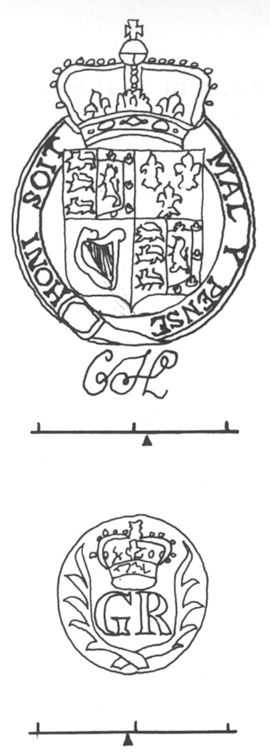

Fig. 4. Wm: English Arms with cursive CH cm: Crowned GR in wreath

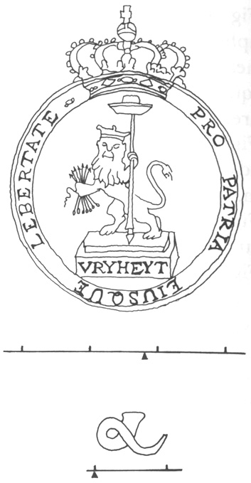

Fig. 5. Wm: Vreyheyt cm: Horn

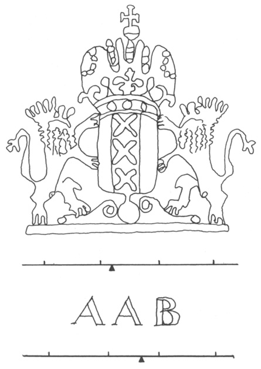

Fig. 6. Wm: Amsterdam Arms cm: AAB

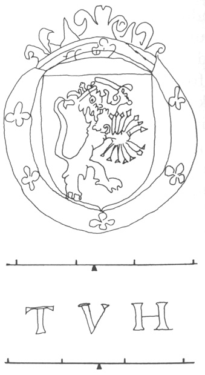

Fig. 7. Wm: Seven Provinces cm: TVH

<!-- p. 561 -->

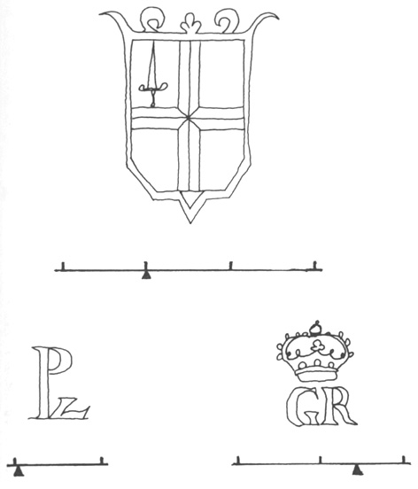

Fig. 8. Wm: London Arms cm: PvL monogram cm: Crowned GR

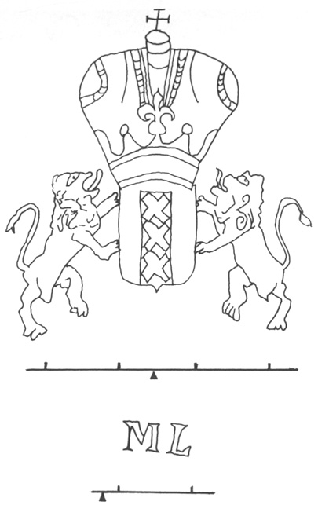

Fig. 9. Wm: Amsterdam Arms cm: MvL

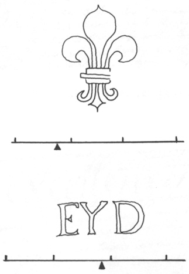

Fig. 10. Wm: Fleur de lis cm: EYD

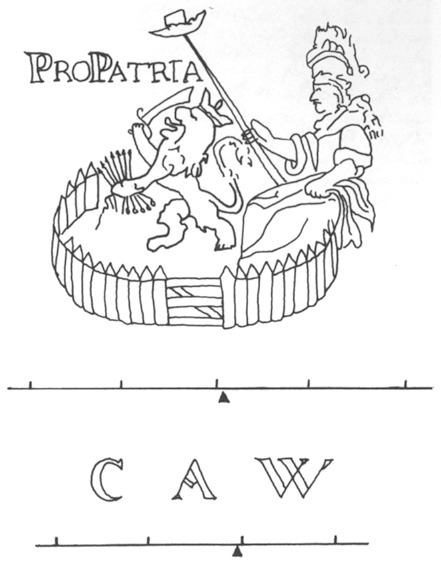

Fig. 11. Wm: Maid of Dort (Garden of Holland) cm: CAW

<!-- p. 562 -->

### Appendix C

THE EVOLUTION OF EDWARDS' EARLY HANDWRITING

The following specimens have been selected to represent successive stages in the development of Edwards' handwriting. While contiguous examples may not seem very different, wider comparisons show that his hand changed considerably in the decade during which the "Miscellanies" entries in this volume were written.See the description of JE's handwriting, above, pp. 66–68.

<!-- p. 563 -->

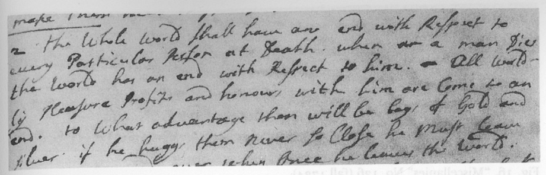

Fig. 12. Vreyheyt sermon on Matthew 16:26 (1721–22)

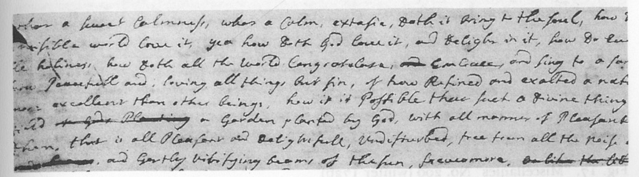

Fig. 13. "Miscellanies" No. a (late 1722)

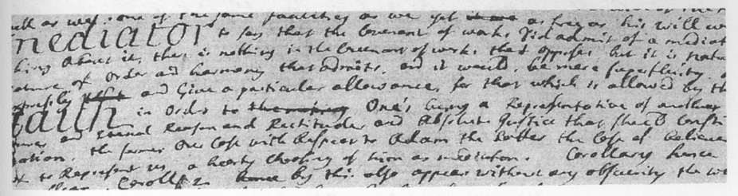

Fig. 14. "Miscellanies" Nos. 32–33 (summer 1723)

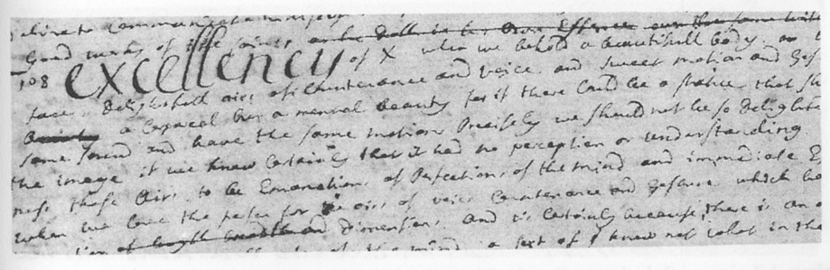

Fig. 15. "Miscellanies" No. 108 (late fall or early winter 1723–24)

<!-- p. 564 -->

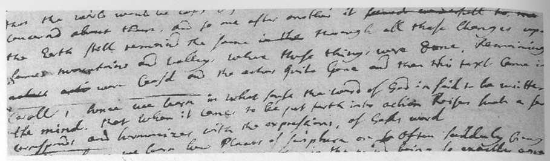

Fig. 16. "Miscellanies" No. 126 (fall 1724)

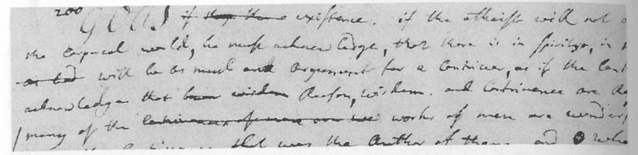

Fig. 17. "Miscellanies" No. 200 (winter 1726)

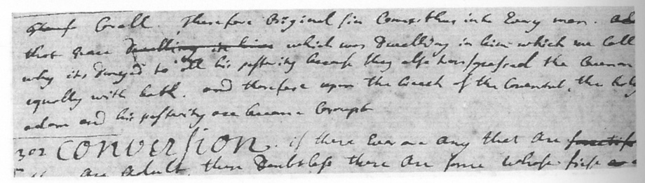

Fig. 18. "Miscellanies" Nos. 301–302 (fall 1727)

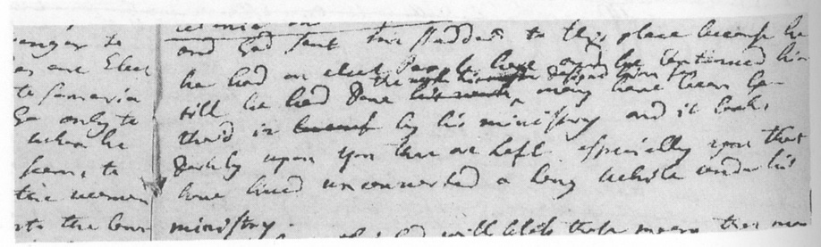

Fig. 19. Sermon on Jeremiah 6:28–39 (February 1729)

<!-- p. 565 -->

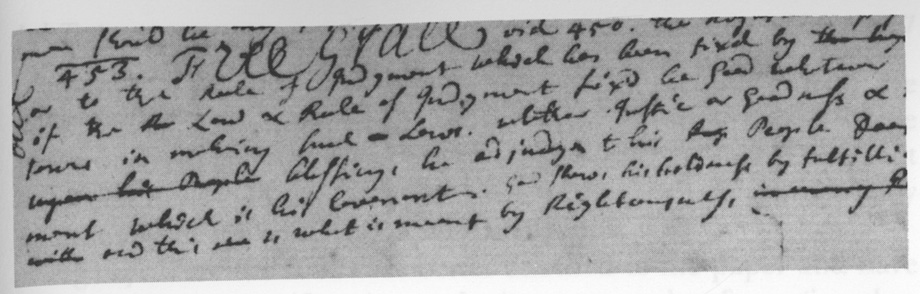

Fig. 20. "Miscellanies" No. 453 (late fall or early winter 1729–30)

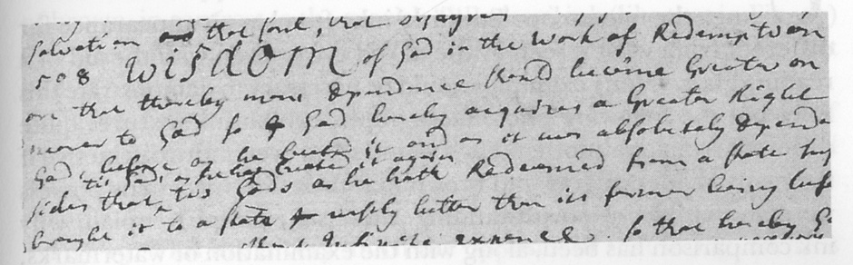

Fig. 21. "Miscellanies" No. 508 (summer 1731)

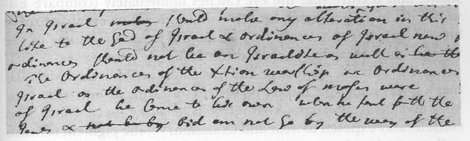

Fig. 22. "Miscellanies" No. 597 (late fall or early winter 1732–33)

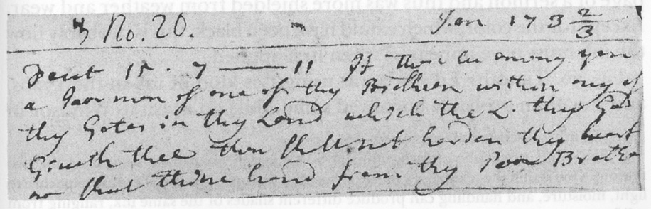

Fig. 23. Sermon on Deuteronomy 15:7–11 (January 1733). The heading at the left is not in Edwards' hand.

<!-- p. 566 -->

### Appendix D

VARIETIES OF INK TEXTURES IN EDWARDS' EARLY MANUSCRIPTS

Under microscope Edwards' ink often has an appearance far different from what is seen by the naked eye or even with the aid of a reading glass.JE's ink is discussed above, pp. 63–66. Many examples would be necessary to demonstrate this fully, but the following photomicrographs exhibit ink textures quite different from one another. Each would seem even more distinctive if the many shades of gray and brown that these ink specimens possess were also visible.Black and white photomicrographs at 20×magnification have been used for two reasons. One is that the texture is a more permanent feature of the ink, because exposure to light, moisture, and handling can produce different shades of the same ink, ranging from solid gray to various browns and tans. The other is that it is difficult to reproduce these exact shades in color photography. Notwithstanding, these six examples explain why ink comparison has been, along with the examination of watermarks, the most useful means for dating Edwards' manuscripts.

Verbal description is very inadequate to convey differences in color, shade, and texture that the eye catches immediately (compare Edwards' distinction between intuitive and notional or even discursive knowledge). Nevertheless, it may be helpful to mention some of the ways in which these ink samples differ from one another.

Fig. 24. This ink appears on the first four entries in the "Miscellanies"; it was somewhat darker on the rest of Edwards' entries in New York and the Amsterdam/AAB sermons he wrote there. It has been considerably exposed to wear and oxidation, yet the pigment remains well attached to the paper.

Fig. 25. This is the same ink as that of Fig. 24 in its somewhat darker shade, but here much heavier and more intense; it occurs on an inside page of a sermon and thus was more shielded from weather and wear. Except for the color, which would have been black, this is probably how the ink must have appeared when first applied.

Fig. 26. Timothy Edwards was using this kind of ink in the 1720s, and Jonathan probably borrowed some while on a visit to Windsor in

<!-- p. 567 -->

the spring or summer of 1726. Its color came almost entirely from the solids held in suspension and deposited on the top of the paper; where these were rubbed or broken off little pigment remained. The result has been described variously as crusty, scabby, or mangy, especially when more of the coating has been broken off.

Fig. 27. Here the solids are better attached to the paper and have rubbed off more uniformly, producing a somewhat fuzzy (in other places more grainy) texture. This specimen is from the first entry on which the ink appears in the "Miscellanies"; it is now a medium shade of brown, in contrast to the grayish "Windsor" ink (like that in Fig. 27) that preceded it. Edwards used this ink for Nos. 152–194 in the first half of 1725.

Fig. 28. Edwards was probably convalescing at home in the winter of 1725–26, for this is a very thin version of Timothy's ink. The liquid itself left only a faint trace, and the scarce solids that remain are those that drifted against paper fibers or the outer edges of the ink line.

Fig. 29. This ink is very much the opposite of that in Fig. 28. It is quite viscous, and it stuck to the paper mostly at points of heavier pressure or on bumps in the paper.

<!-- p. 568 -->

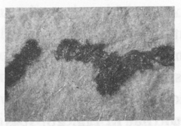

Fig. 24. "Miscellanies" No. b

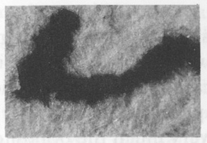

Fig. 25. Sermon on Philippians 1:21, second booklet

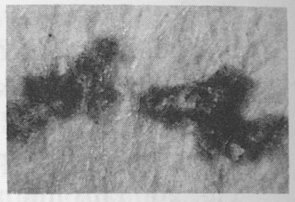

Fig. 26. "Miscellanies" No. 231

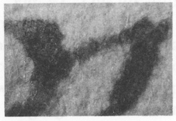

Fig. 27. "Miscellanies" No. 152

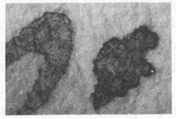

Fig. 28. "Miscellanies" No. 205

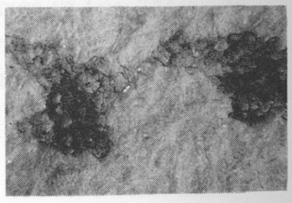

Fig. 29. "Miscellanies" No. 455
