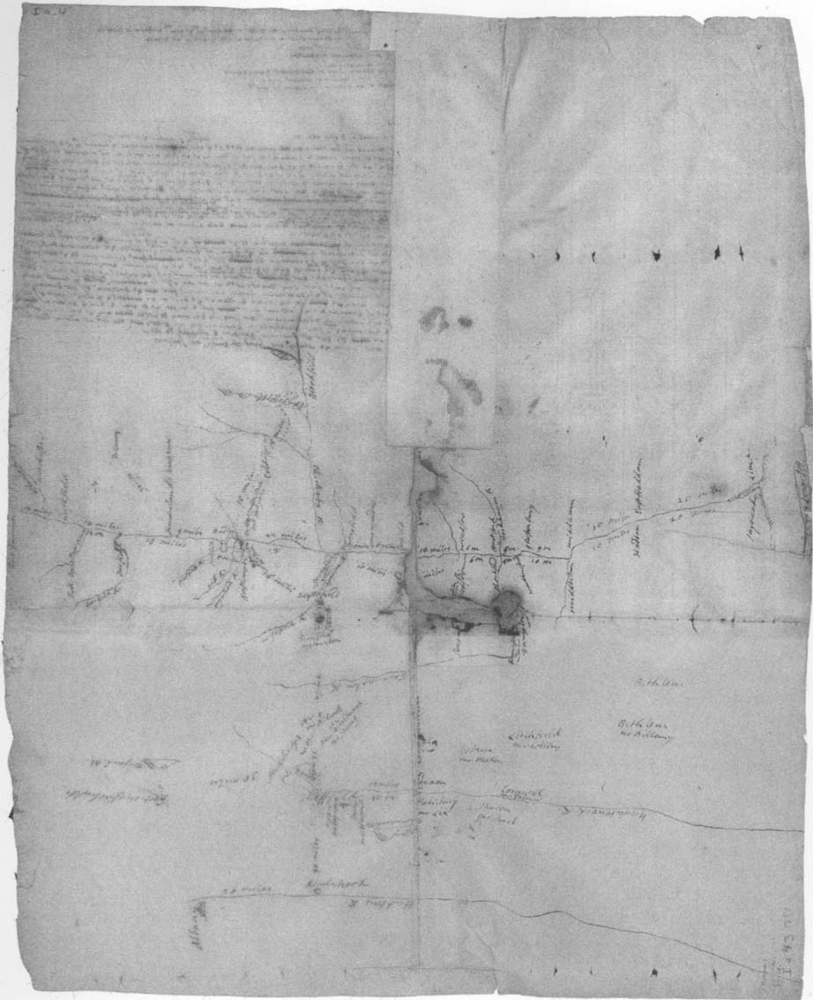

# Sermons and Discourses, 1743–1758

## Front Matter

<!-- p. ii -->

A map of western New England and eastern New York drawn by Jonathan Edwards, c. 1751. Edwards apparently drew this map for Thomas Prince of Boston, a chronicler of New England history, who came to Stockbridge for a council in May 1751. The map records, among other things, the names of the ministers of some towns as well as several paths through Hampshire County. Courtesy Massachusetts Historical Society.

<!-- p. vii -->

<!-- p. viii -->

<!-- p. ix -->

### CONTENTS

- [intro]
  - ILLUSTRATIONS
  - Note To The Reader
  - Preparation of the Text
  - Acknowledgments
  - Preface To The Period
  - A Map of the Later Homiletical Scene
  - Youth Examined And Exhorted
  - MILLENNIAL DESIGNS
  - In A Time Of War
  - The Heroic Ministry
  - Challenging The Laity
  - Catastrophe And After Words
  - Looking Abroad
  - The Stockbridge Mission
  - Preaching On The Edge
    - Summary Reflections
  - Saints Dwell Alone
    - Saints Dwell Alone
    - [DOCTRINE.]
    - APPLICATION.
- The Great Concern Of A Watchman For Souls
  - The Great Concern Of A Watchman For Souls
    - [DOCTRINE.]
    - APPLICATION.
- The True Excellency Of A Minister Of The Gospel
  - The True Excellency Of A Minister Of The Gospel
    - [DOCTRINE.]
    - [APPLICATION.]
- The Beauty Of Piety In Youth
  - The Beauty Of Piety In Youth
    - DOCTRINE.
    - APPLICATION.
    - Use of Exh.
- Approaching The End Of God's Grand Design
  - Approaching The End Of God's Grand Design
    - DOCTRINE.
    - APPLICATION.
- The Duties Of Christians In A Time Of War
  - The Duties Of Christians In A Time Of War
    - [DOCTRINE.]
    - APPLICATION.
- Of God The Father
  - Of God The Father
    - DOCTRINE.
    - APPLICATION.
- Rebellion In Israel
  - Rebellion In Israel
    - [DOCTRINE.]
- The Church's Marriage To Her Sons, And To Her God
  - The Church's Marriage To Her Sons, And To Her God
    - [DOCTRINE.]
    - [APPLICATION.]
- The Suitableness Of Union In Extraordinary Prayer For The Advancement Of God's Church
  - The Suitableness Of Union In Extraordinary Prayer For The Advancement Of God's Church
    - [DOCTRINE.]
    - [APPLICATION.]
- Yield To God's Word, Or Be Broken By His Hand
  - Yield To God's Word, Or Be Broken By His Hand
    - DOCTRINE.
    - APPLICATION.
- True Saints, When Absent From The Body, Are Present With The Lord
  - True Saints, When Absent From The Body, Are Present With The Lord
    - [DOCTRINE.]
    - APPLICATION.
- Sons Of Oil, Heavenly Lights
  - Sons Of Oil, Heavenly Lights
    - [DOCTRINE.]
    - APPLICATION.
- Extraordinary Gifts Of The Spirit Are Inferior To Graces Of The Spirit
  - Extraordinary Gifts Of The Spirit Are Inferior To Graces Of The Spirit
    - DOCTRINE.
    - APPLICATION.
    - APPLICATION [OF THE WHOLE].
- A Strong Rod Broken And Withered
  - A Strong Rod Broken And Withered
    - [DOCTRINE.]
    - APPLICATION.
- Christ The Great Example Of Gospel Ministers
  - Christ The Great Example Of Gospel Ministers
    - [DOCTRINE.]
    - [APPLICATION.]
- Lectures On The Qualifications For Full Communion In The Church Of Christ
  - Lectures On The Qualifications For Full Communion In The Church Of Christ
    - DOCTRINE.
- One Great End In God's Appointing The Gospel Ministry
  - One Great End In God's Appointing The Gospel Ministry
    - DOCTRINE.
    - APPLICATION.
- A Farewell Sermon Preached At The First Precinct In Northampton, After The People's Public Rejection Of Their Minister…On
  - A Farewell Sermon Preached At The First Precinct In Northampton, After The People's Public Rejection Of Their Minister…On
    - DOCTRINE.
    - APPLICATION.
- Saving Faith And Christian Obedience Arise From Godly Love
  - Saving Faith And Christian Obedience Arise From Godly Love
    - DOCTRINE I.
    - DOCTRINE II.
    - [DOCTRINE RESUMED.]
- The Peace Which Christ Gives His True Followers
  - The Peace Which Christ Gives His True Followers
    - DOCTRINE.
    - APPLICATION.
- Men's Inhumanity To God
  - Men's Inhumanity To God
    - DOCTRINE.
    - APPLICATION.
- The Things That Belong To True Religion
  - The Things That Belong To True Religion
    - [DOCTRINE.]
    - [APPLICATION.]
- Heaven's Dragnet
  - Heaven's Dragnet
    - [DOCTRINE.]
    - APPLICATION.
- Sacramental Union In Christ
  - Sacramental Union In Christ
    - DOCTRINE.
    - APPLICATION.
- Death And Judgment
  - Death And Judgment
    - [DOCTRINE.]
    - APPLICATION.
- Christ Is To The Heart Like A River To A Tree Planted By It
  - Christ Is To The Heart Like A River To A Tree Planted By It
    - DOCTRINE.
    - APPLICATION.
- True Grace, Distinguished From The Experience Of Devils
  - True Grace, Distinguished From The Experience Of Devils
    - DOCTRINE.
- God Is Infinitely Strong
  - God Is Infinitely Strong
    - DOCTRINE.
    - APPLICATION.
- God's Use Of Affliction
  - God's Use Of Affliction
    - DOCTRINE.
- Christ's Sacrifice An Inducement To His Ministers
  - Christ's Sacrifice An Inducement To His Ministers
    - [DOCTRINE.]
    - [APPLICATION.]
- Warring With The Devil
  - Warring With The Devil
    - APPLICATION.
- In The Name Of The Lord Of Hosts
  - In The Name Of The Lord Of Hosts
    - [DOCTRINE.]
    - APPLICATION.
- God's People Tried By A Battle Lost
  - God's People Tried By A Battle Lost
    - [DOCTRINE.]
    - APPLICATION.
- Of Those Who Walk In The Light Of God's Countenance
  - Of Those Who Walk In The Light Of God's Countenance
    - [DOCTRINE.]
    - APPLICATION.
    - Directions.
- Farewell Sermons To The Indians
  - God's People Should Remember Them That Have Been Their Ministers
    - [APPLICATION.]
  - Watch And Pray Always
    - [APPLICATION.]
- Appendix: Dated Sermons, , Undated Sermons, And Sermon Fragments

### ILLUSTRATIONS

|  |  |
| --- | --- |
| *Frontispiece* | A map of western New England and eastern New York drawn by Jonathan Edwards, c. 1751. |
| *Page* |  |
| 4 | Pages 2–3 of the manuscript sermon on Daniel 5:25, January 1742, showing Edwards' division of the page into columns. |
| 129 | The first page of Edwards' manuscript sermon on 1 Kings 8:44–45, delivered April 4, 1745, prior to the expedition against Cape Breton. |
| 459 | The first page of Edwards' Northampton *Farewell Sermon*, preached July 1, 1750. |
| 567 | One of the first sermons Edwards preached to the Indians at Stockbridge, on Acts 11:12–13, dated January 1751. |
| 715 | The first page of Edwards' second and final farewell sermon to the Indian people of Stockbridge, from January 1758. |

<!-- p. x -->

<!-- p. xi -->

### Note To The Reader

The reader of this volume may wish to consult the "General Introduction to the Sermons: Jonathan Edwards' Art of Prophesying" in *The Works of Jonathan Edwards, 10, Sermons and Discourses, 1720–1723* (1992) for an overview of the sermons and an examination of Edwards' practices as a homiletical author. Volume 10 also contains a preface to the New York period which examines Edwards' early expressions of his personal religion in their biographical context; similarly, the second sermon volume, *Works, 14, Sermons and Discourses, 1723–1729* (1997), contains a preface to its period, stressing Edwards' intellectual flowering during the years of his tutorship in Yale College and his apprentice pastorate in Northampton under his grandfather Solomon Stoddard. The third volume, *Works, 17, Sermons and Discourses, 1730–1733* (1999) introduces the period in which Edwards established his pastoral leadership in a busy provincial center, as a talented and promising pastor in a prominent church, though still a seemingly conventional man dealing with the inevitable complexities of church and society. The fourth volume, *Works, 19, Sermons and Discourses, 1734–1738* (2001) presents the period of "surprising conversions" in Northampton, the culmination of years of effort in the pulpit and the moment of Edwards' greatest apparent success as a pastor. The fifth volume, *Works, 22, Sermons and Discourses, 1739–1742* (2003), continues this narrative through a period of unprecedented religious turbulence—the Great Awakening—and homiletical renovation and innovation on the part of Edwards the preacher.

This final volume, *Works, 25, Sermons and Discourses, 1743–1758*, represents the last fifteen years, or the second half, of Edwards' preaching career. While all sermon volumes after the first contain selected sermons, this volume is necessarily very selective because during this final, turbulent period Edwards prepared relatively few sermon texts that are readable wholes (as opposed to searchable documents). Nevertheless, this proportionally small collection of sermons vividly documents the conflicts and dramatic turns of events that marked Edwards' final years.

As in the case of the other volumes, an appendix, "Dated Sermons," lists all extant sermons composed during the period covered by the volume,

<!-- p. xii -->

individually numbered and identified by Scripture text, and further identified by the doctrinal statement, if unpublished, and by title, if published in the Edition. Throughout this volume, unpublished sermons are referred to by text and number as found in the appendix.

Wilson H. Kimnach

Editor of Sermons

### Preparation of the Text

The text of Jonathan Edwards is reproduced in this Edition as he wrote it in manuscript, or, if he published it himself, as it was printed in the first edition. In order to present this text to modern readers as practically readable, several technical adjustments have been made. Those which can be addressed categorically are as follows:

1. All spelling is regularized and conformed to that of *Webster's Third New International Dictionary*, a step that does not involve much more than removing the "u" from "colour" or "k" from "publick" since Edwards was a good speller, used relatively modern spelling, and generally avoided "y" contractions. His orthographic contractions and abbreviations, such as ampersands, "call'd," and "thems." are spelled out, though pronounced contractions, such as "han't" and "ben't," are retained.

2. There is no regular punctuation in most of Edwards' manuscripts and where it does exist, as in the earliest sermons, it tends to be highly erratic. Editors take into account Edwards' example in punctuation and related matters, but all punctuation is necessarily that of the editor, including paragraph divisions (especially in some notebooks such as the "Miscellanies") and the emphasizing devices of italics and capitalization. In reference to capitalization, it should be noted that pronouns referring to the deity are lower case except in passages where Edwards confusingly mixes "he's" referring to God and man: here capitalization of pronouns referring to the deity sorts out the references for the reader.

3. Numbered heads designate important structures of argument in Edwards' sermons, notebooks, and treatises. Numbering, including spelledout numbers, has been regularized and corrected where necessary. Particularly in the manuscript sermon texts, numbering has been clarified by the use of systematic schemes of heads and subheads in accordance with eighteenth-century homiletical form, a practice similar to modern analytical outline form. Thus the series of subordinated head number forms, 1, (1), *I*, a, (a), in the textual exegesis, and the series, I, *First*, 1,

<!-- p. xiii -->

(1), *I*, a, (a), in Doctrine and Application divisions, make it possible to determine sermon head relationships at a glance.

4. Textual intervention to regularize Edwards' citation of Scripture includes the correction of erroneous citation, the regularizing of citation form (including the standardization of book abbreviations), and the completion of quotations which Edwards' textual markings indicate should be completed (as in preaching).

5. Omissions and lacunae in the manuscript text are filled by insertions in square brackets ([]); repeated phrases sometimes represented by Edwards with a long dash are inserted in curly brackets ({}). In all cases of uncertain readings, annotation gives notice of the problem. Markings in the text designate whole word units even when only a few letters are at issue.

6. Minor slips of the pen or obvious typographical errors are corrected without annotation. Likewise, Edwards' corrections, deletions, and internal shifts of material are observed but not noted unless of substantive interest.

7. Quotations made by the editor from the Bible (KJV) and other secondary sources are printed *verbatim ac literatim*. Edwards' quotations from such sources are often rather free but are not corrected and are not annotated as such unless significant omissions or distortions are involved.

### Acknowledgments

After many years' involvement with the production of six volumes of sermons, the debts I have incurred are too numerous to mention, or perhaps to remember. Workers in the vineyard have come and gone, some to noteworthy careers, others retired, and some have even passed to their final reward since I began preparing for the series of volumes of which the present one is the culmination.

Even restricting myself to the present volume hardly reduces the numbers, so I will first simply recognize collectively the rotating team of transcribers, enlisted by Harry S. Stout, whose diplomatic transcriptions of sermons have so greatly facilitated the process of making volume selections. A text that can be quickly reviewed is often preferable to reading notes, especially when they may be twenty years old. Eventually the entire corpus of 1200 sermons will be electronically available for all to review, and a truly massive effort will be complete. Perhaps special recognition should be given Rachel Wheeler for her transcriptions of the Indian sermons

<!-- p. xiv -->

and to Kenneth P. Minkema for training and leading the team by his industrious example.

During preparation of the sermon volume series I have profited from conference with John F. Wilson of the sermon subcommittee and had the pleasure of working with excellent volume editors: Ken Minkema, Mark Valeri, Max Lesser, and Harry Stout have written brilliantly of Edwards in their period prefaces and have provided well-contextualized sermon texts, so that the series of sermon volumes offers its own life narrative of Edwards. In the Edwards office Ava Chamberlain, Kyle Farley, Douglas Sweeney, Peter Thuesen, and Caleb Maskell have provided unfailing support and gracious companionship. If the road was long, the company was frequently jolly.

In the course of preparing this volume I have appreciated the support and encouragement of Jon Butler, and the many collegial exchanges with Stephen J. Stein and Max Lesser. I have had most helpful suggestions from readers Janice Knight and Philip Gura, and thanks are due Susan Laity for her work on the volume at the Press. I would also like to express my gratitude to the staffs of the Beinecke Rare Book and Manuscript Library of Yale University and the Franklin Trask Library of Andover Newton Theological School for their unfailing cooperation.

Material support for the preparation of this volume has been provided by the National Endowment for the Humanities, the Pew Charitable Trusts, the Lilly Endowment, Inc., and the Henry Luce Foundation, Inc. The NEH has supported my work since the inception of the sermon project, and this volume thus represents the fulfillment of a lengthy and much appreciated commitment.

Finally, no acknowledgements respecting my work would be complete without remembering the example of Thomas A. Schafer, the collegial fellowship of Ken Minkema, or the sustaining support of Carole S. Kimnach, beloved wife and laborious fellow editor, without whose efforts this volume would not exist.

<!-- p. 1 -->

## SERMONS AND DISCOURSES, 1743–1758

<!-- p. 2 -->

<!-- p. 3 -->

### Preface To The Period

The final period of Edwards' career as a preacher of the gospel covers fifteen years, from the end of the Great Awakening to his death. It is a much longer period than those reflected in the five previous sermon volumes of this Edition, which have averaged less than four and a half years each. This final period also involves more than one pastorate, encompassing eight years in Northampton and seven at the Stockbridge mission, not to mention the very brief presidency of the College of New Jersey. However, the content of this volume, like those before it, is not defined by mere quantity, whether of days of Edwards' life, sermons preached, or pastorates. The volumes attempt to represent phases of Edwards' life as a preacher, and they are defined by his own practices as reflected in the sermonic literature he produced. Thus the representation of his sermons necessarily varies in concentration of coverage and total quantity from volume to volume.

The period from 1743 to 1758 is defined by an action Edwards took as he composed a sermon in January 1742. Throughout his life, Edwards tended to make major resolutions or practical changes upon the new year, and in this case he made a far-reaching decision about the format of his sermon manuscripts. Composing a sermon on Daniel 5:25 (no. 650a), he began writing in his usual microscopic hand across the four-inch-square duodecimo page from edge to edge; but after writing the first five lines of script on the second page, he drew a line, beginning at the end of the last line of script, back under what he had written to the middle of the page and then down the center of the page dividing it into two two-inch-wide columns. He continued the double-column format throughout the remainder of the brief, four-leaf sermon manuscript. Edwards wrote other sermon manuscripts in double columns that month, although he seems to have begun writing in a single column on Luke 8:27 (no. 650c)—undoubtedly out of habit—before shifting back into double columns. Some of these sermons are very brief indeed, such as one on John 8:12 (no. 1023), which is only two leaves in all, and they may represent sermons Edwards delivered while itinerating or preaching

<!-- p. 4 -->

<!-- p. 5 -->

at special private meetings during the last phase of the Great Awakening. Of course Edwards was quite busy during 1742, not only leading the revivals but observing and analyzing them and preparing his treatise in critique of them, *Some Thoughts Concerning the Revival*.

Pages 2–3 of the manuscript sermon on Daniel 5:25, January 1742, showing Edwards' division of the page into columns. Courtesy Beinecke Rare Book and Manuscript Library, Yale University.

But the decision had been made, and for the remainder of his life the double-columned sermon page constituted his "standard practice." For Edwards the preacher, techniques of abbreviation and consolidation were nothing new. In 1727 he had shifted from a larger octavo sermon booklet to a smaller duodecimo, probably so that the booklet would not be so obvious in his hand. At the same time he had started expanding the page count of his sermon booklets to accommodate two preaching units in one booklet rather than having to shuffle between two booklets of a fixed number of pages. Around 1730 Edwards began the heavy use of "pick up lines," visual devices that enabled him to pick up where he had left off, after looking up from his booklet, more easily than searching through his tiny writing. Although Edwards had experimented with various kinds of outline and textual abbreviation even in his early sermons, around 1740 he began outlining or abbreviating his syntax much more heavily, and this practice would increase, generally, for the remainder of his career.[^003-note1] When the horizontal lines separating heads and major paragraph units began to come closer together as a result of his abbreviations, perhaps Edwards felt that dividing the page would make each unit of exposition longer and thus less cluttered, and he may have thought that if he got more of his sermon on each page, there would be less page shuffling. In any case, when Edwards divided the page into two columns, he largely ceased using pick up lines.

These changes undoubtedly facilitated some aspects of preaching for Edwards. Since he had always considered dependence upon his written text in the pulpit a serious failing,[^003-note2] his stratagems were a means of enforcing a certain degree of improvisation during the delivery of his sermon;

<!-- p. 6 -->

moreover, he no longer took time in his study to elaborate ideas in the meticulous prose of his earlier sermons, however much time he gave to thinking out the overall argument. There was thus a clear advantage for Edwards himself in saving time used in the composition of sermons. Other advantages are less certain, for if Edwards never was able to break his dependence upon a written text, any sustained improvisations may have been less effective than his written prose would have been. His first and in many respects most accurate biographer, Samuel Hopkins, who studied with Edwards and watched him at work, described Edwards as one who thought with his pen,[^003-note3] and accounts by others of Edwards' preaching clearly indicate that his talents were more those of a writer than of a true orator.[^003-note4] In his study, the steadily scratching pen could sculpt the great sentences and greater paragraphs that characterize his homiletics, but there is little evidence of his being eloquent on his feet.[^003-note5] His Northampton congregation may have been "sermon proof" in the sense of having heard it all before, but having heard it before they probably would have been the first to notice any decline in the quality of utterance from the pulpit. They may not even have cared in the weary aftermath of the Great Awakening, unless Edwards demanded the most from them when he seemed not to be giving the most of himself; or, if they saw him serve someone else, such as the transatlantic literary community, with greater care and commitment than he seemed to give to his pastoral duties.

Edwards' actual practice does provide some hints about this matter, for if the double-columned page became his standard practice after 1742, it was not his uniform practice. For instance, the manuscript of his

<!-- p. 7 -->

*Farewell Sermon*—arguably the most important sermon of this period—is in single-column form and is not significantly outlined. Moreover, it is far from unique: several sermons included in this volume were written in single columns. When Edwards first went up to Stockbridge to make a trial of his mission to the Indians during the winter of 1751, he not only composed sermons for the Indians in single columns but returned to the larger octavo sermon booklet that he had not used since 1727. The evidence of these practices clearly illustrates Edwards' limited trust in his ability to preach *ad libitum*, even at the end of his preaching career. At the very least, it appears that even if he could look up from the booklet or remember verbatim what he had written, he needed first to write it out in order to have his best expression.[^003-note6]

Whatever occurred in the pulpit is, of course, not a matter of record, except through the subjective accounts of auditors' notes and diary entries, and those occur only occasionally.[^003-note7] The actual homiletical record is inevitably the record of Edwards' sermon manuscripts. And during the period 1743–58 that record is characterized by sermons that are incomplete as homiletical texts. Indeed, in preparing the selection of texts for inclusion in this volume, one chief criterion was the extent of the text's actual existence. To be a reading text, it must have enough of Edwards' expression to enable a reader to read the sermon *as a whole*; otherwise, the sermon may be a valuable document for research—since virtually all Edwards' sermon manuscripts are comprehensible on some level—but not a complete homiletical work. Edwards himself found many of the outlinish sermons of this period to be of intellectual value, according to the evidence of his citations of them in his "Miscellanies"

<!-- p. 8 -->

notebook "Table."[^003-note8] However, Edwards' citations often refer to specific statements which would almost always be much less than the contents of an entire sermon and which often involve little more than one or two paragraphs. It can be said that Edwards did not take sermons lightly as theological statements just because he had not taken the time to develop them fully; on the other hand, he returned to the earlier practice of written-out texts in single-column format whenever the sermon itself was to be a major statement. In general, then, the period 1743–58 is not characterized by impressive homiletical works, if only because of their incompleteness, and this is especially noticeable when sermons are compared with the letters and treatises of the period, Edwards' other literary venues for public expression.

### A Map of the Later Homiletical Scene

There are, however, great sermons in this period, and the selections in this volume include them, as well as some lesser but valuably illustrative pieces, mapping the complex terrain of Edwards' spiritual, intellectual, and professional life after the Great Awakening. The inception of this period came at a time of reflection and evaluation—Edwards' critical phase—when, in addition to the publication of *Some Thoughts Concerning the Revival* (1742, but issued by the press in March 1743), he preached in the first half of 1743 sermons which would be expanded into *A Treatise Concerning Religious Affections* (1746). That the period begins with Edwards' probing critique of the Great Awakening and his most extensive and profound evaluation of the nature of religious experience is portentous. Edwards was now working his way through the second thoughts and revisionary process that followed the very mixed results of the revivals, although as one who still believed in the essential validity of the Great Awakening his critical task was to separate the golden essence from the dross complicating it. Inevitably, this was accomplished in practice one individual at a time, despite Edwards' attempt in 1742 to execute a practical collective validation of the awakening by having his own church renew its covenant.[^003-note9] But *Saints Dwell Alone* expresses Edwards'

<!-- p. 9 -->

new sense of the practical realities of religion, including the possibly impassable barrier that separates saints—as individuals and as groups—from the surrounding society, perhaps even the society of the visible church.

### Youth Examined And Exhorted

Edwards' critical inquiry into the condition of the visible church all too soon discovered an issue that destroyed any hope of calm communal reflection, for 1744 was the year of the Bad Book episode, one of those trivial events that all too often are the occasion of significant consequences. According to Edwards' first biographer, the affair ended Edwards' influence with the young people and that in turn "seemed in a great Measure to put an end to Mr. Edwards's Usefulness at *Northampton*."[^003-note10] The affair has been a subject of scholarly inquiry over the years and has been analyzed in depth.[^003-note11] Still, the exact nuances of political interaction in the case are sufficiently obscure to retain an enduring ambiguity. Edwards had always taken the souls of children seriously, as had the Puritans generally. His *Faithful Narrative* (1737) had featured a four-year-old child as a prime exhibit of the work of God in conversion, and over the intervening years Edwards' preaching had stressed the importance

<!-- p. 10 -->

of rearing children properly.[^003-note12] The Northampton congregation included a number of young persons who had been converted during the "surprising conversions" of 1734–35 or during the just-concluded Great Awakening. But the Bad Book affair—amounting essentially to lewd wisecracks in public—did not really involve parents and children, since most of the culprits were bumptious men in their mid-twenties, few of whom were closely attached to prominent church families. Thus, Samuel Hopkins' words referring to Edwards' supposedly impolitic manner of initiating the inquiry which is alleged to have precipitated the general social upheaval—"Whether this was the Occasion of the alteration or not"[^003-note13]—allow for maximum latitude in causal interpretation.

But the Bad Book episode was a symptom for Edwards, and probably for most of his congregation, indicating that the revivals had again proved to have limited effect upon the conduct of the church community.[^003-note14] As always, Edwards saw the young as a spiritual barometer of the community, and for many months he attempted to reach out to the youth of the congregation. About eight months after the Bad Book affair, Edwards preached a quarterly lecture, *The Beauty of Piety in Youth*. The sermon is more carefully written out than most of this period, and it is a direct appeal to the young people of the society—with some emphasis upon the females—to pursue a life of piety and avoid eternal wounds from the sins of youth. The argument clearly targets sexual license and introduces the life of the spirit as the "sweetest" gratification of the human appetites. But two years later, in November 1746, he was still lecturing the youth of the church, this time in a "lecture to young people" (though with others from the general congregation in attendance). *Rebellion in Israel* is a much more grim undertaking, as the title indicates. The youth of the community have apparently not been moved by their pastor's or their parents' appeals, and Edwards now uses harsh language to condemn the continued backsliding of both sexes of the town's youth. Spiritual discipline has been lost and "unnatural" rebellion is the order of the day. The only concluding appeal that seems to have been plausible to Edwards was the example of the prodigal son. Thus by the mid-1740s,

<!-- p. 11 -->

Edwards was clearly alarmed and seemingly pessimistic about the future of the Northampton church as represented in its youth.

### MILLENNIAL DESIGNS

At the same time that Edwards was preoccupied with his responsibilities as moral regulator of the Northampton community, he was inevitably involved in ever-widening circles of spiritual relationship beyond his parish. Indeed, his lifelong millennial interests compelled him to place local affairs in the cosmic contexts of the history of the work of redemption and the Apocalypse itself. *Approaching the End of God's Grand Design*, preached in December 1744, represents his effort to instill in his congregation a sense of the larger context of all earthly spiritual movements, such as the recent revivals. In this and similar sermons Edwards attempted to place the little world of Northampton's church in the cosmic context of divine providence, thus creating a more concrete awareness of the transcendent reality of the church.

But it was a little later, in 1747, that Edwards' desire to realize God's universal design in visible, earthly activity found a new expression. On February 3, 1747, Edwards preached a fast-day sermon to promote international union in extraordinary prayer for the advancement of the church and God's grand design upon earth. The idea was not original, as Edwards states in the sermon's Application, but he turned to it as a way of gathering up and refocusing the energies lately committed to the revivals. He then expanded his fast day sermon into a treatise, *An Humble Attempt to Promote Explicit Agreement and Visible Union of God's People in Extraordinary Prayer*…(1747), since he probably hoped such a publication might renew pious activism among the churches in a less troubled medium than that of the revivals. Occasional collective prayer had a long tradition in New England, and this innovation would be in some respects analogous to the expansion of local revivals into an international movement during the Great Awakening, except that collective prayer would presumably be less disruptive to ecclesiastical institutions. The goal in either case was contributing to the coming of the millennium. The treatise itself was clearly another effort by Edwards to resume religious leadership in the world beyond Northampton, although in this case the response proved to be tepid, both at home and abroad.[^003-note15]

<!-- p. 12 -->

### In A Time Of War

As Edwards was attempting to lead his people into the final struggle against Antichrist and all other false gods on a spiritual level, there was a material correlative of this struggle in the surrounding countryside during the mid-1740s. War with the French and their Indian allies—often characterized by New Englanders as a struggle against the Papacy and hence Antichrist—had been a virtual constant during Edwards' lifetime. Historians divide the struggle into phases, such as Queen Anne's War (1702–13), King George's War (1744–48), and the French and Indian War (1755–62), although skirmishes along the frontiers hardly ceased between the official phases. In Northampton and even more in Stockbridge, Edwards occupied a true frontier pulpit, and the affairs of war are the subject of a number of his sermons between 1745 and 1755, as well as providing a constant undercurrent of allusion that might make its appearance in any sermon during the period.

One of the first sermons to be directly preoccupied with war is *The Duties of Christians in a Time of War*, preached during the English expedition against the French fortified town of Louisburg on Cape Breton Island. The expedition turned out to be the greatest English victory during Edwards' lifetime, though no one knew what would be its outcome at the time Edwards wrote and preached his sermon. The sermon builds upon the crusading spirit remaining from the Great Awakening and combines it with traditional Puritan notions of a covenanted people. The argument is fairly well written out and involves a series of considerations that have returned again and again in the literature of the just war in America. Notwithstanding Edwards' emphasis on the power of prayer and his Calvinistic theology, his war rhetoric has ample room for both patriotism and hard-edged economic considerations. The conduct of trade and even the fisheries of Maine are noted as parts of the picture, although such material specifics were also important as providential indicators for Edwards, as is clearly evident in his notebook "Notes on the Apocalypse."[^003-note16]

<!-- p. 13 -->

Ten years later Edwards preached in quick succession two war sermons that reflect the continuing preoccupation with war in the English colonies. The first sermon, *In the Name of the Lord of Hosts*, was preached to the Stockbridge (Mahican) Indians and is a reminder that the English also depended on Indians as combatants in the wars. Edwards exhorts the Indians to trust in God and not themselves, to forsake sin and believe that they fight on the side of true religion against a religion God opposes since it exalts itself in the place of God. The English were just assembling in July 1755 for an assault on the French Fort Saint Frederic at Crown Point, New York, and though the expedition never reached its goal, it did achieve what was perceived to be a victory over French forces in the field.

The other sermon, *God's People Tried by a Battle Lost*, was delivered to the English congregation at Stockbridge during a fast in August 1755, a time of great alarm and disappointment for the English. In this sermon Edwards addressed the defeat of English forces under their supreme commander, Maj. Gen. Edward Braddock, on July 9 in a confrontation with the French and Indians on the banks of the Monongahela. Known as "Braddock's defeat," the episode shocked the English as much as Pearl Harbor would shock their twentieth-century American descendants, and it certainly constituted the major war event of Edwards' ministry. His sermon manuscript shows some signs of hasty composition, but the sermon is nevertheless one of Edwards' more important statements on war. At the outset, Edwards observes that "the affair of war is one of the most important of all the affairs of the universe: the state of the world of mankind principally depends upon it." The ensuing Doctrine is a conflation of realistic analysis of the dynamics of armed conflict and Edwardsean reflections upon divine sovereignty, but the Application brings out Edwards' most explicit interpretation of the predicament of the English settlements and the threat to English liberties posed by the French strategy in North America. Although he gives little comfort to those who might have felt the pressures of that dark time, and inveighs against English vice and pride as the reason for God's apparently having turned his

<!-- p. 14 -->

back on them, Edwards insists that God will ultimately be with them as they combat the forces of Antichrist.

War, then, provided a noticeable coloration to the setting of Edwards' ministry, both in Northampton after the Great Awakening and in Stockbridge. While neither community experienced a raid like that at Deerfield and Edwards suffered no significant personal losses from the conflict, war was an inevitable subtext in many of Edwards' sermons, as in the social and ecclesiastical deliberations of this period.[^003-note17] In Edwards' writings generally, the note of millennial tension and expectation was doubtless in part reflective of the ongoing struggle with the French for dominion in North America.

### The Heroic Ministry

The theme of heroic enterprise not only appeared in Edwards' war sermons, but it increasingly characterized his ordination sermons during this period. Edwards' mentoring of young ministers and his leadership during the revivals inevitably led to a higher public profile in New England and the surrounding colonies, and this kind of prominence is attested by the printing of his ordination sermons during the period.[^003-note18] While the tradition of New England pulpit rhetoric had always accorded exalted status to ministers as "Christ's ambassadors," they were also represented as "earthen vessels" and therefore weak as other men. Their power was of the church as supported by the state, and their patriarchal roles as shepherds institutional rather than personal, with a few notable exceptions. But Edwards' ordination sermons place a new stress upon the heroic personal dimension of ministers as true ambassadors of Christ.

<!-- p. 15 -->

Ministers are presented as serving under siege, and the work of their ministries is characterized in terms of exalted personal struggle.[^003-note19] Thus the sermon preached at the ordination of the Rev. Jonathan Judd to preside over the newly formed Southampton precinct, *The Great Concern of a Watchman for Souls* (1743), is explicit about the minister's working in an enemy country (which proved to be prophetic during the Indian raids of 1747–48) to guard and protect his vulnerable flock as a precious investment of Christ's. And the ordination sermon of the Rev. Robert Abercrombie, *The True Excellency of a Minister of the Gospel* (1744), also identifies the minister as a warrior, although the burden of this sermon is the emphasis upon the need for balance between affection and intellect to achieve true "excellency" in the gospel ministry. In both sermons the minister is challenged to act so as to be seen as worthy of his calling at the day of judgment, and that calling is exalted in terms reflecting the evangelical ardor of the leading preachers of the Great Awakening. The great difference, however, is that this hero must sustain his role throughout a presumably lengthy settled pastorate, unless the day of judgment is actually close.

As the decade of the 1740s wore on, Edwards' rhetoric in ordination sermons grew more innovative and varied, as his emphasis upon the heroism of the professional ministry became more focused and insistent. At the center of these evocations of an exalted ministry was the figure of David Brainerd, the man Edwards did his best to re-create in the image of the Christian hero through his *Life of David Brainerd* (1749). Of the ordination sermons Edwards preached during these years, the one for the Rev. Samuel Buell, *The Church's Marriage to Her Sons, and to Her God* (1746), is remarkable for its display of learning in the lengthy exegesis of the text. While the sermon celebrates Buell's installation, it cautions the minister not to depend too much on his rhetorical genius and advises the congregation (who had at first thought a new minister would be too expensive) not to make their minister worry too much about money. Buell was a brilliant orator and itinerant evangelist who had affected Northampton during the Great Awakening as Edwards had affected Enfield. He might well have become Edwards' favorite among his students, at least as a preacher and pastor, had he found the time to study

<!-- p. 16 -->

with Edwards as he wished. Buell did not have the learning or depth of Edwards, but he had an extraordinary evangelical presence and social graces which stood him in good stead throughout a long career.[^003-note20] Here, at the outset of his settled ministry, Edwards acknowledged Buell's talent and kindred spirit, paying Buell in his own rhetorical coin with a long, stylistically rich sermon.

An even richer rhetorical texture is presented by *Sons of Oil, Heavenly Lights*, Edwards' installation sermon for the Rev. Joseph Ashley of Sunderland (1747). In this sermon Edwards embarked upon a tour de force of biblical types related to the communication of God's grace through the agency of his ministers. While the metaphysical elaboration of imagery may be the most engaging aspect of the sermon, it is also interesting and important for the emphasis Edwards places upon the special calling of the professional ministry, including the signs of true grace expected of the minister and the obligation of the people to look for these signs while yet trusting the judgment of other ministers to install proper candidates. Finally, he warns particularly against lay exhorters and similar radical abusers of religion associated with the Great Awakening. Edwards celebrates the esoteric relationships, both heavenly and mundane, of the true ministers of Christ in language that is itself incantatory, while insisting that theological knowledge and intellectual ability are only the necessary tools, not the essence, of the ministerial calling.

Yet another ordination sermon from the late forties is *Christ the Great Example of Gospel Ministers*, preached for the Rev. Job Strong in June 1749. The heroic emphasis is most explicit in this sermon, including the argument that ministers, like their Master, must be prepared to suffer and even lay down their lives in the service of their brethren. Edwards also insists that they must embody a "strict, constant, and inflexible observance" of God's commands, since they are Christ's chief instruments on earth, who must witness through their preaching whatsoever God commands. While the message may not have been entirely unconventional, Edwards' intensity is unusual, heightened by his observation to the congregation that he stands before them for the last time. Undoubtedly his

<!-- p. 17 -->

current struggles with his own congregation gave personal poignancy to his argument, and may have shaped it, but the trend was in place before the qualifications controversy and only evolved with it.

The focal point of the heroic ministry was David Brainerd, and it is therefore in Edwards' funeral sermon for Brainerd, *True Saints, When Absent from the Body, Are Present with the Lord* (1747), that Edwards most powerfully suggests his conception of the transcendent or heroic ministry. Brainerd is presented as the embodiment of absolute commitment to the Christian life and the calling of the ministry, who gives all willingly in the cause of his Lord. The ultimate reward and justification of such commitment is amply suggested by Edwards in powerfully sensuous passages evoking the love of heaven, and in meditations on the increased awareness of the glories of God's work on earth that saints receive in heaven, complementing their vision of the divine empire. Several of Brainerd's personal qualities are celebrated, but most of all his heroic activism in the cause of Christ.

Throughout his life, Edwards had tried to realize in writing the abstract ideal of the saint by embodying it in a familiar persona, whether that of Sarah Pierpont Edwards in his early "Apostrophe" and later *Thoughts on the Revival* or of Phebe Bartlett in his *Faithful Narrative*, or of himself as projected on the canvas of his "Personal Narrative." But increasingly in the 1740s and 1750s, it appears that most of his concrete projections of the saint were variations on the image of the professional Christian, the good minister. And in depicting these examples Edwards made few concessions to mortal failings, perhaps because his new model was essentially a public persona rather than a more complicated private self.

At the same time that Edwards was working intently on the persona of David Brainerd, he was himself entering upon a phase of his ministry that he might well have considered to be heroic. During the 1740s Edwards exerted ever wider circles of influence through his publications, his ordination sermons, and his correspondence. He was becoming more of a public thinker and leader; on the other hand, the continuum of unease in his own church seems to have been largely unbroken since the Bad Book episode, or perhaps since the winding down of the Great Awakening. Beginning with the 1742 covenant renewal he had required of his people, Edwards had tried to make the legacy of the Great Awakening more practical and institutional. He looked for new ways to bring his church to a more stable and enduring holiness, providing pure religious affections a habitation that would foster their growth and sustain

<!-- p. 18 -->

their purity. The idea of the church as a gathering of saints, a spiritually intimate community of mutually loving and devoutly pious persons, had probably been a beckoning vision for Edwards ever since his days as pastor of the splinter congregation in New York. There he had experienced a life of the spirit and a companionship hitherto unknown, either in his father's turbulent East Windsor parish (despite successful revivals) or in the secular community of the collegiate school in New Haven.

Now, after two periods of remarkable revival in the Northampton church, the first of which had tremendously disappointed Edwards by its evanescent legacy of religious fervor, Edwards was again casting about for ways of refining, reinforcing, and consolidating the presumed gifts of true grace within the church after the evident decline of the Great Awakening movement. During the course of the 1740s Edwards had worked hard to define the phenomena of grace in the most effective way he knew, by writing and publishing *The Distinguishing Marks of a Work of the Spirit of God* (1741), *Some Thoughts Concerning the Present Revival of Religion in New England* (1742), and *A Treatise Concerning Religious Affections* (1746), a sequence of studies that became progressively more comprehensive, analytical, and theoretically definitive. In conjunction with these publications, Edwards continued his pastoral work through preaching the gospel and attempting to enforce moral discipline within the Northampton community. He preached intellectually ambitious sermons such as a trilogy on the Trinity, here represented by *Of God the Father* (1746), in which he attempted to establish the theological foundations of his authority in a divine community of love. He also continued to counsel his congregation on current misunderstandings of the idea of gracious influence, as in *Extraordinary Gifts of the Spirit Are Inferior to Graces of the Spirit* (1748), in which he warns against judging the state of others as well as other abuses of religion that emerged during the Great Awakening. Despite efforts that Edwards may have considered extraordinary, Northampton apparently continued to experience a decline in communal order and an increase in social tensions that Edwards inevitably interpreted as a decline in authentic spirituality. Traditional methods of awakening, such as hellfire preaching, no longer seemed to work—or may never have worked. *Yield to God's Word, or Be Broken by His Hand* (1747), one of Edwards' most remarkable hellfire sermons (despite being sketched out in double columns), is noteworthy because it is both a hellfire sermon and a critique of hellfire preaching. Clearly allusive to *Sinners in the Hands of an Angry God* in its imagery, the sermon describes the relation between theological instruction and hellfire, touches

<!-- p. 19 -->

particularly upon the resistance of the rich and powerful to God's warnings, and offers a survey of Edwards' past hellfire rhetoric enhanced by some new twists. However, the rhetorical climax of the sermon, near the end of the Application, is an open questioning of the history of hellfire Preaching in Northampton: "[I]ndeed, when I went about preparing this discourse, it was with considerable discouragement…. [S]o many had been offered with so little apparent effect that I thought with myself, I know not what to say further." At this point, both minister and congregants—at least many of them—seem to have been homiletically weary.

### Challenging The Laity

As early as 1746, apparently, Edwards had decided that the "Stoddardean way" of church membership was on a theoretical level unscriptural, and on a practical level an invitation to hypocrisy and pretension. A "mixed church" could never provide that comfortable habitation for true grace that the Puritan churches had always professed to do. And as decade wore on, perhaps events seemed to confirm his opinion, the evidence of his ever-increasing salary notwithstanding.[^003-note21] In any case, by the end of the decade he seems to have felt that things were falling apart. Perhaps this mood is best captured by his funeral sermon for yet another type of the Christian hero, Col. John Stoddard.

*A Strong Rod Broken and Withered* (1748) is certainly a genuine lament since Stoddard, leader of the "court" party in the Northampton community, was also one of Edwards' chief supporters and intimates in the church, even during the Bad Book episode and after. A representative of the union of church and state that characterized traditional New England leadership, Stoddard at his death left his nephew standing newly isolated. But Edwards' sermon is on another level a challenge and a prescription to any who might have wished to fill John Stoddard's role and provide similar leadership in town and church. If other town leaders, such as Timothy Dwight or Joseph Hawley, wanted a model to emulate, Edwards gave them a detailed one in this sermon. Edwards insists that

<!-- p. 20 -->

secular leaders are also God's ministers, that true statesmen are God's gifts to the community, and that such remarkable leaders as Stoddard tower above others in many different venues of service because of their God-given qualities of social status, family, and personal genius. Edwards' outlook is not necessarily antidemocratic, but he does assume that a great leader such as John Stoddard is elected to service through a process analogous to that in which true saints are elected. A leader of such inherent strengths and sensitivities cannot be created merely by imitating a model; the model must be a natural fit, and such a perfect match would not be common in any time or place. Thus Edwards, at the conclusion of the sermon, notes the passing of both Solomon and John of the house of Stoddard, and reminds the community to respect the remnant of the house.

However, that remnant was about to open what many in the church of Northampton inevitably would see as open war on the house's legacy, for in the following December a candidate for church membership was surprised to hear that Mr. Edwards now wanted him to make a formal profession of the authenticity of his conversion before being admitted to the church.[^003-note22] The loss of his most astute political adviser and ally might have caused another to temporarily withhold any plans for radical ecclesiastical reform, but here as elsewhere Jonathan Edwards tended to be inspired by a challenge that in many respects confirmed his worst fears. Leading a congregation besieged by French and Indians on the outside and distracted by class strife and cultural turbulence on the inside, Edwards decided to press ahead with his plan of eliminating the "Stoddardean way." During the next twelve months, between December 1748 and December 1749, Edwards moved rapidly into the climactic phase of his long pastoral relationship. His "Narrative of Communion Controversy" outlines the step-by-step process during which he and his parishioners became so alienated that an ecclesiastical council was finally called to assess the troubled marriage—only to ratify in a subsequent gathering the termination of it.

Edwards' reputation as a preacher was apparently so formidable—even among his own "sermon proof" people—that the church committee urged him not to preach on the issue. He asked again to do so and they urged him to publish on the subject: air Northampton's troubles

<!-- p. 21 -->

before the world, but please don't *preach*. Perhaps the members of the committee had noted Edwards' increasingly prominent literary life and thought that he would somehow get the whole business out of his system through the purge of print. They certainly hoped to entangle him in a New England pamphlet war at the least. So Edwards wrote and published *An Humble Inquiry into the Rules of the Word of God, Concerning the Qualifications Requisite to a Complete Standing and Full Communion in the Visible Christian Church* (1749), a work few in Northampton read, and then again he asked to preach. A total of seven times Edwards asked to preach on his desired reform, according to the record of his "Narrative," and each time he was denied by the committee. Finally, he took it upon himself despite the committee's opposition (but with the ecclesiastical council's backing) to give a series of lectures on the subject, lectures that were of course still not part of the worship service and therefore eminently optional.

During February and March 1750 Edwards preached his *Lectures on the Qualifications for Full Communion in the Church of Christ*, printed in this volume. According to his own report, they were thinly attended and a majority of those in attendance were from out of town.[^003-note23] The lectures have never before been printed, but they provide important evidence of the total commitment of Edwards to his calling as Northampton's pastor. Although the lectures have the same underlying argument as the printed treatise, the two works are very different in argumentative technique. The treatise is an impressively learned work clearly designed to convince a clerical audience, as if Edwards assumed that only a few of the most learned in his congregation would read it in any case. He was apparently trying to persuade the church leaders of Hampshire County, or even New England generally, who might influence his people as out-of-town advisers and councilors. The lectures, on the other hand, are eminently pastoral and appeal to town history and collective experience. In contradistinction to the treatise, the language of the lectures is direct and homely—as in Edwards' analogy between allowing a natural man to take communion and seating a dead body at the dinner table. There is wide use of such simple and vivid analogies in these lectures, making them more engaging to ordinary folk than the learned analyses of ancient languages in the treatise. In the end, Edwards' argument is that

<!-- p. 22 -->

while preaching and prayer are converting ordinances, the Lord's Supper is the seal of an existing covenant or union, a union "visible to the eye of the church's reasonable charity," which has been contracted previously between the subject and his Redeemer.

While Edwards was in the process of preaching his five lectures, he daringly introduced into the regular church service a closely related sermon. In March 1750 he preached *One Great End in God's Appointing the Gospel Ministry*, a remarkably forthright appeal to the congregation to appreciate his right to reform a questionable practice. Edwards represents the Christian church as evolving historically, and he presents the ministry as the vehicle of God's progressive revelation for the church. Thus the minister may bring new light to his flock through his preaching as he acquires a new and better understanding of the Scripture. The proper work of the ministry is to discover the truth, and the opinion of the people cannot overrule God's ambassador unless they are ready to confront God about it at the day of judgment. In the Application, Edwards brings his argument to bear specifically upon the people of Northampton, insisting that they are proud and have far too great an opinion of their own theological knowledge.

### Catastrophe And After Words

Of course neither this nor any other of Edwards' arguments prevailed with the people of Northampton, and soon the subject was changed from reform to separation. The manuscript of Edwards' *Farewell Sermon* (1750) shows that Edwards wrote out his sermon with a care and completeness that he rarely devoted to sermons in the 1740s. The result is one of Edwards' most perfectly finished homiletical works, a sermon that elegantly caps his formal pastorate. This is not to say that it is one most readers would like, then or now. Edwards offers no compromise or forgiveness for his opponents, no sense of resolution; indeed, he explicitly extends his pastoral relation and the controversy into eternity. He insists that only Christ ends ministries or controversies between ministers and their people, and this only at the day of judgment. On the other hand, there is the peace of finality in the sermon, the sense that Edwards sincerely believes that he has done all that could have been done, and that he has done it as well as his Master could have expected from a mere mortal, even a Christian hero. In conclusion he memorably characterizes his ministry to the people of Northampton as an effort to inculcate "the high, mysterious, evangelical doctrines of the religion of Jesus Christ, and their genuine effects in true experimental religion."

<!-- p. 23 -->

After such a climax, it is ironic that Edwards and his disaffected parishioners were not to realize even an earthly denouement. Edwards had no job to sustain his "chargeable" family, and Northampton could find no minister who would put his foot inside the meetinghouse. For over a year Edwards labored as a "supply preacher" in the Northampton church while candidating elsewhere, and he continued even after he was called to settle in Stockbridge. He was not without friends in Northampton, for a small but ardent group of followers supported him to the extent of considering the establishment of a second church for him, and though that plan was abandoned Edwards was invited to return to preach in Northampton—more often than the circumstances of his departure might seem to admit of—for the rest of his life.[^003-note24] If evidence is needed for Edwards' resilience and commitment to his calling, the sermons preached by the supply preacher provide it. He not only repreached old sermons to the disaffected congregation but labored on new sermons as well, including some significant pieces. Among the more important of his productions is a sermon composed during the very month of his formal resignation, a lengthy, two-booklet discourse, *Saving Faith and Christian Obedience Arise from Godly Love*. Here Edwards undertakes a synthesis of many of the issues that had preoccupied him during the past decade: Arminianism, Stoddardeanism, the nature of saving grace, the halfway covenant, natural merit, and, most of all, the significance of godly love in conversion and the Christian life. Edwards himself later cited the sermon more than once in his "Miscellanies" table under "Faith." But the sermon also inventories some of the issues and ideas that would preoccupy Edwards in future years, such as the relation between the will and the understanding. Above all, Edwards' argument makes great use of scripture proof, as if to demonstrate objectively that these points are not only his but God's.

### Looking Abroad

In addition to his supply preaching, Edwards searched and candidated for a new post. Positions were suggested or offered on both sides of the

<!-- p. 24 -->

Atlantic, from Scotland to Virginia, and Edwards made appearances in a radius including Middletown, Connecticut, the vicinity of Boston, and Stockbridge. One of his more serious involvements was at Canaan, in northwestern Connecticut, where Edwards seems to have preached at least eight times, beginning in August 1750, according to the evidence of his notations on sermon manuscripts. Perhaps the first sermon he preached at Canaan is *The Peace Which Christ Gives His True Followers*. Beginning with the scripture text, the sermon is initially characterized by a sweet, elegiac tone, and the argument stresses the inheritance of grace (through Christ's sacrifice) as the foundation of a rational and happy life led by saints. This is contrasted with the worldly riches and power that God scatters before dogs. As a whole the sermon is unusually balanced, in both message and rhetorical technique, between the hope of gratified desire and the fear of divine disapproval. The sermon manuscript is also unusual for the period in being very fully written out in single—column form; moreover, its text is punctuated with frequent pick up lines. All the evidence attests to Edwards' putting his best foot forward homiletically.

Another sermon offers evidence of a new dimension in Edwards' minatory preaching during the fall of 1750. *Men's Inhumanity to God* is an awakening sermon that draws upon the social tensions and anxieties in Northampton in order to render vivid the anger of an anthropomorphized God who is not accorded the respect he is due. As if from a newly detached position a little outside the society, Edwards enumerates the social failings that his congregation would have most despised in one another to provide a basis for analogy, reversing the usual process of a hell-fire sermon, wherein the preacher attempts to lift the human to an apprehension of the divine. Along with his congregation's lack of respect for one another, the Bible, and their God, Edwards does not fail to mention their lack of respect for himself. The language of the sermon is as incisive and pitiless as that of a traditional awakening sermon, but the new edge is one of social realism rather than medieval fantasy. Clearly, the supply preacher could take some risks that the regular pastor might not wish to take, but the logic of Edwards' analyses of the Great Awakening and its preaching led this way as well.

### The Stockbridge Mission

During this period of transition, the call to Stockbridge and the Indian mission became the most likely (or likable) of Edwards' options. He preached at Stockbridge in October 1750, but his aptitude for an Indian

<!-- p. 25 -->

mission was doubtless problematic, perhaps to himself as much as to others. He had talked at length with David Brainerd about the challenges of Indian missions, and he knew that he was not even able to speak the Indians' language. On the other hand, perhaps his heroic image of Brainerd was a source of inspiration to Edwards, or perhaps he felt that Indians would pose no more difficulties for him than Englishmen had. Edwards had never been celebrated for his pastoral touch. Whatever the balance of positive and negative considerations he entertained, Edwards made a lonely winter journey to Stockbridge in January 1751, leaving family and his beloved books and papers behind, to serve a few weeks' trial ministry.[^003-note25] Undoubtedly, the challenges posed by the Indian mission were more salient in his mind than those of the small English congregation (which also included some Indians).

During his first days in Stockbridge, Edwards thus responded to the task of preaching to the Indians with characteristic seriousness and vigor. He returned to his homiletical roots, at least technically, for he made octavo booklets such as he had made when he first preached as a youth of eighteen, except that he now wrote consecutively on each separate bi-fold of paper and left the bookets unstitched. Apparently he did not care whether the Indians saw him reading from a paper: that would be the least of his problems during simultaneous translation. Otherwise, he wrote out these first Indian sermons fully and in single columns. He also sensed, or was told, that Indians would not have much need for the conventional sermon format of numbered heads divided into Text, Doctrine, and Application, all of which was predicated upon the auditory's taking written notes. However, for his own aid if nothing else, he made divisions in the manuscript with double horizontal lines corresponding to the three main divisions of Text, Doctrine, and Application.

In his first sermon to the Indians, *The Things That Belong to True Religion* (1751), Edwards begins the first division, the Text, in his usual fashion with a biblical text citation. In this case, the text tells of Peter's conversion of Cornelius, the first non-Jewish convert to Christianity, and thus in Edwards' vocabulary a "heathen"—just like the Indians. In contrast

<!-- p. 26 -->

to his virtually universal past practice, however, Edwards does not analyze the text for theological implications but rehearses it as a story, a biblical narrative, telling of the conversion of one whom Edwards identifies as a "warrior." He clearly assumed that a good story (or a powerful picture) would be more memorable and persuasive to the Indians than any traditional exegesis, and he was to continue this practice in his Indian sermons. He next gives a brief history of the spread of Christianity through the world to England, and then announces, "Now I am come to preach the true religion to you…. [M]ind what I say." Edwards' immediate concern is to differentiate "true religion" from French religion; but he soon introduces specifically Edwardsean terminology: "excellency," "sweetness," "heart," and references to the loveliness of Christ. The practical emphasis in the conclusion of the sermon is upon the Indians' learning to read so that they can read the Scripture and then instruct their children.

As if wholly focused on the Indian mission, Edwards rapidly composed other sermons in the next week or two in the same format. *Heaven's Dragnet* (1751) is, like many of his Indian sermons, based upon earlier Northampton sermons, in this case an eight-sermon series preached in 1746 on the parable of the net (Matthew 13:47–50 [nos. 820–22, 825–27, 829–30]). The brief Indian sermon is based upon a slightly different reading of the parable and makes more use of the central image of the net. Equating the Christian church with a net, Edwards observes that a net inevitably takes up bad as well as good, and that even the English have more bad people than good in the earthly church. But Edwards assures the Indians that God will soon sort out the "fish," trampling underfoot the bad and saving the good; thus, they must get new hearts if they want to be among the saved. Although the sermon is brief and the message compressed, Edwards manages to work in the subtle but important point that a new heart is revealed only in good works.

Still within the month of January, Edwards began to retrench a little on the development of his material, as is evident in *Death and Judgment* (1751), an awakening sermon to the Mohawk contingent.[^003-note26] Although keeping the octavo booklet—as he would for his entire Indian ministry—Edwards shifted the text into double columns. Despite this further compression, Edwards' argument does not shrink from the complications

<!-- p. 27 -->

of Calvinist soteriology. Edwards points out that since God clearly does not punish sinful men in this life, there must be another life in which he does punish them or he would not be a just God. In that new life, those who have heard the gospel preached will be held to their awareness, and thus they must repent and come to Christ or be condemned, even by their own hearts. But Edwards also devotes much of the sermon to the joys of heaven and the absence there of sickness, pain, sorrow, and the contentions of this world. People there will never die, never age, and never need food or sleep. Edwards goes on to assure the Mohawks that despite their inherent sins as human beings, and their peculiar sins as Indians, they are in a very hopeful situation at the mission. In such awakening sermons for the Indians, Edwards deftly balances the fear of punishment and the hope of reward.

In addition to his sermons evangelizing the Indians, Edwards was also apparently asked to officiate at communion services during his trial residency, both for Indians and for the small English congregation. The sacrament sermon he preached for the Indians, *Christ Is to the Heart Like a River to a Tree Planted by It* (1751), recycles earlier Northampton sermon material using vivid imagery that should have appealed to the Indians and certainly appealed to Edwards: the tree and river were two of his favorite "shadows of divine things" from his childhood by the Connecticut River. The sacrament sermon for the English congregation—written on octavo paper in a single column like the first Indian sermons—provides an interesting contrast in argument. *Sacramental Union in Christ* (1751) shows that Edwards had no intention of easing away from his Northampton preoccupations concerning the sacrament, at least when preaching to an English congregation. Edwards may even have felt that a frontier church might be more receptive to the idea of the purity of the true church. The text (1 Corinthians 10:17) is particularly suggestive in that it calls attention to the issue of regulating church ritual in a pagan context. Edwards argues that a union of hearts is an essential foundation for a Christian society, since all who are truly united to Christ love one another. The sacrament is a seal of this union, and thus all who are not truly converted should stay away from the sacrament lest they perjure themselves. Edwards' sacrament sermon to the Indians is a welcoming of all who might be inclined to participate, whereas that preached almost simultaneously to the English reiterates Edwards' Northampton position of strict admission.[^003-note27]

<!-- p. 28 -->

The January trial of Edwards' dual ministries was apparently satisfactory, since he was called in February to settle as pastor to the Stockbridge church and appointed missionary to the Indians by the Commissioners for Indian Affairs in Boston. He continued to work in Stockbridge until March before returning to his Northampton home. Edwards was finally installed in Stockbridge on August 8, although he did not actually move there until October 18, after preaching his last sermon as a supply preacher in Northampton on October 13, 1751.[^003-note28] As he took up his responsibilities in Stockbridge, Edwards moved from a leading community to something of a company town. Stockbridge was in part a mission outpost dependent on funding from elsewhere and in part a venture in land speculation. As such it was an inevitable pawn of financial and political powerbrokers who strove with one another to dominate the narrow conduits of wealth and power within the town. Add to this the fact that some of these powerful persons were intimately connected with the Williamses of Hampshire County, and it becomes evident that Edwards' ministries would be troubled by significant crosscurrents.[^003-note29] Edwards soon felt as besieged in Stockbridge by his old nemeses, the Williamses, as he had in Northampton, and with good reason. While he seems to have been a

<!-- p. 29 -->

popular pastor among the English farmers of the Stockbridge church during his seven-year tenure, his early days at the mission were blighted by continual struggles with Col. Ephraim Williams, Mrs. Abigail Williams Sergeant Dwight and her second husband, Brig. Joseph Dwight, and their family supporters and hangers-on. That most were either relatives or old friends of Edwards from Northampton made the struggle over management of the mission funds even more bitter. In the end, Edwards would win over the Commissioners and the chief funder of the mission to his side, but only after the Indians had become disenchanted with the mission and most had left Stockbridge altogether.[^003-note30]

What this means in connection with the literature of Edwards' Indian mission is that much of the story is best represented by documents other than sermons. The survival of his mission hinged much more crucially on Edwards' epistolary skills than on his homiletical skills, and his efforts to save Indian souls are more amply documented by his multifaceted epistolary campaign on behalf of his mission than in the file of sermons to the Indians.[^003-note31] Between Edwards' de facto arrival in the fall of 1751 and

<!-- p. 30 -->

the departure of most of his mission subjects in the spring of 1754, his mission struggled on seriously for just two and a half years. The sermons Edwards preached through his interpreters (John Wauwaumpequun-naunt for the Mahicans and Rebecca Ashley for the Mohawks) become increasingly outlinish as time passes, though he continued to minister to the remaining Indians until his departure for the College of New Jersey in 1758.[^003-note32]

An Indian sermon representing the meridian of Edwards' missionary effort is *God Is Infinitely Strong*, preached in January 1753. This is one of three sermons Edwards preached to the Indians from the book of Job, suggesting his sense of the appeal of good biblical narrative to the Indians. Describing the difficulty of comprehending God's power, Edwards compares it to compressing the oceans into a nutshell—a bit of Jobean rhetoric—and stresses God's power of knowing above all other dimensions of his power. For despite extreme simplicity of diction, heavy repetition, and the use of nature imagery, Edwards' sermon presents a very intellectual version of God, including Edwards' occasionalist notion of continuous creation, the latest scientific thought on the universe, and a variety of striking observations, scriptural and otherwise. As in so many of his Indian sermons, Edwards manages to compress the subtleties of his philosophical theology into a brief talk without much simplifying his ideas, however simple the diction. As a result, these sermons have a comprehensiveness of thought rarely found in his more analytical discourses to English congregations.

A later phase of Edwards' Indian preaching is represented by *Warring with the Devil* (1754). In keeping with the times, the sermon has a military motif, depicting the sinner defending himself from the devil as one would defend his home from an enemy. The sinner is of course helpless to defend against an adversary who uses the sinner's own lusts as weapons, at least until he turns to Christ for help. But it is in the Application that Edwards engages in some hand-to-hand combat of his own as a preacher and pastor, for there his analysis of Indian failings not only

<!-- p. 31 -->

condemns the Indian vices of drink and worldliness but indicts the very civilization of the Indians: their hunter/gatherer, migratory culture and their traditional gender roles. Although he does not say so explicitly, his position is the same as that of Cotton Mather in his life of John Eliot, apostle to the Indians, in the *Magnalia Christi Americana*, where Mather insists that the Indians must be *civilized* before they can be *Christianized*.[^003-note33]

Whether analyzing the nature of religious experience, the flight of spiders, or long-term trends in New England theology, Edwards demonstrated penetration and intellectual clarity. Although he often did not like what he saw, he did not blink at it but engaged the issue directly and fully. His commitment to the frontier of evangelism was genuine; he even sent his son into Indian country to learn the language, and he did not give up the Stockbridge mission until drafted by Nassau Hall. However, as he points out in *Warring with the Devil*, sermons have little effect when the hearts of the auditory are not receptive. He never gave in to such doubts during his last days in Northampton, but the sermon manuscripts composed for the Indians at Stockbridge reveal Edwards to have become generally more perfunctory as the years passed, Edwards certainly continued to compose sermons for the Indians, but whether he found that they could not absorb all he at first gave them, or whether in his personal economy of energy he found other things more worthy of effort, the Indian outlines became ever more brief, two-leaf sermons becoming common after 1754, until an entire late sermon is contained on one leaf.

The Stockbridge pastorate is known as the period of some of Edwards' greatest philosophical and polemic writing. In 1752 he published *Misrepresentations Corrected and Truth Vindicated*, his final word in the Northampton qualifications controversy, and began drafting his *Careful and Strict Enquiry into the Modern Prevailing Notions of That Freedom of Will, Which Is Supposed to Be Essential to Moral Agency, Virtue and Vice, Reward and Punishment, Praise and Blame*. His anti-Arminian treatise was of course the culmination of much past thought and writing, and he also turned to past writing when his new son-in-law, President Aaron Burr of the College of New Jersey, apparently arranged for his invitation to address the Presbyterian Synod of New York on September 28, 1752. For this major address Edwards selected from his file a 1746 sermon on James 2:19 (no. 852) with the doctrine, "No such experiences as the devils in hell are the subjects of are any sure sign of grace."

*True Grace, Distinguished from the Experience of Devils* (1753) is one of Edwards'

<!-- p. 32 -->

more thorough analyses of the concept of grace, certainly in sermon form. It is a summary of the standards that he fought to defend in his critiques of religious experience during the Great Awakening and, later, during the controversy over qualifications for communion. His delivery of the sermon before the New York Synod can be seen as an effort to clarify his position on faith and grace before an influential audience, especially one that might not yet have taken sides on his New England controversies.

Back in Stockbridge, Edwards continued preaching, not only to the Indians but to the English church, occasionally composing sermons when events required a direct acknowledgment. Although not labeled as a fast sermon or otherwise identified with specific hardships, *God's Use of Affliction* appears to address some specific communal distress. As a sermon, it makes an interesting contrast with *God Is Infinitely Strong*, since both sermons derive from the book of Job. The sermons differ, however, not only in that the Indian sermon is composed in an octavo booklet and the English sermon in a duodecimo, but because there is a substantive contrast in Edwards' treatment of his scriptural material, emphasizing biblical narrative in the Indian sermon and analysis of doctrinal implications in the English. The doctrinal implications in this case are that, when God afflicts a people, the only recourse for them is to attempt to *appreciate* the afflictions: all hinges on the people's ability to make a proper improvement of their affliction. In three propositions, Edwards outlines a spectrum of probable reasons for a just and righteous God to afflict a people: to rebuke, to humble, and to warn. The result of such afflictions is to change hearts and behavior, and then the benefits will appear to outweigh the affliction. However, Edwards insists that appreciation of the affliction is necessary for any good to come of it; otherwise, the result may be damning despair.

### Preaching On The Edge

Two significant preaching occasions during Edwards' last years of ministry were not memorialized in print, and each is in its own way a puzzle. The first is his installation sermon for the Rev. Edward Billing at Greenfield, Massachusetts, in March 1754; the second is a sermon preached to the congregation of his sister Esther's son, the Rev. Samuel Hopkins of Hadley, Massachusetts, in October 1756.

The installation sermon for Edward Billing was a debt owed, though probably repaid with pleasure. Billing—whose ordination sermon Edwards had preached at Cold Spring in 1740—had to be installed at

<!-- p. 33 -->

Greenfield because he had lost his pastorate at Cold Spring (Belchertown Massachusetts), in part for siding with Edwards in the council called to settle the dispute between Edwards and the Northampton church in the spring of 1750. Billing was apparently always evangelical and a supporter of the Great Awakening, and as early as 1745 there were signs of tension within the Cold Spring congregation, apparently related to the Awakening. Then, in 1750, when Edwards requested that the sympathetic minister and a lay delegate from Cold Spring attend the council in Northampton, the church refused. Billing explained in a letter to Edwards that the church was composed of Northampton families who were greatly influenced by relatives and friends still in Northampton, and that they were therefore trying to sabotage any effort of their minister to support Edwards.[^003-note34] In the end, Billing went to Northampton on his own, joined the council without a church representative, and voted with the minority to endorse Edwards' remaining as pastor. After Billing's dismissal in 1752, probably because he not only supported Edwards but wished to practice restricted communion himself, Billing was called by a group from the Deerfield parish who intended to establish a church of their own in a district known as Greenfield. With his curious luck, Billing had stumbled across the same Stoddardean obstacle once again because the Deerfield minister, Jonathan Ashley, a Williams family in-law and Stoddardean, attempted to delay or frustrate Billing's installation. An ecclesiastical council moderated by Ashley disbanded in open dispute over the installation, and four months later another was called, now moderated by Jonathan Edwards, that confirmed Billing in his post. Having secured the Greenfield pastorate for Billing, Edwards was appropriately equipped with an installation sermon, *Christ's Sacrifice an Inducement to His Ministers* (1754).

The sermon is noteworthy as an example of Edwards' late "important sermons." That is, Edwards prepared sewn duodecimo signatures of good paper for the sermon booklet, and though the sermon is written in double columns and some heads are not developed to fill the paper allotted, the sermon is fairly well written out. It is also noteworthy for its form: although it fills twenty-eight leaves, only two and a half are Application—an extreme lecture form. In substance the sermon is also striking,

<!-- p. 34 -->

emphasizing the bloody and painful sacrifice of Christ, the motivation of pure godly love, and the divine sanction won for the saints who are Christ's in a special sense. By establishing this sensational and idealistic context for the agency of redemption, Edwards rhetorically opens the way for an argument that stresses the heroic, self-sacrificing role of the ministerial calling, but also the exalted, Christlike, supramundane authority and reward of the Christian minister. This is a sermon peculiarly adapted to celebrate a minister whose acts might have been seen by some as truly inspired and idealistically selfless, but by others less sympathetic as arrogant or self-righteous. Such a man was Edward Billing—and so was Jonathan Edwards. For all the differences between them—and there were notable differences in temperament and style (Billing appearing a little rough-and-ready by comparison with the patrician Edwards)—they may have shared a sympathy deeper than that uniting Edwards and his students Bellamy and Hopkins: a sympathy born of their common experience combating Stoddardeanism and their mutual understanding of the larger implications for ecclesiastical politics in the struggle.[^003-note35]

<!-- p. 35 -->

Edwards' preaching of *Christ's Sacrifice an Inducement to His Ministers* in the presence of Billing might have been one of the more poignant moments of his professional life. The occasion of Billing's installation at Greenfield was memorialized by the publication of a pamphlet, as was often done when the congregation could afford it. However, the pamphlet is *A Discourse at the Giving the Right Hand of Fellowship at the Installation of the Reverend Mr. Edward Billing, In the Pastoral Office at Greenfield-District in the County of Hampshire, on Thursday March 28. 1754*.[^003-note36] The author is identified as Thomas Frink, pastor of the church in Rutland. Conventionally, ordination and installation memorials featured the ordination sermon, and if there was space (or funding), two very brief additional pieces, "The Charge," and "The Right Hand of Fellowship," each by a different minister. In this case, the twenty-seven-page pamphlet gives two separate accounts of the abortive first ecclesiastical council (one in the words of Frink and one apparently in the words of Ashley), an account of the second council, and "an Account of the publick Acts and Proceedings at the said Installation." In this last account, there is no mention of a sermon, the "discourse" being an eight-page historical argument validating the process establishing the Greenfield church and the installation of Billing. As for Jonathan Edwards, he is duly noted in the "Acts and Proceedings" as having given the "*Charge*." Was this a way of acknowledging Edwards' sermon without paying to print the fifty-six-page manuscript, or was the sermon so rhetorically inflammatory that it was not considered printable in the context of an ecclesiastical contretemps and its public documentation? Was Edwards permitted to preach at all?

The curious little pamphlet may be the only separate issue of a Right Hand of Fellowship in the history of New England. That of course was not its purpose, in any case. As for Edward Billing, the resolute minister would have appreciated Edwards' sermon more than most and would

<!-- p. 36 -->

certainly have endorsed his friend's preaching of it. Perhaps that "Charge" was at least a synopsis of the sermon, although that would still leave the installation service with a curious void at its center. The only evidence Edwards offers is in his "Table" to the "Miscellanies" where he later cited the sermon as "[my] sermon on Mr. Billing's installment."

Puzzling in another way is the sermon *Of Those Who Walk in the Light of God's Countenance* (1756). Preached in Hadley to a congregation led by a liberal young minister of openly Stoddardean persuasion, the son of Edwards' sister Esther (who was also impatient with New Lights), the sermon was prepared with unusual care, its manuscript having very good paper stitched into signatures and other signs of importance. Perhaps most remarkable is that Edwards apparently wrote the sermon especially for the Hadley visit and only later preached it in Stockbridge—a radical departure from his established practice.

In the sermon, the five propositions composing the Doctrine define the community of the elect, in the course of which Edwards synthesizes the various dimensions of true religion, an argumentative strategy that differs from the usual analytical arguments to English congregations and is reminiscent of his Indian sermons. The argument also stresses the intellectual and moral implications of true faith, and in so doing seems to extend a hand of rhetorical compromise to those who tended more to intellectualism and moralism in their approach to religion. At the same time, Edwards insists upon the essential role of contemplation in the lives of the elect, and he celebrates the joy, beauty, and happiness of saints' lives in a style often reminiscent of a much earlier Edwards. In conclusion, he queries whether the congregation is really united in love, since that is the most practical test of whether or not they have truly learned the lesson of the gospel.

The Rev. Samuel Hopkins demonstrated a spirit of adventure, not to mention Christian ecumenism, if it was he who initiated the invitation to his uncle Jonathan. His uncle offered a most interesting—and very serious—response, one that may not only have smoothed over family tensions a decade after the rift but that shows Edwards' balanced and holistic approach to religious experience when not in the toils of theological polemic. The sermon is a fitting conclusion to Edwards' preaching career, and it is the last major composition among his extant sermon manuscripts.

There are no extant sermons composed during 1757, although twenty-nine Northampton sermons are marked as having been repreached during that year. Seventeen fifty-eight brings only farewell sermons,

<!-- p. 37 -->

represented in this volume by two sermons to the faithful remnant of the Indian mission. Edwards' official farewell sermon to the Indians is a somewhat perfunctory affair in which he rehearses attitudes such as thankfulness and obedience that he wished the Indians to maintain, and requests them to remember the lessons he has taught. He commends them to the next minister—whose identity was apparently unknown at the time—and warns them not to listen to those who would distract or divert them from their religious and educational purposes. As in his Northampton farewell sermon and several ordination sermons, he stresses that ministers and their people will meet again as a moral entity at the day of judgment. A more powerful, if very brief sermon is a "stirrup sermon" preached a week later as Edwards departed for New Jersey. It is written on a single octavo leaf and is very outlinish. Still, it captures the pathos of Edwards' winter departure from those few who remained loyal and who now faced a problematic fate. Edwards' only instruction is that they pray, keep watch over their conduct, and wait patiently for the final day of just rewards.

If Edwards' professional career could be described as coming to a triumphant conclusion as he moved from a frontier post to Nassau Hall, now an internationally known author with even greater projects in mind, Edwards' career as pastor, preacher, and missionary drew to a quiet and rather somber close as he took his leave of Stockbridge.

#### Summary Reflections

Having surveyed the sermons representing this period individually and in thematic or formal groupings, we may find it helpful to consider the larger context of Edwards' general homiletical practice. The thirty-seven sermons included in this volume represent a period canon of about five hundred extant sermons, as well as thirty-five or so fragments. Thus the range of Edwards' activities as a preacher, or a literary artist in the genre of the sermon, is only suggested by the selections offered here. At the beginning of the preface, it was observed that Edwards' homiletical practice during this period is defined by double-columned texts, abbreviated syntax, and undeveloped arguments. The texts in this volume are among the more fully written out of these manuscripts and thus publishable as reading texts, whereas many others that might be very important in part are as wholes so incomplete as to be little more than research documents. However, it is clear from several sermons printed here, and especially from those Edwards prepared for the press, that he

<!-- p. 38 -->

had lost none of his ability in sermon composition when he chose to use it. Moreover, his imaginative responses to scriptural, doctrinal, and ecclesiastical challenges do not suggest a lessened commitment to preaching as an essential part of his vocation. In the middle of the period, he proposed in his sermon notebook a sermon having the doctrine that "the preaching of the word is the principal means that God is wont to make use [of] for the good of the souls of men."[^003-note37] Yet at the same time the sermon manuscripts of the 1740s and 1750s suggest that the sermon was becoming marginalized within the cycle of Edwards' literary activities.

Edwards' literary apparatus offers concrete evidence concerning his priorities, and one significant factor is his allocation of a precious commodity, paper. During the period between 1743 and his death, his correspondence increased materially, as did the number of separate writing projects which often required special notebooks as well as paper for the project texts themselves. Indeed, his "Subjects of Enquiry" notebook, compiled between 1747 and 1751, attests to a restless mind entertaining a wide variety of projects and treatises, from studies of the style and imagery of the Scriptures to a "Treatise on Human Nature," though generally concerning issues bearing upon the perceived authenticity of the Scriptures.[^003-note38] During this period, Edwards increasingly allocated his best paper to long-term substantive notebooks, such as the "Miscellanies," "Notes on Scripture," and "Shadows of Divine Things," as well as to his sent letters and—presumably—fair copies for printers. Regulatory notebooks (with the notable exception of his sermon notebook) and notebooks for specific projects tended to be made of various kinds of scrap paper. The forty-four-page "Subjects of Enquiry" is itself composed, with the exception of a single recycled letter sheet, entirely of "fan paper." This thin rice paper was used by the Edwards family in the domestic industry of fan manufacture, the remnants always having at least one sharply curved edge and sometimes more than one. The paper is smooth and durable, although its thinness makes it virtually translucent and thus not very satisfactory for writing, especially if inscribed on both sides. Nevertheless, Edwards did use it—writing on both sides—in manuscripts that were short-term in purpose and that he did not intend to show to students or colleagues, as he did the "Miscellanies."

<!-- p. 39 -->

From about 1745 Edwards included fan paper in his sermon manuscripts, along with the heavier letter covers and similar paper scraps that he had been gradually introducing since the mid-1730s. By the later 1740s it is not uncommon to have sermon manuscripts entirely composed of fan paper, though Edwards always used heavier paper for the first and last leaves of the sermon booklet, probably to keep it from wadding up in his pocket. Although these sermons are cited in Edwards' "Table" to the "Miscellanies" and other notebooks as having important passages in them, the use of such inferior materials by one who was very appreciative of paper quality is suggestive of the relative status of the sermon.

The combined evidence of paper and textual format during the course of the 1740s implies substantial changes in the sermon, whether it is viewed as a literary artifact or an oratorical performance. Edwards introduced changes that would seem to indicate less dependence upon a carefully wrought argument during preaching and a less exalted status for the sermon document within his literary archive. It may not be entirely coincidental that *Sinners in the Hands of an Angry God* (1741) is Edwards' last sermon to have renown *as a sermon*, as opposed to a document of a notable event, such as his leaving the Northampton church.

The extant sermon manuscripts of the period thus closely parallel Edwards' pastoral concerns as well as reflect the issues he dealt with in his treatises. The earlier pastoral emphasis, in 1743, was upon the elect and their joyful state, while in subsequent years Edwards placed greater stress upon the contrast between the elect and others. As the decade wore on, sermons relating to the Great Awakening and its legacy increasingly tended to be cautionary, warning against talking of experiences, judging others' experiences, placing more emphasis upon words than actions, and, finally, separatism. Treatises are reflected in sermons such as *Saints Dwell Alone*, which shares some materials with Edwards' *Treatise Concerning Religious Affections*, and the later *Suitableness of Union in Extraordinary Prayer for the Advancement of God's Church*, which is the inception of *An Humble Attempt* (1747). Other treatises and Edwards' ultimate project of a "History of the Work of Redemption" are reflected, if less exclusively, in a number of sermons from the later years of the period.

Among the more evident preoccupations reflected in Edwards' sermons both in Northampton and in Stockbridge is war. By 1745 intensified warfare between the English, French, and Indians inevitably directed Edwards' attention to war. During the next decade he preached at least twenty-eight sermons on the subject of war or employing war imagery

<!-- p. 40 -->

centrally in the doctrinal argument, not to mention another half-dozen proposed war sermons in his sermon notebook that were left unused. If war did not precisely replace the Great Awakening as a public issue, the conflict between the English and French imperial powers provided Edwards with a new dramatic setting for the millennial struggle between Christian forces and those of the Antichrist. Moreover, war involved what even hardened sinners recognized as a compelling reality—the kind of reality that has always stimulated religious feeling in those directly involved.

Almost as dramatic as warfare in the rhetoric of Edwards' sermons of the period is the heroic ministry, signally embodied in the martyr figure of David Brainerd. Edwards' rhetorical exaltation of the ministry, usually through the vehicle of ordination sermons, was clearly a response to the exaltation of the laity during the Great Awakening as a result of the emphasis upon mass conversion which inevitably led to a newly effervescent spirituality within the lay community. Itinerant preachers such as George Whitefield and Samuel Buell also presented an element of glamour that had never been part of the Stoddard-Edwards culture in Hampshire County, and thus Edwards' rhetoric doubtless aimed at elevating the regular pastoral calling to be commensurate with the new kind of leadership demanded by New Light tastes and expectations. Certainly, his sermon notebook entries indicate a preoccupation with ordination sermons during the 1740s, as well as with various curbs upon the wayward enthusiasms of the religiously excited. Edwards seems to have interpreted his own pastoral experience in Northampton during the 1740s in terms of heroic trial, as is suggested by the substantive interdependence, as well as chronological coincidence, in the publications of his *Life of Brainerd* and *An Humble Inquiry* in 1749.

Perhaps the most dramatic modification of Edwards' homiletic practice during the period was occasioned by his becoming missionary to the Mahican and Mohawk Indian tribes at Stockbridge. Although his pastorate in the English congregation at Stockbridge permitted him to draw upon a trove of Northampton sermons for much of his preaching, Edwards clearly saw the Indian mission as demanding a new kind of preaching.[^003-note39] This is not to say new doctrine, for Edwards' sermons to both English

<!-- p. 41 -->

and Indian congregations show little doctrinal evolution after Northampton; rather, Edwards perceived from the outset—perhaps as a result of Brainerd's warning—that the Indians would require abbreviated statements of theology. The Indians were theologically unsophisticated, but equally problematic was the fact that sermons preached to them required simultaneous translation, with all the extra load on attention span that this implied. Edwards' response was first to carefully write out synoptic versions of Northampton sermons in a format of single-columned octavo pages. After a few weeks, however, he began outlining more and more, though he did not abandon the octavo booklet. Most telling, perhaps is that he left the Indian sermon manuscripts unstitched and thus more subject to confusion or loss. When the Indian congregation dwindled as a result of malfeasance and infighting among the English mission officers, it is perhaps inevitable that the sermon manuscripts became increasingly outlinish and briefer in overall length, until some of the late sermons are no more than a few notes on one or two leaves.[^003-note40]

<!-- p. 42 -->

What is most significant, however, is Edwards' refusal to be simplistic in his Indian preaching. While brief, the Indian sermons are remarkably balanced in covering the nuances of Calvinistic theology, and they are more likely to provide a comprehensive theological context for the doctrine than are sermons to the English congregation. The reason Edwards was able to provide scope, balance, and brevity simultaneously is that he substituted theological synthesis for theological analysis in the Indian sermons. The Edwards sermon is characteristically analytical, the more so as the sermon is more theologically substantive, and his treatises, beginning With *Justification by Faith Alone* (1738), simply extend this procedure without significant modification; however, the Indian sermons demonstrate a power of synthesis that is unprecedented elsewhere in Edwards' sermons. Although he seems to have striven only briefly for the maximum effect through this method, his sermons *The Things That Belong to True Religion* and *He That Believeth Shall Be Saved* are illustrative of his effort.

The fifteen years between 1743 and 1758 thus represent not only about half of Edwards' thirty-three years of ministry but the period during which Edwards' intellectual life, as represented by his reading, correspondence, notebooks, and sermons, underwent a significant evolutionary change. Early in life Edwards had dreamed of writing a great treatise that would "put every man clean out of conceit with his imagination," a feat that possibly would have led to an academic career and perhaps an international eminence comparable to that of Locke or Newton.[^003-note41] However, his family tradition of ministerial service and his own deep interest in the life of the spirit proved to be stronger factors, leading Edwards into the role of pastor and the literary vehicle of the sermon. His early experiences in New York were profoundly formative, encouraging him to see the ministry as a place where he could realize his ambitions, both those pertaining to his quest for spiritual truth and those pertaining to his more worldly desire for eminent achievement. His dedication to the pastorate was intense to the point of chronic physical exhaustion as he pursued the integral goals of theological truth in his study and spiritual authenticity in his congregation.[^003-note42] And between July 8,

<!-- p. 43 -->

1731, when he proclaimed his theological stance of high Calvinism to the little world of the New England clergy by preaching *God Glorified in the Work of Redemption* in Boston, and July 8, 1741, when he confirmed his role as a leading New Light revivalist by preaching *Sinners in the Hands an Angry God* at Enfield, the sermon—sometimes in extended format—was Edwards' exclusive vehicle of public expression, as the pastorate was his exclusive theater. But with the end of the Great Awakening and the coincident events adumbrated above and documented by sermons printed below, Edwards turned increasingly to a larger community, and his expression soon found a more varied literary embodiment. At no time, of course, did Edwards abate his commitment to the cause of Christ and Christ's church, but during this period he turned to the medium of print as the means of choice for his most important expression. The medium of the preached word might still be the most important of the means of grace, but after his experiences in two seasons of revival, and particularly after observing the complex legacy of White-field and Davenport, he manifested a more nuanced view of immediate hortatory leadership. Perhaps he had also concluded, as he would eventually confess to the Trustees at Princeton, that "so far as I myself am able to judge of what talents I have, for benefiting my fellow creatures by word, I think I can write better than I can speak."[^003-note43]

Changes in Edwards' approach to religious leadership are apparent

<!-- p. 44 -->

even during the early years of the period. Before the Great Awakening, Edwards had led through the pulpit of his particular church and had chronicled the progress of his work primarily in terms of particular persons' religious experience. However, after the culmination of his extended critique of religious experience in the publication of his *Treatise Concerning Religious Affections* (1746), Edwards increasingly turned from the subjective matrix of religious experience to a more objective conceptualization of religion as a historical phenomenon. Whether recasting his theology in historical mode through a planned "History of the Work of Redemption" or calling for universal prayer to invoke the millennium in *An Humble Attempt* (1747), Edwards was turning from his early personalism to a more objective format in addressing religion. This inclination is also reflected in his entering into an extensive transatlantic correspondence during the same years, wherein he clearly embraced a much more extended intellectual and spiritual community of learned and evangelical Christians, one in which he evidently found more fellow-feeling than within the old parish bounds. Moreover, this community helped him materially in renewing and extending his contacts with the main currents of contemporary thought.[^003-note44] Thus it is hardly a simple consequence of his "exile" on the Stockbridge frontier that Edwards turned once and for all from the pastoral to the polemical field as his primary venue of expression. His treatise on the will was, after all, largely a product of the 1740s in Northampton, and the return to his youthful aspiration of becoming an author of groundbreaking treatises was a valid literary correlative of his new objectivism.

Theologically and philosophically, Edwards continued his pursuit of reality, or authenticity, in religion. In fact, his last years show a renewed emphasis upon his early interest in divine beauty and love, but whereas during the New York period this taste was presented as a dimension of romantic if not mystic Christian experience, the later writings in Edwards' notebooks and treatises objectify it in terms of the Trinity and the ethics of cosmic benevolence. Moreover, the issue of divine sovereignty, which had for years largely determined Edwards' preaching agenda of sermons focused upon human inadequacy and the fear of damnation,

<!-- p. 45 -->

now emerged in the learned biblical exegesis and philosophical exposition of the *End in Creation*. In this new scheme even the Indians had a significant place as representatives of one of the several frontiers into which Edwards was now pressing as he sought evidence for his vision of divine activity. Through one dimension after another, Edwards was striving in his later years to unite all things theologically: the Old and New Testaments through a deeper understanding of God's semiotics, the Bible and nature through his radical typology of the physical world, the experience of the regenerate heart and the inexorable program of history. He saw a world of divine significations that were at once coherent and thus demonstrable, if ultimately mysterious and finally transcending human comprehension. His study of a *prisca theologia* evident in most ancient and "heathen" cultures complemented his faith that the realm of nature would only confirm the specific truths of Christian revelation, thus objectively manifesting the dynamic immanence of God throughout his creation.[^003-note45]

However much Edwards' macrocosmic studies pervaded his notebooks and preoccupied his mind during these last fifteen years, his preaching, of necessity, continued to address the microcosm of the parish. Whether in Northampton or Stockbridge, Edwards attempted to keep his people on the narrow path between easygoing Arminianism and enthusiastic Separatism. Much of his homiletical effort was also directed toward nudging his people away from various bad habits attendant upon the Great Awakening, while he strove to inspire the pastors who came under his influence to a new level of charismatic leadership. Only now and then did he preach on the Trinity or the work of redemption with an emphasis reflective of his notebook meditations, and little of the material that would provide the stuff of his last treatises, prospective or realized, was preached to the congregations of Northampton and Stockbridge during this period. Edwards did not preach "esoteric cryptograms" over the heads of his people, but neither did he engage them in the larger arena

<!-- p. 46 -->

of theological polemics beyond what was needed for their practical well-being.[^003-note46]

The final period of Edwards' preaching includes some homiletical developments that are interesting or important in themselves, such as his following the lead of Boston liberal preachers in deemphasizing the formal statement of doctrine in favor of a list of "things to be considered" or occasionally obscuring the formal division between Doctrine and Application, both of which were part of the long-term evolution of the New England sermon into the Emersonian "essay." Even more interesting and potentially more important were some of Edwards' formal experiments in preaching to the Indians, particularly his use of biblical narrative as a major structure within the sermon and his sometimes brilliant syntheses of doctrine within the narrow scope of a single preaching unit. However, these innovations remained undeveloped trends as the complex of circumstance and motivation under which Edwards labored during his final years seems to have led to a long diminuendo in homiletical emphasis. The literary remains indicate not only less carefully wrought sermons but Edwards' full appreciation of the fact. Edwards' *thought* continued to evolve with ever greater urgency and power, but his expression of the thought was not fully elaborated in sermon form unless the preaching occasion was indeed special.

<!-- p. 47 -->

### Saints Dwell Alone

At the culmination of the Great Awakening, when *Some Thoughts Concerning the Revival* was his latest publication and he had just delivered a series of sermons[^003-note47] presenting the essentials of his future *Treatise Concerning Religious Affections*, Edwards turned to the poignant issue of the actual life of the true "saint." What was the social reality implied by that title, according to a cultural cost/benefit analysis? During the revivals Edwards had expended much effort in elaborate clarification and definition of true religion, but he apparently felt his congregation's need for further analysis of the social consequences of the highest religious profession.

The result is a forthright insistence that those who follow Christ must endure spiritual or psychological struggles analogous to his ministry on earth, especially the experience of isolation and ultimate rejection by "the world." The argument is subtle, beginning with a typological exegesis of the text and positing the essential paradox of "that blessed company

<!-- p. 48 -->

that dwells alone": a separate commonwealth within the nation, a cell within the visible church. In addition to establishing the identity of the saints and thus comforting them in turbulent times, much of the sermon is a critique, implicit and explicit, of the conduct of those who were most public in their participation in the Great Awakening. Here Edwards draws upon the authority of both Thomas Shepard and John Flavel to support his analysis in passages that he would later quote in *Religious Affections*.[^003-note48] Thus this sermon is properly grouped with his published critiques of the Awakening, though it is sharply focused on only one, albeit essential, issue.

The language of several passages echoes some of Edwards' most personal writings upon religious experience, including his early characterization of Sarah Pierpont and his "Personal Narrative" of his own early religious conduct. Now, as then, Edwards insists that the experience of the true saint is what natural men are "perfect strangers to" and that "the new creature is a thing invisible." Thus saints would be considered strange by society, save for the fact that they cannot even be recognized by most people anyway. On the other hand, saints themselves seem to experience a "peculiar delight and sweet adhesion of soul" in the presence of other true members of Christ.

∗ ∗ ∗

The manuscript of this sermon, dated August 1743, is composed of scrap paper, including a letter to Edwards from the Rev. David Parsons, Jr., concerning a meeting to be held at his house in Hadley. The letter is dated August 6, 1743. Letter covers and four pieces of fan paper complete the duodecimo booklet of eighteen leaves. Pages are divided into double columns and the text is unevenly developed, with more complete development in the Text and Doctrine sections. Some headings are left entirely without development, leaving quarter page blanks, while other heads are in actual outline. The argument was thus blocked out in major heads and filled in, more or less, as time and intent required. The booklet is stitched in a single gathering.

<!-- p. 49 -->

#### Saints Dwell Alone

> *Lo, the people shall dwell alone*.

Numbers 23:9.[These words are] part of Balaam's first parable. For the right understanding of these words, I would observe that they may be looked upon as having some respect to two things:

1. They were in some respects fulfilled in the state of the nation of Israel, who were Israel according to the flesh.

2. They are more especially fulfilled in the state of God's spiritual Israel, who are not only God's people visibly, [but his spiritual people]. The Apostle tells us "they are not all Israel that are of Israel" [Romans 9:6].

And there are many reasons to think that the Spirit of God here has a principal respect to the spiritual Israel in these words. All along through the Scripture, in prophecies of the future blessedness of Israel, the spiritual Israel is intended; and a frequent thing in what was said of that congregation of Israel while in the wilderness [is] that there is an evident chief respect to the spiritual Israel that that congregation was a type [of], especially what is said by way of benediction or blessing. So in that prayer, Numbers 10:36, "Return to the many thousands of Israel." "Fewest of all people (Deuteronomy 7:7); so in Moses' blessing, Deuteronomy 33:3, "Yea, he loved the people; all his saints are in thy hand: and they sat down at thy feet; every one shall receive of thy words." When such blessings are pronounced on Israel, that part of the external Israel only is to be understood that do inherit the blessing. The Apostle teaches us that.

So when Balaam was called to curse Israel, but God turned it into a blessing, all that were visibly of the congregation han't a part. And 'tis evident by what Balaam says from time to time in the blessings that he pronounces that 'tis the spiritual Israel [he has in mind], but 'tis especially plain [in certain places]. So, Numbers 23:21, "He hath not beheld iniquity in Jacob, neither hath he seen perverseness in Israel: the Lord his God is with him, and the shout of a king is among them." That external Israel,

<!-- p. 50 -->

in that wherein the words of the text were fulfilled of them, were but a type of the spiritual Israel, and such like things as in the Old Testament are spoken of Israel—as their being a people separated [or] a peculiar people—are in the New Testament applied to the spiritual Israel (1 Peter 2:9), and what makes it yet more evident that Balaam in the words of the text has respect chiefly to the spiritual Israel—the saints—is that in this very benediction, and almost in the next words, he shows plainly and in express terms that those that he has in view while he is speaking are the righteous; as the next verse [states], "Who can count the dust of Jacob, and the number of the fourth part of Israel? Let me die the death of the righteous, and let my last end be like his!" And 'tis further observable that in that scripture that is the most parallel with this of any in the Bible, [i.e.] in Moses' blessing of the very same congregation in the same place where Balaam blessed them, viz. the plains of Moab, 'tis most plain that 'tis the saints he means, as in Deuteronomy 33:28, where we have the same words: "Israel then shall dwell in safety alone: the fountain of Jacob shall be upon a land of corn and wine; also his heavens shall drop down dew." The context shows [that God has a peculiar concern for the protection of the spiritual Israel].

So that when Balaam says, "Lo, the people shall dwell alone," I shall take them as spoken of the saints, or spiritual Israel, and so shall build my present discourse upon them.

#### [DOCTRINE.]

And I shall insist on this truth by way of explication: [to] show in what respect,

> *The saints are a people that dwell alone*.

Second, [I] shall make application of this truth. But, the first thing is explication [of] what things [are] implied:

I. They are a small number in comparison of the rest of the world. It would not be agreeable to the propriety of language, nor to the ordinary use of speech, if we were speaking of the bigger part of the world, or half the world, to say that they dwell alone, however they might have no communication with others. Such expressions are used only of single persons or comparatively small companies. So the saints are a small number in comparison [with the rest of the world]. So it was with the literal Israel: Deuteronomy 7:7, "The Lord did not set his love upon you, nor choose you, because

<!-- p. 51 -->

ye were more in number than any people; for ye were the fewest of all people." So Christ declares concerning his saints: "Few…find it" (Matthew 7:14). "Few chosen" (Matthew 20:16), [and they are a] "little flock" (Luke 12:32).

II. The saints are united among themselves as one body or society. This I think is one thing that the expression in the text imparts. When we say of a number of persons that they dwell alone, we mean that they dwell apart by themselves, and so that though they are away from others, yet they are together one with another. The people, as they dwell alone, they dwell by themselves; they are not one with others but are one among themselves. 'Tis one and not many that is properly said to be alone. "Alone" is a term of singularity, and so is in opposition to a separate multiplicity, and therefore if it is spoken of many, 'tis spoken of them not as many, as distinct and separate, but as[^003-note49] only united in one.

So all the saints on earth are [of] one fealty, as it was with Israel of old: one body [or a] strict union (Romans 12:4–5, 1 Corinthians 12:12). [They are] united in their head under the same government in privileges, in nature and qualifications. [They are] near akin by birth, in affection, in life [and] in an inclination to intercourse and conversation.

III. They are a company that are greatly distinguished from the rest of the world. Being alone notes distinction, and the person or company that is singular in anything is said to be alone in that thing. So Joseph among all his brothers was alone in his apparel; so Benjamin in Egypt. The lawful wife of a prince is alone. The company of saints are greatly distinguished. There are many great distinctions: some [are] rich, some white, [etc.], but none so great [as that of sainthood]. Here is the greatest distinction that God makes. They are distinguished greatly, not only from some, but [from] all. That there is a vast distinction appears by the different appellations: children [vs.] dogs, lilies [vs.] thorns, children of God [vs.] children of the devil, [and] wheat [vs.] tares. [Such distinctions are evident] in their birth [and in their] nature, in their state and circumstances.

They are vastly distinguished as a society, [an] entirely distinct people, [in effect a] commonwealth by themselves [with a] distinct king, laws, city, [and] privileges.

IV. They are not only greatly distinguished from the rest of the world, but they don't belong to the world. If a man lives amongst a people but

<!-- p. 52 -->

don't belong to them, but belongs to another country, though he should not appear very different from those that he sojourns with, yet because he don't belong there and is not with his proper country, [the] man may be said to be alone. Because a stranger is not among his own people: so it is with the saints. They are strangers on earth (1 Peter 2:11). They do but sojourn here, but they don't belong here. Those that lay claim to them are not here: those that have the most peculiar propriety in them and those that they lay claim to, [their] nearest friends and relations.

Their special interests are not among the men of this world; their appointed, settled abode is not among them. Therefore, [they] don't belong to the world. John 17:14, [^003-note50] "Ye are not of the world." [The saints have their] "conversation in heaven" (Philippians 3:20).

This is one thing included in the text when it is said, "The people shall dwell alone," as appears by the next words: "they shall not be reckoned among the nations."

V. The worldly are not acquainted with them. The men of the world may be acquainted with them as men, but as saints they are strangers to them. They that dwell alone are much out of others' sight, have little or no acquaintance [with them]. So it is here. The new creature is a thing invisible, and no man knows what it is or can know but he that experiences it. The new nature is in the hidden man of the heart, [and] those that are spiritual, they are not discerned by the world. 1 Corinthians 2:15, "He himself is judged of no man." All those things wherein the nature and life of a true saint consists are what the worldly are perfect strangers to.

The saints are a sort of people that dwell so alone that [they] are out of sight to the worldly. They dwell on high where the worldly can't see 'em, as though they were called up from the common multitude to the top [of] an high mountain. [They are] called God's "hidden ones" (Psalms 83:3). [Their] life is said to be "hid with Christ in God" (Colossians 3:3). Their raiment and ornaments are hidden (1 Peter 3:3–4); their meat is hid: John 4:32, "meat to eat that you know not of." "Hidden manna" (Revelation 2:17); "joys [the] stranger intermeddles not [with]" (Proverbs 14:10); communion with God [and] one with another, as it was said of old of Joshua and his fellows [in] Zechariah 3:8, "That they were men wondered at." So [are the saints].

So the Psalmist says of himself: Psalms 71:7, "I am a wonder unto many." The manner of living of the saints is a mysterious thing to the world.

VI. They are in many respects separated from the rest of the world.

<!-- p. 53 -->

Though they don't delight in [society, their] hearts [are] in some respects united [and] have the greatest and highest principle of union. Nor do they affect a visible separation, nor [do] they take it upon them [selves] to make a visible separation between wheat and tares; but yet notwithstanding there is in many respects a great separation, as he that dwells alone is not only distinguished but separated. So it was with Israel of old. In some respects the world and they have no communion one with another. The world has no communion with them; the saints have communion one with another. [They] have fellowship one with another.[^003-note51] But the world don't partake with them. They are shut out from the saints, and the saints have no communion with the world, i.e. 'tis not their manner to have fellowship with them in their wicked practices and enjoyments. They have no fellowship with the works of darkness. They won't hearken to the wicked to cast in their lot among them. They "walk not in the counsel of the ungodly, nor stand in the way of sinners, nor sit in the seat of the scornful" (Psalms 1:1). But to be particular under this head:

*First*. In some respects God makes a separation between the saints and the rest of the world. He calls 'em out, as it were, from among [the others], causes 'em to stand at a distance. He separates 'em, as it were, by a wall by which they are enclosed, as an husbandman that tills a field or garden in the wilderness walls it in. Canticles 4:12, "a garden enclosed" separates 'em by a wall of defense, as the mountains are round about Jerusalem. "Salvation will God appoint for walls and for bulwarks" [Isaiah 26:1], as it was with Israel in Egypt in the land of Goshen.

*Second*. In some respects the saints separate themselves from the world. When a person truly closes with Christ, he forsakes the world, not only the things of the world but the men of the world; [he] forsakes the society of the ungodly, all society in wickedness, all unnecessary society with those that are visibly wicked. If their nearest and dearest relations appear on the side of the world against Christ, they will forsake them. Deuteronomy 33:9: [Levi] knew not his father; Luke 14:26, "Hate not his father," and there is an enmity in the hearts of the saints by which they are separated from the wicked. Though it ben't an enmity against their persons (for they are like their Father which [is] in heaven in that respect), yet they have an enmity against their dispositions and ways. Psalms 139:21, "Do I not hate them, O Lord, that hate thee? and am not I grieved with those that rise up against thee?"

<!-- p. 54 -->

*Third*. In some respects the worldly separate themselves from the saints. There is an enmity between [the] seed of the woman and [the] seed of the serpent. The world has generally in all ages separated itself from the saints. Of old, other nations generally hated the Jews; so more especially has the Christian church [been hated by the world]. There has appeared a most implacable enmity; this enmity has stood like a wall of separation. When there is no open persecution, yet there is a visible separation; the world is not disposed to associate themselves with the saints, so that in this respect the people have dwelt alone. They are cast out by the world and they also do in some respect cast out the world. The world is dead to the saints[^003-note52] and they to the world (Galatians 6:14).

VII. And lastly, the true saints may be said to be a people that dwell alone in that they are disposed in their religion to be very much in retirement: inclined to depart from the world, shut the world out, shut themselves [off] from the noise and observation of the world—not like the religion of the Pharisees [with its] affected noise and show. [Although] religious conversation ought to be upheld, [it] ought not all to consist in declaring experiences.

True saints love retirement: as it was with Isaac [and] as it was with Christ, [who chose retirement] rather than even [being] with his own disciples.

> Joys in secret.  Song in the night.

Canticles 7:11, "Come, my beloved, let us go forth into the fields."

When sorrow for sin or grief and concern for others [preoccupies us], 'tis alone as well as in company. Jeremiah 13:17, "My soul shall weep in secret places." Mr. Shepard says, "No wind to fill their sails in the chamber."[^003-note53]

Talking of experiences.

And he says in another place, "A Pharisee's trumpet," says he, "shall be heard to the town's end, while simplicity walks through the town unseen. Hence," says he, "a man will sometimes earnestly commend himself (and *myself* ever comes in) and tells you a long story of conversion, and the secret meaning is 'pray, admire me'; and hence," says he, "they complain of wants and weaknesses; 'pray, think what a broken-hearted Christian I am.'" Thus Mr. Shepard.[^003-note54]

<!-- p. 55 -->

And Mr. Flavel says thus, "O reader," says he, "if thy heart were right with God and thou didst not cheat thyself with a vain profession, thou wouldst have frequent business with God which thou wouldst be loth thy dearest friend or the wife of thy bosom should be privy to. For that is not religion," says he, "where all things are open and public. Observed duties maintain our credit, but secret duties maintain our life. It was," says he, "the saying of an heathen about his secret correspondence with his friend, 'What need the world be acquainted with it? Thou and I are theater enough to each other.' There are enclosed pleasures in religion which none but renewed spiritual souls do feelingly understand." Thus Mr. Flavel.[^003-note55] Thus I have explained what is implied in the text wherein it is said of the saints, "The people shall dwell alone."

#### APPLICATION.

I. *Use* [*of*] *Self-Exam*. What you have heard affords matter for self-examination, whether you are some of that small, distinguished company.

Several things that have been mentioned show the nature of true religion and afford rules of trial, whether we are of the spiritual Israel or no, as

*First*. Are you greatly distinguished from carnal men? You have heard from what you was [to be distinguished].

*Second*. Are these dispositions and inward sensations and affections that you have [had] from time to time since your supposed conversion such as the worldly are perfect strangers to? [Or perhaps] you have heard such as you was a perfect stranger to.

*Third*. Have you forsaken the world? You have heard {from what you was to be distinguished}.

*Fourth*. Can you hold out to be alone in religion? You have heard {from what you was to be distinguished}. In times of degeneracy, and at other times, can you stand against the current of example? Is your religion of the sort that it can bear this trial?

*Fifth*. Do you delight to associate yourself with the saints—such as savor of vital piety? You have heard {from what you was to be distinguished}. Psalms 16:2–3, "To the saints in whom is all my delight"; Psalms 119:63, "I am a companion of all them that fear thee, and of them that keep thy precepts." Have you no such peculiar delight and sweet adhesion of soul to any others as you have to such as appear to you to be the true disciples [of Christ]?

<!-- p. 56 -->

*Sixth*. Is retired, secret religion very much the comfort and delight of your life? You have heard {from what you was to be distinguished}.

II. *Use of Exh.* Earnestly to seek that enclosed company. Seek that you may be one of that blessed company that dwells alone. Balaam mentioned [this condition] as the great and inestimable privilege of the spiritual Israel, which they have above all other people, when he is called to curse them but instead of that blesses them altogether.

[*First*.] *Consid*.

1. God has thus distinguished 'em and separated 'em from all the rest of the world because of the great value he sets upon them beyond all others. God sets his heart on these, but he throws the rest away. All the worldly besides are base and vile in his eyes, and therefore he won't suffer them to dwell with them, but separates [the two] as a man doth a garden in a wilderness; or as a great prince would not suffer his children to be undistinguishedly mixed with [commoners]. It would be a sight that would be very disagreeable to him, and as a man won't suffer his precious jewels to lie scattered in the dust among common stones. God looks on others [as] not fit to be with them. 'Tis because of the great value that Christ has for his spouse.

2. Consider how the saints will be distinguished and separated from others hereafter.

3. Consider what will become of others that ben't in this enclosure.

[*Second*.] For Direct. I would observe [to] you that in order to this [end] there must be a great change in you, consisting in two things: a forsaking that which you never yet forsook, and adhering [to that which] you never yet accepted of.

1. A forsaking: forsake all the world, [as] you have heard. You must totally forsake it. Here hypocrites fail: this is hard, [like] weaning a child from the breasts [or] plucking a tree up by the roots.

[It is like] cutting a limb off, tearing up the ground with a plow, rending off the ivy from the tree, breaking a rock and dissolving it with fire and hammer; like dividing a man from himself, cutting him in twain, soul and spirit. So it has been with all that people Balaam speaks of when he says, "Lo, the people shall dwell alone."

2. You must adhere [to that which you] never yet accepted of: God as your highest end, [your whole] portion. [Your] whole soul must adhere to all that is in God: he must be placed in the room of the world. [This must be done] with free choice, [with] entire devotedness, great strictness and oneness [of heart, an] indissoluble union.

Christ as your mediator.

<!-- p. 57 -->

The laws of Christ.

The people of Christ as your companions.

[III. *Use of*] Exh. To the saints. To behave themselves agreeable to those distinguishing circumstances and peculiar privileges of God's people spoken of in the text. And [in] particular, let your disposition and behavior be answerable to the great distinction that God has made between you and the rest of the world in these three respects, viz.

> The Head you are united to.  The business you are called to.  And the inheritance you are entitled to.[^003-note56]

*First*. Let your disposition and behavior be such as is answerable to the great distinction there is between you and the rest of the world in the Head that you are united to. Here is a great distinction: called out of the world to Christ, as a distinct kingdom, people and commonwealth, and family. He is your Head. He is the wall [around your garden].

1. Leave all the world for him. Shut out the world that you may have communion with him. Retire from the world very much to meet with him; shut out the world to have communion with him in special ordinances.

2. Be conformed to him. Be distinguished from the world, wherein he was distinguished.

3. Adhere closely to him:

In love.

In affiance.

By following him: follow him wherever he goes, wherever he leads by his calls, wherever he goes in his providence. Follow him alone when others forsake him.

[4.] *Motive*.

(1) How greatly Christ is distinguished from all the world.

In excellency: in a peculiar meeting of diverse excellencies, in the wonderfulness of his person. As man, how he is alone in his excellency, alone perfect. How distinguished his:

Obedience.

Humility.

Meekness.

Forgiveness.

[He is] alone in his love to you, alone in works, alone in the dignity and glory God hath exalted him to.

<!-- p. 58 -->

(2) In what respects he as it were dwelt alone for your sakes. [He] separated from his Father, left his Father to dwell in this lonesome world. At last, the Father left him. He dwelt as it were alone all the while he was on earth, despised and rejected of men. [He was] left alone at last of all: [the] Father departed, [his] disciples forsook him and fled—none to bear a part—[he] bore all the weight alone, fought the battle alone.

*Second*. Agreeable to the distinction [of Christ and his true church] in the business [of redemption]; 1 Peter 2:5–6, "Ye also, as lively stones, are built up a spiritual house, an holy priesthood, to offer up spiritual sacrifices, acceptable to God by Jesus Christ. Wherefore also it is contained in the scripture, Behold, I lay in Sion a chief corner stone, elect, precious: and he that believeth on him shall not be confounded"; [and] Isaiah 61:5–6, "And strangers shall stand and feed your flocks, and the sons of the alien shall be your plowmen and your vinedressers. But ye shall be named the Priests of the Lord: men shall call you the Ministers of our God: ye shall eat the riches of the Gentiles, and in their glory shall ye boast yourselves."[^003-note57]

<!-- p. 59 -->

[^003-note1]: For a discussion of JE's practices in sermon composition, see the "General Introduction to the Sermons: Jonathan Edwards' Art of Prophesying" in *The Works of Jonathan Edwards, 10, Sermons and Discourses, 1720–1723*, ed. Wilson H. Kimnach (New Haven, Yale Univ. Press, 1992). (After the initial citation, individual volumes in the Yale Edition are referred to as *Works*, followed by the volume number.) The term "outline" can hardly be applied literally to JE's sermon manuscripts. The outline of head and subhead numerals is present in all of his sermons, and this is a true outline; however, his abbreviated verbal statements are never sufficiently systematic or consistent to be true outlines. The reader may assess the widely variant notations in JE's manuscript sermons in this volume by omitting the bracketed editorial insertions.

[^003-note2]: Samuel Hopkins recalls that JE "look'd upon his using his Notes so much as he did, a Deficiency and Infirmity," in *Life and Character of the Late Rev. Mr. Jonathan Edwards* (Boston, 1765), 48.

[^003-note3]: Hopkins asserts that "Every thought on any Subject, which appear'd to him worth pursuing and preserving, he pursued, as far as he then could, with his Pen in his Hand" (*Life and Character*, 41). Hopkins also claims that Edwards carried pen and ink with him on horseback and while walking in the groves and fields for exercise "to note any Thought that should be suggested" (Ibid., 40).

[^003-note4]: Several oft-repeated and generally unattributed remarks concerning JE's pulpit manner share the idea that though a powerful presence, he did not have the qualities of voice and gesture expected of the successful orator. Sereno E. Dwight has brought together a number of these observations in his portrait of Edwards in the pulpit, in *The Works of President Edwards* (10 vols., New York, Converse, 1830), *I*, 605–8. (Dwight's biographical volume will be cited hereinafter as Dwight, *Life*.)

[^003-note5]: The exception to prove the rule, according to Hopkins, was JE's pastoral prayer: "His Prayers were indeed *extempore*. He was the farthest from any appearance of a Form, as to his Words & manner of Expression, of almost any Man. He was quite singular and inimitable in this…. He appeared to have much of the Grace and Spirit of Prayer; to pray with the Spirit and with the Understanding: and he perform'd this part of Duty much to the acceptance and edification of those who joined with him" (*Life and Character*, 49).

[^003-note6]: A prevalent representation of JE's later preaching is summarized by Ola E. Winslow: "After Whitefield came, Jonathan Edwards, like most other American preachers who had been in sympathy with the new evangelism, spoke extemporaneously, aided only by a brief outline. He continued this practice until the end of his life" (*Jonathan Edwards* [New York, Macmillan, 1940], 137). The sermon texts printed below disprove the assertion, even in the case of more abbreviated texts. Furthermore, if Solomon Stoddard had not frightened Edwards into *memoriter* delivery early in his career when he declared in print that reading sermons "is not to be allowed" (*The Defects of Preachers Reproved* [Boston, 1724], 23), it is unlikely that the transit of Whitefield would have worked a late revolution—especially considering JE's skepticism of the efficacy of Whitefield's preaching, as demonstrated by Ava Chamberlain in "The Grand Sower of the Seed: Jonathan Edwards's Critique of George Whitefield," *The New England Quarterly 70* (1997), 368–85.

[^003-note7]: The various records of JE's preaching in diaries—such as those of Jonathan Judd or Ebenezer Parkman—while usually informative respecting occasion, topic, and even impact, are not informative on this issue, and auditors' notes, such as those reproduced in *Works, 10*, 34–35, while they can demonstrate that Edwards did stay close to a written text, give little indication of the technique of delivery.

[^003-note8]: Of the fifty-four sermons cited in the "Table" to the "Miscellanies," thirty-three are from the 1740s.

[^003-note9]: The text of the Northampton covenant is reproduced in *The Works of Jonathan Edwards, 4, The Great Awakening*, ed. C. C. Goen (New Haven, Yale Univ. Press, 1972), 550–54. The covenent renewal has been deemed a quixotic exercise by some modern scholars, yet it was well prepared for by JE's preaching, especially in the significant series, *Charity and Its Fruits* (1738). The fourth sermon particularly inventories the sins of the community addressed in the covenant; see *The Works of Jonathan Edwards, 8, Ethical Writings*, ed. Paul Ramsey (New Haven, Yale Univ. Press, 1989), esp. 187–89, 213–14. The *Charity* series effectively bridges JE's initial emphasis upon a new way of seeing in the 1734–35 revival, represented in *A Divine and Supernatural Light* (1734), and his emphasis upon a habitual gracious behavior in the 1740s, as in the twelfth sign of his *Treatise Concerning Religious Affections* (1746).

[^003-note10]: Hopkins, *Life and Character*, 55.

[^003-note11]: Following Hopkins, the issue has been addressed over the years by biographers such as Sereno E. Dwight, *Life*, 299–300; Ola E. Winslow, *Jonathan Edwards*, 203–11; Patricia J. Tracy, *Jonathan Edwards, Pastor: Religion and Society in Eighteenth-Century Northampton* (New York, Hill and Wang, 1979), 160–64; and George M. Marsden, *Jonathan Edwards: A Life* (New Haven, Yale Univ. Press, 2003), 292–302. More specialized studies are Thomas H. Johnson, "Jonathan Edwards and the 'Young Folks' Bible,'" *New England Quarterly* 5 (1932), 37–54; Ava Chamberlain, "The Immaculate Ovum: Jonathan Edwards and the Construction of the Female Body," *William and Mary Quarterly*, 57 (April 2000), 289–322, and "Bad Books and Bad Boys: The Transformation of Gender in Eighteenth-Century Northampton, Massachusetts," *New England Quarterly* 75 (June 2002), 179–203, Documents relating to the episode are published in Johnson, "'Young Folks' Bible,'" and in *A Jonathan Edwards Reader*, ed. John E. Smith, Harry S. Stout, and Kenneth P. Minkema (New Haven, Yale Univ. Press, 1995), 172–78. After Hopkins, Tracy and Chamberlain (especially "Bad Books and Bad Boys") are probably most informative, particularly on issues of class and gender. The exact proportions of personality, society, culture, and occasion in determining the event are unlikely to be definitively settled. For larger trends in early American sexuality, see Richard Godbeer, *Sexual Revolution in Early America* (Baltimore, Johns Hopkins Univ. Press, 2002).

[^003-note12]: Although the theme of family government and the importance of raising children for Christ is present in JE's earliest New York sermons (see *Works, 10*, 577), Kenneth P. Minkema has shown that there is a new emphasis during the 1740s. See "Old Age and Religion in the Writings and Life of Jonathan Edwards," *Church History 70* (December 2001), 697*n*.

[^003-note13]: Hopkins, *Life and Character*, 54.

[^003-note14]: That a crucial faction of the church membership—the "leading men"—were all along immovably skeptical of, even hostile to, both the Great Awakening and JE's leadership in it is persuasively argued by Minkema in "Old Age and Religion," 674–704.

[^003-note15]: *An Humble Attempt to Promote Explicit Agreement and Visible Union of God's People in Extraordinary Prayer for the Revival of Religion and the Advancement of Christ's Kingdom on Earth, Pursuant to Scripture-Promises and Prophecies Concerning the Last Time* (Boston, 1747) contains a preface by five leading ministers of Boston endorsing the project but leaving the reader to judge of JE's arguments. With this contingent endorsement and after months of delay in the press, the work was published but made only a small impression in America. See the discussion of the writing and publication of the treatise in *The Works of Jonathan Edwards, 5, Apocalyptic Writings*, ed. Stephen J. Stein (New Haven, Yale Univ. Press, 1977), 82–89. JE's friend Joseph Bellamy is quoted as observing in 1749 that "not half the Country have ever So much as heard of Mr. Edwards piece upon the *Scotland Concert*" (ibid., 48).;en

[^003-note16]: The section entitled "An Account of Events Probably Fulfilling the Sixth Vial on the River Euphrates, the News of Which Was Received Since October 16, 1747" is a collage of newspaper clippings concerning battles and material losses suffered by the French and Spanish at sea, as well as various activities of the church of Rome, painstakingly copied by JE into his notebook during the years between King George's War and the end of his life. More than any other of his writings, this section of the "Notes on the Apocalypse" demonstrates how concrete was the base on which JE wished to found his millennial speculations, and how little he was removed from "the world" in the ivory tower of his study. The "Sixth Vial" entries are in *Works, 5*, 253–97.

[^003-note17]: A still inadequately assessed dimension of JE's life, whether in relation to his theology or the social dynamic within which he worked, is that of the prolonged exposure to the dangers of warfare in western Massachusetts. Like all of his neighbors, JE had relatives or friends who had been directly affected by the French and Indian conflict, while in Stockbridge his home was garrisoned and he was on occasion compelled to send wife and children out of town to protect them from the threat of imminent attack.

[^003-note18]: Although JE had preached ordination sermons in earlier years—the ordination sermon for Edward Billing in 1740 (1 Corinthians 2:11–13 [no. 553]) being a good example—it was only during the period after the Great Awakening that they were published. Indeed, of the eight sermons published during this period, half are ordination sermons; moreover, two of the remaining sermons—the funeral sermons for David Brainerd and John Stoddard—are very similar to ordination sermons in their emphasis upon extraordinary service to the church as represented by the missionary and lay leader, respectively. The remaining sermons are the *Farewell Sermon* and a sermon delivered to the New York Synod. The last sermon—*True Grace, Distinguished from the Experience of Devils* (1753)—is the only sermon published during the period that can properly be called a pastoral sermon (originally delivered at Northampton in 1746), though this too was finally published as an "occasional sermon."

[^003-note19]: For insight into JE's overall view of the ministry, see Helen P. Westra's pioneering study, *The Minister's Task and Calling in the Sermons of Jonathan Edwards* (Lewiston, N.Y., Edwin Mellen Press, 1986), and for a collection of sermons illustrative of Westra's subject, see *The Salvation of Souls: Nine Previously Unpublished Sermons on the Call of Ministry and the Gospel by Jonathan Edwards*, ed. Richard A. Bailey and Gregory A. Wills (Wheaton, Ill., Crossway Books, 2002).

[^003-note20]: After his storied itinerant career during the Great Awakening, Buell was settled at East Hampton, New York. There he sustained a long pastorate (1746–98) which included a period of occupation by the British during the Revolutionary War. Apparently Buell was equipped not only with the ardent temperament of the revivalist, but was urbane, discreet, and even witty when occasion required it. When the British forces occupied East Hampton and many residents fled the area, Buell courageously remained to serve his church and win the respect of the occupying soldiers without for a moment suggesting that he was anything other than a patriot (*Annals of the American Pulpit*, ed. William B. Sprague [New York, 1868], *3*, 102–13).

[^003-note21]: Although JE was apparently paid as high a salary as any minister outside Boston, he was involved in constant bickering with his congregation about regular payment of the sum agreed upon. As a result, JE felt humiliated while the Edwards family seems to have been in continual financial turmoil. His daughter Sarah suggested to a friend in 1748 that her father would leave Northampton willingly "if a Convenient Opportunity Present" (Letter to Elihu Spencer, in Sermons on Job 36:26 [6/48] and Hosea 3:1–3 [6/48], quoted in Winslow, *Jonathan Edwards*, 218). For more detailed accounts of JE's struggles with the people of Northampton over his maintenance, see ibid., 215–19, and Tracy, *Jonathan Edwards*, 157–60.

[^003-note22]: JE's account of this event is related in his "Narrative of Communion Controversy," *The Works of Jonathan Edwards, 12, Ecclesiastical Writings*, ed. David D. Hall (New Haven, Yale Univ. Press, 1994), 507–619.

[^003-note23]: JE states in his "Narrative" that "my first lecture…was thinly attended by my own people; but there were present a very great number of strangers—I suppose much more than half the congregation—which was partly owing to the fact that the county court was then sitting" (*Works, 12*, 568).

[^003-note24]: Col. Timothy Dwight and other supporters of JE initially offered to found a second church with Edwardsean rather than Stoddardean communion practices, and after the Great Awakening upheavals such separations were hardly unprecedented, but JE's original opposers rallied against his supporters and JE seems not to have thought the plan viable. For those involved, see James R. Trumbull, *History of Northampton Massachusetts from Its Settlement in 1654* (Northampton, Gazette Printing, 1902), *2*, 228–29, 233–34, 608–9. In any event, both records of repreachings on JE's sermon manuscripts and correspondence reveal that he returned to preach at Northampton numerous times after the dust of the original separation had settled.

[^003-note25]: JE not only left behind his research materials, but apparently even his sermon notebook. At Stockbridge he made a little booklet of octavo scraps (including one fold of duodecimo) comprising seven leaves in all. Two titles, "Subjects" and "Mohawks," are inscribed on the second and third leaves, respectively. The booklet contains Scripture texts and a few general topics. One, "concerning the infinite evil of sin," is marked as used. Another is "Lecture before Sacrament," including text and a doctrine relating communion and the covenant of grace, with references to baptism. The MS is in the Edwards Papers, Trask Library, Andover Newton Theological School, f. ND5, #3.

[^003-note26]: That the sermon is more outlinish may in part have to do with the fact that the Mohawks were less accustomed to hearing sermons than the Stockbridge Indians and thus required a simpler rhetorical format. The Mohawks also apparently had a different translator which may have been an additional consideration during JE's preparations.

[^003-note27]: The difference between JE's approaches to the mission Indians and the community church reflects his habitual pragmatism in pastoral affairs; that is, he directly pursued what he saw as the ultimate interest of the church. In the case of the mission, involving Indians in a ritual identification with the church was the most effective way of utilizing their love of ceremony to establish and sustain a mission. The community church, on the other hand, was in little danger of melting away into the woods, although it was eminently susceptible to the carelessness and barbarism of a frontier society. The community church, or "English" church, it must be remembered, contained some of the original Indian converts along with about a dozen English families, and the church itself derived from the mission church established by John Sergeant. Indeed, they worshipped in the meetinghouse built by Indians and it was not until 1765 that a meetinghouse was constructed for the English congregation on Stockbridge hill. For background on these matters see Sarah C. Sedgwick and Christina S. Marquand, *Stockbridge*, 1739–1974 (Stockbridge, The Berkshire Traveler Press, 1974), chs. 1–5, and Patrick Frazier, *The Mohicans of Stockbridge* (Lincoln, Univ. of Nebraska Press, 1992).

[^003-note28]: The Rev. Jonathan Judd, minister of Southampton for whom JE had preached an ordination sermon in 1743, recorded in his diary for Oct. 13, 1751, "rid into town preached A M John 3:16 Mr Edwards p m Hebrews 11:16, " and for Oct. 16, "met Mr Edwards and family at Lieut. Bartletts rid some miles" (Judd MSS, Forbes Library, Northampton).

[^003-note29]: Continual challenges from the powerful Williams cabal during JE's first years in Stockbridge made his vocation even more politically difficult than it had been in Northampton. The Williamses seem to have been of the opinion that JE was incorrigibly naive. Capt. Ephraim Williams, Jr., wrote to the Rev. Jonathan Ashley on May 2, 1751, respecting JE, "I am sorry that a head so full of divinity should be so empty of politics" (*Colonel Ephraim Williams: A Documentary Life*, ed. Wyllis E. Wright [Pittsfield, Mass., Berkshire County Historical Society, 1970], 61). That JE was politically unaware is wholly belied, however, by his letter to Sir William Pepperrell on January 30, 1753 (*The Works of Jonathan Edwards, 16, Letters and Personal Writings*, ed. George S. Claghorn [New Haven, Yale Univ. Press, 1998], 553–63).

[^003-note30]: The tale of the Williams family's feud with JE in Northampton and Stockbridge is very old and yet still problematic. It has been alleged to have started with a rivalry between Solomon Stoddard's daughters, Christian and Esther, wives of William Williams of Hatfield and Timothy Edwards, JE's father, respectively. Moreover, there was a real contest between William Williams and JE—though not of the same generation—for the mantle of Solomon Stoddard as the dominant minister of Hampshire County. Leadership was assumed by Williams in a practical political sense, but JE clearly rose through the Northampton revivals and his published interpretations thereof to greater public eminence. Subsequently, during the Stockbridge years, there was again a real contest, this time between Ephraim Williams and JE for political and financial hegemony within the mission town. As in all true feuds, hostility was enhanced by respect and even envy. While it is impossible here to address the complexity of the involvement, it is perhaps sufficient to note that the Williamses seem on the whole to have been deeply ambivalent toward, rather than simply hostile to, their disturbing cousin. After all, they invited him to preach the funeral sermon for William Williams, and while they fought him in Stockbridge, they did not really oppose his going there. Perhaps Col. Timothy Dwight of Northampton spoke with as much experience and insight as any when in a 1755 letter to the Rev. Thomas Foxcroft he wrote, "I Esteem [Jonathan Edwards] a Gentn of great Powers & I verily believe he Suffrs from many on that very Accot they cant Endure he should so much Exceed them, that is the real tho' very unjust foundation of the Wms's Hatred of him" (Yale Manuscripts and Archives, Dwight Family Papers). Thus Ephraim Williams, Jr.—one of the more sophisticated Williamses who had traveled in Europe and who endowed Williams College in his will—wrote in a letter to the Rev. Jonathan Ashley, "I [took] pains to read his book [presumably the *Humble Inquiry*], but could not understand it" (Wright, *Ephraim Williams*, 62). Inevitably, the sense of the Williams/Edwards relationship, particularly in Stockbridge, is of tragically wasted time and effort.

[^003-note31]: While the Indian sermon manuscripts are generally skimpy to skeletal, JE's Stockbridge correspondence includes some of the most elegant prose of his career. Although JE might not seriously rival the many-voiced Benjamin Franklin, he demonstrates impressive epistolary skills as he lobbies the powers that supported him and controlled the conditions under which the Indian mission operated. To observe the rhetorical range of JE's letters and his fine sense of nuance, see any continuous chronological series involving different kinds of correspondents. A representative sampling would be the letters of 1751, *Works, 16*, 367–419.

[^003-note32]: A vigorous advocacy of the historical merit of JE's sermons to the mission Indians is undertaken in Rachel Wheeler's "'Friends to Your Souls': Jonathan Edwards' Indian Pastorate and the Doctrine of Original Sin," *Church History* 72 (Dec. 2003), 736–65. Along with Gerald R. McDermott, in *Jonathan Edwards Confronts the Gods* (New York, Oxford Univ. Press, 2000), Wheeler also argues for a significant reciprocal influence of the Indian mission experience upon JE's late polemical arguments such as his treatise, *Original Sin* (1758).

[^003-note33]: Cotton Mather, *Magnalia Christi Americana* (Hartford, 1820), *I*, 506.

[^003-note34]: Billing wrote, on June 11, 1750, "But I was informed last week, that ye Chh would not let me go to Counsel: because my principles and Circumstances were such, as must render me an unfit member of that Counsel: which suggestion (without doubt) was put into ye Noddles of some weak people. by some of your Chh renowned for superiour wisdom… From yr real Friend & Brother Ed Billing" (Beinecke Library, f. 1326).

[^003-note35]: An undated letter from Billing to Col. Timothy Dwight, leader of the movement to establish a second church in Northampton for JE after his dismissal, urges Dwight to keep JE in Northampton, not only for his own good but for a greater good as well: surely those who are convinced mr Edwards principles are right. ought to manifest their esteam of them by chosing Him for their pastor seeing each part of ye Town is able to grant a minister an honourable support —further ye cause of God is likely to suffer much by not settling mr Edwards It is well known He has been a successfull preacher of ye Gospel, and perhaps no ministers have laboured more to promote heart vital religion than He. but now He is despised by many and some secretly rejoice at ye afflicted Circumstances mr Edwards is under. they readily think what He has preached is not to be so much regarded, since He is deposed, or not esteamed fit for ye Gospel minstry, that He who has appeared so erroneous as to be dismissed may be mistaken in many things which He has delivered from ye pulpit. But If mr Edwards should be Installed at N H by an honourable counsel it would not only be an honour to Him but to that religion which He has preached. And many would regard Him as a good and great divine tho' they now despise Him. —if He should not be restored to N H then ye devil would be buzy in driving away all other ministers that are or may be [-] mr Edwards sentiment. but If He should be restored, other ministers of his principles might be easy with their people, and those Chh members who have an awfull Enmity against Godlyness at present would think it best to lie still, forbearing to afflict ye ministers, and endeavour yr seperation. I can think of nothing yt can be done by men so conducive to make ye devil and his Instruments lie still and to continue other ministers easy in yr relation to their flock. But surely If it should not be done, Every minister yt is or may be of mr Edwards sentiment must move of ye stage, and seek some other place for refuge and rest than ye County of Hampshire. But JE was not returned to Northampton and Billing *was* fired by his congregation for adhering to Edwardsean qualification practices. The four-page letter from which the above excerpt is taken was written during the spring of 1751, possibly while JE was in Stockbridge for his "trial" at the mission (MS, Trask Library, f. ND1, #8).

[^003-note36]: Boston, S. Kneeland, n.d. The pamphlet is composed of two separately paginated sections (t.p., pp. 1–17, 1–10), the second of which, entitled "A Just ACCOUNT Of an Ecclesiastical Council met at *Greenfield* in the County of *Hampshire, December* 12. 1753," is the Ashley version of the first council meeting submitted by letter.

[^003-note37]: Entry on p. 97 of sermon notebook "45" (Beinecke, f. 1154). No sermon is indicated as having been composed from this entry.

[^003-note38]: For a penetrating analysis of JE's intellectual and literary concerns during this phase of his career, see Robert E. Brown, *Jonathan Edwards and the Bible* (Bloomington, Indiana Univ. Press, 2002). Also material is McDermott, *Edwards Confronts the Gods*.

[^003-note39]: The precise arrangement of services for the Indian mission and the English congregation has been difficult to ascertain. The sermon manuscripts, however, provide concrete evidence that the English congregation (including some Indians, presumably "founding members") and the Indian mission did not worship together. While it is tempting to imagine JE—clearly a lover of the out-of-doors and the sublime in nature—preaching to a circle of Indians under a great tree of the forest, the fact is that the only meetinghouse at Stockbridge during his tenure was one the Rev. John Sergeant had built *by the mission Indians* for their own worship services. It is likely that this building remained in use for its original purpose. When the English first arrived in Stockbridge, they may have worshipped at the home of Sergeant until there was a sufficient number to require the seating of the meetinghouse, though this number was still only about a dozen families in JE's time. In any case, they clearly used the Indians' meetinghouse until a new house was built for them in 1765. The only conclusion that seems plausible is that there were two separate services, for the English congregation and the Indian mission, in the same meetinghouse each Sunday. The manuscript evidence indicates that the Indian sermons were never long, and some indications in the manuscripts of repreached Northampton sermons suggest that the English service may have been relatively brief also, though not necessarily omitting the second, afternoon, session.

[^003-note40]: A comment on JE's preaching, presumably based upon several years' experience in Northampton as well as Stockbridge, was reported of Brig. Joseph Dwight. He was alleged to have asserted that JE's preaching was "Short, and unintelligible, and that the Indians are not like to gain much knowledge from his instructions." Dwight had moved from Northampton to Stockbridge, married Abigail Williams Sergeant and thus become part of the Williams cabal against JE: a traitorous opponent and thus hardly a fair commentator on JE's preaching. What in interesting, however, is the bias of his critique, since most negative comments on ineffective preaching refer to it as being "windy," "long," and using too many words and too much time. That Dwight chose "short"—presumably implying understatement or intellectual underdevelopment—may be a revealing, if unfair, hit. Perhaps Dwight found JE's preaching during the forties too succinct, or underdeveloped, compared with his earlier preaching, suggesting that he did not fully compensate *ad libitum* for the outlinish texts. If there is any truth in this supposition, then the later Indian sermons must have been thin gruel indeed, though doubtless intelligible enough. The words attributed to Dwight occur in a letter from JE's mission colleague Timothy Woodbridge, written sometime late in 1752 on behalf of the English and Indian inhabitants of Stockbridge to Lieutenant Governor Spencer Phips contesting the conduct of the mission (Massachusetts Archives).

[^003-note41]: These ambitions were expressed during the period of JE's graduate study in "Of the Prejudices of Imagination" (*The Works of Jonathan Edwards, 6, Scientific and Philosophical Writings*, ed. Wallace E. Anderson [New Haven, Yale Univ. Press, 1980], 198).

[^003-note42]: The story of JE's physical debility, of a life-long tendency to physical collapse, probably the result of his ascetic regimen aggravated by nervous tensions and his strenuous work schedule, is documented in the biographies. See, for instance, Marsden, *Jonathan Edwards*, 36, 108, 127–28, 169, 409. On the other hand, despite his gaunt appearance and the weaknesses JE himself described in his letter to the College of New Jersey Trustees (*Works, 16*, 726), he must have shared in that physical vitality of his long-lived parents in order to have accomplished what he did. A glimpse of his mid-life vitality is provided by an anecdote in the diary of John Walley, then a twenty-seven year old ministerial candidate traveling with Samuel Buell, who visited the Edwardses in October 1743: "This Day Mr. Edwards was so kind as to go with us to [a] very high mountain in Northampton called Mount Tom…then [leaving] our Horses, & went on Foot to the highest Part of the Mount[ain]…it was very steep, & full of small loose stones, which made the Ascen[t] difficult, I found the Fatigue almost too much for me, & my strength much spent, and a considerable Faintness…we descended the Mountain, & came to our Horses…& rod[e] to the Bottom of the Mountain…there dismounted, & fille[d] a Bottle with some clear cool Water that ran in a little str[eam] from out of the Mountain; we then sat down under the Tree[s] & refreshed ourselves with a short meal on what Mr. Edwards had brought from home, & I think the Ground served us both for seat & Table, & the air for a Canopy…" This adventure occurred four years after Timothy Cutler described JE as being "very much emaciated, and impaired in his health, and it is doubtful to me whether he will attain the age of forty" (quoted in Marsden, *Jonathan Edwards*, 193). Occasional outings such as mountain hiking and picnicking with youthful visitors was apparently not too demanding of either body or time for JE, and attest to a reservoir of vitality despite appearances and his own protestations. Thanks to Douglas Winiarski of the University of Richmond who transcribed the Walley diary entry (MS owned by the Ipswich Historical Society, Ipswich, Mass.).

[^003-note43]: *Works, 16*, 729.

[^003-note44]: JE's letters show the importance of his transatlantic correspondence, both for the exchange of ideas directly and for the books and papers that that were sent him by friends such as the Rev. John Erskine (see *Works, 16*, 375–80). Increasingly, even while resident on the frontier, JE was engaged by intellectual controversies and religious trends throughout America and Europe. See Norman Fiering, *Jonathan Edwards's Moral Thought and Its British Context* (Chapel Hill, Univ. of North Carolina Press, 1981) and McDermott, *Edwards Confronts the Gods*.

[^003-note45]: For analysis of the evolution of JE's thought adumbrated in the paragraph above see Sang Hyun Lee, *The Philosophical Theology of Jonathan Edwards* (Princeton, Princeton Univ. Press, 1988); Gerald R. McDermott, *One Holy and Happy Society: The Public Theology of Jonathan Edwards* (University Park, Pennsylvania State Univ. Press, 1992); Stephen H. Daniel, *The Philosophy of Jonathan Edwards: A Study in Divine Semiotics* (Bloomington, Indiana Univ. Press, 1994); Michael J. McClymond, *Encounters with God: An Approach to the Theology of Jonathan Edwards* (New York, Oxford Univ. Press, 1998); Amy Plantinga Pauw, *The Supreme Harmony of All: The Trinitarian Theology of Jonathan Edwards* (Grand Rapids, Mich., William B. Eerdmans, 2002); Robert E. Brown, *Edwards and the Bible*.

[^003-note46]: Ever since Perry Miller insisted throughout his critical biography, *Jonathan Edwards* (1949; rep. New York, World Publishing, 1963), that JE was habitually secretive and verbally cryptic or gnomic in his pulpit utterances, composing statements that are "almost a hoax, not to be read but to be seen through" (p. 51), scholars have tended to treat sermons as if they were less the "essential Edwards" than notebook entries or learned treatises. However, sustained comparison of all three categories of writing reveals no disinclination on JE's part to reveal his deepest thoughts and values to any congregation, even one composed of frontiersmen and Indians. It is necessary, however, to keep in mind that all pastoral preaching is local, and that JE did not provide what he took to be a superfluous context for his sermons. Thus, he does not tell readers in printed sermons of all the social and economic contexts that surrounded the sermons at first preaching; nor, on the other hand, did he recapitulate the larger theological contexts of his anti-Arminian or anti-Deistical arguments before preaching them to a congregation. JE had a very nice sense of his audience in all communications, and more than most preachers he avoided unnecessary narration. In selecting what was needed for a particular congregation at a particular time, or in deciding what was of pastoral value as opposed to what was of polemic value, JE exercised a critical discretion and practical restraint worthy of a philosopher. His sermons were no hoaxes, though the modern reader needs to know about their contexts, intellectual and social, as he does about any brief piece of historical literature; on the other hand, if the sermon is only the tip of the iceberg of JE's thought, it is still composed of the same ice as the rest and is organically one with it.

[^003-note47]: The claim that the treatise on religious affections was first preached as a series of sermons is made by Sereno Dwight in his *Life*, p. 223. Ava Chamberlain, in her discussion of JE's 1737–38 sermon series on the parable of the ten virgins ("Brides of Christ and Signs of Grace," in *Jonathan Edwards's Writings: Text, Context, Interpretation*, ed. Stephen J. Stein [Bloomington, Indiana Univ. Press, 1996], 3–18), suggests that JE offered the material of his treatise in a number of sermons during the 1730s and 1740s, such as the series on the ten virgins (nos. 448, 451, 454–55, 457, 459–63) and a lengthy sermon on Matthew 7:15 (Jan. 1743, no. 696) concerning true and false professions, rather than in a specific "Religious Affections" series. Certainly there are a number of sermons, including *Saints Dwell Alone*, that share ideas and even phraseology or specific sources with the treatise. Furthermore, the examples of *Justification by Faith Alone* (1738) and *An Humble Attempt* (1747) demonstrate that JE was capable of expanding even a single sermon into a substantial treatise. It is also clear that JE composed no major treatise in isolation, for all were gestated in cycles of sermons and notebook meditations before being delivered in treatise form. No doubt the *Treatise Concerning Religious Affections* synthesizes material from many sermons; however, the evidence of the MS corpus from 1743 points to a nonexistent series in the first half of the year, since JE's production otherwise appears to have been off nearly by half during that period when compared with the surrounding twenty-four or so months. Finally, although the published treatise certainly begins in sermon form, it is difficult to estimate from the remainder of the treatise just how much is likely to have been preached in an actual series and how much is post-pulpit amplification.

[^003-note48]: JE had cited Shepard a little over a year earlier from the pulpit in *Keeping the Presence of God (Works of Jonathan Edwards, 22, Sermons and Discourses, 1739–1742*, ed. Harry S. Stout and Nathan O. Hatch, with Kyle P. Farley [New Haven, Yale Univ. Press, 2003], 519–35).

[^003-note49]: MS: "of."

[^003-note50]: JE cites John 15:9.

[^003-note51]: MS: "i.e."

[^003-note52]: MS: "⊙."

[^003-note53]: Thomas Shepard, *Parable of the Wise and Foolish Virgins* (1695 ed.), Pt. I, p. 180 (cited in *Works of Jonathan Edwards, 2, Religions Affections*, ed. John E. Smith [New Haven, Yale Univ. Press, 1959], 374).

[^003-note54]: Shepard, *Parable*, Pt. I, pp 179–80 (cited in *Works, 2*, 137).

[^003-note55]: Flavel, *Touchstone* (1809 ed.), p. 25, Ch. II, sec. II, hd. 5, last para. (cited in *Works, 2*, 137).

[^003-note56]: The second two heads are not developed. There is only a scripture quote for the second.

[^003-note57]: There is no catchword at the bottom of this page, but the sermon could be incomplete, since it breaks off in the second of the three "respects."

## The Great Concern Of A Watchman For Souls

The first ordination sermon by Edwards to be printed was preached at the ordination of Jonathan Judd "to the pastoral office over the church of Christ, in the new precinct at Northampton."[^004-note1] The sermon's title page thus identifies the new church in what would be made the separate district of Southampton in 1753. Not only was the new community composed of Edwards' former parishioners, but many of them were young families who had participated as youths in the 1734–35 revival. As such, they were undoubtedly "precious jewels" to their former pastor, embodying the fruits of what may have been Edwards' most satisfying moment as a minister, now nearly a decade past. In 1742, Edwards had already reacted to the apparent need for reformation in his congregation by inducing the covenant renewal, and now he was presiding over the separation of part of that congregation as the town expanded into the countryside.

It may have rankled a bit—certainly it did not escape his notice—that the young community, which had just experienced the Great Awakening, did not choose for their pastor one of Edwards' New Light protégés, such as Samuel Buell. Certainly some were available, but the community selected a 1741 graduate of Yale College who seems to have kept his head down and remained unidentified with either of the contending parties of the Great Awakening. Perhaps the people craved spiritual quiet after the storm, or they may have been skeptical of the terms of debate and looked for a middle way.

Jonathan Edwards did not leave his people gently, in any case, but despite the celebratory decorum of the ordination service preached a solemn discourse in which both minister and people are warned of their

<!-- p. 60 -->

responsibility to guard God's treasure of souls. The sermon is not unusual in its general message, but there is a personal intensity and even severity that separates it from more conventional efforts. The minister is compared to the shepherd facing a wolf, to the guardian of an investment or family treasure, and to the protector of a royal family; moreover, he is described as working in enemy territory where cruel and blood-thirsty powers are always seeking to destroy precious souls. Midway in the sermon Edwards invokes the image of the shepherd Christ who gave all for the salvation of souls: it is an extraordinarily concrete meditation on torture, blood, and sacrifice—a verbal correlative of Spanish crucifixes. Finally, in passages that anticipate Edwards' *Farewell Sermon* of 1750, pastor and flock are warned of the day of judgment when they will stand face to face before Christ to be judged for their respective efforts in the business of preserving Christ's precious souls.

On a more earthly level, the sermon is again specific, certainly poignantly so for hearers formerly from Edwards' own flock, as he addressed issues that had been troublesome in the Northampton church, such as the ungrudging payment of the minister's salary, the avoidance of contention within the congregation, and yielding to the minister's judgment in matters of church discipline. This last issue would loom larger in Northampton in just a few months with the Bad Book episode. All in all, the Judd ordination sermon is one of the more direct assessments made by Edwards in the early 1740s of the pastoral challenges he perceived as he attempted to be Christ's ambassador among his people.

As for the subject of the ordination sermon, Jonathan Judd served quietly during the remaining years of Edwards' contentious ministry in Northampton, however little enthusiasm he may have felt for his neighbor's ecclesiastical conduct; but when the beleaguered Edwards family finally left Northampton in October 1751, it was Jonathan Judd who rode along with them for the first several miles.

∗ ∗ ∗

Dated June 8, 1743, the manuscript of the Judd ordination sermon is composed on good paper. Written in a fairly large hand for a sermon of this period, the twenty-two-leaf duodecimo sermon booklet is peculiar in having double columns of text on the first eight leaves and single columns thereafter. Apparently, as the sermon evolved, Edwards decided to give himself room to write it out as he did his most important sermons, though some sentences are left incomplete with dashes at the end. There

<!-- p. 61 -->

are pick up lines throughout the manuscript to ease reading in the pulpit. Several passages of the sermon are marked by vertical strokes in pencil—something Edwards is not known to have used. Possibly these marks were made in connection with the printing of the sermon, or they may have been made in more recent times.

The text printed below is that of the first edition rather than the manuscript, as is the case for all sermons Edwards saw through the press himself. The title page reads: "The great Concern of A Watchman For Souls, / appearing in the Duty he has to do, and the / Account he has to give, represented & improved, / In A / Sermon / Preach'd at the / Ordination / Of the Reverend / Mr. Jonathan Judd, / To the Pastoral Office over the Church of Christ, / in the New Precinct at Northampton, / June 8. 1743. / By Jonathan Edwards, M.A. / Pastor of the first Church of Christ in Northampton. / Ezra 8:29 [quotation] / Boston, Printed by Green, Bushell, and Allen, for / N. Procter, at the Bible and Dove in Ann-Street, / near the Draw-Bridge. MDCCXLIII." The fifty-page booklet is small octavo.

<!-- p. 62 -->

### The Great Concern Of A Watchman For Souls

> *They watch for your souls, as they that must give account*.

Hebrews 13:17.After the Apostle had in this epistle particularly and largely insisted on the great doctrines of the gospel relating to the person, priesthood, sacrifice, exaltation and intercession of Christ, and the nature, privileges and benefits of the new dispensation of the covenant of grace, as answering to the types of the Old Testament; he improves all in the latter part of the epistle to enforce Christian duties and holy practice, as his manner is in most of his epistles. And after he had recommended other duties to the Christian Hebrews, in this verse he gives them counsel with regard to their duty towards those that were set over them in ecclesiastical authority: "Obey them that have the rule over you, and submit yourselves." By "them that had the rule over them," the Apostle means their ecclesiastical rulers, and particularly their ministers or pastors that preached the word of God to them; as is evident by Hebrews 13:7, "Remember them that have the rule over you, who have spoken unto you the word of God"; and also by the words of the text, that immediately follow in the same verse, in which the employment of those that have the rule over them, that they are to obey and submit to, is represented. Concerning which may be observed,

1. What it was their pastors were conversant about, in the employment they were charged with, viz. the souls of men. The employments that many others were engaged in were about the bodies of men; so it is with almost all the particular callings that mankind do follow; they are in one respect or other to provide for men's bodies, or to further their temporal interests, as the business of husbandmen, sailors, merchants, physicians, attorneys, and civil officers and rulers, and the innumerable trades and mechanical arts that are practiced and pursued by the children of men. But the work of the ministry is about the soul, that part of man that is

<!-- p. 63 -->

immortal, and made and designed for a state of inconceivable blessedness, or extreme and unutterable torments, throughout all eternity, and therefore infinitely precious; and is that part of man in which the great distinction lies between man and all the other innumerable kinds of creatures in this lower world, and by which he is vastly dignified above them: 'tis such beings as these that the work of the ministry is immediately conversant about.

2. How ministers in the business they have to attend are to be employed about men's souls: they are to "watch for them"; which implies that they are committed to their care to keep, that they may be so taken care of that they may not be lost, but eternally saved.

3. A grand argument to induce and oblige them to faithfulness in this employment: they "must give account"; i.e. they must give an account to him that committed those souls to their care, of the souls they were be-trusted with, and of the care they have taken of them.

#### [DOCTRINE.]

Therefore, that we may the better understand the nature of that work of a minister of the gospel and pastor of a church, and the grand inducement to faithfulness in it, spoken of in the text, and know the better what improvement we ought to make of these things, I would,

I. Show that ministers of the gospel have the souls of men committed to their care by the Lord Jesus Christ.

II. I would show to what purpose Christ thus commits the precious souls of men to the care of ministers.

III. That the way in which Christ expects that ministers should seek that these purposes may be obtained, with respect to the souls committed to them, is by watching for them.

IV. I would observe, how when the time of their employment is at an end, they must give an account to him that committed the care of these souls unto them.

And then make Application of the whole.

I. *Ministers of the gospel have the precious and immortal souls of men committed to their care and trust by the Lord Jesus Christ*.

The souls of men are his; he is the creator of them: God created all things by Jesus Christ. He created not only the material world, but also those things that are immaterial and invisible, as angels and the souls of men. Colossians 1:16, "For by him were all things created that are in heaven,

<!-- p. 64 -->

and that are in earth, visible and invisible; whether they be thrones, or dominions, or principalities, or powers, all things were created by him and for him."

God is the creator of men in both soul and body; but their souls are in a special and more immediate manner his workmanship, wherein less use is made of second causes, instruments or means, or any thing preexistent. The bodies of men, though they are indeed God's work, yet they are formed by him in a way of propagation from their natural parents, and the substance of which they are constituted is matter that was preexistent; but the souls of men are by God's immediate creation and infusion, being in no part communicated from earthly parents, nor formed out of any matter or principles existing before. The Apostle observes the difference, and speaks of earthly fathers as being "fathers of our flesh," or our bodies only, but of God as being the "Father of our spirits." Hebrews 12:9, "Furthermore, we have had fathers of our flesh, which corrected us, and we gave them reverence: shall we not much rather be in subjection to the Father of spirits, and live?" Therefore God is once and again called "the God of the spirits of all flesh," Numbers 16:22 and Numbers 27:16. And in Ecclesiastes 12:7, God is represented as having immediately given or implanted the soul, as in that respect differing from the body, that is of preexistent matter; "Then shall the dust return to the earth as it was, and the spirit shall return unto God who gave it." And 'tis mentioned in Zechariah 12:1, as one of God's glorious prerogatives, that he is "he that formeth the spirit of man within him." And indeed the soul of man is by far the greatest and most glorious piece of divine workmanship, of all the creatures on this lower creation. And therefore it was the more meet that, however second causes should be improved in the production of meaner creatures; yet this, which is the chief and most noble of all, and the crown and end of all the rest, should be reserved to be the more immediate work of God's own hands, and display of his power, and to be communicated directly from him, without the intervention of instruments, or honoring second causes so much as to improve them in bringing to pass so noble an effect. 'Tis observable that even in the first creation of man, when his body was formed immediately by God, not in a course of nature or in the way of natural propagation; yet the soul is represented as being in a higher, more direct and immediate manner from God, and so communicated that God did therein as it were communicate something of himself: "The Lord God formed man" (i.e. his body) "of the dust of the ground" (a mean and vile original), "and breathed into his nostrils the breath of life" (whereby something was communicated from

<!-- p. 65 -->

an infinitely higher source, even God's own living spirit or divine vital fullness), "and so man became a living soul" [Genesis 2:7].

The souls of men being thus in a special manner from God, God is represented as having a special propriety in them: Ezekiel 18:4, "Behold, all souls are mine; as the soul of the father, so also the soul of the son is mine."

And as the souls of men are more directly from God, by the more special and immediate exercise of his divine power as a creator, and are what he challenges as his by a special propriety, and are the most noble part of the lower creation, and are infinitely distinguished from all other creatures here below in that they are immortal beings; so they are, above all other creatures which God hath made in this world, the subjects of God's care and special providence.

Divines are wont to distinguish between God's common and special providence. His common providence is that which he exercises towards all his creatures, rational and irrational, animate and inanimate, in preserving them, and disposing of them by his mighty power, and according to his sovereign pleasure. His special providence is that which he exercises towards his intelligent rational creatures, as moral agents; of which sort are mankind alone, of all the innumerable kinds of creatures in this lower world: and in a special manner the souls of men; for in them only is immediately seated reason and intelligence, and a capacity of moral agency; and therefore they in a peculiar manner are the subjects of God's special providence that he exercises in this lower world. And 'tis to be observed that God's common providence is subordinated to his special providence; and all things in this world are governed and disposed of in subordination to the great ends God has to obtain with respect to the souls of men. And it is further to be observed that as the creation of the world was committed to the Son of God by the Father, so is the government of it; and in a peculiar manner the affairs of God's special providence, are left in his hands; and so the souls of men, that are the peculiar subjects of this special providence are committed to his care; and more especially such souls as are of Christ's visible kingdom or church, which is often in Scripture represented as the field and vineyard that he is the owner of and has taken the care of. And what Christ's value is for men's souls appears by what he has done and suffered for them.

But these souls that Christ has made, and that are committed into his hands of the Father, and that are so precious in his account, he commits to the care of ministers. There is a certain order of men that are so dignified and honored by him, as to have so great a trust reposed in them.

<!-- p. 66 -->

He as it were brings those souls as an infinitely precious treasure, and commits 'em to them to take care of; as a prince commits his treasure, his jewels, and most precious things into the hands of one of the dignified servants of his household; or as the father of a family, when he goes a journey into a far country, leaves his family to the care of a steward.

I come now in the

II. [Second] place, to inquire, *To what purpose Christ commits the precious souls of men to the care of ministers*.

I answer in two things:

*First*. He commits men's souls to ministers to keep and take care of them for him, that by their means they may answer their end in glorifying him. God has made all things for himself, he has created them for his glory; but more especially those creatures that he has endued with understanding; as he has done the souls of men. It is by them that God has his glory from all his creatures, as they are the eye of the creation to behold the glory of God manifested in the other creatures, and the mouth of the creation to praise him and ascribe to him the glory that is displayed in them. The other creatures glorify God passively and eventually, as God glorifies himself in them, as they are the subjects of the exercise of his power and wisdom in their creation and preservation, and in those events that are brought to pass in his disposal of them. Thus God glorifies himself in his works that are manifest in the irrational and inanimate creation, in the view of his rational creatures that he has made capable of beholding and admiring them, and adoring, loving and praising him for them. But they only are capable of glorifying him actively and immediately; therefore all the other creatures do as it were bring their tribute of glory to them, through their hands, to be offered to their Creator. And therefore the souls of men are beings that, with regard to the glory of God the great end of all things, are of immensely greater importance than all other creatures in this lower world. But these, with respect to this their great end, are committed to the care and keeping of ministers. And therefore Christ has furnished them with proper means to bring them to this end. He has given 'em all needful instructions; they have a perfect Rule and Directory to guide them in this great affair; and has enjoined them the duties they are to perform in their office in every particular, and the manner in which they are to perform these duties, in the charge which he has left them; and has furnished them with all needful helps for the instruction of those souls that are committed to them, to lead 'em to answer their great end, in duly glorifying their Creator, and all proper means for the exciting and engaging them to attend to,

<!-- p. 67 -->

and follow those instructions, as also means for their help and assistance in it, that they may do it the more easily and effectually.

*Second*. They are committed to their care and keeping that they may not be eternally lost, but may have everlasting life. These souls, as I observed before, are immortal and made for eternity; and they are set in this world between two opposite eternal states, the one a state of exceeding and eternal glory and blessedness, the other a state of unutterable and unalterable misery. And as they are by nature they are liable to either; by their original guilt and corruption they are exposed to perish forever, in total and perfect destruction and misery. But Christ, from his knowledge of the infinite worth of souls, and his great compassion and love to 'em, has, by his own precious blood, made way for their escape, and at this infinite expense, has procured unspeakable exaltation and perfect blessedness for them in heaven to all eternity; which by this means they have opportunity to obtain. But yet it remains uncertain what will become of them, till Christ's redemption be applied to them, or they are actually cast into hell. There is an opportunity given, a time of probation, till the great and unalterable event shall determine one way or the other. In the meantime there is a space for the use of means, and the exercise of care, prudence and diligence for our own souls and the souls of others; that they may not fail of the grace of God, but may escape that infinitely dreadful destruction that they are naturally in danger of, and may indeed obtain that infinite privilege of eternal life, that is offered through the purchase of Jesus Christ. And now in this grand affair, and to this great purpose of an escape from eternal misery, and the obtaining everlasting glory, Christ has committed the precious souls of men to the care of ministers; that by their means they may have the benefit of his redemption, and might obtain that which he has suffered so much to procure. Christ knew that notwithstanding all that he had done to procure life for souls, they would need much care to be taken of them, and many means to be used with them, in order to their being indeed preserved from eternally perishing, and actually brought to the possession of life. And therefore he has appointed a certain order of men, whose whole business it might be to take care of immortal souls; and into their hands has committed these souls, and has betrusted them with the ordinances of his house, and means that he has provided for their salvation; that nothing might be wanting that they need for their furniture for this great business; he has as it were committed to them his goods, and has given them in some respects the keys of his stores and treasury; to them are committed the oracles of God and treasure of the gospel. 2 Corinthians 4:7

<!-- p. 68 -->

2 Corinthians 4:7, "We have this treasure in earthen vessels." And 2 Corinthians 5:18–19, "And all things are of God, who hath reconciled us to himself by Jesus Christ; and hath given to us the ministry of reconciliation, to wit, that God was in Christ reconciling the world unto himself, not imputing their trespasses unto them, and hath committed to us the word of reconciliation."

And as the Word of God, so the sacraments that he has appointed, and the discipline of his house, he has committed to them, to be administered by them; and has subjected the souls themselves that they have the care of to them, as far as is necessary to put them under the greatest advantage effectually to care for their salvation, and has left a charge to their people to obey them and submit themselves, as in the verse of my text.

I now proceed

III. To observe, *That the way in which he who has committed souls to ministers, expects they should seek that these purposes may be obtained with respect to them, is by watching for them*.

Though great things have been done by Christ to make way for the salvation of those precious souls, and although Christ has furnished ministers with all proper means to keep them; yet they are in such circumstances in this world, that there is need of the exercise of great watchfulness, and the utmost care and diligence, in those that have the care of them, to prevent their being lost: for they are in the midst of snares, and encompassed round with dangers on every side; they are in the enemies' country, where there are multitudes everywhere that are strong and subtle and exceeding bloodthirsty and cruel, that are indefatigably, day and night, seeking the destruction of these souls.

If a prince should commit some great treasure, consisting of most precious jewels, to the care of a subject, to keep for him, and carry through an enemy's country, and bring home safe to his palace, and knew that the enemies by the way would be sensible that the treasure was committed to him, and would be aware of the great value of it, and therefore would be exceeding greedy of it, and incessant in their endeavors to get it from him; would not the prince expect that he, with whom he had entrusted this treasure, should use great care in keeping it? Would he be esteemed faithful to his trust, in the care of so great a treasure, and in such circumstances, without keeping up a continual watch?

They that have the care of a city in time of war, and especially at a time when the city is encompassed by enemies that lay siege to it, are wont, if faithful, to maintain incessant vigilance to defend it. The watchmen of the city in such a case had need to watch strictly, for they have the care of the lives of men. Ministers are from time to time represented in Scripture as the watchmen that have the care of the city of God; as Canticles 3:3

<!-- p. 69 -->

and Canticles 5:7; Isaiah 52:8 and Isaiah 62:6, and in other places. These watchmen han't only the care of the lives of men's bodies, but of their souls, which are infinitely more precious. 'Tis expected of them that they should behave themselves as those that both kept and built the city of Jerusalem, in Nehemiah's time, while they were continually observed by malicious and subtle enemies, that diligently sought by all means to circumvent them, and to destroy the city and people; who with one hand wrought in the work, and with the other hand held a weapon; holding spears from the rising of the morning till the stars appeared; and had a trumpet always at hand to sound, to give warning of any appearing danger, and did not put off their clothes, nor lay up their weapons, day nor night, Nehemiah 4, from the Nehemiah 4:16–23.

Ministers are appointed to be shepherds over Christ's flock; and he commits his flock to their care to keep 'em and lead 'em through a great and howling wilderness, full of hungry wolves and roaring lions. And is there not need of a strict and constant watch in the shepherds in such a case, as they would preserve the lives of the sheep, and lead 'em to the land of their rest?

I come now to the

IV. [Fourth] and last thing in the doctrinal handling of the text, viz. *That ministers hereafter must give account to him that committed men's precious souls to their care*.

Christ's committing souls to ministers' care and charge, and betrusting them with them as servants or stewards, necessarily supposes them to be accountable to their master with respect to the charge committed to them.

He that has a treasure committed to him by the owner, and takes the care and charge of it, not as his own possession, but only to improve or keep for an appointed time, for him to whom the proper possession belongs, must return that treasure to the owner when his time is out, and is accountable to him how he has fulfilled that which he undertook; and if any precious jewel be missing, he must give an account of it. So must ministers give an account of the souls committed to their care.

The office and work of ministers is not to last always; their care of souls is but for a limited season; and when that is expired, they must return to their master to give an account.

After what manner they must be called to an account, may be shown in these two things:

*First*. The event of things with regard to the souls committed to them will be inquired into. As there are so many precious souls committed to their care by Christ, so hereafter it will be inquired what is become of

<!-- p. 70 -->

those souls. As if a person has a number of precious jewels committed to him to keep; when the time of his betrustment is out, and he comes to return the entrusted treasure, the state of it will be examined, that it may be seen whether any jewel be lacking or not; and if any be missing, an account must be given what is become of it. The charge of a minister is in Scripture represented by that of a steward, to whom the householder, when going into a far country, commits his goods, and when he returns, expects that the steward should give an account of his stewardship. In such a case the householder looks into the state of his goods that he left behind under the steward's care. The master in the parable, Matthew 25:14, etc., when he returns from his journey, has his goods, that he committed to the care of his servants, brought forth and laid before him.

*Second*. It will be inquired how far the event that shall be found, with regard to souls committed to them, was owning to their faithfulness or unfaithfulness in that care and watch that was appointed them. If any precious soul be found lacking, it will be inquired how this comes to pass: they must give an account what they have done with this and that soul that is missing, whether they were lost through their neglect or no: they must give an account what care they have taken, and what diligence they have used, and whether or no they can wash their hands from guilt with respect to them: it shall be examined by an eye that is as a flame of fire, whether the blood of the souls that are lost is not indeed to be found in their skirts. We find in the parable of the great supper, that the servants that are sent out to invite guests, return from time to time to their master to give him an account both of the event in their success with respect to some that they were sent to, and unsuccessfulness with regard to others; and also of their own doings and faithfulness, whereby they are clear of the guilt of their unsuccessfulness, and are commended to the gracious reward of their success (Luke 14:20–21). I now come to the

#### APPLICATION.

In which I shall only address myself to those who are principally concerned in the great and solemn affair of this day, viz. to him who is now solemnly to be set apart to the work of the ministry in this place, and to those whose souls are to be committed to his care.

I. I would apply myself to you, dear sir, to whose care the great Redeemer and Head of the church is this day committing a number of precious souls in this place. I beseech you now to suffer the word of exhortation on this solemn occasion. Suffer me to put you in mind how great

<!-- p. 71 -->

the person is, with whom you are immediately and chiefly concerned in the affair of this day; even the great Shepherd of the sheep, and glorious Lord of heaven and earth, who is to be your and our judge. You present yourself this day before him to receive at his hands a sacred *depositum*, a great treasure, a number of souls that are to exist throughout all eternity, each one of which is infinitely more precious than all the precious gems that the earth affords. And I beseech you to consider to how great a purpose he is about to commit them to your care and keeping; it is that they, by means of your faithful care and watchfulness, may be saved with an everlasting salvation. You may judge how much Christ will insist upon it that you should exercise great diligence and strictness in the care you take of them, by the value he himself has manifested of the souls of men, by what he has done and suffered for them: he has shown how precious he has judged immortal souls to be, in that he, though a person of infinite glory, did not think his own blood, his life, his soul, too precious to be offered up as a price for them to redeem them, that they might obtain that salvation in order to which he now is about to commit a number of them to your care, and to betrust you with the means that he has provided for that end; committing to you his holy oracles, and the food of his house, which is his own body and blood, that therewith you might feed these souls; and in some sense committing to you the keys of his stores and treasures, that you might supply and enrich them, and be a means of their eternal wealth and glory.

Consider, dear sir, how great an honor he does you whom God the Father hath made Head of the whole universe, and Lord of all things to the church; that after he has provided for the salvation of souls by his dying pains and precious blood, and the Father has committed to him all power in heaven and earth, that he might actually bestow eternal life on them that he died for; he should call you to be a co-worker with him, and should commit precious souls to your care, that you might be the instrument of bringing them home to him, and bringing that to pass with respect to them, for which his soul travailed in the agonies of death, and in ineffable conflicts with the dreadful wrath of God. You are now about to receive the precious treasure at his Hands, which you are to keep for him: you present yourself here before the Lord for this end, that you may as it were reach forth your hand and take this great *depositum*, with solemn vow diligently and faithfully to keep it, and devote yourself to that service; so that if it be possible for you to prevent it, no one of those infinitely precious jewels may be lost, but that you may return them all safe to him from whose hands you receive them.

<!-- p. 72 -->

Consider the example of your glorious Lord and Master. There was a number of the souls of men committed by the Father into his hands, that he might take care for their salvation. And after what manner did he execute his office? How did he lay out himself for the salvation of those souls? What great things did he do? And what great things did he suffer? How hard was the labor he went through? And how greatly did he deny himself? How did this great Shepherd of the sheep behave himself when he saw the wolf coming to destroy the sheep? He did not flee to save his own life, and so leave the sheep to become a prey; but from pity and love to the sheep, interposed himself between them and their enemy, stood between them and harm, and encountered the wolf, and in the conflict gave his own life to save theirs, John 10:11–15. We read of Christ's travailing for souls, Isaiah 53:10–11, "It pleased the Lord to bruise him, he hath put him to grief. When thou shalt make his soul an offering for sin, he shall see his seed…. He shall see of the travail of his soul, and shall be satisfied." And how did he travail for this seed of his? Look into the garden of Gethsemane, and there behold him lying on the earth, with his body covered over with clotted blood, falling down in lumps to the ground, with his soul exceeding sorrowful even unto death, and offering up strong crying and tears together with his blood: and look to the cross, where he endured yet far more extreme agonies, and drank up the bitter cup of God's wrath, and shed the remainder of his blood, lingeringly drained out through his tortured hands and feet, and extravasated out of his broken heart into his bowels, and there turned into blood and water, through the vehement fermentation occasioned by the weight of grief and extremity of agony of soul, under which he cried out with that loud and lamentable and repeated cry. Thus he travailed in birth with his seed; thus he labored and suffered for the salvation of those souls that the Father had committed to him. This is the example of the great Shepherd. And though it is not required of under-shepherds that they should endure sufferings of such a degree or nature; for Christ has suffered them to that end, that both ministers and people might escape them; yet surely he expects that, as they would approve themselves as his disciples and followers and co-workers with him in seeking the salvation of the same souls, they should not be backward to go through any labors or sufferings which may be requisite in them, in order to their most effectually promoting the great end of his sufferings, with regard to the souls that he has committed to them.

And as you, dear sir, are to stand in Christ's stead towards this people,

<!-- p. 73 -->

and to act as his ambassador; should you not show the like spirit, the like love to souls, and imitate him in his readiness to labor and deny yourself and suffer, yea to spend and be spent for them? Like the blessed Apostle, 2 Corinthians 12:15.

The case with you, sir, is as if the head of a family, that was a great prince, with a number of children in a strange land, when going home to receive a kingdom, should leave his children behind him, and commit them to the care of a servant, safely to conduct them through a dangerous wilderness, and bring 'em home to him; in which case, he has their health and lives committed to his care, as well as their future glory in his kingdom. With what care and watchfulness would it be expected of a servant that he should execute his office in such a case! And surely if he fails of being thoroughly careful and watchful, after he has taken upon him so great a charge, and any sad disaster should be the consequence of his unfaithfulness; it will most justly be required of him that he should answer it, and he will inexcusably fall under his master's heaviest displeasure.

And suffer me, sir, to put you in mind of the account you must give to your master of these souls he seems this day to be about to commit to you: you are to watch for these souls as one that must give account. If any one of these souls should be missing hereafter, having been lost under your ministry, it will be demanded of you another day, by your great Lord, "What is become of such a soul? Here are not all the souls that I committed to you to bring home to me; there is such an one missing. What is become of it? Has it perished through your neglect!" If you are able to say at that time, "Lord, it was not through my neglect; I have done what in me lay for his salvation; I ceased not to warn and counsel and reprove him, and faithfully set before him his danger, and have not forborne to declare thy whole counsel to him; I have not neglected this and other souls that thou didst commit to me, to gratify my sloth, or pursue my worldly interest; I have given myself wholly to this work, laboring therein night and day; I have been ready, Lord, as thou knowest, to sacrifice my own ease, and profit, and pleasure, and temporal convenience, and the good will of my neighbors, for the sake of the good of the souls I had the charge of; I have not led this soul into any snare by my ill example; I have neglected no means of thine appointment, either public or private, to turn him from sin to God; I sought out acceptable words, and studied for the most likely means to be used for his saving good; but he would not hearken, but turned a deaf ear; under all was stupid and obstinate,

<!-- p. 74 -->

and went on carelessly and frowardly in the imagination of his heart." If you are able to say in like manner as Christ did to the Father, with respect to the souls that were committed to him; "those that thou gavest me I have kept, and none of them is lost, but the son of perdition" [John 17:12]; you will be able to hold up your head with comfort before your Judge, your account will be accepted, you shall be acquitted, and your unsuccessful faithfulness shall be rewarded. But if when it shall be demanded of you, "What is become of such and such souls?" You shall be dumb, having nothing to say, your conscience flying in your face, and it shall appear that it has been much owing to your unfaithfulness; O how amazing will your case be! What confusion and astonishment will fill your soul before your great Master and Judge! And remember that the blood of such souls will be required at your hand, Ezekiel 33:6.

And suffer me, dear brother, to tell you, that you must another day meet these souls that you are now going to take the charge of, before the judgment seat of Christ; and if by means of your faithfulness towards them, in your work, you shall meet them at the right hand of Christ in glory, how joyful a meeting will it be to you! They will be indeed your crown of rejoicing in that day. But if you behold 'em with devils at the left hand, in horror and despair, your conscience accusing you of unfaithfulness towards them, and it appears that they are lost through your neglect, how amazing will the sight of 'em be to you!

Your Master and mine is this day calling me to resign the pastoral care of a number of souls into your hands, that have hitherto been committed to my care. 'Tis with cheerfulness that I can now resign 'em to the care of one, concerning whom I can have so much hope that he will be faithful in his care of them. May the Lord of the Harvest enable you to discharge your duty towards them more faithfully than I have done, and make you a far greater blessing to them; and may you come with them at the day of judgment before Christ with exceeding joy, and in robes of glory, and say then as Christ himself will say to the Father, when he shall come with all the souls that were given him of the Father, and present them before him in perfect glory, "Here am I, and the children which thou hast given me."

II. I would apply myself to those whose souls are now about to be committed to the care of that servant of Christ that is now to be ordained to the pastoral office in this place.

Beloved brethren, and dear children, 'tis your immortal souls that is the precious treasure that the great creator and savior of souls seems now to be about to commit to the care of him whom you have chosen to be

<!-- p. 75 -->

your pastor. And indeed it is a great charge, an high betrustment; and he ought to use his utmost care and diligence that you may not be eternally lost. But if your pastor should exercise such care that you may be saved, surely you ought to take care for the salvation of your own souls. It nearly concerns him that you should be saved; but much more nearly does it concern you. Let your minister be never so careful and watchful, if you take no care for yourselves, his faithfulness and diligence will signify nothing, unless it be to harden you, and aggravate your damnation. In such a case, the more care and pains he takes for your salvation, the greater will your eternal misery be: for all will be only a savor of death unto death. Those people are like to sink the deepest into hell hereafter, that go to hell from under the care of the most faithful ministers, that have taken the most pains to save 'em from going to hell. The preciousness of your souls has now been made use of as an argument with your chosen pastor to take care for your salvation; but much more may it be used as an argument with you to seek your own salvation; for therein lies the preciousness of your souls, in their being of infinite worth to yourselves, appearing in the infinite loss you will sustain if they are lost, and your infinite gain if they are saved; herein lies that preciousness of the soul that Christ speaks of, Matthew 16:26, "For what is a man profited, if he shall gain the whole world, and lose his own soul? Or what shall a man give in exchange for his soul?"

'Tis not only your minister that is concerned in the work that he is to perform among you, but you also are infinitely concerned in it. And it is not only he, but you also that are infinitely concerned in the account that he has to give of the discharge of his office among you. You must all of you hereafter meet your minister before the judgment seat of Christ; and if then it shall be found that he has been faithful, and that you have made an ill improvement of his ministry, and so failed of the grace of God, the sight of the devil won't be so terrible to you at that day as the sight of your minister; for he'll rise up in judgment against you, and your pastor that above all other persons in the world, excepting yourselves, is concerned to endeavor your salvation, will then above all other persons appear against you before the Judge to witness against you and condemn you. But how joyful will it be to you, as well as to him, if he renders his account with joy, for these reasons, that he has been both faithful and successful with respect to you, and appears with you in glory at the right hand of Christ, and has to say to the great Judge concerning himself and you, "Here am I, and the children which thou hast given me!" What a joyful meeting of minister and people will there be! And how will you be

<!-- p. 76 -->

each others' crown of rejoicing! But if your souls perish, you will be present when it shall be required by Jesus Christ of your minister to give an account of such and such souls that are lost, which were committed to his care; and how dreadful will it be to you, if you shall then hear him boldly and truly say before the Judge, "Lord, thou knowest that I have sincerely and faithfully endeavored their salvation, I have not been slack or negligent towards them, I have earnestly watched for their souls, and diligently and unweariedly used all the means with them that thou didst appoint; they perished not through my neglect, but through their own obstinate negligence and wickedness!" In such a case your minister will be acquitted and justified, but you will be condemned with a most aggravated condemnation, and your blood will be upon your own head. Ezekiel 33:2–4, "Son of man, speak to the children of thy people, and say unto them, when I bring the sword upon a land, if the people of the land take a man of their coasts and set him for their watchman, if when he see the sword come upon the land, he blow the trumpet and warn the people; then whosoever heareth the sound of the trumpet, and taketh not warning, if the sword come and take him away, his blood shall be upon his own head." The good account your minister has to give of his own faithfulness, will incense the displeasure of the Judge towards you. Luke 14:21, "So the servant came and showed his lord these things. Then the master of the house being angry, said to his servant, Go out quickly," etc.

And if you would have the account your minister shall have to give concerning you to be profitable and joyful to you, don't neglect your duty towards him; endeavor by all means in your power to put him under the best advantage for serviceableness and success among you. Do what in you lies to encourage his heart and strengthen his hands. This I know to be a thing of vast importance, as you would have your pastor a blessing to you, and the successful instrument of the salvation of your souls and the souls of your children. Therefore suffer me to be a little particular with you upon this head. I may be the more bold towards you as you hitherto have been of the flock that Christ has committed to my care, and I hope some of you my spiritual children; therefore as my beloved children I counsel and warn you.

If you would meet your minister with comfort another day, don't neglect doing what belongs to you comfortably to support him, so as to enable him to attend on his great work without distraction, and to give himself wholly to the business of seeking and promoting the eternal welfare and happiness of you and your children; without being disheartened by

<!-- p. 77 -->

the difficulties and indigencies of straitened circumstances, or being diverted by exercising care, and taken off by involving himself in worldly business for his necessary support. While we are in the body our heavenly Father knows that we have need of these things, and the way that he hath provided for ministers' supply, is by their partaking of the temporal good things of the people to whom they minister spiritual things. 1 Corinthians 9:4, etc.,

> Have we not power to eat and to drink? Have we not power to lead about a sister, a wife?…Have we not power to forbear working? Who goeth a warfare any time at his own charges? Who planteth a vineyard, and eateth not of the fruit thereof? Or who feedeth a flock, and eateth not of the milk of the flock? Say I these things as a man? Or saith not the law the same also? For it is written in the law of Moses, Thou shalt not muzzle the mouth of the ox that treadeth out the corn. Doth God take care for oxen? Or saith he it altogether for our sakes? For our sakes, no doubt, this is written: that he that ploweth should plow in hope, and that he that thresheth in hope, should be partaker of his hope. If we have sown unto you spiritual things, is it a great thing if we shall reap your carnal things?…Do ye not know that they which minister about holy things, live of the things of the temple? and they that wait at the altar are partakers with the altar? Even so hath the Lord ordained that they which preach the gospel should live of the gospel.

1 Timothy 5:17–18, "Let the elders that rule well be counted worthy of double honor; especially they who labor in word and doctrine. For the Scripture saith, Thou shalt not muzzle the ox that treadeth out the corn. And, The laborer is worthy of his reward." 2 Timothy 2:6, "The husbandman that laboreth must be first partaker of the fruits." Galatians 6:6, "Let him that is taught in the word communicate to him that teacheth in all good things." Christ would not have ministers' time and thoughts taken up about providing temporal good things for their own support, but would have them wholly provided for by their people. Matthew 10:9–10, "Provide neither gold, nor silver, nor brass in your purses, nor scrip for your journey, neither two coats apiece, neither shoes, nor yet staves; for the workman is worthy of his meat." Agreeable to these directions he gave the twelve apostles, are the directions he gave the seventy, when he sent them out. Luke 10:7, "In the same house remain, eating and drinking such things as they give; for the laborer is worthy of his hire."

You see what great care Christ has taken in this matter, and how full

<!-- p. 78 -->

and abundant the Scripture is in commands and directions concerning the support of ministers.

I know you are small, and in your new beginnings in this place, and not so able as many other congregations. But if we may give credit to the Word of God, for you well and comfortably to support your pastor, is not the way to be poorer. Proverbs 3:9–10, "Honor the Lord with thy substance, and with the first fruits of all thine increase: so shall thy barns be filled with plenty, and thy presses shall burst out with new wine." To give to the Lord is not the way to be poor, but the way to be supplied by the Lord. Christ now is not personally, and in his human nature, here upon earth, to be supported by temporal good things from his disciples, as once he was. But though he be now gone from hence into a far country, yet he has not left his disciples without opportunity, in this way of showing their love to him; for there are two sorts of persons that he has appointed to be his receivers, viz. his indigent members, and his ministers. As of old God appointed the poor and the Levite to receive the tithes and other offerings that were made to the Lord (Deuteronomy 16:11, Deuteronomy 16:14, Deuteronomy 14:28–29, and Deuteronomy 26:10–12). What is given to ministers is a sacrifice to God; so the Apostle represents what was sent to him for his supply from the Philippians; Philippians 4:18, "Having received of Epaphroditus the things which were sent from you, an odor of a sweet smell, a sacrifice acceptable, well-pleasing to God." And Christ when he sent forth his disciples to preach, and had directed that they should take no provision for themselves, because the laborer is worthy of his reward, he says, Matthew 10:40, "He that receiveth you receiveth me, and he that receiveth me receiveth him that sent me."

And since what is given to your pastor is given to Christ, you may be assured that you can't consult your own temporal, as well as spiritual interest better, than by liberally supplying of him; for he that lendeth to the Lord shall be repaid again with large interest. And as to your ability, if there be but a cheerful, ready mind, the greatest difficulty is got over; if you find this, there is no doubt but that God will make the duty of supporting your minister in other respects easy to you. God loves a willing offering, and a cheerful giver; if you will do your part in opening your hearts and hands, God will do his part in finding you wherewithal. But if a people grudge what they do, are always full of fears how they shall pay their rates, and excessively cautious lest they should run themselves into difficulty, and straiten themselves and families by giving to Christ, no wonder it proves difficult; 'tis the way to meet with nothing else but difficulties in their outward circumstances; for "there is that scattereth,

<!-- p. 79 -->

and yet encreaseth; but to withhold more than is meet, tends only to poverty" (Proverbs 11:24).

The Jews in the days of the prophet Haggai were few in number, and were under difficult and straitened circumstances; and they made it an excuse why they should not be at the expense that was requisite in order to build the house of God, and set up his worship; and so for a time neglected it. And in the meantime none of their affairs prospered; "they sowed much, and brought in little; they eat, but they had not enough; they drank, but were not filled with drink; they clothed them, but there was none warm; and he that earneth wages, earneth wages to put it into a bag with holes. […] They looked for much, and, lo, it came to little; and […] the heaven was stayed from dew, and the earth was stayed from her fruit" (Haggai 1:6, Haggai 1:9–10). So in the days of the prophet Malachi it was a time of scarcity, and the people thought themselves thereby excused from paying tithes for the support of the Levites, and so robbed God of his due; but got nothing by it, but "God cursed them with a curse"; they made that scarcity and want the excuse for their backwardness to support God's ministers, which was its punishment; and God tells them by the Prophet that if they would cheerfully do their duty in that respect it would be a sure way to have their wants plentifully supplied. Malachi 3:9–10, "Ye are cursed with a curse: for ye have robbed me, even this whole nation. Bring ye all the tithes into the storehouse, that there may be meat in mine house, and prove me now herewith, saith the Lord of Hosts, if I will not open you the windows of heaven, and pour you out a blessing, that there shall not be room enough to receive it." What can God say more to encourage a people cheerfully to run the venture of expending what is necessary for the comfortable and honorable support of the ministry?

And here let me warn you in particular, that you don't only do pretty well by your minister for a while at first, while the relation between you and him is a new thing, and then afterwards, when your minister's necessities are increased, begin to fail, as it too frequently happens.

Some may be ready to say, "'Tis no wonder ministers should be forward to urge such a duty as this, wherein their own temporal interest is so much concerned; a covetous disposition will make 'em love to harp upon this string." I have not been much in insisting on this duty in my own pulpit, where it would especially concern my temporal interest; and blessed be God that I have had no more occasion. But whatever any may judge of the secrets of my heart, with regard to the principles that I have

<!-- p. 80 -->

been influenced by, in what I have now said; it is enough for you to whom I have spoke it, that I have demonstrated that what I have delivered is the mind of God; and also (if there be any truth in his Word) that what I have recommended is not only for the temporal interest of your minister, but also for your own both temporal and spiritual interest.

Another article of advice that I would give you, is, to beware that you don't weaken your minister's hands, and wound yourselves by contention. You are but a small people, and you'll be a very foolish people indeed if you are divided against yourselves. Contention among a people hinders all manner of comfort and prosperity either of soul or body; it makes 'em a torment to themselves and one another; it puts 'em every way under disadvantages, and weakens the whole body like a consumption.

There are two sorts of contention I would warn you against,

*First*. Avoid contention among yourselves about your own temporal affairs. This will exceedingly tend to render a minister's labors ineffectual; and it is what greatly damps the spirit and discourages the heart of a minister, to see his people divided into parties, and envying one another, and entertaining mutual prejudices, jealousies and grudges, and so backbiting and reproaching one another, and carrying on secret plots and designs one against another.

*Second*. Avoid quarreling with your minister in matters of church discipline. This is a common thing, but a most unchristian thing, and tends greatly to weaken the hands of a minister in the whole of his work, and render all to no purpose. The exercise of the discipline of God's house is the most difficult part of that great work that a minister has to do; and it becomes a Christian people to their utmost to strengthen their minister's hands in this difficult business, and say as the people said to Ezra the priest, with respect to the affair of purging the church of Israel from the scandal of those that had married strange wives, Ezra 10:4, "Arise; for this matter belongeth to thee; we also will be with thee: be of good courage, and do it."

To conclude, if you would have your minister successful among you, and a blessing to you, and if you would be a happy people, then love one another and love your minister. There are some professors, in some of our towns, that are anti-ministerial men; they seem to have a disposition to dislike men of that order; they are apt to be prejudiced against them, and to be suspicious of them, and talk against them; and it seems to be as it were natural to 'em to be unfriendly and unkind towards their own ministers, and to make difficulty for them. But I don't believe there is a

<!-- p. 81 -->

true Christian on earth that is of this character; on the contrary the feet of them that bring good tidings, and publish the gospel of salvation are beautiful in the eyes of all the true children of Zion; and everyone that receives Christ, and whose heart is governed by a supreme love to him, has a disposition to receive, love and honor his messengers. It was the distinguishing mark by which God manifested the person he had chosen to be the wife of Isaac, that type of Christ, that it was the damsel that should give kind and friendly entertainment to Abraham's servant or steward that was sent to espouse her and bring her home to Isaac; and therein was a type of the gospel ministry, Genesis 24:14, etc. See to it that you thus entertain the steward of the house of God that comes on this blessed errand to you.

If you and your minister thus live in peace, it will be the way for you to be a happy society, to flourish and prosper with all manner of prosperity, to have Christ dwelling among you; and for things to be brought to so blessed an event at last, as that he that is the great Shepherd of the Sheep, that purchased the souls of men with his blood, and your pastor that has the care of your souls committed to him, and yourselves and children, all should rejoice together in another world, agreeable to John 4:36, "And he that reapeth receiveth wages, and gathereth fruit unto life eternal: that both he that soweth and he that reapeth may rejoice together."

<!-- p. 82 -->

[^004-note1]: In his diary for June 8, 1743, Judd recorded that he "was ordained[,] Mr Edwards preached from Hebrews 13:17[,] mr Hopkins ye Charge——." "Mr. Hopkins" was Samuel Hopkins of West Springfield, JE's brother-in-law. Jonathan Judd, Diary (autograph), 1742–1801, Forbes Library, Northampton, Mass.

## The True Excellency Of A Minister Of The Gospel

The second of Edwards' ordination sermons to be printed is so different in tone from the first as to constitute a study in contrast. Preached at the ordination of fellow New Light supporter of the Great Awakening, the Scots-born Presbyterian Robert Abercrombie, in Pelham, Massachusetts, the sermon focuses upon the "excellency of a minister" rather than upon the "concern of a watchman." "Excellency" specifies ultimate good (moral and aesthetic) in Edwards' vocabulary, and his use of the term in a title indicates his preoccupation with the ideal. Thus, with the exception of one or two brief passages of caution in the Application, the sermon is wholly devoted to a meditation upon the highest qualities that are to be expected of a minister of the gospel.

The organizing metaphor of the sermon is the conventional Christian one of light, though Edwards explores the concept with such energy and imagination that he seems to be defining a novel concept. His text's light is "burning and shining," corresponding to ardor and intelligence—or will and understanding. For Edwards, the important thing is that the two dimensions of light be balanced equally and united in a functional whole. Thus the minister must be both learned in the Scripture and familiar with the "inward operations" of the Holy Spirit; likewise, the doctrine he preaches must be both "bright and full," or purely inspiring and rich in content. The minister must address his flock discreetly yet present true religion authentically.

Perhaps the most impressive homiletical dimension of this sermon is Edwards' process of invention as he develops the imagery of light into a typological sanction for the identity and conduct of the Christian ministry. The natural world, he argues, is designed by God to provide types which define relationships between the divine and lesser beings, as the sun is complemented by the moon and stars, lesser lights. Ministers are so many stars encompassing the sun of Christ, but they are also the lamps of the temple, providing light to people in an otherwise dark world.

<!-- p. 83 -->

Through many heads and subheads, Edwards works out the metaphysical logic of his typological analogies with a disciplined exuberance at once joyous and solemn. Finally, he insists that ministers themselves become as suns in relation to their churches as they convey Christ's light to men.

In his concluding directions, Edwards addresses the perils of the ministry for his friend and colleague, reminding him that ministers are warriors and identifying his new American home as a wilderness. He also cautions the people not to challenge their minister, but in conclusion returns to a confirming vision of the minister, the congregation, and Christ in heavenly constellation. Just six years after the delivery of this sermon, the Rev. Robert Abercrombie would sit on the council that voted for a separation between Jonathan Edwards and his congregation, certifying Edwards' ministry in Northampton a failure. Abercrombie voted in the negative.

∗ ∗ ∗

The manuscript of this sermon is apparently no longer extant. The text below is from the first edition: "The true Excellency of a Minister of the Gospel. / A / Sermon / Preach'd at Pelham, Aug. 30. 1744. Being the Day of the / Ordination / Of The / Revd Mr. Robert Abercrombie / To The / Work of the Gospel Ministry / In that Place. / By Jonathan Edwards, A.M. / Pastor of the first Church in Northampton. / Deuteronomy 33:8. [quotation] / Boston: / Printed by Rogers and Fowle, for W. McAlpine / in Union-Street. 1744." The twenty-two-page booklet is a small quarto.

<!-- p. 84 -->

### The True Excellency Of A Minister Of The Gospel

> *He was a burning and a shining light*.

John 5:35.That discourse of our blessed Savior we have an account of in this chapter, from the John 5:17–47, was occasioned by the Jews' murmuring against him, and persecuting him for his healing the impotent man at the pool of Bethesda, and bidding him take up his bed and walk on the sabbath day. Christ largely vindicates himself in this discourse, by asserting his fellowship with God the Father in nature and operations, and thereby implicitly showing himself to be Lord of the Sabbath, and by declaring to the Jews that God the Father, and he with him, did "work hitherto," or even to this time; i.e. although it be said that God rested on the seventh day from all his works, yet indeed God continues to work hitherto, even to this very day, with respect to his greatest work, the work of redemption, or new creation, which he carries on by Jesus Christ his Son. Pursuant to the designs of which work was his showing mercy to fallen men by healing their diseases, and delivering them from the calamities they brought on themselves by sin. This great work of redemption, God carries on from the beginning of the world to this time; and his rest from it will not come till the resurrection, which Christ speaks of in the John 5:21 and following verses: the finishing of this redemption as to its procurement, being in his own resurrection; and as to the application, in the general resurrection and eternal judgment, spoken of from John 5:20 to John 5:30. So that notwithstanding both the rest on the seventh day, and also the rest that Joshua gave the children of Israel in Canaan; yet the great rest of the Redeemer from his works, and so of his people with him and in him, yet remains, as the Apostle observes (Hebrews 4). This will be at the resurrection and general judgment; which Christ here teaches the Jews, was to be brought to pass by the Son of God, by the Father's appointment, and so the works of God to be finished by him.

<!-- p. 85 -->

And inasmuch as this vindication was so far from satisfying the Jews, that it did but further enrage them, because hereby he made himself equal with God, Christ therefore refers them to the witness of John the Baptist; whose testimony they must acquiesce in, or else be inconsistent with themselves; because they had generally acknowledged John to be a great prophet, and seemed for a while mightily affected and taken with it, that God, after so long a withholding the spirit of prophecy, had raised up so great a prophet among them—and it is concerning him that Christ speaks in this verse wherein is the text; "He was a burning and a shining light; and ye were willing for a season to rejoice in his light."

In order to a right understanding and improvement of the words of the text, we may observe,

1. What Christ here takes notice of in John, and declares concerning him, viz. that "he was a burning and a shining light." He was a light to the church of Israel, to reveal the mind and will of God to them, after a long continued dark season, and after they had been destitute of any prophet to instruct 'em, for some ages. He arose on Israel, as the morning star, the forerunner of the Sun of Righteousness, to introduce the "dayspring," or dawning of the gospel day, "to give light to them" that till then had "sat in the darkness" of perfect night, which was "the shadow of death; to give them the knowledge of salvation"; as Zecharias his father declares at his circumcision, Luke 1:76–79: "And thou, child, shall be called the prophet of the Highest: for thou shalt go before the face of the Lord, to prepare his ways; to give knowledge of salvation unto his people by the remission of their sins, through the tender mercy of our God; whereby the dayspring from on high hath visited us, to give light to them that sit in darkness and in the shadow of death, to guide our feet into the way of peace."

And he was a "burning light," as he was full of a spirit of fervent piety and holiness, "being filled with the Holy Ghost from his mother's womb" [Luke 1:15], having his heart warmed and enflamed with a great love to Christ, being that "friend of the bridegroom, that stood and heard him, and rejoiced greatly because of the bridegroom's voice"; and was glad that Christ increased, though he decreased (John 3:29–30), and was animated with a holy zeal in the work of the ministry. He came in this respect "in the spirit and power of Elias" [Luke 1:17]; as Elias was zealous in bearing testimony against the corruption, apostasies, and idolatries of Israel in his day, so was John the Baptist in testifying against the wickedness of the Jews in his day. As Elias zealously reproved the sins of all sorts of persons in Israel, not only the sins of the common people, but of their

<!-- p. 86 -->

great ones, Ahab, Ahaziah and Jezebel, and their false prophets; with what zeal did John the Baptist reprove all sorts of persons, not only the publicans and soldiers, but the Pharisees and Sadducees, telling them plainly that they were a generation of vipers, and rebuked the wickedness of Herod in his most beloved lust, though Herod sought his life for it, as Ahab and Ahaziah did Elijah's. As Elias was much in warning the people of God's approaching judgments, denouncing God's awful wrath against Ahab, Jezebel and Ahaziah, and the prophets of Baal, and the people in general: so was John the Baptist, much in warning the people to "fly from the wrath to come," telling them in the most awakening manner, that the "ax was laid at the root of the tree," and that "every tree that brought not forth good fruit should be hewn down, and cast into the fire," and that "he that came after him had his fan in his hand, and that he would thoroughly purge his floor, and gather his wheat into the garner, and burn up the chaff with unquenchable fire" [Matthew 3:10–12].

John the Baptist was not only a burning, but a shining light. He was so in his doctrine, having more of the gospel in his preaching than the former prophets, or at least the gospel exhibited with greater light and clearness, more plainly pointing forth the person that was to be the great Redeemer, and declaring his errand into the world, to take away the sin of the world, as a lamb offered in sacrifice to God, and the necessity that all, even the most strictly moral and religious stood in of him, being by nature a generation of vipers; and the spiritual nature of his kingdom, consisting not in circumcision, or outward baptism, or any other external performance or privileges, but in the powerful influences of the Holy Ghost in their hearts, a being "baptized with the Holy Ghost, and with fire" [Matthew 3:11].

In this clearness with which he gave knowledge of salvation to God's people, John was a bright light, and "among them that had been born of women there had not arisen a greater than he" [Luke 7:28]. In this brightness this harbinger of the gospel day excelled all the other prophets, as the morning star reflects more of the light of the sun than any other star, and is the brightest of all the stars.

He also shone bright in his conversation, and his eminent mortification and renunciation of the enjoyments of the world; his great diligence and laboriousness in his work, his impartiality in it, declaring the mind and will of God to all sorts without distinction; his great humility, rejoicing in the increase of the honor of Christ, though his honor was diminished, as the brightness of the morning star diminishes, as the light of the sun increases; and in his faithfulness and courage, still declaring

<!-- p. 87 -->

the mind and will of God, though it cost him his own life. Thus his light shone before men.

2. We may observe what purpose Christ declares these things of John in the text, viz. to show how great and excellent a person he was, and worthy that the Jews should regard his testimony: great are the things which Christ elsewhere says of John the Baptist, as in Matthew 11:7–14. He speaks of him as a "prophet"; "and more than a prophet"; and one, "than whom, there had not risen a greater among them that had been born of women." He observes how great and excellent a light he was in the text, to show the Jews how inexcusable they were in not receiving the testimony he had given of him; as you may see (Luke 7:31–33).

#### [DOCTRINE.]

Therefore that which I would observe from the text to be the subject of my present discourse is this:

> *'Tis the excellency of a minister of the gospel to be both a burning and a shining light*.

Thus we see it is in Christ's esteem, the great Prophet of God, and Light of the World, Head of the Church, and Lord of the Harvest, and the great Lord and Master whose messengers all ministers of the gospel are.

John the Baptist was a minister of the gospel; and he was so more eminently than the ancient prophets: for though God at sundry times, and in diverse manners, spake the gospel by them; yet John the Baptist was a minister of the gospel in a manner distinguished from them: he is reckoned in Scripture the first that introduced the gospel day, after the law and the prophets; Luke 16:16, "The law and the prophets were until John: since that time the kingdom of God is preached." And his preaching is called the "beginning of the gospel of Jesus Christ, the Son of God" (Mark 1:1). He came on that errand, "to give knowledge of salvation to God's people, through the remission of their sins" (as his father Zecharias observes, Luke 1:77); and to preach these glad tidings that "the kingdom of heaven was at hand."

John being thus eminently a minister of the gospel, and a "burning and shining light" being taken notice of by Christ as his great excellency, we may justly hence observe, that herein consists the proper excellency of ministers of the gospel.

<!-- p. 88 -->

I would, by divine assistance, handle the subject in the following method:

I. I would show that Christ's design, in the appointment of the order and office of ministers of the gospel is, that they may be lights to the souls of men.

II. I would show what is implied in their being "burning lights."

III. I would show what is implied in their being "shining lights."

IV. I would show that it is the proper excellency of ministers of the gospel to have these things united in them, to be both burning and shining lights.

V. I would apply these things to all that Christ has called to the work of the gospel ministry, showing how much it concerns them earnestly to endeavor that they may be burning and shining lights.

VI. Show what ministers of the gospel ought to do that they may be so.

VII. Say something briefly concerning the duty of a people that are under the care of a gospel minister, correspondent to those things that Christ has taught us concerning the end and excellency of a gospel minister.

I. I would observe that Christ's design in the appointment of the order and office of ministers of the gospel was that they might be lights to the souls of men.

Satan's kingdom is a kingdom of darkness; the devils are the rulers of the darkness of this world. But Christ's kingdom is a kingdom of light; the designs of his kingdom are carried on by light; his people "are not of the night, nor of darkness," but are "the children of the light," as they are the children of God, who is "the Father of lights," and as it were a boundless fountain of infinitely pure and bright light (1 John 1:5, James 1:17).

Man by the fall extinguished that divine light that shone in this world in its first estate. The Scripture represents the wickedness of man as reducing the world to that state wherein it was when it was yet "without form and void, and darkness filled it." Jeremiah 4:22–23, "For my people is foolish, they have not known me; they are sottish children, and they have none understanding: they are wise to do evil; but to do good they have no knowledge. I beheld the earth, and, lo, it was without form and void; and the heavens, and they had no light." But God in infinite mercy has made glorious provision for the restoration of light to this fallen dark world; he has sent him, who is the brightness of his own glory, into the world, to be the light of the world. "He is the true light, that lighteth

<!-- p. 89 -->

every man that cometh into the world" [John 1:9], i.e. every man in the world that ever has any true light. But in his wisdom and mercy, he is pleased to convey his light to men by means and instruments; and has sent forth his messengers, and appointed ministers in his church to be subordinate lights, and to shine with the communications of his light, and to reflect the beams of his glory on the souls of men.

There is an analogy between the divine constitution and disposition of things in the natural and in the spiritual world. The wise creator han't left the natural world without light; but in this our solar system has set one great light, immensely exceeding all the rest, shining perpetually with a transcendent fullness and strength, to enlighten the whole; and he hath appointed other lesser, subordinate or dependent lights, that shine with the communications and reflections of something of his brightness. So it is in the spiritual world; there God hath appointed Jesus Christ as a sun of righteousness. The church of God has not the sun to be her "light by day; nor for brightness does the moon give light to her; but the Lord is her everlasting light, and her God her glory" [Isaiah 60:19]. The new Jerusalem has no need of the sun, nor the moon; for "the Lamb is the light thereof" [Revelation 21:23]. And the ministers of Christ are as it were the stars that encompass this glorious fountain of light, to receive and reflect his beams, and give light to the souls of men. As Christ therefore is in Scripture called the sun, so are his ministers called stars. So are the twelve apostles, the chief ministers of the Christian church, called: Revelation 12:1, "And there appeared a great wonder in heaven; a woman clothed with the sun, and the moon under her feet, and upon her head a crown of twelve stars." And so are the ordinary ministers of the gospel called: Revelation 1:16, "And he had in his right hand seven stars." And Revelation 1:20, "The mystery of the seven stars, which thou sawest in my right hand, and the seven golden candlesticks. The seven stars are the angels of the seven churches." Here also ministers of the gospel are implicitly compared to those lamps that enlightened the temple at Jerusalem, upon the tops of the golden candlesticks: and more expressly in Zechariah 4:2, "I have looked, and behold a candlestick all of gold, with a bowl upon the top of it, and his seven lamps thereon."

These lamps have all their oil from Christ, and are enkindled by his flame, and shine by his beams; and being thus dependent on him, they are near to him, and held in his right hand, that they may receive light from him, to communicate to others.

The use of a light is threefold; to *discover*, to *refresh*, and to *direct*.

The first use of a light is to *discover*, things, or make them manifest.

<!-- p. 90 -->

Without light nothing is to be seen. Ephesians 5:13, "Whatsoever doth make manifest is light." Ministers are set to be lights to the souls of men in this respect, as they are to be the means of imparting divine truth to them, and bringing into their view the most glorious and excellent objects, and of leading them to, and assisting them in the contemplation of those things that angels desire to look into; the means of their obtaining that knowledge is infinitely more important and more excellent and useful, than that of the greatest statesmen or philosophers, even that which is spiritual and divine. They are set to be the means of bringing men out of darkness into God's marvelous light, and of bringing them to the infinite fountain of light, that in his light they may see light. They are set to instruct men, and impart to them that knowledge by which they may know God and Jesus Christ, whom to know is life eternal.

Another use of light is to *refresh* and delight the beholders. Darkness is dismal: the light is sweet, and a pleasant thing it is to behold the sun. Light is refreshing to those who have long sat in darkness. They therefore that watch and keep awake through a dark night, long and wait for the light of the morning; and the Wise Man observes, Proverbs 15:30, "That the light of the eyes rejoiceth the heart." Spiritual light is especially refreshing and joyful. Psalms 97:11, "Light is sown for the righteous, and gladness for the upright in heart." They that see the light of Christ, "the star that hath arisen out of Jacob" [Numbers 24:17], are refreshed, and do rejoice, as the wise men that saw the star that showed them where Christ was; Matthew 2:10, "And when they saw the star, they rejoiced with exceeding great joy."

Ministers are set in the church of God to be the instruments of this comfort and refreshment to the souls of men, to be the instruments of leading souls to the God of all consolation, and fountain of their happiness: they are sent as Christ was, and as co-workers with him, "to preach good tidings to the meek, to bind up the broken-hearted, to proclaim liberty to the captives, and the opening of the prison to them that are bound," and to comfort "all that mourn," They are to lead those that "labor, and are heavy laden" to their true rest, and "to speak a word in season to him that is weary."[^005-note1] They are set to be ministers of the consolation and joy of the saints. 2 Corinthians 1:24, "We have not dominion over your faith; but are helpers of your joy."

The third use of light is to *direct*. 'Tis by light that we see where to go: "he that walks in darkness knows not whither he goes" [John 12:35], and

<!-- p. 91 -->

is in danger of stumbling and falling into mischief. 'Tis by light that men see what to do, and are enabled to work; in "the night," Christ tells us, "no man can work" [John 9:4]. Ministers are set to be lights to men's souls in this respect also; as Zecharias observes of John the Baptist, Luke 1:79, "To guide our feet in the way of peace." Ministers have the record of God committed to them that they may hold that forth, which God has given to be to man as a "light shining in a dark place" [2 Peter 1:19], to guide them in the way through this dark world to regions of eternal light. Ministers are set to be the instruments of conveying to men that true wisdom spoken of: Job 28:15–16, "Which cannot be gotten for gold, nor shall silver be weighed for the price thereof; which cannot be valued with the gold of Ophir, with the precious onyx, or the sapphire."

I proceed now to the

II. [Second] thing proposed, viz. to show what is implied in a minister of the gospel's being a "burning light."

There are these two things that seem naturally to be understood by this expression, viz. that his heart be filled with much of the holy ardor of a spirit of true piety; and that he be fervent and zealous in his administrations.

*First*. That his heart be full of much of the holy ardor of a spirit of true piety. We read of "the power of godliness." True grace is no dull, inactive, ineffectual principle; it is a powerful thing; there is an exceeding energy in it. And the reason is, that God is in it; it is a divine principle, a *participation of the divine nature*, and a communication of divine life, of the life of a risen Savior, who exerts himself in the hearts of the saints, "after the power of an endless life" [Hebrews 7:16]. They that have true grace in them, "they live"; but not by their own life; "but Christ lives in them" [Galatians 2:20]. His Holy Spirit becomes in them a living principle and spring of divine life, the energy and power of which is in Scripture compared to fire; Matthew 3:11, "I indeed baptize you with water: but he that cometh after me is mightier than I, whose shoes I am not worthy to bear: he shall baptize you with the Holy Ghost, and with fire." True piety is nothing remaining only in the head, or consisting in any speculative knowledge or opinions, or outward morality or forms of religion; it reaches the heart, is chiefly seated there, and burns there. There is a holy ardor in everything that belongs to true grace. True faith is an ardent thing, and so is true repentance; there is a holy power and ardor in true spiritual comfort and joy; yea even in true Christian humility, submission and meekness. The reason is that divine love or charity is the sum of all true grace, which is a holy flame enkindled in the soul. 'Tis by this therefore especially,

<!-- p. 92 -->

that a minister of the gospel is a "burning light"; a minister that is so, has his soul enkindled with the heavenly flame; his heart burns with love to Christ, and fervent desires of the advancement of his kingdom and glory; and also with ardent love to the souls of men, and desires for their salvation.

*Second*. The inward holy ardor of his soul is exercised and manifested in his being *zealous, and fervent in his administrations*. For, he is a "burning light"; which implies that his spiritual heat and holy ardor is not for himself only, but is communicative, and for the benefit of others. He is ardent, as he is a light, or in the performance of the duties of that office wherein he is set to be a light in the church of Christ. His fervent zeal, which has its foundation and spring in that holy and powerful flame of love to God and man, that is in his heart, appears in the fervency of his prayers to God, for and with his people; and in the earnestness, and power with which he preaches the word of God, declares to sinners their misery, and warns them to fly from the wrath to come, and reproves, and testifies against all ungodliness; and the unfeigned earnestness and compassion with which he invites the weary and heavy laden to their Savior; and the fervent love with which he counsels and comforts the saints: and the holy zeal, courage and steadfastness, with which he maintains the exercise of discipline in the house of God, notwithstanding all the opposition he meets with in that difficult part of the ministerial work; and in the diligence and earnestness with which he attends every duty of his ministerial function, whether public or private.

But I hasten to the

III. [Third] thing proposed in the handling of this subject, viz. to show what is implied in a minister's being a "shining light."

There are three things that seem to be naturally signified by it.

*First*. That he be *pure, clear and full in his doctrine*. A minister is set to be a light to men's souls, by teaching, or doctrine. And if he be a shining light in this respect, the light of his doctrine must be bright and full; it must be pure without mixtures of darkness; and therefore he must be sound in the faith, not one that is of a reprobate mind; in doctrine he must show uncorruptness; otherwise his light will be darkness. He must not lead his people into errors, but teach them the truth only, guiding their feet into the way of peace, and leading them in the right ways of the Lord.

He must be one that is *able to teach*, not one that is raw, ignorant or unlearned, and but little versed in the things that he is to teach others; not a novice, or one that is unskillful in the word of righteousness; he must

<!-- p. 93 -->

be one that is well studied in divinity, well acquainted with the written Word of God, mighty in the Scriptures, and able to instruct and convince gainsayers.

And in order to be a "shining light," he must be one that really knows what religion is, one that is truly acquainted with that Savior and way of salvation, that he is to teach to others, that he may "speak the things that he knows, and testify the things that he has seen" [John 3:11], and not be a blind leader of the blind. He must be one that is acquainted with experimental religion, and not ignorant of the inward operations of the Spirit of God, nor of Satan's devices; able to guide souls under their particular difficulties. Thus he must be a scribe well instructed in things that pertain to the kingdom of God; one that "brings forth out of his treasures things new and old" [Matthew 13:52].

And in order to his being a "shining light," his doctrine must be *full*, he must not only be able to teach, but apt to teach, ready to instruct the ignorant, and them that are out of the way, and diligent in teaching, in public and private; and careful and faithful to declare the whole counsel of God, and not to keep back anything that may be profitable to his hearers.

Also his being a "shining light" implies that his instructions are *clear* and *plain*, accommodated to the capacity of his hearers, and tending to convey light to their understandings.

*Second*. Another thing requisite in order to a minister's being a "shining light," is that he be *discrete in all his administrations*. The fervent zeal that thus should animate and actuate him in his administrations should be regulated by discretion. He should not only be knowing, and able to communicate knowledge and formed to do it; but also wise, and know how to conduct himself in the house of God, as a wise builder, and a wise steward. And as he is one that God hath sent forth to labor in his field, and committed the care of his vineyard to, so he should conduct himself there as one "whom his God doth instruct to discretion." He should not only be as "harmless as a dove," but as "wise as a serpent"; showing himself a "workman that needs not to be ashamed, rightly dividing the word of truth"; and one that "knows how to govern the church of God," and to "walk in wisdom towards those that are without."[^005-note2]

*Third*. Another thing implied in a minister's being a "shining light," is that he *shines in his conversation*. If he shines never so much in his doctrine and administrations in the house of God, yet if there be not an answerable

<!-- p. 94 -->

brightness in his conversation, it will have a tendency to render all ineffectual. Christ, in Matthew 5:14–16, says to his disciples (having undoubtedly a special respect to those of them that were to be sent forth to preach the gospel), "Ye are the light of the world…. Men do not light a candle, and put it under a bushel, but on a candlestick; and it giveth light unto all that are in the house." And how does Christ direct them to give light to others? "Let your light," says he, "so shine before men, that others seeing your good works, may glorify your Father which is in heaven." And he tells the same disciples again, John 15:8, "Herein is my Father glorified, that ye bear much fruit." And how should they bring forth fruit? Christ tells them, John 15:10, "If ye keep my commandments, ye shall abide in my love," and John 15:14, "Ye are my friends if ye do whatsoever I command you."

God sent his Son into the world to be the light of the world these two ways, viz. by revealing his mind and will, to the world, and also by setting the world a perfect example. So ministers are set to be lights, not only as teachers, but as ensamples to the flock (1 Peter 5:3).

The same things that ministers recommend to their hearers in their doctrine, they should also show them an example of in their practice. Thus the Apostle says to Timothy, 1 Timothy 4:11, "These things command and teach"; and then adds in the next verse, "Be thou an example of the believers, in word, in conversation, in charity, in spirit, in faith, in purity." So he directs Titus, in his teaching, to recommend "sobriety, gravity, temperance, patience" and other virtues, in the beginning of the Titus 2. But then adds in the Titus 2:7, "In all things showing thyself a pattern of good works."

We see in natural bodies, that when heat is raised in them to a high degree, at length they begin to shine. And, as I observed before, a principle of true grace in the soul is like an inward heat, an holy ardor of an heavenly fire enkindled in the soul. This in ministers of the gospel ought to be to that degree, as to shine forth brightly in all their conversation; and there should as it were be a light about them wherever they go, exhibiting to all that behold them, the amiable, delightful image of the beauty and brightness of their glorious Master.

I proceed to the

IV. [Fourth] thing proposed, which is to show that the excellency of a minister of the gospel consists in his being thus *both a burning and a shining light*.

This is manifest in two things;

<!-- p. 95 -->

*First*. Herein his ministry is acceptable and amiable in the sight of God and men.

When light and heat are thus united in a minister of the gospel, it shows that each is genuine, and of a right kind, and that both are divine. Divine light is attended with heat; and so, on the other hand, a truly divine and holy heat and ardor is ever accompanied with light.

'Tis the glory of the sun that such a bright and glorious light, and such a powerful, refreshing, vivifying heat, are both together diffused from that luminary. When there is light in a minister, consisting in human learning, great speculative knowledge and the wisdom of this world without spiritual warmth and ardor in his heart, and a holy zeal in his ministrations, his light is like the light of an *ignis fatuus*, and some kinds of putrefying carcasses that shine in the dark, though they are of a stinking savor. And if on the other hand a minister has warmth and zeal, without light, his heat has nothing excellent in it, but is rather to be abhorred; being like the heat of the bottomless pit; where, though the fire be great, yet there is no light. To be hot in this manner, and not lightsome, is to be like an angel of darkness. But ministers by having light and heat united in them, will be like the angels of light; which for their light and brightness are called "morning stars" (Job 38:7): "When the morning stars sang together, and all the sons of God shouted for joy." And because of that holy ardor of divine love and zeal with which they burn, they are compared to a flaming fire (Psalms 104:4): "Who maketh his angels spirits, and his ministers a flaming fire," and are therefore called "seraphims," which is a word that is derived from a root that signifies "to burn." So that by ministers of the gospel being burning and shining lights, the "angels of the churches" will become like the "angels of heaven," and those stars held in the right hand of Christ here below, will be like those morning stars above, and which is much more, hereby ministers will be like their glorious Lord and Master; who is not only the master of ministers of the gospel but is the head and Lord of the glorious angels, whom they adore, and who communicates to them the brightness in which they shine, and the flame with which they burn, and is the glorious luminary and sun of the heavenly world, from whence all the inhabitants of that world have their light and life, and all their glory. In this Sun of Righteousness is that light, whose brightness is such that the light of the sun in the firmament in comparison of it is as darkness, yea "black as sackcloth of hair" [Revelation 6:12]. For he is the infinite brightness of God's glory; and of him it is said, Isaiah 24:23, "Then the moon shall be confounded,

<!-- p. 96 -->

and the sun ashamed, when the Lord of hosts shall reign in Mount Zion, and in Jerusalem, before his ancients, gloriously." And accompanying this bright light in him, is the infinitely intense flame of love. There is no love to be compared to his; nor ever was love to both God and man so manifested, as has been in what Christ has done and suffered; for "herein was love" [1 John 4:10]. Ministers by being burning and shining lights, become the sons of God, of whom we read that he "is light," and that he "is love"; 1 John 1:5, "This then is the message which we have heard of him, and declare unto you, that God is light, and in him is no darkness at all"; and 1 John 4:16, "And we have known and believed the love that God hath to us: God is love, and he that dwelleth in love dwelleth in God, and God in him."

Therefore it must needs be that ministers, by being burning and shining lights, are "acceptable and amiable in the sight of God" [1 Timothy 2:3], as he delights in his own image and in the image of his Son. And hereby also they will be honorable and amiable in the sight of men, all such as have any sense of that which is truly excellent and beautiful; and 'tis the way to have their ministry pleasant and delightful to those of this character that sit under it.

*Second*. Herein a minister of the gospel will be likely to answer the ends of his ministry: by this means his ministry will not only be *amiable*, but *profitable*. If a minister has light without heat, and entertains his auditory with learned discourses, without a savor of the power of godliness, or any appearance of fervency of spirit, and zeal for God and the good of souls, he may gratify itching ears, and fill the heads of his people with empty notions; but will not be very likely to reach their hearts, or save their souls. And if, on the other hand, he be driven on with a fierce and intemperate zeal, and vehement heat, without light, he will be likely to kindle the like unhallowed flame in his people, and to fire their corrupt passions and affections; but will make them never the better, nor lead them a step towards heaven, but drive them apace the other way.

But if he approves himself in his ministry, as both a burning and a shining light, this will be the way to promote true Christianity amongst his people, and to make them both wise and good, and cause religion to flourish among them in the purity and beauty of it.

When divine light and heat attend each other in ministers of the gospel, their light will be like the beams of the sun, that don't only convey light, but give life; and converts will be like to spring up under their ministry, as the grass and the plants of the field under the influences of the sun; and the souls of the saints will be likely to grow, and appear beautiful

<!-- p. 97 -->

"as the lily," and to "revive as the corn, and grow as the vine, and their scent to be as the wine of Lebanon" [Hosea 14:5, Hosea 14:7]; and their light will be like the light of Christ, which is the "light of life" (John 8:12).

If the sun should shine upon the earth, with the same brightness that it doth now, yet if it were without any heat, it would give life to nothing; the world [would] be a desolate wilderness, with nothing growing in it; the death of every living thing must be the consequence; and the sun's light could be of no service to us, but to cause us to see our own and others' misery, without being able to help ourselves or them. On the other hand, if the sun diffused the same heat that now it does, but the world was destitute at the same time of any light, it would be equally unserviceable. Mankind having no light to guide them in their business, in tilling the field, or gathering the produce of the earth, we should be like the Egyptians in their three days' darkness, who saw not one another, nor rose from their place. And thus also death would be the unavoidable consequence. But by light and heat accompanying one another, the whole face of the earth becomes fruitful, and is adorned, and all things are quickened and flourish, and mankind enjoy both life and comfort.

#### [APPLICATION.]

I proceed to the

V. [Fifth] thing proposed in handling the doctrine, to apply these things to all here present, that Christ has called to the work of the gospel ministry, observing how much it concerns such to endeavor to be burning and shining lights.

Our office and work is most honorable, in that we are set by Christ to be lights or luminaries in the spiritual world. Light is the most glorious thing in the material world, and there are, it may be, no parts of the natural world that have so great an image of the goodness of God, as the lights or luminaries of heaven; and especially the sun, who is constantly communicating his benign influence to enlighten, quicken and refresh the world by his beams; which is probably the reason that the worship of the sun was (as is supposed) the first idolatry that mankind fell into. But so are ministers honored by their great Lord and Master, that they are set to be that to men's souls, that the lights of heaven are to their bodies; and that they might be the instruments and vehicles of God's greatest goodness, and the most precious fruits of his eternal love to them, and means of that life, and refreshment and joy that are spiritual and eternal, and infinitely more precious than any benefit received by the

<!-- p. 98 -->

benign beams of the sun in the firmament. And we shall be likely indeed to be the instruments of those unspeakable benefits to the souls of our fellow creatures, if we have those qualifications, which have been shown to be the true and proper excellency of ministers of the gospel. Herein our glory will answer the honorable station Christ has set us in. And hereby our ministry will be likely to be as beneficial as our office is honorable: we shall be like Christ, and shall shine with his beams; Christ will live in us, and be seen in his life and beauty in our ministry, and in our conversation, and we shall be most likely to be the means of bringing others to him, and of their receiving of his light, and being made partakers of his life, and having his joy fulfilled in them. And this will be the way for us hereafter to be as much advanced and distinguished in our reward, as we are honored in the office and business we are called to here. In this way, those whom Christ has set to be lights in his church, and to be stars in the spiritual world here, shall be lights also in the church triumphant, and shine as stars forever in heaven; Daniel 12:3, "And they that be wise shall shine as the brightness of the firmament, and they that turn many to righteousness, as the stars for ever and ever."

But if we fail of the proper excellency of ministers of the gospel, we shall not be in the sight of God the more worthy or honorable for our high office, but the more abominable and inexcusable; our wickedness being aggravated by God's great goodness and condescension to us, and the peculiar obligations that he laid upon us: and instead of being eminently beneficial and great blessings as lights to reflect the beams of Christ's glory and love, we shall be so much the more hurtful and pernicious, for our being in such a station; and so shall be likely hereafter to suffer a so much more dreadful punishment. The devils in hell are so much the more odious to God, and more the objects of his wrath, because he set them in the dignity and glory of angels, the excellency of which state they are fallen from. And 'tis likely that those in hell that will be nearest to the fallen angels, in their state of misery, will be those that Christ once set to be angels of the churches, but through their unfaithfulness, failed of their proper excellency and end.

Here I would apply myself in a few words to the person whose intended ordination, this day, to the great work of the gospel ministry, is the occasion of this discourse.

You have now, dear sir, heard something of the nature and design of that office to which you are this day, in the name of Christ, to be solemnly set apart. You are therein called to be a light to the souls of men, a lamp in God's temple, and a star in the spiritual world. And you have heard

<!-- p. 99 -->

wherein, in Christ's esteem, consists the proper excellency of one in that office, and how in this a minister of the gospel becomes like his glorious Master, and glorifies him, and is likely to be the instrument of the salvation and happiness of the souls of men, and to receive a glorious reward from the hands of God.

These, sir, are the motives that you are to be influenced by, to endeavor to be a burning and a shining light in the work of the ministry. As to the things of this world, you are not to expect outward ease, pleasure and plenty. Nor are you to depend on the friendship and respect of men; but should prepare to endure hardness, as one that is going forth as a soldier to war. But they are higher things than these, more excellent benefits than the world can afford, that Christ offers to those that approve themselves to him in this work.

God in his providence has brought you far from your native land, and from your friends and acquaintance there; but you will have reason notwithstanding to acknowledge the good hand of his providence towards you, if he is pleased to make you a burning and shining light in this part of his church, and by the influence of your light and heat (or rather by his divine influence, with your ministry) to cause this wilderness to bud and blossom as the rose, and give it the excellency of Carmel and Sharon, and to cause you to shine in the midst of this people with warm and lightsome, quickening and comforting beams, causing their souls to flourish, rejoice and bear fruit, like a garden of pleasant fruits, under the beams of the sun.

By this means you will be to their souls the vehicle of the influences and blessings of the heavenly world which is a world of light and love, shall be ever held in Christ's right hand, and shall be terrible to the powers of darkness; and shall see more and more of the light of Christ's glory and grace in this place, with you and this people, and shall hereafter not only shine yourself, as the brightness of the firmament, but shall meet with them in glory also, who shall shine there around you, as a bright constellation in the highest heaven; where they shall be your everlasting crown of rejoicing.

But I hasten to the

VI. [Sixth] thing proposed, which was to show what course ministers of the gospel ought to take, or what things they should do, that they may be burning and shining lights.

And here I shall but just mention things, without enlarging.

And in order to this, ministers should be diligent in their studies, and in the work of the ministry to which they are called; giving themselves

<!-- p. 100 -->

wholly to it; taking heed to themselves, that their hearts be not engaged, and their minds swallowed up, and their time consumed, in pursuits after the profits and vain glory of the world.

And particularly, ministers should be very conversant with the Holy Scriptures; making it very much their business, with the utmost diligence and strictness, to search those holy writings. For they are as it were the beams of the light of the Sun of Righteousness; they are the light by which ministers must be enlightened and the light they are to hold forth to their hearers; and they are the fire whence their hearts and the hearts of their hearers must be enkindled.

They should earnestly seek after much of the spiritual knowledge of Christ, and that they may live in the clear views of his glory. For by this means they will be changed into the image of the same glory and brightness, and will come to their people, as Moses came down to the congregation of Israel, after he had seen God's backparts in the mount, with his face shining. If the light of Christ's glory shines upon them, it will be the way for them to shine with the same kind of light on their hearers, and to reflect the same beams, which have heat, as well as brightness. The light of the knowledge of the glory of God in the face of Jesus Christ, is the treasure the Apostle speaks of, that ministers have as in earthen vessels: 2 Corinthians 4:6–7, "For God, who commanded the light to shine out of darkness, hath shined into your hearts, to give the light of the knowledge of the glory of God in the face of Jesus Christ. But we have this treasure in earthen vessels." This was probably typified of old by the burning lights and lamps which Gideon's soldiers had in one hand in earthen pitchers, while they held a trumpet in the other, with which they sounded (typifying the preaching of the gospel). And thus with the sound of these trumpets, and these burning lights or earthen vessels, they overcame the enemies of God and his people [Judges 7].

Ministers, in order to their being burning and shining lights, should walk closely with God, and keep near to Christ; that they may ever be enlightened and enkindled by him. And they should be much in seeking God, and conversing with him by prayer, who is the fountain of light and love. And knowing their own emptiness and helplessness should be ever dependent on Christ; being sensible with Jeremiah that they are children, should sit as children at Christ's feet to hear his word, and be instructed by him; and being sensible with Isaiah that they are men of unclean lips should seek that their lips may be as it were touched with a live coal from the altar, as it were by the bright and burning seraphim.

I come now to the

<!-- p. 101 -->

VII. [Seventh] and last thing proposed, to say something very briefly concerning the duties of a people that are under the care of a minister, corresponding with these things that Christ has taught us concerning the nature and end of this sacred office. And here I would have a special respect to the people of God in this place, who are about to have the care of their souls committed to him, that is now solemnly to be set apart to the work of the ministry.

If it be, as you have heard, the proper excellency of a minister of the gospel to be a burning and a shining light, then it is your duty earnestly to pray for your minister that he may be filled with divine light, and with the power of the Holy Ghost, to make him so. For herein you will but pray for the greatest benefit to yourselves; for if your minister burns and shines, it will be for your light and life. That which has been spoken of, as it is the chief excellency of a minister, so it renders a minister the greatest blessing of anything in the world that ever God bestows on a people.

And as it is your duty, to pray that your minister may by this means become such a blessing to you, so you should do your part to make him so, by supporting him, and putting him under the best advantage, with a mind free from worldly cares, and the pressure of outward wants and difficulties, to give himself wholly to his work, and by all proper acts of respect and kindness and assistance, to encourage his heart, and strengthen his hands. And to take heed that instead of this you don't take a course to obscure and extinguish the light that would shine among you, and to smother and suppress the flame, by casting dirt upon it; by necessitating your minister by your penuriousness towards him, to be involved in worldly care; and by discouraging his heart by disrespect and unkindness. And particularly when your minister shows himself to be a burning light by burning with a proper zeal against any wickedness that may be breaking out amongst his people and manifests it by bearing a proper testimony against it in the preaching of the word or by a faithful exercise of the discipline of God's house, instead of taking it thankfully, and yielding to him in it, as you ought, don't raise another fire of a contrary nature, against it, viz. the fire of your unhallowed passions, reflecting upon and reproaching him for his faithfulness. Herein you will act very unbecoming a Christian people, and show yourselves very ungrateful to your minister, and to Christ who has bestowed upon you so faithful a minister, and will also, while you fight against him, and against Christ, fight most effectually against your own souls. If Christ gives you a minister that is a burning and shining light, take heed that you don't "hate the light, because your deeds are reproved" by it; but "love and rejoice

<!-- p. 102 -->

in his light"; and that not only for a season, like John the Baptist's apostatizing hearers. And "come to the light."[^005-note3] Let your frequent resort be to your minister for instruction in soul cases, and under all spiritual difficulties; and be open to the light and willing to receive it; and be obedient to it. And thus walk as the children of the light, and follow your minister wherein he is a follower of Christ, i.e. wherein he is as a burning and shining light. If you continue so to do, your path will be the path of the just, which shines more and more to the perfect day, and the end of your course shall be in those blissful regions of everlasting light above, where you shall shine forth with your minister, and both with Christ, "as the sun, in the kingdom of the heavenly Father" [Matthew 13:43].

<!-- p. 103 -->

[^005-note1]: [Isaiah 61:1–2, Matthew 11:28, Isaiah 50:4.]

[^005-note2]: [Isaiah 28:26, Matthew 10:16, 2 Timothy 2:15, 1 Timothy 3:5, Colossians 4:5.]

[^005-note3]: [John 3:20, Proverbs 13:9, John 3:21.]

## The Beauty Of Piety In Youth

For the quarterly lecture in November 1744, Edwards took up what by then was an eight-month-old issue, the Bad Book episode. As usual when preaching upon an event or issue that is familiar to his congregation, Edwards makes little or no explicit reference to the subject but addresses its meaning or religious context. Even his first sermon on the Bad Book case (Psalms 66:18 [no. 736], preached for a fast day the previous April) made no explicit reference to the book, and now Edwards' sermon is clearly attempting to build constructively on what was still evidently a searing communal experience. Insofar as there is an occasional reference, it is interestingly a reference to season: Edwards cautions young people to take especial care during the long winter evenings (now well under way), possibly reflecting the fact that the original transgressions had occurred in mid- to late winter, and no doubt taking into account that perennial New England cold-weather vice, bundling.

Establishing a positive argument, the sermon interprets the text as celebrating the pious youth of a community—particularly its young women, embodiments of both strength and beauty—as the index of the entire community's well-being. A rather brief Doctrine extols youthful religious commitment as giving the best of life to God and establishing a proper course when it can most easily be done.

But it is in the Application that Edwards makes his most incisive argument, on one hand stressing that youthful sins can give an eternal wound to life, and on the other insisting that those who spend their youth in "a strict walk in the ways of virtue and piety" finally have "the sweetest gratification of appetites." In the course of his argument, Edwards makes multiple appeals to the youth of the church, not only urging the intrinsic religious motivation of pleasing God but appealing to reason, self-interest, and even civic pride. At the heart of the Application is a sustained appeal in which Edwards beseeches the young directly—as if over the heads of their parents. The entire sermon is indeed a direct address to the youth of the congregation, and their pastor repeatedly employs the personal appeals of a spiritual father.

<!-- p. 104 -->

The text of this sermon is more fully written out than many sermons of the period, indicating Edwards' concern for expression in it, but the idiom is plain, and the structure of the sermon is simple. Forthrightness is the stylistic keynote, as when Edwards states that "base and brutish pleasure debases the nature of man" or cautions against "all lewd ways of using your tongue." Even on the positive side, Edwards concludes as severely as any Puritan that living in preparation for death is the key to a happy life. But health and beauty is the theme, from the opening of the text to the concluding passages stressing the sweetness and pleasantness of the saint's life, and Edwards is wholly forthright in his insistence upon it.

∗ ∗ ∗

The eight-leaf duodecimo sermon booklet is composed of scrap paper, a sandwich of two letter covers enclosing less substantial pattern or fan papers. The folded letter covers make two leaves each, enclosing two leaves of fan paper, followed by another two wrapped in the final letter cover. The resulting booklet, stitched in a single gathering, is stiff enough to handle well despite being half composed of thin and floppy rice paper. Since the pieces of paper are irregular in size, edges are worn into the writing in some places. The pages are divided into double columns, and the text is fairly well written out for the period, though there are a number of incompletely developed headings.

<!-- p. 105 -->

### The Beauty Of Piety In Youth

> *That our sons may be as plants grown up in their youth; that our daughters may be as corner stones, polished after the similitude of a palace*.

Psalms 144:12.David in this psalm prays that God would deliver him from his enemies, and speaks of the prosperity of God's church and people as the consequence of that deliverance, and pleads that he may be delivered that God's people may prosper—not only with temporal but [with] spiritual prosperity. This prosperity is summed up in the last verse: "Happy is the people, that is in such a case: yea, happy is that people, whose God is the Lord" [Psalms 144:15]. So that David seems here to speak of the happiness of Israel or of the church, consisting in having the Lord for their God, as depending on his delivering {them from their enemies}. The reason is, we are to understand David not as speaking here so much in his own name, as in the name of Christ. The same is observable in other psalms where 'tis exceeding evident that David speaks in the name of Christ—those psalms being applied to Christ in the New Testament—that the Psalmist in like manner speaks of the prosperity of God's people as depending on his deliverance. So in the Psalms 22:20–22, "Deliver my soul from the sword; my darling from the power of the dog. Save me from the lion's mouth: for thou hast heard me from the horns of the unicorns. I will declare thy name unto my brethren: in the midst of the congregation will I praise thee." And Psalms 22:26, "The meek shall eat and be satisfied: they shall praise the Lord that seek him: your heart shall live for ever." And so in the Psalms 69:32, Psalms 69:35–36, "The humble shall see this, and be glad: and your heart shall live that seek God…. For God will save Zion, and will build the cities of Judah: that they may dwell there, and have it in possession. The seed also of his servants shall inherit it: and they that love his name shall dwell therein." There is a two-fold prosperity: spiritual [and] temporal.

<!-- p. 106 -->

'Tis evident the design of the Psalmist is not only to mention the temporal prosperity [of his people] by the conclusion [of the psalm]. The subject of the text is the spiritual prosperity of a people, as appearing very much in the piety of their youth. The piety of the young people is particularly mentioned in the description of a people that are spiritual in flourishing circumstances, probably for these two reasons:

1. The flourishing of religion among a people usually begins with the young people.

2. Because the virtue and piety of the youths is in many respects peculiarly desirable, and is much the beauty of a professing people of God. The piety of the youth of a people is spoken of here as beautiful and as a lovely sight to behold, and therefore those young people that are pious are here represented by those things that are beautiful and pleasant to the eye.

(1) Virtuous and pious young men are compared to flourishing plants.

(2) Pious young women are here compared to {corner stones}. Two things are here represented:

*I*. Their usefulness in the families they belong to, or their being fitted to be eminently serviceable in families, as the corner stone is of great use in the house: agreeable to what the Wise Man says, Proverbs 14:1, "A wise woman buildeth the house"; and agreeable to the description he gives of the virtuous woman in the last chapter of Proverbs [Proverbs 31:10–31].

*2*. Their being by their piety rendered peculiarly amiable: polished—"polished after the similitude of a palace."

#### DOCTRINE.

> *'Tis a peculiarly lovely and pleasant sight to behold young people walking in the ways of virtue and piety*.

It is so upon two accounts:

I. There is a peculiar decency in it.

*First*. 'Tis most suitable that men should begin their lives with God and dedicate the first of their time to him.[^006-note1]

*Second*. Youth is the flower of life, and on many accounts the best part of it, and it[^006-note2] is peculiarly becoming that this should be devoted to God.

*Third*. When persons begin their lives with God, hereby the whole life is given to God.

<!-- p. 107 -->

II. 'Tis a pleasing sight on account of the pleasing prospect it gives of benefit by it, of the good fruits and consequences that it tends to. Inasmuch as,

*First*. It tends to prevent a great deal or sin.

*Second*. It gives a prospect of more eminent holiness.

*Third*. Of persons' being much more useful and beneficial in human society, prepared to live in the world as members of society, when fitted before they enter on the stage, and [early] being more eminent in piety.

#### APPLICATION.

#### Use of Exh.

*First*. When God demands it of you that you should give him your youth, is it not a most reasonable demand?

*Second*. How ill your spending your youth in a carnal, light and vain manner agrees with your mortality. You may rationally conclude that some of you here present never will have any other opportunity than the time of youth.

*Third*. Many persons get that wound by the sins of youth that, if they live to grow old, they never get rid of, but it goes with them into the grave and into eternity. God don't excuse 'em because they were in their youth. Ecclesiastes 11:9, "Rejoice, O young man, in thy youth; and let thy heart cheer thee in the days of thy youth, and walk in the ways of thine heart, and in the sight of thine eyes: but know thou, that for all these things God will bring thee into judgment." The guilt remains: God don't forget their sins of youth, [though] they themselves are ready in a great measure to forget them [and] others may forget them. They contract that badness of heart which is never removed. Oftentimes [they] quench those motions of the Spirit that they have then and never have them again. [People are] in youth more easily awakened; [it is] more common to have motions and stirrings of the Spirit while young than afterwards. But if they stifle [the early motions of the Spirit, they are] missing the best time for the good of their souls. [They may] never receive any saving good [later in life]. [If they] contract those ill habits that [deaden their spirits], Satan gets that footing and strength in their hearts, and God in many respects frowns upon them and blasts them, and at last their sins of youth lie down with them in the dust.

*Fourth*. Consider the peculiar advantages young people are under to obtain spiritual and eternal blessing. The great orderer and disposer of all things seems to have laid out this season as it were for himself—[a

<!-- p. 108 -->

time of] freest opportunity. And as 'tis the freest season as to other business and concerns that tend to crowd out religion, so 'tis the freest as to prejudices and internal obstacles, a time when persons do more easily receive impressions [from] awakening sermons [and] awakening providences. Afterwards, [in later life, they] have commonly had abundantly more to prejudice 'em and harden ['em] if they have neglected religion. [They become] so much more used to those things that are more often [of a] quenching motion, continuing longer in sin [and] more frequently struggling with conscience. [They become] used to carnal reasonings [and are] guilty of often backsliding. God more easily grants his assistance and blessing to endeavors [in youth]. Proverbs 8:17, "Those that seek me early shall find me."

*Fifth*. Consider what advantage will it be of to you to spend your youth in a carnal and vain manner. It may be you promise yourself ease and pleasure, but how poor, empty and miserable is that pleasure! 'Tis unreasonable, not becoming a rational creature: a man must put out the lights of his reason in order to enjoy [it]. Base and brutish [pleasure] debases the nature [of man], and how empty it is; it gives no satisfaction. And then how vanishing are they—momentary, like a flash, [like the] crackling of thorns (Ecclesiastes 7:6). And then it is pernicious; they tend in the end to destroy your outward comfort. If we take a view of the world and look upon those who have been most noted for spending their youth [in vain pleasures], they commonly are the most miserable of men. Such a way of spending youth commonly lays a foundation for unquietness and discontentment and [tends] to destroy the relish of outward enjoyments, and [in] many ways to mingle a bitterness with them. I dare appeal to those young people that have in a great measure neglected religion and given the reins to their inclination, and spent a great deal of their time in vain mirth and those diversions that are inconsistent with a serious, religious, devout and strict life: if they will give their judgment with consideration whether they can think they have got anything by it, all things considered. As to present comfort, [they should consider] whether they have enjoyed themselves any better than if they had avoided all [vanities] and maintained a strict [life].

*Sixth*. Consider how happy those young persons must needs be that give up their youth to God and spend it in a strict walk in the ways of virtue and piety. This one thing, maybe, is enough to show that they are unspeakably happy that they live in a preparation for death; and then while they live, they live vastly more pleasantly. They have more comfort; their youth is pleasanter. They have better pleasures [of a] more excellent

<!-- p. 109 -->

nature: heavenly and divine, solid and substantial—more exquisitely delighting. The most excellent ornaments [are theirs, including] pleasures of divine love and friendship, [and] the sweeter pleasure of society with Christ. The sweetest gratification of appetites [is theirs]. Outward enjoyments are vastly sweeter and better. Their life is pleasurable in all the circumstances and concerns of it, [and they have] most pleasure alone and in company, on sabbath days and every day. And their pleasures are such as will not die with youth. With respect to this life and its exercises and enjoyments, they shall not decay: their bloom and vigor will increase, perfected in glory. Now, therefore, suffer me to exhort and beseech you that are the young people in this congregation to walk in the ways [of piety]. Let this pleasant and beautiful sight be beheld in this town: pleasant not only in the eyes of men, but [in those of] angels [and] of God himself. This will be for the honor of the town of Northampton and greatly for your honor—and every way for your good and prosperity. [It is the] way to be honorable, [the] way to be useful and [bring] blessings to mankind; [the] way to be comfortable to parents and all around you, to be blessings in the world, the way to be happy. And in these things I dare to appeal to your own reason, as I am speaking to reasonable creatures. Therefore, let me beseech you for the sake of the interest and honor of religion, for the sake of the honor and prosperity of the town, for the sake of the comfort of your parents and friends, and for God's and Christ's sake, and for your own sake: to come to a full determination to depart from all the ways of youthful vanity, all licentious practices and sinful indulgences of carnal appetites, all vanity and licentiousness in company, all lewd ways of using your tongue, and all indulgence of a vain and unclean imagination, and all such liberties in company and such diversions and merriment as [don]'t[^006-note3] well consist with [a heaven]ly and [a] close walk with God and a heart devoted to God, and a life given to Christ, to be spent in a serious, strict, daily pursuit of the great business of religion and an heavenly conversation. And particularly be exhorted to spend this winter as becomes Christians and visible children of God: spend [it] for the good of your souls. Let these long winter evenings be spent profitably. And don't cast off t[he] counsels now given, and notwithstanding a[ll] that can be said, [spend] this winter in a vain manner to dishonor God and wound your soul. Remember the solemn vows that many of you are under: you can't live a

<!-- p. 110 -->

vain life at so cheap a rate as most others. Let me beseech [you] prudently to seek your own happiness; 'tis for your sake [ánd] not my own that I thus beseech you. It has long appeared to me a most amiable and desirable sight to see young people [growing in religion]. [I] have therefore been [deep]ly desirous that the young people of this town [would be converted], ever since I have been in the town. And as I desire your good, your happiness in this world and that which is to come, and as God has committed the care of your souls to me, I beseech you to hearken to me; if you do so, you yourselves will rejoice in it: you'll find the good of it in this world and will rejoice in another world and will praise God to all eternity that ever such counsels were given you and that God gave you an heart to hearken to 'em.

<!-- p. 111 -->

[^006-note1]: MS: "time."

[^006-note2]: MS: "there is a peculiar de."

[^006-note3]: The last leaf of the sermon is damaged along the outside edge; in the remainder of the sermon, conjectural readings are provided in brackets.

## Approaching The End Of God's Grand Design

More than two years before he preached the sermon from which he would develop his treatise *An Humble Attempt to Promote Explicit Agreement and Visible Union of God's People in Extraordinary Prayer for the Revival of Religion and the Advancement of Christ's Kingdom on Earth, Pursuant to Scripture-Promises and Prophecies Concerning the Last Time*, Edwards addressed the Apocalypse and its implications for the true followers of Christ, as well as for those yet unconverted. It was a time of trial and doubt for those who had been most hopeful about the greatness of the recent awakening, and Edwards clearly attempted a major statement in this sermon. As in all his sermons, the argument moves from the divine to the human, and from the cosmic to the personal, but in this sermon that context is explicit, and the relationship *is* the subject.

As in a few other sermons, there is no explication of the text (although space was left for it), its starkness apparently appealing to Edwards; he would use it effectively in the sermon's conclusion. The eight propositions of the Doctrine provide a systematic tour of the many dimensions of God's "one scheme." Beginning with the wonder of God's works, the analysis moves to the purpose of those works, and from the mysteries of the creation to the greater mystery of God's providence. At the heart of wonder and mystery is God himself, the cause and end of all: Christ is his "one grand medium," and miserable and helpless mankind an essential part of the completed design. For it is the union of the elect with Christ that constitutes the essential climax of this dynamic design. God's communication of himself and man's enjoyment of him is the realization of God's glory.

A complex and ambitious undertaking, this sermon might have been one of Edwards' more impressive homiletical achievements had it been fully developed in the manner of the sermons of the 1730s. As it is, the sermon integrates significant elements of Edwards' homiletical past. Among them is the river image—a recurrent motif from Edwards' boyhood

<!-- p. 112 -->

on the Connecticut—that he commonly used in metaphors relating to life and time, appearing here in two notable passages. More specific echoes are of his discourse on the "Work of Redemption" (preached in 1739 though not yet printed), here a fundamental theme reflected both by explicit statement and by catalogues of events from biblical history paralleling the discourse's argument. Other imagery, especially in the Application, of God's hand, the slipping foot, and the whetted sword echoes *Sinners in the Hands of an Angry God* (1741), as well as the rhetoric of temporal urgency. Finally, uniting the three previous strands of figurative language is the imagery of the clock—a favorite eighteenth-century device, legendarily with the deists—appropriately invoked in this sermon more frequently than any of the others. This most vivid image of time appears with varying degrees of explicitness throughout the sermon, although the wheels of Edwards' clock are more closely related to the wheels of Ezekiel's vision (including chariot wheels in one passage) than to the deist's precision instrument, even if the sense of complex precision and ultimate divine control are also part of Edwards' metaphor.

In his review of the hierarchy of heaven and earth, and mankind's paradoxical significance in the drama of redemption, Edwards makes a number of striking observations, such as defining the suffering of Christ or presenting God as the original master of chaos theory, that must have held the attention of the "sermon proof" Northampton congregation.

∗ ∗ ∗

Although composed of scrap paper, the twenty-six-leaf duodecimo booklet of this sermon is made entirely of good quality paper, most of it not previously written upon except for four leaves made from letter covers and two from a marriage bann. The whole is stitched in a single gathering. Although some leaves appear to have been soiled before Edwards wrote upon them, the booklet's quality suggests that Edwards considered the sermon important. On the other hand, he wrote in double columns, as in routine sermons, and in addition to the blank column for the exegesis of the text, there are other undeveloped passages in the sermon. The sermon is dated December 1744.

<!-- p. 113 -->

### Approaching The End Of God's Grand Design

> *And he said unto me, It is done*.

Revelation 21:6.

#### DOCTRINE.

> *There is a time coming when God's grand design in all his various works and dispensations from age to age will be completed and his end fully obtained*.

This doctrine may be illustrated by the following propositions:

I. The works of God that are wrought from age to age are very great, and very various and manifold. The works of God that were wrought in the beginning of time in creating the world were very great, [such as] bringing the matter of the world out of nothing, [the] creation of the highest heavens and the glorious angels.

The works of God in forming the world [were] very great and various. Those six days were filled up with a series of great and wonderful [events]: causing the light to shine, [dividing the waters by the firmament, creating the earth, the sun and moon, all the creatures of the air, sea, and land, and finally mankind]. And great and wonderful have been God's works in the governing of the world from the time that it was first created. Great was the work of his power and justice in casting the angels [into hell]. There was a great alteration in heaven…. Great were the things that God brought to pass when man fell: flood…[^007-note1] And still great works of God causing great revelations are to be expected. Those works of God's common providence that are constant and uniform, and

<!-- p. 114 -->

that we behold every year and every day, are great and wonderful. And God's dealings with particular countries and kingdoms are very various, and many of his works very great. And all to come to pass with respect to particular persons belongs to God's works of providence; Job 9:10, "wonders without number."

II. In all that God does in all these great and manifold works of his, he acts for some end. It is not only inconsistent with the infinite wisdom of God that he should act and have no end in acting, but it is inconsistent with the nature of an intelligent, voluntary and free agent. God don't act under any compulsion; neither does he act by any blind necessity, as a stone by its weight unavoidably descends, and as fuel when enkindled burns by necessity of nature, without any such thing as election or will. He that has given understanding and will to angels and men, and made 'em voluntary agents, has counsel and understanding and free agency himself in the highest perfection. There are many of the works of God that we don't understand and are not able to say what God's particular design in them should be. The particular end and use of many of the works of creation are yet unknown, though the late searches of learned men into the works of nature have served to discover the wonderful wisdom of God in many things whose use was formerly wholly unknown, but there remain yet many things whose use we are ignorant of. But more especially are we in the dark with respect to God's end in many of God's works of providence. The succession of changes and revolutions and series of events in the world of mankind to our dim and short sight appear to us like confusion, appear as though things come to pass by chance. And some particular dispensations especially that are very mysterious, that it is difficult for us to conceive what end he should have in them: [the] great and long-continued prosperity of God's enemies, the great oppression of such [as] are virtuous and pious—their being from age to age kept under—and many dispensations towards particular persons that appear mysterious. God's judgments are a great deep. Psalms 36:6, "Thy righteousness [is] like the great mountains." Job 9:10, "great things past finding out." But yet God has wise ends in all that he does. God knows his own ends, though we can't find them out. Acts 15:18, "Known unto God are all his works from the beginning of the world."

III. God's design in all his works is one, and all his manifold and various dispensations are parts of one scheme. God not only is acting for some end in all things he does, so as not to act for nothing, but his end in all that he does is one. His works are various and manifold, but the

<!-- p. 115 -->

end ultimately aimed at in all is the same. He han't different and separate designs that have no relation one to another in his various works, but has one great design in all. Indeed, there are different subordinate designs that God has in his different works, but not different independent designs. All things have one cause—not different beings acting separately and independently that were the efficient causes—but one Being that is the efficient [cause], and so but one Being that is the end of all. All [are] made for his glory as their ultimate end, and not only is the ultimate or last end that God aims at in all his works the same, but the principal means for the obtaining of that end is but one. There is some one grand event that God aims at the bringing to pass in all his works by which he will obtain his glory. The scheme for the obtaining of this great end is but one: all the various works of God have relation one to another and are united one to another as different parts of one scheme, so that the contrivance is but one and the work is one. As we see in the work of creation, the whole creation is but one world. Though the parts are very various and innumerable, and distant one from another, yet all bear a relation one to another and all is united together so as to make one frame and to be all together, one building. So it is in the works of providence: all are the various parts of one scheme, different motions all conspiring together to help one another to bring forth some one great event. As 'tis with the different motions of the various parts of a clock, all conspire together to turn one hand and to move one hammer. This might be argued from hence that God has made but one kind of creature in this lower world to be the head of the lower creation, of one blood. All seem to serve him; all made for an habitation for him. The sun seems to shine and run his race for him, and though there be another world besides this visible world, [and] other intelligent creatures there, viz. the world of angels, yet the Scripture teaches that even that distant and invisible world has a relation to this and is made for man. And even the angels, the glorious inhabitants of that world, we learn by the Scripture were made to be ministering spirits for men, and the Scripture also teaches us that 'tis the will of God that all things in heaven and earth should be gathered together in one head: all the inhabitants become one society. These things argue that God's design in all things in the most distant parts of the creation is but one: his scheme one and his work but one. 'Tis with the train and series of the various and manifold works and dispensations of God through all ages of the world as it is with a great river: there are innumerable streams, [but] all have relation [and] come together

<!-- p. 116 -->

[to] make one river. [They] empty themselves [as] by one will into one ocean. Thus the grand design and scheme and work of God in all his manifold works and dispensations is one.

*Inq.* What is this one great design that God has in view in all his works and dispensations?

*Ans.* 'Tis to present to his Son a spouse in perfect glory from amongst sinful, miserable mankind, blessing all that comply with his will in this matter and destroying all his enemies that oppose it, and so to communicate and glorify himself through Jesus Christ, God-man. This I take to be the great design of the work of creation [and the] work of providence. God has appointed but one head of the whole creation, and that one head is Jesus Christ, God-man: "head over all things to the church" (Ephesians 1:22); one head to both angels and men, Ephesians 1:10, "all things in Christ." The one grand medium by which he glorifies himself in all is Jesus Christ, God-man. All the tribute of his glory comes through his hands; in this eminent manner does the Son glorify the Father, which is what Christ has respect [to in] John 17:1, "Father, glorify thy Son, that thy Son also may glorify thee." "The only begotten that is in the bosom of the Father, he it is that declares the Father" (John 1:18). This person who is the "brightness of his glory" [Hebrews 1:3] is he by whom God's glory shines forth, or by whom God has his declarative glory both in heaven and earth. 'Tis by this one grand medium that God communicates himself to all his elect creatures in heaven and earth: all fullness dwells [in Christ], a fullness not only to fill man but to fill angels. Ephesians 4:10, "fill all things." God's end in the creation of the world consists in these two things, viz. to communicate himself and to glorify himself. God created the world to communicate himself, not to receive anything. But such was the infinite goodness of God that it was his will to communicate himself, to communicate of his own glory and happiness; and he made the world to glorify himself, [as it is] fit that God should glorify himself. These two things ought [not] to be separated when we speak of God's end in the creation of the world, as the assembly of divines in speaking of the chief end for which man was created have judiciously united glorifying and enjoying {God}.[^007-note2] Indeed, God's communicating himself and glorifying {himself} ought not to be looked upon as though they were two distinct ends, but as what together makes one last end, as glorifying God and enjoying

<!-- p. 117 -->

{God} make one chief end of man. For God glorifies himself in communicating himself, and he communicates himself in glorifying himself. Jesus Christ, and that as God-man, is the grand medium by which God attains his end, both in communicating himself to the creatures and [in] glorifying himself by the creation. Jesus Christ, as he is become a creature, he is the first of all the creatures, the Head. Revelation 3:14, "[the] beginning of the creation of God." Colossians 1:15, "firstborn of every creature." [He is] head of angels (Colossians 2:10), head of men (Colossians 1:18). He is the head of the body [of] the church. God glorifies this firstborn {of every creature}, and so glorifies himself in all creatures of whom he is the Head. He communicates himself to this [world] and so communicates himself to all elect creatures. God's design in all the works {of creation} is to glorify his Son, and through him to glorify himself. God's design in the creation of all things was to glorify his Son: all [was] created for him, and therefore all was created by him. Colossians 1:16, "all things are created by him and for him." God hath an infinite love to his [Son and] delights to put honor upon him. The world [was] made for him, and so he has committed both the creation and government of the world to him. And the principal means by which God glorifies his Son in the world that is created is by providing him a spouse, to be presented [to] him in perfect union, in perfect purity, beauty and glory. The way in which the eternal Son of God is glorified in the creation is by communicating himself to the creatures, not by receiving anything from the creatures. God the Son, having the infinite goodness of the divine nature in him, desired to have a proper object to whom he might communicate his goodness: to have this object in the nearest, strictest union with himself, and therefore desires (to speak of him after the manner of men) a spouse to be brought and presented to himself in such a near relation and strict union as might give him the greatest advantage to communicate his goodness to her. And because it was a spouse to communicate his goodness to that he desired, therefore that she might be one fit not to give but receive good, one was pitched upon that was remarkably empty and poor in herself, not of the highest order of creatures, but mankind—and not man in his first and best estate, but in a fallen, miserable, helpless state: a state wherein his emptiness and need of goodness did more remarkably appear. And because it was his design to communicate his goodness, therefore that he might do it the more fully, those were chosen that were unworthy; because the more unworthy the more is free goodness exercised, and so Christ's end the more answered in his seeking a spouse to communicate of his goodness to. Hence, not the angels but the miserable

<!-- p. 118 -->

race, [the] ruined, sinful race of mankind, was pitched upon. And because the design was that Christ should communicate goodness, therefore such an one was chosen that needed that Christ should suffer, and it was the will of Christ to suffer because suffering is the greatest expression of goodness and manifestation of kindness. The great design was that Christ in this way should procure or obtain this his spouse, bring her to come to him, present her to himself and make her perfectly beautiful, perfectly and unspeakably happy. Ephesians 5:25, "[Christ] loved the church and gave himself for it." And this is[^007-note3] the way that God the Father intended to glorify his Son: the world was created that from thence Christ might obtain this spouse. This was God's portion and inheritance, [his] first fruits, his jewel, [his] darling. This was the great gift of God to the Son in the eternal work of redemption, the great promise of God to Christ, the joy set before him. These things seem very manifest by the holy Scripture, and God the Father in this way glorifies himself by thus glorifying his Son, Jesus Christ. This spouse of Christ is that part of the creation which God has made for his glory in an eminent manner. Isaiah 43:7, "Everyone that is called by my name: for I have created [him] for my glory." This is the way in which God presents elect men to him, viz. by presenting them to Christ. Being presented to Christ in perfect glory, Christ will present them to the Father. In subserviency to this design of thus presenting {the elect} are all things in heaven and earth managed, and that through all the varieties of God's dispensations. The great war that has been maintained between God [and] his enemies for the biggest part of six thousand years has been about that design. This is the design the elect angels were made to be subservient to, and this is the design about which is the continual opposition of the reprobate angels; and there is a very great probability that their first sin by which they fell was their opposing God in this affair. And 'tis probably also that special work[^007-note4] to which the angels were appointed as the trial of their obedience. The eternal destruction of God's enemies, both of devils and wicked men, is in subserviency to the design of his glorifying himself in his church in the manner that has been spoken of. [He will] glorify his majesty, power [and] justice before his elect that they might behold the glory and so be happy in the sight of this glory of God, and that they might give God the glory due to him on this account, and that they might be the more sensible of the worth of {their} happiness and of the wonderfulness and sovereignty

<!-- p. 119 -->

of God's grace. Thus the grand design of God in all his works and dispensations is to present to his Son a spouse in perfect purity, beauty and glory from amongst [mankind], blessing all [the elect] and destroying those [that oppose], and so to glorify himself through his Jesus Christ, God-man; or in one word, the work of redemption is the grand design of [history], this the chief work of God, [the] end of all other works, so that the design of God is one. Hence all the decrees of God are spoken of in Scripture as one purpose which God purposed in Christ Jesus (Ephesians 1:9–11). All decrees may one way or other be referred to the covenant of redemption: the grand subject of [the] revelations that God hath made, [the] subject of the words of God, [the] subject of prophecy, [the] great things insisted on in the contemplations and praises of saints and angels, and will be to all eternity.

IV. This design is great and wonderful, and attended with such great difficulties that require the exceeding display of the infinite fullness of the divine nature to accomplish it. The design is of that nature that it contains such difficulties that no finite wisdom could conceive of a way, because of the nature of the subject pitched upon, especially to answer this great design—fallen man, ruined mankind—difficulties in the way of the invention of any finite wisdom, innumerable and altogether insurmountable,[^007-note5] requiring an extraordinary display of divine power. But more especially, an extraordinary display of divine grace: here is a great occasion for the manifestation of the fullness of God's heart. In the creatures' unworthiness and misery is [an] extraordinary occasion for opening the treasury of infinite riches and fullness of the divine nature.

V. Not only is the great design of God very difficult in itself, but such is the state of the world that many and great difficulties and oppositions do continually {arise} to hinder its being completed. This great design is what God gradually accomplishes by a series of events gradually making progress towards the complete accomplishment of it. Here this

*Inq.* may arise: What is that wherein the completing of this design consists, or, what is that that might be brought to pass wherein it might be said that the grand design is completely fulfilled?

*Ans.* In perfectly bringing Christ mystical to his appointed glory, and the elect angels, his ministers, and perfectly destroying all his enemies, {Bringing} Christ mystical to his appointed glory [involves] both head and members, partly in the exaltation and glory of the person of Christ and the foundation of the whole, but this is not the actual completing

<!-- p. 120 -->

[of] the whole design. But there further remains [the need] of every member [to be] brought into being: all brought home to Christ, [their] souls perfectly sanctified, bodies glorified. Both body and soul then [realize] complete glory, consisting [in] perfect purity, perfect union [and] perfect blessedness—not merely that happiness that [is enjoyed by] separate spirits, but [the love that unites them all]. The elect angels, finishing their ministry, [have] their being perfectly and fully glorified with the saints, and all Christ's enemies [are] fully destroyed. 1 Corinthians 15:25–26, "[The] last enemy that shall be destroyed is death." All wicked men and devils [receive] their complete punishment. These things are spoken of in the context. Now there are many things that God does to prepare the way for the accomplishment [of his end, and he is] continually making progress towards [it]. But in this progress great difficulties arise. [There is] great opposition from Satan, from the lusts of men, [and] from the powers of the world; the state of the world often looks exceeding dark. [The] state of things affords no prospect. The world of mankind seems to be so under the power of Satan; he has made his interest so strong [and] prejudices are so great. There are from age to age mighty efforts of the devil against it: soon after the first promise, flood destroyed [the world]; soon after the flood,…[^007-note6]

VI. This work is long a-doing and there are a very great number of mighty[^007-note7] revolutions and events before 'tis completed. Already the bigger part of six thousand years [have passed, during which a] great many overturnings have been [achieved, but the end has] not yet [been] accomplished. And [there] yet remain many great changes. [It] has been foretold; God has promised. God's people have long been waiting, hoping, longing. All nature has been groaning, and as it were in travail to bring it to pass. Romans 8:22, "For we know that the whole creation groaneth and travaileth in pain together until now." [God's end has been] accomplished as yet but in small part: the Scriptures speak of vastly greater numbers.

VII. Oftentimes things seem to go backwards and not forwards, and to human appearance they seem further off from the accomplishment of these things that the Scripture has revealed must be accomplished in order

<!-- p. 121 -->

to it. Oftentimes the devil seems to prevail exceedingly, and for a time together [the end appears] further off than many ages before. So that oftentimes the appearance of things is so dark that it looks as though those great things never would come to pass. But yet,

VIII. There is a time coming wherein this great design will be completed: [the] scheme finished [and] work done, and it will be proclaimed, as in the text, "It is done." Notwithstanding the greatness of the work, [the] mighty opposition, so long a-doing [and] so long waited for: things seem to go backwards and not forwards; yet the time is coming—and certainly will come—when it will be seen, actually finished. Angels shall[^007-note8] see it. The church of God shall see it [despite] wicked men, persecuters, opposers, [and] devils. Nothing shall hinder it. God's great ends will be obtained: all his ends will be obtained, and by his own means. After all this seeming confusion and vast succession of strange and wonderful revolutions, everything shall come out right at last. There is no confusion in God's scheme; he understands his own works [and] every wheel moves right [in its place]. Not one mote of dust errs from the path that God has appointed it; he will bring order at last out of confusion. God don't lose himself in the intricate endless moves of events that come to pass. Though men can't see [the whole scheme], God sees. The course and series of events in divine providence is like [the] course of a great and long river [with] many branches and innumerable windings and turnings [which] often seems to go backwards. Like the motion of a chariot, [the] revolutions [of divine providence] are like the manifold[^007-note9] turnings of the wheels of a chariot. Deuteronomy 33:26, "rideth on the heaven." Here let several things be considered:

> *First*. God has abundantly declared that [his plan shall be fulfilled].  Foretold.  Promised.  Revealed it to be his decree.  Promised to his Son from eternity. *Second*. God is faithful [to his word]…

*Third*. No subtlety can circumvent God in his design [or] frustrate his wisdom: all [such thought] is foolishness. He needs no counselors, [for he] sends counselors away spoiled [and] disappoints the devices of the crafty.

*Fourth*. God has all power in his hands: [there are] none above him

<!-- p. 122 -->

[and] none equal to him; all power [is] derived from him [and he] needs no help. None can stay his hand. Jachin and Boaz[^007-note10] [typify the strength of God's promise to the elect].

*Fifth*. Many things that belong to this great scheme are accomplished and all in due time and order [will be].

*Sixth*. The greatest and strangest and most difficult things are already accomplished.

#### APPLICATION.

I. Use of Informa.

*First*. Hence what great cause have the true and faithful followers of Jesus Christ of rejoicing, if it be considered that this God is their God. Their God will fulfill all his designs: [he will be] their Father, their covenant God, their Redeemer—the glorious person that has manifested such great love to them. And if it be considered what this great design is, how sure is their happiness and glory, whatever opposes [them]. How sure are they of the victory! The eternal God is their refuge, [their] strength and their shield. [He is the] captain of salvation; he rides on the heavens in their help. There is in this place a reference to the same thing that is represented in Ezekiel.[^007-note11] He that thus rises in his excellency…will come to the goal that he aims at. If God can be frustrated in his design in all these great works of his—in his design in the creation of the world, in sending his Son [and] his shedding his blood, in all the great revolutions—if there be any wiser than God [or] stronger than he, then may the saints and [the] faithful in Christ Jesus fail.[^007-note12] "If heaven can be measured, [and the foundations of the earth searched out beneath, I will also cast off all the seed of Israel for all that they have done, saith the Lord]" (Jeremiah 31:37). "The mountains shall depart, and the hills be removed; [but my kindness shall not depart from thee, neither shall the covenant of my peace be removed, saith the Lord that hath mercy on

<!-- p. 123 -->

thee]" (Isaiah 54:10). Psalms 102:25–28, "Of old hast thou laid [the foundations of the earth: and the heavens are the work of thy hands. They shall perish, but thou shalt endure: yea, all of them shall wax old like a garment; as a vesture shalt thou change them, and they shall be changed: but thou art the same, and thy years shall have no end. The children of thy servants shall continue, and their seed shall be established before thee." However dark the appearances are, though the course of providence be like a stream that runs through a vast wilderness [with] many windings—[even if it] runs backwards—yet [God has promised to sustain his people]. If God fails of his own glory, if all the promises made to Jesus Christ from eternity on which he hath relied [ultimately prove false, then may the saints fail]. What has been said may assure the saints that all things shall work. From the consideration of the things that have been observed, the saints may well greatly rejoice in a prospect of what is promised to them in particular and may be comforted in a prospect of what God promised to do for his church, however dark the state of things may seem to be in times of the greatest commotion and public calamity. For God's grand design is mainly to be fulfilled in the church's glory, in the accomplishment of those things God has promised to his church. There will surely come a time when this church of God will arise and shine. However, there may be [periods of darkness intervening]. There will surely come a time on earth when God will appear to favor Zion and when the kingdom and dominion [of his church shall prosper]. God never will forget [his promises]. The last kingdom on earth shall be the kingdom of Christ.

*Second*. This shows the misery of the ungodly who are enemies unto God: such have no title to any benefits by God's accomplishing his great design. As they are the enemies of God, so they are enemies to the grand design [and to] God's glory. [They] oppose it [and] walk contrary [to it]. So this grand design is not in favor of such but against them, [and] God will fulfill his design in utterly destroying all such as continue thus in a state of enmity against him. This voice, "It is done," will be proclaimed when the wrath of God shall be fully poured out on such [opposers and they] lie under their complete punishment [and are] made Christ's footstool. That will be one great thing wherein the grand design will be accomplished. God the Father hath said to his Son, "Sit thou on my right hand, till I make thine enemies thy footstool" [Matthew 22:44]. Christ must rule till he have put all enemies under his feet, and when that is done, when all Christ's enemies are fully destroyed [and] laid under their highest punishment, then it will be said, "It is done." This will

<!-- p. 124 -->

surely be: it is as certain as that God will glorify his saints. The wicked shall not always be let alone; God hath sworn…Vengeance belongs to God: [their] foot shall slide; God hath whet his sword. As all things tend to the glory of the saints, so all things do also tend to the destruction of God's enemies. God sees that their day is coming. The clouds are gathering; all things are making ready for the execution of God's vengeance. Let the sinner consider it: the revolutions of the sun and of the moon and stars—all changes that come to pass in the world—are all so many turnings of the wheels that are to bring about your destruction, unless you turn and repent. God will obtain his end with respect to every individual. His design shall be completed: the time is coming when it will be proclaimed with respect to you, "It is done." And if you are one that is to be left to final impenitence forever, to neglect your soul without ever being thorough in religion, then all things that happen to you are now working together to bring about this great event—even your eternal destruction. If you are afflicted, [or] if you prosper in the world, your enjoyment of [the] means of grace and all that you do [are working together]. And when you are dead and your day of grace is[^007-note13] at an end, and your case past all remedy, and you are past all hope, your soul being cast into hell: then shall it be said concerning you, "It is done." There will be an end of all your prosperity—all pleasures, all your getting the world, all your love and hatred, your joy and your envy—[but more important, an end of] all your sabbaths and sacraments, all calls and warnings and invitations, all God's patience and longsuffering, all mercy of every kind. All your designs and schemes for your worldly prosperity [will come to an end]: an end to all self-flattery, all presumption, all hope. And more especially will it be proclaimed concerning you, "It is done," when your body is raised and [reunited with your spirit on the day of judgment]. Then things will be finished as to you and God will fully have obtained his end in all the dispensations of his providence towards you: in all the means of grace, all the outward good [things], all the changes that you have passed through.

II. [Use of] Exh. Seek that you may have a part in the glory of that great event by which God will [achieve his end]. You have heard what that event [is].[^007-note14] There is a very great and glorious event very much insisted on in the Word of God that is to be brought to pass before the actual

<!-- p. 125 -->

full completing [of God's end]. That is a great image of it and an event by which great progress shall be made towards it, and that is what shall be brought to pass at the downfall of Antichrist. Then [will be] a great destruction of the enemies of Christ. The church shall be enlarged, multitudes of souls brought home, the spouse of Christ presented to him, called the marriage of the Lamb. There [are] but two occasions on which God utters those words, "It is done" in this book of Revelation. One is on [the] occasion of the actual [revelation] in the text; the other is on [the] occasion of the fulfillment. Revelation 16:17, "And the seventh angel poured out his vial into the air; and there came a great voice out of the temple of heaven, from the throne, saying, It is done." The church of God is waiting for that [fulfillment]: if it should be[^007-note15] any beginning of it in your days, it will be of infinite consequence to you that you should have a part of it. The glory of the church on earth at that day will be great. But how much greater [the glory of the new Jerusalem]. We have a description of the great things by which God's design in all [respects] will be completed in the context [Revelation 21:1–5]:

> And I saw a new heaven and a new earth: for the first heaven and the first earth were passed away; and there was no more sea. And I John saw the holy city, new Jerusalem, coming down from God out of heaven, prepared as a bride adorned for her husband. And I heard a great voice out of heaven saying, Behold, the tabernacle of God is with men, and he will dwell with them, and they shall be his people, and God himself shall be with them, and be their God. And God shall wipe away all tears from their eyes; and there shall be no more death, neither sorrow, nor crying, neither shall there be any more pain: for the former things are passed away. And he that sat upon the throne said, Behold, I make all things new. And he said unto me, Write: for these words are true and faithful.

Will you not earnestly seek an interest in this glory?

*First Direct*. See to it that with respect to a saving work of the Spirit of God in your soul it may truly be said, "It is done."

*Second*. Act as a creator with God in the pursuit of that good design God has in view and not as an opposer of it.

*Third*. See to it you finish your work that God hath given you to do. That that is the way appears by the verse next following, "He that over-cometh shall inherit all things," and appears further by [the] Revelation 22:13

<!-- p. 126 -->

and Revelation 22:14: "I am Alpha and Omega, the beginning and the end, the first and the last. Blessed are they that do his commandments, that they may have right to the tree of life, and may enter in through the gates into the city."

*Fourth*.[^007-note16] The great work of God in the application of redemption is singular and particular: a distinct work being wrought on every individual person. Though the work of God in the purchase of redemption be but one—all are included in one work—yet God's working this work on others [will be of no help] if there ben't a particular work of God's power and grace on their own hearts. Though [there be] never so many near relations [upon whom] God's almighty power is exerted, a new work of creation [must be enacted] on every heart, and this power must be continued [as] a kind of continual creation. God's act in justifying and accepting is particular, and God's work in glorifying is particular.

<!-- p. 127 -->

[^007-note1]: Following this word, JE drew a series of five short horizontal lines, indicating that he was to provide more examples of great things that "God brought to pass when man fell."

[^007-note2]: The response of the Westminster Assembly to their premier question, "What is the chief and highest end of man?" is, "Mans Chief and Highest End, is, to glorifie God, and fully to enjoy him for ever." *The Humble Advice of the Assembly of Divines, Now by Authority of Parliament sitting at Westminster, Concerning a Larger Catechisme*…(London, 1658), 1.

[^007-note3]: MS: "this was the w is."

[^007-note4]: MS: "that the <special> work."

[^007-note5]: Conjectural reading.

[^007-note6]: Here JE drew a series of short horizontal dashes to indicate more of the devil's "mighty efforts" against God's interests. Such a scheme is given full elaboration in *A History of the Work of Redemption*, though here no more than a paragraph outline is implied. See design in *Works of Jonathan Edwards, 9, A History of the Work of Redemption*, ed. John F. Wilson (New Haven, Yale Univ. Press, 1989), 122–26.

[^007-note7]: MS: "mighty & Revolutions."

[^007-note8]: MS: "see."

[^007-note9]: MS: "Revolutions—G. rides are like the Revolutions are turnings of manifold."

[^007-note10]: The names of two pillars (1 Kings 7:21) in Solomon's temple. See "Notes on Scripture," no. 273, in *Works, 15*, 229.

[^007-note11]: The imagery in this passage suggests JE's reading of Ezekiel 1, which he identifies with the precise process of God's will, in heaven and on earth. See JE's commentaries on Ezekiel's wheels in *Works 15*, 373–79, 384–86, 388. The allusion could also be to Ezekiel 39, in which God gives Israel victory and gathers the people together.

[^007-note12]: LL. 20v. and 21r. contain, inverse to the sermon text, the text of a marriage bann, which reads: "These may Certify that Ebenezer Wait and Abigail Janes both of Northampton were published on the 3d day of Nov. Curt by posting Up their Names & Intention In Northampton. Northampton No. 27th 1744. Test: Saml Mather Town Clerk."

[^007-note13]: MS: "at."

[^007-note14]: JE deletes: "you have a description of that Great Event Glory in the Text—description of that spouse of Christ."

[^007-note15]: Conjectural reading. JE apparently began to write "any" after "be" but stopped after "an."

[^007-note16]: The text on the last page of the sermon, which begins here, is upside down relative to the preceding pages.

## The Duties Of Christians In A Time Of War

On April 4, 1745, Edwards preached a sermon upon a "Fast for success in the expedition against Cape Breton," as he noted at the top of his manuscript. This expedition against the French-fortified town of Louisburg on Cape Breton Island had embarked from Boston on March 24 and would not land on the island until April 30. Thus Edwards' sermon was timely—and perhaps efficacious—for the fort was surrendered to the English forces the following June. It was the greatest victory for the English in America during Edwards' lifetime (Quebec fell in 1759). War was no small part of the life of Edwards and his fellow New Englanders, for there was virtually continual war involving the English, French, and Indians in varied combinations throughout his life, if briefly intermitted from time to time. He and his fellow townsmen never knew when another Deerfield raid might occur, even if the de facto frontier was being pushed farther out from Northampton year by year.

Perhaps because it occurred in the aftermath of the Great Awakening, the attack by American English forces on the French citadel at Louisburg had the aura of a crusade, with significant economic and religious dimensions. Among the 4,300 militia troops under William Pepperell were about twenty of Edwards' parishioners, some of whom did not return. The people of Northampton were thus engaged in a very real military struggle with an old military and economic rival, and the enemy forces were abetted by significant missionary efforts on the part of a church Edwards and his congregation identified with the Antichrist. It was a time to rally the people, a time to keep the faith, and a time to keep score.

The sermon text is notable for not having a formal statement of doctrine but rather a "serial doctrine" in four propositions. The four propositions address, respectively, the concept of a just war, the role of God in determining the outcome of war, the duty of prayer in time of war, and the efficacy of prayer for God's people. The sermon is direct and specific

<!-- p. 128 -->

in considering the morality of combat in a society without a professional army, its analysis beginning with "reason and the light of nature" and moving to the word of God. The juxtaposition of rational morality, and the teaching of the Bible becomes a dialectic of sacred and secular considerations throughout the remainder of the sermon. Thus we hear of the rights of man, the necessity of mutual defense, the importance of trade and fisheries—as well as of the crucial function of prayer to the God by whose hands all "secular matters" are in fact adjudicated.

Perhaps inevitably, as the Application builds to a conclusion, Edwards synthesizes the secular and sacred dimensions by invoking the rhetoric of the covenant, and in particular the Deuteronomic formula of the seventeenth-century Puritans which stresses that the Lord of hosts will in the end bring victory to his chosen people.

∗ ∗ ∗

The manuscript of this sermon is, unlike most sermons of the period, written in single-column format. This would suggest that Edwards expected to develop the material more fully on paper and that he probably viewed the sermon as an especially important one. The twenty-leaf booklet is duodecimo, though oblong (4 1/2 inches tall by 3 inches rather than the usual roughly 4 inches square), and the paper is generally good, including two letter covers. The sermon is fairly well written out, although the hand is uneven in neatness, the first few pages of the Application being more regular in handwriting and even in development than the material before and after it.

There are a number of later additions to the manuscript, notably a list of the doctrinal propositions squeezed in around the original first proposition (but omitting the fourth proposition). These additions and modifications probably were made in conjunction with a repreaching of the sermon indicated on the manuscript: "July 55." The most probable occasion for this repreaching was the expedition to Crown Point, since that directly involved Stockbridge. Edwards wrote *In the Name of the Lord of Hosts* (see below, pp. 682–84) for the Indian congregation in July, and this sermon may have been repreached to the English congregation at the same time.

<!-- p. 129 -->

The first page of Edwards' manuscript sermon on 1 Kings 8:44–45, delivered April 4, 1745, prior to the expedition against Cape Breton. Courtesy Beinecke Rare Book and Manuscript Library, Yale University.

<!-- p. 130 -->

### The Duties Of Christians In A Time Of War

> *If thy people go out to battle against their enemy, whithersoever thou shalt send them, and shall pray unto the Lord towards the city which thou hast chosen, and toward the house that I have built for thy name: then hear thou in heaven their prayer and their supplication, and maintain their cause*.

1 Kings 8:44–45.Solomon acted under the special and immediate influence [of God]. 1 Chronicles 28:19, "All this, said David, the Lord made me understand in writing by his hand upon me, even all the works of this pattern." [He] specifies many particular cases of special need of divine favor and help. Solomon in the text asks God's favor and help for his people. Of which may be observed:

1. The business or exercise, viz. going out: "Go out to battle against their enemy." What Solomon here has a special respect to is their leaving their own habitations, going forth from amongst their friends on a warlike delegation, as appears by the words that next follow: "whithersoever thou shalt send them." In which words may be observed,

2. Their call to this business [and] whether the call spoken of is the call of God.

3. The duty that the people should attend in order to obtaining God's help in such a case.

4. The manner of their performance of this duty.

5. The favor and regard that Solomon prays that God would have to his people in such a case.

6. The help he asks for them in the fruit of this favor.

#### [DOCTRINE.]

There are four propositions that I would [take] particular notice of that are contained or implied in these words.

<!-- p. 131 -->

*Prop.* I is, *A people of God may be called of God to go forth to war against their enemies*.[^008-note1] This will appear by the consideration of these two things:

First. It is lawful and a duty in some cases for one nation to wage war with another. Reason and the light of nature shows it; it follows from the law of self-preservation. If it be lawful for a particular person, when assaulted, to stand in his own defense and to wound and kill another to preserve his own life, the very same principles that prove the lawfulness of one will [prove the other]. If it be lawful for a particular person to defend himself with force, then it is lawful for a nation or people. [A nation is] made up of particular persons, [and when] particular persons are endangered, [they] can't be defended without [the efforts of others]. [What is] lawful for one [is lawful for the nation]. Then [it is] doubtless lawful to help one another. [The] ends of public societies show it, which is mutual help. [The] ends of society especially require mutual help when the destruction of the community is threatened. The argument for the lawfulness of opposing force to force for the defense of public societies is more forcible than for the defense of particular persons, as the public good is more important. If it were so that all public societies must be restrained from opposing force to other nations that commit rapine and violence towards them, the whole world of mankind would be open to be laid waste. For there have [been] many nations [that] appeared forward to subdue and enslave [other nations]. The sixth commandment is so far from forbidding [self-defense] that the design of that command plainly requires it. The very same principles on which is manifest the lawfulness and necessity of civil magistracy and of human laws, forcibly to maintain the rights of mankind in society and to use the civil sword for the punishment of those that violate those rights that are within the society, will prove the lawfulness of war. [The] power of the sword [is], Romans 13:4, "to execute wrath upon him that doeth evil." Those that violate the rights {of mankind in society} are punished by the civil sword only as acting the part of enemies. If there should, instead of a single offender, arise a great number—as in a public riot or mob or rebellion—'tis lawful [to punish them]; and this is the same thing with here, if a particular town or city or province [should offend]. This is war. If War be lawful to defend a society from domestic enemies, then doubtless if a particular man should come from a foreign country and should set himself to do mischief, [he should be similarly punished]. Thus the light of nature [justifies war]. But besides, God has abundantly shown

<!-- p. 132 -->

his approbation: directing, encouraging, commanding, [and] ordering the affairs of war, [and] rewarding [the defenders of the people]. And that God approves [of some war] appears not only from the Old Testament, but the New. The New Testament approves of the civil magistracy, and of the magistrates' using the sword to restrain open violence with force. Romans 13:1–4,

> Let every soul be subject unto the higher powers. For there is no power but of God: the powers that be are ordained of God. Whosoever therefore resisteth the power, resisteth the ordinance of God: and they that resist shall receive to themselves damnation. For rulers are not a terror to good works, but to the evil. Wilt thou then not be afraid of the power? do that which is good, and thou shalt have praise of the same: for he is the minister of God to thee for good. But if thou do that which is evil, be afraid; for he beareth not the sword in vain: for he is the minister of God, a revenger to execute wrath upon him that doeth evil.

Christ and John the Baptist were often concerned with men of military employment and never condemned them: when the soldiers came to John the Baptist, [he told them, "Do violence to no man, neither accuse any falsely; and be] content with your wages" [Luke 3:14]. [The] centurion. Matthew 8:8, "The centurion answered and said, Lord, I am not worthy that thou shouldest come under my roof: but speak the word only, and my servant shall be healed." Cornelius. Acts 10:1, "There was a certain man in Caesarea called Cornelius, a centurion of the band called the Italian band."[^008-note2] Paul, defended by a military force. Acts 23:17–23, Acts 23:27–30, "This man was taken of the Jews, and should have been killed of them: then came I with an army, and rescued him, having understood that he was a Roman. And when I would have known the cause wherefore they accused him, I brought him forth into their council: whom I perceived to be accused of questions of their law, but to have nothing laid to his charge worthy of death or bonds."[^008-note3] By these things it appears that in some cases it is not only lawful but a duty [to take up arms]. Those words of Christ, John 18:36, "If my kingdom were of this world, then would my servants fight," do imply that it is lawful and necessary to fight for the maintenance and support of temporal kingdoms. If there should

<!-- p. 133 -->

be [attacks upon] earthly kingdoms, or kingdoms of this world, [they must be defended].

*Second*. If it be a duty for a people to wage war for the defense of the community, then it is their duty to prosecute [that war] in such a manner as tends most effectually to obtain this end, not barely to stand on their defense when their enemies actually assault them. [To] not sufficiently defend [may] greatly expose 'em; [they should] not merely [attempt] to stand to defend [themselves] when assaulted by robbers or pirates. If it be a duty of [a people to] wage war, 'tis a duty to prosecute it with vigor. [The] sixth commandment requires it, [as it] tends most to save the lives of the innocent, [and is in fact] soonest to bring the war to an end. The good of the community, and especially the maintaining its rights, is the end of war; this end therefore must govern the management of it.

*Inq.* When a people may be said to be called of God. This general inquiry may be best answered by[^008-note4] these two more particular inquiries:

*Inq.* 1. When the authority of a community are called of God. I answer, first, in two cases:

(1) When the rights of the public society are so invaded [that] preservation of the community or public society requires it. [People] ought not to be forward to enter into war; [the] occasion should be important, [even] be so that the public preservation requires [it, as] when the society is invaded. When another nation do declare war with them unjustly, or when they do that which is equivalent, [or] when another nation do in some very notable instances invade their rights and do persist in it, the upholding of the rights and privileges of the society requires it. When the destruction of the society is threatened more immediately or remotely, the overthrow of the rights [of the people] tends to overthrow the society itself.

(2) When a people are obliged to it by the tenor of a just alliance or covenant, entered into with another people for their mutual defense and preservation, still the same law of self-preservation will in this case warrant [their taking up arms]. In this case, two nations or communities do so far forth become one in things that appertain to that covenant, if self-preservation be lawful and necessary for a nation, then it is lawful for nations to unite together with other nations in such a manner as shall tend to this end.

*Inq.* 2. When particular persons are called of God.

*Answ.* When they are called by those that are in authority, unless it be

<!-- p. 134 -->

notoriously manifest that the war is unjust. In ordinary cases, particular subjects are not called to inquire. God has not made them judges. It is not practicable, and therefore, unless it be plain and notorious [that the war is unjust, particular persons should act as called by God]. Sometimes the professed and declared design of a war is plainly unjust, as when the declared design is persecution. But when this is not the case, and persons are particularly required by the civil authority, and when the call of the civil authority is not particular but only general—leaving it to particular persons to judge for themselves and follow their own voluntary determinations, as in gathering of an army of volunteers—then persons should look on themselves as called of God according to[^008-note5] the best judgment they can make to be marked out in providence, as the properest persons to engage in the business that the civil authority calls [them] to, considering their particular circumstances [and] qualifications.

*Prop.* II. *'Tis God, and he only, that determines the event of war and gives the victory*. I shall here mention three things that make this manifest:

*First*. It appears from the nature of the business, it depending on so great variety of incidents that the event of war depends upon [that] which men can't foresee or determine. Health or sickness [greatly qualify men's efforts, and they depend] very much on the wind and weather, [as] when military forces go forth by land, and especially when they go forth by sea. [It also depends] on the frame of mind that those that are engaged are in, in the time of action, especially those that are the commanding officers. Men han't at all times equal courage. Presence of mind is especially [important] in some particular persons in the hurry and confusion of battle. The particular thoughts that are suggested to the mind at that time [are critical]: one wary thought [or] one oversight may lose a battle. [The outcome] depends on a multitude of particular occurrences in the time of action. One stroke of the sword or one blow of a ball, discharged and directed of providence, may decide the event of a battle, and so of the whole war, if it so happens that a general or some other persons of great importance be slain.[^008-note6]

*Second*. By the prerogatives which God so often assumes and challenges [the wills of men].

*Third*. It appears by facts and experience: events happening so often in an unforeseen [and] unthought of [way], so many incidents that have

<!-- p. 135 -->

great and determining influence that were not conceived of, the greatest strength and best preparations so often defeated, the sudden and extraordinary changes and turning of the scale, the weak and few prevailing so often against the many and mighty.

*Prop.* III. *When a people are called to go forth to war, 'tis their duty, by prayer and supplication, to look to God for help to maintain their cause*.

*First*. 'Tis our duty in all our concerns and undertakings to make known our requests and commit our ways to God. Psalms 37:4–5, "Commit thy way unto the Lord, and he shall give thee the desires of thine heart." Proverbs 16:3, "Commit thy works unto the Lord, and thy thoughts shall be established." Proverbs 3:6, "In all thy ways acknowledge him, and he shall direct thy paths." Philippians 4:6, "In everything by prayer and supplication."

*Second*. The vast importance of this business does especially require it. The liberties, life, and religion, and all [the welfare] of a people depend upon it.

*Third*. This is an honor especially due to God when we engage in this business, because it is a business wherein, as has been shown already, God does especially interpose and show his disposing hand.

*Prop.* IV. *God is ready in such a case to hear the prayers of his people, and give 'em success, when they offer up their prayers in the manner that he has appointed*. This is evident by this prayer of Solomon with its circumstances:[^008-note7] First, when [people pray] in the manner that he has appointed, then [God hears their prayers]. Second, show that God is ready.

*First*. When? This is expressed in the text. Therefore, I would answer this inquiry by showing what may be supposed to be typified by the children of Israel's praying towards [the temple]. It was doubtless typical.

1. [The people's praying] towards the temple [typified] looking to Christ and trusting in him.

2. Towards the city which God had chosen.

(1) In union with God's people or with the saints; continuing in peace and friendship with them. Jerusalem was the city of peace: "[a] city compact together" (Psalms 122:3). "In the bond of peace" (Ephesians 4:3). "Charity, which is the bond of perfectness" (Colossians 3:14). "The whole being fitly formed together and compacted" (Ephesians 4:15–16). "I will therefore that men pray everywhere, lifting up holy hands, without wrath" (1 Timothy 2:8) Continuing in the worship and service of God, [they are] cleaving to God's people in this respect.

<!-- p. 136 -->

(2) Seeking the prosperity of Jerusalem or the church of God, not from private views.

(3) Continuing in the way of duty, which is the way to heaven. Jerusalem [is] a type of heaven. In the original it is: "By the way of the city." A people must continue in God's way, otherwise God will not hear their prayers. Hearing prayers is often promised to the obedient. 1 John 3:22, "And whatsoever we ask, we receive of him, because we keep his commandments." Refusing to hear prayer [is] often threatened to the disobedient. Psalms 66:18, "If I regard iniquity[^008-note8] in my heart, the Lord will not hear me." Proverbs 28:9, "He that turneth away his ear from hearing the Lord, [even his prayer shall be abomination]." Isaiah 1:15, "And when ye spread forth your hands, I will hide mine eye."

*Second*. Show that God is ready to hear [the prayers of his people] and to give success when {they offer up their prayers in the manner that he has appointed}.

1. God has often promised to hear all the prayers of his people that are offered after this manner, John 15:7, "If ye abide in me, and my words abide in you, ye shall ask what ye will, and it shall be done unto you." So John 14:13–14 and John 15:16. "Nigh to his people in all that they call upon him for" (Deuteronomy 4:7).

2. There are special evidences that God is ready to hear the prayers of his people thus duly offered up in such a case.

(1) This is especially agreeable to one of the offices that Christ executes for his people that trust in him, viz. that of their king. [He is also:] Captain of their salvation. Captain of the Lord's host.

(2) This is agreeable to multitudes of promises that God has made to a covenant people in the Scripture. All promises of temporal blessings imply promises of the preservation of the church of God in the world. War is that by which the church of God has been especially endangered; Satan has sought to overthrow it this way. Therefore, the many promises made of defense of God's people. Besides, there are many particular promises of this very nature:[^008-note9]—Leviticus 26, Deuteronomy 8:16 to the end, Deuteronomy 28:7.

#### APPLICATION.

These things that have been said point forth our duty and interest with respect to that important and hazardous enterprise of a warlike nature that is the occasion of the appointment of this day of fasting and prayer. What has been said shows us in whose hands we are with respect to this

<!-- p. 137 -->

undertaking and all affairs of this nature, and in whose hands those are that are gone forth from amongst us on the expedition that has been undertaken, [and] who will order everything. And what has been said shows what it is that the Lord of hosts expects of us on this occasion, and what duties it concerns us to attend and perform as we would have success in it. It greatly concerns this land with one accord, all sorts of persons in it—magistrates, ministers and people; young and old—to go to [the] God of armies and pour out their prayers and supplications to him, that he would appear for us and maintain our cause in this undertaking. It is of vast importance to us that the expedition should be succeeded on many accounts. This province have put themselves to a very great expense, and before the affair is finished the expense will doubtless be yet vastly greater—doubtless several hundred thousand pounds—and it would be a great and sore judgment upon us to have all this expense frustrated. And besides, if the enterprise should be defeated, the defeat will probably be attended with the loss of much blood and [the] expense of many lives: to the filling of many families and many of our towns, yea, the province in general, with mourning through the bereavement of friends and neighbors. There will probably be many made widows and many children fatherless, and many parents bereaved of dear children, and some of those that were the flower of our land cut off.[^008-note10] Besides, the place that our forces are gone against has been a great annoyance to us. The people of this land have been more annoyed from this particular place than any other whatsoever since the commencement of the present war, and if this design is defeated there is a prospect of their being still a much greater annoyance to us. Projections have been formed and preparations been making, as we have had credible information, to annoy us from thence with a much greater force than heretofore; and if we fail in this enterprise, that will strengthen them and expose us to them many ways. We shall be greatly weakened by it: we shall be weakened as we shall be greatly impoverished and less able to be at the expense of a vigorous defense and opposition for the future, and shall [be] weakened in numbers and shall be greatly weakened as it will tend to dishearten us. If we should have occasion hereafter to go forth against the enemy, it will probably be with far less courage and so under much greater disadvantage; on the other hand, our enemies—not only in that place but in Canada, and others of the same nation in other places—will be irritated; and not only irritated but encouraged, and will be much more

<!-- p. 138 -->

likely to come against us and invade and annoy us both by sea and land. And then, besides the vast expense we shall have been at in this expedition without gaining anything to compensate it, we shall be under a necessity of being at yet a further great expense to defend ourselves from our annoyed and encouraged enemies. So that if we fail in this design, it may probably be in a great measure our undoing. On the other hand, if it pleases God to give us success, very great are the appearing advantages. 'Tis to be hoped that we may see most of our friends that are gone forth returning with rejoicing. We shall [be] delivered from a strong fortress that has been very much the nest and resort of our enemies, and shall have a very strong place in our possession that is so situated that we shall thereby be probably under vast advantages against our enemies in Canada, to restrain them and distress [them], and prevail against them by hindering supplies being sent to them. And our enemies that we have most reason to fear will probably be much weakened and disheartened, and will be much more afraid to molest us, lest we should [be] provoked to prosecute the advantage we have gained and go on with our conquests till we have subdued the neighboring country of our enemies. Our sea coasts will be much less exposed and our enemies under much less advantages to disturb us in our business on the sea, in our trade and fishery; and our eastern settlements in particular would be much less exposed. That tribe of Indians[^008-note11] in the eastern parts that are at war with the English would probably be much discouraged, and [the] English at Annapolis that have several times been invaded the year past would probably be much less disquieted. These things show how greatly it is our interest to seek to God on this occasion in such a manner as has been spoken of: to look to God and cry to him, sensible of our own unworthiness and hoping in his free mercy only through Christ the mediator, and trusting in him as the captain of the Lord's host to defend us and fight our battles for us; and particularly to pray to God by the way of the city which God has chosen, as the expression is in the text, in the way of turning from our iniquities and in the way of obedience to the commands of God and making religion our great business, and the way of peace one with another. Without this, there will be no preparedness in us for such great mercies as that which are now seeking of God. God's manner is first to prepare the hearts of men before he hears. "Lord, thou hast heard the desire of the humble: thou wilt prepare their heart, thou wilt cause thine ear to hear" (Psalms 10:17). Our provocations have been

<!-- p. 139 -->

very great:[^008-note12] if we don't turn from our evil way, we can't pray with the spirit of prayer—we shall not look towards God's holy temple in our prayer. There is no true praying in the name of Christ without repentance of sin, for Christ is the savior of sinners. As long as we continue in the worship of idols, we shall trust in idols to deliver [us] and look to them [for our strength]. They that are devoted to the creature trust in the creature. This will not be such a fast as God has chosen: our fasting and praying will be but mocking.

[*Exh.*] Before I conclude, I would mention two things to excite all to seek to God for success in that warlike enterprise that is the occasion {of our fast}.

*First*. How God has blasted us in such like enterprises heretofore, as we have reason to think, for want of this [spirit of prayer].

*Second*. How many remarkable instances we have in it of the success of faith and prayer in warlike undertakings. The first I shall mention is in that great pattern of believers, Abraham, called in Scripture the father of all them that believe, that we have an account of [in] Genesis 14. The giants could not stand before them. Thus God "gave the nations before him," as is said, Isaiah 41:2. Another instance is that of the people of Israel against Amalek, Exodus 17:9–13,

> And Moses said unto Joshua, Choose us out men, and go out, fight with Amalek: tomorrow I will stand on the top of the hill with the rod of God in mine hand. So Joshua did as Moses had said to him, and fought with Amalek: and Moses, Aaron, and Hur went up to the top of the hill. And it came to pass, when Moses held up his hand, that Israel prevailed: and when he let down his hand, Amalek prevailed. But Moses' hands were heavy; and they took a stone, and put it under him, and he sat thereon; and Aaron and Hur stayed up his hands, the one on the one side, and the other on the other side; and his hands were steady until the going down of the sun. And Joshua discomfited Amalek and his people with the edge of the sword.

Joshua taking the city of Jericho; Hebrews 11:30, "By faith the walls of Jericho fell down." Joshua's prevailing against Ai, Joshua 7 and Joshua 8. Joshua's prevailing against the Amorites, Joshua 10:12–14, "Then spake Joshua to the Lord in the day when the Lord delivered up the Amorites before the children of Israel, and he said in the sight of Israel, Sun, stand thou still upon

<!-- p. 140 -->

Gibeon; and thou, Moon, in the valley of Ajalon. And the sun stood still, and the moon stayed, until the people had avenged themselves upon their enemies. Is not this written in the book of Jasher? So the sun stood still in the midst of heaven, and hasted not to go down about a whole day. And there was no day like that before it or after it, that the Lord hearkened unto the voice of a man: for the Lord fought for Israel." Gideon, [in] Judges 7, [who attacked] a great multitude (Judges 7:12) after leave had been given to all [those] fearful and afraid to depart (Judges 7:3). Jephtha [in] Judges 11, [and] Samson [in] Judges 16. Jonathan [among the] vast multitude, 1 Samuel 13:5 [and] 1 Samuel 14:6. David [and] Goliath, 1 Samuel 17. David [and] the Amalekites, 1 Samuel 30, with 400 men (1 Samuel 30:8–10). David [and the] Philistines, 2 Samuel 5, [at the] latter end. Asa against Zerah, 2 Chronicles 14:9–15. Jehoshaphat against the Moabites, 2 Kings 3:11, [and] against the children of Moab and Ammon and Mount Seir, 2 Chronicles 20—a wonderful instance: [they] kept a fast [v.2 Chronicles 20:3], [confessed,] "we know not what to do," [but they] trusted in God (2 Chronicles 20:12–13). How graciously were they answered: 2 Chronicles 20:15–16, "And he said, Hearken ye, all Judah, and ye inhabitants of Jerusalem, and thou king Jehoshaphat, Thus saith the Lord unto you, Be not afraid nor dismayed by reason of this great multitude; for the battle is not your's, but God's." 2 Chronicles 20:23–29,

> For the children of Ammon and Moab stood up against the inhabitants of mount Seir, utterly to slay and destroy them: and when they had made an end of the inhabitants of Seir, every one helped to destroy another. And when Judah came toward the watch tower in the wilderness, they looked unto the multitude, and, behold, they were dead bodies fallen to the earth, and none escaped. And when Jehoshaphat and his people came to take away the spoil of them, they found among them in abundance both riches with the dead bodies, and precious jewels, which they stripped off for themselves, more than they could carry away: and they were three days in gathering of the spoil, it was so much. And on the fourth day they assembled themselves in the valley of Berachah; for there they blessed the Lord: therefore the name of the same place was called, The valley of Berachah, unto this day. Then they returned, every man of Judah and Jerusalem, and Jehoshaphat in the forefront of them, to go again to Jerusalem with joy; for the Lord had made them to rejoice over their enemies. And they came to Jerusalem with psalteries and harps and trumpets unto the house of the Lord. And the fear of God was on all the kingdoms of those countries, when they had heard that the Lord fought against the enemies of Israel.

<!-- p. 141 -->

Hezekiah against Sennacherib, 2 Kings 19:14, etc. The Jews against their enemies in Esther's time. Esther 4:16–17, "Go, gather all the Jews that are present in Shushan, and fast ye for me, and neither eat nor drink three days, night or day: I also and my maidens will fast likewise; and so will I go in unto the king, which is not according to the law: and if I perish, I perish. So Mordecai went his way, and did according to all that Esther had commanded him." See the success in the beginning of the Esther 9. Such abundant encouragement is there in the Word of God. These instances show that 'tis God that disposes, and how ready he is to appear, and as it were delights to bestow great mercies of this kind and bring wonderful things in subduing mighty enemies and strong cities, and breaking the greatest power of the enemy, in answer to the believing prayers of his people that walk in his ways.[^008-note13]

<!-- p. 142 -->

[^008-note1]: In revising for repreaching, JE interlineated a fragmentary list of propositions: "Prop. 2. G. & he only […]. Prop. 3. Tis the […]. This is plainly implied."

[^008-note2]: JE only cites the verses that introduce the stories of the centurion and Cornelius; in preaching the sermon, he may well have read the complete passages.

[^008-note3]: JE deletes: "The Prophecies shew the same thing, plainly implied in many of the Prophecies that G. would deliv. his People in this ⊙."

[^008-note4]: MS: "Answered in answered."

[^008-note5]: MS: "according as they seem to be marked out in p thems. according to."

[^008-note6]: For repreaching, JE added: "And then this is a business which above all others seems to determine the state of the world."

[^008-note7]: The introductory clause appears to be a later addition to the head.

[^008-note8]: MS: "If I regard Judg."

[^008-note9]: MS: "nary." Conjectural reading.

[^008-note10]: See the prayer bid of John Baker and his wife (below in note to *The Suitableness of Union in Extraordinary Prayer for the Advancement of God's Church*) to sanctify the death of their son at Louisburg. This and other similar documents validate the realism of JE's wartime rhetoric.

[^008-note11]: I.e. the Abenaki.

[^008-note12]: JE drew a long dash here, indicating he may have enumerated some of New England's "provocations."

[^008-note13]: For a more apocalyptic interpretation of the events addressed in this sermon, see JE's letter to the Rev. William McCulloch in *Works, 16*, 219–21. The two interpretations emphasize the diverse requirements of pastoral leadership and philosophical theology.

## Of God The Father

In March 1746, Edwards preached *Of God the Father*, the first of three sermons on the Trinity; those on the Son (1 John 4:14 [no. 818]) and the Holy Spirit (Galatians 3:13–14 [no. 819]) were preached in April. The three sermons obviously constitute a trilogy: Edwards made notations on each of the sermon manuscripts referring to the other two, and he cites the three sermons together in his "Table" to the "Miscellanies" in two different places relating to the Trinity.[^009-note1] The second sermon's doctrine identifies the Son by his role as appointed Savior, while the third sermon's doctrine identifies the Holy Spirit as the sum of the blessings that Christ has purchased. As the first sermon's doctrine states, then, the view of the Trinity presented in this trilogy is that pertaining to "the affair of man's redemption"; or perhaps it might be called a "practical" view. Jonathan Edwards is noted for his speculations on the Trinity—imaginative by theological, philosophical, and literary standards—and these sermons also have their power, but they seem mainly intended to persuade lay audiences of the functional realities implicit in the concept of the Trinity. Here the Trinity is deconstructed to reveal components that might be readily considered by the congregation, even if such analysis involves brushes with oversimplification by the standards of Edwards' more private speculations.

The citation of these sermons in his "Miscellanies" indicates that they were important to Edwards as theological statements, yet this does not mean, at least in the 1740s, that the sermons are particularly well developed. Indeed, they are not. Whether Edwards valued them for definitive articulations of isolated points, or for a structure of argumentation, or both, he could not have valued them as wholes for the kind of finished statement he was often recording at the same time in his substantive notebooks. Of the three sermons, the first is the most fully developed, perhaps because it provided a basis for the other two arguments, and it is offered in this volume to represent the trilogy since it is the least unsatisfactory of the three as a reading text.

The sermon immediately engages practical theology when, in explicating the text, Edwards directly links that clause relating to women (not

<!-- p. 143 -->

quoted as part of the formal text for the sermon) to the idea of their taking a passive role in the conduct of public worship. Perhaps this is a reflection on recent "abuses" of the Great Awakening. It is not wholly inappropriate, in any event, by way of introduction to one of the most explicitly patriarchal of Edwards' sermons.

With the statement of doctrine, Edwards links the doctrine of the Trinity to that of the work of redemption, identifying his favorite theological mystery with his favorite paradigm of theology. Having arrived, as it were, at the center of his theology, Edwards introduces the metaphor of the family, the controlling metaphor of the entire sermon. The Trinity is a divine society established, according to an act of truly free will, as a family into which the church is introduced, primarily as the bride of Christ but later as adopted children, too. Within this family, God the Father is the head/father/king, and the family is structured hierarchically in the defining affair of redemption. Although the sermon is nominally devoted to the Father, the entire Trinity is addressed—at greater length than in the other Trinity sermons—in establishing the role of the Father. Thus Christ is the Father's messenger and servant, who exercises authority over the Holy Spirit only as derived from the Father for the conduct of his office.

The Application extrapolates the practical implications of the esoteric theology: make peace with the Father, the lawgiver and primary defender of the Godhead. Sinners have a choice, when dealing with the Father, of Christ or fire. On the other hand, if one is taken up and becomes the image of the Trinity, all things are possible.

∗ ∗ ∗

The duodecimo booklet of twenty-four leaves contains a somewhat skimpy text, though portions are developed a little in double-columned pages. The scrap papers of varying dimensions composing the booklet reflect the busy life of Edwards: drafts of notes to two ministerial colleagues, Robert Abercrombie and Jonathan Judd, the first containing directions on procuring a maid to assist Mrs. Edwards and the second an offer to purchase several bushels of turnips; the last page of printed text from *A Narrative of the Proceedings* (1736) relating to the settlement of Robert Breck in Springfield, and some letter covers. The whole is stitched in a single gathering. On the first page is a circled statement, "see sermons on 1 John 4:14. & Galatians 3:13–14, " and at the top left corner a shorthand notation, possibly relating the sermon to those of a redemption theme.

<!-- p. 144 -->

### Of God The Father

> *The head of Christ is God*.[^009-note2]

1 Corinthians 11:3.The Apostle, being about to give the Corinthians directions in order to their regular and orderly performance of, and attendance on, the duties of God's public worship, lays the doctrines which are contained in this verse as the foundation of what he would say on this head. "But I would have you know, that the head of every man is Christ; and the head of the woman is the man; and the head of Christ is God."

"The head of every man is Christ." He is the head of the churches. This teaches them how they should honor Christ in their public assemblies and in all their public worship: act with a dependence on him, and offer up their worship in his name.

"The head of the woman is the man." This might teach 'em how each, both men and women, should behave themselves one towards another, in each other's presence, in their public worship: that men should lead in all that is transacted, and that women should be in silence and behave as those that are in subjection.

"The head of Christ is God"; i.e. he in the affair of our redemption acts as the head of the persons of the Trinity, and so the head of Christ. Christ, though in his divine nature be equal to him, yet in the office of a mediator acts under the Father as being appointed and sent by him, as one in subjection to him and dependent on him.

#### DOCTRINE.

> *God the Father acts as the head of the Trinity in all things appertaining to the affair of man's redemption*.

I. The whole Trinity is concerned in the affair of our redemption. It is a work designed for the glory of each of the persons. As God saw fit to

<!-- p. 145 -->

glorify himself, it was meet that each person in the Trinity should be glorified. [All] are equal in their eternal glory; [they are] therefore equally worthy to be glorified. [It is] fit that every attribute and every person [be glorified]. God's glory consists in his being just such an one as he is, and therefore [his glory is manifest in all his acts]. The work of redemption is the great work by which God in his eternal counsels proposed to glorify himself, and therefore it was requisite that each person should be glorified. And, accordingly, so it is [that each person in the Trinity is involved in the work of redemption]. Indeed, the whole Trinity is concerned in every work of God, and the reason of it appears from that, that every work of God has some relation to this great work of redemption. So all the persons are concerned in the creation of the world, and more especially is each person concerned in the creation of man, [as in] a consultation. But the concern of each person appears so much in no work of God as in that which is more strictly called the work of redemption itself. 'Tis because of this that when this work came to be clearly revealed, the doctrine of the Trinity was also clearly revealed. And hence, the doctrine of the Trinity becomes so fundamental an article of the Christian faith, viz. by reason of the concern that each person [has in the work of redemption]; so that we can't have any distinct knowledge of that affair, or any proper exercise of faith in that revelation that is made concerning it, without some knowledge of the concern that each person [has in it], and so the knowledge and belief of the doctrine of the Trinity itself.

II. Not only is each person of the Trinity concerned [in our redemption], but each person has his distinct part and, as it were, sustains a distinct character and charge in that affair. They not only are all concerned as joint actors and co-workers in an affair of common concern, but each one has his distinct part in the affair assigned him, as what more especially belongs to him, rather than to either of the other persons of the Trinity. Each one has as it were his distinct office in this affair, wherein he executes a particular and distinct charge; indeed, the word "office" in the strict propriety of language is not applicable to the distinct part that each person of the Trinity bears in the affair of man's redemption, because the word "office" in strictness of speech signifies a charge that a person has assigned him by a superior, in the execution of which he is to do some work or duty under another. And if we take "office" in this sense, each person of the Trinity has not so properly a distinct office because the part that God the Father has in that affair is not under any other person, [as he] acts as head in the whole affair. But the part that the other two persons have [in our redemption] is properly called an office,

<!-- p. 146 -->

and all the difference between the Father and the other persons as to this matter is that the other two act as under another in what they do. But the Father acts as first and head of all. But yet each one may be said in some sort to sustain a distinct office. Each one has a distinct part to act, [and] stands in a distinct place and capacity, and sustains a distinct character in the affair of man's redemption, and has a distinct care and work that more especially belongs to him rather than to either of the other persons.

III. As each person of the Trinity has his distinct part to act in the affair of our redemption, so there is a distinct order in their actions in this affair; so that one acts as before and above another, and one as subject to, and dependent on, another. The three persons of the Trinity, in the great affair of our redemption, act as a society united to carry on a great affair; and as a society that has an established order in it, and a subordination of members, one being chief and head of the society and others in their order subject and dependent. There is one of 'em that is first in the affair and head of all; another acts as second in the affair and as an intermediate person between the first and the last; the other acts as last and as subject to, and dependent on, the other two. There is this order [that] is observed by the persons of the Trinity in their acting in all affairs appertaining to the glory of the Godhead [and the] creation of the world. But it is more especially conspicuous in the affair of man's redemption. The persons of the Trinity thus acting as a society in an established order is what divines call the "economy of the persons of the Trinity," comparing it to the order of a family.[^009-note3] The word "economy" signifies family order. This established order of the society of the persons of the Trinity is called the economy of the persons of the Trinity in allusion to that society [which] is the rather compared to a family, because the Scripture does compare the relation that two of the persons stand in, one to the other, to the family relations of father and son.[^009-note4] As divines

<!-- p. 147 -->

call the society of the persons of the Trinity the "economy of [the persons of the Trinity]," so they call that distinct part that each person bears, and the distinct charge and work he sustains, his "economical office." Thus they call the work of the Son, his office of Mediator. [It is] his economical office, [as opposed to those of the] Holy Ghost [and] God the Father.

[*Inq.*] Here it may be inquired how this comes to pass, that among the persons of the Trinity one should act as above another, and one subject and dependent on another.

*Answ.* 1. *Negatively*. 'Tis not because one person of the Trinity is by nature above another: there is no such thing as a natural superiority. This appears because all have the same divine essence, perfection, and so the same glory. [There is] no proper dependence. Independence is an essential property of the divine nature, [and so there is] no natural subjection. Thus the Son of God is not by nature in any subjection to the Father. By nature [he is] under no obligation, [for if he were, there] would have been no merit [in his sacrifice]. But,

[*Answ.*] 2. It was from the mutual agreement of the persons [of the Trinity]. This divine society, established in this order by the eternal agreement, agreed to act in this order in all things appertaining to the glory of the Godhead. 'Tis not from the necessity of God's nature, not from any natural subordination, but 'tis the fruit of the will and pleasure of the persons of the Trinity. This is evident because [our redemption] and all affairs in which they thus act in a subordination one to another are determined by God's pleasure: whether there should be any creation, and so whether any such thing as God's declarative glory.

[*Answ.*] 3. Though it be from the free and voluntary agreement [of the persons of the Trinity], yet 'tis not arbitrary in such a sense as to exclude any fitness or wisdom appearing in such an established order of acting, agreeable to the order of subsisting.

IV. In this order of acting in the affair of our redemption that is established among the persons of the Trinity, God the Father acts as the head of the society. This is agreed. As he is first in the order of subsisting, so he acts as first. As the society is by divines compared to a family, so God the Father acts as head of the whole family. God the Father, as Father to Christ and the church, is compared to the head of a family (Ephesians 3:15). The church is now as it were brought into this family—adopted into it, though naturally far off—of the household of God. Thus she is said to have fellowship with the Father and the Son (1 John 1:3), and to have the communion of the Holy Ghost. In this heavenly family

<!-- p. 148 -->

there are first the persons of the Trinity, the natural members of the family: there is the Father, the head of the family; there is the Son, the eldest child—eldest brother of all the children—and there is the church, the adopted child. There is the Spirit that is the fullness of all, but God the Father is the head of the whole family. [He] not only acts as head of the created members of the family, but [as head of the uncreated as well]. Though the church be brought in, yet it don't properly add to the divine society: still there are but three in the society. The church is brought in as belonging to one of the eternal members of the society, to render him complete in his station, in the part he bears, [the] place he sustains. Ephesians 1:23, "[The] fullness of him that filleth all in all." God the Father acts as head of the society of persons of the Trinity in all that is done appertaining to [the affair of our redemption]. This may be explained under the following heads:

*First*. God the Father, in the affair of our redemption, acts as one that is higher in authority than the other persons, as the head of a family is highest in authority. So it must be still remembered that he has no proper authority naturally superior [to the other persons of the Trinity]. But in the affair [of our redemption], in that order that is established by agreement in the society of the persons of the Trinity, he is chief in authority. Thus the Son speaks of God as being above him. John 14:28, "My Father is greater than I," [and] "greater than all" (John 10:29). [The Father is] so above the other persons in authority that he has authority over the other persons in this affair. In their office they are subject to the Father to appoint, order, and direct them: thus [they are] sent by him, chosen, [and] appointed—yea, they are subject to his command in their office. Christ speaks of the command that he received; John 10:18, "This commandment have I received of my Father." [They] have subjected themselves unto him: Christ is the Father's messenger and servant. Isaiah 42:1, "My servant, whom I uphold"; Isaiah 42:19–20, "[My] messenger that I sent." So we read of the Father's sending the Spirit; Christ prays the Father to send him (John 14:16). Yea,

*Second*. The Father, in the affair of our redemption, acts as having all the authority of the Godhead vested in him, and the other persons as having none in their office but as derived from him. He not only is higher in authority than [the other persons], but [their offices derive] all [their efficacy from him]. I say, in their offices that they sustain in the affair of our redemption. Christ has indeed great authority, but none at all in his office [as Redeemer]. John 5:19, "The Son can do nothing of himself."

<!-- p. 149 -->

God the Father acts as that one that[^009-note5] originally sustains the authority of King and Lord of the universe. He is the supreme King of all. The Son, as God-man and Mediator, is king only as appointed, [and] derives all his authority to the Father. "I have set my king [upon my holy hill of Zion" (Psalms 2:6)]. Luke 22:29, "Appointed to me a kingdom." "Set at his right hand" [Hebrews 12:2]. "Set them…"[^009-note6] "Exalted them with his own right hand" [Acts 5:31]. Appointed heir of all things, Christ is supreme: but it is an appointed supremacy. "[For he hath] put all things under his feet. But yet he is excepted, who did put all things [under him]" (1 Corinthians 15:27). [He] reigns as supreme, but 'tis in his Father's name (John 5:43). "I am come in my Father's name" (John 10:25). But it is God the Father that is by the original agreement vested with the authority of this supreme Lord and Rector of the universe. Matthew 11:25, "Lord of heaven and earth." Ephesians 4:6, "One God and Father of all, who is over all." And that so that Christ himself is subject. Hence God the Father is spoken of as he that sits on the throne, as distinguished from the Lamb. Revelation 4:2, "And immediately I was in the spirit: and, behold, a throne was set in heaven, and one sat on the throne." Revelation 5:1, Revelation 5:6–7, "And I saw in the right hand of him that sat on the throne a book written within and on the backside, sealed with seven seals…. And I beheld, and, lo, in the midst of the throne and of the four beasts, and in the midst of the elders, stood a Lamb as it had been slain, having seven horns and seven eyes, which are the seven Spirits of God sent forth into all the earth. And he came and took the book out of the right hand of him that sat upon the throne." Revelation 5:13, "And every creature which is in heaven, and on the earth, and under the earth, and such as are in the sea, and all that are in them, heard I saying, Blessing, and honor, and glory, and power, be unto him that sitteth upon the throne, and unto the Lamb for ever and ever." Hence Christ will deliver up his kingdom. 1 Corinthians 15:24, "Then cometh the end, when he shall deliver up the kingdom to God, even the Father; when he shall have put down all rule and all authority and power." God the Father, in the place he stands in, in the society [of the persons of the Trinity], is the great Lawgiver to all rational creatures, yea, to Christ himself. To be supreme Lawgiver is as much the proper office of the Father as to be a surety is of the Son. [The] Son is a Lawgiver [who must] fulfill the law of Christ—but in the Father's name. So God the Father, by the place

<!-- p. 150 -->

he stands in among the persons of the Trinity, is the judge of all. [He is] Christ's own judge, [but] the Son is judge, [also]. John 5:22, "[For the Father judgeth no man, but hath] committed all judgment [unto the Son]"; John 5:30, "I can do nothing of myself: as I hear, I judge." [Christ] judges in the Father's name. The glory of his Father [is Christ's mission]. He has power over the angels. But, Hebrews 1:6, "[Let all the angels of God] worship him." Hebrews 2:5, "[For unto the angels hath he not put in subjection the] world to come." Philippians 2:9, "[God also hath] highly exalted [him]." Christ has much greater power [over] them than that which he has over the creatures: the Holy Spirit is subject to him in his office. But [Christ] derived [his authority]: "[The] Father gives the Spirit" (John 3:34). "[For it pleased the Father that in him should] all fullness [dwell" (Colossians 1:19)]. [Christ] sends him from the Father. John 15:26, "But when the Comforter is come, whom I will send unto you from the Father, even the Spirit of truth, which proceedeth from the Father, he shall testify of me." [Christ] first obtains him of the Father. [He] obtains him by purchase [and] by prayer. He prays the Father for the Spirit. 'Tis left with the Father, by the agreement of the persons of the Trinity, to sustain the authority and maintain the rights of the Godhead. The Son of God, in his office, reigns with the authority of God, but has no authority as God in his office but as derived. The Holy Spirit exercises divine authority: directs, commands (Acts 8:20, Acts 10:19–20, and Acts 11:12). Acts 13:2, "Separate me Barnabas and Saul for the work whereunto I have called them." Acts 13:4, "Sent forth [by the Holy Ghost]." But [all the Holy Spirit's authority] originally derived from the Father; indeed, nextly from the Son. But, it being thus left with God the Father to sustain the dignity and authority, and maintain the rights of the Godhead; and hence God the Father is oftentimes called God in Scripture in a peculiar manner, as though he were God in some peculiar sense that the other persons of the Trinity are not. So in the text, "Come from God" and "Go to God." Ephesians 4:6, "One God and Father of all." 2 Corinthians 13:13, ["All the saints salute you"]; and 2 Corinthians 5:19, "God was in Christ, reconciling the world [unto himself]." 1 Timothy 2:5, "One God and one mediator between God and men, the man Jesus Christ." Not that he is God by nature any more [than the Son or the Holy Spirit], but he is God in his economical character. God the Father is, in his place, God in such a manner that [he] is not only God to the creature, but he is God to the other persons of the Trinity in their offices. He is Christ's God; Psalms 89:26, "He shall cry unto me, Thou art my father, my God, and the rock of my salvation." "My God, my God, [why hast thou forsaken me?" (Psalms 22:1, Matthew 27:46)]. "[I ascend unto

<!-- p. 151 -->

my Father, and your Father; and] to my God, and your God" [John 20:17]. Christ trusts in him as God. Christ is spoken of as being his; 1 Corinthians 3:23, "and Christ is God's." 'Tis because[^009-note7] God the Father, by the original establishment and eternal agreement of the persons of the Trinity, thus is vested with all the authority of the Godhead, and maintains the rights of the Godhead in the affair of our redemption, that the price[^009-note8] is offered up to him [by the] Mediator between him and sinful men, as though he only were offended. His justice is satisfied [and] he accepts; God the Son acts in his office as being no way originally concerned in the offense. 'Tis not properly his justice that is satisfied: 'tis the justice of his being and essence, but not properly of his person in his office. But 'tis the justice of the person of the Father that is satisfied, as he in the place his person stands in, sustains [the rights of the Godhead]. Thus God the Father, in the affair of our redemption, acts as one that is in the first place vested with the authority, right, and ruling power of the Godhead; and as one acting so in his own right and authority as not to be therein under either of the other persons, or dependent on them in his office, but so that the other persons are in their offices under him and dependent on him. From hence it follows,

*Third*. God the Father is the head [of the Trinity], as 'tis he that acts as the first disposer of all things appertaining [to our redemption]. He is the person to whom it belonged to determine whether there should be any redemption or no. [He is the] person injured, to whom satisfaction was to be made. He determined who[^009-note9] should be redeemed. Ephesians 1:3–4, "Blessed by the God and Father of our Lord Jesus Christ, who hath blessed us with all spiritual blessings in heavenly places in Christ: according as he hath chosen us in him before the foundation of the world, that we should be holy and without blame before him in love." 1 Peter 1:2, "[Elect] according to the foreknowledge of God the Father." "Predestinated to be conformed to the image of the Son" [Romans 9:29]. [It belonged to him] to determine the way of salvation, to choose the person that should be the Redeemer; Psalms 89:19, "[I have] exalted one chosen out of the people." [It belonged to him] to appoint him, authorize him, anoint him, [and] send [him]. [There] could have been no Redeemer unless he had been chosen and authorized. 'Tis he that makes the promises; it was he that upheld Christ. Christ trusted in him in his faithfulness. He appoints the Redeemer his work. [He] invests him with

<!-- p. 152 -->

all his offices: [as] prophet: appoints him what he shall say (John 12:40), what miracles he shall work (John 5:19); [as] priest: what commands he shall obey; [he] appoints him his trials: how much he shall suffer, and what cup he shall drink. [He] determines when he has done and suffered enough; appoints his release, when he shall rise. God raises him up [and] gives him his reward. The price is paid [by] him to him, and he gives him the thing purchased: [Christ's] kingly office. [The] redeemed are finally brought and presented to him: thus the head of Christ is God the Father; he is the head of all authority in the affair. [He is] the first disposer, the first fountain. Though the Son has an all-sufficiency in his office, yet [it is] derived. John 5:26, "[The] Father hath life in himself, and hath given to the Son to have life in himself."

#### APPLICATION.

I. *Use of Exh.* Seek peace with God the Father and an interest in his favor. You have heard how he is the head, that he sustains [the authority of King and Lord of the universe], that the other persons of the Trinity have left the care [of the work of redemption to him]: he surely will do the part that belongs to him. He will maintain [the rights of the Godhead]. Consider that you have offended him. 'Tis his care to see that divine majesty be vindicated. He will not fail. 'Tis as impossible that he should fail in doing his part as that the Son of God should fail in his. He would not only injure himself but the whole Trinity, who are all concerned in the honor of the majesty and authority and justice of the deity. It would be an injury to the whole Trinity if God the Father should let such a thing as sin go through the world, that is under the declared power of God the Father, without its due punishment.

*First*. Consider that God spared not his own Son. How certain your punishment! How dreadful [it will be]. Luke 23:31, "If they do these things in the green tree, [what shall be done in the dry]?"

*Second*. Seeing God the Father is the head, this shows how sure it is that you will have no relief if you han't the favor of God the Father. None will deliver [you]: the Son will not save you.

*Third*. How sure your salvation will be if [you have the] favor of God the Father.

*Fourth*. If you have the favor of God the Father, he will be your head in many respects as he is Christ's head: [in] like manner united, i.e. an image.[^009-note10] John 17:21–22, "[That they all may be one;] as thou, Father, art

<!-- p. 153 -->

in me." [You will be] brought into the society [of the Trinity, and] have fellowship with the Father and the Son. 2 Corinthians 13:14, "The grace of the Lord Jesus Christ, [and the] love of God the Father, and the communion of the Holy Ghost, be with you." You will belong to one of that society as his fullness (Ephesians 4:13). [You will be] his spouse, part[^009-note11] of him, [and] partake with him in the happiness and honor of the society, when Christ enjoys with the Father the glory that he had with him before the world [was created]. How highly will you be exalted! There are two things that are wonderful in man's redemption: one, that is that Christ should be abased in coming down to us; and another is that man should be so exalted in ascending up with Christ to God. When you are admitted into that blessed society, then you will be come to the fountain of happiness, indeed, [to] partake of that happiness of the Godhead. This consists in the infinitely sweet and glorious society of the persons of the Trinity (Proverbs 8:30). But you will be admitted. When Christ ascended up to his Father, it was not only in his own name. When he received the reward of his Father and head, it was [attributed also to the redeemed members of his mystical body]. If you have the favor [of Christ], he that is his Father will be your Father, his God your God. How great will your blessedness be in having him that is Christ's head, and God and Father to Christ, and whose child Christ is.[^009-note12] 1 John 3:1, "What manner of love [the Father hath bestowed upon us]." By adoption, though far off, [you will be reborn] by a spiritual generation (John 1:12–13, 1 John 5:1). [Your] nature as saints [will be] immediately from God, as his blessed children by a blessed affinity. This, above all other things, shows the height of the privilege [the redeemed enjoy: to be] treated as children [of God, with the] dear love and complacence of a Father. [You will have God's] tenderness and pity, [be] instructed, protected, counseled, provided [for, and] received [in]to his house [to] dwell with him. [You will] have fellowship [with Christ], be his heirs; Romans 8:17, "Heirs of God, and joint-heirs [with Christ]"; Revelation 21:7.

II. Seeing it is so that God the Father is the head [of the divine society], go to him in the way that he has appointed; since he acts as head, it belongs to him to appoint the way. He is the disposer of all, and hath appointed the way in which [we must approach him], which way is revealed in the gospel, which is by Jesus Christ. Therefore, presume not

<!-- p. 154 -->

to come to God or seek his favor in any other way: he will certainly be consuming fire. You must come with a perfect satisfaction and righteousness. He that is entrusted with the rights and honor of the majesty and authority of the whole Trinity, surely will not forgive sin without a perfect satisfaction [and] a perfect obedience. Therefore, [we] presume not to go to him in our own righteousness. If he should bestow salvation upon you in any other way, he would not only injure the honor of his majesty and justice, but he would disparage his own wisdom [and] oppose all that he has done in the great things he has contrived and approved and brought to pass to reproach [sin and evil]. But if you come to him in the way that he has appointed, then his regard to the honor of his own wisdom, and his regard to the honor of his Son, and his regard to his own eternal promise and oath made to him and through him to believers, all will engage to receive you and make you happy. And Christ, the second person, he will be engaged: he will present you to the Father, yea, [to] all the persons [of the heavenly society]: not only the Father and the Son, but the Holy Spirit and the glorious angels, yea, all creatures. For all things shall be yours whatever they be, whether the world or life or death, or things past or things to come: all will be yours in that you are Christ's and Christ is God's.

<!-- p. 155 -->

[^009-note1]: *Works of Jonathan Edwards, 13, The "Miscellanies," a-500*, ed. Thomas A. Schafer (New Haven, Yale Univ. Press, 1994), 131, 149.

[^009-note2]: After the text, JE inserted the note: "see sermons on 1 John 4:14. & Galatians 3:13–14."

[^009-note3]: JE apparently discovered this concept of the Trinity in his favorite theological resource, Petrus van Mastricht's *Theoretico-prartica theologia*. See his reference in "Miscellanies," no. 482 (*Works, 13*, 524).

[^009-note4]: JE early concluded that this construction of the Trinity, like all others, was primarily an accommodation to human understanding rather than an adequate description. See his conclusion in "Miscellanies," no. 308 (*Works, 13*, 393). For systematic statements on the subject, see "Discourse on the Trinity" and "Equality of the Persons of the Trinity," in *Works of Jonathan Edwards, 21, Writings on the Trinity, Grace, and Faith*, ed. Sang Hyun Lee (New Haven, Yale Univ. Press, 2003), 135–38, 146–48; and "Miscellanies," no. 1062, "Economy of the Trinity and the Covenant of Redemption," in *Works of Jonathan Edwards, 20, The "Miscellanies," 833–1152*, ed. Amy Plantinga Pauw (New Haven, Yale Univ. Press, 2002), 430–43.

[^009-note5]: MS: "acts as one that one that."

[^009-note6]: Possibly 1 Samuel 2:8 or 1 Corinthians 6:4.

[^009-note7]: MS: "because that G."

[^009-note8]: MS: "Price that is."

[^009-note9]: MS: "determined it determine who."

[^009-note10]: In "Miscellanies," no. 370, JE offers visual images of the sun and rainbow as correlative of the unity within the Trinity (*Works, 13*, 441–42). Here he stresses that a perceived image *is* reality and not a mere metaphor for it.

[^009-note11]: MS: "Parts."

[^009-note12]: In revising for reproaching, JE changed the beginning of this sentence to read: "How great your blessedness be in being the child of him that is Christ's head…"

## Rebellion In Israel

One who was an intimate of Edwards, and his first biographer, assessed the tragi-farcical affair of the Bad Book in March 1744 as "the Occasion of weakening Mr. Edwards's Hands in the Work of the Ministry, especially among the young People; with whom by this Means he greatly lost his Influence!"[^010-note1] Edwards preached three sermons on the Bad Book incident in 1744 (sermons on Job 2:3 [no. 757], Psalms 66:18 [no. 736], and Psalms 144:12, the latter printed above as *The Beauty of Piety in Youth*), as well as thematically related sermons, such as that on Isaiah 63:8–10 (no. 752), which condemned rebellion after the church's solemn renewal of the covenant in 1742. These sermons were of course condemnatory of immoral conduct and prescribed such remedies as more effective moral education in the home.

But after a year and a half, the issue of errant youth was apparently still agitating the church, or at the least, its pastor. Indeed, by this time Edwards had evidently decided that working through parents and educational policy was leading nowhere, and he consequently attempted to move the youth directly—albeit in the presence of the entire congregation—by a "Lecture to Young People" in November 1746. Now, only about ten years after many of the same youth had been advertised as models of religion during a period of "surprising conversions" under his pastoral care, he would attempt to restore them (and their younger sisters and brothers) through a complex, and perilous, appeal.

The sermon's manuscript text is abbreviated, outlinish, and probably not fully revealing of the nuances of Edwards' argumentative strategies, but it suggests that his Doctrine was less a systematic argument than a series of hortatory injunctions. The Application is much more developed, even if still outlinish, suggesting that Edwards felt he could make more progress addressing particulars of the lives of his young parishioners than offering new theological proofs of general propositions. The sermon's rhetoric as a whole is particularistic, specific, and intensified by

<!-- p. 156 -->

edged expressions: likely to get the attention of all auditors, for better or worse.

The argument is a direct reflection of the text from Isaiah at the sermon's inception: the outcry of an enraged father at the ingratitude of his rebellious children. The sermon first describes the relationship between God the Father and his peculiar people, Israel. Using traditional typological analogies, Edwards stresses that all members of the church are God's children, and that "Israel's children" thus applies to all; however, this expression in turn facilitates his identifying the youth of the church as the emblematic representatives of the church as a whole. As in happier times, Edwards sees the youth as the literal future of the church and therefore its proper representatives, and this in turn makes even more appropriate the typological logic of presenting God as enraged father. Edwards elaborates the relationship between God and man in terms of the rebellion of children, not through great or historic actions, but through "speaking of such things that it is a shame to speak of" and "unclean practices": the disorderly vivacity of tongue and body related to adolescent sexuality. Like rebellion against parents, impiety before God is a form of disrespect predicated upon a devaluation of services rendered—a problem of ethical economy that persisted well beyond adolescence in many cases, as the Bad Book episode had demonstrated.

Thus, in a departure from what might be expected in such an argument, Edwards employs no threats of future torment and speaks little of God's vengeance, but rather calls attention to the past, to the fact that those present have been preserved by God from affliction in birth and childhood such as they well might have experienced save for the protecting hand of God. Similarly, he reminds them of their falling away from pious practices that presumably graced their childhood conduct, of which they are fully aware. Then he introduces that most hopeful paradigm of wayward youth, the prodigal son, and it is this typical figure from Christ's parable that dominates the Application's argument, concluding the sermon on a note of tender, but urgent, appeal. Written at a time of widespread backsliding from the professions of the Great Awakening throughout the province, when the impieties of a few young persons had revealed cracks in the edifice of the church and community, Edwards' sermon reflects the pastor's quiet desperation, as well as his courage and rhetorical resourcefulness, in dealing with his people.[^010-note2]

<!-- p. 157 -->

∗ ∗ ∗

The manuscript of this sermon is made of good quality paper, if a little wrinkled and smudged (probably because the papers previously served as letter covers). It thus seems to have been an important sermon in Edwards' view, however much of it was left undeveloped as a literary text. The twelve-leaf duodecimo booklet—standard format for a single preaching unit, such as would be used in a lecture—is divided into double columns. It is labeled "Lecture to Young People" at the top of the first page. One point of interest respecting homiletical form is that Edwards originally wrote "Application" at the head of the third division of the sermon but crossed it out and wrote "Improvement," suggesting he recognized some subtle difference between the terms; however, he then went on to write, "and here I might apply what has been said," leaving a final doubt as to any real difference between them.

<!-- p. 158 -->

### Rebellion In Israel

> *Hear, O heavens, and give ear, O earth: for the Lord hath spoken; I have nourished and brought up children, and they have rebelled against me*.

Isaiah 1:2The words consist of two things:

1. A solemn introduction calling on [the] heavens, [who] are thus called upon to hear for two reasons: the greatness of him that speaks [and] the remarkableness of the thing declared, which is the second thing in the text.

[2.] After this most solemn introduction, we have the great and remarkable declaration, "I have nourished and brought up [children, and they have rebelled against me]." The words are spoken of God's people, Israel. They are often called his children; Exodus 4:22, "Israel is my son, even my firstborn." Hosea 11:1, "When Israel was a child, then I loved him, and called my son out of Egypt." Deuteronomy 32:19, "When the Lord saw it, he abhorred them, because of the provoking of his sons, and of his daughters." They were his children, not only as he had brought them into being, but he gave them their being as his people. And he had as it were nourished and brought 'em up from their infancy, when they were very small and weak. "Few, yea, very few" (Psalms 105:12). [He] had wonderfully preserved them; he had provided them with temporal good things, [and] he had great provision for their spiritual good.

#### [DOCTRINE.]

Thus, this solemn declaration of Jehovah was applicable to the Israelites. But my design at present is to consider the words as they concern us; and therefore [I] shall discourse from the words at this time,

I. By considering how we are the children of God.

<!-- p. 159 -->

II. God has nourished and brought us up as children.

III. How heinous it is for such to rebel against God.

And then make some improvement.

I. *How we may be called God's children*. There are various senses in which persons are said to be the sons or children of God.

*First*. He has given us being in the world in his own natural image.

Being.[^010-note3]

Our spirits. Hebrews 12:9, "[Furthermore we have had fathers of our flesh which corrected us, and we gave them reverence: shall we not much rather be in subjection unto the Father of spirits, and live?]."

Image.[^010-note4]

*Second*. As he has given us being among Christians, under Christian privileges, [and has] not only given us being in a natural sense, but also in a spiritual sense. [He has] made us in general the children of his visible people, dedicated to God and sealed as his children in our baptism. We have enjoyed the external privileges of those that are the children of God in the highest sense that ever mere men [have]. We are as it were born in the house of God—given to God as our Father. God has brought us into covenant.

II. *How God has nourished and brought us up as children*.

*First*. He has preserved and defended us. Children need the care of their parents; but God [has] preserved us in being, preserved us from death [through] sickness, accidents, [and the attacks of] enemies: from such trouble [and] temporal calamities as many others [commonly suffer; but also from] spiritual calamities, spiritual enemies, [and] damnation, and so has brought us up.

*Second*. He has often delivered us.

*Third*. [He] has provided for us.

*Fourth*. [He] has instructed and counseled us.

*Fifth*. [He] has exercised fatherly government towards us, corrected [us and] dealt tenderly [with us].

III. *How heinous a thing it is when children, that God has thus nourished and bought up, do rebel against God*.

*First*. It appears in that God stands in the relation of a father. Malachi 1:6,

<!-- p. 160 -->

"If I be a father, [where is mine honor]?" The unnatural iniquity [of such a rebellion is evident to reason]. Some of the wiser heathen [were] sensible [of it]. God stands in this relation in such a manner as brings an obligation infinitely stronger than that by which we are obliged to our earthly parents. We are much more [the beneficiaries] from him. How little and despicable, how unworthy [of such privileges, we are].

*Second*. If we consider how great and excellent a father he is, [we will appreciate] his wonderful condescension in making us his children.

*Third*. How great his goodness is in his nourishing and bringing us up! How universal our dependence on his goodness, care, and bounty! How constant is the exercise [of his love to us]. How many the benefits; how various [the bounties]! The spiritual benefits [are of the greatest importance]. How great [the] evil we are preserved or delivered from! How great [the] good we enjoy! How great [are our] advantages to be happy forever! How unworthy [are we of such favor]!

*Fourth*. How he has both made us his children and brought us up as such, to that end: that we might serve him. Thus Israel of old. Exodus 4:22–23, "And thou shalt say unto Pharaoh, Thus saith the Lord, Israel is my son, even my firstborn: and I say unto thee, Let my son go, that he may serve me: and if thou refuse to let him go, behold, I will slay thy son, even thy firstborn." And thus it is foretold concerning Christ's people under the gospel. Isaiah 43:6–7, ["I will say to the north, Give up; and to the south, Keep not back: bring my sons from far, and my daughters from the ends of the earth; even everyone that is called by my name: for I have created him for my glory, I have formed him; yea, I have made him"].

IMPROVEMENT.

And here I might apply what has been said to all, were there time for it. But being limited to the compass of a single sermon, I shall apply myself only to the young people in this congregation: to whom these things may most properly be applied at this time on two accounts, viz. that this is agreeable to the special design of this lecture, and also because those that are in their youth have lately been brought up. The time of childhood, or the time when persons are growing till they come to men's and women's estate, is especially the time of their education or bringing up. Such as these, therefore, are those children that God has lately been nourishing and bringing up, and has now brought up to the state of men and women. I would therefore apply what has been said to the young people of this congregation in three uses:

<!-- p. 161 -->

I. [*Use of Consideration*.] Use may be to put them upon considering how God has dealt with them in their creation, and in nourishing and bringing them up as children. God, and God alone, is the author of your being. Only his power [and] his wisdom [have brought into being]. He made you rational creatures; whatever natural endowments you have of body [or] mind that you value yourself upon, [are attributable to him]. God has distinguished [you] from the brutes. [And though you] may value yourselves on your comeliness, [only God] distinguished you [from] some [who] come into the world [as] monsters. [You may value yourselves] on your understandings, [though but for God you might have been] born idiots. That you are born among a civilized people, born in a land of light, [and] not offered to the devil in your childhood [is by the grace of God. He has] preserved you in your infancy, distinguished you [from your inferiors, and] was gracious to you in your childhood. [You were brought up under] your parents' care; [you were] not deprived of reason in your childhood by fits [or other such afflictions]. [You] had a religious education [and were] taught to read; [you were] brought to the house of God [and] all along have been provided for. God caused you to increase in strength and stature, and in abilities of mind. [Moreover, God] preserved your lives hitherto. How many other children and young people have you known that are now dead?[^010-note5] If it had not been for God's distinguishing, preserving mercy, where would you now have been? How have you, one and another of you, been preserved in times of danger, [or] times of mortality, times when you, yourselves, have been in immediate danger [from] accidents [or] sickness? And what spiritual advantages have you all along enjoyed? How has God as a father instructed [you]? How has Christ, the Son of God, knocked [upon your door], and what strivings of the Spirit have you had? And still [you] are the subjects of God's merciful care.

II. [*Use*] *of Self-Reflect*. Consider whether or no, notwithstanding [all that has been done for you], you han't rebelled, and don't now live in rebellion. I don't mean whether you are not guilty of sin, but whether there are[^010-note6] not known sins, i.e. sins that you have light enough to know to be sins. Are there not known duties? Don't you, many of you, live for instance in known sin with regard to the duty of secret prayer? [Don't

<!-- p. 162 -->

you] live in ways of sin with your tongue, [in the] way of vain, lewd conversation; talking in an unclean, unsavory manner, speaking of such things that it is a shame to speak of? Don't you live, any of [you], secretly in unclean practices, practices by which you know you do from time to time stir up your own lusts? Don't [you] live in neglect of God and Christ and salvation? [Don't you] refuse to make religion your great business? Don't you live in known violations of your solemn covenant obligations[^010-note7]—in ways of conversation that you can't but know are contrary to such a serious, devout, and earnest, and thorough attendance on the duties of religion—in secret neglect of meditation [and] reading? [In] neglect of family prayer? [Do you] follow evil company, not resisting the temptations? [Is there] neglect of duty to your parents: not duly honoring them, neglecting their counsel and commands, and so rebelling both against an heavenly Father and earthly parents? Are there not some of you that live in backsliding? This is especially looked upon as rebellion.

III. *Exh.* to the young people of this congregation, not to live in rebellion against that God that has nourished and brought you up, but to behave themselves as his obedient children. Consider the heinousness and unreasonableness of rebelling {against God}. You see how God resents it in the text, and so he will resent it hereafter. [Such rebellion is] not only unreasonable injuriousness to the great God [who has nourished you], but it is the greatest folly and injuriousness to yourself. How foolish, as well as wicked, was the prodigal son! How did he not only most injuriously treat his father, but foolishly renounced his own good and comfort, and run himself into the most abject and wretched circumstances. You, if you continue [in this rebellion], will surely come to remediless misery: you may strive a while to fill your belly, but [you] will perish miserably at last; and though God's patience has hitherto been lengthened out, yet [it will sooner than you suppose come to an end]. He will disinherit you; he that made you will not have mercy on you. But now God waits to be gracious to you: he sends now as he did of old to invite rebellious children to return to him. Jeremiah 3:22, "Return, ye backsliding children, and I will heal [your backslidings]." Therefore, now do as the prodigal son did. You are like to perish with hunger, [yet] in your Father's house there is bread enough and to spare. How happy may you be if you repent and return, and become obedient in an heavenly Father's

<!-- p. 163 -->

house. There you may be admitted as the children of God in a very high and honorable sense indeed: in some respects, in a higher sense than the angels. Be of the family of a great King and dwell in his house all the days of your life—yea, to all eternity. Acknowledge [yourselves] as true born children and not bastards, [and] so [you] shall abide in the house forever. [You may] be a pillar. Consider what excellent provision there is in the house of the heavenly Father. Here is peace and safety. Here are better enjoyments than those that you set your heart upon; here is bread enough and to spare. Here, from day to day, you may set down at the table of a King as his children. Here are royal dainties; here are princely robes for all the King's obedient children. Here is riches and honor. [God will] make you set among princes and cause you to inherit the throne. How glorious is the family: how glorious and honorable are the members of it! Here you may spend your youth far more pleasantly; here are the best pleasures and delights. Here is the best company. You shall hereafter be owned as some of the children [of the house of God, as on the] day of [your] death, [the] day of judgment, [and] in heaven. Therefore, hearken. If you will return, God will be as the father of the prodigal. Hear what God says to the rebellious children in the context. Isaiah 1:16–20, "Wash you, make you clean; put away the evil of your doings from before mine eyes; cease to do evil; learn to do well; seek judgment, relieve the oppressed, judge the fatherless, plead for the widow. Come now, and let us reason together, saith the Lord: though your sins be as scarlet, they shall be as white as snow; though they be red like crimson, they shall be as wool. If ye be willing and obedient, ye shall eat the good of the land: but if you refuse and rebel, ye shall be devoured with the sword: for the mouth of the Lord hath spoken it."

<!-- p. 164 -->

[^010-note1]: Hopkins, *Life and Character*, 55.

[^010-note2]: An even more poignant critique of Northampton youth was to come two years later. It occurs in JE's funeral sermon for his daughter, Jerusha, who died after caring for the dying David Brainerd (and who may have been the target of salacious gossip). JE repreached a 1741 funeral sermon for a Northampton youth who had died suddenly but composed a new Application in which he gives unique expression of his personal feelings, both his anguish for the loss of his beloved daughter and his intense disgust with the impiety and crassness of the Northampton young people. See *Youth Is Like a Flower That Is Cut Down*, particularly the Appendix to the sermon, in *Works 22*, 329–38. See also the sermon (no. 891) on Ephesians 6:4 (Feb. 1748), in which JE describes his daughter's death in the language of sentimentalism.

[^010-note3]: The concept of being was an early and enduring focus of JE's theology. See the early meditations in "Of Being" (*Works, 6*, 202–7) and in "Excellence" ("The Mind," *Works, 6*, 362–66). Whatever brief excursus JE might have given here would have at least reflected these more esoteric meditations.

[^010-note4]: See the same emphasis upon the concept of "image" in *Of God the Father*, above, p. 152.

[^010-note5]: Eighteenth-century youth were always vulnerable to mortal illnesses, from the "throat distemper" of the 1730s (a regional diphtheria epidemic) to the period of sickness and death in Northampton at the time of this sermon, when about seventy persons had recently died (out of a population of a thousand or so) (Trumbull, *History of Northampton, 2*, 101).

[^010-note6]: MS: "are there."

[^010-note7]: JE here reminds all present of the solemn covenant he had insisted upon the church's making in 1742 in an effort to preserve the fruits of the Great Awakening. The text of this most demanding covenant is contained in a letter from JE to Thomas Prince (*Works, 16*, 115–27).

## The Church's Marriage To Her Sons, And To Her God

On September 19, 1746, Edwards preached an installation sermon in the spirit of *The True Excellency of a Minister of the Gospel;* that is, a sermon presenting his highest conception of the minister of the gospel. The difference between the sermons is mainly one of emphasis, the earlier sermon being focused upon the minister, the latter upon the relationship between minister and people. In both cases, the idealism of Edwards' argument reflects a personal sympathy with the subject of the sermon, each a proponent of the Great Awakening and such a minister as Edwards hoped would bring a "new light" to the conduct of the professional ministry.

In this case, the minister had already proved himself a powerful evangelist. Samuel Buell, Yale College class of 1741, friend and soul-mate of David Brainerd, had soon after graduation been licensed to preach and, rather than going off to study with Jonathan Edwards as he later claimed he had wished to do, joined the New Light exhorters of the Great Awakening. In the early spring of 1742, after preaching in several communities, Buell arrived in Northampton, where he was to supply the pulpit for a fortnight in the absence of the itinerating Edwards. His preaching apparently had an effect comparable to that of Edwards at Enfield, and after Edwards' return he stayed on for two or three additional weeks, awakening the Northampton congregation as it had not been for some time.[^011-note1] Even Sarah Pierpont Edwards was swept along, though she had been at first jealous for her husband in the presence of such homiletical splendor. Despite his appreciation of the young man—and that was genuine—Edwards himself could not but note the ambiguities and limits of the occasion.

<!-- p. 165 -->

When, after being ordained by an ecclesiastical council in 1743 and continuing to itinerate widely, Buell was finally matched with a Presbyterian congregation in East Hampton, Long Island, he chose Jonathan Edwards to preach his installation sermon. If the demands of the Great Awakening had somehow prevented Edwards' direct mentoring of Buell, Buell would nevertheless have Edwards' blessing on his pastorate. The result is *The Church's Marriage to Her Sons*, Edwards' longest ordination sermon and one of his more complex homiletical efforts. Perhaps the best way to appreciate the sermon, as with all of Edwards' ordination sermons, is to keep in mind the subject of the occasion. In this case, it was a man who was esteemed a brilliant preacher, though young and inevitably lacking that learning in theology, biblical hermeneutics, and pastoral conduct that, in the eighteenth century, was left to the period of postgraduate study with a settled minister of the gospel. Buell was also noted for preaching very long sermons, sermons filled with impassioned rhetoric seemingly inspired by Jonathan Edwards' imagery and expression, though often lacking Edwards' force, precision, and clarity.

Edwards begins in a style reminiscent of a seventeenth-century Puritan divine by selecting a conundrum to be solved, as stated in the sermon's title. The unusually lengthy exegesis of the text is also an exercise in conundrum-solving, as Edwards leads his listeners through the interpretation of biblical metonymy and paradox, suggests refinements in the translation of the scripture being considered, performs grammatical analysis upon phrases from the text, demonstrates his deep familiarity with biblical idiom through analogies and scripture "proofs," and in general demonstrates what real mastery of biblical learning involves. Before Edwards stated the Doctrine, Buell must have had a poignant awareness of what he had yet to learn. His biographers, at any rate, note that he studied diligently throughout his career to compensate for what he had missed at the outset.

With the statement of doctrine in two propositions, Edwards engages the marriage metaphor central to the sermon's argument. The mystical marriage of the church is, of course, to Jesus Christ; but his ministers—sons of the church as children and later brothers of all other members—nevertheless represent Christ upon earth in his marriage to the church. This role, source of the ambassadorial identity of ministers traditional in New England pulpit rhetoric, justifies the exalted status of the professional ministry. The central metaphor of the church's marriage is exhaustively explored by Edwards in the course of the Doctrine division of the sermon: each dimension of the triune relationship involving Christ,

<!-- p. 166 -->

his ministers, and his church is considered scripturally and culturally. At one extreme, Edwards observes that marriage itself was created by God as a type to inform mankind of the relationship between Christ and his saints. Throughout the sermon, Edwards sustains an exalted stylistic decorum that blends precise theological statement with poetical evocation in his meditation upon the many aspects of the type of the marriage.

On a practical level Edwards emphasizes a few points, often subtly but persistently. Since the sermon is preoccupied with the relationship between minister and people, these points are generally presented in terms of the relationship; thus, the minister is warned against thinking of "filthy lucre, or any worldly advantage" through his calling, while parishioners are exhorted to "take care of and order his outward accommodations." Perhaps with particular reference to the brilliant preacher, Buell, Edwards insists that "the preaching of the gospel by faithful ministers is the principal means that God makes use of" to advance the cause of Christ on earth; however, he pointedly cautions the congregation against "having their ears tickled, and their curiosity and other fleshly principles gratified by a florid eloquence."

On the whole, *The Church's Marriage* is a celebration not merely of a minister's installation but of the process of redemption through the preaching office in what Edwards clearly intimates are the "latter days" before Christ's heroic return to reclaim his spouse. The rhetoric of Canticles and millennial anticipation heightens Edwards' own flourishes of eloquence at climactic points throughout the sermon, and the tonic word *joy* (including variants, *joyful* and *rejoice*) firmly sustains his homiletical emphasis.

∗ ∗ ∗

Apparently only the first printed edition of this sermon survives. The title page reads: "The Church's Marriage to her Sons, and / to her God: / A / Sermon / Preached at the Instalment of the / Rev. Mr. Samuel Buel / As Pastor of the Church and Congregation at / East-Hampton on Long-Island, / September 19. 1746. / By Jonathan Edwards, A.M. / Pastor of the first Church in Northampton in New-England. / Boston: / Printed and Sold by S. Kneeland and T. Green in / Queen-Street. 1746." The forty-three-page booklet is an octavo.

<!-- p. 167 -->

### The Church's Marriage To Her Sons, And To Her God

> *Thy land shall be married: for as a young man marrieth a virgin, so shall thy sons marry thee; and as the bridegroom rejoiceth over the bride, so shall thy God rejoice over thee*.

Isaiah 62:4–5.In the midst of many blessed promises that God makes to his church in this and the preceding and following chapters, of advancement to a state of great peace, comfort, honor and joy, after long-continued affliction, we have the sum of all contained in these two verses. In the Isaiah 62:4 God says to his church, "Thou shalt no more be termed Forsaken, neither shall thy land any more be termed Desolate; but thou shalt be called Hephzibah, and thy land Beulah; for the Lord delighteth in thee, and thy land shall be married." When it is said, "Thy land shall be married," we are by "thy land" to understand "the body of thy people, thy whole race"; the land, by a metonymy very usual in Scripture, being put for the people that inhabit the land.

The Isaiah 62:5 explains how this that is promised in the last words of verse four should be accomplished in two things, viz. "in being married to her sons, and married to her God."

1. It is promised that she should be "married to her sons," or that her sons should marry her; "for as a young man marrieth a virgin, so shall thy sons marry thee." Or, as the words might have been more literally translated from the original; "As a young man is married to a virgin, so shall thy sons be married to thee." Some by this understand a promise that the posterity of the captivated Jews should return again from Babylon to the land of Canaan, and should be, as it were, married or wedded to their own land; i.e. they should be reunited to their own land, and should have great comfort and joy in it, as a young man in a virgin that he marries. But their thus interpreting the words seems to be through inadvertence; not carefully observing the words themselves, how that

<!-- p. 168 -->

when it is said, "so shall thy sons marry thee," God don't direct his speech to the land itself, but to the church whose land it was; the pronoun "thee" being applied to the same mystical person in this former part of the verse, as in the words immediately following in the latter part of the same sentence, "And as the bridegroom rejoiceth over the bride, so shall thy God rejoice over thee." It is the church, and not the hills and valleys of the land of Canaan, that is God's bride, or the Lamb's wife. 'Tis also manifest that when God says, "so shall thy sons marry thee," he continues to speak to her to whom he had spoken in the three preceding verses; but there it is not the ground or soil of the land of Canaan, but the church that he speaks to when he says, "The Gentiles shall see thy righteousness, and all kings thy glory; and thou shalt be called by a new name, which the mouth of the Lord shall name. Thou shalt also be a crown of glory in the hand of the Lord, and a royal diadem in the hand of thy God: thou shalt no more be termed Forsaken," etc. And to represent the land itself as a bride, and the subject of espousals and marriage, would be a figure of speech very unnatural, and not known in Scripture; but for the church of God to be thus represented is very usual throughout the Scripture from the beginning to the end of the Bible. And then it is manifest that the return of the Jews to the land of Canaan from the Babylonish captivity, is not the event mainly intended by the prophecy of which these words are a part. The time of that return was not the time when that was fulfilled in the Isaiah 62:2 of this chapter, "And the Gentiles shall see thy righteousness, and all kings thy glory; and thou shalt be called by a new name, which the mouth of the Lord shall name." That was not the time spoken of in the two preceding chapters, with which this chapter is one continued prophecy. That was not the time spoken of in the last words of the foregoing chapter, when "the Lord would cause righteousness and praise to spring forth before all nations": nor was it the time spoken of in the Isaiah 62:5, Isaiah 62:6 and Isaiah 62:9 of that chapter, when "strangers should stand and feed the flocks of God's people, and the sons of the alien should be their plowmen and vine-dressers; but they should be named the Priests of the Lord, and men should call them the Ministers of God; when they should eat the riches of the Gentiles, and in their glory boast themselves, and their seed should be known among the Gentiles, and their offspring among the people; and all that should see them should acknowledge them, that they are the seed which the Lord hath blessed." Nor was that the time spoken of in the chapter preceding that, when

<!-- p. 169 -->

the abundance of the sea should be converted unto the church; when the isles should wait for God, and the ships of Tarshish to bring her sons from far, and their silver and gold with them; when the forces of the Gentiles and their kings should be brought; when the church should suck the milk of the Gentiles, and suck the breast of kings; and when that nation and kingdom that would not serve her should perish and be utterly wasted; and when the sun should be no more her light by day, neither for brightness should the moon give light unto her, but the Lord should be unto her an everlasting light, and her God her glory; and her sun should no more go down, nor her moon withdraw itself, because the Lord should be her everlasting light, and the days of her mourning should be ended.[^011-note2]

These things manifestly have respect to the Christian church in her most perfect and glorious state on earth in the last ages of the world; when the church should be so far from being confined to the land of Canaan, that she should fill the whole earth, and all lands should be alike holy.

So that the children of Israel's being wedded to the land of Canaan, being manifestly not the meaning of those words in the text, "as a young man, marrieth a virgin, so shall thy sons marry thee," as some suppose; I choose rather, with others, to understand the words of the church's union with her faithful pastors, and the great benefits she should receive from them. God's ministers, though they are set to be the instructors, guides and fathers of God's people, yet are also the sons of the church; Amos 2:11, "I raised up of your sons for prophets, and of your young men for Nazarites." Such as these, when faithful, are those precious sons of Zion comparable to fine gold spoken of [in] Lamentations 4:2, spoken of again, Lamentations 4:7, "Her Nazarites were purer than snow, they were whiter than milk." And as he that marries a young virgin becomes the guide of her youth; so these sons of Zion are represented as taking her by the hand as her graces, Isaiah 51:18, "There is none to guide her among all the sons whom she hath brought forth; neither is there any that taketh her by the hand of all the sons that she hath brought up." That by these sons of the church is meant ministers of the gospel, is confirmed by the next verse to the text, "I have set watchmen upon thy walls, O Jerusalem."

That the sons of the church should be married to her as a young man to a virgin, is a mystery or paradox not unlike many others held forth in the Word of God, concerning the relation between Christ and his people,

<!-- p. 170 -->

and their relation to him and to one another; such as that Christ is David's Lord and yet his son, and both the root and offspring of David; that Christ is a son born and a child given, and yet the everlasting Father; that the church is Christ's mother, as she is represented, Canticles 3:11 and Canticles 8:1, and yet that she is his spouse, his sister and his child; that believers are Christ's mother, and yet his sister and brother; and that ministers are the sons of the church, and yet that they are her fathers, as the Apostle speaks of himself, as the father of the members of the church of Corinth, and also the mother of the Galatians, travailing in birth with them, Galatians 4:19.

2. The second and chief fulfillment here spoken of, of that promise of the church's being married, is in her being married to Christ; "And as the bridegroom rejoiceth over the bride, so shall thy God rejoice over thee." Not that we are to understand that the church has many husbands, or that Christ is one husband, and ministers are other husbands that she hath: for though ministers are here spoken of as being married to the church, yet 'tis not as being his fellows or competitors, or as husbands of the church standing in a conjugal relation to his bride in any wise parallel with his: for the church has but one husband; she is not an adulteress, but a virgin, that is devoted wholly to the Lamb, and follows him whithersoever he goes. But ministers espouse the church entirely as Christ's ambassadors, as representing him and standing in his stead, being sent forth by him to be married to her in his name, that by this means she may be married to him. As when a prince marries a foreign lady by proxy, the prince's ambassador marries her, but not in his own name, but in the name of his master, that he may be the instrument of bringing her into a true conjugal relation to him. This is agreeable to what the Apostle says, 2 Corinthians 11:2, "I am jealous over you with a godly jealously; for I have espoused you to one husband, that I may present you as a chaste virgin to Christ." Here the Apostle represents himself as being, as it were, the husband of the church of Corinth; for 'tis the husband that is jealous when the wife commits adultery; and yet he speaks of himself as having espoused them, not in his own name, but in the name of Christ, and for him, and him only, and as his ambassador, sent forth to bring them home a chaste virgin to him. Ministers are in the text represented as married to the church in the same sense that elsewhere they are represented as fathers of the church: the church has but one Father, even God, and ministers are fathers as his ambassadors; so the church has but one Shepherd. John 10:16, "There shall be one fold and one shepherd"; but yet ministers, as Christ's ambassadors, are often called

<!-- p. 171 -->

the church's shepherds or pastors. The church has but one Savior; but yet ministers, as his ambassadors and instruments, are called her saviors; 1 Timothy 4:16, "In doing this thou shalt both save thyself and them that hear thee." Obadiah 21, "And saviors shall come upon Mount Zion." The church has but one Priest; but yet in Isaiah 66:21, speaking of the ministers of the Gentile nations, 'tis said, "I will take of them for priests and Levites." The church has but one Judge, for the Father hath committed all judgment to the Son; yet Christ tells his apostles, that they shall sit on twelve thrones judging the twelve tribes of Israel.

When the text speaks first of ministers' marrying the church, and then of Christ's rejoicing over her as the bridegroom rejoiceth over the bride; the former is manifestly spoken of as being in order to the latter, even in order to the joy and happiness that the church shall have in her true Bridegroom. The preaching of the gospel is in this context spoken of three times going, as the great means of bringing about the prosperity and joy of the church; that is foretold; once in the Isaiah 62:1, "For Zion's sake will I not hold my peace, and for Jerusalem's sake I will not rest, until the righteousness thereof go forth as brightness, and the salvation thereof as a lamp that burneth"; and then again in the text; and lastly in the two following verses, "I have set watchmen upon the walls, O Jerusalem, which shall never hold their peace day nor night: ye that make mention of the Lord keep not silence, and give him no rest till he establish and till he make Jerusalem a praise in the earth."

The text thus opened affords these two propositions proper for our consideration on the solemn occasion of this day:

#### [DOCTRINE.]

I. *The uniting of faithful ministers with Christ's people in the ministerial office, when done in a due manner, is like a young man's marrying a virgin*.

II. *This union of ministers with the people of Christ is in order to their being brought to the blessedness of a more glorious union, in which Christ shall rejoice over them, as the bridegroom rejoiceth over the bride*.

I. *The uniting of a faithful minister with Christ's people in the ministerial office, when done in a due manner, is like a young man's marrying a virgin*.

I say, the uniting of a *faithful minister* with Christ's people, and in a *due manner:* for we must suppose that the promise God makes to the church in the text, relates to *such ministers*, and *such a manner* of union with the church; because this is promised to the church as a part of her latter-day

<!-- p. 172 -->

glory, and as a benefit that should be granted her by God, as the fruit of his great love to her, and an instance of her great spiritual prosperity and happiness in her purest and most excellent state on earth. But it would be no such instance of God's great favor and the church's happiness to have unfaithful ministers entering into office in an undue and improper manner. They are evidently faithful ministers that are spoken of in the next verse, where the same are doubtless spoken of as in the text; "I have set watchmen on thy walls, O Jerusalem, which shall never hold their peace day nor night." And they are those that shall be introduced into the ministry at a time of its extraordinary purity, order and beauty, wherein (as is said in the Isaiah 62:1–3) her righteousness should "go forth as brightness," and "the Gentiles should see her righteousness, and all kings her glory," and she should "be a crown of glory in the hand of the Lord, and a royal diadem in the hand of her God."

When I speak of the uniting of a faithful minister with Christ's people in a *due manner*, I don't mean a due manner only with regard to external order; but its being truly done in a holy manner, with sincere upright aims and intentions, with a right disposition, and proper frames of mind in those that are concerned; and particularly in the minister that takes office, and God's people to whom he is united, each exercising in this affair a proper regard to God and one another.

Such an uniting of a faithful minister with the people of God in the ministerial office, is in some respects like a young man's marrying a virgin.

*First*. When a duly qualified person is properly invested with the ministerial character, and does in a due manner take upon him the sacred work and office of a minister of the gospel, he does in some sense espouse the church of Christ in general: for though he don't properly stand in a pastoral relation to the whole church of Christ through the earth, and is far from becoming an universal pastor; yet thenceforward he has a different concern with the church of Christ in general, and its interests and welfare, than other persons have that are laymen, and should be regarded otherwise by all the members of the Christian church: wherever he is providentially called to preach the word of God, or minister in holy things, he ought to be received as a minister of Christ, and the messenger of the Lord of hosts to them. And everyone that takes on him the office of a minister of Christ as he ought to do, espouses the church of Christ, as he espouses the interest of the church in a manner that is peculiar. He is under obligations, as a minister of the Christian church, beyond other men, to love the church, as Christ her true bridegroom

<!-- p. 173 -->

hath loved her, and to prefer Jerusalem above his chief joy, and to imitate Christ the great Shepherd and Bishop of Souls and Husband of the church, in his care and tender concern for the church's welfare, and earnest and constant labors to promote it, as he has opportunity. And as he, in taking office, devotes himself to the service of Christ in his church, so he gives himself to the church, to be hers, in that love, tender care, constant endeavor, and earnest labor for perfection, comfort and welfare that is proper to his office, as a minister of the church of Christ, by the permission of divine providence, as long as he lives; as a young man gives himself to a virgin when he marries her. And the church of Christ in general, as constituted of true saints through the world (though they don't deliver up themselves to any one particular minister, as universal pastor, yet) do cleave to and embrace the ministry of the church with endeared affection and high honor and esteem, for Christ's sake; and do joyfully commit and subject themselves to them to cleave to, honor and help them, to be guided by them and obey them so long as in the world; as the bride doth in marriage cleave and deliver up herself to her husband. And the ministry in general, or the whole number of faithful ministers, being all united in the same work as fellow laborers, and conspiring to the same design as fellow helpers to the grace of God, may be considered as one mystical person, that espouses the church as a young man espouses a virgin: as the many elders of the church of Ephesus are represented as one mystical person, Revelation 2:1, and all called "the angel of the church of Ephesus": and as the faithful ministers of Christ in general, all over the world, seem to be represented as one mystical person and called an angel; Revelation 14:6, "And I saw another angel fly in the midst of heaven, having the everlasting gospel to preach unto them that dwelt upon the earth, and to every nation, and kindred, and tongue, and people." But,

*Second*. More especially is the uniting of a faithful minister with a particular Christian people, as their pastor, when done in a due manner, like a young man's marrying a virgin.

It is so with respect to the union itself, the concomitants of the union, and the fruits of it.

1. *The union itself* is in several respects like that which is between a young man and a virgin, whom he marries.

It is so with respect to mutual regard and affection. A faithful minister that is in a Christian manner united to a Christian people as their pastor, has his heart united to them in the most ardent and tender affection: and they, on the other hand, have their hearts united to him,

<!-- p. 174 -->

esteeming him very highly in love for his work's sake, and receiving him with honor and reverence, and willingly subjecting themselves to him, and committing themselves to his care, as being, under Christ, their head and guide.

And such a pastor and people are like a young man and virgin united in marriage with respect to the purity of their regard one to another. The young man gives himself to his bride in purity, as undebauched by meretricious embraces: and she also presents herself to him a chaste virgin. So in such an union of a minister and people as we are speaking of, the parties united are pure and holy in their affection and regard one to another. The minister's heart is united to the people, not for filthy lucre, or any worldly advantage, but with a pure benevolence to them, and desire of their spiritual welfare and prosperity, and complacence in them as the children of God and followers of Christ Jesus. And on the other hand, they love and honor him with an holy affection and esteem; and not merely as having their admiration raised, and their carnal affections moved, by having their ears tickled, and their curiosity and other fleshly principles gratified by a florid eloquence, and the excellency of speech and man's wisdom; but receiving him as the messenger of the Lord of hosts, coming to them on a divine and infinitely important errand, and with those holy qualifications that resemble the virtues of the Lamb of God.

And as the bridegroom and bride give themselves to each other in covenant; so it is in that union we are speaking of between a faithful pastor and a Christian people. The minister by solemn vows devotes himself to the people, to improve his time and strength, and spend and be spent for them, so long as God in his providence shall continue the union: and they, on the other hand, in a holy covenant, commit the care of their souls to him, and subject themselves to him.

2. The union between a faithful minister and a Christian people that we are speaking of, is like that between a young man and virgin in their marriage, with respect to the *concomitants* of it.

When such a minister and such a people are thus united, it is attended with *great joy:* the minister joyfully devoting himself to the service of his Lord in the work of the ministry, as a work that he delights in; and also joyfully uniting himself to the society of the saints that he is set over, as having complacence in them, for his dear Lord's sake, whose people they are; and willingly and joyfully, on Christ's call, undertaking the labors and difficulties of the service of their souls. And they, on the other hand, joyfully receiving him as a precious gift of their ascended Redeemer.

<!-- p. 175 -->

Thus a faithful minister and a Christian people are each other's joy; Romans 15:32, "That I may come unto you with joy by the will of God, and may with you be refreshed." 2 Corinthians 1:14, "As you have acknowledged us in part, that we are your rejoicing, even as ye are ours."

Another concomitant of this union, wherein it resembles that which becomes a young man and virgin united in marriage, is *mutual helpfulness*, and a constant care and endeavor to promote each other's good and comfort. The minister earnestly and continually seeks the profit and comfort of the souls of his people, and to guard and defend them from everything that might annoy them, and studies and labors to promote their spiritual peace and prosperity. They, on the other hand, make it their constant care to promote his comfort, to make the burden of his great difficult work easy, to avoid those things that might add to the difficulty of it, and that might justly be grievous to his heart; and do what in them lies to encourage his heart and strengthen his hands in his work; and are ready to say to him when called to exert himself in the more difficult parts of his work, as the people of old to Ezra the priest when they saw him bowed down under the burden of a difficult affair; Ezra 10:4, "Arise, for this matter belongeth to thee: we also will be with thee: be of good courage and do it." They spare no pains nor cost to make their pastor's outward circumstances easy and comfortable, and free from pinching necessities and distracting cares, and to put him under the best advantages to follow his great work fully and successfully.

Such a pastor and people as it is between a couple happily united in a conjugal relation, have a *mutual sympathy with each other*, a fellow-feeling of each other's burdens and calamities, and a communion in each other's prosperity and joy. When the people suffer in their spiritual interests, the pastor suffers: he is afflicted when he sees their souls in trouble and darkness: he feels their wounds; and he looks on their prosperity and comfort as his own. 2 Corinthians 11:29, "Who is weak, and I am not weak? Who is offended, and I burn not?" 2 Corinthians 7:13, "We were comforted in your comfort." And on the other hand, the people feel their pastor's burdens, and rejoice in his prosperity and consolations; see Philippians 4:14 and 2 Corinthians 2:3.

3. This union is like that which is between a young man and a virgin in its fruits.

One fruit of it is *mutual benefit:* they become meet helps one for another. The people receive great benefit by the minister, as he is their teacher to communicate spiritual instructions and counsels to them, and is set to watch over them to defend them from those enemies and calamities

<!-- p. 176 -->

they are liable to; and so is, under Christ, to be both their guide and guard, as the husband is of the wife. And as the husband provides the wife with food and clothing; so the pastor, as Christ's steward, makes provision for his people, and brings forth out of his treasure things new and old, gives every one his portion of meat in due season, and is made the instrument of spiritually clothing and adorning their souls. And on the other hand, the minister receives benefit from the people, as they minister greatly to his spiritual good by that holy converse to which their union to him as his flock leads them. The conjugal relation leads the persons united therein to the most intimate acquaintance and conversation with each other; so the union there is between a faithful pastor and a Christian people leads them to the intimate conversation about things of a spiritual nature: it leads the people most freely and fully to open the care of their souls to the pastor, and leads him to deal most freely, closely and thoroughly with them in things pertaining thereto.[^011-note3] And this conversation not only tends to *their* benefit, but also greatly to *his*.

And the pastor receives benefit from the people outwardly, as they take care of and order his outward accommodations for his support and comfort, and do as it were spread and serve his table for him.

Another fruit of this union wherein it resembles the conjugal union, is a spiritual *offspring*. There is wont to arise from the union of such a pastor and people a spiritual race of the children of the congregation that are new-born. These new-born children of God are in the Scripture represented both as the children of ministers, as those that have begotten them through the gospel, and also as the children of the church, who is represented as their mother that hath brought them forth, and at whose breasts they are nourished; as in Isaiah 54:1 and Isaiah 66:11, Galatians 4:26, 1 Peter 2:2, and many other places.

Having thus briefly shown how the uniting of faithful ministers with Christ's people in the ministerial office, when done in a due manner, is like a young man's marrying a virgin, I proceed now to the

II. *Prop.* Viz. *That this union of minister with the people of Christ, is in order to their being brought to the blessedness of a more glorious union, in which Christ shall rejoice over them as the bridegroom rejoiceth over the bride*.

*First*. The saints are and shall be the subjects of this blessedness. Of all the many various kinds of union of sensible and temporal things that are

<!-- p. 177 -->

used in Scripture to represent the relation there is between Christ and his church; that which is between bridegroom and bride, or husband and wife, is much the most frequently made use of both in the Old and New Testament. The Holy Ghost seems to take a peculiar delight in this, as a similitude fit to represent the strict, intimate and blessed union that is between Christ and his saints. The Apostle intimates that one end why God appointed marriage, and established so near a relation as that between husband and wife, was that it might be a type of the union that is between Christ and his church, in Ephesians 5:30–32, "For we are members of his body, of his flesh, and of his bones. For this cause shall a man leave his father and mother, and shall be joined to his wife; and they two shall be one flesh"—for this cause, i.e. because "we are members of Christ's body, of his flesh, and of his bones." For this cause God appointed that man and wife should be so joined together as to be one flesh, to represent this high and blessed union between Christ and his church: the Apostle explains himself in the next words, "This is a great mystery, but I speak concerning Christ and the church." This institution of marriage, and making the man and his wife *one flesh*, is a great mystery; i.e. it contains in it a great mystery; there is a great and glorious mystery hid in the design of it: and the Apostle tells us what that glorious mystery is; "I speak concerning Christ and the church": as much as to say, the mystery I speak of, is that blessed union that is between Christ and his church, which I spoke of before.

This union is a blessed union indeed; of which that between a faithful minister and a Christian people is but a shadow. Ministers are not the proper husbands of the church, though their union to God's people as Christ's ambassadors, in several respects resembles the conjugal relation: but Christ is the true husband of the church, to whom the souls of the saints are espoused indeed, and to whom they are united as his flesh and his bones, yea and one spirit; to whom they have given themselves in an everlasting covenant, and whom alone they cleave to, love, honor, obey and trust in, as their spiritual husband; whom alone they reserve themselves for as chaste virgins; and whom they follow whithersoever he goeth. There are many ministers in the church of Christ, and there may be several pastors of one particular church: but the church has but one husband, all others are rejected and despised in comparison of him; he is among the sons as the apple tree among the trees of the wood; they all are barren and worthless, he only is the fruitful tree; and therefore leaving all others, the church betakes herself to him alone, and sits under his shadow with great delight, and his fruit is sweet to her taste; she

<!-- p. 178 -->

takes up her full and entire rest in him, desiring no other. The relation between a minister and people shall be dissolved, and may be dissolved before death: but the union between Christ and his church shall never be dissolved, neither before death, nor by death, but shall endure through all eternity: "The mountains shall depart, and the hills be removed"; but Christ's conjugal love and "kindness shall not depart" from his church; "neither shall the covenant of his peace," the marriage covenant, "be removed" (Isaiah 54:10). The union between a faithful minister and a Christian people is but a partial resemblance even of the marriage union, it is like marriage only in some particulars: but with respect to the union between Christ and his church, marriage is but a partial resemblance, yea, a faint shadow of that: everything that is desirable and excellent in the union between an earthly bridegroom and bride, is to be found in the union between Christ and his church; and that in an infinitely greater perfection, and more glorious manner: there is infinitely more to be found in it than ever was found between the happiest couple in a conjugal relation; or could be found, if the bride and bridegroom had not only the innocence of Adam and Eve, but the perfection of angels.

Christ and his saints, standing in such a relation as this one to another, the saints must needs be unspeakably happy: their mutual joy in each other is answerable to the nearness of their relation and strictness of their union: Christ rejoices over the church as the bridegroom rejoiceth over the bride, and she rejoices in him as the bride rejoices in the bridegroom. My text has respect to the mutual joy that Christ and his church should have in each other: for though the joy of Christ over his church only is mentioned, yet 'tis evident that this is here spoken of and promised as the great happiness of the church, and therefore supposes her joy in him.

The mutual joy of Christ and his church is like that of bridegroom and bride, in that they rejoice in each other, *as those that they have chosen above others, for their nearest, most intimate, and everlasting friends and companions*. The church is Christ's chosen: Isaiah 41:9, "I have chosen thee, and not cast thee away"; Isaiah 48:10, "I have chosen thee in the furnace of affliction." How often are God's saints called his elect or chosen ones? He has chosen them, not to be mere servants, but friends; John 15:15, "I call you not servants;…but I have called you friends." And though Christ be the Lord of glory, infinitely above men and angels, yet he has chosen the elect to be his *companions;* and has taken upon him their nature; and so in some respect as it were leveled himself with them, that he might be

<!-- p. 179 -->

their brother and companion. Christ as well as David calls the saints his brethren and companions, Psalms 122:8, "For my brethren and companions' sake I will now say, Peace be within thee." So in the book of Canticles he calls his church his sister and spouse. Christ hath loved and chosen his church as his peculiar friend, above others; Psalms 135:4, "The Lord hath chosen Jacob unto himself, and Israel for his peculiar treasure." As the bridegroom chooses the bride for his peculiar friend, above all others in the world; so Christ has chosen his church for a peculiar nearness to him, as his flesh and his bone, and the high honor and dignity of espousals, above all others, rather than the fallen angels, yea, rather than the elect angels. For verily, in this respect, "he taketh not hold of angels, but he taketh hold of the seed of Abraham"; as the words are in the original, in Hebrews 2:16. He has chosen his church above the rest of mankind, above all the heathen nations, and those that are without the visible church, and above all other professing Christians, Canticles 6:9, "My dove, my undefiled is but one; she is the only one of her mother; she is the choice one of her that bare her." Thus Christ rejoices over his church, as obtaining in her that which he has chosen above all the rest of the creation, and as sweetly resting in his choice; Psalms 132:13–14, "The Lord hath chosen Zion: he hath desired it…. This is my rest for ever."

On the other hand, the church chooses Christ above all others: he is in her eyes the chief among ten thousands, fairer than the sons of men: she rejects the suit of all his rivals for his sake: her heart relinquishes the whole world: he is her pearl of great price, for which she parts with all; and rejoices in him, as the choice and rest of her soul.

Christ and his church, like the bridegroom and bride, rejoice in each other, *as having a special propriety in each other*. All things are Christ's; but he has a special propriety in his church. There is nothing in heaven or earth, among all the creatures, that is his, in that high and excellent manner that the church is his: they are often called his portion and inheritance; they are said, Revelation 14:4, to be "the first fruits to God and the Lamb." As of old, the first fruit was that part of the harvest that belongs to God, and was to be offered to him; so the saints are the first fruits of God's creatures, being that part which is in a peculiar manner Christ's portion, above all the rest of the creation. James 1:18, "Of his own will begat he us by the word of truth, that we should be a kind of first fruits of his creatures." And Christ rejoices in his church, as in that which is peculiarly his, Isaiah 65:19, "I will rejoice in Jerusalem, and joy in my people." The church has also a peculiar propriety in Christ: though other things are hers, yet nothing is hers in that manner that her spiritual bridegroom

<!-- p. 180 -->

is hers: as great and glorious as he is, yet he, with all his dignity and glory is hers; all is wholly given to her, to be fully possessed and enjoyed by her, to the utmost degree that she is capable of. Therefore we have her so often saying in the language of exultation and triumph, "My beloved is mine, and I am his," in the book of Canticles, Canticles 2:16, and Canticles 6:3 and Canticles 7:10.

Christ and his church, like the bridegroom and bride, rejoice in each other, as in those that are the objects of each others' most tender and ardent love. The love of Christ to his church is altogether unparalleled: the height and depth and length and breadth of it pass knowledge: for he loved the church, and gave himself for it; and his love to her proved stronger than death. And on the other hand, she loves him with a supreme affection: nothing stands in competition with him in her heart: she loves him with all her heart: her whole soul is offered up to him in the flame of love. And Christ rejoices and has sweet rest and delight in his love to the church; Zephaniah 3:17, "The Lord thy God in the midst of thee is mighty: he will save: he will rejoice over thee with joy: he will rest in his love: he will joy over thee with singing." So the church in the exercises of her love to Christ, rejoices with unspeakable joy; 1 Peter 1:7–8, "Jesus Christ: whom, having not seen, ye love; in whom, though now ye see him not, yet believing, ye rejoice with joy unspeakable, and full of glory."

Christ and his church *rejoice in each others' beauty*. The church rejoices in Christ's divine beauty and glory. She as it were sweetly solaces herself in the light of the glory of the Sun of Righteousness; and the saints say one to another, as in Isaiah 2:5, "O house of Jacob, come ye, let us walk in the light of the Lord." The perfections and virtues of Christ are as a perfumed ointment to the church, that make his very name to be to her as ointment poured forth; Canticles 1:3, "Because of the savor of thy good ointments, thy name is as ointment poured forth; therefore do the virgins love thee." And Christ delights and rejoices in the beauty of the church, the beauty which he hath put upon her: her Christian graces are "ornaments of great price in his sight" (1 Peter 3:4). And he is spoken of as "greatly desiring her beauty" (Psalms 45:11). Yea he himself speaks of his heart as ravished with her beauty; Canticles 4:9, "Thou hast ravished my heart, my sister, my spouse; thou hast ravished my heart with one of thine eyes, with one chain of thy neck.

Christ and his church, as the bridegroom and bride, rejoice *in each others' love*. Wine is spoken of, Psalms 104:15, as that "which maketh glad man's heart": but the church of Christ is spoken of as rejoicing in the love of Christ as that which is more pleasant and refreshing than wine,

<!-- p. 181 -->

Canticles 1:4, "The king hath brought me into his chambers: we will be glad and rejoice in thee: we will remember thy love more than wine." So on the other hand, Christ speaks of the church's love as far better to him than wine, Canticles 4:10, "How fair is thy love, my sister, my spouse! How much better is thy love than wine!"

Christ and his church rejoice in communion with each other, as in being united in their happiness, and having fellowship, and a joint participation in each others' good: as the bridegroom and bride rejoice together at the wedding feast, and as thenceforward they are joint partakers of each others' comforts and joys: Revelation 3:20, "If any man hear my voice, and open the door, I will come into him, and sup with him, and he with me." The church has fellowship with Christ in his own happiness, and his divine entertainments; his joy is fulfilled in her, John 15:11 and John 17:13. She sees light in his light; and she is made to drink at the river of his own pleasures, Psalms 36:8–9. And Christ brings her to eat and drink at his own table, to take her fill of his own entertainments; Canticles 5:1, "Eat O friends, drink, yea drink abundantly, O beloved." And he, on the other hand, has fellowship with her; he feasts with her; her joys are his; and he rejoices in that entertainment that she provides for him. So Christ is said to feed among the lilies, Canticles 2:16. And Canticles 7:13, she speaks of "all manner of pleasant fruits, new and old, which she had laid up for him"; and says to him, Canticles 4:16, "Let my beloved come into his garden and eat his pleasant fruit": and he makes answer in the next verse, "I am come into my garden, my sister, my spouse: I have gathered my myrrh with my spice; I have eaten my honeycomb, with my honey; I have drunk my wine with my milk."

And lastly, Christ and his church, as the bridegroom and bride, rejoice *in conversing with each other*. The words of Christ by which he converses with his church, are most sweet to her; and therefore she says of him, Canticles 5:16, "His mouth is most sweet." And on the other hand, he says of her, Canticles 2:14, "Let me hear thy voice; for sweet is thy voice." And Canticles 4:11, "Thy lips, O my spouse, drop as the honeycomb; honey and milk are under thy tongue."

Christ rejoices over his saints as the bridegroom over the bride *at all times:* but there are *some seasons* wherein he doth so more especially. Such a season is the time of *the soul's conversion;* when the good shepherd finds his lost sheep, then he brings it home rejoicing, and calls together his friends and neighbors saying, "Rejoice with me." The day of a sinner's conversion is the day of Christ's espousals; and so eminently the day of his rejoicing; Sol. Canticles 3:11, "Go forth, O ye daughters of Zion, and behold

<!-- p. 182 -->

King Solomon, with the crown wherewith his mother crowned him, in the day of his espousals, and in the day of the gladness of his heart." And 'tis oftentimes remarkably the day of the saints' rejoicing in Christ: for then God turns again the captivity of his elect people, and as it were, fills their mouth with laughter, and their tongue with singing; as in Psalms 126, at the beginning. We read of the jailor, that when he was converted, "he rejoiced, believing in God, with all his house" (Acts 16:34).

And there are other seasons of *special communion* of the saints with Christ, wherein Christ doth in an especial manner rejoice over his saints, and as their bridegroom brings them into his chambers, that they also may be glad and rejoice in him (Canticles 1:4).

But the time wherein this mutual rejoicing of Christ and his saints will be in its perfection, is the time of the saints' *glorification* with Christ in heaven; for that is the proper time of the saints' entering in with the bridegroom into the marriage (Matthew 25:10). The saint's conversion is rather like the betrothing of the intended bride to her bridegroom before they come together; but the time of the saint's glorification is the time when that shall be fulfilled in Psalms 45:15, "With gladness and rejoicing shall they be brought; they shall enter into the king's palace." That is the time when those that Christ loved, and gave himself for, that he might sanctify and cleanse them, as with the washing of water by the word, shall be presented to him in glory, not having spot or wrinkle, or any such thing. The time wherein the church shall be brought to the full enjoyment of her bridegroom, having all tears wiped away from her eyes; and there shall be no more distance or absence. She shall then be brought to the entertainments of an eternal wedding feast, and to dwell eternally with her bridegroom; yea to dwell eternally in his embraces. Then Christ will give her his love;[^011-note4] and she shall drink her fill, yea she shall swim in the ocean of his love.

And as there are various seasons wherein Christ and particular saints do more especially rejoice in each other; so there are also certain seasons wherein Christ doth more especially rejoice over his church collectively taken. Such a season is a time of *remarkable outpouring of the Spirit of God:* it is a time of the espousal of many souls to Christ; and so a time of much of the joy of espousals: and also it is a time wherein Christ is wont more especially to visit his saints with his lovingkindness, and to bring them near to himself, and especially to refresh their hearts with divine communications: on which account, such a time becomes a time of great

<!-- p. 183 -->

joy to the church of Christ. So when the Spirit of God was so wonderfully poured out on the city of Samaria, with the preaching of Philip, we read that "there was great joy in that city" (Acts 8:8). And the time of that wonderful effusion of the Spirit at Jerusalem, begun at the feast of Pentecost was a time of holy feasting and rejoicing, and a kind of a wedding day to the church of Christ; wherein "they continuing daily, with one accord, in the temple, and breaking bread from house to house, did eat their meat with gladness, and singleness of heart" (Acts 2:46).

But more especially is the time of that great outpouring of the Spirit of God, in the latter days, so often foretold in the Scripture, represented as the time of the marriage of the Lamb, and of the rejoicing of Christ and his church in each other, as the bridegroom and the bride. This is the time prophesied of in our text and context; and this is the time foretold in Isaiah 65:19. "I will rejoice in Jerusalem, and joy in my people; and the voice of weeping shall no more be heard in her, nor the voice of crying." This is the time spoken of, Revelation 19:6–9, where the apostle John tells us, he "heard as it were the voice of a great multitude, and as the voice of many waters, and as the voice of mighty thunderings, saying Alleluia; for the Lord God omnipotent reigneth. Let us be glad and rejoice, and give honor to him: for the marriage of the Lamb is come, and his wife hath made herself ready." And adds, "To her was granted that she should be arrayed in fine linen, clean and white: for the fine linen is the righteousness of saints. And he saith unto me, Write, Blessed are they which are called to the marriage supper of the Lamb."

But above all, the time of *Christ's last coming*, is the time of the consummation of the church's marriage with the Lamb, and the time of the complete and most perfect joy of the wedding. In that resurrection morning, when the Sun of Righteousness shall appear in our heavens, shining in all his brightness and glory, he will come forth as a bridegroom; he shall come in the glory of his Father, with all his holy angels. And at that glorious appearing of the great God, and our Savior Jesus Christ, shall the whole elect church, complete as to every individual member and each member with the whole man, both body and soul, and both in perfect glory, ascend up to meet the Lord in the air, to be thenceforth forever with the Lord. That will be a joyful meeting of this glorious bridegroom and bride indeed. Then the bridegroom will appear in all his glory without any veil: and then the saints shall shine forth as the sun in the kingdom of their Father, and at the right hand of their Redeemer; and then the church will appear as the bride, the Lamb's wife. 'Tis the state of the church after the resurrection, that is spoken of, Revelation 21:2,

<!-- p. 184 -->

"And I John saw the holy city, new Jerusalem, coming down from God out of heaven, prepared as a bride, adorned for her husband." And Revelation 21:9, "Come hither; I will show thee the bride, the Lamb's wife." Then will come the time, when Christ will sweetly invite his spouse to enter in with him into the palace of his glory, which he had been preparing for her from the foundation of the world, and shall as it were take her by the hand, and lead her in with him: and this glorious bridegroom and bride shall with all their shining ornaments, ascend up together into the heaven of heaven; the whole multitude of glorious angels waiting upon them: and this Son and daughter of God shall, in their united glory and joy, present themselves together before the Father; when Christ shall say, "Here am I, and the children which thou has given me": and they both shall in that relation and union, together receive the Father's blessing; and shall thenceforward rejoice together, in consummate, uninterrupted, immutable, and everlasting glory, in the love and embraces of each other, and joint enjoyment of the love of the Father.

*Second*. That forementioned union of faithful ministers with the people of Christ, is in order to this blessedness.

1. 'Tis only with reference to Christ, as the true bridegroom of his church, that there is any union between a faithful minister and a Christian people, that is like that of a bridegroom and bride.

As I observed before, a faithful minister espouses a Christian people, not in his own name, but as Christ's ambassador: he espouses them, that in their being espoused to him, they may be espoused to Christ; and not that the church may commit adultery with him: 'tis for his sake that he loves her, with a tender conjugal affection, as she is the spouse of Christ, and as he, as the minister of Christ, has his heart under the influence of the spirit of Christ; as Abraham's faithful servant, that was sent to fetch a wife for his master's son, was captivated with Rebekah's beauty and virtue; but not with reference to an union with himself, but with his master, Isaac: it was for his sake he loved her, and it was for him that he desired her, and sat his heart upon her, that she might be Isaac's wife: and it was for this that he greatly rejoiced over her, and for this he wooed her, and for this he obtained her, and she was for a season united to him; but it was but as a fellow traveler, that by him she might be brought to Isaac in the land of Canaan; and for this he adorned her with ornaments of gold; it was to prepare her for Isaac's embraces. All that tender care which a faithful minister takes of his people as a kind of spiritual husband, to provide for them, to lead and feed them, and comfort them, is not as looking upon them [as] his own bride, but his master's.

<!-- p. 185 -->

And on the other hand, the people receive him, and unite themselves to him in covenant, and honor him, and subject themselves to him, and obey him, only for Christ's sake, and as one that represents him, and acts in his name towards them. All this love and honor and submission is ultimately referred to Christ. Thus the Apostle says, Galatians 4:14, "Ye received me as an angel," or messenger, "of God, even as Christ Jesus." And the children that are brought forth in consequence of the union of the pastor and people, are not properly the minister's children, but the children of Christ; they are not born of man, but of God.

2. The things that appertain to that forementioned union of a faithful minister and Christian people, are the principal appointed means of bringing the church to that blessedness that has been spoken of. As Abraham's servant, and the part he acted as Isaac's agent towards Rebekah, were the principal means of his being brought to enjoy the benefits of her conjugal relation to Isaac. Ministers are sent to woo the souls of men for Christ; 2 Corinthians 5:20, "We are then ambassadors for Christ; as though God did beseech you by us; we pray you in Christ's stead, be ye reconciled to God." We read in Matthew 22 of a certain king, that made a marriage for his son, and sent forth his servants to invite and bring in the guests: 'tis ministers that are these servants. The labors of faithful ministers are the principal means God is wont to make use of for the conversion of the children of the church, and so of their espousals unto Christ. "I have espoused you to one husband," says the Apostle (2 Corinthians 11:2). The preaching of the gospel by faithful ministers is the principal means that God makes use of for the exhibiting Christ and his love and benefits to his elect people, and the chief means of their being sanctified, and so fitted to enjoy their spiritual bridegroom. Christ loved the church, and gave himself for it, that he might sanctify and cleanse it, as by "the washing of water by the word" (i.e. by the preaching of the gospel) and so might present it to himself, a glorious church [Ephesians 5:26]. The labors of faithful ministers are ordinarily the principal means of the joy of the saints in Christ Jesus, in their fellowship with their spiritual bridegroom in this world; 2 Corinthians 1:24, "We are helpers of your joy." They are the instruments that God makes use of for the "bringing up" the church, as it were, from her childhood, till she is fit for her marriage with the Lord of Glory; as Mordecai brought up Hadassah, or Esther, whereby she was fitted to be queen in Ahasuerus' court. God purifies the church under their hand; as Esther, to fit her for her marriage with the king, was committed to the custody of Hegai the keeper of the women, to be purified six months with oil of myrrh, and six months with sweet odors.

<!-- p. 186 -->

They are made the instruments of clothing the church in her wedding garments, that fine linen clean and white, and adorning her for her husband; as Abraham's servant adorned Rebekah with golden ear rings and bracelets. Faithful ministers are made the instruments of leading the people of God in the way to heaven, conducting them to the glorious presence of the bridegroom, to the consummate joys of her marriage with the Lamb; as Abraham's servant conducted Rebekah from Padanaram to Canaan, and presented her to Isaac, and delivered her into his embraces. For 'tis the office of ministers, not only to espouse the church to her husband, but to *present her a chaste virgin to Christ*.

#### [APPLICATION.]

I would now conclude this discourse with some Exhortations, agreeable to what has been said. And,

I. The exhortation may be to all that are called to the work of the gospel ministry. Let us who are honored by the glorious bridegroom of the church, to be employed as his ministers, to so high a purpose, as has been represented, be engaged and induced by what has been observed, to faithfulness in our great work; that we may be, and act towards Christ's people, that are committed to our care, as those that are united to 'em in holy espousals, for Christ's sake, and in order to their being brought to the unspeakable blessedness of that more glorious union with the Lamb of God, in which he shall rejoice over them, as the bridegroom rejoiceth over the bride. Let us see to it that our hearts are united to them, as a young man to a virgin that he marries, in the most ardent and tender affection; and that our regard to 'em be pure and uncorrupt, that it may be a regard to *them*, and not to what they have, or any worldly advantages we hope to gain of them. And let us behave ourselves as those that are devoted to their good: being willing to spend and be spent for them; joyfully undertaking and enduring the labor and self-denial that is requisite in order to a thorough fulfilling the ministry that we have received; continually and earnestly endeavoring to promote the prosperity and salvation of the souls committed to our care; and, as those that are their bone and their flesh, looking on their calamities and their prosperity as our own; feeling their spiritual wounds and griefs, and refreshed with their consolations; and spending our whole lives in diligent care and endeavor to provide for, nourish and instruct our people, as the intended spouse of Christ, yet in her minority, that we may form her mind and behavior, and bring her up for him, and that we may cleanse her, as

<!-- p. 187 -->

with the washing of water by the word, and purify her as with sweet odors, and clothed in such raiment as may become Christ's bride; that when he appointed wedding day comes, we may have done our work as Christ's messengers; and may then be ready to present Christ's spouse to him, a chaste virgin, properly educated and formed, and suitably adorned for her marriage with the Lamb; that he may then present her to himself, a glorious church, not having spot or wrinkle or any such thing, and may receive her into his eternal embraces, in perfect purity, beauty and glory.

Here I would mention three or four things tending to excite us to this fidelity.

*First*. We ought to consider how much Christ has done to obtain that joy that has been spoken of, in order to which we have been called to the work of the ministry; viz. that wherein Christ rejoices over his church, as the bridegroom rejoiceth over the bride.

The creation of the world seems to have been especially for this end, that the eternal Son of God might obtain a spouse, towards whom he might fully exercise the infinite benevolence of his nature, and to whom he might, as it were, open and pour forth all that immense fountain of condescension, love and grace that was in his heart, and that in this way God might be glorified. Doubtless the work of creation is subordinate to the work of redemption: that is called the creation of the *new* heavens and *new* earth, and is represented as so much more excellent than the *old*, that *that*, in comparison of it, is not worthy to be mentioned, or come into mind.

But Christ had done greater things than to create the world, to obtain his bride and the joy of his espousals with her: for he was incarnate, and become man for this end; which was a greater thing than his creating the world. For the creator to *make* the creature was a great thing; but for him to *become* a creature was a greater thing. And he did a much greater thing still to obtain this joy; in that for this he laid down his life, and suffered even the death of the cross: for this he poured out his soul unto death, and he that is the Lord of the universe, God over all, blessed for evermore, offered himself a sacrifice, in both body and soul, in the flames of divine wrath. Christ obtains his elect spouse by conquest: for she was a captive in the hands of dreadful enemies; and her Redeemer came into the world to conquer these enemies, and rescue her out of their hands, that she might be his bride. And he came, and encountered these enemies in the greatest battle that ever was beheld by men or angels: he fought with principalities and powers; he fought alone with the powers

<!-- p. 188 -->

of darkness, and all the armies of hell; yea he conflicted with the infinitely more dreadful wrath of God, and overcame in this great battle; and thus he obtained his spouse. Let us consider at how great a price Christ purchased this spouse: he did not redeem her with corruptible things as silver and gold, but with his own precious blood; yea he gave *himself* for her. When he offered up himself to God in those extreme labors and sufferings, this was the joy that was set before him, that made him cheerfully to endure the cross, and despise the pain and shame, in comparison of this joy; even that rejoicing over his church, as the bridegroom rejoiceth over the bride, that the Father had promised him, and that he expected when he should present her to himself in perfect beauty and blessedness.

The prospect of this was what supported him in the midst of the dismal prospect of his sufferings, at which his soul was troubled; as appears by the account we have [in] John 12. See John 12:27, "Now is my soul troubled: and what shall I say? Father save me from this hour: but for this cause came I unto this hour." Those words show the conflict and distress of Christ's holy soul, in the view of his approaching sufferings. But in the midst of his trouble, he was refreshed with the joyful prospect of the success of those sufferings, in bringing home his elect church to himself, signified by a voice from heaven, and promised by the Father: on which he says, in the language of triumph, John 12:31–32, "Now is the judgment of this world: now shall the prince of this world be cast out; and I, if I be lifted up, will draw all men unto me." And ministers of the gospel are appointed to be the instruments of bringing this to pass; the instruments of bringing home his elect spouse to him, and her becoming his bride; and the instruments of her sanctifying and cleansing by the word, that she might be meet to be presented to him on the future glorious wedding day. How great a motive then is here to induce us that are called to be these instruments, to be faithful in our work, and most willingly labor and suffer, that Christ may see of the travail of his soul and be satisfied? Shall Christ do such great things, and go through such great labors and sufferings to obtain this joy, and then honor us sinful worms so as to employ us as his ministers and instruments to bring this joy to pass; and shall we be loath to labor, and backward to deny ourselves for this end?

*Second*. Let us consider how much the manner in which Christ employs us in this great business, has to engage us to a faithful performance of it. We are sent forth as his servants; but it is as highly dignified servants, as stewards of his household, as Abraham's servant; and as his ambassadors, to stand in his stead, and in his name, and represent his person

<!-- p. 189 -->

in so great an affair as that of his espousals with the eternally beloved of his soul. Christ employs us not as mere servants, but as friends of the bridegroom; agreeable to the style in which John the Baptist speaks of himself, John 3:29, in which he probably alludes to an ancient custom among the Jews at their nuptial solemnities, at which one of the guests that was most honored and next in dignity to the bridegroom, was styled "the friend of the bridegroom."

There is not an angel in heaven, of how high an order soever, but what looks on himself honored by the Son of God and Lord of Glory, in being employed by him as his ministers, in the high affair of his espousals with his blessed bride. But we are not only thus honored; but such an honor as this has Christ put upon his, that his spouse should in some sort be ours; that we should marry, as a young man marries a virgin, the same mystical person that he himself will rejoice over as the bridegroom rejoiceth over the bride; that we should be his ministers, to treat and transact for him with his dear spouse, that he might obtain this joy; and to transact in such a manner with her as in our treaty with her, to be married to her in his name, and sustain an image of his own endearing relation to her; and that she should receive us, in some sort, as himself, and her heart be united to us in esteem, honor and affection, as those that represent him; and that Christ's and the church's children should be ours; and that the same that is the fruit of the travail of Christ's soul, should be also the fruit of the travail of our souls: as the Apostle speaks of himself as travailings in birth with his hearers, Galatians 4:19. The reason why Christ put such honor on faithful ministers, even above the angels themselves, is because they are of his beloved church; they are select members of his dear spouse; and Christ esteems nothing too much for her, no honor too great for her. Therefore Jesus Christ, the King of angels and men, does as it were cause it to be proclaimed concerning faithful ministers, as Ahasuerus did concerning him that brought up Esther his beloved queen; "Thus shall it be done to the man that the king delights to honor" [Esther 6:9].

And seeing Christ hath so honored us, that our relation to his people imitates his; surely our affection to them should resemble his, and we should imitate him in seeking their salvation, spiritual peace and happiness, as Christ sought it. Our tender care, labors, self-denial, and readiness to suffer for their happiness, should imitate what hath appeared in him, that hath purchased them with his own blood.

*Third*. Let it be considered, that if we faithfully acquit ourselves in our office, in the manner that hath been represented, we shall surely hereafter

<!-- p. 190 -->

be partakers of the joy, when the bridegroom and bride shall rejoice in each other in perfect and eternal glory.

God once gave forth a particular command, with special solemnity, that it should be written for the notice of all professing Christians through all ages; that they are happy and blessed indeed, who are called to the marriage supper of the Lamb: Revelation 19:9, "And he saith unto me, Write, Blessed are they that are called to the marriage supper of the Lamb. And he saith unto me, These are the true sayings of God." But if we are faithful in our work, we shall surely be the subjects of that blessedness; we shall be partakers of the joy of the bridegroom and bride, not merely as friends and neighbors that are invited to be occasional guests, but as members of the one and the other. We shall be partakers with the church, the blessed bride, in her joy in the bridegroom, not only as friends and ministers to the church, but as members of principal dignity; as the eye, the ear, the hand, are principal members of the body. Faithful ministers in the church will hereafter be a part of the church that shall receive distinguished glory at the resurrection of the just, which above all other times may be looked on as the church's wedding day: Daniel 12:2–3, "Many of them that sleep in the dust of the earth shall awake; some to everlasting life…And they that be wise shall shine as the brightness of the firmament, and they that turn many to righteousness, as the stars for ever and ever." They are elders that are represented as that part of the church triumphant that sit next to the throne of God; Revelation 4:4, "And round about the throne were four and twenty seats; and upon the seats, I saw four and twenty elders sitting, clothed in white raiment; and they had on their heads crowns of gold."

And we shall also be partakers of the joy of the bridegroom, in his rejoicing over his bride. We as the special friends of the bridegroom shall stand by the bridegroom, and hear him express his joy on that day, and rejoice greatly because of the bridegroom's voice; as John the Baptist said of himself, John 3:29, "He that hath the bride is the bridegroom: but the friend of the bridegroom, which standeth and heareth him, rejoiceth greatly because of the bridegroom's voice." Christ in reward for our faithful service, in winning and espousing his bride to him, and bringing her up from her minority, and adorning her for him, will then call us to partake with him in the joy of his marriage. And she that will then be his joy, shall also be our crown of rejoicing. 1 Thessalonians 2:19, "What is our hope, or joy, or crown of rejoicing? Are not ye, in the presence of our Lord Jesus Christ, at his coming?" What a joyful meeting had Christ and his disciples together, when the disciples returned to their master, after the faithful

<!-- p. 191 -->

and successful performance of their appointed service, when Christ sent 'em forth to preach the gospel; Luke 10:17, "And the seventy returned with joy, saying, Lord, even the devils are subject to us through thy name." Here we see how they rejoice. The next words show how Christ also rejoiced on that occasion: "And he said unto them, I beheld Satan like lightning fall from heaven." And in the next verse but two, we are told that "in that hour Jesus rejoiced in spirit; and said, I thank thee, O Father, Lord of heaven and earth, that thou hast hid these things from the wise and prudent, and has revealed them unto babes." So if we faithfully acquit ourselves, we shall another day return to him with joy; and we shall rejoice with him and he with us. Then will be the day when Christ that has sown in tears and in blood, and we that have reaped the fruits of his labors and sufferings, shall rejoice together; agreeable to John 4:35–37. And that will be an happy meeting indeed, when Christ and his lovely and blessed bride, and faithful ministers that have been the instruments of wooing and winning her heart to him, and adorning her for him, and presenting her to him, shall all rejoice together.

*Fourth*. Further to stir us up to faithfulness in the great business that is appointed us, in order to the mutual joy of this bridegroom and bride, let us consider what reason we have to hope that the time is approaching when this joy shall be, to a glorious degree, fulfilled on earth, far beyond whatever yet has been; I mean the time of the church's latter-day glory. This is what the words of our text have a more direct respect to; and this is what is prophesied of in Hosea 2:19–20, "And I will betroth thee unto me for ever; yea I will betroth thee unto me in righteousness, and in judgment, and in lovingkindness, and in mercies: I will even betroth thee unto me in faithfulness; and thou shalt know the Lord." And this is what is especially intended by the marriage of the Lamb in Revelation 19.

We are sure this day will come: and we have many reasons to think that it is approaching; from the fulfillment of almost everything that the prophecies speak of as preceding it, and their having been fulfilled now of a long time; and from the general earnest expectations of the church of God, and the best of her ministers and members, and the late extraordinary things that have appeared in the church of God, and appertaining to the state of religion, and the present aspects of divine providence, which the time will not allow me largely to insist upon.[^011-note5]

<!-- p. 192 -->

As the happiness of that day will have a great resemblance of the glory and joy of the eternal wedding day of the church after the resurrection of the just; so will the privileges that faithful ministers shall be the subjects of at that time, much resemble the blessed privileges that they shall enjoy, as partaking with the bridegroom and bride, in their honor and happiness, in eternal glory. This is the time especially intended in the text, wherein it is said, "as a young man marrieth a virgin, so shall thy sons marry thee." And it is after in the prophecies spoken of as a great part of the glory of that time, that then the church should be so well supplied with faithful ministers. So in the next verse to the text, "I have set watchmen on thy walls, O Jerusalem, that shall never hold their peace, day nor night." So Isaiah 30:20–21, "Thy teachers shall not be removed into a corner any more; but thine eyes shall see thy teachers; and thine ears shall hear a word behind thee, saying, This is the way, walk in it, when ye turn to the right hand, and when ye turn to the left." Jeremiah 3:15, "And I will give you pastors according to mine heart, that shall feed you with knowledge and understanding." And Jeremiah 23:4, "And I will set up shepherds over them, which shall feed them." And the great privilege and joy of faithful ministers at that day is foretold in Isaiah 52:8, "Thy watchmen shall lift up the voice; with the voice together shall they sing: for they shall see eye to eye, when the Lord shall bring again Zion."

And as that day must needs be approaching, and we ourselves have lately seen some things that we have reason to hope are forerunners of it; certainly it should strongly excite us to endeavor to be such pastors, as God has promised to bless his church with at that time; that if any of us should live to see the dawning of that glorious day, we might share in the blessedness of it, and then be called, as the friends of the bridegroom, to the marriage supper of the Lamb, and partake of that joy in which heaven and earth, angels and saints, and Christ and his church, shall be united at that time.

[II.] But here I would apply the exhortation in a few words to that minister of Christ, who above all others is concerned in the solemnity of this day, who is now to be united to, and set over this people as their pastor.

You have now heard, reverend sir, the great importance, and high ends of the office of an evangelical pastor, and the glorious privileges of such as are faithful in this office, imperfectly represented. May God grant that your union with this people, this day, as their pastor, may be such, that God's people here may have the great promise God makes to his church in the text, now fulfilled unto them. May you now, as one of the precious

<!-- p. 193 -->

sons of Zion, take this part of Christ's church by the hand, in the name of your great master the glorious Bridegroom, with an heart devoted unto him with true adoration and supreme affection, and for his sake knit to this people, in a spiritual and pure love, and as it were a conjugal tenderness; ardently desiring that great happiness for them, which you have now heard Christ has chosen his church unto, and has shed his blood to obtain for her; being yourself ready to spend and be spent for them; remembering the great errand on which Christ sends you to them, viz. to woo and win their hearts, and espouse their souls to him, and to bring up his elect spouse, and to fit and adorn her for his embraces; that you may in due time present her a chaste virgin to him, for him to rejoice over, as the bridegroom rejoiceth over the bride. How honorable is this business that Christ employs you in! And how joyfully should you perform it! When Abraham's faithful servant was sent to take a wife for his master's son, how engaged was he in the business; and how joyful was he when he was succeeded! With what joy did he bow his head and worship, and bless the Lord God of his master, for his mercy and his truth in making his way prosperous! And what a joyful meeting may we conclude he had with Isaac, when he met him in the field, by the well of La-hai-roi, and there presented his beauteous Rebekah to him [Genesis 24:62], and told him all things that he had done! But this was but a shadow of that joy that you shall have, if you imitate his fidelity, in the day when you shall meet your glorious Master, and present Christ's church in this place, as a chaste and beautiful virgin unto him.

We trust, dear sir, that you will esteem it a most blessed employment to spend your time and skill in adorning Christ's bride for her marriage with the Lamb, and that it is work that you will do with delight; and that you will take heed that the ornaments you put upon her are of the right sort, what shall be indeed beautiful and precious in the eyes of the Bridegroom, that she may be all glorious within, and her clothing of wrought gold; that on the wedding day, she may stand on the King's right hand in gold of Ophir.

The joyful day is coming, when the spouse of Christ shall be led in unto the King with raiment of needlework; and angels and faithful ministers will be the servants that shall lead her in. And you, sir, if you are faithful in the charge that is now to be committed to you, shall be joined with glorious angels in that honorable and joyful service; but with this difference, that you shall have the higher privilege. Angels and faithful ministers shall be together in bringing in Christ's bride into his palace, and

<!-- p. 194 -->

presenting her to him: but faithful ministers shall have a much higher participation of the joy of that occasion: they shall have a greater and more immediate participation with the bride in her joy; for they shall not only be ministers to the church as the angels are, but parts of the church, principal members of the bride. And as such, at the same time that angels do the part of ministering spirits to the bride, when they conduct her to the Bridegroom, they shall also do the part of ministering spirits to faithful ministers. And they shall also have an higher participation with the Bridegroom than the angels, in his rejoicing at that time; for they shall be nearer to him than they; for they are also his members, and are those that are honored as the principal instruments of espousing the saints to him, and fitting them for the enjoyment of him; and therefore they will be more the crown of rejoicing of faithful ministers, than of the angels of heaven.

So great, dear sir, is the honor and joy that is set before you, to engage you to faithfulness in your pastoral care of this people; so glorious the prize that Christ has set up to engage you to run the race that is set before you.

[III.] I would now conclude with a few words to the people of this congregation, whose souls are now to be committed to the care of that minister of Christ, whom they have chosen as their pastor.

Let me take occasion, dear brethren, from what has been said, to exhort you, not forgetting the respect, honor and reverence, that will ever be due from you to your former pastor,[^011-note6] that has served you so long in that work, but by reason of age and growing infirmities, and the prospect of his place being so happily supplied by a successor, has seen meet to relinquish the burden of the pastoral charge over you; I say, let me exhort you (not forgetting due respect to him as a father) to perform the duties that belong to you, in your part of that relation and union, now to be established between you and your elect pastor: to receive him as the messenger of the Lord of hosts, one that in his office represents the glorious Bridegroom of the church, to love and honor him, and willingly submit yourselves to him, as a virgin when married to an husband. Surely the feet of that messenger should be beautiful, that comes to you on such a blessed errand as that which you have heard, to espouse you to the eternal Son of God, and to fit you for, and lead you to him as your bridegroom.

<!-- p. 195 -->

Your chosen pastor comes to you on this errand, and he comes in the name of the bridegroom, so empowered by him, and representing him, that in receiving him, you will receive Christ, and in rejecting him, you will reject Christ.

Be exhorted to treat your pastor, as the beautiful and virtuous Rebekah treated Abraham's servant: she most charitably and hospitably entertained him, provided lodging and food for him and his company, and took care that he should be comfortably entertained and supplied in all respects, while he continued in his embassy; and that was the note or mark of distinction which God himself gave him, by which he should know the true spouse of Isaac from all others of the daughters of the city. Therefore in this respect approve yourselves as the true spouse of Christ, by giving kind entertainment to your minister that comes to espouse you to the antitype of Isaac. Provide for his outward subsistence and comfort, with the like cheerfulness that Rebekah did for Abraham's servant. You have an account of her alacrity and liberality in supplying him, in Genesis 24:18–20 and Genesis 24:25—say as her brother did, Genesis 24:31, "Come in thou blessed of the Lord."

Thus you should entertain your pastor. But this is not that wherein your duty towards him chiefly lies: the main thing is to comply with him in his great errand, and to yield to the suit that he makes to you in the name of Christ, to go to be his bride. In this you should be like Rebekah: she was from what she heard of Isaac, and God's covenant with him, and blessing upon him, from the mouth of Abraham's servant, willing forever to forsake her own country, and her father's house, to go into a country she had never seen, to be Isaac's wife, whom also she never saw. After she had heard what the servant had to say, and her old friends had a mind she should put off the affair for the present, but it was insisted on that she should go immediately, and she was inquired of "whether she would go with this man, she said, I will go" [Genesis 24:58]: and she left her kindred, and followed the man, through all that long journey, till he had brought her unto Isaac, and they three had that joyful meeting in Canaan. If you will this day receive your pastor in that union that is now to be established between him and you, it will be a joyful day in this place, and the joy will be like the joy of espousals, as when a young man marries a virgin; and it will not only be a joyful day in East Hampton, but it Will doubtless be a joyful day in heaven, on your account. And your joy Will be a faint resemblance, and a forerunner of that future joy, when Christ shall rejoice over you as the bridegroom rejoiceth over the bride, in heavenly glory.

<!-- p. 196 -->

And if your pastor be faithful in his office, and you hearken and yield to him in that great errand on which Christ sends him to you, the time will come, wherein you and your pastor will be each others' crown of rejoicing, and wherein Christ and he and you shall all meet together at the glorious marriage of the Lamb, and shall rejoice in and over one another, with perfect, uninterrupted, never ending and never fading joy.

<!-- p. 197 -->

[^011-note1]: For an account of Buell's efficacy, see JE's letter to the Rev. Thomas Prince in *Works, 16*, 120–21. JE clearly was impressed by Buell's impact, but his letter also conspicuously qualifies the results as being chiefly among the already converted and as having dubious side effects upon the congregation.

[^011-note2]: [Here JE strings together quotes from Isaiah 60:5, Isaiah 60:9, Isaiah 60:11–12, Isaiah 60:16, Isaiah 60:19, Isaiah 60:20.]

[^011-note3]: [This passage defines a relationship between pastor and congregation that is anecdotally suggested by JE in his account of his first pastorate to a group that had separated from a Presbyterian church in New York City. See his "Personal Narrative," in *Works, 16*, 795–98.]

[^011-note4]: [1st ed., p. 25: "Loves."]

[^011-note5]: [JE's historical argument for the fulfillment of millennial expectations is most succinctly and comprehensively stated in his sermon series published as *A History of the Walk of Redemption (Works, 9)*.]

[^011-note6]: [Nathaniel Huntting (1675–1753; Harvard 1693) served as pastor in East Hampton from 1699 until 1746, being dismissed at his own request. He was a moderate New Light during the Great Awakening.]

## The Suitableness Of Union In Extraordinary Prayer For The Advancement Of God's Church

In early 1748 *An Humble Attempt* was finally issued from the press, nearly a year after Edwards' first formal declaration of its cause in a sermon preached on a fast day "for the coming of Christ's kingdom," February 3, 1747. The sermon was in response to a memorial from some of Edwards' Scottish clerical friends that a worldwide concert for prayer for the advancement of religion be instituted. During the decline of religious fervor after the Great Awakening, evangelical ministers sought a new and dramatic way of uniting large numbers of people in pious exercises once again, and Edwards, for one, responded enthusiastically. The sermon, from Zechariah 8:20–22, is clearly the basis of the treatise (though Edwards had previously preached on the same general theme, as in the 1746 sermon on Ezekiel 36:36–37 [no. 809]), since not only the text but the structure of argument and many particular phrases from the sermon reappear in the treatise. On the other hand, the treatise is greatly amplified by other materials, drawn largely from letters and Edwards' "Notes on the Apocalypse."[^012-note1]

The sermon, like the subsequent treatise, is heavily exegetical, as is suggested by the unusual length of the opening of the text, which constitutes nearly a third of the extant sermon manuscript. The argument of the Doctrine is likewise developed substantially through scripture proofs, and it is only in the Application that the scriptural citation abates. The sermon emphasizes the role of prophecy in Scripture, particularly the idea that Old Testament prophecy was intended not only for the ancient Hebrews but for the later Christian church as well. Edwards argues

<!-- p. 198 -->

that the biblical text literally addresses events that have not yet occurred, and that the concert of prayer, one such event, is addressed in Zechariah 8:20–22. This emphasis enhances the apocalyptic aura of the proposed concert of prayer, though Edwards further stresses the need for a formal public commitment—reminiscent of his earlier insistence upon a formal renewal of the church covenant and in accord with his current intention to require formal and explicit professions from applicants for church membership. In all three cases, Edwards seemed intent upon realizing the subjective, evanescent religious experience externally in social, and thus historical, events.

The drama of the concert for prayer is represented in the sermon as part of the final conflict with Antichrist and the elimination of false gods, wherein the entire material creation is involved, and subjugated, by the power of the Spirit. On the moral level, Edwards insists, the concert confirms the universal brotherhood of mankind. In the Application, Edwards makes a series of appeals that allude to the explicated passages from Scripture, sometimes linking them to current trends and affairs. He refers to local persons who are captives of the French and Indians, thus including one of the most unsettling current problems while at the same time alluding to the biblical reference to prisoners in the West. He also observes that the Scottish memorial has no hint of "superstition" and does not advance "party" policies—code words related to the aftermath of the Great Awakening. On the whole, his improvement of the doctrine stresses fulfilling the Scripture, and his practical observations are mainly attempts to remove mental impediments to adopting what some of his parishioners undoubtedly took to be a strange new practice.

∗ ∗ ∗

The sermon manuscript is clearly incomplete at the end, and Edwards' usual sermon booklet would have been two leaves longer than the ten leaves of this sermon. The sermon is written in double columns in a duodecimo booklet, the paper generally good for the period, though much of it is "recycled" paper, including two bid prayer notes relating to the French and Indian conflict and a brief letter from the Rev. Timothy Woodbridge requesting Edwards to preach at a ministers' meeting.

Whatever is missing from the end of the sermon is probably not of great length, given the proportions of the extant Doctrine and Application. Moreover, although Sereno Dwight refers in his biography of Edwards to a "series of sermons" that were preached and then published in

<!-- p. 199 -->

treatise form as *An Humble Attempt*, there is no evidence that more than this one sermon was the source of the treatise.[^012-note2] The extant manuscript of the sermon published as *Justification by Faith Alone* in *Discourses on Various Important Subjects* (1738), when compared with the printed discourse, demonstrates Edwards' capacity for amplifying a sermon until it is virtually a treatise. Finally, the bulk of the materials in *An Humble Attempt* are not of a specifically sermonic character.

<!-- p. 200 -->

### The Suitableness Of Union In Extraordinary Prayer For The Advancement Of God's Church

> *Thus saith the Lord of hosts; It shall come to pass, that there shall come people, and the inhabitants of many cities: and the inhabitants of one city shall go to another, saying, Let us go speedily to pray before the Lord, and to seek the Lord of hosts: I will go also. Yea, many people and strong nations shall come to seek the Lord of hosts in Jerusalem, and to pray before the Lord*.

Zechariah 8:20–22In this chapter we have a prophecy of a future glorious advancement of the church of God, wherein it is evident something further is intended than ever was fulfilled to the nation of the Jews under the Old Testament, or before the coming of the Messiah. For here are plain prophecies of such things as never were fulfilled under the Old Testament, in the Zechariah 8:22–23. The prophecy is very agreeable to other prophecies that we have in the Old Testament of the future glorious state of the church of God in the days of the gospel. In the Zechariah 8:3 it is said, "Thus saith the Lord of hosts; I am returned unto Zion, and will dwell in the midst of Jerusalem: and Jerusalem shall be called a city of truth; and the mountain of the Lord of hosts the holy mountain."[^012-note3] This is agreeable to what we have in the Isaiah 60, that illustrious prophecy of the future glorious times of the church, in Isaiah 60:14, "And they shall call thee, The city of the Lord, The Zion of the Holy One of

<!-- p. 201 -->

Israel." And that in Isaiah 60:5, ["the forces of the Gentiles shall come unto thee"]; and also that [in] Isaiah 60:19, ["the Lord shall be unto thee an everlasting light, and thy God thy glory"], are agreeable to Jeremiah 31:4; "Again I will build thee, and thou shalt be built, O virgin of Israel: thou shalt again be adorned with thy tabrets, and shall go forth in the dances of them that make merry"; and Jeremiah 31:13, "Then shall the virgin rejoice in the dance, both young men and old together: for I will turn their mourning into joy, and will comfort them, and they shall rejoice from their sorrow." And the expressions we have in the Jeremiah 31:8: "Behold, I will bring them from the north country, and gather them from the coasts of the earth"; I say, those expressions are exactly agreeable to many we have in other prophecies relating {to the future glorious times of the church}. And so are those in the Jeremiah 31:12. "Therefore they shall come and sing in the height of Zion, and shall flow together to the goodness of the Lord, for wheat, and for wine, and for oil, and for the young of the flock and of the herd: and their soul shall be as a watered garden; and they shall not sorrow any more at all." So far as this prophecy may be supposed to have respect to the Jewish nation, it can't have respect to the smiles of heaven upon them, that attended their return out of the Babylonish captivity, or anything else that has yet been fulfilled, and can have its fulfillment only in that future calling of the Jews. [It] appears by verses seven and eight [that these prophecies] can't have respect to the return from Babylonish captivity, [which is] already past, nor to any additions made after this time to the number of returning captives. [We] have no account of any of the people carried captive into the western parts of the world and returning from thence, if it respects the Jews; therefore, it must have respect to [the future state of the church]. In the last verse of the chapter, we have a prophecy of a glorious advancement of the church and kingdom of God in the world, both by a vast enlargement of the church and also a great increase of the church's prosperity—the tokens of God's presence with the church represented in those words. In the words that have been now read, which do immediately precede that prophecy in the last verse, we have an account how this glorious advancement of the church of God is introduced, wherein may be observed:

1. The duty, with the extraordinary attendance on which it was introduced: the duty of prayer.

2. The blessing prayed for, the gracious presence of God.

3. Who they are that shall be united in this duty: not only different towns and cities in the same land, but different countries.

<!-- p. 202 -->

4. The manner of their union in this duty, and here two things [are] observable:

(1) That 'tis by an explicit agreement.

(2) It is by its being first proposed by some, and others readily and cheerfully falling in with it.

(5) We may observe the manner of prayer agreed on: "[Let us] go speedily [to pray]";[or] in the original, "[Let us] go in going," implying [the superlative degree of a thing, as in "Holy of Holies"].

(6) We may learn from the manner of this prophecy, together with the context, that this [union in prayer] is foretold as a becoming and happy thing, and that which would be most acceptable to God. In the midst of prophecies of glorious and happy events [in the Scripture, there is often] an account of the success [of concerted prayer].

#### [DOCTRINE.]

Observation:

> *'Tis a very suitable thing, and well-pleasing to God, for many people in different parts of the world, by express agreement, to unite in extraordinary, speedy, fervent and constant prayer for the promised advancement of God's church and kingdom in the world*.

[I propose to] speak to this doctrine briefly under the following propositions:

I. There is yet remaining a future glorious advancement of the church and kingdom of God in this world. Isaiah 44:3, etc., "Pour water"; Isaiah 32:15, "until the spirit [be poured upon us]"; Isaiah 45:8, "drop down, [ye heavens, from above]." Ezekiel 39:29, "Neither will I hide my face any more from them: for I have poured out my spirit upon the house of Israel, saith the Lord God." After the destruction of Antichrist, Daniel 2:43, "they shall mingle themselves with the seed of men: but they shall not cleave one to another." Daniel 7:18, "But the saints of the most High shall take the kingdom, and possess the kingdom for ever, even for ever and ever." After the calling of the Jews, Romans 11:12, [we read of the "fullness" of the Jews]; Romans 11:15, "life from the dead." [Also, in] Romans 11:24–26, "until the fullness of the Gentiles be come in: and so all Israel shall be saved." [The] utter abolishing of heathenism, Jeremiah 10:11, "[The gods that have not made the heavens and the earth, even they] shall perish from the earth."

II. It becomes us to be earnest and constant in praying for this glorious

<!-- p. 203 -->

event. Isaiah 62:6–7, "Give him no rest." That great outpouring of the Spirit (Acts 2:4 [and] Acts 2:13–17). The Spirit of God, the chief subject matter of prayer, [is] the great purchase and promise of Christ. [We have] more encouragement to pray for this than any other [thing]. This very thing is what is the subject of half the Lord's Prayer. The church of God travailing (Revelation 12:2). The whole creation is represented as groaning (Romans 8:19, etc.). Singing (Isaiah 49:13, Isaiah 44:23). Prayer is represented as a principal means (Revelation 8:2–3).

III. Union and agreement of many in different places and distant parts of the world in such prayer is becoming and acceptable to God. The union of mankind one with another is a thing condecent[^012-note4] and amiable. As the Apostle observes, Acts 17:26, "made of one blood to dwell on all the face of the earth." The moral lesson hereby taught us [is] that mankind should be united one to another as brethren; and this is evidently agreeable to the nature that God has given mankind, and the circumstances he has placed them in, [disposing them to] society. A civil union [among men] is amiable, but above all others a religious union [is sweet]. Religion is our great business: the end for which God has made mankind, and made them rational and sociable creatures. One great end of Christ's coming into the world was to bring to pass such an union. [God] sent his Son that he might gather [all] together (Ephesians 1:10). Union is a thing becoming professing Christians, above all others of mankind, and especially does God manifest in his Word that union in the duty of prayer is acceptable to him, and well-pleasing in his sight. Matthew 18:19, "I say unto you, if any two of you shall agree [on earth as touching any thing that they shall ask, it shall be done for them of my Father which is in heaven]." Christ, delighting in the religious union of his people, is pleased to give that great encouragement to union and agreement in this duty, and he accordingly is pleased to encourage it in his providence. And as union in prayer in general is amiable and acceptable to [God], so we may conclude that it is especially acceptable in prayer for this mercy, spoken of in the doctrine, [as] especially for the honor of God [and] especially agreeable to the design of Christ's coming, for that blessing which God especially delights in bestowing. And there is something peculiarly amiable when God's people in distant parts of the world [unite in prayer], for hereby becomes more visible the

<!-- p. 204 -->

union of the universal church of Christ; and that the grounds and bonds of this union is such that distance of place and separation in other respects can't prevent [it]. How amiable a sight is it, and how much to the glory of the common Head of the church, when his followers in distant parts of the world do visibly[^012-note5] appear and act as one.

IV. 'Tis a becoming thing, and acceptable to God, when this union is visible and the agreement explicit. There may be some kind of union in this duty and yet the union not be visible, [as when there is] no express agreement [among the participants]. But 'tis peculiarly to God's honor, the honor of religion, [and] the comfort and edification of God's people when [union in prayer is] visible [and] by explicit agreement, [the people] conferring one with another and expressly complying with such a proposal. 'Tis such a manner of union as this between two [persons] that Christ speaks of in that forementioned Matthew 18:19. How can an union [of people] be for God's manifestative glory in the world unless the union be manifested, and how can such[^012-note6] an union have its proper influence among Christians that are united in any respect unless it be visible to them?

V. 'Tis the revealed will of God, there should be extraordinary prayer for the great mercy spoken of in the doctrine before it be accomplished. First, a spirit of grace and supplication. Zechariah 12:10, "And I will pour upon the house of David, and upon the inhabitants of Jerusalem, the spirit of grace and of supplications: and they shall look upon me whom they have pierced, and they shall mourn for him, as one mourneth for his only son, and shall be in bitterness for him, as one that is in bitterness for his firstborn."

Ezekiel 36:36–37.

Isaiah 62.[^012-note7]

VI. This extraordinary prayer ought not to be delayed. When God stirs up some parts of his church to propose it to others, [they should be listened to by the others].

<!-- p. 205 -->

#### [APPLICATION.]

*Use.* [The improvement] that I shall make of what has been said at this time, is to exhort all such here present as have the interest of Christ's kingdom at heart to comply with the motion that is now made to us from some of God's ministers in a distant land, to such united prayer as is spoken of in the text and Doctrine.[^012-note8] We have lately had that very proposal spoken of in the Text made to us, and in like manner and circumstances as is there foretold. And the proposal has repeatedly been made to some of us: a part of the church of God in a distant part of the world have said to us, "Come, let us go speedily to pray [before the Lord]." Now, will it not become us who are applied to, [to] make that reply in the text, "I will go also"? They have informed us of their design,[^012-note9] with a desire that we would join with them in it, properly and suitably proposed. One would think we should be exceeding glad of it, and should receive it as joyful tidings that God is stirring up [our brethren to reach out to us in this way]. There is [hardly] anything that appears in this dark day that has so promising and hopeful an aspect [as this memorial]. If we long for the advancement of the kingdom of Christ and mourn over the present [spiritual drought], will it not be natural for us to rejoice when anything appears as a favorable token? We have at this day a number of our friends in a state of captivity in Canada.[^012-note10] Those ministers of Christ that have lately sent to us to desire us to join with them [in a union of prayer], they make their proposal in a proper manner, with a becoming Christian modesty, properly and prudently guarding against anything that might look like superstition or tend to entangle the conscience of any, and without any appearance of any improper or sinister aim, any design to promote a particular party in opposition to others [who may differ from them], but [rather in] the common interest of Christ's kingdom, [and] with a charitable request that all [participate]. And they have taken much pains: [they] formerly were at much pains, and now have

<!-- p. 206 -->

put themselves to no small cost. Nor is this method of requesting prayers that is proposed to us a new and strange thing. Now, considering [all][^012-note11] these things, can we reasonably think any other than this: [that] the request [to join with them in united prayer] ought to be looked upon as a call of God to us? And what reasonable objection can be thought of against it? Shall we delay because we imagine the appointed time is not near? A delay on such a ground as this is undoubtedly not agreeable to the will of God, for it is his revealed will [in the Scriptures] that he should be extraordinarily sought to and inquired of. But if [uncertainty] be a good reason to delay, when will it ever be known to be a proper time? Can we suppose that God will first reveal that the time is at hand[^012-note12] before it shall be our duty to pray that it may come? [Should we demand] first that he will come quickly and will make haste, before we pray to him to come quickly? This is unreasonable. We have no ground that will ever reveal [the coming of Christ's kingdom on earth]; and surely 'tis not our duty to wait for it before we [pray for it], for 'tis not for us to know the times and seasons.[^012-note13] 'Tis sufficient for us that he has revealed that he *will* [come], and has directed his people at all times to abound in prayer [for the advancement of his church on earth]. Will any object against the method of agreeing on certain times [for prayer]? But can there any other method be thought of or devised wherein there shall be a visible agreement of God's people in different parts of the world for extraordinary [and] united [prayer]? […][^012-note14]

<!-- p. 207 -->

[^012-note1]: JE's treatise, *An Humble Attempt to promote Explicit Agreement and Visible Union of God's People in Extraordinary Prayer for the Revival of Religion and the Advancement of Christ's Kingdom on Earth, pursuant to scripture-Promises and Prophecies concerning the Last Time*, is printed in *Works, 5*, 309–436. For a discussion of the relationship between the texts of the sermon on Zechariah 8:20–22 and the treatise, see pp. 82–85.

[^012-note2]: Dwight ed., *I*, 245.

[^012-note3]: LL. 1v. and 2r. contain a prayer bid, which reads: "John Baker and his wife Desiers the prayers of the congregation that god would sanktify his Holy and aflicting Hand In takeing away their son Timothy Baker by Death att Louisbourg Thay Desier prayers that god would sanktify this awfull stroke of his provedence to them and their children for their spiritual and everlasting good Their children Desier the same."

[^012-note4]: I.e. suitable or appropriate. The *OED* cites Theophilus Gale's *The Court of the Gentiles* (London, 1672, 1677) for precedent, a work which was a favorite of JE, perhaps in this case providing a locution.

[^012-note5]: MS: "visible."

[^012-note6]: MS: "& how can it have such."

[^012-note7]: Here (LL. 7v. and 8r.) JE used another prayer bid in constructing the sermon MS. The bid reads: "Ebennezar Sheldon of falltown and his Wife desir<e>s that thanks mite be Giv<e>in to God <in> this Congregatio<n> for ther <his> wonderfull p<r>es<er>vationing of them and [-] in pertacular ther Children from falling into ye hands of ther innimies when beset by them there bretherin & Sesters desire ye Same."

[^012-note8]: JE refers to the Scottish "Memorial" for union in prayer that was circulated in New England during 1746. The text of the Memorial is reprinted in *An Humble Attempt*, in *Works, 5*, 324–28.

[^012-note9]: MS: "They have informed us what They have agreed to if their desi have informed us of their design."

[^012-note10]: In the course of the episodic conflicts with the French and Indians, the English colonies suffered many attacks and consequent captivities. Here JE may be referring particularly to those thirty-three persons who where taken captive in August 1746 when a force of French and Indians under Gen. Vaudreuil overpowered the defenders of Fort Massachusetts, one of the main outposts defending Northampton.

[^012-note11]: MS damage.

[^012-note12]: MS: "reveal that the Time is at Blessing is at hand before tis is at hand."

[^012-note13]: For the fully developed argument on this thorny point, see *Ans. I* of *An Humble Attempt (Works, 5*, 394–96). Page 395 is particularly close in language to the sermon text.

[^012-note14]: At the bottom right-hand corner of the last extant MS page is the catchword "&," indicating the MS is incomplete.

## Yield To God's Word, Or Be Broken By His Hand

The tension and weariness within the Northampton church during the late 1740s is never far from the surface of this hellfire sermon. Although on one level of his professional life Edwards was participating in a new international religious movement through the writing of *An Humble Attempt*, on the local, pastoral level he was still working through the aftermath of the Great Awakening and its controversial legacy. Clearly, some significant portion of his congregation had not been deeply moved by his preaching during the mid-thirties and early forties, and perhaps they were only more sermon proof for their experience of the Great Awakening. But as a man of faith and a pastor, Edwards was committed to the rescue of all his sheep, whether or not they desired it, by the means at his disposal.

The hellfire sermon had always been the first line of attack upon "natural men" or "secure persons," and Edwards' use of such a sermon at this time represents his recognition that there was still much awakening to be done in his congregation, past awakenings and the 1742 covenant renewal notwithstanding. Like most regular sermons of the later 1740s, this sermon is skimpily developed, if not exactly an outline. The exegesis of the text and the proof of the Doctrine are very succinct, leaving much to extempore elaboration; on the other hand, the Application is fairly well developed for the period, indicating the place of emphasis in this sermon, as in nearly all hellfire sermons.

Faced with a congregation that he had warned in every way imaginable through years of preaching, Edwards now chose for his text the example of the Egyptian pharaoh who had been warned by God's messenger, Moses, and then destroyed by God when the warning was not heeded. At the sermon's conclusion, Edwards returns with new emphasis to the pharaoh—after including "the haughty monarch" and "great men" in his company—to insist that all worldly power and authority vanishes in the presence of God's infinite power, and that there is no way

<!-- p. 208 -->

for even the great to make a deal with God. Perhaps the elder leaders of Northampton, sometimes known as the "river gods," found a suggestive analogy in the example of the ancient king who was finally drowned because of his lack of respect for God's message.

While the lesson of the sermon is simple enough—the sermon's burden is not information, since the auditors have heard it all many times before—the rhetoric is significantly varied, including all the old hellfire strategies and some new ones. Throughout the sermon, not only is Edwards concise, but his statements have the directness and urgency of an argument in the street. Considering the first appeal of God to the sinner—to his reason—Edwards insists upon an evidential validity for God's word, predicated upon its reasonableness or "external" identification, and its excellency (Edwards' favored term for ultimate ethical/aesthetic authenticity) or "internal" identification, *as* God's word. Such real proof, he argues, is apparent to all truly enlightened persons, but of course those he is particularly addressing in this sermon are precisely those who, like the pharaoh of old, do not appreciate the evidence before them. Next, he summarizes the appeals and threatenings of his past awakening sermons, revisiting the arguments used during the Great Awakening, and then notes the natural human resistance to such realities. But he insists that even great and powerful men will be "utterly bested" and "sunk with mighty sorrow" if they continue to put self before God.

Perhaps the most innovative portion of the Doctrine is the third reason, in which Edwards gives "the reason" of the sermon's doctrine. Here he advances a sustained occasionalist argument, using the concept of "fitness" to define the moral and physical dynamic between God and man, certainly the most uncompromising of defenses, particularly in a hellfire sermon.

The Application, the most fully written-out portion of the sermon, is remarkable for having only one major head, a use of warning to those who have "never yet yielded to the power of God's word." Here, the sermon explicitly targets those who had been resistant to the revival preaching of Edwards and itinerant revivalists, such as Whitefield and Buell, who visited Northampton during the Great Awakening. Indeed, one of Edwards' first complaints is that the people are further from awakening "than you was several years ago." Lest anything be missed, Edwards takes the congregation on a tour of the arguments and rhetoric used in the past, including the a fortiori representation of hellfire, insistence upon the reality of spiritual things, and two or three direct borrowings from the rhetoric of *Sinners in the Hands of an Angry God*. More innovative and

<!-- p. 209 -->

even topical, considering the renewal of the French and Indian wars during the mid-forties, is the comparison between the sinner and a man in military combat.

Perhaps most striking of all, however, is a passage representing a direct outburst of pastor to people in which Edwards appears to wonder aloud whether the preaching of hellfire sermons any longer makes sense, since "so many had been offered with so little apparent effect that I thought with myself, I know not what to say further." Whether this was an uncontrollable impulse or Edwards' newest shock therapy, or both, the commitment to hellfire preaching of Timothy Edwards, Solomon Stoddard, and Jonathan Edwards culminates in this statement. Significantly, this sermon is included in a list of eighteen sermons cited by Edwards under "Hell" in the "Table" to his "Miscellanies" notebooks,[^013-note1] although most of the others come from the period of the revivals. (*Sinners* is not on the list, probably because Edwards saw it as an eschatological, not a hellfire, sermon.)

∗ ∗ ∗

The duodecimo manuscript is double-columned, containing twenty-four leaves of mixed paper: seventeen of rice paper, three cut in patterns, two from a letter cover, and two of good, unused paper. There are shorthand markings, including a sign that resembles "RD" and may be a screening device related to materials to be used in a later project.

<!-- p. 210 -->

### Yield To God's Word, Or Be Broken By His Hand

> *Thus saith the Lord God of the Hebrews, Let my people go, that they may serve me. For I will at this time send all my plagues upon thine heart*.

Exodus 9:12–16.1. THE sin of Pharaoh, viz. his hardness of heart and obstinacy in refusing to comply with the word of God by Moses.

2. His punishment: God's sending all his plagues upon him.

3. The consequences [of these plagues]:

(1) Convincing him.

(2) Destroying him.

(3) Manifesting the greatness of God's power and majesty.

#### DOCTRINE.

> *They that will not yield to the power of God's word shall be broken by the power of his hand*.

There are these two things that God manifests himself by, and by which his designs are carried on, viz. his word and his works: the words of his mouth and the works of his hand. And the will of God must, and will surely be, fulfilled, and his name glorified by one or the other of these. By the one God makes known his will and proposes it, and exhibits motives to men's reason to influence them as moral agents to comply with the will of God. By the other God undertakes himself to fulfill his own will and obtain his own end, and therefore all things must be subdued to God by one or the other of these. Thus God will prevail over all mankind in one respect or the other: over some he prevails by the power of his word, but others will not yield to this. They will not bend before the powerful word of God; as to such, they shall be broken by the power of God's almighty hands.[^013-note2]

<!-- p. 211 -->

[In handling this doctrine, I shall show:]

I. When it may be said that men will not yield to the power of God's word.

II. How such shall be broken.

III. Give the reason.

I. When {it may be said that men will} not yield.

*First*. When they will not be convinced by the evidence that is exhibited to convince them of the truth of God's word. God gives men great evidence of the truth of his word. He gives evidences of the truth of his word by giving evidence that it *is* his word.[^013-note3] God is not wont to speak to men, leaving of 'em without sufficient means to know who it is that speaks. He has given the world great evidence that his word, delivered to us in the Holy Scripture, is his word. [Both] external [and] internal [evidences] are reasonable [and] excellent, the evident stamp [of God]. Jeremiah 23:28, "What is the chaff to the wheat?" And if men have evidence that the Word of God is his word, therein they have great evidence exhibited that his word is true. But, besides, there are many additional evidences of the truth of God's word: [there are] confirmations[^013-note4] in his providence, [as is attested by] the experience of all ages. Many men have the evidence of the truth of the word of God abundantly set before 'em, very clearly explained and exhibited. [Such evidences] are often reasoned forth [by the Lord's interpreters]. Pharaoh had many [kinds of] evidence. They that will not be convinced by the evidence are such as will not yield to the power of God's word. They that under the clear light of the gospel remain in unbelief [are as dark as Pharaoh]. [Many] men are [not] fully and effectually convinced of the truth of the doctrine. [They are] never thoroughly convinced of the fallen, miserable state of men by nature, [or] that Christ is the Son of God. They will not believe the threatenings [of God's word; they] remain unconvinced of the truth of the offers and promises [within it].

*Second*. They that will not obey God's commands in his word. The will of God is in some measure made known by the light of nature, but with much greater clearness in his word. [His ministers have] abundantly declared [it] with great clearness, much inculcated and enforced [its doctrines]. Many have the commands of God in his word very often set before them. They that will not hearken will [not] regard the authority of

<!-- p. 212 -->

the lawgiver: [they] disregard all the obligations to obedience that represented in the word of God.

*Third*. When they will not hearken to the invitations of God's word. God in his word doth not only command: glorious benefits are exhibited, [and] are offered unto us. Men are called and invited: [God] condescends to us [and] exhibits the most moving arguments.

*Fourth*. When they will not take the warnings of God's word. [God] graciously counsels and warns [us; he] declares the misery we shall expose ourselves to if we refuse [to obey his commands]. How great that misery is, [as it is represented by] eternal burnings. How great the danger is that sinners are in of this misery. How few escape! How short the opportunity; how uncertain life. How sure the execution of God's threatenings. [God's word] warns 'em of that increase of misery that sinners will expose themselves to. Besides, [it] warns of many calamities [they] expose themselves to in this life, [especially when] followed with God's curse, [and they are] given up to judicial hardness.

II. How such as will not {yield to the power of God's word} shall be broken by the power of God's hand. In these two things, viz. that [they] shall be overcome and shall be destroyed.

*First*. They that will not yield shall be conquered or overcome by the strength of God's hand. They that will not yield set themselves against God as though they determined that he should not prevail and that they would not be conquered by him.[^013-note5] 1 Corinthians 10:22, "Do not provoke the Lord to jealousy. Are we stronger than he?" So Pharaoh. Men are naturally opposite to God and in a state of alienation and enmity. God by his word uses means to conquer them by persuasion, but they that will not yield fortify themselves against God as though they were resolute not to be overcome or prevailed over by any means. But if God's word will not conquer them, the power of his hand shall do it (Job 15:24–26). God's word did not conquer Pharaoh, but his power did. Therefore, "[The Lord is] a man of war" (Exodus 15:3–6), [and] "he hath triumphed" (Exodus 15:21). [God can] conquer their unbelief, though they are opposite to the truth. God will effectually convince them at last. God convinced Pharaoh: in the text, Exodus 15:14, "For I will at this time send all my plagues upon thine heart, and upon thy servants, and upon thy people; that thou mayest know that there is none like me in all the earth." So God will convince [natural men]: though never so averse to receive the truth, [they] shall be convinced

<!-- p. 213 -->

thoroughly of the truth of all those things they were taught, [and] convinced that there is a God.[^013-note6] Isaiah 26:11, "They will not see: but they shall see." "They shall know that I am the Lord": Ezekiel 7:27, "I will do unto them after their way, and according to their deserts will I judge them; and they shall know that I am the Lord." They shall be conquered in all those endeavors wherein they oppose God: utterly baffled in all their aims that are contrary to God's ends and to his revealed will. They oppose God in seeking happiness elsewhere than in God. [They] oppose God in making themselves their own interest, their highest end, instead of God's glory. They oppose God in endeavoring to support themselves in an independence on God. [They] shall be broken in all their confidences. [They] harden themselves against God as though they were resolved to try their strength with God, when God threatens them with misery. They go on as though they would try whether they could defeat God in such purposes and threatenings of his, and defend and support themselves, [saying,] "Let him do his worst!" But the mighty power of God will conquer them, and battle all their strength. They are striving to exalt themselves; as is said of Pharaoh, [to] set themselves in God's stead. [They] contest it who shall be God, and will not be prevailed on by the word of God. But God's power will overcome them, as God overcame Pharaoh. The contest in Egypt was [typical, and should be understood as such].

*Second*. The power of God's hand will destroy them. In this sense, they that will not yield to the power [of God's word] shall be broken. God's mighty hand shall break them in pieces as a potter's vessel. [He] shall grind them to powder. Pharaoh [was] broken in pieces. Psalms 74:14, etc. "He hath dashed in pieces the enemy" (Exodus 15:6). We read of God's word, that it is a fire and hammer. But they whose hearts will not yield shall be thoroughly broken by the fire and hammer of God's omnipotent wrath. The heart is exceeding hard, perverse, and obstinate: many stand it out unmoved by the most powerful [threats; they will] not be broken and melted; [they will] not become soft. But the hearts of wicked men shall in some sense be broken by [the withdrawal of] all hope, all courage, [and] all manner of support. The hearts of the stoutest and proudest of God's enemies will as it were become weak, [even] the haughty monarch. The hearts "of the kings of the earth, and the great men" shall be so depressed and broken [that they will] hide "themselves in the dens [and in the rocks of the mountains (Revelation 6:15)]." Those who in the pride of

<!-- p. 214 -->

their hearts would disdain to be seen to shed a tear shall [cry aloud]. Though their pride will not be mortified, yet it will in some sense be brought down; or they rather shall be brought down before God in the dust: not willingly to abase themselves, yet forced under God's feet—made his footstool. Though the proud disposition shall continue, yet they shall utterly despair. They stand it out; their hearts will not melt under the influence of God's holy word. But they shall melt and become like wax in the fire, [or] as the fat of lambs: not flaming in gracious repentance and holy affection, but overpowered and sunk with mighty sorrow and intolerable torments.[^013-note7] [They] shall suffer that from the omnipotent hand of God that will be altogether insupportable. Hands cannot be strong nor hearts endure. [God's hand] will not abolish their being, but destroy them in a vastly more dreadful manner than if it did. [They] shall be crushed and sunk down into that state that shall be infinitely worse than no being. [It would be] good for 'em if they had no being, [for they shall] wish they had not. [They will "say to the] mountains, Fall on us" [Hosea 10:8]. These things will [be] surely, [for] God has undertaken to subdue. Ezekiel 22:14, "Can thine hands [be strong, in the days that I shall deal with thee]?"

III. The reason. This one reason may be given: 'tis fit that God should in all things perfectly prevail. This is observed with respect to Pharaoh [in Exodus], chs. Exodus 15, Exodus 18, Exodus 19. Sinners set themselves in opposition to God. [Their] dispositions are contrary, wills opposite, aims and designs cross[-purposed, and] walk contrary. And with regard to those that will not yield to the power of the instructions, precepts, persuasions and warnings of God's word, God don't prevail that way. All means [are] baffled by the sinner's opposition [when he] remains unsubdued, maintains himself in his contempt of God, [and] takes occasion only to show so much the more contempt and opposition. But surely 'tis not fit that it should always be thus: 'tis fit that God should finally prevail. He is infinitely the greatest and best being, [in comparison to whom] all others are as nothing. As he is infinitely the highest and most excellent, so 'tis fit that his cause should ever be uppermost and prevail, and thus that his excellency should be glorified as it were in Pharaoh's destruction, agreeable to Exodus 15:7. All things are made by him and for him. 'Tis fit that he should in

<!-- p. 215 -->

all things be the first and the last: that his will should be done, his ends be obtained, his designs should fully and perfectly take effect, that he in everything should be glorified. Now, [some] refuse actively to glorify God, that the honor of his majesty should be fully vindicated and maintained. As God is of an infinitely holy nature, a nature infinitely opposite to sin, so 'tis fit that that holy nature should prevail against all that wickedness that stands in opposition to it. Infinite holiness implies infinite hatred of sin and the sinner as such. The proper manifestation of hatred is opposition: as it were, an infinitely vehement flame. 'Tis fit that this holy flame should prevail—should consume all that stand in its way. Therefore, 'tis observed on [the] occasion of God's destroying Pharaoh that he was glorious in holiness. Exodus 15:10–11, "Thou didst blow with thy wind, the sea covered them: they sank as lead in the mighty waters. Who is like unto thee, O Lord, among the gods? who is like thee, glorious in holiness, fearful in praises, doing wonders?"

#### APPLICATION.

I.[^013-note8] *Use* may be of *Awakening* to such as have never yet yielded to the power of God's word. There are doubtless many here that have long [resisted the] instructions and doctrines of God's word, and clear evidences of the truth of the word of [God], but to this day remain unconvinced. [They] have never been thoroughly and effectually convinced of the reality of [God as represented in the preached word], and of [the power of his hand in this life]. [They] have long had the will of God declared to 'em in his commands, [and] long had the enforcement of those commands [illustrated]. [They have heard] awful threatening, but yet [they have not been moved]. [They have] long enjoyed gracious counsels and warnings, [and] have been told [of their peril]. But yet [they have not been moved]. [They] have had the infinitely gracious offers and invitations [of] Christ, standing at their door. But yet [they have not been moved]. Thus some of you have refused to yield to the power of God's word. And how far are you from it at this day? Instead of complying, [you are] regardless—taking no care—going on in known ways of sin, living [in] a great contempt of God and Christ and eternal salvation. [You] scarcely give those things a hearing. As much as ever, you know what is said, and the longer you live in the enjoyment of the word of God in the

<!-- p. 216 -->

instructions [of my sermons], the further you are from yielding: farther from it now than you was several years ago. [You are] more regardless, [though you] have more need, [and your] guilt [is] vastly greater. But [you are] more careless, your heart is harder, and there is less hope [that] attends your circumstances. You have had the word of God, in the commands and warnings of it, much longer than Pharaoh. Your light, that you have lived under, [has been] vastly greater than his—[there is] no comparison—in many respects vastly greater motives [have been] set before you: eternal damnation [has been represented] more clearly, [as well as] God's great love, [his] greater offers [and] more glorious invitations. Your sin doubtless [is] vastly more aggravated [and] exposed to a more terrible punishment. I doubt not but that it may be said of very many gospel sinners—yea, the greater part of those that have lived long under the clear light of the gospel and have not yielded—it shall be more tolerable for Pharaoh. Pharaoh refused to yield to the word of God by Moses, that spoke on earth, but what says the Apostle? Hebrews 10:28–29, "He that despised Moses' law died without mercy under two or three witnesses: of how much sorer punishment, suppose ye, shall he be thought worthy, who hath trodden under foot the Son of God, and hath counted the blood of the covenant, wherewith he was sanctified, an unholy thing, and hath done despite unto the Spirit of grace?" And again in Hebrews 12:25, "Refuse not him that speaketh [from heaven]."[^013-note9] The things that you harden yourself against that are contained in the word, and that you refused to bow before, are great things indeed; [for] the word [is] not of men. The positive commands of the great Jehovah, the threatenings [and] the promises, [even] the exhibition of the dying love of Christ: [all are in evidence] when God is graciously striving with you, as it were, if possible to prevail upon you by such great and infinitely important motives, [but] you stand it out.

But consider how great is the folly of thus hardening yourself against God. So surely as there is a God, so surely he will prevail. His designs and ends shall take effect: 'tis in vain [to harden yourself, for] none ever hardened himself against [the power of Jehovah]. Why should a poor worm of the dust enter into and obstinately maintain a contest with [God], as though he had hope that his strength would prevail [and he] could make his part good? How foolish is this obstinacy! Consider what will be the issue of it. 'Tis an omnipotent being that you are so stiffly and obstinately

<!-- p. 217 -->

opposing, and you must find what omnipotence is. God has declared that he will magnify himself, [and he has] undertaken it, [as] belongs to him. He has given the greatest assurance, has lift his hand to heaven, and what hope therefore can you [have] that you shall not be finally broken by the power of God's hand—agreeable to the doctrine—if you continue still? Now you may, according to your wonted strange stupidity and sottishness, make light of these things—hear 'em without regarding them—but you will find these things to be true if you continue: you will find what it is to fall into the hands of the living God. [You will find] what it is to grapple with omnipotence in wrath, without pity or mercy; what it is to have to deal with the great Jehovah as an incensed, inexorable enemy, when all mercy is laid aside and all its exercises [are] at an end forever. Then you will know what the will of God is, which God intends to make known, that you may know it and that all may see it, and know how foolish and how dreadful a thing it is for any to presume to contemn him and fight against him. Your inward sense and experience—what you will feel, which none can even utter or conceive—will teach you every moment throughout eternity what a being the great God is, when manifesting his greatness and glory in the fierceness of his indignation. You will know that which now never in this world is known, viz. the power of God's anger. You will know what it is to feel it; [you] will feel the pressing weight of it—know what it is to be crushed, ground to powder—[and you will] sink down in eternal death under it. And [you will] know what God is, an infinitely great God and [an] almighty God, and [an] infinitely just and holy God, when all [is] manifested in a flame of wrath. [You will] know what it is to be burnt, and burn alive and be tormented, when this great and infinitely holy God himself is the flame. Isaiah 10:17, "The light of Israel shall be for a flame." We read that God is love. The saints shall enjoy him when all [is] flaming out in love. And as God is love, so also is he wrath: hatred and wrath against the ungodliness and unrighteousness of men; and the wicked in hell shall be acquainted with him and have to do with him, all exerted and appearing in wrath. Neither the love nor wrath of God are different from his essence, and therefore we may be sure that when [God] displays his love, that it may be seen what the love of a God is; and also when he [displays his] wrath, [it may be similarly seen what his wrath is]. Both will be unspeakable, and as God's glory in your ruin will be great, so will your misery be unutterably great. It will, as was observed, utterly destroy you; your hands can't be strong [against the infinite power of God]. This great God, by the power of whose mighty arm you shall be broken, has you wholly in his hands in

<!-- p. 218 -->

body and soul, and will make you perfectly miserable in both. He has your body in his hands [and] is able to inflict pain and torment; [he] can fill it all over [with pain], within and without, [and he] wants not for means. He can kindle a fire, [for he] wants not fuel: [he] can turn this whole visible universe into a furnace, and will do it: all the matter of the visible creation shall be for fuel, and the breath of the Lord shall kindle and blow up the fire. The infinite majesty and omnipotent power of God shall appear in the fierce heat and raging flames of that great furnace. Who can tell how dreadful [it will be]? But you will know. This will be your dwelling place forever. In this you shall lose yourself, and plunge and fall: with those flames you shall conflict and struggle with mighty contention and convulsions; in such a furnace shall you go on to shriek and gnash your teeth, while your soul is tormented in a more dreadful furnace than this [where] God [is] more immediately [present]. What would it be to endure this misery one quarter of an hour? We can conceive but little what it would be: we can think of lying in a fiery oven, or such a furnace as is used for the running [of] metals or melting stones and sand into glass, for an quarter of an hour, full all over of quick sense, but can conceive of but little of this; and if we could conceive fully of it, it would give no idea [of the actuality]—the shadow is too faint, [and] 'tis doubtless as nothing to it. If you had endured one such quarter of an hour, it would be dismal to think [of], and if you knew that there was danger of your enduring another such quarter of an hour—though only a thousand years hence—it would greatly affect you. But if to endure this one quarter of an hour be [so terrible], what would it be to endure [such torment] throughout all eternity? Thus it will surely be with you, if you continue [as you are]: through an endless eternity, that eternity that has no end, to which millions of ages bears no greater proportion [than a quarter of an hour, for it] never will be nearer to [an] end.

The world has stood to a long age; 'tis a great while since Adam and Eve. But if we should suppose as many such ages as there [are] particles of dust in the whole globe of the earth, so long a time must you remain in hell. And if this ben't all, how long would it be, supposing you were to run on the globe of the earth after that manner? How long would the time seem! If you [know] there will come such a time, and then will[^013-note10] be another as long a time yet remaining, and another at the end of that—yea, millions and millions of millions—such long spaces to run through, and after all [that], no nearer [to an end]. And remember that all this

<!-- p. 219 -->

while you will have no rest. Revelation 14:11, "No rest day nor night." And you will Know that your misery is to have no end, but will endure through an absolute eternity; [you] will be in absolute, perfect despair. Isaiah 38:18, "They that go down into the pit cannot hope." You will look forward, [your] mind intensely engaged, [and you] will not be able to help this intenseness of thought; [you] will have a great sense [of your condition]. How dismal will this despair be: if you had only a sharp toothache, but what is this! You will have as strong a desire after happiness then as now, and as great an aversion to misery; a being used [to it] will not make you reconciled to it: pain and torment will be not the less dreadful. There will be a vast struggle of nature, and withal a vast and as it were infinite amazement, in knowing that there shall be no relief. In these circumstances you will be wholly without consolation: no comfortable society, no friend, none to pity you, no comfortable or alleviating circumstance whatsoever. What darkness and discouragement will there be! How doleful will all things look, whatever you see, whatever you think of. There will be that gloom: that perfect discouragement and sinking of heart, and dismal woe and blackness of darkness, that no tongue can utter. These things are no fables or bugbears, [but] reality [and] certain truth. They are rational. [You have] no just cause to question, [since it is] not incredible for being so dreadful, but the more rational for that. [It is] not incredible because you don't see how [your conduct] deserves so dreadful a punishment. Why should you disbelieve? You provoke God enough, and God is able to make you thus miserable: and if he is able, he has declared he will make his power known. And consider, these dreadful things are not rare things. Very many [suffer the displeasure of God]—few escape—and such as you are, when they die, suffer the heaviest degree of this wrath. [Those who] neglect so great salvation, [and] sin against the Savior, turn mercy into wrath and suffer the wrath of the Lamb. 'Tis not merely a possible thing that what you have heard of may be your eternal lot and portion, but there is very great danger. 'Tis looked upon that a man's life is much in danger when he goes into the wars, especially when he engages in the field of battle; but the artillery of heaven, this dreadful wrath of God, slays many more in proportion than are slain of those that go abreast against the mouths of roaring cannon in the field of battle. And then consider further that, as now you have no security, so it is a matter will [be] quickly determined. Men quickly come to have their eternal state determined [and the] sentence passed: God's eternal decrees concerning 'em are kept secret but a little while. How swiftly do men run through life and pass over into eternity,

<!-- p. 220 -->

to go to appear before the judge. How many have gone out of the world that you have known, that sat and heard such things as these [in many a sermon]? Young and old, [they] were told how that life was short, eternity a-coming, [and] that the time would come when they would be convinced. They now all know their state. What strange madness is it that you that yet survive and have seen all these things yet remain unawakened, that such providences added to such warnings as have been given you from time to time [are] all in vain. How dark does your case appear! And, indeed, when I went about preparing this discourse it was with considerable discouragement: I thought it was now some time since I had offered any discourse of this nature, but so many had been offered with so little apparent effect that I thought with myself, I know not what to say further. But, however, because I must warn you from God—whether you will hear or whether you will forbear—I have warned you again. It has now been tried once more whether you will yield to the power of God's word, to the force of the awful warnings and threatenings which the word of God sets before you. If you will not hear now, you may possibly solemnly lay these things to heart when you come to die. And if you continue in your stupidity to the last, being given up of God to a dreadful degree of hardness that is beyond the alarm of approaching death, which is the case with some; yet as soon as ever you are dead, you will be fully sensible of all: [you will] be as one that wakes out of sleep.

Leaving the effect with God, I will once more give you some counsel proper for your present circumstances in a few particulars.

*First*. Have so much pity and compassion on yourself at least as to take some care about your salvation. You don't know but these things are true; take some care of your one only soul.

*Second*. Have done with balking between two opinions. Come to a determination that you will stand by, that you shall have no cause to repent of on a death bed.

*Third*. Don't go on in such a way, with regard to your salvation, which is contrary to the dictates of your own understanding and reason. Your own understanding tells you [not] to be unreasonable: with regard to neglecting opportunities, with regard to refusing to hearken, not considering, [and] delays and procrastinations.

*Fourth*. If you have any thoughts of taking any care to escape damnation under a notion that what the Scripture says about it is true, then consider thoroughly what a work you have to do, and what a change the Scripture says you must pass under.

*Fifth*. If you are under any trouble or concern of mind about God's

<!-- p. 221 -->

wrath, don't do as Pharaoh did when God disturbed his repose. Pharaoh, as hardhearted as he was, yet entertained some thoughts of letting the people go. [He] made promises. Exodus 8:8, "Then Pharaoh called for Moses and Aaron, and said, Intreat the Lord, that he may take away the frogs from me, and from my people; and I will let the people go, that they may do sacrifice unto the Lord." [And] Exodus 8:28, "And Pharaoh said, I will let you go, that you may sacrifice to the Lord your God in the wilderness; only ye shall not go very far away: intreat for me." And Exodus 9:27–28 and Exodus 10:16–18, "Then Pharaoh called for Moses and Aaron in haste; and he said, I have sinned against the Lord your God, and against you. Now therefore forgive, I pray thee, my sin only this once, and intreat the Lord your God, that he may take away from me this death only. And he went out from Pharaoh, and intreated the Lord." [Pharaoh was] brought to confess his sin with seeming humility (Exodus 10:16–17). Pharaoh was for contriving that God might be favored and he enjoy his lusts too. Exodus 8:25, "Go ye, sacrifice to your God in the land." "Ye shall not go far away" (Exodus 8:28). "Let the men go" (Exodus 10:8–10), [but] leave their cattle (Exodus 10:24). [He was] afterwards contented for a season to let all go. If you follow his example, you must expect that your end will be like his. Though he would feign save himself, yet he never truly yielded to the power of God's word. [The] right hand of the Lord will become glorious [and] dash you in pieces. [You will] sink like lead in the mighty floods of his wrath, and with all his billows of wrath eternally rolling over you.[^013-note11]

<!-- p. 222 -->

[^013-note1]: *Works, 13*, 135.

[^013-note2]: JE deletes: "The destruction of Pharaoh is represented as his broken in pieces. Ps. 74.12 &c——dash in pieces. Exod. 15.6——."

[^013-note3]: Ed. italics.

[^013-note4]: MS: "Confirms."

[^013-note5]: In the MS, the following deletion occurs: "as tho they would strengthen John 15:25. <John 15:24, John 15:25, John 15:26> strengthen hims. against the Almighty."

[^013-note6]: JE here draws a column of five short horizontal lines, probably a cue for extemporizing.

[^013-note7]: The figure of the overwhelmed yet proud sinner in this passage may reflect JE's awareness of Milton's portrait of Satan in *Paradise Lost:* "Me miserable! which way shall I fly / Infinite wrath, and infinite despair? / Which way I fly is Hell; myself am Hell" (Bk. IV, 11. 73–75). Certainly JE's rhetoric emphasizes the greatness of the sinner, giving his defeat a Miltonic resonance.

[^013-note8]: Although JE numbered this head, no other major numbered heads appear in the Application.

[^013-note9]: JE deletes: "Let such sinners Consider how great is the follo folly of thus hardening Thems. against the word of God."

[^013-note10]: MS: "then you will."

[^013-note11]: A vertical line drawn through the final lines of this page in the MS is probably not JE's but rather a mark that was already on the discarded letter cover from which JE made the last double leaf (or his own accidental mark).

## True Saints, When Absent From The Body, Are Present With The Lord

David Brainerd, as represented in Edwards' *The Life of David Brainerd*, has long been one of the most popular and inspiring of evangelical figures, if sales of the biography are an indication. The whole Brainerd story—including his expulsion from Yale College for impugning the spiritual state of his tutor, and concluding with his early death from tuberculosis in Edwards' home after what even eighteenth-century evangelists might have described as quixotic missionary efforts—is a complex and somewhat less than compelling affair. Indeed, Norman Pettit has demonstrated how radically Edwards edited the literary remains of David Brainerd in his effort to create a sane and saintly figure.[^014-note1] If Edwards was motivated more by the didactic than the historical impulse in his efforts, he clearly saw the limitations of his subject.

The funeral sermon for David Brainerd immediately confronts the controversial aspects of Brainerd in the opening of the text, where Edwards' first words, interpreting the apostle Paul's statement, identify as apostolic virtues "boldness and immovable steadfastness," terms which might be applied to Brainerd in his refusal to compromise his judgment of Tutor Whittelsey; and in the succeeding passage Edwards describes a mission requiring "such labors, sufferings and dangers of his life, in the service of his Lord; for which his enemies, the false teachers…sometimes reproached him, as being beside himself, and driven on by a kind of madness." Is he Paul or David? Edwards implies that he is both, both united in the disciple's faith in the transcendent rewards for such dedication. This argument of course places the young missionary in a circle beyond the calculus of common sense, where his activities in college and after are to be evaluated by juxtaposition with apostles, martyrs, and spiritual heroes.

The Doctrine of the sermon is devoted to realizing the vision of heavenly

<!-- p. 223 -->

reward that compensates for such earthly self-negation, and while Edwards' heaven, in which the souls of the elect are united with Christ, is a conventional theological conception, the imaginative specifics of his vision are more reminiscent of seventeenth-century metaphysical writes than of an eighteenth-century apostle to the Enlightenment. The concreteness of his description of the progressive union of the saint with Christ is exceeded only by the sensuousness of his representation of heavenly love—despite singularly little reliance upon metaphors drawn from the material world. All in all, Edwards argues, even this world is better experienced by way of heaven, where the redeemed have a more adequate perception of the ongoing works of Christ in the great work of redemption.

The Application, a single long exhortation, presents the example of one who "is present with the Lord; as we have all imaginable reason to conclude." Edwards examines four dimensions of Brainerd's saintship—his conversion, subsequent spiritual exercises, outward conduct, and confrontation with death—in order to develop this particular model of the saint. In the printed sermon, the model is given experiential substance through ample quotations from Brainerd's diary. The portrait of Brainerd is that of a greatly talented man who worked his way through the self-deceptions associated with the Great Awakening to achieve an authentic, if constantly evolving, sense of grace, and a committed life as a worker in building Christ's kingdom on earth. The final struggles of a long-dying man give Edwards occasion to complete what is the portrait not only of a saint but of a heroic minister, yet another avatar of this theme prevalent in the late sermons. In conclusion, Edwards uses the last expressed concern of Brainerd, that the church might prosper on earth, to turn the reader's attention to the recent Scottish proposal for an international concert of prayer—also endorsed by the dying saint—and by implication to his own *Humble Attempt:* a fervently millennial note upon which to conclude this exhortation to a more intense and exalted piety.

∗ ∗ ∗

The duodecimo manuscript of twenty-five leaves is written in double columns on rice paper, though the first and last two leaves are of heavier paper. Most of the sheets are full size, and despite the double columns the manuscript is virtually written out, the Doctrine perhaps a little less fully than the Application. The sermon is written in a very neat hand for

<!-- p. 224 -->

sermons of this period and labeled, "Prepared for Mr. Brainerd's funeral, appointed October 12, 1747." In the text of the manuscript, in the second subhead under the fifth head of the Doctrine (later deleted), are references to "No. 777, Corol. 3, p. 2, B. 3." This is "Miscellanies" no. 777, "Happiness of Heaven Is Progressive," the third corollary of which particularly addresses the periodic reification of earthly events related to the progress of the church in heavenly perception.[^014-note2]

The text of the sermon in this volume is taken from the first edition: "True Saints, when absent from the / Body, are present with the Lord. / A / Sermon / Preached on the Day of the Funeral of the / Rev. Mr. David Brainerd, / Missionary to the Indians, from the Honourable Society / in Scotland for the Propagation of Christian Know- / ledge, and Pastor of a Church of Christian Indians in / New-Jersey; Who died at Northampton in New-Eng-/land, Octob. 9th. 1747, in the 30th Year of his Age, / and was interred on the 12th following. / Containing / Some Account of his Character, and Manner of Life, / and remarkable Speeches and Behaviour at Death. / By Jonathan Edwards, A.M. / Pastor of the first Church in Northampton. / Psalms 102:11, Psalms 102:12, Psalms 102:13. [quotation] / Boston, N.E. Printed by Rogers and Fowle for / D. Henchman in Cornhil. 1747." The octavo booklet comprises forty pages.

<!-- p. 225 -->

### True Saints, When Absent From The Body, Are Present With The Lord

> *We are confident, I say, and willing rather to be absent from the body, and to be present with the Lord*.

2 Corinthians 5:8.The Apostle in this place is giving a reason why he went on with so much boldness and immovable steadfastness, through such labors, sufferings and dangers of his life, in the service of his Lord; for which his enemies, the false teachers among the Corinthians, sometimes reproached him, as being beside himself, and driven on by a kind of madness. In the latter part of the preceding chapter, the Apostle informs the Christian Corinthians, that the reason why he did thus, was, that he firmly believed the promises that Christ had made to his faithful servants of a glorious future eternal reward, and knew that these present afflictions were light, and but for a moment, in comparison of that far more exceeding and eternal weight of glory. The same discourse is continued in this chapter; wherein the Apostle further insists on the reason he had given of his constancy in suffering, and exposing himself to death in the work of the ministry, even the more happy state he expected after death. And this is the subject of my text; wherein may be observed,

1. The great future privilege, which the Apostle hoped for; that of being present with Christ. The words in the original properly signify dwelling with Christ, as in the same country or city, or making an home with Christ.

2. When the Apostle looked for this privilege, viz. when he should be "absent from the body." Not to wait for it till the resurrection, when soul and body should be united again. He signifies the same thing in his epistle to the Philippians 1:22–23. "But if I live in the flesh, this is the fruit of my labor. Yet what I shall choose, I wot not. For I am in a strait between two; having a desire to depart; and to be with Christ."

3. The value the Apostle set on this privilege. It was such, that for the sake of it, he chose to be absent from the body. He was "willing rather,"

<!-- p. 226 -->

or (as the word properly signifies) "it were more pleasing to him," to part with the present life, and all its enjoyments, and be possessed of this great benefit, than to continue here.

4. The present benefit, which the Apostle had by his faith and hope of this future privilege, and of his great value for it; viz. that hence he received courage, assurance and constancy of mind: agreeable to the proper import of the word that is rendered, "we are confident." The Apostle is now giving a reason of that fortitude and immovable stability of mind, with which he went through those extreme labors, hardships and dangers, which he mentions in this discourse; so that in the midst of all, he did not faint, was not discouraged, but had constant light, and inward support, strength and comfort in the midst of all: agreeable to the 2 Corinthians 4:16, "For which cause, we faint not: but though our outward man perish, yet the inward man is renewed day by day." And the same is expressed more particularly in the 2 Corinthians 4:8–10 of that chapter: "We are troubled on every side, yet not distressed; we are perplexed, but not in despair; persecuted, but not forsaken; cast down, but not destroyed: always bearing about in the body the dying of the Lord Jesus, that the life also of Jesus might be made manifest in our mortal flesh." And in the 2 Corinthians 5, 2 Corinthians 5:4–10:

> In all things approving ourselves as ministers of God, in much patience, in afflictions, in necessities, in distresses, in stripes, in imprisonments, in tumults, in labors, in watchings, in fastings; by pureness, by knowledge, by longsuffering, by kindness, by the Holy Ghost, by love unfeigned, by the word of truth, by the power of God, by the armor of righteousness on the right hand and on the left, by honor and dishonor; by evil report and good report: as deceivers, and yet true; as unknown, and yet well known; as dying, and behold we live; as chastened, and not killed; as sorrowful, yet alway rejoicing; as poor, yet making many rich; as having nothing, and yet possessing all things.

Among the many useful observations there might be raised from the text, I shall at this time only insist on that which lies most plainly before us in the words; viz. this,

#### [DOCTRINE.]

> *The souls of true saints, when they leave their bodies at death, go to be with Christ*.

<!-- p. 227 -->

Departed souls of saints go to be with Christ, in the following respects:

I. They go to dwell in the same blessed abode with the glorified human nature of Christ.

The human nature of Christ is yet in being. He still continues, and will continue to all eternity, to be both God and man. His whole human nature remains: not only his human soul, but also his human body. His dead body rose from the dead; and the same that was raised from the dead, is exalted and glorified at God's right hand; that which was dead, is now alive, and lives forevermore.

And therefore there is a certain place, a particular part of the external creation, to which Christ is gone, and where he remains. And this place is that which we call the "highest heaven," or the "heaven of heavens": a place beyond all the visible heavens. Ephesians 4:9–10, "Now that he ascended, what is it, but that he also descended first, into the lower parts of the earth? He that descended, is the same also that ascended up, far above all heavens." This is the same which the Apostle calls "the third heaven" (2 Corinthians 12:2), reckoning the aerial heaven as the first, the starry heaven as the second, and the highest heaven as the third. This is the abode of the holy angels: they are called "the angels of heaven" (Matthew 24:36). "The angels which are in heaven" (Mark 13:32). "The angels of God in heaven" (Matthew 22:30 and Mark 12:25). They are said "always to behold the face of the Father which is in heaven" (Matthew 18:10). And they are elsewhere often represented as before the throne of God, or surrounding his throne in heaven, and sent from thence, and descending from thence on messages to this world. And thither it is that the souls of departed saints are conducted, when they die. They are not reserved in some abode distinct from the highest heaven; a place of rest, which they are kept in, till the day of judgment; such as some imagine, which they call the "Hades of the happy"; but they go directly to heaven itself. This is the saints' home, being their Father's house: they are pilgrims and strangers on the earth, and this is the other and better country that they are traveling to (Hebrews 11:13–16). This is the city they belong to; Philippians 3:20, "Our conversation," or (as the word properly signifies) "citizenship, is in heaven." Therefore this undoubtedly is the place the Apostle has respect to in my text, when he says, "We are willing to forsake our former house, the body, and to dwell in the same house, city or country, wherein Christ dwells" (which is the proper import of the words of the Original). What can this house or city or country be, but that house, which is elsewhere spoken of, as their proper home, and their Father's

<!-- p. 228 -->

house, and the city and country to which they properly belong, and whither they are traveling all the while they continue in this world, and the house, city and country where we know the human nature of Christ is? This is the saints' rest; here their hearts are while they live; and here their treasure is: "The inheritance incorruptible, and undefiled, and that fadeth not away," that is designed for them, "is reserved in heaven" (1 Peter 1:4), and therefore they never can have their proper and full rest till they come here. So that undoubtedly their souls, when absent from their bodies (when the scriptures represent them as in a state of perfect rest), arrive hither. Those two saints, that left this world, to go to their rest in another world, without dying, viz. Enoch and Elijah, went to heaven. Elijah was seen ascending up to heaven, as Christ was. And to the same resting place, is there all reason to think, that those saints go, that leave the world, to go to their rest, by death. Moses, when he died in the top of the mount, ascended to the same glorious abode with Elias, who ascended without dying. They are companions in another world; as they appeared together at Christ's transfiguration. They were together, at that time, with Christ, in the mount, when there was a specimen or sample of his glorification in heaven. And doubtless they were also together afterwards, with him, when he was actually fully glorified in heaven. And thither undoubtedly it was, that the soul of Stephen ascended, when he expired. The circumstances of his death demonstrate it, as we have an account of it; Acts 7:55 ff., "He being full of the Holy Ghost, looked up steadfastly into heaven, and saw the glory of God, and Jesus standing on the right hand of God; and said, Behold, I see the heavens opened, and the Son of man" (i.e. Jesus in his human nature) "standing on the right hand of God. Then they cried out with a loud voice, and stopped their ears, and ran upon him with one accord, and cast him out of the city, and stoned him…. And, they stoned Stephen, calling upon God, and saying, Lord Jesus, receive my spirit." Before his death he had an extraordinary view of the glory that his Savior had received in heaven, not only for himself, but for him, and all his faithful followers; that he might be encouraged by the hopes of this glory, cheerfully to lay down his life for his sake. Accordingly he dies in the hope of this; saying, "Lord Jesus, receive my spirit." By which doubtless he meant, "Receive my spirit to be with thee, in that glory, wherein I have now seen thee, in heaven, at the right hand of God." And thither it was that the soul of the penitent thief on the cross ascended. Christ said to him, "To day, shall thou be with me in paradise." Paradise is the same with the third heaven, as appears by 2 Corinthians 12:2–4. There that which is called the "third heaven"

<!-- p. 229 -->

in the 2 Corinthians 12:2, in the 2 Corinthians 12:4 is called "paradise." The departed souls of the apostles and prophets are in heaven; as is manifest from Revelation 18:20, "Rejoice over her, thou heaven, and ye holy apostles and prophets." The church of God is distinguished in Scripture, from time to time, into these two parts; that part of it that is in heaven, and that which is in earth: Ephesians 3:14–15, "Jesus Christ, of whom the whole family in heaven and earth is named." Colossians 1:20, "And having made peace by the blood of his cross, by him to reconcile all things to himself; by him, I say, whether they be things in earth, or things in heaven." Now what things heaven are they for whom peace has been made by the blood of Christ's cross, and who have by him been reconciled to God, but the saints in heaven? In like manner we read (Ephesians 1:10) of God's "gathering together in one, all things, in Christ; both which are in heaven, and which are on earth; even in him." "The spirits of just men made perfect" are in the same "city of the living God, and heavenly Jerusalem, with the innumerable company of angels, and Jesus the mediator of the new covenant"; as is manifest by Hebrews 12:22–24. The church of God is often in Scripture called by the name of "Jerusalem": and the Apostle speaks of the "Jerusalem which is above," or "which is in heaven, as the mother of us all": but if no part of the church be in heaven, or none but Enoch and Elias, 'tis not likely that the church would be called the "Jerusalem which is in heaven."

II. The souls of true saints, when they leave their bodies at death, go to be with Christ, as they go to dwell in the immediate, full and constant sight or view of him.

When we are absent from our dear friends, they are out of sight; but when we are with them, we have the opportunity and satisfaction of seeing them. So while the saints are in the body, and are absent from the Lord, he is in several respects out of sight; 1 Peter 1:8, "Whom having not seen, ye love: in whom, though now ye see him not, yet believing," etc. They have indeed, in this world, a spiritual sight of Christ; but they see through a glass darkly, and with great interruption: but in heaven, they see him face to face (1 Corinthians 13:12). "The pure in heart are blessed; for they shall see God" (Matthew 5:8). Their beatifical vision of God is in Christ, who is that brightness or effulgence of God's glory, by which his glory shines forth in heaven, to the view of saints and angels there, as well as here on earth. This is the Sun of Righteousness, that is not only the light of this world, but is also the sun that enlightens the heavenly Jerusalem; by whose bright beams it is that the glory of God shines forth there, to the enlightening and making happy all the glorious inhabitants. "The

<!-- p. 230 -->

Lamb is the light thereof"; and so the "glory of God doth lighten it" (Revelation 21:23). None sees God the Father immediately, who is "the King eternal, immortal, invisible": Christ is the "image of that invisible God," by which he is seen by all elect creatures. "The only begotten Son that is in the bosom of the Father, he hath declared him," and manifested him. "None has ever *immediately* seen the Father, but the Son"; and none else sees the Father any other way, than by "the Son's revealing him."[^014-note3] And in heaven, the spirits of just men made perfect do see him as he is. They behold his glory. They see the glory of his divine nature, consisting in all the glory of the Godhead, the beauty of all his perfections; his great majesty, almighty power, his infinite wisdom, holiness and grace, and they see the beauty of his glorified human nature, and the glory which the Father hath given him, as God-man and Mediator. For this end Christ desired that his saints might "be with him, that they might behold his glory" (John 17:24). And when the souls of the saints leave their bodies, to go to be with Christ, they behold the marvelous glory of that great work of his, the work of redemption, and of the glorious way of salvation by him; which the angels desire to look into. They have a most clear view of the unfathomable depths of the manifold wisdom and knowledge of God; and the most bright displays of the infinite purity and holiness of God, that do appear in that way and work: and see in anotherguess[^014-note4] manner, than the saints do here, what is the breadth and length and depth and height of the grace and love of Christ, appearing in his redemption. And as they see the unspeakable riches and glory of the attribute of God's grace, so they most clearly behold and understand Christ's eternal and unmeasurable dying love to them in particular. And in short they see everything in Christ that tends to kindle and enflame love, and everything that tends to gratify love, and everything that tends to satisfy them: and that in the most clear and glorious manner, without any darkness or delusion, without any impediment or interruption. Now the saints, while in the body, see something of Christ's glory and love; as we, in the dawning of the morning, see something of the reflected light of the sun mingled with darkness: but when separated from the body, they see their glorious and loving Redeemer, as we see the sun when risen, and showing his whole disk above the horizon, by his direct beams, in a clear hemisphere, and with perfect day.

III. The souls of true saints, when absent from the body, go to be with

<!-- p. 231 -->

Jesus Christ, as they are brought into a most perfect conformity to, and union with him. Their spiritual conformity is begun while they are in the body; here beholding as in a glass, the glory of the Lord, they are changed into the same image: but when they come to see him as he is, in heaven, then they become like him, in another manner. That perfect right will abolish all remains of deformity, disagreement and sinful unlikeness; as all darkness is abolished before the full blaze of the sun's meridian light: it is impossible that the least degree of obscurity should remain before such light. So it is impossible the least degree of sin and spiritual deformity should remain, in such a view of the spiritual beauty and glory of Christ, as the saints enjoy in heaven when they see that Sun of righteousness without a cloud; they themselves shine forth as the sun, and shall be as little suns, without a spot. For then is come the time when Christ presents his saints to himself, in glorious beauty; "not having spot or wrinkle, or any such thing; and having holiness without a blemish" [Ephesians 5:27]. And then the saints' union with Christ is perfected. This also is begun in this world. The relative union is both begun and perfected at once, when the soul first closes with Christ by faith: the real union, consisting in the union of hearts and affections, and in the vital union, is begun in this world, and perfected in the next. The union of the heart of a believer to Christ is begun when his heart is drawn to Christ, by the first discovery of divine excellency, at conversion; and consequent on this drawing and closing of his heart with Christ, is established a vital union with Christ; whereby the believer becomes a living branch of the true vine, living by a communication of the sap and vital juice of the stock and root; and a member of Christ's mystical body, living by a communication of spiritual and vital influences from the head, and by a kind of participation of Christ's own life. But while the saints are in the body, there is much remaining distance between Christ and them: there are remainders of alienation, and the vital union is very imperfect; and so consequently, are the communication of spiritual life and vital influences: there is much between Christ and believers to keep them asunder, much indwelling sin, much temptation, an heavy-molded frail body, and a world of carnal objects, to keep off the soul from Christ, and hinder a perfect coalescence. But when the soul leaves the body, all these clogs and hindrances shall be removed, every separating wall shall be broken down, and every impediment taken out of the way, and all distance shall cease; the heart shall be wholly and perfectly drawn, and most firmly and forever attached and bound to him, by a perfect view of his glory. And the vital union shall then be brought to perfection: the soul

<!-- p. 232 -->

shall live perfectly in and upon Christ, being perfectly filled with his Spirit, and animated by his vital influences; living as it were only by Christ's life, without any remainder of spiritual death, or carnal life.

IV. Departed souls of saints are with Christ, as they enjoy a glorious and immediate intercourse and converse with him.

While we are present with our friends, we have opportunity for that free and immediate conversation with them, which we cannot have in absence from them. And therefore, by reason of the vastly more free, perfect and immediate intercourse with Christ, which the saints enjoy when absent from the body, they are fitly represented as present with him.

The most intimate intercourse becomes that relation that the saints stand in to Jesus Christ: and especially becomes that most perfect and glorious union they shall be brought into with him in heaven. They are not merely Christ's servants, but his friends (John 15:15), his brethren and companions (Psalms 122:8); yea, they are the spouse of Christ. They are espoused or betrothed to Christ while in the body; but when they go to heaven, they enter into the King's palace, their marriage with him is come, and the King brings them into his chambers indeed. They then go to dwell with Christ, constantly to enjoy the most perfect converse with him. Christ conversed in the most friendly manner with his disciples on earth; he admitted one of them to lean on his bosom: but they are admitted much more fully and freely to converse with him in heaven. Though Christ be there in a state of glorious exaltation, reigning in the majesty and glory of the sovereign Lord and God of heaven and earth, angels and men; yet this will not hinder intimacy and freedom of intercourse, but rather promote it. For he is thus exalted, not only for himself, but for them; he is instated in this glory of head over all things for their sakes, that they might be exalted and glorified, and when they go to heaven where he is, they are exalted and glorified with him; and shall not be kept at a more awful distance from Christ, but shall be admitted nearer, and to a greater intimacy. For they shall be unspeakably more fit for it, and Christ in more fit circumstances to bestow on them this blessedness. Their seeing the great glory of their friend and Redeemer, will not awe them to a distance, and make them afraid of a near approach; but on the contrary, will most powerfully draw them near; and encourage and engage them to holy freedom. For they will know that it is he that is their own Redeemer, and beloved friend and bridegroom; the very same that loved them with a dying love, and redeemed them to God by his blood; Matthew 14:27, "It is I; be not afraid." Revelation 1:17–18, "Fear

<!-- p. 233 -->

not;…I am he that liveth, and was dead." And the nature of this glory of Christ that they shall see, will be such as will draw and encourage them, for they will not only see infinite majesty and greatness; but infinite grace, condescension and mildness, and gentleness and sweetness, equal to his majesty. For he appears in heaven, not only as "the Lion of the tribe of Judah," but as "the Lamb," and "the Lamb in the midst of the throne" (Revelation 5:5–6); and this Lamb in the midst of the throne shall be their shepherd, to "feed them, and lead them to living fountains of waters" (Revelation 7:17); so that the sight of Christ's great kingly majesty will be no terror to them; but will only serve the more to heighten their pleasure and surprise. When Mary was about to embrace Christ, being full of joy at the sight of him again alive after his crucifixion, Christ forbids her to do it, for the present; because he was not yet ascended; John 20:16–17, "Jesus saith unto her, Mary. She turned herself, and saith unto him, Rabboni; which is to say, Master. Jesus saith unto her, Touch me not: for I am not yet ascended to my Father. But go to my brethren, and say unto them, I ascend unto my Father and your Father, to my God and your God." As if he had said, "This is not the time and place for that freedom, your love to me desires: that is appointed in heaven, after my ascension. I am going thither: and you that are my true disciples, shall, as my brethren and companions, soon be there with me in my glory. And then there shall be no restraint. That is the place appointed for the most perfect expressions of complacence and endearment, and full enjoyment of mutual love." And accordingly the souls of departed saints with Christ in heaven, shall have Christ as it were unbosomed unto them, manifesting those infinite riches of love towards them, that have been there from eternity: and they shall be enabled to express their love to him, in an infinitely better manner than ever they could while in the body. Thus they shall eat and drink abundantly, and swim in the ocean of love, and be eternally swallowed up in[^014-note5] the infinitely bright, and infinitely mild and sweet beams of divine love; eternally receiving that light, eternally full of it, and eternally compassed round with it, and everlastingly reflecting it back again to the fountain of it.

V. The souls of the saints, when they leave their bodies at death, go to be with Christ, as they are received to a glorious fellowship with Christ in his blessedness.

As the wife is received to a joint possession of her husband's estate, and as the wife of a prince partakes with him in his princely possessions

<!-- p. 234 -->

and honors; so the church, the spouse of Christ, when the marriage comes, and she is received to dwell with him in heaven, shall partake with him in his glory. When Christ rose from the dead, and took possession of eternal life; this was not as a private person; but as the public head of all his redeemed people. He took possession of it for them, as well as for himself; and "they are quickened together with him, and raised up together." And so when he ascended into heaven, and was exalted to great glory there, this also was as a public person: he took possession of heaven not only for himself, but his people, as their forerunner and head, that they might ascend also, "and sit together in heavenly places with him" (Ephesians 2:5–6). Christ "writes upon them his new name" (Revelation 3:12);. i.e. he makes them partakers of his own glory and exaltation in heaven. His "new name" is that new honor and glory that the Father invested him with, when he set him on his own right hand: as a prince, when he advances anyone to new dignity in his kingdom, gives him a new title. Christ and his saints shall be glorified together (Romans 8:17).

The saints in heaven have communion, or a joint participation with Christ in his glory and blessedness in heaven, in the following respects more especially.

*First*. They partake with him in the ineffable delights he has in heaven, in the enjoyment of his Father.

When Christ ascended into heaven, he was received to a glorious and peculiar joy and blessedness in the enjoyment of his Father, who in his passion hid his face from him; such an enjoyment as became the relation he stood in to the Father, and such as was a meet reward for the great and hard service he had performed on earth. Then God "showed him the path of life," and brought him into "his presence, where is fullness of joy, and to sit on his right hand, where there are pleasures for evermore," as is said of Christ (Psalms 16:11). Then the Father "made him most blessed forever: he made him exceeding glad with his countenance," as in Psalms 21:6. The saints by virtue of their union with Christ, and being his members, do in some sort, partake of his child-like relation to the Father; and so are heirs with him of his happiness in the enjoyment of his Father, as seems to be intimated by the Apostle in Galatians 4:4–7. The spouse of Christ, by virtue of her espousals to that only begotten son of God, is as it were, a partaker of his filial relation to God, and becomes the "King's daughter" (Psalms 45:13), and so partakes with her divine husband in his enjoyment of his Father and her Father, his God and her God. A promise of this seems to be implied in those words of Christ to Mary (John 20:17). Thus Christ's faithful servants "enter into the joy of

<!-- p. 235 -->

their Lord" (Matthew 25:21, Matthew 25:23); and Christ's "joy remains in them," agreeable to those words of Christ, John 15:11. Christ from eternity is as it were in the bosom of the Father, as the object of his infinite complacence. In him is the Father's eternal happiness. Before the world was, he was with the Father, in the enjoyment of his infinite love; and had infinite delight and blessedness in that enjoyment; as he declares of himself in Proverbs 8:30, "Then I was by him, as one brought up with him; and I was daily his delight, rejoicing always before him." And when Christ ascended to the father after his passion, he went to him, to the enjoyment of the same glory and blessedness in the enjoyment of his love; agreeable to his prayer, the evening before his crucifixion, John 17:5, "And now, O Father, glorify me with thine own self, with the glory I had with thee, before the world was." And in the same prayer, he manifests it to be his will, that his true disciples should be with him in the enjoyment of that joy and glory, which he then asked for himself; John 17:13, "That my joy might be fulfilled in themselves"; John 17:22, "And the glory which thou gavest me, have I given them." This glory and joy of Christ, which the saints are to enjoy with him, is that which he has in the enjoyment of the Father's infinite love to him; as appears by the last words of that prayer of our Lord, John 17:26, "That the love wherewith thou hast loved me, may be in them, and I in them." The love which the Father has to his Son is great indeed; the deity does as it were wholly and entirely flow out in a stream of love to Christ; and the joy and pleasure of Christ is proportionably great. This is the stream of Christ's delights, the river of his infinite pleasure; which he will make his saints to drink of with him; agreeable to Psalms 36:8–9, "They shall be abundantly satisfied with the fatness of thy house: thou shalt make them drink of the river of thy pleasures: for with thee is the fountain of life: in thy light shall we see light." The saints shall have pleasure, in partaking with Christ "in his pleasure," and shall see light "in his light." They shall partake with Christ of the same "river of pleasure"; shall drink of the same water of life; and of the "same new wine" in Christ's Father's kingdom (Matthew 26:29). That new wine is especially that joy and happiness that Christ and his true disciples shall partake of together in glory, which is the purchase of Christ's blood, or the reward of his obedience unto death. Christ, at his ascension into heaven, received everlasting pleasures at his Father's right hand, and in the enjoyment of his Father's love, as the reward of his own death, or obedience unto death. But the same righteousness is reckoned to both head and members; and both shall have fellowship in the same reward, each according to their distinct capacity.

<!-- p. 236 -->

That the saints in heaven have such a communion with Christ in his joy, and do so partake with him in his own enjoyment of the Father, does greatly manifest the transcendent excellency of their happiness, and their being admitted to a vastly higher privilege in glory than the angels.

*Second*. The saints in heaven are received to a fellowship, or participation with Christ, in the glory of that dominion to which the Father hath exalted him.

The saints, when they ascend to heaven as Christ ascended, and are made to sit together with him in heavenly places, and are partakers of the glory of his exaltation, are exalted to reign with him. They are through him made kings and priests, and reign with him, and in him, over the same kingdom. As the Father hath appointed unto him a kingdom, so he has appointed to them. The Father has appointed the Son to reign over his own kingdom, and the Son appoints his saints to reign in his. The Father has given to Christ "to sit with him on his throne," and Christ gives to the saints "to sit with him on his throne"; agreeable to Christ's promise (Revelation 3:21). Christ, as God's Son, is the heir of his kingdom; and the saints are joint heirs with Christ; which implies that they are heirs of the same inheritance, to possess the same kingdom, in and with him, according to their capacity. Christ in his kingdom reigns over heaven and earth; he is appointed the heir of all things; and "so all things are the saints'; whether Paul, or Apollos or Cephas, or the world, or life, or death, or things present, or things to come, all are theirs; because they are Christ's," and united to him (1 Corinthians 3:21–23). The angels are given to Christ, as a part of his dominion; they are all given to wait upon him, as ministering spirits to him: so also they are all, even the highest and most dignified of them, "ministering spirits, to minister to them who are the heirs of salvation" [Hebrews 1:14]. They are Christ's angels, and they are also their angels. Such is the saints' union with Christ, and their interest in him, that what he possesses, they possess, in a much more perfect and blessed manner, than if all things were given to them separately and by themselves, to be disposed of according to their discretion. They are now disposed of so, as in every respect, to be most for their blessedness, by an infinitely better discretion than their own; and in being disposed of by their head and husband, between whom and them there is the most perfect union of hearts, and so the most perfect union of wills; and who are most perfectly each other's.

As the glorified spouse of this great King reigns with and in him, in his dominion over the universe, so more especially does she partake with him, in the joy and glory of his reign in his kingdom of grace; which is

<!-- p. 237 -->

more peculiarly the kingdom that he possesses as head of the church, and is that kingdom wherein she is more especially interested. It was especially to reign in this kingdom, that God the Father exalted him to his throne in heaven: he set his king on his holy hill of Zion, especially that he might reign over Zion, or over his church, in his kingdom of grace; and that he might be under the best advantages to carry on the designs of his love, in this lower world. And therefore undoubtedly the saints in heaven are partakers with Christ in the joy and glory of the advancement and prosperity of his kingdom of grace on earth, and success of his gospel here, which he looks on as the peculiar glory of his reign. "The good shepherd rejoices when he finds but one sheep that was lost; and his friends and neighbors" in heaven "rejoice with him" on that occasion [Luke 15:4–6]. That part of the family that is in heaven, are surely not unacquainted with the affairs of that part of the same family that is on earth. They that are with the King, and are next to him, the royal family, that dwell in his palace, are not kept in ignorance of the affairs of his kingdom. The saints in heaven are with the angels, the King's ministers, by which he manages the affairs of his kingdom, and who are continually ascending and descending from heaven to the earth, and one or other of them daily employed as ministering spirits to each individual member of the church below: besides the continual ascending of the souls of departed saints, from all parts of the militant church. On these accounts the saints in heaven must needs be under a thousand times greater advantage than we here, for a full view of the state of the church on earth, and a speedy, direct and certain acquaintance with all its affairs, in every part. And that which gives them much greater advantage for such an acquaintance, than the things already mentioned, in their being constantly in the immediate presence of Christ, and in the enjoyment of the most perfect intercourse with him, who is the King who manages all these affairs, and has an absolutely perfect knowledge of them. Christ is the head of the whole glorified assembly; they are mystically his glorified body: and what the head sees, it sees for the information of the whole body, according to its capacity; and what the head enjoys, is for the joy of the whole body. The saints, in leaving this world, and ascending to heaven, do not go out of sight of things appertaining to Christ's kingdom on earth; but on the contrary, they go out of a state of obscurity and ascend above the mists and clouds, into the clearest light; to a pinnacle, in the very center of light, where everything appears in clear view. They have as much greater advantage to view the state of Christ's kingdom, and the works of the new creation here, than while they were

<!-- p. 238 -->

in this world, as a man that ascends to the top of an high mountain, has greater advantage to view the face of the earth, than he had while he was in a deep valley, or thick forest below, surrounded on every side with those things that impeded and limited his sight. Nor do they view as indifferent or unconcerned spectators, any more than Christ himself is an unconcerned spectator. The happiness of the saints in heaven consists very much in beholding the glory of God appearing in the work of redemption: for 'tis by this chiefly that God manifests his glory, the glory of his wisdom, holiness, grace and other perfections, to both saints and angels; as is apparent by many scriptures. And therefore undoubtedly their happiness consists very much in beholding the progress of this work, in its application and success, and the steps by which infinite power and wisdom brings it to its consummation. And the saints in heaven are under unspeakably greater advantage, to take the pleasure of beholding the progress of this work on earth, than we are that are here; as they are under greater advantages to see and understand the marvelous steps, that divine wisdom takes in all that is done, and the glorious ends he obtains, the opposition Satan makes, and how he is baffled and overthrown: they can better see the connection of one event with another, and the beautiful order of all things that come to pass in the church in different ages, that to us appear like confusion. Nor do they only view these things, and rejoice in them, as a glorious and beautiful sight, but as persons interested, as Christ is interested; as possessing these things in Christ, and reigning with him, in this kingdom. Christ's success in his work of redemption, in bringing home souls to himself, applying his saving benefits by his spirit, and the advancement of the kingdom of grace in the world, is the reward especially promised to him by his Father in the covenant of redemption, for the hard and difficult service he performed while in the form of a servant; as is manifest by Isaiah 53:10–12. But the saints shall be rewarded with him: they shall partake with him in the joy of this reward; for this obedience that is thus rewarded, is reckoned to them, as they are his members, as was before observed. This was especially the joy that was set before Christ, for the sake of the which he endured the cross and despised the shame. And his joy is the joy of all heaven. They that are with him in heaven are under much the greatest advantages to partake with him in this joy: for they have a perfect communion with him, through whom, and in fellowship with whom, they enjoy and possess their whole inheritance, all their heavenly happiness; as much as the whole body has all its pleasure of music by the ear, and all the pleasure of its food by the mouth and stomach; and all the benefit

<!-- p. 239 -->

and refreshment of the air by the lungs. The saints while on earth pray and labor for the same thing that Christ labored for, viz. the advancement of the kingdom of God among men, the promoting the prosperity of Zion and flourishing of religion in this world, and most of them have suffered for that end, as Christ did; have been made partakers with their head in his sufferings, and "filled up" (as the Apostle expresses it) "that which is behind of the sufferings of Christ": and therefore they shall partake with him of the glory and joy of the end obtained; Romans 8:17, "We are joint-heirs with Christ; if so be that we suffer with him, that we may be also glorified together." 2 Timothy 2:12, "If we suffer with him, we shall also reign with him." Christ when his sufferings were past, and he left the earth, and ascended into heaven, was so far from having done with his kingdom in this world, that it was, as it were, but then begun: and he ascended for that very end, that he might more fully possess and enjoy this kingdom, that he might reign in it, and be under the best advantages for it; as much as a king ascends a throne in order to reign over his people, and receive the honor and glory of his dominion. No more have the saints done with Christ's kingdom on earth, when they leave the earth, and ascend into heaven. Christ "came" (i.e. ascended) "with clouds of heaven, and came to the Ancient of days, and was brought near before him," to the very end, that he might "receive dominion, and glory, and a kingdom, that all people, nations and languages should serve him" (Daniel 7:13–14). Which shall be eminently fulfilled, after the ruin of Antichrist; which is especially the time of Christ's kingdom. And the same is the time when "the kingdom, and dominion, and greatness of the kingdom under the whole heaven, shall be given to the people of the saints of the most high God" (as Daniel 7:27 in the same chapter). It is because they shall reign in, and with Christ, "the most High"; as seems intimated in the words that follow; "whose kingdom is an everlasting kingdom, and all dominions shall serve and obey him." This verse is true not only of the saints on earth, but also the saints in heaven. Hence the saints in heaven, having respect to this time, do sing, in Revelation 5:10, "We shall reign on the earth." And agreeable hereto 'tis afterwards represented that when the forementioned time comes, the souls of them that in former ages had suffered with Christ, do reign with Christ; having as it were given to them, new life and joy, in that spiritual blessed resurrection, which shall then be of the church of God on earth, and then it is that it is said, Matthew 5:5, "The meek" (those that meekly and patiently suffer with Christ, and for his sake) "shall inherit the earth": they shall inherit it, and reign on earth with Christ. Christ is the heir of the world; and when

<!-- p. 240 -->

the appointed time of his kingdom comes, his inheritance shall be given him, and then the meek, who are joint heirs, shall inherit the earth. The place in the Old Testament, whence the words are taken, leads to a true interpretation of them; Psalms 37:11, "The meek shall inherit the earth, and shall delight themselves in the abundance of peace." That there is reference in these latter words, "the abundance of peace," to the peace and blessedness of the latter days, we may be satisfied by comparing these words with Psalms 72:7, "In his days shall be abundance of peace, so long as the moon endureth." And Jeremiah 33:6, "I will reveal to them the abundance of peace and truth." Also Isaiah 2:4, Micah 4:3, Isaiah 11:6–9, and many other parallel places. The saints in heaven will be as much with Christ in reigning over the nations, and in the glory of his dominion at that time, as they will be with him in the honor of judging the world at the last day. That promise of Christ to his disciples, Matthew 19:28–29, seems to have a special respect to the former of these. In Matthew 19:28. Christ promises to the disciples that hereafter, "when the Son of man shall sit on the throne of his glory, they shall sit on twelve thrones, judging the twelve tribes of Israel." The saints in heaven reigning on earth, in the glorious latter day, is described in language accommodated to this promise of Christ; Revelation 20:4, "And I saw thrones, and they sat upon them; and judgment was given them…. And they reigned with Christ." And the promise in the next verse in that nineteenth of Matthew seems to have its fulfillment at the same time; "And every one that hath forsaken houses, or brethren, or sisters, or fathers, or wife, or children, or lands, for my name's sake, shall receive an hundredfold, and shall inherit everlasting life"; i.e. in the time when the saints shall inherit the earth and reign on earth, the earth with all its blessings and good things, shall be given, in great abundance, to the church, to be possessed by the saints. This shall they receive in the present world; and in the time to come, everlasting life. The saints in heaven shall partake with Christ in the triumph and glory of those victories that he shall obtain in that future glorious time, over the kings and nations of the world, that are sometimes represented by his ruling them with a rod of iron, and dashing them in pieces as a potter's vessel. Which doubtless there is respect to in Revelation 2:26–27, "He that overcometh, and keepeth my works to the end, to him will I give power over the nations; and he shall rule them with a rod of iron, as the vessels of a potter shall they be broken to shivers; even as I received of my Father." And Psalms 149:5 to the end, "Let the saints be joyful in glory; let them sing aloud upon their beds" (i.e. in their separate state after death; compare Isaiah 57:1–2). "Let the high praises of God be in their mouth, and a two-edge sword in

<!-- p. 241 -->

their hand, to execute vengeance upon the heathen, and punishments upon the people, to bind their kings with chains, and their nobles with fetters of iron, to execute upon them the judgment written. This honor have all the saints." Accordingly when Christ appears riding forth to his victory over Antichrist, Revelation 19, the hosts of heaven appear going forth with him in robes of triumph (Revelation 19:14). And when Antichrist is destroyed, the inhabitants of "heaven, and the holy apostles and prophets" are called upon to rejoice (Revelation 18:20). And accordingly, the whole multitude of the inhabitants of heaven, on that occasion, do appear to exult and praise God with exceeding joy (Revelation 19:1–8 and Revelation 11:15). And are also represented as greatly rejoicing on occasion of the ruin of the heathen empire, in the days of Constantine (Revelation 12:10).[^014-note6] And 'tis observable all along in the visions of that book, the hosts of heaven appear as much concerned and interested in the events appertaining to the kingdom of Christ here below, as the saints on earth. The day of the commencement of the church's latter-day glory is eminently "the day of Christ's espousals, the day of the gladness of his heart," when "as the bridegroom rejoiceth over the bride, so he will rejoice over his church."[^014-note7] And then will all heaven exceedingly rejoice with him. And therefore they say at that time, Revelation 19:7, "Let us be glad, and rejoice, and give glory to him; for the marriage of the Lamb is come."

Thus Abraham enjoys these things, when they come to pass, that were of old promised to him, and that he saw beforehand, and rejoiced in. He will enjoy the fulfillment of the promise of "all the families of the earth being blessed in his seed," when it shall be accomplished. And all the ancient patriarchs, "who died in faith" of promises of glorious things that should be accomplished in this world, "who had not received the promises, but saw them afar off, and were persuaded of them, and embraced them"; do actually enjoy them when fulfilled. David actually saw and enjoyed the fulfillment of that promise, in its due time, which was made to him many hundred years before, and was all his salvation and all his desire. Thus Daniel shall "stand in his lot at the end of the days" pointed out by his own prophecy.[^014-note8] Thus the saints of old, that "died in faith, not having received the promise, are made perfect," and have their faith crowned, by the better things accomplished in these latter days of the gospel, which they see and enjoy in their time (Hebrews 11:39–40).

<!-- p. 242 -->

*Third*. The departed souls of saints have fellowship with Christ, in his blessed and eternal employment of glorifying the Father.

The happiness of heaven consists not only in contemplation, and a mere passive enjoyment; but consists very much in action. And particularly, in actively serving and glorifying God. This is expressly mentioned as a great part of the blessedness of the saints in their most perfect state, Revelation 22:3, "And there shall be no more curse; but the throne of God and of the Lamb shall be in it; and his servants shall serve him." The angels are as a flame of fire, in their ardor and activity in God's service: the four animals, Revelation 4 (which are generally supposed to signify the angels), are represented as continually giving praise and glory to God, and are said not "to rest day nor night" (Revelation 4:8). The souls of departed saints are doubtless become as the angels of God in heaven in this respect. And Jesus Christ is the head of the whole glorious assembly; as in other things, appertaining to their blessed state, so in this of their praising and glorifying the Father. When Christ, the night before he was crucified, prayed for his exaltation to glory, it was that he might glorify the Father; John 17:1, "These words spake Jesus, and lift up his eyes to heaven, and said, Father, the hour is come, glorify thy Son, that thy Son also may glorify thee." And this he doubtless does, now he is in heaven; not only in fulfilling the Father's will, in what he does as head of the church, and ruler of the universe, but also in leading the heavenly assembly in their praises. When Christ instituted the Lord's Supper, and eat and drank with his disciples at his table (giving them therein a representation and pledge of their future feasting with him, and drinking new wine in his heavenly father's kingdom), he at that time led them in their praises to God, in that hymn that they sang. And so doubtless he leads his glorified disciples in heaven. David was the sweet psalmist of Israel, and led the great congregation of God's people, in their songs of praise. Herein, as well as in innumerable other things, he was a type of Christ, who is often spoken of in Scripture by the name of "David." And many of the psalms that David penned, were songs of praise, that he, by the spirit of prophecy, uttered in the name of Christ, as head of the church and leading the saints in their praises. Christ in heaven leads the glorious assembly in their praises to God, as Moses did the congregation of Israel at the Red Sea: which is implied in its being said, that they "sing the song of Moses" and "[the song of] the Lamb" (Revelation 15:2–3). In Revelation 19:5, John tells us that he heard "a voice come out of the throne, saying, Praise our God, all ye his servants, and ye that fear him, both small and great." Who can it be that utters this voice "out of the throne," but the Lamb, that is in

<!-- p. 243 -->

the midst of the throne, calling on the glorious assembly of saints, to praise his Father and their Father, his God and their God? And what the consequence of this voice is, we have an account in the next words Revelation 19:6]: "And I heard as it were the voice of a great multitude, and as the voice of many waters, and as the voice of mighty thunderings, saying, Alleluia; for the Lord God omnipotent reigneth."

#### APPLICATION.

The *Use* that I would make of what has been said on this subject, is of *Exhortation*. Let us all be exhorted hence earnestly to seek after that great privilege that has been spoken of; that when we are absent from the body, we may be present with the Lord. We can't continue always in these earthly tabernacles: they are very frail, and will soon decay, and fall; and are continually liable to be overthrown, by innumerable means: our souls must soon leave them, and go into the eternal world. O how infinitely great will the privilege and happiness of such be, who at that time shall go to be with Christ in his glory, in the manner that has been represented! The privilege of the twelve disciples was great, in being so constantly with Christ as his family, in his state of humiliation. The privilege of those three disciples was great, who were with him in the mount of his transfiguration; where was exhibited to them some little semblance of his future glory in heaven, such as they might behold in the present frail, feeble and sinful state: they were greatly entertained and delighted with what they saw; and were for making tabernacles to dwell there, and return no more down the mount. And great was the privilege of Moses, when he was with Christ in Mount Sinai, and besought him to show him his glory, and he saw his back-parts, as he passed by, and proclaimed his name. But is not that privilege infinitely greater, that has now been spoken of, the privilege of being with Christ in heaven, where he sits on the right hand of God, in the glory of the King and God of angels, and of the whole universe, shining forth as the great light, the bright sun of that world of glory, there to dwell in the full, constant and everlasting view of his beauty and brightness, there most freely and intimately to converse with him, and fully to enjoy his love, as his friends and spouse, there to have fellowship with him in the infinite pleasure and joy he has in the enjoyment of his Father, there to sit with him on his throne, and reign with him in the possession of all things, and partake with him in the joy and glory of his victory over his enemies, and the advancement of his in the world, and to join with him in joyful songs of praise, to

<!-- p. 244 -->

his Father and their Father, to his God and their God, forever and ever? Is not such a privilege worth the seeking after?

But here, as a special enforcement of this exhortation, I would improve that dispensation of God's holy providence, that is the sorrowful occasion of our coming together at this time; viz. the death of that eminent servant of Jesus Christ, in the work of the gospel ministry, whose funeral is this day to be attended; together with what was observable in him, living and dying.

In this dispensation of providence, God puts us in mind of our mortality, and forewarns us that the time is approaching, when we must be absent from the body, and "must all appear" (as the Apostle observes, in the next verse but one to my text) "before the judgment seat of Christ, that every one of us may receive the things done in the body, according to what we have done, whether it be good or bad" [2 Corinthians 5:10].

And in him, whose death we are now called to consider and improve, we have not only an instance of mortality; but an instance of one, that being absent from the body, is present with the Lord; as we have all imaginable reason to conclude. And that, whether we consider the nature of the operations he was under, about the time whence he dates his conversion, or the nature and course of his inward exercises from that time forward, or the outward conversation and practice in life, or his frame and behavior during the whole of that long space wherein he looked death in the face.

His convictions of sin, preceding his first consolations in Christ (as appears by a written account he has left of his inward exercises and experiences) were exceeding deep and thorough: his trouble and exercise of mind, through a sense of guilt and misery, very great and long-continued; but yet sound and solid; consisting in no unsteady, violent, and unaccountable hurries and frights, and strange perturbations of mind; but arising from the most serious consideration, and proper illumination of the conscience, to discern and consider the true state of things. And the light let into his mind at conversion, and the influences and exercises that his mind was subject to at that time, appear very agreeable to reason, and the gospel of Jesus Christ; the change very great and remarkable, without any appearance of strong impressions on the imagination, sudden flights and pangs of the affections, and vehement emotions in animal nature; but attended with proper intellectual views of the supreme glory of the divine being, consisting in the infinite dignity and beauty of the perfections of his nature; and of the transcendent excellency of the way of salvation by Christ. This was about eight years ago, when he was about twenty-one years of age.

<!-- p. 245 -->

Thus God sanctified, and made meet for his use, that vessel that he intended to make eminently a vessel of honor in his house, and which he had made of large capacity, having endowed him with very uncommon abilities and gifts of nature. He was a singular instance, of a ready invention, natural eloquence, easy flowing expression, sprightly apprehension, quick discerning, and very strong memory; and yet of a very penetrating genius, close and clear thought, and piercing judgment. He had an exact taste: his understanding was (if I may so express it) of a quick, strong and distinguishing scent.[^014-note9]

His learning was very considerable: he had a great taste for learning; and applied himself to his studies, in so close a manner when he was at college, that he much injured his health; and was obliged on that account, for a while to leave the college, throw by his studies, and return home. He was esteemed one that excelled in learning, in that society.

He had an extraordinary knowledge of men, as well as things; had a great insight into human nature, and excelled most that ever I knew, in a communicative faculty: he had a peculiar talent, as accommodating himself to the capacities, tempers and circumstances of those that he would instruct or counsel.

He had extraordinary gifts for the pulpit: I never had opportunity to hear him preach, but have often heard him pray: and I think his manner of addressing himself to God, and expressing himself before him, in that duty, almost inimitable; such (so far as I may judge) as I have very rarely known equaled. He expressed himself with that exact propriety and pertinency, in such significant, weighty, pungent expressions; with that decent appearance of sincerity, reverence and solemnity, and great distance from all affectation, as forgetting the presence of men, and as being in the immediate presence of a great and holy God, than I have scarcely ever known paralleled. And his manner of preaching, by what I have often heard of it from good judges, was no less excellent; being clear and instructive, natural, nervous, forcible, and moving, and very searching and convincing. He nauseated an affected noisiness, and violent boisterousness in the pulpit; and yet much disrelished a flat cold delivery, when the subject of discourse, and matter delivered, required affection and earnestness.

Not only had he excellent talents for the study and the pulpit, but also for conversation. He was of a sociable disposition; and was remarkably

<!-- p. 246 -->

free, entertaining and profitable in his ordinary discourse: and ha much of a faculty of disputing, defending truth and confuting error.

As he excelled in his judgment and knowledge of things in general, so especially in divinity. He was truly, for one of his standing, an extraordinary divine; but above all, in matters relating to experimental religion. In this, I know I have the concurring opinion of some that have had a name for persons of the best judgment. And according to what ability I have to judge of things of this nature, and according to my opportunities, which of late have been very great, I never knew his equal, of his age and standing, for clear, accurate notions of the nature and essence of true religion, and its distinctions from its various false appearances; which I suppose to be owing to these three things, meeting together in him; the strength of his natural genius; and the great opportunities he had of observation of others, in various parts, both white people and Indians; and his own great experience.

His experiences of the holy influences of God's Spirit were not only great, at his first conversion; but they were so, in a continued course, from that time forward; as appears by a record, or private journal, he kept of his daily inward exercises, from the time of his conversion, till he was disabled, by the failing of his strength, a few days before his death. The change which he looked upon as his conversion, was not only a great change of the present views, affections, and frame of his mind; but was evidently the beginning of that work of God on his heart, which God carried on, in a very wonderful manner, from that time, to his dying day.[^014-note10]

<!-- p. 247 -->

He greatly abhorred the way of such, as live on their first work, as though they had now got through their work, and are thenceforward, by degrees, settled in a cold, lifeless, negligent, worldly frame; he had an ill opinion of such person's religion.

His experiences were very diverse from many things, that have lately obtained the reputation, with multitudes, of the very height of Christian experience. About the time that that false religion, which arises chiefly from impressions on the imagination, began first to make a very great appearance in the land, he was for a little while deceived with it, so as to think highly of it. And though he knew he never had such experiences as others told of, he thought it was because others' attainments were beyond his; and so coveted them, and sought after them, but could never obtain them. He told me, that he never had what is called an "impulse," or a strong impression on his imagination, in things of religion, in his life. But owned, that during the short time that he thought well of these things, he was tinged with that spirit of false zeal that is wont to attend them. But said that, even in this time, he was not in his element, but as a fish out of water. And when, after a little while, he came clearly to see the vanity and perniciousness of such things, it cost him abundance of sorrow and distress of mind, and to my knowledge he afterwards freely and openly confessed the errors in conduct that he had run into, and laid himself low before them that he had offended. And since his conviction of his error in those respects, he has ever had a peculiar abhorrence of that kind of bitter zeal, and those delusive experiences that have been the principal source of it. He detested enthusiasm in all its forms and operations; and abhorred whatever in opinion or experience seemed to verge towards Antinomianism; as the experiences of those whose first faith consists in believing that Christ died for them in particular; and their first love, in loving God, because they supposed they were the objects of his love; and their assurance of their good estate from some immediate testimony, or suggestion, either with, or without texts of Scripture, that their sins are forgiven, that God loves them, etc. And the joys of such as rejoiced more in their own supposed distinction from others, in honor and privileges and high experiences, than in God's excellency and Christ's beauty; and the spiritual pride of such laymen, that are for setting up themselves as public teachers, and cry down human learning,

<!-- p. 248 -->

and a learned ministry.[^014-note11] He greatly nauseated a disposition in persons to much noise and show in religion, and affecting to be abundant in publishing and proclaiming their own experiences; though he did not condemn, but approved of Christians' speaking of their experiences, on some occasions, and to some persons, with modesty, discretion and reserve. He abominated the spirit and practice of the generality of the separatists in this land. I heard him say, once and again, that he had been much with this kind of people, and was acquainted with many of them, in various parts; and that by this acquaintance, he knew that what was chiefly and most generally in repute amongst them, as the power of godliness, was entirely a different thing from that vital piety recommended in the Scripture and had nothing in it of that nature. He never was more full in condemning those things than in his last illness, and after he ceased to have any expectation of life: and particularly when he had the greatest and nearest views of approaching eternity; and several times, when he thought himself actually dying, and expected in a few minutes to be in the eternal world, as he himself told me.[^014-note12]

<!-- p. 249 -->

As his inward experiences appear to have been of the right kind, and were very remarkable as to their degree, so was his outward behavior and

<!-- p. 250 -->

practice agreeable. He in his whole course acted as one who had indeed sold all for Christ, and had entirely devoted himself to God, and made his glory his highest end, and was fully determined to spend his whole time and strength in his service. He was lively in religion, in the right way: lively, not only, nor chiefly, with his tongue, in professing and talking; but lively in the work and business of religion. He was not one of those which are for contriving ways to shun the cross, and get to heaven with ease and sloth; but was such an instance of one living a life of labor and self-denial, and spending his strength and substance, in pursuing that great end, the glory of his Redeemer, that perhaps is scarcely to be paralleled in this age, in these parts of the world. Much of this may be perceived by any one that reads his printed journal; but much more has been learned by long intimate acquaintance with him, and by looking into his diary since his death, that he purposely concealed in what he published.

And as his desires and labors for the advancement of Christ's kingdom were great, so was his success. God was pleased to make him, the instrument of bringing to pass the most remarkable things among the poor savages,[^014-note13] in enlightening, awakening, reforming and changing their disposition and manners, and wonderfully transforming them, that perhaps any instance can be produced of, in these latter ages of the world. An account of which has been given the public, in his journals, drawn up by order of the honorable society in Scotland, that employed him: which I would recommend to the perusal of all such as take pleasure in the wonderful works of God's grace, and would read that which will peculiarly tend both to entertain, and profit a Christian mind.

No less extraordinary than the things already mentioned of him in life, was his constant calmness, peace, assurance and joy in God, during the long time he looked death in the face, without the least hope of recovery; continuing without interruption to the last; while his distemper very sensibly preyed upon his vitals, from day to day, and often brought

<!-- p. 251 -->

him to that state, that he looked upon himself, and was thought by others, to be dying. The thoughts of approaching death never seemed in the least to damp him, but rather to encourage him, and exhilarate his mind. And the nearer death approached, the more desirous he seemed to be of it. He said, not long before his death, that "the consideration of the day of death, and the day of judgment, had a long time been peculiarly sweet" to him. And at another time, that he "could not but think of the meetness there was in throwing such a rotten carcass as his into the grave: it seemed" to him "to be the right way of disposing of it." He often used the epithet "glorious," when speaking of the day of his death, calling it "that glorious day." On a sabbath day morning, Sept. 27, feeling an unusual violent appetite to food, and looking on it as a sign of approaching death, he said he "should look on it as a favor, if this might be" his "dying day," and that he "longed for the time." He had before expressed himself desirous of seeing his brother again,[^014-note14] whose return, had been expected from the Jerseys; but then (speaking of him) he said, "I am willing to go, and never see him again: I care not what I part with, to be forever with the Lord." Being asked, that morning, how he did; he answered, "I am almost in eternity: God knows, I long to be there. My work is done: I have done with all my friends: all the world is nothing to me." On the evening of the next day, when he thought himself dying, and was apprehended to be so by others, and he could utter himself only by broken whispers, he often repeated the word "eternity"; and said, "I shall soon be with the holy angels. 'He will come, he will not tarry'" [Hebrews 10:37]. He told me one night, as he went to bed, that he expected to die that night: and added, "I am not at all afraid, I am willing to go this night, if it be the will of God. Death is what I long for." He sometimes expressed himself as having nothing to do but to die; and being willing to go that minute, if it was the will of God. He sometimes used that expression, "O why is his chariot so long in coming!"

He seemed to have remarkable exercises of resignation to the will of God. He once told me that he had longed for the outpouring of the Holy Spirit of God, and the glorious times of the church; and hoped they were coming; and should have been willing to have lived to promote religion

<!-- p. 252 -->

at that time, if that had been the will of God. "But" (says he) "I am willing it should be as it is: I would not have the choice to make for myself for ten thousand worlds."[^014-note15]

He several times spake of the different kinds of willingness to die: and spoke of it as an ignoble mean kind of willingness to die, to be willing, only to get rid of pain, or to go to heaven only to get honor and advancement there. His own longings for death seemed to be quite of a different kind, and for nobler ends. When he was first taken with something like a diarrhea, which is looked upon as one of the last and most fatal symptoms in a consumption, he said, "O now the glorious time is coming! I have longed to serve God perfectly; and God will gratify those desires." And at one time and another, in the latter part of his illness, he uttered these expressions:

> My heaven is, to please God, and glorify him, and give all to him, and to be wholly devoted to his glory: that is the heaven I long for: that is my religion; and that is my happiness; and always was, ever since I supposed I had any true religion: and all those that are of that religion, shall meet me in heaven…. I don't go to heaven to be advanced, but to give honor to God. 'Tis no matter where I shall be stationed in heaven, whether I have a high or low seat there, but to love and please and glorify God…. If I had a thousand souls, if they were worth anything, I would give 'em all to God: but I have nothing to give, when all is done…. It is impossible for any rational creature to be happy without acting all for God: God himself could not make me happy any other way…. I long to be in heaven, praising and glorifying God with the holy angels; all my desire is to glorify God…. My heart goes out to the burying place, it seems to me a desirable place: but O to glorify God! That is it! That is above all!…'Tis a great comfort to me to think that I have done a little for God in the world: 'tis but a very small matter; yet I have done a little; and I lament it that I have not done more for him…. There is nothing in the world worth living for, but doing good, and finishing God's work, doing the work that Christ did. I see nothing else in the world that can yield any satisfaction, besides living to God, pleasing him, and doing his whole

<!-- p. 253 -->

  will…. My greatest joy and comfort has been to do something for promoting the interest of religion, and the souls of particular persons.[^014-note16]

After he came to be in so low a state, that he ceased to have the least expectation of recovery, his mind was peculiarly carried forth with earnest concern for the prosperity of the church of God on earth; which seemed very manifestly to arise from a pure disinterested love to Christ, and desire of his glory. The prosperity of Zion, was a theme that he dwelt much upon, and spake much of; and more and more, the nearer death approached. He told me when near his end, that he never, in all his life, had his mind so led forth in desires and earnest prayers for the flourishing of Christ's kingdom on earth, as since he was brought so exceeding low at Boston. He seemed much to wonder, that there appeared no more of a disposition in ministers and people, to pray for the flourishing of religion through the world. And particularly, he several times expressed his wonder, that there appeared no more forwardness to comply

<!-- p. 254 -->

with the proposal lately made from Scotland, for united extraordinary prayer among God's people, for the coming of Christ's kingdom, and sent it as his dying advice to his own congregation, that they should practice agreeable to that proposal.

But a little before his death, he said to me, as I came into the room "My thoughts have been employed on the old dear theme, the prosperity of God's church on earth. As I waked out of sleep (said he) I was led to cry for the pouring out of God's Spirit, and the advancement of Christ's kingdom, which the dear Redeemer did and suffered so much for: 'tis that especially makes me long for it."

But a few days before his death, he desired us to sing a psalm that was concerning the prosperity of Zion; which, he signified that his mind was engaged in the thoughts of, and desires after, above all things; and at his desire we sang a part of the one hundred and second psalm. And when we had done, though he was then so low that he could scarcely speak, he so exerted himself, that he made a prayer, very audibly, wherein, besides praying for those present, and for his own congregation, he earnestly prayed for the reviving and flourishing of religion in the world.

His own congregation especially lay much on his heart. He often spake of them: and commonly when he did so, it was with extraordinary tenderness; so that his speech was interrupted and drowned with weeping.

Thus I have endeavored to represent something of the character and behavior of that excellent servant of Christ, whose funeral is now to be attended. Though I have done it very imperfectly; yet I have endeavored to do it faithfully, and as in the presence and fear of God, without flattery; which surely is to be abhorred in ministers of the gospel, when speaking as messengers of the Lord of hosts.

Such reason have we to be satisfied that the person that has been spoken of, now he is absent from the body, is present with the Lord. And not only so, but also, with him, now wears a crown of glory, of distinguished brightness.

And how much is there in the consideration of such an example, and so blessed an end, to excite us, who are yet alive, with the greatest diligence and earnestness, to improve the time of life, that we also may go to be with Christ, when we forsake the body? The time is coming, and will soon come, we know not how soon, when we must eternally take leave of all things here below, to enter on a fixed unalterable state in the eternal world. O, how well is it worth the while to labor and suffer and deny ourselves, to lay up in store a good foundation of support and supply, against that time! How much is such a peace, as we have heard of, worth

<!-- p. 255 -->

at such a time! And how dismal would it be, to be in such circumstances, under the outward distresses of a consuming, dissolving frame, and looking death in the face from day to day, with hearts uncleansed, and sin unpardoned, under a dreadful load of guilt and divine wrath, having much sorrow and wrath in our sickness, and nothing to comfort and support our minds, nothing before us but a speedy appearance, before the judgment seat of an almighty, infinitely holy, and angry God, and an endless eternity in suffering his wrath without pity or mercy! The person we have been speaking of, had a great sense of this. He said, not long before his death, "'Tis sweet to me to think of eternity: the endlessness of it makes it sweet. But, oh what shall I say to the eternity of the wicked!…I can't mention it, nor think of it!…The thought is too dreadful!"…At another time, speaking of an heart devoted to God and his glory, he said, "O of what importance is it to have such a frame of mind, such an heart as this, when we come to die! 'Tis this now that gives me peace."

How much is there, in particular, in the things that have been observed of this eminent minister of Christ, to excite us, who are called to the same great work of the gospel ministry, to earnest care and endeavors, that we may be in like manner faithful in our work; that we may be filled with the same spirit, animated with the like pure and fervent flame of love to God, and the like earnest concern to advance the kingdom and glory of our Lord and Master, and the prosperity of Zion? How amiable did these principles render this servant of Christ in his life, and how blessed in his end? The time will soon come, when we also must leave our earthly tabernacles, and go to our Lord that sent us to labor in his harvest, to render an account of ourselves to him. O how does it concern us so to run as not uncertainly; so to fight, not as those that beat the air? And should not what we have heard excite us to care to depend on God for his help and assistance in our great work, and to be much in seeking the influences of his Spirit, and success in our labors, by fasting and prayer; which the person that has been spoken of was abundant in? This practice he earnestly recommended on his deathbed, from his own experience of the great benefits of it, to some candidates for the ministry that stood by his bedside: and was often speaking of the great need ministers have of much of the Spirit of Christ in their work, and how little good they are like to do without it; and how "when ministers were under the special influences of the Spirit of God, it assisted them to come at the consciences of men, and (as he expressed it) as it were to handle them with hands: whereas, without the Spirit of God (said he), whatever reason and oratory we make use of, we do but make use of stumps, instead of hands."

<!-- p. 256 -->

O that the things that were seen and heard in this extraordinary person, his holiness, heavenliness, labor, and self-denial in life, his so remarkable devoting himself and his all, in heart and practice, to the glory of God, and the wonderful frame of mind manifested, in so steadfast a manner, under the expectation of death, and the pains and agonies that brought it on, may excite in us all, both ministers and people, a due sense of the greatness of the work we have to do in the world, the excellency and amiableness of thorough religion in experience and practice, and the blessedness of the end of such, whose death finishes such a life, and the infinite value of their eternal reward, when absent from the body and present with the Lord; and effectually stir us up to endeavors that in the way of such an holy life, we may at last come to so blessed an end. Amen.

<!-- p. 257 -->

[^014-note1]: See *The Works of Jonathan Edwards, 7, The Life of David Brainerd*, ed. Norman Pettit (New Haven, Yale Univ. Press, 1985), 79–84, 100–153.

[^014-note2]: The text is printed in *Works, 18*, 431–34.

[^014-note3]: [See 1 Timothy 1:17, Colossians 1:15, John 1:18, and Luke 10:22.]

[^014-note4]: [An archaic phonetic derivation meaning "of another sort or kind."]

[^014-note5]: [First ed., p. 14: "on."]

[^014-note6]: [Constantine is a major type of Christ in his final victory over Satan for JE. See *Works, 9*, 394–97 et passim; *Works, 5*, 401–2, and "Miscellanies," no. 777, in *Works, 18*, 432.]

[^014-note7]: [Canticles 3:11, Isaiah 62:5.]

[^014-note8]: [Genesis 28:14, Hebrews 11:13, Daniel 12:13.]

[^014-note9]: [I.e. to perceive or detect instinctively. JE's characterization of Brainerd in this passage seems especially focused upon the qualities that would confer academic distinction if given a fair trial. Brainerd is also defined in terms of "honor," as if in rebuke to the college in New Haven for Brainerd's humiliation.]

[^014-note10]: This more abundantly appears by further opportunity of acquaintance with his private journal or diary, since this sermon was delivered. Grace in him seems to have been almost continually, with scarcely the intermission of a day, in very sensible, and indeed vigorous and powerful exercise, in one respect or other. His heart appears to have been exercised, in a continued course, in such things as these that follow: the most ardent and pure love to God: great weanedness from the world, and sense of its vanity; great humiliation; a most abasing sense of his own vileness; a deep sense of indwelling sin, which indeed was most evidently, by far, the greatest burden of his life, and more than all other afflictions that he met with, put together; great brokenness of heart before God, for his small attainments in grace, that he loved God so little, etc., mourning that he was so unprofitable; longings and earnest reachings of soul after holiness; earnest desires that God might be glorified, and that Christ's kingdom might be advanced in the world; wrestlings with God in prayer for these things; delight in the gospel of Jesus Christ, and the way of salvation by him; sweet complacence in those whose conversation savored of true holiness: compassion to the souls of men, and earnest intercessions in secret for them; great resignation to the will of God; a very frequent, most sensible, renewed renunciation of all things for Christ, and giving up himself wholly to God, in soul and body; great distrust of his own heart, and universal dependence on God; longings after full deliverance from the body of sin and death, and perfect conformity to God, and perfectly glorifying him in heaven; clear views of eternity, almost as though he were actually out of the body, and had his eyes open in another world; constant watchfulness over his own heart, and continual earnestness in his inward warfare with sin; together with great care, to the utmost, to improve time for God, in his service, and to his glory.[—JE's note.]

[^014-note11]: [In opposing "experience" and "excellence" in this passage, JE contrasts two types of subjective involvement: that terminating in the self and that terminating in an other. The appreciation of divine excellence is JE's touchstone for authenticity in religious experience.]

[^014-note12]: Since this sermon was preached, I find this that follows, in his diary for the last summer. Thursday, June 18. I was this day taken exceeding ill, and brought to the gates of death. In this extreme weak state I continued for several weeks; and was frequently reduced so low as to be utterly speechless, and not able so much as to whisper a word. And even after I had so far revived, to walk about house, and to step out of doors, I was exercised, every day, with a faint turn, which continued usually four or five hours. At which times, though I was not utterly speechless, so but that I could say "yes" or "no"; yet, I could not converse at all, nor speak one sentence without making stops for breath. And divers times, in this season, my friends gathered round my bed, to see me breathe my last; which they looked for every moment, as I myself also did. How I was the first day or two of my illness, with regard to the exercise of reason, I scarcely know: but I believe I was something shattered, with the violence of the fever, at times. But the third day of my illness, and constantly afterwards, for four or five weeks together, I enjoyed as much serenity of mind, and clearness of thought, as perhaps I ever did in my life. And I think my mind never penetrated with so much ease and freedom into divine things, as at this time; and I never felt so capable of demonstrating the truth of many important doctrines of the gospel as now. And as I saw clearly the truth of those great doctrines, which are justly styled the "doctrines of grace"; so I saw with no less clearness, that the essence of true religion consisted in the soul's conformity to God, and acting above all selfish views, for his glory, longing to be for him, to live to him, and please and honor him in all things; and that, from a clear view of his infinite excellency and worthiness, in himself, to be loved, adored, worshipped and served, by all intelligent creatures. Thus I saw that when a soul loves God with a supreme love, he therein acts like the blessed God himself, who most justly loves himself in that manner; so when God's interest and his are become one, and he longs that God should be glorified, and rejoices to think that he is unchangeably possessed of the highest glory and blessedness, herein also he acts in conformity to God. In like manner, when the soul is fully resigned to, and rests satisfied and contented with the divine will, here he is also conformed to God. I saw further that in this divine temper, whereby the soul exalts God, and treads itself in the dust, is wrought in the soul by God's discovering his own glorious perfections, in the face of Jesus Christ, to it, by the special influences of his Holy Spirit; so he could not but have regard to it, as his own work: and as it is his image in the soul, he could not but take delight in it. Then I saw again that if God should slight and reject his own moral image, he must needs deny himself; which he cannot do. And thus I saw the stability and infallibility of this religion; and that those who were truly possessed of it, had the most complete and satisfying evidence of their being interested in all the benefits of Christ's redemption, having their hearts conformed to him; and that these, and these only were qualified for the employments and entertainments of God's kingdom of glory; as none but these would have any relish of the business of heaven, which is to ascribe glory to God, and not to themselves; and that God (though I would speak it with great reverence of his name and perfections) could not, without denying himself, finally cast such away. The next thing I had then to do, was to inquire whether this was my religion. And here God was pleased to help me to the most easy remembrance and critical review of what had passed in course, of a religious nature, through several of the latter years of my life. And although I could discover much corruption attending my best duties, many selfish views and carnal ends, much spiritual pride, and self-exaltation, and innumerable other evils which compassed me about; I say, although I now discerned the sins of my holy things as well as other actions; yet God was pleased, as I was reviewing, quickly to put this question out of doubt, by showing me that I had, from time to time, acted above the utmost influence of mere self-love; that I had longed to please and glorify him, as my highest happiness, etc. And this review was through grace attended with a present feeling of the same divine temper of mind. I felt now pleased to think of the glory of God; and longed for heaven, as a state wherein I might glorify God perfectly, rather than a place of happiness for myself. And this feeling of the love of God in my heart, which I trust the Spirit of God excited in me afresh, was sufficient to give me full satisfaction, and make me long, as I had many times before done, to be with Christ. I did not now want any of the "sudden suggestions," that many are so pleased with, that Christ and his benefits are mine, that God loves me, in order to give me satisfaction, about my state. No, my soul now abhorred those delusions of Satan; which are thought to be the immediate witness of the Spirit, while there is nothing but an empty suggestion of a certain fact, without any gracious discovery of the divine glory, or of the Spirit's work in their own hearts. I saw the awful delusion of this kind of confidences; as well as of the whole of that religion, which they usually spring from, or at least, are the attendants of; the false religion of the late day, though a day of wondrous grace; the imaginations and impressions made only on the animal affections; together with the sudden suggestions, made to the mind by Satan transformed into an angel of light, of certain facts, not revealed in Scripture: these, I say, and many like things, I fear have made up the greater part of the religious appearances in many places. These things I saw with great clearness, when I was thought to be dying, and God gave me great concern for his church and interest in the world at this time: not so much because the late remarkable influence upon the minds of people was abated, and almost wholly gone, as because of the false religion, the heats of imagination, and wild and selfish commotions of the animal affections, which attended the work of grace, had prevailed so far. This was that which my mind dwelt upon, almost day and night: and this, to me, was the darkest appearance, respecting religion, in the land. For 'twas this chiefly that had prejudiced the world against inward religion. And this I saw was the great misery of all, that so few saw any manner of difference between those exercises that were spiritual and holy, and those which have self-love only, for their beginning, center and end.[—JE's note.]

[^014-note13]: [First ed., p. 33: "salvages."]

[^014-note14]: [John Brainerd (1720–61), David's brother, succeeded him as a missionary to Indians in New Jersey where he preached for many years to Indian and white congregations as a Presbyterian minister. When JE was recruited to be president of the College of New Jersey, Brainerd was proposed as JE's successor in Stockbridge, though he was never appointed (Sprague, *Annals, 3*, 149–54).]

[^014-note15]: He writes thus in his diary, "Aug. 23, 1747; In the week past, I had divers turns of inward refreshing. Though my body was inexpressibly weak, followed continually with agues and fevers, sometimes my soul centered in God as my only portion; and I felt I should be forever unhappy, if he did not reign. I saw the sweetness and happiness of being his subject, at his disposal. This made all my difficulties quickly vanish."[—JE'S note.]

[^014-note16]: In his diary he writes thus:Sept. 7, 1747. When I was in great distress of body, my soul desired that God should be glorified. I saw there was no heaven but this. I could not but speak to the by-standers then, of the only happiness, viz. pleasing God. O that I could forever live to God! The day, I trust, is at hand—the perfect day! O the day of deliverance from all sin!Sept. 19. Near night, while I attempted to walk a little, my thoughts turned thus; how infinitely sweet it is to love God, and be all for him! Upon which it was suggested to me, "You are not an angel, not lively and active." To which my whole soul immediately replied, "I as sincerely desire to love and glorify God, as any angel in heaven." Upon which it was suggested again, "But you are filthy, not fit for heaven." Hereupon instantly appeared the blessed robes of Christ's righteousness, which I could not but exult and triumph in. I viewed the infinite excellency of God; and my soul even broke with longings, that God should be glorified. I thought of dignity in heaven: but instantly the thought returned, I don't go to heaven to get honor, but to give all possible glory and praise. O how I longed that God should be glorified on earth also! O I was made, for eternity, if God might be glorified! Bodily pains I cared not for; though I was then in extremity, I never fell easier; I felt willing to glorify God in that state of bodily distress, as long as he pleased I should continue so. The grave appeared really sweet, and I longed to lodge my weary bones in it: but O that God might be glorified! This was the burden of all my cry. O I knew I should be active as an angel in heaven, and that I should be stripped of my filthy garments! So that there was no objection. But O to love and praise God more, to please him forever! This my soul panted after, and even now pants for, while I write. O that God may be glorified in the whole earth! Lord, let thy kingdom come. I longed for a spirit of preaching to descend and rest on ministers, that they might address the consciences of men with closeness and power. I saw, God had the residue of the spirit; and my soul longed it should be poured out from on high. I could not but plead with God for my dear congregation, that he would preserve it, and not suffer his great name to lose its glory in that work; my soul still longing, that God might be glorified.[—JE's note.]

## Sons Of Oil, Heavenly Lights

The community of Sunderland had experienced contention since the 1730s when its pastor, the Rev. William Rand, first showed signs of Old Light, Arminian leanings. His congregation had nevertheless participated in the awakenings of the mid-thirties, and eventually he was dismissed in 1745 for his intransigent opposition to the Great Awakening.[^015-note1] But this sermon, preached for the installation of the Rev. Joseph Ashley only two years later, is ultimately less concerned with Old Lights and Arminians than with the opposite extreme of New Light lay exhorters. As such, it should have pleased Joseph Ashley, for he was of a rationalistic bias himself, if more politic than Rand. The occasion inevitably reminds us of the turbulence of the Great Awakening era in Hampshire County, and of the difficulty facing anyone who attempted responsible leadership among the countervailing trends of taste in religion.

Homiletically, the sermon offers a brilliant discourse on types—or, as Edwards declares, "symbolical or visionary representations"—found in the initial biblical text of the sermon that relate to the identity and conduct of the ministry. The sermon identifies five "emblems," including the golden candlestick, golden oil, olive branches, the root or stock, and golden pipes, which represent aspects of the process by which God's grace is communicated to men. In place of a formal doctrine, the sermon presents six doctrinal propositions outlining those things that are necessary for an effective ministry. Interpreting the emblems and developing the doctrinal argument through multiple propositions results in a fairly complex web of relationships, but the complexity reflects Edwards' view of the subtle functions involving ministers in the dynamic of grace, while the simple images make the functions vivid and palpable.

As the doctrinal argument unfolds, it becomes clear that Edwards is primarily concerned with exalting ministers as special agents of grace:

<!-- p. 258 -->

they are the olive branches which are most directly connected to the root, Christ, through whom the golden oil, God's Spirit, passes through the golden pipes, God's ordinances and appointed means of grace, to illuminate the golden candlestick, the church. Ministers must be continually replenished with grace that they may facilitate its communication to the church, and thus ministers must be truly gracious persons. They are "subordinate fountains of light," "burning and shining lights," inevitably closer to Christ than the rest of the members of the church.

This hierarchical emphasis continues in the Application, where Edwards argues that ministers must appear to be special, "sons of oil," and that congregations should look for this quality of the extraordinary in their ministers. No sooner is that said, however, than he cautions the congregation not to judge ministers themselves, since laymen are not always equipped for such analysis, but to trust the recommendations of the professional ministry. In concluding, Edwards continues to exalt the regular ministers as those of sanctified hearts, who are subordinate saviors and will be royalty in heaven. He encourages the local congregation after their period of trouble, and in a rhetorical climax effects a synthesis of the five emblems while supporting the regular installation of ministers and warning against the devil's instruments, the radicals and lay exhorters.

Whether or not the Rev. Joseph Ashley felt exalted and supported by Edwards in this peculiarly poetical, even metaphysical, installation discourse, in less than three years he voted against Edwards in the ecclesiastical council at Northampton during the communion qualifications controversy.[^015-note2] It may have been that Ashley, being on the fringe of the Williams clan, simply went along with their opposition to Edwards, though if he were much of an eighteenth-century rationalist, Edwards' installation sermon may have appalled him.

∗ ∗ ∗

The duodecimo sermon booklet of twenty leaves is written in double columns on rice paper cut into irregular shapes. At the top of the first page Edwards noted the occasion: "Prepared for the installment of the Rev. Mr. Joseph Ashley at Sunderland, appointed Nov. 11, 1747." In accord with Edwards' usual practice when using thin rice paper, the first two and last two leaves of the booklet (single folds each) are of heavier

<!-- p. 259 -->

paper. In this case, the first leaves contain a fragment of a letter from his daughter Jerusha, in Boston, to her sister Esther, mentioning that she had "got the remainder of my father's sermons"—most likely the Brainerd funeral sermon, if the letter was recent. Jerusha herself had only three months to live from the time Edwards composed this sermon.

<!-- p. 260 -->

### Sons Of Oil, Heavenly Lights

> *And I answered again, and said unto him, What be these two olive branches which through the two golden pipes empty the golden oil out of themselves? And he answered me and said, Knowest thou not what these be? And I said, No, my lord. Then said he, These are the two anointed ones, that stand by the Lord of the whole earth*.

Zechariah 4:12–14.There are contained or suggested in the words that have been now read five symbolical or visionary representations that need to be explained in order to a right understanding of the text.

1. The golden candlestick: this is not expressly mentioned in the words read, but is plainly referred to as that which receives the oil emptied out of the golden pipes; and is expressly mentioned in the Prophet's inquiry in the verse immediately preceding the text, of which the question in the Zechariah 4:1 of the text is a repetition, in words a little diverse. "Then answered I, and said unto him, What are these two olive trees upon the right side of the candlestick and upon the left side thereof?" [Zechariah 4:11]. We have a description of this candlestick [in] Zechariah 4:2. "And behold a candlestick all of gold, with a bowl upon the top of it, and his seven lamps thereon, and seven pipes to the seven lamps, which are upon the top thereof." The thing represented by this candlestick is most plainly and evidently the church of God. The church of God is said by the Apostle to be "the pillar and ground of the truth" (1 Timothy 3:15). And the same is represented by[^015-note3] Christ as a candlestick with a light shining upon it (Matthew 5:14–16). The seven churches of Asia are represented by seven golden candlesticks (Revelation 1:20). And the whole drift and design of the revelation made to the prophet Zechariah in this chapter shows that [the church is the subject of the symbol].

2. Another symbol or emblem here exhibited is the golden oil coming into the candlestick to make it burn and shine. This it is very plain

<!-- p. 261 -->

signifies the grace of God's Spirit. Oil is abundantly made use of in Scripture to represent the holy and sanctifying communications of the Spirit of God. 'Tis apparent the holy anointing oil was to signify [it] (Isaiah 61:1).[^015-note4] Grace is spoken of as being like the holy anointing oil (Psalms 133:1–2). The grace of the Holy Spirit is called an "anointing." 1 John 2:20, "But we have an unction from the Holy One, and ye know all things." 1 John 2:27, "But the anointing which ye have received of him abideth in you, and ye need not that any man teach you: but as the same anointing teacheth you of all things, and is truth, and is no lie, and even as it hath taught you, ye shall abide in him." The oil in the parable of the ten virgins that fed the lamps of the wise virgins evidently signifies grace in the heart [Matthew 25], and the use of the oil was the same with this in this vision of the Prophet. And besides, the angel himself does in the context interpret the oil of the grace of God's Spirit ([Zechariah 4:2–7).

3. Another emblem here made use of are the two olive branches, before called olive trees but here called olive branches. 'Tis evident by the occasion and design of the vision, and also the angel's explanation, that by those olive branches is meant those officers that God makes use of as means and instruments of his church's spiritual good. They communicate the golden oil to the candlestick; this is the use God makes of 'em. 'Tis evident by the angel's interpretation that these olive branches signify persons that are called of God to some office among his people. Zechariah 4:14, "These two are the two anointed ones." And 'tis plain by the occasion of the vision that there is a special respect to Zerubbabel and Joshua, that were the principal instruments in the hand of God at that day[^015-note5] of restoring the church of the Jews, to encourage whom in building the temple and restoring the church is the special design of this vision [in the] foregoing chapter, Zechariah 3:8, "Hear now, O Joshua the high priest, thou, and thy fellows that sit before thee: for they are men to be wondered at: for, behold, I will bring forth my servant the BRANCH. For behold the stone that I have laid before Joshua; upon one stone shall be seven eyes: behold, I will engrave the graving thereof, saith the Lord of hosts, and I will remove the iniquity of that land in one day." And from the Zechariah 3:6–10 of this chapter:

> Then he answered and spake unto me, saying, This is the word of the Lord unto Zerubbabel, saying, Not by might, nor by power, but by my spirit, saith the Lord of hosts. Who art thou, O great mountain? before

<!-- p. 262 -->

  Zerubbabel thou shalt become a plain: and he shall bring forth the headstone thereof with shoutings, crying, Grace, grace unto it. Moreover the word of the Lord came unto me, saying, The hands of Zerubbabel have laid the foundation of this house; his hands shall also finish it; and thou shalt know that the Lord of hosts hath sent me unto you. For who hath despised the day of small things? for they shall rejoice, and shall see the plummet in the hand of Zerubbabel with those seven; they are the eyes of the Lord, which run to and fro through the whole earth.

4. Another emblem here to be taken notice of is the stock or root of which those are the branches. Though this is not here expressly mentioned, yet [the meaning is clear enough]. 'Tis plain this is Jesus Christ, the head of the church, the root and offspring of David, that branch spoken of in the context. Those are the branches of that eminent Branch of the Lord, as Christ said to his disciples. John 15:15, "I am the vine, ye are the branches." The Prophet, when he first inquired what these were, called them trees; but then the angel made him no answer, perhaps signifying by his silence that he gave them not a right denomination. Christ himself is the olive tree into which all true members of the church are ingrafted. This is that good olive tree spoken of, Romans 11:24, "For if thou wert cut out of the olive tree which is wild by nature, and wert graffed contrary to nature into a good olive tree: how much more shall these, which be the natural branches, be graffed into their own olive tree?" The matter is explained in the last verse of the text: "These are the two anointed ones, that stand by the Lord of the whole earth." Christ [is] most properly called the Lord of the earth. [He is] God with us, Lord of the whole earth, having respect to what was said in the Zechariah 4:10, "They are the eyes of the Lord." The union of these offices, that are the instruments of the spiritual good of the church, to Christ, or their standing by him as depending on him, is represented by the union of the branch to the stock of the good olive tree.

5. Another symbolical representation here exhibited is the golden pipes, by which seems to be intended God's ordinances and appointed means of grace.

#### [DOCTRINE.]

For the doctrinal handling [of] these words, thus explained, I shall by divine help take notice of several things that we are here taught concerning

<!-- p. 263 -->

the things that ought to be found in those officers that are set to be ministers of the spiritual good of the church of God;[^015-note6] and I shall treat of these with a particular regard to the ministers of the gospel, for as has been observed, the officers spoken of are those that are improved by Christ as means and instruments of the spiritual good of his people, conveying the golden oil to the candlestick, or of communicating grace to his church.

And though it be true that in the two olive branches there is respect not only to Joshua the high priest that was properly an ecclesiastical officer, but also Zerubbabel the governor who was a civil magistrate, yet there is in this place respect to him no further than as God was pleased to improve him as subservient to the spiritual good of his church: as conveying the golden oil, the grace of God, to the candlestick to make its light to shine. This the civil magistrate may be made the means of; especially was Zerubbabel so, who was in some respects an extraordinary minister of God to his church for their good, being specially called of God in an extraordinary manner by the spirit of prophecy in Haggai and Zechariah to restore the Jewish temple and church. But the communication of the golden oil or divine grace to God's people is more especially what appertains to the office of ecclesiastical officers and ministers of Christ, it being the original and grand design of their office, and the work and business they are devoted to. Ministers of the gospel are said to be "ministers of the spirit" (2 Corinthians 3:6), which is the thing signified by the golden oil. Therefore I would observe the following things that we are taught in the text concerning the things that ought to be found in those officers.[^015-note7]

I. *They ought to be truly gracious and vitally united to Christ*. Here they are represented as branches whose root and stock is Jesus Christ, the good olive tree, and not dead, dry, brown branches, but living branches that do indeed derive sap from the stock. They are olive branches that yield oil. But no branches of the olive tree yield any oil but living branches. The fruit that they bear and the oil that they yield is all by sap and vital influence with which they are replenished from the stock. In vain would golden pipes be inserted into dead branches in order to convey any oil from them to the candlestick.

Their being called "anointed ones" implies that they are gracious ones:

<!-- p. 264 -->

the holy anointing oil of old in the tabernacle and temple, with its sweet perfumes and excellent fragrancy, as has been already observed, represented the grace of God's Spirit. Doubtless a spiritual anointing is intended when it is said, "They are anointed ones"; but what a spiritual anointing is, we learn by the apostle John; 1 John 2:20, "Ye have an unction from the Holy One, and ye know all things." 1 John 2:27, "But the anointing which ye have received of him abideth in you, and ye need not that any man should teach you: but as the same anointing teacheth you all things, and is truth, and is no lie."

The particular graces of God's Spirit are abundantly compared in the book of Solomon's Song to those spices that were made use of to preserve the holy anointing oil. That holy anointing oil was called emphatically "the precious ointment" [Psalms 133:2], and that expression in the text—"the golden oil"—is of the same import; 'tis as much as to say, "most precious oil."

II. It is signified in the text that *the ministers of Christ ought to be eminently gracious and near to Christ*. These are spoken of as "anointed ones" emphatically: all the saints "have an unction from the Holy One" and so are anointed ones, but these are *the* anointed ones so spoken of by way of eminency, [or] as it is in the original, "the sons of oil." So are the words in the Hebrew: "these are the true sons of oil that stand before the God of the earth"; and as by oil here is meant the grace of God's Spirit, as has been shown, such an expression according to the Hebrew idiom signifies those that are eminently gracious, as "a son of Belial" signifies one eminently wicked. Antichrist is called "the son of perdition" [2 Thessalonians 2:3], signifying that [he] is eminently a destroyer, and of God devoted to eminent destruction. These sons of oil are represented as subordinate fountains of grace for the supply of his church: the stream of oil for the supply of the candlestick is out of them, but the benefit communicated is first in the fountain and is there eminently.

God's saints, by the communications of the oil of grace, do "shine as lights in the world" (Philippians 2:15). Their grace produces good works [and] causes their light to shine before men like a candle or lamp on a candlestick. Matthew 5:15–16, "Neither do men light a candle and put it under a bushel, but on a candlestick; and it giveth light to all…Let your light so shine." So in the text is reference to the golden candlestick, spoken of before, that by the oil communicated had lamps that were upon it shining and giving light. But the ministers of Christ are in Scripture represented as luminaries from whence the church of Christ derives its light, whereby it is enlightened and enabled to shine before men, and

<!-- p. 265 -->

so are subordinate fountains of light. They are stars held in the right hand of Christ to illuminate the churches, as the matter is represented in Revelation 1:16. But light is first in the Luminary and more eminently than in those that are enlightened by it.

The ministers of Christ, by being eminently baptized with the Holy Ghost and with fire, should be as is said of John the Baptist, burning and shining lights [John 5:35].[^015-note8] All saints are united to Christ,[^015-note9] but the text represents ministers as eminently near to him. Those are the anointed ones that stand by the God of the earth. They [are] represented as branches of the olive tree that are [in] a stricter union with the tree than the golden candlestick, though that also has communication with it.

III. Another thing taught us in the words is that *ministers should have their entire and continual dependence on Christ for all fitness for their work, and assistance and success in it*. The dependence of ministers on Christ is livelily represented by the dependence of the branch on the stock. The branch stands on the stock, is inserted into it, and grows upon it; yea, it grows out of it. It has its life, its bounty, fruitfulness, yea, and its very being from the stock. Everything appertaining [to] the branch is from thence: the branch is self-sufficient in nothing; it not only received all from it at first, but continually receives all from it. It depends on continual communication from the tree; all its sap is derived from thence, it flowing into it from thence continually.

The branch don't live by the sap and life received from the tree heretofore: it can't live by a stock of sap received in times past, but there must be a present communication; if that ceases by the branch's being separated from the tree, it quickly dies notwithstanding any stock received in times past. The branch cleaves fast to the stock, and from thence is as it were constantly sucking its sap and life; it lives not by its own life, but by the life of the stock. The olive branches in the text cleave to the tree of which they are branches and from thence constantly, every moment, receive oil. The golden oil constantly flows into them out of this tree, and out of them through the golden pipes into the candlestick.

Thus ministers ought to cleave to Christ, their glorious, all-sufficient Lord and Master, and derive supplies of knowledge, grace and strength from him by faith. These olive branches, it is said, are "the sons of oil that stand by the God of the earth," by the great Immanuel. The word

<!-- p. 266 -->

translated "stand" also signifies "abide." These branches abide by, or abide in, the God of the earth. The phrase is parallel with those used by our Savior; John 15:4, "Abide in me, and I in you. As the branch cannot bear fruit of itself, except it abide in the vine; no more can ye, except ye abide in me." Christ says these words to his eleven disciples that he intended should be chief ministers of his kingdom. He here teaches 'em the necessity of abiding[^015-note10] in him and cleaving to him by faith, and constantly depending on him, in order to their bearing fruit. And by "fruit" here, he don't only mean the fruits of holy practice that they should bear as Christians, but fruits of their ministry when they should go forth as his messengers to preach the gospel and convert souls to him, as appears by what follows in the John 15:16. "Ye have not chosen me, but I have chosen you, and ordained you, that ye should go and bring forth fruit." That is, he had ordained 'em to go forth as his messengers into all the world, and to be abundantly fruitful and successful in the work of the ministry, as they were after his ascension. The same fruit that Christ speaks of his bringing forth, John 12:23–24, "And Jesus answered them, saying, The hour is come that the Son of man should be glorified. Verily, verily, I say unto you, Except a corn of wheat fall into the ground and die, it abideth alone: but if it die, it bringeth forth much fruit."

Ministers, as I observed before, are set to be luminaries to enlighten the church; but they have no light of their own but all is derived from Christ, who is the light of the world, and they can be of no use to enlighten the souls of men unless held up by Christ, as a candle or lamp can be of no use to direct a traveler unless held in somebody's hand. Therefore, they are represented as stars held in his right hand (Revelation 1:16 and Revelation 2:1).

IV. Another thing taught us in the text is that *ministers should be strict and exemplary in their walk and conversation*. One thing implied in their standing by the Lord of the earth, [or] walking closely with him, is that they ever cleave to him in their practice and don't wickedly depart from him, as this is one thing implied in that precept of Christ to his disciples, "abide in me." And so as ministers ought to be eminent in grace, they should also be eminent in the fruits of grace in a holy life. Thus they should comply with the counsel of the apostle Peter, who exhorts ministers to be "ensamples to the flock" [1 Peter 5:3], and that of the apostle Paul; 1 Timothy 4:12, "Be thou an example of the believers, in word, in conversation, in charity, in faith, in purity." All Christ's disciples by his direction

<!-- p. 267 -->

should be lights to other, and the way that they are to cause their lights to shine for others' benefit is by their good works, which they behold (Matthew 5). But ministers, especially, who are represented as stars held in the right hand of Christ, are set to be lights to others. They therefore in a peculiar manner should cause their light to shine bright in this respect, and so should enlighten their hearers not only by teaching them their duties and the virtues they should exercise, but showing those things to them, giving 'em a plain instance and bright example of the thing they teach them. It becomes a shepherd to lead the flock: not only to direct the flock by his voice, but to go before 'em and show 'em the way they should go.

V. Another thing taught us in the text is that *ministers ought to be communicative of spiritual good*. The olive branches are represented not only as constantly receiving the golden oil from the tree, but constantly communicating it to the candlestick. Not that ministers are able to bestow this precious gift of divine grace to their hearers of themselves, but they are to be diligent in the use of proper means and endeavors in order to it. They should [be], as the Apostle says, *didaktikoi*,[^015-note11] "apt to teach" [2 Timothy 2:24]: lovers of the souls of their hearers, earnestly desiring and laboriously seeking their spiritual good. They should make the church and congregation they are set over their constant care; as those olive branches, these anointed ones are represented not only as standing by the God of the earth but also constantly standing by the candlestick, one on the right and the other on the left, to take care of it continually, to supply its lamps with oil, that their light may never go out through an intermission of the communication of oil. Ministers are watchmen: the business of a watchman is such as greatly requires constancy and allows of no intermissions for sleep. Those that God has set to be watchmen on the walls of Jerusalem should in some respects be like him that keeps Israel, who never slumbers nor sleeps [Psalms 121:3]. The

VI. And last thing I shall observe, taught us in the text, is that *ministers in their endeavors for the good of their churches and congregations should use the means of God's appointment: these are the golden pipes through which these olive branches convey oil into the golden bowl of the candlestick*. Ministers should preach the gospel of Christ and not another gospel instead of it, nor should they pervert the gospel of Christ. When God sent Jonah to the Ninevites, he told him he should "preach the preaching that he bid him" (Jonah 3:2). Ministers should not preach their own word but the word

<!-- p. 268 -->

of Christ; [they] should communicate to their hearers the pure unadulterated word of God and not be as those that corrupt the word or add to it their own notions and vain imaginations, or teaching for doctrines the traditions of men; and they should declare the whole counsel of God without adding or diminishing, and should administer the ordinances of Christ as he has instituted them without mutilating or adding to them any human invention or in any respect changing them.

These are the golden pipes: these are the most precious and excellent means which infinite wisdom hath provided. If we in any respect change them by taking anything from 'em or adding anything to 'em, or in any respect changing them, thinking to make them better, we shall only pollute and corrupt them. As God told his people, Israel, that "if they lifted up their tools upon his altar to hew the stones of it, they polluted it" (Exodus 20:25). 'Tis God's means, and these only, that must be used to heal souls. When Elisha directed Naaman to wash in Jordan for the care of his leprosy, he disliked the means and said that the rivers of Damascus were better than all the waters of Israel; but it was the waters of Jordan, that God had appointed, that healed him, and those only could heal him [2 Kings 5].[^015-note12]

#### APPLICATION.

I.[^015-note13] *Use may be of Information*. Hence we may learn what qualifications ought to be regarded in introducing persons into the ministry: not only that they should be men of learning and men of orthodoxy and of civility, but also that they be persons that there be reason [to think] that shall justly weigh with and govern [with] a reasonable charity, to induce others to believe that they are men of true piety; indeed, sons of oil vitally united to the Lord Jesus Christ, living branches in that olive tree, and those that do truly walk with him and are devoted to him and trust in him. A people in seeking a minister ought to take care that they have some very probable evidences of this, something that shall give 'em reasonable

<!-- p. 269 -->

satisfaction in this matter, for it is a matter of vast consequence to them.

For though I will be far from saying, as some have said, that an unconverted minister never is made the instrument of converting souls, unconverted ministers may preach the word of God and administer the ordinances of God, and God is sovereign and may [confirm his efforts]. But this I will say, that it can't be reasonably expected that those who are not indeed living branches in Christ and sons of oil themselves should be the instruments of conveying much of that golden oil, that we read of in the text, from Christ into the hearts of men. I say not this, that I think it would be at all proper for every individual person in a congregation to go to a candidate they have on probation [to] examine [his qualifications], for if they should do it and the minister should submit to the examination, there will be many of such a multitude that are by no means fit judges in such a case. Yea, there are many good men [who are] very poor judges [in such matters], by no means sufficiently studied in the word of God, not thoroughly acquainted with the distinctions, the many counterfeits; [they] had need to be not only persons of good experience, but thorough divines, used in the study [of religious doctrine].

And besides, such a practice as this would naturally cherish spiritual pride, to set all, young and old, great and small, male and female, to such work as this. [It would] breed nothing but division, nor would it be safe for the professors[^015-note14] and [would be] big with innumerable mischiefs.

It is a safer and better way for a people in this case to be governed by the good reports that one has obtained and has had established with those persons of discretion and piety that have been best acquainted with [the candidate]; and particularly the judgment of those ministers of the gospel whose business it is to inquire into and judge of his qualifications, and openly to approve of candidates for the ministry, together with what is visible of the person's strict and holy conversation.

But I think it is beyond all reasonable doubt that those whose business Christ has made it to license and ordain others, and to inquire into and judge of their qualification, ought more immediately to inquire into this matter. Not that I would have ministers act as though they were searchers of others' hearts, or had any gift of discerning and can come to any certainty in order to know whether [the candidate is] converted. They must be able to search the heart, and so they must in order to know whether

<!-- p. 270 -->

[the candidate is] orthodox in his judgment. But I see no reason in the world why ministers in their examination ought not to insist on a serious and credible profession of those things [pertaining to the state of the heart], as much as they should insist that they should profess their judgment with regard to the doctrines of faith. We can't come to a certainty in either of these cases, but we can be under much better advantages to judge in both of them by a proper examination and a serious and particular profession than if they professed nothing and pretended to nothing, neither in one case nor the other.

'Tis in its own nature as proper and reasonable that a person should honor God by professing a supreme love to him, and [a willingness to walk in a way of obedience to God's commands], and [to serve God with body and spirit],[^015-note15] and does give himself up [wholly to God], as that he truly believes such and such doctrines. This seems to be peculiarly reasonable in those that undertake that great and most important and sacred business of a gospel minister.

II. [*Use*] *may be of Exhortation*, and under this use I would apply myself to two sorts of persons.

*First*. I would humbly apply what has been observed to myself and to my brethren in the ministry, with a special regard to him who is now to be solemnly introduced to the office of a pastor of this church and congregation. What [has] been observed from this part of God's Holy Word shows us what are the qualifications and behavior that we should seek after and see to: that we are living branches in the good olive tree, sons of oil, those that have an anointing from above to teach us all things; that we be strong in the grace that is in Christ Jesus, that our hearts, under Christ, be fountains of grace, fountains of living waters, as Christ promised to his disciples of old (John 7:38–39); that we may be burning and shining lights, stars in the right hand of Christ, full of light, set to enlighten the church of God; and that we have our entire and continual dependence on Christ for all fitness for our work and all assistance and our success in it, sensible of our own blindness, weakness and unworthiness, and that we walk closely with Christ and don't depart from him; that we [be] ensamples to our flocks of all Christian holiness, of every amiable disposition and practice, and that we be communicative, earnestly and laboriously seeking the good of precious souls, being willing

<!-- p. 271 -->

to spend and be spent for them; and that we in our work use the means of God's appointment and them only, communicating to our hearers the unadulterated milk of the word and administering the ordinances which Christ has appointed, and as he has appointed them.

If it be thus with us, it will be our exceeding great honor and happiness. We shall be some of those anointed ones that stand[^015-note16] next to Christ, the Lord of the whole earth; we shall in some respects have the like honor that Christ himself has. It was the honor of the priests and kings of old that they were anointed. 'Tis Christ's honor that he is anointed with the Holy Ghost: thence [he] has his name, the *Messiah*, which in the Hebrew signifies "anointed"; and *Christ*, which in the Greek signifies the same thing. As the name of Christ is "the anointed," so we shall be anointed ones, and we shall be like Christ in that respect, that we shall not only receive of this precious fullness of God ourselves, but shall communicate it to others: as Christ is full of grace that his people of his fullness may receive, "and grace for grace" [John 1:16].

'Tis the will of Christ to convey this golden oil, this most excellent and precious benefit that ever he bestows, by ministers; whereby as Christ himself is the author of eternal salvation, so ministers become a kind of subordinate saviors. Thus the Apostle speaks of his saving his hearers, Romans 11:14, 1 Corinthians 9:22, and tells in Timothy that in following his counsel he will save "both himself and them that hear him" (1 Timothy 4:16); and in the prophecy, Obadiah 21, ministers are called saviors. In this way we shall not only have that anointing that will qualify us for a most honorable office in this world, but we shall be anointed to an eternal priesthood; and not only so, but an eternal royalty in heaven, and [we] shall be there kings and priests to God, even the Father. In this way we shall stand by the God of the earth in this world, and we shall enjoy much holy and sweet communion with him, and in this way we shall come to be near his throne in heaven: faithful and holy ministers will be, probably, some that will be next to Christ in heaven; [as] in John's vision of the glory of God in heaven (Revelation 5), the twenty-four elders were represented as having their seats next the throne.

And this will be the way to success in our work; it will be the way indeed to communicate that golden oil of the saving grace of God to the hearts of our hearers. 'Tis manifested to be the will of God that by this means his church should be supported and upheld in the world, and

<!-- p. 272 -->

that by this means it should prevail and be gloriously advanced. When it was a very dark time with the Jewish church, God gave the prophet Zechariah this vision, that we have an account of in the text and context, to encourage his people that his church should prevail and finally be gloriously[^015-note17] advanced; and he was shown by what means it was to be, viz. by a holy and faithful ministry. Thus we shall be stars in Christ's right hand, full of spiritual light ourselves, and shall shine in God's church and be means of enlightening that and making God's people to shine also; and after we have thus shone as stars in Christ's right hand on earth, shall be exalted hereafter to shine as the stars forever and ever in a world of glory, agreeable to that blessed promise, Daniel 12:3, "And they that be wise shall shine as the brightness of the firmament."

*Second*. I would apply myself to the people of this church and congregation, whom God after great and long-continued frowns is this day smiling on, giving them another pastor, one who has been already for a considerable time proved in the work of the ministry and whom there is so great reason to hope is a son of oil.[^015-note18] My exhortation to you is that you approve yourselves a golden candlestick, a holy society, and truly Christian church; and let your behavior toward your pastor be becoming such a society, receiving him and ever treating him as an anointed one, one anointed of Christ the Immanuel and God of the earth to this sacred office among you. Be as the golden candlestick in the text, constantly adhering to this olive branch and constantly imbibing from him the golden oil through the golden pipes of God's ordinances, that by this means your lamps may burn and your light so shine before men that they, seeing your good works, may glorify your Father which is in heaven.

And let me repeat it and inculcate it upon you, that you seek this golden oil in the way of God's ordinances, which are meant by the golden pipes in the text, and by God's ministers, regularly introduced in the way of God's institution, being not only inwardly moved but externally and regularly introduced into their office, as Joshua and Zerubbabel were into their offices: for such offices, it is most apparent, are meant in the text by the anointed ones that stand by the God of the whole earth. Seek the golden oil in this way, and not by lay teachers and exhorters, rejecting

<!-- p. 273 -->

a regular ministry.[^015-note19] They that do so, whatever they may think of themselves and however they may lift themselves up in their own conceit, as if they were the only pure church and may call others antichristians: yet they surely are not the golden candlestick that is spoken of in the text, nor are they in the way to receive the true golden oil and sincere milk of the word, but in the way to corruption and confusion, in the way to imbibe the delusions of the devil and to receive his spirit instead of the golden oil.

And don't hearken to them that call God's ordinances by the name of dead forms—which the text represents as golden pipes. Such men are guilty of the most horrid profaneness and presumption that talk thus of the holy ordinances of God's appointment, and pretend that the time is come when God will have done with ordinances and the office of the ministry, and is about to introduce a new dispensation. I scruple not to say that such men that industriously endeavor to propagate such opinions as those are the devil's emissaries and the devil's instruments. When God introduces the glorious times of the church according to his promise, he will not put down ministers and exalt lay teachers in their room, as some pretend. The text and context represent the matter otherwise. [The] church will be advanced in this way: there seems in the text a special reference to that future glorious day of the church's redemption from the spiritual Babylon, of which that restoration of the Jewish church by Joshua and Zerubbabel after the captivity in the literal Babylon was a type, and therefore Christ in the text is called the God of the whole earth, with reference to the time when all the ends of the earth should look to him and be saved.

Therefore, take heed that you don't hearken to those emissaries that are sent out and wander to and fro to propagate the forementioned corrupt notions. There never has been any good effect of such-like emissaries and notions. The world has formerly abounded with just such persons, or the very same notions and practices, particularly [they] abounded a little after the Reformation. They are poor deluded creatures, deceiving and being deceived, wandering stars, and I wish I could not say that I fear they are reserved for the blackness of darkness forever. Follow not their vain notions, but cleave to God's ordinances and imbibe

<!-- p. 274 -->

the golden oil by those golden pipes from those officers that are God's anointed ones. It will be the way to be indeed a golden candlestick which, having your lamps fed with golden oil, shines bright with a heavenly light maintained by fire from heaven; and not instead of that, to have the light that is in you to be darkness, and to be inflamed with a false zeal enkindled by the fire of the bottomless pit.

<!-- p. 275 -->

[^015-note1]: Sunderland had been one of the towns named in *A Faithful Narrative* as a place of significant revival spirit, when Edwards believed that such awakenings generally healed differences within congregations. See *Works. 4*, 17–18, 22, 103, 153, 158.

[^015-note2]: See *Works, 12*, 535n, 619.

[^015-note3]: L. 1v. of sermon MS contains a fragment of a letter from Jerusha Edwards in Boston to Esther Edwards in Northampton.

[^015-note4]: JE deletes: "The account we have of the Fulfilmt of this in J. X shews this Luke 4:18."

[^015-note5]: JE repeats: "in the Hand of G."

[^015-note6]: JE deletes: "and 2. what we are taught in these words concerning the Benefit of such things in such officers."

[^015-note7]: JE deletes: "that are called to be ministers of the sp Good of the Chh."

[^015-note8]: JE deletes with a series of vertical lines: "This is most agreable to Reason surely they that are set to be teachers of of others should thems. be be eminently in Knowl. They that set to."

[^015-note9]: JE deletes with an "X": "X but the tex the Golden Candlestick has a communication with the Olive tree. but."

[^015-note10]: MS: "necessity of Cleaving to him abiding."

[^015-note11]: *didaktikon*.

[^015-note12]: After leaving half of a column blank, JE wrote and then deleted with a vertical line: "I Come now to the SECOND Thing proposed in the doctrinal Handling—viz to Observe what w the <words> Text teaches of the Happy Fruits and Benefits of those things in the ministers when found in the ministers of X. two Things. 1."

[^015-note13]: Immediately before this head, JE deleted with a vertical line: "In the Improvemt of what has been said I would in the 1st Place apply the things that have been observed to my and to others my Brethren in the ministry with a and with a more special Regard to Him that is now to be installed in the Pastoral office of the Chh of X in this Place." JE takes up this point in the first subhead of the second use.

[^015-note14]: MS: "Pro———." Conjectural reading.

[^015-note15]: In the MS, JE drew dashes; the interpolations are based on his own language for a proper profession of "the main things wherein godliness consists."

[^015-note16]: In revising, JE interlineated "be," apparently reading "stand" as "should."

[^015-note17]: MS: "glorious."

[^015-note18]: By "long-continued frowns," JE no doubt intends in part the controversial ministry of former pastor William Rand, who had a reputation as an Arminian, and who had left Sunderland in 1745 because of his opposition to Whitefield. (See also next note.) Before coming to Sunderland, Ashley had been the minister of Winchester, N.H., for more than a decade, but the town was disbanded because of the threat of Indian attack.

[^015-note19]: Probably a reference to radical New Light teachings in general, but more specifically this could refer to the faction in Sunderland that would eventually withdraw in 1749 to form a Separate Church. C. C. Goen, *Revivalism and Separatism in New England, 1740–1800: Strict Congregationalists and Separate Baptists in the Great Awakening* (Middletown, Conn., Wesleyan Univ. Press, 1962), 108.

## Extraordinary Gifts Of The Spirit Are Inferior To Graces Of The Spirit

While Jonathan Edwards was always, like his Puritan forebears, a proponent of extraordinary religion and soaring spirituality, he was also a strict interpreter of the Bible and a profoundly critical pastor. This major sermon brings together several issues, all important for an understanding of Edwards in the later 1740s as he approached the crisis of his Northampton pastorate.

The first aspect of this sermon to become apparent in text and statement of doctrine is the cessationist posture respecting the biblical canon, insisting that all Christian revelation, before the second coming of Christ, ended with the book of Revelation. Much of the sermon is in fact devoted to an argument explaining the structure of revelation within the Bible, from the first oral instructions of God through the first writing in Moses' Pentateuch, and continuing through the Old Testament prophets to culmination in the New Testament apostles. Throughout, Edwards insists, God's way is to foretell, so that revelation and prophecy link past with future until the apostles finally explain the Old Testament prophets. Revelations and miracles, Edwards maintains, were useful only while the early church was imperfectly furnished with the means of grace, but the completed Bible itself is the sum of all means of grace.

The tight conceptual structure defined above nevertheless allows for extensive excurses of typological interpretation within the Bible, and for Edwards the analogous interpretations of the "language and lessons of nature" beyond the printed book.[^016-note1] Although typology is not emphasized in this sermon, it is dominant in Edwards' conception of scriptural interpretation, as his congregation well knew, and it provided the means

<!-- p. 276 -->

for hermeneutic innovations that some of his less discriminating parishioners might well have equated with revelations.[^016-note2] Edwards, of course, would insist that all such interpretive activities were, first, simply enlightened readings of the Scripture—even as it was manifested in the natural world—and, second, that they provided general and not personal insights. It was all a matter of discovering rather than inventing, and led to universal propositions rather than to personal privileges.

The clash, then, is between the claims of a gracious spirit and the claims of extraordinary gifts of the spirit. As the apostle Paul insists in the sermon's text, charity, or divine love in the heart, prevails, while all special inspirations are merely instrumental and thus evanescent. The evaluation of these claims might appear rather abstractly academic, a discussion of theological niceties that might enlighten but hardly disturb a congregation. However, as the real burden of Edwards' argument emerges, it becomes clear that this is another sermon reflecting directly upon the mixed legacy of the Great Awakening. After the publication of *The Distinguishing Marks of a Work of the Spirit of God, Some Thoughts Concerning the Revival*, and *A Treatise Concerning Religious Affections*, Edwards is again belaboring some of the enthusiastic abuses addressed in those works. Now his rhetoric is even more incisive as he attempts to circumscribe the claims made by converts during the revivals and after.

Speaking of recently observed "wild people" and the "false conversions in the late day all over the country," Edwards attacks those deluded persons who believe that God has given them unique communications. Placing these abuses within the context of the cessationist argument, Edwards insists that they are doing nothing less than attempting to create an alternative to the apostles, or an alternative to Christianity. In particular, Edwards sees the delusion of being able to discern spirits, or to define who are true saints, as the most dangerous of the various abuses of the Great Awakening.

Again, Edwards' own practices might have seemed too close to the edge in this context, at least to those who lacked his precise critical intelligence. With the glaring exception of the Stoddardeans, New England ministers had long demanded of candidates for church membership specific evidence of conversion in oral or written narratives, the conventions of which demanded something "special" in the experience

<!-- p. 277 -->

of the candidate. With the advent of the eighteenth-century revivals, the public favored increasingly dramatic evidences of the work of the Spirit. During periods of awakening, persons virtually competed for primacy in spiritual experience, and inevitably the seemingly unique experiences appeared most powerful and invested their subjects with a certain spiritual authority. Edwards had seemed to celebrate such intense spiritual experiences in *A Faithful Narrative* and *Some Thoughts Concerning the Revival*.[^016-note3] But in this sermon he was clearly drawing a line between what many laymen probably considered to be merely degrees of elevation, defining one as elevation and the other as delusion. Some of Edwards' congregation may have felt their pastor was suddenly redefining the path they were required to tread, and making the way much narrower in the process.

As for Edwards himself, near the end of his discourse he is compelled to observe that the Great Awakening has served his parishioners well, if in an undoubtedly disturbing way, for apparently they had gradually become corrupted by the devices of Satan "till the late extraordinary day has brought 'em to light, perhaps beyond what ever was before." The very delusions condemned by Charles Chauncy and the Old Light skeptics have given the New Lights new insights into religious experience, if they have the humility to accept them. Edwards returns in conclusion to his theme from *A Divine and Supernatural Light* (1734), that true religious affections are those which enable "persons to be inwardly sensible of the divine excellency, giving a new spiritual sense, a new sense of [the] heart, a new relish…[for] the truths that are revealed already, that were in the Bible before and would have been [apprehended] had it not been for sinful blindness."

In affirming the graces of the spirit while questioning extraordinary experiences, Edwards clearly hoped to lead his church to the same conclusions he had advocated throughout his ministry, in preached sermon and published treatise, but which the most recent revival indicated had been forgotten, or perhaps misapprehended in the first place, by far too many. At the same time, some of his parishioners may have wondered if

<!-- p. 278 -->

the minister was not himself implicated in the strictures of this sober discourse.

∗ ∗ ∗

The duodecimo booklet of sixty-nine leaves is written in double columns on mixed papers, mostly rice paper remnants from the family fan manufacture, but including a bid prayer paper and the front sheet or half-title from a printed sermon. The manuscript is incomplete, the last leaf containing a catchword indicating a subsequent leaf or leaves not present. Recently disbound to facilitate transcription, the manuscript reveals an unusual number of stitching holes, indicating that Edwards had rebound the sermon one or more times, perhaps adding or removing material. The present manuscript consists of three preaching units, all finally bound into one booklet.

The manuscript's problematic format is further reflected in the unusual structure of the argument. It has a single statement of doctrine but two Applications. Edwards sometimes used multiple Applications, but only in complex discourses with multiple Doctrines, each Doctrine having its own Application. Sometimes in such cases there would also be a final additional Application, designated "Application of the Whole," in which the various practical elements of the discourse were considered together. In this case, neither Application is so designated. The Applications begin on separate sheets of paper and thus could have been separate booklets at one time, and it is probable that there was once an additional Doctrine between the first and second Applications. Whatever the exact history of this manuscript may be, the large remnant is sufficiently coherent and important to warrant its inclusion in this volume.

<!-- p. 279 -->

### Extraordinary Gifts Of The Spirit Are Inferior To Graces Of The Spirit

> *Charity never faileth: but whether there be prophecies, they shall fail; whether there be tongues, they shall cease; whether there be knowledge, it shall vanish away. For we know in part, and we prophesy in part*. *But when that which is perfect is come, then that which is in part shall be done away. When I was a child, I spake as a child, I understood as a child, I thought as a child: but when I became a man, I put away childish things. For now we see through a glass, darkly; but then face to face: now I know in part; but then shall I know even as also I am known. And now abideth faith, hope, charity, these three; but the greatest of these is charity*.

1 Corinthians 13:8–13.1. The things here compared one with another [are] the extraordinary gifts of the Spirit and the graces of the Spirit. By the extraordinary gifts of the Spirit, I mean those that consisted in or implied inspiration or immediate revelation. These were the subject the Apostle had insisted on throughout the foregoing chapter, and then he proceeds in this chapter to compare those gifts of the Spirit with the grace of the Spirit, to show how far the latter exceeds the former, which comparison is introduced by the last words in the preceding chapter, "But covet earnestly the best gifts: and yet show I unto you a more excellent way." The extraordinary gifts mentioned in the text are prophesying, tongues, and knowledge. The same were spoken of in the 1 Corinthians 13:1–2, [and] the same also had been spoken of in the 1 Corinthians 12:8–10. What is called knowledge here was a certain extraordinary gift; these are the extraordinary gifts that are spoken of in the text. The graces of the Spirit that are here spoken of are faith, hope, and charity. These extraordinary gifts and those graces are here compared one with the other.

2. We may observe wherein these things thus compared do differ one

<!-- p. 280 -->

from another, viz. that the former shall soon fail and cease in the church of God. The others abide and are of stated use and continuance in God's church.[^016-note4] There is an evident designed antithesis. There is some difference observed between charity and faith and hope: "charity never faileth"; but herein they all agree: [they shall be of continuance in God's church].

3. The reason why these extraordinary gifts of the Spirit differ in this respect from the graces of the Spirit—that they soon cease in the church, whereas the latter remain—is[^016-note5] this, viz. that these extraordinary gifts of the Spirit were given for temporary use, to be continued only while the church was in its minority and to cease when it came to a state of maturity (1 Corinthians 13:9–11). The church of Christ may be said to pass under such a change, from a state of minority to a state of maturity, two ways:

(1) By the saints' passing from that state of imperfection they are in here in this world to a state of glorious perfection in another world. The saints while here are but as little children. When the Apostle says, "charity never faileth," he looks forward as far as the eternal state of the church, and the words of the 1 Corinthians 13:12 seem to be especially accommodated to this state: "For now we see through a glass, darkly."

(2) The church of Christ may be said to pass under this change, from a state of childhood to an adult state, in the alteration of its state in this world. Thus the church of God under the Old Testament is represented as being in a state of childhood, compared with the state it is brought into under the New (Galatians 4, at the beginning). So the Christian church, while in its first beginning, is as it were in its infancy or childhood, in comparison of what it is afterwards when the old Mosaic dispensation is perfectly abolished and the new dispensation fully established, and all things belonging to this new and more glorious state completed and settled. And 'tis evident that the Apostle has special respect to the transition of the church from a state of childhood in this latter respect, when he speaks of the extraordinary gifts of prophecy {and tongues} ceasing, and faith, hope, and charity abiding after they have ceased; for {prophecy and tongues} don't abide in heaven. This is the reason the Apostle gives why the extraordinary gifts of the Spirit shall cease when the church comes to its adult state: because they were to be for the use of the church only while in its minority. It now had these gifts that imply inspiration,

<!-- p. 281 -->

and had new revelations made to it from time to time, because as yet it knew but in part. The mind and will of God as yet was not fully revealed: they prophesied in part; prophecy was continued to make up what was lacking in the revelation the church enjoyed. But when once the will of God and the doctrines of the gospel shall be fully revealed, the canon of the Scripture completed and that complete revelation thoroughly settled, these things should vanish away as of no further use. Then the church should have no further use of these leading strings, being come to adult state [and] furnished with a perfect and complete standing rule, sufficient to guide her in all things in the use of which she should at length, in God's time, without any further revelations, come to a very glorious state here in this world and to a very great degree of perfection in knowledge and resemblance of an heavenly state of perfect light and knowledge: the state of the church prophesied of in Isaiah 30:26, "And the light of the moon shall be as the light of the sun, and the light of the sun shall be sevenfold, as the light of the seven days, in the day that the Lord bindeth up the breach of his people, and healeth the stroke of their wound." Though the Apostle here speaks in the first person, "now we see through a glass, darkly," we are not necessarily to understand him as speaking in his own name, but as speaking in the name of the church of Christ, as in Galatians 1:3 and in 1 Thessalonians 4:15, "Grace be to you and peace from God the Father, and from our Lord Jesus Christ…For this we say unto you by the word of the Lord."

#### DOCTRINE.

> *The extraordinary influences of the Spirit of God, imparting immediate revelations to men, were designed only for a temporary continuance while the church was in its minority, and never were intended to be statedly upheld in the Christian church*.

[I shall undertake the following things:]

I. Show what is meant in the doctrine by immediate revelation.

II. That all the extraordinary gifts and influences of the Spirit implied immediate revelation.

III. When the church, in the sense of the doctrine, may be said to be in its minority.

IV. Those extraordinary influences of the Spirit imparting immediate revelation were designed but for a temporary use, and were intended to be continued only while the church was thus in a state of childhood.

<!-- p. 282 -->

I. What is meant in the doctrine by immediate revelation. By immediate[^016-note6] revelation is meant God's making known some truth by immediate suggestion of it to the mind, without its being made known by sense or reason, or by any former revelation. 'Tis God that makes known all truth to men: [he] is the fountain of all light and knowledge, of those things that we know by natural means—by experience, teaching, [and] reason. But the ways of God's making truth known to us are either ordinary or extraordinary.

Ordinary: as when things are known by sense and experience, as when men know things that they see or feel, or find to be true by being conversant with them by any other of the outward senses. Or by what they find by experience within themselves by intuitively seeing or immediately experiencing of the sentiments and affections: thus men know what their own thoughts are, know their own affections, [their] love [and] hatred. Another ordinary way of men's coming to the knowledge of the truth is by reason. Another way of informing the mind of man [is by the] testimony of our fellow creatures. Another way is when they know a thing by its being made known in some former revelation. Thus, things contained in the Scripture: God has given a standing revelation containing a great number of truths. This being a steady rule God has given for general use, it becomes an ordinary means of knowledge, and therefore when God enlightens men and enables 'em to understand the truths that are declared in that [manner] and to see the evidence that there is of the truth [by observation], that is in some respects one of the ordinary ways [of knowing], though it can't so properly be said to be a common way.

But besides these ordinary ways, God has oftentimes made known truth to men in an extraordinary way, and that is by immediately impressing truths on their minds by suggestions of these truths then made, either by some voice or in some dream or vision, or by words or ideas immediately and miraculously excited, without any dependence on any notice the person to whom the truth is suggested has of that truth by way of his outward senses, or by his experience, or reason, or any preceding testimonies, or any foregoing declaration of that truth to him in any preceding revelation. This is making known truth by immediate revelation. This is also the same with that which we call inspiration, and is that way of God's making known truths, spoken of [in] 2 Timothy 3:16, "All scripture is given by inspiration of God"; [and] 2 Peter 1:20–21, "Knowing this first, that no scripture is of any private interpretation. For the prophecy

<!-- p. 283 -->

came not in old time by the will of man: but holy men of old spoke as they were moved [by the Holy Ghost]." This is the way in which God made known truths of old to the prophets. This [is the way God communicated] to the patriarchs and to Moses, when he appeared to 'em in a visible shape and spoke to 'em with an audible voice; and also to the people, when he immediately impressed [his commands upon them]. This is the way that Christ made known truths to the apostles, agreeable to Christ's promise; John 16:12–13, "I have yet many things to say unto you, but ye cannot bear them now. Howbeit when he, the Spirit of truth, is come, he will guide you into all truth: for he shall not speak of himself; but whatsoever he shall hear, that shall he speak: and he will show you things to come." And agreeable to what the Apostle says of himself [in] Galatians 1:11–12, "But I certify you, brethren, that the gospel which was preached of me is not after man…. neither was I taught [it, but by the revelation of Jesus Christ]." And whoever pretends to have truth made known to 'em in this way, whatever name they call it by, they pretend to immediate revelation or inspiration. This extraordinary [claim], implying immediate revelation, differs greatly from his gracious influence on the hearts of the saints. Many have had this extraordinary [gift of truth] that never have had the gracious [influence upon their hearts]. The difference lies here: [the saints have a] new sense and understanding of the same truths.

II. All the extraordinary influences and gifts of the Spirit that were of old implied such a revelation as has been described. So it was with all the extraordinary influences of the Spirit that were given of old: that were given before there was any written word. [They were given] to Adam, [to] Noah, [to] Abraham, [and especially] such [as that] to Moses and all the prophets, though there were various ways: sometimes by waking visions, [and by many other means]. So it was with all the extraordinary influences and gifts of the Spirit we read of in the New Testament: prophecy, knowledge [of divine things], what was called the wisdom [of God], [the] gift of tongues, [the] gift of working miracles, [the] interpretation of tongues, [and] discerning spirits.

III. When the church in the sense of the doctrine may be said to be in its minority or childhood.

*Ans.* When it is as yet but imperfectly furnished with the means of grace. Thus the church under the Old Testament is represented by the Apostle as being in a state of childhood in comparison of what it is under the New (Galatians 4). What the Apostle has respect to is not the church's being lower in spiritual attainments or in virtue and holiness, for doubtless

<!-- p. 284 -->

there have often been times of such degeneracy in the Christian church under the New Testament, that there has been a little or probably less of the flourishing of religion and true holiness in the church than at some times under the Old Testament. But yet God did not then again put the church under those tutors and governors. However the church sometimes under the Old Testament might be advanced in spiritual attainments, yet in their advantages with regard to the means of grace, and the dispensation they lived under, it was very imperfect in comparison. It was a very imperfect revelation they enjoyed of the great doctrines. The fullness of time was not come; the canon of the Scripture was then so far from being complete, that the most clear and glorious revelation that God intended was yet wanting. So afterwards, in Christ's time, the Christian church was as it were in its infancy. Christ did not give to his disciples that full [disclosure]: the time was not come; they could not bear [the entire revelation], like old [wine in a new] bottle, [or] like babes that could not bear strong meat. And the Christian church continued in its state of childhood afterwards: [the] means of grace yet incomplete, the Jewish dispensation not fully abolished, the Christian dispensation not fully established. The new and more perfect state of things introduced after Christ's ascension [was] not fully settled, the mind and will of God not fully revealed, the canon of the Scripture not yet complete. [They] knew in part [and] prophesied in part. And so long as the church was thus in an imperfect state with regard to the means of grace—or imperfectly furnished with the means of grace—so long it was as it were in its minority.

When I speak of the church's being imperfectly furnished with the means of grace, I would not be understood to suppose but that God always from the beginning furnished his church with means sufficient to their salvation, and with means adapted to that state that he designed his church should be in at that time. God's people, under the Mosaic dispensation, were furnished with means adapted to the times they lived in—before the coming of the Messiah—and suitable for one single nation so separated. But yet the means of grace were then imperfect in this respect: that they were not such as was requisite in order to answer the needs of the nations in general, and in order [to] their being such as were proper to answer the great purposes of the Redeemer's kingdom as it was intended to be set up through [out] the world. The revelation of the chief mysteries and main doctrines was very imperfect, so the church continued in an imperfect state with regard to means of grace till the revelation of the gospel was perfected and the canon of the Scripture

<!-- p. 285 -->

complete and thoroughly settled and established, and then the church might be said to be come [to] a state of maturity, or to adult state.

IV. Those influences of the Spirit giving immediate revelations were designed to be continued only while the church was in a state of childhood, in the sense explained, and never were intended for any stated continuance in the church of God. 'Tis plainly implied in the text that faith, hope, and charity shall abide when the church in some sense shall have become adult, at a time when prophecies and [visions] shall have ceased and vanished away. But this will not be when the church is come to be adult in the sense in which it will be in heaven; therefore the words can well admit no other sense than that which has been given. The main reason of the doctrine seems to be this: that the end why these extraordinary gifts were given is to establish the means of grace in the church. The more [important] end of the extraordinary gifts of the Spirit is the grace of the Spirit, as appears by Ephesians 4:11, "And he gave some, apostles; and some, prophets; and some, evangelists; and some, pastors and teachers." The great end of all [is] to bring men savingly home to God, [to] renew their natures, [to] bring [them] to a conformity to God, [and to] fit men for heaven. 'Tis to bring men to salvation [and] carry on the great work of redemption. But this is only by [the means of grace]; hereby alone they serve the purposes of the great Redeemer. The end of 'em was not to amuse the world, nor yet was the principal end any temporal benefit. And the more immediate end of those extraordinary influences of the Spirit was to furnish mankind with the stated means of grace, and to establish them in the church of Christ, viz. the word and ordinances of God. The chief of the means of grace is the Word of God: that standing revelation of the mind and will of God that he gives the world, and it is as it were the sum of all means. Ordinances are effectual only by the word; therefore, the thing chiefly designed by the extraordinary gifts [of the Spirit] was to introduce and establish that standing revelation of the mind and will of God by his word, as the grand means of grace and standing rule of faith and practice through all ages. This revelation of the mind {and} will of God was in fact introduced and established by means of the extraordinary gifts given by inspiration or immediate revelation in various manners and confirmed by miracles. These extraordinary gifts were necessary in order to [this end and] could not be given without [God's intervention], but were not necessary to any other end. In this way the means of grace were all along imparted to the church from the beginning. Thus before Moses, and this was [also] the end of [God's interventions] in Moses' time. And this was the end afterwards

<!-- p. 286 -->

of those revelations made to the prophets; and this likewise was the end of renewing those extraordinary gifts under the New Testament after they had ceased for some ages in the church. It was because God had a new dispensation to introduce, new ordinances to establish, and a new and far more glorious revelation to give of his mind and will to the churches. The end of all the extraordinary gifts that so abounded in the times of the apostles was mainly to introduce, or to establish, the Christian revelation and complete the means of grace in the church in that respect. When Christ promised the Spirit to his apostles the evening before his death, it was to this end: by them to give his church a standing revelation of truth (John 16:12–13). This truth that the Spirit was to reveal to the apostles was to be the rule of God's church and the standing means of grace to the end of the world, as is evident by Christ's prayer in the John 17:20. 'Tis true that other collateral and subordinate ends were answered as became the wisdom of God; thus the main end of Christ's miracles was to confirm his mission, but other ends were [also] answered. These extraordinary gifts of the Spirit were indeed given to many others besides the apostles, to those that were not penmen of the Scriptures, but yet it will not follow but that the great end of all these gifts was to settle a standing revelation. It is to be considered that these gifts was not only to give the means of grace or impart to the church a standing rule, but to establish and confirm it: to give it with its evidence. All the extraordinary gifts that were in the apostles' days were given as confirmations of the word of Christ and the apostles; they were so many seals to their mission and divine testimonies to the divinity of their gospel. The extraordinary gifts that others had were for the most part given by the laying on the hands of the apostles, and a grand rule then given to try the spirits by, and to try all gifts, was to inquire whether they were followers of the apostles. 1 John 4:6, "We are of God: he that knoweth God heareth us; he that is not of God heareth not us. Hereby know we the spirit of truth, and the spirit of error." 1 Corinthians 14:34, ["Let your women keep silence in the churches: for it is not permitted unto them to speak; but they are commanded to be under obedience, as also saith the law"].[^016-note7] The great thing [that God] was doing in all that he did in that age, in so abundantly pouring out his Spirit in its extraordinary gifts, was the furnishing his church with a standing, sufficient, and complete rule, well established and confirmed; and when this was done, then the church was come to a state of manhood and needed

<!-- p. 287 -->

those leading strings no more. When this grand rule was furnished and well established, and the new dispensation and the canon of the Scripture completed and thoroughly settled, then those extraordinary influences of the Spirit of God withdrew and vanished away. Indeed, 'tis probable that they did not cease at once, but gradually, as when the sun has finished his course through the heavens, his light ceases not at once but by degrees. But all those influences, even till they wholly ceased, were continued gradually to establish the standing rule, till God saw that it was sufficiently confirmed and settled. And then they wholly ceased, their end being fully answered: and they are no more to be expected in the Christian church.[^016-note8]

#### APPLICATION.

I. Hence we may learn that it is not to be expected that any of those gifts that imply divine revelation should be bestowed in these days; because the canon of the Scripture has long since been complete, the church of God completely furnished with a standing rule of faith and practice, and the means of grace all settled and established, and therefore the great end of all these gifts is obtained. The Apostle speaks of these gifts not as ordinarily necessary, but only needful for the church in its infancy or minority, i.e. imperfectly furnished with the means of grace. But that is not the case of the church now: the established means of grace have been completed above 1600 years ago, and have been thoroughly established and confirmed; the canon of the Scripture and the established means of grace were finished when the last book in our Bible was finished. The apostle John lived much the longest of any of the apostles, and those parts of the Scripture that were written by him were written much later than any other. All the rest [were written] before the destruction of Jerusalem by the Romans, but [he survived to summarize the apostolic era]: the last book that he wrote was the Revelation, and that finished the canon of the Scripture. He seems to have been preserved for so long a time to that end: to complete and settle all things in the Christian church with regard to the means of grace; he being the

<!-- p. 288 -->

beloved disciple, Christ was pleased to put this honor upon him. The ancient writers of the Christian church inform us of it as a fact, commonly received as undoubtedly true in the ancient Christian church, that the apostle John before his death did collect together the writings of the other apostles and evangelists, and settled the canon of the New Testament.

But here, under this inference, I would particularly show what reasons we have to determine that the canon of the Scripture was completed, and the standing means of grace finished, when the last book in our Bibles was written; and so that no more extraordinary gifts of the Spirit implying immediate revelation are to be expected.

*First* [*Arg.*]. 'Tis an argument of it that our Bibles nowhere speak of, or foretell, any further revelations of the mind and will of God to be given to his church. When the first written revelation was given by Moses, there was a plain intimation given that other prophets should be raised up afterwards, and this intimation is left on record in that part of the Scripture that was given by Moses, and rules are settled how to judge of prophets that should arise: Deuteronomy 13, [at the] beginning; Deuteronomy 18, [at the] latter end. He also foretold of a further revelation that should be of the mind and will of God in the days of the Messiah; Deuteronomy 18:15–19. And when those other prophets arose, they generally foretold the more full and glorious revelations that were [to be] in the Messiah's days, as[^016-note9] when the last of these prophets appeared and finished the canon of the Old Testament. Accordingly, it came to pass, the spirit of prophecy had been withheld a long time, near 400 years. And when John the Baptist appeared, he foretold a further revelation; and when Christ came, he foretold a further revelation of the mind and will of God in the days of the apostles. But he never spoke a word, nor gave the least intimation, of any further revelation to be given after their time; nor did any of the apostles in any of their writings give any intimations. The last book ever written by any of the apostles, though made up of prophecies, yet [predicts no further prophecies]. The last of the prophets of the Old Testament, as I observed before, when he finished, he foretold [the coming of a prophet before the day of the Lord (Malachi 4:5)]. But, 'tis evident this has been God's manner from the beginning, to foretell. There is a connection between the various parts of the Word of God: one part confirms another. But if anything new is to be added since [the apostle John's book of Revelation], it is not confirmed: none of the former revelations give the least intimation of it.

<!-- p. 289 -->

*Second* [*Arg.*]. The Scriptures speak of the church of Christ as "built on the foundation of the prophets and apostles"; and therefore, it will follow that when the apostles are all dead, this foundation is finished. The place I refer to is that, Ephesians 2:19–20, "Now therefore ye are no more strangers and foreigners, but fellow citizens with the saints, and of the household of God; and are built upon the foundation of the apostles and prophets, Jesus Christ himself being the chief corner stone." When the church is here represented as built on the foundation, the meaning cannot be that, built on the foundation of their merits, or of their power; but the meaning must be, the foundation of their word, their worship, [and] the revelation made to them: built on the foundation of the writing of the prophets which we have in the Old Testament, which writings are very often called by the name of "the prophets"—"Moses and the prophets"—and built on the foundation of the writings of the apostles in the New Testament, the whole of which was written by apostles themselves, excepting the writings of Mark and Luke, who were companions of the apostles and wrote under their eye: Mark of the apostle Peter, and Luke [under that of] Paul. The foundation here spoken of is the rule [of prophets and apostles]. If this rule be all by the prophets of the Old Testament and the apostles of the New, or the word of these penmen, then it will follow that when these are all dead, so as to speak and write the word of God no more, the rule is finished, the foundation is complete, and the church of God is sufficiently supplied with a foundation for their faith and practice, without needing any further revelations. If any further revelations are given from God, they are doubtless given to be a foundation of faith and practice: [they] ought to be, [and] can't be otherwise. But then, how is it true that the church is built on the foundation of the apostles and prophets? Here is another foundation distinct [from that one].

*Third* [*Arg.*]. The word of the apostles is particularly spoken of in Scripture as the rule of the church of Christ in all succeeding times, and therefore when their word is finished, the rule is finished. Christ, when he was about to leave the world, told his disciples [that he would] guide 'em into all truth. John 16:12–13, "I have many things to say unto you, but ye cannot bear them now. Howbeit when he, the Spirit of truth, is come, he will guide you into all truth: for he shall not speak of himself; but whatsoever he shall hear, that shall he speak: and he will show you things to come." We may well understand it that the revelation of truth by the Spirit of God should be completed [to] reveal all those things that Christ had to say that they could not bear as yet. But this more plainly appears by the words of Christ in his prayer, John 17:20, "Them that shall believe

<!-- p. 290 -->

on me through their word." And the words of the apostles in particular are spoken [of] as the perfect and complete foundation on which the whole Christian church is built, and on which the eternal salvation and glory of all Christians is built. Revelation 21:14, ["And the wall of the city had twelve foundations, and in them the names of the twelve apostles of the Lamb"]. Here [they are] represented as the foundation of the whole church: [the] complete foundation; no other foundation mentioned [or] represented as complete. They are enumerated as together making the whole foundation: not that the word of the prophets is excluded, [but rather] included, for the word of the apostles explains the word of the prophets. [The] apostles only [are] mentioned because their word explains all and completes all, and therefore no others are to come after them more perfect than theirs to complete theirs. [They have provided a] complete foundation of all that appertains to the eternal life and glory of the church, sufficient to being [all] to all: no need of any more, nor is there anything further. They that pretend in these days to immediate revelation, they take upon themselves to be an additional foundation. Again, the same seems to be signified by the four and twenty elders that surround the throne [Revelation 4:4]. Exodus 15:27, "twelve fountains of water." Again, the same is signified in the representation made of the Christian church in Revelation 12, at the beginning, "On her head a crown of twelve stars." By stars is meant the lights that God has given for the instruction of the church: "Stars in his right hand" [Revelation 1:16]. These are her grand lights in all ages, i.e. the Word of God by them is so [communicated]. [That] these only have a place in her crown implies that 'tis their word—the gospel taught by them—is her crown and ornament and glory.[^016-note10] Again, the same is signified in the vision of the tree of life in the new Jerusalem (Revelation 22:2). [The] tree of life is Christ: he feeds his church by his word. This is the fruit he yields for the spiritual and eternal life of his church. By this fruit his church obtains that glorious life. This implies that 'tis the word of the Apostle that is the grand rule. It being so, it clearly follows that when the Apostle had done preaching and writing, then the rule was completed; and therefore, no more revelations are to be expected to be given to the church to be any foundation of their faith and practice.

*Fourth* [*Arg.*]. The words of the Holy Scripture in the conclusion of our Bibles do manifestly hold forth thus much to us: that now the canon of

<!-- p. 291 -->

the Scripture is finished, the established means of grace completed, and that no further revelation must be expected to be made to the church to the end of the world. The last book in our Bibles is the Revelation: not only placed last but was evidently written last, after all the other apostles were dead, after the destruction of Jerusalem, [and] after those events that Christ had foretold concerning the Jewish nation had had their fulfillment. [It was] written [by John] in his old age, under the persecution of the Emperor Domitian, after he had lived in Asia and was banished to the Isle of Patmos. God having preserved this apostle to a very great age, to take care of the Christian church and settle all its affair before his death, and among other things to settle the canon of the Scripture, and after all other revelations that concerned the faith and practice of his people were already written—all the histories, and the doctrines clearly opened in the Epistles—nothing else new was wanting in order to complete the canon of the Scripture but only that the church should know what was hereafter to come to pass: what was like to become of her, what great things God intended to bring to pass to fulfill that promise of Christ, John 16:13, "And he shall show you things to come." [What is] proper to be the last revelation, and accordingly to finish all, Christ comes to this apostle and reveals to him; and the apostle adds this book to the canon of the Scripture. In this prophecy he never foretells any other revelation, but only Christ himself comes next to judgment, revealing himself then immediately: not by inspiring men to be prophets and teachers, but by his own voice. The last visions of this book represent the day of judgment and the eternal state of the church that shall follow it; and then in the conclusion of all, Christ speaks to all Christians as though that was the next revelation of him that was to [be] expected, viz. his own coming to judgment, as it were takes care of his church as to immediate revelations till that time. Revelation 22:7, "Behold, I come quickly: blessed is he that keepeth the sayings of the prophecy of this book." And then he says, Revelation 22:10–11, "He that is unjust, let him [be] unjust still"; as much as to say, "Henceforward no more revelations are to [be] expected from me: no more means of grace, no more means to reclaim men from sin. This is the finishing. He that hearkens to this word and well improves these means, it is well: he shall be eternally holy and righteous and happy. But he that won't improve {these means}, but will, notwithstanding all, continue in his unrighteousness and filthiness, so let him continue forever. God will never give him any other means if he hears not the word written by Moses and the prophets and the apostles. He is never like to be converted or come to any good at all." And then he goes on to say, in

<!-- p. 292 -->

the Revelation 22:12, "And, behold, I come quickly"; as much as to say, "That is the next revelation that is to be expected. And I will then render to every man according to the improvement he has made of this revelation that is now finished"; and in the Revelation 22:14, he says, "Blessed are they that do his commandments"—as much as to say, "Now mankind has their rule before 'em complete. Blessed are they that walk according to it." Then Christ earnestly invites all to hearken to the calls of this word; and then he says in the Revelation 22:18, "For I testify unto every man that heareth the words of the prophecy of this book, If any man shall add unto these things, God shall add unto him the plagues that are written in this book: and if any man shall take away from the words of the book of this prophecy, God shall take away his part out of the book of life, and out of the holy city, and from the things which are written in this book." These words being not only annexed to the end of this particular book of Revelation, but at the conclusion of the whole Bible, there is reason to think that the designs of Christ in them was not merely to forbid the adding [to the book of Revelation], but implying that now the great rule of the church is complete, not by any means to be added [to], and it will be dreadful presumption in any to pretend to add to this word by new revelations. And then, finally, in the two last verses, [are words] implying again that the next revelation Christ will make of himself will be his being revealed from heaven. How evidently is this Christ's taking leave of his church as to immediate revelations till his last coming! 'Tis plainly a shutting up the canon of the Scripture, and finishing all and sealing of it as now settled, as the complete rule of his church till his last coming. Moses, when he was taking leave [of his people] and finishing his five books, don't end after this manner; Malachi, who completed the canon of the Old Testament, don't finish in this manner, [but] foretells [the coming of another prophet. He] says, ["Behold, I will send you Elijah the prophet before the coming of the great and dreadful day of the Lord" (Malachi 4:5)]. He indeed leaves a charge that the law of Moses be remembered till that time [Malachi 4:4]. But Christ, in the end of the Revelation, leaves a charge in general: to keep his sayings and commands till he comes.

*Fifth* [*Arg.*]. Another argument that the canon of the Scripture was completed when the apostle John wrote his Revelation, is that no writings that have been written since that time have ever steadily been acknowledged by any part of the Christian church. This is a sure evidence that no writing has been published since that is a part of the canon of the Scripture. If there be any writing since that God has given as a part

<!-- p. 293 -->

of the canon of the Scripture, where is it? If there be any such book that is a part of the Scripture, he has committed it to his church and the church has the keeping of it: God won't suffer any part of his written word to be lost. A remarkable care has been exercised. Christ always has had a true church in the world, and this true church is the golden candlestick that has the keeping of the Scripture, as the candlestick had the oil of the sanctuary and held up the light of God's word. 1 Timothy 3:15, "[The] pillar and ground of truth." 'Tis a great character of God's true church that it acknowledges and receives the Word of God. Hear Christ's voice; 1 John 4:6, "He that knoweth God knoweth us; he that is not of God heareth not us." [The true church] has the Word of God for its foundation and rule. If there be any writing that God has given, doubtless God has given it with sufficient evidence that, if men are but sincerely disposed to come to the light, they may see the evidence, and such generally will see it. But there is no [other] writing that Christ's own sincere people have ever received and followed as a part of their rule: none that the children of light, that love the light and come to the light, that [are] Christ's own sheep that hear his voice, have ever embraced. If there be any other writing of the Christian church that is a part of the rule—an ordinary means of convincing and converting sinners, and build[ing] it up—then it is doubtless a writing that God has in his providence made a part of the rule of his church. But where is there any such writing? The Christian world has been divided into innumerable sects: if there be any such writing, 'tis strange that no one sect nor party should ever acknowledge it. All the books of the Old Testament were received and acknowledged by the Jewish church. Though it was oftentime a very degenerate time, yet not one book that God gave failed. Christ never blamed [the Jews for undervaluing the sacred texts]. The Pharisees in Christ's time acknowledge [the value of Scripture]. And 'tis unreasonable to suppose but that the Christian church, in like manner, have acknowledged all [the authentic scriptures]. This is a great evidence that there has been no writing that is the word of God, and ought to be received as Holy Scripture, that has been written since; and this is a great evidence that the canon of the Scripture was completed when the apostle John wrote the Revelation, for now more than 1600 years have lapsed since that time and no addition has been [made]. There was no such long cessation before: [not] after God began to give his church a written rule. He went on after Moses: God raised up prophets, and after the Prophets God sent the Messiah. But now as much time has lapsed as was from the time of Moses' beginning to write the book of Genesis till the

<!-- p. 294 -->

apostle John finished the Revelation, and no addition has been made. This is a great evidence that God has long ago done giving to his church written revelations; and if so, this is an argument that he has done giving his church any revelations at all. For we have no more reason to think that he gives verbal revelations than written ones: why should God reveal to his people in these days words to be spoken and none to be written? It don't use to be so formerly; whenever there was a time of verbal revelations, there used also to be some written, to be added to the Scripture. In Moses' time; after this was an intermission. 1 Samuel 3:1, "And the child Samuel ministered unto the Lord before Eli. And the word of the Lord was precious in those days; there was no open vision." Then in Samuel's time, and so long as it continued after Malachi. And then, besides, if our written revelation is finished and has been completed so long ago, so as to need no addition, what need of verbal revelation? God don't do things in vain, especially miraculous things.

Here, before I proceed to another argument, I would mention and make answer to an objection that some might make against the force of the last argument. [The]

*Objection* is this: Though in times past God has given no new revelations[^016-note11]—[not] since the apostles' times—yet he may probably do it now, being about to introduce a new dispensation. There are some wild people of late that have talked after this manner, and there[^016-note12] were many that seemed to be influenced by the same spirit, and acted in the same extravagant manner, that talked just like 'em soon after the Reformation.[^016-note13] They said, [there is a] new dispensation. In

*Answer* to this, I shall endeavor to prove that the dispensation introduced by Christ and his apostles was the last dispensation that ever was to be introduced till his last coming to the final judgment.

(1) Particularly, that there [is] no hint of any such thing in Scripture.

<!-- p. 295 -->

[It is] not foretold. In the times of the Old Testament, [which] was not under the last dispensation, there was another more glorious dispensation [promised], and it was abundantly foretold. It was the main subject of prophecy. But Christ never gave any intimation [of another dispensation to come, nor] the apostles. The Revelation of St. John [gives] no hint, [nor] the prophet Daniel.

(2) If [a new dispensation were to be introduced by any now], those inspired persons would be superior to the apostles: if there be a new dispensation, it will doubtless [be] far more glorious. God don't remove one dispensation to make way for another unless it be better. [He] removes one because of the weakness and unprofitableness [of it], finding fault with [it]: so the dispensation introduced by Christ and his apostles. If [persons introduce] a superior dispensation, then [they must be] superior to the apostles, as John the Baptist was superior to the Old Testament prophets. But there certainly are to come no inspired teachers superior [to the apostles]; because, as was observed before, [the members of the true church] believe through their word. [The] church has the apostles for her brightest crown, beyond all other human teachers (Revelation 12). [She is] built on the foundation of the apostles in her most glorious state: this is her most precious foundation. [She] lives on the fruit of their word, [the] twelve manners of fruits. And then, if the church in these latter days is to have a higher dispensation introduced by messengers of God superior to the apostles, then the thing supposed in that promise of Christ, in Matthew 28:20, would not be true: "Lo, I am with you always, even to the end of the world." And if so, that which is supposed in those words of Christ in his prayer, John 17:20, would not be true: "believe on me through their word," implying [an universal application of the apostles' word].

(3) If there is to be a new and higher dispensation, then there is to be a change of ordinances [in the church]. The change of dispensation has hitherto been accompanied [by a change of ordinances]. But 'tis revealed that the ordinances of that dispensation that Christ introduced are to continue till he comes [in judgment]: baptism, Matthew 28:20; [the] Lord's Supper, 1 Corinthians 11:26. Another evidence that the dispensation that Christ and the apostles introduced is the last, is that the time of this dispensation is very often called the last days. [It is] so called in the Old Testament; also in the New, Hebrews 1:2. Now they are the last days in no other sense. Again, the times of this dispensation are called the ends of the World. 1 Corinthians 10:11, "Now all these things happened unto them for ensamples: and they are written for our admonition, upon whom the ends

<!-- p. 296 -->

of the world are come." Hebrews 9:26, "Now once in the end of the world hath [he] appeared to put away sin." [This] implies much the same with that expression in Ephesians 1:10, "[The] dispensation of the fullness of times." The dispensation that Christ [brings about] is spoken of in Scripture as the highest and most excellent and perfect dispensation, and therefore no other is to follow it. Things of the old dispensation are often spoken of as typical, consisting in shadows; but the things of this dispensation are spoken [of] as the substance, the antitype, [the] completion of all those types. That dispensation is spoken of as earthly and carnal, consisting in figures of heavenly things; but the things of this dispensation are spoken of as the heavenly things themselves, as is abundantly represented in the Hebrews 7-10 of the Epistle to the Hebrews. This dispensation is spoken of as a perfect dispensation, and therefore 'tis undoubtedly the last. Hebrews 7:19, "For the law made nothing perfect, but the bringing in of a better hope did; by the which we draw nigh unto God." And Hebrews 11:40, "God having provided some better thing for us, that they without us should not be made perfect." The former dispensation is spoken [of] as that which God found fault with; it is implied that that was removed to make way for this,[^016-note14] with which God found no fault and therefore need not be removed (Hebrews 8:6–9).[^016-note15] This dispensation is spoken of as immovable and everlasting. Hebrews 8:13, "In that he saith, A new covenant, he hath made the first old. Now that which decayeth and waxeth old is ready to vanish away"; and Hebrews 12:25, "See that ye refuse not him that speaketh. For if they escaped not who refused him that spake on earth, much more shall not we escape, if we turn away from him that speaketh from heaven"; and Hebrews 10:20, "By a new and living way, which he hath consecrated for us, through the veil, that is to say, his flesh." Especially 2 Corinthians 3:11, "For if that which is done away was glorious, much more that which remaineth is glorious." The dispensation of the covenant that Christ [instituted] is often spoken of in the prophecies of the Old Testament as an everlasting dispensation. Jeremiah 31:31–32, "Behold, the days come, saith the Lord, that I will make a new covenant with the house of Israel, and with the house of Judah: not according to the covenant that I made with their fathers in the day that I took them by the hand to bring them out the land

<!-- p. 297 -->

of Egypt; which my covenant they brake, although I was an husband unto them, saith the Lord." And Jeremiah 32:40, "And I will make an everlasting covenant with them, that I will not turn away from them, to do them good; but I will put my fear in their hearts, that they shall not depart from me." Isaiah 61:8, "For I the Lord love judgment, I hate robbery for burnt offering; and I will direct their work in truth, and I will make an everlasting covenant with them." Ezekiel 37:26, "Moreover I will make a covenant of peace with them; it shall be an everlasting covenant with them: and I will place them, and multiply them, and will set my sanctuary in the midst of them for evermore." So abundantly evident is it that there is no new dispensation to be expected, and therefore such a plea [is] in vain to justify pretenses to new revelations.

Having thus obviated this objection, I proceed to a

*Sixth Arg.* That [God] has not imparted extraordinary gifts, [or] immediate revelations, in these latter ages of the world, which is this, viz. a gift of working miracles has not been revived. Miracles are a proper seal to the truth and divinity of a revelation. 'Tis evident that Christ thought them so. Thus Christ says, after an occasion of his healing [an] impotent man, John 5:36, "The works which the Father hath given me to finish, the same that I do, bear witness of me that the Father hath sent me." So John 10:25, "The works that I do in my Father's name, they bear witness of me." Again, John 10:37–38, "If I do not the works of my Father, believe me not. But if I do, though ye believe not me, believe the works: that ye may know, and believe, that the Father is in me, and I in him." John 14:11, "Believe me that I am in the Father, and the Father is in me: or else believe me for the very works' sake." Thus you see Christ's judgment: he did not say there was no need. If men are spiritual, they can discern; but, he says, "If I do not the works of my Father, believe me not." Certainly, Christ has as great evidence otherwise; and as this was God's judgment, so we find it was his manner to confirm revelations with miracles. Christ, when he came with revelations, did not come without this evidence, and when he sent forth his apostles and endowed them with immediate revelation, he did not send 'em without. When Moses was sent to Pharaoh and to the Israelites, he did [not] expect he should be received, or his revelations believed, without [miracles]; and when Samuel came and [a] succession of prophets began in him, he wrought miracles; their succession was often confirmed with miracles. And especially when God has introduced a new dispensation, it has been with abundance of miracles:

> Moses.

<!-- p. 298 -->

   Christ.[^016-note16]

'Tis a vain answer that some make to this [argument] that the revelations that they pretend to in these days are confirmed by miracles: greater miracles, spiritual miracles, [the] conversion of sinners, opening the eyes of blind souls [or] dead souls. [Their] plea is insufficient for many reasons. The fact itself may be disputed and needs miracles to confirm it; this is often pretended without any reason, [while] there is all reason to think the contrary. But, say they, 'tis because you are carnal and blind that you dispute the fact; if you was spiritual, that would convince [you]. I answer, what are miracles for, but to convince them that are blind and unbelieving?[^016-note17] There is not so much need of miracles to convince those that believe already. The special end of miracles is to convince those; 1 Corinthians 14:22, "Tongues are [for] a sign to the unbelieving." They are the proper evidence of divine revelation, that need another divine revelation to be an evidence that they are miracles. And besides, if there be no need of any other miracles to confirm a revelation than those spiritual miracles, then why was there any need of them formerly? Why should divine revelation be from age to age attended with external miracles formerly and never now in these days, if there are revelations now as well as then? The apostles' revelations were attended with as many conversions or spiritual miracles, but yet Christ did not send 'em forth; Christ did not think those spiritual works [the equal of external miracles], and we have no reason to think Christ has changed his judgment. If there be immediate revelations given now, there is surely as much need of their [confirmation] as formerly, it being so long since revelations have been common; and therefore, it will naturally [be] more difficult for the world to receive that which would now be so rare a thing. And furthermore, it is not true, what these persons pretend, that those spiritual works are a greater evidence of a revelation than outward miracles. Christ was of another mind. John had a revelation that Jesus was the Messiah, and John declared this his revelation, and there was a great outpouring of the Spirit accompanied John's preaching and testimony. And yet Christ, speaking of his miracles, calls 'em a greater witness than that of John (John 5:36). It being so that though there have been many pretenses to revelations in these latter days, and yet none appears with the gifts of miracles, all pretenders are without this gift: 'tis sufficient reason

<!-- p. 299 -->

to reject all their pretenses. The true reason why there are so many pretenses to revelation and so few pretenses to the gift of miracles is that the latter is not so liable to cheats and impostures as the former: 'tis an easy things for a man to say that he has divine revelations made to him in his mind, which is out of other persons' view.

*Seventh Arg.* May be drawn from that text, Daniel 9:24, "To seal up the vision and prophecy." The words "vision" and "prophecy" are used in Scripture to signify divine revelation sometimes. 1 Samuel 3:1, "no open vision"; Isaiah 29:11, "The vision of all is become [unto you as the words of a book that is sealed]"; Lamentations 2:9, "Her prophets find no vision"; 2 Peter 1:21, "The prophecy in old time."

*Eighth Arg.* From that [text], Hebrews 1:1–2, "God, who at sundry times and in divers manners spake in time past unto the fathers by the prophets, hath in these last days spoken unto us by his Son, whom he hath appointed heir of all things, by whom also he made the worlds." How the Apostle means that God has spoken to us by his Son, he explains in the Hebrews 2:3: [God has] spoken by Christ as though by himself, and by his apostles, confirmed to us by them that heard him.

*Ninth Arg.* The pretended revelations that have been since the primitive times of the Christian church: so many of them have failed and proved naught, many of the fairest and brightest of them. There were multitudes that pretended to revelations soon after the Reformation. Their language and behavior [were] very much like that of such pretenders in these days. [They] pretended to great spirituality, separated from regular ministers—[even] from the greatest reformers that they for a while followed—pretended they were carnal and [corrupt, and they] called all that did not cleave to them Antichrist. [They professed] great love and humility, great assurance, said God was going to set up a new dispensation, pretended to abundance of revelations [and] predictions: but it proved most evidently at last to be a spirit of delusion. So in England in Oliver Cromwell's time, [and] afterwards a sect arose, first in France [though] afterwards many of them appeared in England, called the French Prophets.[^016-note18] So in the first times of New England[^016-note19], and

<!-- p. 300 -->

in these latter days I have had opportunity to see multitudes of instances [of] wonderful impressions, with texts of Scripture [and] high religious affections. Indeed, such things have been notorious[^016-note20] all over the country. God has remarkably frowned in his providence on all [such] pretenses since the primitive times [of the church].

Here, if any object that some predictions of such as have pretended have remarkably come to pass, [I say] that is no proof: I have known many deceivers. That rule in Deuteronomy 18, [the] latter end, [states it] is not that if any [predictions] come to pass they shall be looked upon as true prophets, but if any of the predictions of pretended prophets fail, it is a sign they are false prophets. 'Tis evident multitudes of the pretended revelations of these pretenders of [our times have failed]. The fairest and brightest of 'em, and those that others of 'em have acknowledged and followed, have failed. Now if we suppose that some of these pretenders have true [revelations] and others that make as specious a pretense have not, how shall mankind distinguish, when God does not give the seal of miracles to any? If this be supposed, that God does now in these days give to some revelations to be declared to others, let us consider what will be the consequence. If he gives [some] to be declared to others, then he doubtless requires that others should regard it as his word, and it must be a dreadful sin to refuse; and at the same time he has given his church no certain marks to distinguish. Now how lamentable is the case! What a door is opened to Satan! How is the church of God like a city broke down and without walls: exposed continually to its worst enemies. How unreasonable is it to suppose a God of wisdom and righteousness, and the faithful and merciful Father of his church, would order things thus.[^016-note21]

#### APPLICATION [OF THE WHOLE].

I. *Use of Information*.

*First*. Hence, it is not to be expected that any of those gifts that imply divine revelation should be bestowed in these days, because the canon of the Scripture has been long since complete, and the church completely furnished with a rule of faith and practice, and means of grace. [These are] arguments that the canon of the Scripture was completed

<!-- p. 301 -->

when the last book in our Bibles was finished, and that no more gifts implying immediate revelations are to be expected.

1. Our Bibles nowhere speak of, or foretell, [future revelations].

2. 'Tis declared that the church of Christ is built on the foundation of the prophets and apostles.

3. The word of the apostles is particularly spoken of as the rule [of faith and practice].

4. The words of the Scripture in the conclusion of our Bibles do manifestly hold forth thus much.

5. No writings that have been written since that time have been acknowledged.

*Obj.* New dispensation.

[*Ans.*] Here [are] many arguments [against such a thing]. No hint of any such thing. If [there were a] new dispensation, then [it would have to be] more perfect [than the last one]. And those persons [leading it would have to be] superior to the apostles. But certainly no teachers are to arise [offering] deliverance through their mediation: crown of twelve stars, twelve foundations, [and] twelve manner of fruits. What is supposed in that promise of Christ [in] Matthew 28:20 [is then] not true. Those words of Christ's prayer, John 17:20, [are not true] if [there will be a] new dispensation [and] change of ordinances. [The last dispensation was] called the last days, [the] end of the world, [and] spoken of as the most perfect dispensation; [it was] often spoken of expressly as an everlasting dispensation.

6. None have the gift of miracles.

7. Daniel 9:24.

8. God has so remarkably frowned on pretended revelations.[^016-note22]

*Second Inf*. Hence we may learn that there are none in these days have a gift of discerning and certainly knowing who are true Christians. It is evident that this can't be known by men certainly any other way than by immediate revelation, because God only knows of [it] himself by his own discerning. Nothing is more plain than that the knowing [of] the gracious sincerity, or the insincerity, of professors of godliness is spoken of in Scripture as the divine prerogative. Jeremiah 17:10, [^016-note23] "I the Lord search the heart." [Jeremiah 17:9, "The] heart is deceitful." [Proverbs 16:2, "the Lord] Weigheth the spirits." "Light thing to be judged of you, or of man's judgment" [1 Corinthians 3:4].[^016-note24] And therefore, if any know, it must be because God

<!-- p. 302 -->

tells him or immediately makes it known to him. A gift of discerning the saving influences is as much revelation as a gift of discerning of spirits. Men of themselves see nothing but the outward appearance. 1 Samuel 16:7, "The Lord seeth not as man seeth," But this text intimates that this way of judging is liable to deceit; and so does that, Isaiah 11:3, "He shall not judge [after the sight of his eyes]." Some have an opinion that [they] can certainly discern by searching another's talk. But how does that consist with what the Scripture so often declares concerning its being God's prerogative? If men have also a certain discerning, let them come by it by their searching, or how they will, yet still that will prove that 'tis none but[^016-note25] God's prerogative. We have no reason to suppose those men have a more distinguishing feeling than David. Psalms 55:12–14, "It was not an enemy that reproached me…but it was thou, a man mine equal, my guide, and mine acquaintance." No better than the apostle Peter had with respect to Silvanus [1 Peter 5:12]. Many in these days have this notion [respecting signs, such as] love flowing out, but they that pretend to a certain knowledge this way pretend to revelation far [beyond the powers of mere men]. And they are inconsistent with themselves, for they pretend they know by their love, and yet that they must first know. All these pretenses are contrary to the declarations of God's word. Revelation 2:17, "To him that overcometh will I give to eat of the hidden manna, and…a new name written, which no man knows saving he that receiveth it." Romans 2:29, "He is a Jew who is one inwardly; and circumcision is that of the heart, in the spirit, and not in the letter; whose praise is not of men, but of God." The Apostle is speaking with regard to those self-conceited [persons in] Romans 2:1, "Therefore thou art inexcusable, O man, whosoever thou art that judgest: for wherein thou judgest another, thou condemnest thyself; for thou that judgest doest the same things." [And in Romans 2:17–20, "Behold, thou art called a Jew, and restest in the law, and makest thy boast of God, and knowest his will, and approvest the things that are more excellent, being instructed out of the law; and art confident that thou thyself art a guide of the blind, a light of them which are in darkness, an instructor of the foolish, a teacher of babes, which hast the form of knowledge and of the truth in the law." It further appears that 'tis not God's manner thus immediately to make known [the workings of the Holy Spirit] because he has directed us to judge by other means: fruits, [for the] tree is known by its fruit. Some would argue from hence that persons may certainly know [the state of others], but the Word don't

<!-- p. 303 -->

imply certain knowledge: but only that we shall know and distinguish by this rule, so as shall ordinarily be sufficient for our own safety. [This does] not always mean certainty. 1 Samuel 23:17, "Thou shalt be king…that also Saul my father knoweth." 2 Samuel 17:10, "All Israel knoweth thy father is valiant man." 'Tis God's prerogative to judge infallibly according to men's works. But then these persons don't pretend to know this way, but either by their sheep's clothing or by immediate revelation.

II. *Use of Self-Exam*. Let everyone from hence be led to examine his experiences, that he has looked upon as of a spiritual nature, whether or no they ben't such as suppose immediate revelation. There is the greater need [for self-examination] because a very great part of the delusions there are in matters of experience are of this kind. The greater part of the delusions of such hypocrites as are high pretenders [are really based upon notions of special, personal revelations from God. This was] so formerly [during times of religious upheaval, and it is] so in these days: not only among the Separatists, [but it has been responsible for] a very great part of the false conversions in the late day all over the country. I have had great opportunity to be acquainted with the state of religion in the different parts of the land. This is the way the devil takes to delude [us]; 'tis mighty taking with men, and most people han't knowledge to distinguish [the authentic from the inauthentic]: they misunderstand the expressions and phrases that are commonly used. They are taught that men's eyes must be opened [and that they] must be taught of God, and…[^016-note26] And they don't distinguish the expressions that are figurative; they take [all] in a literal sense, and so are easily misled. [They] have a great many false convictions, false illuminations, false hopes, false confidences, and pretended assurances, [from] what is mistaken for communion with God. God's own people and ministers have not been so fully aware of these devices of Satan [which gradually undermined our communities] till the late extraordinary day has brought 'em to light, perhaps beyond what ever was before. Therefore, let everyone that has thought he has had spiritual experiences with great care examine himself. Observe well the difference between spiritual illumination and immediate revelation. The former consists in a person's being enabled rightly to understand and see the evidences [of the gospel preached], and this is done by enabling persons to be inwardly sensible of the divine excellency, giving a new spiritual sense, [or] a new sense of [the]

<!-- p. 304 -->

heart, a new spiritual relish, and so from the discovery of this divine excellency leading a person to a right view, and apprehension of, the doctrines [taught]; and thus leading them to an apprehension of the great evidence of the truth [of the Scriptures]: of the truths that are revealed already, that were in the Bible before and would have been before [apprehended] had it not been for sinful blindness. But 'tis not so with immediate revelation: some truth or other immediately made known, that is new [and] was not declared in the Bible before this, [which is a] new suggestion, or at least is not made known by means of a former declaration but by a new immediate suggestion. If there be any such revelations as these in these days, they are not spiritual. They were not spiritual in the days when there were such things. There was then a vast difference between these things and the saving operations [which] the Apostle distinguishes in the context. But from the doctrine we have all reason to suppose that all pretenses of this nature in these days not only are not spiritual but are altogether delusions. There are various ways wherein persons think God immediately makes known or reveals new truths to 'em. Sometimes it is an unaccountable persuasion that their minds are suddenly possessed with that they can give no reason for: that such a thing will come to pass, [or] that such a thing *is* come to pass;[^016-note27] [or] that God loves them, or that Christ died for them. As[^016-note28] if it [were] by having a strong, lively idea of some secret fact impressed on the mind, as for instance of[^016-note29] a person thinking of a person that was dead: has such a strong imagination [of 'em, a] clear, lively idea of hell flames and him in them; or [imagines] heaven, or if it be some future event, some judgment to be inflicted [upon 'em such as] death: sees 'em dead. [Or he] sees in his imagination streams of lightning or fire from heaven, or some mercy: sees 'em with faces shining or joyful countenances, that God has some favor or respect to them. They think it must be from God [since they] did not cause it themselves. Another way is by something like a vision: seeing names in the book of life, [or] seeing Christ in some certain place in some outward form, smiling; [or seeing] blood running for them, seeing heaven, seeing angels, hearing singing. Another way is by some feeling in their bodies; another way is by hearing words suggested immediately,

<!-- p. 305 -->

borne in upon them, [and] every time [they are] words of Scripture. And here is the most common delusion [of] great multitudes, because 'tis the words of Scripture. They say the Word of God is their rule, but the influence they have is not opening their understanding to understand what was before declared in the Scripture, which might have been seen before if they had not been dull of understanding, but is to bring the words of Scripture to make known some new truth that was not implied in those words before they came to their minds. When this is the case, 'tis a supposed immediate revelation, not a whit the less because words of Scripture came to their minds, [and] not the better for their being words of Scripture. The mere letters and sounds of Scripture don't sanctify [such visions], don't make it a spiritual effect. [A] multitude of texts [have no significance]. [The] devil can suggest words of Scripture and make men believe that God sends those words to make known something new, but he can't enlighten the mind to understand the glory.

But because multitudes are totally deceived and everlastingly[^016-note30] undone by this sort of delusions, and because I find it an exceeding difficult thing with regard to the bigger [ones] to make them understand, I will illustrate the way in which persons pretend to immediate revelations of new truths, with Scripture coming to mind, by some examples.[^016-note31] Supposing there were an expedition going forward, and those words, Judges 4:15, "And the Lord discomfited Sisera, and all his chariots, and all his hosts, with the edge of the sword before Barak" [were apprehended by a soldier]. This, if from God, and sent to make known [a victory in the anticipated battle], would be an immediate revelation, [and] not the less because Scripture is made use [of. It is] as much of a new truth as if it was told him in other words not contained in the Scripture. Again, supposing a parent was at a loss concerning a son, whether to bring him up to learning, having a great desire that he should be improved in the work of the ministry and an instrument of the conversion of souls. "He is a chaste vessel unto me," [and] "The king is a godly man, a man after my own heart" [come to the parent's mind]. [If another worries about a] child that was sick, whether [or not it was] converted, [she might think of the] words to Jeroboam's wife concerning her son, Abijah [1 Kings 14]. Again, supposing a person were exceedingly perplexed with doubts about his condition, [and he then hears the words,] "Fear not, I am thy

<!-- p. 306 -->

God." Supposing [one was] distressed for fear he was not elected, [but he soon remembered the words,] "Before thou was formed in the belly, I knew thee" [Jeremiah 1:5]—as much of an immediate revelation as if the words of Scripture were [not] made use [of]. Such a way of using Scripture is to abuse it and make it speak what it does not speak: it is not by any spiritual illumination to understand the Scripture, or to have a right understanding of a truth that lay in the Bible before. There is a great difference between this way of suggesting things and taking away the blindness of the understanding. They that thus improve the Scripture really add to the Scripture. [They] add a new proposition and so expose themselves to that which is threatened (Revelation 22:18). 'Tis true persons may come to know that they are converted and that they are elected by the Scripture: by the consequence which the Scripture teaches 'em to draw when they infer [their state from it]. The Scripture teaches 'em to draw that consequence, and so it is not by suggesting any new truth. But when men suppose the Scripture declares concerning such and such particular persons that they [know], without conditions, they suppose what is not so. The Scripture nowhere declares directly, and without any conditions or consequences, that such a particular person now living is converted or was elected, and that Christ died for them. There are these two ways that truths are declared in the Scripture: either in general or in particular. Truths are declared in Scripture in general when such and such things are declared to be true of such a sort or kind of persons or things. Thus, […].[^016-note32] [Truths are declared] in particular of such an individual person or thing. Now 'tis the former way only that the Scripture declares that persons now living are converted or elected, or that their sins are forgiven: [they must belong to] all of such a sort. It don't declare in particular, and therefore when persons supposed that scriptures come to them to declare to them in particular, they are deluded. The supposing such a particular declaration is to suppose a new revelation, and is to add to the Scripture.

Having thus observed what is a delusive way of improving texts of Scripture, I now will show how the Spirit of God does truly make use of particular texts of Scripture in order to the spiritual instruction of men's souls.

*First*. One thing is, it gives 'em a sense of the importance and excellency of the things contained and taught in that Scripture, and so gives a spiritual understanding of it. Thus, for instance, if that scripture should

<!-- p. 307 -->

be in our mind: "This is my beloved Son, in whom I am well pleased"; or if that text, "He that cometh to me I will in no wise cast out"; or that, "Come unto me, all ye that labor and are heavy laden, and I will give you rest": here is nothing of the notion of new revelation in this.[^016-note33]

*Second*. From thus enlightening the mind[^016-note34] rightly to understand [the Scripture, the Spirit of God] satisfies the soul of the truth and divinity of the things declared in it. [And there is] no new revelation.

*Third*. Another thing is hereby leading the heart to embrace and comply with the truths there exhibited, [while] not elevating the mind with any new truth.

*Fourth*. Another way the Spirit of God makes use of texts—particularly promises—is by enabling them to see that they have in themselves the qualifications that they are of that sort. This is nothing of the nature of a new revelation: no new truth. Truth was generally declared before—declared conditionally—and they have the condition.

Thus I have described both [general and particular revelation of truth in Scripture]. But for the greater clearness, I would mention two general rules the better to enable you to judge whether you have warrant from a text of Scripture to believe any supposed truth.

1. Inquire whether that supposed truth was declared in the Bible before the text came to your mind.

2. Was it your blindness and dullness of understanding only that hindered your seeing this truth in the Bible before?

Having thus endeavored to show, particularly, when persons' religious experiences suppose immediate revelation, let me now desire you, in the

*First* place, To examine your experiences in your supposed conversion, whether they were not of this kind. Many persons that think they are converted, their first comforts are after this manner. They after much concern [seize upon a passage from the Bible] and this is the ground of their faith, peace, and joy; and hence arise many affections. 'Tis thus very often real convictions [are experienced] after they were in a very hopeful way. There are many that are under real convictions that never have a true conversion: conviction han't a good issue. There is a real travail but not a true birth: what is brought forth is a monster, and the devil prevails to frustrate hopeful beginnings and prospects this way, perhaps as often as any whatsoever. Particularly, many have been deceived on a sick bed with such a kind of conversion as this. Conversions of this sort are very

<!-- p. 308 -->

often what many persons call a very clear work: bright experiences accounted above others, and account themselves so. They count [because] they are great things they have met with. Many truly good men look upon 'em as[^016-note35] better than themselves, but really their experiences are nothing worth, and far worse than nothing.

*Second*. Inquire whether your supposed faith not only at your first conversion but from time to time ben't of this sort that has a supposed immediate revelation for a foundation. All faith is built on some revelation of God, either that revelation that is given in the Scripture or in some immediate revelation. All real faith in God has God's truth for its foundation, and therefore must be built on some word or declaration of some truth by God. If it ben't faith in some declaration of God, something that God has plighted his faithfulness for, how can it be faith in God? That faith has no foundation that has no word or declaration of God to rely upon; and therefore, if that supposed declaration or revelation from God that a supposed faith relies upon be really no revelation of God, but only a supposed one, then that faith is no real faith but only a supposed faith. The prophets of old, when they believed in the revelation, [actually] had real revelations. The faith of miracles which [they had confirmed that they had] had a real revelation. The faith of God's elect, in all ages [since the new dispensation], has the declaration [of all that is necessary to its confirmation] in the Holy Scriptures, but that faith that has only [a] supposed revelation must be false; and therefore, all that faith in these days [is false if based upon a] supposed immediate revelation. And therefore, they that suppose that they know such truths by faith as are not revealed in Scripture, [or] see such and such future events [through a personal revelation, badly deceive themselves]. Inquire, therefore, whether or no your supposed faith ben't of this sort. Faith that such things shall be [is a great foolishness].

*Third*. Inquire whether your consideration of your own good estate ben't of this sort. Is it not from some supposed immediate revelation that you call "the witness of the Spirit"?

*Fourth*. Inquire whether your supposed communion with God ben't of this sort.

*Fifth*. Inquire whether or no you han't supposed the Scripture to be opened to you by immediate revelation. There are great numbers in the land at this day that suppose that the mystical parts of the Scripture, such as its parables, types, and allegories, are opened to them by what they

<!-- p. 309 -->

call the spiritual meaning of the Scripture being immediately suggested to 'em by the Spirit of God: not merely by enlightening their minds to see the glory and excellency of holy and divine things, and giving them a right taste and relish, and sanctifying and assisting their reason to search out the meaning of the Scripture by study or by searching the Scripture, or by comparing one scripture with another, or "comparing spiritual things with spiritual," as the Apostle speaks [1 Corinthians 2:13], but immediately[^016-note36] suggesting and imposing the true meaning—as much as if they were told with a voice—so that they say they know certainly [that] that is the meaning—because God has made it known to 'em. The Spirit of God has as it were told 'em so. This is to suppose immediate revelation, for this is equivalent to immediately declaring new truths to 'em. For though they suppose the truths were in the Bible before, yet it was [not] by the help of any old truths or by arguing from any truth before known that they pretend to come to the knowledge: not any exercise at all of their own reason, not merely from any sight of the excellency, but by immediate suggestion. There was such a gift as this in the primitive church, spoken of in my text, called the gift of knowledge. But 'tis one of those gifts which the Apostle says should vanish away; and inasmuch as the canon of the Scripture has long since been completed, it follows from the doctrine that this gift is ceased, and therefore that all pretenses [to it] are vain, and their overbearing confidence [that they can depend upon it is] also vain.

*Sixth*. Examine all your supposed spiritual affections.

Before I conclude what I would say under this use, I would briefly take notice of some of the very reasonings by which some persons that have such kind of experiences confirm themselves in them, and argue that they are from God.

[Arg.] 1. They say that they draw their hearts to God.[^016-note37]

*Ans.* They may for the present have a great effect on the affections, and yet in the issue of all only alienate their hearts from God. The Papists many times are greatly affected.[^016-note38]

[Arg.] 2. Another argument many use is that their discoveries come with the word.

*Ans.* 'Tis no surety[^016-note39] that impressions are right that they come with the

<!-- p. 310 -->

word, but that it be agreeable to the Word of God. Temptations may come with the word.

[Arg.] 3. Another {argument} is that what they have confirms 'em in the truth of the word.

*Ans.* (1) What many that have such impressions call a "seeing the truth of the Word of God" is not so. A being satisfied that those words that come to them were sent *immediately* from God to them they call a seeing the truth of the Word of God.[^016-note40]

[*Ans.*] (2) Mere delusions may for the present make men believe some truth, but yet their final[^016-note41] tendency is to darken them, and alienate 'em from the truths of God's Word. There is no doubt but that the lying miracles of the Papists [attract and excite people], but yet the tendency of these things finally [is to darken and corrupt their religion]. So there can be no reasonable doubt but that the intercourse that witches have with the invisible world[^016-note42] has a tendency [to convince us of the existence of a spiritual world beyond the visible one],[^016-note43] but [this hardly makes such practices aids to faith]. So when persons have wonderful impressions which they call seeing God and Christ, and seeing heaven; but the general tendency is to draw them off from the Word of God [and] bring them to neglect it, and set up other things, and finally to bring the Scripture into contempt and promote atheism in the world. This has been found, from time to time in all ages, to be the tendency of such [practices].

[Arg.] 4. Another argument [that these experiences are from God is] that such persons are more lively in religion than others are.

*Ans.* (1) Persons may in some sense be lively in religion and not lively in the religion of Jesus Christ. 'Tis not all kinds of liveliness in religion that is a sign that persons are in the right. The papists are generally vastly more lively [than we Protestants, as are] the Mohametans, [or even] the Pharisees of old: [think of] Saul while a Pharisee. Persons may be lively in some of the externals of religion—and very lively with their tongues—

<!-- p. 311 -->

and yet not be lively in the religion of Jesus, which consists much in meekness, humility, tenderness, teachableness, [and] swiftness to hear. Men may seem to be very lively, and yet all their religion be nothing but idolatry: a worshipping [of] themselves.

*Ans.* (2) God has not men, but his Word [as] our rule, whatever we may think of the men, and whatever their outward appearance is. [Neither] their appearance nor our judgment of them is our rule to determine in favor of their opinions, experiences, or practices.

III *Use* may be of warning, not to give heed to any pretended revelation, in yourself or others. Don't show fondness for such things. There is an aptness, through weakness and blindness, and the glory [in] appearance, [to subscribe to such delusions]. And persons are fond of such things in themselves, [for they are][^016-note44] gratifying to their pride. We have no reason to be fond of such things. The Apostle shows us a more excellent way, 1 Corinthians 12. Such gifts as these are not to be desired on their own account: in themselves they are worthless, [and] are good for nothing. Any […][^016-note45]

<!-- p. 312 -->

[^016-note1]: For discussions of JE's hermeneutic, see the editors' introductions in *Works, 5; The Works of Jonathan Edwards, 11, Typological Writings*, ed. Wallace E. Anderson and Mason I. Lowance, Jr., with David Watters (New Haven, Yale Univ. Press, 1993), and *The Works of Jonathan Edwards, 15, Notes on Scripture*, ed. Stephen J. Stein (New Haven, Yale Univ. Press, 1998). Also useful is Janice Knight, "Learning the Language of God: Jonathan Edwards and the Typology of Nature," *William and Mary Quarterly*, 3d ser., 48 (1991), 531–51.

[^016-note2]: That JE was aware of possible problems with the public's reaction to the liberal end of his typological spectrum is clear from his "Types" notebook, where he wrote, "I expect by very ridicule and contempt to be called a man of a very fruitful brain and copious fancy, but they are welcome to it" (*Works, 11*, 152).

[^016-note3]: Particularly in the latter work, though as a whole judicious and critical of awakening phenomena, passages such as JE's account of his wife's experiences sometimes contain provocative phrases, such as "a wonderful access to God…as it were seeing him, and sensibly immediately conversing with him…as if Christ were here on earth, sitting on a visible throne, to be approached to and conversed with; frequent, plain, sensible and immediate answers…" However qualified by the larger context, such language makes claims that some persons might well have taken to be extraordinary gifts of the Spirit. The anonymous account of Sarah Pierpont Edwards' experiences is in *Works, 4*, 331–41.

[^016-note4]: JE deletes with a vertical line: "1 [-] we are here taught that the former viz those extraordinary Gifts of the sp. shall <soon fail> vani cease in the Chh. of G. in a little time vanish away now abideth."

[^016-note5]: MS: "which is."

[^016-note6]: MS: "immediately."

[^016-note7]: JE's citation here may be in error since the text hardly parallels the spirit of the context.

[^016-note8]: At this point appears the following passage, separated from the preceding and succeeding text by horizontal lines and followed by a blank column, apparently the beginning of a second preaching unit: "1 Corinthians 13:8–13. Faith and hope don't abide in heaven in the sense in which this Apostle commonly uses these terms. Faith is of things not seen, of that sort of things that are unseen. 2 Corinthians 5:7, compared with 2 Corinthians 4:18; Hebrews 11:1, Hebrews 11:9–10, Hebrews 11:13; Romans 8:24–25." The following Application logically follows the preceding doctrinal material.

[^016-note9]: MS: "&."

[^016-note10]: JE deletes: "The woman here Clothed with the sun represents through the Chh. through all ages. / before the fall of AntiX / after the Fall of AntiX."

[^016-note11]: Here appears JE's original, deleted statement of the sixth subhead, evidence that he blocked out this sermon in advance.

[^016-note12]: JE deletes: "was a sect of People."

[^016-note13]: E.g. Andreas Bodenstein von Karlstadt and Thomas Müntzer, who claimed that the inner testimony of the Spirit was necessary to proper interpretation of the Scripture. There were others—so-called Spiritualists—who dispensed with Scripture entirely and relied solely on the leading of the Holy Spirit. See George H. William, *Radical Reformation* (Philadelphia, Westminster, 1962); Tom Scott, *Thomas Müntzer: Theology and Revolution in the German Reformation* (New York, St. Martin's Press, 1989); Ronald Sider, *Andreas Bodenstein von Karlstadt: The Development of His Thought, 1517–1525* (Leiden, Brill, 1974). For JE's reference to "enthusiasts" who appeared in Germany "about ten years after Luther began the Reformation," see *Works, 9*, 431. JE also included Quakers among their more notable spiritual descendants. Ronald Rittgers of Yale Divinity School kindly provided the above references.

[^016-note14]: MS: "this that was fall without fault and so need with which."

[^016-note15]: JE deletes with vertical line: "This dispensation is spoken of as that which brings the church to heavenly perfection Hebrews 10:18 &c."

[^016-note16]: JE wrote these two headings as they appear here, no doubt intending to develop them extemporaneously.

[^016-note17]: MS: "believing."

[^016-note18]: See Charles Chauncy, *Letter to a Friend* (Boston, 1742), and The *Wonderful narrative: or, A faithful account of the French prophets, their agitations, extasies, and inspirations: to which are added, several other remarkable instances of persons under the influence of the like spirit, in various parts of the world, particularly in New-England: In a letter to a friend: With an appendix, directing to the proper use of such extraordinary appearances in the course of Providence* (Boston, 1742).

[^016-note19]: Presumably a reference to Anne Hutchinson and the Antinomian Controversy of the 1630s.

[^016-note20]: MS: "notorous."

[^016-note21]: At this point begins L. 43r., at the top of which JE wrote the sermon text, apparently to mark the start of the third preaching unit. However, there is no catchword at the bottom of L. 42V. that allows us to ascertain the precise order of the text, or if there was further doctrinal material between the two Applications.

[^016-note22]: This head is largely a recapitulation of the last part of the first Application.

[^016-note23]: MS: "Isai."

[^016-note24]: Following, on a separate line, appears a capital letter "L," presumably a false start.

[^016-note25]: MS: "of."

[^016-note26]: JE drew a column of four short horizontal lines indicating that he would have developed this point extemporaneously.

[^016-note27]: Ed. italics.

[^016-note28]: The page preceding, L. 50v., is blank; JE's cue mark, a star, appears before this word at the top of L. 51r. Another star appears on L. 52r., after the phrase, "Hear singing," but the function of these stars is dubious and they do not really seem to be key signs for moving passages. Therefore the text has been retained in its original order.

[^016-note29]: MS: "as of."

[^016-note30]: MS: "multitudes are deceived & totally & everlasting deceived & everlasting."

[^016-note31]: JE deletes: "supposing a Parent Parent was greatly concerned about a dear Child that [-] was dead to know whether he was gone to Heaven."

[^016-note32]: JE apparently meant to include an unspecified illustration.

[^016-note33]: Matthew 3:17, John 6:37, Matthew 11:28.

[^016-note34]: MS: "mind to un rightly."

[^016-note35]: MS: "sa."

[^016-note36]: MS: "immediate."

[^016-note37]: JE deletes: "The Papists are sometimes greatly affected by virgin ma Images weeping."

[^016-note38]: See previous note.

[^016-note39]: MS: "sure."

[^016-note40]: Ed. italics.

[^016-note41]: MS: "finally."

[^016-note42]: Here, in a rare reference to witches, JE manifests the same mentality as Cotton Mather, even using the term "invisible world" that Mather incorporated in the title of his justification of the Salem witchcraft trials, *Wonders of the Invisible World* (Boston, 1692).

[^016-note43]: This double leaf is made from a discarded prayer bid, which reads: "Joel Clark being Exersised with Exeding pain and tis apearance <be feard> nigh his end he wishes prayers of this Congregation that god would ese him of yt pain that he labours under and spaer his Lif and restore his health if it be his will but if he has other ways determend that he would fit him and all Concern for his holy will and pleasure."

[^016-note44]: Conjecture where MS is damaged.

[^016-note45]: MS breaks off.

## A Strong Rod Broken And Withered

Col. John Stoddard, the political leader of Northampton during Edwards' pastorate, was also Edwards' uncle on his mother's side, and from the beginning one of Edwards' most important supporters. Stoddard had headed the selection committee that brought Edwards to Northampton as colleague of the Rev. Solomon Stoddard, and having made this commitment he supported Edwards through the building and seating of the new meetinghouse, the Bad Book affair, a salary settlement, and many other stressful episodes during Edwards' pastorate. Significantly, when Stoddard was taken with his final illness while in attendance at the General Court, Sarah Edwards went to Boston to care for him. During this period of mounting tensions within the Northampton church, the loss of Stoddard, both as an adviser and as a mediator in the community, was a great personal loss to Edwards. The cataclysmic communion controversy would erupt within a few months of Stoddard's death.

Great personal grief is not explicit in this memorial sermon, but the sense of loss may have contributed to the intensity suffusing Edwards' remarkable meditation upon the just ruler at the beginning of the Doctrine. As Perry Miller observed, Edwards' sermon does not provide a portrait of Stoddard's personality but rather a traditional Puritan generalized type, or the expression of an ethos.[^017-note1] If Edwards' Colonel Stoddard is not exactly human, he is precisely and impressively delineated as if in marble. The emergent figure is aristocratic, and Edwards' argument attests that he too favored authority that descended to the people from on high. Edwards asserts that the secular leader, as much as the pastor, is God's minister, even an image of Christ, and like the Son is a vehicle of God's good to mankind. In a human correlative of this divine paradigm, the good ruler comes from a superior family, from wealth and power, and is a vehicle of the good of order and authority in society. Like the head of a family, he preserves the family from external attacks, and perhaps even more from internal disintegration. Edwards is

<!-- p. 313 -->

clear—very like Thomas Hobbes—that society is damnable without hierarchical authority in place, and that all such authority derives ultimately from God.

As he presents the more personal characteristics of Stoddard in the Application, Edwards pays him the highest tribute. His hero is a genius, a judicious and systematic thinker, an able politician, and no inconsiderable divine. Altogether, there has never been anyone in New England more worthy of the title "great man." In his conduct of public affairs, Stoddard has become intimately acquainted with neighboring colonies, neighbor nations, the several Indian nations, and even the people and country of Canada, "the land of our enemies." But with all his military prowess, wealth, power, and sophistication, he is a defender of "those religious principles and doctrines of the first fathers of New England," incorruptible and honorable in all his conduct, and one who truly fears God.

Of course all eulogies make the most of their subjects, but Edwards' talent for exhaustive polemical argument seems to have been fully utilized in the creation of this model of the statesman. Stoddard had his detractors, and he had not won election as representative to the General Court every time he ran, but the record of his offices and services to his community and country, both military and civil, seems to justify a favorable estimation of him.[^017-note2] In any case, Edwards' memorial is also worthy of consideration as a contribution to American political philosophy: a prerevolutionary definition of the citizen statesman, upholding the clinging vine of the human community as a sturdy pillar. The far-seeing Stoddard had in 1736 laid out a township in the western marches at Housatonnuck, and being in charge of the settlement he took the lead in the establishment of an Indian mission there, at a place eventually named Stockbridge, and so he had provided one last pastorate for his nephew, though it was occupied only after his death.[^017-note3]

∗ ∗ ∗

The manuscript of *A Strong Rod Broken* is a duodecimo booklet of twenty-six leaves, written in double columns on a mixture of old letter covers and fan papers. Edwards titled it, "On Occasion of the death of Col. Stoddard, June 1748." The manuscript and first edition of the sermon

<!-- p. 314 -->

are very close in form, including the unusual Application without separately numbered uses. There are a few brief passages deleted in the manuscript, most of which nevertheless appear in similar wording in the printed text.

As is the case for all sermons published by Edwards himself, the text of the sermon below is taken from the first edition: "A Strong Rod broken and withered. /A/Sermon/Preach'd at Northampton, on the Lord's-Day, June 26. 1748. /On the Death of/The Honourable/ John Stoddard, Esq;/ Often a Member of his Majesty's/ Council, / For many Years Chief Justice of/ the Court of Common Pleas for/ the County of Hampshire, /Judge of the Probate of Wills, and/ Chief Colonel of the Regiment, &c. / Who died at Boston, June 19. 1748, in the 67th Year of/ his Age. / By Jonathan Edwards, A.M. /Pastor of the first Church in Northampton. / Boston:/ Printed by Rogers and Fowle for J. Edwards in Cornhill. / 1748." A quote from Daniel 4:35 follows the title. The twenty-nine-page booklet is a small quarto.

<!-- p. 315 -->

### A Strong Rod Broken And Withered

> *Her strong rods were broken and withered*.

Ezekiel 19:12.In order to a right understanding and improving these words, these four things must be observed and understood concerning them.

1. Who she is that is here represented as having had strong rods, viz. the Jewish community, here as often elsewhere, is called the people's mother. She is here compared to a vine planted in a very fruitful soil (Ezekiel 19:10). The Jewish church and state is often elsewhere compared to a vine; as Psalms 80:8 ff., Isaiah 5:2, Jeremiah 2:21, Ezekiel 15 and Ezekiel 17:6.

2. What is meant by "her strong rods," viz. her wise, able and well-qualified magistrates or rulers. That the rulers or magistrates are intended is manifest by Ezekiel 19:11: "And she had strong rods for the scepters of them that bear rule." And by rods that were STRONG must be meant such rulers as were well qualified for magistracy, such as had great abilities and other qualifications fitting them for the business of rule. They were wont to choose a rod or staff of the strongest and hardest sort of wood that could be found, for the mace or scepter of a prince; such an one only being counted fit for such an use; and this generally was overlaid with gold.

It is very remarkable that such a strong rod should grow out of a weak vine: but so it had been in Israel, through God's extraordinary blessing, in times past. Though the nation is spoken of here, and frequently elsewhere, as weak and helpless in itself, and entirely dependent as a vine, that is the weakest of all trees, that can't support itself by its own strength, and never stands but as it leans on or hangs by something else that is stronger than itself; yet God had caused many of her sons to be strong rods fit for scepters; he had raised up in Israel many able and excellent princes and magistrates in days past, that had done worthily in their day.

3. It should be understood and observed what is meant by these strong rods being "broken and withered," viz. these able and excellent rulers

<!-- p. 316 -->

being removed by death: men's dying is often compared in Scripture to the withering of the growth of the earth.

4. It should be observed after what manner, the breaking and withering of these strong rods is here spoken of, viz. as a great and awful calamity, that God had brought upon that people. 'Tis spoken of as one of the chief effects of God's fury and dreadful displeasure against them; "But she was plucked up in fury, she was cast down to the ground, and the east wind dried up her fruit, her strong rods were broken and withered; the fire hath consumed them." The great benefits she enjoyed while her strong rods remained, are represented in the preceding verse; "And she had strong rods for the scepters of them that bear rule, and her stature was exalted among the thick branches; and she appeared in her height with the multitude of her branches." And the terrible calamities that attended the breaking and withering of her strong rods, are represented in the two verses next following the text; "And now she is planted in the wilderness, in a dry and thirsty ground; and fire is gone out of a rod of her branches, which hath devoured her fruit." And in the conclusion in the next words, is very emphatically declared the worthiness of such a dispensation to be greatly lamented; "so that she hath no strong rod to be a scepter to rule; this is a lamentation, and shall be for a lamentation."

That which I therefore observe from the words of the text, to be the subject of discourse at this time, is this,

#### [DOCTRINE.]

> *When God by death removes from a people those in place of public authority and rule that have been as strong rods, 'tis an awful judgment of God on that people, and worthy of great lamentation*.

In discoursing on this proposition, I would

I. Show what kind of rulers may fitly be called "strong rods."

II. Show why the removal of such rulers from a people by death is to be looked upon as an awful judgment of God on that people, and is greatly to be lamented.

I. I would observe what qualifications of those who are in public authority and rule may properly give 'em the denomination of "strong rods."

*First*. One qualification of rulers whence they may properly be denominated

<!-- p. 317 -->

"strong rods," is *great ability for the management of public affairs*. When they that stand in place of public authority are men of great natural abilities, when they are men of uncommon strength of reason and largeness of understanding; especially when they have remarkably a genius for government, a peculiar turn of mind fitting them to gain an extraordinary understanding in things of that nature, giving ability, in an especial manner, for insight into the mysteries of government, and discerning those things wherein the public welfare or calamity consists, and the proper means to avoid the one and promote the other; an extraordinary talent at distinguishing what is right and just, from that which is wrong and unequal, and to see through the false colors with which injustice is often disguised, and unravel the false and subtle arguments and cunning sophistry that is often made use of to defend iniquity; and when they have not only great natural abilities in these respects, but when their abilities and talents have been improved by study, learning, observation and experience; and when by these means they have obtained great actual knowledge; when they have acquired great skill in public affairs, and things requisite to be known, in order to their wise, prudent and effectual management; when they have obtained a great understanding of men and things, a great knowledge of human nature, and of the way of accommodating themselves to it, so as most effectually to influence it to wise purposes; when they have obtained a very extensive knowledge of men with whom they are concerned in the management of public affairs, either those that have a joint concern in government, or those that are to be governed; and when they have also obtained a very full and particular understanding of the state and circumstances of the country or people that they have the care of, and know well their laws and constitution; and what their circumstances require; and likewise have a great knowledge of the people of neighbor nations, states, or provinces, with whom they have occasion to be concerned in the management of public affairs committed to them; these things all contribute to the rendering those that are in authority fit to be denominated "strong rods."

*Second*. When they have not only great understanding, but *largeness of heart, and a greatness and nobleness of disposition*, this is another qualification that belongs to the character of a strong rod.

Those that are by divine providence set in place of public authority and rule are called "gods," and "sons of the Most High" (Psalms 82:6). And therefore 'tis peculiarly unbecoming them to be of a mean spirit, a disposition that will admit of their doing those things that are sordid and vile; as when they are persons of a narrow, private spirit, that may be

<!-- p. 318 -->

found in little tricks and intrigues to promote their private interest, will shamefully defile their hands, to gain a few pounds, are not ashamed to nip and bite others, grind the faces of the poor, and screw upon their neighbors; and will take advantage of their authority or commission to line their own pockets with what is fraudulently taken or withheld from others. When a man in authority is of such a mean spirit, it weakens his authority, and makes him justly contemptible in the eyes of men, and is utterly inconsistent with his being a strong rod.

But on the contrary, it greatly establishes his authority, and causes others to stand in awe of him, when they see him to be a man of *greatness of mind*, one that abhors those things that are mean and sordid, and not capable of a compliance with them; one that is of a *public spirit*, and not of a private narrow disposition, a man of honor, and not a man of mean artifice and clandestine management, for filthy lucre, and one that abhors trifling and impertinence, or to waste away his time, that should be spent in the service of God, his king, or his country, in vain amusements and diversions, and in the pursuit of the gratifications of sensual appetites; as God charges the rulers in Israel, that pretended to be their great and mighty men, with being "mighty to drink wine, and men of strength to mingle strong drink" [Isaiah 5:22]. There don't seem to be any reference to their being men of strong heads, and able to bear a great deal of strong drink, as some have supposed: there is a severe sarcasm in the words; for the Prophet is speaking of the "great men," princes and judges in Israel (as appears by the verse next following) which should be "mighty men, strong rods," men of eminent qualifications, excelling in nobleness of spirit, of glorious strength and fortitude of mind; but instead of that they were "mighty" or "eminent" for nothing but gluttony and drunkenness.

*Third*. When those that are in authority are endowed with much of a spirit of government, this is another thing that entitles them to the denomination of "strong rods." When they not only are men of great understanding and wisdom in affairs that appertain to government, but have also a peculiar talent at using their knowledge, and exerting themselves in this great and important business, according to their great understanding in it; when they are men of eminent fortitude, and are not afraid of the faces of men, are not afraid to do the part that properly belongs to them as rulers, though they meet with great opposition, and the spirits of men are greatly irritated by it; when they have a spirit of *resolution and activity*, so as to keep the wheels of government in proper motion, and to cause judgment and justice to run down as a mighty stream; when they have not only a great knowledge of government, and the

<!-- p. 319 -->

things that belong to it in the theory, but it is as it were natural to them to apply the various powers and faculties with which God has endowed them, and the knowledge they have obtained by study and observation, to that business, so as to perform it most advantageously and effectually.

*Fourth. Stability and firmness of integrity, fidelity and piety, in the exercise of authority*, is another thing that greatly contributes *to*, and is very essential *in* the character of a strong rod.

When he that is in authority is not only a man of strong reason and great discerning to know what is just, but is a man of strict integrity and righteousness, is firm and immovable in the execution of justice and judgment; and when he is not only a man of great ability to bear down vice and immorality, but has a disposition agreeable to such ability; is one that has a strong aversion to wickedness, and is disposed to use the power God has put into his hands to suppress it; and is one that not only opposes vice by his authority, but by his example; when he is one of *inflexible fidelity*, will be faithful to God whose minister he is, to his people for good, is immovable in his regard to his supreme authority, his commands and his glory; and will be faithful to his king and country; will not be induced by the many temptations that attend the business of men in public authority, basely to betray his trust; will not consent to what he thinks not to be for the public good, for his own gain or advancement, or any private interest; is one that is well principled, and is firm in acting agreeably to his principles, and will not be prevailed with to do otherwise through fear or favor, to follow a multitude, or to maintain his interest in any on whom he depends for the honor or profit of his place, whether it be prince or people; and is also one of that *strength of mind*, whereby he rules his own spirit. These things do very eminently contribute to a ruler's title to the denomination of a "strong rod."

*Fifth*. And lastly, it also contributes to that strength of a man in authority, by which he may be denominated a "strong rod," when he is in *such circumstances*, as give him advantage for the exercise of his strength for the public good; as his being a person of honorable descent, of a distinguished education, his being a man of estate, one that is advanced in years, one that has long been in authority, so that it is become as it were natural for the people to pay him deference, to reverence him, to be influenced and governed by him, and submit to his authority; his being extensively known, and much honored and regarded abroad; his being one of a good presence, majesty of countenance, decency of behavior, becoming one in authority; of forcible speech, etc. These things add to his strength and increase his ability and advantage to serve his generation

<!-- p. 320 -->

in the place of a ruler, and therefore in some respect serve to render him one that is the more fitly and eminently called a "strong rod."

I now proceed

II. To show that when such strong rods are broken and withered by death, 'tis an awful judgment of God on the people that are deprived of them, and worthy of great lamentation.

And that on two accounts,

*First*. By reason of the many *positive benefits* and blessings to a people that such rulers are the instruments of.

Almost all the prosperity of a public society, and civil community does under God, depend on their rulers. They are like the main springs or wheels in a machine; that keep every part in their due motion, and are in the body *politic*, as the vitals in the body *natural*, and as the pillars and foundation in a building. Civil rulers are called the "foundations of the earth" (Psalms 82:5 and Psalms 11:3).

The prosperity of a people depends more on their rulers than is commonly imagined. As they have the public society under their care and power, so they have advantage to promote the public interest every way; and if they are such rulers as have been spoken of, they are some of the greatest blessings to the public. Their influence has a tendency to promote their wealth, and cause their temporal possessions and blessings to abound. And to promote virtue amongst them, and so to unite them one to another in peace and mutual benevolence, and make them happy in society, each one the instrument of his neighbor's quietness, comfort and prosperity; and by these means to advance their reputation and honor in the world; and which is much more, to promote their spiritual and eternal happiness. Therefore the Wise Man says, Ecclesiastes 10:17, "Blessed art thou, O land, when thy king is the son of nobles."

We have a remarkable instance and evidence of the happy and great influence of such a strong rod as has been described, to promote the universal prosperity of a people, in the history of the reign of Solomon, though many of the people were uneasy under his government, and thought him too rigorous in his administrations: see 1 Kings 12:4. "Judah and Israel dwelt safely, every man under his vine and under his fig tree, from Dan even to Beersheba, all the days of Solomon" (1 Kings 4:25). "And he made silver to be among them as stones for abundance" (1 Kings 10:27). "And Judah and Israel were many, eating and drinking and making merry" [1 Kings 4:20]. The Queen of Sheba admired, and was greatly affected with the happiness of the people, under the government of such a strong rod. 1 Kings 10:8–9, says she, "Happy are thy men, happy are these thy servants,

<!-- p. 321 -->

which stand continually before thee, and that hear thy wisdom! Blessed be the Lord thy God, which delighted in thee to set thee on the throne of Israel: because the Lord loved Israel for ever, therefore made he thee king, to do judgment and justice."

The flourishing state of the kingdom of Judah, while they had strong rods for the scepters of them that bare rule, is taken notice of in our context; "her stature was exalted among the thick branches, and she appeared in her height with the multitude of her branches" [Ezekiel 19:11].

Such rulers are eminently the ministers of God to his people for good. They are great gifts of the Most High to a people, and blessed tokens of his favor, and vehicles of his goodness to them, and therein images of his own Son, the grand medium of all God's goodness to fallen mankind; and therefore all of them are called, "sons of the Most High." All civil rulers, if they are as they ought to be, such strong rods as have been described, will be like the Son of the Most High, vehicles of good to mankind, and like him, "will be as the light of the morning, when the sun riseth, even a morning without clouds, as the tender grass springing out of the earth, by clear shining after rain" [2 Samuel 23:4]. And therefore when a people are bereaved of them they sustain an unspeakable loss, and are the subjects of a judgment of God that is greatly to be lamented.

*Second*. On account of the *great calamities* such rulers are *a defense from*, Innumerable are the grievous and fatal calamities which public societies are exposed to in this evil world, which they can have no defense from without *order and authority*. If a people are without government, they are like a city broken down and without walls, encompassed on every side by enemies, and become unavoidably subject to all manner of confusion and misery.

Government is necessary to defend communities from miseries from within themselves; from the prevalence of intestine discord, mutual injustice and violence. The members of the society continually making a prey one of another, without any defense one from another. Rulers are the heads of union in public societies, that hold the parts together; without which nothing else is to be expected than that the members of the society will be continually divided against themselves, every one acting the part of an enemy to his neighbor, every one's hand against every man, and every man's hand against him; going on in remediless and endless broils and jarring, till the society be utterly dissolved and broken in pieces, and life itself, in the neighborhood of our fellow creatures, becomes miserable and intolerable.

<!-- p. 322 -->

We may see the need of government in societies by what is visible in families, those lesser societies, of which all public societies are constituted. How miserable would these little societies be, if all left to themselves, without any authority or superiority in one above another, or any head of union and influence among them? We may be convinced by what we see of the lamentable consequences of the want of a proper exercise of authority and maintenance of government in families, that yet are not absolutely without all authority. No less need is there of government in public societies, but much more, as they are larger, a very few may possibly, without any government, act by concern, so as to concur in what shall be for the welfare of the whole; but this is not to be expected among a multitude, constituted of many thousands, of a great variety of tempers and different interests.

As government is absolutely necessary, so there is a necessity of strong rods in order to it: the business being such as requires persons so qualified; no other being sufficient for, or well capable of the government of public societies: and therefore those public societies are miserable that have not such strong rods for scepters to rule; Ecclesiastes 10:16, "Wo to thee, O land, when thy king is a child."

As government, and strong rods for the exercise of it, are necessary to preserve public societies from dreadful and fatal calamities arising from among themselves; so no less requisite are they to defend the community from foreign enemies. As they are like the pillars of a building, so they are also like the walls and bulwarks of a city: they are under God the main strength of a people in a time of war, and the chief instruments of their preservation, safety and rest. This is signified in a very lively manner in the words that are used by the Jewish community in her lamentations, to express the expectations she had from her princes, Lamentations 4:20, "The breath of our nostrils, the anointed of the Lord, was taken in their pits, of whom we said, Under his shadow we shall live among the heathen." In this respect also such strong rods are sons of the Most High, and images or resemblances of the Son of God, viz. as they are their saviors from their enemies; as the judges that God raised up of old in Israel are called, Nehemiah 9:27: "Therefore thou deliveredst them into the hand of their enemies, who vexed them; and in the time of their trouble, when they cried unto thee, thou heardest them from heaven; and according to thy manifold mercies, thou gavest them saviors, who saved them out of the hand of their enemies."

Thus both the prosperity and safety of a people, under God, depends on such rulers as are strong rods. While they enjoy such blessings, they

<!-- p. 323 -->

are wont to be like a vine planted in a fruitful soil, with her stature exalted among the thick branches, appearing in her height with the multitude of her branches; but when they have no strong rod to be a scepter rule, they are like a vine planted in a wilderness, that is exposed to be plucked up, and cast down to the ground, to have her fruit dried up with the east wind, and to have fire coming out of her own branches to devour her fruit.

On these accounts, when a people's strong rods are broken and withered, 'tis an awful judgment of God on that people, and worthy of great lamentation: as when King Josiah (who was doubtless one of the strong rods referred to in the text) was dead, the people made great lamentation for him: 2 Chronicles 35:24–25, "And they brought him to Jerusalem, and he died, and was buried in one of the sepulchers of his fathers, and all Judah and Jerusalem mourned for Josiah. And Jeremiah lamented for Josiah; and all the singing men and singing women spake of Josiah in their lamentations, to this day, and made them an ordinance in Israel; and behold they are written in the lamentations."

#### APPLICATION.

I come now to apply these things to our own case, under the late awful frown of divine providence upon us, in removing by death that honorable person in public rule and authority, an inhabitant of this town, and belonging to this congregation and church, who died at Boston the last Lord's day.

He was eminently a *strong rod* in the forementioned respects. As to his natural abilities, strength of reason, greatness and clearness of discerning, and depth of penetration, he was one of the first rank: it may be doubted whether he has left his superior in these respects, in these parts of the world. He was a man of a truly great genius, and his genius was peculiarly fitted for the understanding and managing of public affairs.

And as his natural capacity was great, so was the knowledge that he had acquired, his understanding being greatly improved by close application of mind to those things he was called to be concerned in, and by a very exact observation of them, and long experience in them. He had indeed a great insight into the nature of public societies, the mysteries of government, and the affairs of peace and war: he had a discerning that very few have of the things wherein the public weal consists, and What those things are that do expose public societies, and of the proper means to avoid the latter and promote the former. He was quick in his

<!-- p. 324 -->

discerning, in that in most cases, especially such as belonged to his proper business, he at first sight would see further than most men when they had done their best; but yet he had a wonderful faculty of improving his own thoughts by meditation, and carrying his views a greater and greater length by long and close application of mind. He had an extraordinary ability to distinguish right and wrong, in the midst of intricacies, and circumstances that tended to perplex and darken the case: he was able to weigh things as it were in a balance, and to distinguish those things that were solid and weighty from those that had only a fair show without substance, which he evidently discovered in his accurate, clear and plain way of stating and committing causes to a jury, from the bench (as by others hath been observed) he wonderfully distinguished truth from falsehood, and the most labored cases, seemed always to lie clear in his mind, his ideas properly ranged—and he had a talent of communicating them to everyone's understanding, beyond almost anyone, and if any were misguided it was not because truth and falsehood, right and wrong were not well distinguished.

He was probably one of the ablest politicians that ever New England bred: he had a very uncommon insight into human nature, and a marvelous ability to penetrate into the particular tempers and dispositions of such as he had to deal with, and to discern the fittest way of treating them, so as most effectually to influence them to any good and wise purpose.

And never, perhaps, was there a person that had a more extensive and thorough knowledge of the state of this land, and its public affairs, and of persons that were jointly concerned with him in them: he knew this people, and their circumstances, and what their circumstances required: he discerned the diseases of this body, and what were the proper remedies, as an able and masterly physician. He had a great acquaintance with the neighboring colonies, and also the neighbor nations on this continent with whom we are concerned in our public affairs: he had a far greater knowledge than any other person in the land of the several nations of Indians in these northern parts of America, their tempers, manners and the proper way of treating them, and was more extensively known by them, than any other person in the country: and no other person in authority in this province, had such an acquaintance with the people and country of Canada, the land of our enemies, as he.

He was exceeding far from a disposition and forwardness to intermeddle with other folks' business; but as to what belonged to his proper business, in the offices he sustained, and the important affairs that he

<!-- p. 325 -->

had the care of, he had a great understanding of what belonged to them. I have often been surprised at the length of his reach, and what I have seen of his ability to foresee and determine the consequences of things, even at a great distance, and quite beyond the sight of other men. He was not wavering and unsteady in his opinion: his manner was never to pass a judgment rashly, but was wont first thoroughly to deliberate and weigh an affair; and in this, notwithstanding his great abilities, he was glad to improve the help of conversation and discourse with others (and often spake of the great advantage he found by it); but when, on mature consideration, he had settled his judgment, he was not easily turned from it by false colors and plausible pretenses and appearances.

And besides his knowledge of things belonging to his particular calling as a ruler, he had also a great degree of understanding in things belonging to his general calling as a Christian. He was no inconsiderable divine: he was a wise casuist, as I know by the great help I have found from time to time, by his judgment and advice in cases of conscience, wherein I have consulted him: and indeed I scarce knew the divine that I ever found more able to help and enlighten the mind in such cases than he. And he had no small degree of knowledge in things pertaining to experimental religion; but was wont to discourse on such subjects, not only with accurate doctrinal distinctions, but as one intimately and feelingly acquainted with these things.

He was not only great in speculative knowledge, but his knowledge was *practical*, such as tended to a wise conduct in the affairs, business and duties of life; so as properly to have the denomination of wisdom, and so as properly and eminently to invest him with the character of a wise man. And he was not only eminently wise and prudent in his own conduct, but was one of the ablest and wisest counselors of others in any difficult affair.

The greatness and honorableness of his disposition, was answerable to the largeness of his understanding: he was naturally of a great mind: in this respect he was truly the "son of nobles" [Ecclesiastes 10:16]. He greatly abhorred things which were mean and sordid, and seemed to be incapable of a compliance with them. How far was he from trifling and impertinence in his conversation? How far from a busy, meddling disposition? How far from any sly and clandestine management to fill his Pockets with what was fraudulently withheld, or violently squeezed from the laborer, soldier or inferior officer? How far from taking advantage from his commission or authority, or any superior power he had in his hands? Or the ignorance, dependence or necessities of others to add to

<!-- p. 326 -->

his own gains with what property belonged to them, and with what they might justly expect as a proper reward for any of their services? How far was he from secretly taking bribes offered to induce him to favor any man in his cause, or by his power or interest to promote his being advanced to any place of public trust, honor or profit? How greatly did he abhor lying and prevaricating? And how immovably steadfast was he to exact truth? His hatred of those things that were mean and sordid was so apparent and well known, that it was evident that men dreaded to appear in anything of that nature in his presence.

He was a man remarkably of a public spirit, a true lover of his country, and greatly abhorred the sacrificing the public welfare to private interest.

He was very eminently endowed with a "spirit of government." The God of Nature seemed to have formed him for government, as though he had been made on purpose, and cast into a mold, by which he should be every way fitted for the business of a man in public authority. Such a behavior and conduct was natural to him as tended to maintain his authority, and possess others with awe and reverence, and to enforce and render effectual what he said and did, in the exercise of his authority. He did not bear the sword in vain: he was truly a terror to evil doers. What I saw in him often put me in mind of that saying of the Wise Man, Proverbs 20:8, "The king that sitteth in the throne of judgment scattereth away all evil with his eyes." He was one that was not afraid of the faces of men; and everyone knew that it was in vain to attempt to deter him from doing what, on mature consideration, he had determined he ought to do. Everything in him was great, and becoming a man in his public station. Perhaps never was there a man that appeared in New England, to whom the denomination of a "great man" did more properly belong.

But though he was one that was great among men, exalted above others in abilities and greatness of mind, and in place of rule, and feared not the faces of men, yet *he feared God*. He was strictly conscientious in his conduct, both in public and private. I never knew the man that seemed more steadfastly and immovably to act by principle, and according to rules and maxims, established and settled in his mind by the dictates of his judgment and conscience. He was a man of strict justice and fidelity; faithfulness was eminently his character: some of his greatest opponents, that have been of the contrary party to him in public affairs, yet have openly acknowledged this of him, that he was a faithful man. He was remarkably faithful in his public trusts: he would not basely betray his trust, from fear or favor: it was in vain to expect it, however

<!-- p. 327 -->

men might oppose him or neglect him, and how great soever they were. Nor would he neglect the public interest, wherein committed to him, for the sake of his own ease, but diligently and laboriously watched and labored for it night and day. And he was faithful in private affairs as well as public: he was a most faithful friend; faithful to anyone that in any case asked his counsel: and his fidelity might be depended on in whatever affair he undertook for any of his neighbors.

He was a noted instance of the virtue of temperance, unalterable in it, in all places, in all companies, and in the midst of all temptations.

Though he was a man of a great spirit, yet he had a remarkable government of his spirit; and excelled in the government of his tongue. In the midst of all provocations he met with, with the multitudes he had to deal with, and the great multiplicity of perplexing affairs in which he was concerned, and all the opposition and reproaches he was at any time the subject of; yet what was there that ever proceeded out of his mouth that his enemies could lay hold of? No profane language, no vain, rash, unseemly and unchristian speeches. If at any time he expressed himself with great warmth and vigor, it seemed to be from principle and determination of his judgment, rather than from passion: when he expressed himself strongly and with vehemence, those that were acquainted with him and well observed him from time to time, might evidently see it was done in consequence of thought and judgment, weighing the circumstances and consequences of things.

The calmness and steadiness of his behavior in private, particularly in his family, appeared remarkable and exemplary to those who had most opportunity to observe.

He was thoroughly established in those religious principles and doctrines of the first fathers of New England, usually called the "doctrines of grace," and had a great detestation of the opposite errors of the present fashionable divinity, as very contrary to the Word of God, and the experience of every true Christian. And as he was a friend to truth, so he was a friend to vital piety and the power of godliness, and ever countenanced and favored it on all occasions.

He abhorred profaneness, and was a person of a serious and decent spirit, and ever treated sacred things with reverence. He was exemplary for his decent attendance on the public worship of God. Whoever saw him irreverently and indecently lolling, and laying down his head to sleep, or gazing and glaring about the meeting house in time of divine service? And as he was able (as was before observed) to discourse very understandingly of experimental religion, so to some persons with

<!-- p. 328 -->

whom he was very intimate, he gave intimations sufficiently plain, while conversing of these things, that they were matters of his own experience. And some serious persons in civil authority, that have ordinarily differed from him in matters of government, yet on some occasional close conversation with him on things of religion, have manifested an high opinion of him as to real experimental piety.

As he was known to be a serious person, and an enemy to a profane or vain conversation, so he was feared on that account by great and small. When he was in the room, only his presence was sufficient to maintain decency; though many were there that were accounted gentlemen and great men, who otherwise were disposed to take a much greater freedom in their talk and behavior, than they dared to do in his presence.

He was not unmindful of death, nor insensible of his own frailty, nor did death come unexpected to him. For some years past he has spoken much to some persons of dying, and going into the eternal world, signifying that he did not expect to continue long here.

Added to all these things, that have been mentioned to render him eminently a "strong rod," he was attended with many circumstances which tended to give him advantage for the exerting of his strength for the public good. He was honorably descended, was a man of considerable substance, had been long in authority, was extensively known and honored abroad, was high in the esteem of the many tribes of Indians in the neighborhood of the British colonies, and so had great influence upon them above any other man in New England. God had endowed him with a comely presence, and majesty of countenance, becoming the great qualities of his mind, and the place in which God had set him.

In the exercise of these qualities and endowments, under these advantages, he has been as it were a father to this part of the land, on whom the whole county had, under God, its dependence in all its public affairs, and especially since the beginning of the present war.[^017-note4] How much the weight of all the warlike concerns of the county (which above any part of the land lies exposed to the enemy) has lain on his shoulders, and how he has been the spring of all motion, and the doer of everything that has been done, and how wisely and faithfully he has conducted these affairs, I need not inform this congregation. You well know that he took care of the county as a father of a family of children, not neglecting men's lives, and making light of their blood; but with great diligence, vigilance

<!-- p. 329 -->

and prudence, applying himself continually to the proper means of our safety and welfare. And especially has this his native town, where he has dwelt from his infancy, reaped the benefit of his happy influence: his wisdom has been, under God, very much our guide, and his authority our support and strength, and he has been a great honor to Northampton, and ornament to our church.

He continued in full capacity of usefulness while he lived; he was indeed considerably advanced in years, but his powers of mind were not sensibly abated, and his strength of body was not so impaired, but that he was able to go long journeys, in extreme heat and cold, and in a short time.

But now this "strong rod is broken and withered," and surely the judgment of God therein is very awful, and the dispensation that which may well be "for a lamentation." Probably we shall be more sensible of the worth and importance of such a strong rod by the want of it. The awful voice of God in this providence is worthy to be attended to by this whole province, and especially by the people of this county, but in a more peculiar manner by us of this town. We have now this testimony of the divine displeasure, added to all the other dark clouds God has lately brought over us, and his awful frowns upon us. 'Tis a dispensation, on many accounts, greatly calling for our humiliation and fear before God; an awful manifestation of his supreme, universal and absolute dominion, calling us to adore the divine sovereignty, and tremble at the presence of this great God; and it is a lively instance of human frailty and mortality: we see how that none are out of the reach of death, that no greatness, no authority, no wisdom and sagacity, no honorableness of person or station, no degree of valuableness and importance exempts from the stroke of death. This is therefore a loud and solemn warning to all sorts to prepare for their departure hence.

And the memory of this person who is now gone, who was made so great a blessing while he lived, should engage us to show respect and kindness to his family. This we should do both out of respect to him and to his father, your former eminent pastor, who in his day was in a remarkable manner a father to this part of the land in spirituals, and especially to this town, as this his son has been in temporals. God greatly resented it, when the children of Israel did not show kindness to the house of Jerubbaal that had been made an instrument of so much good to them: Judges 8:35, "Neither showed they kindness to the house of Jerubbaal, according to all the good which he had showed unto Israel."

<!-- p. 330 -->

[^017-note1]: Miller, *Jonathan Edwards*, 247.

[^017-note2]: Stoddard's public career is documented at length in Trumbull, *History of Northampton*.

[^017-note3]: Ibid., 2, 168.

[^017-note4]: [I.e. "King George's War," one of several installments of the French and Indians wars. "Present" is a suggestive usage, indicating JE's sense of a continuum of conflict.]

## Christ The Great Example Of Gospel Ministers

In the midst of great turmoil at Northampton, and while his *Humble Inquiry* was in the press at Boston, Edwards took time to preach an ordination sermon in Portsmouth, New Hampshire, for Job Strong, a former member of his congregation, a fellow Yale graduate, and a former student in his parsonage. Earlier Strong had been selected by the dying David Brainerd to carry on missionary work among the Indians.[^018-note1] As it happened, though Strong was apparently serious in his initial commitment to missionary work,[^018-note2] his own constitution proved even weaker than Brainerd's, and he withdrew from the undertaking after working about six months with the Iroquois in central New York.[^018-note3] Subsequently he undertook the pastorate at Portsmouth, but died only two years after Edwards preached his ordination sermon. Though promising, the ironically named Strong did not live long enough to make a significant mark in history.

The ordination sermon is a measured performance, perhaps in part reflecting the tensions of Edwards' own situation, or possibly reflecting his desire to address the idealism of the erstwhile missionary within the context of a settled parish ministry. He also appears cautious in the presence of the Portsmouth congregation, questioning at the sermon's end whether they think he has "spoken something freely" to them, though there is nothing unusual in his charge to the congregation that they support their minister in order that they may prosper. Despite the absence

<!-- p. 331 -->

of powerful rhetoric, the sermon is emphatic about the exalted role of ministers as Christ's most important servants and their consequent obligation to be heroic if the service should require it. They must be "strict, constant, and inflexible" in their observance of God's commands, suffering and even laying down their lives for the salvation of souls. Their primary function is to cleanse the souls of men through preaching the word of God, "boldly, zealously and fervently…being much in warning men of the danger of damnation, setting forth the greatness of the future misery of the ungodly; insisting…[on] the inward and spiritual duties of religion…and the practice of piety."

Perhaps it is in the overall strategy of this otherwise methodical sermon that Edwards is most brilliant. The sermon text he selected refers to the night of Christ's betrayal, "which was on many accounts the most remarkable night that ever was." At the sermon's end, he avers that "this is probably the last time you will ever hear me speak from the pulpit, and that I shall never see you again 'till we see one another in the invisible eternal world…" Whether or not Edwards and the congregation had a sense of Job Strong's precarious health, the sermon is poised between these references to impending death. The reflective tone and measured pace enhance this sense of approaching trial and death, whether that of the Master in Scripture or of his servants in life. Humility and self-sacrificing love are the twin emphases of the sermon's message, deriving from the last acts of Christ among the apostles before his crucifixion.

Among the more practical points is Edwards' insistence that the congregation provide the means to enable their pastor to forget worldly affairs and material necessities, while he similarly advises the ordinand to withdraw from all worldly entanglements. He also warns against false doctrines—presumably of the liberal or Arminian sort—and the temptations of separatism on the radical right. Most of all, Edwards urges men to seek the spirit of Christ, the fountain of light, that they may become burning and shining lights themselves.

∗ ∗ ∗

The manuscript of this sermon is apparently no longer extant. The sermon was preached on June 28, 1749, and printed in 1750. Edwards thought highly enough of the sermon to send a copy of it to his Scottish correspondent, the Rev. John Erskine.

The title page of the first edition reads: "Christ the great Example of Gospel Ministers. /A/ Sermon / Preach'd at Portsmouth, / At the Ordination

<!-- p. 332 -->

of the Reverend / Mr. Job Strong, / To the Pastoral Office over the South Church in that / Place, / June 28. 1749. / By Jonathan Edwards, A.M. / Pastor of the first Church in Northampton. / Boston: / Printed and sold by T. Fleet, at the Heart and Crown / in Cornhill, 1750." The booklet is twenty-eight pages, octavo.

<!-- p. 333 -->

### Christ The Great Example Of Gospel Ministers

> *For I have given you an example, that ye should do as I have done to you. Verily, verily, I say unto you, The servant is not greater than his lord, neither he that is sent, greater than he that sent him*.

John 13:15–16.We have in this context, an account of one of the many very remarkable things that passed that night wherein Christ was betrayed (which was on many accounts the most remarkable night that ever was), viz. Christ's washing his disciples' feet; which action, as it was exceeding wonderful in itself, so it manifestly was symbolical, and represented something else far more important and more wonderful, even that greatest and most wonderful of all things that ever came to pass, which was accomplished the next day in his last sufferings. There were three symbolical representations given of that great event this evening; one in the Passover, which Christ now partook of with his disciples; another in the Lord's Supper, which he instituted at this time; and another in this remarkable action of his washing his disciples' feet. Washing the feet of guests was the office of servants, and one of their meanest offices: and therefore was fitly chosen by our Savior to represent that great abasement which he was to be the subject of in the form of a servant, in becoming obedient unto death, even that ignominious and accursed death of the cross, that he might cleanse the souls of his disciples from their guilt and spiritual pollution.

This spiritual washing and cleansing of believers was the end for which Christ so abased himself and gave himself for them. Titus 2:14, "Who gave himself for us, that he might redeem us from all iniquity, and purify unto himself a peculiar people," Ephesians 5:25–26, "Christ loved the Church, and gave himself for it, that he might sanctify and cleanse it with the washing of water." That Christ's washing his disciples' feet, signified this spiritual washing of the soul, is manifest by Christ's own words in the

<!-- p. 334 -->

John 13:8 of the context. "Peter saith unto him, Thou shalt never wash my feet. Jesus answered him, If I wash thee not, thou hast no part with me." Christ in being obedient unto death, even the death of the cross, not only did the part of a servant unto God, but in some respects also of a servant unto us. And this is not the only place where his so abasing himself for our sakes is compared to the doing of the part of a servant to guests. We have the like representation made in Luke 22:27, "For whether is greater, he that sitteth at meat, or he that serveth? Is not he that sitteth at meat? but I am among you as he that serveth." And wherein Christ was among the disciples as he that did serve, is explained in Matthew 20:28, namely, "in his giving his life a ransom for them."

When Christ had finished washing his disciples' feet, he solemnly requires their attention to what he had done, and commands them to follow his example therein. John 13:12–17, "So after he had washed their feet, and had taken his garments, and was set down again, he said unto them, Know ye what I have done unto you? Ye call me Master and Lord, and ye say well, for so I am. If I then, your Lord and Master, have washed your feet, ye also ought to wash one another's feet: For I have given you an example, that ye should do as I have done to you. Verily, verily, I say unto you, The servant is not greater than his lord, neither he that is sent, greater than he that sent him. If ye know these things, happy are ye if ye do them."

When our Savior calls on his disciples to imitate the example he had given them in what he had done, we are to understand him, not merely by the example he gave in the emblematical action, in washing his disciples' feet, in itself considered; but more especially, of that much greater act of his that was signified by it, in abasing himself so low, and suffering so much, for the spiritual cleansing and salvation of his people. This is what is chiefly insisted on as the great example Christ has given us to follow: so it is once and again afterwards, in the discourse Christ had with his disciples, this same night, John 13:34 of the chapter wherein is the text; "A new commandment I give unto you, that ye love one another; as I have loved you, that ye also love one another." John 15:12–13, "This is my commandment, that ye love one another, as I have loved you. Greater love hath no man than this, that a man lay down his life for his friends." And so in 1 John 3:16, "Hereby perceive we the love of God, because he laid down his life for us; and we ought to lay down our lives for the brethren."

Christ in the words of the text, don't only intend to recommend this example of his to the disciples as Christians, or some of his professing people, but especially as his ministers. This is evident by those words he

<!-- p. 335 -->

uses to enforce this counsel, "Neither he that is sent, is greater than he that sent him." In which words he manifestly has respect to that great errand on which he had sent them, when he bid them "go and preach the gospel to the lost sheep of the house of Israel" (Matthew 10:5–6), and on which they were to be sent after his resurrection, when he said to them, "Go ye into all the world, and preach the gospel to every creature." The same errand that Christ has respect to, John 20:21, "As my Father hath sent me, even so send I you."

And what confirms this is, that Christ elsewhere recommends to officers in his church, that are in that respect chief among his followers, the example which he set in his abasing himself to be as a servant that ministers to guests at a table, in his giving his life for us; Matthew 20:27–28, "Whosoever will be chief among you, let him be your servant; Even as the Son of man came not to be ministered unto, but to minister, and to give his life a ransom for many." Compare Luke 22:25–28.

The work and business of ministers of the gospel is as it were that of servants, to wash and cleanse the souls of men: for this is done by the preaching of the word, which is their main business; Ephesians 5:26, "That he might sanctify and cleanse it with the washing of water by the word."

The words of the text, thus considered, do undoubtedly lead us to this conclusion, and teach us this doctrine, viz.

#### [DOCTRINE.]

> *It is the duty of ministers of the gospel, in the work of their ministry, to follow the example of their great Lord and Master*.

And this is what I would by divine assistance make the subject of my present discourse.

And I propose to handle this subject in the following method.

I. I would observe wherein ministers of the gospel ought to follow the example of Christ.

II. Give some reasons why they should follow his example.

III. I would endeavor to make a proper application of those things to myself, and others that are called to this work of the ministry.

IV. Show what improvement should be made of them by the people of this church and congregation.

I. Then, I would show wherein ministers of the gospel ought in the Work of their ministry, to follow the example of their great Lord and Master, Jesus Christ.

<!-- p. 336 -->

And here,

*First*. In general, ministers should follow their Lord and Master in all those excellent virtues, and in that universal and eminent holiness of life, which he set an example of in his human nature.

The ministers of Christ should be persons of the same spirit that their Lord was of: the same spirit of humility and lowliness of heart; for the servant is not greater than his lord. They should be of the same spirit of heavenly-mindedness and contempt of the glory, wealth and pleasures of this world: they should be of the same spirit of devotion and fervent love to God: they should follow the example of his prayerfulness; of whom we read from time to time of his retiring from the world, away from the noise and applauses of the multitudes, into mountains and solitary places for secret prayer, and holy converse with his Father; and once of his rising up in the morning a great while before day, and going and departing into a solitary place to pray (Mark 1:35); and another time, of his going out into a mountain to pray, and continuing all night in prayer to God (Luke 6:12). Ministers should follow Christ's example, in his strict, constant and inflexible observance of the commands which God had given him, touching what he should do and what he should say; he spake nothing of himself, but those things which the Father had commanded him, those he spake, and always did those things that pleased him, and continued in thorough obedience and the greatest trials; and through the greatest opposition that ever there was any instance of. Ministers should be persons of the same quiet, lamb-like spirit that Christ was of, the same spirit of submission to God's will, and patience under afflictions, and meekness towards men, of the same calmness and composure of spirit under reproaches and sufferings from the malignity of evil men, of the same spirit of forgiveness of injuries; of the same spirit of charity, of fervent love and extensive benevolence; the same disposition to pity the miserable, to weep with those that weep, to help men under their calamities of both soul and body, to hear and grant the requests of the needy, and relieve the afflicted; the same spirit of condescension[^018-note4] to the poor and mean, tenderness and gentleness towards the weak, and great and effectual love to enemies. They should also be of the same spirit of zeal, diligence and self-denial for the glory of God, and advancement of his kingdom, and for the good of mankind, for which things' sake

<!-- p. 337 -->

Christ went through the greatest labors, and endured the most extreme sufferings.

*Second*. More particularly should ministers of the gospel follow the example of their great Master, in the manner in which they seek the salvation and happiness of the souls of men. They should follow his example of love to souls: though it be impossible that they should love them to so great a degree, yet they should have the same spirit of love to them, and concern for their salvation, according to their capacity. Love to men's souls in Christ was far above any regard he had to his temporal interest, his ease, his honor, his meat and drink; and so it should be with his ministers. They should have the same spirit of compassion to men under their spiritual calamities and miseries, that he had of whom we read, Mark 6:34, that "when he came out and saw much people, he was moved with compassion towards them, because they were as sheep not having a shepherd; and he began to teach them many things." The word translated "moved with compassion," signifies, that he was most sensibly affected, and had his inmost bowels moved with pity. And again we read, Luke 19, that when Christ was riding to Jerusalem, that wicked city, but a few days before his crucifixion, and was come to the descent of the Mount of Olives, where he had a fair view of the city, when he beheld it, he wept over it, on account of the misery and ruin they had brought themselves into danger of by their sin; although the sin by which especially they had made themselves thus miserable, was their vile treatment of him (for Jerusalem was a city that had been peculiarly injurious to him); and though Christ knew how cruelly he should be treated in that city before that week was past, how he there should be set at naught, and with great malignity bound, falsely accused and condemned, reviled, spit upon, scourged and crucified: yet all don't prevent his most affectionate tears of compassion towards them. "When he was come near, he beheld the city, and wept over it, saying, If thou hadst known, even thou"—thou as wicked as thou art, and as vile as thou hast been in thy treatment of me; even thou—"the things which belong unto thy peace! but now they are hid from thine eyes." (Compare Matthew 23:37 and Luke 13:34.) One would have thought he would have been more concerned for himself than Jerusalem, who had such a dreadful cup to drink, and was to suffer such extreme things by the cruelty of Jerusalem that week. But he as it were forgets his own sorrow and death, and weeps over the misery of his cruel enemies.

Ministers should imitate their great Master in his fervent prayers for the good of the souls of men. We find it to be Christ's manner whenever

<!-- p. 338 -->

he undertook anything of special importance in the work of his ministry, first to retire and pour out his soul in extraordinary prayer to his Father. Thus when he was about to enter on a journey, and go a circuit throughout all Galilee to preach in their synagogues, "he rose up a great while before day, and went out, and departed into a solitary place, and there prayed" (Mark 1:35–39). And when he was about to choose his twelve apostles, and send them out to preach the gospel, he first "went out into a mountain to pray, and continued all night in prayer to God" (Luke 6:12). And the night before his crucifixion, wherein he offered up himself a sacrifice for the souls of men, he pours out his soul in extraordinary prayer, for those he was about to die for, as we have an account in John 17. That wonderful and most affecting prayer of his, was not so much for himself as for his people. Although he knew what amazing sufferings he was to undergo the next day, yet he seems as it were to be unmindful of himself, and to have his heart all taken up with concern about his disciples; which he manifests in his spending so much time in comforting and counseling them, and praying for them with great affection, compassion, earnest care and fatherly tenderness. And the prayers that he made in the garden of Gethsemane, under the amazing view of the cup he was to drink the next day, seem to be intercessory; especially the last of the three prayers which he there made, "when being in an agony, he prayed more earnestly; and his sweat was as it were great drops of blood falling down to the ground": when he did not pray that the cup might pass from him, as he had done before, but that "God's will might be done." (Compare Luke 22:44 with Matthew 26:42.) That prayer, as the Apostle teaches us, Hebrews 5:6–7, was a prayer that he put up as our high priest; and therefore must be a prayer of intercession for us, a prayer offered up with his blood which he sweat in his agony; as prayers were wont to be offered up with the blood of the sacrifices in the temple. His prayer at that time, "Thy will be done," was not only an expression of submission, but had the form of a petition, as it is in the Lord's Prayer. He prayed that God's will might be done in his being enabled to do the will of God, persevering in obedience unto death; and in the success of his sufferings; which might in an eminent manner be called the will of God, as it is in Psalms 40:7–8, "Then said I, Lo, I come…I delight to do thy will, O my God."

Ministers should follow the example of Christ in his diligence and laboriousness in his work. "He went about doing good, and healing all that were oppressed of the devil" (Acts 10:38). So abundant was he in labors, that oftentimes he scarcely allowed himself time to eat or drink; insomuch

<!-- p. 339 -->

that his friends sometimes went out to lay hold of him, saying, "He is beside himself" (Mark 3:20–21). That three years and an half of his public ministry was so filled with action and labor, that one of his disciples that constantly attended him, and was an eyewitness of his activity, tells us, that "if all that he did should be written, the world would not contain the books" [John 21:25].

Ministers should follow the example of Christ, in his readiness not only to labor, but suffer for the salvation of souls, to spend and be spent for them. In this respect the apostle Paul imitated his Lord and Master; Philippians 2:17, "Yea, and if I be offered upon the sacrifice and service of your faith, I joy and rejoice with you all." Colossians 1:24, "Who now rejoice in my sufferings for you, and fill up that which is behind of the afflictions of Christ in my flesh, for his body's sake, which is the church." 2 Corinthians 12:15, "And I will very gladly spend and be spent for you." Christ in his prayers, labors and sufferings for the souls of men, is represented as travailing[^018-note5] in birth with them. Isaiah 53:11, "He shall see of the travail of his soul." In like manner should ministers travail for the conversion and salvation of their hearers. They should imitate the faithfulness of Christ in his ministry, in speaking whatsoever God had commanded him, and declaring the whole counsel of God. They should imitate him in the manner of his preaching; who taught not as the scribes, but with authority, boldly, zealously and fervently; insisting chiefly on the most important things in religion, being much in warning men of the danger of damnation, setting forth the greatness of the future misery of the ungodly; insisting not only on the outward, but also the inward and spiritual duties of religion; being much in declaring the great provocation and danger of spiritual pride, and a self-righteous disposition; yet much insisting on the necessity and importance of inherent holiness, and the practice of piety. Behaving himself with admirable wisdom in all that he said and did in his ministry, amidst the many difficulties, enemies and temptations he was surrounded with, wonderfully adapting his discourses to persons, seasons, and occasions: Isaiah 50:4, "The Lord God hath given me the tongue of the learned, that I should know how to speak a word in season to him that is weary."

Ministers should follow their Master in his zeal, so wonderfully mixed and tempered with gentleness and condescension in his dealing with

<!-- p. 340 -->

souls; preaching the gospel to the poor, and taking a gracious notice from time to time of little children. And they should imitate their Lord in his following the work of the ministry, not from mercenary views, or for the sake of worldly advantages, but for God's glory, and men's salvation; and in having his heart engaged in his work; it being his great delight, and his meat to do the will of his Father, and finish his work (John 4:34), and having his heart set on the success of his great undertaking in the salvation of souls; this being the joy that was set before him, for which he run his race, endured the cross, and despised the shame; his delight in the prospect of the eternal salvation of souls, more than countervailing the dread he had of his extreme sufferings. Many waters could not quench his love, neither could the floods drown it, for his love was stronger than death; yea, than the mighty pains and torments of such a death.

II. I proceed now to the second thing proposed in the handling [of] this subject, which was to give some reasons why ministers of the gospel should follow the example of their great Lord and Master, Jesus Christ.

*First*. They should follow his example, because he is their Lord and Master. Christ, as he is a divine person, is the Lord of heaven and earth, and so one of infinite dignity, to whom our supreme respect and adoration is due; and on that account he is infinitely worthy that we should regard, not only his precepts, but example. The infinite greatness and honorableness of his person recommends his virtues, and a conformity to them as our greatest dignity and honor.

Christ is more especially the Lord of Christians; who are therefore under special obligations to follow him. He is their shepherd, and surely the flock should follow their shepherd. He is the captain of their salvation; and it becomes soldiers to follow their captain and leader. He is their head; not only their head of rule and authority, but their head of influence and communication, their vital head, and Christians are members of his body: but members, as partakers of the life and spirit of the head, are conformed to the head.

But Christ is still in a more peculiar manner the Lord and Master of ministers of the gospel, as they are not only members of his church, but the officers of his kingdom, and the dignified servants of his family. 'Tis the manner of a people to imitate their prince, but especially the ministers of his kingdom, and officers of his household. 'Tis the duty of the whole army to follow their general, but especially of those officers that have a commission under him.

*Second*. Ministers of the gospel are in some respects called and devoted

<!-- p. 341 -->

to the same work and business that Christ himself was appointed to. Ministers not men's mediators; for there is but one mediator between God and man, the man Christ Jesus: they are not our priests to make atonement and work out righteousness for us; for Christ by one offering has perfected forever them that are sanctified: they are not lords over God's heritage; for one is their Master, even Christ. But yet ministers of the gospel, as Christ's servants and officers under him, are appointed to promote the designs of that great work of Christ, the work of salvation. 'Tis the work that ministers are devoted to; and therefore they are represented as co-workers with Christ. 2 Corinthians 6:1, "We then, as workers together with him, beseech you also that ye receive not the grace of God in vain." Christ is the Savior of the souls of men; ministers also, are spoken of in Scripture as saving men's souls. 1 Timothy 4:16, "In doing this, thou shalt both save thyself and them that hear thee." Romans 10:14, "If by any means I may provoke to emulation them which are my flesh, and might save some of them." 1 Corinthians 9:22, "That I might by all means save some." And whereas 'tis said, Obadiah 21, "Saviors shall come upon Mount Zion"; ministers of the gospel are supposed to be there intended.

The work of ministers is in many respects like the work that Christ himself was appointed to, as the Savior of men; and especially the same with the work which Christ does in his prophetical office; only with this difference, that ministers are to speak and act wholly under Christ, as taught of him, as holding forth his word, and by light and strength communicated from him. Christ himself after his baptism, followed the work of the ministry: he was "a minister of the true sanctuary" (Hebrews 8:2). He spake and acted as his Father's minister; was a minister of the gospel, and as such preached and administered sacraments. Pastors of churches are ministers of the same gospel; but in their ministry they act as the ministers of Christ. Jesus Christ is the great bishop of souls; ministers are also bishops under him. Christ came into the world that he might be the light of the world: ministers are set to be lights unto the churches, and are also said to be "the light of the world" (Matthew 5:14). Christ is the "bright and morning star"; ministers are "stars in Christ's hand." Christ is "the messenger of the covenant"; ministers are called "messengers of the Lord of hosts." Christ is his people's "shepherd," "the good shepherd," "the great shepherd of his sheep."[^018-note6] Ministers are also frequently called shepherds, and are directed to feed the flock of Christ, which he purchased with his own blood.

<!-- p. 342 -->

Seeing therefore it is thus, that the work that ministers are called and devoted to, is no other than the work of Christ, or the work that Christ does, certainly they ought to do his work; which they don't do, unless they imitate him, and do as he does, or as he hath set 'em an example.

*Third*. The example of Christ is most worthy of ministers' imitation. His example was perfect, without error, blemish or defect; and therefore worthy to be made our rule, and to be regarded and followed without exception, limitation or reserve; unless in those things which he did that were proper to his peculiar office. Christ's virtue was not only perfect, but was exercised in those circumstances, and under those trials, that rendered his virtuous acts vastly the most amiable of any that ever appeared in any creature whether man or angel. If we consider the perfection of the virtue that Christ exercised, his virtue did exceed that of the most eminent saints, more than the purest gold exceeds the meanest and foulest ore: and if we consider the manner of its exercise, and the trials under which it was exercised, and the blessed fruits it has brought forth, so his virtue exceeds that of all other perfectly innocent creatures, and even of the brightest angel, as the sun in its glory exceeds the stars.

And this example was set us in our own nature, and so is especially fitted for our imitation. There was in the man Christ Jesus, who was one of us, and dwelt among us, such exercises of virtue as became our state and circumstances in the world, as those who dwell in frail flesh and blood, and as members of humane society, and dwellers in such a world of sorrow and death.

And then these amiable exercises of virtue in Christ, were exhibited chiefly in the things which he did in that work wherein ministers are called to act as co-workers with him. The bright and glorious example of Christ that is set before us, is chiefly in what he did during the three years and [an] half of his public ministry; and in the devotion, heavenly-mindedness, humility, patience, meekness, forgiveness, self-denial and charity, which he exercised in the labors and sufferings he went through for the good of the souls of men: and therefore is especially set for the imitation of those who are set apart that they may make it the whole business of their lives to seek the same good of souls.

*Fourth*. Ministers should follow that example of Christ which has been spoken of, because if they are fit for ministers, and are such as have any right to take that work upon themselves, Christ has set them this example in what he has done for their souls. "I have given you an example," says Christ in the text, "that you should do as I have done to you" Ministers

<!-- p. 343 -->

should be animated in this work by a great love to the souls of men, and should be ready to spend and be spent for them; for Christ loved them, and gave himself for them: he loved them with a love stronger than death. They should have compassion to men under their spiritual miseries, as Christ had pity on them. They should be much in prayer for the people of their flock, considering how Christ prayed and agonized for them, in tears of blood. They should travail in birth with the souls that are committed to their care, seeing their own salvation is the fruit of the travail of Christ's soul. They should exercise a meek and condescending spirit to the mean and weak and poor, and should as it were wash the feet of Christ's disciples; considering how Christ condescended to them, when they were wretched and miserable and poor and blind and naked, and abased himself to wash their feet.

The chief trials of Christ's virtue, and so their most bright and eminent exercises were in the abasement, labor and suffering, that he was the subject of for our salvation. Which certainly may well endear those virtues to us, and greatly engage us to imitate that example: so the things whereof this example consists, were things by which we have infinite benefit, without which we should have been unspeakably miserable forever and ever, and by virtue of which we have the glorious privilege of the children of God, and have a full title to the crown of exceeding glory, and pleasures forevermore, at God's right hand.

#### [APPLICATION.]

III. I now proceed, as was proposed, in the third place, to apply what has been said to myself, and others that are employed in this sacred work of the gospel ministry, and to such as are about to undertake it, or are candidates for it; and particularly to him that is now to be solemnly set apart to this work in this place.

We are those to whom these things especially belong: we may hear Christ saying to us this day, "I have given you an example, that ye should do as I have done." For the words of Christ in the text were not only spoken to the twelve, but are also spoken unto us. We have now had represented to us, though in a very imperfect manner, the example that Christ has set, and what reasons there are that we, above all others, should imitate it.

It is not only our great duty, but will be our greatest honor to imitate Christ, and do the work that he has done, and so act as co-workers with him.

<!-- p. 344 -->

There are two kinds of persons that are given to Christ, and appointed and devoted of God to be his servants, to be employed with Christ, and under him, in his great work of the salvation of the souls of men; and they are *angels* and *ministers*. The angels are all of them, even the most exalted of them, subjected of God the Father to our Redeemer, and given to him as his servants, to be subservient to the great designs of his saving and glorifying his elect; Hebrews 1:14, "Are they not all ministering spirits, sent forth to minister for them who shall be heirs of salvation?" And doubtless, they were created for this very end; God made them for his Son, to be subservient to him in this great work; which seems to be the chief design of all God's works. And the employment of ministers of the gospel in this respect, is like that of the glorious angels. The principalities and powers in heavenly places, esteem it not any debasement, but their great honor, to be employed as Christ's ministers in this work; for therein they are employed as the ministers of God, in the greatest and most honorable of all God's works; that work of God wherein his glory is chiefly displayed, and which his heart was chiefly upon from eternity. 'Tis the honor of the Son of God himself, that he is appointed to this work. It was because God the Father infinitely loved his Son, and delighted to put honor upon him, that he appointed him to be the author of that glorious work of the salvation of men. And when we consider the greatness, importance and excellency of it, we have reason to be astonished at the condescension of God, that he would ever improve mere creatures as co-workers and ministers of Christ in this affair; "for who is sufficient for these things?" (2 Corinthians 2:16). Who is fit, or worthy? Who is equal to a work of such dignity, and vast importance? Especially have we reason to wonder that God will employ not only holy and glorious angels, but feeble, frail, sinful worms of the dust, in this work, who need redemption themselves: and yet the honor that is put upon faithful ministers, is in some respects greater than that of the angels: they seem to be that kind of servants that are the most dignified of the two. For Christ makes his angels to be ministering spirits unto them, unto the faithful ministers; and the angels are their angels: as faithful ministers of the gospel are not only ministers to the church, but dignified members of the church, that spouse of the King of Glory, on whom the most glorious angels, the highest ministers in the court of heaven, are appointed to attend. And then Christ seems especially to delight to carry on his work of the salvation of souls, through the ministrations of men, who have that nature that Christ is united to, and that are of those sons of men with whom he had his delight before the world was made. So it is

<!-- p. 345 -->

by the ministration of men, that the Scriptures are given; they were the penmen of the holy Bible; and by them the gospel is preached to the world: by them ordinances are administered, and through their ministrations especially souls are converted. When Christ himself was employed in the work of the ministry in the time of his humiliation, but few comparatively were brought home to him, immediately by his ministrations: it pleased Christ to reserve this honor for his disciples and ministers after his ascension, to whom he promised that they should in this respect do greater works than he (John 14:12). And accordingly it was by their preaching that the Gentile world was converted, and Satan's kingdom overthrown. Thus God delights "to perfect praise out of the mouths of babes and sucklings, that he may still the enemy and the avenger."[^018-note7]

It will be our great honor that we are called to this work of Christ, if therein we follow him; for therein we shall be like the Son of God: but if we are unfaithful in this office, and don't imitate our Master, our offense will be heinous in proportion to the dignity of our office, and our final and everlasting disgrace and ignominy proportionably great; and we who in honor are exalted up to heaven, shall be cast down proportionably low in hell.

Let us further consider, that our following the example of Christ in the work of the ministry, is the way to enjoy the sensible, joyful presence of Christ with us. The disciples had the comfort of Christ's presence and conversation by following him, and going where he went. When we cease to follow him, he will go from us, and we shall soon lose sight of him.

Our being conformed to Christ's example, will also be the way for us to be conformed to him, and partake with him in his privileges: 'tis the way for us to have his joy fulfilled in us. Christ in doing the work which the Father appointed him to, obtained a glorious victory over his enemies, and having spoiled principalities and powers, triumphed over them. If we imitate his example, it will be the way for us in like manner to conquer principalities and powers, yea, to be much more than conquerors: it will be the way for us always to triumph in Christ Jesus. It will be the way for us to obtain success in our ministry, and actually to be made the happy instruments of the eternal salvation of souls. Christ has not only *told* us, but *shown* us the way to success in our business, and the way to victory over all that oppose us in it. And our imitating Christ in our ministry, will be the way for us to be partakers with him in his glory; the way for us in like manner to be approved, and openly honored and

<!-- p. 346 -->

rewarded by God; the way to be brought to sit with Christ on his throne, as he is set down with the Father on his throne. And as Christ is now exalted to shine as the bright luminary and glory of heaven, so our following his example, will be the way for us to be exalted to shine with him, "as the stars forever and ever" (Daniel 12:3). And as Christ in heaven rejoices in his success, and will receive his church, presented to him without spot, as his everlasting crown; so our imitating Christ in our work, will be the way to partake with Christ in this joy, and have the souls, whose salvation we are the instruments of, to be our crown of rejoicing forever. Thus Christ and we shall rejoice together in that world of glory and joy where there is no more labor or sorrow. And we must enter into that joy and glory, in the way of following Christ in our work; there is no other way for ministers to enter there.

And that we may thus follow Christ's example, and be partakers with him in his glory, we had need to be much in prayer for his Spirit. Christ himself, though the eternal Son of God, obtained the Holy Spirit for himself in a way of prayer; Luke 3:21–22, "Jesus being baptized, and praying, the heaven was opened, and the Holy Ghost descended like a dove upon him." If we have the Spirit of Christ dwelling in us, we shall have Christ himself thereby living in us, and then we shall undoubtedly live like him. If that fountain of light dwells richly in us, we shall shine like him, and so shall be burning and shining lights.

That we may *be* and *behave* like Christ, we should earnestly seek much acquaintance with him, and much love to him, and be much in secret converse with him. 'Tis natural, and as it were necessary for us to imitate those whom we are much acquainted and conversant with, and have a strong affection for.

And in order to our imitating Christ in the work of the ministry, in any tolerable degree, we had need not to have our hearts overcharged, and time filled up with worldly affections, cares and pursuits. The duties of a minister that have been recommended, are absolutely inconsistent with a mind much taken up with worldly profit, glory, amusements and entertainments.

And another thing that is of very great importance, in order to our doing the work that Christ did, is, that we take heed that the religion we promote, be that same religion that Christ taught and promoted, and not any of its counterfeits and delusive appearances, or anything substituted by the subtle devices of Satan, or vain imaginations of men in lieu of it. If we are zealous and very diligent to promote religion, but don't take good care to distinguish true from false religion, we shall be in danger of doing much more hurt than good, with all our zeal and activity.

<!-- p. 347 -->

IV. I come now to the fourth and last thing at first proposed, viz. to show what improvement should be made of what has been said, by the people of this church and congregation, who are now about solemnly to commit their souls to the charge of him whom they have chosen to be their pastor, and who is now about to be set apart to that office.

And you, my brethren, as all of you have immortal souls to save, if you have considered the things that have been spoken, can't but be sensible, that it not only greatly concerns your elect pastor to take heed how he behaves himself in his great work, wherein he is to act as a co-worker with Christ for your salvation; but that it infinitely concerns you how you receive him, and behave towards him. Seeing that it is for your eternal salvation that he is appointed to watch and labor; and seeing his business is to do the work of Christ for you, 'tis natural and easy to infer, that your reception and entertainment of him should in some respect imitate the church's reception of Jesus Christ. Galatians 4:14, "My temptation which was in my flesh, ye despised not, nor rejected; but received me as an angel of God, even as Christ Jesus." Christ in the text commands those whom he sends to follow his example, and then in the Galatians 4:20 following, he directs those to whom he sends them, how to treat them. "Verily, verily, I say unto you, he that receiveth whomsoever I send, receiveth me; and he that receiveth me, receiveth him that sent me" [John 13:20]. Seeing the work of your minister is in some respects the same with the work of Christ, and he is to be appointed and devoted to do this work for your souls in particular, surely you should esteem him very highly in love for his work's sake, and do all that is in your power to help him, and put him under the best advantages to imitate his great Master in this work, to give himself wholly to his work, as Christ did during the time of his ministry, and to be successful in his work. And as it was observed before, that it is impossible that ministers should in any tolerable degree imitate the example of Christ in their work, if their minds are over-charged with worldly cares and concerns, you ought so to provide for him and support him, that he shall have no need to entangle himself with these things; otherwise you will not only bring a great temptation upon him, which will vastly tend to hinder him in the work of Christ among you, but will for the sake of sparing a little of your worldly substance to yourselves, foolishly and miserably starve your own souls, and the souls of your children, and will but cheat yourselves; for you will not be in the way to prosper either in your spiritual or temporal concerns. The way to have your houses filled with plenty, is to "honor the Lord with your substance, and with the first fruits of all your increase" (Proverbs 3:9).

And as it is your duty and interest well to support your minister, so it

<!-- p. 348 -->

concerns you to pray earnestly for him, and each one to do what in him lies in all respects to encourage and help him, and strengthen his hands, by attending diligently to his ministry, receiving the truth in love, treating him with the honor due to a messenger of Christ, carefully avoiding all contention with him, and one with another. And take heed in particular, that you don't forsake him to follow those, who under pretense of extraordinary purity, are doubtless doing the devil's work, in separating themselves, and endeavoring to draw off others from the ministers and churches in the land in general.

If you think I have spoken something freely to you, I hope it will be considered, that this is probably the last time you will ever hear me speak from the pulpit, and that I shall never see you again till we see one another in the invisible eternal world, where these things will open to us all in their just importance.

And now nothing is left but to express my sincerest wishes and prayers, that the God of all grace would be with you, and your elect pastor, and that he would give you in him a great and long-lasting blessing, that you may enjoy much of the presence of Christ with you in him; that in him may be made up the great loss you sustained by the death of your former faithful and eminent pastor, whose praise was in all the churches; and that you may receive him as you ought to receive a faithful minister of Jesus Christ, and may be a great comfort to him, and may receive great spiritual and eternal benefit by his means; and that you may be each other's crown of rejoicing in the day of the Lord Jesus.

<!-- p. 349 -->

[^018-note1]: Brainerd's selection of Strong is recounted in *The Life of David Brainerd (Works, 7*, 463) and the subsequent practical impediments to Strong's missionary effort are noted in a letter from JE to the Rev. John Erskine (*Works, 16*, 263–64).

[^018-note2]: Strong's letter to his parents describing a visit with John Brainerd in New Jersey indicates his early fervency for the mission enterprise and his delight in evidence of the Indians' religion (*Works, 7*, 527–29).

[^018-note3]: Franklin B. Dexter, *Biographical Sketches of the Graduates of Yale College, with Annals of the College History* (6 vols., New York, 1885–1912), 2, 132–33.

[^018-note4]: [While eighteenth-century usage involving "condescend" was essentially the same as modern in abstract definition, members of a hierarchical society could refer to condescension in an approving spirit, unlike modern speakers of a democratic spirit who invariably use the word as a pejorative term.]

[^018-note5]: [Original: "travelling." JE frequently interchanged these words; in fact, every instance of the word in the first edition of this sermon is rendered "travel." Of course, the two words were originally one, according to the *OED*.]

[^018-note6]: [See Revelation 22:16, Malachi 3:1, John 10:14, and Hebrews 13:20.]

[^018-note7]: [Psalms 8:2 and Matthew 21:16.]

## Lectures On The Qualifications For Full Communion In The Church Of Christ

The tragic culmination of Edwards' Northampton pastorate is represented in this series of five lectures delivered at the Thursday lecture between February 15 and March 22, 1750.[^019-note1] After Edwards concluded, sometime around 1746 (if not earlier), that the "Stoddardean way" of church admission which he himself had observed since his appointment as Stoddard's colleague was in fact unscriptural and in error, he had hinted variously of his discontent with the peculiar institution.[^019-note2] In early 1749 he made a formal acknowledgement of his feelings before the committee of the church and asked for permission to preach in explanation of his position. Although a few members supported his proposal, the majority were opposed, and after some deliberation the committee instructed Edwards to publish his argument through the press. Curiously, they were willing to have a sensitive internal dispute aired before the world rather than risk Edwards' preaching to the church. There have been many tributes to the power of Edwards' preaching, but few stronger attestations than this, and none from more expert authorities. Moreover, according to the detailed record of Edwards' "Narrative," the church rejected his half-dozen additional requests to preach on the subject during the remainder of 1749, and in 1750 the committee officially opposed his preaching the lecture series, though Edwards finally insisted upon his duty to speak, at least in the lecture venue, to those who would listen.

Preached several months after the publication of *An Humble Inquiry*, the lectures were clearly designed to complement the treatise. While the conceptual burden of the two works is the same insistence upon a sincere profession of godliness as a prerequisite to complete standing in the

<!-- p. 350 -->

church, the treatise is primarily an exegetical argument from Scripture, including learned secondary sources, designed to persuade a public who might be swayed by biblical learning and forensic argument; the lectures, on the other hand, are pastoral, employing simple analogies and practical examples from common experience to illustrate each point so that ordinary people can readily identify with the argument. The lectures also make explicit reference to church records and other aspects of parochial culture that are absent from the printed treatise, while the learned scriptural exegesis is much reduced.

Formally, treatise and lecture series are similar in beginning with positive arguments and concluding with objections. In the proportions, however, there are some notable differences. The treatise contains eleven reasons, or proofs, for Edwards' position followed by twenty objections and his answers. The lecture series, on the other hand, begins with twenty-two arguments for his position followed by ten objections and answers, reversing the proportions of rhetorical offense and defense, as it were. The other major formal difference is that the treatise begins with a statement of the issue (Part I), followed by the positive arguments (Part II) and rebuttals of objections (Part III), whereas the lectures begin with a biblical text and brief exegesis followed by a formal statement of doctrine as in a regular sermon. The subsequent structure is similar to that of the treatise and there is no Application, although the section of objections and rebuttals is headed by a maxim concerning the nature of proof which formally separates the section, much as a second statement of doctrine would in a pair of sermons on a common text. In any event, the lecture series has the stamp of the pulpit while the treatise does not.

The argument of the lectures insists at the outset that the candidate for church membership must have "a visibility of godliness to the eye of his conscience" so that he can give "a profession and visibility of godliness to the eye of the church's reasonable charity." Here as elsewhere in Edwards' speculations on religious experience the emphasis is upon perception, because "Visibility has relation to reality." Since he insisted that reality is divided between the realms of God and Satan, "he that is a visible saint is visibly not a child of the devil." While demurring from an explicit definition of godliness, Edwards argues that it is ultimately real and "reasonably" perceptible in public. Particular arguments further contrast knowledge of doctrine with heart religion, insist upon the necessity of making one's own covenant with God since the sacraments are seals of an existing covenant, emphasize the inadequacy of moral sincerity to

<!-- p. 351 -->

the test of time, stress God's rejection of ordinary religion and the necessity of grace, note that the pretentious of hypocrisy prove that church members already profess grace, and insist that the church has historically been a brotherhood of the godly. In the course of clarifying aspects of these points Edwards makes significant use of the parables of the ten virgins and of the wedding garment. Under "Objections Answered," Edwards contrasts the old and new dispensations, arguing that God expects a higher strictness of Christians than he expected of Old Testament persons, and thus Old Testament precedents are often not the best ones. He tackles thorny issues, such as Judas' presence at the Lord's Supper, the significance of infant baptism, the status of prayer and preaching for natural persons, and the reliability of language—sometimes with wit as well as careful analysis. His interpretation of the parable of the wheat and the tares is only one of several answers wherein he is able to employ a muted but penetrating wit. Indeed, in these loosely structured heads one has a sense of Edwards responding rather spontaneously to complaints and "misconceptions" of the people as they are reported to him.

At the conclusion of the lecture series, Edwards refers his listeners to his book for further discussion of the issues. There were apparently few copies—perhaps only twenty—in circulation around the town, however, and many people refused to look at it; likewise, the lectures themselves were thinly attended, outsiders sometimes far outnumbering members of the congregation.

∗ ∗ ∗

The manuscript of the lectures is problematic in several respects. It was written in single columns on good paper and is fairly well written out, signifying its importance to Edwards. He bound the 113 leaves (along with some odd-sized scraps tipped in) in five gatherings, corresponding to the preaching units, and then numbered the pages consecutively throughout (repeating pp. 83–86). At some point, doubtless during the division of the manuscripts in the nineteenth century, the first preaching unit was separated from the other four and is now part of the collection of Yale's Beinecke Library, while the other four are in the collection of Andover Newton Theological School's Trask Library.

The first page of the manuscript is dated 1749, although the lectures were given in February and March of 1750. Assuming the date is not a simple mistake (the kind Edwards would have corrected), it is not improbable that Edwards started composing the lectures late in 1749 since

<!-- p. 352 -->

he had been requesting the right to speak for months. There are four discernible shades of ink in the manuscript and numerous passages are deleted, particularly in the earlier sections, in later ink, suggesting that Edwards worked on the lectures in the course of delivering them.[^019-note3]

One of the more curious aspects of the manuscript is that there are interlineated references to Solomon Williams' *True State of the Question*, obviously a part of Edwards' preparation of his *Misrepresentations Corrected* response to Williams. What is curious is that Williams' book was not published until May 1751, after Edwards had begun his ministry in Stockbridge, and of course his attack was upon Edwards' printed treatise, not the lectures. Did Edwards lack a copy of his own treatise to work from, or did he think the arguments in the lectures better to build his response upon?

Although carefully written and sewed, the manuscript booklets are composed of two slightly different leaf sizes (pp. 1–98 are short duodecimo in size, and pp. 99–222 long duodecimo) resulting in the loss of some words at the edges of the longer leaves.

<!-- p. 353 -->

### Lectures On The Qualifications For Full Communion In The Church Of Christ

> *Thus saith the Lord; No stranger, uncircumcised in heart, nor uncircumcised in flesh, shall enter into my sanctuary, of any stranger that is among the children of Israel*.

Ezekiel 44:9.This latter part of the prophecy of Ezekiel is by all allowed to be a prophecy of the state of the church in gospel times; and here in this chapter, together with the four preceding chapters, the gospel church which should be set up after Christ came is represented in a vision the Prophet had of a very beautiful and magnificent temple or sanctuary. And here in this chapter, when the description of this gospel temple or church is finished, then it is declared who shall, and who shall not, be admitted into this sanctuary or church—viz. only those who are circumcised in heart and the flesh—to partake in the ordinances of the house.

The people and priests are blamed that formerly, during the continuance of the Old Testament sanctuary and temple, they had taken no more care as to this matter but had admitted into the church and sanctuary strangers, uncircumcised in heart and uncircumcised in flesh, when they offered God's bread, the fat, and the blood, as in the two verses next preceding the text. Here they are blamed that they admitted such as were uncircumcised in heart and in flesh into God's sanctuary, to partake of God's bread, the fat, and the blood, i.e. to partake of those sacrifices and ordinances wherein the body and blood of Christ were represented.

This God manifests his great dislike of, calls it an abomination, and foretells in the text that more special care shall be taken to prevent it in the days of the gospel. And here are two qualifications insisted on:

1. That such as are admitted be circumcised in flesh, i.e. that they shall

<!-- p. 354 -->

be the subjects of that external ordinance that should come in the room of circumcision, viz. baptism.

2. That not only so, but that they should be circumcised in heart; by which we are to understand that change of heart that was typified by circumcision, i.e. they should be so in profession and in an eye of charity, or in the eye of a Christian judgment.

#### DOCTRINE.

> *'Tis the mind and will of God that none should be admitted to full communion in the church of Christ but such as in profession, and in the eye of a reasonable judgment, are truly saints or godly persons*.

This doctrine is undeniably evident from the words of the text: strangers are not to be admitted, i.e. those who are aliens and strangers from the commonwealth of Israel. 'Tis expressly said that "no stranger, uncircumcised in heart," shall be admitted. The contrary is spoken of as an abomination, i.e. to admit such as are not visibly circumcised in heart, and don't profess or pretend to it. Mr. Stoddard himself allows that they should be visibly circumcised in heart. And if any should say this scripture has no particular reference to the Lord's Supper, I would answer: if it has no particular reference to the Lord's Supper, yet it plainly and evidently has a reference to a being admitted into the Christian church, and so by consequence has a reference to a being admitted to the ordinances of the church. It says "no stranger, uncircumcised in heart" shall enter into God's sanctuary, i.e. that sanctuary or temple that Ezekiel had a vision of and had been describing just before; and that is not the Old Testament temple built of timber and stones, but the New Testament temple, i.e. the Christian church. And this is not a thing in controversy that I know of, or a thing that orthodox divines and Christians do doubt of. But 'tis plain that the New Testament sanctuary or temple, or house of God, is his church. The Scripture is plain and abundant in this matter: 1 Timothy 3:15, "That thou mayest know how thou oughtest to behave thyself in the house of God, which is the church of the living God." 1 Peter 2:5, "Ye also, as lively stones, are built up a spiritual house." Ephesians 2:20–21, "Ye are built on the foundation of the prophets and apostles, Jesus Christ himself being the chief corner stone; in whom all the building fitly framed together and compacted groweth unto an holy temple to the Lord." And it might be shown from innumerable other places that the New Testament temple is the Christian church. And therefore, when

<!-- p. 355 -->

the Prophet foretells that in the days of the gospel that the priests or ministers of the gospel shall admit none into the temple but those that are visibly circumcised in heart, the meaning must be that they should admit none but such as in profession and visibility are converted.

For by circumcision of heart in Scripture is meant conversion, as is evident by Romans 2:28–29. "He is not a Jew, which is one outwardly; neither is that circumcision, which is outward in the flesh: but he is a Jew, which is one inwardly; and circumcision is that of the heart, in the spirit, and not in the letter; whose praise is not of men, but of God." 'Tis evident here, and in many other places that might be mentioned, that by circumcision of heart is here meant conversion of heart and not moral sincerity. So that the doctrine I insist upon is a doctrine very plainly and undeniably taught in the words of the text. They are words of the Most High, wherein he has plainly told us his mind and strictly forbidden the contrary. Those that are not circumcised in heart are expressly forbidden; but to be uncircumcised in heart is evidently the same as to be unconverted.[^019-note4] Ministers are expressly forbidden to admit those which are not visibly such into the sanctuary, which Ezekiel had a vision of, which [is] evidently the church of God in the gospel days.

Before I proceed to the more particular proof of the doctrine, I would say in a few words what I intend in it.

When I say communicants ought to be "in the eye of a reasonable judgment" godly persons, I mean not a private but a public judgment. 'Tis properly a visibility of godliness to the eye of a public charity, and not a private judgment, that gives a person a right to be received as a visible Christian by the public society. The minister in this affair is to act as a public officer in behalf of the church, and not as a private person in his own name; and so in this matter he must not be determined by any skill he may think he has to discern and search men's hearts. And therefore he must accept the serious profession the person makes of godliness, if there be an agreeable conversation. But only it belongs to him, as a public officer, to instruct the person and to see to it that he has a good degree of doctrinal knowledge, and that he well understands what he professes,[^019-note5] and that he don't use the words of his profession by rote and merely as a parrot. But when a minister has diligently instructed and directed a person in his soul's concerns, and is satisfied of his good doctrinal

<!-- p. 356 -->

understanding of things of this nature, and that what he professes he professes understandingly, and he has outward conversation [that] be agreeable: he must take his serious profession of religion as what properly recommends him to a public charity as a true Christian, whatever his private fears may be from things that can properly [be] visible to none but himself.

And when I say he must make a[^019-note6] profession of godliness, I would inform my hearers that what I call a profession of godliness is not a man's saying, "I am godly" or "I think I am converted"; but that he shall profess some of the main things wherein godliness consists, such as repentance of sin and faith in Christ, a taking God for his chief good, and giving up himself to him, and the like. Nor do I mean the particular method wherein they were wrought. And when I say he must profess those things, my meaning is not that he must profess that he certainly knows that he finds those things, but we are to understand that he has them so far as he knows his own heart. Then a man may be said to profess a thing, when he professes that he hath it so far as he knows himself.

And therefore, in order to a man's making such a profession, he must judge in his own conscience that he finds the thing professed in himself. So that this is what I suppose: viz. that in order to the church's receiving a communicant, he must have a profession and visibility of godliness to the eye of the church's reasonable charity, and that that is the church's rule to go by in admitting; but that in order to his own conscientiously offering himself and coming to the Christian sacraments, he must have a visibility of godliness to the eye of his conscience, so that both he and the church must be guided in this matter by his godliness's being visible. 'Tis godliness, as visible to [the] eye of the church's charity, that is to guide them in admitting; and as to the man himself, 'tis godliness, as visible to the eye of his own conscience, that is to guide his conscience in coming, i.e. the things wherein godliness consists must be visible to his conscience.

One thing more I would observe, viz. that the question is not now to be discussed, wherein godliness does most essentially consist. There is great difference of opinions as to that, and that may make a great difference as to practice, but that is not the present question. But let godliness consist in what it will, that which it mainly consists in must be credibly professed and be visible to the eye of the church's reason and charity, in order to their admitting persons to their communion.

<!-- p. 357 -->

I shall especially endeavor to prove that in opposition to those who hold that a common faith and moral sincerity, short of true godliness, gives a right and that the sacraments were appointed as converting ordinances. And here, the

*Arg.* I. 'Tis plain by the Scripture, and 'tis owned on all sides, that those who are admitted to the communion of the Christian church must be visible saints. All allow that, which is at once granting the very point in question, for to be visible saints is to be visibly godly men. To be a saint is to be a godly man, and to be visibly a saint is to be visibly a godly man; and to be visibly so is to be so in appearance to the eyes of men: it is to be a godly man as far as men can see and judge.

Visibility has relation to reality. Everything that is visibly gold is not real gold, but that which is gold visibly is real gold to appearance and acceptance. 'Tis so in everything. There are visibly good men and really good men; there are visibly honest men and really honest men. Now there are more men that are visibly honest men than are really so, but he that is visibly an honest man is to appear, or as to what is visible to others, really an honest man. So he that is visibly another man's child [is, to appearance, that man's child].[^019-note7] So he that is visibly a saint is, to appearance and to the eye and judgment of men, really a saint.

Thus it is according to all use of language and sense of words. If a man should offer money to his neighbor and should be asked whether it be good money, and should be answered that he did not know [but] it was so visibly—it was good money as to anything that was visible—is not the language plain and obvious that he means that it has the outward appearance of good money, and is real money so [far] as he can judge?

He that is a visible saint is visibly not a child of the devil. The whole world in Scripture is divided into two companies, viz. the company of Christ and the company of Satan; they that are in the kingdom of Christ and they that are in the kingdom of the devil. Visible saints are those that are visibly of Christ's company and in his kingdom, but how can a man be visibly in the kingdom of Christ that is not visibly out of the kingdom of the devil? But all such as are not visibly and to appearance converted, are not visibly out of the devil's kingdom. To be a visible Christian is visibly to have something more than the heathen have, but many of the heathen have morality, and a great degree of it. And to be a visible saint is visibly to have some other sort of faith than the devils in hell have, but they have a doctrinal faith, and that to a very great degree. To be visibly

<!-- p. 358 -->

of Christ's company or church is visibly to have a faith of a higher sort [than] that [of] the company of the damned.

Here, if anyone should say, "What need of a profession of godliness? If men are of a good conversation, are we not obliged in charity to hope that they are real saints and to receive 'em as such?" I answer, if it were so indeed, it won't help the cause that I oppose, for the scheme that I oppose supposes that there is no need of any charitable hope that persons are really godly in order to their being admitted to sacraments, either from their good conversation or anything else; for it supposes the sacraments are converting ordinances and so were appointed as much for the benefit of the ungodly as the godly. They suppose that God has set up his visible church, furnished with ordinances as medicines to heal souls and bring them to conversion, and that men are to be brought into the church in order to be converted; and if so, there is no need of any charitable hope that they are converted already before we admit 'em. If a king should build an hospital and furnish it with medicines for the healing of the sick, what manner of need of a charitable hope that a man is in health already, in order to his being admitted into that hospital to the use of those medicines? Or if he should set up a school to teach children to read, what manner of need of any hope or charity for a child that he can read already, in order to admitting him into the school? So that, according to this scheme of the sacraments' being converting ordinances, all talk about a good conversation's giving a right, because there is a good ground of charity that they are godly, is absurd and self-contradictory.

And, indeed, it [is] impossible to hold that scheme without contradiction; yea, contradiction in the very foundation of it. For they that maintain that scheme, as you well know, lay it down as a first principle that 'tis a being visible saints is the thing that gives a right to sacraments, and they own that to be visible Christians is, in a judgment of rational charity, to be true believers, as all those things are expressly allowed in the *Appeal to the Learned*. And yet, according to that scheme, men ben't admitted under that notion of being true believers, and that sacraments are converting ordinances, and that there is no need of so much as a probability of their being truly godly in order to their being admitted; but that if the rule of Christ be attended, more unconverted will be admitted than converted; and therefore, the visibility that Christ requires us to accept is not so much as ordinarily attended with the reality, and if so, it certainly don't amount to a probability.

Now this is a most fundamental point in this controversy. Here is a most palpable inconsistency in the very foundation, and if the foundation

<!-- p. 359 -->

don't consist together and is overthrown, the whole building must fall. And until those that would maintain that scheme clear this point, nothing can be done for the purpose: for till they establish their foundation, they will only build upon the sand, whatever plausible arguments they produce.

*Arg.* II 'Tis most manifest by the Scripture, and what none denies or disputes, that none ought to be admitted into the Christian church but professing Christians. But they that make no profession of godliness, they are not professors of the Christian religion in the Scripture sense. The Christian religion is the religion of Christ, or the religion that Jesus Christ came to teach. But the religion that Christ taught consisted mainly in true piety of heart and life. Indeed, the custom of the present day has called something else the religion of Christ besides this: 'tis customary to call the doctrines of Christianity the Christian religion. But that is nothing to the purpose; the question is what the Scripture represents as the Christian religion, what the Bible informs us is the religion of Jesus Christ.

The Scripture teaches that the religion of Jesus Christ is heart religion, a spiritual religion. The worship that Christ came to teach was worshipping in spirit and in truth. Now in order to men's professing the religion of Jesus Christ, men must profess that which is the religion of Jesus Christ. But if men profess only the doctrines of religion and the outward services, and leave out what is spiritual, the thing that they profess is not the religion of Jesus Christ, because the most essential things that belong to his religion are left out. To profess a very small part of Christianity only, is not to profess Christianity.

'Tis unreasonable to say a man professes Christianity, if the whole essence of the Christianity is what he don't pretend to. 'Tis so with respect to all professions that mankind make. 'Tis so with respect to a profession of any art or occupation: no man can properly be said to be a professor of any art if the most essential things that belong to that art are what he don't pretend to. So if a man professes to be a healthy man, it implies something more than a professing that his extreme parts are sound, because the most essential thing in health is having sound vitals. He that professes only that his hands and feet are well, and don't pretend but that his head is sick and his vitals rotten, can't be said to profess to be a healthy man. The thing that they profess who only profess externals is no more the religion of Christ than the hands and feet only are a man.

If to love God with all our heart and soul, and our neighbor as ourselves,

<!-- p. 360 -->

be in effect the sum total of the Christian religion, as the Scripture teaches, then those professors that don't profess those [things], they in effect leave out of their profession the sum total of the Christian religion, and so in effect profess nothing.

Undoubtedly, the faith that a man must profess in order to be in the visible church and kingdom of Christ, and not in the visible kingdom of the devil, must be some other faith than that which the devil has. The Scripture teaches us, historical faith and common religion are so far from being the religion of Jesus Christ, that they are abominable to Christ and esteemed worse than nothing to him if offered without grace. 'Tis lukewarmness that is more hateful to Christ than being quite cold.

To make a public profession of common, superficial religion at the same time that a man don't pretend to the internal, is in effect to make an open profession of being lukewarm, and so more hateful to Christ than a heathen. And who can believe that Christ, by his own institution, has appointed such a profession as this to be the terms of being received into his church and family and to his table as his friends and children?

The end of God's appointing a public profession of religion is the putting open honor upon God. But for a man only to profess the superficial part of religion, and at the same time not pretending any other than to be an enemy to God in his heart, is not publicly to honor God but rather to dishonor. For nothing is so much to God's dishonor as to hold the truth in unrighteousness, to profess to know and believe such and such things of God, and yet to be his enemy. Such professors are more to God's dishonor than the heathen.

The very design of a profession of religion is to profess to be on Christ's side, on the side of his friends and not of his enemies.

Christ came into the world to proclaim war with sin and Satan, and all the world is on one side or the other in this war. Now the reason why Christ has appointed a public profession of religion, is that it [is] fit and reasonable that men that would be received into the company of his friends should openly declare on which side they be; and it would be very unfit and unreasonable for any to expect to [be] admitted into Christ's company that at the same time did not pretend but that they were more friends to sin and Satan than to him.[^019-note8] If there was war in England between

<!-- p. 361 -->

King George and the Pretender, it would be very unreasonable for any to imagine that King George would enlist any into his army in such a war that at the same time did not pretend but that in their hearts they were more for the Pretender than for him.

Ananias and Sapphira, they gave a part to God and kept back a part. But who can believe that Christ, by his institution, has made a profession of doing that which amounts to no more than they did, the condition of being admitted among his disciples?

If a man comes and appears publicly before God, and says, "Here I profess to give thee something; I give thee the meanest part, my outside, but the chief and the best, my heart and soul, I am not willing that thou shouldst have; I keep that for Mammon, for my lusts and for Satan," who can believe that God has made such a profession as this, or a profession that amounts to no more than this, the terms of being admitted into his house and family?

The matter is so plain, that those that are in the opposite scheme are forced to own that there must be a credible profession of faith and repentance in order to admission into the church. Thus the honored author of the *Appeal to the Learned* expressly owns that there ought to be a credible profession of faith and repentance, to the just satisfaction of the church, in order to their admission; and that visible saints, such as come to the Lord's Supper, if they live in such a way as is inconsistent with the living exercise of grace, they don't live according to their profession.[^019-note9]

<!-- p. 362 -->

*Arg.* III. In order to adult persons' coming to sacraments, they must covenant with God by their own act. This none pretends to deny, as the matter is most evident, because we are now speaking of adult persons that are capable of acting for themselves. Doubtless, such as are capable to act for themselves ought to act for themselves in this matter, and must covenant with God for themselves in order to their being admitted to the seals of the covenant. If they have been given up to God in covenant in infancy by their parents, when they become adult they ought to make their parents' act their own.

And the covenant they are to enter into and to own in order to their coming to the sacraments, is doubtless the very same covenant of which those sacraments are seals, and that is the covenant of grace, and not any other covenant distinct from it. Therefore it is evident that every adult person that comes to those seals of the covenant of grace must by his own act own the covenant of grace, and by his own actual profession enter into covenant with God by that covenant. But no man can do this without professing saving faith, for 'tis that, and that only, is the condition of the covenant of grace. There are two parties in this covenant: Christ and the believer. And if a man professes to enter into this covenant, then he professes to become one party in the covenant. But he can't profess to become a party in the covenant of grace unless he professes to be a believer.

Christ and believers are the two parties united in this covenant, for believing is the only condition of this covenant.

For man to own the[^019-note10] covenant is to own man's part in the covenant. Man's part in the covenant is faith, and Christ's part is salvation. He that don't profess nor pretend to own and comply with his part of this covenant, certainly he don't own the covenant.

There is nothing that this transaction of covenanting with Christ in the covenant of grace is so often compared to in Scripture as the marriage covenant. In marriage, the two parties covenanting are the bridegroom and his spouse. So in the covenant of grace, the two parties covenanting[^019-note11] are Christ and his professed spouse. He that don't profess nor pretend to be the spouse of Christ, he can't profess to enter into the marriage covenant with Christ. To suppose any such thing would imply a contradiction. For a man to own the covenant is to profess to make the transaction of that covenant his own. But the transaction of that covenant is

<!-- p. 363 -->

that of espousals to Christ. And therefore he that don't profess espousals to Christ, he don't profess to make the transaction of that covenant his own, and so don't own the covenant. For me to own the covenant is to own it as mine. To own a father is to own [him as mine]. To own a son [is to own him as mine]. To own an inheritance [is to own it as mine]. And so a covenant.[^019-note12]

In the profession that is made in marriage, the bride professes to yield to the bridegroom's suit, and to take him for her husband, renouncing all others, and to give up herself to him to be entirely and forever possessed by him as his spouse. But that man professes saving faith that professes thus with respect to Christ, as every man does that professes to enter into covenant with Christ in the covenant of grace.

'Tis by no other owning the covenant than this that a man makes his parents' act his own in giving [him] up to God by baptism in his infancy. We don't make that act our own but by giving ourselves up wholly to God. But he that professes to give himself up wholly to God, professes true godliness. He that professes only to give up himself in part to God, and to keep back a part, don't own the covenant of grace. The Scripture reveals no such covenant of grace as that, wherein our part is to give up ourselves only to the halves. There is no such covenant of grace according to which a man may give his outside to God and keep back his heart.

If a man makes a public profession of giving up himself to Christ, meaning only that he gives himself in part—not pretending but that he keeps back his heart principally for other lords and other lovers—'tis exceeding absurd to suppose Christ has appointed such a profession as this as the terms of his being admitted to the privileges of his covenant people: more absurd a great deal than to suppose a prince would accept the profession of a woman that should pretend to enter into a marriage covenant with him, and profess to give herself to him in some sort, and yet not pretending any other than to keep her heart chiefly for others, and giving other men a fuller possession of her and greater intimacy with her than she allows him.

If any shall imagine that such doctrine as this concerning covenanting

<!-- p. 364 -->

with God is a new doctrine and new divinity, they are greatly mistaken. It shows their great unacquaintedness with what is, and has been, in the Christian world. For the contrary is true: the notion of owning the covenant without professing a compliance with the terms of [it] is new doctrine. I can't understand that there is any such notion of owning the covenant anywhere in the Christian world but in this corner of it, here in New England. And it is a new divinity in New England: for our forefathers, who first brought in the custom of owning the covenant of such as were not in full communion, they never intended anything else but a profession of saving faith, as I am able to show from the printed accounts of the acts of that synod in 1662 that first brought in that custom.[^019-note13] And I am able to show out of our own church records, that when that custom was first brought into the church of Northampton, they understood it so; and the covenant they then used to own, as it stands on our church records, is a very full example and express profession of saving faith. And they took the owning the covenant as a hopeful sign of some good thing in 'em, as they say expressly in the records.[^019-note14] But now great part of the country has forgotten the meaning of their forefathers, and have gradually brought in a notion of owning the covenant of grace without pretending[^019-note15] to profess a compliance, which is new divinity, and exceeding unreasonable divinity. For every man that continues in unbelief, continues in a rejection of the covenant of grace, rejects the Mediator of the covenant, sets him at naught. And owning and rejecting are opposite. And therefore if men own the covenant—if there [be] any meaning to such an expression—they do profess not to reject it [or] renounce it, as every natural man truly does.

Owning in words is to express the owning of the mind, otherwise the words are without a meaning. It would be horridly to reflect on God, to suppose that God has appointed us to use words any otherwise than as a signification of our minds. But what sort of owning of the mind is that which is without the compliance of the mind, and consistent with the soul's rejecting and setting at naught? If a man enters into covenant with his neighbor, he professes to comply with that covenant and not to reject it. If a prince sends out a printed instrument, wherein he offers to become bound to bestow such and such privileges to those that will comply

<!-- p. 365 -->

with such and such terms, those that come and sign the instrument, they therefore testify their acceptance and compliance with the terms, and so enter into covenant with their prince. There is no professed entering into covenant in such a case, but by compliance with the terms.

And if a man promises that he will walk in a way of obedience to all the commands of God as long as he live, how is that entering into or owning the covenant of grace unless he promises that obedience which the covenant of grace requires, which is a spiritual obedience? If he only promises what a natural man can do, yea, the utmost that he can do, that is not the condition of the covenant of grace, and therefore he don't enter into covenant with God, if that be all: for always in covenanting there are two parties covenanting, binding themselves one to another, that if one fulfill his part, the other is bound to fulfill his. But if a natural man actually fulfills all that he can promise and all that he can do in a natural state, God is not obliged by the covenant of grace to bestow any mercy on him, for God by the covenant of grace obliges himself to nothing short of that faith that is the condition of the covenant. So that if a natural man promises all that a natural man can do, there is but one party obliged, and so no covenant, for all covenants imply mutual obligations of two parties. And therefore no wonder God says as he does in Psalms 50:16–17, "Unto the wicked God doth say, What hast thou to do to declare my statutes, and that thou shouldst take my covenant into thy mouth? Seeing thou hatest instruction, and castest my words behind thee"; i.e. "What hast thou to do to take my covenant into thy mouth, seeing thou rejectest my covenant and castest it behind thee?"

Here, if anyone shall inquire, "Are those who are baptized in their infancy in covenant with God," I answer, I have been speaking of those that are in covenant by their own act. All acknowledge that adult persons ought to be in covenant by their own act in order to come to sacraments. They that are baptized in infancy are in some sense in covenant, and that is as they were given up to God in covenant by their parents, by their parents' covenanting on their behalfs. And none ever pretended them to be in covenant any other way. But yet 'tis allowed on all sides that when they grow up and come to the Lord's Supper, they should make their parents' act their own; which they can't do unless they profess a compliance with that covenant that was sealed in their baptism, and profess to give themselves up to God in the way of that covenant—and that is by faith.

As to the objection from the covenanting of Israel under the Old Testament, I shall, God willing, hereafter particularly consider and answer

<!-- p. 366 -->

that objection, when I come to the place of *Objections*, and shall show that it is not at all to the objector's purpose, and don't in the least establish his cause. I would now only observe what God required of 'em was that they should give themselves up to him in covenant without any reserve, with all their hearts and all their souls, and never required 'em to give up themselves in covenant to him any other way, and that this was what they used to pretend to in their covenants. However hypocritical many of them were, and how many soever might be ignorant of their own heart under that dark dispensation, they pretended to give themselves up wholly, and with all their hearts and all their souls. As 2 Kings 23:3, "And the king stood by a pillar, and made a covenant before the Lord, to walk after the Lord, and to keep his commandments and his testimonies and his statutes with all their heart and all their soul, to perform the words of this covenant […]. And all the people stood to the covenant." 2 Chronicles 15:12, "And they entered into a covenant to seek the Lord God of their fathers with all their heart and with all their soul." And 2 Chronicles 34:31, "And the king stood in his place […] before the Lord, to walk after the Lord, and to keep his commandments, and his testimonies, and statutes, with all their heart, and with all their soul."[^019-note16]

*Arg.* IV shall be from the nature of seals. If we consider the nature of seals, it will be evident that the seals of a covenant cannot belong to them, as parties actually covenanting, who never pretend to comply with the terms of the covenant—and that, whether we consider the seals as seals on God's part, or on man's part. If we consider them as seals on God's part, or as his sealing his covenant to a particular person, this cannot belong to him till he has expressed a compliance with the condition of the covenant. 'Tis unreasonable to suppose that a man has a right to the seals of the covenant that won't accept the covenant. The covenant, and the seals of it, go together. He that accepts of one and has a right to the one, accepts the other and has a right to the other. And he that rejects the covenant and won't accept of that, he has no right to it, and so has no right to the seals of it.

'Tis so in covenants and contracts among men. After [a] man [has][^019-note17] made a bargain with another and has consented to the terms of it, then he has a right to have the bargain sealed to him, but not before. If a man in a bargain offers and promises to give another such a part of his estate on such condition, the bargain implies that if he will consent to the condition,

<!-- p. 367 -->

then[^019-note18] he will confirm and execute the deed to him. But he has no right to any such confirmation or seal of the deed, if he won't consent to the condition.

All allow that, in order to a man's having a right to the seals of the covenant of grace, he must make a profession of some religion, some faith or other, either common faith or saving faith. But certainly, if a profession of faith and religion is necessary to give a man a title to the seals of the covenant of grace, it must be the [faith][^019-note19] and religion of that covenant. But the religion of the covenant of grace is a spiritual, saving religion, and no other. The faith specified in the covenant of grace is saving faith. How unreasonable is it to say that the profession of religion that gives a man a title to the seals of the covenant of grace, is a profession of some other religion and some other faith that don't belong to that covenant! Covenant seals are covenant privileges, but covenant privileges are privileges persons have a right to by the covenant.[^019-note20] But persons can have no right to any of the conditions of the covenant any other way but by fulfilling the condition. 'Tis exceeding plain for that, as the notion of a condition of a covenant, {that fulfilling the covenant is} a condition of a right to the benefits promised in it. 'Tis so in all covenants whatever: if a man don't fulfill [the condition of the covenant, he][^019-note21] can claim nothing.

And if we consider the sacraments as seals on our part, whereby [we] set to our seal to the covenant to confirm our covenant with God, how absurd is it for men to do this that don't pretend to accept and comply with the conditions of the covenant? Sealing an instrument is to confirm it as our own act and deed; to seal a contract among men is to declare and confirm our compliance to our part in the contract. Seals are ratification of anything as the act of the parties concerned, as what they do [freely] and [plainly][^019-note22] consent to, and make their act and deed, by some evidencing, confirming token. But how therefore can they thus set to their seal to the covenant of grace, to declare their consent to their part,

<!-- p. 368 -->

and that they make it their own act and deed, that never pretend so to do. [So] when a servant seals his indenture, which is a covenant between him and his master.

The covenant of grace is a covenant of friendship, and of true spiritual friendship, between Christ and the believer. The end of seals of the covenant therefore is to testify and ratify friendship, which they can't do who don't pretend to be true friends of Christ.[^019-note23]

*Arg.* V. Moral sincerity only cannot qualify a person for full communion in the visible church, because a qualification that is in its own nature transient and vanishing can be no qualification or fitness for a standing privilege.[^019-note24]

Here, that we may the better judge of the force of this argument, I will explain what is meant by moral seriousness or sincerity. And thereby is intended that sincerity in religion whereby a person, though he has no true grace, yet is really serious in his profession of the covenant; that as he publicly professes that he will devote his life to the business of religion and walk in a way of obedience to all the commands of God as long as he lives, and make religion the business of his life, so he is morally upright in it, he is real in his intention, and has so much a serious sense of the things of religion on his heart that he seriously intends to do as he says. So they understand Philip's words to the eunuch, "If thou believest with all thine heart, thou mayest," i.e. "with all thine heart" in a moral sense.

This is what is called moral sincerity, and this is what those in the other scheme that I oppose allow to be necessary in order to persons' lawfully coming to the communion of the church. This all are forced to allow, for it is exceeding plain at first view that there must be some sincerity or other, either moral or gracious: for without one or the other of these, there is no reality of religion at all; there is nothing but mere words, empty sounds in men's profession, and it would be ridiculous to suppose God had made nothing but sounds without any meaning to be what should qualify men for Christian sacraments.[^019-note25]

<!-- p. 369 -->

Now I say this is unreasonable, to suppose this is a qualification for such a privilege, because such religion of natural men, if they have no root in themselves, is what the Scripture and reason and experience teaches is, in its own nature, a transient thing, a morning cloud and early dew. And how can that be any qualification or fitness for a standing privilege, or privilege that a man is admitted to for life?

Natural men may be very serious and religious in a pang, and may be morally sincere in their resolutions to live a strictly religious life all their days while under some awakenings. But we know that if there be no grace, such awakenings and resolutions ben't wont to hold long, and such religion of natural men is like seed in stony places that has got no root and therefore can't last, but presently withers away. 'Tis like a lamp without oil; it can't last, must go out in a little time, because it has no oil to feed it. And so the moral seriousness is soon gone, and then the man is left even without his moral sincerity, and then returns to his sins again, like the dog to his vomit, and goes on in ways of known sins: for there is nothing will keep men from it, but either grace or conviction.[^019-note26] His qualification is a vanishing qualification, and one that's gone; but his station that he is admitted to is[^019-note27] abiding, and that remains, and there he comes all his life to that holy ordinance of the Lord's Supper, after even his common religion is gone. This is not only an inconvenience[^019-note28] that may happen, but it is what arises necessarily from the nature of things. No other is to be expected. And if there were such an institution, it would be the natural and necessary consequence of the institution.

Now this is unreasonable and absurd, for what can be a fitness for a durable privilege but a durable qualification? There is no fitness for that which is durable but only a fitness that is durable.

If a man were going a journey in the night, and would take a lamp to enlighten him on his way, how unreasonably would he act if he should take a lamp for this use that is nothing but a flaming wick without oil, which though it may give a good light at present, yet is vanishing in its own nature and will naturally go out by the[^019-note29] time he has gone a few rods? It would be absurd to say that such a lamp has any fitness for his intended

<!-- p. 370 -->

use. So if a man were building an house to dwell in for life, and should take blocks of ice for the underpinning or wall of his house instead of stone, under a notion that they were fit for his use because for the present, during the severe season of the winter, they seemed to be hard and firm: would not everyone ridicule his folly, as knowing[^019-note30] there could be no fitness in that which in its own nature was vanishing and would naturally melt away in the spring, for a durable use which was for his whole life? 'Tis therefore unreasonable to suppose Christ has appointed men of only common religion to be stones to build his church with.

To suppose that that which in its own nature is a transitory, short-lived qualification is any fitness for a long and durable privilege [is] absurd, for no qualification can be a fitness for more than it extends to, and more than it has any relation to. For moral sincerity can have no respect nor relation to any longer time than it lasts, for it has no relation to that time when it is not in being, and so can have no fitness for it. But the seriousness of religion and duration of natural men, being in its own nature like a lamp without oil, can have no relation to a privilege for a man's whole life: for by its own nature it can't have an existence for a long time; it can't remain in being, and when it ceases to be, then surely there is no[^019-note31] fitness for anything.

Moral sincerity can in no sense fit a man any more than it extends to, as nothing is no fitness for something. As a cap that is a garment that extends no further than his head can't have a fitness for the whole body, because it don't extend to the whole body; it has no relation to any more of the body than it extends to.[^019-note32]

It would be to cast a great reflection on Christ, to suppose him to do that in his institutions which we should look upon as an instance of the most ridiculous folly in men. [As] if any man should go about to cover the roof of his house that he builds for life with green leaves instead of shingles, as though there were any fitness for the use he designed, because at present that will keep out the rain, when this will soon dry up and come to nothing.

Again, in the sixth place,

*Arg.* VI. That God gives no rule that moral sincerity shall be the qualification that gives a right to church communion, I prove thus:

<!-- p. 371 -->

That rule which, if universally put in execution, would naturally tend to bring it to pass that the bigger part of communicants would be unfit even according to that very rule, can't be a divine rule. Or I would express it thus: That rule of admitting communicants which, fully observed, would naturally bring it [to] pass that the bigger part of communicants would be without that fitness which that very rule requires, cannot be a divine rule. But the rule of admitting all that have moral sincerity is such a rule as that. If such a rule as this be universally put in execution, then all natural men that have present convictions of conscience to make 'em morally serious must be admitted. But the conviction and common religion, if it don't issue in conversion, as was observed, in a little time vanishes away; but still all those that were admitted are left in the communion of the church without moral sincerity.

And so it will come to pass that the great part of communicants, being natural men, in a little time will lose their moral seriousness; and so the church will naturally, according to the natural[^019-note33] tendency and course of things, come to that state that it will be chiefly constituted of such as are without any sincerity at all, either moral or gracious—men that don't make religion their business, but that really live carnal, careless and irreligious lives.

For there are perhaps ten men that, some time or other, have some convictions of conscience causing some moral seriousness for a little while, to one that is savingly converted; and if all those must be admitted into the church, they must be, if this supposed rule be attended. Then, their convictions and moral seriousness going away, they are still communicants at the Lord's table, by which means the Lord's table is chiefly furnished with such in a little time as have no moral seriousness.

And so the rule destroys itself, and is inconsistent with itself: for the attending the rule soon brings things to that pass, that the biggest part of communicants are unfit even by that very rule, and the rule overthrows its own design. For if there be such a rule requiring moral sincerity as a necessary qualification for the communion, then we must suppose the design and aim of the rule is that communicants, at least ordinarily, should be such as have that qualification. And therefore it is inconsistent with itself, and tends to defeat its own design, because it tends to bring it to pass that the bigger part of communicants shall be without the qualifications that the rule it[self] prescribes.

But God forbid that we should suppose he has given inconsistent rules

<!-- p. 372 -->

and institutions. Every wise and good rule has a tendency to answer its own end, but such a rule as this would have a tendency to overthrow its own ends. Such means are not wise means that don't tend to the end designed, but to a contrary end.

He would be a very unwise prince who, going to war, should contrive certain rules for his generals to observe in order to the getting valiant men into his army, but should contrive such rules as would have no tendency to answer the end, but on the contrary, a direct tendency to have the bigger part of his army made up of cowards.

And if this be the natural tendency and issue of this supposed rule of admitting all with a common and transient seriousness to the Lord's table, viz. that will soon bring it to that, that the bigger part of the standing communicants will be even without that moral seriousness, what the dreadful consequence will be! The consequence will be that the greater part of communicants around the Lord's table, all over the Christian world, will be such as live in known sin. For there are but two things that will keep men from known sin, viz. grace and awakening of conscience. But awakenings of conscience, if they don't issue in grace, commonly soon come to nothing. So that that is the way to have communion tables all over the world come together in the most solemn manner imaginable, and in the most affecting circumstance that can be devised, renew their vows to God to forsake and renounce all sin, give up themselves to God, devote their whole lives {to God} in a way of obedience to all the commands {of God}; and yet at the same time live {in known sin, and} it may be go away that very night {to commit sin}, and from day to day.

For the Scripture teaches that natural men ordinarily will go on in some way of sin, either secret or open. If they ben't under conviction, coming to the Lord's Supper won't restrain 'em from it. Their religion, having no root to maintain, will wither. [Like a] lamp [with] no oil, {it will} will go out. Unsanctified men will be workers of iniquity. Daniel 12:10, "the wicked will do wickedly." Isaiah 26:10, "Let favor be showed to the wicked, yet will he not learn righteousness; in the land of uprightness he will deal unjustly." Job 27:10, it is there said of the hypocrite, "Will he always call upon God?" So that though [they] vow {to forsake sin} so solemnly, yet as long as their consciences are unawakened, [they] will not make religion their main business.

Now what can have a greater tendency to enhance men's guilt, and desperately to harden men's hearts, and to ruin the souls of men, if we should lead men every two weeks to perjure themselves?[^019-note34] Their vow at

<!-- p. 373 -->

the Lord's Supper is a promising oath, and not as a common oath, but vastly more solemn and with more sacred circumstances.

This way is not the way to promote religion. Let them, and them only, take such oaths as have by the grace of God counted the cost, and have some true disposition of heart to keep them. For nothing else truly disposes men and makes 'em willing to persevere in universal obedience {to God's commands}. Millions of oaths won't bring natural men to it without God's grace. Proverbs 27:22, "Though thou shouldst bray a fool in a mortar among wheat, yet will not his foolishness depart from him."

*Arg.* VII. If God requires his church to admit those who are not visibly godly men on their profession and promises of obedience to God, then God requires his church to accept the profession and promises of such. But God does not require his church to accept the profession and promises of such men, when they promise to walk in a way of obedience to all the commands of God as long as they live.

And that God does not require his church to accept the promises of such, may be demonstrated by this:

Those promises which God himself has taught his church are not to be accredited, he has never required his church to accept. But God himself has taught his church in his word that the promises of such men as they have no reason to think are godly men, are not to be credited when they promise to walk in a way of universal and persevering obedience. And that because God has abundantly taught us in his word that natural men will not do it; has taught us not to expect it of 'em. [Their] goodness will be as the morning cloud that vanishes away. "The wicked will do wickedly." "In the land of uprightness, he will do unjustly." God has taught us to expect that the common religion of natural men, who have no root in themselves, will wither away. And therefore God himself has taught us to expect that they will not keep their promise, when they promise to continue it to the end of their lives: and that is to teach us not to credit such promises when made by those who are not visibly godly men.

And if God has taught his church not to credit their promises, then certainly he has not commanded 'em to accept them. It may be our duty to trust the promises of many that are really natural men, because they may visibly and by credible profession be godly men. But 'tis not our duty to trust such promises from such as we have no reason to think to be godly.

Those promises that we have no ground to give credit to, we have no ground to accept for any end: for a promise is worth nothing any further than it is worthy of some credit. But God himself has taught us that such

<!-- p. 374 -->

promises are worthy of no credit, and therefore he has in effect taught us that they are worthy of no regard; and so it would be unreasonable to suppose that he has required his church to accept such promises as a part of his solemn public service, as a proper qualification of admission to the highest external privileges of his own children. How absurd a conduct is it to insist on the making solemn promises from a man, that he will give up his whole life to diligent and universal obedience and religion, always making [it] his chief care and great business of life: I say, to insist on men's making such promises in order to their being received into that society, and yet not expecting or insisting upon them as anything they expect to give credit, or as anything of any weight or worthy of any regard, this is certainly to turn the solemn services of God's house into mere children's play.

*Arg.* VIII. To suppose that Christ gives men a right to be admitted into his church, and requires his church to accept 'em who have no credible visibility of a cordial, thorough friendship to him and his interest, is to suppose Christ does and has taught his people to do contrary to what common sense teaches all mankind to do in their dealing one with another.

Every natural man is under the reigning power of sin, and has not a spark of true love to Christ. He is more a friend of sin and of his lusts than of Christ. He in his heart loves Mammon better than God. His heart is more on the side of Christ's enemies than on Christ's side. Now would not common sense teach any prince not to admit any into his household [of] those that he had no reason to think were his truly loyal subjects, and more on his side than on the side of his enemies?

The visible church of Christ are entrusted by Christ with things of vast importance: his name and honor in the world, the interests of his kingdom, the care of his truth, the care of his jewels, are especially entrusted with his church. And can it be imagined that the infinitely wise God would establish institutions to commit such great and precious things to the care of such as don't pretend to real, hearty friendship? Would an earthly prince act a wise part to give orders to betrust his cabinets of jewels and his ensigns of royalty in a peculiar manner into the hands of such as did not pretend to be his real friends?

And common sense teaches all mankind in admission of members into societies—at least societies formed for very great and important purposes—to admit none but such as that are hearty friends of the society, and the design and interest of the society.

But now ungodly men are not hearty friends to the interests and designs

<!-- p. 375 -->

of the church of Christ, but in their hearts they are enemies thereto. They are the enemies of the head of the society: enemies to his government, enemies to his glory, enemies to his commands, enemies to his holiness, enemies to his mediatorial kingdom, to promote which is the main design of his setting up a visible church in the world. And therefore 'tis plainly contrary to reason to imagine that those who are not visibly otherwise are required to be received into this society.

*Arg.* IX. There is no such thing as moral sincerity in the covenant of grace distinct from a gracious sincerity.

The thing that there must be some sort of sincerity in, is the covenant that they own. Mr. Stoddard himself says these words in his *Doctrine of Instituted Churches*, p. 19: "such a profession as being sincere makes a man a real saint, being morally sincere, makes a man a visible saint." So that 'tis a being morally sincere in the same profession, in profession of the same covenant.[^019-note35]

The covenant that men must own in order to their [being] admitted to the seals of the covenant of grace, is the covenant of grace. And in owning that covenant, all allow there must be some sort of sincerity or other, either moral or gracious. But there is no such thing in nature as a moral sincerity in the covenant of grace distinct from a gracious sincerity.

Natural men may have some sort of sincerity in religion. They may be morally sincere in many duties. But they have no sincerity at all in the covenant of grace. There is but one sort of sincerity that belongs to the covenant of grace, and that is a gracious sincerity; as there is but one sort of faith belongs to that covenant, and that is a saving faith. 'Tis true there are two sorts of faith, common faith and saving faith; but the latter alone belongs to the covenant of grace, being the only condition of it. So there may be two sorts of sincerity in some things, moral and gracious, but 'tis a gracious sincerity alone that belongs to the covenant of grace. The covenant of grace knows nothing about any other sincerity, nor anything to do in it,[^019-note36] but a holy sincerity.

They that own the covenant to come to sacraments, profess to give themselves up to God in covenant. But what covenant do they profess to give themselves up to God in order to come to sacraments, but that covenant of which those sacraments are seals—and that is the covenant of

<!-- p. 376 -->

grace? Surely they don't own some other covenant in order to seal this covenant, for that would be ridiculous. But if they profess to give up themselves to God in the way of that covenant, that way is by faith in Jesus Christ. Undoubtedly, if any sincerity at all be requisite, 'tis sincerity in that covenant that they own—sincerity in the covenant of grace. But that covenant has nothing to do with any other sincerity but gracious sincerity, and a natural man is not sincere in the covenant of grace, with no sincerity in the world.

This will appear more plain if we consider what is promised in the covenant of grace. In the covenant of grace, Christ on his pan engages to bestow spiritual blessings, and man on his part engages to perform spiritual duties. But a natural man has no sincere willingness at all to perform spiritual duties, for he is an enemy to spiritual duties.

And if a natural [man] promise to walk in a way of obedience to all the commands of God as long as he lives, if he means that universal and persevering obedience that the covenant of grace requires, he is in no respect sincerely willing for it. He deceives himself if he thinks he is. If he says he is willing, he don't know what he says. He don't know his own heart. He don't know what it is to walk in a way of obedience to all commands as long as he lives; if he did, he would know he was utterly averse to it. He don't know what the cost of it is, and therefore he has no proper willingness at all, of any sort, to comply with that cost. That which natural men are willing for with a moral sincerity, is something they conceive of that is a great deal easier and less cross to flesh and blood than that which is engaged in the covenant of grace, and therefore 'tis not the same thing.

If a king should propose to one of his subjects to build such a tower for him, in order to his bestowing on him such a reward; if the subject should undertake it, not counting the cost, thinking the king meant another sort of tower much cheaper than he really meant, and should be willing only to build such a cheap tower as he imagined in his own mind, such a man could not be said properly to be willing to comply with his prince's proposal with any sincerity at all: for what he complied with, with a moral sincerity, was another thing, and not what the king proposed. And if he enters into covenant with his king, thus mistaking the thing, there is no sincerity. So the obedience natural men comply with is not the universal, self-denying, persevering obedience of the covenant of grace, but some other thing they have formed a vain notion of, instead of it, in their own minds.

The promises of natural men are like the promises of the man we read

<!-- p. 377 -->

of, Luke 9:57–58. "Lord, I will follow thee whithersoever thou goest." Christ says to him, "The foxes have holes, and birds of the air have nests; but the Son of man hath not where to lay his head." The man thought he was willing to do as he said. He was morally sincere in the thing he intended, but he missed the thing. He did not imagine that to follow Christ whithersoever he went, was to follow him in such poverty and hardship. And so this was not the thing he meant, and what he had no sincere willingness for at all, neither morally sincere nor any other. I suppose the young man in the Gospel had what is called moral sincerity in religion, but he had no sincerity at all in the covenant of grace.[^019-note37]

So that 'tis evident that however natural men may be morally sincere in some things, yet they han't sincerity at all, of any sort, in the covenant of grace which is owned in order to come to sacraments, and renewed and sealed in sacraments; and that really, moral sincerity in the covenant of grace is nothing but a mere chimera, and that indeed there is no such thing in nature.

*Arg.* X. If natural [men] have a right to the seals of the covenant of grace, then they have a right to it as some of God's covenant people. But they have no right {to the seals of the covenant of grace}. That natural men have no right to those benefits by virtue of their covenant is evident by this: the covenant of grace is a conditional covenant, and therefore gives no man any right to any benefit whatsoever if those conditions be not fulfilled. Either he must fulfill 'em himself, or some other for him. Is it not absurd and [a] contradiction to suppose that a man has a right to the privileges promised only on conditions, without the conditions being fulfilled? That would be as much as to say he has a right made over to him on fulfilling such conditions only, and yet that he has a right made over to him whether they are fulfilled or no. When a man enters into covenant with his neighbor, that they will bestow such and such benefits on such conditions, his neighbor surely has no right at all to the benefits by that covenant till he has fulfilled the conditions.

But natural men don't fulfill the condition of the covenant of grace, for the condition of that covenant is faith in Christ; and therefore 'tis impossible they should have a right to any of the privileges of the covenant on their own account, or a claim to any privileges of a covenant people on their own right.

God is obliged to fallen men no other way than by the covenant of

<!-- p. 378 -->

grace to bestow any privilege or any benefit whatsoever upon [them]. God is not naturally obliged; he is obliged only by free promise. But his free promise don't oblige him to bestow anything on any, but on fulfillment of the condition of the promise; and therefore God is obliged bestow nothing at all on natural men, because they don't fulfill the condition of his covenant. And if he is obliged by promise to bestow nothing upon them, then he is not obliged to bestow a right to sacraments upon them. And if God has not given 'em a right by promise, then they have no right at all: for there is no other way in the world that men can come by a right to covenant privileges, but only by God's promise.

*Arg.* XI. The Scripture everywhere represents those of God's visible people as hypocrites that ben't real saints. By which it is evident that all God's visible people made a profession and show of being real saints: for they that are not real saints are no hypocrites, if they never made any pretense of being saints.

'Tis evident the Scripture from time to time speaks of those in His visible church that are not truly godly as hypocrites, counterfeits, having guile, disguise and false appearances, in making false pretenses. Thus Christ says to Nathaniel, "Behold, an Israelite in whom there is no guile" [John 1:47], implying that those of God's professing people who are not gracious are guileful, are deceitful in their profession. So sinners in Zion, i.e. in God's visible church, are called hypocrites (Isaiah 33:14). So Isaiah 9:17, "every one is an hypocrite, and an evil-doer." So they are called "lying children" (Isaiah 30:9 and Isaiah 59:13), and are represented as lying in pretending to be the temple of God, i.e. the church of God. Jeremiah 7:2, Jeremiah 7:4, "Trust ye not in lying words, saying, The temple of the Lord, The temple of the Lord, The temple of the Lord, are these." And this is a thing granted on both sides. Mr. Stoddard, in his *Appeal to the Learned*, from time to time supposes all visible saints who are not truly godly are hypocrites, as in pp. 15, 17 and 18.[^019-note38]

<!-- p. 379 -->

Now by this it is evident that all visible saints make a profession of godliness, otherwise how are they hypocrites in not being really godly?

Hypocrisy lies in men's pretending to goodness that they have not really. But if God's visible people don't all pretend to godliness, then they not hypocrites in not being godly. They are no hypocrites at all, for they make no pretense to any such thing. And therefore, 'tis evident by this that in Scripture account all God's visible people, or members of the visible church, are such as do make a profession of godliness.

*Arg.* XII shall be from the parable of the ten virgins [Matthew 25]. The argument is this: If Christ in that parable does represent all the members of his visible church as professors of godliness, then all the members of his visible church ought to be professors, for undoubtedly Jesus Christ knew how to make a true representation of his visible church. But it [is] evident that Christ in that parable does represent all the members of his visible church or kingdom as professors of godliness.

The visible church or kingdom of Christ in this world is in that parable represented by ten virgins. "The kingdom of heaven," says Christ, "shall be likened unto ten virgins" [Matthew 25:1]. By the kingdom of heaven, as is well known, is very commonly meant the Christian church. And 'tis evident by the whole parable that by the company of ten virgins is meant the company of Christ's visible people. And the two sorts of them, the wise and the foolish, apparently means the two sorts of his visible people, or the two sorts of members of his visible church, viz. true saints and hypocrites.

Now 'tis evident that they all of them, wise and foolish, made a profession of godliness. They all made the same profession. They all, in outward appearance, accepted the invitation to the wedding. They all alike pretended to [be] the children of the bridechamber. They all, as to what was visible, had the same interest in the bride and bridegroom, and the same right to the entertainments of the wedding. They all testified the same respect to the bridegroom. They all made a profession of the same kind of honor and regard to the bridegroom, in going forth to meet him with their lamps as his friends. And all had the same hope of meeting him and being received by him as his friends.

They all had lamps alike, as to what appeared. There was a difference as to oil in their vessels, but that was an unseen difference; but the lamp of their profession and their hope was the same. The flame and light of their lamps, as all ages agreed, signified their profession and their hopes. Has not all here present been so taught from their infancy? We are told of a difference as to oil in their vessels, yet we are told of no difference

<!-- p. 380 -->

as to their lamps, or their profession and their hope. When the midnight cry is heard, they find their lamps gone out. Their hopes and seeming evidences of grace disappear, and they are disappointed and surprised, but that plainly shows that before they had had hopes and had seeming evidences of grace.

So that by this parable, it is evident that the whole company of virgins—the whole company or church of visible saints that are admitted into the visible church—do make a profession and have a lamp, a show of oil, appearances and seeming evidences of grace. And all profess alike and appear alike, till the midnight cry, or the bridegroom's coming, shows the difference.

So that the point we are upon is clearly demonstrated by this parable, that none are rightfully admitted in the visible church of Christ, but such as have the profession and visibility of godliness.

*Arg.* XIII shall be taken from Matthew 22:11–12, "And when the king came to see the guests, he saw there a man which had not on a wedding garment: and he saith unto him, Friend, how camest thou in hither not having a wedding garment? And he was speechless."

Here is a most clear text, which, if there were no other, does most indisputably establish the point that those that han't the wedding garment of the righteousness of saints, have no warrant to come into the visible church. For the Scripture itself tells us the wedding garment at the marriage of the Son of God is "the righteousness of saints." Revelation 19:7–8, "The marriage of the Lamb is come, and his wife hath made herself ready. And to her was granted that she should be arrayed in fine linen, clean and white: for the fine linen is the righteousness of saints." Psalms 45:13–14, "The king's daughter is all glorious within: her clothing [is] of wrought gold. She shall be led in unto the king in raiment of needlework."

The only question is whether, by coming into the king's house in the parable, is meant coming into the visible church, or whether it means coming for salvation at the day of judgment?

And therefore, let this matter be examined to the bottom. And there are two things that plainly demonstrate that by coming into the king's house in this parable cannot be meant coming for salvation at the day of judgment, but must mean coming into the church.

*First*. The parable represents the guests gathered into the king's house before the king comes. The guests are gathered into the king's house first, and the man without the wedding garment among the rest. And afterwards, after this coming into the house, the king comes to see those that are gathered in. Now reprobates at the day of judgment won't come

<!-- p. 381 -->

for salvation first, before the king comes, but the king will come first, before any reprobates will come to him for salvation. Christ will first appear, before the wicked shall come, and put in for salvation among the righteous. Christ will first appear in the clouds of heaven, and then the wicked will cry.

*Second*. The guests in this parable come into the king's house on occasion of the preaching of the ministers of the gospel. But there will be no such things at the day of judgment. 'Tis evident that the guests in this parable came into the king's house on occasion of the preaching of the ministers of the gospel. 'Tis said the king "sent forth his servants to call" and invite guests to come in, and this sending forth servants or ministers is not at the day of judgment. And the servants go and invite some that were bidden, "and they would not come"; and the king "was wroth, and he sent forth his armies, and burnt up their city," that is, Jerusalem, the city of the Jews, that would not come into the Christian church: and that surely was long before the day of judgment. And then he sent forth his servants or ministers into highways and hedges among the Gentiles, and brought in great numbers into the king's house, and among others, one man without a wedding garment: and this is not at the day of judgment, but during a day of grace. The king came to see and judge afterwards. What can be plainer and more evident?

'Tis true, they are warranted to invite all, bad and good; and none denies that all, bad and good, are invited to come into the church, as all, both bad and good, are invited to come to Christ. But they are not invited to come into the church any other way than in a way of coming to Christ. If a king should invite a whole city to come to an entertainment in his palace to feast with him, it won't follow that any one man is warranted by that to come there naked!

Here, if any should say, "The man might be blamed for not having a wedding garment, because every man is to blame for not being converted, whether in the church or out": I answer, He is not blamed merely for being without a wedding garment, but for coming in there without one, as though that was an unwarrantable thing. He is blamed for the connection of those two things, viz. his coming there into the king's house, and his being without a wedding garment; which shows that they ought not to be connected, and that he has no warrant to join these two things together.

If the sacraments are converting ordinances, and men are commanded to come into the church for that very end, that they may be converted, Christ will never say to 'em, "Friend, how came you in hither into

<!-- p. 382 -->

the visible church before you was converted?" If the king's house was a place the king appointed and furnished with wedding garments for that very end, that [men] might come there and get wedding garments, and called 'em to come there for that end, that there they might obtain wedding garments, he would not say to a man in wrath, "Friend, how camest thou in hither, not having a wedding garment?"

If a man should at his own cost set up a school on purpose to teach ignorant children to read, and accordingly, ignorant children should go there in order to learn to read; certainly the man would not act consistent if he should say to an ignorant child that came to school, in anger, "How camest thou hither before you had learnt to read?"

Those in the opposite scheme say the sacraments are as much converting ordinances as preaching of the word. Now do we ever find that either Christ or his apostles reproved men for coming to hear the word before they were converted? Did the apostles rebuke the heathen for hearing them preach the gospel, and say, "How [camest] you hither to hear me preach the gospel, not having grace?"

Can we suppose that Christ will say in indignation to men at the day of judgment, "How came you to presume to use the means I appointed for your conversion before you was converted?" What a dreadful reflection would that be on Christ, to suppose that he would act so inconsistently as to appoint means for men to use for their conversion, and then blaming them for using them before they are converted, and ordering them on that very account to be bound hand and foot and cast into outer darkness!

So that the text does most inevitably prove the point I am upon. Then men [have] no warrant to come into the visible church that don't pretend or hope that they have the wedding garment of divine grace and Christ's righteousness, and will be found guilty of inexcusable wickedness by Christ at the day of judgment if they presume so to do.[^019-note39]

*Arg.* XIV. If it was the way of the apostles not to admit persons into the church till they made a profession of saving faith and repentance, then it ought to be our way. But that was the way of the apostles.

We have an account from time to time of people's being first awakened by the preaching of the apostles and inquiring earnestly what they should do to be saved; and then of the apostles' directing them to repent and believe in Christ as the way to have their sins blotted out and be saved; and then after that of their professing that they did believe, and

<!-- p. 383 -->

so being baptized and admitted into the church. Now when they professed to believe, they [did not][^019-note40] understand that they meant they [acted] in any other sense than that which the apostles before had taught 'em and directed 'em to. The apostles did not teach 'em [anything] about any distinction of moral sincerity and gracious sincerity, or two sorts of faith, one a common faith and another a saving faith. The history informs us of their teaching but one sort of faith and repentance. These new converts had nothing to put any notion of two sorts of sincerity of faith into their heads. When they were awakened, the apostles directed 'em to believe that they might be saved; and when they professed they did believe, then they baptized 'em and admitted 'em into the church. And undoubtedly they meant that belief which they had been taught and directed to.

Here, let us particularly examine that instance we have of the admission of the three thousand believers in the Acts 2. Let us [also] consider the affair of their admission, [and] whether or no they were not all admitted under a notion of having savingly believed in Christ.

We have there an account how that multitudes were greatly awakened by the preaching of the apostles, were pricked in their hearts, made sensible of their guilt and misery, and said to Peter and the rest of the apostles, "Men and brethren, What shall we do?" I.e. "What shall we do to be saved?" And then the apostles tell 'em what they shall do: they direct 'em to repent and be baptized "in the name of Jesus Christ for the remission of sins." They are here directed into the way of salvation, viz. faith and repentance. Then we are told that they which "gladly received the word were baptized: and there were added to them"—i.e. added to the church—"about three thousand souls." 'Tis not said that all that had been pricked in their hearts, or all that had said, "Men and brethren, what shall we do?" {or} as many of them as gladly received the word, or that gave a joyful entertainment to the word or gospel of Christ, i.e. did so visibly and in profession.

Now the question is, What sort of faith it was they professed, and whether they were taken in under a notion of being now in a state of salvation and as having received comfort; or whether they did not yet, many of them, remain under the work of the law and pricked in their hearts?

<!-- p. 384 -->

And it is evident that they now had received comfort. There is no mention, after they were admitted into the church, of their being pricked in their hearts and continuing to cry out, "Men and brethren, what shall we do"; no more directions given them by the apostles but to obtain the forgiveness of sins. But instead of this, after they were admitted into the church, 'tis said, "they continued steadfastly in the apostles' doctrine and fellowship, […And they,] continuing daily with one accord, […] did eat their meat with gladness and singleness of heart, praising [God]." This is no account of men remaining under terrors of conscience as they were before, but of men that had received comfort, gladly receiving the word, praising God "with gladness and singleness of heart"; [it] is not the behavior of men that remain pricked in their hearts, and under terrors of conscience and distress of mind. "Eating their meat with gladness" don't well consist with eating the bread of sorrow and tears; a joyful heart and a wounded, sorrowful, awakened heart, are not very consistent.

Now therefore 'tis evident the awakened multitude were not admitted till they had received comfort. If the apostles had not insisted on their professing saving faith first, before they admitted, they would have admitted many such as continued still under the work of the law, as well as those that were comforted. And in the taking in of three thousand members, if a profession of godliness had not been at all insisted on, there would [have been] as much distress of conscience in many of them after admission, as before. They would still be crying out as before, "Men and brethren, what shall we do?" And the apostles would have had as much to do, to direct 'em what they should do to be saved after, as before. But that is inconsistent with the history.

And then, in the last verse, it is said, "the Lord added to the church daily such as should be saved"; in the original, "the Lord added to the church daily the saved," i.e. such as were visibly in a state of salvation while under awakenings. They cried out, "Men and brethren, what shall we do to be saved?" and the apostles told 'em they should repent and believe in "Christ for the remission of sins"; and then they professed to receive and comply with that direction, and so it was looked upon that now they had obtained what they inquired after. They were looked [upon] as now being saved, and so were admitted. Why is it said they admitted such as were saved, if the truth of the case had been that they did not insist upon that, but admitted indifferently those that were supposedly in a state of salvation, and those who were not in a state of salvation?

The history is incontestable, and makes the fact undeniable, that those

<!-- p. 385 -->

whom the apostles admitted as members of the Christian church, were such as visibly had received comfort and were visibly in a state of salvation.

*Arg.* XV. Philip insisted on this profession of saving faith in order to admission of the eunuch into the church by baptism. Acts 8:36–37, "and the eunuch said, See, here is water; what doth hinder me to be baptized? And Philip said, If thou believest with all thine heart, thou mayest. And he answered and said, I believe that Jesus Christ is the Son of God."

Some say that Philip, when he inquired whether he believed with all his heart, only meant that if he was full in the belief of that great doctrine of the gospel, thoroughly convinced of it: I answer, No natural man is thoroughly [convinced] of the truth of the gospel so as with all his heart to believe it. As you have been taught from your infancy, and as Mr. Stoddard always taught you, that no natural man was thoroughly convinced of this; if he was, he would be gained.[^019-note41] And if he ben't thoroughly convinced, then how is he convinced with all his heart?

The Scripture abundantly teaches the same doctrine that Mr. Stoddard taught: that natural men are not thoroughly convinced that Jesus Christ is the Son of God. The apostle John says, 1 John 4:15, "Whosoever shall confess that Jesus Christ is the Son of God, God dwelleth in him, and he in God." Can this be true, and yet also be true that some men can confess and believe that Jesus Christ is the Son of God—and believe it with all their hearts too—and yet not have God dwelling in them? The Scripture does not teach us contradictions.

The Scripture says, Romans 10:9–10, "if thou […] shalt believe in thy heart that God hath raised him from the dead, thou shalt be saved. For with the heart man believeth unto righteousness." And yet those I oppose say that a man may believe with the heart—yea, and with all his heart—and yet not believe to righteousness; and that [they] may believe in their hearts, and with all their hearts, that God hath raised Christ from the dead, and yet not be saved. Is it at all likely that the holy God should tell us such contrary things as these?

And is it likely that the Scripture should teach us that all natural men have their hearts wholly under the reigning power of unbelief, and that they have an evil heart of unbelief in departing from the living God, and yet teach us that some natural men believe with all their hearts?

And besides, why must not the Scripture be allowed to interpret its own language? Have we any better rule to judge how the Scripture is to

<!-- p. 386 -->

be understood, than by comparing Scripture with Scripture? Now if we look the Bible through and observe how it uses such phrases as these in things of religion, *with all the heart* and *with the whole heart*, we shall find that everywhere they are used to signify godly sincerity. Thus 1 Samuel 12:20, "turn not aside from following the Lord, but serve the Lord with all your hearts." So 1 Samuel 12:24, "Only fear the Lord, and serve him in truth and with all your hearts." So 1 Kings 8:23, "who keepest covenant and mercy with thy servants that walk before thee with all their hearts." Will any say that this means only moral sincerity? So 1 Kings 14:8, "my servant David, who kept my commandments, and who followed me with all his heart." Does any think this means only that David was morally sincere? So 2 Chronicles 22:9, "Jehoshaphat sought the Lord with all his heart." 2 Chronicles 31:20–21, "Hezekiah wrought that which was good and right and truth before the Lord his God. And in every work that he began in the service of the house of God, and in the law, and in the commandments, to seek his God, he did it with all his heart." Now is this meant only that Hezekiah did those things with a moral sincerity?

And so innumerable places might be mentioned all over the Bible where [godly sincerity is signified].

Now will any presume to say that they understand the language of the Spirit of God better than the Spirit of God himself? But if we allow the Spirit of God to be a sufficient interpreter of his own language, then 'tis evident in fact that by such phrases as *with all the heart*, and *with the whole heart*, and[^019-note42] the like, the Spirit of God only means gracious sincerity.

Here, if anyone should further say that although Philip says to the eunuch, "If thou believest with all thine heart, thou mayst," yet he don't say, "Thou mayst not if thou dost not believe with all thine heart": if such trifling as this be thought worthy of any answer, I would answer this, that this is to make Philip's speech to the eunuch wholly impertinent, and not only so, but deceitful.[^019-note43] What should mean Philip, when the eunuch desired baptism, to say to him, "Thou mayst if thou believest with all thine heart," when Philip knew that he might whether he believed with all his heart or no, and that he had as much a right to baptism without believing with all his heart, as with it? If Philip's words have any meaning, they have this meaning: that believing with all his heart was a thing requisite in order to his lawfully coming to baptism.

The eunuch says to Philip, "See, here is water; what doth hinder me

<!-- p. 387 -->

to be baptized?" And Philip says, "If thou believest with all thine heart, mayst." Which is as much as to say, "If thou believest with all thine heart, there is nothing to hinder thee"; and that implies that if he did not believe with all his heart, there would be something to hinder him.[^019-note44] "Here is water; what else is wanting to make way for my baptism?" Philip's reply is as much as if he had said, "Nothing else is wanting, unless a believing with all thy heart be wanting," and certainly that implies that if he had not that, something would be wanting—unless we make Philip's words mere impertinence and fallacy.

If it should here be objected further that though Philip said, "If thou believest with all thine heart, thou mayst," yet what Philip professed was only in those words, "I believe that Jesus Christ is the Son of God," which is barely a professing that he believed that doctrine, but that is no profession of saving faith: I answer, so when Christ asked the disciples, Matthew 16:14, Matthew 16:16, "Whom say ye that I am?" what Peter professed was only the same doctrine—"I believe that thou art the Christ, the Son of the living God." But yet will any say that that was only the profession of a common faith? If it had been only a common faith, would Christ have made such a reply to him in the next words, "Blessed art thou Simon Bar-Jona: for flesh and blood hath not revealed it unto thee, but my Father which is in heaven." Peter meant that he [be]lieved that Jesus Christ was the Son of God with all his heart, and so did the eunuch evidently mean: for he meant to answer Philip's question in the sense in which it was asked, and that was whether he believed with all [his] heart. But only he answers it modestly, without any enhancing expression. As Peter, in Mark's Gospel [Mark 14:72], in giving an account of his own repentance, barely says, *he wept*, with [out] such an enhancing expression as in other Evangelists, "He went out, and wept bitterly" [Matthew 26:75, Luke 22:62].

So that if there is any credit to be given to the clear and plain declarations of the Bible, here is incontestable proof that a being thoroughly convinced of the truth of the gospel, or a saving faith, is necessary in order to a being admitted into the church.

*Arg.* XVI. 'Tis evident that that church that comes together at the Lord's table according to Christ's appointment, have sensibly a real union and communion with Christ and one with another, and so are visibly real saints, by 1 Corinthians 10:17, "For we being many are one bread, and one body: for we are all partakers of that one bread."

<!-- p. 388 -->

Here the Apostle is speaking of the church's partaking of one bread in the Lord's Supper, as is evident by the foregoing verse: "The cup of blessing which we bless, is it not the communion of the blood of Christ? The bread which we break, is it not the communion of the body of Christ?" Then come in those words, "For we being many are one bread, and one body: for we are all partakers of that one bread." By which it is evident that the Lord's Supper is a feast appointed to signify and seal Christians' union to Christ as his body, and one to another, or one body and one bread in a spiritual sense.[^019-note45]

But how can they thus express and seal such an union with Christ and his members that are not united, but remain yet without any interest in Christ, and enemies to Christ, and aliens from the commonwealth of Israel?

Here the church feasts with Christ at his table, as a testimony and seal of their friendship, Feasting together was of old used as a testimony and seal of peace and friendship and love—{as} Isaac and Abimelech (Genesis 26:30) {and} Jacob and Laban (Genesis 31:46)—but not till they made peace. But how can {they} testify and seal peace {and friendship and love}, before the peace is made? How can they testify and seal a friendship with Christ, and union of heart to him, before they have any, and while they are yet enemies? What sort of friendship can it be that is sealed in this seal of the covenant of grace, but that friendship which belongs to the covenant of grace? The covenant of grace is a covenant of peace and friendship between Christ and believers, and the seals of this covenant of friendship are seals of that sort of friendship that belongs to the covenant, and that is true and real friendship, and no other. But how can those testify and seal this friendship to Christ that have it not? Such paradoxes are altogether unintelligible—as a being Christ's friends and yet real enemies, without the least degree of true friendship, having no friendship but what is feigned and is in the heart of real enemies and traitors.

God's saints are sometimes represented in Scripture as his pleasant

<!-- p. 389 -->

fruit, his pleasant food that he feeds on with delight, as it were the bread of God that he delights in (Isaiah 6:13).

And here the church that partakes of the Lord's Supper are all represented as one body of Christ, [one] bread of God. But do the children of God and the children of the devil, visibly so, or at least not visibly otherwise, all make up one body of Christ, one bread of God?

*Arg.* XVII shall be taken from 1 Corinthians 12:12–13, "For as the body is one, and hath many members, and all the members of that one body, being many, are one body: so also is Christ. For by one Spirit we are all baptized into one body, whether we be Jews or Gentiles, whether we be bond or free; and have been made to drink in one Spirit."

Here two things are manifest, which being put together prove the doctrine, viz. first, that the Apostle is here speaking of the visible church; and second, that all the members of the visible church are here spoken [of] as visibly gracious persons. Both these are plain.

*First*. It is plain that the Apostle here and throughout this chapter is speaking of the visible church, for he is here speaking of that church of Christ that is furnished with a variety of officers. As the natural body has various kinds of members of a different office—the eye for the office of seeing, and the ears for hearing, etc.—so he speaks of the church as one visible body of Christ furnished with various officers. 1 Corinthians 12:27–28, "Now ye are the body of Christ, and members in particular. And God hath set some in the church, first apostles, secondarily prophets, thirdly teachers," etc. Now it is the visible church that is furnished with officers; visible officers are officers that God has set in the visible church, so that this is the body he is speaking of in this chapter. This is understood by Mr. Stoddard of the visible church, *Doctrine of Instituted Churches*, p. 5c.[^019-note46]

*Second*. He speaks of all the members of this body as being, in a judgment of charity, real saints. For he not only calls 'em "the body of Christ," bin there are these two things in particular that make it very manifest that they are all, and in a judgment of charity, true saints:

1. He speaks of 'em all as the subject of the spiritual baptism. 1 Corinthians 12:13, "For by one Spirit we are all baptized into one body." Here he don't speak of 'em only as having been baptized with water, but all baptized with the

<!-- p. 390 -->

Holy Ghost, and so made the body of Christ spiritually. 'Tis not outward baptism, but spiritual baptism, by which we are baptized by the Spirit of Christ. Outward baptism is the sign, but spiritual baptism is the thing signified, and that is a being washed from sin by the application of the blood of Christ by the Spirit. But none are the subjects of this but true saints.

But you see the Apostle reckons all the members of the visible church baptized by the Spirit. "By one Spirit," says he, "we are all baptized into one body." This expresses a vital union, anointed by the Spirit of God (so Ephesians 4:4); that is, all were so by profession and in a judgment of charity. And then,

2. They are all said to drink into one Spirit, and "have all been made to drink into one Spirit"; that is, all, in profession and visibility, have partook of the Spirit of Christ as their spiritual drink. Now none do so but true saints. For this [is] that spiritual drink that Christ speaks of, John 4:14, "Whosoever drinketh of the water that I shall give him shall never thirst"; if any man drinks of this water, it "shall be in him a well of water springing up into everlasting life." And if all the members of the visible church do, in profession and a judgment of charity, drink of this water, then all the members of the visible church are, in profession and a judgment of charity, true saints.

*Arg.* XVIII shall be taken from Galatians 3:26–27, "For ye are all the children of God by faith in Christ Jesus. For as many of you as have been baptized into Christ have put on Christ."

Here the Apostle speaks of all that were admitted into the visible church by baptism—"as many as had been baptized"—as that was the general way of admitting members in that day, they being admitted from amongst the Jews or heathens. The Apostle speaks very plainly and expressly of all these as putting on Christ and being "the children of God by faith in Jesus," that is so in profession, and in a judgment of charity, and baptized under that notion. What else can possibly be meant of those plain words of the Apostle, "ye are all the children of God by faith in Jesus Christ. For as many of you as have been baptized into Christ have put on Christ"; i.e. as many as are baptized into the Christian church? Christian baptism was called a being "baptized into Christ" (Romans 6:3–4), "baptized unto Moses" (1 Corinthians 10:2). The expressions are universal: "ye are all the children of God." And that we mayn't misunderstand the Apostle, and think he means the children of God in some other sense than that wherein true saints are so, the Apostle adds, "by faith in Jesus Christ." And when the Apostle says all are so, that we mayn't mistake him, not knowing what he means, whether it be only all the Galatians or all

<!-- p. 391 -->

of some particular sort of Christians, the Apostle explains in what sense he means by "all": "as many of you as have been baptized in Christ."[^019-note47]

And lest anyone should imagine that 'tis a common faith that the Apostle here speaks of, the Apostle says, "ye are all the children of God by faith." That faith that men are the children of God by is a saving faith. And 'tis evident by the two preceding verses that 'tis a saving faith that the Apostle is speaking of. The two preceding verses are thus: "Wherefore the law was our schoolmaster to bring us unto Christ, that we might be justified by faith. But after that faith is come, we are no longer under schoolmaster." And the two following verses show the same thing: "There is neither Jew nor Greek, there is neither bond nor free, there is neither male nor female: for ye are all one in Christ Jesus. And if ye be Christ's, then are ye Abraham's seed, and heirs according to the promise." 'Tis only those who have a saving faith that have the faith of Abraham, and so are Abraham's seed and the seed of Christ, and are "heirs according to the promise." Thus the words are plain, and the meaning of them fixed, beyond all possibility of evasion.

*Arg.* XIX. That natural men ought not to come to the Lord's Supper is manifest by that, that they have no discerning of the Lord's body. 'Tis evident by 1 Corinthians 11:28–29, that he that presumes to come to the Lord's Supper without any habitual discerning of the Lord's body, eats and drinks judgment to himself: "But let a man examine himself, and so let him eat of that bread, and drink of that cup. For he that eateth and drinketh unworthily, eateth and drinketh damnation to himself, not discerning the Lord's body."

'Tis most natural and reasonable to suppose that the Apostle, when he speaks of "discerning the Lord's body" at this feast, has respect to discerning it as food. But a natural man has no discerning of Christ's body as food. A natural man has no more discerning of the Lord's body as the food of his soul, than if a man should come to a feast without the sense of tasting. He might see the dainties set before him, and handle 'em, but he could not properly discern 'em as food. For tasting is the sense that God has given men to discern food by. The sense of hearing is the sense God has given to discern sounds and words by. But the sense that God

<!-- p. 392 -->

has given men to discern food as such, is the sense of tasting. Job 34:3, "For the ear trieth words, as the mouth tasteth meat." Natural men are spiritually dead, and are as destitute of any power to discern or taste spiritual food, as a dead corpse is to taste or discern outward food.

I know those in the opposite scheme suppose that by not discerning the Lord's body, the Apostle means being so ignorant as to doctrinal knowledge as not to know that the bread in the sacrament signifies the body of Christ; but that is a very unreasonable interpretation of the Apostle. For the Apostle is speaking of a way of unworthy partaking that there was reason to fear many were guilty of in the Corinthian church. But 'tis not credible that there was such a degree of ignorance in the members of the Corinthian church, who used to have the sacrament every sabbath, as not to know what it was for, so much as to know that the bread signified the body of Christ. This would be gross ignorance indeed for a church that had such an able, painful teacher as the apostle Paul himself laboring constantly among 'em a year and six months, administering the Lord's Supper every sabbath among [them].

And can any think he would do this, and yet after all leave 'em so ignorant that they, many of them, should not so much as know that the bread signified the body of Christ? And especially when the Apostle himself, in this very epistle, speaks of that church as excelling in doctrinal knowledge; as 1 Corinthians 1:14–7, "I thank my God always on your behalf, for the grace of God which is given you by Jesus Christ; that in everything ye are enriched by him, in all utterance, and in all knowledge; even as the testimony of Christ was confirmed in you: so that ye come behind in no gift."

And besides, the Apostle plainly supposes the Corinthians doctrinally well-acquainted with that matter, in what he says in the foregoing 1 Corinthians 10:15–16: "I speak as unto wise men; judge ye what I say. The cup of blessing which we bless, is it not the communion of the blood of Christ? The bread that we break, is it not the communion of the body of Christ?"

It is therefore unreasonable to suppose that the Apostle, by "discerning the Lord's body," means a doctrinally understanding {that the bread signifies the body of Christ}, but [not] a discerning it as spiritual food. The Lord's body is spiritual food, and if it be spiritual food, then natural men can't discern it: for this Apostle, in this same epistle, says expressly that natural men can't discern spiritual things. 1 Corinthians 2:14, "But the natural man receiveth not the things of the Spirit of God: for they are foolishness unto him: neither can he know them, because they are spiritually discerned."

<!-- p. 393 -->

The body of Christ is bread from heaven, typified by the manna of old. And 'tis called "hidden manna" (Revelation 2:17). 'Tis hidden from natural men. Godly men discern it, but natural men do not discern it; they don't discern the Lord's body, that hidden manna.

They that eat Christ's flesh, eat that which [is] "meat indeed" [John 6:55], and they have meat to eat that others know not of [John 4:32], and that others don't discern. This certainly is agreeable to Scripture language and representation.

And this makes the Apostle's reason natural, plain and exceeding strong against such men's coming to the Lord's Supper: for why should we bring those to a feast that can't taste the food, any more than a dead man?[^019-note48] For 'tis indeed just with a natural man, with regard to discerning spiritual food, as 'tis with a dead corpse with regard to discerning or tasting outward food. And 'tis just so unreasonable to bring those who are spiritually dead to God's table, to a spiritual feast of his children, as those that are temporally dead to a king's table, to a temporal feast with his children.[^019-note49]

[*Obj.*] Here, if any should object and say, "Though natural men now have no grace, and so are dead and can't taste or discern spiritual food, yet we don't know but that God may give 'em grace in the time of their partaking, so that they may discern and partake of that spiritual food":

*Ans.* When persons are admitted into the church, it is on the account of his being already qualified to be admitted, and not because 'tis possible he may be qualified hereafter. 'Tis not a future, possible qualification

<!-- p. 394 -->

that gives men a right to a present, certain privilege; but 'tis a present qualification only can give a man a present right. If a man is not qualified now, then he is not fit to be admitted now, whatever we may hope he will be hereafter.[^019-note50]

*Arg.* XX. None ought to come to full communion in the visible church but such as can conscientiously make a profession of real godliness for this is what the actions which communicants perform at the Lord's table are a solemn profession of. The actions which communicants perform, are taking and eating and drinking the symbols of the body and blood of Christ. Now these actions in this ordinance are, in themselves, a solemn profession of saving faith: for they are a profession of accepting of Christ as their sacrifice, and as their spiritual food and portion. These actions, as all allow, are a profession of something. To come to sacraments is to make a profession of religion.[^019-note51] When a man takes the bread and eats it, and takes the wine and drinks it, those actions are significant actions; they ben't actions without any meaning. There is something expressed and professed by'em. And what is that, unless it be that which those actions signify: and that is a spiritual feeding on Christ, or feeding on him by faith?[^019-note52]

'Tis evident that an outward taking or accepting of the body and blood of Christ is a sign of a spiritual accepting of Christ's body and blood, or an accepting it in heart, and that is faith. An outward feeding in this ordinance, if it be a sign of anything at all, is a sign and profession of spiritual feeding on Christ, or the soul's feeding on him; and there is no other way of the soul's feeding on Christ but by true faith.

The outward eating and drinking in that ordinance is a sign of a spiritual eating and drinking, as much as the outward bread in that ordinance

<!-- p. 395 -->

is a sign of spiritual bread, or that outward drink is a sign of spiritual drink. And these actions, if they are a profession of anything, they are a profession of the things they signify. To say that those actions are appointed to be a profession of something, but not to be a profession of the things they are appointed to be signs of or to signify, is as unreasonable as to say that certain sounds or words are appointed to be a profession of something, but not to be a profession of the things signified by those words.

*Arg.* XXI. If all the members of the visible church are commanded to love one another with that sort of love which in the New Testament is called "the love of the brethren," or brotherly love, then all the members of the visible church in good standing were[^019-note53], to a reasonable judgment, true saints, or brethren in Christ.

But this is the case with all the members of the visible church.[^019-note54] There is a peculiar sort of love by which God's people love those that, in the eye of charity, are[^019-note55] true saints, which is a special sign of grace; and is much insisted on as such in the New Testament under the name of "the love of the brethren," or brotherly love. 1 John 2:10, "He that loveth his brother abideth in the light, and there is none occasion of stumbling in him"; and 1 John 3:14, "We know that we are passed from death to life, because we love the brethren." And there are many other places to the like purpose in this epistle.

And'tis apparent, and I don't know that [any would have any trouble in allowing],[^019-note56] that by the love of the brethren, that is so much insisted on as a sure sign of grace, is meant a love to saints as saints.

And therefore, here is the argument: All the members of the visible church in good standing are from time to time required to love one another with this sort of love, called "the love of the brethren," or brotherly love. 1 Thessalonians 4:9, "as touching brotherly [love], ye need not that I write unto you: for ye yourselves are taught of God to love one another"; and 1 Thessalonians 5:26, "Greet all the brethren with a holy kiss." The meaning is, that they should love all the brethren with holy love. The Apostle writes this to visible Christians;'tis an epistle to the church of Thessalonicus, that was a visible church. So the apostle Peter, who also writes to visible Christians. He says, 1 Peter 1:22, "Seeing ye have purified your souls

<!-- p. 396 -->

in obeying the truth through the Spirit unto unfeigned love of the brethren, see that ye love one another with a pure heart fervently"; and 1 Peter 3:8, "Finally, be ye all of one mind, have compassion one of another love as brethren."

There is a peculiarly dear affection that true saints have to those that they judge are true saints. They sometimes find their hearts knit to'em, as if they were as it were one soul. Such a love as this the Scripture represents as the proper bond of union between all the members of the visible churActs 4:32, "And the multitude of them that believed were of one heart and one soul." And this is that charity that is spoken of as the bond that binds all the members of the visible church together into one united body; and therefore the Apostle calls it "the bond of perfectness." Colossians 3:14, "And above all things put on charity, which is the bond of perfectness." And the Apostle speaks of this love as binding all the whole church together, in Ephesians 4:15–16, "But speaking the truth in love, may grow up into him in all things, which is the head, even Christ: from whom the whole body fitly joined together and compacted by that which every joint supplieth, according to the effectual working in the measure of every part, maketh increase of the body unto the edifying itself in love." Now there is no such effectual working in every member, causing every joint to supply this uniting affection, [but] only in a body of true Christians. This effectual working eminently means the saving, powerful operation of the Spirit of God exerting divine love in the soul, the same effectual working spoken of, 1 Thessalonians 2:13, "as it is [in] truth the word of God, […] which worketh effectually in you that believe." This is the visible church, and'tis most reasonable that it should be {so, as} civil societies [should be] united in civil love, {and} spiritual and holy societies in holy love.[^019-note57]

Now therefore, if this was the case, that all the members of the visible church ought to be loved with that love that Christians have to true saints, then it follows that all were admitted into the church under that notion that they were such, or in a reasonable judgment were true saints. For if I am required to love another as a true saint, that supposes that I am required to look upon him to be a true saint.[^019-note58]

Herein does much consist the Scripture notion of scandal in a member of a church, viz. an offense that tended to be a stumbling block to

<!-- p. 397 -->

this charity towards a member of a church as a saint, a wound to this charity or brotherly love that could not be healed but by visible repentance. And therefore when scandal is removed by visible repentance, the Apostle directs Christians to confirm their love to the offender (2 Corinthians 2:8).

*Arg.* XXII. 'Tis apparent by the account the New Testament gives us, that all the churches in the world in the apostles' days were in fact so constituted as is represented in the doctrine; i.e. that all the members of all the Christian church through the face of the whole earth at that day, were admitted under no other notion than as being real saints, on their being so by profession and in the eye of a reasonable judgment.

This will most evidently appear if we take a brief view of the account the Scripture gives us of all Christian churches at that day.

So it was with the church of the ROMANS. The Apostle, in his epistle to the members of that church, calls 'em "beloved of God." Romans 1:7, "To all that are at Rome, beloved of God, called to be saints"; i.e. in a judgment of charity, they were such as were beloved of God. So in Romans 6:17–18, etc., he says to'em, "ye were the servants of sin, but ye have obeyed from the heart that form of doctrine which was delivered you," and "being made free from sin, are become the servants of righteousness."

So it was with the church of the CORINTHIANS. When he[^019-note59] directs his first epistle to this church, he directs it thus, 1 Corinthians 1:2, "unto the church of God which is at Corinth, to them that are sanctified in Christ Jesus, called to be saints." And in 1 Corinthians 6:1–3, he speaks of them as, in charity, some of those saints that should judge the world and judge angels. "Dare any of you, having a matter against [another], go to law […]? Do ye not know that the saints shall judge the world? and if the world shall be judged by YOU, are ye unworthy to judge the smallest matters? Know ye not that we shall judge angels?"

So it was with the church of GALATIA, which was not a town or city, but a large country where was a great number of churches. But all the members of all those churches were admitted under a notion of their being true saints, as is evident by Galatians 3:26–27, "For ye are all the children of God by faith in Jesus Christ. For as many of you as have been baptized into Christ have put on Christ." And so Galatians 4:6, "And because ye are sons, God hath sent forth the Spirit of his Son into your hearts."

So it was with all the members of that great church of the EPHESIANS. The Apostle in his epistle to that church, says, Ephesians 1:13, "In whom ye also trusted, after ye heard the word of truth, the gospel of your salvation:

<!-- p. 398 -->

in whom after that ye believed, ye were sealed with that holy Spirit of promise"; and Ephesians 2:1, "And you hath he quickened, who were dead in trespasses and sins."

So it was with the church of PHILIPPI. The Apostle, in the beginning of his epistle to the members of this church, thanks God for their "fellowship in the gospel, […] being confident," says he, "that he which hath begun a good work in you will perform it until the day of Jesus Christ: even as it is meet for me to think this of you all" [Philippians 1:6–7]. It would not have been meet for him to think this of'em all, if there had been no ground of reasonable charity: for'tis not meet for rational creatures to judge without reason.

So it was with the church of COLESSE. The Apostle, saluting the members of this church in the beginning of his epistle to them, gives thanks for their faith in Christ Jesus and love to all saints, and the hope laid up for'em in heaven, and speaks of their having known the grace of God in truth (Colossians 1:3–6). And [in] Colossians 3:3, he says to'em, "ye are dead, and your life is hid with Christ in God."

So it was with the church of the THESSALONIANS. 1 Thessalonians 1:4–5, the Apostle says to them, "knowing, brethren beloved, your election of God. For our gospel came not unto you in word only, but in power, and in the Holy Ghost"; i.e. not that the Apostle meant he knew certainly by searching their hearts, but he knew it rationally, by their profession and faith. As Christ tells his disciples how they shall know professors of religion: they shall knew'em by their fruits. And in 2 Thessalonians 2:13, the Apostle gives thanks that God "from the beginning had chosen'em to salvation through sanctification of the Spirit and belief of the truth."

So it was with the churches of the HEBREWS, i.e. the churches of Christian Jews in the land of Canaan. The Apostle in his epistle to them says, Hebrews 6:9, "I am persuaded better things of you, and things that accompany salvation." And [in] Hebrews 12:22, he says to 'em, "ye are come to mount Zion, the city of the living God, the heavenly Jerusalem"; i.e. "ye visibly belong to the glorious company that is in heaven, and are fellow citizens with them, though you are as yet detained here below in a strange country."

So it was with the visible Christians the apostle JAMES wrote to, which were the Christian Jews everywhere through whole world, the twelve tribes scattered abroad. [In] James 1, he speaks of them all as visibly born again. James 1:18, "Of his own will begat he us, […] that we might be a kind of firstfruits of his creation."

<!-- p. 399 -->

The apostle PETER, in writing to the Christian Jews throughout Pontus, Galatia, Cappadocia, Asia and Bythinia, all large countries where abundance of Jews were settled, speaks of'em all, as in a judgment of charity, real saints. 1 Peter 1:1–2, "Peter, an apostle of Jesus Christ to the strangers scattered throughout Pontus, Galatia, Cappadocia, Asia, and Bithynia, elect according to the foreknowledge of God the Father, through sanctification of the Spirit, unto obedience and the sprinkling of the blood"; and 2 Peter 1:1, "to them who have obtained like precious faith with us."

So it was with the church at BABYLON, occasionally mentioned. 1 Peter 5:13, "The church that is at Babylon, elected together with you, saluteth you." He[^019-note60] speaks of the members of that church as, in a judgment of charity, elected.

So it was with those that JOHN wrote to, as in his First Epistle, which was written, for aught appears, to professing Christians in general. He tells'em, 1 John 2:12, etc., that he writes to 'em because their sins were forgiven, and because they had known him that was from the beginning, and had "overcome the wicked one," etc.

So it was with professing Christians that the apostle JUDE wrote to. Jude 20-21, he says to them, "But ye, beloved, building up yourselves on your most holy faith, praying in the Holy Ghost, keep yourselves in the love of God"; supposing that, in a judgment of charity, they had holy faith and the love of God.

So it was with the seven churches of Asia that the apostle John wrote to in the Revelation. Though some of'em were become very corrupt, yet even the two worst of'em, viz. the churches of Sardis and Laodicea, made a profession of godliness, and had the reputation and esteem of godly persons. Christ says to the church of Sardis, Revelation 3:1, "thou hast a name to live," i.e. "you [are] esteemed saints"; and to the church of Laodicea he says, Revelation 3:17, "thou sayest, I am rich," i.e. "thou makest a high profession of godliness."

Thus it evidently appears that the members of all churches in the world in the Apostles' days, were admitted under that notion of their being godly persons. And though it be true there were some in the churches that the Apostle wrote to that he expresses his fear of, that they were not godly, and some as apparently wicked men; yet that was because of an offensive behavior they fell into afterwards, after they were admitted. But

<!-- p. 400 -->

when they were first admitted, it is evident it was under that notion. And when others got into the church that were not good men, the apostles speak of'em as coming in where they did not belong. 1 John 2:19, "They went out from us, because they were not of us." And they are spoken of as stealing in, or creeping in, under a false disguise, where they had no business. Galatians 2:4, "false brethren, unawares brought in." Jude 4, "there are certain men crept in unawares, […] ungodly men." These ungodly members of the church are compared to bastards in a family, false heirs brought in by stealth, that ben't true children and don't really belong to the family, and have no right to the privileges of it. Hebrews 12:8, "If ye are without chastisement, […] then are ye bastards, and not sons."

By all which it is exceeding apparent that all that were admitted, it was under a notion of their being truly pious persons; and that when others got in, it was unawares, and beside the design and aim of the church.

And thus it was through all the churches in the world. Some of the epistles are written to very large churches, as the churches of Corinth and Ephesus; some of them to a multitude of churches, as the churches of the Galatians {and} Hebrews, {as the} Epistles of Peter [and] Epistle of James; some to all the churches in the world, as the First Epistle to the Corinthians (1 Corinthians 1:2). And yet the Apostle says to all that he wrote to, 1 Corinthians 6:11, "such were some of you: but ye are washed, but ye are sanctified, but ye are justified in the name of the Lord Jesus, and by the Spirit of our God." [Some are written to professing Christians in general, as the] Epistles of John and Jude.

All that were in good standing in all those churches are saints, as the Apostle expresses charity for. And they are such as had hope of themselves. The Apostle speaks of the members of the church of the Romans, Romans 5:2, of their "rejoicing in hope of the glory of God," and so of the Christian Hebrews as having that hope which was an anchor [Hebrews 6:19]. Such passages we find all over the epistles.

And they had charity one for another. Thus the Apostle directs the members of the church of the Thessalonians, when any of them died, that their mourning friends should comfort themselves with hopes of meeting them again in glory at the day of judgment (1 Thessalonians 4:13, etc.). And the Apostle tells the members of the church of Corinth that their brethren in Judea longed after'em for the grace of God that was in them [[^019-note61]].

Here it is in vain for any to say that that was an extraordinary state of things, and the bigger part of members of churches at that day might

<!-- p. 401 -->

happen to be truly godly in a judgment of charity. But that is no argument that it ought [not] to be so in an ordinary state of things. For the apostles don't only speak of the bigger part of them as such, but of their all universally being admitted under that notion; and that all that got in that were otherwise, it was unawares, or by a false profession, and that they did not belong there. The Apostles use universal terms. Galatians 3:26–27, "ye [are] all the children of God by faith in Jesus Christ. For as many of you as have been baptized [have put on Christ]." He speaks of all as visibly belonging to heaven. Galatians 4:26, "Jerusalem which is above […], is the mother of us all." So {also} to the members of the church of Philippi. Philippians 1:6, "Being confident of this very thing, that he which hath begun a good work in you will perform it until the day of Jesus Christ: even as it is meet for me to think this of you all." Romans 6:23, "as many of us as have been baptized into Christ have been baptized into his death."

And when the Apostle speaks of the visible church, not merely as it happened to be at a particular time, but as it was in its nature, speaking of its character as a society or church of Christ, he speaks of this as the very nature and character of this sort of society: that they are the body of Christ, his flesh and his bone; the spouse of Christ; the family of God, a part of the same family that is in heaven; "a temple of the Holy Ghost"; "a holy nation, a peculiar people, a chosen generation." See 1 Corinthians 6:19, Ephesians 2:19 and Ephesians 3:15, 1 Peter 2:9, Ephesians 5:30, and many like places.

And therefore he from time to time, in the superscriptions of his letters to [the] visible church, he gives 'em such titles in his superscription: "elect," "beloved of God," etc., as you may see in many of the epistles. All which shows that he gives Christian churches this title, as being the proper title and visible character of such societies.

Now what shall we say to these things? These things are not written in an abstruse or obscure manner, but very plainly, not only in a few passages, but all over the New Testament. 'Tis abundantly manifest as any one fact whatsoever that the New Testament gives us an account of, that all the churches in the world were in the apostles' day constituted in this manner, {and} all under that notion {that those admitted were, in a judgment of charity, truly godly}. And are we grown wiser than the apostles in those days? What better rule have we to go by in ordering churches, than the constitution of the apostles who Christ appointed for that very end, that they might lay the foundation of his church, and constitute and order it according to his will, and to that end gave'em his infallible Spirit to guide

<!-- p. 402 -->

'em? What other rule have we to guide us in any of our ecclesiastical affairs, {or concerning} officers of the church, {or} bishops and deacons?

The Scripture says ten times so much about this matter as about those things, and the evidence is vastly more abundant. And how lamentably and how apparently have we corrupted ourselves and departed from the Scripture standard and the regulation of the apostles, in the modern regulation of our churches in this corner of the world. And is it not high time that we wake out of our sleep and consider what warrant we have for doing as we have done, and return to the rule of God's holy word in the future regulation of our churches, that he that gave that rule may dwell in them?[^019-note62]

OBJECTIONS ANSWERED.

Before I proceed to answer particular objections and arguments that are brought to support the scheme I oppose, I would first lay down this Position as a maxim of undoubted truth, which is this:

> *That argument which is brought to support one scheme against another, can be of no avail that is much against the scheme it would support, as that which it would destroy*.

It is an old and approved maxim, that that argument which proves too much, proves nothing; i.e. if it proves too much for him that brings it, [it] proves as much against himself as it does against his opponent. It is an evidence that is nothing to his purpose, or to help his cause.

I have heard that some have said, that is not a fair way of answering objections, to go about to show that they are as much against the objector's scheme as against the scheme he objects against. But certainly that is a fair and sufficient answer to the objection of an opponent, that shows that the objection is nothing to his purpose. An objection cannot be that is [an] objection against himself, and destroys the very thing that he would support.

As, for instance, let us suppose some animal to be found in the woods, something in human shape, and a great dispute should arise between two philosophers concerning it, whether it were a man or a beast; and he that would prove that it is a beast and not a man, should insist on this

<!-- p. 403 -->

argument to prove it, viz. that it had no bodily senses and was no living creature at all, and therefore should thence argue that it must needs be a brute and not a man: his argument would be as much against himself as his opponent, for if it is no animal at all,'tis certain'tis not a beast, and his objection overthrows him, and is nothing to the purpose as to that dispute which he has with his opponent.

The business of a dispute is to maintain one cause against another. And therefore, if he that pretends to do that, don't do it, he does nothing. And if he brings arguments in the dispute, and his opponent shows plainly that his argument is as much against his own cause as the other, it fully makes void his argument, because this demonstrates that his argument don't help his cause.[^019-note63]

If one in a dispute brings an argument that lies equally against his own cause as the other, and yet will stand to it that his argument is good, he thereby overthrows himself. He must either show that his argument is not so much against himself as the other, or else he must give up his argument, or give up his cause. For if he owns that the argument is as much against himself as his opponent, and yet stands to it that his argument is good and conclusive, he herein gives up his own cause: for he himself brings an argument that he allows to be conclusive, and yet owns that it is against himself, and therefore in effect owns that there is a conclusive argument against him—and that is to own that his cause is not good.

And if he yet should tell me that it is not a fair way of arguing, for me to make such a reply, then I may in my turn take his own argument and use it against him. And he has nothing to answer: he is condemned out of his own mouth, and he must not tell me that the argument is as much against me as him; for he himself says that is no fair way of arguing so to reply. So that hereby he supplants himself and gives up his own cause. In such a case, for him to hold fast his own objection, is to hold fast his own overthrow; and by insisting that his objection is strong, he in effect insists that his own cause is weak, and its overthrow sure.

Having laid down this maxim, which I desire to be borne in mind, I now proceed to answer particular objections.

*Obj.* I.[^019-note64] The first objection I shall take notice [of], is the objection from the Jewish ordinances of the Passover and circumcision. The objection is, that all the Jews were to be circumcised, and all were required to come

<!-- p. 404 -->

to the Passover that were not ceremonially unclean or in a journey; and all were wont to come, and we never find'em blamed for so doing. This I take to be [the] grand objection, the greatest of all objections that ever have been made, against my doctrine.

*First Answ.* Whatever was the case with respect to the qualifications for the Jewish ordinances, 'tis not what should determine us with respect to the qualification for the sacraments of the dispensation we now live under, in which is a matter of such plain fact in the New Testament. There are two dispensations, and each have their distinct ordinances, and each have their distinct laws about those ordinances: there is an Old Testament dispensation and Old Testament ordinances, and the rules about'em are contained in the Old Testament; and there is a New Testament dispensation and New Testament ordinances, and the rules about these are contained in the New Testament. And[^019-note65] as long as the rules about the latter in the New Testament are so full and clear and abundant, and God's declared design is to use great plainness of speech, how needless and improper is it for us to forsake those plain facts, and run back to the ceremonial, typical institutions of an antiquated dispensation, wherein God's declared design was to deliver things in comparative obscurity and hid under a veil, giving many ordinances and rules about'em, the designs of which never have been understood to this very day.

If it be asked whether the Christian sacraments don't come in the room of the Jewish, I answer, in some respects they come in the room of them, but not so as to fill no more than their room, or to have no more in them. They don't so come in the room of them as one equivalent comes in the room of another, but as a far more excellent thing may come in the room of a meaner, as a spiritual thing may come in the room of a carnal, and as a heavenly thing may come in the room of a weak and beggarly one.

The Apostle calls the ordinances of the Old Testament "carnal ordinances," and "weak and beggarly elements" (Galatians 4:9). But the sacraments of the New Testament are not carnal ordinances, but more spiritual; and therefore God, if pleased, might appoint more excellent qualifications for them.

The Jewish ordinances were wrapped up in darkness. The Jews themselves, who attended them from year to year, knew not the meaning of them. And the qualifications required is a matter very much involved in darkness, and there is as much difficulty with regard to the moral qualifications

<!-- p. 405 -->

as with respect to spiritual qualifications. And seeing the New Testament is so abundant in this matter concerning qualifications, and God uses great plainness of speech, to forsake this and run back into those ancient clouds that are abolished, is not the way to light, but darkness. We have no more need to go to search among the dark revelation and carnal ordinances of the Old Testament to know {that they should not determine us in qualifications for ordinances}, than to know [that the New Testament is a clearer rule].

*Second Answ.* If it should be allowed to be just and proper arguing for the Old Testament ordinances in this case, the argument won't avail: for nothing that has hitherto been produced, either from the history or commands of the Old Testament, proves that it was lawful for persons to come to the Passover without grace.

It don't follow because such did commonly come and we don't read of their being reproved for it. It is ill arguing in such cases from fact to right. It will not follow that because such were commonly wont to come in fact, and the people went on in such a way, and God winked at it, that therefore it was right and what ought to be, any more than it will follow that because it was [a] common thing under the Old Testament to have many wives, and a common thing for them to put away their wives, and these things were tolerated and winked at, and not reproved for many ages, that therefore this was right.

God designedly winked at many things under that dark dispensation that were wrong, for the greater honor and glory of the Messiah, and introducing a dispensation of greater light and purity. The times of the gospel are therefore called "times of reformation" by the Apostle, because it brought in greater purity and spirituality in the ordinances and worship of God. Hebrews 9:10, "which stood in diverse meats, and drinks, and carnal ordinances, […] until the time of reformation." And'tis often foretold by the prophets that there should be a reformation in the times of the gospel in this respect. So 'tis in the text: "the uncircumcised in heart, and uncircumcised in flesh," shall no more [enter] "into my sanctuary, to pollute it"; intimating that it had been a common thing before [Ezekiel 44:7, Ezekiel 44:9]. So Ezekiel 20:37–38, "And I will cause you to pass under the rod, and I will bring you into the bond of the covenant: and I will purge out from among you the rebels, and them that transgress against me." And Zechariah 14:21, "and in that day there shall be no more the Canaanite in the house of the Lord."

And here I would by the way observe that God's winking so much at irregularity and laxness in attending ordinances under the New Testament,

<!-- p. 406 -->

as he did under the Old, don't make the dispensations of grace more strait under the New Testament than under the Old.

The law and will of God is, in a great many respects, more clearly revealed in its strictness under the New Testament than it was under the Old, and the straitness of the paths of duty more manifested, and men's obligations to strict walking many ways increased, and the times of ignorance and laxness not near so much winked at as formerly; but yet this don't at all diminish the privileges of God's people. Though the more our light is increased, the less sin is tolerated, and the more is sin aggravated; yet to be in a state of darkness is no privilege. An increase of light will always show men more the strictness of God's commands and the narrowness of the way of duty, and yet an increase of light is an increase of privilege, and no diminution of it. That greater and more full revelation of the strictness of the law under these days of the gospel, increases the privileges of God's people, though it ties'em up shorter in many respects than the ways that God winked at before.

In the Old Testament, God tolerated his people in having many wives, because of the hardness of their hearts; and they therefore then might go to heaven, and yet live all their days in that way. But now it is not so, under the clearer light of the gospel. And yet, the light of the gospel don't make the way to heaven narrower than it was under the Old Testament. But'tis an increase of privilege, and a great mercy, that now God has made known our duty more fully, and shown us the straitness of the path of duty, more fully than of old.

'Tis no more privilege for a man that don't love God to be winked at and tolerated in coming to sacraments, than for an adulterer to be tolerated in it.

Thus I have shown that it don't follow from the history {of the Old Testament}, I now {proceed to show that it don't follow} from the institution.

God never, by any institution of his, did any more allow a man to come to the Passover under reigning enmity against him, than it allowed one that lived in gross wickedness. Though God commanded all Israel to keep the Passover, yet it will no more follow that it was lawful for men to come having no grace, than it will follow that [those] that lived secretly in adultery might come. For such were as much commanded to come as they that had no grace. Their living in wickedness did not at all excuse'em; it was their duty to forsake their sin and come. Yea, if they could not forsake their sin without extraordinary assistance, if their eyes were full of adultery, they could not cease from sin. We read of many of the Israelites that God gave up to their own hearts' lusts, and many of them so

<!-- p. 407 -->

accustomed to do evil, that it was as hard for them to reform as it was for[^019-note66] the Ethiopian to change his skin or the leopard his spots; and yet they are not excused by the command that required all Israel to keep the Passover. For though they could not reform without extraordinary assistance, yet it was nevertheless strictly required of'em to reform immediately, and come.

And so God required all sinners to repent and be converted, and love him with all their hearts, and come.[^019-note67] There is no distinction in the law of Moses that some commands have more of a dispensation in this case than others. That command, "Thou shalt love the Lord thy God with all thine heart, with all thy soul, and with all thy mind," [is] delivered just in the same manner as that, "Thou shalt not commit adultery." And obedience to one of those commands is just so much connected with ordinances as the other.

*Third Answ*.[^019-note68] This objection can be nothing to the purpose in the present controversy, because it is no more against me than it is against those with whom I have to do in this dispute. If it be a good argument that men may come to Christian sacraments without grace, because the law expressly required all the Jews to be circumcised, without making any exception of the unconverted; then it is also a good argument that men may come to Christian sacraments without moral sincerity, and living in ways of known wickedness—that the law required all the Jews to be circumcised, without making any exception of the morally insincere. There is no more exception of such as had not moral sincerity in any one law about circumcision, than of such as had not grace; and there [is] nothing at all in the law any more forbidding the morally insincere, than then unconverted.

And if we not only consider the law, but the custom and practice of the Jews, there is no more appearance in the history of the Old Testament of any [greater] exception made in one case than the other. The Jewish nation were not, all of them, morally sincere through all their generation. On the contrary, they were a stiff-necked people, bent on backsliding,

<!-- p. 408 -->

set on mischief; and very often the bigger part of the people were corrupting themselves with gross sins, and corrupt times were more common among them than good times. But we have no account of their forbearing circumcision at such times, no more account of forbidding the children of immoral parents. Nor do we anywhere find the Jews blamed for coming to circumcision without moral sincerity, any more than without grace. We have no reason to think but that Josiah was circumcised in the right of his father Amon [2 Kings 22, 2 Chronicles 34].

And so as to the Passover, the argument in its full strength is as much against the scheme of my opponents as against the scheme I maintain. The difficulty is every whit as great as to the qualifications which they suppose requisite for partaking of the Lord's Supper, as those which I suppose necessary. I would observe this as to two qualifications in particular, viz. that doctrinal knowledge which they call "discerning the Lord's body," and moral sincerity. I say, the objection from the Passover is as great against the necessity of these two qualifications, as against the necessity of godliness.

The difficulty is as great as to that doctrinal knowledge that my opponents call "discerning the Lord's body." There is no more reason to think that all those that were allowed to come to the Passover, had the doctrinal knowledge to know that the body of the lamb signified the body of Christ, and that the death of the lamb signified the death of Christ, or that the people in general understood that, than we have to think that the people in general were converted. We never read of the people's being told that this was the meaning of it, or that Moses or any of the prophets instructed'em in it. We have a large account how they instructed'em that it signified their coming out of Egypt, but no account of their teaching them that it typified the death of Christ. The Jews used innumerable types of Christ that they did not understand the meaning of; for Moses, in this respect, put a veil over his face. We have no more reason to think the people doctrinally discerned the Lord's body in the Passover lamb, any more than in the manna that they eat in the wilderness. Yea,'tis certain that some that came and were allowed to come to the Passover, did not in this respect discern the Lord's body in it, as the twelve disciples. Christ was wont to go up from year to year to Jerusalem with his disciples, to the feast of the Passover, according to the law. We read of his being there with his disciples at that feast in the beginning of his public ministry (John 2:13 to the end). But the disciples at that time had not that doctrinal discerning of the Lord's body in the Passover. They did not know that it signified Christ's death: for'tis evident they

<!-- p. 409 -->

were not aware that Christ was to die, till long after this, and were exceeding surprised when they first heard of it.

And as [to] the other qualification which my opponents suppose to be necessary, viz. moral sincerity, or a morally upright intention and endeavor to obey all God's commands: if the argument from the Passover has any strength in it, it stands as full against the necessity of this, as the necessity of true godliness. Its being said, "All the congregation of Israel shall keep it" [Exodus 12:47], no more proves that men might keep it that had no grace, than it proves that men might keep it that had no more sincerity.

We have an account in the Numbers 9, that on occasion of some being defiled by the dead body of a man, it was appointed that such as were unclean by such ceremonial uncleannesses might not keep the Passover. But there is nowhere a word mentioned of men's being forbid for moral uncleanness, any more than spiritual uncleanness.

The law required the whole nation from year to year, through all generations, to keep the Passover, though the greater part of the nation were very commonly without moral sincerity, corrupting themselves with idolatry or some other wicked practice, and it was but now and then such good times in Israel that they were generally strict in outward obedience. And'tis not to be supposed that there ever was a time wherein the whole nation were morally upright in obedience to God, and strictly avoided every known sin. When was there ever such a time in a nation of several millions of people, wherein there was none that lived in any way of allowed sin? And yet the law stood in force every year: "All the congregation of Israel shall keep it."

And we nowhere find people blamed in Israel for coming without moral sincerity, any more than without grace.

There is nothing in the Bible that makes it more evident that ever any Jew was allowed to come to the Passover without grace, than that Judas was allowed to come to the Passover without natural sincerity. Judas had no moral sincerity of obedience to Christ when he partook of the last Passover with Christ. We are told that he was a thief; he lived in gross wickedness; yea, he was at that very time in the very prosecution of a most horridly wicked design in betraying his Lord and Master to death. He had been just before, and had bargained, with the high priest to betray him, and now was seeking opportunity to betray him. And yet he was under the law that required all the congregation of Israel to keep the Passover. And Christ, who knew how it was with him, admitted him to eat the Passover with him, and fed him with some of it with his own hand,

<!-- p. 410 -->

gave him the sop, which was a part of the feast of the Passover.

Now this is the argument of my opponents: that the Lord's Supper comes in the room of the Passover, and therefore persons may come to the Lord's Supper with the same qualifications with which they were allowed to come to the Passover. And either this is a good argument, or it is not; either what was commonly practiced and tolerated among the Jews with respect to the Passover, is a good rule to Christians with respect to the Lord's Supper, or it is not. If my opponents insist upon that as a good rule, then let'em stand to it, and then it will overthrow their own scheme as effectually as that which is opposed. If it be not a good rule, then let it be given up and no more insisted on. If it ben't a good rule in their case, then no more is it in my case.

*Fourth Answ.* The institutions of the Old Testament concerning the Passover and circumcision, if we thoroughly consider them, will appear to be a great confirmation of my doctrine, instead of any proof to the contrary.

I will consider each of them distinctly. First, the Passover. The Jews were strictly forbidden to keep the Passover with leaven, and were to put away all leaven out of their houses. That was the law, that he that eat the Passover with leaven, that soul should be cut off from the congregation of the Lord [Exodus 12:15].

From whence the Apostle argues that the Lord's Supper ought to be kept without spiritual leaven (1 Corinthians 5:7–8), and that is as much as to say the Lord's Supper must be kept with a renewed heart. Spiritual leaven is the corruption of the heart, consisting in enmity against God and men.

Here, if any shall say the ordinances of the Old Testament are no types of the ordinances of the New, and therefore'tis not good arguing from the external and typical qualifications for the former, to spiritual qualifications for the latter:

I answer, It is good arguing, because it is the way of arguing which the Apostle himself makes use of. His words are these: "Purge out therefore the old leaven, that ye may be a new lump, as ye are unleavened. For Christ our Passover is sacrificed for us: therefore let us keep the feast, not with old leaven, neither with the leaven of malice and wickedness; but with the unleavened bread of sincerity and truth." Here the Apostle argues from the law of the Passover, that so strictly forbid keeping that feast with leaven, to the great necessity of keeping the feast of the Christian Passover, or Lord's Supper, without spiritual leaven. "Purge out," says he, "the old leaven. For even Christ our Passover is sacrificed for us," plainly referring to the law of the Passover. And he has reference to the

<!-- p. 411 -->

purity of the Christian church that comes together at the Lord's table, for in the context he is speaking of excommunicating the incestuous man, etc.

By leaven the Apostle plainly means wickedness, or our natural corruption. "Not with the leaven," says he, "of malice and wickedness"; not only malice, but wickedness in general, consisting in enmity against God and men. And therefore, when he says "Purge out the old leaven, that ye may be a new lump," the words are equivalent to those, Colossians 3:9–10, "put off the old man," which is corrupt, "and put on the new man." Leaven signified hypocrisy (Luke 12:1), unleavened bread sincere godliness.

As the Jews were most strictly required to keep the Passover with unleavened bread, so the Apostle would have 'em keep the Christian Passover with "the unleavened bread of sincerity and truth," i.e. with true grace, the truth in the inward parts; as John 18:37, "Everyone that is of the truth heareth my voice," i.e. everyone that has true grace. So 2 John 3, "I rejoiced greatly, when the brethren came and testified of the truth that is in thee," i.e. "the grace that is in thee."

Leaven evidently signified natural corruption. By its sourness, it was a fit type of the enmity of the heart against God and man. Leaven was a lively signification of natural corruption in this respect. Natural corruption is what we derive from our parents; one generation derives it from another. So leaven was some of the old lump of the former batch of bread, incorporated with the new lump in the first kneading and making of it; and so the leaven was communicated from the former lump to the next, and from that to the next, and so from lump to lump through all the various successions.

The Apostle has an evident reference to this very way of communicating leaven from an old lump, when he directs the Corinthians to come to the Lord's Supper without old leaven, that they be a new lump; i.e. that they should be new creatures, without the leaven of the old lump. Now the old leaven of natural corruption must be purged out by regeneration, by putting on the new man—not purged out perfectly, but purged out in an evangelical sense, that is, not by perfection but sincerity, as he explains himself to mean this way. "Let us keep the feast," says he, "with the unleavened bread of sincerity and truth."

By this it is evident that we are as strictly forbidden to keep the feast of the Lord's Supper with unmetified[^019-note69] corruption, as the Jews were to keep the Passover with leaven.

<!-- p. 412 -->

'Tis generally allowed that'tis most horrid wickedness [for a man to come to the Lord's Supper living in enmity against any of his brethren. And why is [not] the reason as cogent against his coming while living in enmity against God and Christ, as every natural man does? All allow that men [that] are at enmity one with another, and have injured their neighbor, they must first go and be reconciled to their brother, and make peace with [him], before they come and offer their gift. And the reason why we must not come living in enmity against our brethren, is because the Lord's Supper is a feast of love, and'tis as much a feast of love between Christ and his church, as'tis between Christians one with another.'Tis as much to express our respect to Christ, and friendship to him, and a seal of our union to him, as'tis our union one with another—and much more. And living in enmity to Christ is much worse than living in enmity with men, and much more contrary to the nature and design of the Lord's Supper.

And there was another thing also that was most strictly required of them that came to the Passover, which was a type of regeneration: and that was circumcision. Exodus 12:48, "No uncircumcised person shall eat thereof." Now this signified circumcision of heart, and that is the same with regeneration. Now to accommodate this rule to the Lord's Supper in like manner as the Apostle does the rule about leaven, the rule will run thus: "No uncircumcised person shall eat thereof."

There was also another thing that signified the same: they were required to eat the Passover with bitter herbs, which signified repentance. So Christians ought to come to the Lord's Supper with repentance, and not without.

Thus God's institutions concerning the Passover are a great confirmation of my doctrine.

And so it is also with circumcision. Here, let us also examine this institution thoroughly. Let us look at the first institution of it.

The institution of it was first given to Abraham, who was the father of all that were afterwards to receive it. To him God gave the covenant of circumcision, and therefore there we may best see the true nature and design of it.

And the Apostle plainly tells us what was the design of it, in Romans 4:11: "he received the sign of circumcision, a seal of the righteousness of the faith which he had [yet] being uncircumcised." Mind the expression. The Apostle don't say only it was "a seal of the righteousness of faith," but "a seal of the righteousness of faith which he had" first, before he was circumcised—the righteousness of faith in him. That was the previous

<!-- p. 413 -->

qualification for his receiving this seal of the covenant of grace. He first complied with the condition of the covenant of grace, viz. faith, justifying faith, before he was circumcised; and circumcision was a seal of it, as being now in him. The Apostle don't say that it was a seal of that moral sincerity that he had, but a seal of the righteousness of the faith which he had. And this the Apostle says as declaring the nature and design of the institution when first given. For he is here speaking of God's establishing the covenant of grace with Abraham, as the common father of the church of God that should be in all succeeding ages, the father of all God's covenant people, the pattern of all that should be circumcised afterwards; as appears by the following words: "And he received the sign of circumcision, a seal of the righteousness of the faith which he had yet being uncircumcised: that he might be the father of all them that believe, though they be not circumcised; that it might be imputed to them also: and the father of circumcision to them who are not of the circumcision only, but also walk in the steps of that faith of our father Abraham, which he had being yet uncircumcised." By this it is evident that in this matter of the covenant and the seals of the covenant, he was the grand pattern [of] all his seed that should be to the end of the world.

And this is therefore a great confirmation of what I have said before of the nature and design of the seals of the covenant of grace: that they were seals and confirmation of saving faith, which is the great condition of the covenant, and is supposed to be in the person that is the subject of the seal. For thus the Apostle observes it was with Abraham, the father and pattern of God's covenant people in this matter.

And therefore all must visibly and in profession have Abraham's faith before they can lawfully be admitted to the seals of his covenant.

This, the Apostle teaches us, was the institution, and therefore this is more our rule than what came to pass to the contrary afterwards, which might be through the ignorance of those times which God winked at, and the hardness of the Jews' hearts which God suffered. But from the beginning it was not so. When God first gave the institution of circumcision, it was that it might be a seal of the righteousness of the faith supposed to be in the person circumcised, before he was circumcised—at least if he was circumcised on his own account.

So that the institution of circumcision, instead of being any evidence against my doctrine, is a good proof of my doctrine.

And now, therefore, let us take a brief view of this grand objection from Old Testament institutions of the Passover and circumcision, and see how the case stands with this objection.

<!-- p. 414 -->

It has been demonstrated that if it were so that there appeared difficulties that could not be solved in the ordinance of this dark dispensation, there would be no consequence to vacate the plain rules of the New Testament concerning New Testament ordinances. And it has further been shown that there are no such difficulties as amount to any proof that nothing that has hitherto been produced, either from the history or precepts of the Old Testament, proves that it was lawful for persons to come to these Old Testament ordinances without grate; and not only so, but that all the seeming proofs that are brought, are full as strong against the scheme of the opponents as against the scheme they oppose. Yea, the institutions of the Old Testament concerning Passover and circumcision are so far from being evidence against my doctrine, that they are a good proof of it.

*Obj.* II. From the institution of the ancient priesthood and sacrifices.

The answer that has been given to the objection concerning the Passover, may serve for an answer to the objection made from the institutions of the ancient priesthood and sacrifices: for those institutions, in those particulars that concern this controversy, are very parallel, and the objection of the same nature; and that which serves for an answer to one, serves for an answer to the other. Offering and partaking of sacrifices were typical ordinances, as well as circumcision and the Passover. They were ordinances of the same dark dispensation. They were, in like manner, carnal ordinances, and some of those ordinances that the Apostle calls "weak and beggarly elements." The priesthood descended by generation no otherwise than circumcision and the Passover descended by generation. All the posterity of Aaron were required to offer sacrifices, no otherwise than all the posterity of Jacob were required to be circumcised and attend the Passover.

And as in the other case, so in this, that the priesthood descended by generation is no more a proof that they might offer sacrifices without gracious sincerity, than they might without moral sincerity. Moral insincerity is no more excepted in the precept than unregeneracy.

And the rule no more proves that those of the posterity of Aaron had a right to offer sacrifices without grace, than they prove that Hophni and Phinehas had a right to offer sacrifices, who were gross sinners and lived in immoral practices [1 Samuel 2]; or that the priests in Christ's time might offer sacrifices, who are so often stigmatized in the New Testament as the ringleaders of the wickedness of that nation—and the history of the Old Testament no more proves. Christ attended the sacrifices that they offered from year to year at the three great feasts, and directed others to attend their sacrifices, particularly the ten lepers (Luke 17:14).

<!-- p. 415 -->

So that the objection can be nothing to the purpose of those with whom I have to do in this dispute, because it lies with all strength as much against their scheme as mine.

Descent from Aaron by natural generation was one qualification necessary in and to a right to offer sacrifices. But my opponents dare not say it was the only qualification, for they are forced to allow that another qualification was necessary, and that was moral sincerity. So that, according to them, not all the posterity {of Aaron} had a right {to offer sacrifices}, so that the argument is given up. If they allow one exception, let'em find out any more appearance in the institution of such an exception as they insist on, than of such an one as I insist on, any more appearance of an exception of those who are morally insincere, than of those who don't love God.

It don't follow that because the posterity of Aaron were required to officiate in the priest's office, that they might lawfully officiate without moral sincerity in their hearts, any more than they might officiate without priest's garments. Nor will it follow that they might officiate [with moral sincerity]. And the same that was before observed concerning God's winking at the ignorance and mistake of the people under that dark dispensation, and suffering irregularities for the hardness of their hearts, is applicable here. But however God winked at those things, and neither natural men nor immoral men were expressly forbidden the priesthood, to offer sacrifices and teach the people the law; yet God declares in Psalms 50:16 that wicked men had nothing to do to declare God's statutes, or take his covenant into their mouth.

*Obj.* III. May be from the covenanting of Israel, that God required all Israel to enter covenant with him, and we have an account from time to time of the nation in general publicly entering into covenant. To this I would say:

*First*. The same answer may be given to this, which has been given to the objection concerning the Passover and circumcision. The argument, if it has any force in it, lies as much against the scheme of the opponents as against mine. If God required the whole nation to enter into covenant, it will no more thence follow that he required the unconverted to covenant with him, than the morally insincere.[^019-note70]

God doubtless required all the people to enter covenant, the whole nation, moral and vicious, converted and unconverted; but it will not follow that vicious men might come before they had repented and reformed.

<!-- p. 416 -->

No more will it that graceless men might come without gracious repentance, for God did as much require gracious repentance as moral repentance, and gave no more license or dispensation for delay of the one, than the other.

*Second*. Though it be true God often required all Israel to come and give up themselves to him in covenant, yet he never required'em to do so any otherwise than as giving themselves up wholly to him without reserve; and openly to do so, was to profess godliness.

God never appointed any such way of covenanting with him, as to give him a part and keep back a part; to give him a part and keep a part for Mammon, a part for their lust; to give him the meanest part, the outside and keep back the noblest and best part, their hearts and souls, for sin and Satan: I say, God never appointed any such way of men's giving themselves up to him in covenant; he never made any such institution since the world stood. And therefore, if men covenanted in this way, they acted without any warrant from any institution of God.

When God called upon men to enter into covenant with him, he always required'em to give themselves wholly, without reserve. So when God called upon Israel to enter into covenant at Mt. Sinai, it was to have no other gods before him, not to serve two masters.

So when God called upon Israel in the plains of Moab, it was to keep his commands with all their heart, and with all their soul; as you may see, Deuteronomy 26:16–18, "This day the Lord thy God hath commanded thee to do these statutes and judgments: thou shalt therefore keep and do them with all thine heart, and with all thy soul. Thou hast avouched the Lord this day to be thy God, and to walk in his ways, and to keep his statutes, and his commandments, and his judgments, and to hearken unto his voice: and the Lord hath avouched thee this day to be his peculiar people, as he hath promised thee, and that thou shouldest keep all his commandments." And so when Joshua called upon the people to renew their covenant, he insists upon their counting the cost of an universal and persevering obedience, and very particularly sets the difficulties of it before'em, and calls upon 'em to fear the Lord and "serve him in sincerity and truth" (Joshua 24:14 to the end). And God never called upon his people to covenant with him any other way; there never was any institution of any other way, nor have we any warrant to covenant with him any other way.

God's entering into covenant with his people in the wilderness, is in Ezekiel 16:8 compared to the marriage covenant. And certainly God never, by any institution of his, led his spouse, in her espousals with him, to enter

<!-- p. 417 -->

into covenant in any other way than giving herself wholly to him. Does any imagine that ever God, by any institution of his, appointed such a kind of espousal as that, wherein his spouse was to give herself to God only in part, not pretending any other than to keep herself chiefly for other lovers? But to profess to give herself wholly to God, renouncing all other lovers, is the same thing as to profess godliness.

*Third*. As God never required Israel to give up themselves to him in covenant in any other way than as doing it without reserve, so the people in entering into covenant always professed so to do, and so professed godliness. They always, in entering into covenant, professed to give themselves wholly up to God, without keeping back a part; professed not only [to] give their outside, but their hearts, yea, all their hearts.

That was the meaning of the children of Israel at Mt. Sinai, for they professed a full compliance with the Ten Commandments, the sum of which is, "Thou shalt love the Lord thy God with all thy heart, and with all thy soul." And they were so affected, that most of them thought there was such a heart in them, though God knew otherwise; as appears by Deuteronomy 5:27–29, "Go thou near, and hear all that the Lord our God shall say: and speak thou unto us all that the Lord our God shall speak unto thee; and we will hear it, and do it. And the Lord heard the voice of your words, when ye spake unto me; and the Lord said unto me, I have heard the voice of the words of this people, which they have spoken unto thee: they have well said all that they have spoken. O that there were such an heart in them, that they would fear me, and keep all my commandments always, that it might be well with them, and with their children forever!"

If there had really been such a heart in them to fear God and keep all his commandments always, as their profession held forth, they would have been godly.

So it is evident that what they professed was godliness, by what God says, Isaiah 63:8, wherein he speaks of himself after the manner of men, as trusting their profession: "For he said, Surely they are my people, children that will not lie: so he was their Savior." God here represents himself as trusting they would approve themselves his faithful friends and children.

But there would have been [no] ground for such a representation if this was what they never pretended, if the people in their profession never pretended to any real love or friendship.

And so, when they entered into covenant on the plains of Moab, they avouched the Lord to be their God; which is to profess a compliance with the covenant of grace, as the covenant of grace is summarily expressed

<!-- p. 418 -->

in these words: "I will be their God, and they shall be my people." To avouch God to be our God, is to profess to make him our God by our act, and that is to accept him as the object of our highest respect. That which is the object of our highest regard, is our God. But to make God the object of our highest regard is godliness.

And then there is another thing makes it evident. {When God covenanted with Israel, a} new trial [brought] obligations.[^019-note71]

So when the people entered into covenant in Asa's time, they Professed to give up themselves in covenant without reserve, not only their outside but their heart, yea, "all their heart and all their soul." 2 Chronicles 15:12, "And they entered into covenant to seek the Lord God of their fathers with all their heart and with all their soul." And so they did in Josiah's time. 2 Kings 23:3, "And the king stood by a pillar, and made a covenant before the Lord, to walk after the Lord, and to keep his covenant and his testimonies and his statutes with all their heart and with all their soul, to perform the words of this covenant […]. And all the people stood to the covenant."

Thus we see what was plain fact in this case, what God required, and what the people actually professed. And therefore, how much soever many of the people might be mistaken, and how many soever of them were hypocritical in their profession, yet it is evident that owning the covenant in these times, according to divine application, and according to the people's practice, was a profession of godliness. The public covenantings we have an account of in the Old Testament, were almost all of them in times of great outpouring of the Spirit, or some extraordinary dispensation, wherein the minds of the people were greatly affected—and men under religious affections are very apt to believe they love God.

And we need not wonder at all that in those times of comparative ignorance which God winked at, the people were more liable to be mistaken, not knowing their own hearts, than in the clear light of gospel days. Nor need it be hard to believe that hypocrisy and deceit in covenanting was very common, for the Scripture abundantly informs us that they were a nation peculiarly prone to hypocrisy and deceit. They are called "an hypocritical nation," compared to "a deceitful bow," and are noted in special for being deceitful in their covenanting, in many places in the Psalms and other places in the Old Testament [Isaiah 10:6, Psalms 78:57].

*Fourth*. It was a thing well agreeing with the wisdom of God and his

<!-- p. 419 -->

methods of dealing with his people in this world, to require that people to enter into covenant with him, and therein professedly to give up their hearts and themselves without reserve to him, notwithstanding his foreseeing that many of'em would be deceitful in it. And it would not have been at all proper or fit that the Most High should have in the precept made any exception, or to have put in any in the case, but absolutely and immediately to require'em to come and honor him by giving themselves up wholly to him, and doing it openly, in the sight of the world. [It is] not becoming {in covenanting, not to trust the profession of another, and so} to say, unless he be an enemy to me; as [it is] not proper for a prince {to withhold favor from a subject}, unless he is so vile as to come naked.[^019-note72] And when [God] saw'em doing it without sincerity, it was fit and agreeable to the methods of his wisdom, not visibly to disapprove of it till they showed their falseness by something visible.[^019-note73]

'Tis agreeable to God's wise methods of proceeding with his people in this world, in his present external dealings with them, not to act as the searcher of hearts, to accommodate himself to their nature and to their present state and circumstances, and treat'em after the manner of men, and deal with them in their own way. And therefore God often represents himself as trusting his people's profession, as men do the profession of one another, and as trying their profession, to see whether it be sincere or no in his providence, and as being disappointed when he finds'em false; as'tis with men, when they[^019-note74] fail one another.[^019-note75]

*Obj.* IV. Is concerning Judas' being admitted to the Lord's Supper with the other disciples.

*First Answ*. By denying that Judas was there.'Tis true he was present at the Passover, and dipped with Christ in the sauce of the Passover, and Christ gave him a sop dipped in that sauce.'Tis true that Luke gives an account of this dipping in the dish, after he gives an account of the Lord's Supper. Matthew and Mark give an account of it before. The like might

<!-- p. 420 -->

be shown in abundance of instances, of those three Evangelists differing one from another in the order of their narratives: one places those things in his history after others, which another places first, those histories not undertaking to declare precisely the date of every incident, but regarding more the truth of facts than the order of time.[^019-note76]

However, in this present case, the nature of the thing speaks for itself, and shows that Judas' having his hand with Christ in the dish, or receiving the sop dipped in the dish, must be in that order in which Matthew and Luke have placed it, viz. at the Passover, and not in the Lord's Supper: for there is no such thing in the Lord's Supper as dipping of sop, or dipping in the dish. But there was such a thing in the Passover, where all had their hands together on the table, and dipped their sops in the sauce.

'Tis especially noted of the evangelist Luke, that he commonly gives an account of that last which happened first. We have another remarkable instance of this, even in this very narration which Luke gives of what passed at the table that night, which is this: he gives an account of that saying of Christ, "I will not henceforth drink of the fruit of the vine until I drink it new with you in my Father's kingdom" [Matthew 26:29], before he gives an account of breaking the bread, before saving, "This is my body" (see Luke 22:18–19); whereas 'tis evident those words were spoken afterwards.

As'tis remarked of Luke that in his history he don't insist on the order, so on the contrary, divines observe of John that he [is] very exact as to the order of time, and he gives us a precise account when Judas went out. And he tells us that Jesus, when he gave him the sop, which certainly was at the Passover and not at the Lord's Supper, sent him away with it, saying, "What thou dost, do quickly"; and then, when he had received the sop, he went immediately out (John 13:27, etc.). And this being before the Lord's Supper,'tis evident he was not at the Lord's Supper.

And there are two things more that prove that Judas was not present at the Lord's Supper. One is that those that Christ gives the bread and wine to at the Lord's Supper, he at the same time said thus to them: "This is my body, which is given *for you;* and this is my blood, which was shed *for you*." Now this could not be said to Judas. Christ's blood was not shed for him, for Christ gave him his decree as one that was certainly to go to hell before his blood was shed. Christ's death was not only not designed

<!-- p. 421 -->

for him in God's secret decree, but it was visibly not for him, any more than for [^019-note77] those that were in hell before he died. For he had his sentence openly declared before his death, as much as they, or as much as the devils. Nor did he shed his blood for him, any more than for the devils.

And then another thing that further confirms that Judas was not there, were those words of Christ to those that he gave the cup to: "I will not henceforth drink of the fruit of the vine till I drink it new with you in my father's kingdom." Now those words were spoken to the same persons with whom Christ now drinks, but they were not applicable to Judas. He had said before, concerning that man that was to betray him, "Good were it for that man if he had not been born."

*Second Answ*. If Judas had been there, it would have been nothing to the purpose. Judas, till openly found scandalous, was a visible saint, visibly a godly man, visibly a true disciple of Christ, made the same profession of godliness with the other disciples; and Christ, in his outward dealings with his church in this world, as to the bestowment of outward visible privileges, deals with them according to what is visible, and not as the searcher of hearts, as God dealt with his church under the Old Testament. And herein Christ set a good example to ministers, to treat professors according to what is visible.

And this also solves the objection about Christ's sending out Judas to preach the gospel. Though as searcher of hearts he knew him to be a thief and a devil, yet he being a professor of godliness and a visible saint hitherto without open scandal, [Judas was] dealt with according to the state of his visible church in this world, who must proceed in admitting members and ordaining ministers, and all public administration, according to what is visible to the eye of a human charity.

*Third Answ*. If it was not so; if both these things should be granted, viz. that Judas was at the sacrament table, and also that [Christ] did proceed as the searcher of hearts in admitting him: still I say the objection is nothing to the purpose of them that bring it, because it is exactly the same objection against their own scheme as against mine, and therefore signifies nothing to maintain their own cause against mine. For as Christ knew that Judas had no grace, so he knew as well that he had no moral sincerity. He knew that he was a thief, and knew that he [had] just then been to the high priest's, and bargained with him to betray him, and knew that at that time he was in prosecution of that very design. So that

<!-- p. 422 -->

the objector, in insisting on this objection, maintains the ruin of his own cause instead of supporting it.[^019-note78]

*Obj.* V. Is that which many make from the baptism of infants. The objection is this: If some infants are to be baptized, then those infants are in the visible church, and are some of God's covenant people, and as such have the seal of the covenant applied to'em. But they make no profession of saving faith, which is the condition of the covenant of grace. They ben't capable of any actual compliance with the condition of the covenant of grace, nor have we any reason to think they have the habit of saving grace in their souls.

*First Answ*. This objection can't help the cause of the objectors.[^019-note79] If there be any difficulty in the case, the difficulty is as great on their principles as mine. There is no one difficulty in it that is objected against my doctrine, but it stands as much against their own.

If it be objected as a difficulty on my side, that I insist on a profession of saving faith in adult persons, but infants make no profession of saving faith, so there is the same difficulty on their side: they insist on the profession of common faith in adult persons, but infants make no profession of common faith.[^019-note80]

According to both schemes, adult persons must in some sense give themselves up to God in order to their having a right to be admitted. I hold that they must give themselves up wholly, without reserving anything; they hold that they must give themselves up in part. But infants are no more capable of one than the other. They are no more capable of giving their outside to God, than of giving their hearts. And therefore, according to both schemes, they are accepted on account of their parents' act, and not their own.[^019-note81] Infants being not capable to act for themselves,

<!-- p. 423 -->

God has wisely and mercifully appointed that, in this affair of covenanting, they should be treated as a kind of parts and members of their parents. They are accepted on their parents' account, and not their own, for their parents' covenanting, for their parents' giving them up. And therefore according to both schemes, there is a difference in this matter between adult persons and children: not the same acts, not the same qualifications, are required in both.

If it be objected against my doctrine that not only are infants without actual faith, but we have no reason to think they have the habit of saving grace in their souls: I answer, We have as much reason to think they have the habit of saving grace, as that they have any moral habit. If there be any difficulty in this respect, the difficulty is as great on the other side, as this. They on the other side, though they don't hold the necessity of a spiritual habit, yet hold the necessity of moral sincerity, some religious habit of mind, some good moral disposition or other. But when an infant is baptized, there is no more reason to think that there is any good moral habit than [there is] true grace.[^019-note82]

And therefore, what is this objection for? Their objection is that my scheme can't be right, because we have no reason to think that infants have that qualification that I insist on in grown persons. And yet, they at the same time allow themselves that children ought to be admitted without the qualifications that are required in grown persons.

Though this be supposed by some so great a difficulty against my scheme, it is easily demonstrated that my principles add no difficulties to the matter. [There is] no part of the objection, no one difficulty or circumstance of the objection, but what lies as hard against their own opinion as mine. And how can such arguments be to the purpose? The use of arguments in a dispute is to make one cause better man another. But how can that argument do it that is equally against both? How can that avail to make one scale weigh down another, that puts equal weights at once into both scales? If departing from their scheme to another adds

<!-- p. 424 -->

no new difficulties, then the difficulties are[^019-note83] not justly to be ascribed to such a departure.

*Second Answ*. The objection lies much harder against the objectors' scheme than mine. I maintain that grace is necessary in adult persons to give a right to sacraments, and they hold that a common faith and moral sincerity, or some habit of common religion, is necessary. But the difficulty is much less in supposing the former to be in infants, than the latter.

The difficulty is much less in supposing some infants to be sanctified, so as to having the habit of saving grace in them, than in supposing them to be the subject of only a common work of the Spirit infusing moral habit without grace. Because the Scripture gives us no ground to think that there ever is[^019-note84] any instance of any such thing as God's infusing a moral habit or common grace into infants, without grace. The Scripture does give us ground to think that some infants are the subjects of a saving change, and have a new nature given them; but no reason to think that God ever works any moral change in'em of any lower kind.

Moral habits are contracted, and they come by such common means as instruction, and custom, and the like, which infants are not capable of. But gracious habits come by immediate infusion and a new creation, which infants are capable of, and are sometimes the subjects of.

So that infants are capable of those habitual qualifications which I insist on in grown persons. But they are not so much as capable of the habitual qualifications they insist on, at least not in any revealed way of God's dealing with men.

There may be some ground to hope that the infants of godly parents that sincerely give'em up to God, have the qualification I insist on, especially if they die before they are capable of acting for themselves. But there is not so much as any room to hope that God infuses any moral habit of a lower kind. So that the force of the objection lies chiefly against their scheme.

*Third Answ*. The argument from infant baptism not only lies hardest against the scheme of the objectors, but also is good proof against it. The objection is that my scheme is inconsistent with children's right to baptism. But I assert that their scheme is inconsistent with it, and that infants' right to baptism can be supported on no other principles than those which I maintain.

For let it be considered that parents' right to the baptism of their children

<!-- p. 425 -->

is a covenant privilege, and therefore is a privilege conveyed by the covenant of grace.[^019-note85] But now the covenant of grace is a conditional covenant; all the promises of it are conditional, and the condition is faith. And therefore, no man has a right to any of the promises or any of the privileges of this covenant, but upon those terms: for no man has a right to any one promise in a bargain, respecting himself or his children, but by virtue of his compliance with the terms of the bargain.

As'tis among men, when a man that is the head of the family enters into a covenant or bargain with his neighbors, he by that bargain may be entitled to many things for himself and his children on his complying with the terms of the bargain, and his children may have a title by the bargain on the parent's account, without doing anything himself. But a man is entitled to nothing, neither for himself nor his children, by his bargain, without his complying with the bargain.

The promises of the covenant of grace are all made to believers. Some privileges are promised for themselves, and others for their children, but all are to believers only. "The promises are to you and to your children," says the Apostle (Acts 2:39). So the Apostle says to the jailer, Acts 16:31, "Believe on the Lord Jesus Christ and thou shalt be saved, and thy house." And we find many promises all over the Bible made to the seed of the righteous, that God will bless their children for their sakes. Psalms 112:2, "The generation of the upright shall be blessed." Psalms 69:35–36, "God will save Zion…The seed also of his servants shall inherit it." Proverbs 14:26, "In the fear of the Lord is strong confidence: and his children shall have a place of refuge." And the like in many other places.[^019-note86]

Infant baptism is a seal of those promises. But when do we find such promises made, concerning the posterity of [believers], to the morally sincere? Where has God promised to bless the posterity of such as serve two masters, and give themselves and their children to him but in part, and keep back a part? And, in short, where is any promise of the covenant at all made to such religion as this?

<!-- p. 426 -->

It is the divinity that always has been taught hitherto, that the only condition of the covenant of grace is saving faith; and therefore no promises of that covenant are made on lower terms, neither respecting ourselves or our seed. The promises of the covenant of grace are to Abraham and his seed, and such as are of the faith of Abraham and their seed, but to no other.

In this scheme, some rational account can be given of infant baptism.'Tis reasonable to suppose, that seeing God's design was in the covenant of grace to make all needful provision for the comfort of his people every way, that in this covenant [God] should make some provision for the comfort of believers with regard to their children, who are necessarily dear to them and are liable to die in infancy. If there was nothing in the covenant of grace encouraging parents respecting their salvation, they would in this respect be left without needful comfort; for God has given parents a strong natural affection to their children, and grace don't destroy that affection. And then grace naturally makes parents more desirous of their children's salvation, as it gives 'em a greater sense of the worth of their souls, and the infinite importance of salvation. God therefore, that he might every way provide for the comfort of his saints, has made provision in the covenant of grace for their comfort in this respect, by indefinite promises of their salvation (Deuteronomy 30:6), giving great encouragement for 'em to hope for these two things: first, that if their children die before they can act for themselves, he will accept their act for them in entirely giving them up to him in faith in Jesus Christ; second, great encouragement, that if they live to be capable to act for them [selves], and they fulfill their obligations in a Christian education, their endeavors shall be succeeded. God has appointed baptism as a seal of those indefinite promises, which give reason to hope that the children thus offered up to him are elect children, and shall be saved.

Thus some reasonable account can be given of infant baptism on the scheme I maintain. But there is no account can be given of it on the opposite scheme; no warrant can be found in Scripture for it. For'tis promises that are the warrant for privileges; if there be no promises, there is no foundation for privileges. But there are no promises of God's blessing to the seed of morally honest men, and half Christians. Infant baptism, on their scheme, is without any foundation, because not founded on any promise of God's covenant. For the covenant of grace is a conditional covenant, making all its promises on condition; but it has no conditions short of faith in Christ. So that the covenant of grace gives no title to any man to any privilege for himself or children, that

<!-- p. 427 -->

don't comply with this condition. And that must be but a miserable title to covenant privileges, that has no foundation in any promise of the covenant.

So that infant baptism can never be supported on the scheme of the objectors, and they must turn Anabaptists if they would be consistent with themselves.

*Obj.* VI. Is that from the parable of the wheat and tares, Matthew 13. When he servants would have gathered out the tares, the master said, "Nay, let both grow together until the harvest." From hence it is argued that we ought not to go about to make any distinction between wheat and tares in admitting persons into the church, but ought to admit both together, and not pretend to any[^019-note87] distinction till the day of judgment.

*[First Answ.]* The householder's orders have no manner of reference to admitting into the church, but to casting out. There are two things spoken of in the parable, viz. bringing tares into the field, and casting them out. The master's orders are about the latter, and not the former. It was the devil's work to bring the tares in, and the master gives no orders to his servants to follow his example. He don't give any orders to the servants, that they shall sow or plant tares in the field among the wheat. He don't mean to tell them that they should take no care to make any distinction as to what they introduce into the field, to sow tares and wheat indifferently. But the master's orders related only to a purging the field, casting out the hypocrites, the tares that were brought in among the wheat without any orders of his, [but] by his enemy. And here there is no controversy; all are agreed that after men are in the church, they ought [not] to be cast out, unless it be for some fault committed, some crime that deserves it.

*Second* [*Answ.*] This parable, instead of being a just objection against my doctrine, on the contrary affords clear evidence for it, and that many ways.

1. The parable is an evidence that those who are in the visible church have, all of them, at first the appearance of true saints, so far as can be seen by the eye of man.'Tis often observed by divines, that that which in those days was called tares, was something that at its first coming up, before it brought forth fruit, had the resemblance of wheat, the same color and form so exactly to the eye of man, that it was next to impossible for men to distinguish. Which confirms that when natural men were brought into the church, it was under a notion of their being true saints;

<!-- p. 428 -->

it was under that profession and disguise, with that show [and] appearance.[^019-note88]

2. The tares were brought into the field among the wheat, without any appointment or warrant from the owner of the field. This don't agree with the scheme of the objectors: they suppose that 'tis Christ's appointment that tares should be brought in; that'tis his institution that natural men should be admitted in order to their being converted, that Christ provided church privileges on purpose for them, to do them good; and that he has given orders to his ministers accordingly. But does this agree with this parable? Did the householder give any such orders to his servants, to sow or plant tares among the wheat in the same field, as though he had provided the field on purpose for them, as much as for the wheat? And when the devil brought 'em in, did he therein execute the design of the owner, or on the contrary, did he not plainly do something contrary to his design? Is it not plain, that when the enemy brought in tares, he brought in something that did not properly belong there, and had no business there, and that he did it under that very notion of crossing the design of the owner of the field?

The same may be observed concerning the parable of the net cast into the sea, that "gathered of every kind" [Matthew 13:47–50]. Bad fish were not enclosed in the net designedly, with a design to make good fish of'em, as'tis supposed: Christ orders unconverted men to be brought into the church in order to make converts of'em. The fisherman did not desire to catch any bad fish in his net for any good that the bad fish will do or receive there, or because any of his purposes as a fisherman are answered by'em, but because'tis unavoidable.

The same may be observed of[^019-note89] the chaff mixed with wheat in the corn flour. The husbandman don't mix chaff with wheat of design or appointment to do any good to the chaff, or to get any good by it, but because, for the present,'tis unavoidable. The chaff does no good there, and the sooner'tis gone, the better. This mixture is accidental, and not from any choice, aim or appointment of the husbandman, as the objectors suppose: unconverted are mixed with converts, not accidentally, but agreeable to Christ's design and institution, in order to their conversion.

3. The parable of the wheat and the tares proves my doctrine another way. If Christ has appointed that unconverted men should be brought

<!-- p. 429 -->

into the church in order to their conversion, then it would be an instance of the faithfulness of ministers to bring in such. If a king builds an hospital in order to the caring of the sick, and commits it to the care of his servants, his servants do a faithful part in bringing sick people into the hospital to that end, that they may be healed. But that is quite inconsistent with this parable: for the bringing in the tares into the field is not represented as being owing to the faithfulness of the servants, but on the contrary, to their remissness and sleepiness. They were brought in unawares, while they slept. They were not watchful. They ought to have been awake and done the part of watchmen, to keep'em out, to prevent the designs of the subtle enemy that brought them in.

4. This parable plainly overthrows the doctrine of the objectors. For according to them, the[^019-note90] bringing in unconverted men into the church is not the doings of the devil, but Christ's own doings; no mischievous work of an enemy, but the gracious appointment of a merciful Redeemer, that he hath ordained for men's conversion and eternal salvation. But how inconsistent is this with the parable, where the bringing in the tares into the field is the work of the devil, and not the disposal of the householder? If natural men by Christ's appointment are brought into the church to be converted, as raw children are brought into a school to be instructed, or as sick people are brought into an hospital to be healed; then'tis a work of divine mercy and compassion to bring'em in to that end, and the proper business of the compassionate Redeemer and Savior of souls, and not the work of the grand enemy of souls. And the householder would never say when he sees it done, "An enemy hath done this."

To use proper means for the conversion of souls is the proper business of the Savior of souls, and not of the cruel enemy and destroyer of souls.'Tis a work of kindness and compassion when great men build hospitals for the care of sick people. And when sick people are saved, then shall the servants come to the builder of the hospital, and say, "Lord, how came sick people to be here in this hospital?" And shall he make answer, "An enemy hath done this," when he himself built the hospital for that very design, as a work of kindness and mercy, and not the work of an enemy?

Thus evidently does this parable many ways destroy that doctrine that it is brought to support.

*Obj.* VII. In this way of taking none into the church but such as in profession

<!-- p. 430 -->

and in an eye of charity are true saints, men take that upon them which they are not sufficient for: and that is to make a distinction between true saints and others, as though they were the searchers of hearts. This is to do like the Pharisees of old, who said, "Stand by thyself, come not near to me, for I am holier than thou"; and hereby men will set up[^019-note91] themselves as lords over God's heritage.

*First Answ*. In the way I plead for, men don't take it upon them to make a distinction between saints and sinners, but only between such as have a profession and outward visibility of saintship, and such as have not. All that is pretended to be done in admitting none but professing saints and visible saints, is to make a distinction between such as have a profession and visibility of saintship, and others.[^019-note92]

There is such a distinction among men as this, that some men profess godliness and others don't; and there are some men make a credible profession of it, and others do not. And there are some men that we have reason to have charity for as true saints, and there are some other men that we have not reason of such charity for.

So that'tis not my doctrine that makes such a distinction among men: the distinction is already made, and is unavoidable. Practicing according to my doctrine makes no new distinction among men, but is only a treating men according to distinctions already actually existing, or according to the visible difference there is already among them, and which they make themselves by their own profession and conversation.

I am far from supposing men have any power to search others' hearts, or that they are[^019-note93] sufficient for it, and have appeared as much against men's claiming any such power perhaps as any person. I have abundantly borne my testimony against it, and I am of the same mind still. I am far from supposing that men are capable to make such a distinction between saints and sinners, as to keep out all hypocrites out of the church, or that Christ ever supposed they could. There doubtless will be bad fish in the net along with the good, and there will be chaff with the wheat in Christ's

<!-- p. 431 -->

flour, till the day of judgment, as the matter is well represented in Christ's parables. And yet, at the same time, I take it to be a thing beyond doubt that there is such a thing as aground of charity for others. There is such a thing as a visibility of godliness, an appearance of it to an human eye, and that human beings ought to be influenced by it in their treatment one of another in human society: for as God has given man reason, so he has made his duty to be influenced by those things that are exhibited to the eye of his reason.

[*Second Answ*.] And then I would further observe in answer to this objection, in the second place, my scheme does no more make men the searchers of others' hearts, than the opposite scheme.

They on the opposite scheme do as much take it upon'em to judge what is in men's hearts from their profession and conversation. They take their profession for that, that they believe there is one God, Father, Son and Holy Ghost, etc.; they take their profession for that also, that they purpose to walk in a way of obedience to all the commands {of God} as long as they live. But those things are in men's hearts, and what another can't know, only as lie charitably judges that he speaks true when his conversation don't contradict it. And so it is in this case.

If men seriously profess they love God, and give thanks to him, and accept Christ as their Savior, we take their profession, if nothing in their conversation contradicts it. There is no more assuming God's prerogative in one case than the other.'Tis no more pretending to search the heart, for me to accept of a profession of saving grace than of common grace. Both are in the heart. Moral sincerity is a quality of the heart, the invisible part of man, as much as gracious sincerity.

*Third* [*Answ.*]'Tis no Pharisaism, nor lording it over our neighbors, to credit their profession and conversation.'Tis no assuming or unreasonable treatment of men, for a man to expect that his neighbor should profess friendship to him, in order to admitting him among his friends, especially in an affair that greatly concerns him. No more is it any assuming or unreasonable treatment, to expect that men should profess themselves friends to Christ, in order to the admitting them into his family, the company of his disciples.

'Tis no lording it over men, to believe men's credible profession; on the contrary, it would savor more of an assuming lordship over'em, to deny'em this credit: for herein we don't allow 'em the right of judging their own hearts for themselves, but we take it upon us to be better judges of their hearts than they. So that this is truly the scheme that teaches men to take upon'em the work of judging hearts more than the other. The

<!-- p. 432 -->

other only teaches us to treat men according to the common measures of human society, and agreeable to the end for which God has given mankind a faculty of speech, which is for one man to communicate his mind to another. God knew we could not look immediately into one anothers' hearts, and therefore he gave men speech to express their minds, that men might regulate themselves in human society by that, crediting one anothers' words when nothing in their actions contradicts it. And this is a reasonable way of mankind's proceeding in all affairs pertaining to their society one with another, in civil societies and in families, and so also in ecclesiastical societies. So that the charge of taking upon it to lord it over men as searchers of their hearts in this way, is altogether unreasonable.

*Obj.* VIII. If we say natural men have no right to sacraments, we may as well say they have no right to pray. The sacraments are means of grace as well as prayer, and prayer is as holy a duty as the sacraments; and natural men are as hypocritical and do as much lie to God when they pray, as when they seal the covenant by partaking of sacraments. And therefore there is no good reason for the making any such difference between the sacraments and prayer, so that some persons may be admitted to the one and yet forbid the other.

*First* [*Answ.*] There are none of those who make this objection that will stand to it themselves. The objection is that there is no reason to make any such difference between the sacraments and prayer, as that such [who] may be allowed to pray must, notwithstanding, be forbid to come to sacraments. But where is one person in this congregation that will stand to this, that all the same persons that may be allowed to pray, may also be allowed to come to the Lord's Supper? Who is there that will assert that an Arian, or such as have been brought up in Socinianism, ought not to pray, or such as [are] led away by any other scandalous opinion; or who is there that will assert that a man that is under admonition or excommunication, ought not to be allowed to pray? And yet will any one assert that such as these may be allowed to come to the Lord's Supper?

*Second* [*Answ.*]'Tis a great mistake that there is no good reason for the making such a difference between the sacraments and prayer, that some that are admitted to the one may not be admitted to the other. There is a plain reason to be given for it, and that is this:

[1.] The sacraments are not only duties, but covenant privileges. Now'tis not so with prayer and hearing the word: they are duties, but not covenant privileges. And therefore, they that have no interest in the covenant

<!-- p. 433 -->

of grace may pray and hear the word. They that ben't God's covenant people can't be forbidden to pray, but they may be forbidden coming to sacrament.

And this is a good reason why believers only {may come to sacrament, viz.} that unbelievers have no interest in covenant privileges. They han't interest in any of the privileges or benefits of the covenant of grace that have no interest in the covenant itself, for the covenant and its privileges go together. The condition of the covenant, and the benefits of the covenant, are connected in all such as have a right to covenant privileges on their own account. And they that have the one, have the other; and they that have not the one, have not the other.

There is no force in that argument that prayer is as holy a duty as the sacraments. The ground of the distinction don't properly lie in the holiness of that which is attended. The word of God is holy too, as holy as prayer; God's words to us are as holy as our words to him. And yet scandalous men may come, and hear, and read, and partake of the word of God.

There is no external thing whatsoever is holier than the word of God contained in the holy Scriptures, but yet all that may partake of that, mayn't partake of sacraments, Scandalous men, yea, a heathen, may read the Scriptures and may hear the word preached; but yet they may not come to sacraments. For though what they attend upon and partake of be as holy as the sacraments, yet'tis no covenant privilege, and therefore is not limited by a visible interest in the covenant of grace, as the sacraments are.

2.[^019-note94] Another reason may be given for the distinction is this: that attending sacraments are covenanting acts, but prayer is not so. The sacraments in adult persons are covenant acts, i.e. their attending the sacrament is an act by which they enter into, or renew and ratify their consent to, the covenant of grace. Thereby they seal the covenant of grace as their covenant, their act, openly declare and confirm their compliance with it. And therefore none can attend them as their own act, but such as do consent to and comply with the covenant. But it is not thus with prayer and hearing the word. These duties are not appointed as seals of the covenant.

3. Another plain reason for the distinction is this: that prayer is a duty of natural religion, i.e. 'tis one of those duties of worship which man's

<!-- p. 434 -->

nature and reason teaches and obliges to, and therefore extends as far as reason and the human nature extend. But the sacraments are duties of instituted worship. They depend wholly on divine, arbitrary institution, and therefore are properly limited by the institution, according to the arbitrary pleasure of the institutor. Both sort of duties extend as far as their foundation. The foundation of natural duties is man's nature, and therefore extends as far as man's nature extends, and that is to mankind in general. The foundation of instituted duties is divine, arbitrary appointment, and therefore they extend no further than the appointment, which are limited according to the pleasure of the Being appointing.

[4.] And whereas it is said that the sacraments are means of grace as well as prayer, I answer that the sacraments may be means of grace, and yet not means to beget or begin grace. Some things are means of grace, as they are means to begin grace. Thus they are means of the continuance and increase of grace. As all the means of life are not the means of beginning life: some are means of preserving and increasing life, only as our food.

If ordinances are means of grace no otherwise than as a means of beginning grace, this would prove too much. That would prove that godly men must never attend 'em, for they don't attend 'em as a means of beginning of grace, because grace is begun in them already.

And whereas it is said that natural men are as hypocritical, and do as much lie to God, when they pray as when they own the covenant, or seal it in sacraments:

*Answ.* (1) 'Tis never lawful for any man, in the very matter of what is professed, in prayer or any other act of worship, to offer express and designed lies and false oaths.

However the manner of a natural man's praying is unavoidably wrong, yet the matter may be right. The very matter of his prayers must not be express and designed lying and perjury. Thus, for instance, it would by no means [be] lawful for a natural man, that knows that he has no love to God, to come to God in his prayer and [say], "I here solemnly profess before thee that I love thee, and choose thee for my portion, and do accept of Christ as my only Savior, and give myself wholly to thee in body, without reserve."

Where is the man that dares treat the Most High in such a manner, come before him and utter such designed, express, solemn lies, not only hypocritical in the manner, but expressly and willfully false in the very

<!-- p. 435 -->

matter of what he solemnly declares to the infinitely holy, heart-searching God? I hope there is not a person of such horrid presumption in Northampton, nor in New England!

But this is the case of a natural [man] that knows he don't accept of Christ nor love God, and yet solemnly owns the covenant of grace and sets his seal to it, to ratify and confirm it as his own act, if he knows what he does.

The manner of a natural man's praying will be unavoidably wrong, and it is not lawful for him to neglect the matter of his duty because he can't do it in a right manner. But to do as has been spoken of, is to do what, as to the very matter of it, is dreadful, designed lying, and that of the most horrible kind, at least if men do it understandingly.

Instead of a natural man's thus telling willful lies to God in prayer, the wholesomest advice that can be given to a natural man with respect to his prayers is this, viz. that when he prays only in his own name, as he does in his secret prayers, he should to his utmost declare his heart before God as it is, divesting himself of all disguise and, as much as in him lies, turn his heart inside out before God, and in his secret confession spread all the abominations of it before God, owning that he has not the least spark of love; and own that he is full of enmity against him, and that he is opposite to all that is good; and own the wickedness of his duties, and of that very prayer; own to God that'tis only from self-love and from natural principles, and that he is under the power of an evil heart of unbelief, instead of declaring solemnly to God that he does love God, and accept of Christ, and give himself to him.

Natural men, when praying only in their own name or in their secret prayer, should always pray in that manner, expressing their desires, but at the same time owning they are only natural desires for self-ends.

This would be one of the likeliest and best means to promote conviction and humiliation in a natural man, to lead him to a sense of the pollution of his prayers and all his duties, and bring him off from all dependence on his own righteousness, and prepare his heart for Christ.

But then, I would further observe,

[*Answ.*] (2) If it should be allowed that 'tis lawful and a duty for a natural man that knows he don't accept of Christ nor give himself up to God, openly and solemnly to dissemble and willfully to lie in his owning and sealing the covenant, and declare before the church that he does: I say, if all this should be allowed, the objector will gain nothing to his cause. For if this be known to be the principle proceeded in, his words

<!-- p. 436 -->

cease to be of the nature of a profession of the covenant: his words lose all their signification; his pretended profession is no profession; his pretended owning the covenant is no owning the covenant: for his design is not to mean as he says, and'tis so understood that he don't mean any such thing. If he says he gives himself up to God, the principle is, that'tis lawful for him to lie, and that is the principle that he goes upon, and that the church understands him to go upon; so that he don't intend to mean what he says, nor do the church understand him to mean any such thing. And so his words are without a meaning, and so are no profession at all, any more than the sound of the wind or any other sound.'Tis a public mocking God and men, and nothing else.

The end of professing before the church, is the satisfaction of the church that the man [believes] what he professes. If he professes to believe that there is one God, the end is to give the church satisfaction that he does believe it. And so if he profess to give himself up to God,'tis to give the church satisfaction. But in this way, his profession wholly loses its end.

If it were the established profession among a people, and a known principle that they went upon, that it was lawful and a duty for men to tell designed lies in professing friendship one to another; then among such a people, when a man told another very solemnly that he was his hearty friend, it would cease to be of the nature of any profession at all. His words would be mere empty sounds without meaning, without any signification, and everybody would take'em so.

*Obj.* IX. If sanctifying grace be a requisite qualification for Christian sacraments, then God would have given some certain rule to ministers and churches to determine who have sanctifying grace, and who have not. But God has given no such certain rule.

*First Answ*. There is not one of those that make this objection that have ever stood to it, and, I presume upon it, never will. The import of the objection lies in this assertion: That whatever qualification God has made necessary, he has given some certain rule to ministers and churches, to determine whether persons have that qualification. But where is the person that will stand to this assertion? They that make the objection don't stand to it themselves.[^019-note95] They suppose that 'tis necessary that men believe three persons and one God: but has God given any certain rule, whereby

<!-- p. 437 -->

we can know that another believes this mystery? They suppose that a being morally sincere in a design to keep all the commands of God as long as they live is necessary: but what rule has God given us certainly to determine that another is morally sincere in this promise?

'Tis not a certainty, but only a visibility and credible profession of those things that must be the rule of the church's proceedings. So that they themselves that make the objection, do in the meantime in their proceedings go by the very same rule they object against others for—viz. profession and outward appearance—and can find no better to go by.

*Second Answ*. As all parties make a credible profession, with an agreeable practice, the rule of proceeding in this affair, so'tis a reasonable ground of proceeding.

The light of nature and reason teaches all mankind to proceed on such grounds in all affairs of human society. The God of nature has given mankind speech to that end, that thereby they might express their minds and hearts one to another, and that others might believe'em when done in a credible manner. God has made speech the common bond of all human society, and if we once determine that credible profession is not a sufficient rule to judge of one another's minds, and to conduct us in human society, that will be in effect to say we must break up human society, and have nothing to do one with another any more. It no more follows that if God has made conversion necessary to come to sacraments, that then God would have given a certain rule to know who are convened, any more than it follows that because God has commanded that children should honor their fathers, that therefore he has given'em a certain rule by which they may know who are their fathers; or than it follows that, seeing God has given children a right to maintenance from their fathers, that therefore he has given fathers a certain rule to know who are their children. God in this case has given no other rule besides visibility, and this is the common rule God has given mankind for their conduct one towards another, and admission to privileges and benefits in all societies, whether civil, domestic, or ecclesiastical.

*Obj.* X. If sanctifying grace be requisite in order to a due approach to the Lord's table, then no man may come but he that knows he has such grace. Because a man must not only think he has a right to the Lord's Supper in order to come, but he must know he has a right.

*First Answ*. If that be a true assertion, that in order to a lawful partaking of the Lord's Supper, a man must not only think he has a right, but must know he has a right: I say, if this be true, it is so far from proving that unconverted men may lawfully come to the Lord's Supper, that it

<!-- p. 438 -->

proves the contrary. It proves that no unconverted man may ever come to the Lord's Supper, for no unconverted [man] can know that he has a right. He may think he has right, but he can't know it:[^019-note96] for he can't know that the Scriptures are the word of God. He may think the Scriptures are the word of God, but he don't know it, for if he has any right given, it is given in the Scriptures. He has no warrant for any covenant privilege anywhere else; and therefore, in order to a man's knowing he has a warrant by God's word, he must know that it is God's word. Men have no warrant to come to the ordinances of the gospel but in the gospel, and therefore 'tis impossible that they should know that they have a right to those ordinances of the gospel, that don't know the truth of the gospel. But no natural man knows the truth of the gospel. The utmost a natural man can come to, is only to think the gospel is true. He is not thoroughly convinced; if he were convinced, he would be gained. And if all he attains to, is only to think the gospel is true, then he only thinks he has a right to the Lord's Supper, and can't know [it]. Therefore, this grand objection, if it has any force to it, is so far from proving the thing it is brought for—viz. that natural men may come to the Lord's Supper—that it effectually and clearly proves that they may not come. It proves that no natural man in the world may ever come in any case whatsoever, and does at one stroke fully overthrow the grand point it would establish, viz. that unconverted men may come to Christian sacraments.

Now this most demonstratively shows that the argument can't be anything to the purpose of those that use it—unless an argument can prove a thing be true, and yet demonstrate it to be false, both at the same time. And yet, this is the very argument that is by some said to be invincible, and as clear as the sun at noon day.[^019-note97]

Let this matter be thoroughly considered, and let none blindly stand to an argument that so evidently overthrows himself, under a notion that somebody or other can find out an evasion if he can't. There is no need of any great sagacity to determine the point: for either persons may come without a known right, or they may not. If they may come without a known right, then the grand argument is given up, which is that no man may come without a known right. And if he may not come without a

<!-- p. 439 -->

known right, then no natural man may come, because no natural man can know the truth of his warrant; because his warrant, if he has any, is the gospel. But he can't know the truth of the gospel. And so, the argument entirely overthrows the very point that it is brought to prove, viz. natural men may come to gospel sacraments.

For any still to hold that the argument is good to prove that natural men may come to sacraments, though they can't know the gospel to be true, would be perfectly ridiculous. It would be confidently to stand to it, that a man may not come without a known right, and yet that he may, and must; and that the same argument is a good argument both to prove and disprove, to demonstrate and refute, the very same thing at the same time.

Unless the objectors do wholly divest themselves of reason, there is no way that they can take in this matter, but only determine that men must follow the best of their judgment, though they can't come to a certain knowledge. And therefore, this is what I would answer secondly,

[*Second Answ.*] That the best judgment men can make of their duty, is sufficient to oblige their consciences to attend duties without certain knowledge. If a man judges it is his duty to come to the Lord's Supper, according to the best light he can get, or the most thorough examination he is capable of, he is bound to offer himself, though he has not certain knowledge. And the reason is that men ought to be as careful that they are on good grounds in neglecting, as they do in coming. A man without certain knowledge don't know that he has a right to neglect the ordinances, any more than that he has a right to come; and to neglect without a right, is as dangerous as to come without a right. And therefore, a man's conscience in such a case must be guided by the best light it can obtain. We have no other way that we can take.

So it is in innumerable other cases in human life, and in some cases as important as this. If a young man of a liberal education is at a loss whether he be called to follow the work of the ministry, this case is as important {as attending sacraments without certain knowledge}. No man takes such an honor to himself in such a case. He must thoroughly consider {if God calls him}. But if on the whole, according to the best judgment he can make, he judges God calls him, he must, according to the best of his judgment, though he has not certain knowledge.

And those in the opposite scheme will never be able to find out any other way than this to justify the proceedings they themselves insist upon: for they insist on natural men's coming to the Lord's Supper. The utmost

<!-- p. 440 -->

most that they can have is only an opinion that they have a right, for'tis only an opinion they can have of the truth of the gospel, which is the only charter of all covenant privileges.[^019-note98]

Thus I have answered the main objections, and those that are chiefly insisted on, against my doctrine. There are some other objections that some have insisted, which I have not time now particularly to answer, but must refer such as desire to see my answers to them to the book I have published on this subject.[^019-note99]

<!-- p. 441 -->

[^019-note1]: The record of events providing a context for the lecture series was preserved by JE in his "Narrative of Communion Controversy." This and other primary documents relating to the controversy over qualifications for communion are in *Works, 12*.

[^019-note2]: For a brief history of JE's evolving attitude toward Stoddardeanism, see *Works, 12*, 44–62.

[^019-note3]: Up through p. 54, the ink is a medium brown; from pp. 55–66, a dark grey; from 67–89, light brown; and from pp. 89 to the end, medium to dark brown.

[^019-note4]: MS: "converted."

[^019-note5]: This point in the text comes at LL. 5v.–6r., which are part of a discarded bill of sale, dated 1731, for the "Negro girle named Venus."

[^019-note6]: MS: "I."

[^019-note7]: JE later inserted the phrase set off in dashes.

[^019-note8]: JE later inserted: "By Mr. W[illiams], p. 51a, b, Christ's ministers and churches that admit [professors] are not to inquire on which side they be; their inquiry don't amount to this." In pp. 50–51 of *True State of the Question* (Boston, 1751), Solomon Williams is considering the story of Philip and the eunuch: "If we take the Eunuch's Answer to *Philip's* Question, to which it was a Reply, and compare them together, they don't from any Necessity in the Nature or meaning of the Words declare any other Faith than 'tis possible for an unregenerate man to have. They may imply saving Faith, and they may include no more than the clear Conviction of his Judgment, & Conscience, and the Assent of his Understanding to that Truth that Jesus was the Messiah: And as they did not necessarily imply more than this, *Philip* from thence could make no positive Conclusion of any Thing more from them: therefore his being satisfied with the Answer, implies that his Question designed no more."

[^019-note9]: Solomon Stoddard, *An Appeal to the Learned: Being a Vindication of the Right of Visible Saints to the Lords Supper, Though They Be Destitute of a Saving Work of God's Spirit on Their Hearts: Against the Exceptions of Mr. Increase Mather* (Boston, 1709). On pp. 2–3, Stoddard replies that he has no argument with Mather's statement that "the Question is, whether the Church may admit to their holy Communion in special Ordinances, such as are not in the judgment of rational Charity true Believers." Rather, Stoddard continues, "My Business was to answer a case of Conscience, and direct those that might have Scruples about Participation of the Lords-Supper, because they had not a work of saving Conversion, not at all to direct the Churches, to admit any that were not to rational Charity true Believers." Pp. 6–7: "That true Believers may eat & drink unworthily. The Apostle doth not speak of unworthy Communicants, but unworthy Communicating. He supposes the Church of *Corinth* to consist of such as were Believers, yet he supposes that some of them did eat & drink unworthily…. A Godly man if he find the Exercise of faith the night before, or that Morning, may yet in his attending on Lords-Supper be Left unto a Spirit of unbelief."

[^019-note10]: MS: "to."

[^019-note11]: MS: "Covenants."

[^019-note12]: JE deletes; "In this Transaction In the marriage Covenant both Parties make a Like Profession both Bridegroom & bride they both Profess to give up themselves wholly to each other renouncing all others. so it so it is in the Covenant of so when X & man professedly enter into Covenant one with another both Parties make a like Profession X on his Part makes an open Profession in the Gospel & the thing He professes is the Consent of his Heart to his the offers He makes & the Part <Part of the Covenant he professes to be sincere in the offers of salva.> & so does the Other Party the also profess the Consent of his Heart to his Part of the Cov."

[^019-note13]: *Propositions Concerning the Subject of Baptism and Consociation of Churches, Collected and Confirmed Out of the Word of God, by a Synod of Elders and Messengers of the Churches in Massachusetts-Colony in New-England* (Cambridge, Mass., 1662).

[^019-note14]: Northampton Church Records, Bk. I, at First Churches of Northampton, Mass.

[^019-note15]: MS: "pretended."

[^019-note16]: KJV reads: "with all his heart, and with all his soul."

[^019-note17]: MS damage.

[^019-note18]: MS: "to."

[^019-note19]: MS damage.

[^019-note20]: JE later inserts: "Mr. W[illiams] himself calls them privileges of the covenant of grace, p. 5a, b." This part of p. 5 in Williams, *True State*, reads: "'tis allowed on all Hands that the Church ought to admit none to their holy Communion in special Ordinances, or the outward Priviledges of the Covenant of Grace, but visible Saints, and this Visibility must be such as to a Judgment of rational Charity, makes them appear as real Saints."

[^019-note21]: Conjecture where the MS is damaged at the bottom of p. 42, resulting in the loss of some text.

[^019-note22]: Conjecture for MS damage.

[^019-note23]: Here JE wrote, "See back, p. 34," which contains the passage beginning, "If a prince sends out a printed instrument…" (pp. 364–65). At this point, probably the end of the first preaching unit, the portion of the lecture housed at Yale ends; the remainder is in the Andover collection.

[^019-note24]: JE deletes: "when a Person is admitted to into the Chh. They are admitted to a standing durable Priviledge they are admitted for Life forasmuch But moral sincerity or seriousness such as is in <some> natural men with through the Common Influences of the sp. if there be no Root of Grace is Tra in its own nature transitory & vanishing. & therefore Can be no fitness for such a standing Priviledges."

[^019-note25]: JE deletes: "all allow there must be sincerity in some Respect Real to answer the Profession & therefore <But> they on the other side Hold that the thing is that men by ser serious sincere & solemn Frame of mind that has been spoken of that common that serious Interest & Resolution & Engagedness & Resolution that arises from Conviction of Consc. & the common Influences of the sp. of G."

[^019-note26]: JE deletes: "but then the man has neither Grace <Grace nor moral sincerity> & yet he is the Chh. He comes from Time to Time to that Holy sacre ordi of the L. supper."

[^019-note27]: MS: "&."

[^019-note28]: MS: "Inconvenie."

[^019-note29]: MS: "that."

[^019-note30]: MS: "Know."

[^019-note31]: MS: "there is no fitness has no."

[^019-note32]: JE deletes: "Therefore it clearly follows that such a mans Relig. as natural men have that in its own nature is as the morn. Cloud & early dew that melt away [-] can be no Qualification for admission into the."

[^019-note33]: MS: "naturally."

[^019-note34]: The Lord's Supper was observed every two months at Northampton.

[^019-note35]: Stoddard, *Doctrine of Instituted Churches Explained and Proved from the Word of God* (London, 1700), 19.

[^019-note36]: MS: "knows nothing about any other sincerity nor any other sincerity any thing to do in it but a holy sincerity."

[^019-note37]: JE added, "if he had promised to fulfill all," but this has been treated as intended deletion.

[^019-note38]: Stoddard, *Appeal to the Learned*, p. 15: "Some Unsanctifyed persons are fit to be admitted Members in particular Churches, they that are fit matter for Church Membership, are to be admitted: but Visible Saints tho' they are hypocrites, are fit matter for Church Membership." P. 17: "[Mather] *saith, Hypocrites were brought in unawars*, and *that they crept in unawares:* but neither of these places that he refers to [Galatians 2:4, Jude 4] do intimate that all hypocrites do come in unawares." P. 18: "[Mather] saith, That when their hypocrisy is discovered by an Fundamental Error in judgment, or scandal, or in Conversation, they ought to be cast out of the Church. But he mistakes the matter very much: the discovery of their hypocrisy is not the reason of their being cast out: When men are cast out of the Church we don't know that they are hypocrites or not: the reason of their rejection is because they are obstinate in Scandal. And Godly men are to be rejected in that case, as well as hypocrites."

[^019-note39]: The second preaching unit ends here; before the head for Arg. XIV, JE wrote: "Serm. 3d."

[^019-note40]: Conjecture for where top of the MS page is totally rubbed away. At MS p. 83[b] begins a new gathering, which accounts for the poor state of this page. Other bracketed words in this and the following paragraph are also conjectural readings.

[^019-note41]: Obtained, acquired, saved.

[^019-note42]: MS: "in."

[^019-note43]: MS: "impertinently bu & not only so but dee deceitfully."

[^019-note44]: JE deletes: "unle Here is water at Hand & there is nothing now to hinder unless the want of believing with all thy Heart stands in the way & certainly it implies that if there was a want of this Qualification this would stand in the way to Hinder."

[^019-note45]: JE deletes: "Here is signified & sealed Xs union to to the Chh. his great Love to the Chh. in dying for her Here the Chh are represented as his Family of Chil. at his Table Here is represented the vital union signified the vital union of X to the Chh. as its spiritual Food. & here is signified the Chhs Love to Him her[-] Esteeming him as the Food of her soul as the Food & feast of her soul. & This ordinance is appointed as a seal of their fai & here is represented the union of this spiritual Family in sp. Love & affection. & The naturel of the ordinance is to be a seal of this union to X & one to another."

[^019-note46]: Stoddard, *Doctrine of Instituted Churches*, p. 5: "A Church is a Society, a single Person is not a Church, a Church is a Collection or Congregative Body, consisting of many members, 1 Corinthians 12:27. Ye are the Body of Christ and Members in particulars, hence it is compared to a flock and other Collective Bodies."

[^019-note47]: JE deletes: "i. e as many of you have been baptized into the Xtian Chh. which is Xs Body & is called X. in that forementioned Place I last insisted on. There th 1 Corinthians 12:12. There the visib. Chh or the Body of X is called X for as the Body is one & hath many members & all the members of that one Body being many as one Body so also is X so here in Gal. in the in the next v. the Apostle says ye are all one in X J. Xtian Baptism is several Times called a being baptized into X so Romans 6:3–4———."

[^019-note48]: JE deletes: "tis every The Argument from the unreasonableness of setting a dead Corpse at a Table to a Feast may have been made light of but it never <has been> was answered The Comparison is certainly just & exactly to the Purpose."

[^019-note49]: JE deletes: "The Apostle in that Chap. Cor 1 Corinthians 11. insists that the End design of that Feast of the L. supper is not to eat & drink outwardly but spiritually 1 Corinthians 11:22. what have you not houses to eat & to drink in Their own Tables were for outw. eating & drinking but the Lords Table was a sp. eating & drinking The Food is Xs Flesh & the drink his Blood which is altogether sp. meat & drink the discerning of it or the partaking of it are spiritual There is no other way of eating & drinking Xs flesh & Blood but sp. & by Faith & a natural man is no more able to feed upon it <by Faith> than a dead Corpse is to feed upon outward food "why should a man come to partaking of the Provision of a Table that cannot partake of it. The End of coming to a Feast is to partake of the Provision of the Feast & if so it will certainly follow that They are not proper Guests that cant partake <of the Provision> of the Provision that Cant eat nor drink nor taste or be sharers of the least Part of the sp. Provision yea & not only so but rejects it habitually & loathes it casting it from him <& will not take it for his food chusing dirt & dung before it> & treads it under foot why should we pretend to make Guests of them at this Provision that wou Rofus wont be Guests yea that dont so much as pretend to it for this is the Case of such as dont profess Godliness & don't pretend to accept of X as their saviour."

[^019-note50]: JE later inserted: "see W[illiams], p. 124. 125." On p. 124 of *True State*, William restates, disapprovingly, JE's argument (made in *Humble Inquiry*) that the Lord's Supper is a duty whose design is the exercise of the condition of the covenant of grace. On p. 125, he goes on: "Mr. *Edwards* well knows that his Opposers are not of his Opinion, that the very Nature and Design of a Person's partaking of the Lord's Supper, is to declare that he is regenerated, and savingly united to Christ. But that as the Lord's Supper is a Seal of the Truth of the Covenant, and not of Salvation to the Receiver; so 'tis on the Communicant's Part a Seal of a solemn Engagement to keep Covenant with God, and come up to the Terms on which he offers Salvation to sinners, by Christ in that Covenant…. If an unsanctified Man believes and designs this, besure it is no Lie…'Tis no more a Lie, than an unsanctified Man tells, when he prays God for Christ's sake to pardon his Sins, and enable him sincerely to love and obey God."

[^019-note51]: JE deletes: "The action Perform Perform at sacramts are significant Action They are to signifi They bent actions with out any meaning They are to signify some thing & to Profess some thing or other."

[^019-note52]: JE deletes: "These Action are instituted signs of something & ar and are Profession of something Now what can they be a Profession of but that which they are a sign of. No."

[^019-note53]: MS: "good standing had a Right to be looked upon as were."

[^019-note54]: JE deletes: "are in SS. required to Love one another with that sort of Love which in the SS. is called the Love of the Brethren or Broth which is the same Thing brotherly Love."

[^019-note55]: MS: "of."

[^019-note56]: Conjecture for where MS is badly rubbed at bottom of page.

[^019-note57]: JE interlineated the last sentence, using dashes and short phrases to make it fit in the space available.

[^019-note58]: JE deletes: "for to Love a man as a true saint & brother in X & not to [-] Look upon him to be so is an inconsistence."

[^019-note59]: I.e. Paul.

[^019-note60]: I.e. Peter.

[^019-note61]: **review me.** 2 Corinthians 4:19

[^019-note62]: The third preaching unit most likely ends here, on MS p. 132, as JE started a new gathering on MS p. 135.

[^019-note63]: JE deletes: "and if it be proved that it dont help his Cause it is proved that it is nothing to th his Purpose & if this be proved then the Objection is vacated wholy vacated & made void."

[^019-note64]: Obj. I begins on MS p. 136. JE subnumbered MS pp. 136–44 as pp. 1–9, & pp. 149–54 as pp. 10–15 to keep track of reordered passages in this Objection.

[^019-note65]: MS: "as."

[^019-note66]: MS: "as."

[^019-note67]: JE deletes: "he required em as strictly as He required and adulterer to Reform & gave no more license for delay nor any more excuse from coming to the Jewish ordi Passover. & yet it will not follow that it was Lawful that he might come with without the Love of G. any more than <a vicious Person> the Adulterer might come before he Reformed the there no is no more dispensation in one Case than the other but both are required to Repe immediately to Repent & Come."

[^019-note68]: Originally, this was the first answer, but is renumbered following JE's rearrangement of the text in this Objection.

[^019-note69]: I.e. unmeted, unmeasured, inappropriate.

[^019-note70]: JE deletes: "If This universal command to the whole nation no more made it lawful for uncon men to C enter into Cov. with Love to G. than without morali a mor moral seriousness."

[^019-note71]: This statement is squeezed in between the paragraphs. "New trial obligations" is a conjectural reading.

[^019-note72]: In the MS, JE drew a line in the left margin starting at the beginning of pt. 4 to this point.

[^019-note73]: JE deletes: "to give thems. up body & soul and all they had & were to him without Reserve or which is the same thing to profess true Godliness & tho G. as the searcher of Hearts saw that & tho G. as the se & when they did [-] it great numbers of em were deceitful in it & yet it became th his wise methods of dealing with his Chh. in the present state to wink at it and as to his present external dealings with them to acept of it till they shewd their falseness by their Practice."

[^019-note74]: MS: "their."

[^019-note75]: JE deletes: "5. It and it was peculiarly agreable to the nature of the O. T. dispensa. for G. especially to wink at [-] such things then. It was agreable to the nature of that d. that external things should have more weight laid to em it being a Comparatively Carnal dispensation."

[^019-note76]: JE deletes: "And especially in is this observed of in [-] the Evangelist Luke. He very often gives an account of that last which happened first."

[^019-note77]: MS: "to."

[^019-note78]: Here JE wrote, "MAXIM" (meaning the statement made at the beginning of the section on *Objections Answered*), to be repeated before beginning Obj. V, which, along with a new gathering starting with the next leaf, indicates the beginning of the fifth, and final, preaching unit.

[^019-note79]: JE deletes: "objection or serve to support his scheme against m their scheme against mine. because the Objections is lies as fully against their scheme as mine If there be any."

[^019-note80]: JE deletes: "than they do of saving Infants can't profess for Thems. one sort of faith more than another But according to both schemes Their Parents Profession must be taken for em I insist that Parents in order to be a I insist that adult Persons in order to be admitted must own the Cov. in my sense i. e they must profess that They consent to t the to & comply with the Terms of the Cov. They insist that they must own the Cov. in their sense but infants are more Capable of one than[-] the other according to both schemes they infants are taken on account of their Parents Covenanting & not their own According to both schemes Infants are not admitted on account of their own Act but their Parents act."

[^019-note81]: JE deletes: "Chil. bent Capable of giving thems. up to God & therefore ar And are therefore accepted on account of their Parents giving em up to G. as we both agree. the Infants are <They being. received on their Parents account & not their own. as a Kind of Parts & members of their Parents They are treated in the affair of Covenanting They."

[^019-note82]: JE deletes: "According to their own scheme Adult Persons are not ree have no Right without some sort of Good disposition to Perform the duties of the Cov but according to their scheme adult Persons have no Right without some actual Qualification of their own Let the Qualification be what it will common or gracious moral [-] or spiritual they in their scheme but in their <schemem> Chil. are not received for any actual Qualification of their <own>."

[^019-note83]: MS: "difficulties that are."

[^019-note84]: MS: "is in any."

[^019-note85]: JE deletes: "whatever Right may be to Chil. by Parents have to the Baptism of their Chil. tis given em in the Cov. of Grace for tis a Cov. Priviledge But all Cov. Priviledges that Gods People have in under the Gosp. are given made em in the Cov. of Grace <which is the Grand Charter of all Priviledges of Xtians>. The Cov. of Grace is the Grand Charter of by which all Cov. Priviledges are conveyed to Xtians all are conveyed by the now some of the Promises of this Cov. Respect the offspring of Gods People." After this deleted passage, JE later inserted: "W[illiams] Hims[elf] calls Those Priviledges of the Cov[enant] of Grace p. 5.a.b." See above, n. 17.

[^019-note86]: JE later inserted: "see other Places Paper of minutes B. 1. p. 2," probably a reference to "Sacrament Bk. 1, " which is lacking MS p. 2.

[^019-note87]: MS: "many."

[^019-note88]: MS: "appeance."

[^019-note89]: MS: "as."

[^019-note90]: MS: "to."

[^019-note91]: MS: "upon."

[^019-note92]: JE deletes: "There is no pretence of searchin searching <into> things that are invisible all that is done is to distinguish between such [-] as <have> the outw. profession & appearance of saintship. withou which is a thing that properly lies objected to the Eye of man without any pretence of going beyond what can be seen or taking Gods prerogative to search the Hearts which is not to judge only the out ward appearance but to search the Heart that is out of mens sight. Tis not my do practising on any <Principles> doctr that makes the distinction I speak of between visibly Godly men & others there is & will be such a distinction among men whether my doctrine be practised practised upon or no."

[^019-note93]: MS: "is."

[^019-note94]: JE placed brackets at the beginning and end of this paragraph.

[^019-note95]: JE deletes: "for they suppose that G. has made the Belief of the Being of God necessary But will any of them pretend that G. has given a certain Rule to ministers & Chhs by which They may know whether [-] men believe the being of a G."

[^019-note96]: JE deletes: "& therefore must not come according to this Argument. A natural man cant know that he him a Right to the Lords supper."

[^019-note97]: JE deletes: "natural whereas it is as Clear as the sun at noon day it proves the noon day sun that it proves the very Reverse of what it is brought for."

[^019-note98]: JE deletes: "but tis <no> more than opinion they can[-] have with Respect to this Controversy viz. whether un unconverted men may come to the sacramts nor do they thems, insist on any more for who ever insisted on it that none should come to the sacramt. till they know certainly th which side on the controversy was right right but unless a natural man knows knows this he cant know that he <being an unconverted man> has a right to come."

[^019-note99]: I.e. *An Humble Inquiry*.

## One Great End In God's Appointing The Gospel Ministry

At the height of the controversy over qualifications for full church membership, Edwards made a plea to be heard by his people. Preached in the regular worship service—from which his qualifications lectures had been excluded—this sermon focuses upon the respective duties of the pastor and people of a church. A searing personal statement as well as a deft application of Scripture history, the sermon attempts to justify Edwards' preaching his lectures on qualification while overcoming his congregation's arguments against his doing so.

The pervasive argument is analogous to that of the *History of the Work of Redemption* in its insistence upon a dynamic of revelation correlating with human history. Edwards argues that in a new age of freedom of expression for ministers (modern prophets), and in a relatively enlightened age when God expects a greater strictness from his people, the time has come for Edwards as pastor to make corrections in the practices of the church. He assures his congregation that the church has always been imperfect in its slow progress from darkness to light, and as a result prophets and teachers have always had to correct their people and present gospel truths anew as a regular part of their work. Indeed, one of the chief functions of the gospel ministry is to make adjustments in the way of the church—as a shepherd guides his sheep from behind—since it ordinarily tends to wander from the way of duty in ritual practices such as baptism and communion. Primarily through the vehicle of preaching the minister is to introduce more light, gradually discovering the truth that has been hitherto hidden.

It is in the sermon's Application that Edwards is most searingly direct as he addresses the local history of the qualifications controversy. He refers to his own past mistake in adhering to the Stoddardean doctrine, but argues that neither reverence for Stoddard nor popular religious practices are justification for contravening an accurate reading of the Scripture. Referring to both his published treatise and the concurrent

<!-- p. 442 -->

lectures, Edwards insists that it is the people's duty to give his scriptural evidence a fair hearing. The question of his personal stature in comparison with that of his grand predecessor is of little moment, for if his reading of the Scripture is correct, to oppose change is to fight God and thus to face a final confrontation at the day of judgment.

In the final analysis, Edwards suspected that Northampton's "river gods" might also be a tribe of armchair theologians who had too great an opinion of their own knowledge, or at least a community proud of its ecclesiastical reputation and fearful of being found in error. But he warns them to think of their children and to avoid condemning them to perpetual error. Finally, he asks them not to denigrate their spiritual father and accept his instruction of them through preaching as a legitimate aspect of worship.

∗ ∗ ∗

Dated March 1750, this sermon was probably preached at some point during the qualifications lecture series. Physical evidence indicates that Edwards worked on both this sermon and the lecture series at the same time (a not unusual practice), since pieces of a torn-up receipt for the purchase of the slave Venus are present in both this sermon and in the first preaching unit of the lecture series. The remainder of the paper in the sermon is of relatively good quality, although all of it appears to be recycled. Two-leaf folds are made from a Latin proclamation by Pope Urban VIII, a printed appeal for funds to purchase a parsonage for a congregational minister in Rhode Island (where Quakers and other "sectaries" diluted the tax base), three letter covers, and a few leaves that are unmarked but were previously rumpled. Thus only one side of a number of leaves in the twenty-four-leaf duodecimo booklet was available for Edwards. In all, the sermon fills about forty-two of the forty-eight pages and is written in double columns. In the upper left corner of the first page is the shorthand symbol which appears to be "RD" and may be an identification of the sermon for inclusion in some project.[^020-note1]

<!-- p. 443 -->

### One Great End In God's Appointing The Gospel Ministry

> *Thy teachers shall not be removed into a corner any more, but thine eyes shall see thy teachers: and thine ears shall hear a word behind thee, saying, This is the way, walk ye in it, when ye turn to the right hand, and when ye turn to the left*.

Isaiah 30:20–21[This is a] prophecy of gospel times, especially the latter-day glory, as is evident by the Isaiah 30:26. In the text is foretold one thing wherein the great privilege and blessedness of these days should consist: viz. the enjoyment of a well-instructed, faithful gospel ministry to instruct and lead God's people. Concerning the privilege that the church shall enjoy in this respect, two things may be observed in the words:

1. The circumstances faithful ministers should be under at that day, giving them advantage to hold forth light and the people advantage to receive light from'em. They should not be removed into corners, but their eyes should see them: "Thy teachers shall not be removed into a corner any more"; i.e. Thy teachers shall not be persecuted as the prophets in these days be, and obliged to hide themselves in corners, denied[^020-note2] an opportunity to speak publicly, obliged to deliver their messages privately. But thy teachers then shall have free liberty to speak in a most public manner, to hold forth light, and the people shall see them and be ready to receive instruction from'em.

2. The special benefits the church should receive from her teachers at that day, viz. a being corrected by them when through mistake they are going in a wrong way: "And thine ears shall hear a word behind thee, saying, This is the way." The time spoken of should be a time of great increase of light, which is very livelily set forth in the context in the twenty-sixth

<!-- p. 444 -->

verse: "Moreover the light of the moon shall be as the light of the sun, and the light of the sun shall be sevenfold." And this increase of light shall be very much by means of ministers; God will make use of his own institution and bless them in order to bring about this increase of light. He has set ministers to be lights to his people that they might be stars held in Christ's right hand, and he will make use of them at that day to clear divine truths and to refute errors, and to reclaim and correct God's people wherein in any respect they have been mistaken and have been going out of the way of duty.

#### DOCTRINE.

> *One great end and design of God in appointing the gospel ministry, is show his people which is the way of duty when they see they mistake I way, and to be a means of an increase of light in the church*.

This doctrine may be illustrated and cleared by the following propositions.

I. It has ordinarily been so that the church of God have in some things mistook their way. There is so much blindness and darkness in the minds of men. [They] ordinarily have been in some errors and through mistake have gone much out of the way of their duty. So it was in the time of the patriarchs, Abraham, Isaac and Jacob, with respect to a plurality of wives, and through all the times of the Old Testament until the days of the prophet Malachi. So the church of God in some other respects went on in a mistake and out of the way of duty, as with regard to divorces and some other things. The church of God in Solomon's time were under a mistake and went on in a custom that was very wrong in sacrificing in high places, and the church of God about the time that Christ came into the world seem to have labored under some great mistakes as to the nature of the Messiah's kingdom—not only the unbelieving Jews, [but] the primitive Christians in the apostles' days for some time went on for a season in a mistake concerning the Gentiles, esteeming them unclean and that it was not lawful to go [with] them; and many of the Jewish Christians of the church at Jerusalem continued a great while in a mistake in their great zeal for the ceremonial law, which the apostle James observes, Acts 21:20–21. The church of God in the first ages after the apostles fell into some great mistakes with respect to the two sacraments: using the sign of the cross in baptism, array[ing] the person baptized in a white garment, and several other superstitions. And though the church of God was greatly reformed in Luther's time, yet Luther remained under some

<!-- p. 445 -->

great errors, [such as his concept of] consubstantiation [and his] denial of the doctrine of God's decrees, which errors many Protestants continue in to this day. And the Reformed churches are greatly divided among themselves with respect to episcopacy and many usages in God's worship, which demonstrates that many of them go on in an error.

II. 'Tis God's design gradually to introduce an increase of light to correct mistakes, and more and more to show his people the way of truth and duty. God deals with his church in this respect as parents do with children. They gradually instruct them as they can bear, that they[^020-note3] may grow in knowledge as they grow older, till all their childish mistakes are corrected. Isaiah 28:9–10, "Whom shall he teach knowledge? and whom shall he make to understand doctrine? them that are weaned from the milk, and drawn from the breasts. For precept must be upon precept, precept upon precept; line upon line, line upon line; here a little, and there a little." There from the very beginning has been a gradual increase of light in the church of God, though indeed the church has had many changes: sometimes seasons of greater light, and then times of greater clouds and darkness. Yet in the general there has been a gradual increase of light: in Abraham's time a greater degree of light, in Moses' still greater, in David's time, [and] in Isaiah's after the captivity, much greater light [was] in many respects [apparent]. Many mistakes [were] corrected about the worship of God [in] synagogues, [and] with respect to marriage. When Christ came still a greater [light was given, but it was] still greater in the apostles' days [when] many errors [were] corrected.

In these later ages, in the times of the reformers, more clear explanations of the Scriptures in many respects [were given, and] errors corrected. Increase of light by [the efforts of] some divines since that time [has shown] errors corrected, and it is often foretold that there will be hereafter, in order to that more glorious state of the church, a much greater increase of light than ever has yet been. As in the context, "the light of the moon [shall be] as the light of the sun"—to a great degree correcting far more errors. [It is] foretold that at that time things that are crooked shall be made straight: Isaiah 40:3–4, "The voice of him that crieth in the wilderness, Prepare ye the way of the Lord, make straight in the desert a highway for our God. Every valley shall be exalted, and every mountain and hill shall be made low: and the crooked shall be made straight, and the rough places plain." The same remarkable correction of errors is foretold [in] Isaiah 42:16, "And I will bring the blind by

<!-- p. 446 -->

the way [that] they knew not; I will lead'em in paths they have not known: I will make darkness light before them, and crooked things straight." The wonderful delivering of the world from its errors and mistakes takes in matters of religion at that day is elegantly represented[^020-note4] in Isaiah 25:7, "And he will destroy in this mountain the face of the covering cast over all people, and the veil that is spread over all nations." See how the increase of light at that day is also represented in Isaiah 32:3–4, "And the eyes of them that see shall not be dim, and the ears of them that hear shall hearken. The heart also of the rash shall understand knowledge." And this increase of light, it is evident, will be gradual; there will be "precept upon precept…here a little, and there a little." Daniel 12:4, "Many shall run to and fro, and knowledge shall be increased." It will [be] like the dawning of the day that gradually increases, shines more and more to the perfect day, or till the sun rises, and then it shall be said to the church, as Isaiah 60:1, "Arise, shine; for thy light [is come, and the glory of the Lord is risen upon thee]." The foregoing times are, when compared to the light of that day, as time of night, a time of darkness: in a time of darkness some things will be wrong; all things will not be seen aright; but when the light of the day comes on, it corrects mistakes and gives opportunity to see things in their true shapes and colors, so as they were not seen before.

III.'Tis God's design to make use of ministers thus: to correct the mistakes of his people and gradually introduce an increase of light. God will make use of means and instruments [to achieve his ends]. 'Tis not his manner to [stint] in the use of means. [It is] implied in that [place], Daniel 12:4: "Many shall run to and fro." And God will make use of his own means—means of his own appointment and institution—but God by his institution has set ministers to be teachers. When Christ ascended on high, he promised to be with his ministers to the end of the world. The church shall see her teachers and shall hear a word behind her. That the great increase of light shall be by the preaching of the gospel is intimated in Revelation 14:6, "having the everlasting gospel to preach"; [and in] Isaiah 27:13, "the great trumpet shall be blown." As the priests of old were appointed to blow the silver trumpets, so ministers of the gospel are appointed [to preach the word]. God all along hitherto has made use chiefly of ministers in correcting the errors and increasing the light of his church. So under the Old Testament [priests and prophets led the Israelites, while

<!-- p. 447 -->

under the New Testament] the apostles [spread the gospel and guided the churches]. In the time of the Reformation, [God made use of the reformers to restore his church and lead his people away from their corrupt practices]. And so he will doubtless do still, as is foretold in Isaiah 62:5–6, "For as a young man marrieth a virgin, so shall thy sons marry thee: and as the bridegroom rejoiceth over the bride, so shall thy God rejoice over thee. I have set watchmen upon thy walls, O Jerusalem, [which shall never hold their peace day nor night]." Isaiah 52:8, "Thy watchmen shall lift up their voice; with the voice together shall they sing: for they shall see eye to eye, when the Lord shall bring again Zion." That is, they shall divine things as they be with great clearness.

IV. This is a great part of the proper work and business of ministers. It properly belongs to them to endeavor to find out the truth and to exhibit it to the people of God, to search and see whether the way they are going on in be right or no; and if they see them to be going in a wrong way,'tis their proper business to declare it to them. They are set to be shepherds of the flock of Christ, and'tis the proper business of shepherds, when they see the flock going astray or gone astray out of the right way, to endeavor to reclaim'em. Ministers are not to make the present or past opinions of their flocks the rule of their teaching. If they did, they never must perform that duty that is spoken of in the text as [a] great part of their office: to [be] a voice behind their flock, saying, "This is the way, walk ye in it." They are to make the word of God their only rule: their business as ministers of Christ is to preach the word of God, and to that end to give themselves to reading and studying the Scriptures. 1 Timothy 4:13, "Give attendance to reading, to exhortation, to doctrine." [They must] give attendance to reading the Scriptures that they may know how to do the other parts of their work, exhortation and doctrine. One great use of the word of God is correction of errors, with regard to which use ministers are commanded to study it. 2 Timothy 3:16–17, "All Scripture is given by inspiration of God, and is profitable for doctrine, for reproof, for correction, for instruction in righteousness: that the man of God" (i.e. the ministers) "may be thoroughly furnished." This supposes that ministers must use the word for correction of errors, which they never can do if in the course of their ministry they must never teach contrary to the opinions of their flocks. Thus [the] work of correction of errors must be done by some; it can't be the will of God that when an error is established it should be let alone to run on to the end of the world. 'Tis therefore somebody's business to endeavor to correct it and set [people] in the right path. But whose business can it so properly be as ministers

<!-- p. 448 -->

that are appointed by Christ for that very end, to guide their flocks, and when they see 'em out of the way of their duty to be a voice behind 'em, saying, "This is the way"? Therefore, when ministers do that, they do but their proper work and business.

#### APPLICATION.

I. Hence, when a minister does the thing spoken of in the doctrine, he don't break any bonds that he is under as a minister of Christ or as the pastor of a particular church. When he is fully satisfied by searching the Scriptures that his people are going in a way that is wrong—if in such a case he is as a voice behind them declaring to'em their mistake and saying to 'em, "This is the way: walk in it"—he does his proper business as a minister of Christ and as the pastor of that church over whom Christ has set him as their teacher and guide in the way of their duty. And if herein he does his proper work and duty towards them as their pastor, then he surely[^020-note5] don't violate his obligation to them as their pastor. He don't break his covenant either with Christ or them, unless he entered into a very unlawful covenant with them; but certainly he breaks no implicit covenant that he enters into with them by taking the pastoral charge over them. But on the contrary, the implicit covenant he enters into, both with Christ and them, in his solemnly taking the pastoral charge over them obliges him to do the proper business of a pastor towards them, and this is the proper business of a pastor; so that herein he fulfills his obligations to 'em as their pastor, instead of violating them. He fulfills his covenant instead of breaking it, nor does he violate his duty to them merely because he tells 'em of their error more than once. If he has told 'em before, either by word of mouth or writing, and they did not hear him or were not convinced, he violates no obligation and does nothing improper if he tells 'em again and repeats the declaration. If he has told 'em once, either by word of mouth or from the press, and he perceives they did not understand him, he violates no covenant or bonds he is under as a faithful pastor if he tells 'em again more plainly. A faithful shepherd, if he sees his flock going in a wrong way and a way that is dangerous for them, and he calls to them once and they don't hear or regard: he don't violate the bonds of a faithful shepherd if he calls again. If the people of a land take a man of their coast and set him for their watchman, if when he seeth the sword coming upon the land he blow

<!-- p. 449 -->

the trumpet and warn the people once, and he sees they don't [heed his] warning and [he] thinks many of them did not hear him or did not understand him, [or] that the trumpet gave an uncertain sound, is he to blame if he blows the trumpet again, endeavoring to sound it louder and more plainly? Is this a ridiculous thing for him to do, then, such a thing as never was heard of? And supposing when a flock is going in a wrong way and the shepherd himself at first was not sensible of it but was mistaken as well as they, but on thorough examination discovers the mistake and then is as a voice behind the flock to tell 'em the mistake and to say to 'em, "This is the way, walk in it": does he act any way unfaithfully or improperly in so doing? Does he violate his obligations that he is under to the flock? On the contrary, would not he do the part of an unfaithful shepherd if he held his peace after the mistake was discovered? The Scripture says that "precept must be upon precept, [precept] upon precept; line upon line, line upon line." Christ, the great shepherd of the sheep, when he saw the Jewish church in a mistake, out of the way of their duty through their misinterpretations of the law, often repeated his declaration of their error, making void the commandments of God through their tradition. And the undershepherds ought to follow his example. When the Ten Tribes worshipped God in a way contrary to his institution, God did not only tell 'em of it once but very often repeated his declaration and testimonies against their errors, as you may see, 2 Kings 17:13.

II. If this be one great part of the appointed business of a minister, thus to be a voice behind his people to correct their mistake when he sees 'em mistake their way, then their people ought to take heed to themselves how they refuse to hear him when he does this work. If this be the proper work of ministers, that Christ has appointed 'em to do with regard to their people, then it cannot be a sufficient reason why their people should not hear what they have to say, because it is contrary to their present opinion and contrary to the opinion that they have hitherto embraced. That would be very absurd: for if it was not contrary to their present opinion, there never could be any occasion for a minister to be a voice behind them to tell them of their mistake; and if a people ben't obliged to hear their minister when what he tells 'em is contrary to the opinion they have hitherto had, then they never are obliged to hear him at all when he does the work spoken of in the text, which is to show 'em their mistake. For when a people are in a mistake, their mistake is their opinion, and therefore when a minister tells 'em they are in a mistake his opinion for the present is contrary to theirs, and so if they are never

<!-- p. 450 -->

obliged to hear him in such a case, then God has given this rule in vain: God has set ministers in his church to that very end, to correct their flocks when he sees 'em mistake their way, but has not obliged their flocks even so much as to give them a hearing when they do so, because always when they do so they tell 'em something that is contrary to the opinion they have hitherto had. This is a good reason why they are obliged to give him a fair hearing: that he is the messenger of the Lord of hosts to them, sent to 'em for that very end, to be a voice behind 'em when they mistake their way, to show them the right way. Indeed, when a minister offers to teach fundamental errors denying the very foundation of religion, there is a good reason to be given why the case is not the same: because that man that holds fundamental errors denying the very foundation of religion ceases to be Christ's messenger. Fundamental errors separate men from Christ; they cause men to be visibly not Christians, and if they are visibly not Christians then they can't be visibly the messengers of Christ, and if they ben't Christ's messengers then the people are not obliged to look upon 'em as their shepherds.

But to say a people are never obliged to hear their ministers—however [much] they have reason to esteem 'em ministers, and faithful ministers—only because they tell 'em some present opinion of theirs is a mistake, is certainly wholly to make void my text, and not only [that] but a great part of the Scripture besides. Therefore, a people must needs be out of the way of their duty when they refuse to give their pastor a fair hearing in such a case. And I desire my people to take this matter into their serious consideration. I desire those of my people that refuse to give me a hearing with regard to that doctrine I teach contrary [to their view of] the sacraments to consider whether they can really answer it to God another day. And let 'em consider what a venture they run: you don't know but that the doctrine I declare and desire you to hear the reasons of is truly the mind and will of God; and what if it should prove so at last, and it should be found another day that I have been faithfully doing the very work spoken of in the text, have herein done the part of a faithful shepherd, and that you indeed have mistaken your way but would go on in a wrong way without so much as giving me a hearing? What will be the consequence?

It will be no excuse for you that it was a sin of ignorance, for willful ignorance is no excuse for sin. That will be found applicable: Psalms 82:5, "They know not, neither will they understand; they walk on in darkness." Men are willfully ignorant when they are in a mistake and have been put in mind and told of it by those whose most proper business it is [to do

<!-- p. 451 -->

so], and will not so much as give their teacher the hearing, will not so much as turn about to hear the word behind 'em to know what it says, but resolutely go on their way; and so they are willfully ignorant when they hear with strengthened prejudice and cherish their prejudices, and set themselves in opposition to light offered [or] strive against conviction, not striving to see the force of reasons offered but rather striving to [their] utmost to pick flaws and find out objections as dreading conviction. Such willful ignorance as that will never excuse a going contrary to God's command another day.

(I am not bringing a charge against you—only warn you to beware of this.)

Christ when teaching divine truths often said, "He that hath ears to hear, let him hear." There were many of the Jews that were strongly prejudiced against his doctrine and fought against conviction, and they had no ears to hear. God often punishes willful ignorance with judicial blindness. When the Apostle is giving the Corinthians directions how they should carry on their worship in their public assemblies, he adds this at the end; 1 Corinthians 14:38, "But if any man be ignorant, let him [be] ignorant."

If it should prove that the directions I give how you should carry on your public worship be good directions, you have reason to fear lest the same God should say so concerning you. If what I teach be indeed the rule of God's word, as God knows whether it is or no, then in refusing to hear me you turn away your ear from hearing the law; and therefore you would do well to consider of that, Proverbs 28:9, "He that turneth away his ear from hearing the law, even his prayer shall be an abomination." We read of some in Zechariah 7:11–12 that "refused to hearken, and pulled away the shoulder, and stopped their ears, lest they should hear the law." And we are there told what the consequence was in the words that follow: "therefore came a great wrath from the Lord of hosts." If it be so that what I teach be the very word of God by his prophets and apostles, then if any of my people refuse [to] hear me and resist my preaching,[^020-note6] they will be in some measure guilty of the sin we read of [in] Isaiah 30:9–11, "These are children that will not hear the law of the Lord. Which say to the seers, See not; and to the prophets, Prophesy not unto us right things: get you out of the way, turn aside out of the path, cause the Holy One of Israel to cease from before us." Understand me right; what I say is this: if it be so, be indeed the word of the Holy One of Israel by his prophets

<!-- p. 452 -->

and apostles, then you are guilty of the very thing here described if you resist my preaching this doctrine and refuse to hear it when preached.

And take heed lest your so doing arise from a too great self-sufficiency and too high opinion of your own knowledge and wisdom, and that in that respect it ben't in some measure with you as it was with those we read of in Jeremiah 2:31, "Wherefore say my people, We are lords; we will come no more unto thee?" And beware lest it be too much from a kind of a public pride: a proud opinion of the town of Northampton as a people too knowing, too great, to be taught new doctrines and turned about by the instruction of their minister. Observe that place, Amos 7:12–13, "O thou seer, go, flee away into the land of Judah, and there eat bread, and prophesy there: but prophesy not any more at Bethel: for it is the king's chapel, and it is the king's court."

If I ben't the messenger of God to others, yet doubtless I am to you, and many of you have owned your own conversion and salvation to be seals of my ministry;[^020-note7] and if you have been indeed converted as I hope numbers of you have been, then I may say as the Apostle in 2 Corinthians 3:2–3, "Ye are my epistle written in our hearts; for as much as ye are manifestly declared to be the epistle of Christ ministered by us, written not with ink, but with the Spirit of the living God; not in tables of stone, but in fleshy tables of the heart." And therefore I say I am doubtless the messenger of God to you, and if that doctrine I have lately preached be Christ's doctrine,[^020-note8] then I am sent here to preach to you this doctrine; for Christ, when he sent me here to be your minister, gave me the same charge that he did to Jonah: "Go to Northampton and 'preach the preaching that I bid thee'" (Jonah 3:2). And if you will not so much as give me the hearing, and it should prove at last really to be Christ's message, then consider what will be the consequence. How great and dreadful the things will be that you will go on in through your willful ignorance and mistake: then you will, a number of you,[^020-note9] eat and drink judgment to yourselves at the Lord's table, and others will resolutely go on to encourage their children to do so, whom it may be they refuse to suffer to hear their pastor when he is a voice behind them, saying, "This is the way; walk in it." And if this doctrine I preach be true, then in refusing to

<!-- p. 453 -->

suffer your children to hear and judge for themselves, and so as it were forcing them to come blindfold to the Lord's table to eat and drink unworthily, your children will eat and drink your condemnation more than their own: for it will be found that you willfully kept them in ignorance and would not let 'em use the proper means to judge for themselves.

God's church, as I have observed, have hitherto generally been in some error of one kind or other, and God's manner is to wink at errors for a season and not to mark them against his people but to bestow his blessing on them notwithstanding, as He did of old on Jacob, David and others that went on in that error of a plurality of wives. But then God won't wink at such things always. God has his appointed season for the bringing greater light to correct error, and after that he will wink at such errors no more: but if when light is come men won't see it but love darkness rather than light, God departs from 'em and gives them his blessing no more.

Heretofore, I believe, God has winked at the error of the town's[^020-note10] with regard to the qualifications for the Lord's Supper; but I think now is the time when he offers light, and if it be so indeed that your opinion has been in error, 'tis not probable you will be blessed in it any more. You are wont to pray from time to time that those glorious times spoken of, of great increase of light in the church of God, may come. But take heed that when you pray for it you don't resist it under a notion that you have sufficient light already, and no remaining darkness to be removed. That increase of light, as I observed, is to be gradual, and therein God will make use of ministers, and 'tis very agreeable to God's methods of proceeding to make use of some that appear comparatively despicable, the weak things of this world. And therefore it can be no sufficient objection that he that pretends to hold forth light is but a child in comparison of some others that have maintained the contrary doctrine. This was one grand objection of old against regarding the new doctrine of Christ and his twelve fishermen, but it was not a sufficient objection. If you offer this as an excuse for not hearing the doctrine now preached, that it would[^020-note11] tend to make division, I desire you to consider that if the objection be good, the consequence will be that mankind all over the world and in all ages might have been justified in times past, and may be justified for the future, in ever refusing to hear the reasons and arguments for any doctrine

<!-- p. 454 -->

contrary to the doctrine already established. Because it always tends at first to make division, truth gains ground by degrees. It can't be expected that whole towns, whole cities, and whole countries should be turned from a long-established error at once; that never has been the case. The propagation of truth against established errors has always occasioned division and a great struggle for a while. [See the charges against Paul,] Acts 24:5. And if this be a good excuse against hearing reasons for another opinion besides what is established, it would effectually establish all sects all over the world in their errors, and it will follow that 'tis a duty to let all about to go on as they be to the end of the world, without any endeavors to propagate truth and convince men of their errors for fear it will make divisions. And if this be your principle, how does it consist with your praying that the Sun of righteousness should arise and scatter all darkness, and that God would rend the veil cast over all people?

It is abundantly evident by everything in Scripture that when God is preparing the way to introduce the glorious day of light and holiness foretold, it will be with a violent struggle and great opposition. The woman will be in travail and truth will have a hard birth. See Revelation 12, at the beginning. And therefore ministers should not avoid preaching the truth for fear of that struggle, and people should take heed that in that struggle they ben't on the wrong side, [as] some of those that struggle against the truth. You had need to watch against this, for men then are very apt vehemently to oppose when they have long been in a mistake and any go about to correct them. Proverbs 15:10, "Correction is grievous to him that forsaketh the way."

If any shall offer this excuse for themselves, that they have the Bible and we can search that: I answer, A people ben't only obliged to read the word of God, but also to hear it preached. Ministers are set on purpose to explain the word of God, and therefore their people ought to hear them when they offer to explain it to them, when they don't know what light they may hold forth to 'em to enable 'em to understand the Scripture. When Philip asked the eunuch whether he understood what he read, he was so modest as to answer, "How should I? 'How can I, except some man should guide me?'" [Acts 8:31].[^020-note12] And he was in the way of blessing, and not the blessing in this way. And it becomes a people at

<!-- p. 455 -->

least to hear them that are set over 'em to that very end, to explain the word of God to 'em.

If any shall object that 'tis not proper to join divine worship with the hearing of that which you count an error, I answer: 'Tis certainly highly proper to join praying with our inquiries after truth. Is it not highly proper and every way suitable, when we are inquiring after truth, to seek light and direction of God? And if you think there is danger of being misled, so much more need of prayer to God to guide you. And whereas it has been represented as though I myself have said it was not proper to join divine worship[^020-note13] with such sermons, what I have said must needs have been misunderstood. I might say that I feared people were not at a particular time in a proper temper for the public worship [and] would be likely to come with their spirits raised; so [I] might give that as a prudential reason for not preaching at that time, but not as an excuse for [their staying][^020-note14] from hearing. If people have their spirits raised and so are not in a proper temper to do their duty, it is no excuse at all for them to neglect their duty: 'tis their duty to come in a calm frame of mind.

And as you should take heed how you refuse to hear your pastor when he offers to do that part of a teacher spoken of in the text, so especially you should beware of vehement and strenuous opposition. If it should prove that the doctrine taught is indeed the word of God, it will prove a very dangerous thing vehemently to oppose; for therein you will be found to fight against God, and willful ignorance will never excuse such a sin as that. Don't in any measure do as the Jews did to Stephen; Acts 7:57, "Then they cried out with a loud voice, and stopped their ears, and ran upon him with one accord." Strenuously to oppose a messenger of God duly testifying against a wrong way of worshipping God is a very dangerous thing. See 1 Kings 13:4, "And it came to pass, that when Jeroboam heard the saying of the man of God, which had cried against the altar in Bethel, that he put forth his hand from the altar, saying, Lay hold on him. And his hand, which he put forth against him, dried up, so that he could not pull it in to him again." Therefore, if any angry man advise you to come to any extreme measures, you had need to take heed how you hearken to such counselors. If the doctrine I preach be the truth, then what I suffer in this cause I suffer in Christ's cause, and they that hurt me do therein hurt Christ and expose themselves to that calamity

<!-- p. 456 -->

implied in Matthew 18:6, "Whosoever shall offend one of these little ones, it were better for him that a millstone were hanged about his neck, and that he were drowned in the depth of the sea." If Christ, my Lord and Master, sees that I am ill treated by you in his cause, then he will impute to you misusing one that you have owned for your spiritual father, at least a great number of you. And as there is scarce any sin more threatened with a temporal curse than ill treatment of temporal parents, so there is scarce any sin more exposed to a spiritual curse than ill treatment of a spiritual father. And as Mr. Henry observes in his annotations, a misusing God's messenger is commonly the measure-filling sin of a people, or the sin that fills up the measure of their sin and ripens 'em for destruction.[^020-note15]

<!-- p. 457 -->

[^020-note1]: For further discussion of this symbol and its use by JE, see *Works, 10*, 166–67.

[^020-note2]: LL. IV. and 2r., which begin at this point, are made from a portion of receipt, dated 1731, for toe slave, Venus.

[^020-note3]: MS: "that there may be grow."

[^020-note4]: LL. 5V. and 6r., which begin at this point, are made from a page of a proclamation by Pope Urban VIII.

[^020-note5]: MS: "then He surely he don't."

[^020-note6]: MS: "preaching & it s They."

[^020-note7]: Here JE clearly appeals to a sense of shared history in the congregation, and especially to memories of "surprising conversions" during the mid-1730s, suspecting many of the subjects of those conversion experiences may have entertained altered views of their minister.

[^020-note8]: A reference to *Lectures on the Qualifications for Full Communion in the Church of Christ*, printed above.

[^020-note9]: MS: "you to eat."

[^020-note10]: MS variant: "towns," which would include not only Northampton but surrounding communities in the Connecticut River Valley who followed the same or a similar policy of church admission.

[^020-note11]: MS: "was."

[^020-note12]: For JE's use of the example of Philip and the eunuch in *Lectures on the Qualifications for Full Communion in the Church of Christ*, see Arg. 15 (pp. 385–87); and in *Humble Inquiry, Works, 12*, 234–36.

[^020-note13]: At this point begins L. 23V., which, along with L. 24r., was originally a portion of a printed broadside asking for contributions to establish a new church in Rhode Island.

[^020-note14]: Conjecture for MS damage.

[^020-note15]: Matthew Henry, *Commentary upon the whole Bible* (London. 1710). JE does not specify which of Henry's annotations he is citing, but a parallel is found at Matthew 10:14–15, speaking of the day of judgment: "The condemnation of those that reject the gospel, will in that day be severer and heavier than that of Sodom and Gomorrah. Sodom is said to suffer the vengeance of eternal fire, Jude 7. But that *vengeance* will come with an aggravation upon those that despise the great salvation. Sodom and Gomorrah were exceedingly wicked (Genesis 8:13), and that which filled up the measure of their iniquity was, that they *received not* the angels that were sent to them, but abused them (Genesis 19:4, Genesis 19:5), and *hearkened not to their words*, Jeremiah 35:14."

### A Farewell Sermon Preached At The First Precinct In Northampton, After The People's Public Rejection Of Their Minister…On June 22, 1750

After the vote of the Northampton congregation to separate from their pastor and the consequent action of the council of churches on June 22, 1750, Jonathan Edwards composed a farewell sermon, which he preached the first Sunday of July. His sermon notebook indicates that he had considered more than one strategy for the farewell sermon, as his letters suggest that the separation itself was a long-anticipated denouement.[^021-note1] Indeed, the sermon is hardly a spontaneous reaction to the moment but rather one of Edwards' most carefully crafted statements and a masterpiece among his sermons. As sustained and disciplined as *Sinners in the Hands of an Angry God, A Farewell Sermon* supplants fire with ice as Edwards acknowledges the end of his Northampton ministry and methodically interprets its significance for pastor and congregation. While the sermon's severe decorum restricts to a select few rhetorical devices, such as imagery, and theological resources, such as Scripture proof, the argument is one of the most impressive examples of Edwards' marshaling of particulars about a theme. Relentless and methodical, the sermon seems to leave nothing to be said at its conclusion and thus achieves a sense of finality and completeness rarely found in pulpit discourse.

The sermon's paradoxical assertion is that Edwards' farewell is no farewell: neither a farewell to persons nor a farewell to his relationship with them, since all will be reassembled at the day of judgment before Christ. Ministers and their congregations will be evaluated, their respective conduct examined, their hearts turned inside out to reveal their motivations, and their opinions compared with the incontestable truth.

<!-- p. 458 -->

Expressed in his most plain and direct manner, Edwards' evocation of the transcendent state is incremental, the sense of the divine and the eternal ineluctably becoming a matter-of-fact reality. By the end of the Doctrine section, the congregation has been well conditioned to view the day of judgment as continuous with life and the logical conclusion of the Christian ministry.

Of course it is in the Application that Edwards' particularization of events and issues becomes most poignant. The entire Application, with the exception of some final directions, is an aid to reflection intended to compel the Northampton congregation to rehearse the entire history of pastor and people, especially with respect to the stresses and contentions among them. Thus there are allusions to "ecclesiastical disputes," which might well include the Breck, Read, and Merrick controversies[^021-note2] or Edwards' insistence upon the covenant renewal in 1742, as well as a reference to the infamous Bad Book episode, "by which I became so obnoxious." He does not fail to dwell upon his own psycho-physical limitations, a mysterious weakness possibly related to chronic overwork that resulted in a series of collapses throughout his life and thus to extended absences from the Northampton pulpit from time to time. He also describes his final espousal of restricted communion as an act of conscience that not only was in no way to his personal advantage but plunged him into "an abyss of trouble and sorrow."

But the congregation is likewise reminded of the long history of contention in their community, both civil and ecclesiastical, which had greatly hampered his efforts to shepherd them. He has interpreted the Scripture to the best of his ability and striven through preaching to warn them and counsel them in the essentials of religion, but now the "bellows are burnt" and many are still not saved: "'Tis to be feared that all of my labors as to many of you have served to no other purpose but to harden you; and that the word which I have preached, instead of being a savor of life unto life, has been a savor of death unto death."[^021-note3] His twenty-three-year pastorate is examined and found wanting, for his people have rejected their spiritual father; now the only possible advance for pastor and people is out of this probationary state in a corrupt world and into

<!-- p. 459 -->

the permanent one of eternity where Christ, the chief Shepherd, will clarify all.

The first page of Edwards' Northampton *Farewell Sermon*, preached July 1, 1750. Courtesy Beinecke Rare Book and Manuscript Library, Yale University.

Looking forward in this life, Edwards can only attempt to counsel his people preparatory to the selection of a new minister, and in doing so attempt to instill the wisdom of his Northampton experience. Addressing various groups, such as professors of godliness, those in a graceless condition, the awakened, young people, and even children, he emphasizes the need for Christian discipline in the family and the pursuit of peace within the community. Significantly, there is no hint of a need for farther revivals or a second Great Awakening. Of course, his chief concern

<!-- p. 460 -->

for many years past, Arminianism, or theological liberalism, was an ever greater concern since it seemed to be carrying the day, but Edwards' response is now to urge discipline and prayer, a note of pietistic quietism. In conclusion, Edwards observes that a truly heroic minister will be needed to carry on the cause in which he has failed: in particular, to maintain "the high, mysterious, evangelical doctrines of the religion of Jesus Christ, and their genuine effects in true experimental religion."

In the first edition, the *Farewell Sermon* is preceded by a Preface which is a first "misrepresentations corrected." Characterized by a sense of siege, the piece is very different from the sermon in tone and intent. It is addressed to the general public, rehearses the accusations against Edwards and offers a synopsis of his principles as presented to the church, including model professions of faith. The Preface is followed by an advertisement for *An Humble Inquiry*. (See the sermon appendix for the text of the Preface.)

∗ ∗ ∗

The forty-two-leaf duodecimo manuscript of the *Farewell Sermon* is remarkable for its length, given that twelve leaves normally constituted a single preaching unit for Edwards and it is unlikely that he preached the sermon over more than one day (morning and afternoon). The sermon is also fully written out at a time when Edwards wrote out few sermons fully, demonstrating that the more important the sermon, the more fully written out it is, even in Edwards' last years. Perhaps most notable is that, unlike virtually all his other sermon manuscripts, this sermon is given a formal title. Across the top of the first page of the manuscript in a relatively clear and large hand Edwards wrote: "My Farewell Sermon to the People of Northampton. Preached July 1. 1750."

In its physical makeup, the manuscript is typical of the period in having a double leaf of heavier paper at each end—in this case paper from a printed broadside—while the interior leaves are mostly old letter covers and scraps of rice paper left over from the family fan manufacture, all stitched into a single gathering. The text of the manuscript closely parallels the printed text, the most significant emendation being the insertion of additional scriptural material for the printed version. Here as elsewhere in this edition, the first edition overseen by Edwards has textual priority over the manuscript. The title page reads as follows: "A / Farewel-Sermon / Preached at the first Precinct in / Northampton, / After the People's publick Rejection of their Minister, and re- / nouncing

<!-- p. 461 -->

their Relation to Him as Pastor of the Church there, / On June 22. 1750. / Occasion'd by Difference of Sentiments, / concerning the requisite Qualification / of Members of the Church, in compleat / Standing. / By Jonathan Edwards, A.M. / Acts 20:18 [quotation and from Acts 20:20, Acts 20:26, Acts 20:27]…Galatians 4:15, Galatians 4:16 [quotation] / Boston: / Printed and Sold by S. Kneeland over against the Prison in Queen- / Street. 1751." The octavo booklet comprises forty-three pages.

<!-- p. 462 -->

### A Farewell Sermon Preached At The First Precinct In Northampton, After The People's Public Rejection Of Their Minister…On June 22, 1750

> *As also ye have acknowledged us in part, that we are your rejoicing, even as ye also are ours, in the day of the Lord Jesus*.

2 Corinthians 1:14.The Apostle, in the preceding part of the chapter, declares what great troubles he met with in the course of his ministry. In the text, and two foregoing verses, he declares what were his comforts and supports under the troubles he met with. There are four things in particular.

1. That he had approved himself to his own conscience. 2 Corinthians 1:12, "For our rejoicing is this, the testimony of our conscience, that in simplicity and godly sincerity, not with fleshly wisdom, but by the grace of God, we have had our conversation in the world, and more abundantly to you-wards."

2. Another thing he speaks of as matter of comfort, is, that as he had approved himself to his own conscience, so he had also to the consciences of his hearers, the Corinthians whom he now wrote to, and that they should approve of him at the day of judgment.

3. The hope he had of seeing the blessed fruit of his labors and sufferings in the ministry, in their happiness and glory, in that great day of accounts.

4. That in his ministry among the Corinthians, he had approved himself to his Judge, who would approve and reward his faithfulness in that day.

These three last particulars are signified in my text and the preceding verse; and indeed all the four are implied in the text: 'tis implied, that the Corinthians had acknowledged him as their spiritual father, and as one that had been faithful among them, and as the means of their future joy and glory at the day of judgment, and one whom they should

<!-- p. 463 -->

then see, and have a joyful meeting with as such. 'Tis implied, that the Apostle expected at that time to have a joyful meeting with them before the Judge, and with joy to behold their glory, as the fruit of his labors; and so they would be his rejoicing. 'Tis implied also, that he then expected to be approved of the great Judge, when he and they should meet together before him; and that he would then acknowledge his fidelity, and that this had been the means of their glory; and that thus he would as it were give them to him as his crown of rejoicing. But this the Apostle could not hope for, unless he had the testimony of his own conscience in his favor. And therefore the words do imply in the strongest manner, that he had approved himself to his own conscience.

There is one thing implied in each of these particulars, and in every part of the text, which is that point I shall make the subject of my present discourse, viz.

#### DOCTRINE.

> *Ministers and the people that have been under their care, must meet one another, before Christ's tribunal, at the day of judgment*.

Ministers and the people that have been under their care, must be parted in this world, how well soever they have been united: if they are not separated before, they must be parted by death: and they may be separated while life is continued. We live in a world of change, where nothing is certain or stable; and where a little time, a few revolutions of the sun, brings to pass strange things, surprising alterations, in particular persons, in families, in towns and churches, in countries and nations. It often happens, that those who seem most united, in a little time are most disunited, and at the greatest distance. Thus ministers and people, between whom there has been the greatest mutual regard and strictest union, may not only differ in their judgments, and be alienated in affection: but one may rend from the other, and all relation between them be dissolved; the minister may be removed to a distant place, and they may never have any more to do one with another in this world. But if it be so, there is one meeting more that they must have, and that is in the last great day of accounts.

Here I would show,

I. In what manner, ministers and the people which have been under their care, shall meet one another at the day of judgment.

II. For what purposes.

<!-- p. 464 -->

III. For what reasons God has so ordered it, that ministers and their people shall then meet together in such a manner, and for such purposes.

I. I would show, in some particulars, in what manner ministers and the people which have been under their care, shall meet one another at the day of judgment. Concerning this I would observe two things in general.

*First*. That they shall not then meet only as all mankind must then meet, but there will be something peculiar in the manner of their meeting.

*Second*. That their meeting together at that time shall be very different from what used to be in the house of God in this world.

*First*. They shall not meet at that day merely as all the world must then meet together. I would observe a difference in two things.

1. As to the clear actual view, and distinct knowledge and notice of each other.

Although the whole world will be then present, all mankind of all generations gathered in one vast assembly, with all of the angelic nature, both elect and fallen angels; yet we need not suppose, that everyone will have a distinct and particular knowledge of each individual of the whole assembled multitude, which will undoubtedly consist of many millions of millions. Though 'tis probable that men's capacities will be much greater than in their present state, yet they will not be infinite: though their understanding and comprehension will be vastly extended, yet men will not be deified. There will probably be a very enlarged view, that particular persons will have of the various parts and members of that vast assembly, and so of the proceedings of that great day: but yet it must needs be, that according to the nature of finite minds, some persons and some things, at that day shall fall more under the notice of particular persons, than others; and this (as we may well suppose) according as they shall have a nearer concern with some than others, in the transactions of that day. There will be special reason, why those who have had special concerns together in this world, in their state of probation, and whose mutual affairs will be then to be tried and judged, should especially be set in one another's view. Thus we may suppose, that rulers and subjects, earthly judges and those whom they have judged, neighbors who have had mutual converse, dealings and contests, heads of families and their children and servants, shall then meet, and in a peculiar distinction be set together. And especially will it be thus with ministers and their people.

<!-- p. 465 -->

'Tis evident by the text that these shall be in each others' view, shall distinctly know each other, and shall have particular notice one of another at that time.

2. They shall meet together, as having special concern one with another in the great transactions of that day.

Although they shall meet the whole world at that time, yet they will not have any immediate and particular concern with all. Yea, the far greater part of those who shall then be gathered together, will be such as they have had no intercourse with in their state of probation, and so will have no mutual concerns to be judged of. But as to ministers, and the people that have been under their care, they will be such as have had much immediate concern one with another, in matters of the greatest moment, that ever mankind have to do one with another in. Therefore they especially must meet, and be brought together before the Judge, as having special concern one with another in the design and business of that great day of accounts.

Thus their meeting, as to the manner of it, will be diverse from the meeting of mankind in general.

*Second*. Their meeting at the day of judgment will be very diverse from their meetings one with another in this world.

Ministers and their people, while their relation continues, often meet together in this world: they are wont to meet from sabbath to sabbath, and at other times, for the public worship of God, and administration of ordinances, and the solemn services of God's house: and beside these meetings, they have also occasions to meet for the determining and managing their ecclesiastical affairs, for the exercise of church discipline, and the settling and adjusting those things which concern the purity and good order of public administrations. But their meeting at the day of judgment will be exceeding diverse, in its manner and circumstances, from any such meetings and interviews as they have one with another in the present state. I would observe, how, in a few particulars.

1. Now they meet together in a preparatory, mutable state, but then in an unchangeable state.

Now sinners in the congregation meet their minister in a state wherein they are capable of a saving change, capable of being turned, through God's blessing on the ministrations and labors of their pastor, from the power of Satan unto God, and being brought out of a state of guilt, condemnation and wrath, to a state of peace and favor with God, to the enjoyment of the privileges of his children, and a title to their eternal inheritance. And saints now meet their ministers with great remains of

<!-- p. 466 -->

corruption, and sometimes under great spiritual difficulties and affliction: and therefore are yet the proper subjects of means of an happy alteration of their state, consisting in a greater freedom from these things; which they have reason to hope for in the way of an attendance on ordinances; and of which God is pleased commonly to make his ministers the instruments. And ministers and their people now meet in order to the bringing to pass such happy changes; they are the great benefits sought in their solemn meetings in this world.

But when they shall meet together at the day of judgment, it will be far otherwise. They will not then meet in order to the use of means for the bringing to effect any such changes; for they will all meet in an unchangeable state. Sinners will be in an unchangeable state: they who then shall be under the guilt and power of sin, and have the wrath of God abiding on them, shall be beyond all remedy or possibility of change, and shall meet their ministers without any hopes of relief or remedy, or getting any good by their means. And as for the saints, they will be already perfectly delivered from all their before-remaining corruption, temptation and calamities of every kind, and set forever out of their reach; and no deliverance, no happy alteration will remain to be accomplished in the way of the use of means of grace, under the administration of ministers. It will then be pronounced, "He that is unjust, let him be unjust still; and he that is filthy, let him be filthy still; and he that is righteous, let him be righteous still; and he that is holy, let him be holy still" [Revelation 22:11].

2. Then shall they meet together in a state of clear, certain and infallible light.

Ministers are set as guides and teachers, and are represented in Scripture as lights set up in the churches; and in the present state meet their people from time to time in order to instruct and enlighten them, to correct their mistakes, and to be a voice behind them, when they turn aside to the right hand or the left, saying, "This is the way, walk in it" [Isaiah 30:21]; to evince and confirm the truth by exhibiting the proper evidences of it, and to refute errors and corrupt opinions, to convince the erroneous and establish the doubting. But when Christ shall come, to judgment, every error and false opinion shall be detected; all deceit and delusion shall vanish away before the light of that day, as the darkness of the night vanishes at the appearance of the rising sun; and every doctrine of the word of God shall then appear in full evidence, and none shall remain unconvinced; all shall know the truth with the greatest certainty, and there shall be no mistakes to rectify.

<!-- p. 467 -->

Now ministers and their people may disagree in their judgments concerning some matters of religion, and may sometimes meet to confer together concerning those things wherein they differ, and to hear the reasons that may be offered on one side and the other; and all may be ineffectual, as to any conviction of the truth; they may meet and part again no more agreed than before; and that side which was in the wrong, may remain so still: sometimes the meetings of ministers with their people in such a case of disagreeing sentiments, are attended with unhappy debate and controversy, managed with much prejudice, and want of candor; not tending to light and conviction, but rather to confirm and increase darkness, and establish opposition to the truth, and alienation of affection one from another.[^021-note4] But when they shall hereafter meet together, at the day of judgment, before the tribunal of the Great Judge, the mind and will of Christ will be made known; and there shall no longer be any debate, or difference of opinions; the evidence of the truth shall appear beyond all dispute, and all controversies shall be finally and forever decided.

Now ministers meet their people in order to enlighten and awaken the consciences of sinners; setting before them the great evil and danger of sin, the strictness of God's law, their own wickedness of heart and practice, the great guilt they are under, the wrath that abides upon them, and their impotence, blindness, poverty and helpless and undone condition: but all is often in vain; they remain still, notwithstanding all their ministers can say, stupid and unawakened, and their consciences unconvinced. But it will not be so at their last meeting at the day of judgment; sinners, when they shall meet their minister before their great Judge, will not meet him with a stupid conscience: they will then be fully convinced of the truth of those things which they formerly heard from him, concerning the greatness and terrible majesty of God, his holiness and hatred of sin, and his awful justice in punishing of it, the strictness of his law, and the dreadfulness and truth of his threatenings, and their own unspeakable guilt and misery: and they shall never more be insensible of these things: the eyes of conscience will now be fully enlightened, and never shall be blinded again: the mouth of conscience shall now be opened, and never shall be shut anymore.

Now ministers meet with their people, in public and private, in order

<!-- p. 468 -->

to enlighten them concerning the state of their souls; to open and apply the rules of God's word to them, in order to their searching their own hearts, and discerning the state that they are in: but now ministers have no infallible discerning the state of the souls of their people; and the most skillful of them are liable to mistakes, and often are mistaken in things of this nature;[^021-note5] nor are the people able certainly to know the state of their minister, or one another's state; very often those pass among them for saints, and it may be eminent saints, that are grand hypocrites: and on the other hand, those are sometimes censured, or hardly received into their charity, that are indeed some of God's jewels. And nothing is more common than for men to be mistaken concerning their own state: many that are abominable to God, and the children of his wrath, think highly of themselves, as his precious saints and dear children. Yea, there is reason to think, that often some that are most bold in their confidence of their safe and happy state, and think themselves not only true saints, but the most eminent saints in the congregation, are in a peculiar manner a smoke in God's nose. And thus it undoubtedly often is in those congregations where the word of God is most faithfully dispensed; notwithstanding all that ministers can say in their clearest explications, and most searching applications of the doctrines and rules of God's word to the souls of their hearers, in their meetings one with another. But in the day of judgment they shall have another sort of meeting; then the secrets of every heart shall be made manifest, and every man's state shall be perfectly known. 1 Corinthians 4:5, "Therefore judge nothing before the time, until the Lord come; who both will bring to light the hidden things of darkness, and will make manifest the counsels of the heart: and then shall every man have praise of God." Then none shall be deceived concerning his own state, nor shall be any more in doubt about it. There shall be an eternal end to all the self-conceit and vain hopes of deluded hypocrites, and all the doubts and fears of sincere Christians. And then shall all know the state of one another's souls: the people shall know whether their minister has been sincere and faithful, and the minister shall know the state of every one of their people, and to whom the word and ordinances of God have been a savor of life unto life, and to whom a savor of death unto death.

Now in this present state, it often happens that when ministers and

<!-- p. 469 -->

people meet together to debate and manage their ecclesiastical affairs, especially in a state of controversy, they are ready to judge and censure one another, with regard to each other's views and designs, and the principles and ends that each is influenced by; and are greatly mistaken in their judgment, and wrong one another in their censures: but at that future meeting, things will be set in a true and perfect light, and the principles and aims that everyone has acted from, shall be certainly known; and there will be an end to all errors of this kind, and all unrighteous censures.

3. In this world ministers and their people often meet together to hear of and wait upon an unseen Lord; but at the day of judgment, they shall meet in his most immediate and visible presence.

Ministers, who now often meet their people to preach to 'em the King eternal, immortal and invisible, to convince 'em that there is a God, and declare to 'em what manner of being he is, and to convince 'em that he governs, and will judge the world, and that there is a future state of rewards and punishments, and to preach to 'em a Christ in heaven, at the right hand of God, in an unseen world, shall then meet their people in the most immediate sensible presence of this great God, Savior and Judge, appearing in the most plain, visible and open manner, with great glory, with all his holy angels, before them and the whole world. They shall not meet them to hear about an absent Christ, an unseen Lord, and future Judge; but to appear before that Judge, and as being set together in the presence of that Supreme Lord, in his immense glory and awful majesty, whom they have heard of so often in their meetings together on earth.

4. The meeting, at the last day, of ministers and the people that have been under their care, will not be attended by anyone with a careless, heedless heart.

With such an heart are their meetings often attended in this world, by many persons, having little regard to him whom they pretend unitedly to adore in the solemn duties of his public worship, taking little heed to their own thoughts or the frame of their minds, not attending to the business they are engaged in, or considering the end for which they are come together: but the meeting at that great day will be very different; there will not be one careless heart, no sleeping, no wandering of mind from the great concern of the meeting, no inattentiveness to the business of the day, no regardlessness of the presence they are in, or of those great things which they shall hear from Christ at that meeting, or that they formerly heard from him and of him by their ministers, in their meetings

<!-- p. 470 -->

in a state of trial, or which they shall now hear their ministers declaring concerning them before their Judge.

Having observed these things, concerning the manner and circumstances of this future meeting of ministers and the people that have been under their care, before the tribunal of Christ at the day of judgment, I now proceed,

II. To observe, to what purposes they shall then meet.

*First*. To give an account before the Great Judge, of their behavior one to another, in the relation they stood in to each other in this world.

Ministers are sent forth by Christ to their people on his business, are his servants and messengers; and when they have finished their service, they must return to their master to give him an account of what they have done, and of the entertainment they have had in performing their ministry. Thus we find in Luke 14:16–21 that when the servant who was sent forth to call the guests to the great supper, had done his errand, and finished his appointed service, he returned to his master and gave him an account of what he had done, and of the entertainment he had received. And when the master, being angry, sent his servant to others, he returns again, and gives his master an account of his conduct and success. So we read in Hebrews 13:17 of ministers and rulers in the house of God, "That watch for souls, as those that must give account." And we see by the forementioned Luke 14 that ministers must give an account to their master, not only of their own behavior in the discharge of their office, but also of their people's reception of them, and of the treatment they have met with among them.

And therefore as they will be called to give an account of both, they shall give an account at the great day of accounts, in the presence of their people; they and their people being both present before their Judge.

Faithful ministers will then give an account with joy, concerning those who have received them well, and made a good improvement of their ministry; and these will be given 'em, at that day, as their crown of rejoicing. And at the same time they will give an account of the ill treatment, of such as have not well received them and their messages from Christ: they will meet these, not as they used to do in this world, to counsel and warn them, but to bear witness against them, and as their judges, and assessors with Christ, to condemn them. And on the other hand, the people will at that day rise up in judgment against wicked and unfaithful ministers, who have sought their own temporal interest, more than the good of the souls of their flock.

*Second*. At that time ministers and the people who have been under

<!-- p. 471 -->

their care, shall meet together before Christ, that he may judge between them, as to any controversies which have subsisted between them in this world.

So it very often comes to pass in this evil world, that great differences and controversies arise between ministers and the people that are under their pastoral care. Though they are under the greatest obligations to live in peace, above persons in almost any relation whatever; and although contests and dissensions between persons so related, are the most unhappy and terrible in their consequences, on many accounts, of any sort of contentions; yet how frequent have such contentions been? Sometimes a people contest with their ministers about their doctrine, sometimes about their administrations and conduct, and sometimes about their maintenance; and sometimes such contests continue a long time; and sometimes they are decided in this world, according to the prevailing interest of one party or the other, rather than by the word of God, and the reason of things; and sometimes such controversies never have any proper determination in this world.

But at the day of judgment there will be a full, perfect and everlasting decision of them: the infallible Judge, the infinite fountain of light, truth and justice, will judge between the contending parties, and will declare what is the truth, who is in the right, and what is agreeable to his mind and will. And in order hereto, the parties must stand together before him at the last day; which will be the great day of finishing and determining all controversies, rectifying all mistakes, and abolishing all unrighteous judgments, errors and confusions, which have before subsisted in the world of mankind.

*Third*. Ministers and the people that have been under their care, must meet together at that time, to receive an eternal sentence and retribution from the Judge, in the presence of each other, according to their behavior in the relation they stood in to one another in the present state.

The Judge will not only declare justice, but he will do justice between ministers and their people. He will declare what is right between them, approving him that has been just and faithful, and condemning the unjust; and perfect truth and equity shall take place in the sentence which he passes, in the rewards he bestows, and the punishments which he inflicts. There shall be a glorious reward to faithful ministers. To those who have been successful, Daniel 12:3, "And they that be wise shall shine as the brightness of the firmament, and they that turn many to righteousness, as the stars forever and ever"; and also to those who have been faithful, and yet not successful, Isaiah 49:4, "Then I said, I have labored in vain, I

<!-- p. 472 -->

have spent my strength for nought; yet surely my judgment is with the Lord, and my reward with my God." And those who have well received and entertained them shall be gloriously rewarded, Matthew 10:40–41, "He that receiveth you, receiveth me, and he that receiveth me, receiveth him that sent me. He that receiveth a prophet, in the name of a prophet, shall receive a prophet's reward; and he that receiveth a righteous man, in the name of a righteous man, shall receive a righteous man's reward." Such people and their faithful ministers shall be each other's crown of rejoicing. 1 Thessalonians 2:19–20, "For what is our hope, or joy, or crown of rejoicing? Are not even ye, in the presence of our Lord Jesus Christ at his coming? For ye are our glory and joy." And in the text, "We are your rejoicing, as ye also are ours, in the day of the Lord Jesus." But they that evil-entreat Christ's faithful ministers, especially in that wherein they are faithful, shall be severely punished. Matthew 10:14–15, "And whosoever shall not receive you, nor hear your words, when ye depart out of that house or city, shake off the dust of your feet. Verily, I say unto you, It shall be more tolerable for the sinners of Sodom and Gomorrah, in the day of judgment, than for that city." Deuteronomy 33:8–11, "And of Levi he said, Let thy Thummin and thy Urim be with thy holy one…They shall teach Jacob thy judgments, and Israel thy law…Bless, Lord, his substance, and accept the work of his hands: smite through the loins of them that rise up against him, and of them that hate him, that they rise not again." On the other hand, those ministers who are found to have been unfaithful, shall have a most terrible punishment. See Ezekiel 33:6, Matthew 23:1–33.

Thus justice shall be administered at the great day to ministers and their people: and to that end they shall meet together, that they may not only receive justice to themselves, but see justice done to the other party: for this is the end of that great day, to reveal, or declare "the righteous judgment of God" (Romans 2:5). Ministers shall have justice done them, and they shall see justice done to their people: and the people shall receive justice themselves from their Judge, and shall see justice done to their minister. And so all things will be adjusted and settled forever between them; everyone being sentenced and recompensed according to his works; either in receiving and wearing a crown of eternal joy and glory, or in suffering everlasting shame and pain.

I come now to the next thing proposed, viz.

III. To give some reasons why we may suppose God has so ordered it, that ministers, and the people that have been under their care, shall meet together at the day of judgment, in such a manner and for such purposes.

There are two things which I would now observe.

<!-- p. 473 -->

*First*. The mutual concerns of ministers and their people are of the greatest importance.

The Scripture declares, that God will bring every work into judgment, with every secret thing, whether it be good, or whether it be evil. 'Tis fit that all the concerns, and all the behavior of mankind, both public and private, should be brought at last before God's tribunal, and finally determined by an infallible Judge: but 'tis especially requisite that it should be thus, as to affairs of very great importance.

Now the mutual concerns of a Christian minister, and his church and congregation, are of the vastest importance; in many respects, of much greater moment than the temporal concerns of the greatest earthly monarchs, and their kingdoms or empires. It is of vast consequence how ministers discharge their office, and conduct themselves towards their people in the work of the ministry, and in affairs appertaining to it. 'Tis also a matter of vast importance how a people receive and entertain a faithful minister of Christ, and what improvement they make of his ministry. These things have a more immediate and direct respect to the great and last end for which man was made, and the eternal welfare of mankind, than any of the temporal concerns of men, whether public or private. And therefore 'tis especially fit that these affairs should be brought into judgment, and openly determined and settled in truth and righteousness; and that, to this end, ministers and their people should meet together before the omniscient and infallible Judge.

*Second*. The mutual concerns of ministers and their people have a special relation to the main things appertaining to the day of judgment.

They have a special relation to that great and divine person who will then appear as Judge. Ministers are his messengers, sent forth by him; and in their office and administrations among their people, represent his person, stand in his stead, as those that are sent to declare his mind, to do his work, and to speak and act in his name: and therefore 'tis especially fit that they should return to him, to give an account of their work and success. The king is judge of *all* his subjects, they are all accountable to him: but 'tis more especially requisite that the king's ministers, who are especially intrusted with the administrations of his kingdom, and that are sent forth on some special negotiation, should return to him, to give an account of themselves, and their discharge of their trust, and the reception they have met with.

Ministers are not only messengers of the person who at the last day will appear as judge, but the errand they are sent upon, and the affairs they have committed to them as his ministers, do most immediately concern his honor, and the interest of his kingdom: the work they are sent upon,

<!-- p. 474 -->

is to promote the designs of his administration and government; and therefore their business with their people has a near relation to the day of judgment; for the great end of that day is completely to settle and establish the affairs of his kingdom, to adjust all things that pertain to it, that everything that is opposite to the interests of his kingdom may be removed, and that everything which contributes to the completeness and glory of it, may be perfected and confirmed, that this great king may receive his due honor and glory.

Again, the mutual concerns of ministers and their people have a direct relation to the concerns of the day of judgment, as the business of ministers with their people is to promote the eternal salvation of the souls of men, and their escape from eternal damnation; and the day of judgment is the day appointed for that end, openly to decide and settle man's eternal state, to fix some in a state of eternal salvation, and to bring their salvation to its utmost consummation, and to fix others in a state of everlasting damnation and most perfect misery. The mutual concerns of ministers and people have a most direct relation to the day of judgment, as the very design of the work of the ministry is the people's preparation for that day: ministers are sent to warn them of the approach of that day, to forewarn them of the dreadful sentence then to be pronounced on the wicked, and declare to them the blessed sentence then to be pronounced on the righteous, and to use means with them that they may escape the wrath which is then to come on the ungodly, and obtain the reward then to be bestowed on the saints.

And as the mutual concerns of ministers and their people have so near and direct a relation to that day, 'tis especially fit that those concerns should be brought into that day, and there settled and issued; and that in order to this, ministers and their people should meet and appear together before the great Judge at that day.

#### APPLICATION.

The improvement I would make of the things which have been observed, is to lead the people here present, who have been under my pastoral care, to some reflections, and to give them some advice suitable to our present circumstances; relating to what has been lately done in order to our being separated, as to the relation we have heretofore stood in one to another; but expecting to meet each other before the great tribunal at the day of judgment.

The deep and serious consideration of that our future most solemn

<!-- p. 475 -->

meeting, is certainly most suitable at such a time as this; there having so lately been that done, which, in all probability, will (as to the relation we have heretofore stood in) be followed with an everlasting separation.

How often have we met together in the house of God, in this relation? How often have I spoke to you, instructed, counseled, warned, directed and fed you, and administered ordinances among you, as the people which were committed to my care, and whose precious souls I had the charge of? But in all probability, this never will be again.

The prophet Jeremiah (Jeremiah 25:3) puts the people in mind how long he had labored among them in the work of the ministry; "From the thirteenth year of Josiah, the son of Amon, king of Judah, even unto this day (that is the three and twentieth year), the word of the Lord came unto me, and I have spoken unto you, rising early and speaking." I am not about to compare myself with the prophet Jeremiah; but in this respect I can say as he did, that "I have spoken the word of God to you, unto the three and twentieth year, rising early and speaking." It was three and twenty years, the 15th day of last February, since I have labored in the work of the ministry, in the relation of a pastor to this church and congregation. And though my strength has been weakness, having always labored under great infirmity of body, besides my insufficiency for so great a charge in other respects, yet I have not spared my feeble strength, but have exerted it for the good of your souls. I can appeal to you, as the Apostle does to his hearers, Galatians 4:13, "Ye know how through infirmity of the flesh, I preached the gospel unto you." I have spent the prime of my life and strength in labors for your eternal welfare. You are my witnesses, that what strength I have had, I have not neglected in idleness, nor laid out in prosecuting worldly schemes, and managing temporal affairs, for the advancement of my outward estate, and aggrandizing myself and family; but have given myself to the work of the ministry, laboring in it night and day, rising early and applying myself to this great business to which Christ appointed me. I have found the work of the ministry among you to be a great work indeed, a work of exceeding care, labor and difficulty: many have been the heavy burdens that I have borne in it, which my strength has been very unequal to.[^021-note6] God called me to bear these burdens, and I bless his name, that he has so supported me as to keep me from sinking under them, and that his power herein has been manifested in my weakness; so that although I have often been troubled

<!-- p. 476 -->

on every side, yet I have not been distressed; perplexed, but not in despair; cast down, but not destroyed.

But now I have reason to think, my work is finished which I had to do as your minister: you have publicly rejected me, and my opportunities cease.

How highly therefore does it now become us, to consider of that time when we must meet one another before the chief Shepherd. When I must give an account of my stewardship, of the service I have done for, and the reception and treatment I have had among the people he sent me to: and you must give an account of your own conduct towards me, and the improvement you have made of these three and twenty years of my ministry. For then both you and I must appear together, and we both must give an account, in order to an infallible, righteous and eternal sentence to be passed upon us, by him who will judge us with respect to all that we have said or done in our meetings here, all our conduct one towards another, in the house of God and elsewhere, on sabbath days and on other days; who will try our hearts, and manifest our thoughts, and the principles and frames of our minds, will judge us with respect to all the controversies which have subsisted between us, with the strictest impartiality, and will examine our treatment of each other in those controversies: there is nothing covered, that shall not be revealed, nor hid, which shall not be known; all will be examined in the searching, penetrating light of God's omniscience and glory, and by him whose eyes are as a flame of fire; and truth and right shall be made plainly to appear, being stripped of every veil; and all error, falsehood, unrighteousness and injury shall be laid open, stripped of every disguise; every specious pretense, every cavil, and all false reasoning shall vanish in a moment, as not being able to bear the light of that day. And then our hearts will be turned inside out, and the secrets of them will be made more plainly to appear than our outward actions do now. Then it shall appear what the ends are which we have aimed at, what have been the governing principles which we have acted from, and what have been the dispositions we have exercised in our ecclesiastical disputes and contests. Then it will appear, whether I acted uprightly, and from a truly conscientious, careful regard to my duty to my great Lord and master, in some former ecclesiastical controversies, which have been attended with exceeding unhappy circumstances, and consequences: it will appear whether there was any just cause for the resentment which was manifested on those occasions. And then our late grand controversy, concerning the qualifications necessary for admission to the privileges of members, in complete standing,

<!-- p. 477 -->

in the visible church of Christ, will be examined and judged, in all its parts and circumstances, and the whole set forth in a clear, certain and perfect light. Then it will appear whether the doctrine which I have preached and published concerning this matter be Christ's own doctrine, whether he won't own it as one of the precious truths which have proceeded from his own mouth, and vindicate and honor as such before the whole universe. Then it will appear what is meant by "the man that comes without the wedding garment"; for that is the day spoken of, Matthew 22:13, wherein such an one "shall be bound hand and foot, and cast into outer darkness where shall be weeping and gnashing of teeth." And then it will appear whether in declaring this doctrine, and acting agreeable to it, and in my general conduct in this affair, I have been influenced from any regard to my own temporal interest, or honor, or desire to appear wiser than others; or have acted from any sinister, secular views whatsoever; and whether what I have done has not been from a careful, strict and tender regard to the will of my Lord and Master, and because I dare not offend him, being satisfied what his will was, after a long, diligent, impartial and prayerful inquiry; having this constantly in view and prospect, to engage me to great solicitude not rashly to determine truth to be on this side of the question where I am now persuaded it is, that such a determination would not be for my temporal interest, but every way against it, bringing a long series of extreme difficulties, and plunging me into an abyss of trouble and sorrow. And then it will appear whether my people have done their duty to their pastor with respect to this matter; whether they have shown a right temper and spirit on this occasion; whether they have done me justice in hearing, attending to, and considering what I had to say in evidence of what I believed and taught as part of the counsel of God; whether I have been treated with that impartiality, candor and regard which the just Judge esteemed due; and whether, in the many steps which have been taken, and the many things that have been said and done in the course of this controversy, righteousness and charity and Christian decorum have been maintained; or if otherwise, to how great a degree these things have been violated. Then every step of the conduct of each of us in this affair, from first to last, and the spirit we have exercised in all, shall be examined and manifested, and our own consciences will speak plain and loud, and each of us shall be convinced, and the world shall know; and never shall there be any more mistake, misrepresentation or misapprehension of the affair to eternity.

This controversy is now probably brought to an issue between you and

<!-- p. 478 -->

me as to this world; it has issued in the event of the week before last:[^021-note7] but it must have another decision at that great day, which certainly will come, when you and I shall meet together before the great judgment seat: and therefore I leave it to that time, and shall say no more about it at present.

But I would now proceed to address myself particularly to several sorts of persons.

I. To those who are professors of godliness amongst us.

I would now call you to a serious consideration of that great day wherein you must meet him who has heretofore been your pastor, before the Judge, whose eyes are as a flame of fire.

I have endeavored, according to my best ability, to search the Word of God, with regard to the distinguishing notes of true piety, those by which persons might best discover their state, and most surely and clearly judge of themselves. And these rules and marks I have from time to time applied to you, in the preaching of the word, to the utmost of my skill, and in the most plain and searching manner that I have been able; in order to the detecting the deceived hypocrite, and establishing the hopes and comforts of the sincere. And yet 'tis to be feared, that after all that I have done, I now leave some of you in a deceived, deluded state; for 'tis not to be supposed that among several hundred professors, none are deceived.

Henceforward, I am like to have no more opportunity to take the care and charge of your souls, to examine and search them. But still I intreat you to remember and consider the rules which I have often laid down to you, during my ministry, with a solemn regard to the future day when you and I must meet together before our Judge; when the uses of examination you have heard from me must be rehearsed again before you, and those rules of trial must be tried, and it will appear whether they have been good or not; and it will also appear whether you have impartially heard them and tried yourselves by them; and the Judge himself who is infallible will try both you and me: and after this none will be deceived concerning the state of their souls.

I have often put you in mind, that whatever your pretenses to experiences, discoveries, comforts and joys have been; at that day everyone will be judged according to his works: and then you will find it so.

May you have a minister of greater knowledge of the Word of God, and

<!-- p. 479 -->

better acquaintance with soul cases, and of greater skill in applying himself to souls, whose discourses may be more searching and convincing; that such of you as have held fast deceit under my preaching, may have your eyes opened by his; that you may be undeceived before that great day.

What means and helps for instruction and self-examination you may hereafter have is uncertain; but one thing is certain, that the time is short, your opportunity for rectifying mistakes in so important a concern will soon come to an end. We live in a world of great changes. There is now a great change come to pass; you have withdrawn yourselves from my ministry, under which you have continued for so many years: but the time is coming, and will soon come, when you will pass out of time into eternity; and so will pass from under all means of grace whatsoever.

The greater part of you who are professors of godliness have (to use the phrase of the Apostle) "acknowledged me in part": you have heretofore acknowledged me to be your spiritual father, the instrument of the greatest good to you that ever is, or can be obtained by any of the children of men. Consider of that day, when you and I shall meet before our Judge, when it shall be examined whether you have had from me the treatment which is due to spiritual children, and whether you have treated me as you ought to have treated a spiritual father. As the relation of a natural parent brings great obligations on children in the sight of God; so much more, in many respects, does the relation of a spiritual father bring great obligations on such, whose conversion and eternal salvation they suppose God has made them the instruments of. 1 Corinthians 4:15, "For though you have ten thousand instructors in Christ, yet have ye not many fathers; for in Christ Jesus, I have begotten you through the gospel."

II. Now I am taking my leave of this people, I would apply myself to such among them as I leave in a Christless, graceless condition; and would call on such seriously to consider of that solemn day when they and I must meet before the Judge of the world.

My parting with you is in some respects in a peculiar manner a melancholy parting; inasmuch as I leave you in most melancholy circumstances; because I leave you in the gall of bitterness and bond of iniquity, having the wrath of God abiding on you, and remaining under condemnation to everlasting misery and destruction. Seeing I must leave you, it would have been a comfortable and happy circumstance of our parting, if I had left you in Christ, safe and blessed in that sure refuge and glorious rest of the saints. But it is otherwise; I leave you far off, aliens

<!-- p. 480 -->

and strangers, wretched subjects and captives of sin and Satan, and prisoners of vindictive justice; without Christ, and without God in the world.

Your consciences bear me witness, that while I had opportunity, I have not ceased to warn you and set before you your danger. I have studied to represent the misery and necessity of your circumstances in the clearest manner possible. I have tried all ways that I could think of tending to awaken your consciences, and make you sensible of the necessity of your improving your time, and being speedy in flying from the wrath to come, and thorough in the use of means for your escape and safety. I have diligently endeavored to find out and use the most powerful motives to persuade you to take care for your own welfare and salvation. I have not only endeavored to awaken you that you might be moved with fear, but I have used my utmost endeavors to win you: I have sought out acceptable words, that if possible I might prevail upon you to forsake sin, and turn to God, and accept of Christ as your Savior and Lord. I have spent my strength very much in these things. But yet, with regard to you whom I am now speaking to, I have not been successful: but have this day reason to complain in those words, Jeremiah 6:29, "The bellows are burnt, the lead is consumed of the fire, the founder melteth in vain, for the wicked are not plucked away."[^021-note8] 'Tis to be feared that all my labors as to many of you have served to no other purpose but to harden you; and that the word which I have preached, instead of being a savor of life unto life, has been a savor of death unto death. Though I shall not have any account to give for the future, of such as have openly and resolutely renounced my ministry as of a betrustment committed to me: yet remember you must give account for yourselves, of your care of your own souls, and your improvement of all means past and future, through your whole lives. God only knows what will become of your poor perishing souls, what means you may hereafter enjoy, or what disadvantages and temptations you may be under. May God in mercy grant, that however all past means have been unsuccessful, you may have future means which may have a new effect; and that the Word of God, as it shall be hereafter dispensed to you, may prove as the fire and the hammer that breaketh the rock in pieces. However, let me now at parting exhort and beseech you not wholly to forget the warnings you have had while under my ministry. When you and I shall meet at the day of judgment, then you will remember 'em: the sight of me your former minister, on that occasion, will soon revive 'em in your memory; and that in a very affecting manner. O don't let that be the first time that they are so revived.

<!-- p. 481 -->

You and I are now parting one from another as to this world; let us labor that we may not be parted after our meeting at the last day. If I have been your faithful pastor (which will that day appear, whether I have or no), then I shall be acquitted, and shall ascend with Christ. O do your part, that in such a case, it may not be so, that you should be forced eternally to part from me, and all that have been faithful in Christ Jesus. This is a sorrowful parting that now is between you and me; but that would be a more sorrowful parting to you than this. This you may perhaps bear without being much affected with it, if you are not glad of it; but such a parting in that day will most deeply, sensibly and dreadfully affect you.

III. I would address myself to those who are under some awakenings.

Blessed be God, that there are some such, and that (although I have reason to fear I leave multitudes in this large congregation in a Christless state) yet I don't leave 'em all in total stupidity and carelessness about their souls. Some of you, that I have reason to hope are under some awakenings, have acquainted me with your circumstances; which has a tendency to cause me, now I am leaving you, to take my leave of you with peculiar concern for you. What will be the issue of your present exercise of mind I know not: but it will be known at that day, when you and I shall meet before the judgment seat of Christ. Therefore now be much in consideration of that day.

Now I am parting with this flock, I would once more press upon you the counsels I have heretofore given, to take heed of being slighty in so great a concern, to be thorough and in good earnest in the affair, and to beware of backsliding, to hold on and hold out to the end. And cry mightily to God that these great changes that pass over this church and congregation don't prove your overthrow. There is great temptation in them; and the devil will undoubtedly seek to make his advantage of them, if possible to cause your present convictions and endeavors to be abortive. You had need to double your diligence, and watch and pray lest you be overcome by temptation.

Whoever may hereafter stand related to you as your spiritual guide, my desire and prayer is, that the great Shepherd of the sheep would have a special respect to you, and be your guide (for there is none teacheth like him), and that he who is the infinite fountain of light, would "open your eyes, and turn you from darkness unto light, and from the power of Satan unto God, that you may receive forgiveness of sins, and inheritance among them that are sanctified through faith that is in Christ" [Acts 26:18]; that so, in that great day, when I shall meet you again before your Judge and mine, we may meet in joyful and glorious circumstances, never to be separated anymore.

<!-- p. 482 -->

IV. I would apply myself to the young people of the congregation.

Since I have been settled in the work of the ministry in this place, I have ever had a peculiar concern for the souls of the young people, and a desire that religion might flourish among them; and have especially exerted myself in order to it; because I knew the special opportunity they had beyond others, and that ordinarily those whom God intended mercy for were brought to fear and love him in their youth.[^021-note9] And it has ever appeared to me a peculiarly amiable thing to see young people walking in the ways of virtue and Christian piety, having their hearts purified and sweetened with a principle of divine love. And it has appeared a thing exceeding beautiful, and what would be much to the adorning and happiness of the town, if the young people could be persuaded, when they meet together, to converse as Christians, and as the children of God; avoiding impurity, levity and extravagance; keeping strictly to rules of virtue, and conversing together of the things of God and Christ and heaven. This is what I have longed for: and it has been exceedingly grievous to me when I have heard of vice, vanity and disorder among our youth. And so far as I know my heart, it was from hence that I formerly led this church to some measures, for the suppressing vice among our young people, which gave so great offense, and by which I became so obnoxious.[^021-note10] I have sought the good and not the hurt of our young people. I have desired their truest honor and happiness, and not their reproach; knowing that true virtue and religion tended, not only to the glory and felicity of young people in another world, but their greatest peace and prosperity, and highest dignity and honor in this world, and above all things to sweeten and render pleasant and delightful even the days of youth.

But whether I have loved you and sought your good more or less, yet God in his providence, now calling me to part with you, committing your souls to him who once committed the pastoral care of them to me, nothing remains, but only (as I am now taking my leave of you) earnestly to beseech you, from love to yourselves, if you have none to me, not to despise and forget the warnings and counsels I have so often given you; remembering the day when you and I must meet again before the great Judge of quick and dead; when it will appear whether the things I have taught you were true, whether the counsels I have given you were good,

<!-- p. 483 -->

and whether I truly sought your good, and whether you have well improved my endeavors.

I have, from time to time, earnestly warned you against frolicking (as it is called) and some other liberties commonly taken by young people in the land. And whatever some may say in justification of such liberties and customs, and may laugh at warnings against them, I now leave you my parting testimony against such things; not doubting but God will approve and confirm it in that day when we shall meet before him.

V. I would apply myself to the children of the congregation, the lambs of this flock, who have been so long under my care.

I have just now said that I have had a peculiar concern for the young people: and in so saying, I did not intend to exclude you. You are in youth, and in the most early youth: and therefore I have been sensible, that if those that were young had a precious opportunity for their souls' good, you who are very young had in many respects a peculiarly precious opportunity. And accordingly I have not neglected you: I have endeavored to do the part of a faithful shepherd, in feeding the lambs as well as the sheep. Christ did once commit the care of your souls to me as your minister; and you know, dear children, how I have instructed you, and warned you from time to time: you know how I have often called you together for that end: and some of you, sometimes, have seemed to be affected with what I have said to you. But I am afraid it has had no saving effect as to many of you; but that you remain still in an unconverted condition, without any real saving work wrought in your souls, convincing you thoroughly of your sin and misery, causing you to see the great evil of sin, and to mourn for it, and hate it above all things; and giving you a sense of the excellency of the Lord Jesus Christ, bringing you with all your hearts to cleave to him as your Savior; weaning your hearts from the world; and causing you to love God above all, and to delight in holiness more than in all the pleasant things of this earth: and so that I now leave you in a miserable condition, having no interest in Christ, and so under the awful displeasure and anger of God, and in danger of going down to the pit of eternal misery.

But now I must bid you farewell: I must leave you in the hands of God: I can do no more for you than to pray for you. Only I desire you not to forget, but often think of the counsels and warnings I have given you, and the endeavors I have used, that your souls might be saved from everlasting destruction.

Dear children, I leave you in an evil world, that is full of snares and temptations. God only knows what will become of you. This the Scripture

<!-- p. 484 -->

has told us, that there are but few saved: and we have abundant confirmation of it from what we see. This we see, that children die as well as others: multitudes die before they grow up; and of those that grow up, comparatively few ever give good evidence of saving conversion to God. I pray God to pity you, and take care of you, and provide for you the best means for the good of your souls; and that God himself would undertake for you, to be your heavenly Father, and the mighty Redeemer of your immortal souls. Don't neglect to pray for yourselves: take heed you ben't of the number of those, who cast off fear, and restrain prayer before God. Constantly pray to God in secret; and often remember that great day when you must appear before the judgment seat of Christ, and meet your minister there, who has so often counseled and warned you.

[VI. *Directions*.] I conclude with a few words of advice to all in general, in some particulars, which are of great importance in order to the future welfare and prosperity of this church and congregation.

*First*. One thing that greatly concerns you, as you would be an happy people, is the maintaining of family order.

We have had great disputes how the church ought to be regulated; and indeed the subject of these disputes was of great importance: but the due regulation of your families is of no less, and in some respects, of much greater importance. Every Christian family ought to be as it were a little church, consecrated to Christ, and wholly influenced and governed by his rules. And family education and order are some of the chief of the means of grace. If these fail, all other means are like to prove ineffectual. If these are duly maintained, all the means of grace will be like to prosper and be successful.

Let me now therefore, once more, before I finally cease to speak to this congregation, repeat and earnestly press the counsel, which I have often urged on heads of families here, while I was their pastor, to great painfulness, in teaching, warning and directing their children; bringing them up in the nurture and admonition of the Lord; beginning early, where there is yet opportunity; and maintaining a constant diligence in labors of this kind: remembering that, as you would not have all your instructions and counsels ineffectual, there must be government as well as instructions, which must be maintained with an even hand, and steady resolution; as a guard to the religion and morals of the family, and the support of its good order. Take heed that it ben't with any of you as it was with Eli of old, who reproved his children, but restrained them not; and that by this means you do not bring the like curse on your families, as he did on his.

<!-- p. 485 -->

And let children obey their parents, and yield to their instructions, and Submit to their orders, as they would inherit a blessing and not a curse. For we have reason to think from many things in the Word of God, that nothing has a greater tendency to bring a curse on persons, in this world, and on all their temporal concerns, than an undutiful, unsubmissive, disorderly behavior in children towards their parents.

*Second*. As you would seek the future prosperity of this society, 'tis of vast importance that you should avoid contention.

A contentious people will be a miserable people. The contentions which have been among you, since I first became your pastor, have been one of the greatest burdens I have labored under in the course of my ministry: not only the contentions you have had with me, but those which you have had one with another, about your lands, and other concerns.[^021-note11] Because I knew that contention, heat of spirit, evil speaking, and things of the like nature, were directly contrary to the spirit of Christianity, and did in a peculiar manner tend to drive away God's Spirit from a people, and to render all means of grace ineffectual, as well as to destroy a people's outward comfort and welfare.

Let me therefore earnestly exhort you, as you would seek your own future good, hereafter to watch against a contentious spirit. "If you would see good days, seek peace and ensue[^021-note12] it" (1 Peter 3:10–11). Let the contention which has lately been about the terms of Christian communion, as it has been the greatest of your contention, so be the last of them. I would, now I am preaching my farewell sermon, say to you as the Apostle to the Corinthians, 2 Corinthians 13:11, "Finally, brethren, farewell. Be perfect: be of one mind: live in peace; and the God of love and peace shall be with you."

And here I would particularly advise those, that have adhered to me in the late controversy, to watch over their spirits, and avoid all bitterness towards others. Your temptations are in some respects the greatest; because what has been lately done, is grievous to you. But however wrong you may think others have done, maintain, with great diligence and watchfulness, a Christian meekness and sedateness of spirit: and labor, in this respect, to excel others who are of the contrary part: and this will

<!-- p. 486 -->

be the best victory: for "he that rules his spirit, is better than he that takes a city." Therefore let nothing be done through strife or vainglory: indulge no revengeful spirit in any wise; but watch and pray against it: and by all means in your power, seek the prosperity of this town: and never think you behave yourselves as becomes Christians, but when you sincerely, sensibly and fervently love all men of whatever party or opinion, and whether friendly or unkind, just or injurious, to you, or your friends, or to the cause and kingdom of Christ.

*Third*. Another thing that vastly concerns the future prosperity of the town, is that you should watch against the encroachments of error; and particularly Arminianism, and doctrines of like tendency.

You were many of you, as I well remember, much alarmed with the apprehension of the danger of the prevailing of these corrupt principles, near sixteen years ago.[^021-note13] But the danger then was small in comparison of what appears now: these doctrines at this day are much more prevalent than they were then: the progress they have made in the land, within this seven years, seems to have been vastly greater than at any time in the like space before: and they are still prevailing and creeping into almost all parts of the land, threatening the utter ruin of the credit of those doctrines, which are the peculiar glory of the gospel, and the interests of vital piety. And I have of late perceived some things among yourselves, that show that you are far from being out of danger, but on the contrary remarkably exposed. The elder people may perhaps think themselves sufficiently fortified against infection: but 'tis fit that all should beware of self-confidence and carnal security, and should remember those needful warnings of Sacred Writ, "Be not high-minded, but fear" [Romans 11:20], and "let him that stands take heed lest he fall" [1 Corinthians 10:12]. But let the case of the elder people be as it will, the rising generation are doubtless greatly exposed. These principles are exceedingly taking with corrupt nature, and are what young people, at least such as have not their hearts established with grace, are easily led away with.

And if these principles should greatly prevail in this town, as they very lately have done in another large town I could name,[^021-note14] formerly greatly noted for religion, and so for a long time, it will threaten the spiritual and eternal ruin of this people, in the present and future generations. Therefore you have need of the greatest and most diligent care and watchfulness with respect to this matter.

<!-- p. 487 -->

*Fourth*. Another thing which I would advise to, that you may hereafter be a prosperous people, is that you would give yourselves much to prayer.

God is the fountain of all blessing and prosperity, and he will be sought to for his blessing. I would therefore advise you not only to be constant in secret and family prayer, and in the public worship of God in his house, but also often to assemble yourselves in private praying societies. I would advise all such as are grieved for the afflictions of Joseph,[^021-note15] and sensibly affected with the calamities of this town, of whatever opinion they be with relation to the subject of our late controversy, often to meet together for prayer, and to cry to God for his mercy to themselves, and mercy to this town, and mercy to Zion and the people of God in general through the world.

*Fifth*. The last article of advice I would give (which doubtless does greatly concern your prosperity) is, that you would take great care with regard to the settlement of a minister, to see to it who, or what manner of person he is that you settle; and particularly in these two respects.

1. That he be a man of thoroughly sound principles, in the scheme of doctrine which he maintains.

This you will stand in the greatest need of, especially at such a day of corruption as this is. And, in order to obtain such a one, you had need to exercise extraordinary care and prudence. I know the danger. I know the manner of many young gentlemen of corrupt principles, their ways of concealing themselves, the fair specious disguises they are wont to put on, by which they deceive others, to maintain their own credit, and get themselves into others' confidence and improvement, and secure and establish their own interest, till they see a convenient opportunity to begin more openly to broach and propagate their corrupt tenets.

2. Labor to obtain a man who has an established character, as a person of serious religion, and fervent piety.

'Tis of vast importance that those who are settled in this work should be men of true piety, at all times, and in all places; but more especially at some times, and in some towns and churches. And *this present time*, which is a time wherein religion is in danger, by so many corruptions in doctrine and practice, is in a peculiar manner a day wherein such ministers are necessary. Nothing else but sincere piety of heart, is at all to be depended on, at such a time as this, as a security to a young man, just coming into the world, from the prevailing infection, or thoroughly to engage him in proper and successful endeavors to withstand and oppose the torrent of error, and prejudice, against the high, mysterious, evangelical

<!-- p. 488 -->

doctrines of the religion of Jesus Christ, and their genuine effects in true experimental religion. And *this place* is a place that does peculiarly need such a minister, for reasons obvious to all.

If you should happen to settle a minister, who knows nothing truly of Christ, and the way to salvation by him, nothing experimentally of the nature of vital religion; alas, how will you be exposed as sheep without a shepherd! Here is need of one in this place, who shall be eminently fit to stand in the gap, and make up the hedge, and who shall be as the chariots of Israel, and the horsemen thereof. You need one that shall stand as a champion in the cause of truth and the power of godliness.

Having briefly mentioned these important articles of advice, nothing remains; but that I now take my leave of you, and bid you all, farewell; wishing and praying for your best prosperity. I would now commend your immortal souls to him, who formerly committed them to me; expecting the day, when I must meet you again before him, who is the Judge of quick and dead. I desire that I may never forget this people, who have been so long my special charge, and that I may never cease fervently to pray for your prosperity. May God bless you with a faithful pastor, one that is well acquainted with his mind and will, thoroughly warning sinners, wisely and skillfully searching professors, and conducting you in the way to eternal blessedness. May you have truly a burning and shining light set up in this candlestick; and may you, not only for a season, but during his whole life, and that a long life, be willing to rejoice in his light.

And let me be remembered in the prayers of all God's people that are of a calm spirit, and are peaceable and faithful in Israel, of whatever opinion they may be, with respect to terms of church communion.

And let us all remember, and never forget our future solemn meeting, on that great day of the Lord; the day of infallible decision, and of the everlasting and unalterable sentence, Amen.

> Appendix: Preface to the First Edition of *A Farewell Sermon*

It is not unlikely, that some of the readers of the following sermon may be inquisitive concerning the circumstances of the difference between me and the people of Northampton, that issued in that separation between me and them, which occasioned the preaching of this farewell sermon. There is, by no means, room here for a full account of that matter: but yet it seems to be proper, and even necessary, here to correct some gross misrepresentations, which have been abundantly, and ('tis to be

<!-- p. 489 -->

feared) by some affectedly and industriously made, of that difference: such as, that I insisted on persons being assured of their being in a state of salvation, in order to my admitting them into the church; that I required a particular relation of the method and order of a person's inward experience, and of the time and manner of his conversion, as the test of his fitness for Christian communion; yea, that I have undertaken to set up a pure church, and to make an exact and certain distinction between saints and hypocrites, by a pretended infallible discerning the state of men's souls; that in these things I had fallen in with those wild people, who have lately appeared in New England, called "Separatists"; and that I myself was become a grand Separatist; that I arrogated all the power of judging of the qualifications of candidates for communion wholly to myself, and insisted on acting by my sole authority, in the admission of members into the church, etc.

In opposition to these slanderous representations, I shall at present only give my reader an account of some things which I laid before the council, that separated between me and my people, in order to their having a just and full account of my principles, relating to the affair in controversy.

Long before the sitting of the council, my people had sent to the Rev. Mr. Clark[^021-note16] of Salem Village, desiring him to write in opposition to my principles. Which gave me occasion to write to Mr. Clark, that he might have true information what my principles were. And in the time of the sitting of the council, I did, for their information, make a public declaration of my principles before them and the church, in the meeting house, of the same import with that in my letter to Mr. Clark, and very much in the same words. And then, afterwards, sent in to the council in writing, an extract of that letter, containing the information I had given Mr. Clark, in the very words of my letter to him,[^021-note17] that the council might read and consider it at their leisure, and have a more certain and more satisfactory knowledge what my principles were. The extract which I sent in to them, was in the following words:

> I am often, and I don't know but pretty generally, in the country, represented as of a new and odd opinion with respect to the terms of Christian communion, and as being for introducing a peculiar way of my own. Whereas, I don't perceive that I differ at all from the

<!-- p. 490 -->

  scheme of Dr. Watts, in his book entitled, *The Rational Foundation of a Christian Church, and the Terms of Christian Communion;* which, he says, "is the common sentiment and practice of all Reformed churches."[^021-note18] I had not seen this book of Dr. Watts' when I published what I have written on the subject: but yet, I think my sentiments, as I have expressed them, are as exactly agreeable to what he lays down, as if I had been his pupil. Nor do I at all go beyond what Dr. Doddridge plainly shows to be his sentiments, in his *Rise and Progress of Religion*, and his *Sermons on Regeneration*, and his paraphrase and notes on the New Testament.[^021-note19] Nor indeed, sir, when I consider the sentiments you have expressed in your letters to Maj. Pomeroy and Mr. Billing,[^021-note20] can I perceive but that they come exactly to the same thing that I maintain. You suppose, the sacraments are not converting ordinances: but that, "as seals of the covenant, they presuppose conversion, especially in the adult; and that it is visible saintship, or in other words, a credible profession of faith and repentance, a solemn consent to the gospel covenant, joined with a good conversation, and competent measure of Christian knowledge, is what gives a gospel right to all sacred ordinances: but that it is necessary to those that come to these ordinances, and in those that profess a consent to the gospel covenant, that they be sincere in their profession," or at least should think themselves so. The great thing which I have scrupled in the established method of this church's proceeding, and which I dare no longer go on in, is their publicly assenting to the form of words rehearsed on occasion of their admission to the communion, without pretending thereby to mean any such thing as an hearty consent to the terms of the gospel covenant, or to mean any such faith or repentance as belong to the covenant of grace, and are the grand conditions of that covenant: it being, at the same time that the words are used, their known and established principle, which they openly profess and proceed upon, that men may and ought to use these words, and mean no such thing, but something else of a nature far inferior; which I think they have no distinct determinate notion of; but something

<!-- p. 491 -->

  consistent with their knowing that they don't choose God as their chief good, but love the world more than him, and that they do not give themselves up entirely to God, but make reserves; and in short, knowing that they don't heartily consent to the gospel covenant, but live still under the reigning power of the love of the world, and enmity to God and Christ. So that the words of their public profession, according to their openly established use, cease to be of the nature of any profession of gospel faith and repentance, or any proper compliance with the covenant: for 'tis their profession, that the words, as used, mean no such thing. The words used, under these circumstances, do at least fail of being a *credible* profession of these things. I can conceive of no such virtue in a certain set of words, that 'tis proper, merely on the making of these sounds, to admit persons to Christian sacraments, without any regard to any pretended meaning of those sounds: nor can I think, that any institution of Christ has established any such terms of admission into the Christian church. It don't belong to the controversy between me and my people, how particular or large the profession should be, that is required. I should not choose to be confined to exact limits as to that matter: but rather than contend, I should content myself with a few words, briefly expressing the cardinal virtues or acts implied in a hearty compliance with the covenant, made (as should appear by inquiry into the person's doctrinal knowledge) understandingly; if there were an external conversation agreeable thereto: yea, I should think, that such a person, solemnly making such a profession, had a right to be received as the object of a public charity, however he himself might scruple his own conversion, on account of his not remembering the time, not knowing the method of his conversion, or finding so much remaining sin, etc. And (if his own scruples did not hinder his coming to the Lord's Table) I should think the minister or church had no right to debar such a professor, though he should say he did not think himself converted. For I call that a profession of godliness, which is a profession of the great things wherein godliness consists and not a profession of his own opinion of his good estate.

Northampton, May 7, 1750.

Thus far my letter to Mr. Clark.

The council having heard that I had made certain drafts of the covenant, or forms of a public profession of religion, which I stood ready to accept of from the candidates for church communion, they, for their further information, sent for them. Accordingly I sent them four distinct

<!-- p. 492 -->

drafts or forms, which I had drawn up about a twelvemonth before, as what I stood ready to accept of (any one of them) rather than contend, and break with my people.

The two shortest of these forms are here inserted for the satisfaction, of the reader. They are as follows.

> I hope I do truly find a heart to give up myself wholly to God, according to the tenor of that covenant of grace, which was sealed in my baptism; and to walk in a way of that obedience to all the commandments of God, which the covenant of grace requires, as long as I live.  Another,  I hope I truly find in my heart a willingness to comply with all the commandments of God, which require me to give up myself wholly to him, and to serve him with my body and my spirit. And do accordingly now promise to walk in a way of obedience to all the commandments of God, as long as I live.

Such kind of professions as these I stood ready to accept, rather than contend and break with my people. Not but that I think it much more convenient, that ordinarily the public profession of religion, that is made by Christians, should be much fuller and more particular. And that (as I hinted in my letter to Mr. Clark) I should not choose to be tied up to any certain form of words, but to have liberty to vary the expressions of a public profession, the more exactly to suit the sentiments and experience of the professor, that it might be a more just and free expression of what each one finds in his heart.

And moreover it must be noted, that I ever insisted on it, that it belonged to me as a pastor, before a profession was accepted, to have full liberty to instruct the candidate in the meaning of the terms of it, and in the nature of the things proposed to be professed; and to inquire into his doctrinal understanding of these things, according to my best discretion; and to caution the person, as I should think needful, against rashness in making such a profession, or doing it mainly for the credit of himself or his family, or from any secular views whatsoever, and to put him on serious self-examination, and searching his own heart, and prayer to God to search and enlighten him, that he may not be hypocritical and deceived in the profession he makes: withal pointing forth to him the many ways in which professors are liable to be deceived.

Nor do I think it improper for a minister in such a case, to inquire and

<!-- p. 493 -->

know of the candidate what can be remembered of the circumstances of his Christian experience; as this may tend much to illustrate his profession, and give a minister great advantage for proper instructions: though a particular knowledge and remembrance of the time and method of the first conversion to God, is not to be made the test of a person's sincerity, nor insisted on as necessary in order to his being received into full charity. Not that I think it at all improper or unprofitable, that in some special cases, a declaration of the particular circumstances of a person's first awakening, and the manner of his convictions, illuminations and comforts, should be publicly exhibited before the whole congregation, on occasion of his admission into the church; though this be not demanded as necessary to admission. I ever declared against insisting on a relation of experiences, in this sense (viz. a relation of the particular time and steps of the operation of the Spirit, in first conversion) as the terms of communion: yet, if by a relation of experiences be meant a declaration of experience of the great things *wrought*, wherein true grace and the essential acts and habits of holiness consist; in this sense, I think an account of a person's experiences necessary in order to his admission into full communion in the church. But that in whatever inquiries are made, and whatever account is given, neither minister nor church are to set up themselves as searchers of hearts, but are to accept the serious solemn profession of the well-instructed professor, of a good life, as best able to determine what he finds in his own heart.

These things may serve in some measure to set right those of my readers, who have been misled in their apprehensions of the state of the controversy between me and my people, by the forementioned misrepresentations.

<!-- p. 494 -->

[^021-note1]: For versions of farewell sermons, related sermons, and a May 1749 letter stating JE's sense of the approaching catastrophe, see *Works, 10*, 64–65.

[^021-note2]: JE notes these three in a 1753 letter to Sir William Pepperrell as occasions of his having been called "inflexible" or dogmatic (see *Works, 16*, 561).

[^021-note3]: The burned-out-bellows image, as well as the general sentiment of the passage, echoes the sermon JE preached upon the death of Solomon Stoddard, *Living Unconverted Under an Eminent Means of Grace (Works of Jonathan Edwards, 14, Sermons and Discourses, 1723–1729*, ed. Kenneth P. Minkema [New Haven, Yale University Press, 1997], 359–70).

[^021-note4]: [Here JE frankly characterizes his own recent relationship with his people, especially as represented by the church committee. See JE's account in his "Narrative of Communion Controversy," *Work, 12*, esp. pp. 558–70.]

[^021-note5]: [JE here addresses a pervasive fear that the analyst of religious affections might set himself up as proto-psychoanalyst, a reader of souls. Of course, he consistently denied any such ministerial capacity.]

[^021-note6]: [Here JE states a matter of fact: that his Northampton pastorate was punctuated by periodic Physical collapses that necessitated interruptions in his pastoral duties.]

[^021-note7]: [I.e. the council of June 22 and the consequent meeting of the church, which voted to dismiss JE.]

[^021-note8]: [See above, n. 3.]

[^021-note9]: [That this preoccupation with younger persons, while logical, may have been one of JE's principle mistakes is suggested by Minkema, "Old Age and Religion in the Writings and Lire of Jonathan Edwards."]

[^021-note10]: [A reference to the Bad Book case of 1744.]

[^021-note11]: [For example, the controversy over the town's inner commons in 1740, and the ongoing Political rivalry between members of the town's "court" and "country" parties. See *Works, 22*, 211–19; *16*, 380–87; *4*, 146. On the latter, see also *Men's Inhumanity to God*, below. Northampton contentions involving property and social privilege are discussed extensively in relation to JE's pastorate in Tracy, *Jonathan Edwards*.

[^021-note12]: [The KJV reads "pursue," while the MS (L. 38r.) reads "ensure."]

[^021-note13]: [I.e. in 1734, at the start of the Connecticut River Valley revival.]

[^021-note14]: [The churches of Boston counted among its clergy such noted liberals as Charles Chauncy and Jonathan Mayhew.]

[^021-note15]: [The figure of Joseph here operates as a typological representation of the people of God.]

[^021-note16]: [Peter Clark, minister of Danvers (Salem Village), Massachusetts, a minister respected in the colony for his moderate views.]

[^021-note17]: [See JE's letter to Peter Clark, May 7, 1750, in *Works, 16*, 344–45.]

[^021-note18]: [Isaac Watts, *The Rational Foundation of a Christian Church, and the Terms of Christian Communion* (London, 1747).]

[^021-note19]: [Philip Doddridge, *The Rise and Progress of Religion in the Soul* (London, 1745: Boston, 1749); *Practical Sermons on Regeneration…in ten sermons, preach'd at Northampton* {London, 1742).]

[^021-note20]: [Ebenezer Pomeroy, moderator of the Northampton Precinct committee, and Edward Billing, pastor of Cold Spring. Timothy Dwight, Jr.'s copy of Clark's letter to Pomeroy of April 4, 1750, is in Beinecke Library, Edwards Collection, f. 1327.]

## Saving Faith And Christian Obedience Arise From Godly Love

Edwards' *Farewell Sermon* marked the termination of his pastorate in Northampton; however, outrageous circumstance yoked pastor and flock for more than a year of awkward and embarrassing post-dismissal collaboration. He had nowhere to go and they had no one who would preach to them, so Edwards preached in the capacity of a supply preacher—with intermissions such as that of his "trial residence" in Stockbridge during the first months of 1751—until his final sermon in October 1751. This sermon, preached soon after the *Farewell Sermon* in July 1750, demonstrates that Edwards was not ready to become a perfunctory supply preacher but continued, perhaps in some respects with a new freedom, to be Christ's ambassador to Northampton.

*Saving Faith* is a substantial sermon, comprising two doctrines and filling two lengthy sermon booklets, and it offers a synthesis of the chief pastoral themes preoccupying Edwards at the end of his Northampton ministry.[^022-note1] The sermon is generally concerned with the increased emphasis upon moral culture in the process of redemption, and thus with what Edwards referred to as Arminianism, or Christian liberalism; but it simultaneously addresses the practical implications of Stoddardean admission practices, such as the assumption that saving faith is a perfected common faith. Other issues are related to the halfway covenant and the expectations of members of families long associated with the church community. Overriding all is Edwards' concern with authenticity in profession, especially as it relates to the requirement of love to God.

The range of issues related to saving faith addressed in this sermon is great, and the specific issues and arguments are numerous. It is not a neat sermon by Edwards' own standards but a packaging of related materials: signs of being born of God, common and saving faith, the degree versus the nature of faith, the impact upon the heart and will of views of

<!-- p. 495 -->

moral excellency and glory, the nature of conversion, nature and the supernatural, the base motivation of fear in religion, salvation and Christian brotherhood, and the true nature of charity, to mention a few. But the argument is also concerned with a halo of secondary issues such as the role of literacy and education in religion, the forces of change in Northampton, and an old favorite of Edwards, the nature and limits of language when attempting discussion of the realities of divinity.

In developing his argument, Edwards employs various rhetorical resources such as logical *reductio*, learned linguistic points, and vivid analogies, although the outlinish nature of the sermon's text substantially limits the impact found in more sustained argument. In fact, the most sustained and impressive dimension of Edwards' argument is undoubtedly his marshalling of Scripture proofs, or scriptural passages that confirm and illustrate his points. Even for Edwards the sheer volume is notable, particularly under the second doctrine, and it may represent an effort at "objectivity" that would be more compelling to his sermon-hardened and alienated congregation. In any case, the argumentative technique of this sermon is relatively scriptural.

∗ ∗ ∗

The sermon manuscript fills two duodecimo booklets of thirty-four and thirty-two leaves, respectively, both dated July 1750 and marked with the "RD" shorthand sign. The pages of the first booklet are divided into double columns in accord with Edwards' general practice at the time; however, the second booklet is entirely in single columns, a practice reserved for important sermons such as the *Farewell Sermon*. Not only did Edwards write out the second booklet from margin to margin, but he used pick up lines in the later pages to enhance his delivery. Such physical evidence suggests Edwards' growing sense of the sermon's importance as he composed it, and it is the only instance of a shift from double-to single-column format in the midst of a sermon. Paper evidence also suggests an upgrading of the sermon during the course of composition: the first booklet contains a mixture of letter covers and fan paper, with uneven sizes of leaves here and there, while the second booklet is made of letter covers and subscription proposals (also found in *Men's Inhumanity to God*) for the *Humble Inquiry*—all good paper and more regular in size.

Jonathan Edwards, Jr., transcribed the first twenty-nine leaves of the first booklet to be included, with "Miscellanies" entries and other notebook

<!-- p. 496 -->

material, in *Remarks on Important Theological Controversies* (Edinburgh, 1796), ch. 7, "Concerning Faith," §88. There the material is presented largely undifferentiated form notebook essays in a collection of what Edwards, Jr., presumably felt to be his father's best writings on the subject of faith. (That Jonathan Edwards himself thought the sermon theologically important is evident from its being cited three times in his "Table" to the "Miscellanies.") Since Edwards, Jr., edited his father's texts on the original manuscript before having them transcribed, there have been many emendations to the manuscript in another hand and ink, but the original text was not obliterated and has been reproduced in this volume.

<!-- p. 497 -->

### Saving Faith And Christian Obedience Arise From Godly Love

> *Whosoever believeth that Jesus is the Christ is born of God: and every one that loveth him that begat loveth him also that is begotten of him. By this we know that we love the children of God, when we love God, and keep his commandments. For this is the love of God, that we keep his commandments: and his commandments are not grievous. For whatsoever is born of God overcometh the world: and this is the victory that overcometh the world, even our faith*.

1 John 5:1–4.[There is] no one of the apostles that is so much in laying down express signs of a good estate as this Apostle, or that does handle this subject so particularly and [with] so much of declared purpose and design. 'Tis one main design and subject of this whole epistle. This is the subject he was upon throughout the foregoing chapter, and this is the subject he is upon in the former part of this chapter in the words read. In which I would observe:

1. The thing the Apostle is here giving signs of, viz. of a being born of God.

2. The several things that he mentions as signs:

(1) Faith in Christ: that grace that is so often insisted on as that by which we are justified, that which brings men into a good estate and by which they first are brought into a state of salvation, and to have a title to the benefits of the new covenant, here called a believing that Jesus is the Christ.

(2) The next sign is loving God.

(3) Loving the children of God.

(4) Keeping the commandments from love, with freedom and delight, and not as being forced or driven to it.

(5) Concerning the world: that our graces be of that sort as to have an influence superior to a regard to the world.

<!-- p. 498 -->

There is such a doctrine as this, that many at[^022-note2] this day do hold, viz. There is no essential difference between common faith, or that faith which men have who are in a state of sin and not in favor with God, and a saving faith, or that faith which they have who are in a state of salvation: that though it be true there is a difference between such as are in a [way to] salvation and others, as to their saving purposes and resolution, and as to their lives and conversation, yet that as [to] their faith itself, whereby they believe in Christ and entertain the doctrine of the gospel, there is no essential difference. Though there may be a difference as to degree, concomitants, and effects, yet [there is] no real difference in the nature and kind of faith. They hold that faith, as distinguished from obedience and a good life, lies in the assent of the understanding to the truth of the doctrines of religion, and [in] particular that truth that Jesus is the Christ; and that this is what the apostles generally mean by the word "faith," and when they speak of believing in Christ as what is to be found in true Christians, viz. an assent of the understanding; and that it is the same sort of assent that many have that are not in a state of salvation, though not commonly in so high a degree, and not attended with a Christian walk and conversation, and a resolute conformity to the rules of the gospel. This is the error that I would now, by divine help, endeavor to oppose and confute.[^022-note3]

3. This [is] observable in the connection or concatenation of these things one with another. 'Tis implied that he that believes also loves God and loves the children of God, and performs obedience from love, and overcomes the world; for the same things are evidently predicated of all. All are maintained as concomitant and united signs of being born of God.

#### DOCTRINE I.

> *Saving faith differs from all common faith in its nature, kind, and essence*.

#### DOCTRINE II.

> *All that are in a state of salvation obey God's commands: not only from fear of hell, but love to God, and do love him more than the world*.

[I.] 'Tis the first of these doctrines that I would insist upon at this time, viz. *Saving faith differs from all common faith in its nature, kind, and essence*.

<!-- p. 499 -->

This doctrine is inferred from the text thus: 'Tis said, "whosoever believeth that Jesus is the Christ is born of God." By which it is manifest that there was some great virtue that the apostles and Christians in those days used to call by the name of faith, or believing, believing that Jesus is Christ and the like; which was a thing very peculiar and distinguishing, and belonged only to those that were born of God. Thereby can't be meant, therefore, only a mere assent to the doctrines of the gospel; because that is common to [saints and sinners].[^022-note4] As is very evident, the apostle James teaches in chapter two, plainly, that this [faith][^022-note5] may be in those that are not in a state of salvation. And we read in the Evangelists of many that in this sense believed, that [Christ] did not commit himself to because he knew what was in 'em (John 2, latter end, and many other places). When it is said, "Whosoever believeth that Jesus is the Christ is born of God," thereby can't be meant whosoever has such an assent as 'tis perfect, so as to exclude all remaining unbelief, for 'tis evident that the faith of good men don't do this. Thus a true believer said, Mark 9:24, "Lord, I believe; help thou mine unbelief." And Christ is often reproving his true disciples, that they have so little faith. [He] often says to 'em, "O ye of little faith"; and speaks sometimes as if their faith were less than a grain of mustard seed. Nor can the Apostle, when he says, ["Whosoever believeth that Jesus is the Christ is born of God," mean that][^022-note6] whosoever has a predominant assent, or an assent that prevails above his dissent, or whose judgment preponderates that way; and has more weight in that scale than the other. Because 'tis plain that [it] is not true that everyone that believes in this sense is born of God, because many natural, unregenerate men have such a preponderating judgment of the truth of the doctrine; because without it, there is no belief of it at all, for believing in the lowest sense implies a preponderating judgment. But 'tis evident, as I just now observed, that many natural men do believe. They do judge that the doctrine is true, as the devils do.

And again, when the Apostle says, "Whosoever believeth that Jesus is the Christ is born of God." However, all that he intends can't be only that whosoever is come to a certain particular intermediate degree of assent, between the lowest degree of preponderating assent and a perfect assent, excluding all remains of unbelief; he can't mean any certain particular intermediate degree of assent, still meaning nothing but mere assent by believing, for he don't say he that believes, or assents to, that Jesus is the Christ, to such a certain degree, is born of God; but "Whosoever

<!-- p. 500 -->

believes that Jesus is the Christ is born of God." By which must be understood that whosoever at all performs that act which the Apostle calls by that name, or whosoever has anything at all of the kind of virtue which the Apostle calls believing, is born of God; and that he that is not born of God has not that virtue that he meant, but is wholly without it. And besides, it would be unreasonable to suppose that [by] this believing, which the Apostle there and elsewhere lays down as such a grand note of distinction between those that are born of God and those that are not, is meant only a certain degree of assent which such have that differs less from what those may have that are not born of God, than 999 from a thousand; yea, that differs from it an infinitely little, for this is the case, if the difference be only gradual and it be only a certain degree.[^022-note7] If this was the Apostle's meaning, he would use words in a manner not consistent with the common use of language, to call things infinitely nearly alike by such different and contrary names; and to represent the subjects in whom they are as of such different and contrary characters, calling one believers and the others unbelievers, one the children of God and those that are born of God, and the other the children of the devil, as this Apostle calls all that are not born of God in this epistle; see 1 John 3:9–10. And to represent one as setting to his seal that God is true, and the other as making him a liar; as in the 1 John 3:10 of the context.

And besides, if this were the case, if believing in this sense only, with such an infinitely small, gradual difference was all that he meant, it would be no such notable distinction between those that are born of God and those that are not, as the Apostle represents, and as this apostle and other apostles do everywhere signify. Nay, it would not be fit to be used as a sign or characteristic of men, to distinguish themselves by; for such minute, gradual differences—which in this case must be—are altogether indiscernible, or above certainly distinguishing; at least, exceeding difficultly discerned, not fit to be given as [a] distinguishing note. And if words are everywhere used after this manner in the Bible, that by faith in Christ, as the word is generally used there, is meant only the assent of the understanding, and that not merely a predominant assent, nor yet a perfect assent, excluding all remaining unbelief; but only a certain degree of assent between those two, rising up just to such a precise height, so that he that has this shall everywhere be called a believer, and he whose assent, though it predominates also and rises up as high as the other within an infinitely little, shall be styled an unbeliever, one that

<!-- p. 501 -->

wickedly makes God a liar, etc.; it is in effect to use words without any determinate meaning at all, or which is the same thing, any meaning proportioned to our understandings.

Therefore, undoubtedly [there is] some great and notable difference between [understanding and faith] insomuch that without any faith, according to the common use of language, any Christian in those days [was] said not to believe at all; and besides, that virtue that the Apostle here speaks of as such a great and distinguishing note of a child of God, he plainly speaks of as a supernatural thing, as something not in natural men and given only in regeneration or being born of God, which is the great change of men from that which is natural to that which is supernatural.

Men may have what is natural by their being born, born in a natural way; but they have what is supernatural by being born again, and born of God. But, says the Apostle, "Whosoever believeth that Jesus is the Christ is born of God." So the same faith is plainly spoken of as a supernatural thing, in the foregoing chapter, 1 John 2:15. But common faith is not a supernatural thing, any more than a belief of any history. 'Tis come by by the same means. If one be natural and the other supernatural, then undoubtedly the difference is not only such a gradual difference, differing but an infinitely little. If all lies in the degrees of assent—let us suppose it to [be] a thousand degrees of assent to be what are required—and there is no difference in kind in the faith of others, how unreasonable is [it] to say, that when [a man] only can naturally raise this assent to 999 degrees, but can't reach the other degree by an improvement, but there must be a new birth in order to the other degree! And as it is thus evident that the faith, or believing that Jesus is the Christ, which the Apostle speaks of in the text, is some virtue intended by the Apostle, differing not only in degree but in nature and kind from any faith that unregenerate men [have], so I would observe that 'tis evident that this special faith, which the Apostle speaks [of] that so differs from common [faith], is not only a faith that some Christians only have attained to; but that all have [it] that are in a state of salvation. Because the same faith is often spoken of as that which first brings men into a state of salvation, and not only as that which Christians attain to afterwards, after they have Performed the condition of salvation.

How often are we taught that 'tis by faith in Christ we are justified; and that he that believeth not is in a state of condemnation; that 'tis by this men pass from a state of condemnation to a state of salvation? [Compare] proofs only from the writings of this same Apostle; John 5:24, "Verily,

<!-- p. 502 -->

verily, I say unto you, He that heareth my word, and believeth on him that sent me, hath everlasting life, and shall not [come into] condemnation; but is passed from death to life"; with John 3:18, "He that believeth on him is not condemned; but he that believeth not [is condemned already, because he hath not believed in the name of the only begotten Son of God."] And this faith that thus brings into a state of life is expressed in the same words as it is in the text, and words penned by the same Apostle, in John 20:31, "But these things are written, that ye might believe that Jesus is the Christ, the Son of God; and that believing ye might have life through his name."

Thus 'tis manifest that the faith spoken of in the text, is the faith that all men have that are in a state of salvation, and the faith by which they first come into a state of salvation; and that 'tis a faith essentially differing in nature and kind from all common faith.[^022-note8]

In the further prosecution of this discourse I shall, first, bring some further arguments to prove that saving faith differs from common faith in nature and essence. Second, show wherein the essential difference lies, confirming the same from the Scripture, which will further prove the truth of the doctrine. [Then I shall] conclude with some improvement.

*First*. [I will] bring some further arguments [to prove the doctrine]: and here I would observe that there is some kind of difference or other, is most apparent from the vast distinction made in Scripture; insomuch, that those that have one are all from time to time spoken of as justified, and in a state of salvation, having a title to eternal life, etc. Romans 1:16–17, "The gospel is the power of God to salvation to every one that believeth." And Romans 3:22, "Even the righteousness of God which is by faith of Jesus Christ unto all and upon all that believe." Romans 10:4, "Christ is the end of the law for righteousness to every one that believeth." Acts 13:39, "And by him all that believe are justified." In these and other places, a state of salvation is predicated of everyone that believeth or hath faith. 'Tis not said to every one that believeth and walks answerably, or to every one that believeth and takes up an answerable resolution to obey; which would be to limit the proposition and make an exception, and be as much as to say, not everyone that believes, but to such believers only as not only believe, but obey. But this don't consist with those universal expressions: "The gospel is the power of God to salvation to

<!-- p. 503 -->

every one that believeth"; "The righteousness of God is unto all, and upon all them that believe"; "Christ is the end of the law for righteousness to every one that believeth." And by the supposition, they that have not saving faith are in a state of damnation; as it is also expressly said in Scripture, "He that believeth not shall [be] damned," and the like.

So that 'tis evident that there is a great difference between that virtue, or principle, that the Scripture calls by that name, "faith," and speaks of as "saving faith," let it be what it will, and all that is or can be in others.

But here I would observe particularly: the difference must either be only in [the] degree of faith, and in [the] effects, or it is in [the] nature of the faith itself. And I would,

1. Show that it is not only a difference in degree.

(1) There are other scriptures besides the text that speak of a saving faith as a supernatural thing. Matthew 16:15–17, "But whom say ye that I am? And Simon Peter answered and said, Thou art the Christ, the Son of the living God. And Jesus answered and said unto him, Blessed art thou, Simon Barjona: for flesh and blood hath not revealed it unto thee, but my Father which is in heaven." This must undoubtedly be understood of a supernatural way of coming by this belief, or faith; such a way as is greatly distinguished from instruction or judgment in other matters, such as the wise and prudent in temporal things had. So Luke 10:21–22 [and] so Matthew 11:25–27, "I thank thee, O Father, Lord of heaven and earth, because thou hast hid these things from the wise and prudent, and hast revealed them unto babes. Even so, Father: for so it seemed good in thy sight. All things are delivered unto me of my Father: and no man knoweth who the Son is, but the Father; neither knoweth any man the Father, save the Son, and he to whomsoever the Son will reveal him." So to the like purpose is John 6:44–45, "No man can come unto me, except the Father which hath sent me draw him: and I will raise him up at the last day. It is written in the prophets, And they shall be all taught of God. Every man therefore that hath heard, and hath learned of the Father, cometh unto me." And what is meant is not merely that God gives it in his providence; for so he gives the knowledge of these wise and prudent [men mentioned above]. 'Tis intended that he gives [it] by the teachings of his Spirit, [as] appears by 1 Corinthians 12:2, "No man can say that Jesus is Lord, but by the Holy Ghost." And 'tis not meant the common influences of the Spirit, such as natural men, or men that are unregenerate, [may have], as appears by what the same Apostle says in the same epistle, 1 Corinthians 2:14, "But the natural man receiveth not the things of the Spirit of God: for they are foolishness unto him: neither can he

<!-- p. 504 -->

know them, because they are spiritually discerned." By "the things of the Spirit of God" the Apostle has a special respect to the[^022-note9] doctrine of Christ crucified, as appears by the beginning of the chapter, and [by the] foregoing chapter, which he says is ["unto the Jews a stumbling block, and unto the Greeks foolishness" (1 Corinthians 1:23)].[^022-note10] And that the influence of the Spirit, in which this saving faith is given, is not any common influence or any[thing] like it, but that influence by which men are God's workmanship, made over again, or made new creatures, is evident [by] Ephesians 2:8–10, "For by grace ye are saved through faith; and that not of yourselves: it is the gift of God: not of works, lest any man should boast. For we are his workmanship, created in Christ Jesus unto good works, which God hath before ordained that we should walk in them." And so 'tis manifest by the text that this influence, by which this faith is given, is no common influence, but a regenerating influence: "Whosoever believeth that Jesus is the Christ is born of God." So 'tis spoken of as a great work so wrought by God as remarkably to show his power; 2 Thessalonians 1:11, "That God would rather work in you all the good pleasures." And that which makes the argument yet more clear and demonstrative is, that it is mentioned as one of the distinguishing characters of saving faith, that [it] is the faith of the operation of God. Colossians 2:12, "You are risen with him through the faith of the operation of God, who hath raised him from the dead."

Now, would this [faith] be any distinguishing character [of the true Christian, if it were not a new kind of faith]? And besides that, 'tis evidently suggested in the words, that 'tis by a like wonderful operation as the raising Christ from the dead, especially taken with the following verse. The words taken together are thus: "Buried with him in baptism, wherein also ye are risen with him through the faith of the operation of God, who hath raised him from the dead. And you, being dead in your sins and the uncircumcision of your flesh, hath he quickened together with him, having forgiven you all trespasses." And let this be compared with Ephesians 1:18–19, ["The eyes of your understanding being enlightened; that ye may know what is the hope of his calling, and what the riches of the glory of his inheritance in the saints, and what is the exceeding greatness of his power to us-ward who believe, according to the working of his mighty power"]. Now is it reasonable to suppose that such distinctions as these would be taught, as being between saving faith and

<!-- p. 505 -->

common faith, if no essential difference, but only a gradual, is strictly an [indication]?

(2) The distinguishing epithets and characters ascribed to saving faith in Scripture are such as denote the differences to be in nature and kind, and not in degree. One distinguishing epithet is "precious." 2 Peter 1:1, "like precious faith with us." Now preciousness is what signifies more properly something of the quality or nature of a thing, than the degree or quantity, as preciousness in gold is more properly a designation of the quality of that kind of substance, than the quantity. And therefore, when gold is tried in the fire to see whether it be true gold or no, it is not the quantity of the substance that is[^022-note11] tried by the fire, but the precious nature of the substance. So it is when faith is tried, to see whether it be a saving faith or no. 1 Peter 1:7, "That the trial of your faith, being much more precious than of gold that perisheth, though it be tried with fire, might be found unto praise and honor and glory at the appearing of Jesus Christ." If the trial was not of the nature and kind, but only of the quantity of faith, how exceeding improper would be the comparison [between the trial of faith and the trial of gold]?[^022-note12]

Another distinguishing Scripture note of saving faith is that it is the faith of Abraham; Romans 4:16, "Therefore it is of faith, that it might be by grace; to the end the promise might be sure to all the seed; not to that only which is of the law, but to that also which is of the faith of Abraham; who is the father of us all." Now, "the faith of Abraham" can't be faith of the degree of that Abraham's was, for undoubtedly multitudes are in a state of salvation that han't that eminency [of faith];[^022-note13] therefore, nothing can be meant by the faith of Abraham but faith of the same nature and kind.

Again, another distinguishing Scripture note of saving faith is that it is "faith unfeigned." 1 Timothy 1:5, "Now the end of the commandment is charity out of a pure heart, and of a good conscience, and faith unfeigned," 2 Timothy 1:5, "When I call to remembrance the unfeigned faith that is in thee." Now this is an epithet that denotes the nature of a thing, and not the degree of it. A thing may be unfeigned and yet be to but a small degree: to be unfeigned is to [be] really a thing of that nature and kind [which it pretends to be],[^022-note14] and not a false appearance or mere resemblance of it.

<!-- p. 506 -->

Again, another note of distinction between saving faith and common faith plainly implied in Scripture, is that it differs from the faith of devils. 'Tis implied in James 2:18–19, "Yea, a man may say, Thou hast faith, and I have works: show me thy faith without thy works, and I will show thee my faith by my works. Thou believest there is one God; thou doest well: the devils also believe, and tremble." Here it is first implied that there is a difference between saving faith {and common} that may be shown by works: a difference in the sense that [it] may be shown by the effects. And then it is implied [that] this difference lies in something wherein it differs from the faith of devils; otherwise, there is no force in the Apostle's reasoning. But this difference can't lie in the degree of the assent of the understanding, [for the devils have as high a degree of assent as the real Christian. The difference, then, must lie in the peculiar nature of the faith].[^022-note15]

(3) That the difference between [common faith and saving faith] don't lie in the degree only, but in the nature and essence of it, appears by that: that those who are in a state of damnation are spoken of as [being] wholly destitute of it, as wholly without that sort of faith that the saints have. They are spoken of as those that believe not, and having the gospel hid from them, being blind with regard to this light; as 2 Corinthians 4:3–4, "But if our gospel be hid, it is hid to them that are lost: in whom the god of this world hath blinded the minds of them which believe not, lest the light of the glorious gospel of Christ, who is the image of God, should shine unto them." Now can these things be said with any propriety of such as are lost in general, if many of them, [as well as the saved,][^022-note16] have the same sort of faith of the same gospel, but only in a better degree, and some of them falling short in degree but a very little—perhaps one degree in a million? How can it be proper to speak of others, so little exalting them in the degree of the same light, as having "the light of the knowledge of the glory of God" shining into their hearts, and beholding as "with open faces […] the glory of the Lord"—as is said of all true believers in the context[^022-note17]—while these are spoken of as having the gospel hid from them, their minds blinded, "lest the light of the glorious gospel" [should shine unto them,] and so being lost in a state of damnation? Such interpretations of Scripture are unreasonable.

(4) That the difference between saving faith and [common faith] is not in degree, but in nature and kind, appears from this, that in the Scripture

<!-- p. 507 -->

saving faith, when weakest and attended with very great doubts, yet is said not to fail. Luke 22:31–32, "Simon, Simon, Satan hath desired to have thee, that he might sift thee as wheat: but I have prayed for thee, that thy faith fail not: and when thou art converted, strengthen thy brethren." [The faith of Peter] was attended with very great doubt [concerning Christ and his cause].[^022-note18] Now, if the distinction between saving faith and other faith lay only in the degree of assent whereby a man was brought fully to assent [to the truth],[^022-note19] and to cease greatly to question [it], then Peter's faith would have failed. He would have been without any saving faith; for he greatly questioned [the truth concerning Christ and his kingdom, especially when he denied him].[^022-note20] Other disciples did so, [too, for "they all forsook him and fled" (Mark 14:50)].[^022-note21] Therefore, it follows that there is something peculiar in the very notion of the principle of saving faith, that distinguishes it from common faith, that remains in times even of greatest doubts, and that ever at that time distinguishes it from all common faith.

(5) If there were only a gradual difference, there could [be] no foundation for so vast a difference in the sentences [that] shall be passed on those that have a saving and those that have a common faith. The difference of the sentences is vastly great. 'Tis said that "he [that] believeth" (i.e. has saving faith) "shall be saved, and he that believeth not" (i.e. has not saving faith) "shall be damned" [Mark 16:16]. He shall be damned if he has not saving faith, whatever other faith he has, for 'tis abundantly evident by the Scripture that all men shall either be saved or damned. So again, John 3:18, "He that believeth in him is not condemned: but he that believeth not is condemned already, because he [hath not believed in the name of the only begotten Son of God]." This is a vast difference, made in God's sentences and individual proceedings. Now where is the propriety or fitness of this, if all the ground of the difference be only a gradual and perhaps almost infinitely small difference as to the degree of assent [to the truth]? If it be answered that the difference may be very small in the faith itself, yet the difference of the moral effect may be very great as to holiness of life, self-denial, resolution, strictness and universality [of moral rectitude].[^022-note22] I answer: there will be no more difference

<!-- p. 508 -->

in the effect than there is in the cause. Effects are proportioned to their causes. If a strong assent has a great effect in a man's resolution and peculiar strictness of life, a faith almost as strong will have almost as great an effect, so far as faith is the cause or ground of the difference. Causes have effects proportioned to themselves; nothing gives more than it has, and every cause operates in producing effects proportionally to its strength. So that it must follow according to this scheme that as the faith, so all the religion and virtue that arises from it. In him that is in a state of salvation, [it] does but very little differ—yea, in the least conceivable degree [does it] exceed that of some that are in a state of damnation. And if so, then where is the foundation for so vast a difference in the sentence? Where is the fitness of making so vast a difference in the eternal state between those whose virtue is of the same kind and differing in degree but in perhaps one degree in a million—a most imperceptible and almost infinitely small diversity.

Having thus [demonstrated the folly of such a distinction], I now proceed,

2. To show that it don't consist only in the difference of effect. The supposition that I would disprove is this: that there is no difference between saving faith and common [faith] as to the faith. All the difference lies in this, that in him that is in a state of salvation, faith produces another effect; it works another way: it produces a settled determination of mind to walk in a way of universal and persevering obedience. In the other, although his faith be the same—he has the same assent of his understanding to the truths of the gospel—yet it don't prove effectual to bring a man to such a resolution and answerable practice.[^022-note23] In opposition to this notion, I would observe:

(1) That 'tis contrary to the reason of mankind to suppose different effects without any difference in the cause. It [has] ever been counted to be good reasoning from the effect to the cause, and 'tis a way of reasoning that common sense leads mankind to. But if from a different effect there is no arguing any difference in the cause, this way of reasoning must be given up. If there be a difference in the effect that don't arise from some difference in the cause, then there is something in the effect that is not from its cause, viz. that diversity, because there is no diversity in the causes to answer it. Therefore, that diversity must arise from

<!-- p. 509 -->

nothing, and consequently is no effect of anything, which is contrary to the supposition, and so this hypothesis is at once reduced to a contradiction. If there be a difference in the effect, that difference must arise from something; and that which it arises from, let it be what it will, must be the cause of it. And if faith be the cause of this diversity in the effect, as is supposed, then I would ask what is there in the faith that can be the cause of this diversity, seeing there is no diversity in the faith to answer it? To say that the diversity of the effect arises from likeness or sameness in the cause, is a gross and palpable absurdity, and is as much as to say that difference is produced by no difference. And that is as much as to say that nothing produces something.

(2) If there were a difference in the effects of faith, but no difference in the faith itself, then no difference of faith could be showed by the effects. But that is contrary to Scripture, and particularly to James 2:18, "I will show thee my faith by my works." The Apostle can mean nothing else by this than that I will show [thee] by my works that I have a right sort of faith. I will show thee that my faith is a better faith than that of those who have no works. I will show thee the difference of the cause by the difference of the effects. This the Apostle thought good arguing. Christ thought it was good arguing to argue the difference of the tree from the difference of the fruits. Matthew 12:33, "[The] tree is known by its fruit." But how can this be when there is no difference in the tree, when the nature of the fruits is the same, and when indeed, though there be a difference of the effects, there is no difference at all in the faith that is the cause? And if there be no difference in the faith that is the cause, then certainly no difference can be shown by the effects. When we see two human bodies, and see action performed and works produced by the one and not by the other, we determine that there is an internal difference in the bodies themselves. We conclude that one is alive and the other dead: that one has an operative nature, an active spirit in it, and that the other has none—which is a very essential difference in the causes themselves. Just so, we argue an essential difference between a saving and common faith by the works or effects produced, as the Apostle in this context observes in the last verse of the chapter: "For as the body without the spirit is dead, [so faith without works is dead also" (James 2:26)].

I come now, in the

*Second* place, to show wherein saving faith differs essentially from common faith, and shall endeavor to prove what I lay down from the Scripture, which will give further evidence to the truth of the doctrine. [It] differs essentially in two things:

<!-- p. 510 -->

1. In the foundation, or that which is original and fundamental in it; viz. a spiritual apprehension or knowledge of things that are the object of faith. All sorts of faith or belief whatsoever imply some kind of ideas: views or apprehensions of the things believed; and 'tis some apprehension or view of mind that is the foundation of all assent. So it is in Particular in saving faith. Saving faith implies some knowledge or view the mind has of the objects of faith, which is the foundation of the act of the mind there is in faith—John 6:40, "He that seeth the Son and believeth"—and this being fundamental in faith. Justifying faith is sometimes called by the name of knowledge. Isaiah 53:11, "By his knowledge"; and John 17:3, "That they might know thee the only true God." So the Apostle, giving an account of his being first brought to faith in Christ, gives this account of it: that God revealed his Son in him (Galatians 1:14–16).

Now, 'tis evident from the Scripture that this knowledge of divine things which the true saints have is what others have nothing of. 1 Corinthians 2:14, "The natural man receiveth not." 1 John 3:6, "Whosoever sinneth hath not seen him nor known him." 3 John 11, "He that doeth evil hath not seen God." The meaning can't be that he has not a doctrinal knowledge [of God, or] acquaintance with the doctrines [of the gospel]. This knowledge consists in the mind's apprehension and view of the moral excellency and glory of the objects of faith, as is evident [in] 2 Corinthians 4:3–4, "But if our gospel be hid, it is hid to them that are lost: in whom the god of this world hath blinded the minds of them which believe not, lest the light of the glorious gospel of Christ, who is the image of God, should shine unto them." [Also in] 2 Corinthians 4:6, "For God, who commanded the light to shine out of darkness, hath shined in our hearts, to give the light of the knowledge of the glory of God in the face of Jesus Christ." [And] with [the] foregoing chapter, 2 Corinthians 4:18, "But we all, with open face beholding as in a glass the glory of the Lord, are changed into the same image from glory to glory, even as by the Spirit of the Lord." 'Tis the moral excellency [of divine things], because the image [of Jesus Christ in the light of the gospel] is the moral image [of God]. This knowledge, you see, sinners [cannot have]. They that live in sin are spoken of as wholly destitute of [it], and therefore 'tis different in kind from all that doctrinal knowledge they have. And this being implied in saving faith, and being fundamental in it, this is the first thing wherein the essential difference lies between [saving and common faith].

2. There is in the nature and essence of saving faith a receiving the object of faith, not only in the assent of the judgment, but with the heart,

<!-- p. 511 -->

or with the inclination and will of the soul. There is in saving faith a receiving the truth, not only with the assent of the mind but [with] the consent of the heart; as is evident by 2 Thessalonians 2:10, "[Because they] received not the love of the truth, that they might be saved." And the Apostle, describing the nature of saving faith from the example of the ancient patriarchs, describes their faith thus: Hebrews 11:13, "These all died in faith, not having received the promises, but having seen them afar off, [and] were persuaded of them, and embraced them." And so the evangelist, John, calls faith a receiving Christ. John 1:12, "But as many as received him, to them gave he power to become the sons of God, even to them that believe on his name." Here the Apostle expressly declares who he means by a receiver was the same with a believer on [Christ] in one that has saving faith. And what [else] can be meant by receiving Christ or accepting him. than an accepting him in heart? 'Tis not a taking him with the hand, or any external taking or accepting, but the acceptance of the mind. The acceptance of the mind is the act of the mind towards an object as acceptable, but that is in a special manner the act of the inclination or will. And then 'tis further evident that saving faith has its seat not only in the speculation, understanding, or judgment, but in the heart or will; because otherwise, it is not properly of the nature of a virtue or any part of the moral goodness of the mind. For virtue has its special and immediate seat in the will; and that qualification that is not at all seated there, though it be a cause of virtue or an assent of it, yet is not properly any virtue of the mind, nor can properly be in itself a moral qualification or any fulfillment of a moral rule. But 'tis evident that saving faith is one of the chief virtues of a saint, one of the greatest virtues preserved in the moral law of God. Matthew 23:23, "Woe unto you, scribes and Pharisees, hypocrites! for ye pay tithe of mint and anise and cumin, and have omitted the weightier matters of the law, judgment, mercy and faith: these ought ye to have done, and not to leave the other undone." [It is a] principal duty that God required; John 6:28–29, "Then said they unto him, What shall we do, that we might work the works of God? Jesus answered and said unto them. This is the work of God, that ye believe on him whom he hath sent." 1 John 3:23, "And this is his commandment, That we should believe on the name of his Son Jesus Christ, and love one another, as he gave us commandment." And [therefore] it is called "most holy faith" (Jude 20). But if not seated in the will, it is no more a holy faith than the faith of devils. "Most holy faith" implies that it is one thing wherein Christian holiness does principally consist.

<!-- p. 512 -->

*Obj.* [An objection] against this last particular: viz. that the words "faith" and "believing," in common language, signify no more than the assent of the understanding.

*Answ.* 1. It is not at all strange that in matters of divinity and of the gospel of Christ, which are so exceedingly diverse from the common concerns of life and so much above 'em, some words should be used in somewhat of a peculiar sense. The languages used among the nations of the world were not first framed to express the spiritual and supernatural things of the gospel of Christ, but the common concernments of human life. Hence it comes to pass that language in its common use is not exactly adapted to express things of this nature, so that there is a necessity that when the phrases of common speech are adopted into the gospel of Christ, they should, some of 'em, be used in a sense somewhat diverse from the most ordinary use of them in temporal concerns. Words were first coined to signify the more ordinary concerns of life; hence men find a necessity, even in order to express many things in human arts and sciences, to use words in something of a peculiar sense: the sense being somewhat varied from their more ordinary use, and the very same words as terms of art don't signify exactly the same thing that they do in common speech. This is well known to be the case in innumerable instances; because the concerns of the arts and sciences are so diverse from the common concerns of life that, unless some phrases were adapted out of common language and their signification something varied, there would be no words at all to be found to signify such and [such] things pertaining to those arts. But the things of the gospel of Christ are usually more diverse from the common concerns of life than the things of human arts and sciences: those things being heavenly things and of the most spiritual and sublime nature possible, and most diverse from earthly things. Hence the use of words in common language must not be looked upon as an universal rule to determine the signification of words in the gospel, but the rule is the use of words in Scripture language: what is said in fact to be the use of words in the Bible, by comparing one place with another, that must determine the sense in which we must understand them.

*Answ.* 2. The words in the original, translated "faith" and "believing," such as *pistis, pistene, peisha*, and *pepaithesis*,[^022-note24] as often used in common language implied more than the mere assent of the understanding. They were often used to signify affiance or trusting, which implies an act of

<!-- p. 513 -->

the will as well as [of] the understanding. It implies that the thing believed is received as good and agreeable, as well as true; for trusting always relates to some good sought and aimed at in our trust, and therefore evermore implies the acceptance of the heart, and embracing of the inclination and desire of the soul. Trusting implies the acquiescence of the soul in hope of some good that it chooses and desires;[^022-note25] and therefore, trusting in Christ for salvation implies that he and his redemption, and those things wherein his salvation consists, are agreeable and acceptable to us.

[*Answ.*] 3. Supposing saving faith to be what Calvinistical divines here ordinarily supposed it to be, there seems to be no one word in common language so fit to express it as "faith," or *pistis*, as it most commonly is in the original. Orthodox divines, in the definitions of faith, don't all use exactly the same terms; but they generally come to the same things. Their definitions generally signify as much as a person's receiving Christ and his salvation, as revealed in the gospel, with his whole soul, acquiescing in what is exhibited as true, excellent, and sufficient in him. And to express this complex act of the mind, I apprehend no word can be found more significant than "faith," thus signifying both assenting and confiding, the object of the act being wholly supernatural and above the reach of mere reason, and therefore exhibited only by revelation and divine testimony; and the person to be believed in, exhibited and offered in that revelation especially under the character of a savior and so as an object of trust; and the benefits being all spiritual, invisible, wonderful, and future.

IMPROVEMENT.

I. *Inf.* Hence conversion is no gradual work.

II. *Use* may be of *Warning*, in two particulars.

*First*. Beware how you entertain any such doctrine as that there is no essential difference between common and saving faith, and that both consist in a mere assent of the understanding to the doctrines of religion. That this doctrine is false appears by what has been said; and if it be false, it must needs be exceedingly dangerous. Saving faith, as you well know, is abundantly insisted on in the Bible as in a peculiar manner the condition of salvation, being the thing by which we are justified. How much is that doctrine insisted on in the New Testament: we are [said to

<!-- p. 514 -->

be][^022-note26] justified by faith, and by faith alone; by faith we are saved, and "This is the work of God, that we believe on him whom he hath sent" [John 6:29]; "The just shall live by faith" [Romans 1:17]; "We are all the children of God by faith in Jesus Christ" [Galatians 3:26]; "He that believeth shall be saved, and he that believeth not shall be damned" [Mark 16:16].

Therefore, doubtless saving faith, whatever that be, is the grand condition of an interest in Christ and his great salvation. And if it be so, of what vast importance is it that we should have [a] right notion [of] what it is; for certainly nothing at all—nothing in religion—is of greater importance than that which teaches us how we may be saved. If salvation itself be of infinite importance, then it is of equal importance that we don't mistake the terms of it; and if this be of infinite importance, then that doctrine that teaches that to be the terms that is not so, but very diverse, is infinitely dangerous. What we want a revelation from God for, chiefly, is to teach us the terms of his favor, and the way of salvation. And that which the revelation God has given us in the Bible teaches to be [the] way is faith in Christ; therefore, that doctrine that teaches something else to be saving faith, that is essentially another thing, teaches entirely another way of salvation, and therefore such doctrine does in effect make void the revelation we have in the Bible, as it makes void the special end of it, which is to teach us the true way of salvation. The gospel is the revelation of the way of life by faith in Christ; therefore, he that teaches something else to be that faith which is essentially diverse from what the gospel of Christ teaches, he teaches another gospel, and he does in effect teach another religion than the religion of Christ. For what is religion but that way of exercising our respect to God, which is the term of his favor and acceptance to a title to his eternal rewards? The Scripture teaches this in a special manner to be saving faith in Jesus Christ; therefore, he that teaches another faith instead of that teaches another religion. Therefore, such doctrine as I have opposed must needs be destructive and damnable, i.e. directly tending to man's damnation, leading such as embrace it to rest in something essentially different from the grand condition of salvation.

And therefore I would advise you, as you would have any regard to your own souls' salvations, and to the salvation of your posterity, to beware of such doctrine as this; and I would advise the people of Northampton to be watchful, and [to] stand on their ground against such doctrine, as they would not admit that which has a direct tendency to the utter ruin

<!-- p. 515 -->

of the town in the present and future generations as to their spiritual and eternal interests.

*Second*. Let everyone, as to his own part, take heed that he don't rest in a common, instead of a saving, faith. Seeing this is in a special manner the condition of salvation, see to it that you have a faith that is essentially different from a common faith. And in order to this, look especially at these three things: the ground of your faith, the seat of it, and the effects of it.

1. The grounds of it. See to it that you have that spiritual knowledge that is original and fundamental in saving faith. See to it that you have such knowledge of Christ and the glorious things of the gospel as the Apostle speaks of in 2 Corinthians 3:18 and 2 Corinthians 4:3–4, "But we all, with open face beholding as in a glass the glory of the Lord, are changed into the same image from glory to glory, even as by the Spirit of the Lord…. But if our gospel be hid, it is hid to them that are lost: in whom the god of this world hath blinded the minds of them which believe not, lest the light of the glorious gospel of Christ, who is the image of God, should shine unto them." See to [it] that the assent that there is in your faith arises from such knowledge as that: as the Apostle there plainly intimates that all saving faith does. See to it that you are brought to a true approbation, sense, and relish of the spiritual glory [of the things of the gospel], consisting in the moral beauty and excellency [of the works of Christ in our salvation]. This, and this alone, is a distinguishing knowledge of divine things; this knowledge alone is peculiar to holy persons. This knowledge alone is that wherein the knowledge of saints differs from the knowledge of devils. If persons have this sense and view, it will tend to their effectual conviction of the truth [of the gospel]. It removes prejudices; it discerns that which is the clearest argument [for the truth and reality of the gospel], the internal evidence. It fills the mind with light; it enables [persons] to view all things in their true nature and state, and that will enable [them] to judge aright of them.

2. The next thing that I would advise you to look to in order to your not resting in a common faith instead of a saving, is the seat of it. See to it that the seat of it ben't only in your understanding or speculation, but [in] your whole soul, and especially your heart; [that is, your] inclination and will. This is commonly intended by the heart in Scripture; Romans 10:10, "With the heart man believeth unto righteousness." See to it that you not only assent to the truth, but that you receive the love of the truth: that you are not only persuaded [of the truth], but do embrace [it]. [See to it] that you receive Christ with your heart, that you truly open the

<!-- p. 516 -->

doors of your heart. Your heart is what he seeks. Proverbs 23:26, "My son, give me thine heart." Christ is a suitor: he seeks to win the heart;[^022-note27] and not merely that you may believe as the devils do, with a mere assent of your understanding. See to it that you have an holy faith, that precious faith of God's elect, which is a good moral virtue.

3. The other thing I would advise you to look to in order to judge of your faith, whether it be a common or saving faith, is the effects of it. [There are] two things to be observed concerning the effects of faith.

(1) See to it that the works or holy practice that is the fruit is such as implies an overcoming the world: that it be so universal and persevering, through all the allurements and terrors of the world, that it may be evident that your faith [has] overcome the world. This is mentioned in the text, 1 John 4:4. 'Tis a supernatural faith only that overcomes: only that faith which is given in a supernatural birth. As 'tis said, "Whosoever is born of God overcometh the world: and this is the victory that overcometh the world, even our faith" [1 John 5:4]. Our worldly affections and inclinations are natural to us, and nothing can overcome nature but what is supernatural.

An assent [that] arises only from such a foundation as a common faith never will be sufficient to overcome the world, especially in illiterate men that are unacquainted with history.[^022-note28] Unless such have a conviction of the truth of the gospel by the internal evidences of it, by beholding the spiritual glory of it, 'tis impossible they should have any conviction of it at all sufficient to overcome the temptations of the world. They may without this see a great deal of probability of it; it may be reasonable for them to give much credit to what learned men and historians tell 'em. But to have such a conviction that way as shall be sufficient as to induce 'em with boldness to sell all, confidently and fearlessly to run the venture of the loss of all things and even of life itself, and the enduring of the most long-continued and exquisite torments, and to trample the world underfoot and "hate father and mother, and wife, and children, and brethren, and sisters" [Luke 14:26], and count all things but dung: 'tis unreasonable to suppose that such a faith should be sufficient for it. It is impossible that men that han't something of a general view of history

<!-- p. 517 -->

and the succession of events in the world should by such a chain come at such a conviction as shall be sufficient [to saving faith].

In ordinary times, when there are no great trials, such a faith as comes this way may serve illiterate men; but in times of great trial, it will fail. They will be ready then to say, "How do I know the truth of the facts learned men tell me?" All history confirms them: the succession of things has been such that 'tis impossible such a counterfeit as the history of the gospel should at any age be palmed upon the world. But the gospel is not given only for learned men. If men must come by saving faith only in this [way of learning], the salvation of the Indians by the Christian faith is utterly desperate. Their so believing by these extrinsic arguments and historical grounds, so as to "hate father and mother, and wife, and children, and brethren, and sisters," is forever to be despaired of.

(2) See to it that there be not only external, but supernatural and spiritual fruits of your faith. [You must be known] by these fruits of the Spirit mentioned [in Scripture]: Galatians 5:22–24, "But the fruit of the Spirit is love, joy, peace, longsuffering, gentleness, goodness, faith, meekness, temperance: against such there is no law. And they that are Christ's have crucified the flesh with the affections and lusts." Those that have saving faith have Christ dwelling in their hearts by faith (Ephesians 3:17). The just live by faith. They that have true faith, they live by faith in such a manner that it is not they, but Christ living in them; Galatians 2:20, "I live; yet not I, but Christ liveth in me." And where Christ lives, there he will live his own life, exert his own temper.

And when you examine your faith by your external works, consider your works not merely with regard to what is external in them, [as if they were the] motions of a clock, but as to what is internal: the exertions of the soul in them, the principle and spirit that is exercised. For 'tis thus that your works will be examined at the last day: not only examining what is external in them, but the exercise of heart that is in them; searching the heart, and trying the internal acts of mind that there are in producing the works. This is evident by Jeremiah 17:9–10, "I the Lord search the heart, I try the reins, even to give every man according to his ways, and according to the fruits of his doings"; and Revelation 2:23, "and all the churches shall know that I am he that searcheth the reins and the hearts: and I will give unto every [one] according to his works."[^022-note29]

<!-- p. 518 -->

#### [DOCTRINE RESUMED.]

[II.] 'Tis the second of these doctrines [that I will address] at this time.

The error that I would oppose, and shall endeavor to confute in my discoursing from this doctrine, is this, viz. that if men are brought fully to believe the doctrines of the Christian religion, and do on good and thorough consideration come to a settled resolution to keep all God's commands and to persevere in it—though they do it only from fear of hell and though they have no higher principle of obedience—they therein do perform the condition of salvation and are in a state of salvation, though at present they love the world more [than] God; yea, though they have as yet no principle of divine love in their hearts, and though the obedience they perform be only external obedience and not anything of spiritual obedience, that being beyond men's natural ability to perform: provided that they use proper means in order to obtain an higher principle [of obedience], and that they that do thus are already accepted of God as the heirs of salvation, and that [God] is obliged to bestow heaven upon 'em and to fit 'em for it by giving 'em higher principles, sometime or other before they die.

There is such a notion or doctrine as this, that there seems to be special need that you should at this day be fortified against, and which I shall endeavor to show the falseness of, by proving my doctrine, viz. *All that are in a state of salvation obey God's commands: not only from fear of hell, but love to God, and do love him more than the world*.

This doctrine I would handle in the following method: first, I shall show how the truth of it is evident from the text, both as taken by itself and also as taken in conjunction with other parts of the same epistle; second, what evidence there is of the truth of the doctrine in other parts of the Holy Scripture.

*First*. 'Tis evident from the text by itself that all that are in a state of salvation do love God and keep his commandments from love; because those things are spoken of as connected with faith in Christ, connected with such a believing that Jesus is the Christ, as is a saving faith. But all that believe in Christ with this faith are in a state of salvation, as it is evident from the words themselves; for 'tis said that "all that believe that Jesus is the Christ are born of God." And 'tis evident from the New Testament in general that all that believe in Christ are justified, are passed from death to life, and have a title to salvation; and that all that do not believe are not in [a] state of salvation. And 'tis evident by the context

<!-- p. 519 -->

that [the Apostle is] speaking of this faith by which man comes into a state of salvation (1 John 5:12–13).

So that 'tis manifest that those that have this faith are in a state of salvation, and all that have it not are not in a state of salvation. And therefore, if love to God be connected with it, so that all that have this faith have also this love, then it appears that all that are in a state of salvation have this love. But this love is[^022-note30] evidently spoken of in the text as connected with this faith. The manner of their being spoken of together in the same sentence (1 John 5:1), [and] the manner in which the two parts of the sentence are connected, plainly show that these two things are spoken of as connected. "Whosoever believeth that Jesus is the Christ is born of God," shows that he is still speaking of the same man. And again, those two things are so connected—as in the 1 John 5:3–4 by a conjunction—as plainly implies that they are connected in the nature of things. And again, it is evident that faith in Christ and love to God are connected, because they are both laid down as signs of the same state and the same change, viz. a being born of God and as being found in all that are in this state. And as 'tis evident that all that have saving faith, and so are in a state of salvation, have love to God, so 'tis evident by the text that they perform obedience from love; for 'tis such an obedience that is expressly spoken of. 'Tis loving God and keeping his commandments, and keeping his commandments being made pleasant, or not grievous, by love.

[1.] They that keep God's commands and deny their lusts only from fear, God's commands are grievous to 'em. There are two things that make the keeping God's commands grievous to them:

(1) Fear of hell itself is a slavish, tormenting principle; but as love prevails it delivers from this tormenting, grievous principle, as the Apostle observes in the context, in the latter end of the preceding chapter, 1 John 4:18, "There is no fear in love; but perfect love casteth out fear."

(2) The other thing that makes the commands of God grievous to them that obey only from fear and not love, is the love of the world: the love of the objects of their lusts. They love them, and therefore 'tis grievous to abstain from that; but love makes obedience not grievous, because it mortifies the love of the world. The heart is drawn away from the world to better things. Faith that works by love overcomes the world and delivers from bondage to worldly lusts, and sets the soul at liberty to obey God freely and cheerfully, as [in] 1 John 5:3 and 1 John 5:4, "For this is the love of God, that we keep his commandments…and this is the victory that overcometh the world, even our faith." And thus it appears that all that are in a state of

<!-- p. 520 -->

salvation obey God's commands from love to God; and not only from fear of hell, but that they love God more than the world. Divine principles in their hearts overcome worldly principles and inclinations.

2. And the truth of the doctrine is further manifest from the text, taken in conjunction with other sayings of the Apostle in the same epistle.

(1) 'Tis this way evident that all that are in a state of salvation do love God. For 'tis plain by other assertions in this epistle that all that are in a state of salvation do love the brethren. But by the text, with other parts of the epistle, 'tis evident that love to God and love to the brethren go together. 'Tis plain that all that are in a state of salvation do love the brethren, for the Apostle asserts, 1 John 3:10, that he that loves not his brethren is a child of the devil. In this the children of God are manifest, and the children of the devil. "Whosoever doeth not righteousness is not of God, neither he that loveth not his brother." If this be true that all that don't love the brethren are the children [of] the devil, then undoubtedly they are not in a state of salvation; for surely the children of the devil ben't in a state of salvation. And [in] 1 John 3:14 'tis plainly asserted that "He that loveth not his brother abideth in death." If in a state of death, then not in a state of salvation. And if all that are in a state of salvation love the brethren, then all that are in a state of salvation love God; for the same Apostle tells us that love to the brethren and love to God go together, and one never is without the other, and are given by him as signs one of another. Obeying this command of Christ that we should love one another is especially given as a sign of love to God (1 John 2:4–5). And then he tells us in the following verses what commands, especially, he had respect to, viz. that of loving the brethren. So loving one another is again spoken of as a sign of the love of God. 1 John 4:11–13, "Beloved, if God so loved us, we ought also to love one another. No man hath seen God at any time. If we love one another, God dwelleth in us, and his love is perfected in us. Hereby know we that we dwell in him, and he in us, because he hath given us of his Spirit." Thus love of the brethren is spoken of as a sign of the love of God; and on the other hand, in the text the love of God is spoken of as a sign of love to the brethren. Thus it appears that where there is one of these, there is always the other: where there is love of the brethren, there is love to God. And therefore, seeing 'tis declared that all that love not the brethren are not in a state of salvation, but are children[^022-note31] of the devil and abideth in death; therefore, it follows that none that don't love God are in a state of salvation.

(2) If we compare the text with what is said elsewhere in this epistle,

<!-- p. 521 -->

it confirms that not only all that are in a state of salvation do love God, but that they love God above the world. 'Tis said in the text, "This is the love of God, that we keep his commandments: and his commandments are not grievous. For whatsoever is born of God overcometh the world." By overcoming the world, the Apostle means overcoming worldly lusts or worldly affections, as is confirmed by 1 John 2:16, "For all that is in the world, the lust of the flesh, and the lust of the eyes, and the pride of life." And worldly affections are never overcome and subdued any other way than by heavenly affections' prevailing above them. The love of the world is not overcome but [by] the love of God prevailing above it, so as to set one at liberty. This is confirmed by 1 John 2:15, "Love not the world, neither the things that are in the world. If any man love the world, the love of the Father is not in him." By these words, it is evident that whosoever has any true love to God, his love to God prevails above the love of the world; for 'tis plainly asserted that a prevailing love to the world is not consistent with having the love of God in us. Therefore, it must of necessity be that in everyone that has the love of the Father in him, [he] has this love prevailing above the love of the world. And if it be so that everyone that has any true love to God in him loves him above the world, then it will follow that everyone that is in a state of salvation loves God more than the world; for it before has been proved that all that are in a state of salvation do love God and have the love of the Father in 'em. I come now,

*Second*. To observe what evidence there is of the truth of this doctrine from other places of Scripture. And here I would endeavor to prove distinctly these three propositions contained in the doctrine: first, that all that are in a state of salvation have not only the fear of punishment, but of divine love, in their hearts; second, that the obedience to God's commands which such [as] are in a state of salvation perform, is from such a principle of divine love; third, that they love God more than the world.

*Prop.* 1. All that are in a state of salvation have not only the fear of punishment, but of divine love, in their hearts. Here I shall not pretend to enumerate all [the Scripture proofs], for the places are innumerable; but [I] shall mention many.

(1) The love of God is from time to time spoken of as the distinguishing qualification and character of those who are God's people and are received as the objects of his favor, as [in] Proverbs 8:17. There Christ Says, "I love them that love me." So John 14:21, "He that loveth me shall be loved of my Father, and I will love him"; and John 16:27, "The Father himself loveth you, because ye have loved me, and have believed that I

<!-- p. 522 -->

came out from God." How evident is it that in those places loving Christ is spoken of as the distinguishing character of such as have an interest in God's special favor, and surely no other but such are in a state of salvation. God gives none that greatest of all gifts, viz. a title to eternal salvation, but his special favorites; for this gift is the greatest fruit and testimony of his favor that he has to bestow. Again, 1 Corinthians 8:3, "If any man love God, the same is known of him"; as much as to say, whoever loves God, that is the man that God owns and acknowledges as one of his, which is as much as to say that it is the distinguishing nature or character of such as he owns.

This phrase, "to know," when used in this manner in Scripture, signifies to own as one of his. So Christ is said to know his sheep, and at the day of judgment he is represented as saying to false professors, "Depart from me, I know you not"; that is, I don't own you as any of mine, or as having any special interest in me. And surely, they that God don't know or own as some of his, are not in a state of salvation.

Again, John 8:42, "If God were your Father, ye would love me"; which certainly implies that all that are the children of God do love Christ. But none that are not the children of God are in a state of salvation, or have any title to eternal life. For the gospel way of coming to a title to eternal life is by inheritance, but none are heirs but children. "If children, then heirs," says the Apostle [Romans 8:17]; but if we are not children, then we are no heirs. And 'tis evident by [an] abundance of texts that the title is no other way than by inheritance. 1 Peter 1:3–4, "Who hath begotten us again…to an inheritance incorruptible." Acts 26:18, "To open their eyes, to turn them from darkness unto light, and from the power of Satan unto God, that they may receive forgiveness of sins, and inheritance among them which are sanctified by faith that is in me." Ephesians 1:14, "Which is the earnest of our inheritance until the redemption of the purchased possession." Colossians 3:24, "Knowing that of the Lord ye shall receive the reward of the inheritance." The love of Christ is spoken of as the proper character of such as have a title to this inheritance in Proverbs 8:21, "I cause those that love me to[^022-note32] inherit substance."

Again, loving God is spoken of as the general character of such as belong to God, and ever were foreknown as foreowned by him as such; and as such are effectually called and brought home to him. Romans 8:28–29, "And we know that all things work together for good to them that love God, to them who are the called according to his purpose. For whom he

<!-- p. 523 -->

did foreknow, he also did predestinate to be conformed to the image of his Son." Thus all that are the called and foreknown are spoken of as they that love God, but all that are in a state of salvation are they that are the called. Surely they are not in a state of salvation who are neither called of God nor foreknown by him.

Those who are the people of Christ, that have an interest in him, are in general spoken of as those that love God. Thus the apostle Peter writes to such as were supposed to be Christ's people, that had an interest in him, that were sprinkled with his blood and had a title to the eternal inheritance, as you may see in the beginning of his first epistle [1 Peter 1:2–4]. But the same he speaks of as in general loving Christ, 1 Peter 1:8, "Whom having not seen, ye love." The same are spoken [of] as having an unfeigned love of the brethren—which, as I have already [shown], never is without the love of God—in the 1 Peter 1:22 of the same chapter, "Seeing ye have purified your souls in obeying the truth through the Spirit unto unfeigned love of the brethren."

Again, in Ephesians 6:24, when the Apostle salutes the same Christians in general, all that are indeed the people of Christ, he calls 'em those that love the Lord Jesus Christ in sincerity: "Grace be with those that love our Lord Jesus Christ in sincerity." So in like manner he salutes all true Christians under the character of those that love the saints. Titus 3:15, "Greet them that love us in the faith."

And how abundantly is love to Christ represented as the character of the people that has an interest in Christ, and is the true church of Christ, in the book of Canticles—particularly, it is said, [in] Canticles 1:4, "The upright love thee." But how abundantly evident is it from the Scripture that none but the upright are in a state of salvation.

The people of Christ are called those that love his name. Psalms 69:36, "The seed also of his servants shall inherit it: and they that love his name shall dwell in it." Here not only is the seed of God's servants—and those that love his name are spoken of as the same—but loving God's name is spoken of as the distinguishing qualification of them that have a title to the spiritual inheritance.

So Psalms 5:11–12, "But let all those that put their trust in thee rejoice: let them ever shout for joy, because thou defendest them: let them also that love thy name be joyful in thee. For thou, Lord, wilt bless the righteous; with favor wilt thou compass him as with a shield." Here one that loves God's name is spoken of as the character of all the righteous that trust in God, that are the objects of his favor, whom God will defend and bless.

So Psalms 145:20, "The Lord preserveth all them that love him: but all

<!-- p. 524 -->

the wicked will he destroy." Here all seem to be divided into two sorts: those that love God, who shall be saved and preserved; and the wicked that shall be destroyed. Again, Psalms 97:10–11, "Ye that love the Lord, hate evil: the Lord preserveth the souls of his saints." We know that the people of Christ that have an interest in his salvation are commonly called by the name of saints in Scripture; but here the saints and they that love the Lord are spoken of as the same, and preserving or saving the soul is spoken of as the peculiar benefit of those that love the Lord.

So loving God's name is spoken of as the common character of such as shall obtain mercy of God. Psalms 119:132, "Be merciful unto me, as thou usest to do to them that love thy name."

And loving the name of the Lord is spoken of as one essential character of the people of God in the days of the gospel, that [shall] be gathered to the church of Christ from among the Gentiles. Isaiah 56:6–7, "Also the sons of the stranger that join themselves to the Lord, to serve him, and love the name of the Lord, to be his servants," etc., "Even them will I bring to my holy mountain."

Thus abundantly evident is it by the Word of God that the people of God that are interested in his favor and saving mercy have as their common character that they love God's name.[^022-note33]

(2) Love to Christ is spoken of as the general character of those to whom the promises of eternal life are made. So James 1:12, "Blessed is the man that endureth temptation: for when he is tried, he shall receive the crown of life, which the Lord hath promised to them that love him." So again, James 2:5, "Hearken, my beloved brethren, Hath not God chosen the poor of this world rich in faith, and heirs of the kingdom which he hath promised to them that love him?" Again, 2 Timothy 4:8, "Henceforth is laid up for me a crown of righteousness, which the Lord, the righteous judge, shall give me: and not to me only, but to all that love his appearing."

The tenor of these promises are agreeable to that in Judges 5:31, "So let all thine enemies perish, O Lord: but let them that love him be as the sun that goeth forth in his might." All mentioned are either those that love God or those that are his enemies. His enemies are all exposed to perish—none of 'em is in a state of salvation—but those that love God are heirs of that glory wherein they shall "shine forth as the sun in the kingdom of their Father" [Matthew 13:43].

All mankind that live under the gospel are either Christ's friends or

<!-- p. 525 -->

his enemies; Matthew 12:30, "He that is not with me is against me." But "friends of Christ" is the common appellation in Scripture given to all the people of Christ that have an interest in him; Luke 12:4, "I say unto you my friends, Be not afraid of them that kill the body, and after that have no more that they can do." These are the people that Christ died for, and [they] have interest in the salvation procured by his death; John 15:13–14, "Greater love hath no man than this, that a man lay down his life for his friends. Ye are my friends, if ye do whatsoever I command you." Canticles 5:1, "Eat, O friends." But surely they are not true friends of Christ who have no love to him.

(3) We are taught in the Scripture that none are in a state of salvation but they that know God, and are also taught that all that know him do love him. And therefore it follows that all that are in a state of salvation love God. It is evident that none are[^022-note34] in a state of salvation but they that know God, by John 17:3, "This is eternal life, that they may know thee the only true God." And it is evident that all that know God have a spirit of divine love, by 1 John 4:8, "He that loveth not knoweth not God; for God is love."

(4) 'Tis evident by Scripture that none that have not saving faith are in a state of salvation, and also evident that all that have saving faith do love God. I have already lately proved in a former discourse that none that have not saving faith are in a state of salvation; I will now prove that this faith is attended with divine love in all that have it. It appears by 1 Peter 2:7, "Unto you which believe he is precious." And 'tis evident, because 'tis a description given in Scripture of saving faith, that it is faith that worketh by love; Galatians 5:6, "For in Jesus Christ neither circumcision availeth any thing, nor uncircumcision; but faith which worketh by love." Jesus Christ, when he is setting forth the unbelief of the Jews with the grounds, nature, and heinousness of it—in that they would not believe: neither the witness of [Moses], nor the witness of John the Baptist, nor the testimony of his miracles—accounts for it thus; John 5:42, "But I know you, that ye have not the love of God in you." To represent how a true believer in Christ obtains[^022-note35] an interest in him and so an interest in the kingdom of heaven, Christ says, Matthew 13:44–46, "Again, the kingdom of heaven is like unto treasure hid in a field; the which when a man hath found, he hideth, and for joy thereof goeth and selleth all that he hath, and buyeth the field. Again, the kingdom of heaven is like unto a

<!-- p. 526 -->

merchant man, seeking goodly pearls: who, when he had found one pearl of great price, went and sold all that he had, and bought it." 'Tis not represented as though the [man] that had a title to the kingdom of heaven and obtained an interest in Christ sold all through fear, as being driven and forced to it: but [he] does it through joy of what he has found, implying that he does it with the greatest alacrity and delight, as having found a precious treasure, a grandly beautiful pearl, that he was delighted with.

(5) They that have no principle of divine love in their hearts are very expressly and with great emphasis declared to be nothing by the Apostle in 1 Corinthians 13, at the beginning: "Though I speak with the tongues of men and of angels, and have not charity, I am become as sounding brass, or a tinkling cymbal. And though I have the gift of prophecy, and understand all mysteries, and all knowledge; and though I have all faith, so that I could remove mountains, and have not charity, I am nothing. And though I bestow all my goods to feed the poor, and though I give my body to be burned, and have not charity, it profiteth me nothing." Charity is agapé, or love. (This word, as used by the Apostle, implies not only love to men, but love to God, as is evident by 1 Corinthians 8:1–3.)[^022-note36] When the Apostle says, "Though I bestow all my goods to feed the poor, and give my body to be burned," he must be understood that how much soever I do and suffer in religion and in obedience to God, yet [if] it be done only from fear or from any other principle than love, he is nothing. And if he is nothing, then certainly he is not an heir of heaven: he has not that in religion which is the great and most essential condition of eternal salvation; [for] he that is accepted of God as the object of his favor, and has that religion by which he is an heir of glory, is not said to be nothing.

(6) 'Tis evident by the Scripture, they that don't love Christ are under God's curse, and therefore not in a state of salvation. This is evident by 1 Corinthians 16:22, "If any man love not the Lord Jesus Christ, let him be Anathema Maranatha"; i.e. [cursed and separated from the Christian community]. The Apostle, by the Spirit of God, would not say thus concerning anyone who was not, nor could be, under God's curse: would not say thus of any whom God had blessed with the greatest blessings [of] his own special favor and a title to eternal salvation.

(7) 'Tis abundantly evident by the Scripture that all that are in a state of salvation are persons of a truly Christian spirit and temper, which cannot be without a spirit of love to God. That all that are in a state of salvation

<!-- p. 527 -->

are truly of a Christian spirit and temper is evident. This is evident by Galatians 5:19, to the end. There the Apostle tells us what persons cannot be in a state of salvation. And then nextly, [he] tells what sort of spirit they are of, who are Christ's and have an interest in him and shall obtain the kingdom of God: "But the fruit of the Spirit is love, joy, peace, long-suffering, gentleness, goodness, faith, meekness, temperance: against such there is no law." Those are the fruits of the Spirit, and such fruits as all have that are Christ's, as is implied.

But this is more plain by comparing this with other scriptures. We know whether we have the Spirit of Christ by the fruits of the Spirit, and therefore may argue well that they that han't such like fruits of the Spirit of Christ han't the Spirit of Christ. But the Scripture tells us expressly that they that han't the Spirit of Christ are none of his. Romans 8:9, "Now if any man have not the Spirit of Christ, he is none of his." If they are not Christ's, then certainly they are not in a state of salvation.

Hence, 'tis evident that they that are in a state of salvation have the Spirit of Christ and have a truly Christ-like, amiable temper and disposition of heart. But that can't be without love to God, for a Christ-like spirit is a spirit of divine love—of holy love to God, and love to man. The Spirit of Christ is the spirit of a son, and that is a child-like spirit; and a child-like spirit is not a spirit of fear, but of love, as in that, Romans 8:14–15, "As many as are led by the Spirit of God are the sons of God; for ye have not received the spirit of bondage." 2 Timothy 1:7, "For God hath not given us the spirit of fear; but of power, and of love, and of a sound mind." A Christian or Christ-like spirit is in the highest sense an ingenuous spirit; but he that han't a spirit of love to God—who is so worthy of our love, so amiable, and so good—has a more disingenuous spirit than he that has no love to the most excellent and kind and amiable of our fellow creatures. A spirit of divine love is not only a part of the Christian spirit, but it is the summary comprehension of the whole of it: from hence flows all true holy benevolence, charity, meekness, mercies, gentleness, gratitude, etc.

(8) That all that are in a state of salvation love God, I prove thus: all that are in a state of salvation are regenerated; but regeneration is that work of the Spirit of God in which are given all divine spiritual and supernatural virtues, and so especially love to God. That all that are in a state of salvation are regenerated is evident by many things in Scripture, evident by the text, for therein 'tis plainly asserted that all that have saving faith are regenerated, or born of God. The terms are universal, and the Apostle tells us plainly that he is speaking of that faith by which men

<!-- p. 528 -->

come into a state of salvation, or a title to eternal life. 1 John 5:12–13, "He that hath the Son hath life; and he that hath not the Son hath not life. These things have I written to you that believe on the name of the Son of God; that ye may know that ye have eternal life."

Again, 'tis evident that 'tis all that are in a state of salvation and favor with God are the subjects of regeneration or the new creation; by Galatians 6:15, "For in Jesus Christ neither circumcision availeth any thing, nor uncircumcision, but a new creature." What can the Apostle mean when he says not circumcision but the new creature avails, but that it avails to that purpose which the Jews used to think circumcision availed for, viz. for the obtaining the favor of God and a title to salvation? They thought men were brought into a state of favor and salvation by circumcision; but the Apostle teaches that 'tis not by circumcision, but by a new creation or being born anew.

Again, 'tis further evident that [being born again is required]. 1 Corinthians 4:15, "For in Christ Jesus I have begotten you through the gospel." The Apostle speaks of their [being] begotten as[^022-note37] in a spiritual generation, or being begotten again, as the phrase is. 1 Peter 1:3, "[Hath] begotten us again unto a lively hope." But this the Apostle says of all the Corinthians that he had charity for, as true Christians or the people of Christ, and in a state of salvation. And again by that text, 1 Peter 1:3, 'tis plain men come into a state of salvation by regeneration, or a being begotten again, [to] obtain both a well-guarded hope and a title to the eternal inheritance. Again, 'tis evident because 'tis plain, that a mutual interest between Christ and believers, or between God and believers, is obtained by regeneration. James 1:18, "Of his own will begat he us by the word of truth, that we should be a kind of first fruits of his creatures." Thus it is abundantly evident [that men are created anew through a spiritual regeneration].

And now I would observe that it is no less evident that all that are regenerated love God, because 'tis in regeneration that all spiritual and supernatural virtues are given. This is the great supernatural work of God in the heart [in regeneration], and that which is born, viz. the new creature, is a supernatural effect, [for] it bears the image of God. Colossians 3:10, "And have put on the new man, which is renewed in knowledge after the image of him that created him."

Hereby, therefore, we are partakers of the divine or supernatural nature by being born of God, as men by being born of men are partakers

<!-- p. 529 -->

of the human nature. They that are thus born of Christ do receive of his fullness, and grace for grace. John 1:13, "Which were born, not of blood, nor of the will of the flesh, nor of the will of man, but of God." John 1:16, "And of his fullness have all we received, and grace for grace." They that are born again have put on the new man; Ephesians 4:23–24, "And be renewed in the spirit of your mind, and that ye put on the new man, which after God is created in righteousness." And in putting on the new man, they Put on Christ, i.e. his image, and therefore are of his Spirit, which is a Spirit of divine love.

I come now to prove the

*Prop.* 2 implied in the doctrine, viz. that that keeping God's commands, which the Scripture speaks of as requisite in order to salvation and necessary in all that have a title to salvation, is performed from love and not merely from fear of hell.

Here, I observe two things:

(1) That there is a keeping God's commands that the Scripture from time to time speaks of as necessary to salvation, and always accompanying a title to salvation. [It] is plain by many scriptures, as Revelation 22:14, "Blessed are they that do his commandments, that they may have right to the tree of life, and may enter in through the gates into the city." Hebrews 5:9, "He became the author of eternal salvation to all them that obey him." 1 Corinthians 7:19, "Circumcision is nothing, and uncircumcision is nothing, but the keeping the commandments of God." Matthew 7:24, "Whosoever heareth these sayings of mine, and doeth them, I will liken him unto a wise man." 1 John 2:3–4, "Hereby do we know that we know him if we keep his commandments. He that saith, I know him, and keepeth not his commandments, is a liar, and the truth is not in him."

(2) 'Tis further evident by Scripture that 'tis love to God, and that alone, that will bring men to this keeping of God's commandments which is thus insisted on. Christ himself, with great emphasis and peremptoriness, declares both ways that he that loves him will keep his commands, and also that he that loves him not will not keep his commands. John 14:21, "He that hath my commandments, and keepeth [them], he it is that loveth me"; and John 14:24, "He that loveth me not keepeth not my sayings." So 1 John 2:5, "Whoso keepeth his word, in him verily is the love of God perfected: hereby know we that we are in him." Mind that last expression, "hereby know we that we are in him"; i.e. that we have an interest in Christ and so have an interest in his salvation, which implies that all that are in Christ and belong to Christ, and whose Savior he is, do keep his word from his love perfected in them. Again, II

<!-- p. 530 -->

John 6, "This is love, that we walk after his commandments"; which certainly implies that all that do truly and in a gospel sense keep his commandments do love him.

So keeping God's commandments from love is from time to time spoken of as the qualification of such as obtain mercy and are interested in God's covenant: so in the second commandment, Exodus 20:6, "showing mercy to thousands of them that love me, and keep my commandments." Deuteronomy 7:9, "He is the faithful God, which keepeth covenant and mercy with them that love him and keep his commandments." Deuteronomy 10:12, "And now, Israel, what doth the Lord thy God require of thee, but to fear the Lord thy God, to walk in all his ways, and to love him, and to serve the Lord thy God with all thy heart and with all thy soul." God says this as setting forth the reasonableness of the terms of his mercy and favor. What else does he require of thee, in order to his acceptance and his making thee happy in his favor, agreeable to his covenant? So Daniel 9:4, "O Lord, the great and dreadful God, keeping the covenant and mercy to them that love him, and to them that keep his commandments." So again, Nehemiah 1:5, "O Lord of heaven, the great and terrible God, that keepeth covenant and mercy for them that love him and observe his commandments." Thus, everywhere, loving God and keeping his commandments is mentioned as necessary in order to obtain covenant mercy, and not obeying from fear of punishment. They whom God accepts don't merely obey as being forced and driven to it with a rod held over them, but they work righteousness with cheerfulness and joy. Isaiah 64:5, "Thou meetest him that rejoiceth and worketh righteousness, that remember thee in thy ways." The truly blessed man is one whose delight is in the law of the Lord. Psalms 1:1–2, "Blessed is the man that walketh not in the counsel of the ungodly, that standeth not in the way of sinners; but his delight is in the law of the Lord."

This obedience of love was the very end of the covenant, the obedience God aimed at in giving his commandments. 1 Timothy 1:5, "The end of the commandment is charity out of a pure heart." Yea, love is spoken [of] as the sum total of what is required in the commandments. Romans 13:10, "Love is the fulfilling of the law." And this is the fulfilling of the law that Christ teaches to be what is required in order to inherit eternal life. Luke 10:25–28, "And, behold, a certain lawyer stood up, and tempted him, saying, Master, what shall I do to inherit eternal life? He said unto him, What is written in the law? how readest thou? And he answering said, Thou shalt love the Lord thy God with all thy heart, and with all thy soul, and with all thy strength, and with all thy mind; and thy

<!-- p. 531 -->

neighbor as thyself. And he said unto him, Thou hast answered right: this do, and thou shalt live." What he asks is what he should do to inherit eternal [life], or which is the same thing, to be an heir or to have a title to eternal [life]; and then [Christ] tells him that if he fulfills that great command of love, he should live: "This do, and thou shalt live"; which is as much as to say, "This do, and thou shalt be in a state of salvation. Thou [shalt] be an heir of eternal life, which is the thing thou inquirest after." The devil himself was sensible that, however strict a man was externally, yet if his obedience was only from self-love and not from love to God, there was no sincerity [and] nothing good in it. And therefore, when God gloried of Job to Satan as a perfect and upright man, one that feared God and eschewed evil, Satan answered the Lord, "Doth Job serve God for nought?" (Job 1:9–10). And God, in his reply, don't deny that Satan's consequences would be good if his assertion were true; and therefore, God puts that assertion to the proof. He allows that it shall be proved whether Job served God only out of self-love, without any love to him, and puts the determination of Job's uprightness on that issue.

I come now to

*Prop.* 3 contained in the doctrine, viz. that all that are in a state of salvation do love God more than the world. And first, this is evident by Matthew 6:24, "No man can serve two masters: for either he will hate the one, and love the other; or else he will hold to the one, and despise the other. Ye cannot serve God and mammon." Here, when Christ says we cannot serve these two masters, God and mammon, he proves it by this: that we can't love both. For either he will love the one and hate the other, or else hold to the one, and despise the other; i.e. 'tis impossible to have a prevailing love to both, [so] that if we love the one with a prevailing love, the other will be comparatively hated and despised, and will be treated with neglect and contempt. And therefore, if we have a prevailing love to mammon, we can't be the servants of God; which shows the necessity of having a prevailing love to God, or loving God more than mammon in order to a being God's servants. And it is abundantly evident that we can't have a title to salvation, unless we be God's servants; and it is evident that Christ is speaking here and in all the context of what is necessary to salvation. The next verse shows: "Therefore I say unto you, Take no thought for your life, what ye shall eat…Is not the life more than meat, and body than raiment?"

Again, the next place I shall mention is Matthew 10:37, "He that loveth father or mother more than me is not worthy of me." When Christ says, "is not worthy of me," his plain meaning is, "He shall not be counted worthy

<!-- p. 532 -->

of an interest in me, worthy that I should be his Savior. He shall not be accounted worthy or fit to be owned as one of mine." It is more manifest still in that parallel place, Luke 14:26, "If any man come to me, and hate not his father…he cannot be my disciple"; i.e. comparatively hate: love me far more, [or] he cannot be my disciple; and if he can't be Christ's disciple, then surely he can't be in a state of salvation.

The last place I shall mention is James 4:4, "The friendship of the world is enmity with God; whosoever therefore will be a friend of the world is the enemy of God." Which certainly implies that everyone that is more a friend to the world than he is to God, or has more love to the world than he has to God, is the enemy of God, and certainly he that is an enemy of God is not in a state of salvation. The enemies of the Lord are everywhere in Scripture spoken of as the children of his wrath, and under his curse: that shall perish, that shall be made his foot-stool, that shall be trodden down by him, that shall be clothed with shame, that shall become as the fat of lambs that shall be brought forth and slain before him, [and] to whom God will repay vengeance and recompense. The particular texts are innumerable—too many to be particularly rehearsed.

[I believe] that 'tis evident by the Scripture that all that are in a state of salvation have a principle of love to God, and obey him from love and not only from fear of hell; and that they love God more than the world. If texts of Scripture will prove anything at all, if there be any dependence to be had on the Scripture, these things are evident by Scripture.

IMPROVEMENT.

I. [*Use*] *of Warning*. To warn all to beware of the contrary doctrine, viz. that men may be in a state of salvation by coming to a thorough resolution to walk [according to the principles of religion], when at the same time they love the world more than God: yea, when they don't obey at all from a principle of love to God, but only from fear of punishment; and although they perform no spiritual obedience at all and exercise no spiritual and supernatural virtue in their religion, under a notion that to perform obedience from love to God and spiritual principles is above their power, and that God requires nothing as the condition of salvation but what a man by[^022-note38] nature has a power to do. This is a scheme of religion I now warn you to beware of. How low this brings down the notion of saving religion! [It] leaves out the life and soul of it: all the essence of

<!-- p. 533 -->

it, everything that is spiritual and supernatural. [It leaves out] all true respect to God, all regard to virtue or holiness for holiness' sake—leaves nothing but the dead carcass, nothing but self-love, principles which corrupt mankind bring into the world with them. According to the scheme, a man may have saving religion and have[^022-note39] nothing divine—not the least degree of any divine principle—in his heart, nothing of a new nature.

By this scheme, a man may have saving religion and do no act of religion from any higher principles than is in the hearts of devils. [He may] worship God from no higher principles than the devils that possessed the Gadarene, Luke 8:28, [who] fell down before him and cried out, saying, ["What have I to do with thee, Jesus, thou Son of God most high?"]. It is said, [the Gadarene] worshipped him. Mark 5:6–7, "But when he saw Jesus afar off, he ran and worshipped him, and cried with a loud voice, and said, What have I to do with thee, Jesus, thou Son of the most high God? I adjure thee by God, that thou torment me not." It was the devil; Matthew 8:29, "And, behold, they cried out, saying, What have we to do with thee, Jesus, thou Son of God? art thou come hither to torment us before the time?"

By this scheme, a man may have saving religion and yet be without that which the Scripture declares to be the end and the sum of all the commands of God, viz. divine love. He may have saving religion and [that] which Christ tells us is in effect the whole of what the law and the prophets aimed at. Matthew 22:37–40, "Thou shalt love the Lord thy God with all thy heart, and with all thy soul, and with all thy mind. This is the first and great commandment. And the second is like unto it, Thou shalt love thy neighbor as thyself. On these two [commandments hang all the law and the prophets]." By this scheme, a man may have saving religion and wholly withhold his heart from God, which is the great thing that God looks at. For if man may have saving religion without obeying God from love to him, then if they serve him without any true respect to him in their hearts, yet they perform the condition of salvation. They may draw near to God externally when their hearts are far from him, and yet perform saving religion.

This is to bring the notion of saving religion quite down to nothing. The Apostle testifies, 1 Corinthians 13:2–3, that let 'em do and suffer never so much, yet if he has no charity, he is nothing. What a pass shall we come to if such religion as this is accounted the religion of Jesus Christ, saving Christianity, and the condition of eternal glory. It brings down the notion

<!-- p. 534 -->

of saving religion much lower than that which was entertained by the wisest of the heathen, who maintained the necessity of what they called a "divine afflatus" or divine supernatural influence, and of a conformity to the deity and love to virtue for its own sake, in order to a being a good man and accepted as such by the deity to happiness in a future state.[^022-note40]

It is of vast consequence that we should know that right way to heaven; but what a new way, and how different from that way that the gospel [propounds], is that way laid out by the [new] scheme of things. It tends fatally to deceive men who have never been regenerated and have nothing supernatural in them, and to lull them asleep in their sins, without any principles in them higher than self-love[^022-note41] and the love of the world.

This scheme tends effectually to prevent any such thing as we call conviction and humiliation, which we used to suppose needful preparatives to conversion. For it is built on this foundation: that nothing is required of men in order to their being in a state of salvation, but what is in a man's own power. How directly does this tend to prevent a conviction of [one's] own helplessness! And if men have that notion that all that is required is only that external obedience which is in their own power, without any spiritual principle in the heart, how easily will men keep their consciences asleep with their own doings; yea, lay 'em asleep forever in a dead sleep, with an opinion that they get into a state of salvation themselves by their external performances. And how directly does this tend to teach men to rely on their own outward performances, when this doctrine teaches that they are the very thing that brings God under obligation to 'em: to bestow his Spirit, to bestow supernatural grace, and bestow heaven upon them. Such doctrine don't merely indirectly teach men to trust in their doings, as obliging God to save 'em; but it teaches them that they ought thus to rely upon them, God having bound himself to them by his covenant so to do. And what can more directly and effectually tend to prevent sinners' being brought to lie at God's feet, as being in his sovereign hands, and owning that they lie entirely at [his] mercy, and have no claims on God—nothing by which they can challenge the least favor—and that he may either save or damn them as he pleases?

Hitherto we have been taught from the Word of God that 'tis needful

<!-- p. 535 -->

that sinners should see themselves [as] wretched, miserable, poor, and that they should see that all their performances are nothing, and as filthy rags, because they are all from a selfish principle; but if men have this notion that those very performances, though performed without love, are saving religion, how naturally will this tend to soothe and cherish that deposition that is in men to entertain an high thought of their performances in religion. How naturally will men think there must be something very great in what they perform, that it should have the promise [of eternal reward]; and how directly does this scheme tend to encourage men to delay and put off the business of religion till hereafter. If men are taught and made to believe that they have it in their power at any time [to reform], that 'tis only for 'em to perform that outward obedience which is properly within their reach, how naturally will this encourage men to put off for the present [all real consideration of their suite, and to] enjoy their pleasures, indulge their sloth, [and] gratify their lusts. And so this doctrine has the greatest tendency to negligence of religion and licentiousness of life.

II. *Use of Exam*.

*First*. Is your love supernatural: that which can't proceed [from] sin, a natural principle of self-love? If ye love them that love you, what reward have you? [Christian love is] attended with self-denial; Matthew 16:24, "let him deny himself."[^022-note42]

*Second*. Do you love God above the world? Choose God rather than the world for your portion?

*Third*. Is your love attended with a Christian spirit in other respects? 1 Corinthians 13:4, "Charity suffereth long, and is kind."

*Fourth*. Do you obey God in a universal and persevering way, not merely from fear or self-love, but from love to God? Do you obey universally, [and] practically prefer God to the world?

[*Fifth*. Do you have a] love to holiness? Choose holiness as your[^022-note43] happiness? Do those principles animate you, [and] make sin hateful, burthensome, [your] conscience tender, watchful, [and] diligent?

<!-- p. 536 -->

[^022-note1]: An indication that JE valued the sermon is that he inserted three references to it into his Table to the "Miscellanies," under "Faith," "Love," and "Obedience" (*Works, 13*, 132, 140, 142).

[^022-note2]: MS: "many do at."

[^022-note3]: L. 3v., which follows, is blank.

[^022-note4]: JE, Jr.'s insert where JE drew a dash.

[^022-note5]: JE, Jr.'s insert.

[^022-note6]: JE, Jr., added the text in brackets.

[^022-note7]: JE, Jr., adds: "of faith that is the mark of being born of God."

[^022-note8]: This point probably marks the end of the first preaching unit.

[^022-note9]: MS: "to is the." In the MS, JE, Jr., crossed out "to," amid other changes he made to this sentence.

[^022-note10]: JE, Jr., supplied this text.

[^022-note11]: MS: "that it is."

[^022-note12]: JE. Jr.'s insert.

[^022-note13]: JE, Jr.'s insert.

[^022-note14]: JE, Jr.'s insert.

[^022-note15]: JE, Jr.'s insert.

[^022-note16]: JE, Jr.'s insert.

[^022-note17]: 2 Corinthians 4:6, 2 Corinthians 3:18.

[^022-note18]: JE, Jr.'s inserts.

[^022-note19]: JE, Jr., inserted "the truth."

[^022-note20]: JE, Jr.'s insert.

[^022-note21]: JE, Jr.'s insert.

[^022-note22]: Short dashes after each of these terms indicates that they may have been developed separately.

[^022-note23]: JE, Jr., amended this sentence to read: "In the regenerate, although his faith be the same with that of the regenerate, and he has the same assent of his understanding to the truths of the gospel, yet it don't prove effectual to bring him to such a resolution and answerable practice."

[^022-note24]: JE, Jr., crossed out the transliterations and inserted: "πιοτι, πιοτινω, πειδω, πεπαιδησι."

[^022-note25]: JE, Jr., deleted this sentence.

[^022-note26]: JE, Jr.'s insert.

[^022-note27]: Here JE later interlineated a citation from 2 Corinthians 5:20 (incorrectly identifying it as 1 Corinthians 5:10), "Now then we are ambassadors for Christ." Where he meant to locate this reference is uncertain.

[^022-note28]: JE reveals his belief that the most powerful arguments are historical: a belief that underpinned his decision to cast his *summa* in the historical mode rather than in the mode of a "rational account." See his letter to the trustees of the College of New Jersey (*Works, 16*, 727–28).

[^022-note29]: The first booklet of the sermon ends here. At the beginning of the second booklet, JE recapitulated the text and doctrines.

[^022-note30]: MS: "But this Love & obed. are."

[^022-note31]: MS: "is a Child."

[^022-note32]: MS: "in."

[^022-note33]: At the bottom of the page, upside down to the preceding text, is a deleted false start that reads: "An appellation commonly given to the people of Christ in Scripture is the saints."

[^022-note34]: MS: "that none that are."

[^022-note35]: MS: "X prizes & delights in X that obtains."

[^022-note36]: This statement is a later insert.

[^022-note37]: MS: "begotten by in Regeneration as."

[^022-note38]: MS: "man has he is by."

[^022-note39]: MS: "having."

[^022-note40]: For later notebook elaborations on this point, see "Miscellanies" nos. 1355 and 1357, in *Works of Jonathan Edwards, 23, The "Miscellanies," 1153–1360*, ed. Douglas A. Sweeney (New Haven, Yale Univ. Press, 2004), 569–71, 605–7.

[^022-note41]: MS: "than the love self-love."

[^022-note42]: JE drew a cue mark at this point, but there is no corresponding mark elsewhere in the sermon. Possibly JE forgot to draw it, or he decided not to re-locate the passage, or a piece of the MS is missing.

[^022-note43]: MS: "his."

## The Peace Which Christ Gives His True Followers

As if in a backward glance to his early sermons of the New York period, Edwards composed a recommendation of the sweetness and peace of religion in this sermon, although these passages were written only a month after Edwards' dismissal and during the dismal period of his supply preaching in Northampton. The sermon was also of unusual importance to him as it is very fully written out for the period. Another factor bearing on its status is that it is inscribed, "preached at Canaan." As such, it is one of eight extant sermons Edwards marked as having been preached at Canaan, Connecticut, where he was a candidate during the late summer and fall of 1750. In fact, this sermon is probably the earliest actually composed at the time of the Canaan candidacy and is thus likely to have been Edwards' introductory sermon at Canaan.

The text of the sermon establishes a bittersweet tone, depicting the moment of Christ's farewell to his disciples hours before his crucifixion. This tone is further complicated by an exegetical observation contrasting Christ's legacy with the material legacies of this world. Edwards' handling of the text thus introduces a juxtaposition of the values and rewards of true saints with those of worldly persons. The argument of the Doctrine at first emphasizes the unique legacy of the covenant of grace, including the fulfillment of human desire and the achievement of a saint's rest, or the peace which liberates reason and establishes balance in life. This enlightened state is then contrasted with the delusive realm of worldly power and riches, which can give peace of mind only as long as people refuse to use their reason to reflect upon their situations; indeed, to enjoy a worldly peace of mind a person must "turn beast as fast as he can." The Application exhorts those who have sought satisfaction, peace, and love to forsake the world for Christ.

Although the sermon returns to one of Edwards' earliest themes, it also reflects the experiences of his Northampton pastorate in several respects. Perhaps in a reaction to certain abuses during the Great Awakening, there is a repeated emphasis upon the preeminence of reason as

<!-- p. 537 -->

one of the chief results of grace in this life. Life is simplified as the truth and reality of things is perceived, and the peace attained is a virtue as well as a pleasure. In contrast, the sermon uses brief but sharp passages of minatory rhetoric, reflecting many a pastoral scolding. Even some particular sermons are alluded to, as in the use of "objective good" from *God Glorified* (1731) or the interrelated imagery of pit, sword, and time from *Sinners* (1741). Perhaps more reflective of the immediate situation—whether in Northampton or Canaan—is Edwards' definition of his exhortation as "friendly counsel." In any case, the Application culminates in a fine peroration, an invitation to "a better portion" through the covenant of grace and the legacy of Christ.

In effect, this sermon presents Edwards' updated reflections on his early passion, divine sweetness and light, now in a more explicit social context. The sermon is characterized by efficient rhetoric, balance between exhortation and dehortation, and stylistic as well as theological grace.

∗ ∗ ∗

The duodecimo manuscript of this sermon is written in single columns on fairly good paper and in a relatively neat hand. The booklet is composed of five leaves of rice paper, a letter cover, and a two-leaf fold from an advertisement for *An Humble Inquiry*. The booklet was dismembered at some point in the past, and although portions were discovered among manuscript fragments and restored in 1960, the seventeen-leaf booklet is still incomplete. Jonathan Edwards, Jr., first printed the sermon in *Sermons on the Following Subjects* (Hartford, 1780), and thus his text supplies two brief portions of the sermon, most significantly the dated first page and all but a page and a half of the textual exegesis. Another gap of three and a half pages occurs a couple of pages into the Doctrine; otherwise, the text is based upon the manuscript.

In accord with Edwards' lifelong practice, this sermon was probably preached first at Northampton, even if it was composed with the Canaan preaching in mind. The note on the preaching at Canaan was written with a finer pen point than that used in most of the sermon, although there are corrections in the earlier part of the text by that same pen. In addition to being more fully written out than usual, this manuscript also has frequent pick up lines, such as Edwards used in earlier years, apparently to help himself find his place after looking up in preaching, a practice that he largely abandoned in the later outlinish sermons written in double columns.

<!-- p. 538 -->

### The Peace Which Christ Gives His True Followers

> *Peace I leave with you, my peace I give unto you: not as the world giveth, give I unto you*.

John 14:27.These[^023-note1] words are a part of a most affectionate and affecting discourse that Christ had with his disciples, the same evening in which he was betrayed, knowing that he was to be crucified the next day. This discourse begins with the John 13:31, and is continued to the end of the John 16. Christ began his discourse, after he had partook of the Passover with them, after he had instituted and administered the sacrament of the supper, and after Judas was gone out, and none were left but his true and faithful disciples; whom he now addresses as his dear children. This was the last discourse that ever Christ had with them before his death. As it was his parting discourse, and as it were his dying discourse, so it is on many accounts the most remarkable of all the discourses of Christ, which we have recorded in our Bibles.

It is evident this discourse made a deep impression on the minds of the disciples; and we may suppose that it did so, in a special manner, on the mind of John the beloved disciple, whose heart was especially full of love to him, and who had just then been leaning on his bosom. In this discourse Christ had told his dear disciples that he was going away, which filled them with sorrow and heaviness. The words of the text are some of the words which Christ said to comfort them, and to relieve their sorrow. He supports them with the promise of that peace which he would leave with them, and which they would have in him and with him, when he was gone.

This promise he delivers in three emphatical expressions which illustrate one another. "Peace I leave with you." As much as to say, Though I

<!-- p. 539 -->

am going away, yet I will not take all comfort away with me. While I have been with you, I have been your support and comfort, and you have had peace in me, in the midst of the losses you have sustained and troubles you have met with in this evil generation. This peace I will not take from you, but leave it with you with great advantage, and in a more full possession.

"My peace I give unto you." Christ by calling it *his* peace signifies two things:

1. That it was his own, that which he had to give. It was the peculiar benefit that he had to bestow on his children, now he was about to die and leave the world as to his human presence. Silver and gold he had none: for while in his estate of humiliation he was poor. "The foxes had holes, and the birds of the air had nests: but the Son of man had not where to lay his head" (Luke 9:58). He had no earthly estate to leave to his disciples who were as it were his family: but he had peace to give them.

2. It was his peace that he gave them; as it was the same kind of peace which he himself enjoyed. The same excellent and divine peace which he ever had in God; and which he was about to receive in his exalted state in a vastly greater perfection and fullness: for the happiness Christ gives to his people, is a participation of his own happiness: agreeable to what Christ says in this same dying discourse of his, John 15:11, "These things have I said unto you, that my joy might remain in you." And in his prayer that he made with his disciples at the conclusion of this discourse; John 17:13, "And now come I unto thee, and these things I speak in the world, that they might have my joy fulfilled in themselves." And John 17:22, "And the glory which thou gavest me, I have given them."

Christ here alludes to men's making their wills before death. When parents are about to leave their children by death, they are wont in their last will and testament to give them their estate, that estate which they themselves were wont to possess and enjoy. So it was with Christ when he was about to leave the world, with respect to the peace which he gave his disciples; only with this difference, that earthly parents, when they[^023-note2] die, though they leave the same estates to their children which they have themselves heretofore enjoyed, yet when the children come to the full possession of it, they enjoy it no more. The parents can't enjoy it with their children: the time of the full possession of parents and children is not together. Whereas with respect to Christ's peace, he did not only possess it himself before his death, when he bequeathed [it] to his disciples,

<!-- p. 540 -->

but also afterwards more fully; so that they were received to possess it with him.

The third and last expression is, "not as the world giveth, give I unto you"; which is as much as to say, My gifts and legacies, now I am going to leave the world, are not like those which the rich and great men of the world are wont to leave to their heirs when they die. They bequeath to their children their worldly possessions, and it may be vast treasures of silver and gold, and sometimes an earthly kingdom. But the thing that I give you is my peace, a vastly different thing from what they have to give, and which can't be obtained by all that they can bestow, or their children inherit from them.

#### DOCTRINE.

> *That peace which Christ, when he died, left as a legacy to all his true saints, is very diverse from all those things which the men of this world bequeath to their children when they die*.

I. Christ, at his death, made over the blessings of the new covenant to believers, as it were in a will or testament.

II. A great blessing that Christ made over to believers in this, his testament, was his peace.

III. This legacy of Christ is exceeding diverse from all that any of the men of this world ever do, or can, leave to their children when they die.

I. [Christ, at his death, made over the blessings of the new covenant to believers, as it were in a will or testament.]

The new covenant is represented by the Apostle as Christ's last will and testament. Hebrews 9:15–16, "And for this cause he is the mediator of the new testament, that by means of death, for the redemption of the transgressions which were under the first testament, they which are called might receive the promise of the eternal inheritance. For where a testament is, there must of necessity be the death of the testator." What men convey by their last will or testament is their own estate; so Christ in the new covenant conveys to believers his own inheritance, so far as they are capable of possessing and enjoying it. They have that eternal life given to them in their measure which Christ himself possesses. They live in him and with him, and by a participation of his life: because he lives, they live also. They inherit his kingdom, the same kingdom which the Father appointed unto him. Luke 22:29, "The Father hath appointed unto me a kingdom."

<!-- p. 541 -->

They shall reign on his throne (Revelation 3:21). They have his glory given to them (John 17:22); and because all things are Christ's, so in Christ all things are also the saints' (1 Corinthians 3:21–22).[^023-note3] Men in their wills or testaments most commonly give their estates to their children. So believers are in Scripture represented as Christ's children. Hebrews 2:13, "Behold, I, and the children [which God hath given me]." Men most commonly make their wills a little before their death: so Christ did in a very special and solemn manner make over and confirm to his disciples the blessings of the new covenant, the evening before the day of his crucifixion, in that discourse of which my text is a part. The promises of the new covenant were never so particularly expressed and so solemnly given forth by Christ, in all the time that he was[^023-note4] upon earth, as in this discourse. Christ promises them mansions in his Father's house (John 14:1–3). Here he promises them whatever blessings they should need and ask in his name (John 15:7, John 16:23–24). Here he does, more solemnly and fully than anywhere else, give forth and confirm the promise of the Holy Spirit, which is the sum of the blessings of the covenant of grace (John 14:16; John 17:26; John 15:25; John 16:7). Here he promises them his own and his Father's gracious presence and favor (John 14:18, John 17:20–21). Here he promises them peace, in the text. Here he promises them his joy (John 15:11). Here he promises grace to bring forth holy fruits (John 15:5), and victory over the world (John 16:33). And indeed, there seems to be nowhere else so full and complete an edition of the covenant of grace in the whole Bible, as in this dying discourse of Christ with his eleven true disciples.

This covenant between Christ and his children is like a will or testament also in this respect, that it becomes effectual, and a way is made for putting it in execution, no other way than by his death; as the Apostle observes it is with a will or testament among men. "For a testament is of force after men are dead" (Hebrews 9:17). For though the covenant of grace indeed was of force before the death of Christ, yet it was of force no otherwise than by his death: so that his death then did virtually intervene, being already undertaken and engaged. As a man's heirs come by the legacies bequeathed to them, no otherwise than by the death of the testator, so men come by the spiritual and eternal inheritance, no otherwise than by the death of Christ. If it had not been for the death of Christ they never could have obtained it.

II. A great blessing that Christ in his testament hath bequeathed to his true followers, is his peace. Here are two things that I would observe particularly,

<!-- p. 542 -->

viz. that Christ hath bequeathed to believers true peace; and then that the peace he has given them is *his* peace.

*First*. Our Lord Jesus Christ has bequeathed true peace and comfort to his followers. Christ is called the "prince of peace" (Isaiah 9:6). And when he was born into the world, the angels on that joyful and wonderful occasion sang "Glory to God in the highest, on earth peace"; because of that peace which he should procure for and bestow on the children of men; peace with God, and peace one with another, and tranquility and peace within themselves: which last is especially the benefit spoken of in the text. This Christ has procured for his followers and laid a foundation for their enjoyment of, in that he has procured for them the other two, viz.: peace with God, and one with another. He has procured for them peace and reconciliation with God, and his favor and friendship, in that he satisfied for their sins, and laid a foundation for the perfect removal of the guilt of sin, and the forgiveness of all their trespasses, and wrought out for them a perfect and glorious righteousness, most acceptable to God and sufficient to recommend them to God's full acceptance and to the adoption of children, and to the eternal fruits of his fatherly kindness.

By these means[^023-note5] true saints are brought into a state of freedom from condemnation and all the curses of the law of God. Romans 8:34, "Who is he that condemneth?" And by this means they are safe from that dreadful and eternal misery which naturally they are exposed to, and are set on high out of the reach of all their enemies, so the gates of hell and powers of darkness can never destroy them; nor can wicked men, though they may persecute them, ever hurt them. Romans 8:31, "If God be for us, who can be against us?" Numbers 23:8, "How shall I curse whom God has not cursed?" Numbers 23:23, "There is no enchantment against Jacob." By this means they are out of the reach of death. John 6:49–51, "[He] shall never die." By this means death, with respect to them, has lost its sting and is no more worthy of the name of death. 1 Corinthians 15:55, "O death, where is thy sting?" By this means they have no need to be afraid of the day of judgment, when the heavens and earth shall be dissolved. Psalms 46:1–2, "God is our refuge…we will not fear though the earth is removed." Yea, a true saint has reason to be at rest in an assurance that nothing can separate him from the love of God (Romans 8:38–39).

Thus he that is got into Christ is in a safe refuge from everything that might disturb him; for this is that man spoken of, Isaiah 32:2, "A man shall

<!-- p. 543 -->

be an hiding place from the wind, and a covert from the tempest; as rivers of water in a dry place, as the shadow of a great rock in a weary land." And hence they that dwell in Christ have that promise fulfilled to them which we have in the Isaiah 32:18 of the same chapter, "My people shall dwell in peaceable habitation, and in sure dwellings, and quiet resting places." And the true followers of Christ have not only ground of peace and rest of soul, by reason of their safety from evil, but on account of their sure title and certain enjoyment of all that good which they stand in need of, living, dying, and throughout all eternity.

They are on a sure foundation for happiness—are built on a rock that can never be moved—and have a fountain that is sufficient and never can be exhausted. The covenant is "ordered in all things, and sure" [2 Samuel 23:5], and God has posted his word and his oath, "That by two immutable things, in which it was impossible for God to lie, we might have a strong consolation" [Hebrews 6:18]. The infinite Jehovah is become their God, who can do everything for them. He is their portion, who has an infinite fullness of good in himself. He is their shield and their exceeding great reward [Genesis 15:1].

As great a good is made over to them as they desire, or can desire or conceive of; yea, as great and as sweet as they are capable of, and to be continued as long as they desire, and this is made as sure as they can desire. Therefore, they have reason to set their hearts at rest, and be at peace in their minds.

And then he has bequeathed peace to the souls of his people, as he has procured for them, and made over to them, the spirit of grace and true holiness, which has a natural tendency to the peace and quietness of their souls. It has such a tendency as it implies a discovery and relish of a suitable and sufficient good: it brings a person into a view of divine beauty, and to a relish of that good which is a man's proper happiness, and so brings the soul to its true center. The soul by this means is brought to rest, and ceases from restlessly inquiring, as others do, who will show us any good; and wandering to and fro like lost sheep, seeking rest and finding none.[^023-note6] The soul hath found him who is "as the apple tree among the trees of the wood," and sits down "under his shadow with great delight" [Canticles 2:3]; and thus is that saying of Christ fulfilled, John 4:13–14, "He that drinketh of this water [shall thirst again: but whosoever drinketh of the water that I shall give him shall never thirst; but the water that I shall give him shall be in him a well of water springing up into everlasting

<!-- p. 544 -->

life]."[^023-note7] And besides, true grace naturally tends to peace and quietness as it settles things in the soul in their due order: sets reason on the throne and subjects the senses and affections to its government, which before were uppermost and put all things into confusion and uproar in the soul.

Grace tends to tranquility, as it mortifies tumultuous desires and passions, subdues the eager and insatiable appetites of the sensual nature and greediness after the vanities of the world. It mortifies such principles as hatred, variance, emulation, wrath, envyings, and the like, which are a continual source of inward uneasiness and perturbation; and supplies those sweet, calming, and quieting principles of humility, meekness, resignation, patience, gentleness, forgiveness, and sweet reliance on God.

And it also tends to peace, as it fixes the aim of the soul to a certain end; so that the soul is no longer distracted and drawn contrary ways by opposite ends to be sought, and opposite portions to be obtained, and many masters of contrary wills and commands to be served; but the heart is fixed in the choice of one certain, sufficient, and unfailing good: and the soul's aim at this, and hope of it, is like an anchor to it that keeps it steadfast, that it should no more be driven to and fro by every wind.

*Second*. This peace which Christ has left as a legacy to his true followers is *his* peace: 'tis the peace which [he] himself enjoys, as this is what I take to be what is principally intended in the expression. 'Tis the peace that he enjoyed while on earth, in his state of humiliation; though he was a man of sorrows and acquainted with grief, and was everywhere hated and persecuted by men and devils, and had no place of rest in this world; yet in God his Father he had peace. We read of his rejoicing in spirit (Luke 10:21). So Christ's true disciples, though in the world they have tribulations, yet in God they have peace.

When Christ had finished his labors and sufferings, and rose from the dead and ascended into heaven, then he entered into his rest and into a state of most blessed, perfect, and everlasting peace:[^023-note8] delivered by his own sufferings from our imputed guilt, acquitted and justified of the Father in his resurrection, having obtained a perfect victory over all his enemies;[^023-note9] was received of his Father into heaven, the rest which he had prepared for him, there to enjoy his heart's desire fully and perfectly to all

<!-- p. 545 -->

eternity. And then we[^023-note10] have those words in the Psalms 21:1–6, which have respect to Christ fulfilled. This peace and rest of the Messiah is doubtless exceeding glorious. Isaiah 11:10, "And his rest shall be glorious." This rest is what Christ has procured, not only for himself but also his people, by his death; and has bequeathed it to them that they may enjoy it with him, imperfectly in this world and perfectly and eternally in another world.

That peace which has been described, which believers enjoy, is a participation of the peace which their glorious Lord and Master himself enjoys,[^023-note11] by virtue of the same blood of Christ by which Christ himself has entered into rest. 'Tis in a participation of the same justification; for believers are justified with Christ, as he was justified when he rose [from the dead], as free from our guilt, which he had as our surety; so [we are justified in him]. 'Tis as being accepted of God in the same righteousness; 'tis in the favor of the same God and heavenly Father [that we are at peace]. "I ascend to my Father, and your Father" [John 20:17]. 'Tis in a participation of the same Spirit, [for believers] have the Spirit of Christ. He had the Spirit given "not by measure" [John 3:34], [and] of his fullness do they receive, [and grace for grace]. As the oil poured on the head of Aaron went down to the skirts [of his garments, graces descend from Christ to believers]. 'Tis as partaking of the very same grace of the Spirit; John 1:16, "Of his fullness have all received, and grace for grace."

'Tis as being united to Christ and living by a participation of his life, as a branch lives by the life of the vine. 'Tis as partaking of the same love of God; John 17, last [verse], "That the love wherewith thou hast loved me may be in them." 'Tis as having a part with him in his victory over the same enemies, and 'tis also as having an interest in the same land of eternal rest and peace. Ephesians 2:5–6, "Even when we were dead in sins, hath quickened us together in Christ, and hath raised us up together, and made us sit together in heavenly places.[^023-note12]

III. This legacy of Christ to his true disciples is very diverse from all that the men of this world ever leave to their children when they die. The men of this world, many of them, when they come to die have great estates to bequeath to their children, an abundance of the good things of the world: large tracts of ground, perhaps in a fruitful soil, covered with

<!-- p. 546 -->

flocks and herds. They sometimes leave to their children stately mansions and vast treasures of silver, gold, jewels, and precious things fetched from both the Indies[^023-note13] and from every side of the globe of the earth. They leave them wherewith to live in much state and magnificence, and make a great show among men, to fare very sumptuously and swim in worldly pleasures. Some have crowns, scepters, and palaces, and great monarchies to leave to their heirs.

But none of these things are to be compared to that blessed peace of Christ, which he has bequeathed to his true followers. Those things are such as God commonly in his providence gives his worst enemies, those whom he hates and despises most; but Christ's peace is a precious benefit he reserves for his peculiar favorites. Those worldly things, even the best of them, that the men or princes of the world leave for their children, are things which God in his providence throws out to those whom he looks on as dogs; but Christ's peace is the bread of his children.

All[^023-note14] these earthly things are but empty shadows, which, however men set their hearts upon 'em, are not bread and never can satisfy their souls; but this peace of Christ is that which is truly substantial, satisfying food. Isaiah 55:2, "Wherefore do ye spend money [for that which is not bread]?"

None of these things, if men have 'em under the best advantages and in never so great abundance, can give true peace and rest to the soul, as is abundantly manifest not only in reason but experience; it being found in all ages that those who have the most of 'em have commonly the least quietness of mind. 'Tis true, there may be a kind of quietness, a false peace that many have in their enjoyment of worldly things:[^023-note15] men may bless their souls and think themselves the only happy persons, and despise others; may say to their souls as the rich man did, Luke 12:19, "Soul, thou hast much goods laid up for many years; take thine ease, eat, drink, and be merry."

But Christ's peace, which he gives to his true disciples, vastly differs from this peace that men may have in the enjoyments of the world, in the following respects.

*First*. Christ's peace is a reasonable peace and rest of soul. It is what has its foundation in light and knowledge, in the proper exercises of reason and a right view of things; whereas the peace of the world is founded in blindness and delusion. The peace that the people of Christ have

<!-- p. 547 -->

arises from their having their eyes open and seeing things as they be. The more they consider, and the more they know of the truth and reality of things, the more they know what is true concerning themselves, the state and condition they are in; and the more they know of God, the more certain they are that there is a God, and the more they know what manner of being he is. The more certain they are of another world and future judgement, and of the truth of God's threatenings and promises, the more their consciences are awakened and enlightened. The brighter and the more searching the light is that they see things in, the more is their peace established.

Whereas, on the contrary, the peace that the men of the world have in their worldly enjoyment can subsist no otherwise than by their being kept in ignorance. They must be blindfolded and deceived; otherwise, they can have no peace. Do but let light in upon their consciences so that they may look about them and see what they are, and what circumstances they are in, and it will at once destroy all their quietness and comfort. Their peace can live nowhere but in the dark: light turns their ease into torment.

The more they know what is true concerning God and concerning themselves, the more they are sensible of the truth concerning their enjoyments which they possess; and the more they are sensible what things now are and what things are like to be hereafter, the more will their calm be turned into a storm. The worldly man's peace can't be maintained but by avoiding consideration and reflection. If he allows himself to think, and properly to exercise his reason, it destroys his quietness and comfort. If he would establish his carnal peace, it concerns him to put out the light of his mind and turn beast as fast as he can. The faculty of reason, if at liberty, proves a mortal enemy to his peace. It concerns him, if he would keep alive his peace, to contrive all ways that may be to stupefy his mind and deceive himself, and to imagine things to be otherwise than they be.

But with respect to the peace which Christ gives, reason is its great friend: the more that faculty is exercised, the more is it established; the more they consider and view things with truth and exactness, the firmer is their comfort and the higher their joy. How vast a difference is this, between [a Christian and a worldling]! How miserable are they who can't enjoy peace any otherwise than by hiding their eyes from the light and confining themselves to darkness, whose peace is properly stupidity: as the ease which a man has that has taken a dose of stupefying poison, and the ease and pleasure that a drunken man may have in an house on fire

<!-- p. 548 -->

over his head, or the joy of a distracted man in thinking that he is a king, though a miserable wretch confined in Bedlam. Whereas, the peace that Christ gives to his true disciples is the light of life: something of the tranquility of heaven, the peace of the celestial paradise that has the glory of God to lighten it.

*Second*. Christ's peace is a virtuous and holy peace. The peace that the men of the world enjoy is vicious: 'tis a vile stupidity that depraves and diseases the mind, and makes men brutish. But the peace that the saints enjoy in Christ is not only their comfort, but 'tis a part [of] their beauty and dignity.

The Christian tranquility, rest, and joy of real saints are not only unspeakable privileges, but they are virtues and graces of God's Spirit, wherein the image of God in them does partly consist. This peace has its source in those principles that are in the highest degree virtuous and amiable, such as poverty of spirit, holy resignation, trust in God, divine love, meekness, and charity: the exercise of such blessed fruits of the Spirit as are spoken of, Galatians 5:22, etc. "The fruits of the Spirit are [love, joy, peace, longsuffering, gentleness, goodness, faith, meekness, temperance: against such there is no law]."

*Third*. This peace greatly differs from that which is enjoyed by the men of the world, with regard to its exquisite sweetness. 'Tis a peace that passes all that natural men enjoy in worldly things so much that it passes their understanding and conceptions. Philippians 4:7, "The peace of God, which passes all understanding."

'Tis exquisitely sweet because it has so firm a foundation as the everlasting rock, that never can be moved; 'tis sweet because 'tis perfectly agreeable to reason. 'Tis sweet because it arises from holy and divine principles, that as they are the virtue, so are the proper happiness of men. 'Tis exquisitely sweet because of the greatness of the objective good that the saints enjoy, and have peace and rest in, being no other than the infinite beauty and fullness of that God who is the fountain of all good.[^023-note16] 'Tis sweet on account of the fullness and perfection of that provision that is made for it in Christ and the new covenant, where there is a foundation laid for the saints' perfect peace; and hereafter, they shall actually enjoy perfect peace.

And that their peace now is not perfect is not owing to any defect in the provision made, but in their own imperfection and remaining sin

<!-- p. 549 -->

and darkness, and because they yet do partly cleave to the world and seek peace from thence and don't perfectly cleave to Christ; but the more they do so, and the more they see of the provision that is made, and accept of it and cleave to that alone, the nearer are they brought to perfect tranquility. Isaiah 26:3, "Thou wilt keep him in perfect peace, whose mind is stayed on thee."

*Fourth*. [Christ's peace] infinitely differs from [that pursued by the worldly], in that it is unfailing and eternal peace. That peace which carnal men have in the things of the world is, according to the foundation it is built upon, of short continuance, like the comfort of a dream. 1 John 2:17, "The world passeth away with the lusts thereof." 1 Corinthians 7:31, "The fashion of the world passeth [away]." These things, the best and most durable of 'em, are like bubbles on the face of the water: they vanish as in a moment. Hosea 10:7, "As for Samaria, her king is cut off as the foam on the water." But the foundation of the peace {of Christ} is everlasting: 'tis what no time, no change, can destroy. It will remain when the body dies; it will remain when the mountains shall depart and the hills be removed, and when the heavens shall be rolled together as a scroll. The fountain of their comfort shall never be diminished, and the stream shall never be dry. Their comfort and joy is a living spring in the soul: a well of water springing up to everlasting life.

#### APPLICATION.

The use that I would make of this doctrine is to improve it as an inducement unto all to forsake the world, no longer seeking peace and rest in its vanities, and to cleave to Christ and follow him. Happiness and rest is what all are in pursuit of, but things of the world wherein most men seek it can never afford it. They are laboring and spending themselves in vain; but Christ invites [you] to come to him, and offers you this peace which he gives his true followers, that so much excels all that the world can afford. Isaiah 55:2, "Wherefore do you spend money for that which is not bread? and your labor for that which satisfieth not?"

You that have hitherto spent your time in the pursuit of satisfaction and peace in the profit [or] glory of the world, or in the pleasures and vanities of youth: you have this day an offer made to you of that excellent and everlasting peace and blessedness which Christ has purchased with the price of his own blood, and bestows only on those that are his peculiar favorites; his redeemed ones, that are his portion and treasures, the objects of his everlasting love.

<!-- p. 550 -->

As long as you continue to reject those offers and invitations of Christ, and continue in a Christless condition, you never will enjoy any true peace or comfort; but in whatever circumstances you are, you will be miserable. You will be like the prodigal that in vain endeavored to fill his belly with the husks that the swine did eat. The wrath of God will abide upon [you], and misery will attend you wherever you go—which you never will by any means be able to escape.

Christ gives peace to the most sinful and miserable [persons] that come to him; he heals the broken in heart and bindeth up their wounds. But 'tis impossible that they should have peace that continue in their sins. Isaiah 57:19–21, "I create the fruit of the lips; peace, peace to him that is far off, and to him that is nigh, and I will heal him. But the wicked are like the troubled [sea], when it cannot rest, whose waters cast up mire and dirt. There is no peace, saith my God, to the wicked." There is no peace between God and them, as they have the guilt of sin remaining on their souls and are under the dominion of sin. So God's indignation continually burns against them, and therefore there is reason why they should travail in pain all their days.

While you continue in such a state, you live in a state of dreadful uncertainty [as to] what will become of you, and [in] continual danger. When you are in the enjoyment of things that are the most pleasing to you, when your heart is best suited and most cheerful, yet it [is] in a state of condemnation, hanging over the infernal pit, and with the sword of divine vengeance hanging over your head, having no security one moment from utter and remediless destruction. What reasonable peace can anyone enjoy in such a state as this? What does it signify to take such an one and clothe him in gorgeous apparel, or to set him on a throne, or at a prince's table and feed him with the most dainties that the earth affords? And how miserable is the ease and cheerfulness that such have! What a poor kind of comfort and joy is it that such take in their wealth and pleasures for a moment, while they are the prisoners of divine justice and wretched captives of the devil, and have none to befriend them or defend [them], being without Christ, aliens from the commonwealth of Israel, strangers from the covenant of promise, having no hope, and without God in the world.

I invite you now to a better portion; there are better things provided for the sinful, miserable children of men. There is a surer comfort and more durable peace: comfort that you may enjoy in a state of safety, and on a sure foundation; a peace and rest that you may enjoy with reason and with your eyes open; having all your sins forgiven, your greatest and

<!-- p. 551 -->

most aggravated transgressions blotted out as a cloud, and buried as in the depths [of] the sea, that they may be never found more: and being not only forgiven but accepted to favor, being the objects of God's complacence and delight, being taken into God's family and made his child; and having good evidence that your name was written on the heart of Christ before the world was made, and an interest in that covenant of God that is ordered in all things, and sure, wherein is promised no less than life and immortality, an inheritance incorruptible and undefiled, a crown of glory that fades not away: being in such circumstances that nothing shall be able to prevent your being happy to all eternity; having for the foundation of your hope that love of God which is from eternity to eternity; and his promise and oath, and his omnipotent power, things infinitely firmer than mountains of brass. The mountains shall depart and the hills be removed; yea, the heavens shall vanish away like smoke, and the earth shall wax old like a garment, yet these things will never be abolished.

In such a state as this, you will have a foundation of peace and rest through all changes, and in times of the greatest uproar and outward calamity, defended from all storm and dwelling above the floods. Psalms 32:6–7, "Surely in the floods of great waters they shall not come nigh unto him. Thou art my hiding place; thou shalt preserve me from trouble." You shall as it were be at peace with everything, and God will make all his creatures throughout all parts of his domain to befriend you (Job 5:19–24).

You need not be afraid of anything that your enemies can do unto you. Psalms 3:5–6, "I laid me down and slept; I awakened; for the Lord sustained me. I will not be afraid of ten thousands of the people that have set themselves in array against me." Those things that now are most terrible to you, viz. death, judgment, and eternity, will then be most comfortable, the most sweet and pleasant objects of your contemplation. At least, there will be reason that they should be so.

Hearken, therefore, to the friendly counsel that is given you this day: turn your feet into the way of peace; forsake the foolish and live. Forsake those things which are no other than the devil's baits, and seek after this excellent peace and rest of Jesus Christ, that peace of God which passes all understanding. Taste and see: never was any disappointed that made trial. Proverbs 24:13–14, "My son, eat thou honey, because it is good; and the honeycomb, which is sweet to thy taste: so shall the knowledge of wisdom be unto thy soul: when thou hast found it, then there shall be a reward, and thy expectation shall not be cut off."

<!-- p. 552 -->

You will not only find those spiritual comforts that Christ offers you to be of a surpassing sweetness for the present, but it will be in your soul as the dawning light that shines more to the perfect day; and the issue of all will be your arrival in heaven, that land of rest, those regions of everlasting joy where your peace and happiness will be perfect, without the least mixture of trouble or affliction, and never have interruption[^023-note17] or have any end.[^023-note18]

<!-- p. 553 -->

[^023-note1]: The MS lacks the opening leaf or leaves; the text is taken from *Sermons on the Following Subjects* (Hartford, 1780), 201–3. JE, Jr. notes that the sermon is dated August 1750.

[^023-note2]: MS begins here.

[^023-note3]: JE drew a closing bracket at the end of this statement.

[^023-note4]: Another lacuna in MS; text taken from *Sermons on the Following Subjects*, 205–7.

[^023-note5]: MS resumes.

[^023-note6]: JE drew an opening bracket before the next sentence.

[^023-note7]: JE drew a closing bracket at this point.

[^023-note8]: JE drew an opening bracket after this word.

[^023-note9]: JE drew a closing bracket after this word.

[^023-note10]: MS: "were."

[^023-note11]: JE drew an opening bracket after this word.

[^023-note12]: JE drew a closing bracket at this point.

[^023-note13]: MS: "Indians." It is possible JE meant "Indians," thinking of furs or even lands obtained from local Indians, or perhaps of South American gold.

[^023-note14]: JE enclosed this paragraph in brackets.

[^023-note15]: JE enclosed the remainder of the paragraph in brackets.

[^023-note16]: JE also uses the categories of objective and inherent good in the sermon on Proverbs 3:16–18 (no. 964), preached Aug. 1750, with the doctrine: "True religion is no other than the true method of becoming really and durably rich and honorable and joyful."

[^023-note17]: MS: "interrupted."

[^023-note18]: At the end of the sermon, JE wrote, "preached at Canaan."

## Men's Inhumanity To God

Placing God in a human context rather than attempting to lift humans to an apprehension of the divine being was a new emphasis for Edwards, at least as the governing principle for an entire sermon, but by October 1750 he was apparently ready to undertake a new gambit. In essence, *Men's Inhumanity to God* is an awakening sermon designed to "stir up natural men," but for the most part the appeal is not to those persons' fear of pain and suffering, as was expected of such sermons, but rather to their anxieties respecting social justice and self-respect. However, Edwards was as incisive as ever, and his new approach undoubtedly awoke passions as hot as any evoked by a regular hellfire sermon, perhaps more so for their relating directly to the auditors' daily lives.

Edwards' language is intense throughout the sermon, though occasional passages are truly harsh, as in his assertion that natural men elevate their lusts above God, preferring "a few shillings…a morsel of meat or a draught of strong drink, or a little brutish pleasure with a harlot." But undoubtedly more disturbing were the passages evoking the social tensions among Northampton citizens as Edwards cites typical incidents of social climbing, lack of respect for persons, questionable seating in the meetinghouse, resentment of neighbors, and other types of ingratitude and disrespect. Of course, disregard of God's messenger in public worship, contempt for the Bible, and minimizing the role of Christ in redemption are also mentioned. Though many of the sins cited are universal, the sense of eighteenth-century hierarchical society in general, and of Northampton's factional configuration involving the "court" and "country" parties, the old order and the new, are vividly if subtly represented. Various church-related issues, such as talking about religious experiences, common during the Great Awakening, are also used as examples of those pretentions that people detest.

While calling to the congregation's attention many of their deepest resentments arising from others' presumption, disrespect, and injustice, Edwards asked them to imagine a God of human sensibilities enduring the same kinds of insult, though by comparison with God all men are virtually

<!-- p. 554 -->

equal and thus the degree of deference appropriate to God cannot be exaggerated. But by keeping God and man within the same frame of reference, Edwards challenged his people in the Application to a "use of self-reflection" which might enable them to discover the justice of divine wrath through their own experience of human behavior. Conversely, by identifying with God and his infinite mercy and forgiveness of sinful men, people might finally become, more truly, godly Christians.

∗ ∗ ∗

The twenty-seven-leaf duodecimo sermon booklet is written in double columns, necessarily in outlinish form. Moreover, there are several blanks of paragraph dimension where Edwards did not write out his thought, presumably because it involved points that he could deliver *ad libitum*, such as listing particular illustrations. The booklet is composed of miscellaneous scraps of paper, including a subscription list from Edwards' printers, Kneeland and Green. At the top of the first page it is noted, as was Edwards' custom in the case of repreachings outside Northampton, that the sermon was also preached at Longmeadow, the parish of the Rev. Stephen Williams, one of the founders of the Stockbridge Indian mission.

<!-- p. 555 -->

### Men's Inhumanity To God

> *And if ye offer the blind for sacrifice, is it not evil? and if ye offer the lame and sick, is it not evil? offer it now unto thy governor; will he be pleased with thee, or accept thy person? saith the Lord of hosts*.

Malachi 1:8.1. By what title God is called.

2. After what manner the people treated this God.

3. How the unreasonableness and heinousness of this treatment appeared. In the Malachi 1:6, the heinousness of [this treatment is] represented by its being contrary to what men expected. Here the heinousness [is represented] by its being what [respectable] men would not accept.

#### DOCTRINE.

> *Men are wont to offer such treatment to God as they will not take one of another*.

This may be observed with respect to the following particulars:

I. Men will not bear that others should behave themselves with such pride and arrogance towards them as they do towards God. Pride, as it is exercised in men one towards another, is a thing very abominable to men and what they cannot endure. The manifestation of an arrogant spirit, or a disposition in men to take much upon them, to assume to themselves the rights of others; a disposition in men to leave their proper places[^024-note1] and jostle others out of their places, and to arrogate to them[selves] the honors and prerogatives of their superiors, is what men highly resent. Yea, if it be in no greater instance than taking an higher place: a forwardness in a man to take the right hand of a superior, or an higher seat in the meeting house, or to place himself above him in any

<!-- p. 556 -->

public assembly; and especially if men will assume that power and authority which don't belong to 'em, it provokes men and is what they win not bear.

But yet such things as these do men do continually towards God. The exalt themselves in their pride before him, and in many respects assume to themselves God's prerogatives. They set themselves highest and take the first seat, even before the great Jehovah, and honor themselves more than God. They take to themselves the prerogatives of Christ in trusting in their own righteousness, expecting that regard to be paid to their works, their prayers, labors, and self-denial which is due only to Christ's merits and intercession. They arrogate to them [selves] the honor due to the governor of the world when they refuse to submit to God's will and contend with God concerning his administration. They often claim more to their own understanding than they give to God's wisdom, and set their wills above God's will; and set themselves up in God's stead in making themselves and their private interest their supreme end.

II. Men will not bear to be treated by their neighbors with that disregard and contempt with which they treat the Most High. Men are wont greatly to resent it if others seem to treat 'em contemptuously, and as though they looked upon them [as] mean and despicable, whether this contempt be manifested by a contemptuous carriage or reproachful speeches; or only by being very much neglected, as though they [were] worthy of little or no notice, especially if men are much above others by birth or by the place they stand in, or the authority they are vested with. Or if they esteem themselves very much others' superiors in circumstances or honorable qualities, will they great[ly] resent it if their inferiors treat them with slight and disregard. But with what contempt do men generally treat the Most High! What a degree of disregard of him do they manifest; in how regardless a manner do many of them behave themselves in his presence, when standing before him to be immediately engaged in his worship, when speaking to him in prayer, or hearing him speaking to them by [his] messengers: some of them laying themselves down to sleep, others gazing and staring[^024-note2] about, some it may be smiling and laughing one on another.

If they should behave themselves after such a manner in the presence of some earthly monarch, it would be at their peril. And what contempt do most men show of God in their common conversation: how little regard do they show to him, although they are always in his presence; his

<!-- p. 557 -->

eye is always upon them and they live and move and have their being in him, and he be their supreme Lord and Judge.

What a mean esteem do they show that they have of him. In their conversation, they set him in the lowest place, and at the left hand of all things. The meanest object of their lusts is set higher than he: he has less respect shown him than a few shillings of money,[^024-note3] or than a morsel of meat or a draught of strong drink, or a little brutish pleasure with a harlot. The vilest of their wicked companions is more regarded, more feared and honored than the Lord of heaven and earth. Such is the conversation of most men under the gospel as shows contempt of all God's attribute. They plainly show that they contemn his awful and infinite majesty and greatness, [his] spotless holiness, his justice; [they] contemn [both] his threatenings [and his] mercy. Offers of his favors and friendship, [even] offers of the privilege of being his children, [have the] meanest temporal advantage or pleasure [preferred] before it. [They] contemn the Word of God, [containing his] instructions, counsels, warnings, reasonings, [and] expostulations. [They also contemn the] works of God: God's works of mercy and judgment, [especially] that greatest of all God's works, the work of redemption, [including] the wisdom, the power, the justice, and the grace of that work. [They] contemn each person of the Trinity: the Father, who sent his Son, [and they] contemn Christ—[even] spit in his face—[and contemn] the Holy Spirit. [They] despise the messengers of God [and] all things by which he makes himself known.

III. Men will not bear such disobedience in those that are under [their] authority as they are commonly guilty of towards God. When men are vested with authority and command over others, they expect to be obeyed. A father expects that a child should give him that honor (Malachi 1:6).[^024-note4] A master expects to be so far reverenced and regarded by his servant.[^024-note5] A prince expects obedience from his subjects. And God, as he is the common Father of spirits, the Lord and master and absolute sovereign [of the creation], infinitely higher and vested with infinitely greater authority, may justly expect [proportionate respect]. But yet, no master's commands [are] so much disobeyed; no prince [is] treated with so much rebellion. If a master or absolute prince gives forth his commands, such as are altogether reasonable and just in themselves, [his] will is fully

<!-- p. 558 -->

known and his commands are peremptory—and especially [to] be enforced with much solemnity, and with threatenings of the severest displeasure. But [if] the subject or servant willfully disobeys [and] treats the commands with a great degree of disregard, such behavior is looked upon [as] intolerable. Especially if the commands are not only reasonable but very important, and concerning his proper business, the duty [is] much insisted on. [If the] commands [are] often repeated, [and] the temptations [to disobey] small, how highly are men provoked!

If a subject should thus treat an absolute prince thus, or a soldier in an army should thus behave himself towards his commander, nothing would be expected but the severest punishment. But yet thus is the great Jehovah, the infinite sovereign of the universe, treated continually by vast multitudes, everywhere [and] every day.

How plainly revealed are the most important commands of God's word! How peremptorily delivered: with what majesty and solemnity enforced; what awful threatenings are denounced! And yet, [multitudes persist in their indifference].

IV. Men will not endure to be treated by men with such injustice—in withholding and abusing what is committed to their trust—[as] they are guilty of towards God. Men received from God all the faculties of their minds, [their] senses, members, [and] all their worldly possessions: committed to them by God to be improved for him.[^024-note6] Lent things require that they be returned, but how is God robbed! Men withhold these things [and] improve them to other ends. These treasures are embezzled [to] convert 'em to a private use. A small part of them is begrutched [to God, but many people] take 'em and serve other gods with them. Hosea 2:8, "For she did not know [she had] taken my corn."

Such robbery among men, committed one towards another, would be esteemed intolerable and would not be endured; if lent goods should be thus detained and wasted, and improved in opposition to those that lent them. If men should thus refuse to pay their debts one to another, if servants should waste the substance of their masters at so great a rate, and if the stewards of great men should so embezzle their treasure and squander their estates, with what severity would they be dealt! Such sort of persons would be judged a public nuisance, not fit to be dealt with or have any commerce with mankind.

V. Men will not bear from one another such opposition of spirit and

<!-- p. 559 -->

behavior as they live in against God.[^024-note7] The greater part of men that live under the gospel live from year to year under the reigning power of enmity of heart against God: a great dislike and distaste of those things that appertain to God or do nearly concern him. They take no pleasure in reading or hearing concerning him, disrelish all intercourse with him, are exceedingly out of their element when conversant with religious matters, have an enmity against the duties of God's worship, and do very much shut out the Most High from their thoughts and live in opposition to the honor of God and interest of his kingdom in the world. They walk contrary to God: the general course of their lives is a course of opposition to God's revealed will and his glory in the world. Thus men treat the Most High without much self-reflection or remorse.

But if any of their neighbors in the course of his behaviors shows a fixed disrelish and disgust, [or] evidently avoids their company as being very disagreeable to them, and constantly opposes their reputation and credit among men, and in the whole course of their conduct behave themselves so as tends to wound their interest and thwart all their designs, and to oppose, hinder and cross 'em in whatever they undertake, it would be esteemed insufferable. They would think they had just cause to make such men the objects of their hatred.

VI. Men abhor such guile and hypocrisy in their neighbors towards themselves as they are guilty of towards God. 'Tis common for men to flatter the Most High, [to] pretend great respect with the mouth, to show much love, [to] come before God as his people come, [to] use very respectful terms: [to] speak of his glorious excellency, use honorable expressions, confess sin [and] praise God in words, use respectful gestures, wear a demure countenance, and it may be tell of great affections and speak to their neighbors of many experiences they have had. And yet all the while, [there is] not a speck of true love, no real honor, no real regard to all that is revealed; no love to Christ, [and] a reigning enmity [to God]; and they all the time act the part of enemies, live in secret wickedness [and] avoid his honor and interest like Judas.

Now how do men like such treatment one from another? If men from some perverse design come and flatter [persons], but at the same time they plainly discern that they are secret enemies, that they have no true friendship but on the contrary are full of hatred, are secretly undermining them, are opposing their interest, are giving deadly wounds to

<!-- p. 560 -->

their reputation by what [they] say behind their backs: don't men greatly abhor and detest such a conduct in their neighbors?

VII. Men commonly treat the Most High with such unfaithfulness as they will not bear one from another. Men do greatly abhor treachery and perfidiousness when they are the objects, when it is discovered that men are not men of their word, that from time to time they make promises and break 'em, that there is no depending upon them and that they make light of the most solemn covenants, and that they commonly act quite the contrary to their pretenses and obligations. How disgraceful and odious is the character of such men.

But yet thus is the great God commonly treated by men: Christendom is full of treacherous professors that make vows and live in the breach of them, that from time to time promise strict obedience to God and to devote their lives to his service, but live for the most part a careless and wicked life. Omission of known duties…How common is it for men, when they are distressed, [they] will make vows…. How highly do men resent falseness in the marriage covenant. "Jealousy is the rage of a man," is "cruel as the grave,"[^024-note8] and yet […] Jeremiah 3:20, "As a wife treacherously departeth from her husband, so have you dealt treacherously with me, O house of Israel, saith the Lord."

VIII. Men will not bear such ingratitude one from another as they are guilty of towards God. Ingratitude is a thing that is in a peculiar manner resented amongst men. If men have shown others peculiar kindness, have appeared for 'em when in great necessity and distress, have helped 'em, rescued ['em] when ready to perish, when no other appeared for 'em, and especially if not only delivered ['em] but done so much for 'em as to set 'em up in the world, have been the making of 'em: if after all they are treated ill, greatly injured, [then] they appear their enemies. What is more resented among men than such treatment as this?

The ill treatment of men under no circumstances whatsoever is wont to be so much resented as under the receipt of great kindness; but yet how commonly do men treat their Maker after such a manner as this, yea, with unspeakably greater ingratitude than this. From God they receive […][^024-note9]

A man would look upon it [as] a peculiarly provoking instance of ingratitude if another should make use of those very things that are the

<!-- p. 561 -->

fruits of his kindness [to attack him]. And how would men resent it if those that have received great kindness from 'em should not only be never the better to 'em for their kindness, but should be the worse? How would it be resented if a man should not only do much but suffer much, especially if this redeemer were some great person?

IX Men would exceedingly resent such obstinacy in injuriousness and ill treatment from their fellow creatures as they are guilty of towards God. If a servant or subject be not only disobedient to the most peremptory commands, but continuous in it, [and] goes on willfully—the commands repeated, many arguments used, the most solemn warnings [given]—and that with great ingratitude when, besides commands, threatenings and warnings, kind promises [are also made, it is likely that] many [acts of] kindness to [him will likewise prove] vain.

But with how much obstinacy do men everywhere continue in their disobedience and ingratitude to God! 'Tis a lively representation of such obstinacy as is unanimous[^024-note10] among men that we have in 2 Kings 17:12–15.

#### APPLICATION.

I. *Use may be of Self-reflection*. To put all upon reflection on themselves and comparing their own treatment of their Maker with that treatment they highly resent in their fellow creatures. Have you not resented it when you have seen others, as you supposed of an assuming disposition, [manifesting] contempt, disobedience, [and] great injustice [to you, or] have had a settled prejudice [and] set themselves against you? And if at any time you have found out others in an hypocritical and deceitful management towards you, [including] unfaithfulness, treachery, ingratitude, [and] obstinacy, doubtless you can remember some particular instances of past resentment wherein your spirit has been greatly stirred. And compare your own behavior towards God with those things in men which you have resented: have not you exalted yourself against God?[^024-note11]

Examine your conduct, particularly[^024-note12] with this view. Examine particular sins which you have been guilty of: what contempt there was […] and if any of you have now at this present [time] any prejudice remaining

<!-- p. 562 -->

towards any of your neighbors [or] any deep resentment that rests in your bosom. And inquire what it is for, and then compare this fault which you so resent with your own behavior towards God and towards the Lord Jesus Christ; and particularly inquire how it is now with you: what is your present disposition and behavior towards God, and inquire whether or no there ben't the very same things implied in it. Examine the course you are now in. Examine your frame and behavior this very day.

II. *Use may be of Convict*. To convince sinners how justly they may be the objects of God's indignation and wrath. When you highly resent those things in men that have been spoken of, it has appeared just to you. Those of you that now entertain [strong resentments against others], you think they deserve it; and is it not just that God should resent the same treatment in you towards him?

Consider, your treatment of God is not only the same in kind but infinitely more heinous and aggravated. You take it very heinously when any of your fellow creatures treats you with contempt, who are but a worm of the dust, [much less than] a prince, [for instance]; and [yet] when your equal [treats you with contempt, you are enraged]; yea, when your superiors [are disrespectful of you, you are also aroused]. But how heinous, then, is it [for] the great Jehovah, who is infinitely above [you]?

You look upon it [as] intolerable if those that are under your authority refuse to obey, [but all of them are,] as it were, your equals. God is infinitely more above the greatest prince on earth, [or the prince] as much below him, as your servant [is below you]. And then, besides, God's right of authority and rule is infinitely stronger and more absolute [than that of any prince, for he has] given [you[ your being, upheld [you throughout your earthly existence, and he determines your] last end.

[Your contempt of God is] more heinous also on this account: his commands are in themselves perfectly holy, just, and good. You resent it when any treat you with injustice, [or] withhold from you what is yours; but what is this in comparison of your injustice towards God? You withhold what God [has] a thousand times greater right to: nothing that your neighbor can withhold is yours in any wise, as you and all that you have, and are, are God's.

You esteem it very heinous and intolerable when any that you have not injured live in opposition of spirit, and set themselves against you. But it is infinitely more heinous [for you to live in opposition of spirit to God], who is infinitely lovely.

Do you peculiarly resent it when any are guilty of great ingratitude towards

<!-- p. 563 -->

you? Is [God] many many[^024-note13] [times]—infinitely—more aggravated [because his] kindness [is] infinitely greater, with infinitely more obliging circumstances: more free and independent, the objects of his kindness more unworthy?

You resent it greatly when your fellow creatures repeat acts [of hostility] and persist [in their contempt of you], but when were you ever treated with so much obstinacy [as God is by you]? Thus everyway [you consider it, man is more sinning than sinned against]. That sinners will thus resent the ill treatment of their fellow creatures and yet treat the Most High [despicably], without any sense of their own ill deserving, can be owing to nothing but this: they make infinitely more of themselves than of God. Those whom men esteem most honorable and worthy, they judge the most deserving of good treatment, and esteem their ill treatment the most heinous. So that this is really the case, owing to two things: first, a low thought of [God and Jesus Christ]; second, a magnifying [of] themselves. Were it not for these things, men would not object against the justice of that eternal punishment that God threatens. Were it not for a *degree* of this disposition, it would not seem too great a punishment.[^024-note14]

*Obj.* Against the force of the argument from God's infinite worthiness to the justice of the eternal torments of hell, viz. that although God be infinitely excellent and worthy, yet natural men are blind and can't see it. In order fully to remove this objection, I would observe that there is a twofold conviction of the worthiness of any being of respect: first, a rational conviction; second, a sensible view.

[*Answ. I*.] If the objection be from men's being destitute of the *latter*,[^024-note15] then I answer: This is the case with respect to all the exercises of an evil spirit towards men: contempt, hatred, revenge, [and] ingratitude. So it don't seem a heinous thing in the offender; just so it is with regard to men's ill spirit that they exercise towards God. And hence it don't seem a heinous thing, [or] answerable to the greatness of the punishment. It shocks 'em to think of such a punishment. As to those offenses that appear very heinous to men, it don't shock 'em to think of a very terrible punishment.

[*Answ.*] 2. As to a rational conviction of God's infinite worthiness of respect, natural men may obtain [it] and yet remain in a natural state,

<!-- p. 564 -->

just as it is with respect to those that hate and despise the most worthy men.

III. *Use of Exh.*

*First*. I would hence exhort to praise to God for his patience, forgiveness, and grace to us who have treated him so ill. 'Tis because the Lord is God and not man (Hosea 11:9). Such as are the subject of the saving mercy of God in Christ, you have reason to confess that God's ways of dealing with you are not as your ways, nor his thoughts [as your thoughts]. Isaiah 55:7–9, "Seek ye the Lord while he may be found, call ye upon him while he is near: let the wicked forsake his way, and the unrighteous man his thoughts: and let him return unto the Lord, and he will have mercy upon him; and to our God, for he will abundantly pardon. For my thoughts are not your thoughts, neither are your ways my ways, saith the Lord."

God's thoughts and ways have been thus high above yours in three respects:

> 1. Above your ways towards men.  2. Above your ways towards God.  3. Above your ways towards yourself.

*Second. Exh.* To [get] more of a spirit of meekness and forgiveness. You may see from what has been said how much you stand in need of the forbearance and forgiveness of God, in that in so many instances you have offered to God that treatment that men are most ready highly to resent one in another. Whence it appears that we infinitely need that God should not resent our injuries, and treat us for them as we are wont to treat one another, but need that he should exercise ten thousand times more forbearance and forgiveness. Surely, if we stand in such necessity of this [forgiveness], and hope for it, and especially if we hope we have already attained it, it should make us ashamed of our resentment [as well as] our disposition to retain deep prejudices.

Alas, what is the debt our neighbors that have offended us must owe to us in comparison of the debt we [owe to God]: Do they owe us an hundred pence? We owe ten thousand talents. How reasonable is that which Christ teaches us in Matthew 18, [the] latter end: "O thou wicked servant, I forgave thee all that debt, because thou desiredst me: shouldest not thou also have had compassion on thy fellow servant, even as I had pity on thee? And his lord was wroth, and delivered him to the tormentors, till he should pay all that was due unto him. So likewise shall my heavenly Father do also unto you, if ye from your hearts forgive not every one his brother their trespasses." To refuse [to forgive our neighbors] is practically

<!-- p. 565 -->

to disapprove of God's forgiveness of us. We think it would be in us an unbecoming meanness.

*Third. Exh.* To exhort all to watchfulness and care to avoid such treatment of the Most High as has been spoken of: contempt [and] disobedience. […] If we look on such things in fellow creatures towards us as so intolerable, then how unreasonable shall we be if we continue [in the same way towards God]. How can we expect any other than that God will at last treat us as we treat him, and as we are disposed to treat others that offend us?

Thus God has threatened to treat all such as, notwithstanding all long-suffering, forbearance, and grace, will still go on [in contempt and disobedience]. Jeremiah 17:10, "I the Lord search the heart, I try the reins, even to give every man according to their ways, and according to the fruit of his doings." Galatians 6:7, "That which a man sows, that shall he also reap." Psalms 18:25–26, "With the merciful I will show myself merciful; with an upright man I will show myself upright; with the pure I will show myself pure; and with the froward I will show myself froward."[^024-note16]

<!-- p. 566 -->

[^024-note1]: In revising for repreaching, JE replaced "places" with "station."

[^024-note2]: In revising for repreaching, JE deleted "and staring."

[^024-note3]: In revising for repreaching, JE deleted "of money."

[^024-note4]: In revising for repreaching, JE relocated the scripture reference after the next sentence.

[^024-note5]: MS: "master." In revising for repreaching, JE caught the error and changed the word to "servant."

[^024-note6]: The sentence originally read: "committed to G. [-] be improved for Him." In revising for repreaching, JE amended the sentence to its present reading.

[^024-note7]: In revising for repreaching, JE deleted "opposition of spirit and behavior" and replaced it with "enmity."

[^024-note8]: Proverbs 6:34, Canticles 8:6.

[^024-note9]: In the MS, this undeveloped head is followed by more than half a blank column.

[^024-note10]: MS: "animous"[?].

[^024-note11]: JE drew four short horizontal lines following this point, probably indicating that he was to extemporize on it.

[^024-note12]: MS: "Conduct in Particularly."

[^024-note13]: JE was writing very quickly here; his letter formation was poor. The MS could read "mercy mercy," i.e. "[God's] mercy infinitely more aggravated"; or "[God] is many many [times], infinitely more, aggravated."

[^024-note14]: Ed. italics.

[^024-note15]: Ed. italics.

[^024-note16]: JE only wrote down the last part of the scripture, changing the person from second to first; the previous part of the quote has been rendered to reflect the change in person. The last leaf of the MS is made from a fragment (with its left side sheared off) of a list of subscribers' names, possibly for *Humble Inquiry* (see the notes to *Saving Faith and Christian Obedience Arise from Godly Love* for another portion of a similar list). Among the names is that of Thomas Wait, who in 1748 was brought up by JE on charges of fornication. The previous two signatures are made from a printed list of subscribers, with the names written perpendicular to the sermon text.

## The Things That Belong To True Religion

In the depths of winter 1751, Edwards journeyed out to the mountains of Stockbridge for a trial of his missionary calling. He had plenty of sermons from his years in Northampton to draw upon, and he would eventually deliver many to the English congregation of the frontier settlement. However, Edwards apparently perceived the task of evangelizing the Indians at the Stockbridge mission as a homiletical challenge, and for a few weeks in January, February, and March 1751 he clearly worked with a renewed intensity at his old homiletical art. Like David Brainerd, Edwards could not speak the Indian languages, but he may not have been fully aware that the necessity of simultaneous translation of his sermons would render problematic his impressive rhetorical resources.

In any event, Edwards—separated from family and study alike—took out paper and prepared an octavo sermon booklet, something he had not done since the 1720s. In this larger booklet, which could not be palmed but was easier to read from, Edwards wrote out his sermon in full, single-column form. The result was this sermon, his introductory discourse to the Mohawk and Mahican (or Stockbridge) Indians who were to become his chief pastoral concern for the remainder of his years as a minister. Besides the larger booklet, he made other changes in sermon format: in place of the formal Text, Doctrine, and Application divisions, Edwards divided the sermon by double horizontal lines into three divisions corresponding in function to those formal divisions, and although there are numerous discrete heads in this discourse, he eliminated the familiar structure of numbered heads. He clearly anticipated that no one would be taking sermon notes. The sermon is made up of remarkably concise statements: packets of ideas successively stating points by which he hoped to establish in the minds of the Indians the essential principles of his religion and the nature of his mission among them. Although the sermon has an initial text, Edwards does not begin with the usual textual exegesis but rather with biblical narrative, for the

<!-- p. 567 -->

<!-- p. 568 -->

text introduces the story of Cornelius, the first non-Jewish convert to Christianity. Edwards' narration of this story and his presentation of its historical meaning takes up as much space as the Doctrine division, several times the space usually allotted to the Text division. On the other hand, the portion corresponding to the Application division is only about half as long as each of the first two divisions, and in this respect the sermon has much of the structural character of a lecture.

One of the first sermons Edwards preached to the Indians at Stockbridge, on Acts 11:12–13, dated January 1751. Courtesy Beinecke Rare Books and Manuscript Library, Yale University.

"This is the religion that I will teach you while I stay in this place," is Edwards' contingent promise. Indeed, his prospective relationship with the Indians, as well as his doctrine, is artfully encapsulated in this brief sermon. The narrative of Cornelius establishes the precedent of an inspired "heathen" coming to Christ's apostle to be instructed in the true faith, and Edwards represents the history of "true religion" as a spreading of faith, from the ancient Hebrews through Christ and the apostles, until the great Western nations such as England were finally converted. Now, he insists, he and the Indians at Stockbridge are continuing the process established by the apostle Peter and the "warrior" Cornelius.

One of Edwards' first concerns is to differentiate the "true religion" he represents from the religion of the French missionaries, but he also warns against an overemphasis on ritual in general, even of the Protestant variety. Rather, it is belief in the reality of God, Christ, and another world, a sense of one's own sinfulness, and in particular a heartfelt appreciation of the "excellency" and "sweetness" of the things taught in the Bible that are most necessary. Indians must make a gift of their hearts to Christ, avoid drunkenness, violence, and sin in general, while keeping the sabbath, practicing secret prayer, and teaching their children the true religion. Indeed, Edwards urges the Indians to have their children taught English that they may read the Bible for themselves.

In this sermon, as in *He That Believeth Shall Be Saved*,[^025-note1] Edwards laid out the essentials for the Indians in relatively full texts of careful craftsmanship. But perhaps as a result of the experience of preaching under the constraints of translation, he soon began reducing the size of the packets of ideas. By the end of January 1751 the trend is apparent.

∗ ∗ ∗

<!-- p. 569 -->

The octavo manuscript of this sermon consists of five leaves, all written out in single columns. The manuscript was never stitched, consisting of two folds and a separate leaf to be read sequentially. Approximately one-third of the second page was crossed out in the process of composition.

<!-- p. 570 -->

### The Things That Belong To True Religion

> *And the spirit bade me go with them, nothing doubting. Moreover these six brethren accompanied me, mid we entered into the man's house: and he showed us how he had seen an angel in his house, which stood and said unto him, Send men to Joppa, and call for Simon, whose surname is Peter*.

Acts 11:12–13.We have an account in the Bible, in Acts 11:12–13, [of] how there was a man whose name was Cornelius, [who] was praying to God; and an angel appeared to him, and the angel bid him send men to a town called Joppa for one of Christ's ministers, who was called Peter.

And the angel told him, this Peter shall tell him words by which he and all his family shall be saved.

Before Christ came into the world, there was but one nation in the world—the nation of the Jews—that had the true religion. All other nations were heathen for about 1500 years.

When Christ lived in the earth, he chose twelve men to go along with him wherever he went, that he might teach 'em and instruct 'em, and fit 'em to be ministers to preach the gospel.

Peter was one of these twelve ministers. After Christ was crucified and rose from the dead, he bid his disciples go and preach the gospel to other nations besides the Jews: to go all over the world and to teach the true religion.

And the disciples did as Christ bid 'em. They went all over the world, and a great many turned to the true God and to the Christian religion all over the world.[^025-note2]

Now Peter was the first of those twelve ministers that I told you Christ

<!-- p. 571 -->

chose, that preached the gospel to other people besides the Jews. This Peter was the man that came and preached the gospel to Cornelius.

This Cornelius was not a Jew; he was one of another nation, of a nation that used to be heathen.

He belonged to a nation that had conquered the Jews.

He was a captain that had soldiers under him, and was sent into the Jews' country to keep 'em in subjection.

He had heard something of the true God before Peter came to him, but he knew but little; he did not know anything about Jesus Christ.

But he was willing to be instructed: he had a mind to know more, and therefore he prayed to God that he might be brought into the light; and while he was at prayer, God heard his prayer and sent an angel to tell him how he should come into greater light.

He bid him [send] men to a town called Joppa, where Peter was who should instruct him and his family so that they might all be saved.

And he did so, and Peter came to him and instructed him concerning Jesus Christ, and they all gladly received the word and it filled 'em full of joy to hear concerning Jesus Christ, the Savior of men.

And when they heard Peter preach about Christ, they gave up their hearts to Jesus Christ and became good Christians.

And Cornelius and his family was the first of other nations besides the Jews that Christ's ministers preached the gospel to.

And after that they preached the gospel to others in all parts of the world, so that after a while a great many nations turned Christian. And after this the English nation had the gospel preached to 'em and turned Christian, who before were heathen.

Now I am come to preach the true religion to you and to your children, as Peter did to Cornelius and his family, that you and all your children may be saved.

And I hope that you will mind what I say to you, and joyfully receive my words as Cornelius did the words of Peter.

Now, therefore, I'll tell you what true religion is, and what that religion is that you must have if ever you are saved. True religion don't consist in praying to the Virgin Mary and to saints and angels. It don't consist in crossing themselves, in confessing sins to the priest, and worshipping images of Christ and of the saints, and other things that the French do.

Nor does true religion consist chiefly in being baptized, going to church and coming to sacraments: good Christians should do these things, but these ben't the chief things in true religion.

<!-- p. 572 -->

#### [DOCTRINE.]

> *But these things which I am now going to tell you of belong to true religion*.

One thing is to be instructed [to] understand what the true God is, to know and understand Christ and the way how God saves men by Christ, and to know about another world.

Another thing is to have the eye opened to see the excellency of those things which the Bible teaches about God and Jesus Christ, to taste the sweetness of 'em, and have those things sink down into the heart.

Another thing is to believe the things which the Bible teaches about God and Christ and another world to be certainly true: to have 'em seem not like a dream or an idle story, but like real things. In order to men's being truly religious, they must see how they have sinned against God and made God angry: [they must see] what wicked creatures they [are], must see what wicked hearts they have, and [that they] are all over wicked.

[They must see that they] deserve that God should hate 'em and should take 'em and cast 'em into hell and show 'em no mercy.

In order to be good Christians, men must see what poor, miserable creatures they be, and can't help themselves, and [that] they need Christ to pity and help 'em and be their Savior.

[They] must see that they can never do anything to make satisfaction for their sins, or pay God for their sins they have committed against him, and that they need Christ to make satisfaction for 'em by his precious blood.

[They must have] new hearts given to 'em.

And then they must have their eyes opened to see how lovely Christ is and that he is just such a Savior as such poor creatures as they want.

And their hearts must go to Christ. They must come to Christ with all their hearts to save 'em.

They must give their hearts to Christ, and with all their hearts give themselves to him, to be some of his people forever and ever.

They must love God and Christ better than father or mother, wife and children, brothers or sisters; yea, better than all the world. They must love the word of God and love the ways of God: love all goodness.

'Tis to hate all sin, all drunkenness, lying and cheating, revenge and malice, and all ways of wickedness.

'Tis to repent of their sins, to be sorry and grieved, and mourn for sin and have the heart broken for sin.

<!-- p. 573 -->

'Tis to turn from drunkenness and lying and all wicked ways, and [to] live a holy life, keeping all the commandments of God as long as they live.

'Tis to pray to God: they must go alone and pray to him every day, and to pray to him with the heart.

Keep the sabbath: not to hunt nor to work nor to play a sabbath, but spend the time in praying, going to meeting, and thinking and talking about the things of religion.

And all these things must be done with the heart.

Love good people that are the people of Christ: to love 'em as brothers and sisters, to have the heart joined to all such.

Love all men: endeavor to do good to all, and not to do any hurt to any.

'Tis not to be proud, but to be a humble spirit, like Jesus Christ, who though he was the great God yet became a man and was a friend of poor men, and eat and drank with them, and instructed 'em and never despised any.

To be of a peaceable, quiet, mild spirit: not to be apt to be angry and quarrelsome, but to love to live peaceably with all.

Not to revenge upon those that offend us, do us hurt, but to do good for evil; because Christ loved us and did us good and died for us, though we have done much evil to him and sinned against him.

They that have true religion have their hearts taken off from the things of this world and have their hearts in heaven.

[They] are like a child that is weaned from the mother's breast, so they are weaned from all the good things of this world; they don't set their hearts on those things.

Heaven is their country, 'tis their Father's house: there they choose their portion and inheritance.

They are a-going a journey to heaven, and though they may have a great deal of trouble and labor by the way, and may be very weary, yet heaven is their resting place.

And in all these things we must give God our hearts: God sees the heart and he looks at the heart.

It will signify nothing to do a great many things outwardly, if we don't give God our hearts.

#### [APPLICATION.]

These things that I have told you are the true Christian religion. Such things as these will make men good men.

<!-- p. 574 -->

If men han't such religion as this, it will never do being baptized, and coming[^025-note3] to sacraments will never save 'em.

Such as [practice] this religion will surely go to heaven when they die.

They that han't such religion will go to hell, if they are baptized or unbaptized, come to sacraments or no.

This is the religion that Jesus Christ came into the world to teach men.

Those only are true Christians. Jesus Christ won't own any other but such as these to be his people in another world; all others he'll set along with the heathen.

This is the religion that the Bible teaches, and you should try that your children may learn English that they may read the Bible and there learn this religion.

This is the religion that I will teach you while I stay in this place. This religion will make men good one to another, teach 'em to do good and to do no hurt, [make them] comfortable and pleasant to all men while in this world.

Such as have this religion are happy men; they need not be afraid to die: death can do 'em no harm.

God loves such men and is their Father, and will take care of 'em; and Christ loves 'em and their souls are married unto Jesus Christ, and Christ is the husband of their souls.

There is none can do such any harm if they hate 'em: if they kill 'em, yet they can't do 'em any hurt, for when they die they go to a better country.

The devil will try all that he can to keep you from such religion as this.

When men, as they are born, first come into the world, they have no such religion as this in their hearts, but their hearts are full of all manner of wickedness.

They that have true religion, therefore, are all born again. God gives 'em new hearts and makes 'em new men.

Therefore, you must every day, all of you, go alone and pray to the great God that he will enlighten your minds and give you new hearts, that you may have true religion.

And you that are fathers and mothers, you should often talk to your children and give 'em good counsel, that they mayn't go in the ways of sin and wickedness; but they may pray to God to give 'em new hearts and make 'em truly religious.

<!-- p. 575 -->

[^025-note1]: In *The Sermons of Jonathan Edwards: A Reader*, ed. Wilson H. Kimnach, Kenneth P. Minkema, and Douglas A. Sweeney (New Haven, Yale Univ. Press, 1999), 111–20.

[^025-note2]: JE deletes the following passage with a large "X," apparently in a later ink: "& alter that the English nation & a great many nations threw away their Idols & turned Xtians."

[^025-note3]: MS: "come."

## Heaven's Dragnet

Another of the earliest Indian sermons is based upon an eight-sermon series Edwards preached on the parable of the net (Matthew 13:47–50 [nos. 820–22, 825–27, 829–30]) at Northampton in May, June, and July 1746. This sermon also demonstrates Edwards' aptitude for composing abstracts of much more expansive discourses and theological schemes, reducing the large and complicated for the consumption of Indian congregations—preparing "milk for babes," as the seventeenth-century Puritans put it. What is notable about Edwards' redaction, however, is the number of theological niceties that make it through the reductive process, even if they are little more than hints that may have passed over the heads of many of his auditors. Thus the net symbol refers to both the geographical and cultural selection processes of the Christian church. Moreover, formal (visible) church membership is not equated with real church membership, nor the ritual of the sacrament presented as a sure sanctuary of the elect. Edwards also distinguishes between the soul sufferings of the damned who die before the day of judgment and the soul-and-body sufferings afterward. Such points, and many more subtle ones, attest to the precision of Edwards' expression, even when he was attempting radical simplification.

Although the master image of the net was biblical and had been used in the Northampton sermon series on conversion, Edwards' selection of it for use in one of his first Indian sermons may have been an attempt to engage the hunter-gatherer culture of the Indians. Other parts of the sermon directly address their cultural environment, as in comparing Christ's kingdom to that of King George, a concept of political geography familiar to all on the frontier during the French and Indian wars. But such pastoral overtures soon lead to the millennial urgency of the judgment day and the sorting out of the church's contents, including the breaking up of families (or tribes), followed by the trampling of the wicked by an angry God. Perhaps the Indians appreciated such Calvinistic violence.

<!-- p. 576 -->

The doctrinal proposition of this sermon, again not formally designated, appears to vary significantly from the 1746 sermon series and may be yet another adaptation for the Indian auditory. In the earlier serie, there are twelve observations distributed throughout the eight sermons, all of which focus on the conversion process and its subjects, the separated elect and damned. However, the most plausible statement of doctrine in the Indian sermon shifts the focus of attention to the one who casts the net as Christ's special agent in the church. The new pastor was, too, a fisherman and thus was introduced in a guise that appealed both culturally and theologically, both to the Indians and to Edwards.

∗ ∗ ∗

The octavo booklet of this sermon consists of four leaves and was never stitched. Like the other first few sermons to the Indians, it is written out in single columns.

<!-- p. 577 -->

### Heaven's Dragnet

> *Again, the kingdom of heaven is like unto a net*.

Matthew 13:47–50.By the kingdom of heaven sometimes is meant heaven and the state of happiness in another world; here is meant the Christian church, or the whole company of Christians all over the world.

The people of Christ are the kingdom of Christ, because they are that part of the world that belongs to Christ and that have Christ for their king, as King George's people are his kingdom, they being that part of the world that he rules over or that have him for their king.

'Tis called the kingdom of heaven because Christ the King is from heaven, and the laws of his kingdom are all from heaven, and the new heart and new nature that his people have given them is holy and heavenly, and the country they are to live in forever with Christ, their king, is heaven.

'Tis said that this kingdom of heaven is like a net that was cast into the sea. The sea is the whole world of mankind. As a net that is cast into the sea don't take all the fish in the sea, but only goes 'round and fences in a few, so the kingdom of Christ don't take all the world, but only a part.

The people of Christ are separated from the rest of the world to be a peculiar people to him, to be Christ's part, as the net cast into the sea separates the fish that are in it from all the rest in the sea that they may belong to the fisherman and be his part of the fish of the sea, while the rest are let alone and are not meddled with.

#### [DOCTRINE.]

> *The fishermen that cast the net are ministers of the gospel whom Christ appoints to gather men into his church*.

Christ's disciples, several of them, really were fishermen: that was their trade that they got their living by, and when Christ called them to follow

<!-- p. 578 -->

him and to be his disciples and ministers, he told them that they should no longer catch fish but he would make 'em fishers of men, to catch men.

When a fisherman casts a net into the sea, what he aims at is only good fish that are good for food. He don't desire to catch any but good fish, but yet the net will gather every sort, good and bad.

So none ought to come into the Christian church but good men: but because ministers can't know men's hearts, every sort will come in, good and bad. As there will be some bad fish in the net, so there will be some bad men in the kingdom of Christ.

The fishermen, when their net was full, drew the fish out of the sea.

The fish, after they were in the net, were but a short time in the sea: they were soon drawn to the shore. So the professors of religion will be but a short time in this world: they will soon be taken away out of this world into the other world.

While the fish were in the net in the sea, it could not be seen what the fish were, whether good or bad; but when they were drawn to shore, then it could be seen plainly what they were and the bad could easily be distinguished from the good.

So, while professors of the Christian religion are in this world, often-time we can't certainly say what they be, whether good or bad men; but men are taken out of the world, and when this world comes to an end, then it will be seen.

When the fish were in the sea, good and bad were mixed together; but when they were drawn to the shore they were separated. So in this world good men and bad are mixed together; but God will by no means suffer the wicked and the righteous always to dwell together, but will certainly separate 'em in another world.

'Tis said that the good were gathered into vessels, i.e. they were preserved and kept as those that were prized and made much of. So God will save his saints and make much of them as precious to him, and as those that he dearly loves.

But the bad fish men cast away, as those that were good for nothing.

So in another world, God will cast away wicked men. He will have no regard to 'em; he will take no care of them but will despise and hate 'em. If they have been never so great and rich men, and have been never so much honored in this world, yet God will throw 'em away and as it were trample 'em under foot.

So shall it be, says Christ, at the end of the world: the angels shall come forth and sever the wicked from among the just. Many are separated before the end of the world. When men die, they go into another world

<!-- p. 579 -->

where the good are separated from the bad; but yet many are left in the world, where good and bad are mixed together, till the end of the world.

But at the end of the world all shall be separated: then all the wicked shall be severed from among the just.

When Christ appears coming in the clouds of heaven [to judge the quick and the dead], it will soon be seen what men be [in reality, for] the difference will presently be seen between good and bad.

Christ will then send his angels to separate 'em, [the good] on his right hand, [the bad on his] left.

'Tis said the wicked, after they are thus severed from among the just, shall be cast into a furnace of fire. After the day of judgment, not only will the souls of men be punished; but their bodies, which shall be raised from the dead, shall be thrown into eternal fire.

The fire shall be exceeding great and dreadful, for it will [be] the fire that God will enkindle by his great power, and in the fierceness of his great wrath for the wickedness of men, and therefore doubtless vastly more terrible than any fire ever seen in this world.

'Tis said there shall be wailing and gnashing of teeth.

They will wail because their misery will be very dreadful and what they cannot bear; and also because they never shall have any hope of being delivered, but will know that there will be no end to their misery.

#### APPLICATION.

Now I come to apply these things to your serious consideration.

You have had the gospel preached to you. The net has been let down, and many of you have been gathered in it and brought in among the people of Christ, into the kingdom of Christ. But remember, they that be gathered in the net are not all good: the net gathers of every kind, both bad and good, and so 'tis to be feared that you that are called Christians are not all good.

'Tis so: 'tis feared that 'tis with you as 'tis amongst the English and others that are called Christians. There are many more bad than[^026-note1] good.

Men can't certainly know how many of you are good and how many are bad, but God knows.

You may deceive men with a good outside when your hearts are rotten, but you can't deceive God.

And remember that although good [and] bad [are] mixed together

<!-- p. 580 -->

in this world—[they] live together in the same houses, they come to meeting together and may sit down at the sacrament together—but they won't be mixed together always.

The time will soon come when God will show the great difference by opening the hearts of men [so] that all the world may see what they be. When Christ comes at the end of the world, and[^026-note2] the wicked shall be separated from among the just, then many of them that used to come to meeting together and used to eat and drink together, and used to go hunting together, shall be separated one from another, never to be together any more.

Christ says, "In that day two shall be grinding at a mill; one shall be taken, and the other left," [one good,] one bad [Matthew 24:41]. Many parents shall then be separated from [their] children, brothers and sisters [from one another]; many husbands from their wives, and wives from their husbands.

One shall be set on the right hand of Christ and the other on the left: one with glorious angels [and the] other with devils, one shining forth as the sun [and] the other appearing hateful and dreadful in the image of the devil.

To the one Christ will say, "Come you blessed of my Father, inherit the kingdom prepared for you from the foundation of the world"; to the other, ["Depart from me, ye cursed, into everlasting fire, prepared for the devil and his angels" (Matthew 25:34, Matthew 25:41)].

The one shall go into everlasting life, the other into everlasting burnings, into a furnace of fire that never shall be quenched.

Then shall that be fulfilled which God says [in] Isaiah 65, "Behold, my servants shall rejoice, [but ye shall cry" (Isaiah 65:14)]. And remember what Christ says, "Strait is the gate, and narrow is the way" [Matthew 7:14].

There are many will come in that day and say, "Lord, Lord, have we not eat and drank in thy presence?" But he shall say, "I know you not whence ye are; depart from me, all ye workers of iniquity" [Luke 13:25–27].

Therefore, take heed to yourselves that you ben't at last found some of the bad fish that be cast away. See to it that your hearts are right with God.

Don't rest in outward show but get a clean heart: a holy heart that hates all sin and loves Christ, and loves all the people of Christ, and loves all the ways of God.

<!-- p. 581 -->

Unless you have a new heart, you never will be good. Though you may be good in some things, yet if you han't right hearts you will live wickedly in other things.

That is the reason that some men reform their lives for a little while only, and then never again. Their hearts were never changed.

The apostle Peter says, "They are like the dog that returns to his vomit. The sow that is washed clean yet will be clean but a little while, because her nature is not changed and therefore she will go again and wallow in the mire" [2 Peter 2:22].

But remember that at the end of the world, when Christ will sever the wicked from among the just and cast 'em into a furnace of fire, he will search the hearts of men and judge every one according to his works.

<!-- p. 582 -->

[^026-note1]: MS: "bad & than."

[^026-note2]: MS: "there the wick &."

## Sacramental Union In Christ

During his winter visit to Stockbridge in 1751, Edwards preached not only to the Indians but to the English congregation as well. He composed this sacrament sermon on the spot, apparently because he had not brought such a sermon with him and the congregation wished to celebrate the sacrament. It is in fact unknown just what Edwards brought to Stockbridge from his study at this time. For such a brief stay, he would probably not have brought many—or any—of his notebooks used in developing and preserving his theological speculations, though he might well have brought sermons enough to supply the needs of the English congregation. He was expert in the reuse of old sermons when abroad, modifying and adapting them as needed. However, this sermon's existence suggests that he did not anticipate officiating at the sacrament, or even that he did not anticipate preaching a regular course of sermons to the English congregation during his visit. In any case, the sermon he composed at Stockbridge combines the early Edwardsean vision of a sweet society in Christ with strictures related to the recent qualifications controversy, an arresting if not incompatible combination in such a brief sermon. At least the English congregation of Stockbridge would be informed of Edwards' position on the controverted subject from his own lips as he led them in worship.

Perhaps in recognition of the frontier status of Stockbridge, Edwards selected for his sermon text a passage describing the apostle Paul's efforts to regulate church ritual in a pagan cultural context. Edwards seemingly implies that in a society of commingled and perhaps confused values and religious traditions, it is essential to establish a foundation for Christian worship. Such a foundation is nothing less than a union of hearts, and this foundation is feasible because all who are truly united to Christ love one another. On this basis, Edwards develops his two-part doctrine in which he adumbrates a model Christian society and the sacrament's place in it as a seal of the union in Christ.

In the Application, Edwards abruptly, if logically, shifts to a warning against mixing converted and unconverted persons in a supposedly

<!-- p. 583 -->

godly union. The service of the sacrament likewise should not compel men to perjure themselves through actions that belie their true states, for actions, like words, can be lies. The covenant of church membership is predicated upon fulfilled conditions, and those in the body of the church must act accordingly. Perhaps in light of his recent experiences Northampton, Edwards also insists that there is no place for malice in the community of Christ. This sermon thus conveys a comprehensive statement of Edwards' hopes and fears respecting the church and its chief sacrament in a sermon only a couple of leaves longer than those he was preaching to the Indians.

∗ ∗ ∗

The manuscript of this sermon, dated January 1751, is composed of the octavo leaves Edwards had prepared for his Indian sermons. It is six leaves in length and written in single-column form. Although the sermon was apparently written at one time, the process involved Edwards' leaving blank areas at the ends of paragraphs and then amplifying the paragraphs as needed after the overall sermon was completed. The first use of the Application was most significantly so amplified.

<!-- p. 584 -->

### Sacramental Union In Christ

> *For we being many are one body, and one bread: for we are all partakers of that one bread*.

1 Corinthians 10:17The main subject of this chapter is professing Christians' eating things sacrificed to idols, which the Apostle endeavors to dissuade the members of the church of Corinth from by various arguments. One thing that the Apostle insists upon as manifesting the great absurdity of their eating things sacrificed to idols was their partaking of the Lord's Supper, and Christians' union and communion with Christ and one with another, that is professed and exhibited in that ordinance. In the text four things may be observed:

1. Christians' union with Christ. They are spoken of as the body of Christ; for when the Apostle says, "We, being many, are one body," he means one body of Christ, as is manifest by what he says more expressly elsewhere, as particularly Romans 12:5, "For we, being many, are one body of Christ." And 1 Corinthians 12:20, "Now we are many members, yet one body." And 1 Corinthians 12:27, "Now ye are the body of Christ, and members in particular," and the like in many other places. Christians' union with Christ is further represented by their being the food or the bread of Christ—sometimes his house—sometimes his apparel—sometimes his food: his wheat, good fruits, first fruits, his pleasant fruits, etc.

2. These representations express the union of Christians one with another, not only the body—one body. This is agreeable to what the Apostle says, Romans 12:5, "For we, being many, are one body of Christ, and every one members one of another."

3. These expressions signify the high nature of this union—union with Christ, very strict, [as implied by] "his body" (Ephesians 5:30) [and] "his food." These representations also imply not only that the union is strict,

<!-- p. 585 -->

but that 'tis spiritual and vital. [They] also represent a most strict union one with another.

4. We may observe how this union of Christians, with Christ and one another, is exhibited and manifested [in the] partaking of the Lord's Supper.

#### DOCTRINE.

> *The Lord's Supper was instituted as a solemn representation and seal of the holy and spiritual union of Christ's people [to] Christ, and one to another*.

Two propositions:

I. Christ's people are strictly united to Christ and one to another.

II. The Lord's Supper is a solemn testimony and seal.

*Prop.* I. United to Christ and one another.

*First*. Christ's people are united to him. The first thing appertaining to this union between Christ and his people is the union of hearts. In this, Christ is first. 1 John 4:19, "he first loved us." Christ from eternity set his love on them. He loved the church, and the fruit of his love to the elect church was his coming into the world to die for her. Ephesians 5:25–27, "He loved the church, and gave himself for it…." And in consequence of this, believers have their hearts drawn to Christ, and henceforward there is a mutual complacence. This union of hearts is the first thing, the foundation. The hearts of Christ and his people being thus united, there is another threefold union follows from [it]:

> A relative union.  A legal union.  A vital union consisting in two things, conformity (John 1:10) and derivation (Galatians 2:20).

But it must be remembered that an union of hearts is the foundation of all.

*Second*. The people of Christ are united one to another. This is a consequence of their union with Christ: he is their head of union. Having all so near a relation to one head, they all are necessarily nearly related one to another; having all one Father, they consequently become one family and are brethren one to another. Having one spiritual husband to whom they are lawfully espoused, it follows that they all together constitute one spouse of Christ, and consequently must be members one of

<!-- p. 586 -->

another, as the Apostle says. Having all one head to which they are vitally united and from whom they all receive life and spirit, as the members of the natural body do from the head, hence they must necessarily be most strictly united one to another, as the different members of one body united to Christ. Being all so united to Christ, they must inevitably love [one] another. This is the natural consequence of their union of heart to Christ: [to] love those that are in him, his members; [to] love those that he loves, [and] those that love him, that are related to him, that are conformed to him. [As a] consequence of the relative union, [they are] nearly related one to another; [as a] consequence of the vital union, [they] have Christ's Spirit given them. [They] must be conformed one to another; and being all so strictly united to Christ, they must in many other respects have a very close union one with another: [they] must all be united as one holy society, subject to the same Lord, the same laws, [and] all united in the same business, which is to promote the great design on which Christ came into the world. [They must be] united in the same interest, the same happiness, the same inheritance, the same profession, and the same worship.

Consequent on those things, there must be a sweet harmony among all the members as to temper and as to conversation; and a natural inclination to sweet society and mutual converse one with another. This union of Christians one with another is [represented] most beautifully in several texts of Scripture, as Ephesians 4:2–6, "With all lowliness and meekness, with longsuffering, forbearing one another in love; endeavoring to keep the unity of the Spirit in the bond of peace. There is one body, and one Spirit, even as ye are called in one hope of your calling; one Lord, one faith, one baptism, one God and Father of all, who is above all, and through all, and in you all." Ephesians 4:15–16, "But speaking the truth in love, may grow up into him in all things, which is the head, even Christ: from whom the whole body fitly joined together and compacted by that which every joint supplieth, according to the effectual working in the measure of every part, maketh increase of the body unto the edifying of itself in love." 1 Corinthians 12:26–27, "And whether one member be honored, all the members rejoice with it. Now ye are the body of Christ, and members in particular." Acts 4:32, "And the whole multitude of them that believed were of one heart and one soul."[^027-note1]

<!-- p. 587 -->

*Prop.* II. The Lord's Supper is a solemn representation and seal.

*First*. [It is a] representation [of the] union of Christ and his people [in a] union of hearts. [It is a] relative union, [like] a father among his children. [It is a] a marriage union: the bridegroom manifesting his great love and offering himself, the bride receiving, the vital union. Here is also represented their union one [to] another [wherein they] meet together as brethren—[as] children of one family [or] as one spouse of Christ—as all united in one head, all having communion in the same benefits and so all united in the same interest: all united in heart as partakers together in the feast of mutual friendship and love.

*Second*. [The Lord's Supper is also a] seal. [Here observe two things:]

> 1. What is intended by a seal.  2. How this ordinance is a seal.

1. As to the nature of a seal. 'Tis some sign or token exhibited by any person or persons as a solemn, explicit confirmation of the thing sealed as what they profess to be their own act. Thus it is in the sealing of covenants, testaments, deeds, and all instruments whatsoever among men, one towards another. The seal is what is applied as a solemn testimony, and so it is undoubtedly in the seals of the covenant between Christ and his people. His seal confirms [the covenant] as his own free act, [or] the free compliance of his heart; and his people's as their act, [a] testimony of the free compliance of their hearts.

2. How the sacrament of the Lord's Supper is a seal. And here I would observe, 'tis a seal on both parts.

'Tis a seal on Christ's part. The minister acts in that ordinance as Christ's representative. The minister's actions in breaking [bread], pouring out [wine], and offering [them] are appointed as an open declaration and confirmation of the act of his heart, that he fully and freely consents to, and complies with, his part of the covenant. The union of his heart to his people exhibits his dying love, his readiness to receive them into that near relation, into a vital union.

'Tis also a seal on his people's [part]: a solemn declaration and open testimony and confirmation that they do make this part of the covenant, that they comply with the condition required of them; that as Christ offers, they accept. Their taking the bread and wine is a declaration that they accept of Christ [and] accept that sacrifice. Their eating and drinking [signifies] that they accept of Christ as their food, and openly profess their union of heart, their faith and love. 'Tis the most solemn confirmation that can be conceived of: that so far as they know their hearts, they make this union their own free act and deed; more solemn than a

<!-- p. 588 -->

mere oath, 'tis just in this ordinance as 'tis in the mutual tokens of consent and acceptance in marriage.

So in this ordinance the people of Christ solemnly confirm this union, and Christian love one to another. Feasts among all nations, and from the beginning of the world, have been used as seals of peace and friendship; [consider the instances of] Isaac [and] Abimelech, and Jacob and Laban.[^027-note2]

#### APPLICATION.

I. Hence such as know that they have no such union with Christ and his people ought not to come to this ordinance. How great and palpable is the absurdity [of such a practice, for] it appears by the text that the very nature and design of the ordinance is to a solemn profession and most explicit confirmation [of this union]. Will any be so absurd as to say that God has appointed a holy ordinance of his worship for his honor and glory on purpose that men might openly and most expressly, and on deliberation and design and with the greatest solemnity, perjure themselves after this manner? The very language of the actions of communicants in the Lord's Supper is most plainly and evidently a testimony of acceptance, making that acceptance an open act. Outward eating and drinking of the body and blood is a sign and profession of something, and what can it be but of the thing signified? The thing signified is a spiritual eating and drinking, but that is by faith only. 'Tis with significant signs as 'tis with words: words are a profession of the thing signified by those words; so significant actions are a profession of the thing signified by those actions.

They who know they are not cordially united to Christ have no Christian union with the people of Christ. The very notion of a church sitting down together at the Lord's table is God's family sitting down at this table as his children. Therefore, the design is not to make men children [who] ben't admitted into the family that they may be received into the family.

The very design of the ordinance is a feast of Christian love and friendship, and what friendship is it? 'Tis not a civil friendship—there are other covenants and other friendships—but 'tis a Christian, a spiritual, a holy friendship; [a] friendship with Christ and one with another. But how can they come and seal such friendship who are no friends, seal peace who have never made their peace?

<!-- p. 589 -->

The nature of a seal all the world over is an open declaring and confirming a thing to be one's free act and deed: is it reasonable to suppose that God has appointed seals of his covenant as a testimony of a free act? What can be meant by representing [Christ's] offering up his body and blood as a sacrifice in this ordinance, and then our taking [part in it], but that we do accept of this sacrifice as our sacrifice to atone for our sin? And moreover, I would observe that sacraments are covenant privileges and benefits, and was there ever any such thing known in any nation as a man's having a right to the benefits of any covenant or benefit but only by virtue of fulfilling the conditions of it?

II. Hence we learn the excellent wisdom in this ordinance. How suitable to the nature of the Christian dispensation! How much tending to enliven the graces of the true people of Christ [by strengthening their] love to Christ [and teaching 'em] to cherish love one to another, and to confirm the holy friendship.

III. Hence the reason why malice does so unfit persons for this ordinance. 1 Corinthians 5:8, "Therefore let us keep the feast not with the leaven of malice."

IV. *Exh.* To endeavor to attend the approaching administration of the Lord's Supper in a manner agreeable. Let the approaching feast be indeed to us a feast of love. To this end, let us examine ourselves [and] our walk. Let us cast away everything contrary to this holy union of heart. Let us examine our hearts, and suppress every principle contrary [to our unity]; and cry to God to mortify [our sins] and to enflame our hearts more and more, so this ordinance will be a resemblance of the glorious and eternal feast. And our sacraments thus attended will be sure tokens that we shall hereafter drink new wine with Christ in his heavenly Father's kingdom.

<!-- p. 590 -->

[^027-note1]: JE deletes: "One thing I would observe of the union of Christians one to another: that things are not in the same order as in union with Christ; relative union is first and union of hearts follows."

[^027-note2]: See Genesis 26:26–31, Genesis 31:44–55.

## Death And Judgment

Seven months before the English treaty with the Mohawks during the French and Indian wars, when in exchange for loyalty to the English cause the Mohawks were tentatively attached to the Stockbridge community, Edwards addressed an awakening sermon to them. The January 1751 sermon is at once an invitation to the fellowship of Christianity and a strict caution against all alternatives. However casual the relationship that then subsisted between the not-quite-settled minister and the Indian visitors, Edwards engaged them as intensely and completely as his increasingly abbreviated sermon format would permit.

For the text Edwards returned to Hebrews 9:27, used in one of his first sermons from the New York period, *The Importance of a Future State*.[^028-note1] The essential argument of that first sermon is replicated in the Stockbridge sermon, although comparison of the two sermons reveals a radical shift in the preacher's rhetorical preoccupation, as the older man is inevitably much less concerned with proving himself a preacher and more concerned with the practical impact upon his new congregation. Both early and late, however, Edwards apparently saw the essential requirement of his preaching situation to be that of invoking the most inclusive and compelling common denominator in the human condition. Death, die great democratizer and unifier of mankind in sermons since the medieval friars, provides the objective foundation for Edwards' argument.

"After death, the judgment" is Edwards' theme, and though this sermon, like most Indian sermons, has no formal statement of doctrine or division between the textual exegesis and the Doctrine, there is a functional statement of doctrine, as indicated below. Again as in most Indian sermons, the initial commentary after the text is less exegetical than thematically representative, for Edwards here declares to the Indians that even the most powerful and sophisticated persons in the world share their mortal predicament; moreover, all will be judged by God according to their works on earth. In keeping with the stress upon individual

<!-- p. 591 -->

destiny implicit in the idea of death, Edwards emphasizes that God does not reward and punish particular persons in this life but often allows the wicked to flourish, and if it were not for the afterlife he would be an unjust God.

The Indians are reminded that, unlike animals, they have souls that will be so judged after this life, and that inasmuch as they have had the privilege and responsibility of being exposed to true Christian doctrine, even their own hearts will condemn them if they do not repent and turn to Christ. Balancing the threat of hellfire, which he develops a fortiori, and the vision of liberation from earthly pains and wants in heaven, which he specifies concretely, Edwards defines a choice which admits of no compromise.

In the Application, Edwards instructs and exhorts the Mohawks not to trust in a second chance, such as the purgatory that the French talk about, but to undergo the radical change of heart that all men must undergo in order to placate an angry God. Naming some of the characteristic Indian vices, Edwards alternately encourages the Indians with reminders of their good fortune in being exposed to the means of salvation and threatens them with the impending doom that awaits the impenitent. In the final passages of the Application, Edwards progressively intensifies the urgency of his appeals and the concreteness of his threats, concluding with an assertion of Christ's mercy and love for those who will open their hearts to him.

In this sermon, the abbreviated format of the manuscript suggests an outline, but even when written in small boxes the text is not often missing syntax—as is expected of outline—so much as rhetorical development. Statements are complete as written, but the color and subtlety of thought are usually reduced. Perhaps, working through simultaneous translation, Edwards decided that this was all he could communicate efficiently. In any case, there is little hint that Edwards would have done much *ad libitum*, given the continuity of what is written down.

∗ ∗ ∗

The four leaves of the octavo manuscript are written in double columns. The manuscript consists of two folds of octavo paper, written upon continuously so that one four-page unit follows the other; however, Edwards did not stitch the folds together but simply infolded them, so that the pages are out of order if the manuscript is read as infolded. At the top of the first page the manuscript is marked, "Mohawks Jan. 1750/51, "

<!-- p. 592 -->

and just below, "St[ockbridge] Ind[ians] March 1752." Scattered vertical lines in the left margins of portions of the Doctrine and Application, comprising about four-and-a-half columns out of sixteen, probably mark passages used in the 1752 repreaching. Such a radical reduction in length would conform with Edwards' practice in later years.

<!-- p. 593 -->

### Death And Judgment

> *'Tis appointed unto men once to die, and after this the judgment*.

Hebrews 9:27.All men of all nations all over the world must die.

So it was with all men that lived in former times: in their time they made war and built cities and did many great things, and made a great noise, but now they are all dead. They are all still and silent in the dust.

Great men and rich [men] die, as well as poor men.

If they would give never so much silver and gold that they may live, it will signify nothing.

The greatest kings that rule over many countries don't live no longer than other men, and when they are brought down to the dust, then they are no bigger than other men. Then kings and poor men are alike. Wise men die as well as others: the most wise and cunning men that ever was in the world could never find out a way to escape death.

And we that are now alive in a little time shall all be dead; we shall be down underground, and others will come in our stead.

All they that now are all over the whole world, and manage great business, will presently drop down in the ground and will be seen nor heard no more.

Some die when they are little children; some die in their youth and greatest strength. Some die in middle age, and some live to be old: but all first or last must die.

Man's life is like the blossoms on the trees that appear fair and fine a few days, and then wither and fall off and rot on the ground.

And the reason is, 'tis said in the text, 'tis appointed to men once to die. God has appointed it to be; therefore, so it must be.

But when men die, they don't die like the beasts; but their souls go into another world.

<!-- p. 594 -->

#### [DOCTRINE.]

> *After death comes the judgment: when men die, they go to appear before God to be judged*.

God will call 'em to an account and see how they have behaved themselves here in this world; and [they are] to be rewarded and punished according [to whether] they have done good or evil.

The beasts must not go to judgment, for they are not capable to give an account [of their actions].

They can't know what is right and what is wrong.

The beasts can't know anything about God, and can't know what God's commands and laws be: but men can know; they can know that God made 'em and can know what their duty is.

And when they sin against God, their own hearts tell 'em they do wrong and that they deserve to be punished for it; and therefore, God will call men to an account and do with them according to their works in another world.

God don't do with men according to their works in this [life], for in this world very[^028-note2] often wicked men prosper and are rich, and good men are poor and meet with great affliction in this world.

In this world, sometimes, wicked men are great kings, and deal very hardly and cruelly with good men, and put 'em to death; and therefore, there must be another world where good men shall all be happy and wicked men miserable.

If there was no other world but this, where wicked prosper and good men suffer, God would not be just in his dealings with men.

But[^028-note3] God is a just and righteous and holy God; and therefore, there certainly is another world where God will do right and will make good men happy, and will destroy the wicked.

In[^028-note4] another world, God will call 'em to an account [of] what they have done here in this world: how they have improved their time, and whe[ther] they have kept his commandments or no.[^028-note5]

He will [hold] them to an account that have heard the gospel preached; [he will ask] whether or no they have repented of their sins and have in their hearts accepted of Jesus Christ as their Savior.

<!-- p. 595 -->

And then all wicked men, and they that would not repent of their sins and come [to] Christ, will have their mouths stopped and will have nothing to say.

Their own hearts will condemn 'em and will tell 'em of their wickedness.

Their hearts will be full of dreadful fear [and] sorrow, so that no tongue can tell how dreadful it will be.

But they can't run away and hide themselves from God, and if they cry to God to have mercy on 'em, he won't hear 'em.

They would hear God in this world [but] would not mind what[^028-note6] he said when he called 'em to repent and turn to God and keep his commandments, and now God won't hear them when they cry to him.

They shall be thrown down into hell, into a great furnace of fire.

There shall be a great lake of fire, and they shall be plunged all over into it and swallowed up in it.

And there God will make 'em know how dreadful a thing it is to offend so great a God as he is.

Sometimes great kings in this world, when men provoke 'em, will inflict some very tormenting death to make 'em know what a dreadful thing it is to offend such a great king as they; but God will make wicked men know that his anger is ten thousand times more dreadful than the anger of kings.

All the kings of this world are as little worms in comparison of God, and if the anger of such little worms be so terrible, what is the anger of the great God?

How dreadful is his anger who is so strong and mighty that he can overturn the mountains and shake the whole earth to pieces in a moment!

When God comes to punish men in his great anger in another world, men can't bear it.

It will signify for nothing for men to think to have a stout heart at that time. Their hearts will quite sink down.

The hearts of the strongest and proudest men then will be weak: it will be like the heart of a little infant.

Sometimes we see great and dreadful fires in this world that are very hot. But the fiercest fires we see in this world are nothing to the fire of hell—no more than a little spark.

No tongue can speak, no heart can think how dreadful that fire will be, and how miserable they will be that are cast into it.

And when men are thrown into that fire, there they must be forever

<!-- p. 596 -->

and ever. They must never come out any more; they shall never die. The fire will torment 'em and [they] will always be all over full of pain, and they will wish for death, but shall never die.

They shall never sleep and never have any rest, day nor night, forever and ever.

But[^028-note7] they that are good Christians, that have repented of their sins and loved Christ, shall go to heaven.

There they shall live in a world of light and happiness with God and Jesus Christ.

That world is not like this, where men sometimes are sick and in pain: there they have no sickness or pain or sorrow.

Here in this world, good men have enemies oftentimes that hurt 'em and afflict 'em, but there they shall be set on high, out of the reach of all their enemies, [where] nothing can hurt 'em.

Here they have a great deal of trouble and sorrow of mind, but there they shall have no more sorrow, but all tears shall be wiped away from their eyes.

Here they often labor and are weary; but there they shall be at rest, and then all sin shall be taken away and their souls shall be perfectly clean and bright, without any spot.

Here oftentimes the devil tempts 'em and tries to draw 'em on to sin, and is a great trouble; but no devil shall ever be suffered to come there.

This[^028-note8] world is an evil world, because there is so much quarreling and contention, but there is no contention [in heaven] and all shall live together in perfect love and peace.

Here the saints know but little of God, but there they shall know ten thousand times as much as now. They shall see God's glory and beauty very clearly, which will fill 'em with joy.

The Apostle says, "now we see through a glass, darkly"; and, "but then we shall see face to face" [1 Corinthians 13:12].

Then they shall see Christ in his glory, and be along with him, and he will show them his great love to 'em.

They shall all live as one great family, all his own dear children. [They] shall be made like Christ and shall shine forth as the sun, and then their hearts will be full of love and full of joy, as the sun is full of light.

And they shall never die; there is no death in heaven.

And they shall never grow old, but shall [be] always young, and shall

<!-- p. 597 -->

never need any meat or drink or sleep; and in this happy and joyful state, they shall remain forever and ever. There shall be no end to it.

#### APPLICATION.

Now, therefore, this is the counsel I give you: receive instruction, forsake all your sins, and turn from sin to God.

You naturally are wicked; your hearts are full of wickedness: all men are naturally wicked, and you have committed a great deal of sin and wickedness by which you have made God very angry.

You must be quite altered: there must be a great change in you. You must be all over new; otherwise, you will surely go to hell.

You [must] quite forsake all your drunkenness, and all your cheating and lying, and all your fighting and quarreling, and all other sin.

And you must repent and be sorry for your sins.

See what poor, miserable creatures you [are], and come to Christ to save you from hell.

God is willing to save sinners no other way than by Christ. You must pray to God to take away your wicked hearts and give you new hearts that you may have clean hearts.

You must hate all sin as God hates it, and love God and Jesus Christ with all your heart; and you must live a holy, Christian life and be a follower of the Lord Jesus Christ.

How[^028-note9] unreasonable a thing is it to think that God will ever let wicked men into heaven!

Certainly not one drunkard, not one liar, not one thief, not one whoremaster, nor murderer, nor quarreler shall by any means be allowed to come [into heaven].

The Scripture says, such as those have their part [in hell (Revelation 21:8)].

Only they that have a clean heart and walk in God's ways, and delight in God and Christ and holy things, [are in the way to heaven].

Make haste; don't put off religion, but now—without delay—forsake your sins and turn to God.

The Scripture says that God has "laid the ax to the root of [the trees which bringeth not forth good fruit" (Matthew 3:10)].

You have a better opportunity than many poor Indians: you have the gospel preached to you and the way of salvation by Christ, when they know nothing about it.

<!-- p. 598 -->

They live in darkness and you live in the light.

God gives you an opportunity by bringing you here to this place; therefore, improve this opportunity.

You[^028-note10] have but a little time to live: by and by, you must die and your body rot in the dust, and your soul go into another world.

And you don't know how soon. It may be before next spring.

And then, if you ben't good, you must go to that dreadful fire in hell

All,[^028-note11] when they die, go directly to heaven or else to hell.

The Bible tells of no such place as purgatory, which the French tell of as a place between heaven and hell where men are purified in a fire and then after a while, go to heaven.

If you are wicked when you die, you must go to hell and never come out.

How will you bear to lie in that fire forever and ever?

If you was thrown into a hot oven, you could not bear to lie there one quarter of an hour, to be there alive and not die.

How, then, [could you] bear [to lie in] a fire ten thousand times hotter, forever and ever, and after you have been there ten thousand years [it is] but just beginning?

When you are in that dreadful fire and think that you never can get out, and look forward and think there is no end, how will that make your heart sink!

There you will remember your sins.

There you will remember what[^028-note12] opportunity you had.

There you will remember the good counsel I gave you today.

Then you will be sorry and say, "O what a fool was I, that I would not hearken to the minister."

'Tis from the great kindness of God to you, that you han't died before now in your sins and gone to hell.

Many others are dead and gone to hell, and they have no opportunity [to repent of their sins].

They wish they had such an opportunity as you have, but they never will have any.

Now, therefore, had not you better hearken to counsel and go to heaven, that world of light and joy?

Now I, as a minister of Jesus Christ, invite you to come to Christ to be saved from hell.

<!-- p. 599 -->

He is willing to accept: he says, "He that comes to me I will in no wise cast out" [John 6:37].

He will forgive all your sins and will bestow heaven and all its good things upon you, if you will but hearken unto him.[^028-note13]

<!-- p. 600 -->

[^028-note1]: See *Works, 10*, 351–76.

[^028-note2]: JE drew a vertical line down the left margin beside the remainder of this sentence.

[^028-note3]: JE drew a vertical line down the left margin beside this paragraph.

[^028-note4]: JE drew a vertical line down the left margin beside this and the following three paragraphs.

[^028-note5]: JE deletes: "He will call em to an account whether they what they have done with the thi good Things He gave em have an whether they have done good with and have served Him with them or no."

[^028-note6]: MS: "when."

[^028-note7]: JE drew a vertical in the left margin beside this and the following five paragraphs.

[^028-note8]: MS: "In this."

[^028-note9]: JE drew a vertical line in the left margin beside this and the following six paragraphs.

[^028-note10]: JE drew a vertical line in the left margin beside this paragraph.

[^028-note11]: JE drew a vertical line in the left margin beside this and the following nine paragraphs.

[^028-note12]: MS: "what had."

[^028-note13]: At the end of the sermon, JE wrote the notation: "Next meeting."

## Christ Is To The Heart Like A River To A Tree Planted By It

Preparing the Mahicans of Stockbridge for the sacrament service presented Edwards with a set of issues different from those raised in preparing the English congregation. Ecclesiastical niceties concerning Christian union and the requirements of church membership were hardly to the point. Now Edwards campaigned as a missionary, attempting to win the Indians to the communion table. To do so, he employed the most familiar nature imagery—a tree standing by a river—to introduce the ritual of spiritual sustenance to the Indians. In this very brief sermon Edwards is able to elaborate several of Christ's attributes by means of this simple imagery. Christ, the river, gives freely, gives greatly, gives unendingly, and his sustenance makes the saint, the tree, beautiful and fruitful. Continuing the typological analogy in the Application, Edwards argues that the heart of the saint must be uprooted from the dry ground of secularity and transplanted by the river of Christ's Spirit. Upon transplantation, souls are continually refreshed so that they become fruitful and wither not, even in the worst of times. In conclusion, Edwards pointedly asks the Indians whether their souls have their roots in the moisture of Christ's love.

Such an imagistic tour de force may be seen as another instance of Edwards' ability to find biblical metaphors that seem to speak directly to the Indian mentality, but if he develops the imagery brilliantly, it is more likely because Edwards himself found this image particularly moving. His notebooks attest to his fascination with images of rivers and trees in defining a Christian cosmology. Two of the more sustained passages are in "Images of Divine Things," nos. 77 and 78, wherein Edwards discovers a "wonderful analogy" in rivers and subsequently in trees.[^029-note1] But the "Miscellanies" notebook also presents extensive variations on the tree image in no. 991, treating the progress of the work of redemption—clearly a

<!-- p. 601 -->

central theological issue for Edwards.[^029-note2] If, as Edwards wrote in more than one place, natural phenomena are contrived by God to provide a language of the spirit,[^029-note3] he must have perceived *river* and *tree* to be key terms in the divine vocabulary.

In this sermon, then, Edwards may have found an imagistic idiom common to himself and the Indians. The simple emblem of a tree by the river as a type of God's Spirit sustaining the saints through Christ is clearly defined in entry 15 of "Images of Divine Things," written in 1729.[^029-note4] This may be the least ingenious of Edwards' various typological interpretations of rivers and trees, but it is one of the most persistent. Edwards preached on the Psalms 1:3 text during the early 1740s in a sermon with the same statement of doctrine and the same essential argument as the sermon below, except that the Application is more focused upon those who have already professed conversion.[^029-note5] Whether during the trial of his first year as sole minister of Northampton, in the turbulence of the Great Awakening, or beginning his Indian mission, Edwards reached for this serviceable image. Its appeal for him may have come in part from the fact that it was a memorable image from his boyhood in East Windsor, where his house overlooked the tree-lined Connecticut River. In any case, he seems to have found in it a fundamental appeal to the woodcraft of the Indians, generally, and more especially an opportunity to instruct those capable of a "new sense" of the natural typology in the world around them.

∗ ∗ ∗

The octavo manuscript of this sermon is just two leaves, or a single fold, in length. It is written in double columns, each of which is divided by horizontal lines in such a way as to make postage-stamp-sized boxes to contain the separate passages of exposition. The sermon is dated August 1751, and labeled "St[ockbridge] Ind[ians]" as well as "Lecture before sacrament."

<!-- p. 602 -->

### Christ Is To The Heart Like A River To A Tree Planted By It

> *He shall be like a tree planted by the rivers of water*.

Psalms 1:3.Jeremiah 17:8, "[For he shall be as a tree planted by the waters, and that spreadeth out her roots by the river, and shall not see when heat cometh, but her leaf shall be green; and shall not be careful in the year of drought, neither shall cease from yielding fruit]." Isaiah 33:21, "The glorious Lord will be unto us [a place of broad rivers and streams]."

#### DOCTRINE.

> *Christ is to the heart of a true saint like a river to the roots of a tree that is planted by it*.

In the following respects:

I. As the waters of a river run easily and freely, so the love of Christ. [He] freely came into the world. [He] laid down his life and endured those dreadful sufferings.

His blood was freely shed: blood flowed as freely from his wounds as water from a spring.

All the good things that Christ bestows on his saints come to 'em as freely as water runs down in a river.

The chief and most excellent things that Christ bestows are the influences of his Spirit on their hearts, to enlighten and sanctify and comfort.

These all come freely from Christ, like the waters of a river.

Christ willingly gives his people, that look to him and trust in him, light and life in their souls.

II. Christ is like a river in the great plenty and abundance of his love and grace.

The love of Christ is great, [and he has] done great things from love.

<!-- p. 603 -->

The good things that are the fruits of his love are infinitely great.

The happiness that he gives [is] worth more than all the silver and gold in the world.

The tree that spreads out its roots by a river has water enough: no need of rain or any other water.

So the true saint finds enough in Christ: great plenty of water—enough to supply a great multitude of persons with drink to satisfy all their thirst. [There is enough] to supply the roots of a multitude of trees; so, for all saints.

III. Waters of a river don't fail; [it] flows constantly, day and night.

Waters that run upon the ground from showers of rain or melting of the snows soon dry up, but [waters from rivers do not].

Little brooks dry up in a very dry time, but the waters of a great river continue running, continually and from one age to another, and are never dry.

So Christ never [leaves] his saints that love him and trust in him: the love of Christ never [ceases].

He never leaves off to take care [of them].

The grace of Christ in the heart shall always continue. Christ never will take away his Spirit from them: that inward life and comfort that Christ gives the hearts of his saints shall continue to all eternity.

When the death comes, that comfort and happiness shall continue.

When the end of the world comes, yet their comforts shall still be like a river that shall not be dried up.

IV. A tree planted [by a river] is never [dry]: so Christ is never [exhausted].

The soul [of the saint] is joined to Christ and they are made one.

As the water enters into the roots [of the tree], so Christ enters the heart and soul of a godly man and dwells there.

The Spirit of Christ comes into the very heart of a saint as water to the roots of a tree.

V. [Water] refreshes; so [Christ] refreshes and satisfies [the heart], and makes it rejoice.

Water gives life and keeps it alive; so [Christ enlivens the heart and] makes it grow: makes it grow beautiful [and] fruitful.

A tree planted [by a river] is green in time of great drought, when other trees wither.

So the soul of a true saint [is sustained by Christ] in time of affliction, at death [and even] at the end of the world.

<!-- p. 604 -->

#### APPLICATION.

I. Examine whether you are a true saint.

Has your soul been ever like a tree planted by this river?

They that are saints have been the subjects of a great change: their souls are like a tree digged up by the roots out of a dry, barren ground, and planted in a new place. [Their] hearts [are] taken off from this world and planted in God and Christ and heaven: [they] no more trust in the world, but put their trust in God. [They do] not trust in themselves, their own strength or righteousness, but trust only in Christ.

If you are a saint, then Christ is sweet and refreshing to you, as the water of a river to a man when he is very thirsty.

Is Christ sweeter and better than the sweetest food, better than all the things of the world?

Has your mind been enlightened to see that there is enough in Christ?

Does your religion continue like a tree planted {by a river}, or don't your religion come to nothing, like a tree planted in a dry, barren ground?

The religion of a [worldly man is like] puddles after a rain [that soon] dry up.

But [the] religion of a truly good man [is] like a river.

Do you bring forth fruit?

II. *Exh.* to sinners, to seek an interest in Jesus Christ. If you are not in Christ, though you may be like green trees, yet by and by you will wither.

All your streams will fail you.

<!-- p. 605 -->

[^029-note1]: *Works, 11*, 77–81. It is noteworthy in these separate meditations upon the images of river and tree, respectively, that JE interprets the images as essentially one and the same, except for the direction of the flow from smaller to larger branches in the river and tree. Thus, aside from demonstrating his fascination with the images, these entries have little direct bearing upon his use of the images in this sermon.

[^029-note2]: *Works, 20*, 315–20.

[^029-note3]: For instance, see "Images of Divine Things," nos. 7 and 8, in *Works, 11*, 53. Also, see JE's assertion that "the whole universe, heaven and earth, air and seas, and the divine constitution and history of the holy Scriptures, be full of images of divine things, as full as a language is of words," in his "Types" notebook, *Works, 11*, 152.

[^029-note4]: *Works, 11*, 54–55.

[^029-note5]: This very brief, outlinish duodecimo manuscript (no. 693c) is undated (uncharacteristically for the period), though ink and hand suggest a date of 1742. It may have been used by JE while itinerating during the Great Awakening. The MS is in the collection of the Andover Newton Theological School.

## True Grace, Distinguished From The Experience Of Devils

On September 28, 1752, Edwards delivered a sermon before the Presbyterian Synod of New York, then assembled in Newark, New Jersey. In accordance with a practice invariable from his earliest days in Northampton, he selected an old sermon for the guest appearance. In this instance he selected a sermon from 1746 (no. 852), a seminal discourse reflecting the two most important events in his pastoral life during the 1740s: the Great Awakening and the controversy over qualifications for communion. Composed and first preached in the year *A Treatise Concerning Religious Affections* was published, the sermon reflects upon controversial issues of the Great Awakening, but it simultaneously anticipates the forthcoming controversy over qualifications for communion. Indeed, it was written at about the time that Edwards was finally settling his mind in opposition to the Stoddardean communion practice. The very strategy of the sermon as expressed in its title, of distinguishing not merely between saints and natural persons or hypocrites but between saints and *devils*, is indicative of the radical posture investing it.

Considering first the argument as related to the Great Awakening, Edwards insists that salvation is not a matter of information, or "speculative faith." Satan, he argues, was witness to the creation and all the great achievements of Christ, yet this superhuman knowledge availed not with him; moreover, Satan has become a veritable divinity student as a result of his struggles with God over the hearts of men throughout history during the work of redemption. Thus saving faith must transcend all that can be merely observed or understood, though it clearly includes that. Another point reiterated in Edwards' argument is that there has been too much stress on the process of conversion. Preparatory terrors, a guilty conscience, and other "steps" in a prescribed morphology of conversion are of no necessary value, nor is any particular formula respecting adequate impressions of God's greatness. Rather, Edwards insists that persons must examine the foundation and tendency of their own religious

<!-- p. 606 -->

experiences, looking for evidence of a radically new appreciation of the beauty of holiness as embodied in Christ, and a new sense of selfless love. In developing his critique of the delusive comforts and misconceptions attending periods of religious awakening, Edwards is always pastoral and practical, but remarkably scrupulous and comprehensive, in the spirit of the *Religious Affections*.

The other dimension of this sermon, anticipating Edwards' public renunciation of Stoddardean practices regarding church membership and the sacrament, is less specific than some of the critiques of revival-related delusions, but no less thorough. Of course, many of his points can be read as applying to either the Great Awakening experience or the qualifications controversy. Thus, his opposition to the notion of predictable steps in conversion also suggests his skepticism about such a thing as a "converting ordinance." Similarly, the notion of "learning" one's way into the church through observation and rehearsal is implicitly questioned, along with all the claims for common grace. But most important in relation to the qualifications issue is Edwards' emphasis upon the absolute difference between the best of natural persons and the truly gracious, as Edwards clearly identifies all natural persons with the party of Satan. The sermon systematically strips away all notions of approximation to godliness, as in successive heads the many claims of pretenders and complacent seekers alike are demonstrated not to be different in themselves from what the devils also enjoy. Without the experience of divine light and holy love that constitutes "spiritual knowledge," Edwards insists, there is no real qualification.

Edwards' selection of the sermon on James 2:19 for repreaching before a learned and influential audience at the 1752 synod is open to question. Edwards had just published *Misrepresentations Corrected*, his answer to Solomon Williams that concluded the protracted debate over qualifications for communion, and thus the second dimension of his sermon would only seem to raise once again supposedly settled issues. Also, the sermon is an eminently pastoral discourse, whether the tone and manner are considered, or the sermon form. The form, in fact, suggests a practical pastoral sermon since the Improvement—normally just a little longer than the Doctrine—is here five times as long. If the first dimension of the sermon, relating to the revivals, is considered, it implicitly refers not only back to the treatises and tracts on the revivals but beyond them to one of Edwards' first lectures on the subject: *A Divine and Supernatural Light* (1734). These two pieces, the early theoretical lecture and the late pastoral sermon, are complementary in form and theme,

<!-- p. 607 -->

summing up between them much of Edwards' pastoral teaching on the experience of saving faith. But these aspects of the sermon's historical contexts may not have been so immediately apparent to his listeners in the Middle Atlantic colonies. If nothing else, Edwards may have wanted to sum up his preaching before an audience that might pay for the publication of it.[^030-note1] And in fact, *True Grace* proved to be the last sermon he published.

∗ ∗ ∗

As with all sermons printed under Edwards' real or virtual supervision, the first edition is preferred to the manuscript. In this instance, a copy of the first edition in the New-York Historical Society library contains corrections in the author's hand, and these have been incorporated into the text here. The title page reads: "True Grace, / Distinguished from the / Experience Of Devils; / In A / Sermon, / Preached before the / Synod Of New-York, / Convened at / New-Ark, in New-Jersey, / On September 28. N.S. 1752. / By Jonathan Edwards, A.M. / Pastor of the Church of Christ in Stockbridge in New-England. / (Printed by the Desire of the Synod.) / 2 Corinthians 9:3. [quotation and from 2 Corinthians 9:14] / New-York: / Printed by James Parker, at the New Printing Office in / Beaver-Street, MDCCLIII." The small quarto booklet comprises forty-two pages.

The manuscript survives in Yale's Beinecke Library collection. It is a duodecimo booklet of twenty-four leaves of good paper, written in double columns, stitched in a single gathering, and dated "Decem. 1746." Although there is no notation on the booklet indicating the 1752 repreaching, there are a few modifications and additions in Edwards' late hand. Most significant is a note directing the addition of a new head, now the first inference under the use of instruction of the Improvement ("Nothing that damned men do, or ever will experience, can be any sure sign of grace").

<!-- p. 608 -->

### True Grace, Distinguished From The Experience Of Devils

> *Thou believest that there is one God; thou dost well; the devils also believe and tremble*.

James 2:19.Observe in these words:

1. Something that some depended on, as an evidence of their good estate, and acceptance, as the objects of God's favor, viz. a speculative faith, or belief of the doctrines of religion. The great doctrine of the existence of one only God is particularly mentioned; probably, because this was a doctrine wherein, especially, there was a visible and noted distinction, between professing Christians and the heathens, amongst whom the Christians in those days were dispersed: and therefore, this was what many trusted in, as what recommended 'em to; or at least, was an evidence of, their interest in the great, spiritual and eternal privileges, in which real Christians were distinguished from the rest of the world.

2. How much is allowed concerning this faith, viz. that it is a good attainment: "Thou dost well." It was good, as it was necessary. This doctrine was one of the fundamental doctrines of Christianity; and, in some respects, above all others fundamental. It was necessary to be believed, in order to salvation: and a being without the belief of this doctrine, especially in those that had such advantage to know, as they had, whom the Apostle wrote to, would be a great sin, and what would vastly aggravate their damnation. This belief was also good, as it had a good tendency in many respects.

3. What is implicitly denied concerning it, viz. that it is any evidence of a person's being in a state of salvation. The whole context, shows this to be the design of the Apostle in the words: and, it is particularly manifest by the conclusion of the verse; which is the

4. Thing observable in the words, viz. the argument by which the Apostle proves that this is no sign of a state of grace, viz. that it is found in the

<!-- p. 609 -->

devils. They believe that there is one God, and that he is a holy sin-hating God; and that he is a God of truth, and will fulfill his threatenings, by which he has denounced future judgments, and a great increase of misery on them; and that he is an almighty God, and able to execute his threatened vengeance upon them.

Therefore, the doctrine I infer from the words, to make the subject of my present discourse, is this:

#### DOCTRINE.

> *Nothing in the mind of man, that is of the same nature with what the devils experience, or are the subjects of, is any sure sign of saving grace*.

If there be anything that the devils have, or find in themselves, which is an evidence of the saving grace of the Spirit of God, then the Apostle's argument is not good; which is plainly this: that which is in the devils, or which they do, is no certain evidence of grace. But the devils believe that there is one God. Therefore, thy believing that there is one God, is no sure evidence that thou art gracious. So that the whole foundation of the Apostle's argument, lies in that proposition: that which is in the devils, is no certain sign of grace.

Nevertheless, I shall mention two or three further reasons, or arguments of the truth of this doctrine.

I. The devils have no degree of holiness: and therefore, those things, which are nothing beyond what they are the subjects of, cannot be holy experiences.

The devil once was holy; but when he fell, he lost all his holiness, and became perfectly wicked. He is the greatest sinner, and in some sense, the father of all sin. John 8:44, "Ye are of your father the devil, and the lusts of your father ye will do. He was a murderer from the beginning, and abode not in the truth; because there was no truth in him: When he speaketh a lie, he speaketh of his own; for he is a liar, and the father of it." 1 John 3:8, "He that committeth sin is of the devil; for the devil sinneth from the beginning." He is often spoken of as, by way of eminence, "the wicked one." So, Matthew 13:19, "Then cometh the wicked one, and catcheth away that which was sown in his heart." Matthew 13:38, "The tares are the children of the wicked one." 1 John 2:13, "I write unto you young men, because ye have overcome the wicked one"; 1 John 3:12, "Not as Cain, who was of that wicked one"; 1 John 5:18, "Whosoever is born of God…keepeth himself, and that wicked one toucheth him not." So the devils are called

<!-- p. 610 -->

"evil spirits," "unclean spirits," "powers of darkness," "rulers of the darkness of this world," and "wickedness" itself: Ephesians 6:12, "For we wrestle not against flesh and blood; but against principalities, against powers, against the rulers of the darkness of this world, against spiritual wickedness in high places."

Therefore, surely those things which the minds of devils are the subjects of, can have nothing of the nature of true holiness in 'em. The knowledge and understanding which they have of the things of God and religion, cannot be of the nature of divine and holy light, nor any knowledge that is merely of the same kind. No such impressions as are made on their hearts can be of a spiritual nature. That kind of sense, which they have of divine things, however great, cannot be an holy sense. Such affections as move their hearts, however powerful, cannot be holy affections. If there be no holiness in them, as they are in the devil, there can be no holiness in them as they are in man; unless something be added to them, beyond what is in them, as[^030-note2] they are in the devil. And if anything be added to 'em, then they are not the same things; but are something beyond what devils are the subjects of; which is contrary to the supposition; for the proposition which I am upon, is, that those things which are of the same nature, and nothing beyond what devils are the subjects of, cannot be holy experiences. 'Tis not the subject that makes the affection, or experience, or quality holy; but 'tis the quality that makes the subject holy.

And if those qualities and experiences, which the devils are the subjects of, have nothing of the nature of holiness in them; then they can be no certain signs, that persons which have them, are holy or gracious. There is no certain sign of true grace, but those things which are spiritual and gracious. 'Tis God's image that is his seal and mark, the stamp, by which those that are his, are known.[^030-note3] But that, which has nothing of the nature of holiness, has nothing of this image. That, which is a sure sign of grace, must either be something which has the nature and essence of grace; or is flowing from, or some way belonging to its essence: for that, which distinguishes things one from another, is their essence, or something appertaining to their essence. And therefore, that which is sometimes found wholly without the essence of holiness or grace, can be no essential, sure, or distinguishing mark of grace.

<!-- p. 611 -->

II. The devils are not only absolutely without all true holiness, but they are not so much as the subjects of any common grace.

If any should imagine, that some things may be signs of grace, which are not grace itself, or which have nothing of the nature and essence of grace and holiness in them; yet, certainly they will allow, that the qualifications, which are sure evidences of grace, must be things that are near akin to grace, or having some remarkable affinity with it. But the devils are not only wholly destitute of any true holiness; but they are at the greatest distance from it, and have nothing in them, in any wise akin to it.

There are many in this world, who are wholly destitute of saving grace, who yet have common grace: they have no true holiness, but nevertheless, have something of that which is called "moral virtue"; and are the subjects of some degree of the common influences of the Spirit of God. 'Tis so with those in general, that live under the light of the gospel, and are not given up to judicial blindness and hardness. Yea, those that are thus given up, yet have some degree of restraining grace, while they live in this world; without which, the earth could not bear them, and they would in no measure be tolerable members of human society. But when any are damned, or cast into hell, as the devils are, God wholly withdraws his restraining grace, and all merciful influences of his Spirit whatsoever: and they have neither saving grace, nor common grace; neither the grace of the Spirit, nor any of the common gifts of the Spirit; neither true holiness, nor moral virtue of any kind. Hence arises the vast increase of the exercise of wickedness in the hearts of men, when they are damned. And herein is the chief difference between the damned in hell, and unregenerate and graceless men in this world: not that wicked men in this world have any more holiness or true virtue than the damned, or that wicked men, when they leave this world, have any principles of wickedness infused into 'em: but when men are cast into hell, God perfectly takes away his Spirit from them, as to all its merciful common influences, and entirely withdraws from them all restraints of his Spirit and good providence.

III. It is unreasonable to suppose, that a person's being in any respect as the devil is, should be a certain sign, that he is very unlike, and opposite to him; and hereafter, shall not have his part with him. True saints are extremely unlike, and contrary to the devil, both relatively and really. They are so *relatively*. The devil is the grand rebel; the chief enemy of God and Christ; the object of God's greatest wrath; a condemned malefactor, utterly rejected and cast off by him; forever shut out of his presence; the prisoner of his justice; an everlasting inhabitant of the infernal

<!-- p. 612 -->

world. The saints, on the contrary, are the citizens of the heavenly Jerusalem; members of the family of the glorious King of heaven; the children of God; the brethren and spouse of his dear Son; heirs of God; joint-heirs with Christ; kings and priests unto God. And they are extremely different *really*. The devil, on account of his hateful nature, and those accursed dispositions which reign in him, is called "Satan," "the adversary," "Abaddon" and "Apollyon," "the great destroyer," "the wolf," "the roaring lion," "the great dragon," "the old serpent." The saints are represented as "God's holy ones," his "anointed ones," "the excellent of the earth"; "the meek of the earth"; "lambs and doves"; "Christ's little children"; having the "image of God," "pure in heart"; "God's jewels"; "lilies in Christ's garden"; "plants of paradise"; "stars of heaven"; "temples of the living God." The saints, so far as they are saints, are as diverse from the devil as heaven is from hell; and much more contrary than light is to darkness: and the eternal state that they are appointed to, is answerably diverse and contrary.

Now it is not reasonable to suppose, that a being in any respect as Satan is, or the being the subject of any of the same properties, qualifications, affections, or actions, that are in him, is any certain evidence that persons are thus exceeding different from him; and in circumstances so diverse, and appointed to an eternal state, so extremely contrary in all respects. Wicked men, are in Scripture, called the "children of the devil." Now is it reasonable to suppose, that men's being, in any respect, as the devil is, can be a certain sign, that they are not his children, but the children of the infinitely holy and blessed God? We are informed, that wicked men shall hereafter have their part with devils; shall be sentenced to the same everlasting fire, which is prepared for the devil and his angels. Now, can a man's being like the devil in any respect, be a sure token that he shall not have his part with him, but with glorious angels, and with Jesus Christ, dwelling with him, where he is, that he may behold, and partake of his glory?

IMPROVEMENT.

[I.] The first use may be in several inferences, for our instruction.

*First*. From what has been said, it may be inferred, by parity of reason, that nothing that damned men do, or ever will experience, can be any sure sign of grace.

Damned men are like the devils; are conformed to 'em in nature and state. They have nothing better in them than the devils; have no higher

<!-- p. 613 -->

principles in their hearts; experience nothing, and do nothing of a more excellent kind: as they are the children and servants of the devil; and as such shall dwell with him, and be partakers with him, of the same misery. As Christ says, concerning the saints in their future state; Matthew 22:30, that "they shall be as the angels of God in heaven": so it may be said concerning ungodly men, in their future state; that they shall be as the fallen, wicked angels in hell.

Each of the forementioned reasons, given to show the truth of the doctrine with respect to devils, holds[^030-note4] good with respect to damned men. Damned men have no degree of holiness: and therefore, those things, which are nothing beyond what they have, cannot be holy experiences. So it is true, that the damned men, are not only absolutely destitute of all true holiness, but they have not so much as any common grace. And lastly, 'tis unreasonable to suppose, that a person's being in any respect, as the damned in hell are, should be a certain sign, that they are very unlike and opposite to them, and hereafter, shall not have their portion with them.

*Second*. We may hence infer, that no degree of speculative knowledge of things of religion, is any certain sign of saving grace. The devil, before his fall, was among those bright and glorious angels of heaven, which are represented as morning stars, and flames of fire, that excel in strength and wisdom. And though he be now become sinful, yet his sin has not abolished the faculties of the angelic nature; as when man fell, he did not lose the faculties of the human nature. Sin destroys spiritual principles, but not the natural faculties. 'Tis true, sin, when in full dominion, entirely prevents the exercise of the natural faculties, in holy and spiritual understanding; and lays many impediments in the way of their proper exercise in other respects: it lays the natural faculty of reason under great disadvantages, by the many and strong prejudices, which the mind is brought under the power of: and in fallen men, the faculties of the soul, are, doubtless, greatly impeded in their exercise, through that great weakness and disorder of the corporeal organ, which it is strictly united to; which is the consequence of sin. But there seems to be nothing in the nature of sin, or moral corruption, that has any tendency to destroy the natural capacity; or even to diminish it, properly speaking. If sin were of such a nature, as necessarily to have that tendency and effect; then it might be expected, that wicked men, in a future state, where they are given up entirely to the unrestrained exercise of their corruptions

<!-- p. 614 -->

and lusts, and sin is, in all respects, brought to its greatest perfection in them, would have the capacity of their souls greatly diminished: which we have no reason to suppose; but rather, on the contrary, that their capacities are greatly enlarged, and that their actual knowledge is vastly increased; and that even with respect to the divine being, and the things of religion, and the great concerns of the immortal souls of men; and that, with regard to these things, the eyes of wicked men are opened; and they, in some respects, emerge out of darkness into clear light, when they go into another world.

The greatness of the abilities of the devils may be argued from the representation in Ephesians 6:12, "We wrestle not against flesh and blood, but against principalities, against powers," etc. The same may also be argued, from what the Scripture says of Satan's subtilty (Genesis 3:1, 2 Corinthians 11:3, Acts 13:10).

And as the devil has a faculty of understanding of large capacity, so he is capable of a great speculative knowledge, of the things of God, and the invisible and eternal world, as well as other things; and must needs, actually, have a great understanding of these things; as these are the things which have always been chiefly in his view; and as his circumstances, from his first existence, have been such as have tended chiefly to engage him to attend to these things. Before his fall, he was one of those angels, who continually beheld the face of the Father, which is in heaven. And sin has no tendency to destroy the memory: and therefore, has no tendency to blot out of it, any speculative knowledge that was formerly there.

As the devil's subtilty, shows his great capacity; so the way in which his subtilty is exercised and manifested; which is principally in his artful management, with respect to things of religion; his exceeding subtil representations, insinuations, reasonings, and temptations, concerning these things, demonstrates his great actual understanding of them. As in order to the being a very artful disputant in any science, though it be only to confound and deceive such as are conversant in the science; a person had need to have a great and extensive acquaintance with the things, which pertain to that science.[^030-note5]

Thus the devil has, undoubtedly a great degree of speculative knowledge in divinity; having been, as it were, educated in the best divinity school in the universe, viz. the heaven of heavens. He must needs have such an extensive and accurate knowledge, concerning the nature and

<!-- p. 615 -->

attributes of God, as we, worms of the dust, in our present state, are not capable of. And he must have a far more extensive knowledge of the works of God; as of the work of creation in particular; for he was a spectator of the creation of this visible world: he was one of those morning stars that we read of, Job 38:4–7, who sang together, and of those sons of God, that shouted for joy, when God "laid the foundations of the earth, and laid the measures thereof, and stretched the line upon it." And so he must have a very great knowledge of God's works of providence: he has been a spectator of the series of these works from the beginning: he has seen how God has governed the world in all ages: he has seen the whole train of God's wonderful successive dispensations of providence towards his church, from generation to generation. And he has not been an indifferent spectator; but the great opposition, which there has been between God and him, in the whole course of those dispensations; has necessarily, greatly engaged his attention, in the strictest observation of them. He must have a great degree of knowledge, concerning Jesus Christ, as the Savior of men; and the nature and method of the work of redemption, and the wonderful wisdom of God in this contrivance. 'Tis that work of God, wherein, above all others, God has acted in opposition to him; and in which he has chiefly set himself in opposition to God. 'Tis with relation to this affair, that that mighty warfare has been maintained, which has been carried on between Michael and his angels, and the devil and his angels, through all ages, from the beginning of the world; and especially, since Christ appeared in the world. The devil has had enough to engage his attention, to the steps of divine wisdom in this work; for 'tis to that wisdom he has opposed his subtilty: and he has seen, and found, to his great disappointment, and unspeakable torment; how divine wisdom, as exercised in that work, has baffled and confounded his devices. He has a great knowledge of the things of another world; for the things of that world, are in his immediate view. He has a great knowledge of heaven; for he has been an inhabitant of that world of glory: and he has a great knowledge of hell, and the nature of its misery; for he is the first inhabitant of hell; and above all the other inhabitants, has experience of its torment, and has felt them constantly, for more than fifty-seven hundred years.[^030-note6] He must have a great knowledge of the holy Scriptures; for 'tis evident, he is not hindered from knowing what is written

<!-- p. 616 -->

there, by the use he made of the words of Scripture, in his temptation of our Savior. And if he can know, he has much opportunity to know, and must needs have a disposition to know, with the greatest exactness; that he may, to greater effect, pervert[^030-note7] and wrest the Scripture, and prevent such an effect of the word of God on the hearts of men, as shall tend to overthrow his kingdom. He must have a great knowledge of the nature of mankind, their capacity, their dispositions, and the corruptions of their hearts; for he has had long and great observation and experience. The heart of man is what he has had chiefly to do with, in his subtil devices, mighty efforts, restless and indefatigable operations and exertions of himself, from the beginning of the world. And 'tis evident, that he has a great speculative knowledge of the nature of experimental religion, by his being able to imitate it so artfully, and in such a manner, as to transform himself into an angel of light.

Therefore it is manifest, from my text and doctrine, that no degree of speculative knowledge of things of religion, is any certain sign of true piety. Whatever clear notions a man may have of the attributes of God, and doctrine of the trinity; the nature of the two covenants, the economy of the persons of the trinity, and the part which each person has in the affair of man's redemption; if he can discourse never so excellently of the offices of Christ, and the way of salvation by him, and the admirable methods of divine wisdom; and the harmony of the various attributes of God in that way; if he can talk never so clearly and exactly of the method of the justification of a sinner, and of the nature of conversion, and the operations of the Spirit of God, in applying the redemption of Christ; giving good distinctions, happily solving difficulties, and answering objections; in a manner tending greatly to the enlightening the ignorant, to the edification of the church of God, and the conviction of gainsayers; and the great increase of light in the world: if he has more knowledge of this sort than hundreds of true saints, of an ordinary education, and most divines; yet all is no certain evidence of any degree of saving grace in the heart.

'Tis true, the Scripture often speaks of knowledge of divine things, as what is peculiar to true saints; as in John 17:3, "This is eternal life, that they might know thee, the only true God, and Jesus Christ, whom thou has sent." Matthew 12:27, "No man knoweth the Son but the Father; neither knoweth any man the Father, save the Son, and he to whomsoever the Son will reveal him." Psalms 9:10, "They that know thy name, will put

<!-- p. 617 -->

their trust in thee." Philippians 3:8, "I count all things but loss, for the excellency of the knowledge of Christ Jesus my Lord." But then, we must understand it of a different kind of knowledge, from that speculative understanding, which the devil has to so great a degree. It will also be allowed, that the spiritual saving knowledge of God, and divine things, greatly promotes speculative knowledge; as it engages the mind in its search into things of this kind, and much assists to a distinct understanding of them; so that, other things being equal, they that have spiritual knowledge, are much more likely than others, to have a good doctrinal acquaintance with things of religion; but yet, such acquaintance may be no distinguishing characteristic of true saints.

*Third*. It may also be inferred from what has been observed, that for persons merely to yield a speculative assent to the doctrines of religion as true, is no certain evidence of a state of grace. My text tells us, that the devils "believe," and as they believe that there is one God, so they believe the truth of the doctrines of religion in general. The devil is orthodox in his faith; he believes the true scheme of doctrine; he is no Deist, Socinian, Arian, Pelagian, or Antinomian; the articles of his faith are all sound, and what he is thoroughly established in.

Therefore, for a person to believe the doctrines of Christianity, merely from the influence of things speculative, or from the force of arguments, as discerned only by speculation, is no evidence of grace.

Though 'tis probably a very rare thing, for unregenerate men, to have a strong persuasion of the truth of the doctrines of religion, especially, such of 'em as are very mysterious, and much above the comprehension of reason: yet[^030-note8] 'tis manifest, that we have no warrant to determine, that it can never be so, or to look upon such a persuasion, as an infallible evidence of grace; and that no person can safely determine his state to be good from such an evidence. Yea,[^030-note9] if he, not only himself, seems to be very confident of the truth of Christianity and its doctrines, but is able to argue most strongly for the proof of them; yet in this, he goes nothing beyond the devil; who, doubtless, has a great knowledge of the rational arguments, by which the truth of the Christian religion, and its several principles are evinced.

And therefore, when the Scripture speaks of "believing that Jesus is the Son of God," as a sure evidence of grace, as in 1 John 5:1, and other places, it must be understood, not of a mere speculative assent, but of

<!-- p. 618 -->

another kind and manner of believing, which is called the faith of God's elect (Titus 1:1). There is a spiritual conviction of the truth, which is, a believing with the whole heart, peculiar to true saints; of which I would speak particularly by and by.

*Fourth*. It may be inferred, from the doctrine which has been insisted on, that 'tis no certain sign, that persons are savingly converted; that they have been subjects of very great distress and terrors of mind, through apprehensions of God's wrath, and fears of damnation.

That the devils are the subjects of great terrors, through apprehensions of God's wrath, and fears of future effects of it, is implied in my text; which speaks not only of their believing, but trembling. It must be no small degree of terror, which should make those principalities and powers, those mighty, proud and sturdy beings, to tremble.

There are many terrors, that some persons, who are concerned for their salvation, are the subjects of, which are not from any proper awakenings of conscience, or apprehensions of truth; but from melancholy, or frightful impressions on their imagination; or some groundless apprehensions, and the delusions, and false suggestions of Satan. But if they have had never so great, and long-continued terrors, from real awakenings, and convictions of truth, and views of things as they are; this is no more than what is in the devils, and will be in all wicked men, in another world. However stupid and senseless most ungodly men are now, all will be effectually awakened at last: there will [be] no such thing as slumbering in hell. There are many that cannot be awakened by the most solemn warnings, and awful threatenings of the Word of God; the most alarming discourses from the pulpit, and the most awakening and awful providences; but all will be thoroughly awakened, by the sound of the last trumpet, and the appearance of Christ to judgment; and all sorts will then be filled with most amazing terrors, from apprehensions of truth, and seeing things as they be; when "the kings of the earth, and the great men, and the rich men, and the chief captains, and the mighty men" (such as were the most lofty and stout-hearted, most ready to treat the things of religion with contempt) "shall hide themselves in the dens, and in the rocks of the mountains; and say to the mountains and rocks, Fall on us, and hide us from the face of him, that sitteth on the throne, and from the wrath of the lamb; for the great day of his wrath is come; and who shall be able to stand?" (Revelation 6:15–17).

Therefore, if persons have first been awakened, and then afterwards have had comfort and joy, 'tis no certain sign, that their comforts are of the right kind, that they were preceded by very great terrors.

<!-- p. 619 -->

*Fifth*. It may be further inferred from the doctrine, that no work of the law on men's hearts, in conviction of guilt, and just desert of punishment, is a sure argument, that a person has been savingly converted.

Not only, are no awakenings and terrors, any certain evidence of this, but no mere legal work whatsoever; though carried to the utmost extent that it can be; nothing wherein there is no grace or spiritual light, but only the mere conviction of natural conscience, and those acts and operations of the mind, which are the result of this; and so are, as it were, merely forced by the clear light of conscience, without the concurrence of the heart and inclination with that light: I say these things are no certain sign of the saving grace of God, or that a person was ever savingly converted.

The evidence of this, from my text and doctrine, is demonstrative; because the devils are the subjects of these things; and all wicked men that shall finally perish, will be the subjects of the same. Natural conscience is not extinguished in the damned in hell; but on the contrary, remains, and is there in its greatest strength, and is brought to its most perfect exercise; most fully to do its proper office, as God's vicegerent in the soul, to condemn those rebels against the King of heaven and earth, and manifest God's just wrath and vengeance, and by that means to torment them; and be as a never-dying worm within them. Wretched men find means in this world, to blind the eyes, and stop the mouth of this vicegerent of a sin-revenging God; but they shall not be able to do it always. In another world, the eyes and mouth of conscience will be fully opened. God will hereafter make wicked men to see and know these things, which now they industriously hide their eyes from; Isaiah 26:10–11, "Let favor be showed to the wicked, yet will he not learn righteousness; in the land of uprightness he will deal unjustly, and will not behold the majesty of the Lord. Lord, when thy hand is lifted up, they will not see: but they shall see, and be ashamed for their envy at the people; yea the fire of thine enemies shall devour them." We have this expression often annexed to God's threatenings of wrath to his enemies; "And they shall know, that I am in the Lord": this shall be accomplished by their woeful experience, and clear light in their consciences, whereby they shall be made to know, whether they will or not; how great and terrible, holy and righteous a God Jehovah is; whose authority they have despised: and they shall know, that he is righteous and holy in their destruction. This all the ungodly will be convinced of, at the day of judgment, by the bringing to light all their wickedness of heart and practice; and setting all their sins, with all their aggravations, in order, not only in the view of others, even of the

<!-- p. 620 -->

whole world, but in the view of their own consciences. This is threatened, Psalms 50:21, "These things hast thou done, and I kept silence: thou thoughtest that I was altogether such an one as thyself. But I will reprove thee, and set them in order before thine eyes." Compare this with the Psalms 50:1–4: the end of the day of judgment, is not to find out what is just, as it is with human judgments, but 'tis to manifest what is just; to make known God's justice in the judgment which he will execute, to men's own consciences, and to the world. And therefore, that day is called "the day of wrath, and revelation of the righteous judgment of God" (Romans 2:5). Now sinners often cavil against the justice of God's dispensations, and particularly, the justice of the punishment, which God threatens for their sins; excusing themselves, and condemning God: but when God comes to manifest their wickedness in the light of that day, and to call them to an account, they will be speechless; Matthew 22:11–12, "And when the king came to see the guests, he saw there, a man which had not on a wedding garment. And he saith unto him, Friend, how camest thou in hither, not having a wedding garment? And he was speechless." When the King of heaven and earth comes to judgment, their consciences will be so perfectly enlightened and convinced, by the all-searching light, they shall then stand in; that their mouths will be effectually stopped, as to all excuses for themselves, all pleading of their own righteousness, to excuse or justify them; and all objections against the justice of their Judge; that their conscience will condemn them only, and not God.

Therefore, it follows from the doctrine, that it can be no certain sign of grace, that persons have had great convictions of sin; have had their sins of life, with their aggravations remarkably set before them, so as greatly to affect and terrify them; and withal, have had a great sight of the wickedness of their hearts, and been convinced of the greatness of the sin of unbelief, and of the unexcusableness and heinousness[^030-note10] of their most secret spiritual iniquities; and have been brought to be convinced of the utter insufficiency of their own righteousness; and to despair of being recommended to God by it; have been as much brought off from their own righteousness, as ever any are, under a mere legal humiliation; have been convinced that they are wholly without excuse before God, and deserve damnation; and that God would be just, in executing the threatened punishment upon them, though it be so dreadful. All these things, will be in all the ungodly at the day of judgment, when they shall

<!-- p. 621 -->

stand with devils, at the left hand, and shall be doomed as accursed, to everlasting fire, with them.

Indeed there will be no submission in them. Their conscience will be fully[^030-note11] convinced, that God is just in their condemnation; but yet their wills will not be bowed to God's justice. There will be no acquiescence of mind, in that divine attribute; no yielding of the soul to God's sovereignty, but the highest degree of enmity and opposition. A true submission of the heart and will, to the justice and sovereignty of God, is therefore allowed to be something peculiar to true converts, being something which the devils and damned souls are, and ever will be far from; and which a mere work of the law, and convictions of conscience, however great and clear, will never bring men to.

When sinners are the subjects of great convictions of conscience, and a remarkable work of the law; 'tis only a transacting the business of the day of judgment, in the conscience beforehand: God sits enthroned in the conscience, as at the last day, he will sit enthroned in the clouds of heaven; the sinner is arraigned, as it were, at God's bar; and God appears in his awful greatness, as a just and holy, sin-hating and sin-revenging God, as he will then. The sinner's iniquities are brought to light; his sins set in order before him; the hidden things of darkness, and the counsels of the heart are made manifest; as it will be then: many witnesses do, as it were, rise up against the sinner under convictions of conscience; as they will against the wicked, at the day of judgment: and the books are opened, particularly the book of God's strict and holy law, is opened in the conscience, and its rules applied for the condemnation of the sinner; which is the book that will be opened at the day of judgment, as the grand rule of judgment, to all such wicked men as have lived under it: and the sentence of the law is pronounced against the sinner; and the justice of the sentence made manifest; as it will be at the day of judgment. The conviction of a sinner at the day of judgment, will be a work of the law, as well as the conviction of conscience in this world: and the work of the law (if the work be *merely legal*) be sure, is never carried further in the consciences of sinners now, than it will be at that day, when its work will be perfect, in thoroughly stopping the sinner's mouth. Romans 3:19, "Now we know, that what things soever the law saith, it saith to them that are under the law; that every mouth may be stopped, and all the world may become guilty before God." Every mouth shall be stopped by the law, either now or hereafter; and all the world shall become sensibly

<!-- p. 622 -->

guilty before God; guilty of death, deserving of damnation. And therefore, if sinners have been the subjects of a great work of the law, and have thus become guilty, and their mouths have been stopped; it is no certain sign that ever they have been converted.

Indeed the want of a thorough sense of guilt, and desert of punishment, and conviction of the justice of God, in threatening damnation, is a good negative sign; 'tis a sign that a person never was converted, and truly brought, with the whole soul, to embrace Christ as a Savior from this punishment: for 'tis easily demonstrable, that there is no such thing as entirely and cordially accepting an offer from God, of a Savior, from a punishment that he threatens, which we think we don't deserve. But the having such a conviction, is no certain sign, that persons have true faith, or have ever truly received Christ as their Savior. And if persons have great comfort, joy, and confidence, suddenly let into their minds, after great convictions, of such a kind as has been mentioned; 'tis no infallible evidence that their comforts are built on a good foundation.

'Tis manifest, therefore, that too much stress has been laid by many persons, on a great work of the law, preceding their comforts: who seem not only to have looked on such a work of the law, as necessary to precede faith, but also to have esteemed it as the chief evidence of the truth and genuineness of succeeding faith and comforts. By this means it is to be feared, very many have been deceived, and established in a false hope. And what is to be seen in the event of things, in multitudes of instances, confirms this. It may be safely allowed, not to be so unusual[^030-note12] for great convictions of conscience, to prove abortive, and fail of a good issue, as for lesser convictions; and that more generally, when the Spirit of God proceeds so far with sinners, in the work of the law, as to give 'em a great sight of their hearts, and of the heinousness of their spiritual iniquities; and to convince 'em that they are without excuse; and that all their righteousness can do nothing to merit God's favors; but that they lie justly exposed to God's eternal vengeance without mercy; a work of saving conversion follows. But we can have no warrant to say, it is universally so, or to lay it down as an infallible rule, that when convictions of conscience have gone thus far, saving faith, and repentance will surely follow. If any should think they have ground for such a determination, because they can't conceive what end God should have, in carrying a work of conviction to such a length, and so preparing the heart for faith; and after all, never giving saving faith to the soul; I desire it may be considered, where

<!-- p. 623 -->

will be the end of our doubts and difficulties, if we think ourselves sufficient to determine, so positively and particularly concerning God's ends and designs in what he does. It may be asked such an objector, what is God's end in giving a sinner any degree of the strivings of his Spirit, and conviction of conscience; when he afterwards suffers it to come to nothing, and to prove in vain? If he may give some degree that may finally be in vain; who shall set the bounds, and say how great the degree shall be? Who can, on sure grounds, determine, that when a sinner has so much of that conviction, which the devils and damned in hell have; true faith and eternal salvation, will be the certain consequence? This we may certainly determine, that, if the Apostle's argument in the text be good, not anything whatsoever, that the devils have, is certainly connected with such a consequence. Seeing sinners, while such, are capable of the most perfect convictions, and will have them at the day of judgment, and in hell; who shall say, that God never shall cause reprobates to anticipate the future judgment and damnation in that respect? And if he does so, who shall say to him, what doest thou? Or call him to account concerning his ends in so doing. Not but that many possible wise ends might be thought of, and mentioned, if it were needful, or I had now room for it. The Spirit of God, is often quenched, by the exercise of the wickedness of men's hearts, after he has gone far in a work of conviction; so that their convictions never have a good issue. And who can say that sinners, by the exercise of their opposition and enmity against God (which is not at all mortified by the greatest legal convictions, neither in the damned in hell, nor sinners on earth), may not provoke God to take his Spirit from them, even after he has proceeded the greatest length in a work of conviction? Who can say, that God never is provoked to destroy some, after he has brought 'em, as it were, through the wilderness, even to the edge of the land of rest? As he slew some of the Israelites, even in the plains of Moab.

And let it be considered, where is our warrant in Scripture, to make use of any legal convictions, or any method or order of successive events in a work of the law; and consequent comforts, as a sure sign of regeneration. The Scripture is abundant, in expressly mentioning evidences of grace, and of a state of favor with God, and characteristics of the true saints: but where do we ever find such things as these, amongst those evidences? Or where do we find any other signs insisted on, besides grace itself, its nature, exercises and fruits? These were the evidences that Job relied upon; these were the things that the Psalmist everywhere insists upon, as evidences of his sincerity: and particularly in the one hundred

<!-- p. 624 -->

nineteenth psalm, from the beginning to the end. These were the signs that Hezekiah trusted to in his sickness.

These were the characteristics given of those that are truly happy, by our Savior, in the beginning of his Sermon in the Mount. These are the things that Christ mentions, as the true evidences of being his real disciples, in his last, and dying discourse to his disciples, in the John 14-16; and in his intercessory prayer, chapter seventeen. These are the things which the apostle Paul often speaks of, as evidences of his sincerity, and sure title to a crown of glory. And these are the things he often mentions to others, in his Epistles, as the proper evidences of real Christianity; a justified state, and a title to glory. He insists on the "fruits of the spirit; love, joy, peace, long-suffering, gentleness, goodness, faith, meekness, temperance," as the proper evidences of being Christ's, and "living in the Spirit" (Galatians 5:22–25). 'Tis that charity, or divine love, "which is pure, peaceable, gentle, easy to be intreated, full of mercy," etc. that he insists on, as the most essential evidence of true godliness; without which, all other things are nothing. Such are the signs which the apostle James insists on, as the proper evidence, of a truly wise and good man: James 3:17, "The wisdom that is from above, is first pure, then peaceable, gentle, easy to be intreated, full of mercy and good fruits, without partiality, and without hypocrisy." And such are the signs of true Christianity, which the apostle John insists on, throughout his Epistles. And we never have anywhere in the Bible, from the beginning to the end of it, any other signs of godliness given, than such as these. If persons have such things as these apparently in them, it ought to be determined, that they are truly converted, without its being insisted, that it be first known, what steps or method the Spirit of God took, to introduce these things into the soul; which oftentimes, is altogether untraceable. All the works of God, are, in some respects, unsearchable: but the Scripture, often represents the works of the Spirit of God, as peculiarly so; Isaiah 40:13, "Who hath directed the Spirit of the Lord, or being his counselor, hath taught him?" Ecclesiastes 11:5, "As thou knowest not what is the way of the spirit; nor how the bones do grow in the womb of her that is with child; so thou knowest not the works of God, who maketh all." John 3:8, "The wind bloweth where it listeth; and thou hearest the sound thereof; but canst not tell whence it cometh, and whither it goeth; so is every one that is born of the Spirit."

*Sixth*. It follows from my text and doctrine, that it is no certain sign of grace, that persons have earnest desires and longings after salvation.

The devils, doubtless, long for deliverance from the misery they suffer,

<!-- p. 625 -->

and from that greater misery which they expect. If they tremble through fear of it, they must, necessarily, earnestly desire to be delivered from it. Wicked men, are in Scripture, represented as longing for the privileges of the righteous, when the door is shut, and they are shut out from among them: they come to the door, and cry, "Lord, Lord, open to us." Therefore, we are not to look on all desires, or all desires that are very earnest and vehement, as certain evidences of a pious heart. There are earnest desires of a religious nature, which the saints have, that are the proper breathings of a new nature, and distinguishing qualities of true saints: but there are also longings, which unregenerate men may have, which are often mistaken for marks of godliness: they think they hunger and thirst after righteousness; and have earnest desires after God and Christ, and long for heaven; when indeed, all is to be resolved into desires of salvation, from self-love; and so is a longing which arises from no higher principles, than the earnest desires of devils.

*Seventh*. It may be inferred from what has been observed; that persons who have no grace, may have a great apprehension of an external glory, in things heavenly and divine; and of whatsoever is external, pertaining to things of religion.

If persons have impressed strongly on their minds, ideas of that sort, which are obtained by the external senses; whether they are of that kind that enter by the ear, as any kind of sound; whether it be the most pleasant music, or words spoken of excellent signification; words of Scripture, or any other, immediately suggested, as though they were spoken, though they seem to be never so suitable to their case, or adapted to the subject of their meditations: or whether they are of that kind, that are obtained by the eye, as ideas of a visible beauty and glory; a shining light, an external glory of heaven; golden streets, walls and gates of precious stone; splendid palaces; glorious inhabitants, shining forth as the sun; a most magnificent throne, surrounded by angels and saints, in shining ranks: or anything external, belonging to Jesus Christ; either in his humbled state, as of Jesus hanging on the cross, with his crown of thorns, his wounds open, and blood trickling down; or in his glorified state, with awful majesty, or ravishing beauty and sweetness in his countenance; his face shining above the brightness of the sun, and the like: these things are no certain signs of grace.

Multitudes that are now in hell, will have ideas of the external glory, that pertains to things heavenly, far beyond whatever any have in this world. They will see all that external glory and beauty, in which Christ will appear at the day of judgment, when the sun shall be turned into

<!-- p. 626 -->

darkness before him; which, doubtless, will be ten thousand times greater than ever was impressed on the imagination of either saints or sinners, in this present state, or ever was conceived by any mortal man.

*Eighth*. It may be inferred from the doctrine, that persons who have no grace, may have a very great and affecting sense of many divine things on their hearts.

The devil has not only great speculative knowledge, but he has a sense of many divine things, which deeply affects him, and is most strongly impressed on his heart. As

1. The devils and damned souls, have a great sense of the vast importance of the things of another world. They are *in* the invisible world, and they see and know how great the things of that world are: their experience teaches 'em in the most affecting manner. They have a great sense of the worth of salvation, and the worth of immortal souls, and the vast importance of those things, that concern men's eternal welfare. The parable in the latter end of the Luke 16, teaches this, in representing the rich man in hell, as entreating that Lazarus might be sent "to his five brethren, to testify unto them, lest they should come to that place of torment." They who endure the torments of hell, have, doubtless, a most lively and affecting sense of the vastness of an endless eternity; and of the comparative momentariness of this life, and the vanity of the concerns and enjoyments of time. They are convinced effectually, that all the things of this world, even those that appear greatest and most important to the inhabitants of the earth, are despicable trifles, in comparison of the things of the eternal world. They have a great sense of the preciousness of time, and of the means of grace, and the inestimable value of the privileges which they enjoy, which live under the gospel. They are fully sensible of the folly of those that go on in sin; neglect their opportunities; make light of the counsels and warnings of God; and bitterly lament their exceeding folly, in their own sins; by which they have brought on themselves so great and remediless misery. When sinners, by woeful experience, know the dreadful issue of their evil way; they will "mourn at the last, saying, How have I hated instruction, and my heart despised reproof, and have not obeyed the voice of my teachers, nor inclined mine ear to them that instructed me!" (Proverbs 5:11–13).

Therefore, however true godliness is now attended with a great sense of the importance of divine things; and 'tis rare, that men that have no grace, do maintain such a sense, in any steady and persevering manner; yet 'tis manifest, those things are no certain evidence of grace. Unregenerate men may have a sense of the importance of the things of eternity,

<!-- p. 627 -->

and the vanity of the things of time; the work of immortal souls; the preciousness of time and means of grace, and the folly of the ways of allowed sin: and may have such a sense of these things, as may deeply affect them, and cause 'em to mourn for their own sins, and be much concerned for others. Though it be true, they have not these things in the same manner, and in all respects, from the same principles and views, as godly men have them.

2. Devils and damned men, have a strong and most affecting sense of the awful greatness and majesty of God. The awful majesty of God, is[^030-note13] greatly made manifest in the executions[^030-note14] of divine wrath, which they are the subjects of. The making this known, is one thing God has in design, in his vengeance on his enemies. Romans 9:22, "What if God, willing to show his wrath, and to make his power known, endured with much long-suffering the vessels of wrath, fitted to destruction?" The devils tremble before this great and terrible God, and under a strong sense of his awful majesty. 'Tis greatly manifested to them, and damned souls now; but shall be manifested in a further degree, in "that day, when the Lord Jesus shall be revealed from heaven, in flaming fire, to take vengeance upon them"; and when they shall earnestly desire to fly, and "be hid from the face of him that sits on the throne" (which shall be, "because of the glory of his majesty," Isaiah 2:10), and when they "shall be punished with everlasting destruction, from the presence of the Lord, and from the glory of his power." When Christ comes, at the last day, in the glory of his Father, "every eye shall see him" in that glory (in this respect, that they shall see his terrible majesty) "and they also that pierced him" (Revelation 1:7). Both those devils, and wicked men, which tormented and insulted him, when he appeared in meanness and ignominy, shall then see him in the glory of his Father.

'Tis evident, therefore, that a sense of God's terrible majesty, is no certain evidence of saving grace: for we see that wicked men, and devils are capable of it: yea, many wicked men in this world have actually had it. This is a manifestation, which God made of himself, in the sight of that wicked congregation at Mount Sinai, which they saw, and were deeply affected with; "so that all the people that were in the camp trembled" [Exodus 19:16].

3. Devils and damned men have some kind of conviction and sense of all the attributes of God, both natural and moral, that is strong and very affecting.

<!-- p. 628 -->

The devils know God's almighty power: they saw a great manifestation of it, when they saw God lay the foundation of the earth, etc., and were much affected with it. And they have seen innumerable other great demonstrations of his power; as in the universal deluge, the destruction of Sodom, the wonders in Egypt, at the Red Sea, and in the wilderness; the causing the sun to stand still in Joshua's time; and many others. And they had a very affecting manifestation of God's mighty power on themselves, in casting all their hosts down from heaven into hell; and have continual affecting experience of it, in God's reserving them in strong chains of darkness, and in the strong pains they feel; and will hereafter, have far more affecting experience of it, when "they shall be punished from the glory of God's power," with that mighty destruction, which they now tremble in expectation of [2 Thessalonians 1:9]. So the devils have a great knowledge of the wisdom of God: they have had unspeakably, more opportunity and occasion to observe it, in the work of creation, and also in the works of providence, than any mortal man has ever had; and have been themselves the subjects of innumerable affecting manifestations of it, in God's disappointing and confounding them in their most subtil devices, in so wonderful and amazing a manner. So they see and find the infinite purity and holiness of the divine nature, in the most affecting manner, as this appears in his infinite hatred of sin, in what they feel of the dreadful effects of that hatred. They know already, by what they suffer, and will know hereafter to a greater degree, and far more affecting manner, that such is the opposition of God's nature to sin, that it is like a consuming fire, that burns with infinite vehemence against it: they will feel the vehement heat of that fire, in a very dreadful manner. They also will see the holiness of God, as exercised in his love to righteousness and holiness, in what they will see of the reward of the righteousness of Christ, and the holiness of his people, in the glory of Christ and his church; which also will be very affecting to devils, and wicked men. And the exact justice of God, will be manifested to them in the clearest and strongest, most convincing and most affecting light, at the day of judgment. When they will also see great and affecting demonstrations of the riches of his grace, in the marvelous fruits of his love to the vessels of mercy; when they shall see them at the right hand of Christ, shining as the sun, in the kingdom of their Father, and shall hear the blessed sentence pronounced upon them; and will be deeply affected with it; as seems naturally implied in the Luke 13:28–29. The devils know God's truth; and therefore, they believe his threatenings, and tremble in expectation of their accomplishment. And wicked

<!-- p. 629 -->

men that now doubt his truth, and dare not trust his word; will hereafter, in the most convincing, affecting manner, find his word to be true, in all that he has threatened; and will see that he is faithful to his promises, in the rewards of his saints. Devils and damned men know that God is eternal and unchangeable; and therefore, they despair of there ever being an end to their misery.

Therefore 'tis manifest, that merely persons' having an affecting sense of some, or even of all God's attributes, is no certain sign, that they have the true grace of God in their hearts.

*Obj.* Here possibly, some may object against the force of the foregoing reasoning. That ungodly men in this world, are in exceeding different circumstances, from those which the devils are in; and from those which wicked men will be in, at the day of judgment. Those things which are visible and present to these, are now future and invisible to the other. And wicked men in this world, are in the body, that clogs and hinders the soul, and are encompassed with objects that blind and stupefy 'em. And therefore, it don't follow, that, because the wicked in another world, have a great apprehension and lively sense of such and such things, without grace, that ungodly men, in their present state may have the same.

*Ans.* To this I answer: 'Tis not supposed, that ever men in this life have all those things which have been mentioned, to the same degree that the devils and [the] damned have them. None supposes that ever any in this life have terrors of conscience to an equal degree with them. 'Tis not to be supposed, that any mortal man, whether godly or ungodly, has an equal degree of speculative knowledge with the devil. And, as was just now observed, the wicked, at the day of judgment, will have a vastly greater idea of the external glory of Christ, than ever any have in the present state. So, doubtless, they will have a far greater sense of God's awful greatness and terrible majesty, than any could subsist under in this frail state. So we may well conclude, that the devils, and wicked men in hell, have a greater and more affecting sense of the vastness of eternity, and (in some respects) a greater sense of the importance of the things of another world, than any here have. And they have also longings after salvation to an higher degree than any wicked men in this world.

But yet, it is evident, that men in this world, may have things of the same kind with devils and damned men. The same sort of light in the understanding; the same views, and the same affections; the same sense of things, the same kind of impressions on the mind, and on the heart. If the objection is against the conclusiveness of the reasoning that has been made use of to prove this; 'tis against the conclusiveness of that reasoning

<!-- p. 630 -->

which is the Apostle's, more properly than mine. The Apostle judged it, a conclusive argument, against such as thought their believing there was one God, an evidence of their being gracious; that the devils believed the same. So the argument is exactly the same, against such as think they have grace, because they believe God is a holy God, or because they have a sense of the awful majesty of God. The same may be observed of other things that have been mentioned. My text has reference not only to the act of the understandings of devils in believing, but to that affection of their hearts which accompanies the views they have, as trembling is an effect of the affection of the heart. Which shows, that if men have both the same views of understanding, and also the same affections of heart, that the devils have, it is no sign of grace.

And as to the particular degree, to which these things may be carried in men, in this world, without grace; it appears not to be safe, to go about so to ascertain and fix it, as to make use of it as an infallible rule to determine men's state. I know not where we have any rule to go by, to fix the precise degree, in which God by his providence, or his common influences on the mind, will excite in wicked men in this world, the same views and affections, which the wicked have in another world; which 'tis manifest, the former are capable of as well as the latter, having the same faculties and principles of soul; and which views and affections, it is evident, they often are actually the subjects of in some degree; some in a greater, and some in a less degree. The infallible evidences of grace, which are laid down in Scripture, are of another kind: they are all of a holy and spiritual nature; and therefore, things of that kind, which a heart that is wholly carnal and corrupt, cannot receive, or have any experience of (1 Corinthians 2:14).

I might also here add, that observation and experience, in very many instances, seem to confirm what Scripture and reason teaches in these things.

[II.] The second use may be of self-examination.

Let the things which have been observed, put all on examining themselves, and inquiring whether they have any better evidences of saving grace, than such as have been mentioned.

We see how the infallible Spirit of God, in the text, plainly represents the things the devils are the subjects of, as no sure signs[^030-note15] of grace. And we have now, in some instances, observed how far the devils, and damned men go, and will go in their experience, their knowledge of divine things,

<!-- p. 631 -->

their belief of truth, their awakenings and terrors of conscience, their conviction of guilt, and of the justice of God, in their eternal dreadful damnation, their longings after salvation, their sight of the external glory of Christ, and heavenly things; their sense of the vast importance of the things of religion, and another world; their sense of the awful greatness and terrible majesty of God, yea, of all God's attributes. These things may well put us on serious self-examination, whether we have anything to evidence our good estate, beyond what the devils are the subjects of. Christ said to his disciples, "Except your righteousness exceed the righteousness of the scribes and Pharisees, ye shall in no case, enter into the kingdom of heaven": so the Spirit of Christ, in his apostle James, does in effect, say, in my text, Except what you experience in your souls, go beyond the experiences of devils, ye shall, in no case, enter into the kingdom of God.

[*Obj.*] Here, it may be, some will be ready to say, I have something besides all these things, which have been mentioned; I have things which the devils have not, even love and joy.

[*Ans.*] I answer, you may have something *besides* the experiences of devils, and yet, nothing *beyond* them. Though the experience be different, yet it may not be owing to any different principle, but only the different circumstances, under which these principles are exercised. The principles, from whence the forementioned things in devils and damned men do arise, are these two, natural understanding, and self-love. 'Tis from natural understanding or reason, that they have such a degree of knowledge in divine things, and such a belief of them. 'Tis from these principles of natural understanding and self-love, as exercised about their own dispositions and actions, and God as their judge, that they have natural conscience; and have such convictions of conscience, as have been spoken of. 'Tis from these principles, that they have such a sense of the importance of the things of religion, and the eternal world, and such longings after salvation. 'Tis from[^030-note16] the joint exercise of these two principles, that they are so sensible of the awful majesty of God, and of all the attributes of the divine nature, and so greatly affected with them. And it is from these principles, joined with external sense, the wicked, at the day of judgment, will have so great an apprehension of, and will be so greatly affected by, the external glory of Christ and his saints. And that you have a kind of love or gratitude and joy, which devils and damned men have not, may possibly not arise from any other principles

<!-- p. 632 -->

in your heart, different from these two, but only from these principles, as exercised in different circumstances. As for instance; your being a subject of the restraining grace of God, and being under circumstances of hope, and the receipt of mercy. The natural understanding and self-love of devils, possibly might affect them in the same manner, if they were in the same circumstances. If your love to God, has its first source from nothing else than a supposed immediate divine witness, or any other supposed evidence, that Christ died for you in particular, and that God loves you; it springs from no higher principles than self-love; which is a principle that reigns in the hearts of devils. Self-love is sufficient, without grace, to cause men to love those that love them, or that they imagine love them, and make much of them; Luke 6:32, "For if ye love them which love you, what thank have you? For sinners also love those that love them." And would not the hearts of devils be filled with great joy, if they, by any means, should take up a confident persuasion that God had pardoned them, and was become their friend, and that they should be delivered from that wrath which they now are in trembling expectation of. If the devils go so far as you have heard, even in their circumstances, being totally cast off, and given up to unrestrained wickedness, being without hope, knowing that God is, and ever will be their enemy, they suffering his wrath without mercy: how far may we reasonably suppose they might go, in imitation of grace and pious experience, if they had the same degree of knowledge, as clear views, and as strong conviction, under circumstances of hope, and offers of mercy; and being the subjects of common grace, restraining their corruptions, and assisting and exciting the natural principles of reason, conscience, etc.? Such things as devils are the subjects of; such great conviction of conscience; such a sense of the importance of eternal things; such affecting views of the awful majesty, greatness, power, holiness, justice, and truth of God, and such a sense of his great grace to the saints, if they, or anything like 'em, should be in the heart of a sinner, in this world; at the same time that he, from some strong impression on his imagination, of Christ appearing to him, or sweet words spoken to him, or by some other means, has suddenly, after great terrors, imbibed a strong confidence, that now, this great God, is his friend and father, has released him from all the misery he feared, and has promised him eternal happiness: I say, such things would, doubtless, vastly heighten his ecstasy of joy, and raise the exercise of natural gratitude (that principle from whence sinners love those that love them), and would occasion a great imitation of many graces, in strong exercises. Is it any wonder then, that multitudes under such a sort

<!-- p. 633 -->

of affection, are deceived? Especially when they have devils to help forward the delusion, whose great subtilty has chiefly been exercised in deceiving mankind, through all past generations.

*Inq.* Here possibly, some may be ready to inquire, If there may be so many things, which men may experience from no higher principles than are in the minds and hearts of devils; what are those exercises and affections, that are of a higher nature, which I must find in my heart, and which I may justly look upon as sure signs of the saving grace of God's spirit?

*Ans.* I answer, Those exercises and affections which are good evidences of grace, differ from all that the devils are the subjects of, and all that can arise from such principles as are in their hearts, in two things; viz. their *foundation* and their *tendency*.

1. They differ in their foundation, or in that belonging to them, which is most fundamental in them, and the foundation of all the rest, which pertains to 'em; viz. an apprehension, or sense of the supreme holy beauty, and comeliness of divine things, as they are in themselves, or in their own nature.

This the devils, and damned in hell are, and forever will be entirely destitute of. This the devils once had, while they stood in their integrity; but this they wholly lost, when they fell: and this is the only thing that can be mentioned, pertaining to the devil's apprehension and sense of the divine being, that he did lose. Nothing else belonging to the knowledge of God, can be devised, that he is destitute of. It has been observed, that there is no one attribute of the divine nature, but what he is sensible of, and knows, and has a strong and very affecting conviction of; and this I think is evident, and undeniable. But the supreme beauty of the divine nature, he is altogether blind to: he sees no more of it, than a man born perfectly blind does of colors. The great sight he has of the attributes of God, gives him an idea, and strong sense of his awful majesty, but no idea of his beauty and comeliness. Though he has seen so much of God's wonderful works of power, wisdom, holiness, justice and truth, and his wonderful works of grace to mankind, this so many thousand years, and has had occasion to observe them with the strongest attention: yet all serves not to give him the least sense of his divine beauty. And though the devils should continue to exercise their mighty powers of mind, with the strongest intention; and should take things in all possible views, in every order and arrangement; yet they never will see this. So little akin, is the knowledge they have to this, that the great degrees of that knowledge, bring them no nearer to it. Yet, the more knowledge

<!-- p. 634 -->

they have of God, of that kind, the more do they hate God. That wherein the beauty of the divine nature, does most essentially consist, viz. his holiness, or moral excellency, appears, in their eyes, furthest from beauty: 'tis on that very account chiefly that he appears hateful to 'em. The more holiness they see in him, the more hateful he appears: the greater their sight is of his holiness, the higher is their hatred of him raised. And because of their hatred of his holiness, they hate him the more, the more they see of his other attributes. They would hate a holy being, whatever his other attributes were; but they hate such a holy being the worse, for his being infinitely wise, and infinitely powerful, etc. more than they would do, if they saw in him less power, and less wisdom.

The wicked, at the day of judgment, will see everything else in Christ, but his beauty and amiableness. There is no one quality or property of his person, that can be thought of, but what will be set before them, in the strongest light at that day, but only such as consist in this. They will see him coming in the clouds of heaven, "in power, and great glory, in the glory of his Father" [Matthew 24:30, Matthew 16:27]. They will have that view of his external glory, which is vastly beyond what we can have any imagination of: and they will have the strongest and most convincing demonstrations of all his attributes and perfections. They will have a sense of his great majesty, that will be, as it were, infinitely affecting to them. They shall be made to know effectually, *that he is the Lord*. They shall see what he is, and what he does: his nature and works, shall appear in the strongest view. But his holy and infinite beauty and amiableness, which is all in all, and without which every other quality and property is nothing, and worse than nothing, they will see nothing of.

Therefore, 'tis a sight or sense of this that is the thing, wherein does fundamentally consist, the difference between those things in which the saving grace of God's Spirit consists, and the experiences of devils and damned souls. This is the foundation of everything else that is distinguishing in true Christian experience. This is the foundation of the faith of God's elect. This gives the mind a saving belief of the truth of divine things. 'Tis a view of the excellency of the things exhibited in the gospel, or sense of the divine beauty, and amiableness of the scheme of doctrine there exhibited, that savingly convinces the mind, that it is indeed divine, or of God. This account of the matter is plainly implied: 2 Corinthians 4:3–4, "But if our gospel be hid, it is hid to them that are lost; in whom the god of this world hath blinded the minds of them that believe not; lest the light of the glorious gospel of Christ, who is the image of God, should shine into them"; and, 2 Corinthians 4:6, "For God, who commanded the light to shine

<!-- p. 635 -->

out of darkness, hath shined in our hearts, to give the light of the knowledge of the glory of God, in the face of Jesus Christ." 'Tis very evident that a saving belief of the gospel, is here spoken of by the Apostle, as arising from a view of the divine glory or beauty of the things it exhibits. 'Tis by this view, that the soul of a true convert is enabled savingly, to see the sufficiency of Christ for his salvation. He that has his eyes opened to behold the divine superlative beauty and loveliness of Jesus Christ, is convinced of his sufficiency, to stand as mediator between him, a guilty hell-deserving wretch, and an infinitely holy God, in an exceeding different manner than ever he can be convinced by all the arguments that are made use of, by the most[^030-note17] excellent authors or preachers.

When he once comes to see Christ's divine loveliness, he wonders no more that he is thought worthy by God the Father, to be accepted for the vilest sinner. Now it is not difficult for him to conceive, how the blood of Christ should be esteemed by God so precious, as to be worthy to be accepted as a compensation for the greatest sins. The soul now properly sees the preciousness of Christ, and so does properly see and understand the very ground and reason of his acceptableness to God, and the value God sets on his blood, obedience and intercession. This satisfies the poor guilty soul, and gives it rest; when the finest and most elaborate discourses, about the sufficiency of Christ, and suitableness of the way of salvation, would not do it. When a man then comes to see the proper foundation of faith and affiance, with his own eyes, then he believes savingly. "He that seeth the Son, and believeth on him, hath everlasting life" (John 6:40). When Christ thus manifests God's name to men, then they believe that all things whatsoever God has given to Christ are of him, and believes that Christ was sent of God (John 17:6–8). And "they that thus know Christ's name will trust in him" (Psalms 9:10). In order to true faith in Jesus Christ, the Son of God, is revealed in men (Galatians 1:15–16). And 'tis this sight of the divine beauty of Christ, that bows the wills, and draws the hearts of men. A sight of the greatness of God in his attributes, may overwhelm men, and be more than they can endure; but the enmity and opposition of the heart, may remain in its full strength, and the will remain inflexible; whereas, one glimpse of the moral and spiritual glory of God, and supreme amiableness of Jesus Christ, shining into the heart, overcomes and abolishes this opposition, and inclines the soul to Christ, as it were, by an omnipotent power: so that now, not only the understanding, but the will, and the whole soul receives and embraces the Savior.

<!-- p. 636 -->

This is most certainly the discovery, which is the first internal foundation of a saving faith in Christ, in the soul of the true convert; and not on having of it immediately suggested and revealed to the soul, by a text of Scripture, or any immediate outward or inward witness, that Christ loves him, or that he died for him in particular, and is his Savior; so begetting confidence and joy, and a seeming love to Christ, because he loves him: by which sort of faith and conversion (demonstrably vain and counterfeit), multitudes have been deluded. The sight of the glory of God, in the face of Jesus Christ, works true supreme love to God: this is a sight of the proper foundation of supreme love to God, viz. the supreme loveliness of his nature; and a love to him on this ground, is truly above anything that can come from a mere principle of self-love, which is in the hearts of devils, as well as men. And this begets true spiritual and holy joy in the soul, which is indeed joy in God, and glorying in him, and not rejoicing in ourselves.

This sight of the beauty of divine things, will excite true desires and longings of soul, after those things; not like the longings of devils, or any such forced desires, as those of a man in great danger of death, after some bitter medicine, that he hopes will save his life; but natural free desires, the desires of appetite; the thirstings of a new nature; as a new-born babe desires the mother's breast; and as a hungry man longs for some pleasant food he thinks of; or as the thirsty hart pants after the cool and clear stream.

This sense of divine beauty, is the first thing in the actual change made in the soul, in true conversion, and is the foundation of everything else belonging to that change; as is evident by those words of the Apostle, 2 Corinthians 3:18, "But we all with open face, beholding as in a glass, the glory of the Lord, are changed into the same image, from glory to glory, even as by the Spirit of the Lord."

2. Truly gracious affections and exercises of mind differ from such as are counterfeit, which arise from no higher principles than are in the hearts of devils, in their tendency: and that in these two respects.

(1) They are of a tendency and influence very contrary to that, which was especially the devil's sin, even pride. That pride was in a peculiar manner the devil's sin, is manifest from 1 Timothy 3:6, "Not a novice lest, being lifted up with pride, he fell into the condemnation of the devil." False and delusive experiences evermore tend to this; though oftentimes under the disguise of great and extraordinary humility. Spiritual pride, is the prevailing temper, and general character of hypocrites, deluded with false discoveries and affections. They are in general, of a disposition directly

<!-- p. 637 -->

contrary to those two things belonging to the Christian temper, directed to by the Apostle; the one in Romans 12:16, "Be not wise in your own conceit"; and the other in Philippians 2:3, "Let each esteem others better than themselves." False experience is conceited of itself, and affected with itself. Thus he that has false humility, is much affected to think, how he is abased before God: he that has false love, is affected, when he thinks of the greatness of his love. The very food and nourishment of false experience, is to view itself, and take much notice of itself; and its very breath and life is to talk much of itself, or some way to be showing itself. Whereas truly gracious views and affections, are of a quite contrary tendency: they nourish no self-conceit; no exalting conceit of the man's own righteousness, experience, or privileges; no high conceit of his humiliations. They incline to no ostentation, nor self-exaltation, under any disguise whatsoever. But that sense of the supreme, holy beauty and glory of God and Christ, which is the foundation of them, and that only, mortifies pride, and truly humbles the soul. It not only cuts off some of the outermost branches (causing many branches to grow out, where but one was before) but it strikes at the very root of pride; it alters the very nature and disposition of the heart. The light of God's beauty, and that alone, truly shows the soul its own deformity, and effectually inclines it to exalt God, and abase itself.

(2) These gracious exercises and affections, differ from the other in their tendency, to destroy Satan's interest.

1. In the person himself, in their tendency, to cause the soul to hate every evil, and false way, and to produce universal holiness of heart and life; disposing him to make the service of God, and the promoting his glory, and the good of mankind, the very business of his life.

Whereas those false discoveries and affections have not this effect. There may indeed, be great zeal, and a great deal of what is called religion; but it is not a truly Christian zeal; 'tis not a being zealous of good works: their religion is not the service of God; 'tis not a seeking and serving God; but indeed, a seeking and serving themselves. Though there may be a change of life, 'tis not a change from every wicked way, to a uniform Christian life and practice; but only a turning the stream of corruption from one channel to another. Thus the apostle James distinguishes, in our context, a true faith, from the faith of devils: James 2:19–20, "Thou believest there is one God. […] The devils also believe and tremble. But wilt thou know, O vain man, that faith without works is dead?" And thus the apostle John distinguishes true communion with God. 1 John 1:6–7, "If we say that we have fellowship with him, and walk in darkness,

<!-- p. 638 -->

we lie, and do not the truth. But if we walk in the light, as[^030-note18] he is in the light, we have fellowship one with another, and the blood of Christ cleanseth us from all sin." By this he distinguishes true spiritual knowledge, 1 John 2:3–4, "Hereby we do know, that we know him, that we keep his commandments. He that saith, I know him, and keepeth not his commandments, is a liar, and the truth is not in him." And hereby the same Apostle distinguishes true love. 1 John 3:18–19, "Let us not love in word and in tongue, but in deed" ("in work," as the word signifies) "and in truth. And hereby we know that we are of the truth, and shall assure our hearts before him."

2. Truly gracious experiences, have a tendency to destroy Satan's interest in the world.

False religion, consisting in the counterfeits of the operations of the Spirit of God, and in high pretenses and great appearances of inward experimental religion; when this prevails among a people, though for the present it may surprise many, and may be the occasion of alarming and awakening some sinners; yet in the final issue of things, tends greatly to wound and weaken the cause of vital religion, and to strengthen the interest of Satan, desperately to harden the hearts of sinners, exceedingly to fill the world with prejudice, against the power of godliness, to promote infidelity, and licentious principles and practices, to build up, and make strong the devil's kingdom in the world, more than open vice and profaneness, or professed atheism, or public persecution; and perhaps, more than anything else whatsoever.

But it is not so with true religion, in its genuine beauty. That, if it prevails in great power, will doubtless, excite the rage of the devil, and many other enemies of religion: however, it gives great advantage to its friends, and exceedingly strengthens their cause; and tends to convince or confound enemies. True religion, is a divine light in the souls of the saints; and as it shines out in the conversation before men, it tends to induce others to glorify God. There is nothing like it (as to means) to awaken the consciences of men, to convince infidels, and to stop the mouths of gainsayers. Though men naturally hate the power of godliness; yet, when they see the fruits of it, there is a witness in their consciences in its favor. "He that serveth Christ in righteousness, and peace, and joy in the Holy Ghost, is acceptable to God, and approved of man" (Romans 14:17–18). The prevailing of true religion, ever tends to the honor of religion in the world; though it commonly is the occasion of great persecution. 'Tis a

<!-- p. 639 -->

sure thing, the more it appears, and is exemplified in the view of the world, the more will its honor, and the honor of its Author be advanced. Philippians 1:11. "Being filled with the fruits of righteousness; which are by Jesus Christ, unto the glory and praise of God."

[III.] The third use may be of exhortation, to seek those distinguishing qualifications and affections of soul, which neither the devil, nor any unholy being, has, or can have.

How excellent is that inward virtue and religion, which consists in these! Herein consists the most excellent experiences of saints and angels in heaven. Herein consists the best experience of the man, Christ Jesus; whether in his humbled, or glorified state. Herein consists the image of God: yea, this is spoken of in Scripture, as a communication of something of God's own beauty and excellency, "a participation of the divine nature" (2 Peter 1:4); "a partaking of his holiness" (Hebrews 12:10); "a partaking of Christ's fullness" (John 1:16). Hereby the saints are "filled with all the fullness of God" (Ephesians 3:18–19). Hereby they "have fellowship with, both the Father and the Son" (1 John 1:3); that is, they communicate with them in their happiness. Yea, by means of this divine virtue, there is a mutual indwelling of God and the saints; 1 John 4:16, "God is love; and he that dwelleth in love, dwelleth in God, and God in him."

This qualification must render the person that has it, excellent and happy indeed; and doubtless, is the highest dignity, and blessedness of any creature. This is the peculiar gift of God, which he bestows only on his special favorites. As to silver, gold, and diamonds, earthly crowns and kingdoms, he often throws 'em out to those that he esteems as dogs and swine; but this is the peculiar blessing of his dear children: this is what flesh and blood can't impart, and what all the devils in hell, can't work the least degree of in any heart; 'tis God alone can bestow it. This was the special benefit, which Christ died to procure for his elect, the most excellent token of his everlasting love; the chief fruit of his great labors, and the most precious purchase of his blood.

By this, above all other things, do men glorify God. By this, above all other things, do the saints shine as lights in the world, and are blessings to mankind. And this, above all things, tends to their own comfort; from hence arises that "peace which passeth all understanding," and that "joy, which is unspeakable, and full of glory." And this is that which will most certainly issue in the eternal salvation of those that have it: 'tis impossible, that the soul, wherein it is, should sink and perish: 'tis an immortal seed; 'tis eternal life begun; and therefore, they that have it, *can never die*.

<!-- p. 640 -->

'Tis the dawning of the light of glory. 'Tis "the day-star risen in the heart," that is a sure forerunner of that sun's rising, which will bring on an everlasting day [2 Peter 1:19]. This is that water, which Christ gives, which is in him that drinks it, "a well of water, springing up into everlasting life" (John 4:14). 'Tis something from heaven, is of a heavenly nature, and tends to heaven. And those that have it, however they may now wander in a wilderness, or be tossed to and fro on a tempestuous ocean, shall certainly arrive in heaven at last, where this heavenly spark shall be increased, and perfected, and the souls of the saints, all be transformed into a bright and pure flame, and they shall shine forth as the sun, in the kingdom of their Father. Amen.

<!-- p. 641 -->

[^030-note1]: JE's invitation to preach before the Synod of New York doubtless resulted from the influence of the Rev. Aaron Burr, then president of the College of New Jersey in Newark, who had married JE's daughter, Esther, the previous June. The Synod voted at the meeting to publish the sermon.

[^030-note2]: [First edition, p. 5: "or."]

[^030-note3]: [*Image, seal*, and *stamp* are terms literally related to typology, the Greek "types" referring to a mark left by a blow, and in more recent times the impression of a seal on wax. JE here clearly identifies signs of grace with the system of types he found throughout the creation.]

[^030-note4]: [First edition, p. 9: "hold."]

[^030-note5]: [Here "science" refers to any body of systematic knowledge. JE used the term "natural philosophy" for scientific thought as it is now understood.]

[^030-note6]: [This reference to the age of the earth and Satan's fall from heaven after his rebellion at the time of the creation reflects JE's love of the historical mode in making theological points. It may also reflect the stimulus of a recent reading of Milton's *Paradise Lost*. See also "Miscellanies" no. 800, in *Works, 20*, 137.]

[^030-note7]: [First edition, p. 12: "prevent." The NYHS copy has JE's handwritten change to "pervert."]

[^030-note8]: [First edition, p. 14: "Yea." The NYHS has JE's handwritten change to "Yet."]

[^030-note9]: [First edition, p. 14: "Yet." The NYHS has JE's handwritten change to "Yea."]

[^030-note10]: [First edition, p. 18: "Heniousness."]

[^030-note11]: [First edition, p. 18: "freely." The NYHS copy has JE's handwritten change to "fully."]

[^030-note12]: [First edition, p. 20: "usual."]

[^030-note13]: [First edition, p. 26: "are." The NYHS copy has JE's handwritten change to "is."]

[^030-note14]: [First edition, p. 26: "Execution." The NYHS copy has JE's handwritten change to plural.]

[^030-note15]: [First edition, p. 30: "Sign." The NYHS copy has JE's handwritten change to the plural.]

[^030-note16]: [First edition, p. 31: "for." The NYHS copy has JE's handwritten change to "from."]

[^030-note17]: [Added to NYHS copy by JE].

[^030-note18]: [First edition, p. 39: "or." KJV reads "as."]

### God Is Infinitely Strong

By January 1753 Edwards had fully adjusted his sermons to what he assumed were the capacities of the Indians or, perhaps more to the point, to what could survive simultaneous translation. This sermon is a model of what had become his method of preaching to the Indians. While the sermon has explicit Text, Doctrine, and Application divisions, there is no attempt to perform textual exegesis at the outset of the sermon, nor is there extensive use of Scripture proofs in the Doctrine or Application. Rather, the sermon is a fairly continuous "talk," a personal witness to the truth of the message by the preacher and an appeal to shared experience, usually of natural phenomena. Edwards' diction and syntax are extremely simple—the kind adults use when explaining something to children—and his normal use of repetition is greatly enhanced.

On the other hand, the message of the sermon is essentially the same as Edwards preached to English congregations, except that the Indian mission sermon is more comprehensive and compressed as a theological statement. Edwards addresses God's omniscience, omnipresence, and omnipotence, all in a brief talk. He selected a text from the book of Job, always a favorite when addressing the power of God and the wonder of his achievements, and his own rhetoric is consonant with that of the Job narrative, as in his using the metaphor of containing the seas in a nutshell. In the same spirit he uses the Text division to specify the concrete presence of God in all things, including the upholding of the creation from moment to moment in time.[^031-note1] In the case of this last cherished concept, Edwards may have found sympathy as readily among Indians as Englishmen. Other characteristic emphases of Edwards, that only God Knows himself, that God is sovereign even in hell, and that the greatest of men are as nothing in comparison with God, are also made here. Indeed, the sense of God's cosmic power is celebrated in these fragmentary

<!-- p. 642 -->

utterances as vividly as in any of Edwards' longer discourses, if with less richness and nuance of thought.

Ultimately, this sermon proves to be an awakening sermon, at least of the milder sort, as are the vast majority of Edwards' mission sermons. The Application urges his congregation to fear and trust God, especially in the person of Christ, who will be both a terrible judge of the wicked at the day of judgment and a heroic savior, rescuing poor souls from Satan as "a strong man comes and takes a lamb out of the mouth of a bear." Verbally fragmentary and yet intellectually complete, such Indian sermons are evidence of Edwards' persistence and resourcefulness as a mission preacher, despite his linguistic disadvantages.

At the beginning of the sermon, Edwards refers to a previous sermon in which "we proved that there is a God."[^031-note2] This sermon thus appears to be part of a series, and it is one of three sermons preached to the Stockbridge Indians from the book of Job about the strength of God.[^031-note3]

∗ ∗ ∗

The six-leaf octavo manuscript is written in double columns, each divided by horizontal lines into small units of exposition. In many places the syntax is incomplete, even if the wording could not be called a systematic outline. The manuscript was written on three separate folds of two leaves each, by this time Edwards' customary procedure for Indian sermons. Edwards generally infolded such manuscripts for storage, but in this case he stitched the infolded manuscript. Thus, following the catchwords, a reader must read leaves 1, 6, 2, 5, 3, 4 in order to read the text. There are also some keyed passages to be mentally shifted from one place to another. Edwards must have sewn the pages for additional safekeeping, though it is unlikely he would have repreached the manuscript until the leaves were separated and reordered. Only one preaching is noted on the manuscript: "St[ockbridge] Ind[ians]. Jan 1753."

<!-- p. 643 -->

### God Is Infinitely Strong

> *He is wise of heart, and mighty in strength*.

Job 9:4.Lately [we] proved that there is a God,[^031-note4] [who] knows all things: all things in heaven and all things in earth, [even all things] in hell. The Scripture says, "He telleth the number of the stars, and calls 'em all by their names" [Psalms 147:4]. They are his army; [he] must know 'em all, for he takes care of 'em all. [He] names all the angels, though so many, [and also] all the devils.

[God] sees all over this world: every man, woman, and child; every beast on earth, every bird in the air, [every] fish in the sea. There is not so much [as] a fly or worm or gnat [that is unknown to God]. [He] knows every tree, every leaf, every spire of grass; every drop of rain or dew; every single dust [mote] in the whole world. [God] sees in darkness [and] under ground. [A] thousand miles under ground [is] not hid [from his view]. [God] sees all that men [do] or say, sees their hearts [and] thoughts.

[God] knows everything past, [even] things a thousand years ago. [He also knows] everything to come, [even] a thousand years to come. [He knows] all the men that will be, [and] all that they will do, say, or think. This is more than all the rest: he perfectly knows himself. God is so great that we can't know but little of him. They that know most [know almost nothing of God]. Man's knowledge is not large enough: it can't reach so far as the greatness of God. [A] nutshell[^031-note5] can't contain all the waters of the sea: so the mind of man. The angels of heaven [cannot comprehend God]. But God knows him: knows himself altogether. We are so far from knowing all of God, that we know but little of ourselves: but little of our bodies, little of our souls. But God knows all things at all times; [he] don't sleep, is not weary of minding so many things; nothing is ever out of his

<!-- p. 644 -->

mind. [He] knows all things at once: we can look but on one thing at once, but he [comprehends all things in a single glance].

Now I will mention some things by which it [is] plain that it must be so that God knows all things.

Because[^031-note6] God made all things, he must see and know all things: all the stars, angels, all mankind; beast, birds, fishes, flies: every part of their bodies, their eyes, their legs, every bone, every vein. [He not only knows the] stars, [but] every tree leaf [and blade of] grass; [every] drop of water [and mote of] dust: [God] must see 'em all when he made [them]; otherwise, [he] could not make 'em. Did he know not what he did?

[This] appears because he keeps all things, so that they would perish if he did not hold 'em up every minute. All creatures would die, all turn to nothing.

[This] appears because he takes care of all things and orders all [the] stars. [He orders the] clouds [and the] winds, [and] makes the trees grow. [He] orders all the affairs of all mankind, [and determines] how they shall live. [He] gives 'em meat and drink, [but he also dispenses] all their trouble and afflictions, [and determines] when they shall die.

[One as] wise as he knows how to do everything the best way. This appears because he has made the world so wisely: all things are wisely contrived, [and he] does things so well that they can't be done better. Nothing can be thought of better to give light and make things grow than the sun; nothing better to water the earth than the rain. Nothing [is] better to see with than the eyes, nothing [better to hear with] than the ears. [So God gave us] teeth, hands, [and] feet, and so in everything perfect wisdom appears. He never had any need to alter, [for he] made [all] so right at first. His infinite understanding appears because he gives others all the understanding they have.

#### DOCTRINE.

### > *God is infinitely strong*.

[God] can do what he will; nothing is too hard; nothing is difficult or hard for him to do.

[This] appears [in the] creation of the world: making things so great, making 'em out of nothing. All the men in the world can't make one grain of sand. [But] making them so easy, [God] only spoke the word.

<!-- p. 645 -->

Holding up the world[^031-note7] [and] holding up the earth; managing sun, moon, and stars: these are great things. Some of them [are] bigger than all this earth.

His doing so many things at once, [and] doing 'em for so long a time together, without being weary, [attests to his power]. [God's strength] appears by thunder and lightning, [by] wind, [and by] earthquake. [He] shakes the earth [and] mountains [are] overturned.

Many things the Scripture gives an account [of]: [a] flood of waters; [God] divided the sea; [the] sun stood still. [In the New Testament are] Christ's miracles, [who] raised the dead. [Some day God will] bring the world to an end; roll [all] together, [make the] stars fall from heaven, [and] set all on fire. [God will] raise all the dead, overcoming all his enemies, great kings and their armies. [Meanwhile,] all the devils are held back by him. [God] must be strong, for he gives all others all their strength.

#### APPLICATION.

Fear him; trust in him; be humble. How miserable they are who have this God to be their enemy. [There is] no getting away from God, no hiding: none can deliver [you from his hands]. How miserable they are in hell shows how strong he is. How dreadful is that fire!

Let sinners think: will you make him angry that can shake the world in pieces? What can a poor worm do when he is angry? When the wicked see Christ coming at the day of judgment, they will be convinced how strong he is, [and] see how great he is. They will all tremble, and scream and howl. Kings and great men, and great captains [who] were not afraid in war, then will be afraid. [They will] run and hide themselves in holes of the mountains and rocks, [for they will] see how strong he is when they see the thunder and lightning. [They will] hear the world breaking in pieces, [and know that they] can't hide from God.

*Exh.* [To] all to fear him, [and] not to sin against him. He sees all you do, sees in the night, sees your heart, [and] remembers all. Here is encouragement to pray to God. [God] knows what you need, knows what is best for you. [He] can do all things for you, [and] can give you a new heart. No other can. Here is encouragement to go to Christ to save you[rself]. He is able, [for] he is God as well as man. He can save you from the devil: he takes the poor soul out of the mouth of the devil as a strong man comes and takes a lamb out of the mouth of a bear.

<!-- p. 646 -->

[^031-note1]: JE's most specific statement of this idea is in no. 47 of his "Long Series" of "Things to be Considered an[d] Written fully about" in *Works, 6*, 241–42. This is another instance of his being in touch with his early thought in his late sermons.

[^031-note2]: Sermon on Psalms 14:1 (no. 1059), "There certainly is a God," Dec. 1752. Stockbridge Indians.

[^031-note3]: The others are Job 11:7–9 (no. 1010), "God's strength is such that it has no bounds," Nov. 1751, Stockbridge Indians and Mohawks; and Job 9:4–6 (no. 1156), "I. All the strength and cunning of others is nothing to the strength and wisdom of God," Jan. 1756, Stockbridge Indians.

[^031-note4]: See above, n. 2.

[^031-note5]: MS: "the mind of man is a nutshel."

[^031-note6]: MS: "1. He Because."

[^031-note7]: I.e. "world" as synonymous with "universe."

## God's Use Of Affliction

Another outlinish sermon of 1753 was also preached from the book of Job, and it, like *God Is Infinitely Strong* before it, stresses the strength of God and the weakness of man. Beyond these common factors, however the two sermons from Job are studies in contrast. The duodecimo format of this sermon's manuscript indicates that it was written for the English congregation, as does the relatively elaborate scheme of three doctrinal propositions. Moreover, the argument, beginning with the exegesis of the text, is strikingly analytical by comparison with the discursive talk of the Indian sermon. As the sermon evolves, Edwards roughs out a fairly specific and detailed doctrine concerning God's use of affliction—or the uses that sinners may make of their afflictions.

The sermon is classically Edwardsean in its stress on a sovereign God's dispensing of the experiences of life, as it is in Edwards' insistence that the concomitant challenge to each person is the *appreciation* of his experience. In this case, in keeping with the spirit of Job, the experience is that of pain and suffering. The first doctrinal proposition echoes the theme of *Sinners in the Hands of an Angry God*, including references to God's hand, though its very unsensational rhetoric is mainly concerned with establishing man's essential helplessness. The second proposition links affliction with sin, the essential human condition, while the third introduces the possibility of profit and even happiness through affliction.

Ultimately, if persons are able to appreciate affliction as God's chastisement, and especially to perceive the "special procuring cause of [their] chastisement," they may make the appropriate spiritual and behavioral reforms. The lucky (the root sense of *happy*) are those who are changed for the better in heart and behavior through their suffering, while those who only learn despair are in danger of that final hardness of heart which leads to destruction. Edwards insists that God does cause his favorites to suffer, but their pain seems light in the context of the good that results from a proper response to it. But those who cannot see

<!-- p. 647 -->

the validity of their pain, or who would reject their minister's improvement of it, may finally know God only through his destructive power.

Like the Indian sermons of this period, this sermon is compressed in its statement when compared with earlier Northampton sermons. It is also restrained in the use of hellfire rhetoric, though it is more like an awakening sermon than not, especially in its conclusion. Edwards manifests in this sermon his increasing sense of the limits of homiletical power beyond instruction, at least within the context of the Stockbridge community.

∗ ∗ ∗

The duodecimo manuscript, dated April 1753, contains nine leaves, including six of rice paper remnants from fan manufacture. The sermon text is written in double columns. A "+" sign in the upper left corner of the first page is indicative of a repreaching. The manuscript is written in two different batches of ink, the second of which Edwards started using while composing the Improvement. He made some additions and corrections to earlier parts of the sermon in the second ink, revealing his process of developing heads after the initial structure of argument was in place.

<!-- p. 648 -->

### God's Use Of Affliction

> *Behold, happy is the man whom God correcteth: therefore despise not thou the chastening of the Almighty*.

Job 5:17.In the Job 3 Job [cursed the day of his birth], uttering his grievous complaint, expressing despondence [and] discontent. In this and the foregoing chapter,[^032-note1] we have the reply of Eliphaz, in which we have both an unjust imputation and a just reproof. There is an unjust imputation [that Job cannot be righteous because he suffers]. [But] here is [also] a just reproof, wherein Eliphaz makes use of several proper arguments:

The perfect righteousness and holiness of God, and the pollution and sinfulness of men, whereby all deserve God's displeasure (Job 4:17–18).

The nature of the present state of mankind in this world, [and their] liableness to affliction (Job 4:19–21; Job 5:7).

That God is the orderer of affliction (Job 5:6).

The sufficiency of God for men's deliverance, and the turning of his affliction to a benefit; and that God will do it to those that make a right improvement of it, as in the text. In which may be observed,

I. A doctrine.

II. [An] improvement.

(Insist on these [three doctrines] distinctly.)[^032-note2]

#### DOCTRINE.

First, I [will] speak briefly to the doctrines here taught.

I. *Afflictions that are brought on men in this world are from the hand of God*. Not only remotely from the constitution of the world, whereby it grows

<!-- p. 649 -->

as naturally as briars and thorns, but there is a hand of God in [the] particular ordering. This is livelily represented; Job 5:6–7, "Although affliction cometh not forth of the dust, neither doth trouble spring out of the ground; yet man is born unto trouble, as the sparks fly upward." [The] ordering of God's wisdom [includes] the particular affliction, [its] nature, measure, time, continuance, [and] circumstances. [It is a matter of] his power—all in his hands—we ourselves [being] means [or] instruments, [God's] hand often remarkably appears [in our affairs at a] time unexpected, baffling [all our] endeavors [and our most carefully contrived] means. [Such an event] manifests remarkably the vanity of man's wisdom and power.

II. *Afflictions are brought on men for sin*. [This is] implied, [indeed] abundantly signified, in Eliphaz' discourse. Sin is the first evil, and the fountain of all other evil. Not only sins of the first apostasy, but God has respect to the particular sins [of all men]. Very often his wisdom appears in adapting the affliction. There is a testimony of God's anger even in the afflictions of the righteous. They are judgments [of "the house of God"] (1 Peter 4:17). [They] are of the nature of recompense or punishment (Proverbs 11:31), yet may have much of the love of God [in 'em]. [They are of the] nature of reproof [or] rebuke: to instruct [and] show the evil [in our hearts, and] to humble [us], to warn [us].

III. *How the man is said to be happy whom God correcteth*. [Happy is he] on whom God obtains the end of chastisement, in correcting or rectifying his heart and behavior. There are two things: turning[^032-note3] from that which is evil or vain, and turning to that which is truly good.

*First*. The end of correction is obtained partly by what men may be turned from by it: in turning them from that which is evil. It was observed that affliction is brought for sin. When sin is embittered by it, [the] heart is humbled [and] men [are] brought to repentance by it. [When men really] mourn for sin, that sin shall become their greatest affliction, [and they are] turned from it. When men are turned from their vain pursuits, seeking happiness where it is not to be found; [when men are] turned from the world—trusting in it, love to its riches, honors, pleasure—[their] hearts are turned from [sin, and] their pride humbled. [They are] broken for sin [and are] poor in spirit.

*Second*. The other thing which belongs to that correction, which is the end of chastisement, is turning to God. [It] may be a seeming turning; Jeremiah 4:1, "If thou wilt return, return unto me." [Or, as in] Joel 2:12, ["turn

<!-- p. 650 -->

ye even to me with all your heart, and with fasting, and with weeping, and with mourning,"] where the heart is truly corrected. [This is] when man's life is truly corrected.

Those on whom the end of chastisement is thus obtained are happy. The benefits thus obtained infinitely outweigh the affliction. [They are] delivered from [the] infinitely greater evil [of] sin: the terrible fruits Of sin in this world [and] in that which is to [come]. [It] turns [them] from the way that leads to destruction. The positive benefits [are] holiness, peace, and joy. [They now have] peace and comfort in this world: [the] peace of God, Christ's peace. [They have] comfort in affliction, spiritual joy, [the] joy of the Holy Ghost, [a sense of] God's glory [and] favor, [and a real] peace at death. But above [all, they] are blessed by reason of that spoken of by the Apostle, 2 Corinthians 4:17, "our light affliction." [God] deals with them as with children—evidence of their sonship. Hebrews 11:6–8, "But without faith it is impossible to please him: for he that cometh to God must believe that he is, and that he is a rewarder of them that diligently seek him. By faith Noah, being warned of God of things not seen as yet, moved with fear, prepared an ark to the saving of his house; by the which he condemned the world, and became heir of the righteousness which is by faith. By faith Abraham, when he was called to go out into a place which he should after receive for an inheritance, obeyed; and he went out, not knowing whither he went."

[We are] come [to] that part of the text that is the improvement of this doctrine: "Therefore, despise not thou the chastening of the Almighty."

IMPROVEMENT

I. A warning or counsel.

II. A special enforcement, that 'tis the chastening of the Almighty.

I. *Exh.* and warning, given despisers. Men may be said to despise, either by disregarding the *author* or the *end*.

[*First*. The] Author. [They] don't acknowledge the hand, [and] have an atheistical, stupid spirit. Or, if they own the hand, [they] don't acknowledge God's perfections; hence [they] murmur and find fault, manifest a discontented spirit, [and] don't submit to God.

*Second*. [They] disregard the end. [They] will not comply with it, but make an opposite improvement, when not convinced of their sin by it.

<!-- p. 651 -->

[If they are] not convinced of the sin of their heart, [of the] prevailing iniquity of their temper, [and are] not convinced of the sins of their life, [they] either are not brought seriously to reflect [and] examine [their ways], or if they do, [are] not convinced of that which is the special procuring cause of the chastisement. [Their] troubler is hid, [as it were] hid underground. The end of affliction, and its blessed and happy fruit, is never obtained till this end is obtained. Job 33:16–26, "Show unto man his uprightness." All will be in vain without this; men in this case often do as Jonah's mariners, [and] throw out the warner.[^032-note4] If they are sensible [of the warning], and [yet] will not comply with God's end, [they] despise [the chastening]. [Their] hearts are not convinced, not humbled; [their] will is not bowed to God's will, not weaned from the world, [and] not weaned from sin:[^032-note5] only a refraining from sin, not removing it, [so that] if God lightens his hand, [they] will turn to it again. [They] will not part with beloved sins, not comply with difficult duties. If they despaired and are discouraged, [it is just as bad, for they must avoid] both extremes. Hebrews 12:5, "Despise not thou the chastening of the Lord, nor faint when thou art rebuked of him."

II. The forcible reasons [that 'tis well to attend the chastening of the] Almighty.

*First*. [God is] able to do all things for us, if we yield to him under affliction and comply with his will. [He can] support [and] strengthen [us under chastisement, and so] cause [it] to work for good. [God can] abundantly more than make up [for our sufferings; he can] deliver [us from it, and] make [us] happy. [He can] give the blessed fruit of affliction, [and] bestow that far more exceeding and eternal weight[^032-note6] of glory.

*Second*. [God] is able to destroy [us], if [we] despise [his chastisements]. That may be expected to be the consequence [of hardness of heart]. Isaiah 1:5–6, "Why should ye be smitten any more? [ye will revolt more and more: the whole head is sick, and the whole heart faint. From the sole of the foot even unto the head there is no soundness in it; but wounds, and bruises, and putrefying sores: they have not been closed, neither bound up, neither mollified with ointment]." [There is a] great difference between chastisement and that destruction [accorded the wicked]: where shall the ungodly and [unrepentant] sinners [find

<!-- p. 652 -->

refuge]? "Hath he smitten [him,…] according to the slaughter of those that smite thee?" [Isaiah 27:7]. [Sometimes there are] alleviating circumstances [in the affairs of sinful people, and God] supports [them] with one hand; but then [they finally prove unworthy, so he will] tear 'em in pieces. "[And whosoever shall fall on this stone shall] be broken: but on whomsoever it shall fall, [it will grind him to powder" (Matthew 21:44)].

<!-- p. 653 -->

[^032-note1]: I.e. Job 4.

[^032-note2]: This parenthetical is a note JE made to himself, a device he used with increasing frequency in his later sermons.

[^032-note3]: MS: "in turning <turning>."

[^032-note4]: Alternate reading: "wares"; see Jonah 1:5.

[^032-note5]: JE deletes: "their turning is only like that of a Thief going to the Gallows."

[^032-note6]: MS: "w—t."

## Christ's Sacrifice An Inducement To His Ministers

One of Edwards' last major efforts in sermon composition was "Prepared for the Installm[en]t of Mr. Billing on March. 28. 1754." Edwards and the Rev. Edward Billing had an enduring and in some respects close association, although the evidence is largely circumstantial. Edwards preached Billing's ordination sermon at Cold Spring (later Belchertown, Massachusetts) on May 7, 1740.[^033-note1] In the 1750 ecclesiastical council called to advise the Northampton church on its controversy with Edwards, Billing was present as one of the minority who supported Edwards, even though his church—allegedly influenced by friends in Northampton—had refused to send an official delegation.[^033-note2] Subsequently, because of his adherence to Edwardsean principles concerning the sacrament (and because he had supported Edwards in the council), Billing was dismissed by his congregation, in 1752.[^033-note3] Thus, when Billing finally found another ministerial post at Greenfield, Massachusetts, in 1754, it was particularly appropriate to have Edwards preach his installation sermon.

Edwards' response to the occasion was yet another sermon on the heroic ministry, though he may have seen such an emphasis as peculiarly fitting the case of Edward Billing. The text of the sermon introduces the portentous scene of Paul's charge to the elders at Miletus, after which the Doctrine shifts the focus to "Christ's shedding his blood for the salvation and happiness of the souls of men." Edwards' lengthy argument offers analogies between Christ's various roles in the work of redemption and the roles of his disciples and ministers in carrying on his work. Edwards' analysis stresses the hierarchical dynamic of Christ's modes and operations, from the society of the Trinity through his life of service and

<!-- p. 654 -->

suffering as a man, to his climactic sacrifice of crucifixion. Christ is wholly respectful of God's law and yet loving of sinful human beings, and his sufferings are those of God made humanly vulnerable without losing the sensibility of the divine. Edwards' argument is both complicated and technically fragmented: he strives for new levels of appreciation and concrete realization of the demands which the ministerial calling, in imitation of Christ, places upon the Christian minister, and to facilitate this realization he introduces a collage of very different images of Christ, his ministers, and their significant trials. The sermon as a whole is thus an imaginative projection of the various transitions from height to depth experienced by Christ, and an attempt to present these divine trials as properly analogous to the expected trials of the human agents of Christ, especially those in the ministry. However, the initial scripture's context, presenting a ministry besieged by predators, is answered by a final vision of the heroic minister wearing a crown of redeemed souls.

In the development of his argument, Edwards introduces a number of powerful concepts and images, sometimes without much transition and sometimes without the development he doubtless would have given his material in printed form, but the passages are nevertheless arresting. For instance, Christ's ordeal at the time of his crucifixion is compared to being in the furnace of God's wrath, while the beneficiaries of his sacrifice are described as "odious." Sin is defined not only as opposition to God but, in Lockean terms, as opposition to "reason, the law of nature." Christ is so happy and complete as a member of the Trinity that the redeemed are of no profit to him: their love and adoration do nothing for him. Ministers, following their Lord, should exert and deny themselves to save souls—even to the point of torture, ignominy, and death. On the other hand, as Christ's agents, ministers are the rulers of churches and "should not wait upon the approval of men." Christ sows and ministers reap. So Edwards invests his rhetoric with powerful associations of phrase and image that must have appealed to Billing's fellow-feeling as they campaigned separately and yet in unison on behalf of a shared doctrinal position.

Given such a remarkable sermon and Edwards' association with Billing, it is surprising that this sermon was not added to the list of Edwards' published ordination sermons. The usual procedure was to publish at least the ordination / installation sermon, but the pamphlet often appended the "Charge" by a second minister and finally "The Right Hand of Fellowship" from a third minister representing the neighboring churches. In this case, a rare if not unique publication was produced: the

<!-- p. 655 -->

brief speech giving "The Right Hand of Fellowship" was printed without the installation sermon itself or, for that matter, the "Charge."[^033-note4] The pamphlet also gives a detailed account of the difficulties encountered in settling Billing at the first ecclesiastical council meeting, on December 12, 1753, as a result of tensions between the council delegates and the moderator, the Rev. Jonathan Ashley of Deerfield (a foe of Edwards and other New Lights since the death of his father-in-law, William Williams), who is accused of being "engaged to hinder as much as possible, the Installment of the Rev. Mr. Edward Billing to the Office of Pastor."[^033-note5] Indeed, it is doubtless the publication of this account that was the determining factor for publication. The council finally dissolved itself, on December 13, 1753, in order to terminate its own internal conflicts. It was reconvened on March 28, 1754, with Jonathan Edwards as the new moderator, and finally installed Edward Billing. There is, however, no mention of Edwards' preaching a sermon on the day of installation. The pamphlet says simply: "And thereupon Mr. Billing was with Prayer and the solemn Charge (given by Reverend Mr. Edwards) Installed the Pastor of said Church."[^033-note6] Then the Rev. Thomas Frink of Rutland gave "The Right Hand of Fellowship," which ceremony provides the title of the pamphlet.

Did Edwards preach this sermon, and if so, why was it not printed when a pamphlet was issued? Certainly both the internal evidence of his text and the physical qualities of the manuscript indicate that Edwards thought this an important sermon. The note concerning its preaching history on the front of the sermon is provocative, if not conclusive: "prepared for" is not the same as "preached," in the case of the Billing installation; but a second note, concerning a later use of the sermon for the ordination of the Rev. Cornelius Jones at Sandisfield, Massachusetts, reads, "preached also." Correspondence relating to Edwards' participation in the Billing installation does not refer to his role as preacher. It is possible that the sermon was preached and that the small congregation of the newly gathered Greenfield church could not afford the printing costs for such a substantial sermon, though they did wish to publicize the fact that they were finally independent of the Deerfield parish and had their own official pastor. It is also possible that the sermon was preached but omitted from the pamphlet because the rhetoric was thought to be incendiary, given the local ecclesiastical tensions over the installation in

<!-- p. 656 -->

the first place; or, for the same reason, it may *not* have been preached. Perhaps Edwards' "Charge" to Billing was some kind of synopsis of it.

∗ ∗ ∗

The duodecimo sermon manuscript is twenty-eight leaves in length and is written in double columns. A notation at the top of page 1 reads, "Prepared for the installment of Mr. Billing," and a later notation, "Preached also at No. 3 [Sandisfield], at Mr. [Cornelius] Jones' ordination," which took place on July 3, 1756. The manuscript is fairly fully written out, despite the double-column format, although heads often end before the paper allocated to them and there are gaps in conventional transitional material in several places, suggesting hasty composition. Physically, the sermon manuscript is impressive for the period: it is made of good paper that shows no signs of previous use, and, most significant, the booklet is made up of four-leaf sewn signatures, a relatively elegant format that Edwards had used earlier in his career but had largely given up early in the 1740s.

The sermon's formal literary structure is quite stylish for Edwards, in that the homiletical trend of the times, begun among the more liberal preachers in Boston, was to deemphasize the formal statement of doctrine in favor of a "proposition" or even "things to be considered," while eliminating the formal demarcation between the Doctrine and Application divisions. In this manuscript Edwards uses an elaborate structure of heads, but he lists four major heads in lieu of a statement of doctrine, the fourth head being in fact the Application. As left by Edwards, the sermon has an extreme lecture format in that only two and a half leaves are devoted to the fourth major head.

This sermon was previously published as *The Work of the Ministry Is Saving Sinners*, in *The Salvation of Souls: Nine Previously Unpublished Sermons on the Call of Ministry and the Gospel by Jonathan Edwards*, ed. Richard A. Bailey and Gregory A. Wills (Wheaton, Ill., Crossway, 2002), 155–79.

<!-- p. 657 -->

### Christ's Sacrifice An Inducement To His Ministers

> *Take heed therefore unto yourselves, and to all the flock, over which the Holy Ghost hath made you overseers, to feed the church of God, which he hath purchased with his own blood*.

Acts 20:28.These are words of the apostle Paul to the elders of the church of Ephesus, one of the greatest cities of the Roman Empire. This Apostle was the great Apostle of the Gentiles, and one that was made the greatest instrument of propagating, enlarging, and building up the kingdom of Christ, and saving the souls of men, by[^033-note7] far of all the ministers of Christ that ever were. 'Tis owing to him, chiefly, under Christ, that the nations of Europe and most other nations that profess the Christian religion are at this day any other than pagans and gross idolaters, as they all formerly were.

And of all the places where the Apostle preached the gospel, there is none where he seems to have had such great success as at Ephesus. There were two distinct tours of his preaching the gospel in that city; the first was in his return from Greece, the first time that ever he went into Europe, when he was in his way from Corinth to Jerusalem, at which time he made but a very short stay there. We have an account of it in Acts 18:19–21. The other time was after his return from Jerusalem, when he labored in Ephesus a long time, continuing there by the space of two[^033-note8] years, as Acts 20:31 of the context. We have an account of his labors and great success there at that time in the Acts 19. We are told, Acts 19:19–21, "Many of them also which used curious arts brought their books together, and burned them before all men: and they counted the price of them, and found it fifty thousand pieces of silver. So mightily grew the word of God and prevailed. After these things were ended, Paul

<!-- p. 658 -->

purposed in the spirit, when he had passed through Macedonia and Achaia, to go to Jerusalem, saying, After I have been there, I must also see Rome."

We have an account in the chapter wherein is my text, how the Apostle, again in his second return from Greece to Jerusalem, came near the city of Ephesus but did not go into the city lest he should be hindered in his voyage; but sent for the elders of the church to come to him to Miletus, where he had this discourse with those elders of which the text is a part.

Probably some others of his Christian friends came forth with those elders to see their dear spiritual father, of whom the Apostle takes a most affectionate leave, as never expecting to see 'em again in this world (Acts 20:25). But he directs his speech especially to the elders of the church, with whom he leaves his parting charge in the text:

1. The work or business that he charges them to perform.

2. What part of the church of God were to be the more special subjects of their care and labor in this great work.

3. When they ought, in a special manner, to take care of the spiritual welfare of this part [for whom the] Holy Ghost had made 'em overseers.

4. After what manner they are directed to attend this business and perform this work.

5. What they were to have an eye to in a special manner, to influence and direct them in this great work.

#### [DOCTRINE.]

My design from these words is to consider Christ's expending his own blood for the salvation and happiness of the souls of men, in the view of an inducement and direction to ministers,[^033-note9] to exert themselves for the same end.

The method in which I shall by divine help present this design is,

I. To observe what there is in Christ's shedding his blood for the salvation and happiness of the souls of men that should be regarded by ministers as an inducement to exert themselves for the same end.

II. How Christ's shedding his blood {for the salvation and happiness of the souls of men} should be regarded by ministers for their direction as to the manner in which they should seek {the same end}.

<!-- p. 659 -->

III. Observe some special reasons why Christ's shedding his blood for {the salvation and happiness of the souls of men} should thus be regarded by ministers to induce and direct them in exerting themselves for the same end.

IV. Conclude with some consideration for the enforcement of the whole.

I. The first thing is to *Observe what there is in Christ's shedding his blood for the salvation and happiness of the souls of men that should be regarded by ministers as an inducement to exert themselves for the same end.*

And here are the following things worthy to be considered concerning this: First, the nature and manner of this wonderful act or behavior of Christ, his expending his blood. Second, the person whose blood was shed. Third, the end for which he shed his blood. Fourth, the things which appear and are manifest by it.

*First*. The nature and manner of this wonderful act or behavior of Christ in shedding his blood, is worthy to be considered as an inducement to ministers to exert themselves for the good of souls.

I speak of Christ's shedding his blood not merely as an event or a thing wherein he was passive, but [as an act of his will]. John 10:17–18, "Therefore doth my Father love [me], because I lay down my life, that I might take it again. No man taketh it from me, but I lay it down of myself."

Now concerning the nature of this act or conduct of Christ, if we consider it, we may observe how greatly Christ exerted or laid out himself therein for the good of the souls of men. Christ did much for the souls of men of old in the revelation he made of himself, in coming down from heaven and manifesting himself in visible symbols of his presence, appearing as he did. He did much for the good of men's souls in the words which he spoke, in the manifold revelations which he made of himself, in so many instructions, counsels, directions, and warnings as he gave [throughout the Old Testament times]: speaking from Mt. Sinai, writing his Law on tables of stone, commanding [the history of his deeds] to be written in a book, sending so many prophets. He did great things in the miracles which he wrought of old. But Christ did all those things without any labor, trouble, or expense. Indeed, God represents him as appearing as one that was zealous, diligent, and earnestly engaged, "rising early and sending them, my servants the prophets."[^033-note10] But yet in these there was truly no painful endeavor or effort, no degree of suffering or proper self-denial: with perfect ease, [Christ carried out his designs].

But when Christ became incarnate, he immediately began a life [of]

<!-- p. 660 -->

labor, difficulty, and sorrow. He went through a course of hard labors for the salvation and happiness of the souls of men, when he went about doing good, laboring in prayer, [and] in preaching the everlasting gospel everywhere, and to all sorts of persons, not only on sabbath days but from day to day; and healing the sick, casting out devils: laboring thus not only on sabbath days but from day to day, both day and night, in much travail,[^033-note11] in poverty, hunger, thirst, in weariness, in reproach and continual persecution of his enemies.

His life was a life of some conflict with the enemies of the souls of men, which he engaged and continued in for their salvation. And in the conclusion of these labors and this conflict, he suffered to the utmost extremity: so great was the labor and wasting of his soul, so great his sorrow and agony the evening before his crucifixion, that his sweat was as it were great drops of blood, falling down to the ground, which was occasioned only by a clear view and expectation of what he was [to] undergo the next day on the cross. If the very sight of the cup that he was to drink put his human nature into such an agony, how bitter indeed was the cup itself when he came to drink it, and even the very dregs of it, while he was hanging six hours on the cross in the most extreme agony, torments of body, and under that darkness and shadow of death on his soul which he suffered when he cried out, "My God, my God, why hast thou forsaken me?" [Matthew 27:46]. Then he paid a great price indeed for the salvation and happiness of the souls of men: extreme were the labors he then underwent; terrible was the conflict he then had with his strong and cruel enemies, and great was the expense when he expended that which is of all things dearest to human nature—even his blood, his life, and his soul—when he poured out his soul unto death; yea, gave himself in both body and soul an[^033-note12] offering for sin, and as the price of the eternal happiness of the souls of men, as it were in a furnace, and that the most terrible, the furnace of the holy wrath and vengeance of God for the sins of men. He did not die a natural but a violent death, and that not an accidental death, but he was executed as a malefactor and suffered that kind of execution that of all that was then in use in the world was the most painful and the most ignominious: wherein he suffered the most extreme degree of the contempt and cruelty of the vilest and worst of men, and of all ranks of men and of devils, and which was more than all, he suffered the terrible effects of the holy wrath of God.[^033-note13]

<!-- p. 661 -->

*Second*. Another thing worthy to be considered to induce ministers to exert themselves for the good of souls, is the person that thus shed his blood for them. Not only the nature of what was done and suffered in shedding blood for the souls of men should be considered, but also whose blood it was that was shed;[^033-note14] and we are told in the text that it was the blood of God: "feed the church of God, which he hath purchased with his own blood." Because the person that shed his blood was a divine person, being not only man but God, and it being so that that blood was the blood of God, the following things are here worthy to be remarked.

1. That it was the blood of one of infinite dignity and glory, and so was blood that was infinitely precious. And what was done in shedding of it for sinners was a thing infinitely great—infinitely greater than if the greatest earthly potentate had shed his blood, or than if all the princes on Earth [had shed theirs]—yea, an infinitely greater [thing than if] the highest created angel [had shed his blood], and not only so, but an infinitely greater thing than if the whole glorious host of those pure and glorious spirits [of heaven had shed their blood]. In that it was the blood of God, it was the blood of him before whom all the kings of the earth are as grasshoppers, and the blood of one that was the great creator and king of angels, he by whom, as the Apostle observes in Colossians 1:16–17, "all things were created that are in heaven, and that are in earth, visible and invisible, whether they be thrones, or dominions, or principalities, or powers: by whom and for whom all things were created, and who is before all things, and by whom all things consist."

2. In that it was God's own blood, it was the blood of one that had been from all eternity infinitely happy. As it is a greater thing for one that is great and honorable to suffer than for another that is meaner, so 'tis a greater thing for one that is originally in a very happy state to be willing to descend into a state of affliction and torment, than another: the self-denial in it is greater in proportion to the degree of happiness he descends from. 'Tis a harder thing for one that at present is not only at ease, but in very prosperous and joyful circumstances, to comply to come down from such a state in [to] circumstances of extreme calamity and sorrow, than for another whose original circumstances are already not very prosperous and not at so great a remove from the suffering which is proposed.

When Christ was on earth, his human soul had communicated to it a kind of memory or consciousness of that happiness which his person had

<!-- p. 662 -->

with God the Father before the world was, as far as an human mind was capable of it, and he reflected on this when he was going to shed his blood, as appears by what he says in the prayer he made the night before his crucifixion; John 17:5, "And now, O Father, glorify thou me with thine own self with the glory which I had with thee before the world was." So that he had that happiness which he had with his Father from eternity to compare with the extreme sufferings that then were set before his eyes, which makes the self-denial infinitely greater than it otherwise would have been.

In order rightly to judge of the degree of Christ's self-denial for the salvation of souls, we must take our measure from the height of happiness he was in before, to the depth of sorrow, pain, and contempt he descended to from thence, and this will show it to be unmeasurable, incomprehensible, and truly infinitely great. It is to be considered that the happiness that Christ had before the world was, consisted in the enjoyment of his Father's love so that he knew by experience the infinite value of that love, which made it infinitely harder to bear to have the comforts of that love withdrawn by God's departing and hiding himself from him as he did on the cross and when he in some sort suffered the Father's wrath at that time when he cried out, "My God, my God, why hast thou forsaken me?"[^033-note15]

3. In that it was God's own blood, it was the blood of one that was infinitely above any need of us. Christ, as he was God, was infinitely above any need of anything: God is self-sufficient; his happiness is in himself; as his being is necessary and underived, so is his happiness and glory. 'Tis underived as to any cause or author: no other being is the author of [it]. 'Tis underived as to the fountain and [the] object in the enjoyment of which he is happy: enjoyment of himself.

Indeed, the eternal, infinite happiness of the divine being seems to be social, consisting in the infinitely blessed union and society of the persons of the Trinity, so that they are happy in one another: so God the Father and God the Son are represented as rejoicing from eternity, one in another; Proverbs 8:30, "Then was I by him, as one brought up with him: and I was daily his delight, rejoicing always before him." So that, according to our imperfect way of conceiving and speaking of things, the persons of the Trinity gave one another happiness as [they] derived happiness one from another. But this argues no dependence on any other being; on the contrary, it shows God's absolute independence on the

<!-- p. 663 -->

creature. As Christ is infinitely happy in the bosom of the Father, he is independent on us and stands in no need of us, and so stood in no need of our redemption and salvation.

As Christ's blood was the blood of God, so it was the blood of one that could not stand in need of us, because he was omnipotent [in himself as a member of the Trinity]. It being thus, 'tis evident that he that shed his blood for sinners needed not our salvation: our sin and misery could not hurt him. Nor did he need that we should be made holy and happy; he needs not our presence with him in heaven, nor can he be profited by anything that we can be or do there.

4. In that it was God's own blood that was shed for sinners, it was the blood of one that [was] infinitely above all possibility of being requited for shedding his blood. This also appears by what has been already observed of God's self-sufficience and Christ's infinite happiness in the person of the Father; that happiness that is infinite cannot be added to. In that Christ was God, it appears that he is above all capacity of being requited. [His state is] immutable. In that he is God, he can't be profited by us because he is one on whom we are universally and absolutely dependent: [we] derive all [from him].

In that it was God's own blood that was shed, it is further evident that 'tis utterly impossible that we should ever requite him for such a benefit, the benefit is so great. If it had been possible that we should requite him for some instance of his kindness, which it is not, yet it would be utterly impossible.

These things make it manifest that the love, adoration, and praises of the redeemed do nothing to requite or make compensation for [Christ's sacrifice]. How high soever their love may be raised, how ardent soever that flame may be, in how pure and excellent a manner soever: how exalted soever their praises may be; and how many soever may be united, and how long soever their love and praises may be continued, yea, and the whole glorious assembly should be increasing [its voice forever]: never could [they] do anything towards making a requital.

5. In that the blood that was shed for the souls of men was the blood of God, it was the blood of one to whom those that it was shed for are enemies. Sinners are enemies to God; the very nature of sin is enmity against God. The very notion of sin is opposition or contrariety to God: opposition to his will, as expressed in his law. 1 John 3:4, "Sin is the transgression of the law."

As sin is an opposition to the law of God, and rebellion against the Lawgiver, so it is an opposing the authority of God and a contempt of his

<!-- p. 664 -->

infinite majesty. And as it is an opposition to the holy will of God, so 'tis a contrariety and enmity against the nature of God; for his will [is] but an expression of his holy nature, which is infinitely contrary to sin. By his holy nature it is that he is "of purer eyes than to behold evil, and cannot look on iniquity" [Habakkuk 1:13].

And[^033-note16] as sin is an opposition to God's nature, so it implies a contrariety to all his perfections, for the nature of God and his perfections are not different; and in being an opposition to his perfections, so it is an opposition to his life and essence and very being, for the being of God and the being of his nature and perfection can't be distinguished.

And as sin is an opposition to the nature of God, so 'tis an opposition to his works: 'tis opposing the design of God in the creation of the world, which was his own glory and the spiritual and eternal excellency and happiness of his creatures; 'tis particularly contrary to the work of God in the creation of man, especially in that wherein man's essence mainly consists, as distinguished from inferior creatures, viz. understanding and reason. Sin is contrary to reason and so a violation of the law of nature, which is the law of reason; and 'tis an opposition to the special end of God in his creation of man, which is that he might glorify God actively.

The very nature of sin is enmity against God. Sin in its principle and habit is nothing else but an habitual or natural enmity against God—Romans 8:7, "the carnal mind [is enmity against God]"—and sin in its acts is a militating [or] fighting against God, and walking contrary to him. Leviticus 26:21, "If ye will walk contrary to me, and will not hearken to me"; so in Leviticus 26:23 and Leviticus 26:27, and other parts of the chapter. Acts 5:39, "Lest we be found fighting against God." 1 Corinthians 10:22, "Do we provoke the Lord to jealousy?"

And as Christ, therefore, who shed his blood for sinners, is a divine person—is God as well as man—he shed his blood for his enemies. Romans 5:8, "While we were yet sinners, Christ died for us"; and Romans 5:10, "If when we were enemies, we were reconciled to God by the death [of his Son]."

Not only [did he die] for such as had no worthiness, no beauty to attract, but [for] those who were altogether unworthy, filthy, odious, ill-deserving; and not only so, but those whose odiousness and unworthiness consisted especially in a direct enmity and opposition to himself, which is what makes his so exerting himself, and giving himself for their happiness peculiarly wonderful.

And here 'tis worthy to be observed that as the very nature of sin consists in enmity to Christ as he was a divine person, so this nature of it

<!-- p. 665 -->

never so remarkably and clearly appeared as at that very time when [he] shed his blood [in the crucifixion], and in some of those very persons for whom that blood was shed and that were to be saved by it.

6. In that the blood that Christ shed was the blood of God, it was the blood that was perfectly knowing to all the unworthiness of those that he died for. God is an omnipotent being; he is acquainted with every individual sinner all over the world and in all ages, and he perfectly knows all their sins of heart, lip, and life. We see but a little of the wickedness that is committed around us, but God sees it all: he sees all that is done in secret, in darkness or in the light; [even] at midnight; [and] roofs and walls are no covering. Yea, he searches the heart, [and knows] all that wickedness that is in the hearts of men. This is peculiar to the divine being; Amos 4:13, [he] "declares unto man what is his thought." But Christ had this prerogative; John 2:24–25, [he] "knew all men, knew what was in man." And then, Christ as God perfectly saw and understood all that evil that is in sin, which cannot be comprehended by any man or angel because it is infinite.

That he should shed his blood for sinners was on this account more wonderful, in that he not only suffered such great things for those that were so unworthy, but that as having a perfect view of all the sins of the whole world and of all the odiousness, vileness, and ill dessert that there is in sin.

*Third*. Another thing worthy to be considered by ministers to induce 'em to exert themselves for the good of souls is the end for which so great a person shed his blood. That, we are told in the text, was that he might purchase those that he died [for]: he shed his blood to purchase the souls of men. This implies two things that Christ aimed at by it; viz. that they might be his, and that he might save them. These may be considered distinctly, as distinct motives to ministers to exert themselves for the good of the souls of men.

1. The special relation, and peculiar union of the souls of men to himself, that Christ aimed at in shedding his blood. When a man purchases anything, he pays a price for it that it may be his; so Christ shed his blood and gave his life as a price to purchase the souls of men, that they might be his in a manner they were not his before: not as all things in heaven and earth are his, not as wicked men and devils are his, and as the souls of men are his prior to their redemption, but that they may be his in a new manner,[^033-note17] in a special propriety, [a new] relation, and a peculiar

<!-- p. 666 -->

union. Though[^033-note18] all things in heaven and earth are Christ's, yet the saints are his in a peculiar and distinguished manner: [they are] "his part," "first fruits," his "chosen people," [his] "peculiar people" [or] "peculiar treasure." [There is a] peculiar propriety [in the] relation and union [between Christ and his saints, and a special] use [they fulfill].

2. Another thing which Christ aimed at in shedding his blood for the souls of men is implied in his doing it to purchase them: [this] is the salvation that they are the subjects of through that special relation and union to him. "Purchasing" is a phrase that implies as much as "redeeming" in Scripture, but "redemption" implies "salvation." Therefore, ministers should consider the greatness of that salvation that Christ shed his blood to procure for the souls of men, to excite them to labors for their good.

(1) The greatness of the misery that he died to save them from.[^033-note19]

(2) The greatness of the happiness he gave the price of his blood to procure. For Christ's blood is not only a propitiation[^033-note20] for sin—a satisfactory price to save from hell—but 'tis also to be considered as the price of happiness and glory. If it be considered with regard to what he suffered in it, [how great] a propitiation! So with regard to what he did [for] it, or viewing it as a voluntary offering, ['tis] positively meritorious. Now the exceeding greatness of that glory and happiness which Christ died to purchase for the souls of men, may well move them to exert themselves that they may be brought to this happiness. [The saints have an] inheritance incorruptible, [a] crown of glory, [and they will] reign with Christ [and] partake with him [in the joys of paradise].

I know of no greater argument of the exceeding greatness of the happiness and glory [of the redeemed] than the greatness of the price [paid, and] the excellency of that righteousness.

*Fourth*. Another thing which should be considered in Christ's shedding his blood and undergoing such extreme sufferings for the souls of men is what was manifested thereby. Here I shall mention two things in particular:

1. The great regard that Christ hereby manifested to that honor and glory of God which is promoted by such a salvation and happiness of souls. What Christ did and suffered in the work of our redemption was done and suffered from love to God and a regard to his will and glory,

<!-- p. 667 -->

as is very manifest [in] John 12:27–28, "Now is my soul troubled; and what shall I say? Father, save me from this hour: but for this cause came I unto this hour. Father, glorify thy name." Ephesians 1:6–7, "To the praise and glory of his grace…In whom we have redemption through his blood."

Christ manifested an infinite regard to the glory of God in dying for sinners, in many respects. It showed an infinite regard to the honor of God's majesty, authority, and holy law that, when he loved men and desired their salvation, he was willing [to pay the penalty of the law]. It showed an infinite regard to the will or the command of God, for the laying down his life was as it were an infinite trial of his obedience. Psalms 40:7–8, "Then said I, Lo, I come: in the volume of the book it is written of me, I delight to do thy will, O my God: yea, thy law is within my heart." Isaiah 50:5–6, "The Lord hath opened mine ear, and I was not rebellious, neither turned away back." And it showed a regard to the glory [of God], as all God's perfections have their most glorious display in that way of salvation.

Seeing Christ manifested so great a regard to the honor of God in the salvation of souls, surely his ministers ought earnestly to seek they may be the instruments of promoting of the glory of God in the same thing. That Christ should have such a regard [for the glory of God] is a bright and most affecting manifestation of the infinite value of God's honor and glory, and so its worthiness to be earnestly sought by ministers of the gospel.

2. Another thing that was manifest by Christ's shedding his blood was his great love to the souls [of men], and his infinite regard to their welfare. This is [in] many ways most clearly and wonderfully manifest by things which have already been [mentioned]: the nature of Christ's sufferings manifest [his dying love for the souls of men], and that they were the sufferings of such a person—sufferings of one who knew his own dignity, sufferings of one that was so happy, [of] one so disinterested—for those that were so unworthy—[even] enemies—[though Christ was] one who had all their sinful [nature] and all the infinite deformity of it in his comprehensive and absolutely perfect view. The end for which [he suffered was] to bring to such an union [sinful men and divine purity]: so great [suffering for such a] benefit in consequence [of it]!

Now Christ so loved the souls of men and had so great a regard to their salvation, that he thought it worthy for him so to lay out himself. Shall not his ministers and servants be willing [to make great sacrifices also]? In how clear and striking a manner does what Christ has done and suffered

<!-- p. 668 -->

demonstrate the worth of the souls of men! If Christ thought the worth of souls to be so great as to answer such labors, such [pains and sacrifice], shall ministers begrutch [their labors and sacrifices in saving the souls of men]?

Thus I have considered Christ's shedding his blood for the salvation and happiness of the souls of men, as an inducement to ministers to exert themselves for the same end. I now proceed in the [second] place,

II. *To observe how Christ's shedding his blood for the salvation and happiness of souls should be regarded by ministers for their direction as to the manner in which they ought to seek the same* [*end*]. And here are three things belonging to Christ's shedding his blood that ministers ought to look at for their direction in this matter: First, the thing itself that Christ did in voluntarily thus shedding[^033-note21] [his blood]. Second, the manner and circumstance of doing this. Third, the virtues expressed in doing it.

*First*. The thing itself that Christ did in shedding {his blood} should be regarded by ministers as their example and direction. If Christ so loved the souls of men as to lay out himself and deny himself at this rate for the salvation {of the souls of men}, then surely the ministers of Christ should be ready greatly to exert themselves and deny themselves, and suffer for the sake {of saving the souls of men}. For as Christ often said, "The servant is not above his master, nor the disciple above his lord, but every one that is perfect shall be as his master" [Matthew 10:24, Luke 6:40].

When Christ was giving his parting charges to his disciples the very evening before his crucifixion, he gave this as in a peculiar and eminent manner his commandment: [they] should love one another as he had loved them. John 15:12, "This is my commandment, That ye love one another, as I have loved you." We may see in what respect Christ means that they should {love one another} by what follows in the next verse.[^033-note22] An invitation of Christ, in laying down his life for the good of souls, is in Scripture in a peculiar manner recommended to ministers. Matthew 20:26–28, "Whosoever will be great among you, let him be your minister; and he that will be chief among you, let him be your servant: even as the Son of man came not to be ministered unto, but to minister." And this is undoubtedly the chief design of what Christ did and said to the disciples, that we have an account of, John 13:4–16,

<!-- p. 669 -->

He riseth from supper, and laid aside his garments; and took a towel, and girded himself. After that he poureth water into a bason, and began to wash the disciples' feet, and to wipe them with the towel wherewith he was girded. Then cometh he to Simon Peter: and Peter saith unto him, Lord, dost thou wash my feet? Jesus answered and said unto him, What I do thou knowest not now; but thou shalt know hereafter. Peter saith unto him, Thou shalt never wash my feet. Jesus answered him, If I wash thee not, thou hast no part with me. Simon Peter saith unto him, Lord, not my feet only, but also my hands and my head. Jesus saith to him, He that is washed needeth not save to wash his feet, but is clean every whit: and ye are clean, but not all. For he knew who should betray him; therefore he said, Ye are not all clean. So after he had washed their feet, and had taken his garments, and was set down again, he said unto them, Know ye what I have done to you? ye call me Master and Lord: and ye say well; for so I am. If I then, your Lord and Master, have washed your feet; ye also ought to wash one another's feet. For I have given you an example, that ye should do as I have done to you. Verily, verily, I say unto you, The servant is not greater than his lord; neither he that is sent greater than he that sent him.

What the duty is that Christ intended is explained by the practice of the Apostle which he speaks of, 1 Corinthians 9:19, "For though I be free from all men, yet have I made myself servant unto all, that I might gain the more." So this seems manifestly Christ's meaning in what he says to Peter after his resurrection; John 21:17–19, "He saith unto him the third time, Simon, son of Jonas, lovest thou me? Peter was grieved because he said unto him the third time, Lovest thou me? And he said unto him, Lord, thou knowest all things; thou knowest that I love thee. Jesus saith unto him, Feed my sheep. Verily, verily, I say unto thee, When thou wast young, thou girdedest thyself, and walkedst whither thou wouldest: but when thou shalt be old, thou shalt stretch forth thy hands, and another shall gird thee, and carry thee whither thou wouldest not. This spake he, signifying by what death he should glorify God. And when he had spoken this, he saith unto him, Follow me."

Upon the hearing these things, some may possibly be ready to object and say, "What, is it the duty of ministers to shed their blood for the souls of men as Christ did?"

I answer, that there be no need of any further propitiation [of God]; and though it be great impiety in any to go about to offer to God [his

<!-- p. 670 -->

person] under any such notion, yet 'tis undoubtedly the duty of ministers to be ready for the greatest condescension and abasement of themselves, to be of that spirit to be willing to deny themselves, even to the utmost as to all temporal things and even of their own lives, if they should be called to it in divine providence: yea, to undergo the most tormenting and ignominious death, as many of Christ's ministers have been called to it and have actually done it, as the Apostles, as we have reason to think most of 'em were called to die [cruel deaths] and seal their testimony [with their blood].

Their practice has best interpreted the rules of this kind which are given ministers in Scripture. They manifested such a spirit [of selflessness and] exposed their lives [to so many dangers]. Colossians 1:24, "Who now rejoice in my sufferings for you, and fill up that which is behind of the afflictions of Christ." 2 Corinthians 4:10, "Always bearing about in the body the dying of the Lord Jesus." The Apostle speaks of it as the duty of Christians in general—1 John 3:16, "Hereby perceive we the love of God, because he laid down his life for us: and we ought to lay down our lives for the brethren"—in general, but especially is it the duty of ministers.

The Apostle instructs Timothy that, as ministers would account themselves as good soldiers of Jesus Christ, they should be ready to deny themselves of all the enjoyments of this life. 2 Timothy 2:3–4, "Thou therefore endure hardness, as a good soldier of Jesus Christ. No man that warreth entangleth himself with the affairs of this life; that he may please him who hath chosen him to be a soldier." [Be] ready to be conformed to Christ, and as Christ loved the church and gave himself for it that he might sanctify [it] by the word, so ministers should be ready to give what they have, and give themselves, to spend and be spent; 2 Corinthians 12:15, "And I will very gladly spend and be spent."

*Second*. Another thing that should be regarded by ministers as their example, to direct them how they should exert [themselves], was the manner in [which] and circumstances with which [Christ] offered up his blood. He did it willingly, not as forced or driven: "No man taketh it from me, [but] I lay it down of myself" [John 10:18]. "Father, glorify thy name" [John 12:28]. Matthew 26:42, "O my Father, if this cup may not pass from me, except I drink it, thy will be done." He did it with great cheerfulness; Psalms 40:8, "I delight to do thy will, O my God."

He could not endure to have anything said against it. Matthew 16:21–23, "Get thee behind me, Satan." John 11:7–8, "He saith unto his disciples, Let us go into Judea again. His disciples say unto him, Master, the Jews of late sought to stone thee: and goest thou thither again?" He went forward

<!-- p. 671 -->

towards Jerusalem, as being greatly engaged, ascending up to Jerusalem. Going before [us to make away]. He seemed, as it were, to forget him [self] in his great concern for the souls of men. Here is an example for ministers, to teach 'em with what freedom and alacrity [they should act]: how they should comparatively forget their private interest.

Again, he shed his blood abroad for {the souls of sinful men} at a time when he received the worst treatment from those that he shed his blood for. Their ingratitude was at the height, [but] this teaches ministers [not to wait upon the approval of men].

Again, Christ did this in opposition to the greatest temptations of Satan. This should animate and encourage ministers.

Again, Christ offered his own blood, attended "with strong crying and tears" (Hebrews 5:6–7). "As he saith in another place, Thou art a priest forever after the order of Melchisedec. Who in the days of his flesh, when he had offered [up prayers and supplications with strong crying and tears unto him that was able to save him from death, and was heard in that he feared]."

*Third*. Another thing which ought to be regarded by ministers, for their direction in the manner in which they ought [to conduct themselves], is the virtues that Christ expressed and manifested in shedding his blood. He died in[^033-note23] the exercises of a supreme love to God and regard to his honor and glory, as has been already observed. Christ's love to his Father had then its greatest trial, and a far greater trial than ever the love of any other person; and therefore, as his love appeared unconquerable under that trial, it then had its highest manifestation. Christ shed his blood in the exercise of a spirit of filial obedience to his heavenly Father. He did it in the exercise of a holy submission and entire resignation to[^033-note24] the will of God, [an exercise] of the most wonderful patience. He died in the exercise of the greatest humility, of the most wonderful condescension: he condescended greatly in his incarnation. [Christ was] of the most superlative charity and benevolence to mankind, of the most admirable meekness towards his most injurious, spiteful, and contemptuous enemies, when they were in the highest[^033-note25] exercise of their cruelty and when he was the subject of the most terrible efforts of their vile malignity and infinitely horrible contempt. [He also manifested] meekness towards his own disciples when they showed the most ingratitude to him that ever they did.

<!-- p. 672 -->

Here is an example for all the followers of Christ, but more especially an example for ministers, to teach them in what manner they ought to behave themselves in their work. Ministers in the whole course of their labors in the ministry should have a constant regard to the example of Jesus Christ. As Gideon (who undoubtedly was in that very thing designed as a type of Christ), when he was against the great host of the Midianites with his three hundred men with trumpets, lamps, and earthen pitchers, [said]: Judges 7:17, "Look on me, and as ye see me do, do likewise."

I come now to the [third]

III. Thing which was at first proposed: *To observe some special reasons why Christ's shedding his blood for the salvation and happiness of the souls of men should be regarded by ministers thus to induce and direct them in exerting themselves for the same end*. There is much in what Christ did in laying down his life for sinners and in his conduct under his last sufferings, for the direction of all Christians in their conduct in this world; and much to induce all greatly to exert themselves, and to deny themselves, and cheerfully to undergo sufferings for the good of others, and especially their spiritual and eternal good; but above all for the inducement and direction of ministers, for the following reasons:

*First*. Ministers above others have great occasion to have Jesus Christ and what he has done and suffered for souls, much in their view. The business of their lives is to contemplate those things, and to exhibit and[^033-note26] enforce 'em upon others. Great part of their business lies in studying the gospel that exhibits Christ, and him crucified; and so it[^033-note27] must of necessity be that they must have[^033-note28] the person of Christ and his sufferings, with the great ends and circumstances of it and the things manifested by it, continually as it were before their eyes. And as the other great part of their business is to instruct others in these things, and enforce them upon them, this also obliges them to have 'em in their own view, with the enforcement of 'em with regard to[^033-note29] their own practice, and has a peculiar tendency to impress their minds with them.

*Second*. The very business to which they are called and devoted is to carry on the design of Christ's death, and promote the success of it in the salvation of souls. Therefore, they are called the ministers of Christ; they are agents subordinate to him. And as ministering to him and serving him in that great affair of the salvation and happiness of men's souls,

<!-- p. 673 -->

[they] are called co-workers with Christ (2 Corinthians 6:1). The work of the ministry is the same in many respects as Christ's own work, the work of saving sinners. 1 Timothy 4:16, "Thou shalt save thyself and those that hear thee." James 5:20, "He which converteth a sinner from the error of his way shall save a soul from death." [They are] called saviors (Obadiah 21). Christ was a minister of the gospel. He was sent forth as the Father's minister, as the elders of the church are Christ's ministers. John 20:21, "As the Father hath sent me, so send I you."

*Third*. Ministers are not only appointed to carry on Christ's work of saving souls, but as standing in Christ's stead in many respects: "Ambassadors," 2 Corinthians 5:20, "we pray you in Christ's stead." [Ministers] speak in his name, [and] so in administering the sacraments.

*Fourth*. The relation of ministers to the church of God is in many respects an image of that which Christ stands in [to it]. Christ is the great shepherd; Christ is the bishop of souls; Christ is God's great prophet and teacher, and the light of the world. Ministers are represented as light, [also]. Christ is the church's head and ruler; [so] ministers under Christ are rulers of the churches. Hebrews 13:17, "Obey them that have the rule over you." [They are] Christ's intercessors, [as] Christ is the spiritual husband [of the church]; Isaiah 62:5, "so shall thy sons marry thee." [They serve] Christ [as] angels. Christ is the great example; ministers are set to be ensamples.[^033-note30] 1 Peter 5:1–3, "The elders which are among you I exhort, who am also an elder, and a witness of the sufferings of Christ, and also a partaker of the glory that shall be revealed: feed the flock of God which is among you, taking the oversight thereof, not by constraint, but willingly; not for filthy lucre, but of a ready mind; neither as being lords over God's heritage, but being ensamples to the flock." 1 Timothy 4:12, "Be thou an example of the believers, in word, in conversation, in charity, in spirit, in faith, in purity."

#### [APPLICATION.]

[^033-note31]

I come now in the [fourth] and last place with some additional enforcements of the whole.

<!-- p. 674 -->

IV. Here I would briefly suggest these two or three things:

*First*.[^033-note32] If ministers do exert themselves for the salvation and happiness of the souls of men, in imitation of him who has purchased them with his own blood, how excellently and honorably they will be employed. It was greatly on the heart of God to put honor upon his Son [by mean of] the most honorable and glorious of all God's works. Ministers will have the honor to be co-workers [with the Son in this great work].

*Second*. Ministers of the gospel, such as Christ has truly called to that work, may consider to engage themselves to imitate him in what he has done for the salvation of souls, [in] that he has done these things for the salvation of *their* souls.[^033-note33] That is that motive that is intended by Christ. John 13:14, "If I then, your Lord and Master, have washed your feet; [ye also ought to wash one another's feet]."

*Third*. As ministers are in a peculiar manner called to do Christ's work, so if they imitate Christ in it they shall in a singular manner be partakers of his reward. Christ, as he is the greatest and most excellent of all the servants of God, is advanced far above all others in his rewards. 'Tis promised to all Christ's faithful followers [that they will] partake with Christ in his rewards, but in a special manner ['tis promised] to faithful ministers, those that imitate [their Redeemer]. As their work is greater, and [as they] are called to greater self-denial, so if [they serve in the spirit of Christ, they will have] higher rewards.

Christ promised to the first ministers of the gospel that [they would accompany him] when "the Son of man shall sit on the throne of his glory" [Matthew 19:28]. The glory of heaven is promised in a peculiar manner to them that are faithful [servants] of that great work of turning men to righteousness; Daniel 12:3, "They that turn many to righteousness as the stars." The Apostle tells Timothy, for his encouragement to deny himself and suffer in the work of the ministry for the good of souls, that if ministers suffer with Christ they shall reign with him, mentioning his own example; 2 Timothy 2:8–12, "Remember that Jesus Christ of the seed of David was raised from the dead according to my gospel: wherein I suffer trouble, as an evil doer, even unto bonds; but the word of God is not bound. Therefore I endure all things for the elect's sakes, that they may also obtain the salvation which is in Christ Jesus with eternal glory. It is a faithful saying: For if we be dead with him, we shall also live with him: if we suffer, we shall also reign with him: if we deny him, he also will deny us."

<!-- p. 675 -->

Christ is as it were he that has sown the seed in the field: ministers are sent forth as reapers to gather in the fruits of his labors, and if they are faithful, 'tis promised that in the end they shall rejoice with Christ; John 4:36, "And he that reapeth receiveth wages, that he that soweth and he that reapeth may rejoice together."

The souls that are redeemed by Christ's blood are as it were crowns of rejoicing in heaven; Isaiah 62:5, "As the bridegroom rejoiceth over the bride, so shall thy God rejoice over thee." So they also shall be the crown of rejoicing to faithful ministers, especially such souls whose salvation they by their faithful labors have been the instruments of; 1 Thessalonians 2:19–20, "For what is our hope, or joy, or crown of rejoicing? Are not even ye in the presence of our Lord Jesus Christ at his coming? For ye are our glory and joy."

<!-- p. 676 -->

[^033-note1]: Sermon on 1 Corinthians 2:11–13 (no. 553), published as *Ministers Not to Preach Their Own Wisdom but the Word of God*, in *Southern Baptist Journal of Theology* 3 (1999), 16–33, and in *The Salvation of Souls*, ed. Richard A. Bailey and Gregory A. Wills, 111–32.

[^033-note2]: MS letter from Billing to JE, dated June 11, 1750, in the Beinecke Library, Edwards Collection, f. 1326.

[^033-note3]: Trumbull, *History of Northampton*, 2, 222n; *Works, 12*, 60.

[^033-note4]: Thomas Frink, *A Discourse at the Giving the Right Hand of Fellowship at the Installation of the Reverend Mr. Edward Billing* (Boston, [1754]).

[^033-note5]: Ibid., [appendix], "A Just Account," 6.

[^033-note6]: Ibid., 8.

[^033-note7]: MS: "souls of men of all by."

[^033-note8]: KJV: "three."

[^033-note9]: In revising for repreaching, JE revised this clause to read: "in the view both of an inducement and a direction to ministers."

[^033-note10]: Jeremiah 7:25, with word order changed.

[^033-note11]: MS: "travel." JE customarily interchanged *travel* and *travail*.

[^033-note12]: MS: "and."

[^033-note13]: JE left space at the bottom of L. 5r. and at the top of L. 5v., possibly for development.

[^033-note14]: Ed. italics.

[^033-note15]: JE leaves portions of L. 7V. blank, possibly for development.

[^033-note16]: In revising for repreaching, JE drew a vertical line in the left margin beside the next two paragraphs.

[^033-note17]: In revising for repreaching, JE drew a vertical line in the left margin starting at this point and ending at "distinguished manner."

[^033-note18]: MS: "peculiar union & use peculiar The saints are X Tho."

[^033-note19]: This undeveloped head is followed by two-thirds of a blank column on L. 14r.

[^033-note20]: MS: "propition."

[^033-note21]: MS: "thus give voluntarily by shedding."

[^033-note22]: John 15:13, "Greater love hath no man than this, that a man lay down his life for his friends."

[^033-note23]: MS: "died as has been already observed worth in."

[^033-note24]: MS: "of."

[^033-note25]: MS: "highest."

[^033-note26]: MS: "exhibit to &."

[^033-note27]: Apparently inserted later by JE.

[^033-note28]: Apparently inserted later by JE.

[^033-note29]: "With regard to" apparently a later insertion by JE.

[^033-note30]: Although "ensample" is simply an archaic form of "example," JE here preserves the KJV usage in 1 Peter 5:3 that may have suggested an original pattern in "example" and derived instances in "ensample," if only because the latter term echoes "ensemble."

[^033-note31]: JE's treatment of the Application here as a final proposition is the same as the system he used in *Justification by Faith Alone* (1738). See *Works of Jonathan Edwards, 19, sermons and Discourses, 1734–1738*, ed. M. X. Lesser (New Haven, Yale Univ. Press, 2001), 237 ff.

[^033-note32]: JE added, apparently in a later ink: "Let it be considered that."

[^033-note33]: Ed. italics.

## Warring With The Devil

EDWARDS' ability to adjust his analyses of the spiritual life and moral conduct to the congregation before him was tested by his Indian ministry. While he might seem to have expended most of his missionary energy defending the interests of his Indian congregants from the depredations of the Williams cabal in Stockbridge—writing political letters that were good enough to qualify him as a professional lobbyist—he also worked hard at attuning his homiletics to the Indian culture. While his method did not involve over-simplification of essential concepts, or patronizing the Indians with a belittling gentleness, he often did adjust his diction and, most effectively, his imagery. In this case, the Indian warrior culture provided his rhetorical opportunity.

Selecting for his text the passage from Luke comparing resistance to evil with the defense of a palace, Edwards carefully but simply images forth the essentials of Christ's analogy: the self is a citadel that must be defended, or, if taken, liberated. The "strong man armed" is the warrior, but Edwards interprets the image in both positive and negative forms. On one hand, he may be the devil, armed with the lusts of men, who is able to take over their palace (soul); on the other hand, Christ is presented as a greater armed man who can liberate the palace (which Edwards translates as *house* for the Indians) from the devil. Thus the military trial of arms, so important to a warrior culture, becomes a metaphor for conversion, as the liberation of the palace is a metaphor for the redemption of souls. Of course the metaphor of Christian warfare is as old as Christianity itself and enjoys a vital Anglo-European heritage, but Edwards was not himself a frequent user of it in Northampton, even during wartimes. The use of it in this sermon is clearly a homiletical strategy intended to appeal to the cultural stereotypes of the Indians.

In the Application, Edwards hearkens back to the seventeenth-century English notion that the Indian peoples were the last citadel of Satan, justifying the Puritan settlements in part as outposts in a war for the souls of the Indians. But Edwards argues that despite their having been brought under the influence of the gospel, many Indians are still captive

<!-- p. 677 -->

—even slaves—in the house of Satan. And the lust for rum, he insists, is the primary weapon of Satan, debauching and killing Indians before their time. However, in a sustained passage of forthright social criticism that makes this sermon noteworthy, Edwards includes a number of additional factors contributing to their troubles. In effect, he indicts their migratory, hunter-gatherer civilization, in which women run the daily economy and warriors are idle (until, of course, they are needed to hunt or fight). He also scolds Indians for not being strong parents, and it may be that this was a peculiar problem for Indians caught between civilizations in a mission outpost, but this is also one of Edwards' most persistent themes, whether preaching in Northampton or Stockbridge.

∗ ∗ ∗

The unstitched four-leaf octavo manuscript is written in double columns, much of it in outline form. There is no textual commentary or formal statement of doctrine, but six propositions follow the initial text. The lengthy Application is formally identified and is more fully developed, though still very much in outline. The sermon is dated, "St[ockbridge] Ind[ians]. April. 1754." The first four pages of the manuscript are written on a folded letter draft to Andrew Oliver, Esq., Commissioner for Indian Affairs in Boston, requesting the delivery of Gideon Hawley's salary. The second four pages are written on the folded leaf of a disbound commonplace book (not Edwards'), leaves from which are frequently found in sermons of this period. Never having been bound together, the two bifolds became separated in the archive and are now reunited in print (catchword and context providing the linkage). The manuscript is in the Edwards Papers of the Trask Library, Andover Newton Theological School.

<!-- p. 678 -->

### Warring With The Devil

> *When a strong man armed keepeth his palace*.

Luke 11:21–22.I. The devil is an enemy that is like a strong man armed. [He is an] enemy to God [and an] enemy to men.

Always carrying on a war.

A strong enemy.

[He is] armed: his arms [are] men's lusts.

II. The devil lives in [a] wicked man as in his house. A man's house is his own; he has it in possession [with all] his goods: [he] lives there [and] rules over [it].

*Inf.* How miserable [is one whose house is taken from him and possessed by another, evil being].

III. While Christ lets men alone, the devil keeps 'em quiet and secure in their sins.

IV. Christ is stronger than the devil.

V. When a sinner is converted, Christ fights with the devil [and] overcomes [him].

VI. When a sinner is converted, he turns the devil out of his house where he lived, and takes possession himself.

#### APPLICATION.

*Exh.* To such as are going on in sin, to come to Christ. I would have you Indians consider how it is with you. Your whole nation was formerly under the power of that strong man armed, and now you are brought under the gospel. Consider how much has been done [for you]. And yet, how is it with many of you still? How the devil keeps you under his power! What slaves are you! How you are held fast! You sometimes take up resolutions [to change your ways, but] some that are in the church [are still overwhelmed by the devil's devices]. We have had meetings about it, time

<!-- p. 679 -->

after time. Consider the sorrowful consequences of it. Means of grace do you no good. [Drink] ruins your health: many die, [and] you do hurt one to another. [You] are uncomfortable [before your pastor and among your fellows at our meetings]. What an example is here set before your children! You are kept a poor, miserable people: what you get you lay out, a great deal of it, for rum. Your families suffer [much][^034-note1] by it.

I'll tell you how I think it comes to pass. One thing is your idleness: young men don't work; [they] live upon their relations. Some of you don't like it, but you durst not tell your mind.

Another thing [is] want of prayer.

Another thing is your wandering so much about.

[Another thing is your] want of keeping good order and government in your families: children rule their parents. Parents don't [really] bring up their children. When they are children, they go to school and are kept orderly; but as soon as they are grown up, they begin to love to drink [and] wander about. [They] serve the devil more and more.

[Another thing is that] you are too much afraid one of another.

[There are] some bring rum to sell to others to get a little money. A number of women [do this]: they are the devil's servants, [and they] do it for the devil. They don't care how many they make drunk with it. Hence it comes to pass, we every now and then hear 'em go howling about [the] streets. Their money will do 'em no good that is got in such ways as these. Some of those are in the church. Some of 'em are grown old.

You see the Indians die faster than others. It may be you will say, "The English are as bad." It may be you will say, "What shall I do?" Now, consider: are you not miserable slaves [to the] worst of masters? Consider what must become of you if you thus continue under the power of the devil. You must have your part with him, [for you] shall be given up to his power. [There will be] no other pay for your service: none to deliver [you], none to pity [you]. [You] can't run away [from hell, and you] can't die. These things are certain.

<!-- p. 680 -->

[^034-note1]: Conjecture for MS damage.

## In The Name Of The Lord Of Hosts

Jonathan Edwards on the warpath is not a frequently entertained image, unless the war be Puritan "spiritual warfare" or possibly the warfare of theological polemic. But most of Edwards' life was spent near border wars involving the English, French, and Indians. Though given different names and varied rationales at different periods—Queen Anne's War, King George's War, and the Seven Years' War—raids and skirmishes were always a real possibility and often a probability. In the summer of 1754, Edwards' Stockbridge parsonage had been fortified and had soldiers quartered in it against an Indian attack, and now in the summer of 1755 the inhabitants of the frontier were at the beginning of what would eventually be called the Seven Years' War. As a spiritual leader in a Christian denomination that had historically been willing to extend "spiritual warfare" to armed conflict, especially when the opponent was identified with the papacy, Edwards was not troubled by pacifistic squeamishness so long as the war was a "Just war." His primary concern was that those sent to war from his congregation, whether English or Indian, go forth in the proper spiritual frame. Given that, Edwards could beat the drum of war with vigor.

The event represented by the sermon below was an English attack on the French Fort Saint Frederic at Crown Point on Lake Champlain. It was led by William Johnson of New York (later General Johnson) and involved a force of about 3,500 troops from New York and New England, augmented by about 400 Indians. The force departed in groups between mid-July and early August 1755, finally encountering the French and their Indian allies on September 8, south of Crown Point near Lake George. There, after a series of three skirmishes that appear to have resulted in the death or wounding of most of the French and English senior officers (including Col. Ephraim Williams, Jr., of Stockbridge), the English finally claimed victory—though they suffered more casualties—after driving off the French and capturing their supplies. The nominal goal of the undertaking, the fort at Crown Point, was left for another day, which came four years later, in 1759.[^035-note1]

<!-- p. 681 -->

In his sermon to the Stockbridge Indians, some of whom probably were participating in the expedition, Edwards chose to frame the conflict in terms of the story of David and Goliath—not in the popular sense of the small versus the great but in the sense of one who trusts in God (and is one of God's chosen people) versus one who trusts in himself (representing those rejected by God). Thus Edwards begins by denouncing self-trust, or trust in anything other than God. God orders all aspects of war, he insists, and the only way to fight is in God's name. God also sees which party in battle is good and which bad, which reverent and humble, and which arrogant and proud in their own strength. God is especially angered by self-trust. If by chance the Indians also identified with the country boy using a homemade weapon in opposition to the latest military technology, so be it. The Application is a series of exhortations, beginning and ending with the necessity of putting away sin and drawing closer to the Lord. In between, Edwards systematically blackens the enemy as dishonest, deceptive warmongers who exploit Indians by sending them to kill people in peacetime. More than that, they are true enemies of God—Goliath—for they are Papists, and God hates that religion. Edwards embellishes this argument with accusations of selling indulgences, praying to idols, depriving people of the Word of God, and so forth. But Christ—another David—has already defeated the armies of hell for us, and thus if we pray for victory over the French and trust in God, he can easily grant our wish.

Although this sermon is largely in outline, the slashing strokes of Edwards' rhetoric leave little to the imagination. The battle cry is pious, urgent, uncompromising. The world of the Stockbridge Indians is clearly divided into the good folk and the bad.

∗ ∗ ∗

The octavo sermon booklet consists of six leaves and is written in double columns. The paper appears to be remnants from another person's commonplace book. At the top of the first page is the inscription, "St[ockbridge] Ind[ians] on Occasion of the Expedition to Cr[own] Point &c. July 55." Edwards changed "June" to "July" in the heading, apparently correcting a simple mistake.

<!-- p. 682 -->

### In The Name Of The Lord Of Hosts

> *Then David said to the Philistine, Thou comest to me with a sword, and with a spear, and with a shield: but I come unto thee in the name of the Lord of hosts…This day will the Lord deliver thee into mine hand; and I will smite thee, and take thine head from thee;…for the battle is the Lord's, and he will give you into our hands*.

1 Samuel 17:45–47.

#### [DOCTRINE.]

[In two propositions:]

I. *For men to trust in themselves when they go to war is the way for 'em to be overcome by their enemies*. [Neither] their strength, courage, [and] wisdom, [nor their] numbers, forts, [and] weapons of war [will be sufficient for their victory]. Such men as trust [in these things] take that upon them which belongs to God. He takes [it] upon him[self] to order all things that belong to the effect and events of war. It belongs to him, as king of the whole world. [God is] king over all nations, [for they are] all made by him. Men that trust in themselves make gods of themselves. God will make men to know that he is king in these matters. Such men make God angry, as they don't give him the honor that belongs to him. They do foolishly, because they trust in that that is very weak. Man [is] but a worm. The wisdom of men goes but a little way. It becomes us to be sensible of our ignorance. Men's strength often proves insufficient [to their needs]: their wisdom, [their] biggest armies, [and] their forts [often fail them]. [Even the] strongest nations, greatest cities, [and] strongest kingdoms [fail]: God brings 'em to nothing. All depends on the life of man, and what is man's life? It shows pride [to depend upon ourselves]. God abhors the proud; [he] delights to confound them and bring 'em low.

II. *To go to fight against our enemies in God's name is the way to overcome our enemies*. Going to war in God's name implies these three things:

*First*. Going to war when God allows us to go [to] war, and calls us to it in [his] providence.

<!-- p. 683 -->

*Second*. Going to war trusting in God.

*Third*. Walking in God's ways.

This is the way, for then they choose him for their king; then they follow this captain. He is willing to be the king and captain to them that choose him and follow [him]. He takes care of 'em as his people: a king is to take care [of his people], to be a father to 'em. So is God. Christ is willing to be a captain to them that choose him. He looks on their armies as his armies. This is the way [for you to go], because God is a just and righteous God. He sees when one nation does wrong to another. He is a merciful God.

#### APPLICATION.

I. [*Exh.*] To forsake sin.

II. [*Exh.*] To trust in God and pray to God, [and] not to trust in ourselves. [Do] not trust in men: cursed is he that trusts in men, like the dry tree.[^035-note2] Happy is he that trusts in the Lord, [for he is] like a tree that grows by a river. We have great encouragement to trust in God in this war we are now engaged in with our enemies.

*First*. 'Tis not we that begin the war. Our cause is just. [Our enemy have acted] contrary to their agreement [with us].

*Second*. Our enemies seem to trust in themselves. They have been making great preparations [for war] in time of peace, [both] by sea and [by] land. [They have been] telling lies [to] draw off nations of Indians from the English, [and they] send Indians in time of peace to kill us. [They] come against us as Goliath did against David. [That is, they are] very proud.

*Third*. The religion of the Papists, that they are of, is contrary to God's word, and what he hates.[^035-note3] The Pope [is an impostor; Papists] pray to images, [and] pray to [the] Virgin Mary. [They] pray to dead men. [The] Pope contrived for his[^035-note4] people to get away money from the people [by selling them] pardon [for] sin. [They] pretend that in another world there is a fire that is on this side hell, where their people lie a great while, [until they are released by the church's intervention]. [They] won't let the people have the Bible.

<!-- p. 684 -->

*Fourth*. We should consider what Christ has done for us. [He has] conquered the devil [and the] armies of hell like David.

[III.] *Exh.* To be much in prayer to God that he would help us. How miserable we should be if we shall be overcome by the French.

[IV.] *Exh.* Put away all sin. How happy they are that have God on their side! He sees all that the enemy are doing. He is strong. God can easily [bring victory in battle for those who trust in him].[^035-note5]

<!-- p. 685 -->

[^035-note1]: For a brief synopsis of the Crown Point expedition, see Howard H. Peckham, *The Colonial Wars: 1689–1762* (Chicago, Univ. of Chicago Press, 1964), 148–51.

[^035-note2]: The image of the dry (or dead) tree is one that would have had immediate meaning for the forest-dwelling Indians, but tree images were also among JE's favorite biblical nature images (or types) from prophecies and parables. See his references in the "Images" table (*Works, II*, 141).

[^035-note3]: MS: "<& what He hates> is what G. hates."

[^035-note4]: MS: "the."

[^035-note5]: Of the six leaves in the sermon booklet only about four and one half are used, and there are blank columns among those leaves, as well as crossed-out writings by another hand.

## God's People Tried By A Battle Lost

For the English colonies, perhaps the most electrifying event between the Great Awakening and the American Revolution was "Braddock's defeat." During the summer of 1755, a force had been assembled under Maj. Gen. Edward Braddock to attack the French Fort Duquesne at the forks of the Ohio, in coordination with the Crown Point expedition and another expedition against Fort Niagara. But the expedition under Braddock was more than just the third prong of attack in the middle colonies, since Braddock was none other than the new commander-in-chief of the British forces in North America. When a relatively small party of 290 French troops and 600 Indians ambushed (or stumbled into) the 2,500 English troops along the Monongahela River, they routed the English, captured much of their equipment, and mortally wounded Braddock. A young volunteer officer from Virginia, George Washington, said, "We have been most scandalously beaten by a trifling body of men."[^036-note1] It was a military debacle which left much of the middle frontier virtually unguarded: a kind of Pearl Harbor, except that the English had been the would-be attackers.

In New England the typical response of the colonial community to such an event was to declare a day of fasting and prayer, and it was at a fast day service that Edwards preached this sermon. While the sermon is typical in introducing an analogy between the English and the ancient Hebrews, and perceiving in the disaster a divine chastising of a covenanted people for their sins before finally delivering them from their enemies, it is in the nuances of his interpretation that Edwards is most interesting. Characteristically, Edwards is astute in his use of Scripture, from the sermon's text, which focuses attention upon the original effort of Braddock to enter a "strong city" or fort, to the carefully selected "Scripture proofs" confirming Edwards' doctrinal interpretation. Less expected, perhaps, is his equally careful analysis of the military and political situation of the English people following the defeat.

<!-- p. 686 -->

War, Edwards insists, is "one of the most important of all the affairs of the universe," and civilization is largely determined by its outcome. God, moreover, often defines himself in Scripture as a leader of armies and insists upon being "acknowledged as supreme in these affairs." Thus man is terminally foolish to trust in himself and his own preparations for war when divine providence will inevitably demonstrate its prerogative. When man is most hopeful he is most likely to be defeated, and God thus humbles man, giving him a new awareness of his sinfulness and helplessness. For that matter, Edwards argues, the human heart cannot bear great success unless first prepared by humiliation, while defeat tends to prepare men for divine intervention. Indeed, it is often just when the situation is most dire that God acts to glorify himself through the destruction of his enemies and the salvation of his people.

In the Application, Edwards turns from the generalities of doctrinal theology to the situation at hand. He argues that if God acts when the situation is most dire, then the time is at hand. The civil and religious liberties of the British colonies have never been more imperiled; the French and English empires seem to be in an endgame, and the English are weakened by vice and arrogance. Not only have the English forces been defeated by a smaller force, but they have been defeated by *Indians*—and here the Indian missionary clearly speaks to the English congregation, touching their racial pride and vulnerability. The French are of course at the bottom of it all, and Edwards gives a specific analysis of their imperial aims. He seems to have kept track of every military engagement for months past, and his discourse assesses the complex ebb and flow of these affairs. If Edwards had ever really occupied an ivory tower of theology, he was clearly out of it now. But in conclusion he insists on the essential theological context for even the most worldly human enterprises, and in this case the theological view was auspicious, for the French were, as Roman Catholics, part of the forces of Antichrist, and though God might make the English suffer for their sin and presumption, he would never allow the forces of the Reformation to be finally defeated by the forces of the Papacy.

Jonathan Edwards and his Stockbridge congregation not only cared for the prosperity of the British nation, they inhabited the front lines. What had happened to Braddock in July might happen to them in September. At the time Edwards preached this sermon, he and his parishioners had not yet heard of the outcome of their Crown Point expedition, and Edwards clearly felt that Braddock's defeat made the northern forces more vulnerable. In the four steps of his doctrinal propositions,

<!-- p. 687 -->

Edwards walks his people through the acceptance of defeat and humiliation to the hopeful anticipation of fighting another day, while the realism of his Application makes clear what they are up against.

∗ ∗ ∗

The sixteen leaves of the duodecimo manuscript are composed of old letter paper (good stock). The manuscript is written in double columns, some heads are left undeveloped, and the whole is written in an apparently hasty hand. The last one and a half leaves are blank. The formal structure of the sermon is loose, the Doctrine consisting of four propositions rather than a formal statement of doctrine; the Application has no head divisions whatsoever, and there are no subheads in the entire sermon. The sermon is titled, "Fast after Gen. Bradocks defeat. Aug. 28. 1755." Both physical and internal evidence indicate that the sermon was preached to the English congregation.

<!-- p. 688 -->

### God's People Tried By A Battle Lost

> *Who will bring me into the strong city?*[^036-note2]

Psalms 60:9–12.1. The circumstances that God's people were in: [they were] brought into great trouble by a defeat in war. Psalms 60:1–3, "O God, thou hast cast us off, thou hast scattered us, thou hast been displeased; O turn thyself to us again. Thou hast made the earth to tremble; thou hast broken it: heal the breaches thereof; for it shaketh. Thou hast showed thy people hard things: thou hast made us to drink the wine of astonishment."

2. The thing they needed under those circumstances: deliverance and victory. And in order to this, getting possession of the strongholds of their enemies.

3. Here is declared whence this help is not to be had.

4. On whom David and God's people had their dependence in this affair.

#### [DOCTRINE.]

[In four propositions:]

I. *If God be pleased to forsake a people, and not to go forth with their armies, defeat and confusion is like to* [*be*] *the consequence*. In such a case, the increase of numbers, the strength of armies, the greatness of the preparation made of arms and warlike stores, the valor and experience of officers, the exercise of the greatest human wisdom in laying the plan of operation, and the greatest vigilance and care in the execution are like to be in vain. The Psalmist, in speaking of the circumstances of God's people and the defeats they had met with, does not ascribe it to the want of sufficient numbers or [military preparation], but [to the absence of God's

<!-- p. 689 -->

help]. The Wise Man observes, Ecclesiastes 9:11, "The race is not to the swift, nor the battle to the strong."

The event of warlike enterprises and attempts is absolutely dependent on God's power and pleasure. The very being of the warriors is from God, and his are all their warlike talents, strength and fortitude of mind. All war-like preparations are from his stores—materials that he has made—and things which God has made he keeps in his hands; [he] don't dismiss 'em and leave 'em independent.

The success of warlike undertakings depends on innumerable circumstances and events that are purely providential, and can't be foreseen and be provided against by human preventions. God is wont, especially, to make his hand visible in this affair. He takes upon him to order the events of war in such a manner that it shall be plain that all depends on his sovereign will. God orders all things, but in some things he is wont to make his interposition and disposal more visible than [in] others; and this in particular may be observed: the more important any affair is, 'tis fit it should be so [transacted] in order to the maintaining of God's due honor as King of the universe. We see in earthly kingdoms [that] kings will commit the lesser affairs of their kingdoms to others, but reserve [to themselves] the affairs of greatest importance; and particularly, the affairs of war and peace are earthly kings wont [to take upon themselves]. The affair of war is one of the most important of all the affairs of the universe: the state of the world of mankind principally depends upon it.

God calls himself very often the Lord of hosts and armies, and he will be acknowledged as supreme in these affairs; [for he] is jealous of his honor, as [he] was in the case of the war with the Midianites in the time of Gideon. And God has abundantly made it appear in his providence in all ages that unless he be with a people in this affair and go forth with their armies, nothing is to be expected but that they will be utterly defeated and confounded.

It appears in this that when human strength and preparation and expectations have been greatest, there very commonly has been the greatest disappointment and confusion. This appears both in sacred and profane history: Pharaoh's chariots and horsemen, Midianites, Zerah the Ethiopian, Ammonites and Moabites and others in Jehoshaphat's time, [and] Sennacherib's army; and not only the enemies of God's people, but in God's people themselves, as when they went against Ai, [and] against the Benjamites. Profane history […].[^036-note3] Especially when men

<!-- p. 690 -->

have shown great confidence in their strength, [there has been great disappointment]. Thus it has been in all ages in times past, and 'tis in vain to expect that it should be otherwise for time to come. Isaiah 8:9–10, "Associate yourselves and ye shall be broken in pieces."

II. *Disappointments and defeats in war commonly bring a people into distress*. Thus, in the text, God's people cry to God as in great trouble. Attended with the loss of many lives, [the] loss of much of a people's substance dispirits them and weakens their courage. [It also] encourages the enemy [and] invites 'em on—victory is sweet—increases their numbers, increases their wealth and warlike stores, [and] gives the enemy time to strengthen themselves.[^036-note4]

One defeat makes way for another. The more frequent victories and defeats are, the more easily are they obtained, [leaving the weakened party] exposed to a total conquest. The conquest of towns, cities and countries is very commonly attended with distresses and calamities that are inexpressible. [The experience is] elegantly described [in] Lamentations 5:1, Lamentations 5:16, "Remember, O Lord, what is come upon us: consider, and behold our reproach…. The crown is fallen from our head: woe unto us, that we have sinned!" Those things tend to bring a people into distress as hereby a people's all is brought into danger: danger of losing their liberties, all their civil privileges, all their temporal possessions, and very often their spiritual, too.

'Tis by this, chiefly, God has executed judgments on sinful nations: [from their sins] their great calamities have come. 'Tis principally by this means that kingdoms and nations have been overthrown and brought to utter ruin from age to age. It was by defeats in war that all those nations and kingdoms that were of old, that we read of in Scripture, have been brought to desolation. By this the great monarchies of the world [have been destroyed]. By this many beautiful and magnificent cities have [been] brought to that state that is described and represented concerning Babylon; Isaiah 34:11, "But the cormorant and the bittern shall possess it; the owl also and the raven shall dwell in it: and he shall stretch out upon it the line of confusion, and the stones of emptiness."[^036-note5]

III. *It becomes a people after defeats in war to relinquish all other dependence*

<!-- p. 691 -->

and to look to him for help

.[^036-note6]

 It especially becomes a people in such circumstances to relinquish [trust in their own preparations], for by such defeats God shows their vanity. This is what appears [to be] the lesson taught; and therefore, then, God expects a conviction and acknowledgment of it agreeable to what is said in the text: "vain is the help of man."And it becomes a people in such circumstances to look to God for help, for by such defeats he shows that 'tis he and not they that determines the event. Then [he] in his providence says, as in Psalms 46:10, "Be still, and know that I am God." How or by which means God says this is expressed in the two foregoing verses: "Come, behold the works of the Lord, what desolations he hath made in the earth. He maketh wars to cease unto the end of the earth; he breaketh the bow, and cutteth the spear in sunder; he burneth the chariot in the fire." The people of God in the text, having been defeated in war, express themselves as being now sensible that God alone can give victory: "Who will bring me into the strong city?" As Jehoshaphat says, 2 Chronicles 20:12, "O our God, wilt thou not judge them? for we have no might against this great company that cometh against us; neither know we what to do: but our eyes are upon thee." There is encouragement for a people to look to God [for help], though they have been defeated [recently], because though God has manifested himself angry with them and in his anger has forsaken 'em and cast 'em off, yet there is forgiveness with him, [that he may be feared (Psalms 130:4)].

And 'tis no certain sign that God intends [to] give a people up into the hands of the enemy, or that he don't intend that in the general they shall have success in their war, that they have met with a great defeat in the beginning. God may have a merciful design in it, to fit 'em for the success he intends [ultimately], to humble [them first, and to] make [them] sensible [of his power, in order to] teach 'em where their dependence is. 'Tis common that when a people first begin a war, they go forth with much self-confidence: [but] such is the heart of man that it stands in need of a work of humiliation to fit [it] for any great prosperity; otherwise, [it] can't bear prosperity. [People] often need this to fit [them] for success in war; otherwise, [they] would assume all the glory [and] sacrifice to their own nature. [Thus,] God's way is first to prepare men's hearts and then cause their[^036-note7] ears to hear. Psalms 10:17, "Lord, thou hast heard the desire of the humble: thou wilt prepare [their heart, thou

<!-- p. 692 -->

wilt cause thine ear to hear]." Defeat tends to prepare for God's help, [and to] convince [people] of their need of it.

God often, in his infinite wisdom, chooses such a time for the bestowment of some great salvation on a person or people, when their circumstances look most dark. Such a state shows the value and necessity of the mercy he is about to bestow: in such a state men's weakness most appears, but [God] often takes such times when men's weakness most appears most to glorify his power. If they are but made sensible of their weakness and dependence, [their outlook may become] agreeable to that; 2 Corinthians 12:10, "When I am weak, then am I strong." And though a people may seem really to become weak and may be brought under great disadvantage by a defeat in war, and the enemy [seem] to have gained great advantage, yet if a people repent and put away the accursed thing, and look to God for help, there is no reason to despair: God's power is sufficient for them. In such a case, he can soon retrieve their affair and turn the scale; [he] can quickly scatter all the dark clouds and turn seeming disadvantages to advantages. When the children of Israel first began their wars in Canaan, after they had come over Jordan under Joshua, they met with a defeat before Ai. But [as soon as they "put away the accursed thing" (Joshua 7:13), the Lord directed them in the complete overthrow of the forces of Ai]. So the children of Israel, in the beginning of their war with the Benjamites, [were twice defeated before the Lord gave them their victory (Judges 20:14–48)]. God has appeared for his people when they humble themselves before him and look to him for help, even when brought to the last extremity. [Remember] Shishak (2 Chronicles 12:7) [and] Sennacherib (2 Kings 18 and 2 Kings 19 chs.).

We can't judge what the event of a war will [be] by a defeat in the beginning so much as by observing the operation of it, and the effect the defeat has on the minds of the party that is the subject of such a rebuke from God. There are two things implied in what God's people say in the text relating to their war with their enemies, viz. their own weakness and disadvantage in that [they] had been defeated; and another is the advantage and strength of the enemy, consisting in the strength of their fortifications. But yet you see God's people, notwithstanding these things which are both against them, encourage themselves that God will give courage [to] do valiantly, obtain victory, [and] take the strong city; yea, [they] shall have an easy and most perfect victory, [and shall] tread down their[^036-note8] enemies.

So that if a people humble themselves before God for their sins, and repent and look to God for help, there is reason to hope that God will

<!-- p. 693 -->

be with them and will retrieve their affairs. They need not be discouraged by past defeats or by any disadvantages, as strength of the enemy. Now just such a people may reasonably encourage themselves that through God they shall do valiantly, and that God will tread down their enemies and bring 'em into their most fortified places, and give 'em the possession of their strongest fortresses.

IV. *There is peculiar encouragement for God's people to look to him for help and victory in war, when those that they are at war [with] are public enemies of God's church*. Such were those that were spoken of in the text, viz. the Edomites. "Who will bring me into the strong city? who will lead me into Edom?" There was a great and inveterate hatred in the nations of the Edomites against the Israelites. Ezekiel 35:5, speaking of the nation of Edom, "Thou hast had a perpetual hatred, and hast shed the blood of the children of Israel by the force of the sword"; so Ezekiel 35:11, "Therefore, as I live, saith the Lord God, I will even do according to thine anger, and according to thine envy which thou hast used out of thy hatred against them; and I will make myself known among them, when I have judged thee." [This is] signified by Esau's and Jacob's struggling together in Rebekah's womb.[^036-note9] And in the beginning of the Isaiah 63, Christ's victory over the enemies of his church in general, and especially over Antichrist, is represented as his victory over Edom. And so it is in Isaiah 34:5 ff., "For my sword shall be bathed in heaven: behold, it shall come down upon Idumea, and upon the people of my curse, to judgment. The sword of the Lord is filled with blood,…for the Lord hath a sacrifice in Bozrah, and a great slaughter in the land of Idumea.…and their land shall be soaked with blood, and their dust made fat with fatness. For it is the day of the Lord's vengeance, and the year of recompenses for the controversy of Zion."

[This is] peculiar encouragement [to us] because 'tis promised that the enemies of God's church never shall prevail against [the true church] (Isaiah 54:14 ff., Zechariah 12:2–3). The church's Redeemer is mighty,[^036-note10] that the church shall finally prevail against all his enemies in the most complete and glorious manner [as is] often foretold: Psalms 45:5, "Through thee will we push down our enemies: through thy name will we tread them under that rise up against us." Psalms 68:23, "dip thy foot [in the blood of thine enemies]." [Isaiah 44:12, "The] smith that blowest in the coals." Isaiah 41:10 ff., "Fear thee not; for I am with thee: be not dismayed; for I am

<!-- p. 694 -->

thy God: I will strengthen thee; yea, I will help thee; yea, I will uphold thee with the right hand of my righteousness. Behold, all they that were incensed against thee shall be ashamed and confounded: they shall be as nothing; and they that strive with thee shall perish. Thou shalt seek them, and shalt not find them, even them that contended with thee: they that war against thee shall be as nothing, and as a thing of nought." Micah 4:11 ff., "Now also many nations are gathered against thee, that say, Let her be defiled, and let our eye look upon Zion. But they know not the thoughts of the Lord, neither understand they his counsel: for he shall gather them as the sheaves into the floor. Arise and thresh, O daughter of Zion: for I will make thine horn iron, and I will make thy hoofs brass: and thou shalt beat in pieces many people: and I will consecrate their gain unto the Lord, and their substance unto the Lord of the whole earth." [It] was David's encouragement: "for who is this…that he should defy the armies of the living God?" [1 Samuel 17:26]. [The] church of God is God's army, and so is often represented [as an army in Scripture]. When Jacob went to meet Esau, [he beheld Esau's tribe as a threatening army, and he marshaled his own people in military formation (Genesis 33:1–8)].

#### APPLICATION.

I come now to apply these things to our present circumstances and God's late dealings with us.

It is now a time distinguished from all others that ever have been, in this respect, that never was a time wherein the civil and religious liberties and privileges of the British plantations in America, and all that is dear to us, was so threatened as at this time. The British and French plantations are so grown [competitors for civil and religious dominion that they] can't subsist together. It has very evidently appeared what the French have aimed at for a long time: to get the possession of the whole [continent west of our settlements]. To that end, they have [been] long laying their scheme and been exerting themselves with most indefatigable industry, and now the affair seems to be come to a crisis. The principal expedient intended has been in [linking their northern and southern settlements by building strongholds in the] Ohio [Valley, to encircle the British plantations].[^036-note11]

[We] have lately been defeated in the principal expedition that was

<!-- p. 695 -->

concerned for our defense, an expedition wherein was the chief officer over all the British forces in America, and wherein the two nations principally exerted themselves, and from whence they seem to have had their chief expectations. This defeat is attended with many dark circumstances and threatening appearances. This is the second defeat that our forces have had in those parts,[^036-note12] which will tend greatly to encourage our enemies, and gives great opportunity to the enemy to strengthen themselves; and the English have in effect greatly strengthened them by supplying them with such large additions to their artillery and other arms, which we have carried into their country at so great expense, and which they have taken from us, now these two years going. [We] strengthen 'em by supplying them with large stores of provision and ammunition.

These repeated defeats will tend mightily to encourage and animate our enemies—there and everywhere—[and] tend to increase the number of our enemies. [This] defeat, accomplished chiefly by the Indians, [is] the greatest victory that ever the Indians obtained over the English, the most notable exploit [under arms], and [they] have obtained the greatest booty by it. It renders the success of our other expeditions, yet depending,[^036-note13] more doubtful and precarious.

[The defeat of our forces] has brought some of our colonies into great trouble and distress. 'Tis manifest the enemy have a design not only to settle that country, which is sufficient to sustain ten times the number that Canada can support, but they have also a further design, viz. to settle all the continent on the back of our settlements for more than two thousand miles in length, and this will be a great encouragement to the kingdom of France to go on with these designs and prosecute 'em with the utmost vigor. Such dark appearances is this defeat attended with.

And we indeed have no reason to wonder that we meet with such things when we consider what the state of the nation, and of these colonies, is at this day. Vice weakens and enervates men's bodies and minds, but yet the nation seemed to engage in this affair with a self-confident spirit. And if we consider the state of these colonies […].[^036-note14]

This defeat is attended with several very humbling circumstances: [the complete overwhelming] of forces the nation seemed chiefly to rely

<!-- p. 696 -->

upon, in some respects by a very despicable enemy—a number of barbarous savages. [Also, we have had] the killing of so great a number of the chief officers, whose clothing, armor, treasure, and scalps are fallen into the hand of the enemy to be carried in triumph through the French settlements of America. 'Tis an awful rebuke of the Most High for our pride and vain confidence, most loudly and awfully calling on the whole nation to deep humiliation and repentance.

And as we are called by it to humiliation, so we are very plainly taught where we ought to place our confidence: God shows us by it that vain is the help of man. How much is there in our present circumstances to make us earnest with God for his help in our expeditions! And if humiliation and repentance and a spirit of trust in God be the effect, there is still hope in Israel concerning this thing. We han't reason at all to despair. At the same time that God has thus awfully rebuked us in this defeat, on the one hand, he is on the other hand inviting us to look to him for help by his appearing ready to help in so remarkably succeeding our forces in the eastern parts.[^036-note15] He both corrects with his rod and draws us with bonds of love.

And we have this to encourage us: that [the French and the Church of Rome] are open enemies of God's church. They are members of the kingdom of Antichrist, in like manner the enemies of the true church as Edom was the enemy of Israel of old, [which was] plainly spoken of as a type of Antichrist. In the same terms, Isaiah 34:10, "It shall not be quenched night nor day; the smoke thereof shall go up for ever: from generation to generation it shall lie waste; none shall pass through it for ever and ever." So that our present case is the more parallel with that spoken of in my text. Antichrist is the greatest enemy of God's church that ever was on earth, [and he is] called "the son of perdition" [2 Thessalonians 2:3]; [but his] destruction is abundantly foretold. [We] have this encouragement: that [his] kingdom has begun to fall, [and it] has been declining [since the Reformation].[^036-note16]

Therefore, if we could but now see the consequence of this [defeat as an occasion for] serious reflection, humiliation, [and] a spirit of prayer, there would be great reason to hope, agreeable to that in Solomon's

<!-- p. 697 -->

prayer, 1 Kings 8:33–34, "When thy people Israel be smitten down before the enemy, because they have sinned against thee, and shall turn again to thee, and confess thy name, and pray, and make supplication unto thee in this house: then hear thou in heaven, and forgive the sin of thy people Israel, and bring them again unto the land which thou gavest unto their fathers." [Also in 1 Kings 8:44–45, "If thy people go out to battle against their enemy, whithersoever thou shalt send them, and shall pray unto the Lord toward the city which thou hast chosen, and toward the house that I have built for thy name: then hear thou in heaven their prayer and their supplication, and maintain their cause." And [in] 1 Kings 8:57, "The Lord our God be with us, as he was with our fathers: let him not leave us, nor forsake us."

<!-- p. 698 -->

[^036-note1]: Quoted in Peckham, *Colonial Wars*, 147. Peckham gives a succinct account of the Braddock expedition, pp. 139–47.

[^036-note2]: JE only quoted the opening of Psalms 60:9. The remainder of the passage reads: "who will lead me unto Edom? Wilt not thou, O God, which hadst cast us off? and thou, O God, which didst not go out with our armies? Give us help from trouble: for vain is the help of man. Through God we shall do valiantly: for he it is that shall tread down our enemies."

[^036-note3]: JE left the heading undeveloped.

[^036-note4]: In the action, the French not only routed the English but captured much military equipment; moreover, the English supply train destroyed equipment rather than risk its capture, further weakening the English.

[^036-note5]: JE deletes: "when a People are brought into Trouble by a defeat in war it tends to prepare em for Gods Help as such a state of them tends to convince em of the need of it and to bring em."

[^036-note6]: MS: "him."

[^036-note7]: MS: "his."

[^036-note8]: MS: "our."

[^036-note9]: JE deletes: "In Psalms 137:7 Psalms 137:7 and following a Psalm penned on occasion of the Captiv. into Bab. Edom is and not Babilon is mentioned as the most peculiar Enemy of Gods Chh. Psalms 137:7 and following—."

[^036-note10]: Here JE interlineated the separate and incomplete phrase, "Hereafter most Glo. appeared," without indicating where it should be inserted.

[^036-note11]: In a 1751 letter to Speaker Thomas Hubbard, JE had succinctly stated this theory of the French strategy (see *Works, 16*, 399).

[^036-note12]: In July 1754, a force of Virginia militia under Maj. George Washington had been defeated at Fort Necessity in southwestern Pennsylvania.

[^036-note13]: The "yet depending" expeditions were those against Crown Point under Gen. William Johnson, begun in August 1755, and against Fort Niagara.

[^036-note14]: One quarter blank column follows "colonies." For JE's description of the British colonial situation and the advances made by the French, see his letter to Joseph Paice, *Works, 16*, esp. 436–42.

[^036-note15]: A reference to the capture of two French forts in Nova Scotia—Beauséjour and Gaspereau—by Col. Robert Monckton in June 1755.

[^036-note16]: For the bibical texts JE refers to, in which he interprets God's enemies as being compared to Antichrist, see, for example, Ezekiel 25:12–14; Amos 1:6, Amos 1:9; Obadiah 1, Obadiah 8; and Malachi 1:4. JE discusses the overthrow of the kingdom of Antichrist in language very similar to this paragraph in his *History of the Work of Redemption (Works, 9*, 468).

## Of Those Who Walk In The Light Of God's Countenance

It seems that Edwards' last major homiletical effort was the composition of a sermon for delivery outside his parish. His note on the manuscript indicates that the sermon was preached at Hadley, Massachusetts, in October 1756 and in Stockbridge the following December. This would have been nearly unprecedented, since—excepting ordination sermons—it was Edwards' invariable practice throughout his career to rework old sermons for appearances out of town, even in the case of important guest appearances such as those at the public lecture in Boston or before the New York Presbyterian Synod.

An even more curious aspect of the sermon is the context of its first preaching. Hadley was the parish of a young minister in the second year of his pastorate, Samuel Hopkins by name. He was the son of Samuel and Esther Edwards Hopkins of West Springfield, Massachusetts, and thus Edwards' nephew. But this Samuel Hopkins was no Edwardsean; indeed, he was a professed Stoddardean who believed that communion was a "converting ordinance" and thus should be open, and he also looked favorably upon the halfway covenant. His father, while collaborating with Edwards on the Breck case, had turned out to be no friend to the New Lights during the Great Awakening.[^037-note1] Just what compound of familial affection and ecclesiastical diplomacy would have induced the Rev. Mr. Hopkins to invite his uncle to preach to his people, or for his uncle to accept the invitation, remains a matter for speculation, since there seems to be no extant documentation of the episode beyond Edwards' cryptic note on the sermon manuscript.

The sermon itself is a homiletical paradox, combining the relatively modern formal structure Edwards was increasingly using—but which

<!-- p. 699 -->

had been introduced by liberal preachers—with an attempt to define the life of the elect in romantic, experiential terms reminiscent of Edwards' earlier preaching. The sermon opens with the joyful sound of silver trumpets, trumpets which are equated in the textual exegesis with the liberating message of the gospel preached. Then, in a series of five doctrinal propositions, Edwards defines the elect as those who understand and appreciate that sound and act accordingly. The reasons of the Doctrine abstractly identify the miserable condition of sinful mankind, but the emphasis is clearly upon the wonderful process through which the redeemed are saved, the joy they have in life contemplating the love and glorious beauty of God, and their enjoyment of the community of saints even while on earth. In the context of the community of saints Edwards introduces his second major image, the light of God's countenance, representing the awareness saints have of God's actual presence. They live in this light, individually and communally, and their acts reflect the light in society.

The argument of this sermon is methodologically different from most earlier sermons in that the outlinish text does not suggest a dependence upon the poetical evocation of rich imagery. Moreover, the doctrinal argument is focused more upon the issue of *understanding*—a concept that is differentiated in Edwards' earlier sermons from the event of conversion but which is here conflated with it. In other words, Edwards now argues that it *is* knowledge that is essential to conversion, and that the reality of conversion is the *appreciation* of the beauty and power of the gospel knowledge imparted. Such an argument would accommodate an emphasis on rational understanding and moral conduct, while yet insisting upon the mystery of immediate divine intervention in conversion and the essential difference in the sensibility of the elect.

In some respects, this sermon embodies techniques Edwards used in preaching to the Indians, for the Doctrine is a remarkable synthesis of the whole process of conversion and the Christian life, a kind of distillation very different from the expansive meditations on particular issues that characterized much of Edwards' preaching throughout his Northampton career. That kind of remarkable synthesis of many complex issues—without really sacrificing their essential complexity—is first used in the Indian sermons and may well be considered the main contribution of the missionary effort to Edwards' homiletics. Of course, Edwards' homiletic practice does not continue long enough after 1756 to document the extent of such a development.

In the brief Application, Edwards queries the congregation about

<!-- p. 700 -->

their union in love—the chief characteristic of a true church in Edwards' mind—and suggests that some may hear the silver trumpets with dread, and hints at their peril. Indeed, he even alludes to the temporal peril of the ongoing French and Indian warfare. But for the most part the conclusion is an exhortation to listen to the sweet invitations of the gospel message.

To characterize this as an awakening sermon may seem strange when it is compared with Edwards' other awakening sermons. However, it is an awakening sermon more than anything else, but one preached after Edwards' second thoughts on the efficacy of hellfire (expressed in *Yield to God's Word, or Be Broken by His Hand*). Here, while mentioning the threat of damnation as an obvious given in the human condition, Edwards emphasizes informed choice and hope—and perhaps makes a gesture of reconciliation to his liberal kinsman.

∗ ∗ ∗

The manuscript of this sermon consists of fourteen duodecimo leaves, all of the best paper (now usually reserved for Edwards' notebooks and letters). Most unusual are the sewn four-leaf signatures of the booklet, an elegance Edwards had generally given up by 1740. The manuscript is written in double columns, though perhaps by 1756 Edwards could read from such a format more comfortably than from single columns. The sermon text is heavily revised, but the ink is sufficiently uniform to make it difficult to tell whether the revisions were made in the course of writing the sermon or while revising it for the second preaching. At least it can be said that Edwards labored over this sermon.

Edwards' annotations are "At Hadley Oct. 1756" and "+ Dec. 56." In the upper left corner of the first page is the shorthand sign resembling the letters "RD."

<!-- p. 701 -->

### Of Those Who Walk In The Light Of God's Countenance

> *Blessed is the people that know the joyful sound: they shall walk, O Lord, in the light of thy countenance*.

Psalms 89:15.In what is here said of the joyful sound, there is an evident allusion to the sound of the silver trumpets, made by God's direction [and] delivered to Moses, which were to be sounded at their solemn feasts in Israel. The word translated "joyful sound" is the same in the original that is commonly used to signify the sound of a trumpet. The sound of the silver trumpets in Israel was a joyful sound, being a sound that was made on those festivals that were their days of rejoicing, as on their new moons and other feasts. In Numbers 10:10, God gives direction that they should blow with their trumpets on the day of their gladness.

And the sound of the sacred trumpets was particularly to be made at the year of jubilee, which was the most joyful time when liberty was proclaimed throughout all the land to the Israelites that were in servitude, and a release to them that were in debt. Leviticus 25:10, "And ye shall hallow the fiftieth year, and proclaim liberty throughout all the land unto all the inhabitants thereof: it shall be a jubilee unto you; and ye shall return every man unto his possession," etc.

The thing undoubtedly represented by that sound of the sacred trumpets at the jubilee and other joyful feasts in Israel, was the sound of the gospel by which that great spiritual and eternal feast is proclaimed that God has appointed for his people, and by which God proclaims liberty to captives and the opening of the prison to them that are bound, and proclaims that spiritual jubilee that the prophet Isaiah, Isaiah 61, at the beginning, calls "the acceptable year of the Lord."

The preaching of the glorious gospel of Christ is expressly prophesied of under the representation of [the] blowing of a trumpet, calling God's people together to a joyful festival at Jerusalem. Isaiah 27:13, "And it shall

<!-- p. 702 -->

come to pass in that day, that the great trumpet shall be blown, and they shall come which were ready to perish in the land of Assyria, and the outcasts in the land of Egypt, and shall worship the Lord in the holy mount at Jerusalem."

That the gospel should be called a joyful sound is agreeable to innumerable representations of the gospel in Scripture. The word "gospel" signifies joyful tidings: it is spoken of as "glad tidings of great joy" (Luke 2:10). And that this is what is meant in my text may be argued because many of the contents of this psalm make it manifest that it has a principal regard to the gospel day. It chiefly insists on the covenant that God had made with David, and the glorious things that shall be brought to pass to both Jews and Gentiles, and [to] all nations, in fulfillment of that covenant.

But if we allow the Scripture to be its own best interpreter, the mercies promised in that covenant were chiefly such as belonged to the gospel salvation, called "the sure mercies of David" [Isaiah 55:3]. Therefore, taking the gospel to be intended by the "joyful sound" here spoken of, I shall discourse from the words in the following method:

#### [DOCTRINE.]

I. *Observe the gospel is a joyful sound*.

II. *Who are meant by those that know this joyful sound*.

III. *Show that they that know this joyful sound are all one people, or constitute one society*.

IV. *That they are a blessed or happy people*.

V. *Show how that their great and peculiar happiness may be summed up in walking in the light of God's countenance*.

I. *The gospel of Jesus Christ is a joyful sound*. It is so both on account as it contains tidings of deliverance from evil, and as it exhibits and declares good things to the children of men.

*First*. The gospel of Christ contains joyful tidings to men of deliverance from evil. It is a proclamation of deliverance to the children of men from evils that are by far the greatest that ever mankind are exposed to: evils that are truly infinitely dreadful, such as the guilt of sin, captivity and bondage to Satan, the wrath of God and perfect and everlasting ruin and misery.

The tidings is joyful not only on account of the greatness of the misery delivered from, but [because] of the great degree in which we in our

<!-- p. 703 -->

natural state are exposed to it, being condemned to it by the sentence of the immutable law of God. [We are] prisoners of divine justice, having the wrath of God abiding [with us], utterly unable to deliver ourselves, [having] no strength, no price [of deliverance], as it were bound in chains infinitely strong [and] sunk into an abyss infinitely deep, far beyond the reach of all creatures. Taken captive by Satan, [we] were in the possession of enemies that were most potent and of insatiable and inexorable cruelty, from whom we were by no means able to deliver ourselves: enemies who aimed at nothing less than the gratifying their cruelty in our perpetual and never-ending, most extreme and exquisite torments. [We were] actually seized with that mortal disease that is perfectly incurable by any other hand than that of omnipotence and infinite skill: [we] received our mortal wound, [were] bitten and wholly infected with the poison of the old serpent, [our] ruin inevitable, [our] case utterly desperate. When we were in such circumstances, the gospel proclaims deliverance.

The tidings is the more joyful on account of the completeness of the deliverance that is proclaimed, consisting in perfect freedom from the misery we were in danger of, and all the causes of it: absolute deliverance from the guilt of sin in full pardon and everlasting peace with God; perfect deliverance from Satan and from sin itself.

The news of this deliverance, which we have in the gospel, is also the more joyful on the account of the certainty of it: not a doubtful report, but that which is confirmed by the oath of God (Hebrews 6:17–18), and clear declarations of this salvation delivered to us with every circumstance, tending to give satisfaction to our minds; the deliverance being not only declared but the means and manner of it explained, we being plainly informed how the guilt of sin is removed, justice satisfied, [and] Satan conquered [by] a Savior infinitely sufficient, there being the most satisfying evidence of the riches and fullness of God's mercy in what the gospel informs us is already done.

If we compare these things with things that are infinitely less in degree, it may serve to give us some idea of the joyfulness of this tidings: we may conceive something of the joy that would arise in the heart of one that had wandered deep into a desolate wilderness, and [who] should hear the voice of a dear friend that is come to seek him, calling to him. If a company were shipwrecked in the midst of the wide ocean, [and suddenly saw a ship approaching them]. If one had been taken captive and was in the hands of most cruel savages at a great distance from all his friends, and saw himself devoted by them as a sacrifice to their cruelty;

<!-- p. 704 -->

and then a valiant and victorious deliverer should appear for his rescue: but the deliverance which we have by Christ is infinitely greater.

*Second*. But the gospel of Christ is not only a joyful sound as it contains tidings of deliverance from evil, but as it declares good things to the children of men. Here are to be considered:

1. The excellency and infinite value of those good things that it reveals. For therein is offered [not only deliverance] from the guilt of sin and the wrath of God, but peculiar favor [with God and the divine] love [of Jesus Christ]. Not only [are there] offers [of] deliverance from a lost state in a desolate wilderness, but a part in the glorious city of God, the heavenly Zion. [Christ] not only proclaims the opening of our prison doors that [we] may henceforth enjoy perfect liberty, but also that [we have] an eternal mansion in the house of God [within his heavenly] palace. [He] not only declares deliverance from slavery [to sin and] captivity [by Satan], but [joy for the] dear children of God. [He] reveals not only an escape from eternal burnings, but [the happiness of] paradise: pleasures—not only [that of escape from] a bottomless abyss—[but those of the] ineffable heights of glory in the heaven of heavens.

[It is a] joyful sound, as it contains news of a great estate bequeathed us; [it is] news of a kingdom appointed for us. The poor that sit in the dust, and the beggar on the dunghill is invited to arise and sit on a throne, and inherit a glorious and eternal kingdom. The most forlorn and abject outcast and vagabond is called to put off his filthy garments and loathsome rags and to be clothed with change of raiment: to shine forth in the image of the divine glory. The poor famishing wretch is invited to a glorious and eternal feast at the table of the blessed and only potentate, [the Lord of heaven]. She that was friendless, forsaken, and desolate is with infinite love and endearment called to eternal espousals with the Son of God, the King of Kings.

2. These tidings and invitations come sufficiently avouched[^037-note2] and confirmed. The greatest assurance given of the truth of them, that which declares these things, is not the word of men but the Word of God. That which ascertains them, [the] covenant, [is] ordered in all things and sure, sealed with the blood of the Son of God; and if all this were not enough, our Redeemer [is] actually put in possession [of us and] appointed the judge [over us]. Earnest is given: [the] soul is united to God [through the] spirit of adoption as a confirmation and assurance of a future marriage with the Lamb; the soul is already actually betrothed unto

<!-- p. 705 -->

Christ. And even now, the love of God and joy in God is shed abroad in the heart as a prelibation of the promised, exalted, and eternal blessedness. And this brings me to observe,

3. The gospel [is] a joyful sound by reason of the good things it declares, not only as it contains news of happiness procured for us and offered to us, but also as therein these glorious things are exhibited to view, in the contemplation of which our highest happiness consists. By which means the gospel not only as it [were] tells us of happiness ready for us, and hereafter to be enjoyed, but brings happiness to us: conveys joy unspeakable and full of glory into our hearts, actually communicating and administering that divine food to our souls wherein our happiness consists, and which is its most refreshing and satisfying and exquisitely delightful entertainment.

This the gospel does, as it above all other things whatsoever exhibits to our view God's glorious beauty and love, in the contemplation of which our most perfect happiness of the soul consists. By the gospel we have by far the brightest and most excellent display of God's glory: the fullest discovery [of] all the perfections of God, and all discovered with the greatest advantage, especially on account of the union of diverse excellencies which appear in this display. Also by the gospel, God's love to us has [a] manifestation that is perfectly unparalleled: such discoveries of love could not have been conceived of, whether we consider [the] benefits granted or[^037-note3] [the] means of procuring them.

And that which makes the manifestation of the glory and love of God that is made by the gospel peculiarly joyful is the remarkable union of both those things with which that discovery of God that is made in the gospel is attended. God's glory is manifested in a work of love to us, and a work of most transcendent love; and God's love appears in such a manner as to be consistent with the glory of all his perfections, and not only so, but so as exceedingly to manifest the glory of every perfection. Such an union does unspeakably heighten the sweetness and joy of the manifestation.

And besides the things which have been already mentioned, the gospel is a joyful sound to them that truly receive it and have the benefit, by reason of the circumstances that they are commonly in when it [is] first spiritually and savingly made known to 'em, viz. under very sensible apprehensions of their own sinful and miserable condition:

Utter helplessness.

<!-- p. 706 -->

Light out of darkness.

Christ the morning star.

II. *What it is in a Scripture sense to know the joyful sound*. Two things:

*First*. To have an understanding of those things belonging to it which make it a joyful sound. To know or understand the gospel, in the language of Scripture, is to have a spiritual and saving understanding of the great things which it exhibits and reveals. Thus Christ said concerning these things, Matthew 11:25, "I thank thee, O Father, [Lord of heaven and earth, because thou hast hid these things from the wise and prudent, and hast revealed them unto babes]." And the Apostle says, 1 Corinthians 2:14–15, "The natural man receiveth not the things of the Spirit of God: for they are foolishness unto him: neither can he know them, because they are spiritually discerned. But he that is spiritual [judgeth all things]." And of this sort of knowledge the Apostle speaks in,[^037-note4] Ephesians 1:18, "The eyes of your understanding being enlightened."

This spiritual and saving knowledge of the gospel consists in knowing those things concerning it which render it a truly joyful sound to him that hears it. Many hear it to whom it is not a joyful sound: this must be from their ignorance; it surely is not from any defect in the gospel. They, therefore, that know the joyful sound first know their necessity of the things [represented to them]. They understand and see the excellency [of the gospel], see the truth and certainty of the report, see and are satisfied in the evidences that are exhibited of the undoubted verity of the tidings that is brought.

*Second*. Another thing implied in persons' knowing the joyful sound in Scripture language is cordially receiving it, acknowledging it, complying with it, and applying it to themselves for their own benefit. As in Israel, [when a scattered people heard the sound, they] complied with the signal [to come together in worship of their God]. A person is often said to know a person or thing in Scripture when they receive [it] with affection, as choosing and appropriating it to themselves. They,[^037-note5] therefore, that know the joyful sound [make it their own].

III. *They that thus know the joyful sound are all one people*. As of old, they for whose sakes the sacred trumpets were sounded in the solemn feasts, and who understood and acknowledged and complied with the signal, were one particular nation, the descendants of one father, greatly distinguished from the rest of the world. So it is with respect to the joyful

<!-- p. 707 -->

sound of the gospel. Those that truly understand {the joyful sound} are represented in Scripture as all one society or people, strictly united one to another but greatly distinguished from all the world; 1 Peter 2:9, "a chosen generation, a peculiar people." [They are] distinguished in the kings whom they are the willing subjects of, [the] laws [they observe], their descent, their nature and temper, their interests, [and] their country: not[^037-note6] only [are they of] one nation but of one city, yea, all one family; Ephesians 2:19, "fellow-citizens with the saints, and of the household of God." Ephesians 3:15, ["the whole family in heaven and earth"]. The joyful sound of the gospel is the means of gathering them [together]; Hebrews 12:22, "ye are come [unto mount Sion]."

IV. *This people that know the joyful sound are a happy people*. [They are] often declared blessed on two accounts:

*First*. On account of the joy occasioned by that sound; the greatness of the joy, [and] the qualities of it.

*Second*. On account of the grounds of that joy, or the things exhibited by that joyful sound in which they rejoice. [They] are blessed in this, that they are they that shall walk in the light of God's countenance.

V. *The great and peculiar happiness of that blessed people may be summed up in their walking in the light of God's countenance*. Walking in the light of God's countenance implies these several things:

*First*. Seeing and enjoying the light of God's countenance [implies] two things:

1. The light of God's glory, [the] glory of God represented in Scripture by the brightness or light of his face. This appears especially in [light's] being called the angel of God's face, [and in references to the] light of the glory of heaven in the face of Jesus Christ [2 Corinthians 4:6]. In this does most fundamentally consist the happiness of the saints in this world and that which is to come. [They apprehend] in this world [what they shall experience in the] world to come; Matthew 5:8, "Blessed are the pure in heart: for they shall see God."

2. The manifestation of God's favor and love, [which is] called the light of his countenance. Psalms 4:6, "There be many that say, [Who will show us any good? Lord, lift thou up the light of thy countenance upon us]." Psalms 80:3, "Turn us again, O God, and cause thy face to shine." In these two things consists the enjoyment of God.

The happiness of the saints in the enjoyment of God consisting in these two things, the manifestation of God's glory and love is what the

<!-- p. 708 -->

gospel is the principal means of. Glory [and] love [thus conveyed is the] means of this happiness on earth [and] in heaven.

*Second*. The phrase of "walking in the light" implies an abiding in the enjoyment. [The] phrase of "walking in[^037-note7] the light of God's countenance," besides merely seeing the light, it signifies a constant and perpetual dwelling in it.

*Third*. This expression implies not only an enjoying and dwelling in [God's presence], but living and acting under the influences of it. Happiness consists in contemplation and action. [This divine] light of life [is an] animating, quickening light. We read of Christians' walking as children of light (Ephesians 5:8), and [there] is doubtless one thing implied in[^037-note8] walking as children of light: [it] is not only walking in the reception and impression of this [light], but so as it were to shine with the reflection of it (Matthew 5:16).

And in these things consists the sum of that happiness of that blessed people that know the joyful sound.

#### APPLICATION.

In two uses of trial, whether you are some of that people that know [the joyful sound]; and of exhortation, to endeavor to make sure of the privileges and happiness of that people.

I. *Of Self-Examination*.

*First*. Whether you know the joyful sound. Do you understand [all that I have argued is implied by the phrase]? Have you truly received and embraced it? Do you *habitually* embrace it?[^037-note9] Is it truly such a joyful sound to you? [Is it as] joyful to you as to the shepherds, [or] to the heavenly hosts?

*Second*. Are you truly united to that people? [Are you] related to 'em by birth; [do you] cleave to the head of that society [and] submit to the laws, your heart united to them? 1 Corinthians 12:25–26, "That there should be no schism in the body; but that the members should have the same care one for another. And whether one member suffer, all the members suffer with it; or one member be honored, all the members rejoice with it." [Is] love the good cement [uniting you to them]? (Ephesians 4:15–16). [Do you] unite with them in their employment; [are you] willing to have a part with them in their labors and sufferings; [do you] choose their country?

<!-- p. 709 -->

Is that which has been spoken of as the sum of their blessedness your chosen happiness?

II. *Exh.* To endeavor to make sure of the privileges and happiness of that people that know the joyful sound. Consider, on the one hand, the miseries that attend and are to be expected by them that are not of that people. [They] have reason always to have a dreadful sound in their ears. The voice of an accusing and condemning conscience, and the voice of the awful threatenings of God's holy law, may well be a dreadful scream. And what a dreadful sound will the news of approaching death probably be! The last trumpet [will sound], the last sentence [be given by the Judge].

On the other hand, consider the contrary happy consequences [of being united with that people who hear the joyful sound: it is a] way to have nothing hurtful and nothing terrible [happen] to you, [since] God will be for you. If you are one that knows this joyful tidings, no need to fear evil tidings (Psalms 112:7), [or the] voice of the oppressor. If we should [hear] tidings of further advantages gained by our enemies over our land and nation, [hear of] destruction on destruction, [we would yet have our sure refuge and strength] (Psalms 46). Job 5:23 ff.,[^037-note10] "For thou shall be in league with the stones of the field." Psalms 91:1, "[He that] dwelleth in the secret place of the most High." Yea, those things which will be most terrible might well be joyful to you. [For example,] news of approaching death: if you know the sound of the gospel trumpet, [the] last trumpet, that will so terrify men and devils, may well be joyful [to you], What a joyful sound will you hear in the conclusion of all things, when the final sentence is passed.

#### Directions.

1. You must as it were forsake your native [land, from] hence to go to mount Zion and to Christ that dwells there.

2. See to it that you continue in the way to Zion, even to your [own],[^037-note11] be asking the way thither to Zion, with your face thitherward. [Go] from strength to strength till you shall appear before God in Zion. Follow the Lamb, journey towards heaven, [and] run with patience.

3. Engage thoroughly in that spiritual warfare you are called to. After the example of the Apostle, spoken of in the Philippians 3, [the] Philippians 3:12–21, "Behave not as though you had already attained, or were already perfect; but follow after, if that you may

<!-- p. 710 -->

apprehend that for which you are apprehended of Christ Jesus. Count not yourself to have apprehended: but do this one forgetting [those things which are behind, and reaching forth to those things which are before]."

[I shall] conclude by exhorting all to hearken to the joyful sound as exhibited in the sweet invitations of the gospel. Among the many blessed invitations of the gospel which we have in the Scripture, I shall select one only more particularly to insist on at this time, which is that in Isaiah 51:1, ["Hearken to me, ye that follow after righteousness, ye that seek the Lord: look unto the rock whence ye are hewn, and to the hole of the pit whence ye are digged"].

<!-- p. 711 -->

[^037-note1]: Evidence of the collaboration between JE and Samuel Hopkins, Sr., in preparing *A Narrative of the Proceedings of those Ministers in the County of Hampshire… With a Defence of their Conduct in that Affair. Written by Themselves* (Boston, 1736) is in JE's 1735 letter to Hopkins, *Works, 16*, 63–64.

[^037-note2]: MS: "vouched."

[^037-note3]: MS: "Granted &."

[^037-note4]: MS: "of."

[^037-note5]: MS: "Thus They."

[^037-note6]: MS: "none."

[^037-note7]: MS: "of in."

[^037-note8]: MS: "as."

[^037-note9]: Ed. italics.

[^037-note10]: JE cites Job 6:19 ff.

[^037-note11]: Conjecture for MS damage.

## Farewell Sermons To The Indians

Concluding his mission to the Indians to take up the presidency of the College of New Jersey, Edwards took his leave of the Mahicans, now but a small remnant of his original mission congregation though perhaps a devoted group of Christian converts. On January 8, 1758, he preached a "Farewell serm[on] to the Indians in Stockbridge." Probably preached in the meetinghouse, this sermon appears to be the official farewell to his Indian congregation. It is a brief discourse about ministers and their people, pointing out to the Indians that they should be grateful to have Christ's ambassadors come to them, that ministers are living links between God and people, and that the people should remember what they have been taught. There is also a subtext hinting at the tensions surrounding the mission and warning the congregation not to be diverted or distracted by others' comments. As in his Northampton *Farewell Sermon*, though with a much different innuendo, Edwards states that ministers and their congregations will meet again at the day of judgment before a God who remembers all. One curiosity of the brief text is that Edwards makes virtually exclusive use of the third person plural pronoun, *they*, referring to ministers, their people, and perhaps to others, rather indiscriminately. It gives the text a slapdash quality and makes some passages ambiguous or vague in the reading.[^038-note1]

A week after the farewell sermon, Edwards preached again to at least a few Indians what was probably his "stirrup sermon" as he left Stockbridge. It was clearly anticipated and written out, though very brief and outlinish. A single octavo leaf contains what may be Edwards' shortest

<!-- p. 712 -->

sermon, consisting of a text, five propositions and subheads, and some concluding practical directions. The tone of this sermon is grim, the text some of the last teachings of Christ before his crucifixion, wherein he warns his followers to prepare for the day of judgment (Luke 21:36). Edwards warns of "the many dreadful things that are coming upon this wicked world," and urges his followers to "watch and pray always" that they may be among the righteous and escape. Whether seen in the context of theological millennialism, the current French and Indian War (which was not going particularly well for those affiliated with the English), or Edwards' departure from a prospectively alienated faction who had clung to him when most others had left, the words and their context are poignantly foreboding, a sad farewell.

∗ ∗ ∗

The manuscript of the official farewell sermon has been separated and now exists in two parts: a single quarto leaf in the collection of the Andover Newton Theological School and a two-leaf fold in Yale's Beinecke Library. The parts seem to fit, but it is possible that the manuscript is still incomplete. Interestingly, the manuscript recycles documents related to Edwards' move to the college presidency, the Andover portion being written on the verso of a letter draft from Edwards' advisory council to the Trustees of Nassau Hall requesting that they back the appointment of the Rev. John Brainerd to fill the Stockbridge mission if Edwards takes the presidency (a failed effort). The Beinecke portion reuses paper on which Edwards had made lists of pros and cons respecting the advantages of the move for himself, and though the lists are incomplete they indicate his great interest in pursuing his studies and projected publications.

The manuscript of the sermon on Luke 21:36 is a single octavo leaf cut from one of Edwards' own notebooks. At the bottom of the first page is a list of five Indian names (upside down), perhaps to remind Edwards of special recognitions he wished to make, if indeed they are related to the sermon. There is also a note of mixed long- and shorthand, seemingly accompanying the list of names, which apparently reads: "Ought to be comforted." The sermon is dated January 15, 1758.

<!-- p. 713 -->

### God's People Should Remember Them That Have Been Their Ministers

> *Remember them that have the rule over you, who have spoken to you the word of God: whose faith follow, considering the end of their conversation. Jesus Christ the same yesterday, and today, for forever*.

Hebrews 13:7–8.[Three propositions.]

I. *A people that have lived under the gospel should remember them that have been their ministers, who have spoken to 'em the word of God*. Remember how many [things have been done]: the words they have spoken, the pains they have taken, the prayers they have made, [and] whatever good examples they have set. [Remember] all the advantages they have had [under this ministry].

*Reasons*.

[*First*.] They have been God's messengers. It is God's work they have been employed in. It is God's word that they have spoken to reveal God's mind. God's commands [have been taught] for God's glory. In remembering them, they remember God; in forgetting them, they forget God.

*Second*. Because the ministers that have spoken to them the word of God have labored for their greatest good. The word of God, which they have spoken, has been for their good. God gave his word for the sake of men, for their happiness. [They have brought 'em] the glorious gospel. They have taught 'em, counseled them, warned 'em, [and] shown 'em the way. Therefore, in remembering the ministers, they will remember themselves. [Never] forget themselves: it greatly concerns them to remember the things which they have spoken.

*Third*. God will remember, and call 'em to an account. Remember that they[^038-note2] may do [things] that they may report that they have made no better improvement [when] the next minister [comes here]. Come more

<!-- p. 714 -->

to meeting. If ever it should be so that any talk against him and tell you he is good for nothing, don't mind them. Whether we shall ever see each other in this world is uncertain: but remember we must meet again at the last day.[^038-note3]

II. *As ministers, if they are faithful, will come to an happy end at last, so will they also that follow their instructions*.[^038-note4]

III. *A Christian people should comfort [themselves] that, though they may have many ministers, one after another, yet Jesus Christ, the great head of the church, is always the same*.[^038-note5]

#### [APPLICATION.]

Remember how it has been with you: how much has been done for you. Remember the things I have told you:[^038-note6]

You that have gone on in drinking.

You that are professors of religion.

You that formerly [have] been of the church.

Young people.

You that have made it your care to live agreeable to the gospel.

<!-- p. 715 -->

The first page of Edwards' second and final farewell sermon to the Indian people of Stockbridge, from January 1758. Courtesy Beinecke Rare Book and Manuscript Library, Yale University.

<!-- p. 716 -->

### Watch And Pray Always

> *Watch ye, and pray always*.

Luke 21:36.I.MANY dreadful things are coming upon this wicked world.

II. The righteous, and they only, shall be thought fit to escape those things that shall come.

III. All at last must be called to appear before Christ.

Christ will come.

All must see him.

All must [be] brought before him.

IV. The righteous shall be thought worthy to stand before Christ and no others.

*First*. The righteous worthy.

*Second*. Wicked not worthy.[^038-note7]

V. We should watch and pray always that we may be thought worthy {to stand before Christ}.

*First*. Watch.

*Second*. Pray.

*Third*. Always.

#### [APPLICATION.]

What must watch against.

How watch.

What need of watching.

Always.

Prayer.

> What pray for.  How pray.

<!-- p. 717 -->

[^038-note1]: Daughter Sarah Edwards described the scene of JE's first farewell sermon in a letter to her sister, Esther Edwards Burr (Trask Library, f. 1756-59B, #9, C, #4): "My father took leve of all his people & fammely as affectionately as if he knew he should not com again he Prea<c>hed from those words We have no Continnuing City therefore let us Seke own [i.e. one] to Com the Chapter that [he] red was Acts ye Acts 20 O how proper what could he don more——when <he> had got out of dooers he turnd about I commit you all to god Said he I doubt not but god will tak a far[t]herly love of us." Note that Sarah's account has JE reading Acts 20, and emphasizing Hebrews 13:14 as the text rather than Hebrews 13:7–8.

[^038-note2]: Apparently meaning the enemies of the mission.

[^038-note3]: Andover portion ends here; Beinecke portion begins.

[^038-note4]: JE left the remainder of the page on which this proposition is written blank for extemporaneous elaboration.

[^038-note5]: Again, JE left the remainder of the page blank for extemporaneous elaboration.

[^038-note6]: JE had used the sheet out of which part of this sermon was made to construct a list of advantages and disadvantages of the Princeton position. The end of the "pros" continues to the bottom of this page, and "cons" begin on the next: not have so much to say —— 7. There can have Books —— 8. Trustees willing to favour me as to my studies —— Advantages to do good —— 10. Prevent Evil […] divert me[?] from study & writing

[^038-note7]: Upside down at the bottom of the first page is a list of Indian names made by JE: "Chenequuge[?] / Capt Checksonkum[?] / Roberts wife/ Siah's wife / Conokounts[?] wife."

### Appendix: Dated Sermons, January 1743–February 1758, Undated Sermons, And Sermon Fragments

References to the sermons and discourses from this period are arranged chronologically by Schafer number, text, doctrinal statement or main subject, and date. Other information, such as occasion, repreaching, and publication history, is also included where available. Unless otherwise indicated, manuscripts are at Yale University's Beinecke Rare Book and Manuscript Library (General Manuscripts 151). For some preaching occasions, only a record from a diary or other source is available, in which case the reference is provided. Undated manuscript sermons and sermons from 1743 to 1758 for which only an undated copy or printed text survive are at nos. 1179–88. Descriptions of sermon fragments appear at the end of the list (nos. 1189–1225).

<!-- p. 720 -->

<!-- p. 722 -->

<!-- p. 724 -->

<!-- p. 725 -->

<!-- p. 726 -->

<!-- p. 729 -->

<!-- p. 732 -->

<!-- p. 733 -->

<!-- p. 734 -->

<!-- p. 737 -->

<!-- p. 740 -->

<!-- p. 741 -->

<!-- p. 744 -->

<!-- p. 745 -->

<!-- p. 747 -->

<!-- p. 748 -->

<!-- p. 751 -->

<!-- p. 752 -->

<!-- p. 754 -->

<!-- p. 755 -->

<!-- p. 760 -->

|  |  |
| --- | --- |
| 1743 |  |
| 694. | 1 Peter 1:8(b). "True religion, in great part, consists in holy affections." No MS. [C. 1742–43.]Dwight (*I*, 223) states that *Religious Affections* was "preached, probably, in the years 1742, and 1743," a speculation strengthened by the sermonic form the published treatise retains. Printed as *Treatise Concerning Religious Affections* (Boston, 1746); *WJE, 2*. |
| 695. | Job 41:9–10. "We may in some measure judge how much more terrible the fierceness of God's wrath is than that of creatures, by the difference there is between him and them." Jan. 1743. |
| 696. | Matthew 7:15. "Though there be a very great likeness between true Christians and false professors, yet there is also a vast unlikeness." Jan. 1743. MS at Andover Newton Theological School. |
| 697. | Proverbs 23:23. "'Buy the truth, and sell it not.'" Feb. 1743. |
| 698. | Revelation 14:13(c). "The proper and appointed season of Christians' rest from the difficulties and labors of their course, is after death." Feb. 1743. |
| 699. | Hebrews 2:7–8. "All the works and dispensations of God, in all parts  <!-- p. 718 -->  of the creation and in all ages of it, are such as show forth the infinite value God has for, and delight he has in, his Son." Mar. 1743. Possibly preached on Feb. 17, 1743, at Westfield (John Ballentine Diary, Westfield Atheneum).Ballentine identifies the text of the lecture as Hebrews 5:7–8. |
| 699a. | Romans 12:10. "A Christian spirit disposes [one] to prefer others in honor to himself." Mar. 1743. Fragment. Written on back is part of a letter draft from JE to the Northampton Precinct Committee, n.d [c. Nov. 1744], f. 1324. |
| 700. | Exodus 13:18. "When God truly delivers men from spiritual bondage, they go forth prepared both to travail and to fight as soldiers to war." Apr. 1743. |
| 701. | Ecclesiastes 2:17. "The world may make men miserable, but it never yet made any man happy." May 1743. |
| 702. | Matthew 13:30. "Wicked men will have no comfort or relief by having company in hell, but on the contrary, they will greatly augment each others' misery and torment." May 1743. |
| 703. | Ephesians 4:15–16. "In a company of Christians among whom Christianity has its genuine effect, love is the beginning, and love is the middle, and love is the end of all their affairs." May 1743. Two sermons. |
| 704. | Psalms 78:57. "Subject: the backsliding of such as are the visible people of God." June 1743. |
| 705. | Proverbs 17:16. "'Tis wholly of no benefit to many persons that they have great advantages put into their hands to obtain the grace [of God], because they have no heart to it." June 1743. |
| 705a. | Romans 5:1. "Subject: peace with God." June 1743.Last part of date is missing, but handwriting matches best with 1743. Printed in Alexander B. Grosart, *Selections From the Unpublished Writings of Jonathan Edwards* (Edinburgh, 1865) 196–200. |
| 706. | Romans 1:20. "The being and attributes of God are clearly to be seen by the works of creation." June 1743. Two sermons. Repreached Aug. 1756. Last part of MS, which is defective, dates from Stockbridge repreaching. |
| 707. | *The Great Concern of a Watchman for Souls* (Hebrews 13:17). June 8, 1743. Southampton. Ordination of Jonathan Judd. Published Boston, 1743. |
| 708. | Malachi 3:10–11. "If the people would but run the venture of giving their temporal good things to God, it would be a sure way to have  <!-- p. 719 -->  those judgments removed that would destroy them and to have a plenty of them bestowed." July [5 (a.m.)], 1743 (Judd Diary). "Fast on occasion of the worms that devoured the fruits of the earth." |
| 709. | 1 John 2:25. "1. What is meant by eternal life…" July 1743. |
| 710. | Exodus 9:16. "Some persons are raised up to be, in a peculiar manner beyond other sinners, the awful monuments of the glory of God's justice and great wrath." Aug. 1743. |
| 711. | *Saints Dwell Alone* (Numbers 23:9). Aug. 1743. |
| 712. | Ecclesiastes 5:4–6. "A being negligent of the fulfillment of solemn vows to God is a thing that eminently exposes 'em to the blast of heaven in everything that concerns them." Oct. [9], 1743.In his Diary (Ipswich Historical Society), John Walley of Ipswich, who was then visiting Northampton, recorded that on Oct. 9, 1743, he heard JE preach a sermon in which he "went over the several Articles of the publick solemn[?] Covenant which this Church entir'd into the last year & enforced on [the] People the Obligations they were under." |
| 713. | Isaiah 47:4. "I would first show how Christ is the Lord of hosts and the Lord of armies, and then secondly show what is implied in its being said that this is his name." Oct. 13, 1743. "Thanksgiving for the king's preservation and victory at the River Maine in Germany." |
| 714. | Mark 10:17–27(a). "Obs. 1. There are many persons that have a great desire to have eternal life and seek it with some earnestness, that yet never obtain it." Oct. 1743. Repreached "in the spring 1757." |
| 715. | Mark 10:17–27(b). "Obs. 6. The commands of the second table of the law, rightly understood, are very proper for the trial of persons' obedience." [Oct. 1743.] Repreached 1757. |
| 716. | Mark 10:17–27(c). "Obs. 13. They that truly come to Christ, come to him after such a manner as in the same act to forsake all for him." [Oct. 1743.] Repreached 1757. |
| 717. | Mark 10:17–27(d). "Obs. 16. If men have parted with the world for Christ in their hearts, it may well be expected that they should make it manifest by actually parting with it as they are called." [Oct. 1743.] Repreached 1757. |
| 718. | Mark 10:17–27(e). "Obs. 18. They that truly come to Christ, they accept of his cross as well as his salvation." [Oct. 1743.] Repreached 1757. |
| 719. | Mark 10:17–27(f). "Obs. 22. Carnal men may seem to be with Christ and to be good friends with him a little while, but are wont soon to fall out with him and forsake him." [Oct. 1743.] Repreached 1757. |
| 720. | Mark 10:17–27(g). "Obs. 25. Riches are commonly a great hindrance in the way of men's salvation." [Oct. 1743.] Probably repreached 1757. |
| 721. | Mark 10:17–27 (h). "Obs. 26. Christ when upon earth was wont to treat his disciples with wonderful tenderness and true gentleness." [Oct. 1743.] Probably repreached 1757. |
| 722. | Genesis 4:3–5: "It has been a thing established in the church of Christ from the very beginning that his people should publicly offer up a part of their worldly subsistence to God as a part of the stated public service of his visible church." Nov. 1743. Thanksgiving. |
| 723. | Deuteronomy 5:27–29. "Godliness consists not in an heart to purpose to do the will of God, but in an heart to do it." Nov. 1743. |
| 724. | Matthew 25:40. "Christ, in all the glory that he will appear in at the day of judgment, will openly receive and treat the saints as his brethren." Dec. 1743. Contribution lecture. |
| 725. | Romans 4:20. "Subject: Abraham's faith." Dec. 1743. "Matthew Phelps's." Repreached May 1753. Possibly a funeral sermon. MS at Andover Newton Theological School. |
| 726. | Deuteronomy 4:32–33. "'Tis a most unparalleled wonder that God's Israel should hear God speaking to them from Mt. Sinai out of the midst of the fire, and yet live." Dec. 1743. |
| 727. | Psalms 45:9. "The church is called the queen because of her relation to this glorious King." Dec. 1743. Fragment; application missing. |
| 1744 |  |
| 728. | Isaiah 65:17–18. [C. Jan.-Apr. 1744.] "The work of Christ is as it were the creation of a new heaven and a new earth." Two or three sermons. The MS, defective at the beginning, is at Andover Newton Theological School. |
| 729. | Revelation 14:15. "Subject:…the saints growing ripe for heaven." Jan. 1744. |
| 730. | Matthew 3:17. "The subject of my present discourse is, God's being well-pleased in his Son." Feb. 1744. |
| 731. | Psalms 45:15. "They shall enter into the king's palace…1. Show how heaven is the King's palace…3. Describe the character of the people that shall enter there…" Mar. [21,] 1744. Lecture (Judd Diary). |
| 732. | Proverbs 1:26–27. "Those that sin away the day of grace shall be wholly cast away by God as to any regard to their welfare." Mar. 1744. |
| 733. | Revelation 3:4. "I. What sort of persons they are that Christ promises a  <!-- p. 721 -->  glorious reward to…." Mar. 1, 1744. Pascommuck. Repreached Oct. 1753. MS at Andover Newton Theological School. |
| 734. | 1 John 3:3. "A true hope of a state of salvation is altogether of a purifying nature in everyone that has it." Mar. 1744. Repreached Jan. 1753. MS at Andover Newton Theological School. |
| 735. | Matthew 17:1–5. "The subject: Christ's transfiguration." Mar. 1744. Repreached Dec. 1753. |
| 736. | Psalms 66:18(b). "1. Show when a person may be said in the sense of the text to regard iniquity in his heart." Apr. 12, 1744.Contains tail end of a letter by JE possibly relating to Bad Book case. |
| 737. | Acts 20:24. "'Tis a thing that greatly concerns the professors of religion, that they should finish their course with joy." Apr. 1744. Repreached Dec. 1757. |
| 738. | Colossians 1:24. "I would, 1. Show in general what the church of Christ is. 2. Show more particular [ly and] consider those things that appertain to it, wherein the nature of it may be more fully understood." Apr. 1744. |
| 739. | Isaiah 53:10(b). "Christ in his last sufferings suffered extremely from the hand of God the Father." May 1744. |
| 740. | Luke 14:26. "They that have seemingly come to Christ that don't love Christ far above their dearest earthly enjoyments, they are not Christ's disciples." May 1744. |
| 741. | James 1:12(b). "God's manner is first to try the grace of true saints, and then to crown it." May 1744. Lecture. MS lacuna after L. 10. |
| 742. | Jude 6. "The day of judgment will be a great day." May 1744. Repreached July 8, 1744, at Southampton (Judd Diary); Jan. 1754 to the Stockbridge Indians; and Feb. 1758 at Princeton. MS lacuna after L. 13. |
| 743. | Deuteronomy 18:18. "Subject: the prophetical office of Christ." June 1744. Repreached Mar. 1755. |
| 744. | Joshua 7:12. "Sin above all other things weakens a people in war." June 28, 1744. "Fast on occasion of the war with France." Repreached Mar. 1755. |
| 745. | Psalms 2:6. "Subject: [the] kingly office of Christ." June 1744. Repreached Mar. 1755. |
| 746. | Psalms 110:4. "Subject: Christ's priestly office…. It is this office of Christ in the execution of which he makes atonement for the sins of men and procures for them the favor and blessing of God." June 1744. Repreached Mar. 1755. |
| 747. | Psalms 2:3–4. "However wicked men oppose God's rule over them and endeavor to cast it off, all their attempts will be vain, for God will still rule over them." July 1744. |
| 748. | Psalms 119:140. "Holy persons love holy things for their holiness." July 1744. Repreached Apr. 1754. |
| 749. | Matthew 11:28–30. "The way to get rid of our burdens and difficulties and to live a life of rest and comfort, is to take Christ's burden upon us." July 1744. Repreached Mar. 1753. |
| 750. | Ephesians 6:11–13. "In order to our being preserved from destruction by our spiritual enemies, we have need to behave ourselves in the business of religion as those that are engaged in the most dangerous war." July 1744. Repreached Nov. 1755. |
| 751. | Proverbs 15:24. "There is but one way to heaven, and all the rest are ways to hell." Aug. 1744. |
| 752. | Isaiah 63:8–10. "For a people after solemn covenanting with God, and after God has dealt very graciously with them, to turn and rebel against him, is the way to have God turn to be their enemy and fight against them." Aug. 1744. "The first quarterly lecture." |
| 753. | Micah 5:7–8. "The same means of grace are attended with a quite diverse and contrary influence and consequence on different persons." Aug. 1744. |
| 754. | *The True Excellency of a Minister of the Gospel* (John 5:35). Aug. 30, 1744. Pelham. Ordination of Robert Abercrombie. No MS. Published Boston, 1744. |
| 755. | Luke 16:22–23(a). "When men die, their souls do immediately go to heaven or to hell." Sept. 1744. |
| 756. | John 18:7–9. "Obs. 1. Christ did not forget his disciples but was full of concern for their welfare in the time of his last sufferings." Sept. 1744. |
| 757. | Job 2:3. "When the professors of religion walk according to their profession, God is so exalted by it that he thereby obtains a glorious triumph over the devil." Oct. 1744. |
| 758. | Jeremiah 44:4. "Sin is exceeding hateful to God." Oct. 1744. Repreached Apr. 1754 to Stockbridge Indians. |
| 759. | Genesis 12:3. No MS, no text. Nov. 28, 1744. Lecture. (Judd Diary.) |
| 760. | Psalms 119:108. "In a right thanksgiving to God, heart and mouth and practice all go together." Nov. 1744. Thanksgiving. |
| 761. | *The Beauty of Piety in Youth* (Psalms 144:12). Nov. 1744. Quarterly lecture. |
| 762. | Hosea 1:11. "They that do truly believe in Christ do therein, by their  <!-- p. 723 -->  own act, appoint Christ to be their head." Nov. 1744. Repreached Aug. 1757. |
| 763. | Matthew 7:13. "I would show what kind of destruction that is [that is] spoken of in the text…" Nov. 1744. |
| 764. | *Approaching the End of God's Grand Design* (Revelation 21:6). Dec. 1744. |
| 1745 |  |
| 765. | Isaiah 55:7–9(a). "God's thoughts and ways in the exercises of his mercy towards sinful men are not like theirs but as different from 'em, and as much above 'em, as heaven is above the earth." Jan. 1745. |
| 766. | Revelation 21:8. "I would show how or in what is represented to us by the wicked's hereafter being cast into a lake of fire and brimstone. 2. How it is said that they shall have their part in it. 3. Why this is called the second death. 4. And lastly, I would warn all from hence to take heed…" Three booklets. Jan. 1745. |
| 767. | 1 Thessalonians 5:5(a). "True Christians are children of light." Jan. 1745. |
| 768. | Leviticus 26:3–13. "For a people to walk in a way of obedience to the commands of God, is the way for them to be every way blessed of him." Feb. 28, 1745. "Public Fast." |
| 769. | Psalms 8:4–5. "Man is a creature who in his nature is vastly inferior to the angels." Feb. 1745. |
| 770. | Psalms 78:5–7. "The religious education of children is one of the principle means of grace that God has appointed in his church." Feb. 1745. Quarterly lecture. Repreached June 1755. |
| 771. | Psalms 119:1–3. "As we would approve ourselves true saints, we must obey God's commands universally, perseveringly, and with our whole hearts." Feb. 1745. |
| 772. | Ecclesiastes 9:12. "Death commonly comes upon ungodly men at an evil time, or at a time that is peculiarly inconvenient for them." Feb. 1745. Repreached Jan. 1752, and Dec. 1752 to Stockbridge Indians. |
| 773. | John 7:18. "Men in the exercise of true religion do make God and not themselves their highest end; or, men in the exercises of true religion do ultimately seek God and not themselves." Mar. 1745. |
| 774. | John 15:5(b). "I. I would show how Christ is the vine…" Mar. 1745. |
| 775. | John 15:5(c). "I. Christ [is] in [the] saints…II. Believers are in Christ…III. Those branches that are truly and vitally united to the true vine are fruitful branches…IV. The way for Christians to be fruitful…is to cleave to Christ." Mar. 1745. |
| 776. | *The Duties of Christians in a Time of* War (1 Kings 8:44–45). Apr. 4, 1745. "Fast for success in the expedition against Cape Breton." Repreached July 1755. |
| 777. | Isaiah 55:1. "Prop I. There is excellent provision made for the refreshment and nourishment of souls in Jesus Christ." May 1745. Repreached Feb. 1757. |
| 778. | Matthew 6:21. "'Tis a thing of great consequence to men that their hearts should be in heaven." May 1745. |
| 779. | 2 Corinthians 6:16. "I. I would show how the saints are the temple of God. II. What is implied in its being said that they are the temple of the living God." May 1745. |
| 780. | Numbers 12:6–8. "Moses was a person very highly favored and privileged of God." June 1745. |
| 781. | Numbers 13:27–28. "There are some professors of religion that like very well some things in the blessings God has promised to his people, that yet wholly dislike 'em as they are offered and bring up an evil report of 'em." June 1745. |
| 781a. | Deuteronomy 34:1–7. June 1745. MS missing. Subject: the death of Moses. Indexed in Glenn R. Pratt, "Jonathan Edwards as a Preacher of Doctrine," S.T.D. diss., Temple Univ., 1958. |
| 782. | Revelation 1:5(a). "What I intend at this time to show [is] what we are taught concerning Christ by these names by which he is…called." June 1745. Sacrament. Beginning of series including nos. 783–86. |
| 783. | Revelation 1:5(b). "1. How he is called a witness. 2. That he is the faithful witness." June 1745. |
| 784. | Revelation 1:5(c). "1. How Christ has been among the dead. 2. How he came forth from among the dead. 3. How his being risen from the dead is called a being begotten from the dead. 4. How he is called the first begotten." July 1745. |
| 785. | Revelation 1:5(d). "He is one that has a kingdom set up in the earth amongst the kings of it." July 1745. |
| 786. | Revelation 1:5–6. "In speaking from these words I would, 1. Speak of Christ's love to his chosen people here mentioned. 2. [Speak] of those fruits of his love that are here spoken of." July 1745. Two sermons. Conclusion to nos. 782–85. |
| 787. | 2 Chronicles 20:27–29. "When any [of] God's people have been forth to war and God has remarkably appeared to fight for them and return 'em to the people and house of God in prosperity, it is an occasion that requires much praise and thanksgiving to God." Aug. 1745. "On occasion of the return of our soldiers from Cape Breton." |
| 788. | Psalms 111:5. "God never fails in any instance of faithfulness to the covenant engagements he has entered into on behalf of any of mankind." Aug. 1745. Quarterly lecture. |
| 789. | Proverbs 14:32. "There is a vast difference between the death of a sinner and a saint." Aug. 1745. |
| 790. | 1 Corinthians 9:26(b). "In the business that must be done in order to our salvation, we had need to behave ourselves as soldiers in war, where they meet with great strength and mighty opposition." Aug. 1745. MS lacunae. |
| 791 | 1 Corinthians 10:16(b). "I. I would explain in what manner the sacrament of Lord's [Supper] is the communion of the body and blood of Christ…II. 'Tis the communion as it is a means of it…" Aug. 1745. Repreached Aug. and Oct. 1756. |
| 792. | Psalms 37:3. "Observation: The way to happiness lies in these two things, believing in God and doing good." [C. Sept. 1745.] MS defective at beginning. |
| 793. | Isaiah 8:9–10. "If God be with a people whose destruction is sought by foreign enemies, how numerous soever those enemies, whatever their desires and…their designs…they are likely to be entirely confounded and broken in pieces." Sept. 19, 1745. "Fast on occasion of the proclamation of war with the Indians." Repreached for fast, Mar. 4, 1755. |
| 794. | Deuteronomy 29:4. "Persons are not at all excused for any moral defect or corruption that is in them, that God doesn't help 'em to be otherwise." Sept. 1745. |
| 795. | Galatians 5:17. "The subject is, that inward mutual opposition and strife that there is between grace and corruption in the hearts of the saints during their continuance in this world." Sept. 1745. |
| 796. | Hebrews 11:7. "When God gives warning of destruction coming upon the world, it concerns men to take care beforehand that they have a refuge where they may hide themselves from that destruction." Sept. 1745. |
| 797. | Hebrews 2:16. "Subject: Christ's taking on him the seed of Abraham." Oct. 1745. |
| 798. | Proverbs 30:24–28(a). "'Tis a great point of wisdom in those that have no sufficiency in themselves, to improve the opportunity God gives them to get supplies elsewhere against a time of need." Dec. 1745. |
| 799. | Proverbs 30:24–28(b). "'Tis a great point of wisdom for them that are feeble and defenseless in themselves, to see to it that their refuge and dwelling place is strong." Dec. 1745. |
| 800. | Jeremiah 51:5. "The mercy of God towards a professing people is very wonderful when he don't forsake them, though their land be filled with sin against him." Dec. 5, 1745. Thanksgiving. Repreached Nov. 1757. |
| 801. | Acts 20:28(a). "The church of God is purchased by the blood of God." Dec. 1745. Repreached during the 1750s.Last digit broken away. |
| 802. | Revelation 6:16(a). "When gospel grace comes to [be] turned into wrath, that wrath is peculiarly dreadful." Dec. 1745. Repreached Nov. 1753. |
| 1746 |  |
| 803. | Proverbs 30:24–28(c). "Wisdom disposes to peace and union…those that are wise are inclined to union with their fellow creatures." Jan. 1746. |
| 804. | Proverbs 30:24–28(d). "Wisdom and industry is the way for those that are mean and contemptible to come to riches and heaven." Jan. 1746. |
| 805. | Jonah 4:6–7. "The life of man is like a pleasant plant that speedily springs up and flourishes a little while, and then is smitten by a worm at the root and soon withers away." Jan. 1746. |
| 806. | Amos 6:1. No MS, no text. Lecture preached at Southampton on Jan. 30, 1746 (Judd Diary). |
| 807. | Joshua 24:15(a). "The religion and good order of families should be matter of the head of families' resolution." Feb. 1746. Quarterly lecture. MS incomplete at end. |
| 808. | Psalms 94:12(b). "God's dealings with the righteous and wicked are here compared." Feb. 1746. "At Pascommuck." |
| 809. | Ezekiel 36:36–37. "'Tis the duty of God's people to be much in prayer for that great outpouring of the Spirit that God has promised shall be in the latter days." Feb. 1746. |
| 810. | Galatians 3:16. "In the divine transactions and dispensations relating to man's salvation, Christ and believers are considered as it were as one mystical person." Feb. 1746. |
| 811. | Isaiah 37:31. "The way in which God makes his church and people to flourish, is by causing them to take root downward and bear fruit upward." Mar. 1746. |
| 812. | Matthew 16:18. "Prop. I. Show how the church of Christ is built upon a rock. II. How that therefore the gates of hell never have, and  <!-- p. 727 -->  never will, prevail against it." Mar. 13, 1746. "Fast occasioned by the rebellion." |
| 813. | *Of God the Father* (1 Corinthians 11:3). Mar. 1746. |
| 814. | Revelation 15:7. "Obs. 1. The principal subject spoken of in the text is the wrath of God. 2. How God is here described as he that liveth forever and ever." Mar. 1746. |
| 815. | Joshua 24:15(b). "'Tis unreasonable for those that enjoy the light of God's word to defer coming to some full and positive determination with themselves, whether they will thoroughly comply with the work and business God requires of 'em or no." Apr. 1746. |
| 816. | Canticles 2:3(b). "Prop. I. There is this difference between Jesus Christ and all others that men are wont to trust in for salvation, that he is as a fruitful tree and they are barren ones." Apr. 1746. |
| 817. | Luke 14:16–24. "1. Briefly explain the parable. 2. Observe how it was verified in Christ and the apostles' days. 3. Observe how this parable is adapted to our case, and how applicable it is for our instruction and warning that live in these days and in this place. 4. Conclude with an agreeable exhortation." Apr. 1746. Lecture before sacrament. "On occasion of the news of Mr. Brainard's success among the Indians." |
| 818. | 1 John 4:14. "The concern that the second person in the Trinity has in the affair of our redemption is this, that he is appointed of the Father to be the Savior of mankind." Apr. 1746. Refers to sermons on 1 Corinthians 11:3 (no. 813) and Galatians 3:13–14 (no. 819). |
| 819. | Galatians 3:13–14. "The Holy Spirit, or third person of the Trinity, in his operations and fruits is the sum of the blessings that Christ purchased for us in the work of our redemption." Apr. 1746. Refers to sermons on 1 Corinthians 11:3 (no. 810) and 1 John 4:14 (no. 815). MS at Andover Newton Theological School. |
| 820. | *Heaven's Dragnet* (Matthew 13:47–50[a]). May 1746. Continued in nos. 821–23, 825–27, 829–30. |
| 821. | *Heaven's Dragnet* (Matthew 13:47–50 [b]). May 1746. |
| 822. | *Heaven's Dragnet* (Matthew 13:47–50 [c]). May 1746. MS incomplete. |
| 823. | Luke 19:8–9. "The making restitution wherein persons have injured others in their outward estates, is a duty of great importance and necessity to professing converts in order to any proper evidence of the truth of their conversion." May 1746. Quarterly lecture. |
| 824. | Nehemiah 4:14. "When a people of God are molested and endangered by injurious and bloody enemies, for them cheerfully to exert and  <!-- p. 728 -->  expose themselves in a war tending to their defense and safety is a good work and a duty they owe to God, their country, and themselves." June 1746. "Preceding the expedition to Canada." |
| 825. | *Heaven's Dragnet* (Matthew 13:47–50[d]). June 1746. |
| 826. | *Heaven's Dragnet* (Matthew 13:47–50[e]). June 1746. |
| 827. | *Heaven's Dragnet* (Matthew 13:47–50[f]). June 1746. |
| 828. | Luke 9:51. "The subject: Jesus Christ's steadfastness in going through with those labors and sufferings that he came into the world for." June 1746. Repreached Oct. 1757. |
| 829. | *Heaven's Dragnet* (Matthew 13:47–50[g]). July 1746. |
| 830. | *Heaven's Dragnet* (Matthew 13:47–50[h]). July 1746. |
| 831. | John 14:7. "True saints differ from all the world in that they know and receive the Spirit of God and have him dwelling in their hearts." July 1746. |
| 832. | Revelation 17:11. "[The] subject that I would now insist upon from these words, is the fall of Antichrist." July 10, 1746. "Fast on occasion of the expedition to Canada." |
| 833. | Exodus 33:19. "Subject: the sovereignty of God's mercy." Aug. 1746. "Thanksgiving for victory over the rebels." Repreached Nov. 1754. |
| 834. | Isaiah 55:2: "I. Sinners in their pursuits of happiness are at great expense and labor for nothing…" Aug. 1746. Repreached Mar. 1757. |
| 835. | Isaiah 55:3. "The excellency of this covenant and the great desirabless of an interest in its blessings, is set forth here by two things: 1. That it is an everlasting covenant. 2. That the mercies promised in it are sure." Aug. 1746. Quarterly lecture. |
| 836. | Isaiah 64:5. "To remember God in his ways, so as under all dispensations to cleave to him and our duty as placing our happiness therein, is the only way to have God at last meet us in a way of mercy." Aug. 1746. "Private meeting." |
| 837. | Romans 11:7(c). "The generality of sinners that live under the clear light of the gospel and die unconverted, are, before they die, subject to the judgment of being given up to hardness and blindness." Aug. 1746. |
| 838. | Ephesians 5:5–7. "Lasciviousness is a kind of wickedness that has a special tendency to eternal damnation." Aug. 1746. |
| 839. | *The Church's Marriage to Her Sons, and to Her God* (Isaiah 62:4–5). Sept. 19, 1746. Ordination of Samuel Buel at East Hampton, Long Island. No MS. Published Boston, 1746. |
| 840. | Numbers 23:20. "When God hath blessed, none can reverse it." Oct. 1746. |
| 841. | Deuteronomy 4:19. "Those things which men choose and serve as their gods, God gives 'em for their portion." Oct. 1746. |
| 842. | Ecclesiastes 5:1. "It greatly concerns persons to take heed to themselves how they behave when they go to the house of God and attend the solemn duties of God's public worship there." Oct. 1746. MS defective at end. |
| 843. | Isaiah 33:19–24. "1. I would observe who they are to whom the promises in the text are made. 2. Observe what promises are here made to such." Oct. 16, 1746. "Fast…on occasion of the arrival of the French fleet." Repreached July 1756. |
| 844. | 2 Timothy 4:6–8. "'Tis comfortable to have a well-spent life to think of when one comes to be in the sensible approaches of death." Oct. 1746. |
| 845. | *Rebellion in Israel* (Isaiah 1:2). Nov. 1746. "Lecture to young people." |
| 846. | Isaiah 37:28–29. "1. I would observe what is here declared concerning the danger God's people were in Hezekiah's time. 2. What is here set forth concerning their deliverance." Nov. 27, 1746. "Thanksgiving after the confusion of the French fleet that came to Jebucta."I.e. Chibucto Bay, Nova Scotia. |
| 847. | Romans 6:23. "1. What is eternal life. 2. How eternal life is the gift of God. 3. How it is God's gift through Jesus Christ." Nov. 1746. Repreached Mar. 1754 to Stockbridge Indians. |
| 848. | Genesis 3:4. "One principal means that the devil makes use of to persuade men to sin, is to persuade 'em that they shall escape punishment." Dec. 1746. |
| 849. | Canticles 8:7. "The love of true saints to Jesus Christ is such that nothing can extinguish or overcome [it]." Dec. 1746. |
| 850. | Matthew 5:15–16. "That holy thing that is in the saints is a shining light." Dec. 1746. |
| 851. | Luke 16:23. "The wicked will hereafter see the saints in their glory and blessedness afar off." Dec. 1746. Lecture. Repreached Dec. 1751. |
| 852. | James 2:19(b). "No such experiences as the devils in hell are the subjects of are any sure sign of grace." Dec. 1746. Repreached Sept. 28, 1752. New York. Published as *True Grace Distinguished from the Experience of Devils* (New York, 1753). |
| 1747 |  |
| 853. | Ezekiel 22:12. "Subject: the sin of extortion." Jan. 1747. |
| 854. | Hebrews 6:7. "Obs. 1. The means of grace to those that live under the  <!-- p. 730 -->  gospel are like the showers that often descend on the earth." Jan.–Feb. 1747. Probably four preaching units. See no. 858 for sequel. |
| 855. | Revelation 6:16(b). "The weight of rocks and mountains is light in comparison of that wrath of God that shall hereafter come on ungodly men." Jan. 1747. Repreached Dec. 1757. |
| 856. | Ecclesiastes 11:9–10. "When young people will follow their own youthful disposition and indulge themselves in vain mirth or pleasure, God will surely bring 'em into judgment for those things and they will surely end in sorrow." Feb. 1747. Repreached Mar. 1755. |
| 857. | *The Suitableness of Union in Extraordinary Prayer for the Advancement of God's Church* (Zechariah 8:20–22). Feb. 3, 1747. "Fast for the coming of the kingdom." |
| 858. | Hebrews 6:8. "Following method: 1. Observe that they that live under means of grace and don't bring forth good fruits are like ground that the showers of rain do only cause to bring forth briars and thorns. 2. That those with whom it is thus are rejected of God. 3. Show how such are nigh unto cursing. 4. That their end is to be burned." Feb. 1747. Sequel to no. 850. |
| 859. | 1 Corinthians 6:11. "A work of conversion as a great effect of God's power and grace in the heart is not mere whim or fancy but a great and certain reality." Mar. 1747. Repreached June 1755 to Stockbridge Indians. |
| 860. | Psalms 84:3. "Christ is the believer's home." Apr. 1747. |
| 861. | Matthew 12:41. "Method: I shall consider the case of Nineveh with reference to that which is here spoken of, their repenting at the preaching of Jonah 2. The case of that generation of Jews as compared…3. Apply these things to impenitent sinners amongst us." May 1747. |
| 862. | Matthew 12:42(a). "In discoursing from this text, 1. [I] shall observe the more material particulars and circumstances of the affair of the queen of the south here mentioned. 2. Show [how] gospel sinners are condemned by what she did. 3. Conclude with some agreeable exhortation." May 1747. |
| 863. | 2 Corinthians 5:1. "The saints, when their present state in this world is ended, will go to heaven…" May 1747. |
| 864. | Titus 3:2. "1. Endeavor to explain the nature of the sin of evil speaking. 2. Speak of the object of it and show how we are to understand the words when we are directed to speak evil of no man." May 22, 1747. Quarterly lecture. |
| 865. | Zechariah 4:12. "The saving grace of the Spirit of God is exceeding precious."  <!-- p. 731 -->  June 1747. Repreached 1751 and 1752 to Stockbridge Indians and Mohawks. Lacuna in MS following first leaf. |
| 866. | *Yield to God's Word, or Be Broken by His Hand* (Exodus 9:12–16). July 1747. |
| 867. | Psalms 61:2. "Christ is as an high rock on which persons may stand above the floods that otherwise would overwhelm them." July 1747. |
| 868. | Luke 7:35. "All true saints justify the gospel of Jesus Christ." July 1747. |
| 869. | Joshua 24:21–22. "They that don't take heed to keep their vows wherein they have promised to serve God, what they have said and done in covenanting with God will be brought as a witness against them to render 'em inexcusable and to condemn 'em out of their own mouths." Aug. 1747. Quarterly lecture. |
| 870. | Proverbs 10:24(b). "'The fear of the wicked, it shall come upon him.'" Aug. 1747. Repreached 1751 at Stockbridge. |
| 871. | Proverbs 10:24(c). "The desire of the righteous shall be granted." Aug. 1747. Companion to no. 870. |
| 872. | Isaiah 6:3(a). "The subject: the holiness of God." Aug. 1747. |
| 873. | Isaiah 9:7. "God acts in the affair of man's redemption as one greatly engaged." Aug. 1747. Repreached Dec. 1753. |
| 874. | Isaiah 9:13–14. "When men are so regardless of divine chastisements and corrections as to continue unawakened and unreclaimed by them, it brings 'em into great danger of utter destruction." Aug. [30], 1747. "After Elisha Clark was killed."Clark was slain by Indians, Aug. 27, 1747. |
| 875. | 2 Kings 23:25. "'Tis a very amiable thing when persons that profess religion are lively and active in religion." Sept. 1747. Repreached Mar. 1754. |
| 876. | Proverbs 11:7(b). "The vanity of the hopes of wicked men, on account of the sad end they come to when they come to die." Sept. 1747. Repreached 1751 to the Stockbridge Indians, English, and Mohawks; and at Windsor and Pautoosuck; and in Aug. 1755 at Northampton. |
| 877. | 1 Timothy 6:19. "The right way of men's improving the opportunities and enjoyments of the present life, is to lay up stores for their support and supply in the time which is to come." Sept. 1747. Apparently repreached Sept. 18, 1748, at Windsor (Joseph Emerson Diary, MHS *Proceedings* XLIV [1910–11], 267). |
| 878. | Ecclesiastes 8:8(a). "When the appointed time of death comes, nothing can put it off." Oct. 1747. Repreached Jan. 1756 to Stockbridge Indians. |
| 879. | *True Saints, When Absent from the Body, Are Present with the Lord* (2 Corinthians 5:8). Oct. 12, 1747. "Prepared for Mr. Brainard's funeral." Published Boston, 1747. |
| 880. | Psalms 115:17–18. "The blessedness of the saints in heaven consists very much in continually praising and glorifying God." Nov. 26, 1747. Thanksgiving. |
| 881. | *Sons of Oil, Heavenly Lights* (Zechariah 4:12–14). Nov. 11, 1747. "Prepared for the installment of the Rev. Mr. Joseph Ashley at Sunderland." |
| 882. | Mark 16:5. "The heavenly inhabitants do as it were remain in eternal youth." Nov. 1747. Quarterly lecture. |
| 883. | Acts 26:18(a). "In saving conversion, they that are blind and in darkness have their eyes opened and are turned from darkness unto light." Nov. 1747. This and nos. 884–886 form a series. |
| 884. | Acts 26:18(b). "In saving conversion, sinners are turned from the power of Satan unto God." Dec. 1747. |
| 885. | Acts 26:18(c). "When a sinner is converted, his sins are forgiven." Dec. 1747. |
| 886. | Acts 26:18(d). "When a sinner is converted, he has an inheritance given him among them that are sanctified." Dec. 1747. |
| 1748 |  |
| 887. | Job 19:21. "A touch of God's hand is enough to bring such an one as man into extreme distress." Jan. 1748. |
| 888. | Isaiah 30:12–13. "There can be no safety for the children of men, whatever their present circumstances may seem to be, as long as they go on in wickedness." Jan. 1748. "Fast on occasion of the burning of the courthouse." |
| 889. | Matthew 21:31. "Self-righteousness is one of the greatest banes of the souls of men." Jan. 1748. |
| 890. | Canticles 2:16. "They that can say of Christ, 'My beloved is mine and I am his,' have great reason humbly to glory in such a privilege." Feb. 1748. |
| 891. | Ephesians 6:4. "1. That parents should bring up their children in Christianity…" Feb. 1748. Quarterly lecture. |
| 892. | Numbers 12:9. "God's departure from those who have been favored with the special tokens of his presence, is an awful token of his anger." Mar. 12, 1748. Fast. |
| 893. | Jeremiah 13:27. "Many sinners have means often used for their conversion, and after pretend to do something towards it, and yet it never once comes to pass." Mar. 1748. Lecture. Repreached Oct. 1757. |
| 894. | Jeremiah 36:6–7. "1. The business of a fast day is not only to offer what we have to say to God in prayer, but to hearken [to] what he says to us in his word. 2. Whatever any man may do outwardly…, then only do men really present their supplications…when they are convinced of sin and brought to repentance…" Apr. 28, 1748. Fast. Repreached Apr. 21, 1757. |
| 895. | Luke 9:30–31. "The death of Christ is a great subject of contemplation and discourse among the saints in glory." Apr. 1748. Repreached 1751. |
| 896. | Isaiah 64:4. "In Jesus Christ and by the work of redemption, new things are provided and accomplished for God's people that are beyond all that ever were seen and heard of or in any respect perceived before by any creature from the beginning of the world." May 1748. |
| 897. | *Extraordinary Gifts of the Spirit Are Inferior to Graces of the Spirit* (1 Corinthians 13:8–13). May 1748. Three preaching units. MS apparently incomplete at end. |
| 898. | Deuteronomy 1:13–18. "'Tis the mind of God that not a mixed multitude but only select persons of distinguished ability and integrity are fit for the business of judging causes." June 1748. Three sermons. |
| 899. | Job 36:26–27. "God's glorious and unparalleled perfection is wonderfully displayed in his providing and giving rain to water the face of the earth." June 9, 1748. "Public fast for rain." |
| 900. | Ecclesiastes 8:11(a). "Prop. I. Sentence is pronounced against [every evil work. It is] pronounced by God…" June 1748. |
| 901. | *A Strong Rod Broken and Withered* (Ezekiel 19:12). June 1748. "On occasion of the death of Col. Stoddard." Published Boston, 1748. |
| 902. | 2 Corinthians 4:18(c). "That vast difference that there is between things that are seen and things that are not seen, that the one are temporal and the other eternal, affords great reason why we should not look at the former but the latter." July 1748. "Private meeting at Preserved Bartlett's." MS at Andover Newton Theological School. |
| 903. | Psalms 17:3. "The manner of men's behavior in secret and when hid from the eye of the world, is a much greater proof of their sincerity than what they do openly." Aug. 1748. |
| 904. | Jeremiah 2:31. "The grand contest between God and sinners is, who shall be chief." Aug. 1748. Penultimate leaf announces "Baptism. Funeral. Quarterly Lecture." |
| 905. | Ezekiel 28:22–26. "Three props…. I. God aims at his own glory in all his works. II. God has especially made his reasonable creatures for this end. III. He will obtain this end with respect to all his reasonable [creatures] whether they be his servants or his enemies." Aug. 1748. |
| 906. | Hosea 3:1–3. "The covenant there is between God and professing people is like the marriage covenant." Aug. 1748. Quarterly lecture. |
| 907. | Hebrews 2:15. "1. Represent something of the miserable bondage they are [in] that are without any reasonable support against the fears of death. 2. Speak of the deliverance that is to be had by an interest in Christ." Sept. 1748. |
| 908. | Judges 13:19–20. "Christ was the antitype of the ancient sacrifices." Oct. 1748. |
| 909. | John 7:37. "In these words, ['If any man thirst, let him come unto me,'] we have one of the most noted invitations of the gospel…" Oct. 1748. |
| 910. | 1 Timothy 6:9–10. "An engagedness of mind after worldly profits is a thing attended with all manner of pernicious consequences unto men." Oct. 1748. |
| 911. | No text or MS available. Lecture delivered at Southampton, Oct. 26, 1748 (Judd Diary). |
| 912. | Job 36:14. "'Tis a very awful thing for persons to die in youth, whose life has been among the unclean." Nov. 1748. Quarterly lecture. |
| 913. | Revelation 19:5–6. "Christ leads the heavenly assembly in their praises." Nov. 1748. Thanksgiving. Repreached 1751. |
| 914. | Job 23:12. "We ought to make those things that are necessary for us with a temporal necessity to give place to our duty and spiritual interest." Dec. 1748. Lecture. |
| 915. | Proverbs 15:16. "A man can't enjoy his worldly good things with any true peace and quietness without godliness." Dec. 1748. |
| 916. | 2 Corinthians 2:14. "The spiritual knowledge of Christ is as it were a sweet savor that the souls hath of Christ." Dec. 1748. Repreached Feb. 1755. |
| 917. | James 4:14. "The present life is as it were nothing." Dec. 1748. |
| 1749 |  |
| 918. | Matthew 16:15. "It concerns all that live under the gospel to be determined in their own minds who that Jesus was about whom there  <!-- p. 735 -->  was so much ado among the Jews in the days of Pontius Pilate." Jan. 1749. Repreached Oct. 1756. |
| 919. | Colossians 1:12(a). "There is a correspondence and agreement between the saints' qualifications and their privileges." Jan. 1749. Repreached Jan. 1753. |
| 920. | Jude 13(a). "The wicked in another world shall eternally be overwhelmed with the most dismal and perfect gloominess of mind." Jan. 1749. |
| 921. | 2 Kings 8:12–13. "Men are naturally very blind with respect to what is in their own hearts." Feb. 1749. |
| 922. | Matthew 6:9–10. "One of the main subjects of Christian prayer ought to be the advancement of the interest of religion in the world." Feb. 1749. |
| 923. | John 6:33. "Christ is the bread of God." Feb. 1749. MS defective at end. |
| 924. | 1 Thessalonians 4:13–18. "'Tis greatly to be desired that those who are near and dear one to another here should meet together in glory at the day of judgment." Feb. 1749. Quarterly lecture. |
| 925. | Text unknown. No MS, no text. Lecture delivered on Feb. 16 either at Northampton or Southampton (Judd Diary). |
| 926. | Isaiah 9:6: "Christ, above all persons that ever did or will appear in the world, is the most eminent counselor." Mar. 1749. Repreached July 1752, probably to the students of the College of New Jersey.Esther Edwards wed Aaron Burr on June 29; possibly JE was in Newark shortly afterward. MS may be lacking some leaves towards the end. |
| 927. | Philippians 2:1. "Divine love is a comfortable and pleasant inward principle and spring of religion in the soul." Mar. 1749. Repreached June 1754. |
| 928. | Jeremiah 23:29. "Prop. I. The hearts of the children of men are naturally like a rock. II. That the word of God subdues and dissolves the rocky hearts of the children of men. III. That herein it is like a fire and a hammer." Apr. 1749. |
| 929. | Acts 1:9. "Subject: Christ's ascension into heaven." Apr. 1749. |
| 930. | Proverbs 19:8(a). "Self-love, duly regulated, is a thing of great use in religion." May 1749. Repreached July 1752. |
| 931. | Exodus 8:15. "Observe particularly how the case was with Pharoah with regard to that misimprovement of respite from God's judgments…" June 15, 1749. "Public fast for rain." |
| 932. | John 6:51. "All divine blessings are as much in and through Christ  <!-- p. 736 -->  as if they were a feast provided of his flesh that was given for us." June 1749. Possibly a sacrament sermon. |
| 933. | *Christ the Great Example of Gospel Ministers* (John 13:15–16). June 28, 1749. Portsmouth. Preached at the ordination of Job. No MS. Published Boston, 1750. |
| 934. | 1 Peter 3:19–20. "Those wicked men who lived before the flood, and went to hell in Noah's time, are there still." June 1749. No MS. Published in Grosart, *Selections* (1865), 203–209. |
| 935. | Isaiah 65:13–14. "When the appointed time comes of the saints' great joy, then especially shall be the time of the sinners' wailing…" July 1749. Repreached Jan. 1755. |
| 936. | Proverbs 3:15. "To become truly gracious is the highest privilege that ever any of the children of men attain to, or that 'tis possible that they should wish for." Aug. 1749. |
| 937. | Isaiah 44:3–4. "Observation: The pouring out of the Spirit after a long withholding of its influences is like the giving showers of rain after a great drought." Aug. 1749. "Thanksgiving for rain." |
| 938. | Jeremiah 50:4–5. "Prop. I. There is encouragement for such to seek God as have been far from him and under tokens of his anger." Aug. 1749. MS defective at end. |
| 939. | John 10:9. "Christ is the door by which men enter into a state of salvation, liberty and satisfaction." Aug. 1749. |
| 940. | Deuteronomy 9:4–6. "Doc. I. Those whom [Christ] accepts, he does not accept for their righteousness, but those whom he rejects are rejected for their wickedness…II. 'Tis of vast consequence to men that they should be sensible that God's favors are not bestowed for their righteousness." Sept. 1749. Two preaching units. |
| 941. | Isaiah 47:3–4. "When God's time comes to take vengeance on his enemies, he will not meet them as a man." Sept. 1749. Lecture. Repreached Feb. 1753. |
| 942. | Mark 10:32–34. "Christ's behavior when the time of his death drew near was very wonderful." Oct. 1749. |
| 943. | Psalms 119:162. "The joy that is experienced by a soul, that spiritual good exhibited in the Word of God, is oftentimes like the joy of him that finds great spoils in war." Nov. 1749. |
| 944. | Acts 24:25. "Subject: Sinners delaying and putting off the great concern of their souls till a supposed more convenient season." Nov. 1749. Repreached Aug. 1752 to Stockbridge Indians. Published in Grosart, *Selections* (1865), 200–203. |
| 945. | Jeremiah 8:8. "The Bible is all in vain to them that continue in sin." Dec. 1749. |
| 946. | Luke 12:16–21. "Doc. I. God oftentimes gives those men that he hates great outward prosperity." Dec. 1749. Five preaching units. |
| 947. | Luke 12:44. "True saints who acquit themselves as Christ's faithful servants and stewards in this world, in the world to come shall be admitted to the possession of his whole estate." Dec. 1749. |
| 1750 |  |
| 948. | Proverbs 6:22(a). "Grace maintained in lively exercise is of excellent benefit to men as a guide to direct and conduct them in their way." Jan. 1750. Repreached Feb. 1752. |
| 949. | Proverbs 6:22(b). "Grace maintained in lively exercise is a continual safeguard to a person." Jan. 1750. Repreached Feb. 1752. |
| 950. | Proverbs 6:22(c). "A person that maintains grace in lively exercise is as it were never alone, but is entertained from within himself with the conversation of a most excellent companion when retired from other company." Jan. 1750. Repreached Feb. 1752. |
| 951. | Jeremiah 17:5–6(b). "The way of trusting in man is the way not to have God's blessing but his curse." Jan. 1750. |
| 952. | 1 Corinthians 10:17(a). "The Lord's Supper is a feast appointed to signify and seal Christians' union to Christ and one to another." Jan. 1750. Sacrament. |
| 953. | 2 Kings 4:18–19. "Children's liableness to sudden death." Feb. 1750. MS defective at end. |
| 954. | Psalms 7:11. "…that which the present inquiry relates to is God's anger towards the wicked." Feb. 1750. |
| 955. | *Lectures on the Qualifications for Full Communion in the Church of Christ* (Ezekiel 44:9). Feb. 15–Mar. 22, 1750. Lecture. The MS of the first preaching unit is at Yale; the remainder is at Andover Newton Theological School. |
| 956. | *One Great End in God's Appointing the Gospel Ministry* (Isaiah 30:20–21). Mar. 1750. |
| 957. | Hebrews 9:28. "Christ at his first coming came to bear the sins of his people, for the procuring their salvation; at his second coming he will appear without bearing any sin, for the bestowment of salvation." Mar. 1750. |
| 958. | Nehemiah 1:3–4. "It becomes saints in cases of special difficulty and calamity of God's church, to betake themselves in an extraordinary  <!-- p. 738 -->  manner to prayer to God." May 1750. Repreached Aug. 1757 (with text changed to 2 Chronicles 14:9–12). |
| 959. | Revelation 19:13. "Christ is as it were clothed with a vesture dipped, 1. In his own blood; 2. In the blood of his enemies." May 1750. Repreached Aug. 1752 to Stockbridge Indians; Sept. 1752 at Newark; and Sept. 1753 at Westborough. Lacuna in MS after L. 21. |
| 960. | Isaiah 32:17–18. "They that have true grace and work righteousness have a foundation for the most excellent and everlasting peace and quietness." June 1750. |
| 961. | *A Farewell Sermon* (2 Corinthians 1:14). July 2, 1750. Published Boston, 1751. |
| 962. | *Saving Faith and Christian Obedience Arise from Godly Love* (1 John 5:1–4). July 1750. Northampton. Two sermons. |
| 963. | Psalms 45:3–5. "The Lord Jesus Christ is a glorious conqueror. When sin entered into the creation of God there began to be in the world enemies to God and all that is good…and when man fell, then he also became an enemy, and the lower world, by the fall of man, is become a world of enemies." Aug. 1750. Repreached 1751 at Stockbridge. Also preached "at Canaan" and "at Mr. Morehead's, Boston." |
| 964. | Proverbs 3:16–18. "True religion is no other than the true method of becoming really and durably rich and honorable and joyful." Aug. 1750. Repreached 1751. Middletown, Windsor, Salem Village, Stockbridge. There is also a special application for Northampton young people, showing sermon was preached there as well. |
| 965. | *The Peace Which Christ Gives His True Followers* (John 14:27). Aug. 1750. "Preached at Canaan." MS lacunae. Published in *Sermons* (1780), 201–7. |
| 966. | Proverbs 11:8. "There is an approaching great change in the state of things, wherein things will be turned upside down with regard to the state of the righteous and the wicked." Sept. 1750. Repreached July 1756. |
| 967. | Luke 15:10. "…I now proceed, II. To the great reasons why the conversion of one sinner is the occasion of such great and public rejoicing in the company of the glorious angels of heaven." Part of MS missing after first leaf. Sept. 1750. Repreached 1751. Canaan, Westfield, Ipswich, Stockbridge. MS, lacking pages after the first leaf, is at Andover Newton Theological School. |
| 968. | *Men's Inhumanity to God* (Malachi 1:8). Oct. 1750. Longmeadow. Repreached Apr. 1752. |
| 969. | Proverbs 8:17(a). "Subject: Christ's love to those that love him." Nov. <!-- p. 739 -->  1750. "Sabbath night at neighbor Allyn's." Repreached 1751 to Stockbridge Indians and Mohawks. MS at Andover Newton Theological School. |
| 970. | 2 Corinthians 3:18(b). "'Tis a sight of the glory of God in Christ is that thing, and that only, which changes the elect and makes 'em like God." Nov. 1750. "Sabbath-day night at Sergt. Allyn's." Repreached at Canaan, and in July 1752. MS at Andover Newton Theological School. |
| 971. | John 12:13. "Those who are born of God alone are admitted to the privileges of God's family." Dec. 1750. "Private meeting at Sergt. Allyn's." MS at Andover Newton Theological School. |
| 972. | Jude 19. "There was a sort of persons in the apostles' day who separated themselves from the steady ministers and churches that pretended to have the Spirit and to be very spiritual, but who really were carnal and had not the Spirit of God." Dec. 1750. "Prepared for a lecture at Westfield." Repreached "to Canaan." |
| 1751 |  |
| 973. | Matthew 7:13–14(b). "All mankind of all nations, white and black, young and old, are going in one or the other of these paths, either in the way that leads to life or the way that leads to destruction." Jan. 1751. Stockbridge Indians. Published in McMullen, ed., *The Blessing of God*, 225–30. |
| 974. | Matthew 13:47–50(i). "So none ought to come into the Christian church but good men. But because ministers can't know men's hearts, every sort will come in, good and bad. As there will be some bad fish in the net, so there will be some bad men in the kingdom of Christ." Jan. 1751. Stockbridge Indians. Published in McMullen, ed., *The Blessing of God*, 231–36. |
| 975. | Mark 16:15–16. "What is meant by believing in Christ. For a man to believe in Christ is to come to him with all the heart, to take him for his Savior and give himself to him, to be one of his people, and to have all his dependence on Christ to make him happy." Jan. 1751. Stockbridge Indians. Repreached Feb. 1752 to Mohawks. Published as *He That Believeth Shall Be Saved*, in *The Sermons of Jonathan Edwards: A Reader*, 111–20; and in McMullen, ed., *The Blessing of God*, 237–46. |
| 976. | *The Things That Belong to True Religion* (Acts 11:12–13). Jan. 1751. Stockbridge Indians and Mohawks. Possibly Edwards' first sermon to the Indians. |
| 977. | *Sacramental Union in Christ* (1 Corinthians 10:17[b]) Jan. 1751. Lecture before sacrament. Stockbridge. |
| 978. | 1 Corinthians 11:27. "Here, 1. I will tell you who they be that eat [and drink] unworthily. 2. Why such as [eat and drink] unworthily are guilty of murdering the body and shedding the blood of Christ." Jan. 1751. Lecture before sacrament. Stockbridge. |
| 979. | *Death and Judgment* (Hebrews 9:27[b]). Jan. 1751 to Mohawks. Repreached Mar. 1752 to Stockbridge Indians. |
| 980. | No text. Speech to Mohawks. Jan. 1751. MS at Andover Newton Theological School. |
| 981. | Psalms 112:1. "Good men are happy men." Feb. 1751. Mohawks. |
| 982. | Ecclesiastes 12:1(b). "By remembering [our Creator] is meant that they should think much of him, and that they should seek him, and should give him that respect which is proper to give to him that made them." Feb. 1751. |
| 983. | Luke 18:13. "Now therefore you, if ever you obtain the favor of God, must do it as this man [the publican] did." Feb. 1751. Stockbridge Indians and Mohawks. Repreached June 1752 to Stockbridge Indians. |
| 984. | John 1:12. "Good men whose hearts receive Jesus Christ are God's children." Feb. 1751. Stockbridge Indians and Mohawks. Repreached Jan. 1752. |
| 985. | John 1:29. "1. How that Christ is like a lamb. 2. [That he] is the Lamb that takes away the sin of the world. 3. [That] we should look upon and behold this Lamb of God." Feb. 1751. Stockbridge. |
| 986. | Revelation 1:7. "…this coming of Christ at the day of judgment is what I shall make the subject of my present discourse." Feb. 1751. Stockbridge Indians. Repreached Jan. 1752 to Mohawks. |
| 987. | Revelation 3:20(c). "The Lord Jesus Christ by coming into the world and dying for sinners, has obtained salvation for all such as will repent and turn from their sins and give their hearts to him." Feb. 1751. Stockbridge Indians and Mohawks. |
| 988. | No text. Begins: "There is a great God that has made heaven and earth…who has made you." Feb. 1751. "To the Indian children at Stockbridge." MS at Andover Newton Theological School. |
| 988a. | No text. Begins: "There was a young woman whose name was Mary that lived in a town in the land of Canaan called Nazareth…" Mohawks. Feb. 1751. MS at Andover Newton Theological School. |
| 989. | Psalms 36:7. "The lovingkindness God sends men through Jesus Christ is profoundly excellent." Mar. 1751. Northampton, "Lieut. Kingsley's." Repreached 1751. MS at Andover Newton Theological School. |
| 990. | Proverbs 5:11(c). "Subject: the mourning of sinners in another world." Mar. 31, 1751. Northampton, "Sergt. Allyn's." Repreached 1751 to Stockbridge Indians. MS at Andover Newton Theological School. |
| 991. | Galatians 5:6(b). "'Tis a great and distinguishing property of a saving faith, that it worketh by love." Mar. 1751. "At Pascommuck, Noah Clark's." Repreached Jan. 1752. MS at Andover Newton Theological School. |
| 992. | 2 Peter 1:19(c). "The Lord Jesus Christ, in his coming into the soul in his spiritual and blessed-making influences, is like the rising of the daystar." Mar. 1751. Northampton, "At Jonathan Rust's." MS at Andover Newton Theological School. |
| 993. | Luke 13:7(b). "A people that live under the gospel are as it were God's orchard." June 1751. Stockbridge Indians. |
| 994. | Luke 19:10(b). "What is meant is that he [the Son of man] came into the world to seek and save sinners." June 1751. Stockbridge Indians and Mohawks. |
| 995. | Matthew 6:33(b). "By 'the kingdom of God' in Scripture is meant here the great honor and happiness that is promised to the saints…. This should be sought first before other things…" July 1751. Stockbridge Indians and Mohawks. |
| 996. | Matthew 7:24–27. "By 'the house which the man builds' here is meant his hope of salvation. He that builds his house upon a rock, builds on a strong foundation…" July 1751. Stockbridge Indians. |
| 997. | Luke 16:22–23 (b). "That which I intend to speak of at this time from this text, is the punishment of wicked men in hell after death." July 1751. Stockbridge Indians and Mohawks. |
| 998. | Genesis 1:27. "That God has given men reason and understanding…man being made in God's image…made holy…" Aug. 1751. Stockbridge Indians and Mohawks. |
| 999. | *Christ Is to the Heart Like a River to a Tree Planted by It* (Psalms 1:3 [b]). Aug. 1751. "Lecture before sacrament." Stockbridge Indians. |
| 999a. | Isaiah 53:4. Aug. 1751. Fragment. Begins: "II. All this Christ suffered for us and in our stead." Stockbridge Indians. Huntington Library, San Marino, Calif.Tipped inside the cover of a copy of A. V. G. Allen's *Jonathan Edwards* (Boston, 1891). The MS is probably lacking the first leaf, though JE wrote what seems to have been the sermon's text at the top of L. 2r. Along the left margin, in a later hand, is the notation: "Pres. Edwards Aug. 1751. S. Ind." |
| 1000. | Acts 16:9. "This may teach you how great your calamity was before you had the gospel preached, and what cause of thankfulness."  <!-- p. 742 -->  Aug. [8], 1751. "Fast before installment." Stockbridge Indians and Mohawks. Published as *Preaching the Gospel Brings Poor Sinners to Christ*, in Bailey and Wills, eds., *The Salvation of Souls*, 149–55. |
| 1001. | 2 Corinthians 4:18 (d). "But there is another world that now is not seen, and the things of that have no end…" Aug. 1751. Stockbridge Indians and Mohawks. |
| 1002. | 2 Peter 1:19(d). "When God first made man, he had a principle of holiness in his heart…" Aug. 16, 1751. Albany, New York. "To the Mohawks at the Treaty." MS at Andover Newton Theological School. Published as *To the Mohawks at the Treaty*, in *The Sermons of Jonathan Edwards: A Reader*, pp. 105–10. |
| 1003. | No text. Begins: "I bid you all welcome to New England. I am glad to see you…" "Speech to the Mohawks." [C. Sept. 1751.] MS at Andover Newton Theological School. |
| 1004. | Psalms 119:60(b). "Man is made to differ from all the brute creatures in that respect, that he is capable of knowing God and knowing his will." Sept. 1751. Stockbridge Indians and Mohawks. |
| 1005. | 2 Corinthians 5:17. "1. What is meant by being in Christ. 2. How he that is in Christ is a new creature. 3. How old things are passed away in him that is in Christ, and all things are become new." Sept. 1751. Stockbridge Indians and Mohawks. |
| 1006. | Job 7:7. "Subject: the mortality of mankind." Oct. 1751. Stockbridge Indians. |
| 1007. | Psalms 119:18. "Men are naturally blind, so that they don't [see] the main things in the Word of God." Oct. 1751. Stockbridge. |
| 1008. | Luke 24:47. "In speaking from this text I would, 1. Show you what true repentance is. 2. How they have their sins forgiven 'em who have this repentance. 3. How this forgiveness of sin is through Christ. 4. That this forgiveness is offered to all nations if they will repent." Oct. 1751. Stockbridge Indians and Mohawks. |
| 1009. | Hebrews 11:16(a). "'Tis the character of true believers while in this world to desire a better country, even an heavenly." Oct. [13 (p.m.),] 1751. Northampton. (Judd Diary.) Repreached 1751. |
| 1010. | Job 11:7–9. "God's strength is such that it has no bounds." Nov. 1751. Stockbridge Indians and Mohawks. |
| 1011. | Acts 2:37. "Commonly sinners, before they are converted and have their sins forgiven them, are pricked and wounded in their heart." Nov. 1751. Stockbridge Indians and Mohawks. |
| 1012. | Romans 1:21. "The subject: the great obligation we are under to be  <!-- p. 743 -->  thankful to God for his goodness." Nov. 7, 1751. Thanksgiving. Stockbridge Indians and Mohawks. |
| 1013. | Psalms 78:36–37. "'Tis heinous wickedness to make false profession of religion when the heart is not right, and so not to be steadfast in God's covenant." Dec. 1751. Stockbridge Indians and Mohawks. |
| 1014. | Ecclesiastes 9:10(d). "I. What [men] must do. Whatsoever thy hand finds to do. Everything that needs to be done in order to their salvation and in order to their being prepared for death." Dec. 1751. Stockbridge Indians and Mohawks. |
| 1015. | 1 Corinthians 11:28. "[Text: 'But leave a man examine himself and so…eat.'] 1. Show how. 2. Give the reason why." Dec. 1751. Lecture before sacrament. Stockbridge Indians. |
| 1016. | 1 Thessalonians 5:5(b). "Show how true Christians are children of light and of the day." Dec. 1751. Stockbridge Indians and Mohawks. |
| 1017. | Titus 1:2. "God hath made provision that some Christians should have good reason that true Christians should hope for eternal life." Dec. 1751. Stockbridge Indians and Mohawks. |
| 1018. | Titus 2:14(c). "1. How Christ gave himself. 2. To whom he gave himself. 3. What was his design in giving himself for us." Dec. 1751. Stockbridge Indians. MS at National Library of Scotland, MS 594, no. 2080. |
| 1752 |  |
| 1019. | 1 Peter 4:7. "It becomes [us] to be sober and serious and make religion our great business for that reason, that all the things of this world will soon come to an end." Jan. 1, 1752. New Year's day. Stockbridge Indians and Mohawks. |
| 1020. | Matthew 13:3–4(c). "Obs. Those that God sends forth to preach the gospel are fitly compared to an husbandman that goes forth to sow his seed." Jan. 1752. Stockbridge Indians. |
| 1021. | Matthew 13:4. "1. How there are some sorts of men who hear the word preached that are like the path that men travel in. 2. How the devil immediately catches away that which such men hear in the preaching of the word." Jan. 1752. Stockbridge Indians and Mohawks. |
| 1022. | Matthew 16:24. "We can't be some of Christ's people unless we deny ourselves and in many things go contrary to our natural inclination." Jan. 1752. Stockbridge Indians and Mohawks. |
| 1023. | John 8:12(b). "Light and life do accompany each other in the Lord Jesus Christ." Jan. 1752. Stockbridge Indians. |
| 1024. | 1 Corinthians 11:23–25. "I. What is meant by the bread being Christ's body and the wine his blood…. II. What is meant by Christ's body being broken for us…." Jan. 1752. Sacrament. Stockbridge Indians. |
| 1025. | 2 Corinthians 3:18(c). "These words show, 1. How the soul of man is enlightened in the time of his conversion…" Jan. 1752. Stockbridge Indians. |
| 1026. | Matthew 26:26–30. "The body of Christ is like bread, because Christ is as it were the food of the saints." Jan. 31, 1752. Lecture before sacrament. Stockbridge Indians. MS at Andover Newton Theological School. |
| 1027. | Proverbs 5:11–13 (d). "1. At last, when wicked men come to hell, they will believe that they hear in the preaching of the word. 2. They will see what fools they were." Feb. 1752. Stockbridge Indians and Mohawks. MS at Andover Newton Theological School. |
| 1028. | 1 Corinthians 6:10. "They that are drunkards shall not go to heaven." Feb. 1752. Stockbridge Indians. MS at Andover Newton Theological School. |
| 1029. | Ephesians 2:13. "I. Men as they are by nature are far off from God…. II. They that are true Christians, though once they were far off, yet now are made nigh." Feb. 1752. Stockbridge Indians and Mohawks. MS at Andover Newton Theological School. |
| 1030. | Psalms 5:4–5. "Subject: the infinite evil of sin." Mar. 1752. Stockbridge Indians. |
| 1031. | Psalms 27:4 (b). "'Tis the heart of a truly good man to love God above all things." Mar. 1752. Lecture before sacrament. Stockbridge Indians. |
| 1032. | Proverbs 8:31. "Christ delighted in the thoughts of saving poor sinners before ever the world was made." Mar. 1752. Stockbridge Indians. |
| 1033. | Matthew 13:7(b). "1. Some that hear the word preached have their hearts so carnal and worldly that they are like ground that was never plowed, all overrun with thorns…" Mar. 1752. Stockbridge Indians. Prequel to no. 1034. |
| 1034. | Matthew 13:8. "Doc. I. There are some men that hear the word of God whose hearts are like good ground fitted to receive the seed sown…. II. Good men have such an understanding of the word of God as wicked men never have." Mar. 1752. Stockbridge Indians and Mohawks. Sequel to no. 1033. |
| 1035. | Proverbs 8:34–36. "1. What it is to hear Christ." Apr. 1752. Stockbridge Indians and Mohawks. |
| 1036. | Matthew 6:19–20. "1. We should not be much concerned to lay up treasure on earth." Apr. 1752. Stockbridge Indians and Mohawks. |
| 1037. | John 7:34. "Some men seek salvation and never obtain it." Apr. 1752. Stockbridge Indians and Mohawks. |
| 1038. | Psalms 84:10. "A day spent in the house of God in a right manner is better than a thousand spent in sin and in the enjoyment of the things of this world." May 1752. Stockbridge Indians before sacrament. |
| 1039. | Isaiah 53:7 (b). "…[Jesus] suffered much from his first coming into the world." May 1752. Stockbridge Indians. |
| 1040. | Habakkuk 1:13(b). "That [God] exceedingly hates sin." May 1752. Stockbridge Indians and Mohawks. |
| 1041. | Mark 5:32–34. "'Tis never taken as any indecent boldness in any to come to Christ for help and comfort under any difficulties." May 26, 1752. "Northampton, at Capt. Dwight's." |
| 1042. | 2 Timothy 4:8. "'Tis the character of all true saints to love the appearing of Jesus Christ at the last day." May 1752. Northampton. Repreached June 1752. |
| 1043. | Hebrews 6:20. "Jesus Christ is gone to heaven as the forerunner of the saints." May 26, 1752. Northampton lecture. Repreached Aug. 1752. |
| 1044. | Ephesians 4:22–24. "I. Men naturally are corrupt and live according to their wicked inclinations…II. The lusts of men's hearts are deceitful…III. They that are converted and made good men, put off the old man and are made new men." June 1752. Stockbridge Indians and Mohawks. |
| 1045. | Deuteronomy 32:39. "Prop. I. There is but one God…" July 1752. Stockbridge Indians. |
| 1046. | Isaiah 52:15. "The suffering of Christ for sinners is a very strange and wonderful thing." July 26, 1752. Stockbridge Indians and Mohawks. |
| 1047. | Matthew 10:37(b). "Doc. I. If men don't love Christ better than anything else, Christ will not own 'em as those that belong to him." July 1752. Stockbridge Indians and Mohawks. |
| 1048. | 2 Thessalonians 3:10–13. "Subject: the sin of idleness, or men's spending their time without diligently following any business." July 1752. Stockbridge Indians and Mohawks. |
| 1049. | Matthew 5:3(b). "1. What is meant by being poor in spirit. 2. That such shall have the kingdom of heaven. 3. That they therefore are happy on that account." Aug. 2, 1752. |
| 1050. | Matthew 5:4(b). "I. What the mourning is here spoken [of]. Not the  <!-- p. 746 -->  mourning of this world, but godly sorrow. II. Such mourning shall be comforted. III. Happy, more happy than those who have worldly comforts." Aug. 1753. Stockbridge Indians. |
| 1051. | Matthew 5:8(b). "1. What it is to be pure in heart. 2. How the pure in heart shall see God. 3. That none but such shall see him. 4. That seeing God will make men truly happy." Aug. 1752. Stockbridge Indians. |
| 1052. | Matthew 11:28 (b). "1. What it is to come to Christ…2. Christ calls all that labor and are heavy laden…3. Promises rest…" Aug. 1752. Stockbridge Indians. |
| 1053. | *True Grace, Distinguished from the Experience of Devils* (James 2:19[c]). Sept. 28, 1752. Newark. Preached before the Presbyterian Synod of New York. Published New York, 1753. |
| 1054. | Matthew 11:29–30. "I. How we should take Christ's yoke upon us…II. How we should learn of Christ." Aug. 1752. Stockbridge Indians. |
| 1055. | Matthew 13:40–43. "1. This world will come to an end. Oct. 1752. Stockbridge Indians and Mohawks. |
| 1056. | Isaiah 55:7–9 (b). "The kindness of God is above all the kindness of men as the heavens are high above the earth." Nov. 16, 1752. Thanksgiving. Stockbridge Indians. |
| 1057. | Luke 14:16. "Obs. 1. The provision which God has made for the good for the souls of men by Jesus Christ is like a great feast." Nov. 1752. Stockbridge Indians and Mohawks. |
| 1058. | Luke 15:3–7. "Christ is to his people as a shepherd to his flock." Nov. 1752. Stockbridge Indians. |
| 1059. | Psalms 14:1(b). "There certainly is a God." Dec. 1752. Stockbridge Indians. |
| 1060. | Matthew 25:1–13. "Obs. 1. Christ is the bridegroom of the church. 2. Professors of religion in general hope to go to heaven. 3. Many of the professors are not true Christians…" Dec. 1752. Stockbridge Indians. |
| 1061. | John 1:46. "[You] should come to Christ and give your hearts to Christ." Dec. 1752. Stockbridge Indians. |
| 1753 |  |
| 1062. | Luke 13:7(c). "God does as it were cause you to see whether those that lie under the gospel do bring forth good fruit." Jan. [1], 1753. "New Year's day to the Stockbridge Indians." |
| 1063. | Exodus 34:6–7. "God is an infinitely merciful and gracious God." Jan. 1753. Stockbridge Indians. |
| 1064. | *God Is Infinitely Strong* (Job 9:4). Jan. 1753. Stockbridge Indians. |
| 1065. | Isaiah 6:3(b). "God is an infinitely holy [God]." Jan. 1753. Stockbridge Indians. |
| 1066. | Matthew 13:5–6(d). "The preaching of the word of God to some men is like sowing seed on a rock where there is but a thin covering of earth," Feb. 1753. Stockbridge Indians and Mohawks. |
| 1067. | Acts 16:29–31(b). "I. They that are not converted are in a dreadful condition. II. That is a thing that men should be greatly concerned about, to know what they shall do to be saved." Feb. 1753. Stockbridge Indians. |
| 1068. | 2 Thessalonians 2:13. "He whose work it is to make men holy is the Holy Spirit." Feb. 1753. Stockbridge Indians and Mohawks. |
| 1069. | 1 Timothy 3:16. "Jesus Christ is both God and man." Feb. 1753. Stockbridge Indians and Mohawks. |
| 1070. | 2 Peter 2:4. "Subject: the fall of the angels that sinned and afterwards became devils." Feb. 1753. Stockbridge Indians and Mohawks. |
| 1071. | Psalms 39:5. "The time men have to spend in this world is very short." Mar. 1753. Stockbridge Indians. |
| 1072. | *God's Use of Affliction* (Job 5:17). Apr. 1753. Stockbridge Indians. |
| 1073. | Joel 2:12–13. "1. If men would obtain mercy of God, they must mourn for sin." Apr. 1753. Fast. Stockbridge Indians. |
| 1074. | Matthew 13:42. "Subject: the misery of wicked men in another world." Apr. 1753. Stockbridge Indians. |
| 1075. | Matthew 22:37–38. "1. What it is to love God. 2. The reason why we ought to love him. 3. Why [we ought to love him] with all our heart. 4. How this is the greatest of all the commandments." Apr. 1753. Stockbridge Indians. |
| 1076. | Matthew 22:39. "That we should love all men, but 'tis not meant that we should love all alike. Love some more than others, because they deserve more love." Apr. 1753. Stockbridge Indians. |
| 1077. | 1 Corinthians 6:19–20(b). "1. How Christians are bought with a price…. 2. The price he bought them with was his own blood. 3. What Christ has bought 'em for." Apr. 1753. Stockbridge Indians. |
| 1078. | Ecclesiastes 8:11(b). "I. That God will punish wicked men." May 1753. Stockbridge Indians. |
| 1079. | Ezekiel 22:14(b). "I. When God comes to punish wicked men for their sins, their hearts cannot endure it." May 1753. Stockbridge Indians and Mohawks. |
| 1080. | Matthew 17:5. "I. Christ is the Son of God…. Christ is both God and man…. So he was the Son of God from all eternity," May 1753. Stockbridge Indians. |
| 1081. | Luke 18:1. "I. What is prayer. II. All men ought to pray to God…III. Pray always…IV. What we should pray for." May 1753. Stockbridge Indians. |
| 1082. | Acts 14:26–27. "'Tis a special and glorious work of God to open the way for the propagation of the gospel among the heathen." May 1753. "Private meeting on the occasion of Messrs. Woodbridge's and Hawley's going into the country of the Six Nations." |
| 1083. | Isaiah 60:19. "What I propose from these words is to show how the God of Christians is their glory." June 1753. Northampton. Repreached June 1753 at New York. MS defective in middle. |
| 1084. | Luke 16:19. "1. God is as willing to show mercy to one nation as another, if they repent to turn to him." June 1753. Stockbridge Indians. |
| 1085. | Isaiah 53:3(c). "'A man of sorrows…'" July 1753. Stockbridge Indians. |
| 1086. | John 8:12(c). "1. How Christ is the light of the world. 2. How his light gives life. How if we would have the good of this light, and would have the life by it, we must follow Christ." July 1753. MS at Andover Newton Theological School. |
| 1087. | 2 Kings 20:1–3. "When persons come to look death in the face, they stand in great need of clear evidence of their being at good terms with God." Aug. 1753. |
| 1087a. | 1 John 3:8. No MS. Copy once located at Andover Newton Theological School, now missing. |
| 1088. | Luke 6:45(a). "The speech of their mouths will show that which their heart is full of." Aug. 1753. Stockbridge Indians. |
| 1089. | Luke 6:45(b). "I. A good man has a good treasure in his heart…" Aug. 1753. Stockbridge Indians. |
| 1090. | Luke 6:45(c). "I. A wicked man has a treasure of evil in his heart…" Aug. 1753. Stockbridge Indians. |
| 1091. | 2 Corinthians 4:18(e). "I. The things of this world are temporal. II. There is another world. III. What sort of world that other world is, and how it differs from this…" Aug. 1753. Stockbridge Indians. |
| 1092. | Matthew 3:7–12. "I. Sin makes men's souls full of hatred to God and one to another as a viper is full of poison." Sept. 1753. Stockbridge Indians. |
| 1093. | Proverbs 2:1–6. "1. Receive the words of God…2. Heed God's commandments or lay 'em up carefully…3. Incline the ear…" Oct. 1753. Stockbridge Indians. |
| 1094. | Isaiah 61:1. "Christ is come into the world and brings good news for  <!-- p. 749 -->  poor, distressed souls that are humbled and grieved for their sins." Oct. 1753. Stockbridge Indians. |
| 1095. | 1 Peter 1:8(c). "Three things: loving Christ, believing in him, rejoicing in him." Oct. 1753. Stockbridge Indians. |
| 1096. | Psalms 145:15–21. "All creatures in heaven and earth have all their good things from God." Nov. 1, 1753. Thanksgiving. Stockbridge Indians. |
| 1097. | 2 Timothy 3:16. "The Scripture is the Word of God." Nov. 1753. Stockbridge Indians. No MS. Published in Grosart, *Selections* (1865), 191–96. |
| 1098. | Revelation 22:3–5. "1. [There shall be] no more misery or sorrow…2. God and Christ shall be there…" Nov. 1753. Stockbridge Indians. |
| 1099. | Revelation 22:11–12. "The time will come that as men are at that time, whether good or bad, so they will be to all eternity; they will never change." Nov. 1753. Stockbridge Indians. |
| 1100. | Revelation 22:12. "Christ will quickly come to judge men for what they do in the world." Nov. 1753. Stockbridge Indians. |
| 1101. | Luke 1:77–79(b). "I. God's people have the forgiveness of their sins by Jesus Christ." Dec. 1753. Stockbridge Indians. MS defective at end. |
| 1102. | Luke 2:6–14. "I. What was that was born of the Virgin…II. Whom he was born for…III. What need there was of his being born and being man." Dec. 1753. Stockbridge Indians. |
| 1103. | Luke 15:11–24. "I. God is the Father of mankind…II. Wicked men are not willing to serve God, but have a mind to be for themselves and not for God." Dec. 1753. Stockbridge Indians. |
| 1754 |  |
| 1104. | Matthew 23:37. "[Christ] is ready to receive sinners and love 'em and show great mercy to 'em, if they will come to him." Jan. 1754. Stockbridge Indians. |
| 1105. | Hebrews 11:16(b). "I. This world is an evil country…. II. Heaven is a better country." Jan. 1754. |
| 1106. | Revelation 14:15. "Subject…: the saints' growing ripe for heaven." Jan. 1754. |
| 1107. | Isaiah 53:7(b): "The meekness of Jesus Christ was especially manifested in his behavior under his last sufferings." Feb. 1754. |
| 1108. | Matthew 28:6–7. "1. How he rose…2. Evidence of his resurrection…3. Why it was necessary." Feb. 1754. Stockbridge Indians. |
| 1109. | Mark 10:17–27(i). "Obs. 1. There are many that have a great desire  <!-- p. 750 -->  to have eternal life and take considerable pains for it, that yet never obtain it," Feb. 1754. Stockbridge Indians. |
| 1110. | 1 Corinthians 6:19–20(c). "I. Christians are bought with a price…II. Therefore we are God's…III. Therefore they are not their own…IV. Therefore we should glorify God in our bodies and in our spirits." Feb. 1754. Stockbridge Indians. |
| 1111. | Deuteronomy 32:20. "The end that impenitent sinners will come to will be very remarkable." Mar. 1754. Repreached Apr. 1754. |
| 1112. | Psalms 119:1–6. "I. He that is a good man walks in a holy way…" Mar. 1754. Stockbridge Indians. |
| 1113. | Psalms 119:60–61. "Men ought to be much in thinking of their own ways." Mar. 1754. Stockbridge Indians. |
| 1114. | *Christ's Sacrifice an Inducement to His Ministers* (Acts 20:28 [b]). Mar. 28, 1754. Greenfield, Mass. "Prepared for the installment of Mr. [Edward] Billing." "Preached also at No. 3, at Mr. [Cornelius] Jones' ordination." July 3, 1756. Sandisfield. Published as *The Work of the Ministry Is Saving Sinners*, in Bailey and Wills, eds., *The Salvation of Souls*, 155–80. |
| 1115. | Isaiah 57:15. "I. God is the eternal being. II. God is the high and lofty one. III. God is he whose name is holy…" Apr. 1754. Stockbridge Indians. |
| 1116. | *Warring with the Devil* (Luke 11:21–22[b]). Apr. 1754. Stockbridge Indians. MS at Andover Newton Theological School. |
| 1117. | Genesis 33:24–32: "Jesus Christ remembers a people in the time of their troubles and difficulties, and will come to 'em and take care of 'em." May 1754. Stockbridge Indians. |
| 1118. | Job 20:12–14. "I. There are some men whose hearts stick so fast to their sins that they will not part with them." May 1754. Stockbridge Indians. |
| 1119. | Matthew 13:37–43. "I. Good men are like good wheat which Christ sows in his field. II. God is the Father of good men. III. Wicked men are the children of the devil. IV. Wicked men that live among Christians are like tares among the wheat in a field. V. The end of the world is God's harvest. VI. At the end of the world, wicked men will be gathered together…to burn them in the fire…" May 1754. Stockbridge Indians. |
| 1120. | Ezekiel 18:30–32. "I, God will judge all men according to their ways." June 1754. Stockbridge Indians. |
| 1121. | Luke 8:26–39. "…II. How wicked men are like the man possessed with devils." June 1754. Stockbridge Indians. |
| 1122. | John 10:27. "Hear Christ's voice. Understand. Believe. Obey." July 1754. Stockbridge Indians. |
| 1123. | Revelation 6:13–17. "I. Though now many don't fear God's wrath, the time will come when they will be afraid." July 1754. Stockbridge Indians. |
| 1124. | Proverbs 18:10. "How Christ is a strong tower…. He defends 'em from the wrath of God." Sept. 1754. Stockbridge Indians. |
| 1125. | Proverbs 28:1. "Righteousness tends to make a man's heart bold and courageous." Sept. 1754. Stockbridge Indians. |
| 1126. | Matthew 12:42(b). "It would be worth the while to go a great way to get acquaintance with Jesus Christ." Sept. 1754. Stockbridge Indians. |
| 1127. | Luke 9:56. "Christ came into the world to save men's lives." Sept. 1754. Stockbridge Indians. |
| 1128. | Ezekiel 33:7–9. "'Tis kind and friendly in ministers, and not what they should at all dislike, when ministers warn sinners of their danger of God's wrath." Nov. 1754. Stockbridge Indians. |
| 1129. | Revelation 19:1. "The work and business of saints and angels in heaven consist very much in praising God." Nov. 28, 1754. Thanksgiving. Stockbridge Indians. |
| 1130. | Deuteronomy 33:29. "They that have God to be their Savior are happy so that none is like 'em." Dec. 1754. Stockbridge Indians. |
| 1131. | 2 Corinthians 4:3–4, "I. How the gospel is hid from them that continue in sin under the gospel." Dec. 1754. Stockbridge Indians. |
| 1755 |  |
| 1132. | John 1:12–13. "I. How true believers receive Christ…II. How God gives such as receive Christ the privileges of his children." [Jan.–Dec.] 1755. Stockbridge Indians. |
| 1133. | 2 Chronicles 20:6. "God is he that orders all things in a time of war just as he pleases, and all defense and success in war is from him." Mar. 5, 1755. Stockbridge Indians. "Private fast for our defense from the enemy." |
| 1134. | Ecclesiastes 8:8(b). "I. Most men are very much afraid of death. II. When death appears near, then especially are most men unwilling to die…" Mar. 1755. Stockbridge Indians. |
| 1135. | Matthew 10:14–15, "They that will not harken to them that Christ sends to preach the gospel, it will be worse for 'em at the day of judgment than for the worst sort of them that never had the gospel offered to 'em." Mar. 1755. Stockbridge Indians. |
| 1136. | Matthew 22:1–14. "Obs. 1. The church of Christ is as it were married to Christ." Apr. 1755. Stockbridge Indians. |
| 1137. | Deuteronomy 30:19. "I. The benefit that is to be obtained by righteousness is life, but that which wickedness brings men to is death…" May 1755. Stockbridge Indians. |
| 1138. | Isaiah 55:1–3. "Obs. I. All mankind seek after something to make 'em happy…" May 1755. Stockbridge Indians. |
| 1139. | 2 Corinthians 4:6. "I would…I. Show what we are to understand by the glory of God, and II. Observe how this appears in the face of Jesus Christ." May 1755. Northampton. Repreached July 1755. |
| 1140. | Proverbs 1:24–31. "Christ calls a great deal to wicked men to forsake their sins and come to him and walk in his ways." June 1755. Stockbridge Indians. |
| 1141. | Proverbs 13:20, "If men will keep company with them that walk in wicked ways, nothing else is to be expected than that they will come to eternal destruction." June 1755. Stockbridge Indians. |
| 1142. | Jeremiah 50:6. "Christ is as [it] were the resting place of his people." June 1755. Stockbridge Indians. |
| 1143. | Romans 12:12. "I. 'Tis all men's duty to pray. II. Should be earnest in prayer. III. Should continue in earnest prayer to the end." June 1755. Stockbridge Indians. |
| 1144. | *In the Name of the Lord of Hosts* (1 Samuel 17:45–47). July 1755. Stockbridge Indians. "On occasion of the expedition to Cr[own] Point." |
| 1145. | Luke 4:18. "I. Show you how the Spirit of God was given to Christ." July 1755. Stockbridge Indians. |
| 1146. | Luke 11:24–26. "I. The devil naturally dwells in the hearts of men." July 1755. Stockbridge Indians. |
| 1147. | Psalms 1:1. "First. Great difference between good men and wicked men. 1. Good men don't walk according to the designs and counsels of the ungodly…" Aug. 1755. Stockbridge Indians. |
| 1148. | *God's People Tried by a Battle Lost* (Psalms 60:9–11). Aug. 28, 1755. Stockbridge. "Fast after General Braddock's defeat." |
| 1149. | Isaiah 55:6. "How men should seek and call upon him." Aug. 1755. |
| 1150. | Luke 9:23(b). "I. Why it is necessary for a man, if he would be a true Christian, [that he] must deny himself." Aug. 1755. Stockbridge Indians. |
| 1151. | Acts 16:30. "'Tis of exceeding great importance, and what men had need to be greatly concerned about, that they should be saved." Aug. 1755. Stockbridge Indians. See no. 1226 for possible fragment from this sermon. |
| 1152. | Matthew 1:21. "…he shall save his people from their sins. I. From  <!-- p. 753 -->  the punishment of sin…II. Saves 'em from all the bad effects of sin…" Sept. 1755. Stockbridge Indians. |
| 1153. | Romans 8:34. "'Tis impossible that they that believe in Christ should perish, because he died and rose again and went to heaven and lives in heaven for their salvation." Sept. 1755. Stockbridge Indians. |
| 1154. | Isaiah 53:7(c). "1. [Christ was] most cruelly used…2. Opened not his mouth…" Dec. 1755. Stockbridge Indians. |
| 1756 |  |
| 1155. | Philippians 2:8. "Our Lord Jesus Christ suffered death." [Jan.–Dec.] 1756. |
| 1156. | Job 9:4–6. "I. All the strength and cunning of others is nothing to the strength and wisdom of God." Jan. 1756. Stockbridge Indians. |
| 1157. | Revelation 14:4. "The saints are those that God has chosen out of all the world to be for him as his part and portion." Feb. 1756. Stockbridge Indians. |
| 1158. | 1 John 3:10. "All mankind through the whole world are of one of these two sorts, either God's people or the devil's people." Mar. 1756. Stockbridge Indians. |
| 1159. | Genesis 3:17–19. "…the circumstances of the fall." Fragment. N.d. [Apr.–Dec. 1756].Sermon is written on discarded letter from Ebenezer Grant dated Mar. 30, 1756. |
| 1160. | Job 31:14. "They that are going on in their sins should consider what they will do hereafter, when God comes to call 'em to account." Apr. 1756. Stockbridge Indians. |
| 1161. | Psalms 37:16. "Riches of the wicked can do 'em no good." Apr. 1756. Stockbridge Indians. |
| 1162. | Luke 2:10–11. "The Word of God, which tells us about Jesus Christ, is good news." Apr. 1756. Stockbridge. |
| 1163. | Acts 3:22–23. "I. Christ is a great prophet. II. Made our teacher. III. Ought to hear him." IV. Ought to hear whatever…V. Everyone that will not hear, God will destroy from among his people." Apr. 1756. Stockbridge. |
| 1164. | Proverbs 8:10. "The grace of God in the heart is better than silver and gold." May 1756. Stockbridge Indians. |
| 1165. | Luke 16:27–28. "When [men] come into another world, they will have their eyes opened and will see better than they do now the things they had been taught in this world." May 1756. Stockbridge. |
| 1166. | Proverbs 19:8(b). "God, in directing of us to seek after holiness, only advises us to be friends to our own souls." June 1756. Stockbridge Indians. |
| 1167. | Proverbs 3:6. "If men will have respect to God and honor him in all their ways, God will make their paths straight." June 1756. Stockbridge. MS at Andover Newton Theological School. |
| 1168. | Psalms 118:6–9. "I. How men are apt to trust men…" July 23, 1756. "Stockbridge fast." |
| 1169. | Luke 18:9–14. "God hates them that trust in their righteousness." July 1756. Stockbridge. MS at Andover Newton Theological School. |
| 1170. | Jude 13(b). "The misery of the wicked in another world will be as it were everlasting darkness without any light." July 1756. Stockbridge. |
| 1171. | Proverbs 8:17(b). "Doc. I. They are happy that love Jesus Christ, inasmuch as all such are those that he loves…" Aug. 1756. "English children at a catechizing." |
| 1172. | Philippians 2:7. "[The incarnation and humiliation of Christ] show you how Christ became a man." Aug. 1756. Stockbridge. |
| 1173. | Colossians 1:12(b). "If men would go to heaven, they must first be made fit for it." Aug. 1756. Stockbridge. |
| 1174. | Revelation 22:5. "The saints in heaven shall have light without any darkness." Aug. 1756. Stockbridge Indians. |
| 1175. | Psalms 27:4(c). "'Tis our duty to love the house of [God]." Oct. 1756. Stockbridge Indians. |
| 1176. | *Of Those Who Walk in the Light of God's Countenance* (Psalms 89:15[b]). Oct. 1756. Hadley. Repreached Dec. 1756. |
| 1758 |  |
| 1177. | *God's People Should Remember Them That Have Been Their Ministers* (Hebrews 13:7–8). Jan. 8, 1758. "Farewell sermon to Indians in Stockbridge." Part of MS of Andover Newton Theological School, part at Yale. |
| 1178. | *Watch and Pray Always* (Luke 21:36). Jan. 15, 1758, on departing from Stockbridge. |
| Undated Sermons |  |
| 1179. | Psalms 19:7–10. "The good that is obtained by the word of God lasts forever." N.d. [C. 1750s]. Fragment. Probably the conclusion of a Stockbridge Indian sermon. |
| 1180. | Isaiah 33:14(c). "The sinners [in this] congregation are in an eminent manner sinners in Zion. Now there is no great appearance of their being afraid…But the time will come when they will be afraid…" N.d. [C. 1749–51]. |
| 1181. | Matthew 5:12. Subject: "The happiness of the saints in heaven." N.d. [C. 1752–56]. Stockbridge Indians. MS at Yale Manuscripts and Archives, Wetmore Family Papers, MS 548, Box 1, f. 10. |
| 1182. | Matthew 7:14(b). "'Tis a hard thing to find the right way to heaven." N.d. [C. 1750s]. Published in Grosart, *Selections* (1865), 189–90. |
| 1183. | Matthew 28:19–20. "…4. They that are baptized are under great obligations to observe all the commands of Christ." [C. 1751–57.]. Probably Stockbridge Indians. MS incomplete (conclusion only). |
| 1184. | Luke 13:28. "Will not be with…Separated…Great gulf…" N.d. [C. mid-1750s]. |
| 1185. | Luke 15:6. "I. How Christ rejoices. II. Why. III. How he expresses his joy." N.d. [C. mid- to late 1740s]. MS at Andover Newton Theological School. |
| 1186. | 1 Corinthians 12:31. "I. Professing Christians should not content themselves with those religious experiences that are common, but should seek saving experiences." N.d. [C. 1744]. Two sermons. No MS. Copy at Andover Newton Theological School. |
| 1187. | Hebrews 3:7–11. "They that live under the gospel should take care that it ben't with them as it was with the wicked Israelites of old that God destroyed in the wilderness." N.d. [C. mid- to late 1750s]. Apparently incomplete. |
| 1187a. | 1 John 3:8. No MS. Copy once located at Andover Newton Theological School, now missing. |
| 1188. | Revelation 3:5(b). "Christ will not be ashamed hereafter to own each one of them that have been his sincere and faithful followers before his Father and before his angels." [C. 1752–56.]. Repreached July 1757. Three preaching units. |
| Sermon Fragments |  |
| 1189. | No text. Fragment (f. 1156). One double leaf, written on back of top part of receipt for slave Venus (1731). Theme: on promoting piety in children. Begins: "Direction. 1. Begin early." Last page mentions recent death of Joseph Bascom, who died Feb. 15, 1750, age 12. |
| 1190. | No text. Fragment (f. 1157). One double leaf, written (by JE) on  <!-- p. 756 -->  back of part of testimony by Bathsheba Negro in Bad Book Case. C. mid- to late 1740s. Theme: the great effect of even one sin. Begins: "He sells his God and sells his soul for that sin." |
| 1191. | No text. Fragment (f. 1158). One double leaf, on back of letter from Sarah Pierpont Edwards to Northampton Constable, Mar. 26, 1744. Theme: holding on to sins. Begins: "[…] those things, though men can't find it…and to hold on in a way of universal…" |
| 1192. | No text. Fragment (f. 1159). One double leaf, on back of letter from Chester Williams to JE, Jan. 19, 1734. Theme: on fate of sinners at day of judgment. Begins: "[…]ces[?] of their dark. State in the another world. Departed souls." |
| 1193. | No text. Fragment (f. 1160). One double leaf, written on back of letter from John Searle[?] to JE, c. July 1749. Theme: God the Father's delivering up the Son for suffering. |
| 1194. | No text. Fragment (f. 1161). Single leaf, written on back of letter from Chester Williams to JE, Feb. 15, 1742. Theme: Joseph as a savior and prophet. Feb. 1742. Begins: "Joseph's new new [*sic*] name was Zaphnath-paaneah, signifies 'revealer of secrets.'" |
| 1195. | No text. Fragment (f. 1162). Two double leaves, fan paper. Theme: the powerful but opposing principles of sin and grace. C. late 1740s. Begins: "that is between God and the devil. And grace in the saints is a communication of God's holiness." |
| 1196. | No text. Fragment (f. 1163). Three double leaves and one single leaf, odd-sized, not continuous and written in different periods, but possibly belonging to same sermon. C. mid- to late 1740s.The second double leaf in this fragment is made from a prayer bid by Benjamin Parsons, recovered from illness and returned to his "native land." Parsons was one of the Northampton soldiers who went to Cape Breton in 1745. He probably took ill in camp (as did Seth Pomeroy and others). Trumbull, *History of Northampton, 2*, 190. The third double leaf has a note from JE to Constable Preserved Bartlett, Apr. 24, 1742, regarding a salary draft. Theme: ascertaining the authenticity of faith. First double leaf (on back of prayer bid from "widow Mary Sheldon") begins: "Let your prayers be attended with penitent self-reflections." |
| 1197. | No text. Fragment (f. 1164). One double leaf, with only first page written in. C. early 1740s. Possibly part of a contribution sermon. Begins: "When the children of Israel were wont to appear before God at their feasts, they never came empty-handed." |
| 1198. | No text. Fragment (f. 1167). One leaf, octavo, badly tattered at bottom. Theme: cooperating with God's grace as he strives with our spirits. C. mid-1720s. Begins: "2. If it be so that our spiritual  <!-- p. 757 -->  welfare depends upon the free and arbitrary grace of God's Spirit…" Possibly from a sermon on Genesis 6:3 or Ephesians 4:30. |
| 1199. | No text. Fragment (f. 1169). Single leaf. Begins: "But then perhaps you will flatter yourself that you hope to repent before you die…" Verso contains prayer bid regarding death of Wait Miller Parsons, who died Sept. 9, 1731. |
| 1200. | No text. Fragment (f. 1170). Two consecutive double leaves. Theme: natural persons' blindness in things of religion. C. early 1730s. Begins: "it doth as it were shut out divine light; it is an enemy to it, and therefore will not receive it…" |
| 1201. | No text. Fragment (f. 1171). Single leaf, probably last two pages of a sermon, with blank verso. C. late 1730s. Begins: "This may certify you, that if you——you shall be acquitted for whose blood it was is to be the Judge…" |
| 1202. | No text. Fragment (f. 1172). Two leaves, double-columned, written on prayer request for Sarah Bartlett. C. 1747. Begins: "say in your own justification or excuse. What can you say to God if he should call you this night…"This may have belonged to the sermon on Proverbs 10:24(c), Aug. 1747, following L. 17. JE may have dropped these pages for the 1751 repreaching. |
| 1203. | No text. Fragment (f. 1173). Three double leaves: the first double-columned, the last two single-columned. C. 1740s. Theme: pride and humility. Begins: "Genesis 23:11–12, 'Abraham bowed.'" |
| 1204. | No text. Fragment (f. 1174). Two consecutive double leaves, single columned. C. early 1740s. Theme: the great uncertainty of attaining salvation and the fewness of those who are saved. Begins: "[pro]voke God more and more. Inclined to undo himself and is so doing all the while…" |
| 1205. | No text. Fragment (f. 1175). Four consecutive double leaves, single-columned. C. early 1740s. The first is a draft by JE against his salary, Mar. 10, 1742, the last two are halves of a letter from Isaac Lyman to JE, Apr. 12, 1743. Theme: beauty and power of true religious experience. Begins: "5. 'Tis suitable for such circumstance as man is in the world…" |
| 1206. | No text. Fragment (f. 1176). Two consecutive double leaves, double-columned. C. 1742–44. Possibly on a verse in Psalms 73. Theme: the suddenness with which sinners will be awakened from their dream of security by the coming rage of God upon them. Begins: "all that the Lord God [hath] spoken will he do. Application…" |
| 1207. | No text. Fragment (f. 1177). One double leaf, single-columned,  <!-- p. 758 -->  on a prayer request on death of John Stoddard's youngest daughter, Hannah, Aug. 1. 1743. Text is part of a use of warning to sinners under means and a people that have had great spiritual privileges. Begins: "2. Some other instances. Continuing in sin after a being distinguished as a city set on an hill…" |
| 1208. | No text. Fragment (f. 1178). Two consecutive pieces: one single-columned double leaf, one double-columned single leaf. C. early to mid-1740s. Page one concludes doctrine and begins application. Theme: attributes of God, including holiness, knowledge, power. Begins: "Secondly. The great Creator of the world must be perfectly inclined to everything in every case that is in its own nature most fit and right and excellent…" |
| 1209. | No text. Fragment (f. 1179). Three consecutive double leaves, fan paper, double-columned. C. mid-1740s. Begins in doctrine and contains application. Theme: the separation that God will make between the righteous and wicked, thus ending present confused state of things. Begins: "2. Without visible distinction. II. It shall not always continue thus…" |
| 1210. | No text. Fragment (f. 1180). One double leaf, one single leaf, double-columned. C. mid-1740s. Theme: on singing at the Lord's Supper. Begins: "1. Glorifying and praising God will be an happy employment to them, as they will take great delight in those things that are the subject matter of their praises…" |
| 1211. | No text. Fragment (f. 1181). One leaf, fan paper, double-columned, c. mid-1740s. Theme: on conversion and faith. Begins: "nor could consistent…and the honor and strength of God's government." |
| 1212. | No text. Fragment (f. 1182). One double leaf, fan paper, double-columned. C. mid-1740s. Theme, in part: examination of one's wickedness. Begins: "a body of death. Are led down gradually into a bottomless depth…" |
| 1213. | No text. Fragment (f. 1183). One double leaf, double-columned. C. mid-1740s. Theme: day of judgment. Begins: "would be glad to hide themselves…" |
| 1214. | No text. Fragment (f. 1184). One double leaf, fan paper, double-columned. C. mid-1740s. Theme: wicked men at death will be separated from the worldly element they have lived in. Begins: "Then their separation will be final. Never return…" |
| 1215. | No text. Fragment (f. 1185). One double leaf, fan paper, double-columned, c. mid- to late 1740s. Theme: the quality of believers'  <!-- p. 759 -->  peace and rest. Begins: "has——fixed your expectation. Fixed your aim and pursuit to one end…" |
| 1216. | No text. Fragment (f. 1186). One double leaf, letter cover, double-columned. C. late 1740s. Theme: seeking an incorruptible crown. Begins: "II. Use of Exh. To seek this great privilege. 1. There are but few of God's creatures that are capable of it…" |
| 1217. | No text. Fragment (f. 1187). One double leaf, double-columned, c. late 1740s, on piece of letter dated May 18, 1748, from Samuel Hopkins of Springfield. Begins: "6. The fire of the gospel not only enables men to do those things which it is impossible for men to do with only legal convictions, but also makes them easy…" |
| 1218. | No text. Fragment (f. 1188). One double leaf, double-columned, on back of marriage banns dated Northampton, July 27, 1748. Begins: "Directions. 1. Take heed you don't live a sensual life. 2. Take heed you don't live with your hearts overchanged with things of a worldly nature…" |
| 1219. | No text. Fragment (f. 1189). One double leaf, fan paper, double-columned, c. early 1750s. Possibly the conclusion of an Indian sermon. Theme: the word of God. Begins: "This will be the way to be kept from the devil. Devil can't bear. Kept from hell. To be happy forever…" |
| 1220. | No text. Fragment (f. 1190). One double leaf, made from a letter from Jonathan Clapp to JE at Stockbridge, dated Northampton, Apr. 27, 1752. Probably the conclusion of an Indian sermon. C. May–June 1752. Begins: "Get an interest in Christ. There is but one way to be reconciled to God…" |
| 1221. | No text. Fragment (f. 1191). One double leaf, on ruled paper, double-columned. C. mid-1750s. Probably from an Indian sermon. Themes: the veracity of God's Word and necessity of means of grace. Begins: "Application. 1. How thankful we should be to God. 2. Hence we may learn that all that the Scripture says to us is certainly true…" May be from application to sermon on Acts 16:30, Aug. 1755. |
| 1222. | No text. Fragment (f. 1192). Two double leaves, octavo, double-columned. C. mid-1750s. Partly written on a bill of goods dated Jan. 26, 1727. Themes: the journey into the heavenly Canaan; warnings of its difficulties and dangers and of the wrath of God if the people rebel; encouragments to follow Christ as captain, as people of Israel followed Joshua. Begins: "Application. Warning. Not to do as they did." |
| 1223. | No text. Fragment (f. 1197). Two continuous double leaves, double-columned, later silked. C. 1740s. Theme: sinners regarding iniquity in their hearts. Begins: "Lesser. Therefore if any person has so great a regard to sin, that there be any way of sin whatever that he has not a heart to forsake." On back of undated letter from Hulda Hopkins. |
| 1224. | No text. Fragment (f. 1198). Four continuous double leaves, double-columned, later silked in two pieces. Theme: saints' enduring to the end entails taking great care. Begins: "as if a man never believed it is an evidence that he was not elected." On back of letter from Sarah Noyes to Sarah Edwards, Oct. 31, 1742. |
| 1225. | No text. Fragment (f. 1199). One narrow octavo leaf, numbered by Edwards in upper left corner, "1." Begins: "1. 'Tis the will of Christ that all nations should be taught." Two points that follow stress the importance of baptism in the name of the Trinity. On back of fragment of letter from Gideon Hawley, Dec. 28, 1756. |
