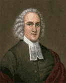

**EN** | [PL](README.pl.md)

# The Works of Jonathan Edwards



This project creates searchable Markdown files from locally archived
[WJE Online](http://edwards.yale.edu/research/browse) pages for the 73 volumes
of *The Works of Jonathan Edwards*. For volumes 17–73, the controlled import
tool uses Microsoft Edge through Playwright/CDP, saves the rendered DOM and
resources observed in the same browser session, and requires no macOS
Accessibility permission. Direct HTTP downloads, APIs, MHTML, and editing the
saved HTML are not allowed; conversion remains entirely local.

## Contents

- `HTML/VOLUMENN/` — unmodified, locally saved source pages. `000.html`
  contains the volume navigation and heading hierarchy.
- `MD/VOLUMENN.md` — the resulting Markdown text for a volume; volumes 1–9
  use a leading zero (for example, `MD/VOLUME01.md`).
- `assets/` — project graphics used by documentation.
- `scripts/html_volume_to_markdown.rb` — a converter that tolerates the
  archive's malformed HTML.
- `scripts/archive_yale_volume.mjs` — the only permitted importer for new
  Yale source pages; it uses the same Playwright/CDP browser mechanism as the
  code-architect preview and requires Microsoft Edge on macOS.
- `scripts/audit_volume_images.rb` and `scripts/archive_and_convert_volume.rb`
  — deterministic image selection and selective conversion for new volumes.
- `AGENTS.md` — the working procedure for subsequent volumes.

The output preserves source content, heading structure, footnotes, and page
numbers. Page numbers are intentionally stored as unobtrusive comments, for
example `<!-- p. 123 -->`, so that they remain searchable without disrupting
the document hierarchy. Images, site navigation, and footers are normally
omitted. When illustrations are essential, the optional `--include-images`
mode copies the locally saved content images to `MD/assets/VOLUMENN/` and uses
relative paths in the Markdown file.

## Creating a volume

For the full controlled import, resume, image-manifest, conversion, and
selective-verification procedure for volumes 17–73, follow `AGENTS.md`. Once
the unmodified source files are present in `HTML/VOLUMENN/`, conversion can be
run with:

```bash
ruby scripts/html_volume_to_markdown.rb HTML/VOLUMENN MD/VOLUMENN.md
```

For example, for the second volume:

```bash
ruby scripts/html_volume_to_markdown.rb HTML/VOLUME02 MD/VOLUME02.md
```

For a volume whose content images must be preserved:

```bash
ruby scripts/html_volume_to_markdown.rb --include-images HTML/VOLUMENN MD/VOLUMENN.md
ruby scripts/verify_volume_markdown.rb --include-images HTML/VOLUMENN MD/VOLUMENN.md
```

The converter reads local HTML only, identifies main content from the archive's
comments, derives heading levels from `000.html`, and creates unique Markdown
footnotes. Uniqueness matters because printed footnote numbering may restart in
different source fragments.

## Verification

After generating a volume, run at least:

```bash
ruby -c scripts/html_volume_to_markdown.rb
ruby scripts/verify_volume_markdown.rb HTML/VOLUMENN MD/VOLUMENN.md
git diff --check
```

The validator compares page markers, footnote references, and footnote
definitions with the local HTML, and reports headings from `000.html` that are
absent from the result. A gap in page numbering means the missing fragment
should be retried with the controlled importer and `--resume`; it must not be
reconstructed from memory or another edition.

## Capture status

| Volume | Title | Markdown file | Source status |
| --- | --- | --- | --- |
| 1 | *Freedom of the Will* | [MD/VOLUME01.md](MD/VOLUME01.md) | The saved content includes the complete hierarchy from `000.html`. Page markers 31, 136, and 149 are absent from the source; the document does not add them artificially. |
| 2 | *Religious Affections* | [MD/VOLUME02.md](MD/VOLUME02.md) | The saved content includes the complete hierarchy from `000.html`. Page markers 46, 76–77, 84, 125, and 440 are absent from the source; the document does not add them artificially. `007.html` lacks the archive's usual closing comment, so the converter uses a safe fallback end. |
| 3 | *Original Sin* | [MD/VOLUME03.md](MD/VOLUME03.md) | The saved content includes the complete hierarchy from `000.html`. Page markers 105–106, 220–222, 350–352, and 372–374 are absent from the source; the document does not add them artificially. `007.html` lacks the archive's usual closing comment, so the converter uses a safe fallback end. |
| 4 | *The Great Awakening* | [MD/VOLUME04.md](MD/VOLUME04.md) | The saved content includes the complete hierarchy from `000.html` and page markers 1–570 without gaps. |
| 5 | *Apocalyptic Writings* | [MD/VOLUME05.md](MD/VOLUME05.md) | The saved content includes the complete hierarchy from `000.html` and page markers 1–464 without gaps. The navigation notes that Edwards did not comment on Revelation 3 in the exposition. |
| 6 | *Scientific and Philosophical Writings* | [MD/VOLUME06.md](MD/VOLUME06.md) | The saved content includes the complete hierarchy from `000.html`. Page markers 1 and 144–146, 170–171, and 311 are absent from the source; the document does not add them artificially. The locally saved content images are preserved in `MD/assets/VOLUME06/`. |
| 7 | *The Life of David Brainerd* | [MD/VOLUME07.md](MD/VOLUME07.md) | The saved content includes the complete hierarchy from `000.html`, with page markers 1–590 and front-matter markers viii–x. |
| 8 | *Ethical Writings* | [MD/VOLUME08.md](MD/VOLUME08.md) | The saved content includes the complete hierarchy from `000.html`. Page markers 122–124, 127–128, 398–400, 403–404, 416–418, 455, 464–466, 507, 537–538, 628–630, 641–642, 651, 668, 672, 678, and 688 are absent from the source; the document does not add them artificially. |
| 9 | *A History of the Work of Redemption* | [MD/VOLUME09.md](MD/VOLUME09.md) | The saved content includes the complete hierarchy from `000.html`, with page markers 1–556 and front-matter markers vii–ix. Images are omitted. |
| 10 | *Sermons and Discourses 1720–1723* | [MD/VOLUME10.md](MD/VOLUME10.md) | The saved content includes the complete hierarchy from `000.html`. Page markers 2, 259–260, 578, and 644 are absent from the source; the document does not add them artificially. Two source diagrams are transcribed as Mermaid; only `jec-yje10-100.jpg` is retained as an image. |
| 11 | *Typological Writings* | [MD/VOLUME11.md](MD/VOLUME11.md) | The local capture includes source files `001.html`–`010.html`. Page markers 2, 36, 117, 144, 154, 156, and 190 are absent from the source; the document does not add them artificially. The manuscript-structure image on source page 004 is transcribed as Mermaid; all images are otherwise omitted. |
| 12 | *Ecclesiastical Writings* | [MD/VOLUME12.md](MD/VOLUME12.md) | The local capture includes source files `001.html`–`007.html`. Page markers 92, 164, 166, 350, 504, and 506 are absent from the source; the document does not add them artificially. Images are omitted. |
| 13 | *The "Miscellanies": (Entry Nos. a–z, aa–zz, 1–500)* | [MD/VOLUME13.md](MD/VOLUME13.md) | The local capture includes source files `001.html`–`005.html`. Page markers 110–112, 124, 151–152, 161–162, and 342–544 are absent from the source; the document does not add them artificially. Twenty-six valid local images are preserved in `MD/assets/VOLUME13/`; the figure on source page 002 was saved as HTML rather than an image and is omitted. |
| 14 | *Sermons and Discourses: 1723–1729* | [MD/VOLUME14.md](MD/VOLUME14.md) | The local capture includes source files `001.html`–`024.html`, with continuous Arabic page markers 1–550. Images are omitted. |
| 15 | *Notes on Scripture* | [MD/VOLUME15.md](MD/VOLUME15.md) | The local capture includes source files `001.html`–`003.html`. Page markers 17, 47, and 48 are absent from the source; the document does not add them artificially. Images are omitted. |
| 16 | *Letters and Personal Writings* | [MD/VOLUME16.md](MD/VOLUME16.md) | The local capture includes source files `001.html`–`075.html`. Arabic page markers 3–837 are present except 28–29, 32, 34, 39, 71, 85, 88, 101, 111, 134, 143–144, 148, 152, 173, 199, 224, 255, 259, 266, 282, 296, 394, 436, 449, 485, 512, 739–740, and 805–806; the document does not add them artificially. Images are omitted. |
| 17 | *Sermons and Discourses, 1730–1733* | [MD/VOLUME17.md](MD/VOLUME17.md) | The browser capture includes `000.html`, 21 top-level navigation entries, and source files `001.html`–`022.html` (`Contents` is archived separately from the 21 `navlevel1` entries). Front-matter markers vii–xii and Arabic page markers 1–458 are continuous. `022.html` lacks the archive's usual closing comment, so the converter uses the captured footer as a safe end; no content gap is visible. The image audit found 50 candidates: 47 non-content images and 3 uncertain content images (`003:archive`, `003:archive(1)`, and `012:archive(1)`); none are classified `include`, so no images are embedded or copied. |

Markdown documents contain only content present in the local capture.
