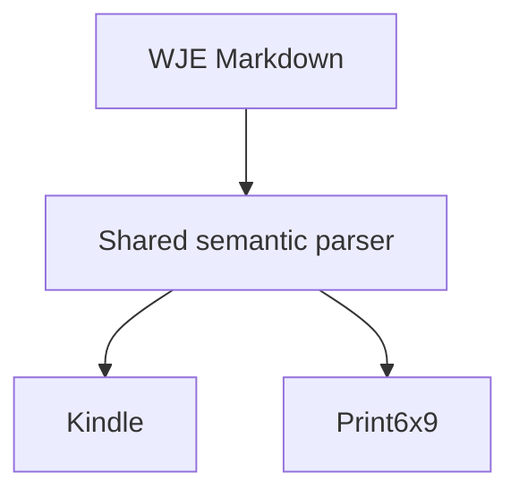

# A Representative WJE Volume

## Front Matter

<!-- p. vii -->

This controlled fixture contains *emphasis*, **strong emphasis**, Unicode — Ω, and a scholarly note.[^001-note1]

### Note to the Reader

> A short quotation demonstrates the named quotation style and a comfortably reflowable measure.

- A genuine bullet remains easy to read.
- A second item verifies consistent list rhythm.

## First Discourse

<!-- p. 1 -->

The first discourse begins with enough prose to expose spacing, indentation, justification, and page geometry in rendered output. The document must remain readable without direct formatting or a dependency on Word defaults.

| Term | Meaning |
| --- | --- |
| Grace | A concise value for table rendering |
| Faith | Another value with sufficient text to wrap naturally |

#### A Deeper Heading

* * *

The final paragraph confirms that the scene separator and deeper hierarchy do not disturb the body style.

[^001-note1]: This is a true Word footnote generated from Markdown and verified structurally.
